# Zuno Architecture Visual Atlas Source

updated: 2026-07-11  
status: normative-target-visual-source  
text_design_source: `docs/architecture/architecture.md`

本文件只维护 HTML Architecture Atlas 所需的 Mermaid 图。完整目标架构设计、模块职责、轻量实现边界和完成标准以 `architecture.md` 为准。

箭头规范：

```text
==>  command / control request
-->  data / result / state transfer
-.-> cross-cutting governance / observation / constraint
```

## 一、4+1 View Model

### Logical View (4+1)

#### Overall — Eleven Logical Capabilities

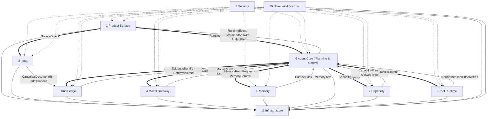

#### Local — Memory and Context Boundary

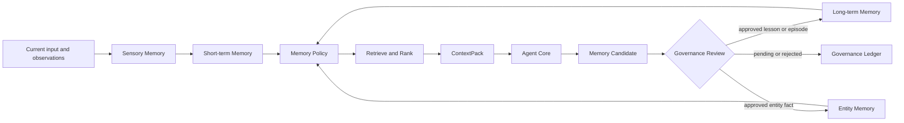

#### Local — Agent Core Capability Boundary

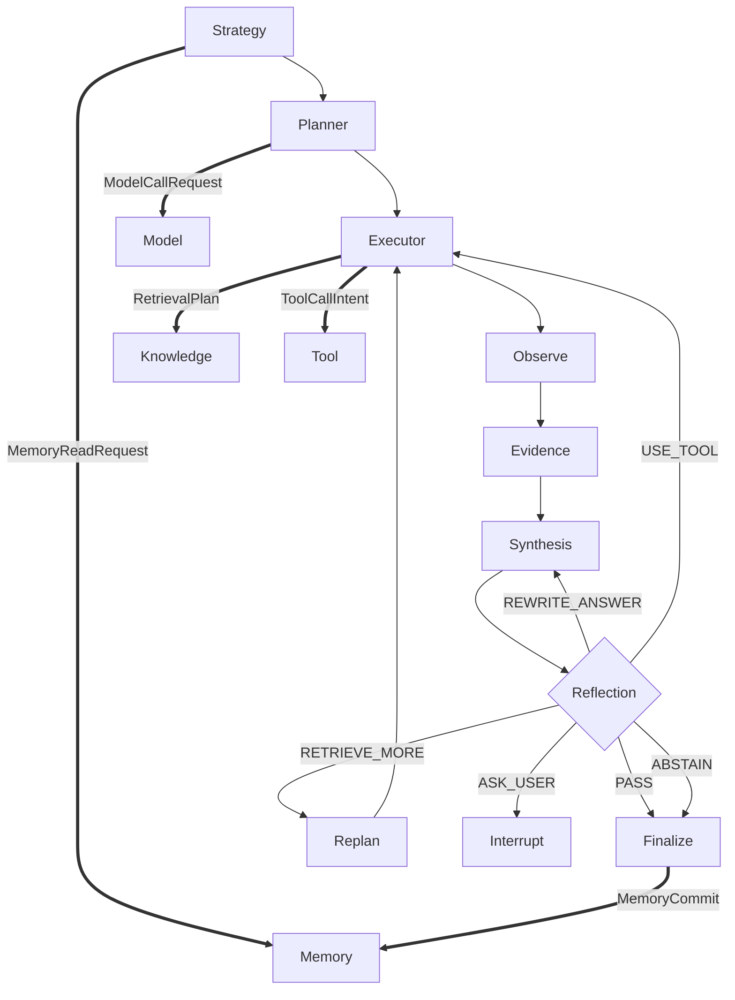

### Development View (4+1)

#### Overall — Repository Ownership and Dependency Direction

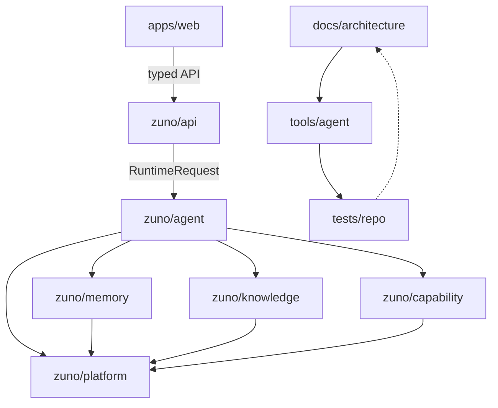

#### Local — Runtime Package Dependency Rule

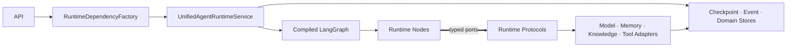

#### Local — Architecture Source Generation Chain

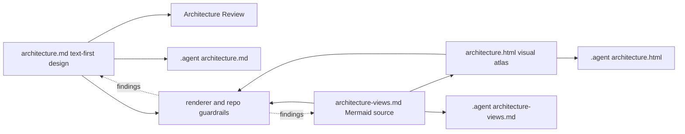

### Process View (4+1)

#### Overall — Unified LangGraph Runtime

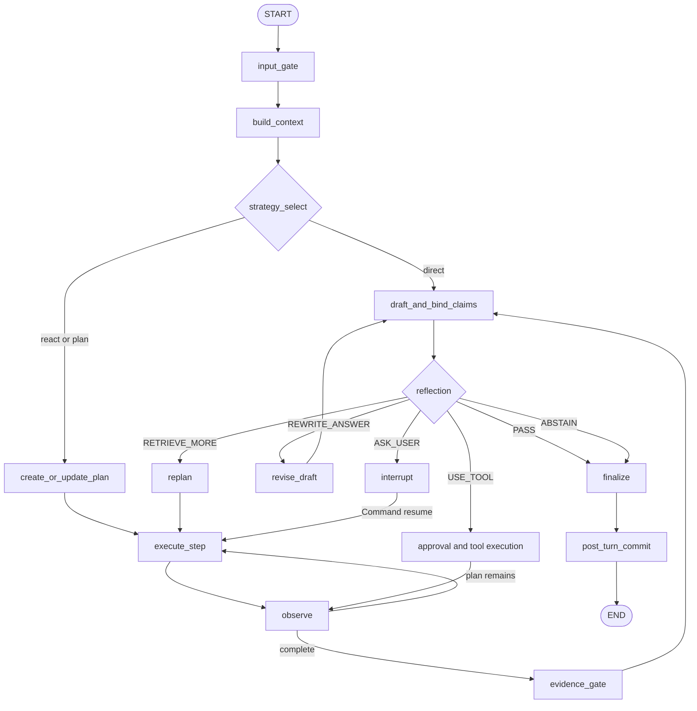

#### Local — Single-step ReAct

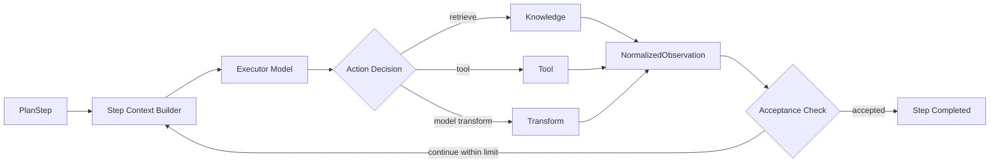

#### Local — Interrupt, Approval and Resume

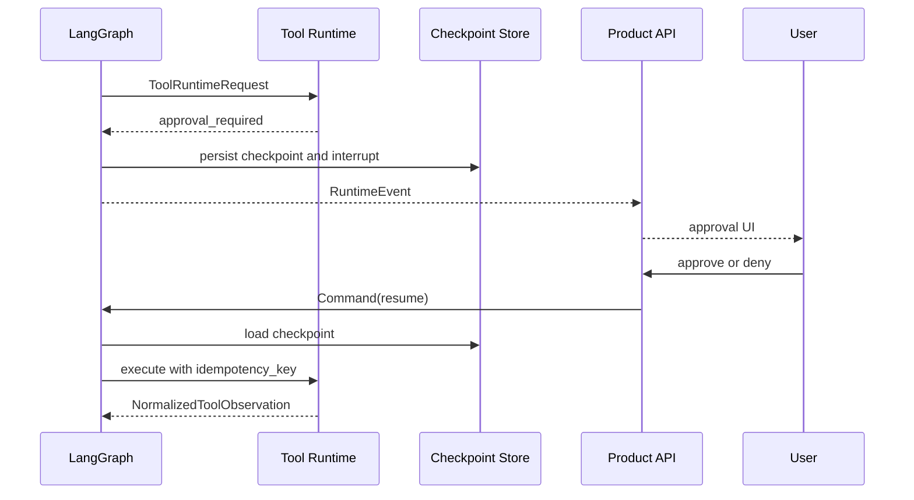

### Physical View (4+1)

#### Overall — Lean Local-first Deployment

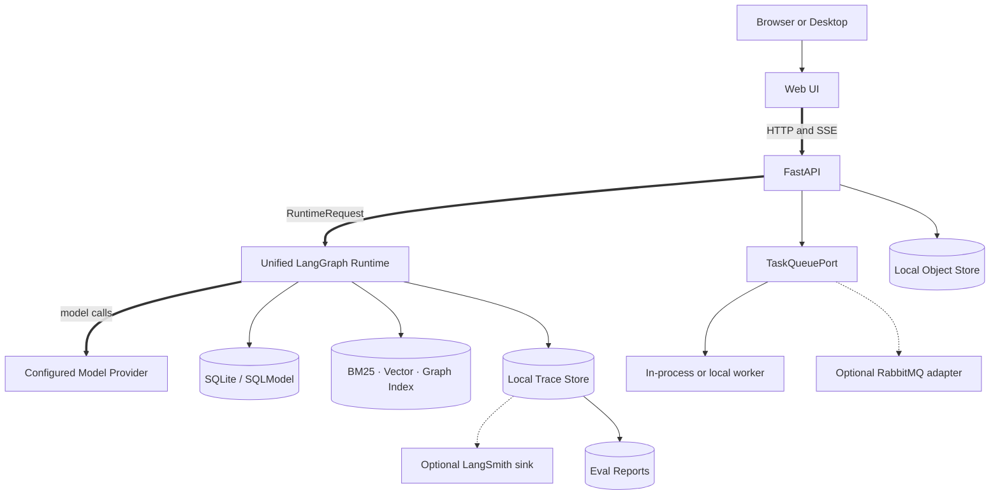

#### Local — Durable Storage and Recovery

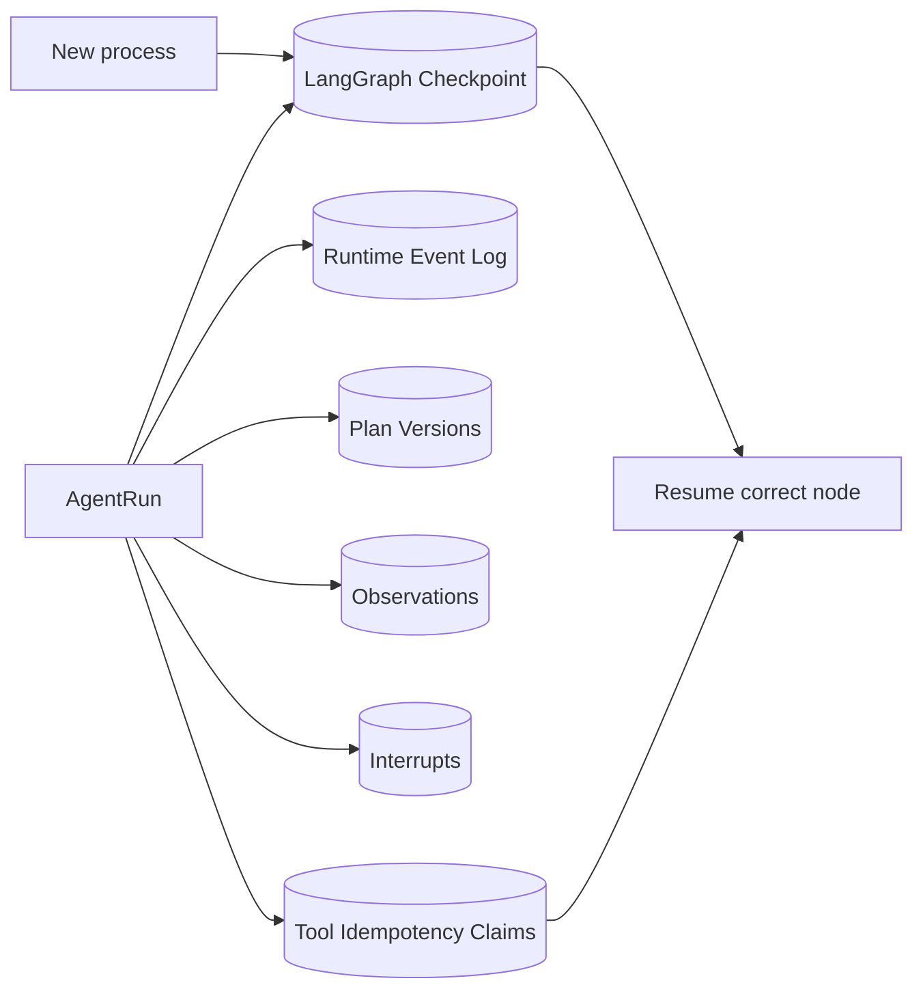

#### Local — Model Connectivity

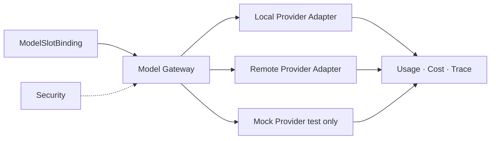

### Scenarios View (4+1)

#### Overall — Product Lifecycles

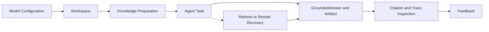

#### Local — Document Preparation Scenario

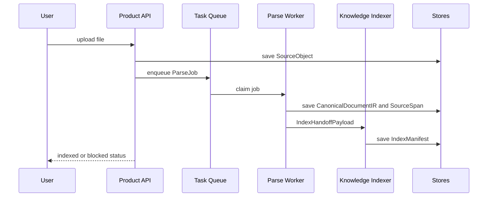

#### Local — Agent Task and Feedback

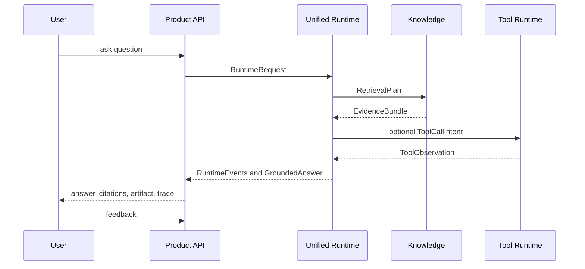

## 二、Views & Beyond

### Module View (Views & Beyond)

#### Overall — Eleven Modules to Six Runtime Domains

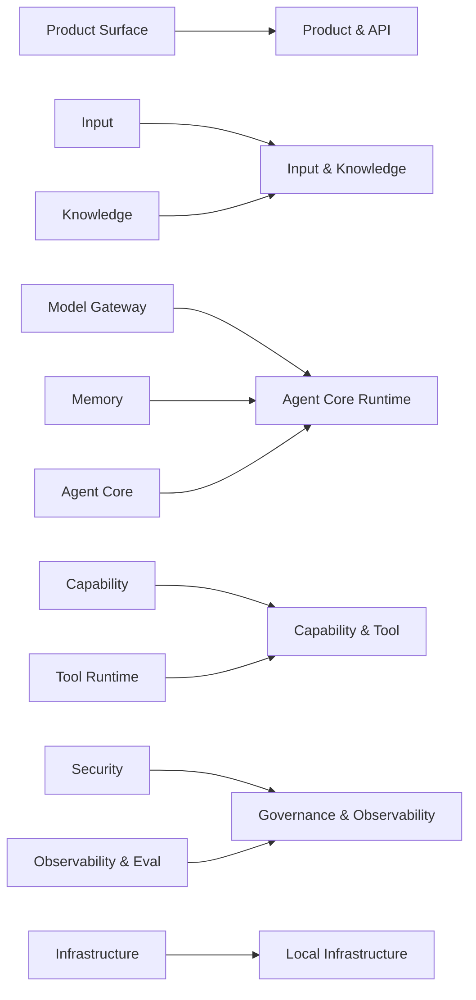

#### Local — Agent Core Module

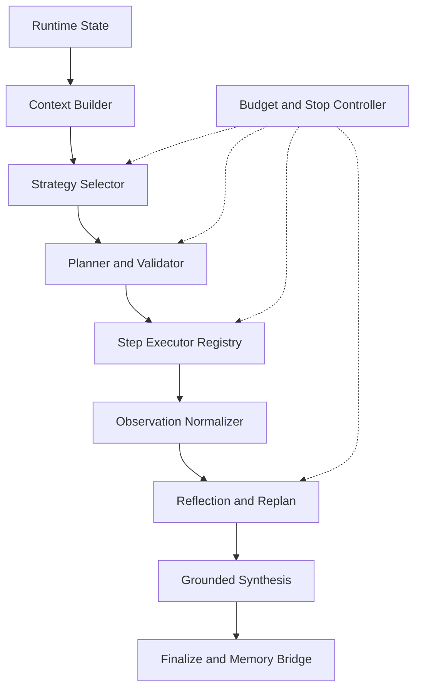

#### Local — Knowledge Module

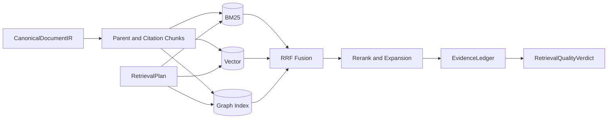

### Component-and-Connector View (Views & Beyond)

#### Overall — Runtime Components and Contracts

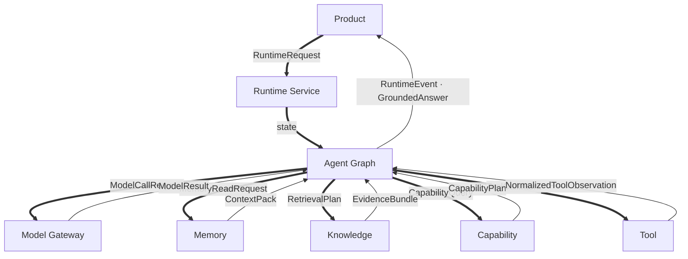

#### Local — Model and Memory Connectors

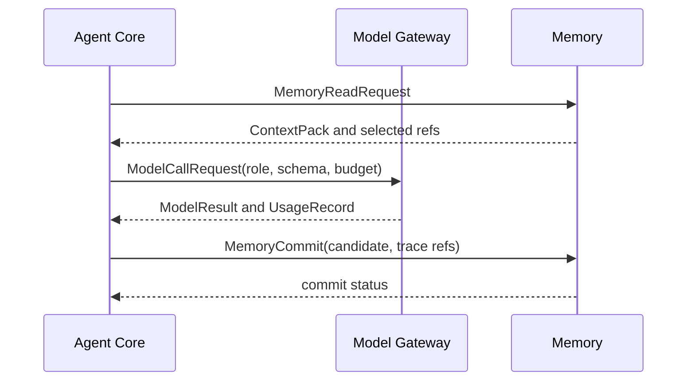

#### Local — Knowledge and Tool Connectors

```mermaid
sequenceDiagram
  participant A as Agent Core
  participant K as Knowledge
  participant C as Capability
  participant T as Tool Runtime
  A->>K: RetrievalPlan
  K-->>A: EvidenceBundle and RetrievalVerdict
  A->>C: CapabilityQuery
  C-->>A: CapabilityPlan and AllowedTools
  A->>T: ToolCallIntent
  T-->>A: approval_required or NormalizedToolObservation
```

### Data View (Views & Beyond)

#### Overall — Authoritative Data Ownership

```mermaid
flowchart TB
  Product[Workspace · Session · Task · Message] --> Run[AgentRun]
  Source[SourceObject · DocumentVersion] --> IR[DocumentIR · SourceSpan]
  IR --> Index[IndexManifest · CitationChunk]
  Run --> Plan[PlanVersion · Observation · Interrupt]
  Index --> Evidence[EvidenceLedger]
  Plan --> Answer[Claim · CitationBinding · GroundedAnswer]
  Evidence --> Answer
  Answer --> Artifact[Artifact · Feedback]
  Run --> Memory[MemoryCandidate · MemoryRecord · EntityFact]
  Run --> Trace[TraceSpan · Usage · EvalRun]
```

#### Local — Document and Citation Lineage

```mermaid
flowchart LR
  Source[SourceObject] --> Version[DocumentVersion]
  Version --> IR[CanonicalDocumentIR]
  IR --> Block[DocumentBlock]
  Block --> Span[SourceSpan]
  Block --> Chunk[CitationChunk]
  Chunk --> Index[IndexManifest]
  Index --> Evidence[EvidenceLedgerRecord]
  Evidence --> Binding[ClaimEvidenceBinding]
  Binding --> Citation[CitationView]
```

#### Local — Runtime and Memory Lifecycle

```mermaid
flowchart LR
  Request[RuntimeRequest] --> Run[AgentRun]
  Run --> Checkpoint[Checkpoint]
  Run --> Event[RuntimeEvent]
  Run --> Observation[NormalizedObservation]
  Run --> Final[GroundedAnswer]
  Final --> Raw[RawMemoryEvent]
  Raw --> Candidate[MemoryCandidate]
  Candidate --> Review[GovernanceRecord]
  Review -->|approved| Record[MemoryRecord]
  Record --> Context[Future ContextPack]
```

### Quality View (Views & Beyond)

#### Overall — Quality Attributes and Gates

```mermaid
flowchart TB
  Runtime[Agent Runtime]
  Security[Security]
  Grounding[Evidence and Citation]
  Recovery[Checkpoint and Idempotency]
  Observability[Trace and Diagnostics]
  Performance[Latency and Throughput]
  Cost[Budget and Usage]
  Privacy[Redaction and Memory Governance]
  Eval[Benchmark and Release Gate]
  Security -.-> Runtime
  Grounding -.-> Runtime
  Recovery -.-> Runtime
  Observability -.-> Runtime
  Performance -.-> Runtime
  Cost -.-> Runtime
  Privacy -.-> Runtime
  Eval -.-> Runtime
```

#### Local — Security and Observability Joint Chain

```mermaid
flowchart LR
  Input[Input Gate] --> Context[Memory and Model Context Gate]
  Context --> Retrieval[Retrieval Gate]
  Retrieval --> Tool[Tool Gate]
  Tool --> Output[Output Gate]
  Output --> Artifact[Artifact Gate]
  Input & Context & Retrieval & Tool & Output & Artifact --> Audit[(Audit Events)]
  Input & Context & Retrieval & Tool & Output & Artifact --> Trace[(Trace Spans)]
  Trace -.-> LangSmith[Optional LangSmith]
```

#### Local — Trace, Failure Buckets and Release Gate

```mermaid
flowchart LR
  Run[AgentRun] --> Spans[Span Tree]
  Spans --> Buckets[Failure Buckets]
  Spans --> Metrics[Recall · Correctness · Citation · Latency · Token · Cost]
  Buckets --> Diagnostics[Environment and Profile Completeness]
  Metrics --> Gate{Release Gate}
  Diagnostics --> Gate
  Gate -->|measured pass| Pass[quality proven]
  Gate -->|measured fail| Fail[quality failed]
  Gate -->|blocked| Blocked[quality not yet proven]
```

## 三、Zuno Product Core

### Agentic GraphRAG Evidence and Agent Loop (Zuno)

#### Overall — Agentic GraphRAG Pipeline

```mermaid
flowchart TB
  Question[Question and ContextPack] --> Need{Need Retrieval?}
  Need -->|yes| Strategy[Query Strategy]
  Strategy --> BM25[BM25]
  Strategy --> Vector[Vector]
  Strategy --> Graph[Graph Traversal]
  BM25 & Vector & Graph --> Fusion[RRF Fusion]
  Fusion --> Rerank[Rerank and Expansion]
  Rerank --> Ledger[EvidenceLedger]
  Ledger --> Quality{Retrieval Quality Gate}
  Quality -->|sufficient| Claims[Claim Extraction and Binding]
  Quality -->|insufficient| Correct[Corrective Action]
  Correct --> Strategy
  Claims --> Synthesis[Grounded Synthesis]
  Synthesis --> Reflect{Reflection}
  Reflect -->|PASS| Final[GroundedAnswer]
  Reflect -->|RETRIEVE_MORE| Correct
  Reflect -->|ABSTAIN| Abstain[Abstained Answer]
```

#### Local — Corrective Retrieval Loop

```mermaid
flowchart LR
  Round[Retrieval Round] --> Verdict{Quality Verdict}
  Verdict -->|doc miss| Rewrite[Rewrite or Multi Query]
  Verdict -->|text miss| HyDE[HyDE or Step-back]
  Verdict -->|entity miss| Entity[Entity Decomposition]
  Verdict -->|relation miss| Relation[Graph Relation Query]
  Verdict -->|contradiction| Diversify[Diversify Sources]
  Rewrite & HyDE & Entity & Relation & Diversify --> Next[Next RetrievalPlan]
  Next --> Round
  Verdict -->|sufficient| Stop[Stop Retrieval]
  Verdict -->|limits reached| Abstain[Abstain or Ask User]
```

#### Local — EvidenceLedger and Claim Binding

```mermaid
flowchart LR
  R1[Round 1 Evidence] --> Ledger[EvidenceLedger]
  R2[Round 2 Evidence] --> Ledger
  R3[Round 3 Evidence] --> Ledger
  Ledger --> Dedup[Deduplicate · Version Check · Contradiction]
  Dedup --> Claims[Structured Claims]
  Claims --> Binder[Claim-level Citation Binder]
  Dedup --> Binder
  Binder --> Supported[Supported Claims]
  Binder --> Unsupported[Unsupported Claims]
  Supported --> Answer[GroundedAnswer]
  Unsupported --> Reflection[Reflection: rewrite, retrieve more, abstain]
```
