# Zuno Architecture Visual Atlas Source

updated: 2026-07-14  
status: normative-target-visual-source  
text_design_source: `docs/architecture/architecture.md`

本文件是 `architecture.html` 的 Mermaid 渲染源，不是第二份文字总架构。模块领域细节以十一份正式模块文档为准。

箭头规范：`==>` 命令/控制，`-->` 数据/结果，`-.->` 横切约束/观测。

## 一、4+1 View Model

### Logical View (4+1)

#### Overall — Eleven Modules

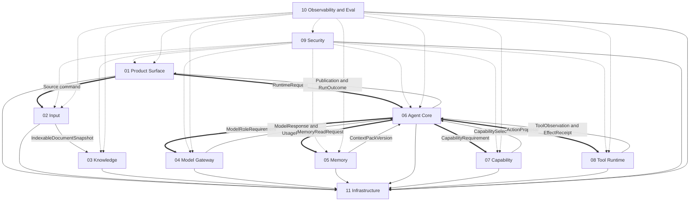

#### Local — Canonical Ownership

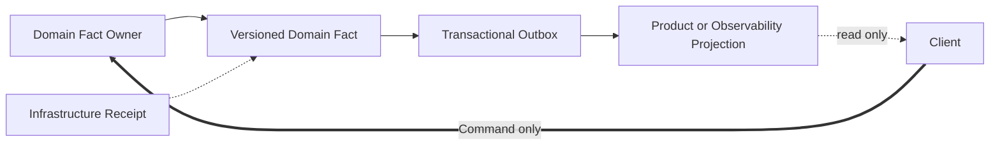

#### Local — Documentation Truth

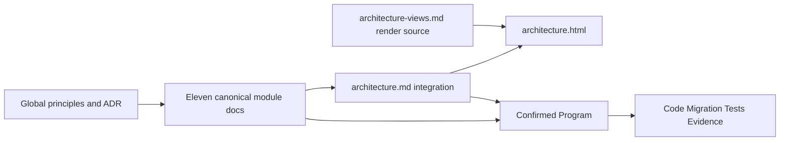

### Development View (4+1)

#### Overall — Repository Dependency

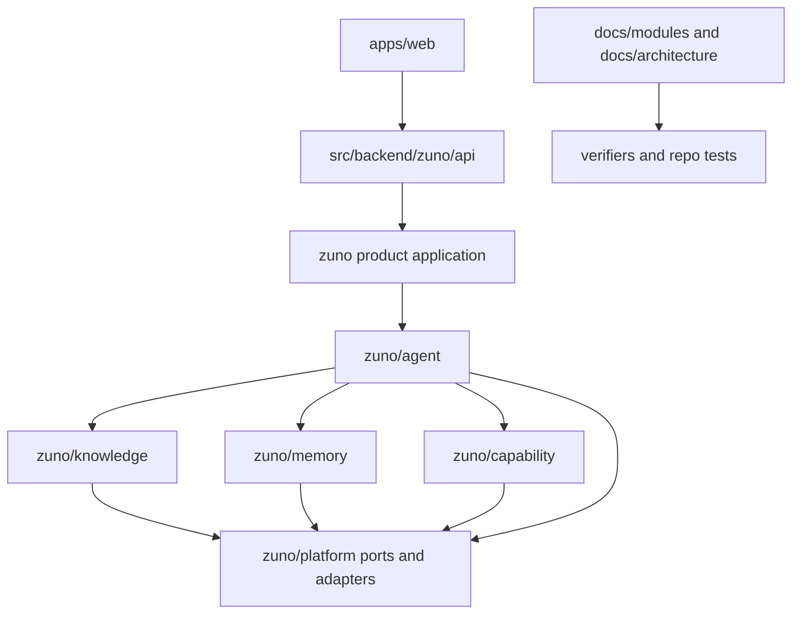

#### Local — Module Package Rule

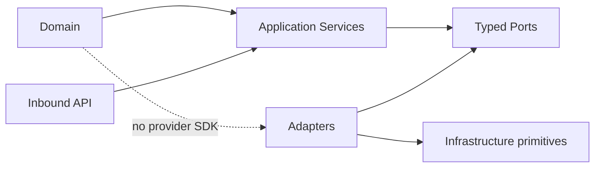

#### Local — Architecture Build Chain

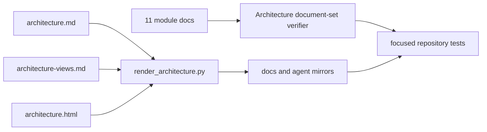

### Process View (4+1)

#### Overall — Agent Run

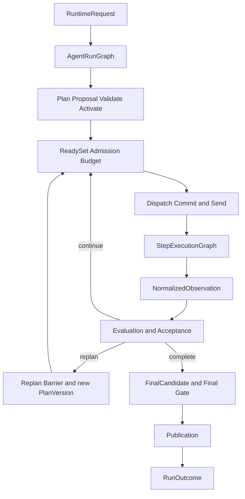

#### Local — Ingestion and Index

```mermaid
flowchart LR
  SRC[SourceObject] --> DV[DocumentVersion]
  DV --> PARSE[ParsePlan Job Attempt]
  PARSE --> IR[CanonicalDocumentIR and SourceSpan]
  IR --> QUALITY[Parser Quality Gate]
  QUALITY --> HAND[IndexableDocumentSnapshot]
  HAND --> BUILD[IndexWriteBatch]
  BUILD --> VIS[Write Visibility Verification]
  VIS --> ACCEPT[Knowledge Acceptance]
  ACCEPT --> CUT[IndexCutover and ServingWatermark]
```

#### Local — Tool Effect

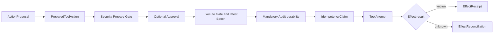

### Physical View (4+1)

#### Overall — Canonical Server Target

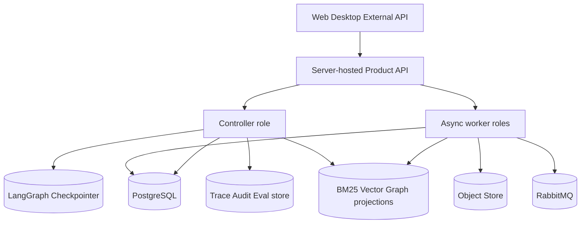

#### Local — Facts and Projections

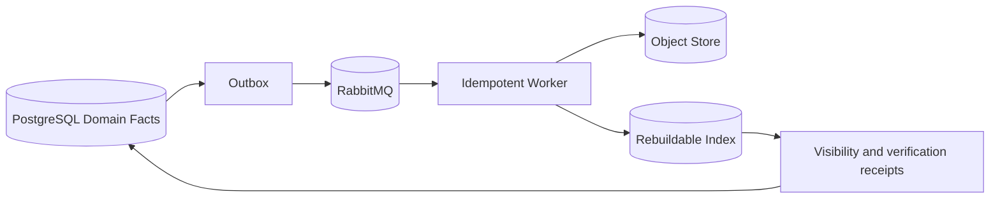

#### Local — Recovery

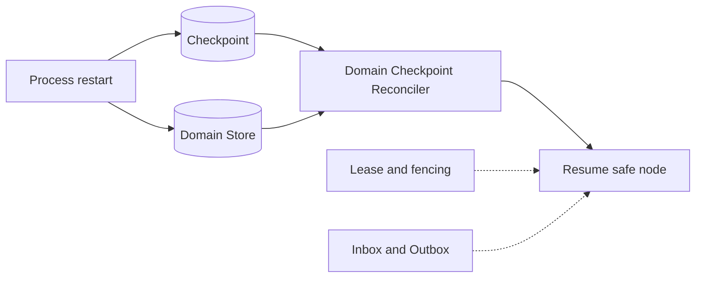

### Scenarios View (4+1)

#### Overall — Strict Grounded Answer

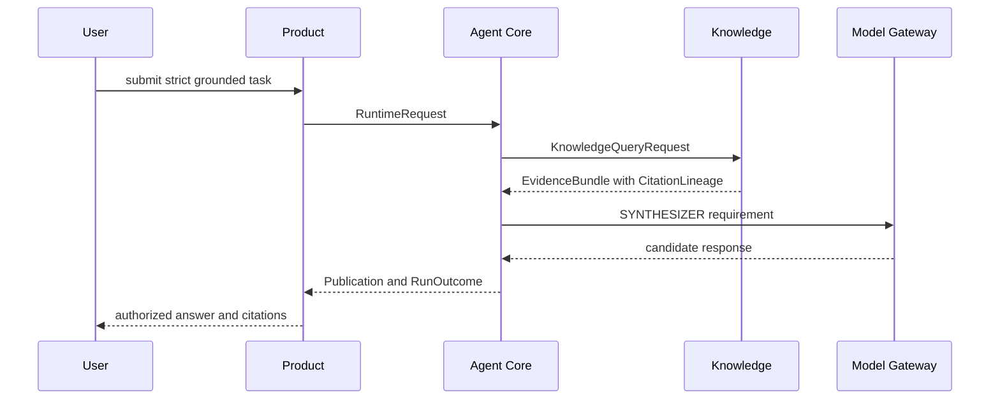

#### Local — Approval and Resume

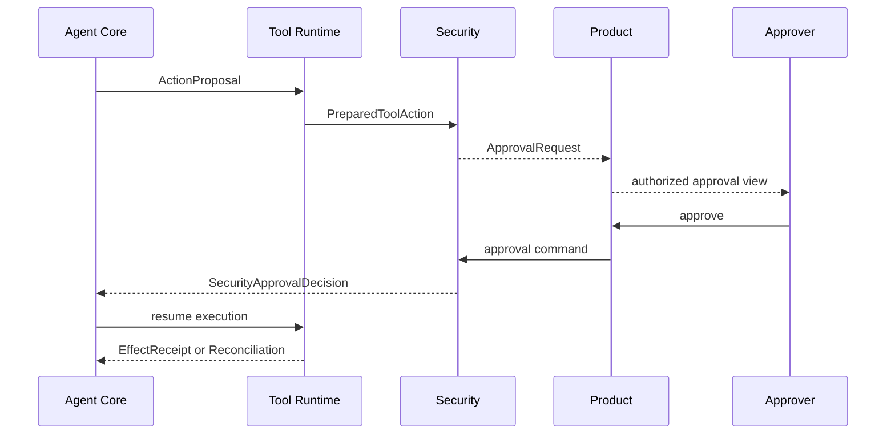

#### Local — Delete and Revoke

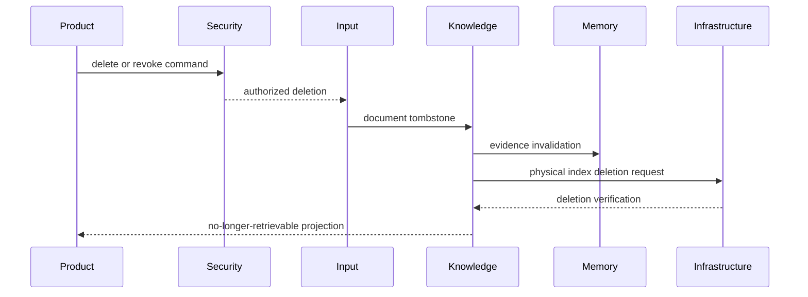

## 二、Views & Beyond

### Module View (Views & Beyond)

#### Overall — Eleven Modules to Six Runtime Domains

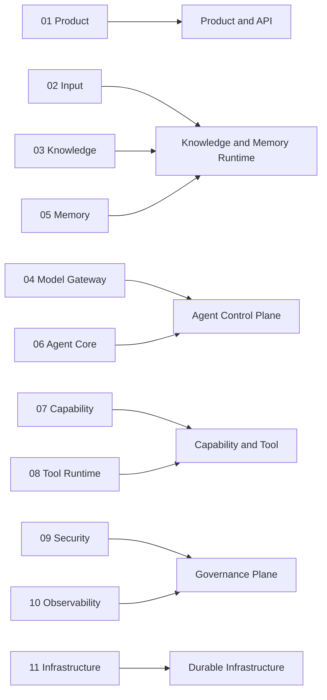

#### Local — Owns Consumes Produces

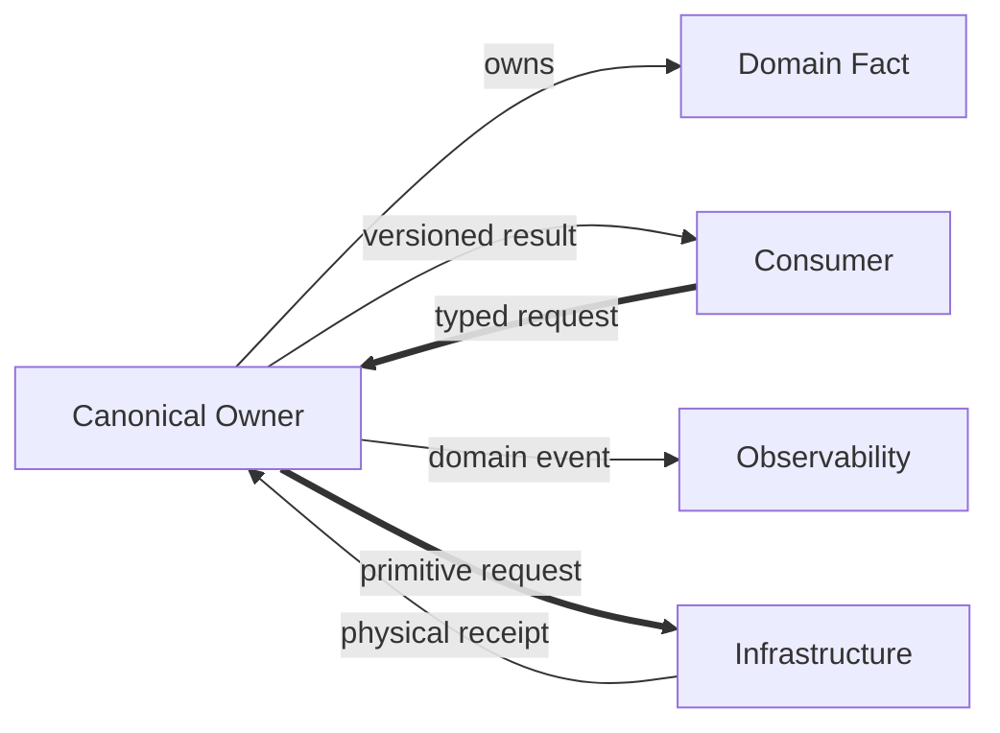

#### Local — Boundary Violation Guard

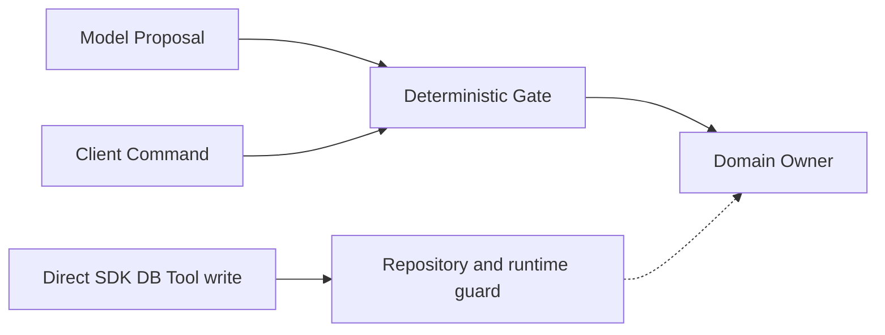

### Component-and-Connector View (Views & Beyond)

#### Overall — Commands Data and Observation

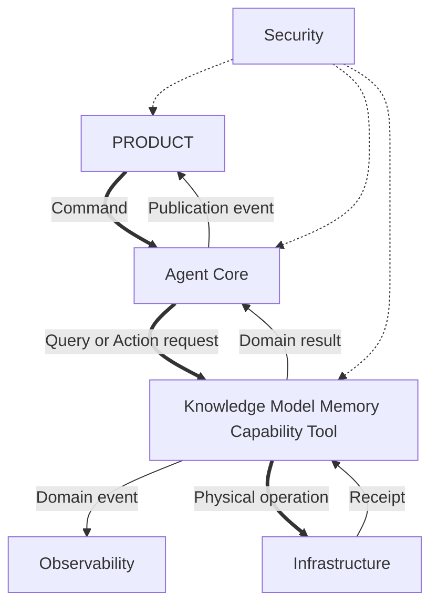

#### Local — CrossModuleEnvelope

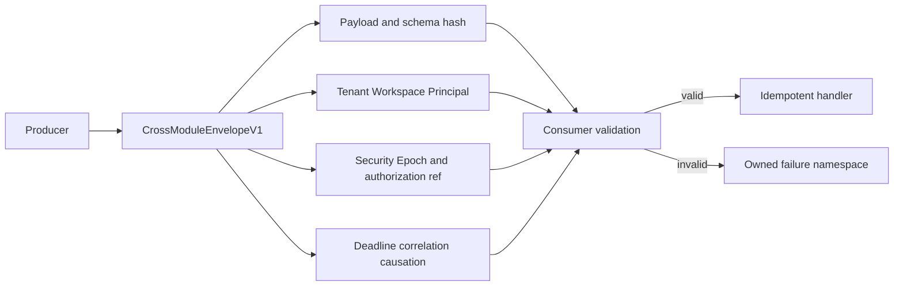

#### Local — Budget and Admission

```mermaid
flowchart LR
  NEED[Step or operation need] --> FEAS[Capability feasibility]
  FEAS --> SEC[Security compatibility]
  SEC --> BUDGET[Budget reservation]
  BUDGET --> CAPACITY[Capacity and quota]
  CAPACITY --> DISPATCH[Dispatch]
  DISPATCH --> SETTLE[Usage and budget settlement]
```

### Data View (Views & Beyond)

#### Overall — Authoritative Facts

```mermaid
flowchart TB
  PG[(PostgreSQL)] --> DOMAIN[Structured domain facts]
  OBJ[(Object Store)] --> LARGE[Large immutable payloads]
  CHECK[(Checkpointer)] --> CONTROL[Graph control state]
  DOMAIN --> BM25[(BM25)]
  DOMAIN --> VECTOR[(Vector)]
  DOMAIN --> GRAPH[(Graph)]
  DOMAIN --> PROJ[Product and Observability projections]
  LARGE --> BM25 & VECTOR & GRAPH
  CONTROL -.-> DOMAIN
```

#### Local — Knowledge Version Publication

```mermaid
flowchart LR
  SPEC[IndexSpec] --> BATCH[IndexWriteBatch]
  BATCH --> WR[IndexWriteReceipt]
  WR --> VR[VisibilityReceipt]
  VR --> VERIFY[IndexVerification]
  VERIFY --> MAN[IndexManifest]
  MAN --> ACCEPT[Domain Acceptance]
  ACCEPT --> CUT[IndexCutover]
  CUT --> WATER[ServingWatermark]
```

#### Local — Version Pinning

```mermaid
flowchart LR
  RUN[AgentRun] --> KS[KnowledgeSnapshot]
  RUN --> MS[MemorySnapshot]
  RUN --> MB[Model config bundle]
  RUN --> SP[Security Policy and Epoch]
  RUN --> RB[Runtime bundle]
  KS & MS & MB & SP & RB --> HASH[ExecutionContextSnapshot hash]
```

### Quality View (Views & Beyond)

#### Overall — Requirement to Evidence

```mermaid
flowchart LR
  REQ[ARCH Requirement] --> CONTROL[Runtime or repository control]
  CONTROL --> UT[Unit Contract]
  CONTROL --> IT[Integration]
  CONTROL --> FT[Fault Injection]
  CONTROL --> E2E[E2E]
  UT & IT & FT & E2E --> EVID[Evidence Registry]
  EVID --> GATE[ReleaseGateEvaluation]
```

#### Local — Quality Status

```mermaid
stateDiagram-v2
  [*] --> PREPARED
  PREPARED --> RUNTIME_OBSERVED
  RUNTIME_OBSERVED --> MEASURED
  PREPARED --> BLOCKED
  RUNTIME_OBSERVED --> BLOCKED
  MEASURED --> QUALITY_PROVEN
  BLOCKED --> MEASURED
  QUALITY_PROVEN --> [*]
```

#### Local — Quality Cost Safety Gate

```mermaid
flowchart LR
  Q[Quality metrics] --> G[Release Gate]
  C[Cost and latency] --> G
  S[Security and privacy] --> G
  R[Reliability and recovery] --> G
  G -->|all constraints pass| PASS[Eligible]
  G -->|any hard constraint fails| BLOCK[Blocked]
```

## 三、Zuno Product Core

### Agentic GraphRAG Evidence and Agent Loop (Zuno)

#### Overall — Outer and Inner Control Loops

```mermaid
flowchart TB
  TASK[TaskContract] --> PLAN[Agent Core Plan]
  PLAN --> KR[KnowledgeRetrievalGraph]
  KR --> STRAT[RetrievalPlan]
  STRAT --> RET[Parallel retrievers]
  RET --> LEDGER[EvidenceLedger and EvidenceFrontier]
  LEDGER --> QUALITY[RetrievalQualityVerdict]
  QUALITY -->|correct| STRAT
  QUALITY -->|sufficient| BUNDLE[SelectedEvidenceBundle]
  QUALITY -->|task change needed| PROP[KnowledgeControlProposal]
  BUNDLE --> ACCEPT[Step Acceptance]
  PROP --> PLAN
  ACCEPT --> FINAL[Final Gate and Publication]
```

#### Local — Evidence Lineage

```mermaid
flowchart LR
  DOC[DocumentVersion] --> SPAN[SourceSpan]
  SPAN --> CHUNK[CitationChunk]
  CHUNK --> EDGE[Entity Relation Community Evidence]
  EDGE --> ROUND[RetrievalRound]
  ROUND --> LEDGER[EvidenceLedger]
  LEDGER --> CLAIM[Claim Evidence Binding]
  CLAIM --> CITATION[Citation]
  CITATION --> ANSWER[GroundedAnswer Publication]
```

#### Local — Corrective Retrieval and Replan

```mermaid
flowchart LR
  GAP[Evidence gap] --> CLASS{Failure class}
  CLASS -->|query issue| REWRITE[Query rewrite or expansion]
  CLASS -->|path issue| ROUTE[Graph text structured route]
  CLASS -->|index issue| RECOVER[Index recovery]
  CLASS -->|task assumption invalid| REPLAN[Agent Replan]
  CLASS -->|no safe path| ABSTAIN[Abstain]
  REWRITE & ROUTE --> NEXT[Next RetrievalRound]
```
