# Zuno Architecture Visual Atlas Source

updated: 2026-07-14
status: normative-target-visual-source
text_design_source: `docs/architecture/architecture.md`
canonical_domain_sources: `docs/modules/01-*.md` through `docs/modules/11-*.md`

本文件只提供说明性 Mermaid。领域 Contract、状态、Failure、持久化和测试以十一份模块文档为准；跨模块关系以 `architecture.md` 为准；本图源和 HTML 优先级最低。

箭头规范：`==>` 命令/控制，`-->` 数据/结果，`-.->` 横切约束/观测。

## 一、4+1 View Model

### Logical View (4+1)

#### Overall — Eleven Modules and Canonical Owners

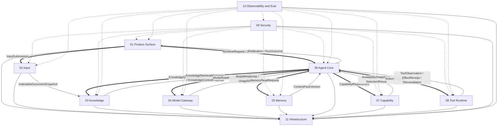

#### Local — Agent Core Control Stack

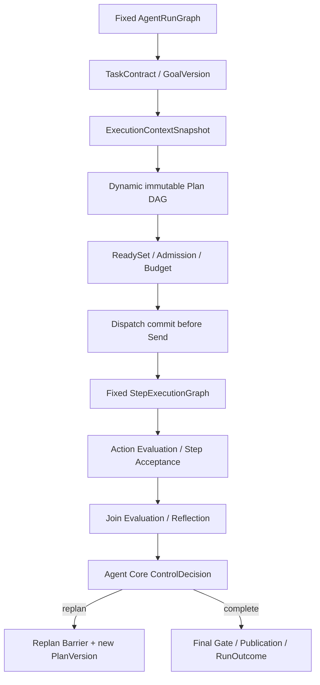

#### Local — Evidence Memory and Publication Boundaries

```mermaid
flowchart LR
  SOURCE[DocumentVersion / SourceSpan] --> EVID[Knowledge Evidence / CitationLineage]
  EVID --> CONTEXT[Memory ContextPackVersion]
  CONTEXT --> CORE[Agent Core Step / Final Synthesis]
  CORE --> CAND[FinalCandidate]
  CAND --> GATE[Final Gate]
  GATE --> PUB[Agent Core Publication]
  PUB --> VIEW[Product authorized Projection]
  VIEW --> DELIVERY[ChannelDelivery / ClientRender / UserRead]
```

### Development View (4+1)

#### Overall — Repository Ownership and Dependency

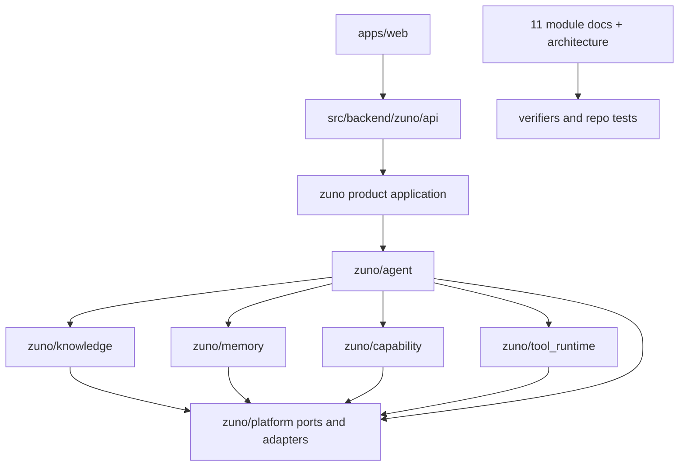

#### Local — Module Package Rule

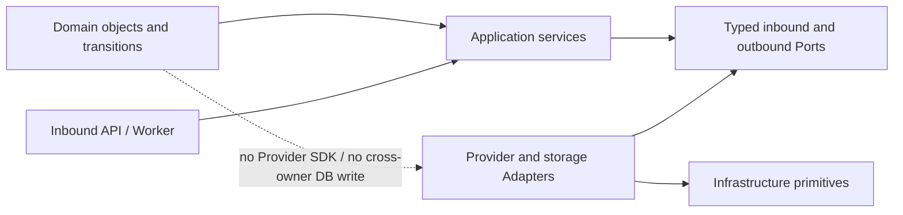

#### Local — Architecture Fact Source and Build Chain

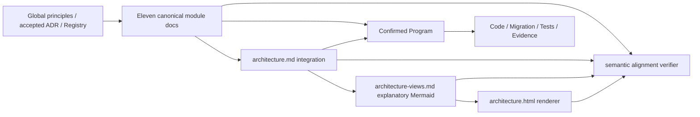

### Process View (4+1)

#### Overall — AgentRunGraph Controller Loop

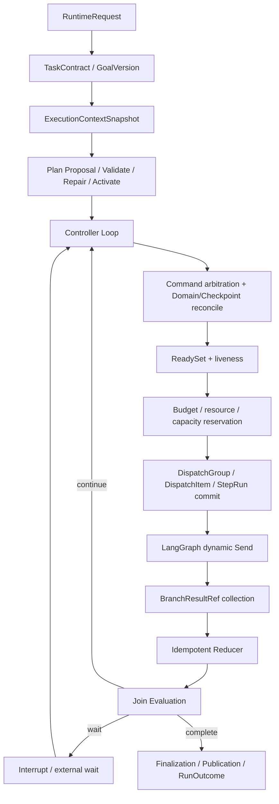

#### Local — Dispatch Commit Send Join and Replan

```mermaid
flowchart LR
  ACTIVE[Active PlanVersion] --> READY[Ready Step]
  READY --> CHECK[Dependency / input / security / capability / budget / conflict]
  CHECK --> TX[Transaction: DispatchGroup + Item + StepRun + reservations]
  TX --> EVENT[DispatchCommittedEvent]
  EVENT --> SEND[Send worker]
  SEND --> RESULT[Immutable BranchResultRef]
  RESULT --> GUARD[PlanVersion / epoch / fencing / hash guard]
  GUARD --> JOIN[JoinPolicy + Join Evaluation]
  JOIN -->|assumption invalid| BARRIER[Replan Barrier]
  BARRIER --> NEW[Validate and activate new PlanVersion]
```

#### Local — StepExecutionGraph and External Effect

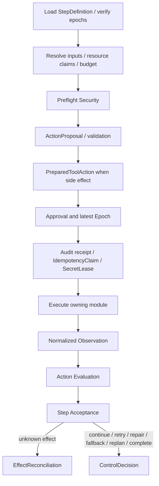

### Physical View (4+1)

#### Overall — Canonical Server Target

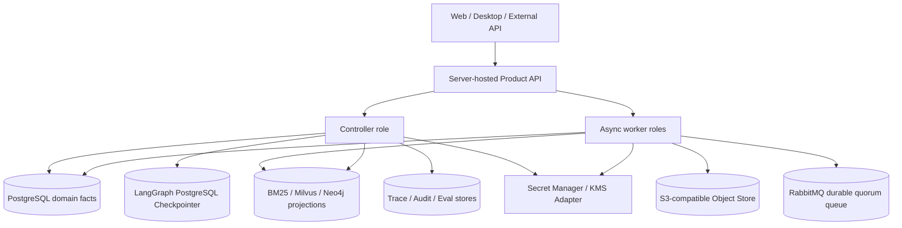

#### Local — Domain Facts Checkpoint and Projections

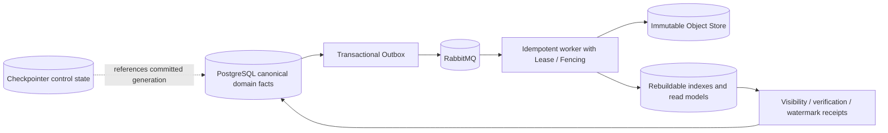

#### Local — Recovery Reconciliation and Fencing

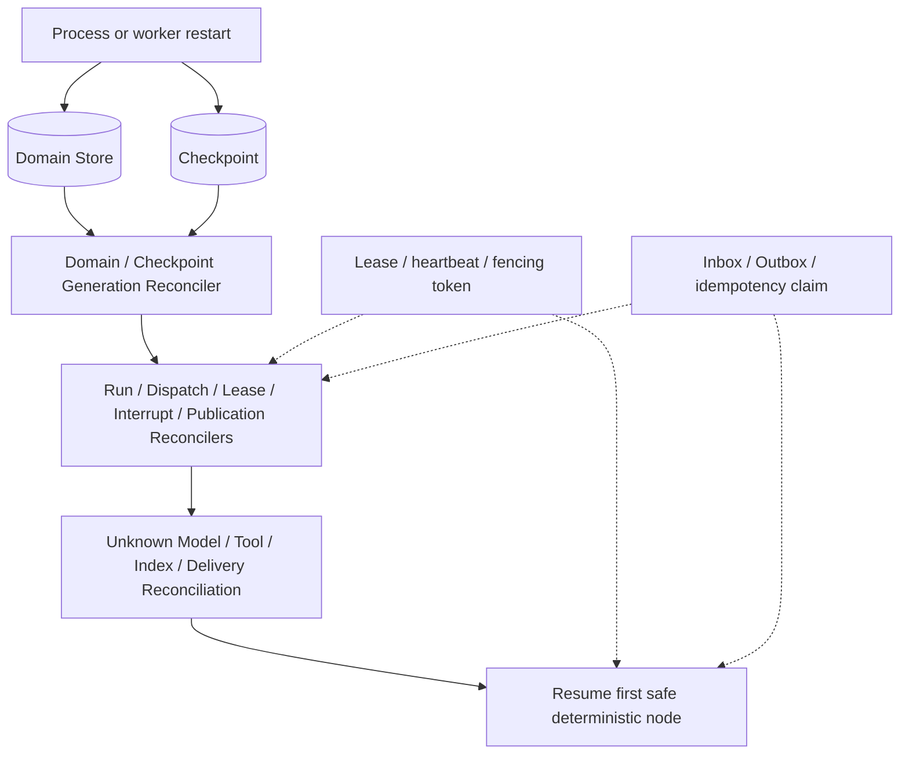

### Scenarios View (4+1)

#### Overall — Strict Grounded Answer

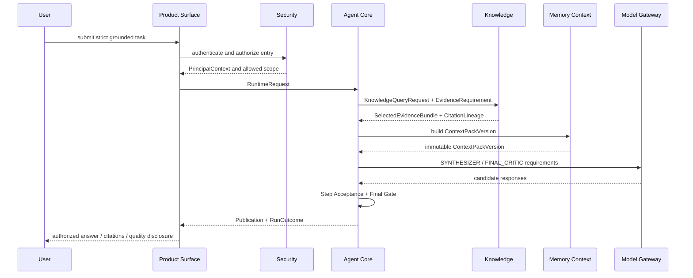

#### Local — Approval Interrupt Resume and Effect Reconciliation

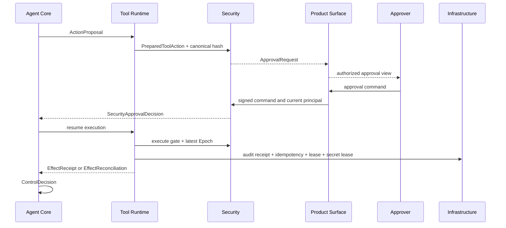

#### Local — Ingestion Publication Deletion and Revoke

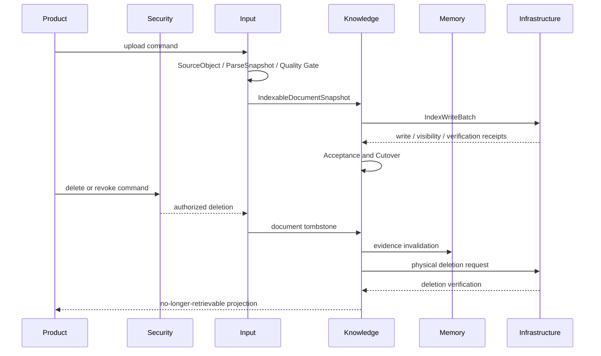

## 二、Views & Beyond

### Module View (Views & Beyond)

#### Overall — Eleven Modules to Six Runtime Domains

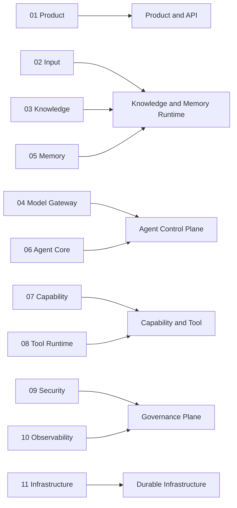

#### Local — Owns Consumes Produces

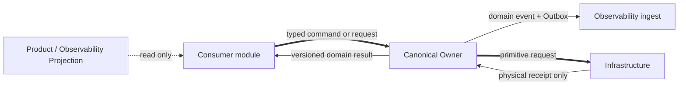

#### Local — Model Proposal and Deterministic Gates

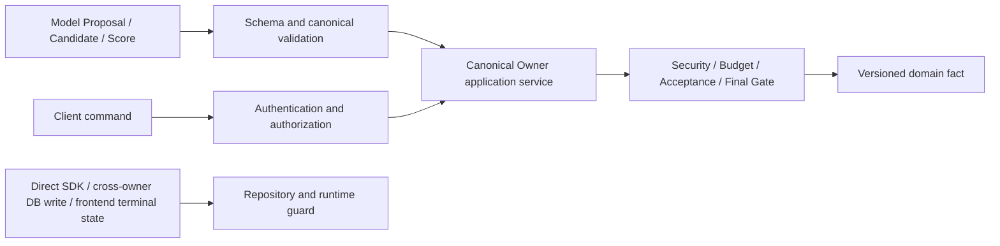

### Component-and-Connector View (Views & Beyond)

#### Overall — Commands Results Events and Receipts

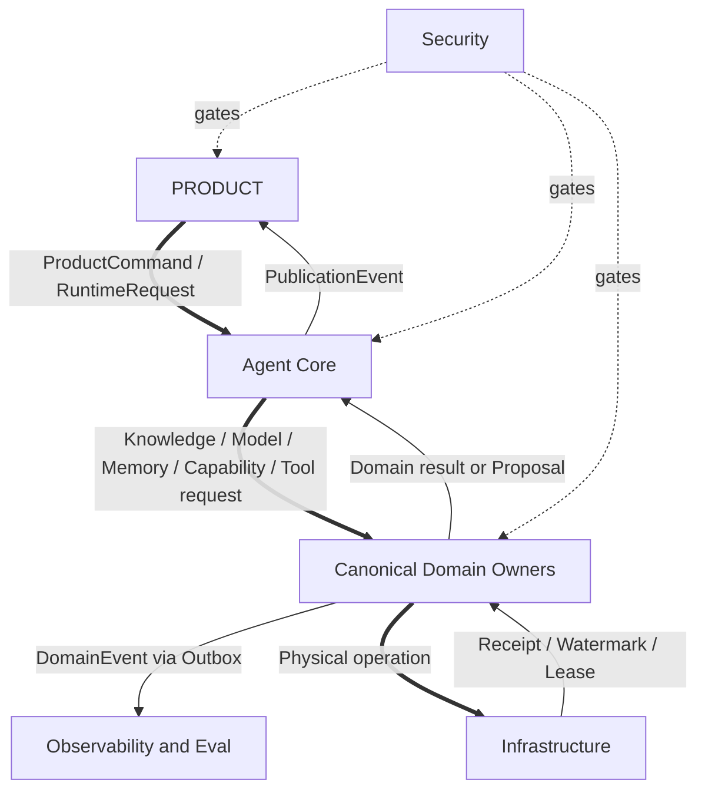

#### Local — CrossModuleEnvelope Validation

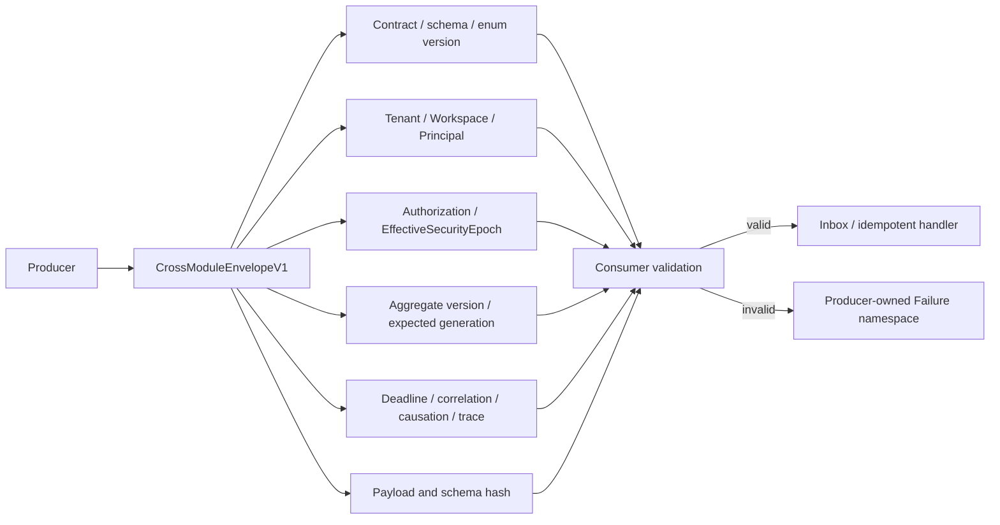

#### Local — Capability Selection to Tool Execution

```mermaid
flowchart LR
  STEP[Step Requirement] --> SKILL[Skill discovery and progressive loading]
  SKILL --> AVAIL[CapabilityAvailabilitySnapshot]
  AVAIL --> SELECT[CapabilitySelectionResult]
  SELECT --> FEAS[Agent Core StepFeasibilityDecision]
  FEAS --> ACTION[ActionProposal with exact versions]
  ACTION --> TOOL[Tool Runtime PreparedToolAction]
  TOOL --> GATES[Security / Approval / Audit / Idempotency]
  GATES --> ATTEMPT[ToolAttempt]
  ATTEMPT --> EFFECT[EffectReceipt or EffectReconciliation]
```

### Data View (Views & Beyond)

#### Overall — Authoritative Facts and Rebuildable Projections

```mermaid
flowchart TB
  PG[(PostgreSQL)] --> DOMAIN[Structured canonical domain facts]
  OBJ[(Object Store)] --> LARGE[Large immutable payloads]
  CHECK[(LangGraph Checkpointer)] --> CONTROL[Graph control state]
  DOMAIN --> BM25[(BM25 projection)]
  DOMAIN --> VECTOR[(Vector projection)]
  DOMAIN --> GRAPH[(Graph projection)]
  DOMAIN --> PRODUCT[Product read models]
  DOMAIN --> OBS[Trace / Metric / Eval projections]
  LARGE --> BM25 & VECTOR & GRAPH
  CONTROL -. references .-> DOMAIN
```

#### Local — Knowledge and Memory Version Publication

```mermaid
flowchart LR
  SPEC[Knowledge IndexSpec or Memory ProjectionSpec] --> BATCH[IndexWriteBatch]
  BATCH --> WR[IndexWriteReceipt]
  WR --> VR[WriteVisibilityReceipt]
  VR --> VERIFY[IndexVerification]
  VERIFY --> MAN[Domain IndexManifest]
  MAN --> ACCEPT[Knowledge or Memory Acceptance]
  ACCEPT --> CUT[CAS IndexCutover]
  CUT --> WATER[ServingWatermark / active Snapshot]
```

#### Local — ExecutionContextSnapshot and Version Pinning

```mermaid
flowchart TB
  RUN[AgentRun] --> GOAL[GoalVersion]
  RUN --> PLAN[PlanVersion]
  RUN --> KS[KnowledgeSnapshot]
  RUN --> MS[MemorySnapshot]
  RUN --> MODEL[Model routing and prompt bundle]
  RUN --> CAP[CapabilityAvailabilitySnapshot / exact versions]
  RUN --> SEC[Security Policy / EffectiveSecurityEpoch]
  RUN --> RUNTIME[GraphBundle / RuntimePolicy / AnswerPolicy]
  GOAL & PLAN & KS & MS & MODEL & CAP & SEC & RUNTIME --> HASH[ExecutionContextSnapshot hash]
```

### Quality View (Views & Beyond)

#### Overall — Telemetry Audit Eval and Evidence Pipeline

```mermaid
flowchart LR
  OWNER[Domain transaction] --> OUTBOX[Transactional Outbox]
  OUTBOX --> ENV[TelemetryEnvelopeV1]
  ENV --> GUARD[Schema / Scope / Epoch / Redaction / Hash]
  GUARD --> INGEST[Append-only Ingest]
  INGEST --> TRACE[Trace Metric Log Projections]
  INGEST --> AUDIT[Accepted immutable AuditEvent]
  INGEST --> EVID[Evidence Registry]
  TRACE & EVID --> EVAL[EvalRun / MetricAttempt / Judge]
  EVAL --> BENCH[BenchmarkComparison]
  BENCH --> GATE[ReleaseGateEvaluation]
```

#### Local — Measurement and Release Gate States

```mermaid
stateDiagram-v2
  [*] --> PREPARED
  PREPARED --> RUNTIME_OBSERVED
  RUNTIME_OBSERVED --> MEASURED
  PREPARED --> BLOCKED
  PREPARED --> UNAVAILABLE
  RUNTIME_OBSERVED --> BLOCKED
  RUNTIME_OBSERVED --> UNAVAILABLE
  BLOCKED --> MEASURED
  UNAVAILABLE --> MEASURED
  MEASURED --> QUALITY_PROVEN
  state ReleaseGate {
    [*] --> PASSED
    [*] --> FAILED
    [*] --> BLOCKED_GATE
    [*] --> INCOMPARABLE
    [*] --> ERROR
  }
```

#### Local — Requirement Test Evidence and Release Gate

```mermaid
flowchart LR
  REQ[ARCH Requirement] --> CONTROL[Runtime or repository Control]
  CONTROL --> UNIT[Unit / Contract]
  CONTROL --> INT[Integration]
  CONTROL --> FAULT[Fault Injection]
  CONTROL --> E2E[E2E]
  CONTROL --> EVAL[Eval]
  UNIT & INT & FAULT & E2E & EVAL --> EVID[EvidenceRecord]
  EVID --> GATE[ReleaseGateEvaluation]
  GATE -->|hard constraints pass| ELIGIBLE[Eligible]
  GATE -->|failed blocked unavailable incomparable error| NOCLAIM[No release or quality claim]
```

## 三、Zuno Product Core

### Agentic GraphRAG Evidence and Agent Loop (Zuno)

#### Overall — Outer Agent Control and Inner Knowledge Retrieval

```mermaid
flowchart TB
  TASK[TaskContract / GoalVersion] --> NEED[Agent Core RetrievalNeedDecision]
  NEED --> REQ[EvidenceRequirement / KnowledgeQueryRequest]
  REQ --> KG[Fixed KnowledgeRetrievalGraph]
  KG --> PLAN[RetrievalPlan / RetrievalRound]
  PLAN --> RET[Parallel RetrieverBatch]
  RET --> LEDGER[EvidenceLedger / EvidenceFrontier]
  LEDGER --> VERDICT[RetrievalQualityVerdict]
  VERDICT -->|inner correction| CORR[CorrectiveRetrievalDecision + new RetrievalRound]
  CORR --> PLAN
  VERDICT -->|sufficient or partial| OUT[SelectedEvidenceBundle / KnowledgeRetrievalOutcome]
  VERDICT -->|task-level proposal| PROP[KnowledgeControlProposal]
  OUT --> ACCEPT[Agent Core Step Acceptance]
  PROP --> DECIDE[Agent Core ControlDecision]
  DECIDE -->|replan| BARRIER[Replan Barrier + new PlanVersion]
  ACCEPT --> FINAL[Final Gate / Publication]
```

#### Local — Evidence Lineage and Context Assembly

```mermaid
flowchart LR
  DOC[DocumentVersion] --> SPAN[SourceSpan]
  SPAN --> CHUNK[CitationChunk]
  CHUNK --> GRAPH[Entity / Relation / Community Evidence Backlink]
  GRAPH --> ATTEMPT[RetrieverAttempt]
  ATTEMPT --> ROUND[RetrievalRound]
  ROUND --> LEDGER[EvidenceLedger / EvidenceFrontier]
  LEDGER --> BUNDLE[SelectedEvidenceBundle]
  BUNDLE --> CONTEXT[ContextPackVersion]
  CONTEXT --> CLAIM[ClaimEvidenceBinding]
  CLAIM --> CITATION[Citation / Publication]
```

#### Local — Corrective Retrieval versus Agent Replan

```mermaid
flowchart TB
  GAP[Evidence gap or conflict] --> CLASS{Failure classification}
  CLASS -->|query / path / citation / conflict| KCORR[Knowledge CorrectiveRetrievalDecision]
  KCORR --> NEWROUND[Append-only next RetrievalRound]
  NEWROUND --> KVERDICT[Updated RetrievalQualityVerdict]
  CLASS -->|task goal / dependency / capability assumption invalid| KPROP[KnowledgeControlProposal]
  KPROP --> ADECIDE[Agent Core validates and decides]
  ADECIDE -->|replan accepted| BARRIER[Replan Barrier]
  BARRIER --> NEWPLAN[New immutable PlanVersion]
  ADECIDE -->|ask user / external tool / abstain| OTHER[Interrupt or terminal ControlDecision]
  CLASS -->|no safe evidence path| ABSTAIN[ABSTAIN_PROPOSAL]
```
