# Zuno Architecture Visual Atlas Source

updated: 2026-08-04
status: normative-target-architecture-views
architecture_generation: v2
formal_path: `docs/architecture/architecture-views.md`

> 本文是 Zuno Architecture v2 的架构图集合源。图只表达 `architecture.md` 与十一模块文档中的规范语义，不独立拥有 Contract。
>
> 当前 Program 与 PHASE01–PHASE22 不因本图集更新而改变。图中的 Evidence-Driven Agentic GraphRAG 属于 Target v2。

---

# 1. 文档体系视图

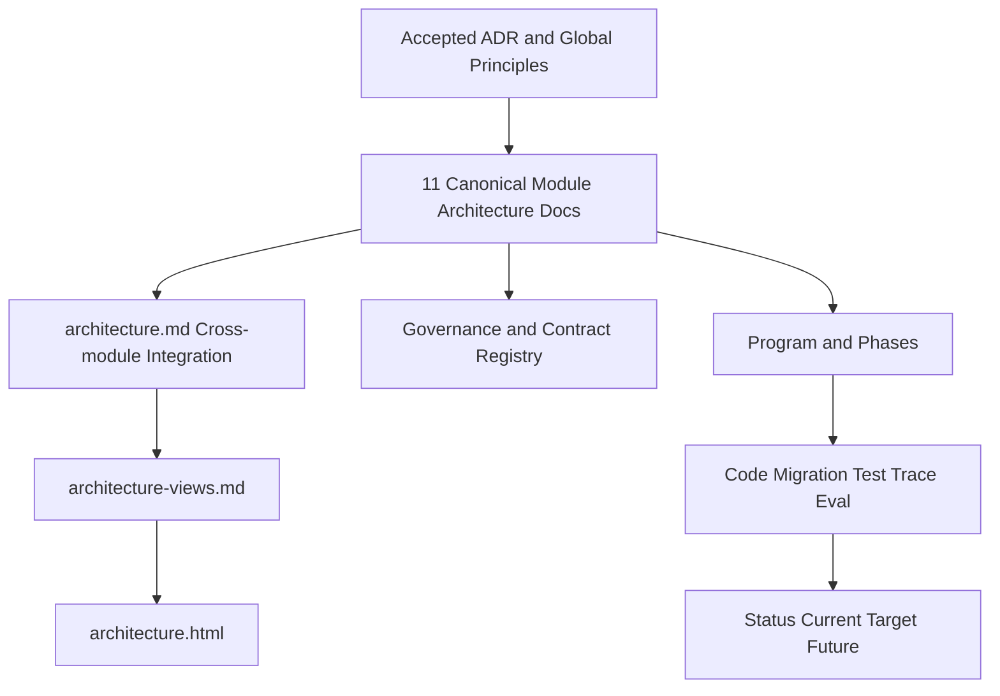
```mermaid
flowchart TD
    A[Accepted ADR and Global Principles] --> B[11 Canonical Module Architecture Docs]
    B --> C[architecture.md Cross-module Integration]
    C --> D[architecture-views.md]
    D --> E[architecture.html]
    B --> F[Governance and Contract Registry]
    B --> G[Program and Phases]
    G --> H[Code Migration Test Trace Eval]
    H --> I[Status Current Target Future]
```

规则：

- Module 文档拥有模块内部 Target；
- 总架构拥有跨模块集成；
- Program / Phase 负责从 Current 到 Target 的实施；
- Status 与 Evidence 决定 Target 是否已经成为 Current；
- HTML 与 Mermaid 不覆盖规范正文。

---

# 2. 十一模块逻辑视图

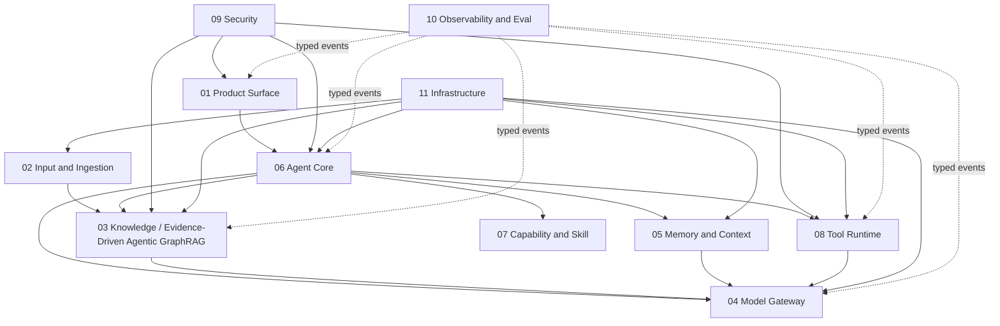
```mermaid
flowchart TB
    PS[01 Product Surface]
    ING[02 Input and Ingestion]
    K[03 Knowledge / Evidence-Driven Agentic GraphRAG]
    MG[04 Model Gateway]
    MC[05 Memory and Context]
    AC[06 Agent Core]
    CS[07 Capability and Skill]
    TR[08 Tool Runtime]
    SEC[09 Security]
    OE[10 Observability and Eval]
    INF[11 Infrastructure]

    PS --> AC
    ING --> K
    AC --> K
    AC --> MC
    AC --> CS
    AC --> TR
    AC --> MG
    K --> MG
    MC --> MG
    TR --> MG
    SEC --> PS
    SEC --> AC
    SEC --> K
    SEC --> TR
    INF --> ING
    INF --> K
    INF --> MG
    INF --> MC
    INF --> AC
    INF --> TR
    OE -. typed events .-> PS
    OE -. typed events .-> AC
    OE -. typed events .-> K
    OE -. typed events .-> MG
    OE -. typed events .-> TR
```

---

# 3. 完整在线运行视图

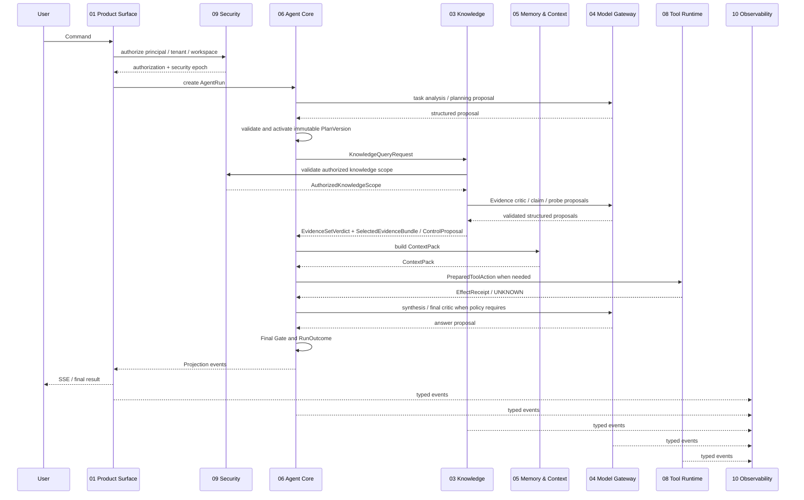
```mermaid
sequenceDiagram
    participant U as User
    participant P as 01 Product Surface
    participant S as 09 Security
    participant A as 06 Agent Core
    participant K as 03 Knowledge
    participant M as 05 Memory & Context
    participant G as 04 Model Gateway
    participant T as 08 Tool Runtime
    participant O as 10 Observability

    U->>P: Command
    P->>S: authorize principal / tenant / workspace
    S-->>P: authorization + security epoch
    P->>A: create AgentRun
    A->>G: task analysis / planning proposal
    G-->>A: structured proposal
    A->>A: validate and activate immutable PlanVersion
    A->>K: KnowledgeQueryRequest
    K->>S: validate authorized knowledge scope
    S-->>K: AuthorizedKnowledgeScope
    K->>G: Evidence critic / claim / probe proposals
    G-->>K: validated structured proposals
    K-->>A: EvidenceSetVerdict + SelectedEvidenceBundle / ControlProposal
    A->>M: build ContextPack
    M-->>A: ContextPack
    A->>T: PreparedToolAction when needed
    T-->>A: EffectReceipt / UNKNOWN
    A->>G: synthesis / final critic when policy requires
    G-->>A: answer proposal
    A->>A: Final Gate and RunOutcome
    A-->>P: Projection events
    P-->>U: SSE / final result
    P-->>O: typed events
    A-->>O: typed events
    K-->>O: typed events
    G-->>O: typed events
    T-->>O: typed events
```

---

# 4. Agent Core 控制视图

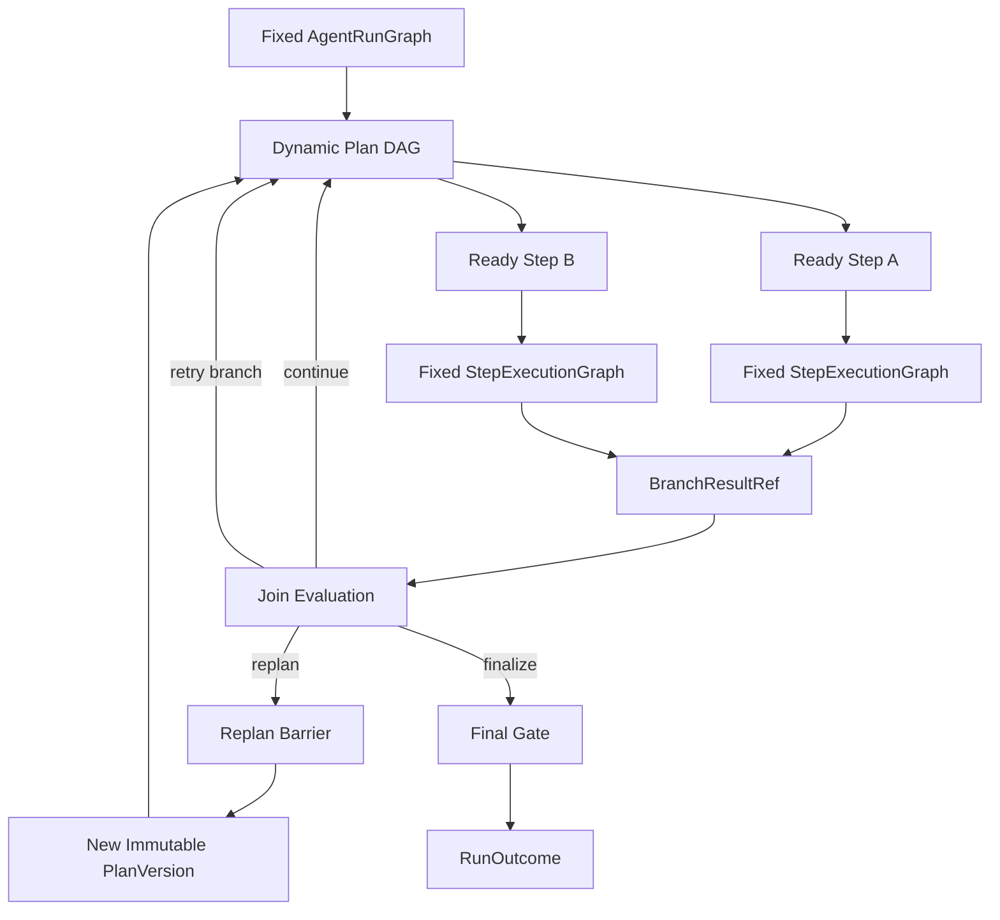
```mermaid
flowchart TB
    RG[Fixed AgentRunGraph] --> PD[Dynamic Plan DAG]
    PD --> R1[Ready Step A]
    PD --> R2[Ready Step B]
    R1 --> SG1[Fixed StepExecutionGraph]
    R2 --> SG2[Fixed StepExecutionGraph]
    SG1 --> BR[BranchResultRef]
    SG2 --> BR
    BR --> J[Join Evaluation]
    J -->|continue| PD
    J -->|retry branch| PD
    J -->|replan| RB[Replan Barrier]
    RB --> NP[New Immutable PlanVersion]
    NP --> PD
    J -->|finalize| FG[Final Gate]
    FG --> RO[RunOutcome]
```

质量控制层：

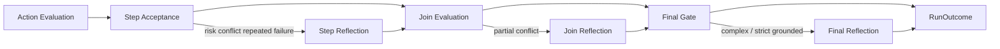
```mermaid
flowchart LR
    A[Action Evaluation] --> B[Step Acceptance]
    B -->|risk conflict repeated failure| C[Step Reflection]
    B --> D[Join Evaluation]
    C --> D
    D -->|partial conflict| E[Join Reflection]
    D --> F[Final Gate]
    E --> F
    F -->|complex / strict grounded| G[Final Reflection]
    F --> H[RunOutcome]
    G --> H
```

---

# 5. Evidence-Driven Agentic GraphRAG 总体视图

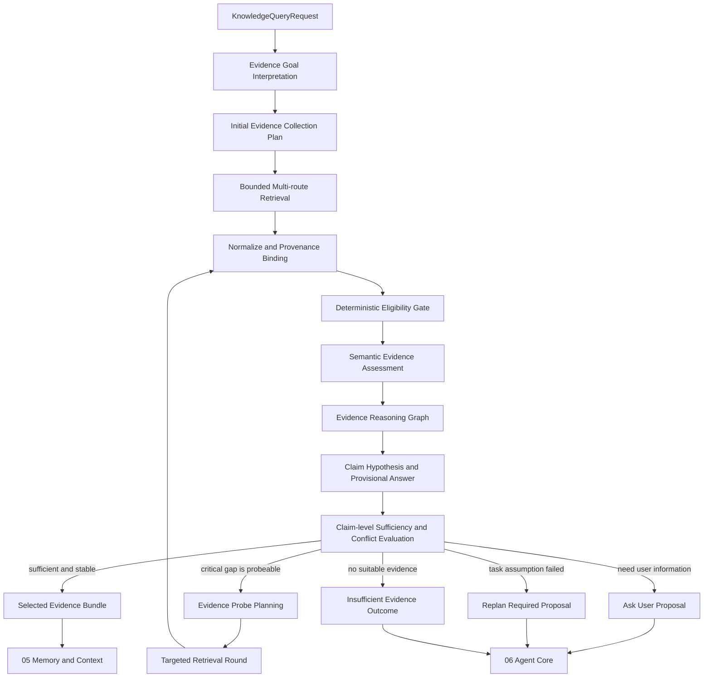
```mermaid
flowchart TD
    A[KnowledgeQueryRequest] --> B[Evidence Goal Interpretation]
    B --> C[Initial Evidence Collection Plan]
    C --> D[Bounded Multi-route Retrieval]
    D --> E[Normalize and Provenance Binding]
    E --> F[Deterministic Eligibility Gate]
    F --> G[Semantic Evidence Assessment]
    G --> H[Evidence Reasoning Graph]
    H --> I[Claim Hypothesis and Provisional Answer]
    I --> J[Claim-level Sufficiency and Conflict Evaluation]

    J -->|sufficient and stable| K[Selected Evidence Bundle]
    J -->|critical gap is probeable| L[Evidence Probe Planning]
    J -->|need user information| M[Ask User Proposal]
    J -->|task assumption failed| N[Replan Required Proposal]
    J -->|no suitable evidence| O[Insufficient Evidence Outcome]

    L --> P[Targeted Retrieval Round]
    P --> E
    K --> Q[05 Memory and Context]
    M --> R[06 Agent Core]
    N --> R
    O --> R
```

---

# 6. 首轮 Route 选择视图

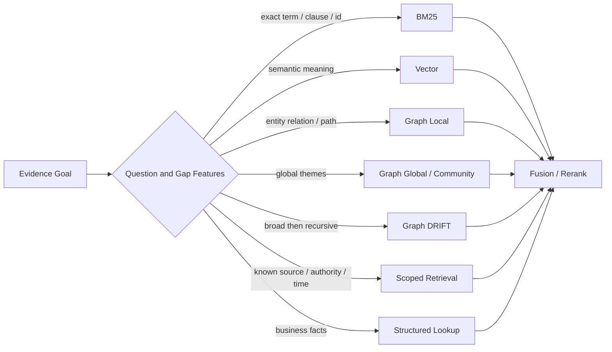
```mermaid
flowchart LR
    G[Evidence Goal] --> D{Question and Gap Features}
    D -->|exact term / clause / id| B[BM25]
    D -->|semantic meaning| V[Vector]
    D -->|entity relation / path| L[Graph Local]
    D -->|global themes| GL[Graph Global / Community]
    D -->|broad then recursive| DR[Graph DRIFT]
    D -->|known source / authority / time| SS[Scoped Retrieval]
    D -->|business facts| ST[Structured Lookup]

    B --> F[Fusion / Rerank]
    V --> F
    L --> F
    GL --> F
    DR --> F
    SS --> F
    ST --> F
```

门禁：Capability、Authorized Scope、Profile、Budget、deadline、预计信息增益、多样性与重复度。

`DEEP` 不是所有 Route 全开；`STANDARD` 也不是无条件只走一条路径。

---

# 7. Knowledge Graph 与 Evidence Reasoning Graph 双图

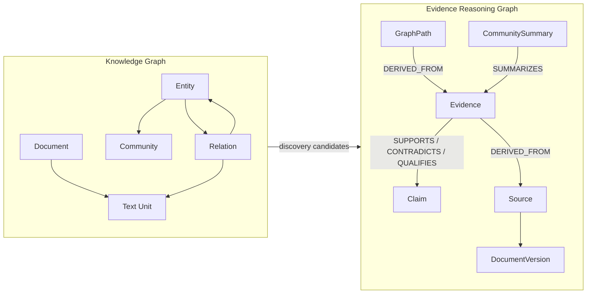
```mermaid
flowchart LR
    subgraph KG[Knowledge Graph]
      E[Entity]
      R[Relation]
      C[Community]
      D[Document]
      T[Text Unit]
      E --> R
      R --> E
      E --> C
      D --> T
      R --> T
    end

    subgraph ERG[Evidence Reasoning Graph]
      CL[Claim]
      EV[Evidence]
      SO[Source]
      DV[DocumentVersion]
      GP[GraphPath]
      CS[CommunitySummary]
      EV -->|SUPPORTS / CONTRADICTS / QUALIFIES| CL
      EV -->|DERIVED_FROM| SO
      SO --> DV
      GP -->|DERIVED_FROM| EV
      CS -->|SUMMARIZES| EV
    end

    KG -->|discovery candidates| ERG
```

---

# 8. 同源证据去重视图

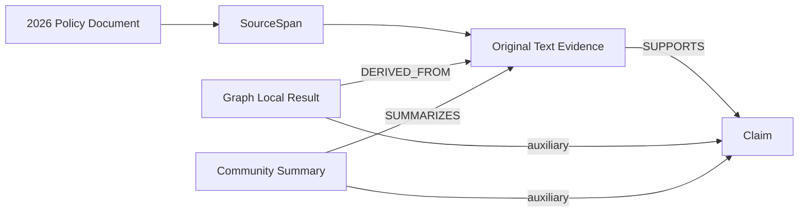
```mermaid
flowchart LR
    D[2026 Policy Document]
    S[SourceSpan]
    E1[Original Text Evidence]
    E2[Graph Local Result]
    E3[Community Summary]
    C[Claim]

    D --> S
    S --> E1
    E2 -->|DERIVED_FROM| E1
    E3 -->|SUMMARIZES| E1
    E1 -->|SUPPORTS| C
    E2 -->|auxiliary| C
    E3 -->|auxiliary| C
```

E1、E2、E3 只能计为一个 Source Family。派生证据可以帮助解释和发现，但不能重复提升独立支持度。

---

# 9. Evidence 四层评价视图

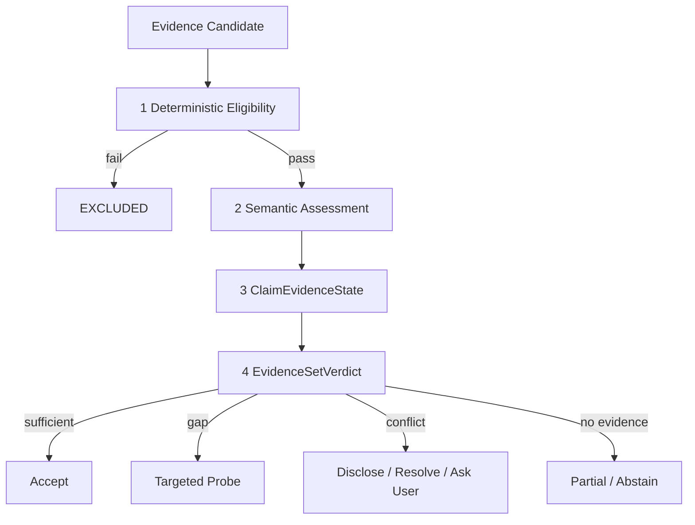
```mermaid
flowchart TD
    E[Evidence Candidate] --> L1[1 Deterministic Eligibility]
    L1 -->|fail| X[EXCLUDED]
    L1 -->|pass| L2[2 Semantic Assessment]
    L2 --> L3[3 ClaimEvidenceState]
    L3 --> L4[4 EvidenceSetVerdict]
    L4 -->|sufficient| A[Accept]
    L4 -->|gap| P[Targeted Probe]
    L4 -->|conflict| C[Disclose / Resolve / Ask User]
    L4 -->|no evidence| N[Partial / Abstain]
```

硬门不能被模型评分覆盖。模型只产生结构化 Proposal。

---

# 10. Evidence Probe 视图

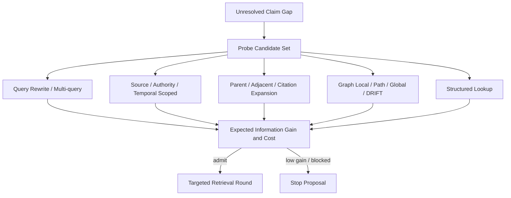
```mermaid
flowchart TD
    U[Unresolved Claim Gap] --> P[Probe Candidate Set]
    P --> Q[Query Rewrite / Multi-query]
    P --> S[Source / Authority / Temporal Scoped]
    P --> X[Parent / Adjacent / Citation Expansion]
    P --> G[Graph Local / Path / Global / DRIFT]
    P --> T[Structured Lookup]
    Q --> R[Expected Information Gain and Cost]
    S --> R
    X --> R
    G --> R
    T --> R
    R -->|admit| RR[Targeted Retrieval Round]
    R -->|low gain / blocked| ST[Stop Proposal]
```

---

# 11. Retry、Probe、Replan 边界视图

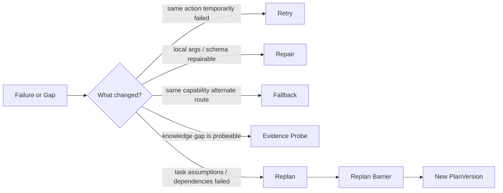
```mermaid
flowchart LR
    F[Failure or Gap] --> D{What changed?}
    D -->|same action temporarily failed| R[Retry]
    D -->|local args / schema repairable| RP[Repair]
    D -->|same capability alternate route| FB[Fallback]
    D -->|knowledge gap is probeable| P[Evidence Probe]
    D -->|task assumptions / dependencies failed| RE[Replan]
    RE --> B[Replan Barrier]
    B --> N[New PlanVersion]
```

---

# 12. Tool 副作用安全视图

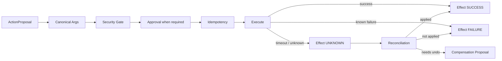
```mermaid
flowchart LR
    A[ActionProposal] --> C[Canonical Args]
    C --> S[Security Gate]
    S --> AP[Approval when required]
    AP --> I[Idempotency]
    I --> E[Execute]
    E -->|success| SU[Effect SUCCESS]
    E -->|known failure| FA[Effect FAILURE]
    E -->|timeout / unknown| UN[Effect UNKNOWN]
    UN --> R[Reconciliation]
    R -->|applied| SU
    R -->|not applied| FA
    R -->|needs undo| CP[Compensation Proposal]
```

---

# 13. PostgreSQL 与 LangGraph Checkpointer 边界

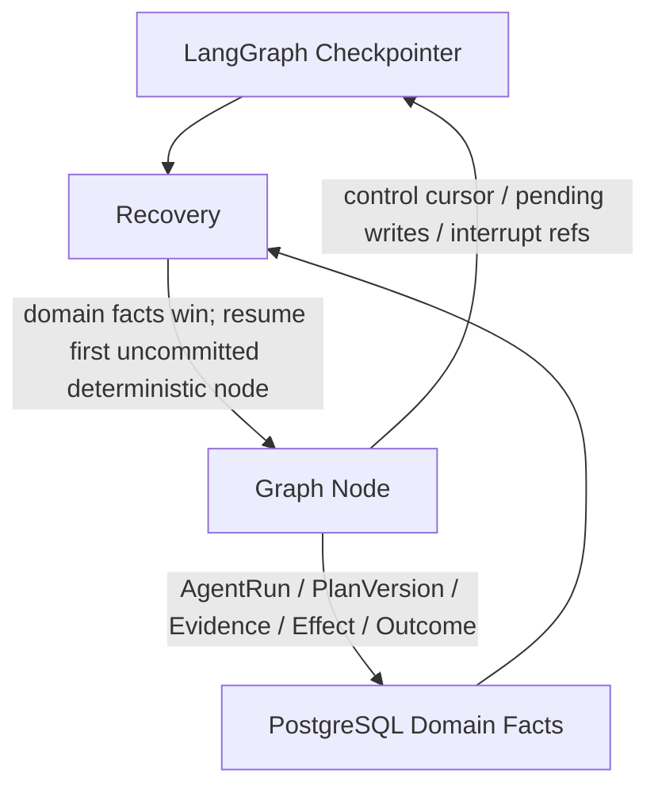
```mermaid
flowchart TB
    LG[LangGraph Checkpointer]
    PG[PostgreSQL Domain Facts]
    N[Graph Node]
    R[Recovery]

    N -->|control cursor / pending writes / interrupt refs| LG
    N -->|AgentRun / PlanVersion / Evidence / Effect / Outcome| PG
    LG --> R
    PG --> R
    R -->|domain facts win; resume first uncommitted deterministic node| N
```

---

# 14. Document 到 Evidence 的版本链

```mermaid
flowchart LR
    O[SourceObject] --> DV[DocumentVersion]
    DV --> PS[ParseSnapshot]
    PS --> IR[CanonicalDocumentIR]
    IR --> SP[SourceSpan Manifest]
    SP --> KV[KnowledgeVersion]
    KV --> KS[KnowledgeSnapshot]
    KS --> ER[EvidenceRecord]
    ER --> CL[Claim Binding]
    CL --> CI[Citation]
```

源内容、解析配置、索引配置分别版本化。Run 固定 Snapshot，不因 Cutover 静默变化。

---

# 15. 可观测性与评测视图

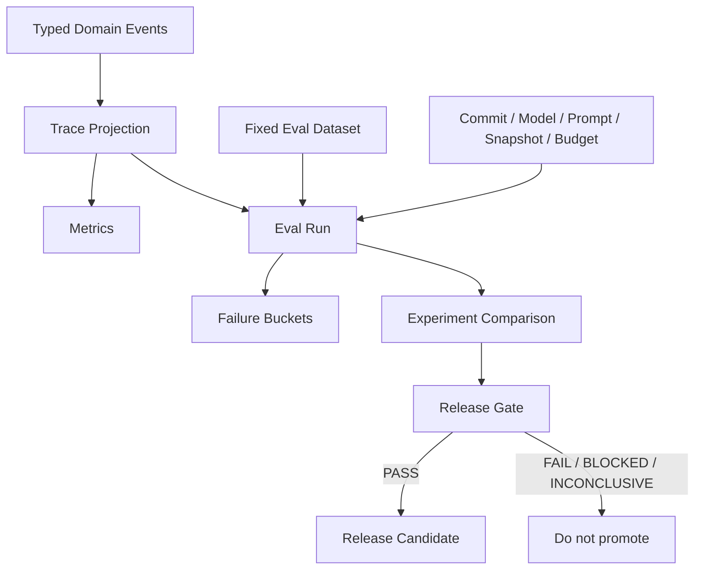
```mermaid
flowchart TB
    EV[Typed Domain Events] --> TP[Trace Projection]
    TP --> MET[Metrics]
    TP --> ER[Eval Run]
    DS[Fixed Eval Dataset] --> ER
    CFG[Commit / Model / Prompt / Snapshot / Budget] --> ER
    ER --> FB[Failure Buckets]
    ER --> CMP[Experiment Comparison]
    CMP --> RG[Release Gate]
    RG -->|PASS| REL[Release Candidate]
    RG -->|FAIL / BLOCKED / INCONCLUSIVE| STOP[Do not promote]
```

---

# 16. Architecture v1 到 v2 的关系

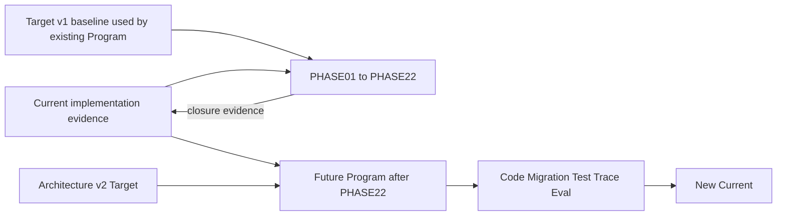
```mermaid
flowchart LR
    C[Current implementation evidence]
    V1[Target v1 baseline used by existing Program]
    P[PHASE01 to PHASE22]
    V2[Architecture v2 Target]
    NP[Future Program after PHASE22]
    IM[Code Migration Test Trace Eval]
    NC[New Current]

    V1 --> P
    C --> P
    P -->|closure evidence| C
    C --> NP
    V2 --> NP
    NP --> IM
    IM --> NC
```

本次只更新 V2，不修改既有 Program / Phase。
