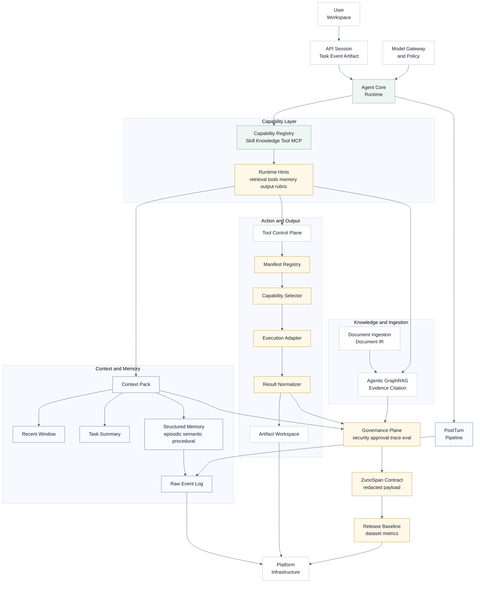
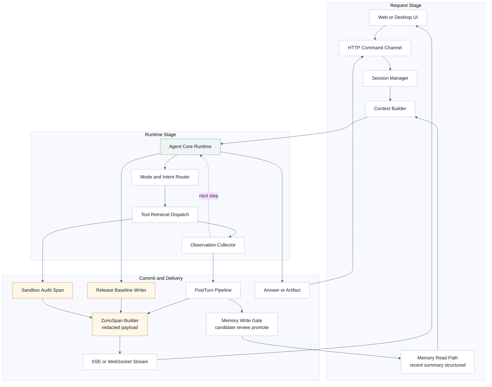
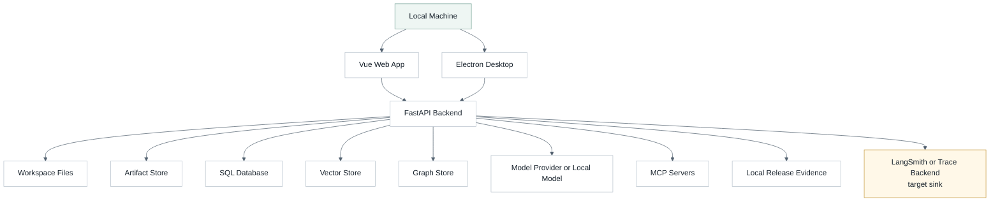
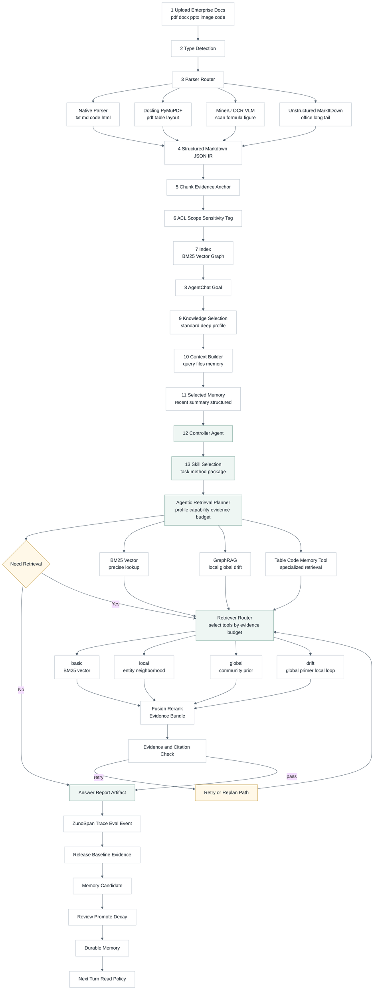
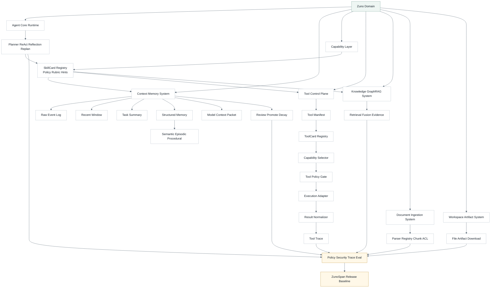
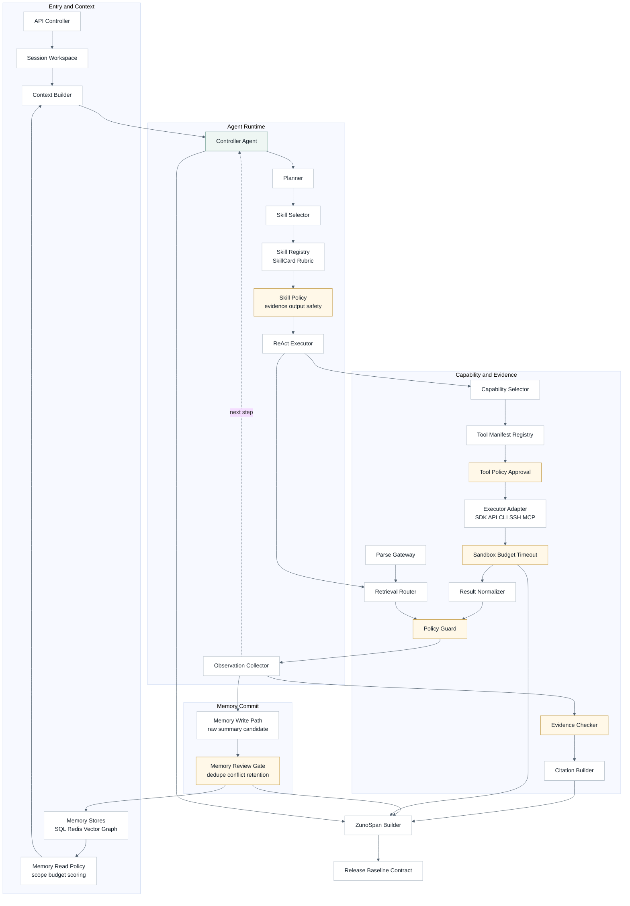
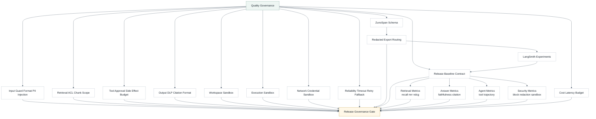

```mermaid
%%{init: {"theme": "base", "themeVariables": {"background": "#f7f8fb", "lineColor": "#52616f"}}}%%
flowchart TB
  classDef node fill:#ffffff,stroke:#b8c2cc,stroke-width:1px,color:#16202a;
  classDef accent fill:#eef6f3,stroke:#7aa59a,stroke-width:1px,color:#16202a;
  classDef guard fill:#fff8e8,stroke:#c59b43,stroke-width:1px,color:#16202a;
  classDef work fill:#f8fbff,stroke:#5b7fa3,stroke-width:1px,color:#16202a;

  R["Repository Root"]:::accent
  R --> APPS["apps"]
  R --> BACKEND["src/backend/zuno"]
  R --> DOCS["docs"]
  R --> AGENT[".agent"]
  R --> TOOLS["tools"]
  R --> TESTS["tests"]
  BACKEND --> API["api"]
  BACKEND --> AG["agent"]
  BACKEND --> MEM["memory"]
  BACKEND --> CAP["capability"]
  BACKEND --> KNO["knowledge"]
  BACKEND --> PLA["platform"]
  API --> APISTATE["session task artifact contracts"]
  AG --> RUNTIME["state graph planning streaming"]
  MEM --> MEMSYS["context builder memory stores"]
  CAP --> SKILLSYS["SkillCard registry policy rubrics"]
  CAP --> TOOLSYS["ToolCard policy executors MCP"]
  KNO --> KNOWSYS["ingestion retrieval GraphRAG evidence"]
  PLA --> PLATSYS["model storage jobs security observability<br/>trace_eval contract"]
  DOCS --> FORMAL["architecture.md source"]
  DOCS --> HTML["architecture.html generated"]
  DOCS --> ASSETS["architecture assets PDFs"]
  AGENT --> PROGRAM["no-active program surface<br/>latest completed archive"]:::guard
  AGENT --> REFS["references governance"]
  AGENT --> TPL["templates skeletons"]
  TOOLS --> RENDER["render architecture"]
  TOOLS --> VERIFY["verifiers"]
  TESTS --> REPO["repo tests"]

  subgraph WORK["Parallel Delivery Worktrees"]
    direction TB
    WA["A architecture docs v2"]:::work
    WB["B code layout rationalization"]:::work
    WC["C document ingestion"]:::work
    WD["D runtime memory skill tool plane"]:::work
    WE["E security sandbox"]:::work
    WF["F eval observability"]:::work
  end

  PROGRAM --> WORK
  WA --> FORMAL
  WB --> BACKEND
  WC --> KNO
  WD --> AG
  WD --> MEM
  WD --> CAP
  WE --> PLA
  WF --> PLA
  WORK --> VERIFY
  class APPS,BACKEND,DOCS,AGENT,TOOLS,TESTS,API,AG,MEM,CAP,KNO,PLA,APISTATE,RUNTIME,MEMSYS,SKILLSYS,TOOLSYS,KNOWSYS,PLATSYS,FORMAL,HTML,ASSETS,REFS,TPL,RENDER,VERIFY,REPO node;
```

```mermaid
%%{init: {"theme": "base", "themeVariables": {"background": "#f7f8fb", "lineColor": "#52616f"}}}%%
flowchart TB
  classDef node fill:#ffffff,stroke:#b8c2cc,stroke-width:1px,color:#16202a;
  classDef accent fill:#eef6f3,stroke:#7aa59a,stroke-width:1px,color:#16202a;
  classDef guard fill:#fff8e8,stroke:#c59b43,stroke-width:1px,color:#16202a;

  APP["Zuno App"]:::accent
  STORE["Local Object Storage"]
  SQL["SQL Database"]
  VDB["Vector Store"]
  GDB["Graph Store"]
  SEARCH["Sparse Search Index"]
  JOBS["Background Jobs<br/>ingest embed graph artifact"]
  MODEL["Model Gateway"]
  MCP["MCP Provider"]
  SDK["SDK Adapter"]
  APIAD["API Adapter"]
  CLI["CLI Adapter"]
  SSH["SSH Adapter"]:::guard
  SANDBOX["Execution Sandbox"]:::guard
  NET["Network Proxy"]:::guard
  CREDS["Credential Broker"]:::guard
  OTEL["OTel Contract<br/>redaction routing"]
  TRACE["Local Trace Eval Backend"]
  BASELINE["Release Baseline Evidence"]
  LS["LangSmith Sink<br/>target adapter"]
  APP --> STORE
  APP --> SQL
  APP --> VDB
  APP --> GDB
  APP --> SEARCH
  APP --> JOBS
  APP --> MODEL
  APP --> MCP
  APP --> SDK
  APP --> APIAD
  APP --> SANDBOX
  SANDBOX --> CLI
  SANDBOX --> SSH
  SANDBOX --> NET
  SANDBOX --> CREDS
  APP --> OTEL --> TRACE --> BASELINE
  OTEL --> LS
  class STORE,SQL,VDB,GDB,SEARCH,JOBS,MODEL,MCP,SDK,APIAD,CLI,TRACE,BASELINE,LS node;
```

```mermaid
%%{init: {"theme": "base", "themeVariables": {"background": "#f7f8fb", "lineColor": "#52616f"}}}%%
flowchart LR
  classDef node fill:#ffffff,stroke:#b8c2cc,stroke-width:1px,color:#16202a;
  classDef decision fill:#fff8e8,stroke:#c59b43,stroke-width:1px,color:#16202a;
  classDef accent fill:#eef6f3,stroke:#7aa59a,stroke-width:1px,color:#16202a;

  GOAL["Goal"]
  PREP["prepare_context"]
  READMEM["memory read<br/>recent task structured"]
  ROUTE["intent and mode router"]
  PLAN["plan"]
  SKILL["skill selection<br/>method hints constraints"]
  STEP["ReAct step"]
  CALL["tool retrieval memory dispatch<br/>constrained by skill"]
  OBS["observation"]
  RAW["raw event append"]
  WORK["working memory"]
  REFLECT{"reflection gate"}:::decision
  REPLAN["replan"]
  FINAL["final answer"]:::accent
  COMMIT["post_turn_commit<br/>trace memory eval"]
  AUDIT["security audit span"]
  SUMMARY["task summary update"]
  CAND["structured memory candidate"]
  REVIEW["review promote decay"]:::decision
  LONG["semantic episodic procedural memory"]

  subgraph PREPARE["Prepare"]
    direction TB
    GOAL --> PREP --> READMEM --> ROUTE --> PLAN --> SKILL
  end

  subgraph EXECUTE["Execute"]
    direction TB
    STEP --> CALL --> OBS --> RAW --> WORK --> REFLECT
  end

  subgraph POSTTURN["Post Turn"]
    direction TB
    FINAL --> COMMIT
    COMMIT --> AUDIT
    COMMIT --> SUMMARY
    COMMIT --> CAND --> REVIEW --> LONG
  end

  SKILL --> STEP
  REFLECT -->|continue| STEP
  REFLECT -->|replan| REPLAN --> PLAN
  REFLECT -->|finish| FINAL
  SUMMARY -. next turn .-> READMEM
  LONG -. next turn .-> READMEM
  class GOAL,PREP,READMEM,ROUTE,PLAN,SKILL,STEP,CALL,OBS,RAW,WORK,REPLAN,COMMIT,AUDIT,SUMMARY,CAND,LONG node;
```

# Zuno 架构总文档

## 用途

这是 Zuno 当前正式的文字总架构文档。它回答四个问题：

1. Zuno 当前是什么。
2. Zuno 的目标架构是什么。
3. 下一阶段为什么落在企业私有知识库、多格式文档解析、评测观测和安全治理上。
4. 哪些能力仍是 Target，不能写成 Current。
5. Current Local Slice、Launchable Prototype Target 与 Production Scale Target 的成熟度边界；展开版成熟度和 runtime-first 交付物口径由 `docs/architecture/production-readiness.md` 维护。
6. 企业知识库文档入口的对象存储、元数据、job lifecycle、幂等、版本、防丢、index manifest 和多模态解析边界；展开版文档入口契约由 `docs/architecture/document-ingestion-foundation.md` 维护。

图形化展示以 `docs/architecture/architecture.html` 为准；图源是 `docs/architecture/architecture.md`。Agent 侧维护镜像是 `.agent/architecture/architecture.md`，Agent 侧也保留同名 HTML 镜像。这四个 canonical paths 必须保持一致：

- `docs/architecture/architecture.md`
- `.agent/architecture/architecture.md`
- `docs/architecture/architecture.html`
- `.agent/architecture/architecture.html`

`docs/architecture/document-ingestion-foundation.md` 是文档入口的正式补充契约，负责集中说明 Program 1 的 enterprise ingestion foundation：workspace file 如何进入 ParseGateway、Document IR 如何版本化、parse job 如何幂等与防丢、index manifest 如何保留 lineage、OCR / VLM 如何作为 derived enrichment 接入。它不是 Mermaid 图源，也不替代本文的总架构角色。

当前 `.agent/programs/` 处于 active 状态。当前 active program 是 Program 3 Mega：`zuno-launchable-enterprise-agentic-graphrag-full-closure-v1`，当前 phase 是 `PHASE12_end-to-end-product-runtime.md`。最近完成并归档的 program 是 Program 2：`zuno-enterprise-document-ingestion-platform-v2`，归档位置是 `docs/history/programs/zuno-enterprise-document-ingestion-platform-v2/`。该 program 已完成 PHASE01-PHASE08：truth source gap audit、durable storage contract、workspace file durable input、parse / document persistence、index persistence and rehydrate、workspace task / event / artifact / feedback durable closure、restart recovery、docs / verifier closure。Program 3 Mega PHASE08 已完成本地 Model Gateway / Cost / Latency baseline；PHASE09 已完成本地 Planning Contract / Strategy Selector baseline；PHASE10 已完成本地 AgentControlRuntime / Reflection / Dynamic Replan / Reflexion baseline；PHASE11 已完成 Workspace Product API / Frontend Minimal Sync baseline，支持 per-knowledge-space 标准检索 / 深度检索、task plan / reflection / replan / trace / eval / cost summary、artifact citation refs、file status 和 frontend API type。上一轮 Program 1 是 `zuno-production-document-ingestion-and-thread-foundation-v1`，归档位置是 `docs/history/programs/zuno-production-document-ingestion-and-thread-foundation-v1/`。原 Program 3-6 已合并进 Mega Program；旧 queued 文件只保留为 superseded 输入。

## 核心判断

Zuno 是 **AgentChat 驱动的企业知识库 Agentic GraphRAG Workspace**。用户在聊天里提出目标，系统通过统一输入层、知识库层、模型层、Memory & Context Engine、Planning & Control Runtime、Capability Layer、工具执行层、安全治理和评测观测外壳协作，由 Single Controller Agent 自动决定选择何种 Skill、如何检索、是否使用 GraphRAG、是否调用工具、是否重查或反思，最后生成带引用、可追溯、可评测的回答或 artifact。

Zuno 的 Agent Core 用一句话定义：

```text
Agent = Model Gateway
      + Memory & Context Engine
      + Planning & Control Runtime
      + Capability Layer
      + Governance / Trace / Eval Envelope
```

其中 Model Gateway 负责模型调用、路由、成本和结构化输出；Memory & Context Engine 负责 working / session / episodic / semantic / procedural / reflexion / governance memory、上下文压缩和 ContextPack；Planning & Control Runtime 负责 Strategy Selector、ReAct、Plan-and-Execute、Reflection、Dynamic Replan、Reflexion 和 post_turn_commit；Capability Layer 负责 Skill、Knowledge、Tool、MCP、External API、File / Code / Browser 和 Artifact capabilities 的注册、授权、路由和观测；Governance / Trace / Eval Envelope 是横切外壳，贯穿输入、检索、模型调用、工具执行、输出和记忆写入。

Zuno 的主叙事是 **本地优先 / 私有部署优先的企业知识库 Agent Workspace**，也继承“本地优先的企业私有知识库与多功能 Agent 助手”定位；它不是普通 RAG 问答 demo，也不是默认多 Agent 平台。

当前仓库已经完成的是架构治理、文档系统、六层后端边界、`GeneralAgent` 单循环主线、Query Router foundation、Context / Memory foundation、ToolCard foundation、GraphRAG query contract、PHASE03 workspace product API / SSE runtime surface、PHASE04 Document Ingestion / Parse Gateway runtime surface、PHASE05 local deterministic index job runtime surface、PHASE06 controller-node durable runtime surface、PHASE07 snapshot / SQLModel-backed memory runtime surface、PHASE08 local deterministic Tool Control Plane runtime surface、PHASE09 Agentic Retrieval / Evidence / Citation runtime、PHASE10 Security / Observability / release eval runtime、PHASE11 Web workspace Agent 产品闭环、Program 3 Mega PHASE06 `CapabilityLayerRegistry` / `CapabilityRouter` 本地 baseline、PHASE08 `ModelGateway` / mock provider / cost guard / fallback trace 本地 baseline、PHASE09 `StrategySelector` / `PlannerOutput` / `PlanState` / planning trace 本地 baseline、PHASE10 `AgentControlRuntime` / `RuntimeObservation` / reflection gate / dynamic replan / Reflexion review candidate 本地 baseline、PHASE11 Workspace Product API / Frontend Minimal Sync baseline，以及已归档 PHASE12 release closure。

仍然不能写成 Current 的能力包括：Planning & Control Runtime 的产品 API / E2E 接入、生产级 LangGraph runtime、成熟 Memory DB、完整 dynamic tool orchestration、生产级 Docling / MinerU / Unstructured parser platform、生产级 GraphRAG extraction / fusion / RRF / rerank / 外部 index platform、LangSmith 产品化评测、rootless/gVisor/Firecracker 安全沙箱、外部 vault / OAuth credential broker、生产级输出 DLP、完整前端 trace 面板和默认产品级多 Agent runtime。

```text
Zuno current
  = monorepo
  + FastAPI backend
  + Single GeneralAgent single loop
  + Knowledge / GraphRAG query path
  + evidence / citation / trace foundation

Zuno launchable prototype target
  = Launchable Enterprise KB Agent Prototype
  + frontend/backend separation
  + usable account / workspace surface
  + backend-persisted workspace / file / parse job / index / task / artifact / feedback
  + Document Ingestion / Parse Gateway
  + Agentic RAG + GraphRAG answer with citation
  + artifact / trace / event / feedback recovery
  + SQLite / local file store product V1 persistence

Zuno production scale target
  = Local-first Enterprise Private Knowledge Agent Workspace
  + AgentChat driven enterprise KB workspace
  + Single Controller Agent Runtime
  + Auth / Organization / RBAC
  + Postgres metadata DB
  + Object Store
  + Queue / Outbox / Worker
  + Document Ingestion / Parse Gateway
  + Parser Worker / Index Worker
  + Memory & Context Engine
  + Planning & Control Runtime
  + Capability Layer
  + Tool Control Plane
  + Agentic RAG + GraphRAG
  + Security / Approval / Sandbox
  + LangSmith-compatible Trace / Eval
  + Workspace / Artifact / Event Flow
```

目标架构分成十一个产品与能力层，底层基础设施贯穿所有层：

| 层 | 职责 | 用户是否直接感知 |
| --- | --- | --- |
| 产品表层 / Product Surface | AgentChat、Workspace、知识库选择、标准检索 / 深度检索 profile、artifact、trace 和 feedback。 | 直接感知，这是用户的主要入口。 |
| 输入层 / Document & User Input Layer | 接收聊天输入、上传附件、知识库文件、网页、代码、表格、PDF / Office、图片和未来同步源，统一进入 source object、parse job、Document IR 和 index handoff。 | 感知为上传、附件和知识库资料。 |
| 知识库层 / Knowledge & Retrieval Layer | 维护 KnowledgeSpace、索引能力、标准检索 / 深度检索 profile、BM25 / vector / graph / table / code retrieval、EvidenceBundle 和 CitationLineage。 | 只感知为选择知识库和检索策略。 |
| 模型层 / Model Gateway Layer | 管理 chat、embedding、reranker、VLM / OCR、structured extraction、eval judge 等模型的路由、预算、统计、fallback 和安全过滤。 | 通常不感知，管理员可配置默认模型。 |
| 记忆与上下文引擎 / Memory & Context Engine | 管理 working、session、episodic、semantic、procedural、reflexion、governance memory，并负责上下文压缩、ContextPack 和敏感上下文排除。 | 感知为 Agent 记得上下文，但敏感记忆受控。 |
| 能力层 / Capability Layer | 统一管理 Skill Capability、Knowledge Capability、Tool Capability、MCP Capability、External API、File / Code / Browser 和 Artifact capabilities。Skill 是完成某类任务的方法包，不是 Tool，也不是 Knowledge；Tool 是其中可执行动作能力。 | 通常不直接感知；用户可在 Agent 配置里 pin skill，但默认由 Agent 自动选择能力组合。 |
| 工具层 / Tool Control Plane | 管理 ToolCard、ToolRequest、approval、credential broker、sandbox、result normalizer 和 tool trace。Tool 是执行动作，不承载完整任务方法。 | 感知为工具审批和工具执行结果。 |
| 规划与控制层 / Planning & Control Runtime | `prepare_context -> strategy_select -> plan -> skill_select -> ReAct / Plan-and-Execute -> observe -> reflect -> dynamic_replan -> reflexion -> post_turn_commit`，决定策略、Skill、检索、工具、反思、重查和最终回答。 | 感知为 Agent 正在检索、分析、生成。 |
| 安全治理层 / Security & Governance Layer | Input / Retrieval / Tool / Output 四道 gate，ACL、DLP、approval、audit、policy decision trace。 | 感知为权限、审批、拒答和脱敏。 |
| 自动化测试与观测层 / Eval, Trace, Cost, Benchmark Layer | 记录 trace、retrieval profile、model cost、latency、citation coverage、unsupported claims、eval metrics 和 release gate。 | 感知为 trace、引用、反馈和质量报告。 |
| 基础设施层 / Infrastructure Layer | SQLite / PostgreSQL、LocalObjectStore / MinIO / S3、QueueBackend / RabbitMQ、Redis runtime state、workers、outbox、dead letter、reconciler 和 trace store。 | 不应暴露成普通用户心智。 |

基础设施目标是 PostgreSQL / SQLite、Object Store / MinIO / S3 / Local FS、RabbitMQ / QueueBackend、Redis / Runtime State、Workers、Outbox / Dead Letter / Reconciler 和 OpenTelemetry / Trace Store。它们不应暴露成普通用户心智。

输入层不是“上传一段文本”的窄功能，而是企业文档输入平台。当前 Current 稳定能力是 `native` parser 对 txt / md / csv / json / html / code 的低依赖确定性解析；PDF、Office、图片、扫描件和未知二进制文件已经有格式矩阵、adapter contract、dependency probe 与 target-blocked diagnostics，但真实 Docling / PyMuPDF、Unstructured / MarkItDown、MinerU / OCR / VLM worker 仍是 Launchable / Production Scale Target。用户在产品上应看到文件状态、知识库状态、标准检索 / 深度检索和 blocked / retry / diagnostics，不应看到 Docling、MinerU、RabbitMQ 等技术细节。成熟输入层依赖 ObjectStore、QueueBackend、ParserWorker、IndexWorker、Outbox、DeadLetter 和 Reconciler；详细边界由 `docs/architecture/document-ingestion-foundation.md` 维护。

## 近期目标：Launchable Enterprise KB Agent Prototype

Zuno 近期目标是 **Zuno Launchable Enterprise KB Agent Prototype / Zuno 可上线企业知识库 Agent 雏形架构**。

它的定义是：Zuno 是一个前后端分离、本地优先 / 私有部署优先的企业知识库 Agent Workspace。当前目标不是完整分布式企业平台，而是一个可以部署给个人、小团队、实验室或内网试用的企业级雏形：账号体系、workspace、文件上传、文档解析、索引、Agent 问答、引用、artifact、trace、反馈和基础权限都由后端持久化管理。生产级分布式队列、外部 OCR / VLM、外部向量库 / 图数据库、企业 SSO、在线评测和大规模运维作为 Production Scale Target。

近期实现原则：

- 前端只做 UI，不保存核心业务事实。
- 后端是 workspace、session、file、parse job、index manifest、task、artifact、trace 和 feedback 的唯一业务事实源。
- Product V1 持久层先用 SQLite / SQLModel backed local durable store、local file store 和 in-process runner。
- 文档入口继续走 `ParseGateway` 和 `CanonicalDocumentIR`，索引入口继续保留 index manifest 与 citation lineage。
- 服务重启后，file、parse job、document version、index manifest、task、events、artifact 和 feedback 必须能从后端恢复。

## 完整企业级：Production Scale Target

完整企业级 Zuno 不是“功能更多一点”，而是从单机闭环升级为可多租户、可恢复、可扩展、可审计、可运维、可灰度、可评测的企业私有知识库 Agentic GraphRAG 平台。

Production Scale Target 的技术串联是：

```text
FastAPI API Gateway
  -> Auth / Organization / RBAC
  -> Postgres metadata DB
  -> Object Store
  -> Queue / Outbox / Worker
  -> Parser Worker
  -> Document IR Store
  -> Index Worker
  -> BM25 / Vector / Graph Retrieval Stores
  -> Durable Single Controller Agent Runtime
  -> Capability Layer / Skill Registry
  -> Memory Store
  -> Tool Control Plane / Sandbox / Approval
  -> Security Gates
  -> Trace / Eval / Observability
  -> Admin / Ops / Release Gate
```

这层不是 Program 2 的验收标准。它保留为 Level 2 / Level 3 的生产扩展方向：Team Production 可以接 Postgres、Redis / Celery、MinIO、worker pool 和 pgvector / OpenSearch；Enterprise Scale 再接 Kafka / RabbitMQ、S3、Milvus / Elasticsearch / Neo4j、OCR / VLM workers、SSO / RBAC / DLP / Vault、OTel / LangSmith / Prometheus、multi-tenant / HA / autoscaling。

## Current Local Slice

Current 只写代码、测试和可复现结果已经证明的事实：

- 当前是 monorepo，主要边界是 `apps/web`、`apps/desktop`、`src/backend/zuno`、`tools`、`tests`、`docs` 和 `.agent`。
- 当前 Python 后端 runtime 边界是 `src/backend/zuno`。
- 当前后端目标层已经收口为 `api / agent / memory / capability / knowledge / platform` 六层。
- 当前主线是 `GeneralAgent` single loop，不是完整产品级 LangGraph runtime，也不是默认多 Agent runtime。
- 当前知识问答链路是 `Completion API -> CompletionService -> GeneralAgent single loop -> search_knowledge_base -> KnowledgeQueryService -> GraphRAGQueryService -> RetrievalPlanner / RetrievalOrchestrator -> Evidence / Citation / Trace -> answer`。
- 当前已证明 `product_mode = normal | enhanced | auto` 与 `query_method = basic | local | global | drift` 的 PHASE08 兼容 contract；正式目标产品心智不再暴露这些技术模式，而是把标准检索 / 深度检索放在知识库勾选处，由 Agentic Retrieval Planner 自动解析为内部检索通道。
- 当前 `zuno.knowledge.agentic_graphrag` 已提供 Agentic Retrieval Router、StagedFusionPlan、EvidenceBundle、CitationBuilder、UnsupportedClaimChecker、GraphRAGIndexPipelineContract、AgenticGraphRAGTrace、local evidence provenance、citation source tracing、local RRF/rerank trace、deterministic graph extraction / community report trace 和 unsupported claim metrics。
- 当前 `zuno.platform.security.governance` 已提供 input / retrieval / tool / output gate contract、ToolSecurityProfile、SandboxAuditEvent、policy decision trace 和 secret / PII redaction helper。
- 当前 `zuno.platform.observability.trace_eval` 已提供 OTel / LangSmith-compatible `ZunoSpan` schema、redacted span builder、LangSmith export adapter、eval dataset case、metric threshold、release baseline 和 sandbox audit span bridge。
- 当前 PHASE03 已提供 workspace / session / file / ingest / task / approval / event / artifact / feedback 后端 API 与 SSE runtime surface，覆盖 manual approval wait / resume / reject、artifact read 和 feedback；它仍是 in-process surface，不是 durable task runtime，也不是完整 UI 闭环。
- 当前 PHASE04 已提供 Document Ingestion / Parse Gateway runtime owner surface，覆盖 parser adapter registry、deterministic job status、Document IR normalization、parser diagnostics、legacy chunk normalizer 和 parser golden fixture replay；已归档生产成熟化 program PHASE07 进一步补齐本地 parser queue snapshot / metrics / retry 和 external parser adapter target-blocked boundary；它不是生产级 Docling / MinerU / Unstructured 平台。
- 当前 PHASE05 已提供 `zuno.knowledge.indexing` 本地 deterministic index job runtime surface，覆盖 knowledge space、BM25 / vector / graph 本地 index、job manifest、失败重试、回放和 retrieval payload；已归档生产成熟化 program PHASE07 进一步补齐 index adapter contract、manifest provenance / ACL / adapter status；PHASE11 已补 local evidence provenance、citation source tracing、local RRF/rerank trace、deterministic graph extraction / community report trace、external graph index target-blocked evidence 和 unsupported claim metrics。它不是生产级 Elasticsearch / Milvus / Neo4j、生产 LLM GraphRAG extraction、真实 community report pipeline 或生产 reranker 服务。
- 当前 Program 2 已提供 `zuno.knowledge.storage` Product V1 local durable ingestion baseline：`/workspace/file` 保存 local source object、source hash、storage uri 和 workspace file metadata；`/workspace/ingest` 继续走 `ParseGateway.submit_parse_job()` 并持久化 parse job、parse snapshot、document version、document blocks、index manifest、index chunks 和 citation lineage；`KnowledgeIndexRuntime.rehydrate_index()` 可从持久化 manifest / chunks 恢复本地检索面；workspace task、events、artifact content/ref 和 feedback 可从 SQLite rehydrate。它仍不是生产 Postgres、MinIO / S3、Redis / outbox / worker lease、external OCR / VLM 或 external index platform。
- 当前 PHASE06 已提供 `zuno.agent.durable_runtime` controller-node 级 durable runtime surface，覆盖 checkpoint、approval interrupt、resume、cancel、recoverable / non-recoverable failure、store snapshot，并接入 workspace task runtime；已归档生产成熟化 program PHASE08 进一步补齐 local JSON persistence payload、restart resume contract、failure snapshot linkage 和 exactly-once tool request / approval / execution / result id boundary；它不是生产 LangGraph / DB checkpointer，也不是跨进程/跨 worker exactly-once tool execution。
- 当前 PHASE07 已提供 `zuno.memory.store.DatabaseMemoryStore`、`DurableMemoryStore`、`MemoryStoreSnapshot`、memory runtime SQLModel tables、governance ledger、sensitive exclusion、promotion、decay、consolidation、Context Pack include/exclude reasons，并让 `GeneralAgent` 通过 `MemoryEngine` 做 post-turn write / pre-context read；当前成熟化 program PHASE09 进一步补齐 local deterministic semantic fallback、GeneralAgent semantic memory read、scoped privacy delete、redacted governance ledger、sensitive source context exclusion 和 memory eval baseline；它不是生产级 semantic/vector Memory DB、后台 memory scheduler、企业隐私删除平台或 nightly memory eval。
- 当前 PHASE08 已提供 `zuno.capability.runtime.ToolControlPlaneRuntime`、`ToolRuntimeRequest`、`InMemoryCredentialBroker`、`SandboxPolicyEnforcer` 和 default tool runtime，覆盖只读工具自动执行、高副作用工具 approval wait / approve 后执行、credential reference、sandbox context、audit trace、workspace task event stream 和最小前端审批卡；当前成熟化 program PHASE10 进一步补齐 `NetworkPolicyDecision`、deny / deny_by_default network target block、credential-ref-only broker、redacted approval ledger 和 `real_isolation=False` 的 sandbox audit context。它不是 rootless / gVisor / Firecracker sandbox，不是外部 vault / OAuth broker，不是真实网络代理，不是持久 approval DB，也不是完整 MCP runtime governance。
- 当前 PHASE09/10/11 已把 Agentic retrieval、citation-rich artifact、security / observability snapshot、release eval 和 Web workspace Agent UI 闭环接入第一版 runtime slice；当前成熟化 program PHASE06 已补 Web / Desktop 共享 task lifecycle contract、artifact download endpoint / UI、recoverable failure actions、feedback / trace 串联 focused tests；当前成熟化 program PHASE11 已补本地 GraphRAG evidence / citation production boundary。它仍不是外部图索引服务、生产 LLM extraction、生产 reranker、外部 trace sink、online eval、production Desktop 打包/e2e 或进程重启后的 durable recovery。
- 当前 Memory、Hooks、GraphRAG 和 Runtime Upgrade 仍有 foundation slice；Tool Control Plane 已有第一版本地 runtime surface，但不是成熟生产工具平台。
- 当前 `src/backend/zuno` 是唯一当前 Python 后端 runtime 边界，没有 active root-level `services/` 后端树。

## Target 分层

| 平面 | 目标职责 | 当前边界 |
| --- | --- | --- |
| Presentation / Workspace | Web、Desktop、会话、上传、产物、trace 面板和用户反馈。 | 当前已有 Web / Desktop 工作区、PHASE03 前端 API helpers、PHASE06 共享 task lifecycle、artifact 下载按钮和 recoverable failure surface；完整 production Desktop 打包/e2e 仍是 Target。 |
| API / Session | FastAPI routes、DTO、Auth、task / session、SSE / WebSocket、upload / download。 | PHASE03 已打通 workspace session、file registration、ingest acceptance、task、approval、event/SSE、artifact 和 feedback API surface；PHASE06 已补 lifecycle endpoint、artifact download endpoint、feedback_ids 和 recoverable failure actions；进程重启后的 durable recovery 仍是 Target。 |
| Model Gateway | chat、embedding、reranker、VLM、eval judge 的 provider boundary、成本预算、fallback、timeout、token / latency / cost trace。 | Program 3 Mega PHASE08 已提供 `zuno.platform.model_gateway` 本地 baseline：`ModelGateway`、`MockModelProvider`、五类模型 category、`BudgetVerdict`、cost guard、timeout fallback reason、redacted prompt preview 和 prompt hash trace；真实外部 provider、生产路由和在线成本账单仍是 Target。 |
| Planning & Control Runtime | `prepare_context -> strategy_select -> plan -> skill_select -> ReAct / Plan-and-Execute -> observe -> reflect -> dynamic_replan -> reflexion -> post_turn_commit`。 | 当前是 `GeneralAgent` single loop + RuntimeTurnLedger + PHASE05 Single Controller harness contract + PHASE06 controller-node durable runtime surface + PHASE08 local store round-trip / restart resume / exactly-once id boundary + Program 3 Mega PHASE09 `zuno.agent.planning` deterministic StrategySelector baseline + PHASE10 `zuno.agent.control_runtime` AgentControlRuntime baseline。PHASE09 能输出 `PlannerOutput`、`PlanState`、`RetrievalPlan`、`CapabilityPlan`、`ReflectionVerdict`、`ReplanDecision` 和 Reflexion candidate；PHASE10 已证明 governed observation step trace、reflection failed blocks final answer、retrieval_empty / citation_coverage_low / tool_failed dynamic replan、security blocked stop/refuse、ReflexionLesson pending review path 和 answer_finalized trace；PHASE11 已把 plan / reflection / replan 摘要接入 Workspace Product API。PHASE12 仍需 E2E 证明；production LangGraph runtime 仍是 Target。 |
| Memory & Context Engine | Raw Event Log、recent window、task summary、working / session / episodic / semantic / procedural / reflexion / governance memory、Context Pack、review / promotion / decay。 | 当前有 PHASE07 snapshot / SQLModel-backed MemoryEngine runtime surface、governance ledger、promotion / decay / consolidation、Context Pack reasons 和 GeneralAgent 接入；PHASE09 已补 local semantic fallback、scoped privacy delete、sensitive source exclusion 和 memory eval baseline；Program 3 Mega PHASE05 已补七类 memory taxonomy、`build_context_pack()`、structured extraction、hierarchical summary、evidence-bound summary、budget-aware packing、stale / conflict / revoked / sensitive exclusion reason 和 ReflexionLesson pending review path；不是生产级 semantic/vector Memory DB、后台 scheduler、自动长期 Reflexion lesson loop 或企业隐私删除平台。 |
| Capability Layer | Skill Registry、SkillCard、Knowledge Capability、Tool Capability、MCP Capability、External API、File / Code / Browser、Artifact capabilities、runtime hints、recommended retrieval profile、required evidence、allowed tools、required memory scopes、output contract、safety policy、eval rubric 和 trace requirements。 | Program 3 Mega PHASE06 已提供本地 `zuno.capability.layer` baseline：`CapabilityLayerRegistry`、`CapabilityRouter`、`contract_review` / `research_report` SkillCard fixture、Knowledge / Tool / MCP / External API / File / Code / Browser / Artifact capability policy、cross-workspace block、MCP permission denied / target-blocked evidence 和 Tool / MCP trace fields；Planner 深度消费、PHASE07 Security Gate 联动和真实 MCP 外部服务仍是 Target。Skill 不是 Tool，也不是 Knowledge；它约束和编排 Retrieval、Tool、Memory、Model 与 Security。 |
| Tool Control Plane | ToolCard / manifest、policy、approval、executor adapter、sandbox、result normalization。 | 当前有 PHASE08 本地 deterministic Tool Control Plane runtime：ToolCardManifest、executor registry、side-effect matrix、approval gate、credential ref broker、sandbox context、audit trace、workspace event bridge 和最小前端审批卡；当前成熟化 program PHASE10 已补 network policy decision、credential-ref-only broker、redacted approval ledger 和 sandbox audit context；生产级 rootless / gVisor / Firecracker sandbox、外部 vault / OAuth broker、真实网络代理、持久 approval DB 和 MCP governance 仍是 Target。 |
| Knowledge / Retrieval | AgentChat 目标进入 Single Controller Agent 后，由 Agentic Retrieval Planner 读取每个知识库的标准检索 / 深度检索 profile，自动拆解 query、选择 BM25 / vector / GraphRAG / table / code / memory / tool retrieval、构造 EvidenceBundle、检查 citation coverage，并在证据不足时 re-query / graph expand / replan。 | 当前已有 Agentic Retrieval Router、staged fusion、EvidenceBundle、CitationBuilder、unsupported claim check、GraphRAG index pipeline contract、PHASE05 本地 BM25 / vector / graph index job runtime、PHASE09 Agentic Retrieval / Evidence / Citation runtime，以及 Program 3 Mega PHASE04 的标准检索 / 深度检索 profile runtime：standard 使用 BM25 + vector light fusion，deep 在本地图索引不可用时降级为 `deep_without_graph` 并记录 retrieval decision / citation coverage / ACL / sensitivity trace；完整 Agentic Retrieval Planner、生产 LLM extraction、真实 community report pipeline、生产 reranker、外部 index platform 仍是 Target。 |
| Document Ingestion | 多格式解析、OCR/VLM、chunk metadata、ACL 继承、BM25/vector/graph index handoff。 | PHASE04 已固定 parser matrix、Document IR、adapter registry、deterministic Parse Gateway runtime、job status、legacy chunk normalizer 和 index handoff；PHASE07 已补本地 parser queue snapshot / metrics / retry 与 external parser adapter target-blocked boundary；生产 parser worker platform 仍是后续目标。 |
| Security / Governance | 输入检查、PII / 商业机密脱敏、prompt injection 防护、权限、审批、输出 DLP、审计。 | 当前已有 security governance contract；Program 3 Mega PHASE07 已补 Input / Retrieval / Tool / Output gate local baseline、planner-facing recommended action、`SecurityTraceSummary` 和 security eval metric rollup；PHASE08 已把 tool approval / sandbox audit 接入本地 tool runtime；当前成熟化 program PHASE10 已补 network policy decision、credential-ref-only broker 和 redacted approval ledger；真实 rootless / gVisor / Firecracker sandbox、外部 vault / OAuth broker、网络代理和生产级 DLP 仍是 Target / Future。 |
| Trace / Eval | runtime trace、LangSmith 映射、dataset、offline / online eval、retrieval / answer / tool / security 指标。 | 当前有上一轮 runtime-full program PHASE10 `ZunoSpan`、LangSmith export adapter、dataset / baseline contract 和 redacted failure evidence；已归档生产成熟化 program PHASE12 完成本地 release archive、full verification 和 no-active closure；LangSmith 产品化、在线采样、持久 trace store 和 CI release gate operations 仍是 Target。 |
| Platform | storage、model gateway、worker、artifact、observability 和 provider。 | 近期保持模块化单体，不写成微服务 Current。 |

## 目标架构细化

Zuno 的目标架构可以理解为“单控制器运行时 + 多平面支撑”。单控制器不是简单聊天循环，而是一个能在企业知识库场景里持续做上下文准备、任务规划、工具选择、检索决策、证据检查、质量反思、计划修正和结果提交的运行时。多平面支撑不是微服务拆分，而是把文档解析、知识检索、记忆、工具、安全、评测和平台基础设施各自的责任边界讲清楚。近期实现仍应保持模块化单体，先把内部 contracts、tests、trace 和 verifier 做稳，再决定哪些能力需要 worker、队列或独立服务。

最新研究报告 `zuno-target-architecture-deep-research-implementation-blueprint-2026-06-30` 是本轮详细度基准。本文吸收它的核心结构，并按当前产品判断拆成 Product Surface、API & Session、Model Gateway、Memory & Context Engine、Planning & Control Runtime、Capability Layer、Tool Control Plane、Knowledge & Retrieval、Document Ingestion、Security & Governance、Eval & Observability 十一个目标平面，以及 Platform / Infra 作为支撑平面。后文所有图和实施计划都围绕这些平面展开，而不是只停留在“Agent + Tool + Memory + RAG”的粗粒度框架。

### 架构详细度基准与吸收范围

本文的详细度基准是用户 2026-06-30 提供的《Zuno 企业私有知识 Agent Workspace 目标架构与实施报告》。该报告不是历史附件里的普通参考材料，而是本轮目标架构刷新和大型 implementation program 的设计基准。正式架构文档必须至少覆盖报告中的全部主线，并在仓库语境下补足以下内容：Current / Target 边界、Zuno 已有代码路径、目标代码树、程序化 phase、验证入口、文档同步规则和 HTML 展示关系。

吸收范围分四类：

- **产品主叙事**：Zuno 不再以“本地 RAG demo”叙述，而以“企业私有知识 Agent Workspace”叙述。核心用户是企业内部知识工作者、招聘 / HR、法务、研发、项目团队和安全管理员。核心对象是 workspace、knowledge space、task、session、document、artifact、trace、eval dataset 和 approval decision。
- **目标架构平面**：模型与路由、API / Session、Planning & Control Runtime、Memory & Context Engine、Capability Layer、Tool Control Plane、Knowledge / Agentic GraphRAG、Document Ingestion、Security / Sandbox、Eval / Observability、Platform / Storage / Worker 都必须成为一等架构平面。任何架构图如果只画 Agent、工具、记忆和知识库四个盒子，都不足以支撑下一阶段落地。
- **实施路线**：下一阶段不是单点补 RAG，而是先治理项目文件夹和代码 ownership，再分阶段补企业场景闭环、解析、runtime、memory、tool plane、Agentic GraphRAG、安全、评测、文档展示和 release closure。
- **验证方式**：目标架构不能只停留在文字。每个 plane 都要给出可落地的 contract、tests / verifier、trace 字段或 eval 指标。尚未实现的内容必须留在 Target；只有代码、测试、trace、eval 或可复现验证证明后才能进入 Current。

因此，本文比研究报告多做三件事。第一，把报告里的设计建议映射到 Zuno 当前前台路径，而不是只保留抽象概念。第二，把每个 plane 的对象、输入输出、失败模式和验收指标写成可执行 program 的前置事实。第三，把架构 Markdown、Agent 镜像和 HTML 生成规则写进同一份文档，避免后续出现“PDF 很详细、仓库正式文档很薄”的二次事实源。

### 成熟度差距矩阵

下面的成熟度不是仓库内置指标，也不是对外发布 benchmark；它是基于当前 README、架构页、program closure、代码目录和已验证 runtime foundation 做出的架构判断。它的作用是帮助下一阶段排优先级，不能被写成 Current 功能完成度。

| 平面 | Current 事实 | Target 能力 | 当前差距 | 第一落地点 |
| --- | --- | --- | --- | --- |
| 文档 / 工作流治理 | `AGENTS.md`、`.agent/`、`docs/architecture/`、历史归档和 verifiers 已形成闭环。 | 文档、计划、HTML、verifier 和 release evidence 随每个 program 自维护。 | 高完成度，但仍要防止研究 PDF 与正式文档脱节。 | 本文与 `.agent/architecture/architecture.md`、HTML 同源；program phase 固定更新规则。 |
| 代码布局治理 | `src/backend/zuno` 顶层六层已收口；legacy alias surface 已集中。 | 六层内部也能表达 ownership，`platform/services`、compat、vendor 和 provider tree 不再混住。 | 中等差距；读者仍会觉得零碎和历史包袱重。 | PHASE02 ownership matrix、compat/vendor 分离、repo structure guard。 |
| API / 产品闭环 | Completion / knowledge query path foundation 存在；PHASE03 已补 workspace product object、request envelope、stream id contract，并打通 session、file、ingest、task、approval、event/SSE、artifact、feedback 后端 runtime surface；PHASE06 已把 runtime snapshot、approval resume、cancel、共享 lifecycle endpoint、artifact download endpoint / UI、recoverable failure actions 和 feedback_ids 接入 workspace task；PHASE08 已把 tool approval / audit events 接入 workspace task stream；PHASE11 已让 Web workspace Agent 模式消费 file / ingest / task / SSE / approval / artifact / trace-eval / feedback 路径；Program 3 Mega PHASE11 已补 per-knowledge-space `standard` / `deep` request contract、task summary、artifact `citation_refs`、file status、KnowledgeSpaceConfig / ChangeImpactPreview DTO 和 frontend API types。 | Workspace、task/session、upload、artifact、SSE/WS、download、feedback、trace panel 的生产级 Web/Desktop 闭环。 | 后端 API surface、Web 第一版产品闭环、Web / Desktop 共享 lifecycle、artifact 下载和 Product API / frontend type 最小同步已可测；production Desktop 打包/e2e、进程重启后的长任务恢复和外部发布 gate 仍是 Target。 | PHASE03/04/05/06/08/09/10/11 已完成第一版 runtime vertical slice；Program 3 Mega 当前 PHASE12 负责 E2E Product Runtime。 |
| Agent Runtime | `GeneralAgent` single loop、RuntimeTurnLedger、最小 evidence chain、PHASE05 `zuno.agent.harness` state / node / checkpoint / interrupt / stream event contract、PHASE06 `SingleControllerDurableRuntime` controller-node checkpoint / interrupt / resume / cancel / failure surface、PHASE08 local JSON persistence payload / restart resume / exactly-once id boundary 已有。 | LangGraph-compatible durable runtime：DB-backed persistence、真实跨进程 interrupt/resume、streaming、plan/replan/reflection 执行、分布式 exactly-once tool execution。 | 中等差距；controller-node durable surface 和 local restart contract 已定，但不是 production-grade LangGraph current。 | PHASE09/10 必须消费同一 runtime state / trace contract。 |
| Memory / Context | PHASE07 已有 `MemoryEngine`、`DurableMemoryStore`、`DatabaseMemoryStore`、memory runtime SQLModel tables、Raw Event Log、Recent Window、Task Summary、approved durable memory、candidate review/retrieve、governance ledger、promotion、decay、consolidation、Context Pack renderer 和 include/exclude reasons，并已接入 GeneralAgent post-turn write / pre-context read；Program 3 Mega PHASE05 已补 ContextPack builder、structured / hierarchical / evidence-bound / budget-aware compression、sensitive/stale/conflict/revoked exclusion reasons 和 ReflexionLesson review candidate path。 | 生产级 semantic/vector Memory DB、后台 promotion/decay/consolidation job、深度 PII/secret detection、隐私删除平台和 memory eval baseline。 | 中等差距；runtime adapter、ContextPack builder 和本地 governance path 已定，生产检索、后台调度和隐私治理仍未成熟。 | PHASE09/10 继续消费同一 `trace_id` / `task_id` / source event contract 和 PHASE05 ContextPack contract。 |
| Tool Control Plane | PHASE08 已有 `ToolControlPlaneRuntime`、default tool manifests、executor adapter registry、side-effect risk matrix、ApprovalGate、ToolSecurityGate、credential ref broker、sandbox context、NormalizedToolResult、sandbox audit task events 和前端审批卡；PHASE11 已让审批后 snapshot / artifact 刷新进入 Web 产品闭环；当前成熟化 program PHASE10 已补 `NetworkPolicyDecision`、network target block、credential-ref-only broker、redacted approval ledger 和 sandbox audit context。 | 生产级 dynamic tool orchestration、rootless / gVisor / Firecracker sandbox、真实网络代理、外部 vault / OAuth credential broker、持久 approval DB、tool trajectory eval。 | 中等差距；本地 deterministic runtime 和本地网络/凭据/审批审计边界已定，生产隔离与外部治理仍未成熟。 | 当前成熟化 program PHASE10 已关闭本地 Tool / Sandbox governance；PHASE11 继续消费 evidence / citation 字段。 |
| Knowledge / Agentic GraphRAG | 已有 `AgenticRetrievalRouter`、`ProductMode` / `QueryMethod`、`StagedFusionPlan`、`EvidenceBundle`、`CitationBuilder`、`UnsupportedClaimChecker`、`GraphRAGIndexPipelineContract` 和 trace payload contract；PHASE05 已有 `KnowledgeIndexRuntime` 本地 BM25 / vector / graph index job、manifest、retry、replay 和 retrieval payload；PHASE07 已补 index adapter contract、manifest provenance / ACL / adapter status；PHASE09 已消费 PHASE05 index runtime 与 evidence、citation、ACL 和 trace 字段；Program 3 Mega PHASE04 已把用户可见 profile 固定为 `standard` / `deep`，将 `standard` 落到 BM25 + vector light fusion，将 graph unavailable 的 `deep` 落到 `deep_without_graph` target-blocked fallback，并在 EvidenceItem / trace 中保留 ACL、sensitivity、citation coverage 和 retrieval decision。 | 生产级 multi-channel retrieval、LLM GraphRAG extraction、真实 community report pipeline、生产 reranker、外部 index platform、retrieval / citation eval baseline。 | 中等差距；index runtime 第一版、本地 adapter boundary、product retrieval profile 和本地 evidence/citation boundary 已定，但外部图索引、生产 LLM extraction、生产 reranker 与完整 eval runtime 未成熟。 | PHASE04 已关闭 product retrieval profile baseline；后续 PHASE09/10/12/13 继续消费 RetrievalDecision / EvidenceBundle / CitationLineage。 |
| Document Ingestion | PHASE04 已有 Parser Capability Matrix、Canonical Document IR、router contract、adapter registry、deterministic Parse Gateway runtime、job status、legacy chunk normalizer、index handoff 和 parser golden fixture replay；PHASE07 已补本地 parser queue snapshot / metrics / retry 和 external parser adapter target-blocked boundary；PHASE05 已证明 handoff 可进入本地 index job runtime。 | 生产级 parser platform、真实 Docling / MinerU / Unstructured worker、OCR/layout/table/code chunk 深度抽取、生产 queue worker 和 parser operations metrics。 | 第一版 runtime owner surface 已完成，本地 queue / adapter boundary 已定；生产 parser 平台和外部 worker 仍未完成。 | PHASE09/10 消费 evidence、citation 和 eval 字段，PHASE12 已完成 release gate。 |
| Security / Governance | 上一轮 runtime-full program PHASE10 已有 `InputSecurityGate`、`RetrievalSecurityGate`、`ToolSecurityGate`、`OutputSecurityGate`、`ToolSecurityProfile`、`SandboxAuditEvent`、redaction helper 和 workspace task security event；PHASE11 已在 Web trace 面板展示 security / failure 状态；已归档生产成熟化 program PHASE10 已补本地网络策略、credential ref 和 approval ledger redaction 边界；Program 3 Mega PHASE07 已补 `SecurityTraceSummary`、planner-facing `ask_user` / `replan` / `refuse` action、citation-low / unsupported-claim output verdict 和 filtered retrieval metrics；PHASE12 已完成本地 release archive 和 blocked evidence 边界。 | 真实 sandbox runtime、生产级 approval UI、credential broker、network proxy、生产级 DLP、security eval baseline。 | 中等差距；runtime gate、trace summary 和本地 tool governance 已补强，但隔离执行、外部治理平台和生产 DLP 未完成。 | PHASE07 已关闭本地 Governance Envelope baseline；PHASE09/10/12/13 继续消费 verdict、action 和 metrics。 |
| Eval / Observability | 上一轮 runtime-full program PHASE10 已有 OTel / LangSmith-compatible `ZunoSpan` schema、redacted `ZunoSpanBuilder`、`LangSmithExportAdapter`、`EvalDatasetCase`、`ReleaseEvalBaseline` 和 sandbox audit span bridge；PHASE11 已让 Web trace 面板消费 observability snapshot、trace replay source refs 和 release eval 状态；PHASE12 已完成本地 release evidence、full verification 和 no-active closure。 | 生产级 LangSmith / OTel sink、在线采样平台、持久化 trace store、完整 RAG/answer/agent/security eval dataset、CI release gates。 | 中等差距；第一版 Web 可见 trace/eval 和本地 release baseline 已接通，但持续评测台、统一指标面、外部 sink runtime 和 CI operations 未完成。 | PHASE12 已完成 release gate。 |
| Platform / Worker | 模块化单体基础存在；完整 worker/object/vector/graph/provider abstraction 未成熟。 | Local-first modular monolith + optional workers + replaceable storage/model/MCP providers。 | 中等差距；worker / 微服务只能作为 Target/Future 候选，不能写成 Current。 | PHASE02/03/04/10 分别把 storage、jobs、artifact、observability 边界拉清。 |

这张矩阵决定实施顺序：先整理目录和 ownership，再建立产品闭环；先把文档解析和 runtime state 做成可测 contract，再扩大 GraphRAG、Memory、Tool、安全和 eval；最后才把完成事实写回 Current。

### 核心对象模型

Zuno 的目标架构必须围绕企业工作空间里的对象组织，而不是围绕“调用了哪个模型”组织。对象模型是后续 API、trace、memory、tool、GraphRAG 和 eval 的共同语言。

| 对象 | 作用 | 关键字段 | 归属平面 |
| --- | --- | --- | --- |
| `Workspace` | 企业、部门、项目、招聘流程或合同库的隔离边界。 | workspace_id、owner、members、policy_profile、storage_scope、retention_policy。 | API / Session、Security、Platform |
| `KnowledgeSpace` | 一组文档、索引、GraphRAG project、citation policy 和查询时 retrieval profile 的选择对象。 | knowledge_space_id、workspace_id、graph_project_id、index_version、index_capabilities、acl_policy、citation_policy、default_retrieval_profile。 | Knowledge、Document Ingestion |
| `KnowledgeSpaceConfig` | 创建和维护知识库的产品配置契约。 | name、description、acl_scope、default_sensitivity、index_capabilities、parser_config、chunk_config、embedding_config、graph_config、ocr_vlm_config、retrieval_defaults、security_policy。 | Product Surface、Knowledge、Security |
| `Document` | 原始上传或同步文件的逻辑记录。 | document_id、source_uri、mime_type、hash、parser_result_id、security_label、acl_scope。 | Document Ingestion、Security |
| `DocumentBlock` | 可检索、可引用、可脱敏的最小结构单元。 | block_id、type、text、page、bbox、table_cell、line_range、source_span、confidence。 | Document Ingestion、Knowledge |
| `Session` | 用户和 Agent 的交互上下文。 | session_id、workspace_id、user_id、created_at、active_task_id、policy_context。 | API / Session、Memory |
| `Task` | 一次可追踪、可恢复的目标执行。 | task_id、thread_id、goal、selected_knowledge_spaces、retrieval_profiles、status、budget、approval_mode、trace_id。 | API / Session、Agent Runtime |
| `ContextPack` | 每轮送入模型的受控上下文包。 | structured_fields、hierarchical_summary、evidence_refs、selected_memory、selected_evidence、policy_notes、tool_state、output_contract、budget。 | Memory、Agent Runtime |
| `PlanStep` | 计划 / ReAct / replan 的可执行步骤。 | step_id、goal、expected_evidence、allowed_tools、status、observations、retry_count。 | Agent Runtime |
| `SkillCard` | 可复用任务方法包的声明式契约。 | skill_id、skill_version、task_type、recommended_retrieval_profile、required_evidence、allowed_tools、required_memory_scopes、output_contract、safety_policy、eval_rubric、trace_requirements。 | Capability Layer、Planning、Eval |
| `ToolCard` | 工具的声明式身份证。 | tool_id、input_schema、output_schema、execution_mode、side_effect_level、approval_policy、sandbox_policy。 | Tool Control Plane |
| `CapabilityPolicy` | Skill、Knowledge、Tool、MCP、Artifact 等 capability 的统一权限、风险和审计策略。 | capability_id、capability_type、workspace_scope、required_roles、approval_required、side_effect_level、network_policy、credential_policy、data_access_policy、audit_policy。 | Capability Layer、Security |
| `RetrievalDecision` | Agentic Retrieval Planner 对每个知识库本次怎么查的路由结果。 | knowledge_space_id、requested_profile、effective_profile、candidate_methods、resolved_methods、route_reason、fallback_reason、budget_used。 | Knowledge、Trace |
| `EvidenceBundle` | 进入答案合成的证据包。 | evidence_id、source_blocks、scores、trust_label、citation_refs、unsupported_claims。 | Knowledge、Eval |
| `Artifact` | 任务生成的 Markdown、PDF、JSON、citation bundle 或 trace report。 | artifact_id、task_id、kind、uri、hash、created_by、download_policy。 | API / Artifact、Platform |
| `TraceSpan` | 一次运行的可观测事实单元。 | trace_id、session_id、thread_id、task_id、turn_id、run_id、parent_run_id、run_type、span_kind、inputs、outputs、redacted_payload、latency、cost、policy_decision。 | Eval / Observability、Security |
| `ConversationRunMetrics` | 每次对话 / task 的评测、成本、耗时和安全汇总。 | task_id、session_id、selected_knowledge_spaces、retrieval_profiles、selected_skill、strategy、model_config、started_at、ended_at。 | Eval / Trace / Cost |
| `StageMetrics` | 每个执行环节的局部指标。 | stage_name、latency_ms、token_count、cost_estimate、model_id、error_count、retry_count、security_block_count、trace_event_ids。 | Eval / Trace / Cost |
| `ApprovalDecision` | 高风险工具或输出的人工 / 策略批准记录。 | approval_id、task_id、tool_call_id、risk_reason、decision、approver、audit_note。 | Security、Capability |
| `MemoryCandidate` | 可能进入长期记忆的结构化候选。 | candidate_id、source_trace_id、kind、content、confidence、privacy_label、review_status。 | Memory、Security |

这些对象之间的关系决定了实现路线。`DocumentBlock` 是 retrieval、citation、DLP 和 eval 的共同锚点；`Task` 是 runtime、streaming、artifact 和 trace 的共同锚点；`SkillCard` 是任务方法、证据要求、输出契约和 eval rubric 的共同锚点；`ToolCard` 是具体动作、approval、sandbox 和 audit 的共同锚点；`TraceSpan` 是 eval、debug、release gate 和 resume metric 的共同锚点。缺少这些对象，后续功能会退化成散落的 service 文件。

PHASE03 的 Current 事实已经从 contract 推进到后端 API runtime surface：后端 `zuno.schema.workspace` 暴露 `WorkspaceContract`、`KnowledgeSpaceContract`、`WorkspaceSessionContract`、`WorkspaceTaskContract`、`UploadedFileContract`、`ArtifactContract`、`TraceEventContract`、`CitationContract`、`FeedbackContract`、`WorkspaceTaskBudget`、`WorkspaceOutputContract` 和 `WorkspaceProductStreamEvent`；`src/backend/zuno/api/services/workspace_task_runtime.py` 提供 in-process task runtime surface，覆盖 file registration、ingest acceptance、task create、manual approval wait / resume / reject、event list、SSE stream、artifact read 和 feedback；`src/backend/zuno/api/v1/workspace.py` 暴露对应 route；前端 `apps/web/src/apis/workspace.ts` 已同步类型和 API helpers。这里的 Current 不包含 durable task runtime、真实 parser/index runtime、trace panel 或完整 UI 闭环，这些仍是后续 Target。

### Runtime 契约与事件模型

目标 runtime 不应该只暴露“同步返回一个 answer”的函数。企业知识任务需要被建模为可观测、可暂停、可恢复的任务流。

#### Task request envelope

```json
{
  "workspace_id": "ws_internal_hr",
  "session_id": "sess_20260630_001",
  "user_id": "user_hr_01",
  "goal": "对比这 12 份候选人简历和岗位 JD，生成面试优先级和引用依据",
  "knowledge_space_ids": ["ks_resume_2026", "ks_jd_backend"],
  "knowledge_retrieval_profiles": {
    "ks_resume_2026": "deep",
    "ks_jd_backend": "standard"
  },
  "uploaded_file_ids": ["file_resume_batch_001"],
  "approval_mode": "required_for_risky_tools",
  "budget": {
    "max_steps": 12,
    "max_tokens": 80000,
    "timeout_seconds": 300,
    "cost_ceiling": 2.5
  },
  "output_contract": {
    "format": "markdown",
    "citation_required": true,
    "trace_required": true,
    "artifact_kinds": ["markdown", "pdf", "citation_bundle"]
  }
}
```

#### Runtime state

```json
{
  "task_id": "task_xxx",
  "thread_id": "thread_xxx",
  "trace_id": "trace_xxx",
  "context_pack_id": "ctx_xxx",
  "plan": [
    {
      "step_id": "step_1",
      "goal": "解析岗位 JD 和简历字段",
      "expected_evidence": ["JD 要求", "候选人项目经历", "技能关键词"],
      "allowed_capabilities": ["knowledge.search", "artifact.write"]
    }
  ],
  "current_step": "step_1",
  "observations": [],
  "retrieval_events": [],
  "tool_calls": [],
  "approval_interrupts": [],
  "memory_candidates": [],
  "artifact_refs": []
}
```

#### Event stream

事件流不等于 trace 全量数据。事件流是用户和前端可感知的增量状态；trace 是事后可回放的事实表。推荐第一版事件包括：

- `task_started`：任务创建，返回 task_id、trace_id、workspace_id。
- `context_building`：任务状态进入上下文构建阶段，和 `WORKSPACE_TASK_STATUS_FLOW` 对齐。
- `context_built`：Context Pack 完成，包含 selected memory count、retrieval preview count、policy notes。
- `plan_created`：计划生成，包含 step count、expected artifacts、risk notes。
- `retrieval_started` / `retrieval_completed`：包含 selected knowledge spaces、requested / effective retrieval profiles、candidate methods、resolved method、evidence count、fallback reason。
- `tool_call_requested`：模型建议的工具调用，包含 tool_id、side_effect_level、approval_required。
- `approval_required`：高风险动作进入 human-in-the-loop。
- `tool_call_completed`：工具输出已经 normalized，包含 status、latency、result summary。
- `reflection_completed`：质量检查结果，包含 pass / retry / replan / ask_user。
- `artifact_created`：产物生成，包含 artifact_id、kind、download policy。
- `eval_diagnostic`：评测诊断，包含 citation coverage、faithfulness、security flags。
- `task_completed` / `task_failed` / `task_cancelled`：终态事件。

这个事件模型能把后端 runtime、前端 trace panel、LangSmith-compatible trace、artifact download 和 eval baseline 串起来。当前若只保留同步 answer，后续很难解释任务为什么失败、为什么重试、为什么要求审批、为什么选择 GraphRAG local 而不是 basic。

### Data Contract 细化

#### Canonical Document IR

Document Ingestion 的输出必须是一种稳定 IR，而不是 parser 原生文本。建议最小形态：

```json
{
  "document_id": "doc_xxx",
  "workspace_id": "ws_xxx",
  "source_uri": "uploads/policy.pdf",
  "mime_type": "application/pdf",
  "parser": {
    "name": "pymupdf4llm",
    "version": "target-adapter",
    "confidence": 0.93
  },
  "security": {
    "acl_scope": "workspace:hr",
    "sensitivity": "internal",
    "pii_detected": true
  },
  "blocks": [
    {
      "block_id": "blk_001",
      "type": "paragraph",
      "text": "候选人资料仅限招聘团队内部使用。",
      "page": 3,
      "bbox": [72, 180, 520, 240],
      "heading_path": ["招聘制度", "隐私规则"],
      "source_span": "doc_xxx#page=3&bbox=72,180,520,240",
      "chunk_policy": "semantic",
      "index_targets": ["bm25", "vector", "graph_candidate"]
    }
  ]
}
```

GraphRAG extraction、BM25、vector embedding、citation builder、DLP、eval 都应消费这个 IR。没有统一 IR，后续每个 parser 都会把 source span、表格、页码和 ACL 用不同方式传递，最终破坏引用和安全。

#### ToolCard manifest

```json
{
  "tool_id": "mail.send_draft",
  "display_name": "邮件草拟与发送",
  "description": "根据任务上下文草拟邮件；真正发送需要审批。",
  "capability_tags": ["email", "side_effect", "external_write"],
  "input_schema": {"type": "object", "required": ["to", "subject", "body"]},
  "output_schema": {"type": "object", "required": ["message_id", "status"]},
  "execution_mode": "api",
  "trust_tier": "managed_provider",
  "side_effect_level": "high",
  "permissions_required": ["email:send"],
  "approval_policy": "always_before_send",
  "sandbox_policy": "network_allowlist",
  "credential_policy": "brokered_secret",
  "audit_policy": "full_intent_args_result"
}
```

ToolCard 的关键点不是把工具描述给模型看，而是让 runtime 能在模型输出后做机械判断：是否在 workspace scope 内、是否需要审批、是否允许联网、是否需要 credential broker、是否应该被 sandbox、结果如何标准化、失败是否能 fallback。

#### RetrievalDecision

```json
{
  "knowledge_space_id": "ks_contracts",
  "requested_profile": "deep",
  "effective_profile": "deep_without_graph",
  "need_retrieval": true,
  "candidate_methods": ["bm25", "vector", "graph_local", "graph_global", "drift"],
  "resolved_methods": ["bm25", "vector", "rerank", "targeted_requery"],
  "route_reason": "用户为合同知识库选择深度检索；该问题需要跨文档风险归纳和引用回填",
  "fallback_reason": "graph_index_not_ready",
  "budget": {"max_chunks": 40, "max_communities": 6, "max_followups": 4},
  "security_scope": {"workspace_id": "ws_xxx", "acl_filter": "user_can_read"},
  "trace": {"router_version": "target-v1", "decision_id": "ret_dec_xxx"}
}
```

这里再次强调：用户选择的是某个知识库本次的检索深度，不是 GraphRAG 子算法。`requested_profile=deep` 表示“查深一点”；如果该知识库未构建图谱增强索引，后端不报错，而是记录 `effective_profile=deep_without_graph` 和 `fallback_reason=graph_index_not_ready`，继续用基础索引、多轮重查、rerank 和 citation coverage check。

#### EvidenceBundle

```json
{
  "evidence_bundle_id": "ev_xxx",
  "task_id": "task_xxx",
  "items": [
    {
      "evidence_id": "ev_1",
      "document_id": "doc_policy",
      "block_id": "blk_001",
      "retrieval_method": "local",
      "score": 0.87,
      "source_span": "doc_policy#page=3",
      "citation_label": "[policy-3]",
      "trust_label": "internal_verified"
    }
  ],
  "coverage": {
    "claims_total": 8,
    "claims_supported": 7,
    "citation_coverage": 0.875
  },
  "unsupported_claims": [
    "候选人 A 曾在某公司担任负责人"
  ]
}
```

EvidenceBundle 的存在让回答合成、引用检查、faithfulness eval、安全审计和用户复盘共用同一证据对象。它比“把 chunks 拼进 prompt”更适合长期项目。

#### LangSmith-compatible span

```json
{
  "trace_id": "trace_xxx",
  "run_id": "run_retriever_001",
  "parent_run_id": "run_agent_001",
  "session_id": "sess_xxx",
  "thread_id": "thread_xxx",
  "run_type": "retriever",
  "name": "agentic_graphrag_router",
  "inputs": {
    "query": "总结合同风险",
    "selected_knowledge_spaces": ["ks_contracts"],
    "requested_profiles": {"ks_contracts": "deep"}
  },
  "outputs": {
    "effective_profiles": {"ks_contracts": "deep"},
    "resolved_methods": ["global", "local"],
    "evidence_count": 12
  },
  "status": "ok",
  "latency_ms": 384,
  "cost": {"tokens": 0, "usd": 0.0},
  "feedback_stats": {"citation_coverage": 0.92}
}
```

Zuno 可以先用本地 JSONL / database 保存这种 span，再选择性导出到 LangSmith。这样不会把正式事实源锁定在外部 SaaS，也能使用 LangSmith 的 dataset、experiment、online evaluator 和 trace UI。

### 运行失败模式与治理策略

企业私有知识 Agent 的失败模式不能只归因于“模型不聪明”。常见失败应在架构中提前建模：

| 失败模式 | 根因 | 检测信号 | 治理策略 |
| --- | --- | --- | --- |
| 检索不到证据 | 文档未解析、ACL 过滤过严、query method 选择错误、索引版本旧。 | evidence_count 低、fallback_reason、citation coverage 低。 | Router fallback、ask user、index freshness check、global -> local/basic staged retry。 |
| 引用不闭合 | chunk 没有 source span、答案合成脱离证据、LLM 编造。 | unsupported_claims、citation coverage 低、faithfulness 低。 | Evidence check gate、unsupported claim rewrite、禁止无证据事实口吻。 |
| 工具误调用 | 工具描述模糊、权限没过滤、side effect 未分级。 | tool_call_requested 与 policy decision 不匹配。 | ToolCard schema、selector filter、approval_required、tool eval。 |
| Prompt injection | 外部文档或网页包含恶意指令。 | untrusted content 中出现 system override、secret exfiltration 语句。 | 内容标签、指令隔离、tool gate、least privilege、audit trace。 |
| 泄露隐私 / 商业机密 | PII 未脱敏、跨 workspace 检索、输出 DLP 缺失。 | output_dlp_violation、retrieval_acl_denied、redaction_miss。 | 输入/检索/输出三层 DLP、workspace scope、credential broker。 |
| 长任务跑偏 | plan 过长、局部 ReAct 追逐噪声、没有 reflection stop rule。 | step_count 过高、重复 tool call、budget exhaustion。 | plan budget、reflection gate、replan threshold、task cancel/resume。 |
| 记忆污染 | 误把临时信息、敏感信息或错误结论写入长期记忆。 | memory_candidate confidence 低、privacy label 高、conflict detected。 | review/promotion/decay、sensitive memory suppression、source trace binding。 |
| 评测不可复现 | trace 字段不全、dataset 未版本化、线上样本没回流。 | missing run_id、missing version、eval drift。 | LangSmith-compatible schema、本地 release baseline、dataset versioning。 |

这些失败模式应进入 tests / eval / verifier，而不是只写在风险说明里。PHASE10 以后，release gate 至少应能回答：这次改动有没有降低 citation coverage、有没有让 Planner 在标准检索下错误升级到 global / graph、有没有让高风险工具绕过 approval、有没有让 prompt injection 测试漏过。

### 多 Agent 与多线程执行边界

Zuno 产品 runtime 的近期主线仍是 Single Controller Agent。工程交付中的 Codex 多 agent / 多 worktree 不是产品多 Agent 架构。两者必须在文档里分开：

- **产品 runtime**：默认一个 Controller Agent 管理计划、检索、工具、审批、记忆和输出。子 Agent 只作为未来可选 delegated worker 或 capability 进入，不作为近期默认架构。
- **工程执行模式**：大型 program 可以拆成多个 Codex worker，在独立 worktree 和独立 `codex/` 分支上并行处理 docs、runtime、memory、tool、security、eval 等互不重叠范围。

如果未来打开产品多 Agent，也必须满足三个条件：任务确实需要角色分工；子 Agent 的输入输出、权限和 trace 可以被 Controller 管住；失败和成本可评测。否则，多 Agent 只会增加不可控性，而不是提升企业可信度。

### 第一版落地范围

第一版落地不应追求“所有目标一次完成”。建议按最短能证明产品价值的切片推进：

1. **文档摄取**：支持 PDF、DOCX、MD、TXT、代码文件和图片 OCR 的第一批完整 parser matrix，输出 Canonical Document IR。
2. **检索问答**：用户在勾选知识库时选择标准检索或深度检索；Agentic Retrieval Planner 根据每个知识库的 requested profile、index capability、权限和证据质量自动选择 BM25 / vector / GraphRAG / re-query / rerank，不暴露 RAG / GraphRAG 技术模式。
3. **证据链**：每个回答输出 evidence bundle、citation coverage、unsupported claim diagnostics。
4. **任务闭环**：task/session/event/artifact 可运行闭环，至少一种 SSE 或 WebSocket 实时事件。
5. **工具动作**：先接 read_file、graphrag_query、run_python_sandbox、send_email_draft 四类工具；真正 send 默认审批。
6. **安全闸门**：输入、检索、工具、输出四道闸先有 contract 和 regression tests。
7. **评测台**：本地 offline eval + LangSmith-compatible export，先测 retrieval relevance、citation coverage、faithfulness、tool trajectory、approval compliance。

这个范围足以支撑企业内部文档知识库 + 多功能助手的 demo，也能给简历提供量化指标。完整 Neo4j、完整微服务、完整多 Agent 编排或全量在线监控都属于 Target/Future 候选，不能写成 Current，也没有必要第一版就引入。

### 企业私有知识场景平面

产品主场景是企业内部文档知识库与多功能 Agent 助手。它不是“用户问一句，向量库召回几段，然后模型回答”的普通 RAG demo，而是围绕企业工作空间组织知识、任务、权限、文件、产物和审计。一个 workspace 可以绑定部门、项目、合同库、简历库、制度库或研发知识库；一个 knowledge space 管理文档集合、GraphRAG project、索引版本、ACL 和 citation policy；一个 tool space 管理搜索、数据库、邮件、文件、浏览器、CLI、MCP 和内部 API 等动作能力。

这个场景决定了 Zuno 不能只优化答案质量，还要关心文件从哪里来、谁有权看、解析是否保留页码和表格、检索结果是否可引用、工具动作是否需要审批、输出是否泄露隐私或商业机密、trace 能不能复盘。企业用户真正需要的是“可理解、可追溯、可执行、可评测、可治理”的知识工作台。问答只是入口，后续还要支持制度解释、文档对比、合同审查、候选人简历匹配、项目复盘摘要、竞品报告、邮件草拟、表单填充和报告产物下载。

### API / Session / Artifact 平面

API 层的目标不是只提供 completion endpoint，而是形成 task / session / artifact / event 的产品闭环。任务启动时，API 应创建会话、绑定 workspace scope、记录用户身份和权限上下文，并把上传文件、选定知识库、product mode、query method preference、工具授权策略写入 request envelope。运行过程中，SSE 或 WebSocket 推送 planning、retrieval、tool_call、approval_required、artifact_created、eval_diagnostic 和 error 等事件。运行结束后，artifact list / download 提供 Markdown、PDF、JSON、citation bundle 和 trace report。

这个平面是 deepsearch 类产品看起来“完整”的原因，也是 Zuno 下一阶段补产品感的关键。它不是近期 Current，也不要求立即做复杂微服务；但要求后端 contracts 把 session id、task id、trace id、artifact id、workspace id 和 graph project id 串起来。没有这层，LangSmith trace、文档解析、工具审批和产物下载都会各自存在，不能形成用户能感知的闭环。

#### API / Session / Task / Artifact / Event Contract

目标 API 契约应按“任务生命周期”组织，而不是按“聊天接口”组织。第一版建议 endpoints 如下：

| Endpoint | 目标职责 | 输出 / 事件 | Current 边界 |
| --- | --- | --- | --- |
| `POST /v1/workspaces` | 创建或绑定企业知识工作空间。 | workspace_id、policy_profile、default_knowledge_space。 | Target。 |
| `POST /v1/sessions` | 创建用户会话，绑定 workspace、user、policy context。 | session_id、thread_id、trace_root。 | Target。 |
| `POST /v1/files` | 上传文档、图片、代码包或临时附件。 | file_id、mime_type、security_label、parse_status。 | Target。 |
| `POST /v1/knowledge-spaces/{id}/ingest` | 将文件放入 Parse Gateway 和 index job。 | ingest_job_id、parser_route、index_targets。 | Target。 |
| `POST /v1/tasks` | 启动 Agent task，包含 goal、selected knowledge spaces、knowledge retrieval profiles、budget、approval_mode。 | task_id、trace_id、event_stream_url。 | Target。 |
| `GET /v1/tasks/{task_id}` | 查询任务状态、当前 step、approval pending、artifact refs。 | task status envelope。 | Target。 |
| `GET /v1/tasks/{task_id}/events` | SSE 事件流。 | task_started、plan_created、retrieval_completed 等。 | Target，第一版可优先选 SSE。 |
| `WS /v1/tasks/{task_id}/ws` | 双向事件和用户中断。 | event stream + user approval / cancel。 | Target，若第一版选 SSE，则 WS 后置。 |
| `POST /v1/tasks/{task_id}/approve` | 人工批准高风险工具动作。 | approval_decision、resume_token。 | Target。 |
| `POST /v1/tasks/{task_id}/cancel` | 取消长任务。 | task_cancelled event。 | Target。 |
| `GET /v1/artifacts/{artifact_id}` | 下载报告、PDF、citation bundle、trace report。 | artifact payload / signed local path。 | Target。 |
| `POST /v1/feedback` | 用户反馈写回 eval dataset 候选。 | feedback_id、dataset_candidate_id。 | Target。 |

第一版建议优先落地 SSE，而不是同时实现 SSE 和 WebSocket。原因是任务进度、检索事件、工具事件、artifact_created 和 eval_diagnostic 都是 server-to-client 主导；审批可以通过单独 `POST approve` 完成。WebSocket 更适合后续需要低延迟双向控制、实时协作或多步骤人工输入时再打开。无论选择 SSE 还是 WebSocket，trace schema 必须相同，不能让传输协议成为事实源。

#### Runtime Task API、事件流与失败恢复

Task 状态机建议从第一版就固定：

```text
created
  -> context_building
  -> planning
  -> running
  -> approval_waiting
  -> resuming
  -> finalizing
  -> completed | failed | cancelled
```

失败恢复要和状态机一起设计。`context_building` 失败通常是权限、文件解析或 memory read 错误；`planning` 失败通常是模型输出不合 schema 或预算不足；`running` 失败可能来自工具、检索、沙箱、网络或 provider；`approval_waiting` 卡死需要超时和 reminder；`finalizing` 失败可能是 artifact render、citation coverage 或 output DLP 阻断。每一种失败都应有 `failure_reason`、`recoverable`、`resume_token` 和 `user_action_required` 字段。

推荐事件 envelope：

```json
{
  "event_id": "evt_xxx",
  "task_id": "task_xxx",
  "trace_id": "trace_xxx",
  "type": "retrieval_completed",
  "timestamp": "2026-06-30T12:00:00Z",
  "status": "ok",
  "payload": {
    "selected_knowledge_spaces": ["ks_contracts"],
    "requested_profiles": {"ks_contracts": "deep"},
    "effective_profiles": {"ks_contracts": "deep_without_graph"},
    "resolved_methods": ["bm25", "vector", "targeted_requery", "rerank"],
    "fallback_reason": "graph_index_not_ready",
    "evidence_count": 12,
    "citation_coverage": 0.92
  }
}
```

Task API 的验收不是“接口能返回 200”，而是同一个 task 能从 session、context、retrieval、tool、approval、artifact、trace、eval 全链路回放。PHASE03 应把这套契约作为后端产品闭环的验收表。

### Single Controller Agent Runtime 平面

规划模块在 Zuno 里不应被画成独立于 Agent 的第五个大脑，而应落在 Single Controller Agent Runtime 内部。目标状态机是：

```text
prepare_context
  -> intent_and_policy_route
  -> plan
  -> act_react_loop
  -> observe
  -> evidence_check
  -> reflect
  -> replan_if_needed
  -> answer_or_artifact
  -> post_turn_commit
```

`plan` 负责把复杂目标拆成可执行步骤；`act_react_loop` 负责单步工具调用、检索和观察；`reflect` 负责检查当前答案是否有足够证据、格式是否正确、是否可能泄密或越权；`replan_if_needed` 在检索不足、工具失败或用户目标变化时重写剩余步骤；`post_turn_commit` 把 trace、artifact、memory candidate、eval diagnostics 和安全审计写回。LangGraph 适合承载这类 runtime，不是因为项目需要“装了 LangGraph”，而是因为 durable execution、interrupt / approval、streaming、checkpoint、resume 和状态图正好对应企业任务运行时的需求。

当前 Zuno 可以说已经有 `GeneralAgent` single loop、RuntimeTurnLedger、最小 evidence chain foundation，`zuno.agent.harness` 中的 Single Controller runtime contract，以及 `zuno.agent.durable_runtime` 中的 controller-node durable runtime surface。PHASE05 固定了 `ControllerRuntimeState`、十个 runtime node contract、checkpoint snapshot、interrupt/resume envelope 和 traceable stream event bridge；PHASE06 在其上补了 `SingleControllerDurableRuntime`、`InMemoryDurableRuntimeStore`、runtime snapshot、approval interrupt、resume、cancel、recoverable / non-recoverable failure，并接入 workspace task。完整 production-grade LangGraph runtime 仍是 Target：现在的 Current 不是已经替换主循环的 LangGraph execution engine，也不是进程重启后的生产持久恢复。近期最短路径不是一开始就做多 Agent，而是先把单控制器的状态、输入输出、事件、失败恢复和审批点做稳。未来如果引入子 Agent，也应该作为工具或 delegated worker，由单控制器管理，而不是让产品架构默认变成多 Agent 混战。

#### Model Gateway 与模型路由策略

Agent Runtime 不能把“模型”理解成一个固定 chat completion provider。目标上至少要区分 planner model、executor model、critic / reflection model、embedding model、rerank model、OCR / vision model 和 optional local model。不同模型进入不同节点：

| 模型角色 | 使用节点 | 目标能力 | 第一版策略 |
| --- | --- | --- | --- |
| Planner model | `plan` / `replan` | 拆任务、生成步骤、设置 evidence expectation。 | 可与 executor 共用同一模型，但 trace 中标记 run_type。 |
| Executor model | `act_react_loop` | 工具选择、检索决策、答案草拟。 | 当前 GeneralAgent foundation 逐步迁移。 |
| Critic model | `reflect` | 质量检查、unsupported claim、DLP 初筛、格式校验。 | 可先用同模型 + evaluator prompt。 |
| Embedding model | ingestion / retrieval | chunk embedding、memory retrieval。 | provider adapter，不写死 vendor。 |
| Rerank model | retrieval fusion | rerank 或 evidence precision 提升。 | Target；第一版可 optional。 |
| Vision / OCR model | Parse Gateway | 图片、扫描件、图表、公式辅助解析。 | Target candidate，不写成 Current。 |

Model Gateway 的职责是把 provider、模型配置、成本预算、超时、重试、日志脱敏、token / cost 统计和 fallback 封装起来。Agent Runtime 只表达“需要 planner / executor / critic”，不直接依赖某个 provider。这样后续本地模型、API 模型、混合部署和评测实验才能替换。

当前 Program 3 Mega PHASE08 已把本地 baseline 落到 `src/backend/zuno/platform/model_gateway.py`：`ModelGateway` 可选择支持指定 category 的 provider，先估算 prompt / completion token、latency 和 cost，再执行 budget verdict；cost 超限时返回 blocked 且不调用 provider；provider timeout 时可按 fallback provider 继续，并把 `fallback_reason` 写入 trace。`build_default_model_gateway()` 提供 chat、embedding、reranker、VLM 和 eval judge 五类 local mock provider，供 tests、eval 和后续 planner 使用。trace event 只保留 redacted prompt preview 和 prompt hash，不写入原始 prompt secret。真实外部 provider、生产模型路由、在线账单和多供应商 SLA 仍是 Target / Production Scale，不写成 Current。

#### Runtime 节点输入输出

| 节点 | 输入 | 输出 | Trace span | 失败处理 |
| --- | --- | --- | --- | --- |
| `prepare_context` | task request、session、workspace policy、memory read、uploaded files。 | ContextPack。 | `chain:prepare_context`。 | 缺权限或 context 过大时进入 ask_user / fail。 |
| `intent_and_policy_route` | goal、ContextPack、selected knowledge spaces、retrieval profiles、workspace policy。 | intent、risk notes、retrieval need、allowed capabilities。 | `chain:route`。 | schema fail 时重试一次，否则 fallback。 |
| `plan` | goal、intent、ContextPack、knowledge retrieval profiles、budget。 | PlanStep list / DAG、RetrievalPlan。 | `llm:planner`。 | plan 过深时压缩或询问用户。 |
| `act_react_loop` | current step、allowed tools、memory、retrieval state。 | tool call / retrieval call / draft answer。 | `chain:react_step`。 | step budget 限制，重复调用检测。 |
| `observe` | tool / retrieval result。 | normalized observation。 | `tool` / `retriever` child span。 | error -> retry / fallback / replan。 |
| `evidence_check` | draft claims、EvidenceBundle。 | supported / unsupported claims。 | `chain:evidence_check`。 | unsupported -> rewrite or retrieve more。 |
| `reflect` | observations、draft、policy、budget。 | continue / replan / finish / ask_user。 | `llm:critic`。 | critic fail 不直接放行高风险输出。 |
| `post_turn_commit` | final answer、trace、artifact refs、memory candidates。 | committed trace、memory review items、artifact metadata。 | `chain:post_turn_commit`。 | commit fail 可返回答案但标记 partial_commit。 |

PHASE05 已把 LangGraph-compatible harness 的最小契约落到 `src/backend/zuno/agent/harness.py`：这些节点可以成为 state graph nodes，checkpoint snapshot 绑定 `trace_id` / `task_id` / `thread_id`，interrupt envelope 绑定 approval reason，stream event bridge 统一输出 runtime node event。PHASE06 进一步把 `src/backend/zuno/agent/durable_runtime.py` 做成 controller-node runtime owner surface：同一 task 可以启动、写 checkpoint、进入 approval interrupt、批准后从 checkpoint resume、cancel、记录 recoverable / non-recoverable failure，并通过 `WorkspaceTaskRuntimeService` 暴露 runtime snapshot。仍然不能把它写成完整生产 runtime；真实 durable persistence、进程重启恢复、exactly-once tool execution、approval UI 和主循环深度切换仍是后续 Target。

### Planning & Control Runtime 平面

Planning & Control Runtime 不是单一 ReAct 模板，而是策略选择器加执行控制器。它根据 user_goal、task_type、retrieval profile、selected knowledge spaces、available skills、available tools、memory state、risk level、budget 和 latency requirement，组合使用五类内部范式：

1. **ReAct**：适合工具调用、检索观察和逐步执行。
2. **Plan-and-Execute**：适合多阶段任务、报告、审计和代码 / 测试任务。
3. **Reflection**：检查证据是否足够、引用是否覆盖、是否有 unsupported claim、是否触发安全策略。
4. **Dynamic Replan**：当 retrieval_empty、evidence_conflict、citation_coverage_low、tool_failed、security_blocked、budget_low、user_steered 或 new_fact_changes_plan 出现时，修改剩余计划。
5. **Reflexion**：把可复用失败教训写入 Reflexion Memory，下次同类任务可召回。

这些不是 UI 模式，也不是每次全开。标准检索的普通问答可以只做轻量 query rewrite、标准 RAG retrieval 和 citation check；深度知识库分析可走 Plan-and-Execute + 深度检索 + Reflection + 必要时 Dynamic Replan；工具调用任务可走 ReAct + Tool Gate + failure replan；代码 / 测试任务可加入测试反馈 Reflection 和 Reflexion lesson；长任务需要 checkpoint、context compression 和 budget guard。

当前 Program 3 Mega PHASE09 已把 Planning Contract 与 Strategy Selector 的本地 baseline 落到 `src/backend/zuno/agent/contracts.py` 和 `src/backend/zuno/agent/planning.py`：`PlanningRequest` 读取 user goal、requested retrieval profile、Capability Layer registry、Security summary 和 PHASE08 budget verdict；`StrategySelector` 以 deterministic 规则输出 `direct_answer`、`react`、`plan_execute_with_replan`、`reflection_enabled` 或 `reflexion_enabled`；`PlannerOutput` 汇总 `SelectedSkill`、`CapabilityPlan`、`RetrievalPlan`、`PlanState`、`ReflectionVerdict`、`ReplanDecision`、Reflexion candidate 和 `strategy_selected` / `skill_selected` / `plan_created` trace events。它现在只做决策和计划，不执行工具、检索或模型；PHASE10 才负责让 plan -> act -> observe -> reflect -> replan -> answer 影响真实 runtime 轨迹。

目标 `StrategySelector` 输出应能表达：

```text
strategy:
  direct_answer
  react
  plan_execute
  plan_execute_with_replan
  reflection_enabled
  reflexion_enabled
```

Dynamic Replan 的输出不是重新开始，而是对剩余步骤做控制决策：`continue`、`revise_remaining_steps`、`switch_retrieval_profile`、`retrieve_more`、`ask_user` 或 `stop_with_partial_result`。Reflexion 的对象可以设计为 `ReflexionLesson`：task_type、failure_type、root_cause、lesson、recommended_fix、trigger_condition、evidence_refs、scope、safety_label 和 expires_at。Planning 层负责发现失败并生成 lesson；Memory & Context Engine 负责保存 lesson、控制 scope 和下次召回。

### Memory & Context Engine 平面

Memory 不是“把历史聊天塞进 prompt”。Zuno 的目标层应叫 **Memory & Context Engine**：它既负责多重记忆，也负责每次执行前的上下文压缩和 ContextPack 构造。目标记忆至少分为 Raw Event Log、Working Memory、Session Memory、Task Summary、Episodic Memory、Semantic Memory、Procedural Memory、Reflexion Memory、Governance Memory 和 Model Context Pack。Raw Event Log 是可审计的原始事件账本；Working / Session Memory 是当前任务与会话短期状态；Task Summary 是压缩后的阶段状态；Episodic / Semantic / Procedural Memory 是经过 review / promotion 的长期经验、事实、偏好、项目状态或流程；Reflexion Memory 保存失败教训和下次触发条件；Governance Memory 保存授权、隐私删除、敏感排除和审计边界；Model Context Pack 是每轮真正喂给模型的受控上下文包。

上下文压缩应按风险和用途分层：raw messages 先形成 session summary 和 task state summary，再召回 relevant memories、selected evidence、allowed capabilities、safety policy、output contract 和 budget，最终组成 ContextPack。滑动窗口只解决 token 预算；摘要压缩解决长任务连续性；结构化抽取解决可检索、可审计和可更新；Reflexion 记忆解决失败经验和流程修正。企业场景里，长期记忆还必须绑定 workspace、user、project、source、confidence、privacy label、retention policy 和 last_verified_at。敏感记忆不能因为“对回答有用”就自动进入 prompt；它必须经过权限检查、脱敏策略和上下文预算策略。

当前 Zuno 的 Context / Memory 已从 foundation 推进到 PHASE09 runtime surface：`MemoryEngine` 能写 raw event、构造 recent window、生成 task summary、抽取候选记忆、review approved durable memory、检索 approved memory、渲染带 include/exclude reason 的 Context Pack；`DurableMemoryStore` 支持 snapshot / replay 和 scoped privacy delete；`DatabaseMemoryStore` 通过 SQLModel 表持久化 raw event、task summary、candidate、review decision 和 governance ledger，并支持 redacted privacy delete ledger；`DeterministicSemanticMemoryAdapter` 提供 local semantic fallback；`GeneralAgent` 已通过 `MemoryEngine` 做 post-turn write 与 semantic pre-context read；`evaluate_memory_baseline()` 提供 retrieval relevance、privacy safety 和 context compression quality 的本地 release gate 输入。production-grade semantic/vector Memory DB、后台 consolidation / decay scheduler、深度 PII/secret detection、企业隐私删除平台和 nightly memory eval 仍是 Target。

#### Context Builder、多类 Memory 与写入契约

正式目标中，Memory 至少拆成多类对象，而不是泛泛一个“长期记忆”：

| Memory 类型 | 内容 | 是否默认进 prompt | 风险控制 |
| --- | --- | --- | --- |
| Raw Event Log | 每次 user、model、tool、retrieval、approval、artifact、eval 原始事件。 | 否。 | 只用于审计、replay、eval；不直接送模型。 |
| Working Memory | 当前 step 的临时观察和中间结果。 | 是，但只在当前 task。 | task 完成后不自动长期保存。 |
| Recent Window | 当前会话短期消息窗口。 | 是，按 token budget 裁剪。 | 敏感内容先脱敏或 scope check。 |
| Task Summary | 长任务阶段摘要。 | 是。 | 摘要需绑定 source trace 和 confidence。 |
| Episodic Memory | 过去任务经验、用户偏好、项目上下文。 | 条件进入。 | workspace/user scope、freshness、privacy label。 |
| Semantic Memory | 稳定事实、实体、术语、项目知识。 | 条件进入。 | 需要 evidence/source binding。 |
| Procedural Memory | 常用流程、工具使用偏好、修复步骤和 workflow lesson。 | 条件进入。 | 不能覆盖安全 policy。 |
| Reflexion Memory | Reflection 后沉淀的失败教训、root cause、recommended fix、trigger condition 和 evidence refs。 | 条件进入。 | 必须有 scope、expiry、source trace 和安全标签，不能把一次失败误推广成全局规则。 |
| Governance Memory | 用户授权、隐私删除、敏感排除、审计边界和保留策略。 | 通常不直接进入。 | 作为 policy input 进入 ContextPack 和 gates。 |
| Graph Memory Candidate | 从交互或文档中抽取的实体关系候选。 | 不直接进入。 | 需 review / promote 到 graph 或 knowledge layer。 |
| Model Context Pack | 本轮实际送模型的上下文组合。 | 是。 | 可解释 included/excluded reason。 |

Memory write contract：

```text
raw events
  -> candidate extraction
  -> sensitivity labeling
  -> dedupe / conflict check
  -> source binding
  -> human or policy review
  -> promote | decay | discard
  -> retrieval policy for future context pack
```

Memory API 建议：

```text
append_event(event)
build_recent_window(session_id, budget)
summarize_task(task_id, policy)
extract_memory_candidates(trace_id)
review_memory_candidate(candidate_id, decision)
retrieve_memory(query, workspace_id, user_id, filters, budget)
render_context_pack(task_request, memory_selection, retrieval_preview, policy_notes)
```

Memory eval 不能只测“能不能召回”。它还要测 over-retention、敏感信息误入 prompt、过期信息未衰减、冲突记忆未标记、无 source 的长期事实被使用。企业场景里，记住错误信息和泄露敏感信息一样危险。

### Document Ingestion / Parse Gateway 平面

企业知识库的质量首先取决于文档摄取，而不是检索算法。目标 Parse Gateway 应负责格式识别、parser routing、OCR / layout、结构抽取、chunk、metadata、ACL 继承、provenance 和 index handoff。它的输出不应是一段裸文本，而应是 Canonical Document IR，例如 document、section、page、paragraph、table、image、code_block、metadata、source_span 和 acl_scope 组成的结构化对象。

最低支持矩阵应覆盖 PDF、DOCX、PPTX、XLSX、TXT、MD、HTML、CSV / JSON、图片 / 扫描件和代码文件。PDF 需要页码、bbox、表格和 OCR fallback；Office 文件需要 heading、slide、sheet、table 和批注；Markdown / HTML 需要标题层级和链接；代码文件需要语言、路径、symbol、line range 和代码感知切块；图片需要 OCR 文本、视觉描述、bbox 和 confidence。Docling、PyMuPDF4LLM、MarkItDown、Unstructured、OCR / VLM 可以作为 adapter 候选，但 Zuno 自己要维护统一的 ParseRequest、ParseResult、Document IR、parser capability matrix 和 golden tests。

最新报告把 parser router 拆得更具体：TXT / MD / Code / HTML 走 native parser；复杂 PDF、表格和版面信息优先走 Docling / PyMuPDF4LLM；扫描件、公式、图表和 OCR-heavy 材料进入 MinerU / PaddleOCR-VL / VLM 路径；长尾办公格式用 Unstructured 或 MarkItDown 补齐。所有 parser 的输出都必须归一到结构化 Markdown / JSON，并保留 block-level provenance：文件 id、页码、bbox、表格单元、章节层级、parser id、confidence 和 ACL scope。GraphRAG indexing、citation、security DLP 和 eval 都只能消费这个统一 IR，而不是直接消费 parser 原始输出。

这就是为什么 Document Ingestion 不能继续隐含在工具层里。工具层负责“怎么调用解析器”，但知识系统需要“解析后的结构如何进入 BM25、vector、graph、citation 和 eval”。如果解析阶段没有保留 page、table、source span 和 ACL，后面的 citation、DLP、GraphRAG entity extraction 和 answer grounding 都会变弱。

#### Parse Gateway Parser Matrix 与 Document IR Contract

Program 1 前四个 phase 已经把 parser matrix、Document IR、router contract、adapter registry、deterministic Parse Gateway runtime、parser diagnostics、job status、native text / structured parsers、legacy chunk normalizer 和 index handoff 固定在 `src/backend/zuno/knowledge/ingestion/`，并用 `tests/knowledge/test_document_ingestion_contract.py`、`tests/knowledge/test_parse_gateway_runtime.py` 与 `tests/fixtures/parser_golden/manifest.json` / `tests/fixtures/parser_golden/inputs/` 证明可复现。这里的 Current 是“Parse Gateway runtime owner surface 与低依赖 native parser baseline 已可测”，不是“生产级 Docling / MinerU / Unstructured 平台已经迁移完成”。

| format | default_parser | fallback | structure_kept | evidence_anchor | tests |
| --- | --- | --- | --- | --- | --- |
| pdf | docling_pymupdf | mineru_ocr_vlm | pages、tables、layout | page、bbox、section_path | pdf_table |
| scanned | mineru_ocr_vlm | docling_pymupdf | pages、figures、ocr_text | page、bbox | scanned_image |
| image | mineru_ocr_vlm | unstructured_markitdown | figures、ocr_text | bbox | scanned_image |
| docx | unstructured_markitdown | native | headings、tables | section_path、table_cell | docx_heading_table |
| pptx | unstructured_markitdown | mineru_ocr_vlm | slides、figures | slide、bbox | pptx_slide |
| xlsx | unstructured_markitdown | native | sheets、tables | sheet、table_cell | xlsx_sheet |
| txt | native | unstructured_markitdown | plain_text | line_range | plain_text |
| md | native | unstructured_markitdown | headings、links、code_fences、tables | line_range、section_path、table_cell | markdown_link、markdown_structured |
| csv | native | unstructured_markitdown | rows、columns、table_cells | line_range、table_cell | csv_table |
| json | native | unstructured_markitdown | objects、arrays、values、json_pointer | line_range、section_path | json_policy |
| html | native | unstructured_markitdown | headings、links、tables | section_path、line_range | html_policy |
| code | native | unstructured_markitdown | line_numbers、imports、classes、functions、symbols | line_range | code_file |

Parser routing policy：

```text
detect mime/hash/size
  -> validate file and security label
  -> select parser by capability matrix
  -> run parser in sandbox if heavy/untrusted
  -> normalize to Document IR
  -> attach ACL and provenance
  -> emit index payloads
  -> emit parser metrics and failure examples
```

PHASE04 的验收不能只看“解析出文本”，而要看 Document IR 是否能同时支持 BM25、vector、GraphRAG extraction、citation、DLP 和 eval。

### Capability Layer 平面

Capability Layer 是 Agent 可以调用的能力目录和路由层，位于 Planning & Control Runtime 和具体执行 / 检索 / 记忆 / 连接器之间。它统一暴露 Skill Capability、Knowledge Capability、Tool Capability、MCP Capability、External API Capability、File / Code / Browser Capability 和 Artifact Capability。Planning Layer 选择和编排能力；Capability Layer 描述、授权、路由和观测能力。

Skill 不属于工具层，也不属于知识库层。Skill 是 Capability Layer 里的一类任务方法包，用来表达“完成某类任务的可复用方法”。Planner 决定要不要使用某个 Skill；Skill 提供工作流建议、证据要求、可用工具范围、推荐检索深度、输出契约、安全边界和评测标准；Tool 只负责执行具体动作；Knowledge Retrieval 只负责提供证据；Memory 只负责提供或写入上下文。

这个边界必须在产品和代码里保持清楚：

```text
Planning & Control Runtime
  -> Capability Layer
      -> Skill Capability
      -> Knowledge Capability
      -> Tool Capability
      -> MCP Capability
      -> External API / File / Code / Browser / Artifact Capability
      -> Memory read / write capability
  -> Governance / Trace / Eval Envelope
```

目标 SkillCard 至少需要这些字段：

| 字段 | 作用 |
| --- | --- |
| `skill_id` | 稳定 skill id，不能用展示名代替。 |
| `skill_version` | Skill 契约版本，用于 trace、eval 和回滚。 |
| `name` / `description` | 给用户和模型理解的任务方法说明。 |
| `task_type` | contract_review、code_review、research_report、bug_diagnosis、resume_polish 等任务类型。 |
| `recommended_retrieval_profile` | standard、deep 或 auto_hint；它是 planner hint，不是强制 GraphRAG 开关。 |
| `required_evidence` | 完成该任务必须满足的证据类型、数量、来源和 citation coverage。 |
| `allowed_tools` | 该 Skill 允许调用的 ToolCard 范围；高副作用工具仍必须经过 Tool Gate。 |
| `required_memory_scopes` | 可读 / 可写 memory 范围，例如 session、workspace、user preference 或 project memory。 |
| `output_contract` | 期望产物结构，例如风险报告、代码 review findings、研究报告、bug diagnosis 或简历润色建议。 |
| `safety_policy` | 输入、检索、工具和输出 gate 的额外约束。 |
| `eval_rubric` | Program 6 可评测的质量标准。 |
| `trace_requirements` | trace 必须记录 selected_skill_id、skill_version、selection_reason、evidence coverage 和 rubric result。 |

首批 Skill 例子：

- `contract_review`：深度检索合同条款、公司政策和历史风险案例，输出风险分级报告，要求 citation coverage 和可选表格导出工具。
- `code_review`：读取代码知识库、检索相关模块、分析调用链，输出问题、风险、修复建议和引用位置。
- `research_report`：深度检索、多轮 re-query、evidence aggregation，生成结构化 artifact。
- `bug_diagnosis`：结合代码、日志、知识库和工具输出，形成原因假设、验证步骤和修复建议。
- `resume_polish`：读取用户提供的经历和目标岗位约束，生成可追溯改写建议，不默认写入长期记忆。

Target 形态中，Planner 可以自动选择 Skill，也可以尊重用户或管理员 pin 的 Skill；这不是当前 runtime。pin skill 不是切换成产品级多 Agent runtime；它只是给 Single Controller Agent 一个任务方法约束。Skill 不直接绕过安全策略：它只能推荐 `deep`、声明可用工具和输出契约，最终 retrieval route、tool approval、memory write 和 output gate 仍由 Planner、Tool Control Plane、Memory policy 和 Security Gates 执行。

Capability Layer 内部分类应保持清楚：

- **Skill Capability**：任务方法包，例如 contract_review、code_review、research_report、bug_diagnosis、resume_polish。它给 Planner 提供 workflow hints、required capabilities、output contract 和 eval rubric。
- **Knowledge Capability**：标准检索、深度检索、BM25、vector、GraphRAG local / community / drift、table / code retrieval 和 CitationBuilder。用户只看到标准检索 / 深度检索，Planner 决定底层通道。
- **Tool Capability**：read_file、write_file、run_command、call_api、send_mail、export_artifact、browser_open 等具体动作，必须受 Tool Gate 管。
- **MCP Capability**：GitHub MCP、Postgres MCP、Browser MCP、Filesystem MCP 或公司内部 API MCP 这类外部工具 / 数据源接入协议。MCP 能暴露工具，但 MCP 本身更像 connector / protocol。
- **Memory Capability**：read_semantic_memory、read_reflexion_lessons、write_memory_candidate 等能力；实现上属于 Memory & Context Engine，注册和路由上可以被 Capability Router 发现。

Current 边界必须诚实：当前仓库已有 capability / ToolCard foundation、本地 deterministic Tool Control Plane runtime，以及 Program 3 Mega PHASE06 的 `CapabilityLayerRegistry` / `CapabilityRouter` baseline。它已经能加载 `contract_review` / `research_report` SkillCard fixture，按 skill allowed_tools 过滤 capability，阻断 cross-workspace KnowledgeCapability，并对未配置 MCP 产出 permission denied / target-blocked dependency probe evidence。它仍不是 Planner 已深度消费的完整 Skill runtime，也不是 PHASE07 Security Gate 已闭环的执行安全层，更不是已配置真实 MCP 外部服务。

### Tool Control Plane 平面

工具层按 capability domain 治理，不按 API / SDK / CLI / MCP 这些执行方式拆顶层业务分类。搜索、文件、数据库、邮件、浏览器、代码执行、知识库查询和内部系统访问是 tool capability；local function、SDK、HTTP API、CLI、SSH、MCP stdio、MCP HTTP 是 executor adapter。ToolCard 是工具的声明式身份证，运行时代码只是其中一个执行后端。它和 SkillCard 的边界是：SkillCard 描述任务方法与约束，ToolCard 描述一个动作如何安全执行。

目标 ToolCard 至少需要 tool_id、display_name、description、input_schema、output_schema、capability_tags、execution_mode、trust_tier、side_effect_level、permissions_required、workspace_scope、rate_limit、timeout、cost_hint、secrets_required、approval_policy、audit_policy、failure_modes 和 result_normalizer。Tool Router 的顺序应是作用域过滤、权限过滤、trust tier 过滤、side-effect 分级、健康检查、成本 / 延迟策略、schema compatibility 和 fallback。高副作用工具，例如 send_email、外部写数据库、SSH、删除文件或覆盖产物，默认进入 approval / interrupt / resume 流程。

当前已有 ToolCard compact metadata、Native BM25 ToolCard retrieval、MCP/local tool policy trace、capability selection trace bridge，以及 PHASE08 的本地 deterministic Tool Control Plane runtime：`ToolControlPlaneRuntime` 能从 `ToolCardManifest` 选择 executor，复用 `ApprovalGate` / `ToolSecurityGate`，注入 credential reference，构造 sandbox context，执行只读工具，拦住或等待高副作用工具审批，并把 `tool_call`、`sandbox_audit`、`approval_required`、`tool_result` 写入 workspace task event stream；Web workspace 已有最小工具审批卡调用 `approveWorkspaceTaskAPI`。当前成熟化 program PHASE10 把这条链路推进到本地可测治理边界：`NetworkPolicyDecision` 会解释 requested / allowed / denied network targets，deny / deny_by_default 会在执行前阻断外联目标，credential broker 只接受 credential reference URI，approval ledger 只记录 redacted approval comment 和 credential ref，sandbox context 明确 `isolation_mode=local_deterministic` 与 `real_isolation=False`。完整动态工具编排、rootless / gVisor / Firecracker sandbox、真实网络代理、外部 vault / OAuth broker、持久 approval DB 和真实 MCP runtime governance 仍是 Target。

#### ToolCard v1 Schema、风险矩阵与注册 UX

ToolCard v1 目标字段：

| 字段 | 作用 |
| --- | --- |
| `tool_id` | 稳定工具 id，不能用展示名代替。 |
| `owner` | 维护方：core、workspace_admin、external_provider、mcp_server。 |
| `capability_domain` | file、knowledge、mail、database、browser、code、shell、internal_api。 |
| `description_for_model` | 给模型看的短描述，禁止包含 secrets。 |
| `description_for_user` | UI 展示说明。 |
| `input_schema` / `output_schema` | JSON schema，用于校验和 result normalization。 |
| `execution_mode` | local_function、api、local_cli、ssh、mcp_local、mcp_remote、sandbox。 |
| `trust_tier` | core_trusted、workspace_trusted、third_party_reviewed、untrusted。 |
| `side_effect_level` | none、read、write_local、write_external、destructive。 |
| `approval_policy` | never、on_high_risk、always、admin_only。 |
| `sandbox_profile` | none、workspace_ro、workspace_rw、network_limited、microvm_candidate。 |
| `credential_policy` | none、brokered_secret、user_oauth、service_account。 |
| `network_policy` | deny、allowlist、workspace_proxy、external_provider。 |
| `audit_policy` | none、intent_only、args_redacted、full_intent_args_result。 |
| `budget` | timeout、max_calls、max_cost、rate_limit。 |
| `failure_modes` | timeout、empty_result、permission_denied、schema_error、provider_error。 |

风险矩阵：

| side effect | 示例 | 默认审批 | 默认沙箱 | 备注 |
| --- | --- | --- | --- | --- |
| `none` | format_json、citation_check | 否 | 否 | 纯计算、无外部读写。 |
| `read` | search_knowledge_base、read_file | 按 ACL | workspace_ro | 需要 scope 和审计。 |
| `write_local` | generate_markdown、save_artifact | 低风险可免批 | workspace_rw | 只能写 artifact 区。 |
| `write_external` | send_email、create_ticket、update_crm | 是 | network_limited | 默认 interrupt + approval。 |
| `destructive` | delete_file、drop_table、overwrite_repo | 是，且 admin_only | 强沙箱 / 默认禁用 | 第一版不开放自动执行。 |

首批演示工具建议：

- `file.read_scoped`：只读 workspace 文件，验证 ACL 和 path scope。
- `knowledge.agentic_graphrag_query`：GraphRAG / basic 检索工具，返回 EvidenceBundle。
- `code.run_python_sandbox`：受限 Python 执行，用于表格处理和小脚本，不给 secrets，不默认联网。
- `mail.draft_and_send`：草拟可自动，真正发送必须 approval。

用户注册 UX 目标：管理员上传或启用工具时，必须选择 capability domain、execution mode、trust tier、side effect、credential policy 和 approval policy。系统根据 ToolCard 自动生成风险提示和测试清单。模型不能绕过 ToolCard 直接请求执行任意命令。

#### MCP Trust Governance 与 Tool Sandbox Profiles

MCP 是一种 executor / provider 边界，不是“安全默认可信工具库”。Zuno 应把 MCP server 拆成 local stdio、local HTTP、remote HTTP 三类，并要求：

- 明确 server trust list，未注册 server 不可被模型发现。
- 每个 server 声明 allowed tools、scopes、transport、auth、origin policy 和 data egress policy。
- remote MCP 使用 OAuth / token audience / PKCE 等授权能力时，Zuno 只保存 brokered credential，不把 token 放进 prompt。
- MCP 工具返回内容默认视为 untrusted external content，进入 prompt 前要做 content labeling 和 instruction isolation。
- local MCP server 如果能访问文件系统、网络、shell 或 secrets，必须进入 workspace / execution / network sandbox。

Sandbox profiles：

| Profile | 目标 | 默认限制 |
| --- | --- | --- |
| `workspace_ro` | 只读企业文件或上传文件。 | path allowlist、no write、no secrets。 |
| `workspace_rw_artifacts` | 生成报告和中间产物。 | 只能写 artifact/tmp，禁止改源码和原始知识库。 |
| `network_limited` | 邮件、内部 API、受控 HTTP。 | domain allowlist、proxy、credential broker。 |
| `execution_restricted` | Python/CLI/解析器重任务。 | timeout、CPU/memory、cwd、no raw secrets、audit。 |
| `microvm_candidate` | 高风险代码执行或不可信工具。 | gVisor / Firecracker 候选，不写成第一版 Current。 |

这些技术名是候选方案，不是 Current。第一版可以先用本地受限执行、路径 allowlist、timeout、credential broker stub 和 audit trace 建立 contract，再根据风险升级 rootless container、gVisor 或 Firecracker。

### Knowledge / RAG / GraphRAG 平面

Zuno 的目标不是“普通 RAG 加一个 GraphRAG 按钮”，也不是让用户在 Basic RAG、GraphRAG、Agentic GraphRAG 之间手动选择。正式产品形态是 **AgentChat 驱动的企业知识库 Agentic GraphRAG Agent**：用户在 AgentChat 里提出目标，Single Controller Agent 理解任务、生成检索计划、决定查什么、怎么查、查几轮、是否需要 GraphRAG，并在证据不足时 re-query / graph expand / replan。

因此，GraphRAG 不直接面对用户。GraphRAG、BM25、dense vector、table retrieval、code retrieval、Memory 和 Tool retrieval 都是 Agent 可调用的知识能力。用户不需要知道 `local / global / drift` 的区别；这些是 Agentic Retrieval Planner 在内部根据问题类型、上下文、权限、证据质量、latency / token / cost budget 和 citation requirement 选择的 retrieval method。

用户可见的检索设置应放在“勾选知识库”的位置，而不是整个 Agent 工作模式上。正式产品语言只暴露两个知识库检索策略：

- **标准检索**：适合日常问答，响应更快。后端语义是 BM25 + vector + metadata / ACL filter + lightweight fusion + citation，主要覆盖单文档事实、条款、定义、项目状态和普通资料问答。
- **深度检索**：适合复杂分析、跨文档总结、风险报告和需要更完整证据的问题。后端语义是 staged retrieval：先 BM25 + vector，再根据 evidence check 条件触发 graph local、community / global prior、drift / re-query、strong rerank、evidence aggregation 和 citation coverage check。

查询请求应表达成 per-knowledge-space profile，而不是全局 Agent 模式。例如：

```json
{
  "knowledge_space_ids": ["ks_contracts", "ks_project_docs"],
  "knowledge_retrieval_profiles": {
    "ks_contracts": "deep",
    "ks_project_docs": "standard"
  }
}
```

建库时和查询时要分开：建库决定这个知识库有什么能力，查询决定本次用多深。建库层的索引能力包括基础索引（必选）、图谱增强索引（可选）和 OCR / 多模态解析（可选）；查询层只暴露标准检索 / 深度检索。若用户选择深度检索但知识库没有 GraphRAG index，后端应降级为 `deep_without_graph`，继续使用基础索引、多轮重查、强 rerank 和引用检查，并在 trace 中记录 `fallback_reason=graph_index_not_ready`。

兼容层里的 `product_mode = normal | enhanced | auto` 与 `query_method = basic | local | global | drift` 仍可保留为 API / eval / trace contract，但它们不是最终产品入口。主线应是 per-knowledge-space profile + planner auto-routing：Agent 先判断是否需要检索，再选择内部检索工具；如果证据稀疏就重写 query，如果问题是多跳关系就触发 graph expansion，如果是全局主题总结就先走 community prior，再回到 block-level evidence 补 citation。

Agentic Retrieval Planner 是 Single Controller Agent 内部的核心模块，不是普通 retriever。它的职责包括：

1. 判断任务类型：lookup、多跳推理、跨文档对比、表格查询、代码定位、总结、不可回答或需要澄清。
2. 生成内部查询：query rewrite、query decomposition、sub-question、source scope selection。
3. 选择 retriever 组合：BM25、vector、metadata / ACL filter、GraphRAG local / global / drift、table / code / document block retrieval、Memory、Tool。
4. 控制预算：max rounds、latency、token、model cost、retrieval fanout、rerank depth，并把标准检索 / 深度检索映射为不同预算上限。
5. 输出 RetrievalPlan / EvidencePlan：需要哪些证据、citation coverage 要求、何时 re-query、何时 ask-user 或 evidence-limited answer。

Skill 会影响 Planner，但不替代 Planner。比如 `contract_review` Skill 可以建议合同知识库默认使用深度检索、要求至少覆盖续约、违约、责任限制和价格条款，并限制可用工具为只读检索、报告生成和受审批的导出工具；但具体是否触发 GraphRAG local、community prior、drift、rerank 或 re-query，仍由 Agentic Retrieval Planner 根据 evidence sufficiency、index capability、ACL、预算和安全策略自动决定。

目标 `RetrievalPlan` 至少表达：

```text
user_goal
rewritten_queries
sub_questions
source_scope
knowledge_retrieval_profiles
retrievers
graph_required
requested_profile = standard | deep
effective_profile = standard | deep | deep_without_graph
query_method = auto | basic | local | global | drift
max_rounds
evidence_requirements
citation_required
budget_policy
```

内部通道的语义也要保持分层。`basic` 适合精确片段问答、合同条款查找、制度定位和低延迟回答，目标是 BM25 + dense vector + metadata filter + RRF + optional rerank。`local` 是 GraphRAG 的局部图谱路径，适合围绕实体、关系、人物、项目、条款或组织局部邻域的问题。`global` 是 GraphRAG 的社区/摘要路径，适合跨文档主题、社群摘要和全局 sensemaking，它应作为 community-level prior，而不是和 chunk-level BM25 结果直接硬混排。`drift` 是 Agentic GraphRAG 的复杂研究路径，先用 global primer 形成主题和子问题，再用 local / basic 回补可引用证据。

因此，Zuno 的 Knowledge 平面应该表达成两层：第一层是 AgentChat 目标和 Single Controller Agent 的任务理解，第二层是 Agent 可调度的 retrieval method。Agentic GraphRAG 的价值不在于把四个检索按钮摆给用户，而在于让 Agent 根据任务、证据、成本和安全策略动态选择、组合、升级或回退检索通道。

Evidence / Citation 是 RAG 产品化的底座。检索结果进入答案前，应经过 evidence bundle 构造、citation coverage 检查、source trust label、ACL check、freshness check 和 answer grounding check。没有证据的答案可以草拟，但不能伪装成已引用知识库结论。对于企业知识库，引用不仅是“好看”，还是审计、合规、复盘和 eval 的入口。

当前 Zuno 有 KnowledgeQueryService、GraphRAGQueryService、GraphRAGProjectSnapshot、KnowledgeQueryResult、query_method trace、citation contract foundation，PHASE08 的 `AgenticRetrievalRouter`、`StagedFusionPlan`、`EvidenceBundle`、`CitationBuilder`、`UnsupportedClaimChecker`、`GraphRAGIndexPipelineContract` 和 `AgenticGraphRAGTrace`，PHASE05 的 `KnowledgeIndexRuntime` 本地 BM25 / vector / graph index job runtime，以及 Program 3 Mega PHASE04 的 `RetrievalProfile` / `RetrievalDecision` runtime。当前已证明 `standard` 使用 BM25 + vector light fusion，`deep` 在本地图索引不可用时降级为 `deep_without_graph`，trace 记录 requested/effective profile、fallback reason、retrievers_used、evidence_count、citation coverage、ACL 和 sensitivity。完整 Agentic Retrieval Planner、生产级 LLM-first entity / relation extraction、community report 生成、生产 reranker、外部 GraphRAG index platform 和 eval baseline 仍是 Target。

#### GraphRAG Index Pipeline、Evidence Bundle 与 Citation Schema

Agentic GraphRAG 必须同时有 index side 和 query side。只有 query method contract，不等于成熟 GraphRAG。目标 index pipeline：

```text
Canonical Document IR
  -> TextUnit / Block selection
  -> entity and relation extraction
  -> entity resolution and normalization
  -> relationship validation and confidence scoring
  -> graph upsert
  -> community detection
  -> community report generation
  -> embedding and sparse index update
  -> index manifest and eval sample generation
```

Query pipeline：

```text
AgentChat user goal
  -> Single Controller Agent
  -> Agentic Retrieval Planner
  -> query rewrite / decomposition / scope selection
  -> BM25 | vector | GraphRAG local | GraphRAG global | drift | table | code | memory | tool retrieval
  -> EvidenceBundle
  -> CitationBuilder
  -> Reflection: evidence enough? citation coverage enough? unsupported claims?
  -> re-query / graph expand / replan when needed
  -> cited answer / artifact / trace
```

`global` 的正确位置是 community prior。它先返回主题、community report、子问题或 corpus-level summary，再触发 `local` / `basic` 回补可引用 chunk。直接把 community report 和 BM25 chunk 拉平排一个 top-k，会把全局摘要和局部证据的语义层级混掉。

GraphRAG eval fixture 应覆盖：

- local：给定实体 / 项目 / 条款，能命中邻域关系和原始 chunks。
- global：给定跨文档问题，能命中相关 community reports，并生成子问题。
- drift：global primer 之后能生成 follow-up，再回到 local/basic 找证据。
- fallback：local 命中不足时能退到 basic；global 摘要不足时能要求补证据。
- security：跨 workspace / ACL chunk 不进入 evidence。
- citation：每个关键 claim 至少有 block-level source span。

unsupported claim check 失败时不应直接输出“也许”。建议策略：

```text
unsupported_claims == 0 -> final answer
unsupported_claims <= threshold and retrievable -> retrieve more / rewrite
unsupported_claims > threshold -> ask user or return evidence-limited answer
high_risk_claim unsupported -> block confident wording
```

EvidenceBundle schema 已由 PHASE08 contract 和 tests 固定：同一 query 的 `resolved_methods`、evidence coverage、citation coverage、`unsupported_claims` 和 `fallback_reason` 必须可断言。生产级检索排序和 GraphRAG index job 仍然必须等后续 runtime / eval 证明后才能写入 Current。

### Security / Governance 平面

企业私有知识场景的安全问题主要分四类：稳定性、安全性、隐私和商业机密。稳定性是任务不要乱跑、工具不要误调用、失败要可恢复；安全性是 prompt injection、tool abuse、越权访问、恶意文件和不可信 MCP server 不应突破边界；隐私是 PII、候选人资料、员工信息、客户数据不能被误写入不该去的上下文或输出；商业机密是合同、报价、技术方案、内部策略、源代码和密钥不能被泄露、混入公开 provider 或输出给无权用户。

目标安全链路有四道闸：输入闸门、检索闸门、工具闸门、输出闸门。输入闸门做鉴权、限流、文件校验、PII / secret / injection 检测；检索闸门做 workspace / project scope、chunk ACL、document trust label 和恶意指令净化；工具闸门做 permission decision、side-effect approval、secret broker、network / cwd / host allowlist、timeout 和 sandbox；输出闸门做 DLP scan、citation coverage、敏感字段脱敏、格式校验和 policy violation report。

安全不是单独一个 endpoint，而是横切 runtime。每次检索、每次工具调用、每次输出都要能产出 policy decision 和 audit trace。LangGraph 的 interrupt / resume 可以承载审批恢复点；平台层的 sandbox 和 credential broker 负责把“模型建议调用工具”与“代码真正执行工具”隔开。

最新报告进一步把安全基线拆成四层 sandbox。第一层是 Policy Sandbox：ToolCard 自带 risk_level、side_effect_level、approval_required、sandbox_required、network_policy、credential_policy 和 audit_required。第二层是 Workspace Sandbox：原始知识库、上传文件、临时目录、生成目录、只读源码区和可写 artifact 区必须硬隔离。第三层是 Execution Sandbox：代码执行、CLI、SSH、local MCP server 和重文档解析都必须进入受限执行边界，至少具备 timeout、resource limit、cwd scope、allowlist、secret redaction 和 audit。第四层是 Network / Credential Sandbox：默认 deny，HTTP/HTTPS 通过代理出站，allowed domains 显式列白名单，原始 secrets 不进入 prompt 和 sandbox 文件系统，而由宿主侧 credential broker 注入。提示注入不能被当作一次性修好的输入漏洞；它必须被视为系统级残余风险，通过审批、隔离、最小权限和审计来控损。

当前 PHASE09 已把这一层落成可测 contract：`zuno.platform.security.governance` 覆盖输入、检索、工具、输出四道 gate，能对 prompt injection、PII、secret、跨 workspace chunk、ACL scope、untrusted retrieved instruction、高风险工具、低 citation coverage 输出生成 policy decision 和 audit event。它证明治理字段、redaction 和 trace payload 边界成立，不表示 rootless container、Firecracker/gVisor、真实 credential broker、approval UI、network proxy 或生产级 DLP 已完成。

#### Security Trust Boundaries、Sandbox Tiers 与 Prompt Injection 残余风险

信任边界至少分四层：

- **Client Boundary**：浏览器、桌面端、用户上传文件、剪贴板内容和用户输入。它们都是输入源，但不天然可信。
- **Zuno Trust Boundary**：API、Agent Runtime、Policy Engine、Tool Gateway、Trace/Eval、本地 storage。这里执行仓库代码和安全策略。
- **Enterprise Data Boundary**：企业文档、知识库索引、图谱、候选人资料、合同、项目材料和生成产物。访问必须受 workspace / ACL 控制。
- **External Boundary**：第三方 API、MCP server、邮件服务、浏览器网页、SSH target、公开网页和模型 provider。默认 untrusted 或 provider-trusted，而不是 enterprise-trusted。

`model_intent` 与 `final_decision` 必须分离记录。模型可以表达“我想调用 send_email”，但 Policy Engine 才能决定是否允许、是否要审批、是否需要脱敏、是否进入 sandbox。Audit trace 至少记录：

```json
{
  "tool_call_id": "tool_xxx",
  "model_intent": "发送候选人评估邮件给面试官",
  "tool_id": "mail.draft_and_send",
  "proposed_args_redacted": {"to": "[redacted]", "subject": "面试评估"},
  "risk_reason": ["external_write", "pii_possible"],
  "policy_decision": "require_approval",
  "final_decision": "approved",
  "approver": "user_hr_01",
  "credential_policy": "brokered_secret",
  "sandbox_profile": "network_limited"
}
```

Prompt injection 残余风险处理原则：

- 外部文档、网页、邮件、MCP 返回内容都标记为 untrusted content。
- untrusted content 只能作为 evidence，不得覆盖 system policy。
- 检索结果进入 prompt 前要做 instruction stripping / labeling。
- 高风险工具调用时，审批界面必须展示模型意图、证据来源、敏感字段和真实参数。
- Secrets 不得进入 prompt、trace 明文、artifact、sandbox filesystem 或 parser temporary output。
- Output DLP 不能替代 retrieval ACL；输出前挡住泄露只是最后一道闸。

PHASE09 的 security tests 至少覆盖：直接 prompt injection、间接 prompt injection、跨 workspace 检索、PII 未脱敏输出、secret exfiltration、未审批邮件发送、CLI path escape、MCP untrusted server tool abuse。

### Eval / Observability 平面

评测与观测不是上线后才补的看板，而是 Zuno 能否证明自己进步的质量系统。目标 trace schema 应兼容 LangSmith 的 run / span / thread / dataset / experiment 组织方式，同时保留本地 JSONL 和 pytest / eval runner 作为 release gate。每次请求至少要关联 trace_id、session_id、workspace_id、selected_knowledge_spaces、requested_retrieval_profiles、effective_retrieval_profiles、resolved_query_method、retrieval events、tool events、evidence bundle、citation coverage、latency、cost、fallback reason、approval decision 和 policy diagnostics。

指标分四层。检索层看 Recall@k、MRR、nDCG、retrieval relevance、context precision / recall、community report hit rate 和 citation coverage。回答层看 correctness、faithfulness / groundedness、answer relevance、format validity 和 hallucination risk。Agent 层看 tool selection、argument correctness、trajectory quality、fallback rate、retry rate、approval rate、task completion rate 和 P50 / P95 latency。安全层看 prompt injection block rate、redaction miss rate、sandbox violation、unauthorized retrieval block 和 output DLP violation。

当前 Zuno 有本地 eval baseline、trace/eval foundation、Contract Review eval 证据，以及上一轮 runtime-full program PHASE10 的 `ZunoSpan` / `LangSmithExportAdapter` / `ReleaseEvalBaseline` contract。LangSmith 驱动的持续评测平台、在线采样、持久 trace store 和完整 CI release gate 仍是 Target。实施时应先做 schema mapping 和离线 dataset，再接 online monitoring。这样未来简历或 demo 里可以写出真实数字，而不是只说“做了 RAG 评测”。

最新报告把 observability 的内部标准进一步定为 OTel-compatible span schema，LangSmith 只是第一接收端和实验台，不是唯一事实源。推荐路径是：Zuno runtime 先生成 OTel / LangSmith-compatible spans；OTel Collector 负责 redaction、routing 和 sampling；本地 JSONL / database 保留 release gate 证据；LangSmith sink 承担 trace browser、dataset、offline / online experiment；Prometheus / OpenTelemetry-native backend 承担 latency、error、cost 和 security metrics。这样既能用 LangSmith，又不会把 Zuno 的 trace 数据结构锁死在单一 vendor。

#### LangSmith / OTel Span Contract、Offline / Online Eval 与 CI Gate

Trace primary keys：

```json
{
  "trace_id": "trace_xxx",
  "session_id": "sess_xxx",
  "thread_id": "thread_xxx",
  "task_id": "task_xxx",
  "turn_id": "turn_xxx",
  "run_id": "run_xxx",
  "parent_run_id": "run_parent_xxx",
  "run_type": "llm|tool|retriever|memory|policy|artifact|chain",
  "name": "graphrag_local_search",
  "status": "ok|error|cancelled",
  "start_time": "ISO8601",
  "end_time": "ISO8601",
  "redaction_profile": "external_sink_safe"
}
```

Dataset schema：

```json
{
  "dataset_id": "ds_contract_review_v1",
  "case_id": "case_001",
  "scenario": "contract_review",
  "workspace_fixture": "ws_contract_fixture",
  "input_query": "找出合同里的付款和违约风险",
  "expected_evidence_refs": ["doc_contract#page=4", "doc_contract#page=7"],
  "expected_behavior": {
    "requires_citation": true,
    "forbidden_tools": ["mail.draft_and_send"],
    "expected_methods": ["local", "basic"]
  },
  "labels": ["rag", "citation", "security"]
}
```

Eval 三层：

- **Offline eval**：PR 或 nightly 上跑，比较 dataset、prompt、router、retriever、tool policy、memory policy 的版本。目标是 regression testing。
- **Online eval**：对 demo / production 采样，运行 reference-free evaluator 和安全 evaluator。目标是监控真实分布，不把 PII 送外部 sink。
- **CI gate**：关键指标低于阈值时阻断合入或标记 release risk。

建议阈值初稿：

| 指标 | 初始门槛 | 说明 |
| --- | --- | --- |
| `retrieval_recall_at_10` | >= 0.80 | 第一版可以低一些，但必须随 dataset 固定。 |
| `citation_coverage` | >= 0.90 | 企业知识回答必须可追溯。 |
| `faithfulness` | >= 0.85 | LLM-as-judge + evidence spot check。 |
| `tool_selection_accuracy` | >= 0.90 | Agent trajectory eval。 |
| `tool_success_rate` | >= 0.95 | 不含故意阻断的安全用例。 |
| `approval_escape_count` | == 0 | 高风险工具不能绕过审批。 |
| `cross_workspace_leak_count` | == 0 | 安全硬门槛。 |
| `secret_redaction_miss_count` | == 0 | 外部 sink 和 artifact 都要检查。 |
| `p95_latency_budget_hit` | >= 0.90 | 场景级预算，不是全局硬值。 |
| `prompt_injection_attack_pass_rate` | >= 0.95 | 模拟攻击阻断率。 |

这些阈值是 Target 初稿，不代表当前仓库已达到。上一轮 runtime-full program PHASE10 已把 dataset case、metric threshold、metric result、release baseline 和 redacted failure examples 做成可测试 contract；完整 dataset、nightly eval、CI release gate 和在线采样平台仍是 Target。

### Platform / Storage / Worker 平面

近期平台层仍应保持模块化单体；微服务不是近期 Current，也不是默认路线。目标上，Platform 负责 model gateway、settings、database、object storage、vector store、graph store、search index、queue / worker、secrets、observability 和 provider adapter。文档解析、embedding、GraphRAG indexing、artifact rendering 和长任务可以先通过 background job / worker 抽象表达，不需要立刻引入完整分布式架构。

代码布局上，`src/backend/zuno` 顶层六层已经正确：`api / agent / memory / capability / knowledge / platform`。PHASE02 已把六层内部的 owner baseline 写入 `docs/architecture/repo-ownership-matrix.md`，并用 `tools/scripts/verify_repo_structure.py` 固定 `platform/services`、`capability/tools`、`capability/mcp/servers`、`platform/compatibility` 和 `platform/vendor` 的边界。当前事实是：`platform/services` 仍是 migration source；`knowledge/ingestion`、`platform/security`、`platform/observability` 和 `platform/vendor` 已有 README / import guard，且 `platform/security/governance.py` 与 `platform/observability/trace_eval.py` 分别提供 security 与 trace/eval contract foundation；`fastapi_jwt_auth` 仍在 compatibility vendor 兼容路径。任何移动都必须先由 import matrix、focused tests 和 verifier 证明，不为了视觉清爽直接删兼容路径。

目标代码树按最新报告收束为“业务语义拥有代码，platform 只承载跨层基础设施”：

```text
src/backend/zuno/
  api/                         # FastAPI routes, DTO, session/task/artifact contracts
  agent/                       # Single Controller Runtime, state graph, planning, streaming
  memory/                      # context_builder, raw events, summaries, structured memory
  capability/                  # ToolCard registry, selector, policy, executors, MCP adapters
  knowledge/
    ingestion/                 # parser router, Document IR, chunk/provenance, parser golden tests
    retrieval/                 # basic RAG, sparse/dense/hybrid search
    graphrag/                  # entity/relation extraction, community reports, local/global/drift
    evidence/                  # evidence bundle, citation, grounding checks
  platform/
    model_gateway/             # local/API model provider boundary
    storage/                   # SQL, object, vector, graph, search provider adapters
    jobs/                      # ingest/embedding/index/artifact background jobs
    observability/             # OTel/LangSmith-compatible trace, metrics, eval export
    security/                  # policy, DLP, approval, sandbox, credentials
    vendor/                    # vendored shims only
    compatibility/             # legacy import registry only
```

这个代码树不是 Current 承诺。它是 PHASE02 ownership baseline 之后逐步收敛的 Target。当前 Current 只包括六层顶层、ownership matrix、预留 import guard、compat/vendor guard 和 provider 分类 guard；真实 runtime 迁移仍要逐 phase 用 legacy guard tests、repo structure verifier 和 focused runtime tests 证明。

## 主链路

```text
upload / sync enterprise docs
  -> format detection
  -> Parse Gateway
  -> OCR / table / code / metadata extraction
  -> chunk + provenance + ACL
  -> BM25 / vector / graph index
  -> AgentChat user goal
  -> Context Builder
  -> Single Controller Agent
  -> Agentic Retrieval Planner
  -> internal retrieval plan: rewrite / decompose / scope / budget
  -> resolved retrieval tools: BM25 / vector / GraphRAG / table / code / memory / tool
  -> evidence and citation check
  -> reflection / re-query / replan when needed
  -> answer / report / artifact
  -> trace / eval / memory candidate
  -> review / promotion / durable memory
```

这条链路解释为什么 Document Ingestion 不能继续隐含在工具层里：企业知识库质量首先取决于解析、metadata、ACL、chunk 和 provenance，而不只是检索算法。

## 文档解析边界

文档解析已经正式成为输入层的一等能力，但 Current / Target 仍要严格分层。当前 parser capability matrix 覆盖 PDF、Office、TXT、MD / MDX、CSV、JSON、HTML、图片、扫描件和代码；真正 Current 稳定的是 `native` parser 对 txt / md / csv / json / html / code 的 deterministic baseline。PDF / Office / OCR / VLM 是 target-blocked adapter boundary：当前可记录 dependency probe、blocked diagnostics、fixture / fallback evidence 和 source lineage，但不能写成真实生产 parser worker。

目标上，PDF 应进入 Docling / PyMuPDF worker，Office 应进入 Unstructured / MarkItDown worker，图片和扫描件应进入 MinerU / OCR / VLM derived enrichment worker，未知二进制文件先作为 source object 保存并返回 unsupported / blocked diagnostics。`Document Ingestion / Parse Gateway` 的展开契约在 `docs/architecture/document-ingestion-foundation.md`，其中专门维护格式矩阵、binary ObjectStore、QueueBackend、ParserWorker / IndexWorker、outbox、dead letter、reconciler、OCR / VLM 和 file-level lifecycle 边界。

## 工具层边界

工具层按能力语义治理，不按 API / SDK / CLI / MCP 拆顶层业务分类。邮件、文件、数据库、搜索、知识库、代码执行和 SSH 是 capability domain；local function、SDK、API、CLI、SSH、MCP stdio、MCP HTTP 是 execution adapter。

高副作用工具，例如 `send_email`、外部写操作、SSH、删除或覆盖类命令，目标上必须经过 approval / interrupt / audit trace。当前可以说 PHASE07 已有 approval gate 和 interrupt envelope contract，不能声称已有完整工具审批 UI、credential broker 和执行沙箱。

## 安全与评测

企业私有知识场景里，安全和评测不是附加功能，而是产品可信度的一部分。

安全目标分四道闸：

1. 输入闸门：鉴权、限流、文件校验、PII / 商业机密识别、prompt injection 检测。
2. 检索闸门：chunk 级 ACL、workspace / project scope、document trust label、检索结果净化。
3. 工具闸门：side effect 分级、permission decision、approval gate、timeout、cwd / host allowlist。
4. 输出闸门：DLP scan、citation coverage、format validation、敏感字段脱敏。

评测目标分四类：

- Retrieval eval：Recall@k、MRR、nDCG、retrieval relevance、citation coverage。
- Answer eval：correctness、faithfulness / groundedness、answer relevance、format validity。
- Agent eval：tool selection、argument correctness、trajectory quality、approval rate、fallback rate。
- Security eval：prompt injection block rate、redaction miss rate、sandbox violation、越权访问阻断率。

LangSmith-compatible Trace / Eval 是统一 trace / span / dataset / evaluator / experiment 的外部适配层；本地 pytest 和 eval runner 仍保留为 release gate。

## 实施落点

当前 `.agent/programs/` 处于 active 状态，active program 是 Program 3 Mega：`zuno-launchable-enterprise-agentic-graphrag-full-closure-v1`，当前 phase 是 `PHASE12_end-to-end-product-runtime.md`。最近完成并归档的 Program 2 是 `zuno-enterprise-document-ingestion-platform-v2`，归档位置是 `docs/history/programs/zuno-enterprise-document-ingestion-platform-v2/`。它承接 Program 1 的企业知识库文档入口 local runtime slice，并把 source object、workspace file、parse job / snapshot、document version / blocks、index manifest / chunks、citation lineage、workspace task、events、artifact content/ref、feedback 和 restart recovery 推进到 SQLite / local file store backed Product V1 durable baseline。Program 1 `zuno-production-document-ingestion-and-thread-foundation-v1` 的 PHASE01-PHASE08 证据保留在历史归档；Program 2 不改写 Program 1 事实。Program 3 Mega PHASE08 已完成本地 Model Gateway / Cost / Latency baseline，PHASE09 已把该 budget verdict 与前置 Memory、Capability、Security、Retrieval contracts 合流到 Strategy Selector；PHASE10 已让计划、反思、动态重规划和 Reflexion candidate 进入本地 AgentControlRuntime 轨迹；PHASE11 已完成 Workspace Product API / frontend types 同步；PHASE12 当前负责 E2E Product Runtime。生产 DB、object store、queue / outbox、worker lease、external OCR / VLM、external model provider 和 external index 仍是 Production Scale Target，不能写成 Current。

最近完成并归档的 program 是 `zuno-production-architecture-and-deliverables-completion-v1`，归档位置是 `docs/history/programs/zuno-production-architecture-and-deliverables-completion-v1/`。它是一次性交付型成熟化 program，已完成 PHASE01-PHASE12，把 Zuno 从“第一版 runtime-first vertical slice 已完成”推进到“成熟目标架构和四大总交付物完成”的本地可验证 baseline：PHASE08 已关闭 local durable store round-trip、restart resume、failure snapshot 和 exactly-once tool id boundary；PHASE09 已关闭 local semantic fallback、privacy delete、sensitive context exclusion 和 memory eval baseline；PHASE10 已关闭 local network policy decision、credential-ref-only broker、redacted approval ledger 和 sandbox audit context；PHASE11 已关闭 local evidence provenance、citation source tracing、local RRF/rerank trace、deterministic graph extraction / community report trace 和 unsupported claim metrics；PHASE12 已完成 release closure、full verification、archive 和 no-active state。上一轮 runtime-first program 是 `zuno-target-architecture-runtime-full-implementation-v1`，归档位置是 `docs/history/programs/zuno-target-architecture-runtime-full-implementation-v1/`。它承接 `zuno-master-architecture-implementation-v1` 的 contract foundation，不推翻目标架构，而是把目标架构推进到第一版真实 runtime 闭环。上一轮 foundation program 是 `zuno-master-architecture-implementation-v1`，归档位置是 `docs/history/programs/zuno-master-architecture-implementation-v1/`；它已完成 PHASE01-PHASE12，将目标架构按阶段落地，同时仍然遵守 Current / Target 边界。

历史 runtime-first 归档中仍保留 `PHASE09_agentic-retrieval-evidence-citation-runtime` 作为 Agentic retrieval / evidence / citation runtime 证据锚点；它是 History，不是当前 Program 3 Mega 的 active phase 名称。

Program 3 Mega 的核心闭环是：

```text
上传/注册文件 -> async/local parse -> index -> AgentChat ask -> Agentic retrieval -> cited answer -> trace/eval -> artifact/feedback -> restart rehydrate
```

Program 3 Mega 采用十五个 Phase Gate：PHASE01 合并事实源，PHASE02 冻结共享契约，PHASE03 输入异步基础设施，PHASE04 知识库检索 profile，PHASE05 Memory & Context，PHASE06 Capability / Skill / Tool / MCP，PHASE07 Security / Governance，PHASE08 Model Gateway / Cost，PHASE09-PHASE10 Planning & Control Runtime，PHASE11 Product API / Frontend 最小同步，PHASE12 E2E，PHASE13 Eval / Trace / Cost，PHASE14 文档展开，PHASE15 验证归档。每个 runtime phase 只有在真实 API / runtime / UI 路径、focused tests、trace / eval 或 verifier 证明后才能关闭；只写 contract、schema 或 README 不能关闭 runtime phase。

## 研究产物归档

用户提供的高质量架构 PDF 已作为 research input 归档到：

- `docs/history/research/chatgpt-research-mode-artifacts/zuno-enterprise-private-knowledge-agent-workspace-target-architecture-research-2026-06-30.pdf`
- `docs/history/research/chatgpt-research-mode-artifacts/zuno-enterprise-private-knowledge-agent-workspace-target-architecture-research-2026-06-30.md`
- `docs/history/research/chatgpt-research-mode-artifacts/zuno-target-architecture-deep-research-implementation-blueprint-2026-06-30.pdf`
- `docs/history/research/chatgpt-research-mode-artifacts/zuno-target-architecture-deep-research-implementation-blueprint-2026-06-30.md`

这个目录使用英文名 `chatgpt-research-mode-artifacts`，专门保存 ChatGPT 研究模式产物。它不是当前架构事实源。正式架构事实源仍是本文；HTML 展示仍由本文生成。吸收研究报告时，必须重新判断哪些是 Current，哪些是 Target，哪些只能作为 Future 或 History。

同时，最新实施蓝图 PDF 也复制到 `docs/architecture/assets/zuno-target-architecture-deep-research-implementation-blueprint-2026-06-30.pdf`，作为人类阅读附件。`assets/` 中的 PDF 不是第二事实源；正式架构结论仍以本文和由本文生成的 HTML 为准。

## 当前前台文档边界

`docs/architecture/` 当前只保留少数入口：

- `README.md`
- `architecture.md`
- `production-readiness.md`
- `document-ingestion-foundation.md`
- `architecture.html`
- `repo-ownership-matrix.md`
- `assets/`
- `decisions/`

以下拆分文档已经被本文和 HTML 吸收，归档到 `docs/history/architecture-surface-cleanup-2026-06-30/docs-architecture/`：

- `current-architecture.md`
- `target-architecture.md`
- `roadmap.md`
- `product-scenario-enterprise-kb.md`
- `security-and-sandbox.md`
- `deliverables.md`

`.agent/architecture/` 当前只保留 `README.md`、`architecture.md` 和 `architecture.html`。旧 near-term / future / decisions 工作集归档到 `docs/history/architecture-surface-cleanup-2026-06-30/agent-architecture/`。

## 文档一致性规则

- 改文字架构时，先改 `docs/architecture/architecture.md`，再运行 `python tools/agent/render_architecture.py --write` 同步 `.agent/architecture/architecture.md`。
- 改图形架构时，先改 `docs/architecture/architecture.md` 中的 Mermaid 图源，再运行 `python tools/agent/render_architecture.py --write` 更新两个 `architecture.html`。
- 改生产成熟度边界时，同步 `docs/architecture/production-readiness.md`、入口摘要、verifier 和 repo tests；README、AGENTS、`.agent/programs/current.md` 和 `.agent/references/current-program.md` 不重复 phase 目录、Production Target 目录或八类交付物展开。
- 改文档入口架构契约时，同步 `docs/architecture/document-ingestion-foundation.md`、Program 1 phase 验收、入口摘要、verifier 和 repo tests；不要把生产 DB、object store、queue / outbox、外部 OCR / VLM 或 external index 写成 Current。
- 不再新增 `current-architecture.md`、`target-architecture.md`、`roadmap.md` 这类拆分入口，除非先打开新的文档重组 program。
- 高频变化的执行细节放进 `.agent/programs/`。
- Agent 操作规则放进 `.agent/references/`。
- 历史材料进入 `docs/history/`，不要留在当前前台。

验证入口：

```powershell
git diff --check
python tools/agent/render_architecture.py --check
python tools/scripts/verify_docs_entrypoints.py
python tools/scripts/verify_repo_structure.py
python .agent/scripts/verify_agent_system.py
python .agent/scripts/verify_doc_boundaries.py
pytest -q tests/repo/test_docs_entrypoints.py tests/repo/test_repo_structure_consistency.py tests/repo/test_agent_system.py -p no:cacheprovider
```

## 架构图视图集

以下十类图服务于架构 HTML 展示页，但它们不是独立事实源。每张图都必须能回到上文的文字设计：企业私有知识场景、Single Controller Agent Runtime、Document Ingestion、Memory、Tool Control Plane、Knowledge / GraphRAG、安全治理和 LangSmith-compatible Trace / Eval。

## 一、4+1 View Model

4+1 从五个角度解释同一个系统：Logical、Development、Process、Physical 和 Scenarios。Process View 关注运行时进程、通信、并发和事件流；Agent Loop 是 Zuno 的核心内部循环，但不等同于整个 Process View。

### Logical View

该图回答：Zuno 的目标职责如何分层，以及哪些能力是顶层模块、哪些能力是横切治理。

#### 图



#### 分析

- 关注点：系统职责，而不是物理目录。
- Zuno 映射：默认主线仍是 Single Controller Agent；`Agent Core Runtime` 是 `Single Controller Agent` 的二级展开；Memory 展开为 Raw Event Log、Recent Window、Task Summary、Structured Long-term Memory 和 Context Pack。
- 边界：Knowledge 可以作为 capability 被调用，但在架构上单独成层，因为 GraphRAG、retrieval fusion、citation 和 evidence contract 有独立生命周期。
- 边界：Security、Trace 和 Eval 收束为 Governance Plane；上一轮 runtime-full program PHASE10 已把 `ZunoSpan`、redacted payload 和 release baseline contract 做成 Current，外部 sink runtime 仍是 Target。

### Development View

该图回答：代码、正式文档和 Agent 工作流如何组织，并说明新增架构细化 program 放在哪里。

#### 图



#### 分析

- 关注点：开发者如何进入项目。
- Zuno 映射：`docs/architecture/architecture.md` 是 Mermaid 图源；`.agent/programs/` 是当前执行计划；`tools/agent/render_architecture.py` 生成 HTML；`docs/architecture/assets/` 保存人类阅读附件。
- 边界：高频执行细节进入 `.agent/programs/`，稳定结论进入 `docs/architecture/`；A-F 是工程交付 worktree，不是产品 runtime 多 Agent 架构。

### Process View

该图回答：一次请求如何经过 API、Context、Agent Core、工具/检索、事件流和评测追踪。

#### 图



#### 分析

- 关注点：运行时控制流、事件流和外部调用。
- Zuno 映射：Process View 覆盖 API、Agent runtime、工具调用、检索、memory read/write、trace 和 eval。
- 边界：SSE / WebSocket 是事件传输通道；trace / eval contract 才是可观测事实。

### Physical View

该图回答：Zuno 在本地优先部署中连接哪些节点，以及哪些 provider 是可替换边界。

#### 图



#### 分析

- 关注点：部署节点和外部依赖。
- Zuno 映射：本地文件、数据库、向量/图存储、模型 provider、MCP 和 trace backend 都是可替换边界。
- 边界：近期仍是模块化单体，不是微服务拆分。

### Scenarios View

该图回答：企业知识库场景中，文档如何进入知识空间，并如何变成可引用回答或报告。

#### 图



#### 分析

- 关注点：用企业知识库场景验证架构。
- Zuno 映射：这是 AgentChat 驱动的 Agentic GraphRAG 产品链路。PHASE03 request envelope 用 `enterprise_kb / hr_resume / contract_review / general_agent` 表达产品场景；Agentic Retrieval Planner 再生成内部查询、选择 retrieval tools，并决定是否使用 `basic / local / global / drift` 等知识通道。
- Zuno 映射：文档解析层是企业知识库、GraphRAG、citation 和 eval 的共同前置依赖；parser router 把 native、Docling/PyMuPDF、MinerU/OCR/VLM、Unstructured/MarkItDown 收束为统一 Document IR。
- 边界：`auto` 是内部路由策略，不是第五种最终检索算法；`global` 是 community-level prior，不和 chunk-level BM25 直接生硬混榜。用户不直接选择 GraphRAG 子模式，Agent 自己决定是否需要 GraphRAG。

## 二、View & Beyond

View & Beyond 以 view 为架构文档组织单位。这里采用四个工程化视图：Logical、Component-and-Connector、Deployment 和 Quality。

### V&B Logical View

该图回答：领域子系统如何组成一个 Agent Workspace，并区分顶层能力和横切治理。

#### 图



#### 分析

- 关注点：领域对象和职责。
- Zuno 映射：Runtime、Memory、Tool、Knowledge、Ingestion、Workspace 和 Policy 是目标领域子系统；Memory 是 write-manage-read 子系统，Tool 是 manifest-driven control plane，不是临时函数列表。
- 边界：GraphRAG 补充 BM25 和向量检索，不替代它们；文档解析是 Knowledge 的上游，不等同于 Memory。

### Component-and-Connector View

该图回答：运行时组件如何连接、由谁调度、在哪些节点做权限和证据检查。

#### 图



#### 分析

- 关注点：组件和连接器。
- Zuno 映射：控制由 Agent 集中；Planner 先通过 Skill Selector / Skill Registry 选择任务方法包，再把 Skill 的证据、工具、记忆和输出约束交给 ReAct。具体动作仍通过 Tool Manifest Registry、Capability Selector、Tool Policy Approval、Executor Adapter、Sandbox、Result Normalizer 和 Retrieval Router 进入结果；Memory 通过 read policy 进入 Context Pack，通过 post-turn write path 进入 durable memory。
- 边界：Planner 是 Agent Core Runtime 的内部控制点，不是一个独立顶层业务层。

### V&B Deployment View

该图回答：工程部署时哪些资源应保持可替换，以及工具执行方式如何作为 adapter 进入系统。

#### 图



#### 分析

- 关注点：软件元素到运行环境的映射。
- Zuno 映射：Provider 是边界，核心 runtime 不绑定单一 vendor；OTel 是内部 trace 标准，LangSmith 是第一 sink。
- 边界：SDK、API、CLI、SSH、MCP 是 execution adapter 或 provider metadata，不是 Capability 的业务顶层分类；CLI、SSH、local MCP 和重文档解析必须经过 sandbox / network / credential 边界。

### Quality View

该图回答：质量属性、安全、稳定性、观测和自动化评测如何作为治理闭环落地。

#### 图



#### 分析

- 关注点：性能、可靠性、安全、可观测性、可修改性和评测。
- Zuno 映射：Trace、Eval、Evidence、permission、budget、DLP、sandbox、OTel span schema、LangSmith experiment 和 verifier 共同约束质量。
- 边界：输出检查不能替代检索前 ACL 和工具前审批；安全必须贯穿输入、检索、工具和输出；LangSmith 是 sink 和实验台，不是唯一 trace 事实源。

## 三、Agent Loop 专题图

Agent Loop 是 Zuno 的核心运行范式。它属于 Process View 的内部细化，但不代表整个 Process View。

### Agent Loop View

该图回答：主控 Agent 如何在一个可观测的 runtime harness 中计划、执行、观察、反思、重规划并提交 trace / memory / eval。

#### 图



#### 分析

- 关注点：Agent 内部决策循环。
- Zuno 映射：Planning 是 Agent Core Runtime 的控制能力；Skill selection 在 plan 和 ReAct 之间提供任务方法、证据要求、允许工具、memory scope、输出契约和 eval rubric；runtime harness 负责状态、checkpoint、streaming、interrupt、trace、memory read/write 和失败处理。
- 边界：LangGraph 是目标实现候选，用于 state graph、checkpoint、durable execution、human-in-the-loop、streaming 和 resume；它不是“规划模块本身”。
- 边界：Reflection 是门控动作，不是每一步强制执行；ToT / LATS 只作为 Future 或离线困难模式，不进入近期默认路径。

## 边界

> [!warning] Current / Target 边界
> 本文是 Target 架构说明，不声称所有能力已经完成。Current 只写入有代码、测试、trace、eval 或可复现结果证明的事实。

- 用户可见检索策略放在知识库勾选处：标准检索、深度检索。它们是 per-knowledge-space retrieval profile，不是全局 Agent 工作模式。
- 建库时选择索引能力：基础索引必选，图谱增强索引和 OCR / 多模态解析可选；查询时只决定本次检索深度。
- Skill 是 Capability Layer 里的任务方法包，位于 Planning 与 Tool / Knowledge / Memory / Model 之间；Skill 不是 Tool，不是 Knowledge，也不是产品级多 Agent runtime。
- 内部 query method：basic、local、global、drift，由 Agentic Retrieval Planner 根据 requested profile、index capability、权限、证据质量和预算解析，不直接作为普通用户主入口。
- 兼容字段 normal、enhanced、auto 仍可存在于旧 API / eval / trace contract，但不作为最终产品心智；Agent 永远自动规划具体检索通道。
- Global 不和 BM25 chunk ranking 生硬混榜；它更适合作为 community-level prior，再由 local/basic 回补 supporting evidence。
- 生产级 parser platform、外部 index platform、生产级 LangSmith trace / eval、在线采样、持久 trace store、企业知识库完整 UI 闭环、真实 rootless / gVisor / Firecracker sandbox、外部 vault / OAuth credential broker 和生产级 DLP 是本轮目标架构细化和后续执行计划，不是成熟 Current。
- PHASE05 当前已证明 Document IR 可进入本地 BM25 / vector / graph index job runtime，并产生 manifest、retry/replay 和 retrieval payload；这不是生产级 Elasticsearch / Milvus / Neo4j，也不是完整 GraphRAG extraction / community report runtime。
- PHASE08 当前已证明本地 deterministic Tool Control Plane runtime：只读工具自动执行、高副作用工具 approval wait / approve 后执行、credential reference broker、sandbox context、sandbox audit、workspace task event stream 和最小前端审批卡；当前成熟化 program PHASE10 已补 local network policy decision、credential-ref-only broker、redacted approval ledger 和 `real_isolation=False` sandbox audit context；生产级隔离沙箱、网络代理、外部 vault / OAuth broker、持久 approval DB 和完整 MCP runtime governance 仍是 Target。
- 当前已有 Agentic Retrieval Router、query method / citation / evidence trace contract、GraphRAG index pipeline contract、global community-only prior 边界，以及当前成熟化 program PHASE11 的 source-provenance evidence item、citation source tracing、local RRF/rerank trace、deterministic graph extraction / community report trace 和 unsupported claim metrics；完整生产 LLM extraction、真实 community report pipeline、生产 reranker、外部 index platform 和完整 evidence eval baseline 仍是 Target。
- 当前已有 RuntimeTurnLedger、当前轮 trace reset、GeneralAgent 最小 evidence chain、post-turn evidence payload、六层目标入口 import guard、eval diagnostics，以及 Program 3 Mega PHASE10 的 AgentControlRuntime / Reflection / Dynamic Replan / Reflexion candidate 本地闭环；完整产品级 runtime upgrade 和 Workspace Product API / E2E 接入仍是 Target。
- PHASE06 当前已证明 controller-node 级 durable runtime surface：checkpoint、approval interrupt、resume、cancel、recoverable / non-recoverable failure、runtime snapshot 和 workspace task 接入；已归档生产成熟化 program PHASE08 已补 local JSON persistence payload、restart resume contract、failure snapshot linkage 和 exactly-once tool id boundary；生产 LangGraph / DB checkpointer、跨进程/跨 worker exactly-once tool execution 和主循环深度切换仍是 Target。
- 当前成熟化 program PHASE06 已证明产品面 lifecycle surface：`/api/v1/workspace/task-lifecycle`、artifact download endpoint、Web artifact 下载按钮、Desktop `__ZUNO_DESKTOP__` 共享 contract、recoverable failure actions、feedback_ids 和 trace_id 串联；production Desktop 打包/e2e 与进程重启恢复仍是 Target。
- PHASE07 当前已证明 snapshot / SQLModel-backed memory runtime：跨 task raw event、task summary、approved durable memory、review decision、governance ledger、promotion、decay、consolidation、sensitive exclusion、Context Pack reasons 和 GeneralAgent memory 接入；当前成熟化 program PHASE09 已补 local semantic fallback、scoped privacy delete、sensitive source context exclusion 和 memory eval baseline；生产级 semantic/vector Memory DB、后台 memory job、深度隐私治理和 nightly memory eval 仍是 Target。
- 当前已有 security governance contract：input/retrieval/tool/output gate、ToolSecurityProfile、SandboxAuditEvent、redaction 和 policy decision trace；PHASE08 已把 tool approval / sandbox audit 接入本地 tool runtime；当前成熟化 program PHASE10 已把网络策略拒绝、credential-ref-only 和 approval ledger redaction 纳入本地 tool runtime；真实 rootless/gVisor/Firecracker sandbox、外部 vault / OAuth broker、网络代理和生产级 DLP 仍是 Target。
- 上一轮 runtime-full program PHASE10 已证明 trace/eval contract：ZunoSpan schema、redacted LangSmith export payload、EvalDatasetCase、MetricThreshold、ReleaseEvalBaseline 和 SandboxAuditEvent 到 sandbox span 的桥接；已归档生产成熟化 program PHASE12 已完成本地 release archive、full verification 和 no-active closure；外部 sink runtime、online eval、persistent trace store 和完整 CI gate operations 仍是 Target。
- Domain Pack 只允许作为历史或兼容语境出现，不进入 Current 或 Target 主线图。
