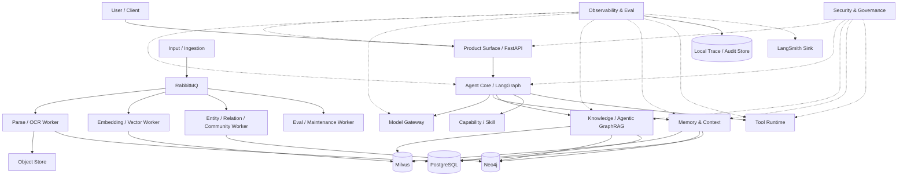
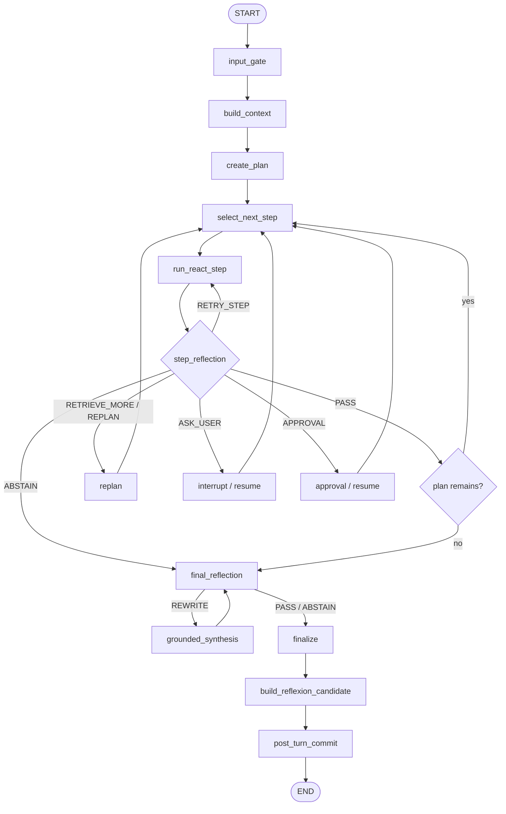

# Zuno Target Architecture Atlas

> Event-Driven Agentic GraphRAG Design Document

updated: 2026-07-11  
status: normative-target-architecture  
current_state_source: `docs/architecture/production-readiness.md`  
visual_atlas_source: `docs/architecture/architecture-views.md`

本文是 Zuno 的**目标总架构文档**，负责定义系统定位、逻辑模块、Agent 运行闭环、数据所有权、基础设施分工、安全边界、失败语义、可观测性和完成标准。

本文描述的是 **Target**，不是 Current。仓库当前真实实现、已知差距、blocked 原因和 measured 状态，以 `docs/architecture/production-readiness.md` 为事实源。目标能力不得仅因出现在本文、依赖文件、配置文件或代码骨架中，就被表述为已经完成或质量已经证明。

文档同步规则：

- `docs/architecture/architecture.md` 是对外目标架构文字事实源；
- `.agent/architecture/architecture.md` 是 Agent 工作区同步镜像；
- 两个文件必须保持内容一致；
- 修改任意一侧时，必须在同一轮变更中同步另一侧；
- 架构图由 `docs/architecture/architecture-views.md` 维护；
- 当前实现状态由 `docs/architecture/production-readiness.md` 维护。

---

# 1. 项目定位

Zuno 的目标是建设一个面向企业私有知识、复杂任务执行和个人 Agent Workspace 的：

> **基于 LangGraph 的事件驱动 Agentic GraphRAG Runtime。**

核心技术定位：

- **LangGraph**：Agent 在线控制平面；
- **Plan、ReAct、Reflection、Replan、Reflexion**：完整任务生命周期；
- **RabbitMQ**：文档处理、索引、评测、记忆整理和长任务的异步数据平面；
- **PostgreSQL**：事务事实源；
- **Milvus**：知识和长期记忆的语义向量索引；
- **Neo4j**：实体关系、图扩展、社区和多跳推理引擎；
- **BM25**：关键词召回；
- **Object Store**：原始文件、解析快照和 Artifact；
- **LangSmith-compatible sink**：外部 Trace 与 Eval；
- **本地 Trace/Audit Store**：系统独立运行和审计的事实源。

Zuno 不以“安装了多少组件”作为完成标准。所有组件必须通过稳定 contract 真实参与主链路，并由测试、Trace 和固定评测集证明其行为。

## 1.1 设计原则

```text
Agent 自主，但控制边界明确
流程动态，但状态可恢复
组件深度融合，但领域层不绑定厂商 SDK
知识可检索，但答案必须回到证据
记忆可积累，但必须经过治理
工具可执行，但副作用必须审批和幂等
消息可重试，但业务事实只由数据库确认
能力可观测，但不得伪造质量结论
```

## 1.2 非目标

近期不追求：

- 以微服务数量体现成熟度；
- 让每个 LangGraph 节点都通过 RabbitMQ 调度；
- 保存模型隐藏思维链；
- 把 Milvus、Neo4j 或 RabbitMQ 当成事务事实源；
- 把 LangSmith 当成安全执行模块；
- 保留多套互相竞争的 Agent Controller；
- 在 fixed benchmark 完成前宣称 Agentic GraphRAG 优于标准 RAG。

---

# 2. 总体架构

## 2.1 六个物理运行域

| 运行域 | 主要职责 |
| --- | --- |
| Product & API | Chat、Workspace、Upload、Approval、Citation、Artifact、Trace Viewer、SSE |
| Agent Control Plane | Context、Plan、ReAct、Reflection、Replan、Finalize、Reflexion |
| Knowledge & Memory Runtime | Retrieval Orchestrator、Milvus、Neo4j、BM25、Memory Context Builder |
| Async Data Plane | RabbitMQ、Parser Worker、Embedding Worker、Graph Worker、Eval Worker |
| Governance Plane | Security Gate、ACL、Approval、Audit、Policy、Redaction |
| Durable Infrastructure | PostgreSQL、Object Store、Checkpoint、Trace、Migration、Health Check |

这些是运行边界，不要求一开始拆成大量微服务。初期可以由同一 backend image 启动不同进程角色，但模块之间必须通过 typed contract 协作。

## 2.2 十一逻辑模块

1. Product Surface
2. Input / Document Ingestion
3. Knowledge / Agentic GraphRAG
4. Model Gateway
5. Memory & Context
6. Agent Core / Planning & Control
7. Capability / Skill
8. Tool Runtime
9. Security
10. Observability & Eval
11. Infrastructure

## 2.3 系统上下文



## 2.4 在线控制平面与异步数据平面

在线控制平面由 LangGraph 管理：

```text
Request
-> Context
-> Plan
-> ReAct Step
-> Reflection
-> optional Replan
-> Final Reflection
-> Finalize
-> Reflexion Candidate
```

RabbitMQ 负责耗时和可异步化工作：

```text
Document Parse / OCR
Embedding
Vector Index
Entity / Relation Extraction
Graph Index
Community Detection
Knowledge Rebuild
Offline Eval
Memory Consolidation
Long-running Artifact / Tool Job
Retry / DLQ
```

原则：

> LangGraph 决定做什么，RabbitMQ 承载耗时任务；在线 Agent 的每个普通节点不通过消息队列往返。

---

# 3. Agent 完整闭环

## 3.1 五个概念的层级关系

Plan、ReAct、Reflection、Replan、Reflexion 不是五种并列策略，而是任务生命周期中的五层机制。

| 机制 | 作用范围 | 职责 |
| --- | --- | --- |
| Plan | 整个任务 | 拆解目标、依赖、顺序、验收条件、预算、风险 |
| ReAct | 单个 PlanStep | 根据 Observation 动态选择知识、模型或工具动作 |
| Reflection | 步骤或最终结果 | 判断通过、重试、补检索、重规划、询问或放弃 |
| Replan | 剩余计划 | 当前提变化或执行偏离时修改后续轨迹 |
| Reflexion | 跨任务 | 把成功或失败经验形成受治理的长期记忆候选 |

## 3.2 任务生命周期



## 3.3 ReAct 步骤子图

```text
PlanStep
-> reason summary
-> action decision
-> capability/security policy
-> execute model/retrieval/tool
-> normalize observation
-> acceptance check
-> continue / complete / replan / approval / abstain
```

ReAct 只控制当前 PlanStep，不得自行覆盖全局目标，也不得直接写长期记忆。

## 3.4 Plan 与 Replan

Plan 必须包含：

```text
plan_id
version
goal
steps
dependencies
acceptance_criteria
allowed_capabilities
budget
risk
stop_conditions
created_by_model_call_id
```

Replan 不覆盖旧计划，而是产生可审计 `PlanPatch`：

```text
base_plan_version
remove_step_ids
update_steps
insert_steps
reason
trigger_observation_refs
created_by_model_call_id
```

## 3.5 Reflection

Reflection 输出结构化决策：

```text
PASS
RETRY_STEP
REWRITE_ANSWER
RETRIEVE_MORE
USE_TOOL
REPLAN
ASK_USER
APPROVAL
ABSTAIN
REFUSE
```

并记录：

```text
reason
failure_bucket
unsupported_claims
missing_evidence
suggested_actions
```

Reflection 可以由 deterministic gate、规则评估器和 critic model 组合，但必须受预算和最大轮数限制。

## 3.6 Reflexion

Reflexion 不保存隐藏思维链，只保存可审计经验：

```text
task_type
outcome
failure_type
root_cause_summary
failed_action
successful_action
lesson
recommended_strategy
applicability_conditions
confidence
evidence_refs
trace_refs
review_status
```

生命周期：

```text
Runtime Result
-> ReflexionCandidate
-> Redact
-> Deduplicate
-> Score
-> Governance Review
-> PostgreSQL
-> Milvus / Neo4j Index
-> Future ContextPack
-> Future Plan Influence
```

## 3.7 停止条件

所有循环必须受以下限制：

- 最大 PlanStep 数；
- 单步最大 ReAct 轮数；
- 最大 Reflection 次数；
- 最大 Replan 次数；
- 最大检索轮数；
- 最大 Tool 和副作用次数；
- 最大 token、费用和总时长；
- 用户取消；
- 安全策略阻止。

---

# 4. 十一逻辑模块设计

## 4.1 Product Surface

负责：

```text
AgentChat
Workspace
Knowledge Space
File Upload
Parse / Index Status
Task Timeline
Approval UI
Citation UI
Artifact
Trace Viewer
Feedback
Model Configuration
Memory Governance
```

边界：

- 前端不是业务事实源；
- 页面刷新后按 `task_id/run_id` 从后端恢复；
- Completion 和 Workspace 使用同一个 Agent Runtime；
- 前端不得直接访问 RabbitMQ、Milvus 或 Neo4j。

核心 contract：

```text
RuntimeRequest
RuntimeEvent
ApprovalDecision
GroundedAnswer
ArtifactRef
CitationView
TraceSummary
FeedbackRequest
MemoryReviewDecision
```

## 4.2 Input / Document Ingestion

目标链路：

```text
File / URL / Text / Image / Code
-> SourceObject
-> MIME Detection
-> Parser Routing
-> ParseJob
-> CanonicalDocumentIR
-> DocumentVersion
-> SourceSpan
-> IndexHandoffPayload
```

近期支持：PDF、DOCX、PPTX、XLSX/CSV、Markdown/TXT、HTML、代码文件、图片和扫描 PDF。

所有 Parser 必须输出统一 `CanonicalDocumentIR`，下游索引不得直接依赖特定解析器结构。

`SourceSpan` 至少支持：

```text
PDF: page + bbox + char range
DOCX: section + paragraph + run range
PPTX: slide + shape + bbox
XLSX: sheet + cell range
Markdown / Code: section path + line range
HTML: selector / DOM path
Image: image id + bbox
```

任务状态：

```text
queued
running
waiting_dependency
retrying
completed
blocked
failed
cancelled
dead_lettered
```

## 4.3 Knowledge / Agentic GraphRAG

离线索引：

```text
CanonicalDocumentIR
-> Parent Chunk / Citation Chunk
-> Embedding
-> Milvus
-> BM25
-> Entity / Relation Extraction
-> Neo4j
-> Community Detection
-> IndexManifest
```

在线检索：

```text
NeedRetrievalDecision
-> Query Analysis
-> RetrievalPlan
-> BM25 / Milvus / Neo4j
-> Fusion
-> Rerank
-> Parent / Neighbor / Graph Expansion
-> EvidenceLedger
-> RetrievalVerdict
-> Corrective Action
```

支持策略：

- Direct Query；
- Query Rewrite；
- Multi Query；
- Step-back；
- HyDE；
- Entity Decomposition；
- Relation Query；
- Graph Neighbor Expansion；
- Multi-hop Path；
- Community Search；
- Source Diversification；
- Contradiction Search。

### Milvus 职责

Milvus 是可重建语义索引，不是事实源。建议 Collection：

```text
knowledge_chunks
knowledge_parents
knowledge_images
agent_memories
procedural_lessons
```

索引字段至少包含：

```text
chunk_id / memory_id
document_id
document_version
workspace_id
knowledge_space_id
source_span_ref
parent_chunk_id
embedding_model
index_version
acl_scope
status
```

必须支持 batch upsert、workspace/ACL filter、document/index version filter、删除墓碑和 search trace。

### Neo4j 职责

主要节点：

```text
Workspace
KnowledgeSpace
Document
DocumentVersion
Chunk
Entity
Concept
GraphCommunity
User
Project
```

主要关系：

```text
HAS_VERSION
HAS_CHUNK
MENTIONS
RELATES_TO
SUPPORTED_BY
IN_COMMUNITY
DERIVED_FROM
BELONGS_TO
```

严格回答中的图事实必须回到：

```text
Graph Fact
-> Supporting Chunk
-> DocumentVersion
-> SourceSpan
```

没有支持 Chunk 的图事实只能用于检索扩展，不能作为 strict citation。

### Corrective Retrieval

failure bucket：

```text
document_miss
text_miss
entity_miss
relation_miss
multi_hop_miss
contradiction
stale_index
version_mismatch
acl_denied
no_candidate
insufficient_source_diversity
unsupported_graph_fact
```

Reflection 根据 bucket 触发 Query Rewrite、Milvus Multi Query、Neo4j Path Query、Source Diversification、Rebuild 或 Abstain，并通过 Replan 修改真实后续步骤。

### EvidenceLedger

每条证据至少记录：

```text
evidence_id
document_id
document_version
source_span_ref
retrieval_round
query_id
query_strategy
retriever
raw_score
fusion_score
rerank_score
graph_path
selection_reason
trace_span_ref
text_ref
```

## 4.4 Model Gateway

所有模型调用的唯一入口，统一管理：

```text
Planner
Executor
ReAct Decision
Critic
Synthesis
Query Rewrite
Embedding
Reranker
VLM / OCR
Memory Extraction
Reflexion
Eval Judge
```

职责：provider adapter、model slot、credential ref、timeout、retry、fallback、structured output、streaming、token/cost/latency、redaction、budget 和 trace。

业务模块禁止直接实例化 provider SDK 或 `ChatOpenAI`。

## 4.5 Memory & Context

必须区分：

```text
Context != Memory
Memory != Knowledge
Chat History != Long-term Memory
LangGraph State != Memory Database
Milvus Index != Memory Fact Source
Neo4j Relation != Entity Fact Source
```

四层 Memory：

- Sensory：输入、输出、Tool/Retrieval Observation 和系统事件；
- Short-term：Goal、PlanState、当前步骤、recent window、Evidence Summary；
- Long-term：Episodic、Semantic、Procedural；
- Entity：User、Project、Workspace、Preference、Relation、Effective Time、Confidence、Source。

存储分工：

- PostgreSQL：Memory 正文、来源、有效期、治理状态和撤销记录；
- Milvus：Episodic、Semantic、Procedural 的语义索引；
- Neo4j：Entity Memory 的关系查询视图。

`ContextPack` 必须记录选中、排除、过期、冲突、来源、token budget，以及 Memory 对 Strategy 或 Plan 的影响。

## 4.6 Agent Core / Planning & Control

职责：

```text
Runtime State
Input Gate orchestration
Context Builder
Planner
Plan Validator
Plan Executor
ReAct Step Controller
Observation Normalizer
Evidence Gate
Reflection Engine
Replan Engine
Grounded Synthesis
Final Reflection
Finalization Controller
Reflexion Bridge
Budget / Stop Controller
Interrupt / Resume
```

规则：

- LangGraph 是唯一产品主 controller；
- Completion 与 Workspace 共用同一 compiled graph；
- State 只保存小型可序列化数据；
- 文档、Evidence、Embedding、Tool binary 和 Artifact 只保存引用；
- 条件路由使用明确 enum；
- checkpoint、interrupt 和 resume 必须跨进程恢复。

## 4.7 Capability / Skill

概念边界：

```text
Function Calling = 模型表达调用意图的格式
MCP = 工具和资源接入协议
Tool = 原子动作
Skill = 完成一类任务的复用流程
Capability = 能力目录和选择层
Tool Runtime = 真实执行宿主
```

采用 Progressive Loading：

```text
Task
-> Capability Router
-> select small capability set
-> load Skill metadata
-> load instruction/resource on demand
-> expose AllowedTools to ReAct
```

PlanStep 只能看到当前被授权的 Capability 与 Tool。

## 4.8 Tool Runtime

将 `ToolCallIntent` 转换为受治理的真实动作：

```text
Schema Validation
-> Capability Policy
-> Security Gate
-> Approval
-> Idempotency Claim
-> Execute CLI / HTTP / Function / MCP / File / DB
-> Normalize Observation
```

宿主负责 allowlist、credential ref、workspace path、network policy、timeout、cancel、retry、atomic write、audit 和 result normalization。

短工具在线执行；长任务可提交 RabbitMQ，并通过 durable `JobHandle` 和事件恢复 LangGraph。

## 4.9 Security

七类 Gate：

1. Input Gate：身份、scope、PII、secret、prompt injection；
2. Retrieval Gate：ACL、cross-workspace、stale version、untrusted instruction；
3. Memory Gate：scope、privacy、expired/revoked/conflict；
4. Model Context Gate：发送模型前脱敏；
5. Tool Gate：allowlist、arguments、side effect、approval、credential、path、network；
6. Output Gate：unsupported claim、敏感泄露、citation coverage；
7. Artifact Gate：类型、路径、大小、敏感内容和发布权限。

LangSmith 只记录安全事件，不执行安全决策。Milvus 和 Neo4j 查询必须携带 workspace 和 ACL 条件。

## 4.10 Observability & Eval

Trace Tree：

```text
agent_run
├─ input_gate
├─ context_build
│  ├─ memory_postgres_read
│  ├─ memory_milvus_search
│  └─ entity_neo4j_query
├─ planner_model
├─ plan_validation
├─ execute_step
│  ├─ react_decision
│  ├─ retrieval_round
│  │  ├─ query_rewrite
│  │  ├─ bm25
│  │  ├─ milvus
│  │  ├─ neo4j
│  │  ├─ fusion
│  │  └─ rerank
│  └─ tool_call
├─ reflection
├─ replan
├─ synthesis
├─ citation_binding
├─ output_gate
├─ reflexion_candidate
└─ memory_commit
```

每个 Span 至少记录 status、input/output refs、model/provider、token、cost、latency、retry/fallback、failure bucket、security decision、evidence refs、tool id、memory refs、queue event id 和 plan version。

Trace Sink：

```text
PostgreSQL / Local Trace Sink   事实源
JSONL Sink                      调试
LangSmith Sink                  外部可观测与评测
```

严格区分：

```text
implementation available
runtime observed
measurement blocked
measured pass / fail
quality proven / not proven
```

## 4.11 Infrastructure

### PostgreSQL

事务事实源，保存：

```text
Workspace / User / Session
Task / AgentRun / RuntimeEvent
PlanVersion / PlanPatch
Checkpoint / Interrupt / Approval
SourceObject / DocumentVersion / ParseJob
IndexManifest
EvidenceLedger / ClaimBinding / Citation
Memory / Governance
ToolExecutionClaim
Job / OutboxEvent / InboxDedup
Trace / Audit metadata
```

### RabbitMQ

异步事件和任务骨干，负责 parse、OCR、embed、vector index、graph extraction、graph index、community、rebuild、eval、memory consolidation、长工具和 DLQ。RabbitMQ 不保存最终业务事实。

### Milvus

知识和 Memory 的语义索引，必须可从 PostgreSQL 与 Object Store 重建。

### Neo4j

实体关系、证据回链、多跳路径、社区和 Entity Memory 关系视图，必须可从权威来源重建。

### Object Store

保存原始文件、解析快照、OCR/VLM 输出、Artifact、大型 Tool Result 和 immutable blob。

### Redis

仅用于可丢失缓存、限流和短期协调，不作为 AgentRun、Memory、Evidence 或 Approval 的事实源。

---

# 5. RabbitMQ 事件架构

建议 Queue：

```text
zuno.document.parse
zuno.document.ocr
zuno.document.embed
zuno.document.vector.index
zuno.document.graph.extract
zuno.document.graph.index
zuno.document.keyword.index
zuno.knowledge.rebuild
zuno.eval.run
zuno.memory.consolidate
zuno.artifact.generate
```

每个 Queue 具有 retry 和 DLQ。

事件信封至少包含：

```text
event_id
event_type
schema_version
aggregate_type
aggregate_id
workspace_id
correlation_id
causation_id
trace_id
idempotency_key
occurred_at
payload
```

所有“数据库状态改变 + 发布消息”的操作必须使用 Transactional Outbox：

```text
PostgreSQL Transaction
├─ update aggregate
├─ create job
└─ insert OutboxEvent
        ↓
Outbox Publisher
        ↓
RabbitMQ
        ↓
Consumer
        ↓
InboxDedup + Business Transaction
```

消费者要求：durable queue、persistent message、manual ACK、prefetch、backoff retry、DLQ、幂等、schema version、trace propagation、poison message isolation、job lease 和 heartbeat。

---

# 6. 数据所有权与一致性

| 数据 | 权威事实源 | 索引/副本 |
| --- | --- | --- |
| User、Workspace、Task、Run | PostgreSQL | Redis Cache |
| Plan、Checkpoint、Interrupt | PostgreSQL | LangGraph State Snapshot |
| 原始文件、Artifact | Object Store | PostgreSQL Metadata |
| DocumentVersion、SourceSpan | PostgreSQL / Object Store | Milvus Metadata |
| 文本语义向量 | PostgreSQL Metadata | Milvus |
| 实体关系来源 | PostgreSQL Evidence Metadata | Neo4j |
| Memory 正文和治理状态 | PostgreSQL | Milvus / Neo4j |
| EvidenceLedger | PostgreSQL | Trace Summary |
| 异步任务 | PostgreSQL Job + Outbox | RabbitMQ Delivery |
| Trace/Audit | Local/PostgreSQL Trace Store | LangSmith |

一致性原则：

- PostgreSQL 事务先确认事实；
- RabbitMQ 使用至少一次投递；
- Consumer 必须幂等；
- Milvus 和 Neo4j 是可重建索引；
- IndexManifest 记录源版本、模型版本和索引版本；
- 查询禁止混用不兼容版本；
- 索引缺失或过期时返回 blocked/stale，不静默使用错误证据。

---

# 7. 核心 Contract

| 调用方 | 被调用方 | 请求 | 返回 |
| --- | --- | --- | --- |
| Product | Agent Core | `RuntimeRequest` | `RuntimeEvent`、`GroundedAnswer` |
| Agent Core | Model Gateway | `ModelCallRequest` | `ModelResult`、`UsageRecord` |
| Agent Core | Memory | `MemoryReadRequest`、`MemoryCommit` | `ContextPack`、Memory refs |
| Agent Core | Knowledge | `RetrievalPlan` | `EvidenceBundle`、`RetrievalVerdict` |
| Agent Core | Capability | `CapabilityQuery` | `CapabilityPlan`、`AllowedTools` |
| Agent Core | Tool Runtime | `ToolCallIntent` | `NormalizedToolObservation` |
| Input | Queue | `OutboxEvent` | `JobHandle` |
| Worker | Knowledge | `IndexHandoffPayload` | `IndexManifest` |
| Knowledge | Milvus | `VectorSearchRequest` | `VectorCandidate` |
| Knowledge | Neo4j | `GraphSearchRequest` | `GraphCandidate` |
| 各模块 | Security | `GateRequest` | `GateDecision`、`AuditEvent` |
| 各模块 | Observability | Span/Event | `TraceRef` |

所有 Contract 必须 typed、serializable、versioned、workspace scoped、traceable、failure-aware。

---

# 8. 失败语义

统一失败分类：

```text
validation_error
authentication_failed
authorization_denied
security_blocked
model_timeout
model_rate_limited
model_schema_invalid
retrieval_insufficient
index_stale
index_version_mismatch
tool_failed
tool_approval_denied
queue_publish_failed
queue_job_failed
dependency_unavailable
budget_exceeded
user_cancelled
internal_error
```

失败对象必须包含：

```text
error_code
message
retryable
owner_module
run_id
trace_id
caused_by
suggested_action
```

---

# 9. 恢复与幂等

Agent 恢复：

```text
Run starts
-> Plan created
-> Tool approval interrupt
-> process exits
-> new process loads PostgreSQL checkpoint
-> LangGraph resumes correct node
-> idempotency claim checked
-> Tool executes once
-> final answer and trace preserved
```

索引恢复：

```text
DocumentVersion committed
-> Outbox published
-> Worker writes Milvus and crashes
-> RabbitMQ redelivers
-> InboxDedup / IndexManifest checks idempotency
-> no duplicate logical chunk
-> job completes
```

幂等至少覆盖 Upload、ParseJob、Chunk、Embedding、Milvus Upsert、Neo4j Upsert、Tool Side Effect、Approval Resume、Memory Commit、Outbox Publish 和 Consumer Handling。

---

# 10. 部署架构

Target Full Runtime：

```text
frontend
backend-api
agent-runtime
worker-parse
worker-index
worker-graph
worker-eval
postgresql
rabbitmq
milvus
neo4j
object-store
optional redis
optional langsmith
```

健康检查必须区分：

```text
liveness
readiness
dependency health
queue lag
consumer health
database migration status
milvus collection/index status
neo4j connectivity
outbox backlog
dlq size
```

单元测试可使用 in-memory queue、SQLite、local vector/graph fake 和 mock model；但产品目标完成必须包含 PostgreSQL、RabbitMQ、Milvus、Neo4j 的真实集成测试。

---

# 11. 代码 Ownership

| 逻辑能力 | 代码 Owner |
| --- | --- |
| Product Surface | `apps/web`、`src/backend/zuno/api` |
| Input | `src/backend/zuno/knowledge/ingestion` |
| Knowledge | `src/backend/zuno/knowledge` |
| Model Gateway | `src/backend/zuno/platform/model_gateway.py` 和 provider adapters |
| Memory | `src/backend/zuno/memory` |
| Agent Core | `src/backend/zuno/agent` |
| Capability / Tool | `src/backend/zuno/capability` |
| Security | `src/backend/zuno/platform/security` |
| Observability & Eval | `src/backend/zuno/platform/observability`、`tools/evals/zuno` |
| PostgreSQL | `src/backend/zuno/platform/database`、`infra/db` |
| RabbitMQ | Queue Port、Outbox Publisher、Worker Runtime |
| Milvus | Knowledge/Memory Vector Adapters |
| Neo4j | Knowledge Graph Adapters |
| Object Store | Storage Adapters |

依赖方向：

```text
Product -> Application / Agent
Agent -> Ports
Domain Modules -> Ports
Infrastructure Adapters -> External SDK
```

---

# 12. 近期实施顺序

## P0：统一 Agent 闭环

- 一个 compiled LangGraph；
- Plan -> ReAct -> Reflection -> Replan -> Finalize -> Reflexion；
- 真实 Model Gateway；
- typed RuntimeState；
- PostgreSQL checkpoint；
- interrupt/resume；
- RuntimeLimits；
- GroundedAnswer。

## P1：PostgreSQL 与 RabbitMQ

- PostgreSQL schema 和 migration；
- Job、Outbox、InboxDedup；
- RabbitMQ producer/consumer lifecycle；
- retry、DLQ、prefetch、heartbeat；
- 幂等 Parse/Index Job；
- Queue Trace。

## P2：多格式 Input

- PDF、DOCX、PPTX、XLSX、Markdown、HTML、Code；
- CanonicalDocumentIR；
- SourceSpan；
- Parser Adapter；
- OCR/VLM blocked semantics。

## P3：Milvus + Neo4j Agentic GraphRAG

- Milvus versioned collections；
- Neo4j evidence-backed graph；
- BM25 + Milvus + Neo4j fusion；
- EvidenceLedger；
- Corrective Retrieval；
- Strict Citation。

## P4：Memory 与 Reflexion

- PostgreSQL Memory Governance；
- Milvus Memory Index；
- Neo4j Entity Relation View；
- Candidate Approve/Reject；
- Future ContextPack Reuse Proof。

## P5：Security、LangSmith 与固定评测

- 七类 Security Gate；
- Local Trace Store；
- LangSmith Sink；
- Fixed Paired Benchmark；
- Release Gate；
- Blocked/Measured Semantics。

---

# 13. Target Completion Criteria

目标架构完成必须满足：

1. 十一模块都有唯一 Owner、typed contract、failure semantics、持久化和 focused tests。
2. LangGraph 是唯一产品主 Controller。
3. Plan、ReAct、Reflection、Replan、Reflexion 在同一真实链路运行。
4. PostgreSQL 是 Task、Run、Plan、Checkpoint、Evidence、Memory、Approval 和 Outbox 的事实源。
5. RabbitMQ 真实承载 Parse、Embed、Graph、Index、Eval 和维护任务，并具备 retry、DLQ 和幂等。
6. Milvus 真实承载知识与长期记忆语义检索，支持 workspace、ACL 和 index version filter。
7. Neo4j 真实承载实体关系、多跳扩展和社区查询，图事实能回到支持 Chunk 和 SourceSpan。
8. BM25、Milvus、Neo4j 进入统一 RetrievalPlan、Fusion、Rerank 和 EvidenceLedger。
9. Corrective Retrieval 能根据 failure bucket 改变下一轮 RetrievalPlan。
10. Memory 跨请求、跨重启持久化，并证明 approved Reflexion lesson 影响未来 Plan。
11. Tool Runtime 支持审批、超时、恢复和副作用幂等。
12. Security Gate 覆盖 Input、Retrieval、Memory、Model Context、Tool、Output 和 Artifact。
13. Trace 记录模型、计划、检索、队列、工具、记忆、token、cost、failure bucket 和安全决策。
14. LangSmith 是脱敏后的外部 Sink，本地 Trace/Audit 可独立运行。
15. Completion、Workspace、Artifact、Citation 和 Trace 使用同一 Runtime 事实源。
16. `standard_rag`、`graphrag` 和 `agentic_graphrag` 在同一 fixed case set 上产生 measured pass/fail。
17. blocked、runtime observed、measured 和 quality proven 始终严格区分。
18. `docs/architecture/architecture.md` 与 `.agent/architecture/architecture.md` 始终内容一致。

---

# 14. 架构总纲

```text
用户请求
-> LangGraph 构建 Context
-> Plan 生成全局任务计划
-> ReAct 执行单个步骤
-> Milvus / Neo4j / BM25 提供证据
-> Tool Runtime 执行动作
-> Reflection 判断步骤质量
-> Replan 修改剩余计划
-> Final Reflection 验证答案
-> Finalize 输出 GroundedAnswer
-> Reflexion 形成受治理经验
-> PostgreSQL 保存事实
-> Milvus / Neo4j 建立可重建索引
-> RabbitMQ 驱动异步数据处理
-> Local Trace + LangSmith 记录与评测
```

核心原则：

> **LangGraph 管控制，RabbitMQ 管异步任务，PostgreSQL 管事实，Milvus 管语义检索，Neo4j 管关系推理，Security 管边界，Observability 管证据，Eval 管质量结论。**
