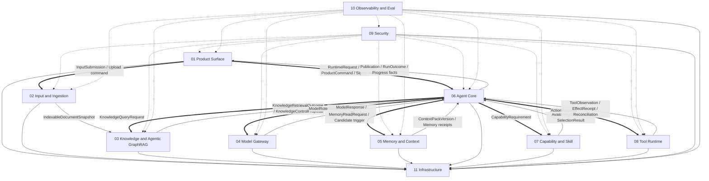
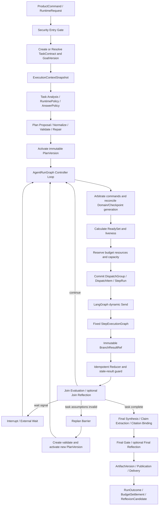
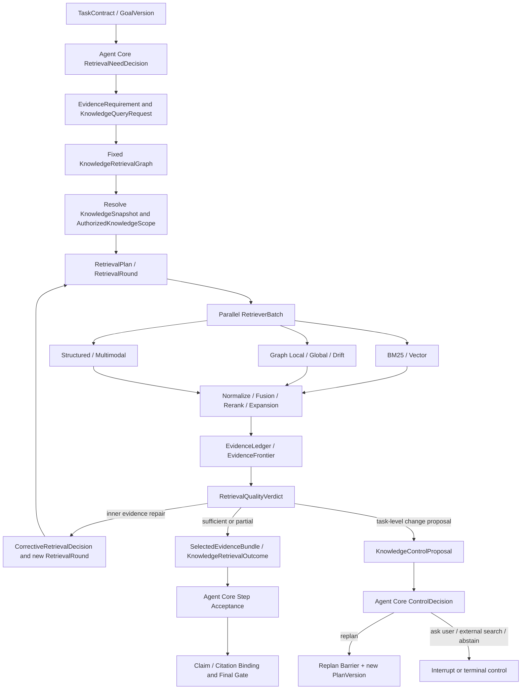
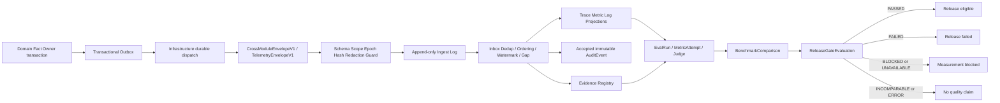

# Zuno 总体 Target 架构

updated: 2026-07-14
status: normative-target-integration-architecture
document_role: cross-module integration source
canonical_domain_sources: `docs/modules/01-*.md` through `docs/modules/11-*.md`
current_state_source: `docs/status/production-readiness.md`

> 本文是 Zuno 十一模块（十一个逻辑模块）的跨模块集成架构。它解释模块如何组成一个可恢复、可并行、可审计的企业 Agent 系统，但不复制每个模块的全部字段、状态机、数据库表和 Adapter 规格。
>
> 领域对象、状态转换、Failure、持久化和测试细节发生冲突时，以对应 Canonical Owner 的模块文档为准；本文必须在同一轮治理变更中被修正。`architecture-views.md` 与 `architecture.html` 是说明性可视化，优先级最低，不得反向修改模块 Contract。

## 0. 正式事实源、优先级与维护顺序

Zuno 正式架构设计事实共十三份：

```text
11 × docs/modules/<NN>-<module>.md
 1 × docs/architecture/architecture.md
 1 × docs/architecture/architecture.html
```

维护支撑文件：

```text
docs/architecture/README.md
    目录、优先级、镜像与维护规则。

docs/architecture/architecture-views.md
    architecture.html 使用的 Mermaid 图源；不是第二份文字架构。

.agent/architecture/*
.agent/modules/*
    正式文件的字节级镜像；不是独立事实源。
```

规范优先级和更新方向固定为：

```text
全局不可变原则、已接受 ADR、共享 Contract Registry
→ 对应 Canonical Owner 的十一份模块 Target 文档
→ architecture.md 跨模块集成架构
→ architecture-views.md 说明性 Mermaid
→ architecture.html 渲染与导航
→ 已确认 Program
→ 代码、Migration、测试、Trace、Eval 与运行证据
```

含义：

1. 模块文档最接近领域事实，定义 Owner、Contract、状态、Failure 和完成证据。
2. 总架构负责跨模块组合，不得发明模块文档不存在的领域终态。
3. Mermaid 为阅读服务，可以压缩流程，但不能删除会改变语义的 Gate、Commit、Proposal、Barrier、Reconciliation 或状态分支。
4. HTML 动态渲染 Mermaid，不拥有任何独立架构语义。
5. Current、Gap、Measurement 和 Production Readiness 只由最新 `main` 的代码、Migration、测试、Trace、Eval、`docs/status/` 与 `docs/evidence/` 证明。

---

# 1. 问题、目标与非目标

## 1.1 问题

Zuno 面向企业知识问答和长运行任务执行。一次请求可能跨越用户交互、文件摄取、任务规划、证据检索、多模型调用、能力选择、工具审批、外部副作用、长期记忆、审计、评测和异步恢复。普通“FastAPI → 单个 Agent 循环 → Provider SDK”结构无法稳定回答：

```text
Run 是否持久存在并可恢复
计划和任务目标是否有不可变版本
Ready Step 为什么可以或不可以并行
模型输出是否只是 Proposal
检索结果能否回到授权后的 SourceSpan
Knowledge 内层纠正是否错误升级为 Agent Replan
Tool timeout 后外部效果是否已经发生
Approval 是否绑定准确参数、目标资源和 Security Epoch
Domain Commit 与 LangGraph Checkpoint 不一致时如何恢复
Trace、Audit、Eval 与源领域事实分别由谁拥有
质量提升是否来自可比较的 Benchmark 和 Release Gate
```

## 1.2 目标

Zuno Target 必须实现：

1. **领域无关**：Agent Core 只依赖 typed Contract，不硬编码知识库、模型厂商或工具 Provider。
2. **Single Controller**：一个 AgentRun 只有 Agent Core 可以决定 Plan、Step、Retry、Replan、Finalize 和 RunOutcome。
3. **证据保真**：原始文件、SourceSpan、CitationLineage、Evidence 和 Claim Binding 可追踪。
4. **安全并行**：Plan DAG、Retriever Batch 和异步任务只在依赖、资源、副作用、安全、预算和配额允许时并行。
5. **可恢复**：Domain Fact、Checkpoint、Queue、Lease、外部调用和 Projection 均有明确恢复与 Reconciliation。
6. **可审计**：安全决定、Tool Effect、模型 Attempt、Evidence、Publication 和质量声明可关联。
7. **可验证**：每个 Requirement 映射 Control、Unit、Integration、Fault、E2E、Eval 和 Evidence。
8. **安全默认关闭**：未知权限、未知 Effect、陈旧 Epoch、缺失证据和不兼容版本 fail closed。
9. **轻量部署、成熟语义**：初期允许一个后端镜像承担多个角色，不以微服务数量证明成熟度。

## 1.3 非目标

近期不默认建设：

```text
产品级自治 Multi-Agent Runtime
全系统 Event Sourcing
XA / 2PC
Kafka 作为默认工作队列
Kubernetes 作为完成条件
默认多区域 Active-Active
保存模型隐藏思维链
让模型、前端或 Projection 直接提交领域终态
让 Redis、Milvus、Neo4j、RabbitMQ、LangSmith 或 Checkpoint 成为业务事实源
```

---

# 2. 全局架构原则

## 2.1 Agent Core 是唯一控制器

```text
固定 AgentRunGraph
+ 动态 Plan DAG
+ 固定 StepExecutionGraph
```

所有任务都有 Plan：简单任务使用 Deterministic Single-Step Plan，复杂任务使用 Dynamic DAG Plan。正式回答不得绕过 TaskContract、GoalVersion、Plan、Trace、Budget、AnswerPolicy、Final Gate、Publication 与 RunOutcome。

## 2.2 模型只产生 Proposal

模型可以产生 Task Analysis、Plan Proposal、ActionProposal、Query Rewrite、Extraction Candidate、Critic Result、MemoryCandidate 和 Security Risk Proposal；模型不能激活 PlanVersion、批准权限、取得明文 Secret、提交 Tool Effect、修改 KnowledgeVersion、提交长期 Memory、绕过 Budget 或发布最终答案。

## 2.3 Canonical Owner 决定领域事实

每个 Contract 只有一个 Canonical Owner。消费者可以校验、拒绝、投影和引用，但不能重命名生产者 Failure、覆盖状态或把 Proposal 当成最终决定。

## 2.4 Receipt 只证明自己的边界

```text
HTTP 2xx
Queue ACK
Object Commit
Checkpoint Commit
IndexWriteReceipt
AuditPersistenceReceipt
SSE Close
Client ACK
```

只证明各自物理或交付事实，不能冒充 AgentRun、KnowledgeVersion、Tool Effect、AuditEvent、Publication 或质量成功。

## 2.5 Retry、Corrective Retrieval、Replan 与 Reconciliation 分离

```text
Retry
    计划与假设仍成立，只重做一次 Attempt。

Repair / Fallback
    修参数、Schema 或兼容实现，不改变目标结构。

Corrective Retrieval
    Knowledge 内创建新的 RetrievalRound，修复证据缺口，不修改 Agent PlanVersion。

Replan
    Agent Core 判断目标、假设、依赖或能力结构失效，经 Replan Barrier 创建新 PlanVersion。

Reconciliation
    外部结果未知，先确认实际状态，不盲目重做副作用。

Compensation
    新的受治理 ActionProposal，不删除历史 Effect。
```

## 2.6 PostgreSQL、Checkpointer 与 Projection 分工

```text
PostgreSQL
    领域事实、状态转换、Generation、版本、Outbox、Approval、Effect、Evidence、Memory、Eval 关联。

LangGraph Checkpointer
    Graph 节点、Channel、Pending Send、Interrupt Cursor、Reducer 控制状态和恢复位置。

Object Store
    大型不可变 Payload、Artifact、Parser 产物和调试包。

BM25 / Vector / Graph / Product / Observability Projection
    可重建的派生读模型，不是源领域事实。
```

## 2.7 安全、预算与审计先于副作用

```text
ActionProposal
→ Tool Runtime Prepare / Canonicalize
→ Security Prepare Gate
→ optional Approval
→ Security Execute Gate + latest EffectiveSecurityEpoch
→ Mandatory Audit durable receipt（适用时）
→ Infrastructure IdempotencyClaim
→ ToolAttempt
→ EffectReceipt 或 EffectReconciliation
→ Agent Core ControlDecision
```

---

# 3. 十一个逻辑模块



| 编号 | 模块 | Canonical Ownership | 唯一详细设计 |
| --- | --- | --- | --- |
| 01 | Product Surface | Conversation、Submission、ProductCommand、RuntimeRequest、CommandReceipt、Projection、ChannelDelivery、ClientRender、UserRead | `docs/modules/01-product-surface.md` |
| 02 | Input / Document Ingestion | SourceObject、DocumentVersion、ParsePlan/Job/Attempt/Snapshot、CanonicalDocumentIR、原始 SourceSpan、质量门和 Handoff | `docs/modules/02-input-document-ingestion.md` |
| 03 | Knowledge / Agentic GraphRAG | KnowledgeVersion/Snapshot、IndexSpec/Manifest 接受语义、RetrievalPlan/Round、EvidenceLedger、CitationLineage | `docs/modules/03-knowledge-agentic-graphrag.md` |
| 04 | Model Gateway | Model Role/Operation、Provider/Model、Routing、Call/Attempt、Response、Usage、Quota、Health、Circuit | `docs/modules/04-model-gateway.md` |
| 05 | Memory & Context | Session/Long-term Memory、Candidate、Governance、MemoryVersion、ContextPackVersion、UseTrace、Privacy Lifecycle | `docs/modules/05-memory-context.md` |
| 06 | Agent Core | TaskContract、GoalVersion、AgentRun、PlanVersion、StepRun、ActionRun、ControlDecision、Publication、RunOutcome | `docs/modules/06-agent-core-planning-control.md` |
| 07 | Capability / Skill | Capability/Skill Definition 与 Version、Requirement、ProviderBinding、Conformance、Availability、Selection | `docs/modules/07-capability-skill.md` |
| 08 | Tool Runtime | Tool Provider/Definition/Version、PreparedToolAction、ToolAttempt、Observation、Execution/Effect/Reconciliation | `docs/modules/08-tool-runtime.md` |
| 09 | Security | Principal、授权、Policy、Grant、Approval、EffectiveSecurityEpoch、Secret、Information Flow 与安全 Gate | `docs/modules/09-security.md` |
| 10 | Observability & Eval | Trace/Metric/Log Projection、accepted AuditEvent、Eval、Benchmark、Evidence Registry、ReleaseGateEvaluation | `docs/modules/10-observability-eval.md` |
| 11 | Infrastructure | Transaction、Object、Queue、Inbox/Outbox、Lease/Fencing、Checkpoint、Index 物理执行、Backup/Restore | `docs/modules/11-infrastructure.md` |

---

# 4. 全局事实所有权

| 事实 | Owner | 不可跨越的边界 |
| --- | --- | --- |
| ConversationThread、UserSubmission、ProductCommand、ChannelDelivery | Product Surface | 不创建 Plan、Approval、Effect 或 RunOutcome |
| SourceObject、DocumentVersion、ParseSnapshot、CanonicalDocumentIR、原始 SourceSpan | Input | 不创建 Chunk、Evidence 或 KnowledgeVersion |
| KnowledgeVersion、KnowledgeSnapshot、RetrievalRound、Evidence、CitationLineage | Knowledge | 物理索引成功不等于领域 Acceptance |
| ModelRoutingDecision、ModelCallAttempt、ModelResponse、UsageReceipt | Model Gateway | 模型结果不是最终业务事实 |
| MemoryCandidate、MemoryVersion、ContextPackVersion | Memory | Reflexion、Summary 和 Entity Fact 先成为 Candidate |
| TaskContract、GoalVersion、AgentRun、PlanVersion、StepRun、ActionRun、Publication、RunOutcome | Agent Core | 编排其他模块但不冒充其事实 Owner |
| CapabilityVersion、SkillVersion、AvailabilitySnapshot、SelectionResult | Capability | Selection 不等于 Authorization、Execution Readiness 或 Plan Activation |
| PreparedToolAction、ToolAttempt、ToolObservation、EffectReceipt、EffectReconciliation | Tool Runtime | 不拥有 Approval、SecretLease 或 IdempotencyClaim |
| AuthorizationDecision、ApprovalDecision、EffectiveSecurityEpoch、InformationFlowDecision | Security | 前端、模型和不可信内容都不是安全事实源 |
| Trace/Metric/Log Projection、accepted AuditEvent、Eval、Benchmark、EvidenceRecord、ReleaseGateEvaluation | Observability & Eval | 接收事件不转移源领域 Ownership |
| QueueDelivery、Lease、Fencing、ObjectCommit、Checkpoint、Physical Index Receipt、AuditPersistenceReceipt | Infrastructure | 物理 Receipt 不冒充领域终态 |

跨模块 Envelope 至少支持 tenant、workspace、principal、run、plan、step、action、trace、correlation、causation、aggregate version、expected generation、security epoch、deadline、payload hash 和 schema hash。

---

# 5. 在线 Agent 完整运行流程



## 5.1 初始化与计划

```text
validate_runtime_request
→ create_or_resolve_task_contract
→ classify supplemental input or GoalVersion change
→ resolve_authorization and effective policy
→ create ExecutionContextSnapshot
→ build ContextPackVersion references
→ analyze task and complexity
→ resolve RuntimePolicy / AnswerPolicy
→ create Plan Proposal
→ normalize / validate / repair
→ atomically activate immutable PlanVersion
```

Planner 必须检查 Goal Coverage、DAG、依赖、输入输出、Capability、Security、Budget、资源冲突、Side-effect Class、JoinPolicy、Acceptance 和 Terminal Deliverable。模型 Planner 只产生 Proposal。

## 5.2 Controller Loop

```text
arbitrate_control_commands
→ reconcile_domain_and_checkpoint_generation
→ reconcile_expired_or_orphaned_facts
→ calculate_ready_set
→ evaluate_liveness
→ reserve_budget_and_resources
→ commit_dispatch
→ dynamic_send_step_workers
→ collect_branch_results
→ reduce_branch_results
→ evaluate_join
→ continue / wait / retry / replan / finalize
```

Dispatch 必须先持久化再 Send。Worker 只返回不可变 `BranchResultRef`，不得直接修改共享 Run。Reducer 必须幂等、顺序无关，并拒绝旧 PlanVersion、旧 controller/execution epoch、stale fencing 和 hash 冲突。

## 5.3 StepExecutionGraph

```text
load_step_definition
→ verify PlanVersion and execution epoch
→ resolve inputs and acquire resource claims
→ confirm budget reservation and preflight security
→ decide and validate ActionProposal
→ prepare side effect and await approval when required
→ claim idempotency
→ execute through the owning module
→ normalize observation
→ persist observation and usage
→ Action Evaluation
→ Step Acceptance
→ optional Step Reflection
→ ControlDecision
```

每个 Action 都 Evaluation，每个 Step 都 Acceptance。Reflection 只在失败、冲突、高风险、关键决策或重复失败时触发。Step Progress 可以是 Continue ReAct、Retry、Repair、Fallback、Model Escalation、Complete、Request Replan、Wait Signal、Block、Abstain 或 Fail。

## 5.4 Replan Barrier

Replan 不修改 Active PlanVersion。Barrier 先停止旧 Plan 新 Dispatch，再处理 `CANCEL_SAFE`、`DRAIN_REQUIRED` 与 `NON_INTERRUPTIBLE` 分支，收集已提交事实，创建并验证新 PlanVersion，原子切换后重新计算 ReadySet。旧分支晚到结果必须按 ResultValidity 标记 STALE、SUPERSEDED、TAINTED 或 LATE_IGNORED。

## 5.5 Finalization

```text
final_synthesis
→ FinalCandidate
→ extract claims
→ bind Evidence and Citation
→ Final Gate
→ optional Final Reflection
→ ArtifactVersion
→ Publication
→ ChannelDelivery / DeliveryReceipt
→ RunOutcome
→ BudgetSettlement
→ ReflexionCandidate
```

Provisional token、FinalCandidate、Artifact、Publication、Delivery 和 UserRead 是不同事实。终局至少区分 COMPLETED、PARTIAL、ABSTAINED、REFUSED、BLOCKED、FAILED、CANCELLED 和 EXPIRED。

---

# 6. 文档摄取与 Knowledge 发布流程

```mermaid
flowchart LR
  SUB[InputSubmission / Connector] --> OBJ[SourceObject + IntegrityReceipt]
  OBJ --> DV[Immutable DocumentVersion]
  DV --> PROF[SourceProfile / Security Preflight]
  PROF --> PLAN[ParsePlan / ParseJob]
  PLAN --> TASK[ParseTask / ParseAttempt with Lease and Fencing]
  TASK --> IR[CanonicalDocumentIR + original SourceSpan + TransformLedger]
  IR --> Q[ParserQualityReport / MissingContentManifest]
  Q -->|PASS or allowed DEGRADED| PS[Immutable ParseSnapshot]
  Q -->|BLOCK| BLK[Blocked / Human Review]
  PS --> HAND[IndexableDocumentSnapshot]
  HAND --> KV[KnowledgeVersion BUILDING]
  KV --> SPEC[IndexSpec / IndexWriteBatch]
  SPEC --> WR[IndexWriteReceipt]
  WR --> VIS[WriteVisibilityReceipt]
  VIS --> VER[IndexVerification]
  VER --> MAN[Knowledge IndexManifest]
  MAN --> ACC[Knowledge Acceptance]
  ACC --> CUT[IndexCutover]
  CUT --> SERVE[ServingWatermark / KnowledgeSnapshot]
```



不变量：

- 在线附件和长期知识摄取共享 Unified Ingestion Kernel，但使用不同 Processing Profile、Priority、Deadline、Retention 和是否建立长期索引。
- 原始字节不可被清洗、OCR、VLM 或模型结果覆盖。
- 源内容变化创建新 DocumentVersion；Parser、模型、配置或 Schema 变化创建新 ParseSnapshot。
- Input 拥有原始 SourceSpan；Knowledge 生成 CitationChunk、Entity、Relation 和 Community，并保留回链。
- BLOCK 或完整性无效的 ParseSnapshot 不得交给 Knowledge。
- Infrastructure 执行物理写入、可见性、验证和 Cutover primitive；Knowledge 决定 Manifest、Acceptance 和服务版本。
- IndexWriteReceipt、ServingWatermark 或后端健康状态不自动等于 KnowledgeVersion ACTIVE。
- 删除先撤销访问和新读取，再传播 Tombstone、Knowledge/Memory 删除和物理清理，由 Verification 收口。

---

# 7. Agentic GraphRAG 与证据闭环

Agentic GraphRAG 是两层控制系统：Agent Core 外层决定 why/when、Evidence Goal、Task Budget、继续、Ask User、External Tool、Replan、Abstain 与 Finalize；Knowledge 内层在固定安全、Snapshot、Profile 和预算范围内决定 how，包括 Query Strategy、Retriever、Graph Route、Fusion、Rerank、Evidence Quality、Corrective Retrieval 和局部 Stop Proposal。



## 7.1 Evidence Lineage

```text
DocumentVersion
→ SourceSpan
→ CitationChunk
→ Entity / Relation / Community Evidence Backlink
→ RetrieverAttempt / RetrievalRound
→ EvidenceRecord / EvidenceLedger / EvidenceFrontier
→ SelectedEvidenceBundle
→ ContextPackVersion
→ ClaimEvidenceBinding / Citation
→ Final Gate / Publication
```

没有 SourceSpan 的 Graph 结果只能 `AUXILIARY_ONLY`，不能成为 strict citation。ACL 必须进入 Retriever Query；不能先召回敏感内容再在 Python 中删除。

## 7.2 Corrective Retrieval 与 Replan

Knowledge 内层纠正创建新的 append-only RetrievalRound，例如 Query Rewrite、Multi-query、Parent/Adjacent Expansion、Graph Route、Citation Repair、Conflict Retrieval 或 Index Recovery Proposal。只有当任务目标、计划依赖、能力结构或前提失效时，Knowledge 才输出 `KnowledgeControlProposal`；Agent Core 验证后才能形成 Replan ControlDecision 和新 PlanVersion。

## 7.3 Stop 与输出

Knowledge 输出只允许 SUFFICIENT_EVIDENCE、PARTIAL_EVIDENCE、ASK_USER_PROPOSAL、EXTERNAL_SEARCH_PROPOSAL、REPLAN_REQUIRED、ABSTAIN_PROPOSAL、FAILED 或 CANCELLED。最终 Ask User、外部 Tool Step、Replan、Abstain 与 Finalize 由 Agent Core 决定。

---

# 8. Model、Capability 与 Memory 协作

## 8.1 Model Gateway

所有真实生成、Embedding、Rerank、Vision、Transcription、Classification 和 Judge 调用通过 Provider-neutral Gateway：

```text
ModelRoleRequirement + Operation + Capability Requirement
→ Security / Residency / Redaction
→ Budget / Quota / Admission
→ immutable RoutingDecision
→ ModelCallAttempt
→ Stream / Response / Structured Output Validation
→ ModelResponse
→ UsageReceipt / Settlement / Correction
→ Reconciliation when provider outcome is uncertain
```

业务模块不直接创建 Provider SDK Client。SDK 隐式 Retry 必须被禁止或显式展开为 Attempt。模型输出保持 Proposal、Candidate、Score 或 Result。

## 8.2 Capability / Skill

```text
Task / Step Requirement
→ Skill discovery and progressive loading
→ CapabilityRequirement
→ CapabilityAvailabilitySnapshot
→ ProviderConformance and compatibility filters
→ CapabilitySelectionResult
→ Agent Core StepFeasibilityDecision
→ Plan pins exact versions
→ Action-time preflight
→ ActionProposal
```

Capability/Skill 管理“系统能做什么、任务应如何做、哪些实现满足语义”；Tool Runtime 管理具体 Tool 如何准备、执行和确认效果。Availability 不等于 Authorization、Execution Readiness、StepFeasibility 或 Plan Activation。

## 8.3 Memory & Context

```text
Conversation / RunOutcome / approved feedback / Evidence refs
→ MemoryCaptureIntent
→ MemoryCandidate
→ Redaction / Dedup / Conflict / GovernanceDecision
→ immutable MemoryVersion
→ Projection build / verification / acceptance / cutover
→ MemorySnapshot and task-time recall
→ ContextCandidateItem / Protected Set / Budget Packing
→ immutable ContextPackVersion
→ MemoryUseTrace / Utility / negative-transfer evaluation
```

Working Memory 的控制语义归 Agent Core；Session 和 Long-term Memory 归 Memory。Episodic、Semantic、Procedural 是长期内容类型；Entity 是 Semantic Projection；Vector/Graph/Lexical 是可重建 Projection。ContextPack 是预算化只读视图，不是另一层 Memory。Reflexion 只生成 Candidate。

---

# 9. Tool Runtime 与外部效果

Tool Runtime 是唯一受治理工具效果执行平面：

```text
ActionProposal
→ resolve exact ToolVersion / ProviderInstance / AdapterBinding
→ canonical arguments / TargetResourceSet / canonical hash
→ PreparedToolAction
→ Security Prepare Gate
→ optional SecurityApprovalDecision
→ Security Execute Gate and latest EffectiveSecurityEpoch
→ mandatory AuditPersistenceReceipt when required
→ IdempotencyClaim / Lease / SecretLease
→ ToolAttempt
→ native result and ToolObservation
→ ToolExecutionReceipt
→ EffectReceipt or EffectReconciliation
→ Agent Core ControlDecision
```

Effect Outcome 至少区分 CONFIRMED_SUCCESS、CONFIRMED_FAILURE、CONFIRMED_NOT_EXECUTED、CANCELLED、UNKNOWN 和 HUMAN_REQUIRED。UNKNOWN 禁止普通 Retry；必须先 Provider 查询、业务键、回调、人工核实或 Reconciliation。Compensation 是新的 ActionProposal。

Tool Output 默认不可信，进入模型、Knowledge、Memory、Artifact 或 Product 前执行 Schema、Classification、Prompt Injection 与 Redaction Gate。MCP 是协议，不是 Capability 或 Runtime Owner；MCP Tool 执行归 08，MCP Sampling 归 04，Approval 和 OAuth 安全归 09。

---

# 10. Security、Audit 与 Information Flow

Security 是服务器端安全控制面和安全事实 Owner。它在 Product Entry、Input/Connector、Retrieval、Memory Read/Write、Model Dispatch、Capability Exposure、Tool Prepare/Execute、Output/Publication、Artifact Download 和 Observability Export 执行 Gate。

Effective Permission 是 Principal、Tenant、Workspace、OrgUnit、AgentProfile、Task、Run、Action、Resource、Policy 和当前 Epoch 的最小交集。Approval 必须绑定 principal、scope、PreparedToolAction canonical hash、参数、TargetResourceSet、risk/effect profile、PolicyVersion、EffectiveSecurityEpoch、expiry 和 single-use/replay rule。

可信 Instruction 与不可信 Data 必须分离。Document、Web、Tool Output、MCP Server、Memory Candidate 和模型输出不能直接控制 Protected Sink；必须经过 InstructionTrustLabel、InformationFlowDecision、DeclassificationDecision、ActionIntentBinding 和确定性 PEP。

Audit 三层：

```text
SecurityAuditRequirementV1        Owner: Security
AuditPersistenceReceiptV1         Owner: Infrastructure physical durability
accepted immutable AuditEvent     Owner: Observability & Eval
```

`AuditPersistenceReceipt != AuditEvent != Tool Effect success`。ExternalSinkDelivery、StructuredLog、Trace Projection 与 Queue ACK 都不能替代 AuditEvent。

---

# 11. 状态、并发、恢复与幂等

## 11.1 版本不可变

PlanVersion、GoalVersion、DocumentVersion、ParseSnapshot、KnowledgeVersion/Snapshot、ModelRoutingDecision、MemoryVersion、ContextPackVersion、CapabilityVersion、SkillVersion、PreparedToolAction、PolicyVersion、Eval Dataset/Profile 激活或提交后不可原地改写。修改产生新 Version，并保留 lineage、hash、generation 与 supersedes。

## 11.2 并行与 Join

Ready Step 只有在以下条件均成立时并行：

```text
Active PlanVersion
依赖与 ActivationCondition 满足
输入可用
Security / Capability / Budget / Quota 允许
不存在同资源写冲突或排他资源
副作用 Policy 允许并行
Resource Claim 和 Capacity Reservation 成功
JoinPolicy 已确定
```

RetrieverBatch 同样固定 Snapshot、Scope、Budget、JoinPolicy 和 deadline。并行分支以 immutable result ref 返回，Join 后晚到结果不能污染 Outcome。

## 11.3 事务、Inbox/Outbox 与 Effect-once

数据库事务内禁止远程模型、Tool、Object Store、Queue、Parser 或索引调用。典型模式：条件写领域事实与 Outbox 同事务提交，之后 at-least-once 投递，消费者使用 Inbox、Dedup、Claim、Fencing 和幂等 Reducer实现 effect-once。外部副作用不承诺通用 exactly-once，只能依赖 Provider 幂等、业务键或 Reconciliation。

## 11.4 Domain Generation 与 Checkpoint Generation

Domain Generation 是权威提交序列；Checkpoint 只能引用已提交 Generation。Domain > Checkpoint 时从领域事实重建控制状态；Checkpoint > Domain 时回退到最后合法 Generation。Checkpoint 存在但 Domain Aggregate 不存在时 quarantine，不能伪造业务事实。

## 11.5 恢复分类

```text
CONTROL_REPLAY
    重放图控制，不重新产生外部效果。

RECOVERY
    从已提交 Domain Fact 与 Checkpoint 恢复同一 Run。

REEXECUTION
    创建新 Attempt，重新满足 Gate 与幂等规则。

RECONCILIATION
    确认未知跨系统结果。

SIMULATION_FORK
    隔离实验，不修改生产事实。
```

RunOrphan、Dispatch、StepLease、UnknownAction、InterruptExpiry、Publication、Outbox、BudgetReservation、Index、Memory Projection 和 Telemetry Gap 都需要专属 Reconciler、Claim、Fencing、Idempotency 与人工介入条件。

## 11.6 Cancellation、Deadline 与 Revocation

控制命令按 Run 串行仲裁：Security Revocation 高于 Cancellation、Deadline、UNKNOWN Effect Reconciliation、Approval/Signal、Budget、Replan 和普通调度。取消停止新 Dispatch，取消安全分支，等待或 Reconcile 不可中断副作用，并提交 CANCELLED 或 PARTIAL Outcome。Security Epoch 变化使未提交结果必须重验，已撤销 Evidence/Memory/Approval/Projection 进入 taint 或不可访问流程。

---

# 12. 物理运行域与部署

六个物理运行域：

| 运行域 | 主要职责 | 初期部署 |
| --- | --- | --- |
| Product & API | Web/Desktop/API、Command/Query/Stream、Projection Delivery | frontend + backend-api |
| Agent Control Plane | AgentRunGraph、Plan DAG、StepExecutionGraph | controller role |
| Knowledge & Memory Runtime | Retrieval、Evidence、Memory、Context | backend internal roles |
| Async Data Plane | Parse、OCR、Index、Eval、Consolidation、Reconciliation | worker roles |
| Governance Plane | Security、Audit、Policy、Eval Gate | backend cross-cutting |
| Durable Infrastructure | PostgreSQL、Object Store、RabbitMQ、Checkpointer、derived indexes | managed or replaceable adapters |

Canonical Server Target：

```text
Web / Desktop / External API
→ Server-hosted Product API
→ Principal / Tenant / Workspace resolution
→ Security + Canonical Domain Owners
→ PostgreSQL / Object Store / RabbitMQ / LangGraph Checkpointer
→ rebuildable BM25 / Milvus Vector / Neo4j Graph / Product and Observability projections
```

PostgreSQL 16+ 是结构化领域事实 Target；S3-compatible Object Store/MinIO 保存不可变大对象；RabbitMQ durable/quorum queue 负责异步投递；PostgreSQL-compatible LangGraph Checkpointer 保存控制状态；Milvus、Neo4j 和 BM25/Search 是可重建派生索引；Redis 是可选非权威加速。SQLite、本地文件、in-process queue 和 mock provider 仅是 Developer/CI Adapter。

前端不得直连数据库、Queue、Object Store、索引、模型 Provider 或 Secret Store。近期不默认建设大量微服务。

---

# 13. 跨模块 Contract

`CrossModuleEnvelopeV1` 至少携带：

```yaml
contract_name: string
contract_version: string
contract_bundle_version: string
message_id: string
producer_module: string
consumer_module: string
tenant_id: string
workspace_id: string | null
principal_context_ref: string | null
security_context_ref: string | null
authorization_decision_ref: string | null
effective_security_epoch_ref: string | null
run_id: string | null
plan_version_id: string | null
step_run_id: string | null
action_run_id: string | null
correlation_id: string
causation_id: string | null
idempotency_key: string | null
aggregate_type: string | null
aggregate_id: string | null
aggregate_version: int | null
expected_generation: int | null
deadline_at: datetime | null
trace_id: string
data_classification: string
redaction_decision_ref: string | null
audit_requirement_ref: string | null
payload: object | null
payload_ref: string | null
payload_hash: string
payload_schema_hash: string
occurred_at: datetime
```

Failure Namespace 由生产模块拥有：`PRODUCT_*`、`INPUT_*`、`KNOW_*`、`MODEL_*`、`MEMORY_*`、`AGENT_*`、`CAPABILITY_*`、`TOOL_*`、`SECURITY_*`、`OBS_*`、`INFRA_*`。消费者不得重命名 Failure，也不得把 `KnowledgeControlProposal`、模型 Critic、Security Risk Proposal 或 Capability Selection 当作 Agent Core ControlDecision。

Contract 激活前必须有 Schema、Enum、Compatibility、Canonical Hash、Producer/Consumer Conformance、Idempotency、Deadline、Security Epoch、Failure、Retry/Recovery Owner 和测试 fixture。跨 Owner 的不可逆字段变化进入 ADR 与共享 Registry。

---

# 14. 可观测性、评测与质量证明



Observability 接收事件不转移源领域 Ownership。Trace Projection、StructuredLog、Metric Result、AuditEvent、EvalResult、EvidenceRecord 和 ReleaseGateEvaluation 是不同事实。

Agent Trace 必须关联 TaskContract、GoalVersion、PlanVersion、StepRun、ActionRun、DispatchGroup/Item、BranchResultRef、JoinPolicy、ControlDecision、Interrupt、KnowledgeQueryRun、RetrievalRound、ModelCallAttempt、PreparedToolAction、ToolAttempt、Effect、Publication、RunOutcome 和 BudgetSettlement。异步 fan-out 使用 Span Link 与 causation_id，不伪造同步父子关系。

MeasurementStatus 显式区分：

```text
PREPARED
RUNTIME_OBSERVED
MEASURED
BLOCKED
UNAVAILABLE
QUALITY_PROVEN
```

Release Gate 显式区分 `PASSED | FAILED | BLOCKED | INCOMPARABLE | ERROR`。缺失 Reference、Trace、Profile、Judge、Embedding、Corpus 或 Snapshot 不能写 0 分，也不能拼接旧 Run。

固定 Benchmark 必须绑定 Dataset Version、Case Set Hash、Corpus Manifest、Knowledge/Graph/Memory Snapshot、Runtime Bundle、Model Routing、Prompt、Judge、Embedding、Security Policy、Budget Profile、Metric Definition 与 Sampling Policy。RAG Core Five、Agentic GraphRAG 路由/停止、Citation、Tool 最终状态、Memory 正/负迁移、安全攻击、成本、关键路径和恢复可靠性分别测量；低成本不能补偿安全或质量硬 Gate 失败。

---

# 15. Program、测试与完成证据

Program 必须从模块 Requirement 选择明确范围，并包含目标、Current Gap、允许/禁止修改范围、Contract、状态转换、Failure、Retry、Recovery、Reconciliation、Idempotency、安全、预算、审计、Migration、Backfill、Cutover、Rollback、测试命令、Evidence Key 和不得改变的原则。

系统级最小验证链：

```text
ProductCommand
→ RuntimeRequest / TaskContract / GoalVersion
→ AgentRun and immutable PlanVersion
→ two parallel Ready Steps
→ Dispatch commit before dynamic Send
→ KnowledgeRetrievalGraph with EvidenceLedger and CitationLineage
→ approval Interrupt
→ server restart and Command resume
→ Tool effect confirmed once-by-contract or Reconciliation
→ Join Evaluation / Step Acceptance
→ Final Gate
→ Publication / ChannelDelivery
→ RunOutcome / BudgetSettlement
→ Trace / Audit / Eval / Evidence Registry
```

还必须证明 Worker crash、重复投递、stale fencing、晚到结果、Replan 后旧分支、Security Epoch 变化、Domain/Checkpoint 不一致、Index partial write、Tool response lost、Privacy Delete、Knowledge Delete、Telemetry Gap、Backup/Restore/PITR/Drain，以及固定 Benchmark 的质量、成本和延迟可比性。

设计文档完成后只允许声明：

```text
design available
internally consistent
contract-complete
implementation-spec-complete
program-ready
```

只有代码、Migration、Unit/Contract/Integration/Fault/E2E、Trace、Eval 和运行证据齐备时，相关 Target 才能提升为 Current。`quality proven` 不等于 `production ready`。

---

# 16. 云端同步、本地阅读与实施交接

本章回答一个最常见的工程问题：从 GitHub clone 或 pull 最新 `main` 后，怎样判断架构文档、Program、代码 Current 和验证结果各自代表什么。它不新增领域 Contract，只固定阅读顺序和交接边界，避免把云端文档更新误读成 Runtime 已完成。

## 16.1 本地同步后的第一检查

从 GitHub 获取最新仓库后，先确认当前分支、远端提交和工作区干净：

```powershell
git status --short --branch
git log --oneline -5
```

如果本地是已有 checkout，优先使用：

```powershell
git pull --ff-only origin main
```

如果是全新机器，使用：

```powershell
git clone https://github.com/ProfessorZhi/Zuno.git
Set-Location -LiteralPath .\Zuno
```

同步完成不代表架构 Current 已改变。同步只证明本地文件等于云端某个 commit；Current 仍必须由代码、Migration、测试、Trace、Eval 或运行证据证明。

## 16.2 阅读顺序

本地阅读应分三层：

| 层级 | 先读什么 | 用来回答什么 |
| --- | --- | --- |
| 架构目标 | `docs/modules/README.md`、十一份 `docs/modules/<NN>-*.md`、`docs/architecture/architecture.md` | Target 应该长什么样，Owner、Contract、Failure 和状态边界由谁定义 |
| 可视化理解 | `docs/architecture/architecture-views.md`、`docs/architecture/architecture.html` | 十类图如何帮助阅读，不作为独立事实源 |
| 当前状态 | `.agent/programs/current.md`、`.agent/programs/program-manifest.yaml`、`docs/status/production-readiness.md` | 当前 active program、Current / Gap / Measurement Blocked 和完成证据是什么 |

判断一句话能不能写成 Current 时，只看第三层和最新代码证据；判断一个模块未来应该怎样实现时，先看第一层。

## 16.3 架构文档到实施 Program 的映射

当前云端 `main` 激活的是 `zuno-canonical-architecture-runtime-realization-v1`。该 Program 的任务不是继续扩写架构，而是把十一模块 Target 转成可运行 Current。

交接规则：

```text
模块文档
→ Requirement / Contract / Failure / Owner
→ .agent/programs/PHASE*.md Work Package
→ 代码、Migration、测试、Trace、Eval
→ docs/evidence/ 完成证据
→ docs/status/production-readiness.md Current 更新
```

任何 Phase 关闭前，不能只引用模块文档证明完成；必须引用对应的实现和验证结果。反过来，如果实现发现 Target Contract 不可满足，不能在代码里暗改语义，必须回到模块文档、ADR 或共享 Contract Registry 修正。

## 16.4 本地验证分层

只改架构文档时，最小验证是：

```powershell
python tools/scripts/verify_architecture_document_set.py
python tools/scripts/verify_architecture_semantic_alignment.py
python tools/agent/render_architecture.py --check
python tools/scripts/verify_docs_entrypoints.py
python .agent/scripts/verify_agent_system.py
python .agent/scripts/verify_doc_boundaries.py
pytest -q tests/repo/test_architecture_document_set.py tests/repo/test_architecture_semantic_alignment.py tests/repo/test_docs_entrypoints.py -p no:cacheprovider
```

如果修改了模块 Contract，还必须运行对应模块 verifier，例如 Model Gateway、Memory、Agent Core、Security、Tool Runtime、Observability 或 Infrastructure 的目标协议测试。只运行 renderer 不足以证明架构一致。

## 16.5 不允许的交接误读

以下说法均不成立：

```text
云端 architecture.md 更新了，所以 Runtime 已完成。
Mermaid 图画出来了，所以状态机可恢复。
Program 激活了，所以 Phase 已完成。
Target 写了 PostgreSQL，所以当前 SQLite / local adapter 已经退休。
EvidenceLedger 写在文档里，所以 fixed benchmark 已 measured。
HTML 可打开，所以模块 Contract 已同步。
```

允许的说法是：

```text
云端最新 main 已提供十一模块 Target、总架构、十类图和 22-phase 实施 Program。
本地 clone / pull 后可以用 verifier 证明文档集同步、镜像同步和语义对齐。
Current、quality proven 和 production ready 仍只由实现、测试、Trace、Eval 和证据提升。
```
