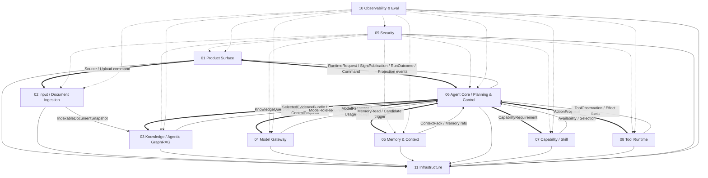
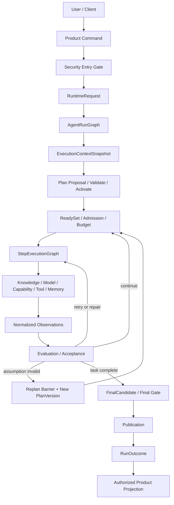

# Zuno 总体 Target 架构

updated: 2026-07-14  
status: normative-target-integration-architecture  
document_role: cross-module integration source  
current_state_source: `docs/status/production-readiness.md`

> 本文是 Zuno 十一个逻辑模块的总体集成架构。它定义系统目标、模块协作、端到端流程、全局不变量、跨模块 Contract 与完成证据，但不重复每个模块已经定义的领域对象、全部字段、完整状态机、数据库表或 Adapter 细节。
>
> 当本文与某个模块的唯一正式 Target 文档发生领域细节冲突时，以该领域 Owner 的模块文档为准，并在同一轮治理变更中修正本文。跨 Owner 的不可逆冲突必须进入 ADR 或共享 Contract Registry。

## 0. 正式事实源与文档边界

Zuno 的正式架构设计事实共十三份：

```text
11 × docs/modules/<NN>-<module>.md
 1 × docs/architecture/architecture.md
 1 × docs/architecture/architecture.html
```

支撑文件：

```text
docs/architecture/README.md
    目录、镜像和维护规则。

docs/architecture/architecture-views.md
    architecture.html 使用的 Mermaid 图源；不是第二份文字总架构。

.agent/architecture/*
.agent/modules/*
    字节级镜像；不是独立事实源。
```

规范优先级：

```text
全局不可变原则与已接受 ADR
→ 对应领域 Owner 的唯一模块 Target 文档
→ 本文的跨模块集成关系
→ 已确认 Program
→ 代码、Migration、测试、Trace、Eval 与运行证据
```

状态事实与设计事实必须分离：

```text
Target
    由本文和十一份模块架构定义。

Current / Gap / Measurement / Production Readiness
    由最新 main 的代码、Migration、测试、Trace、Eval、
    docs/status/production-readiness.md 和 docs/evidence/ 证明。
```

类名、表名、目录、依赖、Docker 服务、接口骨架或 Mock 存在，都不能单独把 Target 提升为 Current。

---

# 1. 问题、目标与非目标

## 1.1 要解决的问题

Zuno 面向企业私有知识问答和长运行任务执行。一次请求可能跨越：

```text
用户交互
→ 输入与文档解析
→ 任务分析与计划
→ 知识检索和证据纠正
→ 多模型调用
→ Capability / Skill 选择
→ Tool 审批和外部副作用
→ Memory 读取与治理写入
→ Trace / Audit / Eval
→ PostgreSQL、Object Store、Queue 和 Checkpoint
```

传统“一个 FastAPI 请求调用一个 Agent，再由模型直接决定工具”的结构无法可靠回答：

- 请求是否真正形成了一个可恢复的 Run；
- 计划、执行、重试与 Replan 是否被区分；
- 文档解析是否保留原始证据和 SourceSpan；
- 图检索结果是否回到可引用原文；
- Tool 超时后外部副作用是否已经发生；
- Approval 是否绑定到准确的参数、目标资源和 Security Epoch；
- Checkpoint 已提交但领域事务未提交时如何恢复；
- 质量、成本和延迟是否来自可比较的固定评测；
- 权限撤销后长运行任务和旧 Projection 是否仍然有效。

## 1.2 目标

Zuno Target 必须实现：

1. **领域无关**：核心控制与知识、工具、模型 Provider 解耦。
2. **可扩展**：十一模块通过 typed Contract 协作，而非互相导入内部实现。
3. **可恢复**：进程、Worker、Queue、Store 或外部调用失败后有明确恢复路径。
4. **可并行**：Plan DAG、检索批次和异步任务在安全条件允许时并行。
5. **可审计**：重要决策、外部副作用、安全 Gate 和质量声明都有可关联事实。
6. **可验证**：每个 Target Requirement 都映射到 Control、测试与 Evidence。
7. **安全默认关闭**：未知权限、未知 Effect、陈旧 Epoch、缺失证据和不兼容版本默认 fail-closed。
8. **轻量部署、成熟语义**：初期允许同一 backend image 承担多个角色，不用微服务数量证明成熟度。

## 1.3 非目标

近期不默认建设：

- 产品级自治 Multi-Agent Runtime；
- 全系统 Event Sourcing；
- XA / 2PC；
- Kafka 作为默认工作队列；
- Kubernetes 作为完成前提；
- 默认多区域 Active-Active；
- 保存模型隐藏思维链；
- 让模型直接批准权限、提交领域终态或执行未审批副作用；
- 让 Redis、Milvus、Neo4j、RabbitMQ、LangSmith 或前端状态成为权威领域事实源。

---

# 2. 全局架构原则

## 2.1 Single Controller

Agent Core 是唯一任务控制器：

```text
固定 AgentRunGraph
+ 动态 Plan DAG
+ 固定 StepExecutionGraph
```

所有任务都有 Plan：

- 简单任务使用 Deterministic Single-Step Plan；
- 复杂任务使用 Dynamic DAG Plan。

不存在绕过 Plan、Trace、Budget、AnswerPolicy、Final Gate、Publication 和 RunOutcome 的正式回答路径。

## 2.2 模型只产生 Proposal

模型可以产生：

```text
Task Analysis Proposal
Plan Proposal
Action Proposal
Query Rewrite
Extraction Candidate
Reflection / Critic Result
Memory Candidate
Security Risk Proposal
```

模型不能直接：

```text
激活 PlanVersion
批准 Authorization / Approval
取得明文 Secret
提交 Tool Effect
修改 KnowledgeVersion
提交长期 Memory
绕过 Budget
发布最终答案
写入 Production Readiness
```

## 2.3 领域事实与物理收据分离

```text
Queue ACK
Object Commit
Checkpoint Commit
IndexWriteReceipt
AuditPersistenceReceipt
HTTP 2xx
SSE Close
Client ACK
```

只能证明各自边界事实，不能冒充其他模块的业务成功。

## 2.4 Retry 与 Replan 分离

- Retry：计划和任务假设仍然成立，只是一次执行失败。
- Repair：参数、Schema 或可局部修复输入不正确。
- Fallback：切换兼容 Provider、Adapter 或能力实现。
- Reconciliation：执行结果未知，需要确认实际外部状态。
- Replan：计划结构、依赖、能力或任务假设失效。
- Compensation：新的受治理副作用，不是删除旧事实。

## 2.5 PostgreSQL 与 Checkpointer 分工

```text
PostgreSQL
    领域事实、状态转换、Generation、版本、Outbox、
    Approval、Effect、Evidence、Memory、Eval 和审计关联。

LangGraph Checkpointer
    Graph 控制状态、Channel、Pending Send、Interrupt Cursor、
    Reducer 控制信息和恢复位置。
```

Checkpoint 不能替代 Domain Commit；Domain Store 也不能伪装成图运行时内部状态。

## 2.6 安全、预算和审计先于副作用

任何可产生外部或不可逆效果的动作，必须依次满足：

```text
ActionProposal
→ Tool Runtime Prepare / Canonicalize
→ Security Prepare Gate
→ optional Approval
→ Security Execute Gate + latest Security Epoch
→ Mandatory Audit durable commit（适用时）
→ Infrastructure IdempotencyClaim
→ ToolAttempt
→ EffectReceipt 或 EffectReconciliation
→ Agent Core ControlDecision
```

---

# 3. 十一个逻辑模块



## 3.1 模块表

| 编号 | 模块 | Canonical Ownership | 唯一详细设计 |
| --- | --- | --- | --- |
| 01 | Product Surface | Conversation、Submission、Command、Receipt、Projection、ChannelDelivery、ClientRender、UserRead、Feedback | `docs/modules/01-product-surface.md` |
| 02 | Input / Document Ingestion | SourceObject、DocumentVersion、ParsePlan/Job/Attempt/Snapshot、CanonicalDocumentIR、原始 SourceSpan、质量门和 Handoff | `docs/modules/02-input-document-ingestion.md` |
| 03 | Knowledge / Agentic GraphRAG | KnowledgeVersion/Snapshot、IndexSpec/Manifest 接受语义、RetrievalPlan/Round、EvidenceLedger、CitationLineage | `docs/modules/03-knowledge-agentic-graphrag.md` |
| 04 | Model Gateway | Model Role/Operation、Provider/Model、Routing、Call/Attempt、Response、Validation、Usage、Quota、Health、Circuit | `docs/modules/04-model-gateway.md` |
| 05 | Memory & Context | Session/Long-term Memory、Candidate、Governance、MemoryVersion、Manifest、ContextPack、UseTrace、Privacy Lifecycle | `docs/modules/05-memory-context.md` |
| 06 | Agent Core | TaskContract、GoalVersion、AgentRun、PlanVersion、StepRun、ActionRun、ControlDecision、Publication、RunOutcome | `docs/modules/06-agent-core-planning-control.md` |
| 07 | Capability / Skill | Capability/Skill Definition 与 Version、Requirement、ProviderBinding、Conformance、Availability、Selection | `docs/modules/07-capability-skill.md` |
| 08 | Tool Runtime | Tool Provider/Definition/Version、PreparedToolAction、ToolAttempt、Observation、Execution/Effect/Reconciliation | `docs/modules/08-tool-runtime.md` |
| 09 | Security | Principal、授权、Policy、Grant、Approval、Security Epoch、Credential/Secret 语义、信息流和安全 Gate | `docs/modules/09-security.md` |
| 10 | Observability & Eval | Trace/Metric/Log Projection、accepted AuditEvent、Eval、Benchmark、Evidence Registry、ReleaseGateEvaluation | `docs/modules/10-observability-eval.md` |
| 11 | Infrastructure | Transaction、Object、Queue、Inbox/Outbox、Lease/Fencing、Checkpoint Adapter、Index 物理执行、Backup/Restore | `docs/modules/11-infrastructure.md` |

---

# 4. 全局事实所有权

| 事实 | Owner | 重要边界 |
| --- | --- | --- |
| ConversationThread、UserSubmission、ProductCommand | Product Surface | 不创建 Plan 或 RunOutcome |
| SourceObject、DocumentVersion、ParseSnapshot、SourceSpan | Input | 不创建 Chunk、Index 或 KnowledgeVersion |
| KnowledgeVersion、Evidence、CitationLineage | Knowledge | 物理索引写入成功不等于领域接受 |
| ModelRoutingDecision、ModelCallAttempt、ModelResponse、UsageReceipt | Model Gateway | 模型结果不是最终业务事实 |
| MemoryCandidate、MemoryVersion、ContextPackVersion | Memory | Reflexion 只产生 Candidate |
| AgentRun、PlanVersion、StepRun、ActionRun、Publication、RunOutcome | Agent Core | 编排其他模块但不拥有其领域事实 |
| CapabilityVersion、SkillVersion、AvailabilitySnapshot、SelectionResult | Capability | 不执行 Tool |
| PreparedToolAction、ToolAttempt、EffectReceipt、EffectReconciliation | Tool Runtime | 不拥有 Approval 或 IdempotencyClaim |
| AuthorizationDecision、ApprovalDecision、EffectiveSecurityEpoch | Security | 前端与模型都不是安全事实源 |
| Trace/Eval/Audit/Evidence Projection | Observability & Eval | 接收 telemetry 不转移源领域 Ownership |
| QueueDelivery、Lease、Fencing、ObjectCommit、Physical Index Receipt | Infrastructure | 物理收据不冒充上层成功 |

全局标识、Envelope 和版本引用必须支持：

```text
tenant_id
workspace_id
principal_context_ref
run_id
plan_version_id
step_run_id
action_run_id
trace_id
correlation_id
causation_id
aggregate_id
aggregate_version
expected_generation
effective_security_epoch_ref
deadline_at
payload_hash
payload_schema_hash
```

---

# 5. 在线 Agent 完整运行流程



关键语义：

1. Product 负责接收和投影，不成为第二 Controller。
2. Agent Core 在 Plan 激活前完成 Task、能力、安全、预算和可行性分析。
3. Ready Step 只有在依赖、输入、资源冲突、副作用、预算、配额和 Security Gate 均允许时并行。
4. Step 内 ReAct 受固定图、最大轮数、Deadline、Budget 和 Acceptance 控制。
5. 每个 Action 都执行 Evaluation；每个 Step 都执行 Acceptance。
6. Reflection 只在 Acceptance 失败、证据冲突、关键决策、重复失败或高风险时触发。
7. Replan 创建新的不可变 PlanVersion，并通过 Replan Barrier 阻止旧 Dispatch。
8. 最终输出必须经过 Evidence、Citation、AnswerPolicy、Security、Budget 和 Publication Gate。
9. Provisional token、FinalCandidate、Artifact、Publication、Delivery 和 UserRead 是不同事实。
10. 终局至少区分 COMPLETED、PARTIAL、ABSTAINED、REFUSED、BLOCKED、FAILED、CANCELLED、EXPIRED。

---

# 6. 文档摄取与 Knowledge 发布流程

```mermaid
flowchart LR
  SRC[Upload / Connector] --> SO[SourceObject]
  SO --> DV[DocumentVersion]
  DV --> PP[ParsePlan / ParseJob]
  PP --> PA[ParseAttempt / Tasks]
  PA --> IR[CanonicalDocumentIR + SourceSpan]
  IR --> QG[Parser Quality Gate]
  QG -->|PASS / allowed DEGRADED| HAND[IndexableDocumentSnapshot]
  QG -->|BLOCK| STOP[Blocked with MissingContentManifest]
  HAND --> KV[KnowledgeVersion BUILDING]
  KV --> WB[IndexWriteBatch]
  WB --> WR[IndexWriteReceipt]
  WR --> VIS[WriteVisibilityReceipt]
  VIS --> VER[IndexVerification]
  VER --> MAN[Knowledge IndexManifest]
  MAN --> ACC[Knowledge Acceptance]
  ACC --> CUT[IndexCutover]
  CUT --> SW[ServingWatermark / KnowledgeSnapshot]
```



不变量：

- 原始字节不可被清洗结果或模型输出覆盖。
- 源内容变化创建新 DocumentVersion；Parser、模型、配置或 Schema 变化创建新 ParseSnapshot。
- Input 拥有原始 SourceSpan；Knowledge 可以引用但不得修改。
- VLM/OCR 结果必须标记来源、版本、置信度和 Loss Class。
- BLOCK 或完整性无效的 Snapshot 不得交给 Knowledge。
- Infrastructure 执行物理写入、可见性、验证和 Cutover primitive；Knowledge 决定 Manifest、Acceptance 和服务语义。
- IndexWriteReceipt、ServingWatermark 或后端健康状态不自动等于 KnowledgeVersion ACTIVE。
- 删除先撤销访问和新读取，再传播到 Knowledge、Memory、Object 和 derived index，并由 Verification 收口。

---

# 7. Agentic GraphRAG 与证据闭环

Agentic GraphRAG 由两层控制组成：

```text
Agent Core 外层
    是否检索、Evidence Goal、Task Budget、继续、Replan、Ask User、Abstain、Finalize。

Knowledge 内层
    Query Strategy、Retriever 路径、Graph Route、Fusion、Rerank、
    Evidence Quality、Corrective Retrieval、局部停止建议。
```

证据链：

```text
DocumentVersion
→ SourceSpan
→ CitationChunk
→ Entity / Relation / Community Evidence Backlink
→ RetrievalRound
→ EvidenceLedger / EvidenceFrontier
→ SelectedEvidenceBundle
→ Claim / Citation Binding
→ Final Gate
```

没有 SourceSpan 的 Graph 结果只能作为辅助线索，不能成为 strict citation。证据不足、冲突未披露、权限过滤导致关键缺口或索引版本不兼容时，系统必须继续纠正、请求澄清、降级或 Abstain，不能伪造充分性。

---

# 8. Model、Capability 与 Memory 协作

## 8.1 Model Gateway

所有真实模型调用都通过 Provider-neutral Gateway：

```text
ModelRoleRequirement
→ Feasibility
→ Security / Residency / Redaction
→ Budget / Quota / Admission
→ immutable RoutingDecision
→ ModelCallAttempt
→ Stream / Response Validation
→ Structured Output Validation
→ Usage Settlement / Reconciliation
```

Planner 只依赖 Role、Operation 和 Capability Requirement，不直接绑定 Provider SDK。

## 8.2 Capability / Skill

```text
Task / Step Requirement
→ Capability discovery
→ progressive Skill loading
→ AvailabilitySnapshot
→ Compatibility and hard filters
→ CapabilitySelectionResult
→ Agent Core StepFeasibilityDecision
→ ActionProposal
```

Capability / Skill 负责“系统能做什么、怎样完成某类任务”，Tool Runtime 负责“具体动作如何被准备和执行”。

## 8.3 Memory & Context

```text
Source facts / RunOutcome / approved feedback
→ MemoryCandidate
→ Redaction / Dedup / Conflict
→ GovernanceDecision
→ immutable MemoryVersion
→ Projection build / verification / activation
→ task-time recall
→ ContextPackVersion
→ MemoryUseTrace
```

Working Memory 属于当前 Run 控制；Session 和 Long-term Memory 归 Memory 模块。ContextPack 是预算化只读视图，不是新的 Memory 层。模型生成的 Reflexion、Summary 或 Entity Fact 都先成为 Candidate。

---

# 9. Tool Runtime 与外部效果

Tool Runtime 是唯一受治理的工具效果执行平面。

```text
ActionProposal
→ resolve ToolVersion and AdapterBinding
→ canonical arguments and TargetResourceSet
→ PreparedToolAction
→ Security Prepare Gate
→ Approval when required
→ Execute Gate and latest Epoch
→ mandatory audit durability
→ IdempotencyClaim
→ ToolAttempt
→ ToolObservation / ToolExecutionReceipt
→ EffectReceipt or EffectReconciliation
→ Agent Core ControlDecision
```

Effect Outcome 至少区分：

```text
CONFIRMED_SUCCESS
CONFIRMED_FAILURE
CONFIRMED_NOT_EXECUTED
CANCELLED
UNKNOWN
HUMAN_REQUIRED
```

UNKNOWN 禁止普通 Retry。系统必须通过 Provider 查询、业务键、回调、人工核实或 Reconciliation 确认后，才允许重试、补偿或终结。Compensation 本身是新的 ActionProposal 和外部副作用。

Tool Output 默认不可信；进入模型、Knowledge、Memory、Artifact 或 Product 前必须执行 Schema、分类、Prompt Injection 和 Redaction Gate。

---

# 10. Security、Audit 与 Information Flow

Security 在所有关键边界执行：

```text
Product Entry
Input / Connector
Retrieval
Memory Read / Write
Model Dispatch
Capability Exposure
Tool Prepare / Execute
Output / Publication
Artifact Download
Observability Export
```

Effective Permission 是 User、Agent、Task、Session、Request、Resource 和当前 Epoch 约束的交集。Approval 必须绑定：

```text
principal
tenant / workspace
action hash
canonical parameters
target resources
risk/effect profile
policy version
security epoch
expiry
single-use / replay rule
```

Audit 分三层：

```text
Security
    定义必须记录什么、数据分类和 Redaction 要求。

Infrastructure
    提供 mandatory-before-effect 的本地 durable receipt。

Observability & Eval
    接收并拥有不可变 AuditEvent，管理查询、保留和外部 Sink Delivery。
```

外部 Sink 发送成功不等于源业务成功；普通 Trace Projection 也不能代替不可变 AuditEvent。

---

# 11. 状态、并发、恢复与幂等

## 11.1 版本不可变

以下对象激活或提交后不可原地改写：

```text
PlanVersion
GoalVersion
DocumentVersion
ParseSnapshot
KnowledgeVersion
KnowledgeSnapshot
ModelRoutingDecision
MemoryVersion
ContextPackVersion
CapabilityVersion
SkillVersion
PreparedToolAction
Security PolicyVersion
Eval Dataset / Profile Version
```

修改产生新 Version，并保留 lineage、hash、generation 和 supersedes 关系。

## 11.2 Dispatch、Lease 与 Fencing

- Dispatch 必须先持久化再发送。
- Queue 使用 at-least-once delivery。
- Worker 必须持有 Lease、Heartbeat、execution_epoch 和 fencing token。
- Lease 丢失后的晚到结果必须被条件写拒绝。
- Reducer 必须幂等、顺序无关，并拒绝旧 PlanVersion、旧 Epoch 或 payload hash 冲突。
- 并行结果在 JoinPolicy 下合并；部分失败、冲突或证据不足触发 Join Evaluation/Reflection。

## 11.3 恢复分类

```text
CONTROL_REPLAY
    重放图控制，不重新产生外部效果。

RECOVERY
    从已提交 Domain Fact 和 Checkpoint 恢复同一 Run。

REEXECUTION
    创建新的 Attempt；必须重新满足 Gate 和幂等规则。

RECONCILIATION
    确认未知的跨系统结果。

SIMULATION_FORK
    只读或隔离实验，不修改生产事实。
```

## 11.4 事务边界

数据库事务内禁止远程模型、Tool、Object Store、Queue、Parser 或索引调用。典型模式：

```text
begin
  validate expected_generation
  commit domain fact
  append outbox
commit
→ asynchronous delivery
→ idempotent consumer
→ receipt / reconciliation
```

---

# 12. 物理运行域与部署

六个物理运行域：

| 运行域 | 主要职责 | 初期部署 |
| --- | --- | --- |
| Product & API | Web/Desktop/API、Command/Query/Stream、Projection Delivery | backend-api + frontend |
| Agent Control Plane | AgentRunGraph、Plan DAG、StepExecutionGraph | controller role |
| Knowledge & Memory Runtime | Retrieval、Evidence、Memory、Context | backend internal roles |
| Async Data Plane | Parse、OCR、Index、Eval、Consolidation、Reconciliation | worker roles |
| Governance Plane | Security、Audit、Policy、Eval Gate | backend cross-cutting |
| Durable Infrastructure | PostgreSQL、Object Store、Queue、Checkpoint、derived indexes | managed or replaceable adapters |

Canonical server Target：

```text
Web / Desktop / External API
→ Server-hosted Product API
→ Security + Domain Fact Owners
→ PostgreSQL / Object Store / RabbitMQ / Checkpointer
→ rebuildable BM25 / Vector / Graph projections
```

SQLite、本地文件、本地 queue 和 mock provider 只用于 Developer / CI Adapter，不代表企业多用户部署 Target。

---

# 13. 跨模块 Contract

统一 Envelope 至少携带：

```yaml
contract_name: string
contract_version: string
contract_bundle_version: string
message_id: string
producer_module: string
consumer_module: string
tenant_id: string
workspace_id: string | null
run_id: string | null
step_run_id: string | null
correlation_id: string
causation_id: string | null
idempotency_key: string | null
aggregate_type: string | null
aggregate_id: string | null
aggregate_version: int | null
expected_generation: int | null
effective_security_epoch_ref: string | null
authorization_decision_ref: string | null
deadline_at: datetime | null
trace_id: string
data_classification: string
redaction_decision_ref: string | null
audit_requirement_ref: string | null
payload: object | null
payload_ref: string | null
payload_hash: string
payload_schema_hash: string
occurred_at: datetime
```

Failure Namespace 由各模块拥有：

```text
PRODUCT_*
INPUT_*
KNOW_*
MODEL_*
MEMORY_*
AGENT_*
CAPABILITY_*
TOOL_*
SECURITY_*
OBS_*
INFRA_*
```

消费者不得重命名生产者 Failure，也不得把建议控制动作当作最终 ControlDecision。

---

# 14. 可观测性、评测与质量证明

Observability 必须能够关联：

```text
Product Command
AgentRun / PlanVersion / StepRun / ActionRun
Model Routing / Attempt / Usage
RetrievalPlan / RetrievalRound / Evidence
Memory Candidate / ContextPack / UseTrace
PreparedToolAction / ToolAttempt / Effect
Security Decision / Approval / Epoch
Queue / Lease / Store / Checkpoint receipts
Publication / Delivery / RunOutcome
```

质量状态必须显式区分：

```text
PREPARED
RUNTIME_OBSERVED
MEASURED
BLOCKED
UNAVAILABLE
QUALITY_PROVEN
```

固定 Benchmark 必须绑定相同：

```text
case set
corpus / source versions
KnowledgeSnapshot
MemorySnapshot
model and prompt config
runtime bundle
security policy
judge policy
budget profile
```

RAG Core Five、Agentic GraphRAG 路由/停止质量、Tool 任务最终状态、Memory 正迁移/负迁移、安全攻击成功率、成本和关键路径延迟必须分别测量。低成本不能补偿安全失败或质量 Gate 失败。

---

# 15. Program、测试与完成证据

Program 必须从模块 Requirement 选择明确范围，并包含：

```text
目标和 Current Gap
允许与禁止修改范围
Requirement IDs
Contract 和状态转换
错误、Retry、Recovery、Reconciliation、Idempotency
安全、预算、审计和可观测性
Migration、回填、Dual-read/write、Cutover、Rollback
Unit / Contract / Integration / Fault / E2E / Eval
验收命令
Evidence keys
不得改变的架构原则
```

系统级最小验证链：

```text
Product Command
→ AgentRun and Plan
→ two parallel Ready Steps
→ Knowledge retrieval with Evidence
→ approval interrupt
→ server restart and resume
→ Tool effect exactly-once-by-contract or reconciliation
→ Final Gate
→ Publication and Delivery
→ RunOutcome
→ Trace / Audit / Budget Settlement
```

还必须证明：

- Worker crash、重复投递、晚到结果和 stale fencing；
- Security Epoch 变化；
- Checkpoint 与 Domain Store 前后不一致；
- Index partial write、visibility timeout、cutover conflict；
- Tool response lost 和 UNKNOWN Effect；
- Privacy Delete 和 Knowledge Deletion 全链路；
- fixed benchmark 的质量、成本和延迟可比性；
- Backup、Restore、PITR、Drain 和容量演练。

设计完成后可以声明：

```text
design available
internally consistent
contract-complete
implementation-spec-complete
program-ready
```

只有代码、Migration、Unit/Integration/Fault/E2E、Trace、Eval 和运行证据齐备时，相关 Target 才能提升为 Current。`quality proven` 仍不等于 `production ready`。
