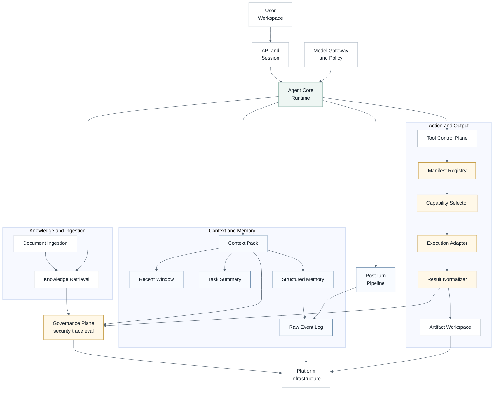
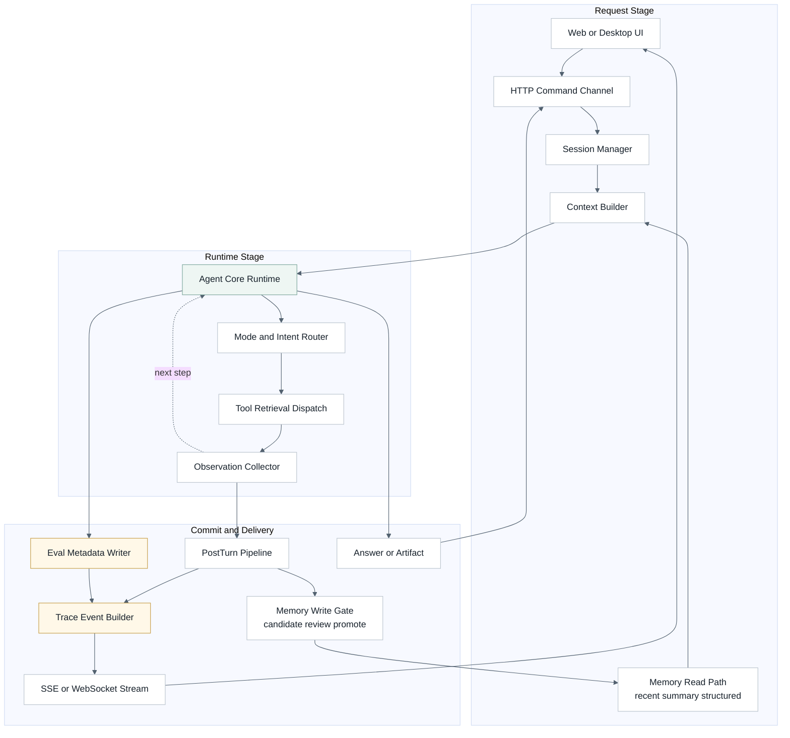
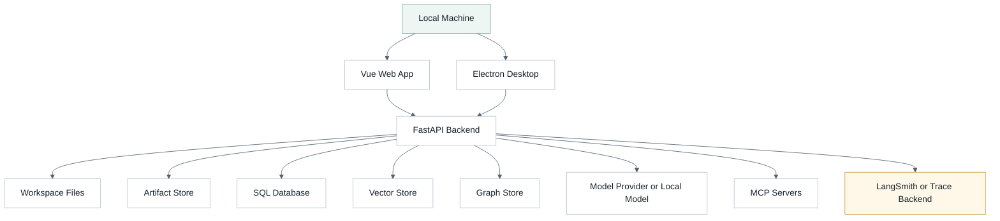
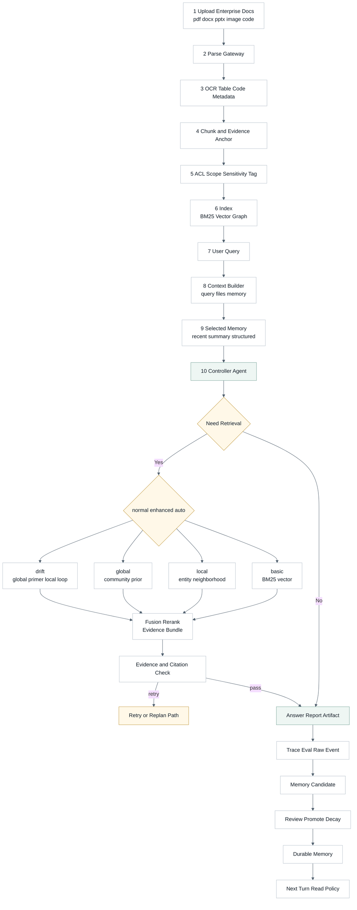
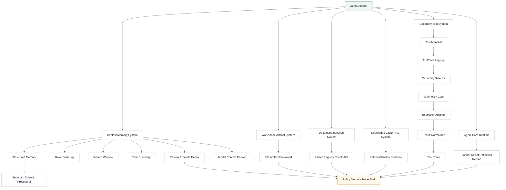
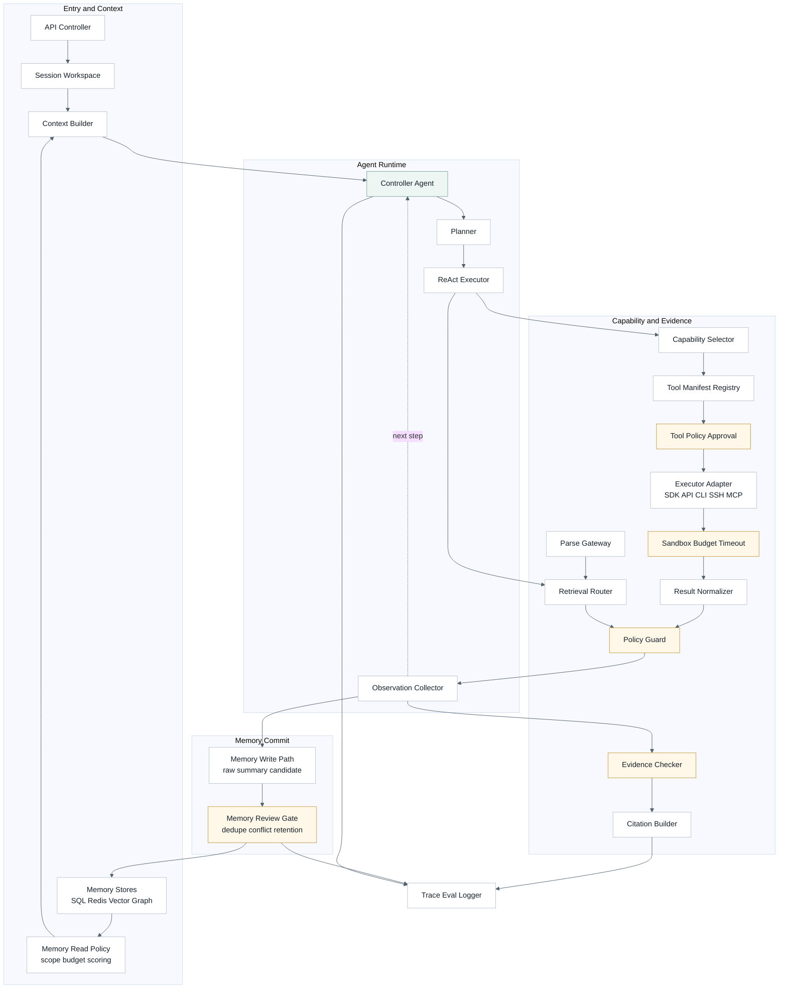
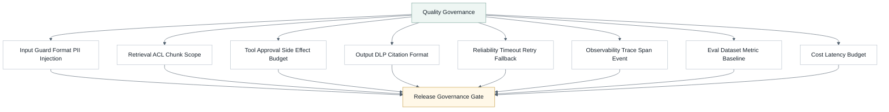

```mermaid
%%{init: {"theme": "base", "themeVariables": {"background": "#f7f8fb", "lineColor": "#52616f"}}}%%
flowchart TB
  classDef node fill:#ffffff,stroke:#b8c2cc,stroke-width:1px,color:#16202a;
  classDef accent fill:#eef6f3,stroke:#7aa59a,stroke-width:1px,color:#16202a;
  classDef guard fill:#fff8e8,stroke:#c59b43,stroke-width:1px,color:#16202a;

  R["Repository Root"]:::accent
  R --> APPS["apps"]
  R --> BACKEND["src/backend/zuno"]
  R --> DOCS["docs"]
  R --> AGENT[".agent"]
  R --> TOOLS["tools"]
  R --> TESTS["tests"]
  BACKEND --> API["api"]
  BACKEND --> AG["agent"]
  BACKEND --> MEM["memory"]
  BACKEND --> CAP["capability"]
  BACKEND --> KNO["knowledge"]
  BACKEND --> PLA["platform"]
  DOCS --> FORMAL["overall architecture docs"]
  DOCS --> HTML["architecture.html generated"]
  AGENT --> PROGRAM["programs active phases"]:::guard
  AGENT --> REFS["references governance"]
  AGENT --> TPL["templates skeletons"]
  TOOLS --> RENDER["render architecture"]
  TOOLS --> VERIFY["verifiers"]
  TESTS --> REPO["repo tests"]
  class APPS,BACKEND,DOCS,AGENT,TOOLS,TESTS,API,AG,MEM,CAP,KNO,PLA,FORMAL,HTML,REFS,TPL,RENDER,VERIFY,REPO node;
```

```mermaid
%%{init: {"theme": "base", "themeVariables": {"background": "#f7f8fb", "lineColor": "#52616f"}}}%%
flowchart TB
  classDef node fill:#ffffff,stroke:#b8c2cc,stroke-width:1px,color:#16202a;
  classDef accent fill:#eef6f3,stroke:#7aa59a,stroke-width:1px,color:#16202a;
  classDef guard fill:#fff8e8,stroke:#c59b43,stroke-width:1px,color:#16202a;

  APP["Zuno App"]:::accent
  STORE["Local Storage"]
  SQL["SQL Database"]
  VDB["Vector Store"]
  GDB["Graph Store"]
  MODEL["Model Gateway"]
  SEARCH["Search Provider"]
  MCP["MCP Provider"]
  SDK["SDK Adapter"]
  APIAD["API Adapter"]
  CLI["CLI Adapter"]
  SSH["SSH Adapter"]:::guard
  TRACE["Trace Eval Backend"]
  APP --> STORE
  APP --> SQL
  APP --> VDB
  APP --> GDB
  APP --> MODEL
  APP --> SEARCH
  APP --> MCP
  APP --> SDK
  APP --> APIAD
  APP --> CLI
  APP --> SSH
  APP --> TRACE
  class STORE,SQL,VDB,GDB,MODEL,SEARCH,MCP,SDK,APIAD,CLI,TRACE node;
```

```mermaid
%%{init: {"theme": "base", "themeVariables": {"background": "#f7f8fb", "lineColor": "#52616f"}}}%%
flowchart LR
  classDef node fill:#ffffff,stroke:#b8c2cc,stroke-width:1px,color:#16202a;
  classDef decision fill:#fff8e8,stroke:#c59b43,stroke-width:1px,color:#16202a;
  classDef accent fill:#eef6f3,stroke:#7aa59a,stroke-width:1px,color:#16202a;

  GOAL["Goal"]
  PREP["prepare_context"]
  READMEM["memory read<br/>recent task structured"]
  ROUTE["intent and mode router"]
  PLAN["plan"]
  STEP["ReAct step"]
  CALL["tool or retrieval dispatch"]
  OBS["observation"]
  RAW["raw event append"]
  WORK["working memory"]
  REFLECT{"reflection gate"}:::decision
  REPLAN["replan"]
  FINAL["final answer"]:::accent
  COMMIT["post_turn_commit trace memory eval"]
  SUMMARY["task summary update"]
  CAND["structured memory candidate"]
  REVIEW["review promote decay"]:::decision
  LONG["semantic episodic procedural memory"]

  subgraph PREPARE["Prepare"]
    direction TB
    GOAL --> PREP --> READMEM --> ROUTE --> PLAN
  end

  subgraph EXECUTE["Execute"]
    direction TB
    STEP --> CALL --> OBS --> RAW --> WORK --> REFLECT
  end

  subgraph POSTTURN["Post Turn"]
    direction TB
    FINAL --> COMMIT
    COMMIT --> SUMMARY
    COMMIT --> CAND --> REVIEW --> LONG
  end

  PLAN --> STEP
  REFLECT -->|continue| STEP
  REFLECT -->|replan| REPLAN --> PLAN
  REFLECT -->|finish| FINAL
  SUMMARY -. next turn .-> READMEM
  LONG -. next turn .-> READMEM
  class GOAL,PREP,READMEM,ROUTE,PLAN,STEP,CALL,OBS,RAW,WORK,REPLAN,COMMIT,SUMMARY,CAND,LONG node;
```

# Zuno 架构总文档

## 用途

这是 Zuno 当前正式的文字总架构文档。它回答四个问题：

1. Zuno 当前是什么。
2. Zuno 的目标架构是什么。
3. 下一阶段为什么落在企业私有知识库、多格式文档解析、评测观测和安全治理上。
4. 哪些能力仍是 Target，不能写成 Current。

图形化展示以 `docs/architecture/architecture.html` 为准；图源是 `docs/architecture/architecture.md`。Agent 侧维护镜像是 `.agent/architecture/architecture.md`，Agent 侧也保留同名 HTML 镜像。这四个 canonical paths 必须保持一致：

- `docs/architecture/architecture.md`
- `.agent/architecture/architecture.md`
- `docs/architecture/architecture.html`
- `.agent/architecture/architecture.html`

## 核心判断

Zuno 的主叙事是 **本地优先的企业私有知识库与多功能 Agent 助手**，不是普通 RAG 问答 demo，也不是默认多 Agent 平台。

当前仓库已经完成的是架构治理、文档系统、六层后端边界、`GeneralAgent` 单循环主线、Query Router foundation、Context / Memory foundation、ToolCard foundation、GraphRAG query contract、Evidence / Citation / Trace / Eval foundation。

仍然不能写成 Current 的能力包括：生产级 LangGraph runtime、成熟 Memory DB、完整 dynamic tool orchestration、统一 Parse Gateway、LangSmith 产品化评测、完整安全沙箱、credential broker、输出 DLP、前端 trace 面板和默认产品级多 Agent runtime。

```text
Zuno current
  = monorepo
  + FastAPI backend
  + Single GeneralAgent single loop
  + Knowledge / GraphRAG query path
  + evidence / citation / trace foundation

Zuno target
  = Local-first Enterprise Private Knowledge Agent Workspace
  + Single Controller Agent Runtime
  + Document Ingestion / Parse Gateway
  + Context / Memory write-manage-read
  + Tool Control Plane
  + Agentic RAG + GraphRAG
  + Security / Approval / Sandbox
  + LangSmith-compatible Trace / Eval
  + Workspace / Artifact / Event Flow
```

## Current

Current 只写代码、测试和可复现结果已经证明的事实：

- 当前是 monorepo，主要边界是 `apps/web`、`apps/desktop`、`src/backend/zuno`、`tools`、`tests`、`docs` 和 `.agent`。
- 当前 Python 后端 runtime 边界是 `src/backend/zuno`。
- 当前后端目标层已经收口为 `api / agent / memory / capability / knowledge / platform` 六层。
- 当前主线是 `GeneralAgent` single loop，不是完整产品级 LangGraph runtime，也不是默认多 Agent runtime。
- 当前知识问答链路是 `Completion API -> CompletionService -> GeneralAgent single loop -> search_knowledge_base -> KnowledgeQueryService -> GraphRAGQueryService -> RetrievalPlanner / RetrievalOrchestrator -> Evidence / Citation / Trace -> answer`。
- 当前已证明 `product_mode = normal | enhanced | auto` 与 `query_method = auto | basic | local | global | drift` 的请求、路由和 trace foundation；`auto` 是 router，不是第五种最终检索方法。
- 当前 Memory、Tool、Hooks、GraphRAG 和 Runtime Upgrade 都是 foundation slice，不是成熟产品能力。
- 当前 `src/backend/zuno` 是唯一当前 Python 后端 runtime 边界，没有 active root-level `services/` 后端树。

## Target 分层

| 平面 | 目标职责 | 当前边界 |
| --- | --- | --- |
| Presentation / Workspace | Web、Desktop、会话、上传、产物、trace 面板和用户反馈。 | 当前已有 Web / Desktop 工作区；完整产品闭环仍是 Target。 |
| API / Session | FastAPI routes、DTO、Auth、task / session、SSE / WebSocket、upload / download。 | 当前 API 基础存在；完整 task/session/event flow 仍是 Target。 |
| Agent Core Runtime | `prepare_context -> plan -> ReAct -> observe -> reflect -> replan -> post_turn_commit`。 | 当前是 `GeneralAgent` single loop + 最小 ledger，不是完整 LangGraph runtime。 |
| Context / Memory | Raw Event Log、recent window、task summary、structured memory、Context Pack、review / promotion / decay。 | 当前是 foundation contracts 和轻量 readback。 |
| Capability / Tool | ToolCard / manifest、capability retrieval、policy、approval、executor adapter、sandbox、result normalization。 | 当前已有 ToolCard foundation；动态编排和审批闭环仍是 Target。 |
| Knowledge / Retrieval | Basic RAG、GraphRAG local/global/drift、retrieval fusion、evidence、citation。 | 当前已有 GraphRAG query contract；生产级 extraction / RRF / rerank 仍是 Target。 |
| Document Ingestion | 多格式解析、OCR/VLM、chunk metadata、ACL 继承、BM25/vector/graph index handoff。 | 统一 Parse Gateway 和 Parser Capability Matrix 是下一阶段重点。 |
| Security / Governance | 输入检查、PII / 商业机密脱敏、prompt injection 防护、权限、审批、输出 DLP、审计。 | 当前不能声称成熟沙箱系统；完整治理仍是 Target / Future。 |
| Trace / Eval | runtime trace、LangSmith 映射、dataset、offline / online eval、retrieval / answer / tool / security 指标。 | 当前有本地 trace/eval foundation；LangSmith 产品化仍是 Target。 |
| Platform | storage、model gateway、worker、artifact、observability 和 provider。 | 近期保持模块化单体，不写成微服务 Current。 |

## 主链路

```text
upload / sync enterprise docs
  -> format detection
  -> Parse Gateway
  -> OCR / table / code / metadata extraction
  -> chunk + provenance + ACL
  -> BM25 / vector / graph index
  -> user query
  -> Context Builder
  -> Single Controller Agent
  -> product mode policy: normal / enhanced / auto
  -> query method: basic / local / global / drift
  -> evidence and citation check
  -> answer / report / artifact
  -> trace / eval / memory candidate
  -> review / promotion / durable memory
```

这条链路解释为什么 Document Ingestion 不能继续隐含在工具层里：企业知识库质量首先取决于解析、metadata、ACL、chunk 和 provenance，而不只是检索算法。

## 文档解析边界

下一阶段需要把文档解析正式成层。目标 Parser Capability Matrix 至少覆盖：

- PDF：页码、span、图片、表格和 OCR metadata。
- DOCX / PPTX / XLSX：heading、slide、sheet、table 和结构信息。
- TXT / MD / CSV / JSON / HTML：行号、标题、row id、DOM section。
- 图片 / 扫描件：OCR 文本、bbox、confidence、视觉描述。
- 代码文件：语言、路径、symbol、line range 和代码感知切块。

这些能力进入 `Document Ingestion / Parse Gateway` program，而不是在当前文档里伪装成已经完成。

## 工具层边界

工具层按能力语义治理，不按 API / SDK / CLI / MCP 拆顶层业务分类。邮件、文件、数据库、搜索、知识库、代码执行和 SSH 是 capability domain；local function、SDK、API、CLI、SSH、MCP stdio、MCP HTTP 是 execution adapter。

高副作用工具，例如 `send_email`、外部写操作、SSH、删除或覆盖类命令，目标上必须经过 approval / interrupt / audit trace。当前只能说有 ToolCard / MCP policy foundation，不能声称已有完整工具审批和沙箱。

## 安全与评测

企业私有知识场景里，安全和评测不是附加功能，而是产品可信度的一部分。

安全目标分四道闸：

1. 输入闸门：鉴权、限流、文件校验、PII / 商业机密识别、prompt injection 检测。
2. 检索闸门：chunk 级 ACL、workspace / project scope、document trust label、检索结果净化。
3. 工具闸门：side effect 分级、permission decision、approval gate、timeout、cwd / host allowlist。
4. 输出闸门：DLP scan、citation coverage、format validation、敏感字段脱敏。

评测目标分四类：

- Retrieval eval：Recall@k、MRR、nDCG、retrieval relevance、citation coverage。
- Answer eval：correctness、faithfulness / groundedness、answer relevance、format validity。
- Agent eval：tool selection、argument correctness、trajectory quality、approval rate、fallback rate。
- Security eval：prompt injection block rate、redaction miss rate、sandbox violation、越权访问阻断率。

LangSmith-compatible Trace / Eval 是统一 trace / span / dataset / evaluator / experiment 的外部适配层；本地 pytest 和 eval runner 仍保留为 release gate。

## 实施落点

当前 active program 只做架构文档、架构图、HTML 和执行计划收口，不实现 runtime feature。下一轮实现应拆成四个 program：

1. `zuno-document-ingestion-v1`：多格式解析、Canonical Document IR、chunk / provenance、BM25 / vector / graph indexing。
2. `zuno-runtime-memory-tool-plane-v1`：Context Pack、summary compression、structured extraction、ToolCard manifest、executor registry、approval flow。
3. `zuno-eval-observability-v1`：LangSmith trace 映射、dataset、RAGAS / DeepEval 指标、citation coverage 和 CI regression gate。
4. `zuno-security-enterprise-scenarios-v1`：PII / 商业机密脱敏、prompt injection 防护、ACL、输出 DLP、四层 sandbox、企业知识库 / HR 简历库场景。

## 当前前台文档边界

`docs/architecture/` 当前只保留少数入口：

- `README.md`
- `architecture.md`
- `architecture.html`
- `assets/`
- `decisions/`

以下拆分文档已经被本文和 HTML 吸收，归档到 `docs/history/architecture-surface-cleanup-2026-06-30/docs-architecture/`：

- `current-architecture.md`
- `target-architecture.md`
- `roadmap.md`
- `product-scenario-enterprise-kb.md`
- `security-and-sandbox.md`
- `deliverables.md`

`.agent/architecture/` 当前只保留 `README.md`、`architecture.md` 和 `architecture.html`。旧 near-term / future / decisions 工作集归档到 `docs/history/architecture-surface-cleanup-2026-06-30/agent-architecture/`。

## 文档一致性规则

- 改文字架构时，先改 `docs/architecture/architecture.md`，再运行 `python tools/agent/render_architecture.py --write` 同步 `.agent/architecture/architecture.md`。
- 改图形架构时，先改 `docs/architecture/architecture.md` 中的 Mermaid 图源，再运行 `python tools/agent/render_architecture.py --write` 更新两个 `architecture.html`。
- 不再新增 `current-architecture.md`、`target-architecture.md`、`roadmap.md` 这类拆分入口，除非先打开新的文档重组 program。
- 高频变化的执行细节放进 `.agent/programs/`。
- Agent 操作规则放进 `.agent/references/`。
- 历史材料进入 `docs/history/`，不要留在当前前台。

验证入口：

```powershell
git diff --check
python tools/agent/render_architecture.py --check
python tools/scripts/verify_docs_entrypoints.py
python tools/scripts/verify_repo_structure.py
python .agent/scripts/verify_agent_system.py
python .agent/scripts/verify_doc_boundaries.py
pytest -q tests/repo/test_docs_entrypoints.py tests/repo/test_repo_structure_consistency.py tests/repo/test_agent_system.py -p no:cacheprovider
```

## 架构图视图集

以下十类图服务于架构 HTML 展示页，但它们不是独立事实源。每张图都必须能回到上文的文字设计：企业私有知识场景、Single Controller Agent Runtime、Document Ingestion、Memory、Tool Control Plane、Knowledge / GraphRAG、安全治理和 LangSmith-compatible Trace / Eval。

## 一、4+1 View Model

4+1 从五个角度解释同一个系统：Logical、Development、Process、Physical 和 Scenarios。Process View 关注运行时进程、通信、并发和事件流；Agent Loop 是 Zuno 的核心内部循环，但不等同于整个 Process View。

### Logical View

该图回答：Zuno 的目标职责如何分层，以及哪些能力是顶层模块、哪些能力是横切治理。

#### 图



#### 分析

- 关注点：系统职责，而不是物理目录。
- Zuno 映射：默认主线仍是 Single Controller Agent；`Agent Core Runtime` 是 `Single Controller Agent` 的二级展开；Memory 展开为 Raw Event Log、Recent Window、Task Summary、Structured Long-term Memory 和 Context Pack。
- 边界：Knowledge 可以作为 capability 被调用，但在架构上单独成层，因为 GraphRAG、retrieval fusion、citation 和 evidence contract 有独立生命周期。
- 边界：Security、Trace 和 Eval 收束为 Governance Plane；Tool Control Plane 以 ToolCard/manifest、selector、policy、executor、result normalizer 和 trace 为目标链路。

### Development View

该图回答：代码、正式文档和 Agent 工作流如何组织，并说明新增架构细化 program 放在哪里。

#### 图



#### 分析

- 关注点：开发者如何进入项目。
- Zuno 映射：`docs/architecture/architecture.md` 是 Mermaid 图源；`.agent/programs/` 是当前执行计划；`tools/agent/render_architecture.py` 生成 HTML。
- 边界：高频执行细节进入 `.agent/programs/`，稳定结论进入 `docs/architecture/`。

### Process View

该图回答：一次请求如何经过 API、Context、Agent Core、工具/检索、事件流和评测追踪。

#### 图



#### 分析

- 关注点：运行时控制流、事件流和外部调用。
- Zuno 映射：Process View 覆盖 API、Agent runtime、工具调用、检索、memory read/write、trace 和 eval。
- 边界：SSE / WebSocket 是事件传输通道；trace / eval contract 才是可观测事实。

### Physical View

该图回答：Zuno 在本地优先部署中连接哪些节点，以及哪些 provider 是可替换边界。

#### 图



#### 分析

- 关注点：部署节点和外部依赖。
- Zuno 映射：本地文件、数据库、向量/图存储、模型 provider、MCP 和 trace backend 都是可替换边界。
- 边界：近期仍是模块化单体，不是微服务拆分。

### Scenarios View

该图回答：企业知识库场景中，文档如何进入知识空间，并如何变成可引用回答或报告。

#### 图



#### 分析

- 关注点：用企业知识库场景验证架构。
- Zuno 映射：文档解析层是企业知识库、GraphRAG、citation 和 eval 的共同前置依赖。
- 边界：`auto` 是 router，不是第五种检索算法；`global` 是 community-level prior，不和 chunk-level BM25 直接生硬混榜。

## 二、View & Beyond

View & Beyond 以 view 为架构文档组织单位。这里采用四个工程化视图：Logical、Component-and-Connector、Deployment 和 Quality。

### V&B Logical View

该图回答：领域子系统如何组成一个 Agent Workspace，并区分顶层能力和横切治理。

#### 图



#### 分析

- 关注点：领域对象和职责。
- Zuno 映射：Runtime、Memory、Tool、Knowledge、Ingestion、Workspace 和 Policy 是目标领域子系统；Memory 是 write-manage-read 子系统，Tool 是 manifest-driven control plane，不是临时函数列表。
- 边界：GraphRAG 补充 BM25 和向量检索，不替代它们；文档解析是 Knowledge 的上游，不等同于 Memory。

### Component-and-Connector View

该图回答：运行时组件如何连接、由谁调度、在哪些节点做权限和证据检查。

#### 图



#### 分析

- 关注点：组件和连接器。
- Zuno 映射：控制由 Agent 集中；能力通过 Tool Manifest Registry、Capability Selector、Tool Policy Approval、Executor Adapter、Sandbox、Result Normalizer 和 Retrieval Router 进入结果；Memory 通过 read policy 进入 Context Pack，通过 post-turn write path 进入 durable memory。
- 边界：Planner 是 Agent Core Runtime 的内部控制点，不是一个独立顶层业务层。

### V&B Deployment View

该图回答：工程部署时哪些资源应保持可替换，以及工具执行方式如何作为 adapter 进入系统。

#### 图



#### 分析

- 关注点：软件元素到运行环境的映射。
- Zuno 映射：Provider 是边界，核心 runtime 不绑定单一 vendor。
- 边界：SDK、API、CLI、SSH、MCP 是 execution adapter 或 provider metadata，不是 Capability 的业务顶层分类。

### Quality View

该图回答：质量属性、安全、稳定性、观测和自动化评测如何作为治理闭环落地。

#### 图



#### 分析

- 关注点：性能、可靠性、安全、可观测性、可修改性和评测。
- Zuno 映射：Trace、Eval、Evidence、permission、budget、DLP 和 verifier 共同约束质量。
- 边界：输出检查不能替代检索前 ACL 和工具前审批；安全必须贯穿输入、检索、工具和输出。

## 三、Agent Loop 专题图

Agent Loop 是 Zuno 的核心运行范式。它属于 Process View 的内部细化，但不代表整个 Process View。

### Agent Loop View

该图回答：主控 Agent 如何在一个可观测的 runtime harness 中计划、执行、观察、反思、重规划并提交 trace / memory / eval。

#### 图



#### 分析

- 关注点：Agent 内部决策循环。
- Zuno 映射：Planning 是 Agent Core Runtime 的控制能力；runtime harness 负责状态、checkpoint、streaming、interrupt、trace、memory read/write 和失败处理。
- 边界：LangGraph 是目标实现候选，用于 state graph、checkpoint、durable execution、human-in-the-loop、streaming 和 resume；它不是“规划模块本身”。
- 边界：Reflection 是门控动作，不是每一步强制执行；ToT / LATS 只作为 Future 或离线困难模式，不进入近期默认路径。

## 边界

> [!warning] Current / Target 边界
> 本文是 Target 架构说明，不声称所有能力已经完成。Current 只写入有代码、测试、trace、eval 或可复现结果证明的事实。

- 产品模式：normal、enhanced、auto。
- 内部 query method：basic、local、global、drift。
- Global 不和 BM25 chunk ranking 生硬混榜；它更适合作为 community-level prior，再由 local/basic 回补 supporting evidence。
- Document Ingestion、Security / Policy、LangSmith trace / eval、企业知识库产品闭环是本轮目标架构细化和后续执行计划，不是 Current。
- PHASE08 当前已证明 extractor config contract、query method / citation / retrieval fusion trace contract 和 global community-only prior 边界；完整 LLM extraction、RRF/rerank 治理仍是 Target。
- PHASE09 当前已证明 RuntimeTurnLedger、当前轮 trace reset、GeneralAgent 最小 evidence chain、post-turn evidence payload、六层目标入口 import guard 和 eval diagnostics；完整产品级 runtime upgrade 仍是 Target。
- Domain Pack 只允许作为历史或兼容语境出现，不进入 Current 或 Target 主线图。
