# Zuno Target Architecture Atlas

updated: 2026-07-11  
status: normative-short-term-target  
current_state_source: `docs/architecture/production-readiness.md`

本文是 Zuno 的目标架构事实源。它使用 **4+1 View Model、Views & Beyond 和 Zuno Product Core** 三组、十类 canonical views，描述最终目标架构及其关键局部关系。

本文描述的是 **Target**。仓库当前真实实现、已知差距和 measured 状态以 `docs/architecture/production-readiness.md` 为准。目标架构不得被误写成 Current。

## 1. 总体目标

Zuno 的近期目标是本地优先、可恢复、可观测、可评测的企业知识库 Agent 产品：

```text
Zuno
=
Single Controller LangGraph Runtime
+ Independent Model / Memory / Knowledge / Capability / Tool modules
+ Source-span Agentic GraphRAG
+ Governed Tool Execution
+ Durable Local Infrastructure
+ Honest Measurement and Release Gates
```

核心边界：

- LangGraph 负责 Agent Core 的状态、控制流、循环、中断、恢复和停止条件。
- Model Gateway、Memory、Knowledge、Capability、Tool Runtime 保持独立 owner、contract、生命周期和测试边界。
- Security 与 Observability 是横切能力。
- Infrastructure 保存事实，不决定 Agent 策略。
- Product Surface 展示与交互，不成为业务事实源。

当前质量口径：

```text
implementation available
measurement blocked
quality not yet proven
```

## 2. 十一逻辑能力模块

| # | 模块 | 最终责任 | 关键输出 |
| --- | --- | --- | --- |
| 1 | Product Surface | AgentChat、Workspace、Artifact、Citation、Trace、Feedback、Recovery UI | RuntimeRequest、用户操作、可视化结果 |
| 2 | Input | SourceObject、解析路由、CanonicalDocumentIR、SourceSpan、index handoff | Document IR、ParseSnapshot、SourceSpan |
| 3 | Knowledge | Chunk、Index、BM25、Vector、GraphRAG、EvidenceLedger、CitationLineage | EvidenceBundle、RetrievalVerdict |
| 4 | Model Gateway | model slot、provider、timeout、retry、fallback、usage、cost、structured output | ModelResult、UsageRecord |
| 5 | Memory | Sensory、Short-term、Long-term、Entity、ContextPack、治理和跨任务复用 | ContextPack、MemoryRecord |
| 6 | Agent Core / Planning & Control | Strategy、Plan、ReAct、Observation、Reflection、Replan、Reflexion、Finalize | GroundedAnswer、RuntimeEvent |
| 7 | Capability | CapabilityCard、SkillCard、目录、选择、策略和路由 | CapabilityPlan、AllowedTools |
| 8 | Tool Runtime | approval、credential ref、sandbox、timeout、idempotency、执行和归一化 | NormalizedToolObservation |
| 9 | Security | Input、Retrieval、Memory、Tool、Output、Artifact gates | GateDecision、AuditEvent |
| 10 | Observability & Eval | spans、usage、cost、failure buckets、benchmark、release gate | TraceTree、EvalReport |
| 11 | Infrastructure | SQLite、ObjectStore、Index、Checkpoint、EventStore、Migration、Recovery | Durable records and handles |

## 3. 六个物理运行域

| 运行域 | 逻辑模块映射 |
| --- | --- |
| Product & API | Product Surface |
| Input & Knowledge | Input、Knowledge |
| Agent Core Runtime | Model Gateway、Memory、Agent Core / Planning & Control，逻辑 owner 保持独立 |
| Capability & Tool | Capability、Tool Runtime |
| Governance & Observability | Security、Observability & Eval |
| Local Infrastructure | Infrastructure |

---

# Architecture Visual Atlas

箭头规范：

```text
==>  command / control request
-->  data / result / state transfer
-.-> cross-cutting governance / observation / constraint
```

颜色规范：

```text
blue    Product / API
yellow  Agent Core / Control
white   Independent capability
purple  Security / Observability
green   Infrastructure
orange  Decision / Gate
red     Blocked / Failure
```

## 一、4+1 View Model

### Logical View (4+1)

回答“系统需要哪些逻辑能力，以及它们通过什么 contract 协作”。

#### Overall — Eleven Logical Capabilities

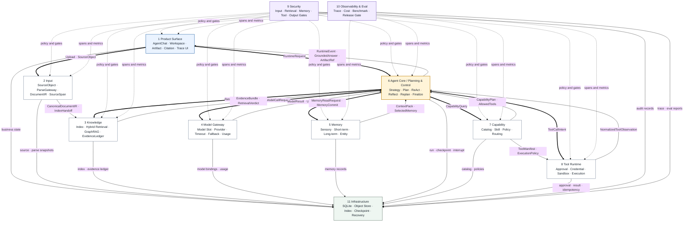

#### Local — Memory and Context Subsystem

```mermaid
%%{init: {"theme": "base", "flowchart": {"curve": "basis"}}}%%
flowchart LR
  classDef memory fill:#ffffff,stroke:#64748b,stroke-width:1.2px,color:#16202a;
  classDef policy fill:#f2ecff,stroke:#7c5cbf,stroke-width:1.4px,color:#16202a;
  classDef context fill:#eaf3ff,stroke:#2563a6,stroke-width:1.5px,color:#16202a;
  classDef core fill:#fff4d8,stroke:#c58a18,stroke-width:1.8px,color:#16202a;

  INPUT["Current Input<br/>message · observation · event"]
  SENSORY["Sensory Memory<br/>raw current-turn signals"]
  SHORT["Short-term Memory<br/>working state · recent window · PlanState"]
  LONG["Long-term Memory<br/>episodic · semantic · procedural"]
  ENTITY["Entity Memory<br/>user · project · relation · effective time"]
  POLICY["Memory Policy<br/>scope · privacy · freshness · conflict · token budget"]
  RETRIEVE["Retrieval and Ranking<br/>relevance · confidence · recency · diversity"]
  CONTEXT["ContextPack<br/>selected memories + exclusion reasons"]
  AGENT["Agent Core<br/>Strategy · Planner · ReAct · Reflection"]
  CAPTURE["Post-turn Capture<br/>raw event · task summary · facts · lessons"]
  CANDIDATE["Memory Candidate"]
  REVIEW{"Governance Review<br/>redact · deduplicate · conflict · approve"}
  AUDIT["Governance Ledger"]
  STORE["Approved Memory Store"]

  INPUT --> SENSORY --> SHORT
  SHORT --> POLICY
  LONG --> POLICY
  ENTITY --> POLICY
  POLICY --> RETRIEVE --> CONTEXT
  CONTEXT -->|bounded read view| AGENT
  AGENT --> CAPTURE --> CANDIDATE --> REVIEW
  REVIEW -->|approved lesson or episode| STORE
  REVIEW -->|approved entity fact| ENTITY
  REVIEW -->|pending or rejected| AUDIT
  STORE --> LONG
  REVIEW --> AUDIT

  class SENSORY,SHORT,LONG,ENTITY,RETRIEVE,CAPTURE,CANDIDATE,STORE memory;
  class POLICY,REVIEW,AUDIT policy;
  class CONTEXT context;
  class AGENT core;
```

#### Local — Agent Core Internal Capability Boundary

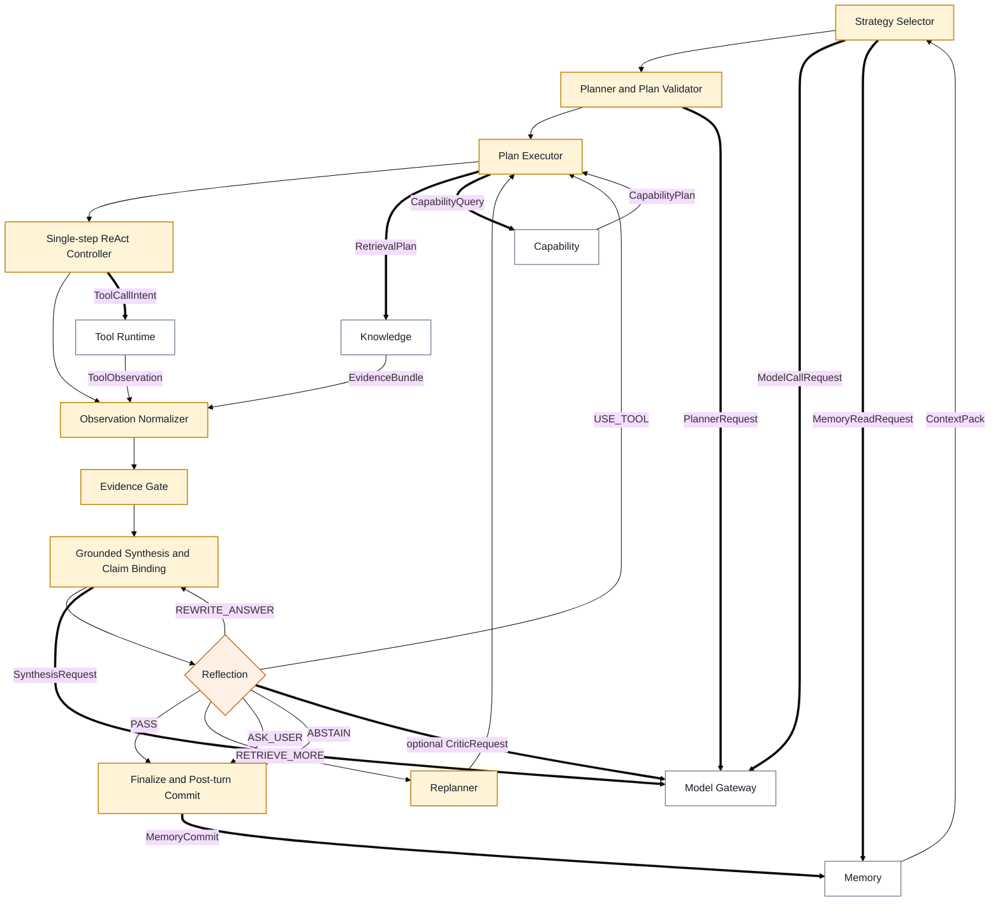

### Development View (4+1)

回答“代码目录、owner、允许依赖和禁止绕过边界”。

#### Overall — Repository Ownership and Dependency Direction

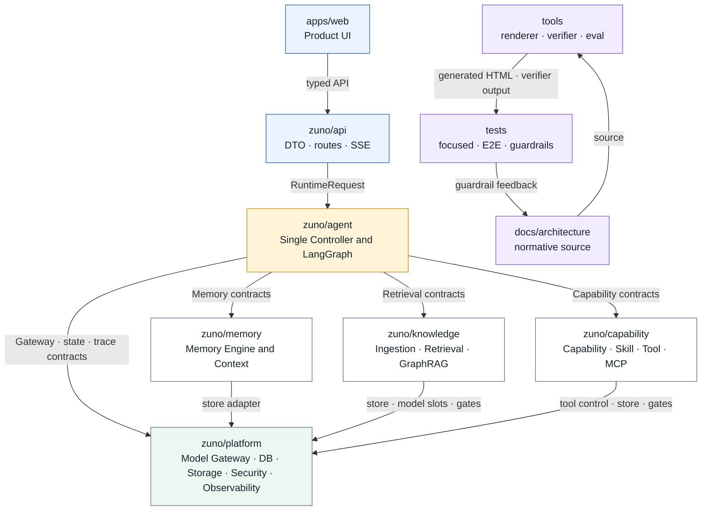

#### Local — Runtime Package Dependency Rule

```mermaid
flowchart LR
  API["API Service"]
  FACTORY["RuntimeDependencyFactory"]
  SERVICE["UnifiedAgentRuntimeService"]
  GRAPH["Compiled LangGraph"]
  NODES["Runtime Nodes"]
  PORTS["Typed Runtime Protocols"]
  ADAPTERS["Model · Memory · Knowledge · Tool Adapters"]
  STORES["Checkpoint · Event · Domain Stores"]

  API ==>|create request| FACTORY
  FACTORY -->|dependencies| SERVICE
  SERVICE -->|invoke or stream| GRAPH
  GRAPH -->|state transition| NODES
  NODES ==>|protocol calls| PORTS
  PORTS -->|implemented by| ADAPTERS
  SERVICE -->|checkpoint and events| STORES
  ADAPTERS -->|durable facts| STORES
```

#### Local — Architecture Source and Verification Chain

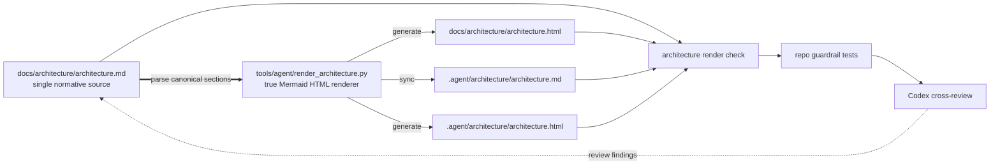

### Process View (4+1)

回答“一次任务如何在 LangGraph 中运行、循环、中断、恢复和终止”。

#### Overall — Unified LangGraph Runtime

```mermaid
flowchart TB
  classDef node fill:#ffffff,stroke:#64748b,color:#16202a;
  classDef core fill:#fff4d8,stroke:#c58a18,color:#16202a;
  classDef gate fill:#fff0e6,stroke:#c56a18,color:#16202a;
  classDef end fill:#eef6f1,stroke:#60766a,color:#16202a;

  START(["START"])
  INPUT["input_gate"]
  CONTEXT["build_context"]
  STRATEGY{"strategy_select"}
  PLAN["create_or_update_plan"]
  EXECUTE["execute_step"]
  OBSERVE["observe"]
  EVIDENCE["evidence_gate"]
  DRAFT["draft_and_bind_claims"]
  REFLECT{"reflection"]
  REVISE["revise_draft"]
  REPLAN["replan"]
  APPROVAL["approval / tool execution"]
  INTERRUPT["interrupt / ask user"]
  FINAL["finalize"]
  COMMIT["post_turn_commit"]
  END(["END"])

  START --> INPUT --> CONTEXT --> STRATEGY
  STRATEGY -->|direct| DRAFT
  STRATEGY -->|react or plan_and_execute| PLAN --> EXECUTE --> OBSERVE
  OBSERVE -->|plan remains| EXECUTE
  OBSERVE -->|plan complete| EVIDENCE --> DRAFT --> REFLECT
  REFLECT -->|PASS| FINAL
  REFLECT -->|REWRITE_ANSWER| REVISE --> DRAFT
  REFLECT -->|RETRIEVE_MORE| REPLAN --> EXECUTE
  REFLECT -->|USE_TOOL| APPROVAL --> OBSERVE
  REFLECT -->|ASK_USER| INTERRUPT
  INTERRUPT -->|Command resume| EXECUTE
  REFLECT -->|ABSTAIN| FINAL
  FINAL --> COMMIT --> END

  class INPUT,CONTEXT,PLAN,EXECUTE,OBSERVE,EVIDENCE,DRAFT,REVISE,REPLAN,APPROVAL,INTERRUPT,FINAL,COMMIT node;
  class STRATEGY,REFLECT gate;
  class START,END end;
```

#### Local — Single-step ReAct Loop

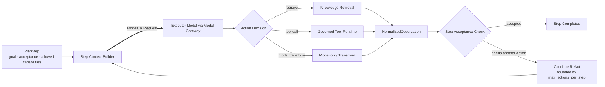

#### Local — Interrupt, Approval and Durable Resume

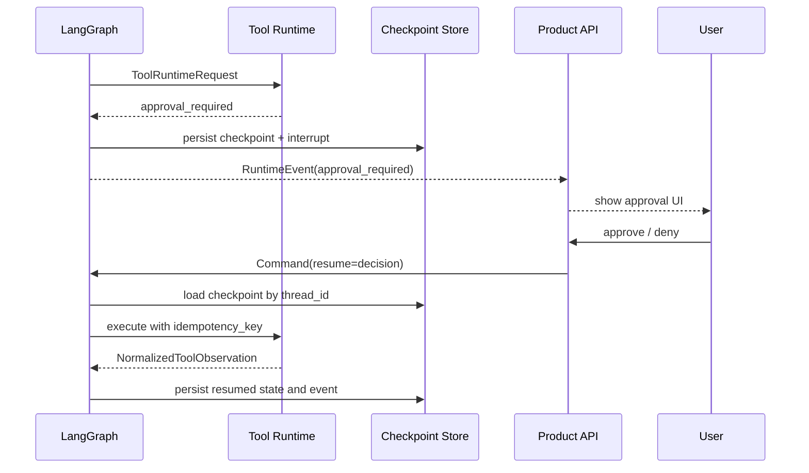

### Physical View (4+1)

回答“近期本地优先系统实际部署在哪里，以及状态和外部 provider 如何连接”。

#### Overall — Local-first Deployment Topology

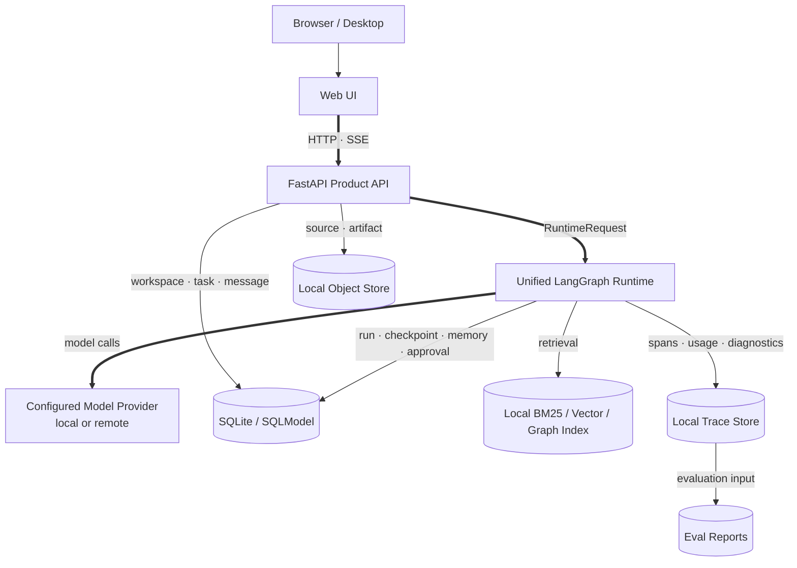

#### Local — Durable Storage and Recovery Topology

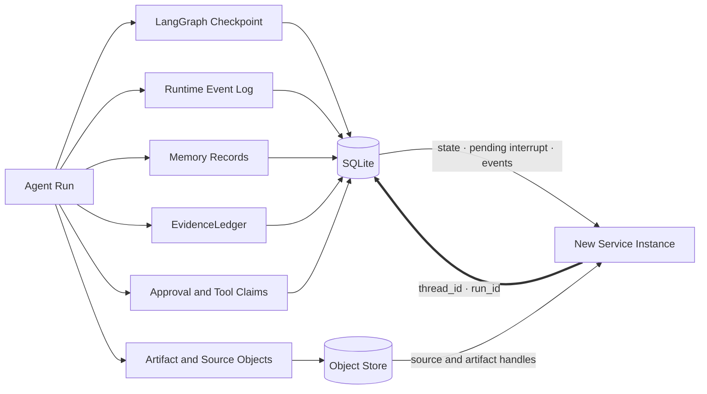

#### Local — Replaceable External Adapter Boundary

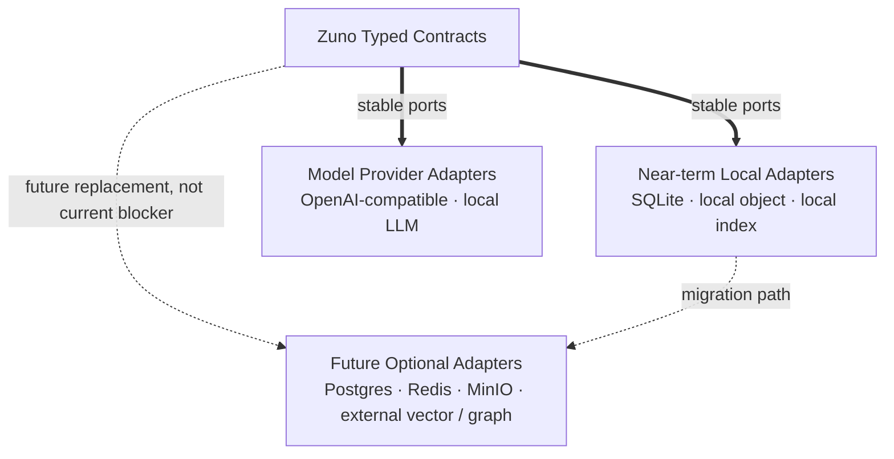

### Scenarios View (4+1)

回答“用户生命周期如何衔接”，而不是把所有动作误画成一条固定直线。

#### Overall — Product Lifecycles

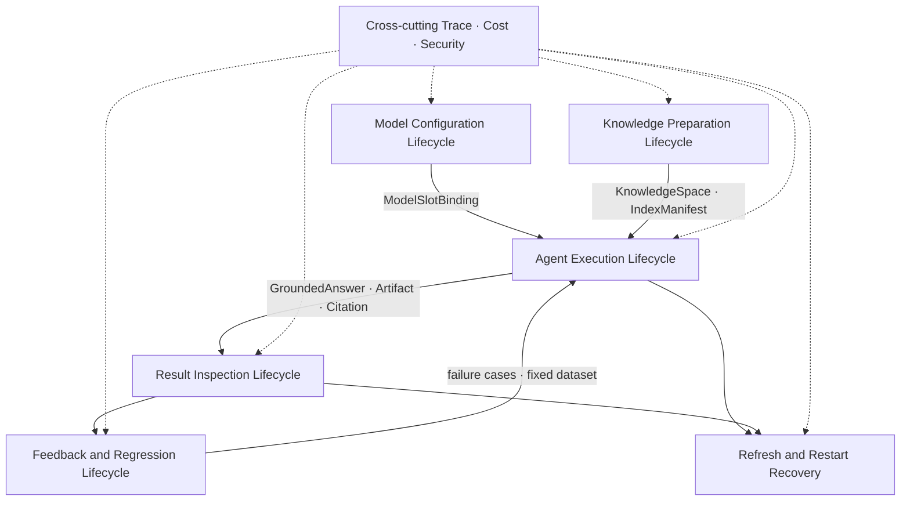

#### Local — Document Preparation Scenario

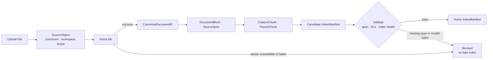

#### Local — AgentChat, Result and Recovery Scenario

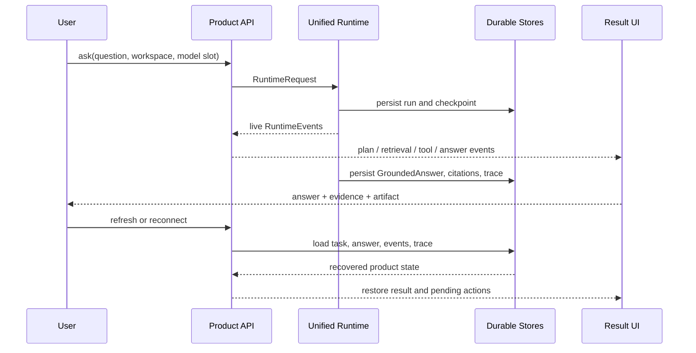

## 二、Views & Beyond

### Module View (Views & Beyond)

回答“十一逻辑模块如何映射到六个物理运行域，以及重点模块内部如何分解”。

#### Overall — Eleven Modules to Six Runtime Domains

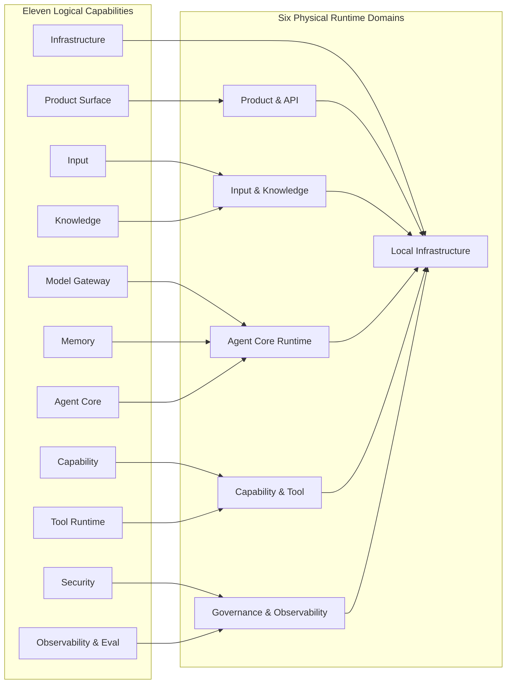

#### Local — Agent Core Module Decomposition

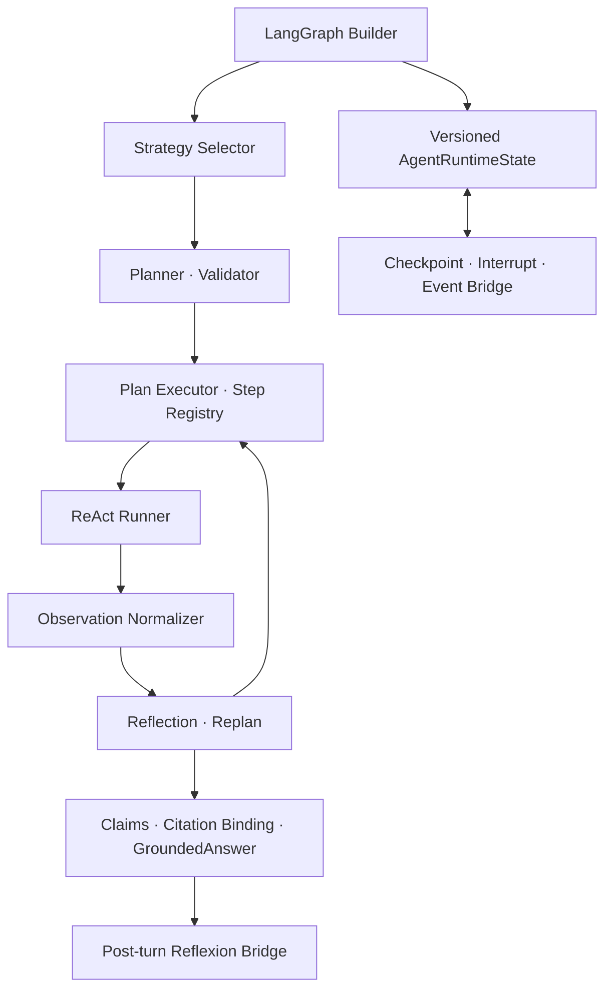

#### Local — Independent Capability Modules

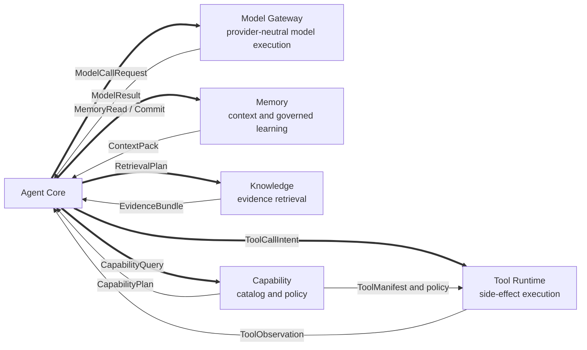

### Component-and-Connector View (Views & Beyond)

回答“运行时组件之间通过什么 connector、command 和 result contract 连接”。

#### Overall — Runtime Components and Typed Connectors

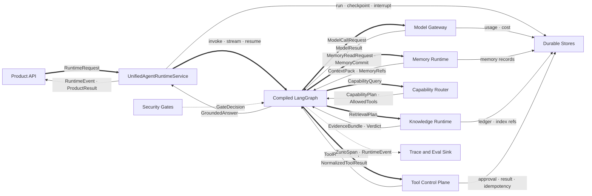

#### Local — Model, Memory and Knowledge Connectors

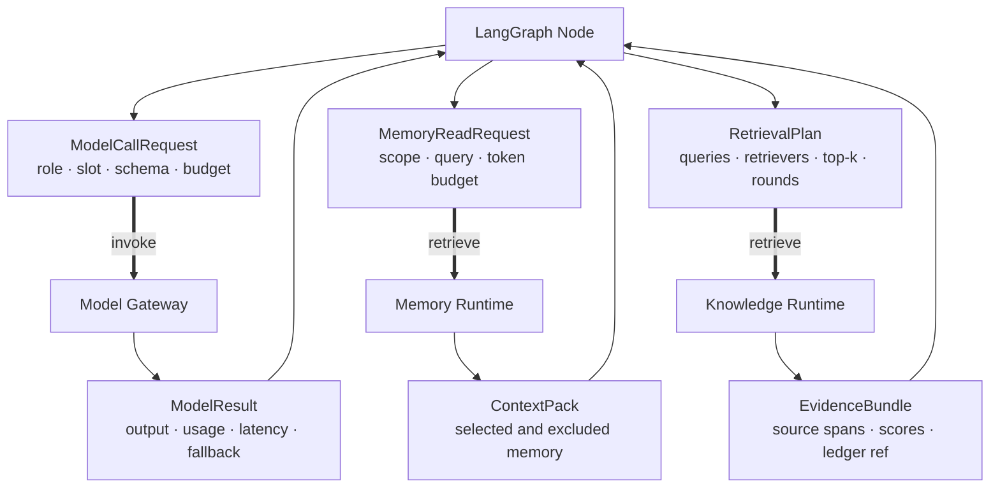

#### Local — Capability and Governed Tool Connector

```mermaid
flowchart LR
  PLAN["CapabilityPlan"]
  SKILL["Skill metadata → instruction → resource"]
  INTENT["Function Call Intent"]
  ROUTER["Capability Router"]
  POLICY{"Policy and Approval Gate"}
  CREDENTIAL["CredentialRef"]
  MANIFEST["ToolCard / MCP Tool"]
  ADAPTER["Execution Adapter"]
  NORMALIZE["Result Normalizer"]
  OBS["ToolObservation"]
  TRACE["ToolTrace"]

  PLAN --> SKILL --> ROUTER
  INTENT --> ROUTER
  ROUTER --> POLICY
  POLICY -->|approved| CREDENTIAL --> MANIFEST --> ADAPTER --> NORMALIZE --> OBS
  POLICY -->|approval required| TRACE
  POLICY -->|blocked| OBS
  ADAPTER --> TRACE
  NORMALIZE --> TRACE
```

### Data View (Views & Beyond)

回答“权威数据实体、版本、引用、运行状态和持久化事实如何流动”。

#### Overall — Authoritative Information Model

```mermaid
flowchart TB
  WORKSPACE["Workspace"]
  SESSION["Session"]
  TASK["Task / AgentRun"]
  MESSAGE["Message / GroundedAnswer"]
  ARTIFACT["Artifact"]
  SOURCE["SourceObject"]
  DOC["DocumentVersion"]
  IR["CanonicalDocumentIR"]
  SPAN["DocumentBlock · SourceSpan"]
  CHUNK["CitationChunk · ParentChunk"]
  INDEX["IndexManifest"]
  LEDGER["EvidenceLedger"]
  CLAIM["Claim"]
  BIND["CitationBinding"]
  MEMORY["MemoryRecord"]
  TOOL["ToolRequest · Approval · Result"]
  TRACE["TraceSpan · Usage · Eval"]

  WORKSPACE --> SESSION --> TASK --> MESSAGE --> ARTIFACT
  WORKSPACE --> SOURCE --> DOC --> IR --> SPAN --> CHUNK --> INDEX --> LEDGER
  TASK --> LEDGER
  MESSAGE --> CLAIM --> BIND
  LEDGER --> BIND
  TASK --> MEMORY
  TASK --> TOOL
  TASK --> TRACE
  TOOL --> TRACE
  LEDGER --> TRACE
  BIND --> TRACE
```

#### Local — Source-span Evidence and Citation Lineage

```mermaid
flowchart LR
  SOURCE["SourceObject<br/>uri · checksum"]
  VERSION["DocumentVersion"]
  BLOCK["DocumentBlock"]
  SPAN["SourceSpan<br/>page · bbox · line · cell"]
  CHUNK["CitationChunk"]
  INDEX["Index Entry"]
  RECORD["EvidenceLedgerRecord"]
  CLAIM["StructuredClaim"]
  BIND["ClaimEvidenceBinding"]
  ANSWER["GroundedAnswer"]

  SOURCE --> VERSION --> BLOCK --> SPAN
  BLOCK --> CHUNK --> INDEX --> RECORD
  SPAN --> CHUNK
  RECORD --> BIND
  CLAIM --> BIND --> ANSWER
  VERSION -.->|freshness validation| BIND
```

#### Local — Runtime, Memory and Tool State

```mermaid
flowchart TB
  RUN["AgentRuntimeState<br/>versioned control state"]
  CHECKPOINT["Checkpoint"]
  EVENT["RuntimeEvent"]
  INTERRUPT["PendingInterrupt"]
  OBS["NormalizedObservation"]
  PLAN["PlanState"]
  GROUND["GroundedAnswer"]
  MEMCAND["MemoryCandidate"]
  MEMREC["Approved MemoryRecord"]
  TOOLREQ["ToolRuntimeRequest"]
  APPROVAL["ApprovalDecision"]
  TOOLRES["NormalizedToolResult"]

  RUN --> CHECKPOINT
  RUN --> EVENT
  RUN --> INTERRUPT
  RUN --> OBS
  RUN --> PLAN
  RUN --> GROUND
  GROUND --> MEMCAND --> MEMREC
  RUN --> TOOLREQ --> APPROVAL --> TOOLRES --> OBS
```

### Quality View (Views & Beyond)

回答“安全、正确性、可恢复性、可观测性、性能、成本和诚实测量如何贯穿系统”。

#### Overall — Cross-cutting Quality Attributes

```mermaid
flowchart TB
  PRODUCT["Product Request"]
  INPUT["Input"]
  CONTEXT["Context Build"]
  AGENT["Agent Runtime"]
  RETRIEVAL["Retrieval"]
  MODEL["Model Calls"]
  TOOL["Tool Calls"]
  ANSWER["Grounded Answer"]
  STORE["Durable State"]

  SECURITY["Security · Privacy"]
  GROUNDING["Evidence · Citation Correctness"]
  OBS["Trace · Usage · Cost"]
  RECOVERY["Checkpoint · Idempotency · Recovery"]
  BUDGET["Timeout · Step · Token · Cost Limits"]
  EVAL["Benchmark · Failure Buckets · Release Gate"]

  PRODUCT --> INPUT --> CONTEXT --> AGENT
  AGENT --> RETRIEVAL --> ANSWER
  AGENT --> MODEL --> ANSWER
  AGENT --> TOOL --> ANSWER
  AGENT --> STORE

  SECURITY -.-> PRODUCT
  SECURITY -.-> INPUT
  SECURITY -.-> CONTEXT
  SECURITY -.-> RETRIEVAL
  SECURITY -.-> MODEL
  SECURITY -.-> TOOL
  SECURITY -.-> ANSWER

  GROUNDING -.-> RETRIEVAL
  GROUNDING -.-> ANSWER
  OBS -.-> PRODUCT
  OBS -.-> AGENT
  OBS -.-> RETRIEVAL
  OBS -.-> MODEL
  OBS -.-> TOOL
  RECOVERY -.-> AGENT
  RECOVERY -.-> STORE
  BUDGET -.-> AGENT
  EVAL -.-> OBS
  EVAL -.-> GROUNDING
```

#### Local — Security Gate Chain

```mermaid
flowchart LR
  REQUEST["User Request"]
  INPUT{"Input Gate<br/>ACL · injection · secret · PII"}
  MEMORY{"Memory Gate<br/>scope · privacy · stale · conflict"}
  RETRIEVAL{"Retrieval Gate<br/>workspace · ACL · trust · source span"}
  MODEL{"Model Context Gate<br/>redaction · policy · budget"}
  TOOL{"Tool Gate<br/>allowlist · args · approval · credential · network"}
  OUTPUT{"Output Gate<br/>unsupported claim · leakage · citation"}
  ARTIFACT{"Artifact Gate<br/>path · type · sensitivity"}
  RESULT["Product Result"]
  BLOCKED["Blocked / Redacted / Approval Required"]

  REQUEST --> INPUT --> MEMORY --> RETRIEVAL --> MODEL --> TOOL --> OUTPUT --> ARTIFACT --> RESULT
  INPUT -->|block| BLOCKED
  MEMORY -->|exclude or block| BLOCKED
  RETRIEVAL -->|block| BLOCKED
  MODEL -->|block| BLOCKED
  TOOL -->|approval or block| BLOCKED
  OUTPUT -->|rewrite or abstain| BLOCKED
  ARTIFACT -->|block| BLOCKED
```

#### Local — Trace, Failure Diagnosis and Release Gate

```mermaid
flowchart TB
  RUN["Agent Run Span Tree"]
  RET["Retrieval Metrics"]
  GEN["Generation Metrics"]
  AGENT["Agent Metrics"]
  MEM["Memory Metrics"]
  PROD["Product Metrics"]
  BUCKETS["Failure Buckets<br/>doc_miss · text_miss · citation_miss · answer_wrong"]
  DATASET["Tracked Fixed Dataset"]
  PROFILES["standard · deep · agentic profiles"]
  COMPLETE{"Profile Completeness"}
  GATE{"Release Gate"}
  PASS["measured_pass"]
  FAIL["measured_fail"]
  BLOCKED["blocked_not_measured"]

  RUN --> RET
  RUN --> GEN
  RUN --> AGENT
  RUN --> MEM
  RUN --> PROD
  RET --> BUCKETS
  GEN --> BUCKETS
  DATASET --> PROFILES --> COMPLETE
  RET --> GATE
  GEN --> GATE
  AGENT --> GATE
  MEM --> GATE
  PROD --> GATE
  COMPLETE -->|complete| GATE
  COMPLETE -->|incomplete or unavailable| BLOCKED
  GATE -->|thresholds met| PASS
  GATE -->|thresholds missed| FAIL
```

## 三、Zuno Product Core

### Agentic GraphRAG Evidence and Agent Loop (Zuno)

回答“Agent 如何规划检索、纠正失败、跨轮积累 source-span evidence、绑定 claim 并进入 Reflection / Replan”。

#### Overall — Agentic GraphRAG and Agent Loop

```mermaid
flowchart TB
  QUESTION["Question + ContextPack"]
  NEED{"Need Retrieval?"}
  QUERY["Query Strategy"]
  BM25["BM25"]
  VECTOR["Vector"]
  GRAPH["Graph Expansion"]
  FUSION["RRF / Fusion"]
  RERANK["Rerank · Parent Expansion"]
  LEDGER["EvidenceLedger"]
  QUALITY{"Retrieval Quality Gate"}
  CLAIM["Claim Extraction"]
  BIND["Claim-level Citation Binding"]
  SYNTH["Grounded Synthesis"]
  REFLECT{"Reflection"}
  CORRECT["Corrective Action / Replan"]
  FINAL["Grounded Answer · Partial · Abstain"]
  EVAL["Failure Buckets · Release Gate"]

  QUESTION --> NEED
  NEED -->|yes| QUERY
  NEED -->|no| CLAIM
  QUERY --> BM25 --> FUSION
  QUERY --> VECTOR --> FUSION
  QUERY --> GRAPH --> FUSION
  FUSION --> RERANK --> LEDGER --> QUALITY
  QUALITY -->|sufficient| CLAIM --> BIND --> SYNTH --> REFLECT
  QUALITY -->|ambiguous · irrelevant · insufficient span| CORRECT --> QUERY
  REFLECT -->|PASS| FINAL
  REFLECT -->|REWRITE_ANSWER| SYNTH
  REFLECT -->|RETRIEVE_MORE| CORRECT
  REFLECT -->|ABSTAIN| FINAL
  FINAL --> EVAL
```

#### Local — Query Strategy and Corrective Retrieval

```mermaid
flowchart LR
  ORIGINAL["Original Query"]
  DIRECT["DIRECT"]
  REWRITE["REWRITE"]
  MULTI["MULTI_QUERY"]
  STEPBACK["STEP_BACK"]
  HYDE["HYDE"]
  ENTITY["ENTITY_DECOMPOSITION"]
  RELATION["RELATION_QUERY"]
  PLAN["RetrievalPlan<br/>query set · retriever mix · graph traversal"]
  ROUND["Retrieval Round"]
  VERDICT{"RELEVANT · AMBIGUOUS · IRRELEVANT · CONFLICTING · INSUFFICIENT_SPAN"}
  CONTINUE["Continue to Claims"]
  CORRECT["Choose unused corrective action"]
  ABSTAIN["Abstain"]

  ORIGINAL --> DIRECT --> PLAN
  ORIGINAL --> REWRITE --> PLAN
  ORIGINAL --> MULTI --> PLAN
  ORIGINAL --> STEPBACK --> PLAN
  ORIGINAL --> HYDE --> PLAN
  ORIGINAL --> ENTITY --> PLAN
  ORIGINAL --> RELATION --> PLAN
  PLAN --> ROUND --> VERDICT
  VERDICT -->|sufficient| CONTINUE
  VERDICT -->|retry allowed and novelty expected| CORRECT --> PLAN
  VERDICT -->|budget exhausted or no novelty| ABSTAIN
```

#### Local — EvidenceLedger, Claim Binding and Failure Attribution

```mermaid
flowchart TB
  ROUND1["Round 1 EvidenceLedgerRecords"]
  ROUND2["Round 2 EvidenceLedgerRecords"]
  DEDUPE["Deduplicate · Conflict Group · Freshness Check"]
  SELECT["Evidence Selection<br/>context budget · source span required"]
  CLAIMS["Structured Claims"]
  BIND["ClaimEvidenceBinding"]
  VERIFY{"Support Verification"}
  ANSWER["GroundedAnswer"]
  DOCMISS["doc_miss"]
  TEXTMISS["doc_hit_text_miss"]
  CITMISS["text_hit_citation_miss"]
  WRONG["citation_hit_answer_wrong"]

  ROUND1 --> DEDUPE
  ROUND2 --> DEDUPE
  DEDUPE --> SELECT --> BIND
  CLAIMS --> BIND --> VERIFY
  VERIFY -->|supported| ANSWER
  VERIFY -->|document absent| DOCMISS
  VERIFY -->|document hit but evidence absent| TEXTMISS
  VERIFY -->|evidence hit but binding absent| CITMISS
  VERIFY -->|citation correct but answer wrong| WRONG
```

## 4. Target completion criteria

目标架构只有在以下事实同时成立时，才能写成完整实现：

1. Completion 与 Workspace 默认使用同一个 UnifiedAgentRuntimeService。
2. Unified runtime 使用 compiled LangGraph、原生 checkpoint、interrupt/resume 和 live event stream。
3. 所有真实模型调用经过 Model Gateway，并读取有效 model slot binding。
4. Memory 使用 durable store，跨请求和重启可复用；ContextPack 可观测。
5. Knowledge 返回 durable EvidenceLedger 和 source-span EvidenceBundle。
6. Capability 负责选择与 policy；Tool Runtime 完成真实安全工具执行。
7. GroundedAnswer 是正式 runtime state，包含 claims、bindings、unsupported claims 和 ledger ref。
8. Security 与 Observability 覆盖所有关键边界。
9. 关键事实可持久化、恢复、审计和重放。
10. fixed paired benchmark 形成完整 measured profile，并诚实输出 pass、fail 或 blocked。

## 5. Current / Target 边界

- 本文所有图默认表达 Target。
- `docs/architecture/production-readiness.md` 表达 Current。
- Current 不得因为 contract、mock、fixture、sidecar 或 deterministic baseline 存在而写成完整 runtime。
- 质量只能由 fixed benchmark 与 release gate 证明。
