# Zuno Lean Complete Product Architecture

updated: 2026-07-10
status: normative-short-term-target
current_state_source: docs/architecture/production-readiness.md

## 1. 项目定位与边界

一句话定义：

```text
Zuno = Lean Complete Agentic GraphRAG Product
```

Zuno 是一个本地优先、短小精悍但工程完整的企业知识库 Agent 产品。它允许用户配置模型、创建 Workspace、上传资料、解析和索引文档，通过 AgentChat 使用标准检索或深度检索，由 Single Controller Agent 完成规划、混合检索、GraphRAG、证据整理、claim-level citation、回答生成、trace、成本统计和反馈。

本项目解决的问题不是“再做一个普通 RAG demo”，而是让一个企业知识库 Agent 能回答以下工程问题：

- 用户能否从 UI 完成模型配置、知识库准备、提问、引用查看、trace 查看和反馈。
- Agent 能否在同一条运行链路里完成 context 构建、策略选择、检索、证据绑定、工具调用、反思和回答。
- 证据是否能从 source object 回到 source span，而不是只停留在 doc-level retrieval。
- blocked、prepared、runtime observed、measured 是否被严格区分。
- 本地实现能否持久化、恢复、观测和复现实验结果。

目标用户是需要演示、验证和继续开发企业知识库 Agent 的开发者、研究者和产品评审者。近期目标采用本地优先，是因为 Zuno 当前最缺的不是分布式规模，而是可真实运行、可解释失败、可复现质量的完整产品闭环。本地实现只要 owner 清晰、contract typed、配置可替换、状态可恢复、trace 可查询，就可以是正式近期目标，不是低级占位。

Zuno 近期坚持 Single Controller Agent。用户不需要手动拼 RAG、GraphRAG、Tool 和 Memory 流程；Single Controller 负责在一个任务内选择策略、构建计划、执行检索或工具、绑定引用、必要时反思重试，并最终生成 grounded answer。Zuno 不把近期目标写成默认产品级多 Agent 平台。

Zuno 采用 Agentic GraphRAG，是为了把 doc-level retrieval 的增益转成 evidence-span-level retrieval、claim-level citation 和 answer correctness 的可测增益。Graph、vector、BM25、fusion、rerank 和 citation binding 都必须服务于证据可追溯，而不是作为技术名词堆叠。

近期明确不做：

- 大规模多租户和高可用集群。
- Kafka / RabbitMQ 集群、Kubernetes、复杂运维平台。
- Milvus / Neo4j 集群作为近期 blocker。
- 复杂 SSO / DLP / Vault / Firecracker。
- 大规模在线评测平台。
- 大量 parser/provider 并行接入。
- 默认产品级多 Agent runtime。

项目完成定义：

1. 用户可完成真实端到端流程。
2. 每个运行域有唯一 owner。
3. 关键参数来自配置或 DB，不写死在业务流程中。
4. 使用真实 runtime，而不是只有 mock / fixture。
5. 关键状态可以本地持久化和恢复。
6. 失败、blocked、fallback 有明确语义。
7. 模型、检索、工具、citation 有 trace。
8. focused tests 和至少一个 E2E 场景通过。
9. Agentic GraphRAG 与 baseline 使用同一 fixed case set。
10. Agentic GraphRAG 至少不弱于 baseline，并满足 citation / evidence gate。

当前质量口径：

```text
implementation available
measurement blocked
quality not yet proven
```

Agentic GraphRAG 是否真正完成，仍以 fixed benchmark 和 release gate 为准。

## 2. 用户产品场景

| 步骤 | 输入 | 输出 | 状态 | 失败表现 | 后端事实源 |
| --- | --- | --- | --- | --- | --- |
| 配置模型 | provider、base URL、model、slot、timeout、budget | ModelDefinition、ModelSlotBinding | saved / invalid / unavailable | model call rejected、missing key、timeout | `src/backend/zuno/platform/model_gateway.py`、`src/backend/zuno/api/dto/llm.py`、`src/backend/zuno/platform/database/models/llm.py` |
| 创建 Workspace | workspace name、owner、knowledge scope | Workspace、KnowledgeSpace | active / archived | duplicate name、ACL denied | `src/backend/zuno/api/dto/workspace.py`、`src/backend/zuno/platform/database/models/workspace_session.py` |
| 上传文件 | file、workspace_id、metadata | SourceObject、WorkspaceFile | uploaded / rejected | unsupported type、size limit、storage failure | `src/backend/zuno/knowledge/ingestion`、`src/backend/zuno/knowledge/storage/local_object_store.py`、`src/backend/zuno/platform/database/models/knowledge_file.py` |
| 查看解析与索引状态 | file_id、workspace_id | ParseJob、IndexManifest status | parsing / indexed / blocked | parser blocked、index blocked、missing source span | `src/backend/zuno/knowledge/indexing`、`src/backend/zuno/knowledge/storage/durable_ingestion_store.py`、`src/backend/zuno/platform/database/models/knowledge_task.py` |
| 选择知识库 | workspace_id、knowledge_space_id | retrieval scope | selected / empty / stale | no indexed document、ACL denied | `src/backend/zuno/api/dto/knowledge.py`、`src/backend/zuno/knowledge/retrieval` |
| 发起 AgentChat | message、session_id、model slot、retrieval mode | Task、TaskEvent、streaming answer | running / blocked / completed | model unavailable、no evidence、budget exceeded | `src/backend/zuno/api/dto/completion.py`、`src/backend/zuno/agent/core`、`src/backend/zuno/platform/database/models/message.py` |
| 查看引用和 Artifact | answer_id、citation labels、artifact refs | Citation UI、Artifact | available / partial / unsupported | citation missing、artifact generation failed | `src/backend/zuno/knowledge/trace.py`、`src/backend/zuno/api/dto/message.py` |
| 查看运行 Trace | task_id、run_id | span tree、usage、cost、latency、diagnostics | available / redacted / missing | trace missing、span incomplete | `src/backend/zuno/platform/observability`、`src/backend/zuno/platform/common/runtime_observability.py` |
| 提交反馈 | answer_id、rating、comment、correction | Feedback | saved / rejected | invalid target、ACL denied | `src/backend/zuno/platform/database/models/history.py`、feedback DTO owner |
| 刷新或重启后继续查看 | workspace_id、session_id、task_id | restored task、answer、trace、artifact | recovered / partial / unavailable | only in-memory state lost | SQLite、LocalObjectStore、LocalTraceStore |

前端只负责交互、展示和临时 UI 状态。业务事实源必须在后端：workspace、file、task、artifact、trace、feedback、model slot 和 retrieval profile 都不能只存在于浏览器 state。当前仍是内存态的任务事件、planner state、部分 retrieval diagnostics 和部分 trace 需要迁入 durable store，避免刷新或服务重启后无法解释一次运行。

## 3. 黄金端到端链路

| 节点 | owner | 主要 contract | 输入 | 输出 | 持久状态 | trace event | 失败语义 |
| --- | --- | --- | --- | --- | --- | --- | --- |
| Model Configuration | Product & API / Agent Core | ModelDefinition、ModelSlotBinding | provider、model、base URL、slot | bound model slot | SQLite model tables / config | `model_config.saved` | invalid_config / provider_unavailable |
| Workspace | Product & API | Workspace、KnowledgeSpace | user、workspace metadata | workspace scope | SQLite workspace/session rows | `workspace.created` | acl_denied / duplicate |
| Source Object | Input & Knowledge | SourceObject、WorkspaceFile | uploaded file | object URI、checksum | LocalObjectStore + DB row | `source_object.saved` | storage_failed / unsupported |
| Parse Job | Input & Knowledge | ParseJob、ParseSnapshot | source object | parse status | DurableIngestionStore | `parse.started` / `parse.blocked` | parser_unavailable / blocked_not_indexed |
| Document IR | Input & Knowledge | CanonicalDocumentIR | parse snapshot | normalized document | durable IR snapshot | `document_ir.created` | invalid_ir |
| Block / Citation Chunk | Input & Knowledge | DocumentBlock、CitationChunk、SourceSpan | document IR | citation-sized chunks | chunk table/index manifest | `chunk.created` | missing_source_span |
| Index Manifest | Input & Knowledge | IndexManifest、IndexChunk | chunks、embedding config | index version | local index metadata | `index_manifest.created` | stale_index / index_failed |
| BM25 / Vector / Graph Index | Input & Knowledge | RetrieverResult、GraphEvidence | query、scope | candidate evidence | local index / graph index | `retrieval.candidate` | no_candidate / graph_without_span |
| AgentChat Request | Product & API | CompletionRequest、Task | message、session、mode | task/run id | task and events | `agent_run.started` | invalid_request |
| ContextPack | Agent Core | ContextPack | session、memory、knowledge scope | bounded context | optional ContextPack snapshot | `context_build` | context_over_budget |
| Strategy Selection | Agent Core | StrategyDecision | request、context | standard / deep / agentic route | PlanState | `planning.strategy` | unsupported_strategy |
| RetrievalPlan | Agent Core | RetrievalPlan | strategy、question | query set and retriever mix | PlanState | `planning.retrieval_plan` | invalid_plan |
| Hybrid Retrieval | Input & Knowledge | RetrievalTrace | query set、scope | candidates | retrieval diagnostics | `retrieval` | doc_miss / text_miss |
| Graph Expansion | Input & Knowledge | GraphExpansionTrace | entities、candidate chunks | expanded evidence | graph trace | `graph_expand` | graph_unavailable / no_span |
| Fusion / Rerank | Input & Knowledge / Agent Core | RerankTrace | candidates、weights | ranked evidence | rerank diagnostics | `rerank` | ranker_unavailable |
| EvidenceBundle | Input & Knowledge | EvidenceBundle | ranked evidence | evidence spans | evidence diagnostics | `evidence_bundle` | evidence_unavailable |
| Claim Extraction | Agent Core | ClaimSet | draft answer or question | claims | optional trace payload | `claim_extract` | no_claim |
| Citation Binding | Agent Core / Governance | CitationBinding | claims、evidence | bound citations | citation diagnostics | `claim_binding` | citation_miss / doc_only_not_strict |
| Grounded Synthesis | Agent Core | GroundedAnswer | context、evidence、citations | answer draft | message/artifact row | `answer_synthesis` | unsupported_claim |
| Reflection / Replan | Agent Core | ReflectionDecision | answer draft、diagnostics | finish / retrieve / tool / abstain | PlanState | `reflection` / `replan` | max_steps_reached |
| Final Answer / Artifact | Product & API | Message、Artifact | grounded answer | UI payload | DB + object store | `answer.finalized` | partial_answer / artifact_failed |
| Trace / Eval / Cost | Governance & Observability | ZunoSpan、EvalRun | span tree、usage | diagnostics and gate output | LocalTraceStore / eval reports | `eval` | blocked_not_measured |
| Feedback | Product & API / Governance | Feedback | user rating/comment | feedback row | SQLite | `feedback.saved` | invalid_target |
| Post-turn Memory Commit | Agent Core | MemoryRecord、MemoryGovernanceRecord | final answer、events | memory candidates | memory store | `memory_commit` | privacy_blocked / promotion_pending |

这条链路是近期项目的唯一主叙事。任何新能力都必须说明它插入哪一个节点、使用哪个 contract、是否改变持久状态、如何 trace、如何测试。

### 3.1 双视图架构：十一逻辑能力层与六物理运行域

Zuno 的目标架构必须同时保留两张视图，不能把其中一张当成另一张。

- 十一逻辑能力层回答“系统需要哪些能力、每个能力的 contract 和责任边界是什么”。
- 六个物理运行域回答“为了让近期代码短小、可维护、owner 清晰，代码如何组合目录和运行责任”。

六运行域适合做代码 ownership 和近期交付边界，但不能替代逻辑能力层。否则容易误读为 Memory、Model Gateway、Knowledge、Tool Runtime 都被 Agent Core 物理吞掉。正确关系是：Agent Core / Planning & Control 是协调者；它通过 typed contract 调用 Model Gateway、Memory、Knowledge、Capability 和 Tool Runtime，但这些能力仍有独立 owner、contract、生命周期和测试边界。

| 逻辑能力层 | 负责什么 | 近期边界 |
| --- | --- | --- |
| Product Surface | Web/Desktop、AgentChat、Workspace、Artifact、Citation UI、trace summary 和 feedback | 用户可见流程和后端业务事实源对齐 |
| Input | 上传、解析、Document IR、SourceObject、SourceSpan 和 parser/index handoff | parser blocked 不 fake index |
| Knowledge | Chunk、Index、BM25、Vector、GraphRAG、EvidenceBundle 和 CitationLineage | 产出可回溯 evidence span，不决定最终回答 |
| Model Gateway | 模型槽位、provider、base URL、路由、超时、费用、fallback 和 usage trace | 所有真实模型调用统一入口 |
| Memory | Sensory、Short-term、Long-term、Entity 四层记忆，ContextPack、读写治理和跨任务经验复用 | Memory 能力独立，Agent Core 负责在任务生命周期中读、用、写；ContextPack 不是第五层 Memory |
| Agent Core / Planning & Control | Strategy、Plan、ReAct、Observation、Reflection、Replan、Stop condition、abstain、answer synthesis | Single Controller 的控制循环，不是所有模块的物理父层 |
| Capability | SkillCard、CapabilityCard、能力目录、能力选择、权限策略和路由 | 描述与路由能力，不拥有 Knowledge/Tool 的执行实现 |
| Tool Runtime | Tool/MCP 执行、审批、timeout、credential ref、result normalization 和 ToolTrace | 副作用执行必须经 policy/approval/trace |
| Security | Input/Retrieval/Tool/Output Gate、ACL、redaction、secret boundary | 横切治理，不写成单点脚本 |
| Observability & Eval | Trace、cost、eval、benchmark、failure bucket、release gate | blocked/prepared/runtime observed/measured 严格区分 |
| Infrastructure | SQLite、object store、local queue、index、配置、迁移、恢复 | 本地正式近期目标，可替换但不低级 |

| 逻辑能力层 | 映射到六物理运行域 |
| --- | --- |
| Product Surface | Product & API |
| Input、Knowledge | Input & Knowledge |
| Model Gateway、Memory、Agent Core / Planning & Control | Agent Core 运行域内协作，但三者逻辑 owner 独立 |
| Capability、Tool Runtime | Capability & Tool；Capability 是目录/策略/路由，Tool Runtime 是执行 |
| Security、Observability & Eval | Governance & Observability |
| Infrastructure | Local Infrastructure |

Capability 可以统一描述和路由 KnowledgeCapability、ToolCapability、ArtifactCapability 和 SkillCard，但不能拥有它们的具体执行实现。KnowledgeCapability 的执行属于 Knowledge Runtime；ToolCapability 的执行属于 Tool Runtime；ArtifactCapability 的执行属于 Artifact/Product service。Capability 是能力目录、选择器和权限策略，不是 Knowledge + Tool 的父模块。

Planning、ReAct、Reflection、Replan 和 Reflexion 也不是五层、五个 Agent 或五套产品模式。它们属于 Agent Core / Planning & Control 内部的控制机制：

| 控制机制 | Agent Core 内部职责 |
| --- | --- |
| Plan-and-Execute | 生成宏观 plan、step、预算和 stop condition |
| ReAct | 单步内部的 reason-act-observe 控制 |
| Observation | 归一化 retrieval、tool、model、gate 的执行结果 |
| Reflection | 检查 evidence、citation、unsupported claim、tool failure 和 security blocked |
| Replan | 在证据不足、工具失败或目标变化后修改剩余步骤 |
| Reflexion | 把可复用失败经验提交给 Memory governance，而不是直接污染长期记忆 |

当前事实边界：

```text
Memory：模块能力和本地 baseline 较完整；真实 AgentChat 读、用、写、Reflexion review 闭环仍未完全打通。
Planning：contract 和规则判断已存在；真实 GeneralAgent、AgentControlRuntime 和 durable runtime 尚未统一成一条执行图。
RAG：证据、引用和 GraphRAG 基础较强；agentic re-retrieval 闭环和 fixed benchmark measured pass 仍未完成。
```

### 3.2 可实施规格增强

下一阶段架构文档不再继续增加“大层”，而是把核心能力补成有状态、有触发条件、有输入输出、有失败转移和有验收指标的 contract。

| 模块 | 目标 contract | Current 边界 |
| --- | --- | --- |
| Memory | 四层模型：Sensory、Short-term、Long-term、Entity；Long-term 包含 Episodic、Semantic、Procedural 和 approved Reflexion lessons；ContextPack 是读取视图 | MemoryEngine baseline 存在；完整 AgentChat 读、用、写、未来复用未全闭环 |
| Planning & Control | Plan-and-Execute 管宏观计划，ReAct 管单步执行，Reflection 管质量检查，Replan 改真实轨迹，Reflexion 进入 Memory governance | GeneralAgent ReAct、planning contracts、AgentControlRuntime 存在；统一真实执行图未完成 |
| Agentic GraphRAG | Index、Query Strategy、Recall/Graph/Rerank、Evidence/Citation、Corrective Agentic Control 五阶段；EvidenceLedger 跨轮累积证据 | retrieval/evidence/citation baseline 存在；corrective re-retrieval 和 fixed benchmark measured pass 未完成 |
| Capability & Tool | Function Calling 表达结构化意图，Capability 做目录/策略/路由，Skill 做 SOP，MCP/Tool 提供原子能力，Tool Runtime 执行和治理 | capability registry、tool adapters、MCP surfaces 存在；2-3 个真实工具闭环仍是 P1 |
| Eval & Observability | Retrieval、Generation、Agent、Memory、Product 分层指标；offline eval -> release -> feedback -> failure case -> fixed dataset -> regression eval | local trace/eval helpers 和 failure buckets 存在；完整 measured agentic profile 仍 blocked |

统一目标表达：

```text
Single Controller Agent
=
Plan-and-Execute for global control
+ ReAct for step execution
+ Reflection for quality control
+ Replan for trajectory correction
+ Reflexion for cross-task learning
+ Four-layer governed Memory
+ Capability / Skill / Tool Runtime
+ Corrective Agentic GraphRAG
+ Source-span evidence and measurable release gates
```

## 4. 六个运行域总览

| 运行域 | 定位 | 主要 owner | 核心输出 |
| --- | --- | --- | --- |
| Product & API | 用户可见产品流程和后端业务事实源 | `apps/web`、`src/backend/zuno/api`、`src/backend/zuno/api/dto` | workspace、task、artifact、citation UI、trace summary、feedback |
| Input & Knowledge | 文档进入、解析、切块、索引、检索和证据 lineage | `src/backend/zuno/knowledge`、`src/backend/zuno/platform/services/rag`、`src/backend/zuno/platform/services/graphrag` | Document IR、CitationChunk、IndexManifest、EvidenceBundle |
| Agent Core | Model Gateway、Memory、Agent Core / Planning & Control 的运行域协作；Single Controller 负责协调，不物理吞并其他逻辑能力 | `src/backend/zuno/agent`、`src/backend/zuno/memory`、`src/backend/zuno/platform/model_gateway.py` | PlanState、RetrievalPlan、GroundedAnswer、MemoryRecord |
| Capability & Tool | Capability 负责能力目录/策略/路由；Tool Runtime 负责审批、执行和结果归一 | `src/backend/zuno/capability`、`src/backend/zuno/capability/tools`、`src/backend/zuno/platform/services/*tool*` | CapabilityPlan、ToolRequest、ToolResult、ToolTrace |
| Governance & Observability | 安全门、trace、eval、cost、failure diagnostics 和 release gate | `src/backend/zuno/platform/security`、`src/backend/zuno/platform/observability`、`tools/evals/zuno` | ZunoSpan、EvalRun、failure buckets、release gate |
| Local Infrastructure | 本地存储、队列、索引、配置、迁移、健康检查和恢复 | `src/backend/zuno/platform`、`src/backend/zuno/knowledge/storage` | SQLite rows、LocalObjectStore、LocalQueue、LocalIndex、LocalTraceStore |

### 4.1 Product & API

| 项 | 内容 |
| --- | --- |
| 定位 | 承载用户可见的 AgentChat、Workspace、Knowledge Space、file status、task lifecycle、Artifact、Citation UI、Trace summary、Feedback 和 recovery action。 |
| 职责 | 将前端操作转成后端 typed DTO 和 durable business state；通过 SSE/events 暴露 task progress；把 citation、artifact、trace summary 显示为产品能力。 |
| 不负责什么 | 不在前端保存业务事实源；不在 API route 内硬编码 retrieval、planner、tool 或 model 逻辑；不绕过 domain owner 直接改 index 或 memory。 |
| 代码 owner | `apps/web`、`src/backend/zuno/api`、`src/backend/zuno/api/dto`、`src/backend/zuno/api/services`。 |
| 核心 contract | `CompletionRequest`、`MessageDTO`、`WorkspaceDTO`、`KnowledgeDTO`、`ToolDTO`、`AgentDTO`、SSE event payload、Artifact reference、Citation payload。 |
| 主要 runtime | FastAPI routes、CompletionService、workspace/file/task APIs、SSE streaming bridge。 |
| 输入 | user request、workspace_id、knowledge_space_id、file upload、model slot、retrieval mode、feedback。 |
| 输出 | task_id、stream events、answer message、citations、artifact refs、trace summary、feedback receipt。 |
| 配置 | UI 读 model slots、retrieval profile、feature flags；默认值来自 DB/config，workspace override 只允许通过后端验证的 DTO。 |
| 持久状态 | Workspace、KnowledgeSpace、WorkspaceFile、Session、Task、TaskEvent、Artifact、Feedback、model slot binding。 |
| 失败与 fallback | API 返回 typed error；SSE 使用 `blocked`、`failed`、`partial`、`completed`；刷新后从 task/event store 恢复，不从前端缓存推断。 |
| 安全边界 | Workspace ACL、file ownership、tool approval target、trace redaction summary。 |
| trace / metrics | `agent_run.started`、`task_event.emitted`、`api.error`、latency、stream interruption、feedback saved。 |
| focused tests | DTO validation、SSE event order、workspace ACL、task recovery、citation payload shape。 |
| E2E 验收 | 用户配置模型、创建 workspace、上传文档、提问、看到引用和 trace、刷新后仍能查看。 |
| 当前状态 | API/DTO、workspace、message、knowledge、tool 和 model 配置入口存在；部分 task/planner/retrieval runtime state 仍需 durable 化。 |
| 短期闭环项 | P0 trace 可查看；P1 task/planner/retrieval/approval 状态本地持久化；P2 前端 E2E 和演示脚本。 |
| Future Optional | 多租户 admin console、复杂团队权限、企业审计门户。 |

### 4.2 Input & Knowledge

| 项 | 内容 |
| --- | --- |
| 定位 | 管理 SourceObject、WorkspaceFile、ParseJob、Document IR、Block/Chunk、IndexManifest、BM25、Vector、Graph、EvidenceBundle 和 CitationLineage。 |
| 职责 | 文档进入、解析、切块、索引、检索和证据回溯；保证 chunk 与 source span 绑定；parser blocked 不得 fake index。 |
| 不负责什么 | 不决定最终回答；不在 parser 内生成 citation claim；不把 Graph evidence 写成无 source span 的 strict evidence。 |
| 代码 owner | `src/backend/zuno/knowledge`、`src/backend/zuno/knowledge/ingestion`、`src/backend/zuno/knowledge/indexing`、`src/backend/zuno/knowledge/retrieval`、`src/backend/zuno/knowledge/graphrag`、`src/backend/zuno/platform/services/rag`、`src/backend/zuno/platform/services/graphrag`。 |
| 核心 contract | SourceObject、ParseSnapshot、CanonicalDocumentIR、DocumentVersion、DocumentBlock、SourceSpan、CitationChunk、ParentChunk、IndexManifest、IndexChunk、CitationLineage、EvidenceBundle。 |
| 主要 runtime | local object store、durable ingestion store、doc parsers、chunker、local index、retrieval orchestrator、GraphRAG retriever、fusion/rerank。 |
| 输入 | uploaded source object、workspace scope、parser config、index config、retrieval query、Graph expansion request。 |
| 输出 | parse status、IR、chunks、index manifest、retrieval candidates、evidence spans、diagnostics。 |
| 配置 | parser provider、chunk size、chunk overlap、parent context size、embedding model、retrieval top-k、candidate pool size、RRF/rerank weights、citation threshold。 |
| 持久状态 | SourceObject checksum/URI、WorkspaceFile、ParseJob、DocumentVersion、DocumentBlock、IndexManifest、IndexChunk、CitationLineage、local index files、graph evidence index。 |
| 失败与 fallback | unsupported file -> parse blocked；parser failed -> no index handoff；missing source span -> not strict citation；graph unavailable -> vector/BM25 can continue with trace flag。 |
| 安全边界 | Workspace ACL on every retrieval scope；redaction before trace export；no cross-workspace index leakage。 |
| trace / metrics | `parse.started`、`parse.blocked`、`chunk.created`、`index.created`、`retrieval`、`graph_expand`、`rerank`、doc_miss / doc_hit_text_miss diagnostics。 |
| focused tests | parser idempotency、chunk span mapping、index rehydrate、retrieval scope ACL、graph evidence to source span、blocked parser no fake index。 |
| E2E 验收 | 文本文档真实闭环；最小 PDF parser 能产出 source span citation；同一 fixed case set 可比较 standard/deep/agentic。 |
| 当前状态 | 文本类文档、local object store、durable ingestion store、GraphRAG、evidence-span hardening 代码已存在；fixed benchmark measured pass 仍 blocked。 |
| 短期闭环项 | P0 fixed benchmark；P1 PDF source span citation；P1 retrieval diagnostics 持久化。 |
| Future Optional | 大量 parser provider、外部 OCR/VLM、外部 graph/vector 集群。 |

### 4.3 Agent Core

| 项 | 内容 |
| --- | --- |
| 定位 | Agent Core / Planning & Control 是 Single Controller 的协调层，负责 StrategySelector、PlannerOutput、PlanState、RetrievalPlan、CapabilityPlan、AgentControlRuntime、Observation、Reflection、Replan、Stop Controller、Grounded Answer Synthesis 和 Post-turn Memory Commit 的任务级控制。Model Gateway、Memory、Knowledge、Capability 和 Tool Runtime 由它调用，但不是被它物理吞并的内部小组件。 |
| 职责 | Single Controller Agent 执行完整循环；所有真实模型调用统一经过 Model Runtime / Gateway；规则 planner 与 model planner 共享 contract；通过 ContextPack 使用 Memory，通过 RetrievalPlan 使用 Knowledge，通过 CapabilityPlan 使用 Capability/Tool。 |
| 不负责什么 | 不拥有 Knowledge 的检索实现；不拥有 Tool Runtime 的执行实现；不直接写前端状态；不直接操作低层存储；不绕过 capability policy 执行副作用工具；不建设默认多 Agent 平台。 |
| 代码 owner | `src/backend/zuno/agent`、`src/backend/zuno/agent/core`、`src/backend/zuno/memory`、`src/backend/zuno/platform/model_gateway.py`、legacy `src/backend/zuno/agent/core/models` 只作为兼容层逐步收口。 |
| 核心 contract | ModelCallRequest/Response、ModelSlotBinding、ContextPack、PlannerOutput、PlanState、RetrievalPlan、CapabilityPlan、Observation、ReflectionDecision、GroundedAnswer、MemoryRecord。 |
| 主要 runtime | GeneralAgent single loop、model gateway、context builder、memory engine、planner/controller、claim binder、answer synthesis。当前三套路径仍需收口：真实 LangChain/LangGraph ReAct、规则式 AgentControlRuntime、checkpoint/approval durable runtime。 |
| 输入 | AgentChat request、workspace scope、model slot、memory scope、retrieval diagnostics、tool results。 |
| 输出 | plan, observations, answer, citations, abstain/fallback reason, memory commit candidates。 |
| 配置 | model provider/name/base URL、model slot、thinking mode、max agent steps、model timeout、retry count、budget、memory read policy、context budget。 |
| 持久状态 | PlanState、TaskEvent、ContextPack snapshot、model usage、MemoryRecord、MemoryGovernanceRecord。 |
| 失败与 fallback | finish when answer grounded or abstain chosen；re-retrieve when evidence insufficient；use tool when CapabilityPlan approved；abstain when citation/grounding fails；max steps yields blocked/partial with trace。 |
| 安全边界 | model input redaction、workspace memory scope、tool approval handoff、output gate before final answer。 |
| trace / metrics | `context_build`、`memory_read`、`planning`、`model_call`、`claim_binding`、`answer_synthesis`、`reflection`、`replan`、`memory_commit`。 |
| focused tests | model gateway no bypass、planner contract parity、max step handling、abstain semantics、ContextPack observable in AgentChat。 |
| E2E 验收 | Single Controller uses configured model, retrieves evidence, cites claims, handles insufficient evidence, writes trace and memory candidates。 |
| 当前状态 | GeneralAgent、model manager/gateway surfaces、memory contracts、claim binder、planning contracts 和 evidence-aware pieces exist；真实统一 Planning & Control loop、Replan 后继续执行、Reflexion 自动进入真实任务生命周期仍未完成。 |
| 短期闭环项 | P0 unified Model Runtime / Gateway；P0 统一 Agent Core 真实闭环；P1 Memory ContextPack in real AgentChat observable；P1 PlanState durable。 |
| Future Optional | product-level multi-agent orchestration、distributed controller runtime。 |

### 4.4 Capability & Tool

| 项 | 内容 |
| --- | --- |
| 定位 | 管理 SkillCard、CapabilityCard、CapabilityRouter、KnowledgeCapability descriptor、ToolCapability descriptor、ArtifactCapability descriptor、ToolCard、ToolRequest、Approval、CredentialRef、ExecutionAdapter、ResultNormalizer 和 ToolTrace。 |
| 职责 | Skill 定义任务方法；Capability 负责能力目录、能力选择、权限策略和路由；Tool Runtime 执行具体动作。 |
| 不负责什么 | Capability 不拥有 Knowledge Runtime 或 Tool Runtime 的具体执行实现；Skill 不是 Tool；planner 不硬编码工具执行；工具 adapter 不决定 Agent 策略；本轮不建设 marketplace。 |
| 代码 owner | `src/backend/zuno/capability`、`src/backend/zuno/capability/tools`、`src/backend/zuno/capability/mcp`、`src/backend/zuno/platform/services/tool_*`、`src/backend/zuno/platform/services/user_defined_tool_runtime.py`。 |
| 核心 contract | SkillCard、CapabilityCard、ToolCard、ToolRequest、ApprovalRequest、CredentialRef、ExecutionAdapterResult、NormalizedToolResult、ToolTrace。 |
| 主要 runtime | capability registry、selector/router、control plane、policy/approval gate、tool execution adapter、MCP adapter、result normalizer。KnowledgeCapability 的执行回到 Knowledge Runtime，ArtifactCapability 的执行回到 Artifact/Product service。 |
| 输入 | CapabilityPlan、tool args、workspace/user policy、credential ref、approval decision。 |
| 输出 | ToolResult、artifact refs、normalized observations、tool trace。 |
| 配置 | enabled skills/tools、tool timeout、retry count、credential ref, side-effect policy, sandbox policy。 |
| 持久状态 | ToolRequest、Approval、ToolResult、ToolTrace、credential reference metadata、artifact object。 |
| 失败与 fallback | approval_required、approval_denied、timeout、adapter_error、idempotency_conflict；Agent observes failure and can replan or abstain。 |
| 安全边界 | no raw secret in trace；side-effect tools require approval；credential by reference；local sandbox sufficient for near-term。 |
| trace / metrics | `tool_call` span with approval, adapter, latency, timeout, normalized result, redaction status。 |
| focused tests | approval gate、timeout、idempotency key、credential redaction、result normalizer、tool failure observation。 |
| E2E 验收 | 2-3 real tools complete approval / timeout / trace loop from AgentChat。 |
| 当前状态 | capability layer、tool registry/control plane、MCP/tool adapters and multiple tools exist；near-term needs smaller real tool closure instead of marketplace expansion。 |
| 短期闭环项 | P1 2-3 个真实 Tool 完成 approval / timeout / trace 闭环。 |
| Future Optional | marketplace、remote enterprise tool governance、Firecracker isolation。 |

### 4.5 Governance & Observability

| 项 | 内容 |
| --- | --- |
| 定位 | 合并 Input Gate、Retrieval Gate、Tool Gate、Output Gate、ACL、Redaction、ZunoSpan、Trace tree、Usage、Cost、Latency、Evidence diagnostics、Citation diagnostics、Failure buckets、Benchmark 和 Release gate。 |
| 职责 | 每次 Agent run 可追踪；blocked、prepared、runtime observed、measured 严格区分；Agentic GraphRAG 使用同一 fixed case set 与 baseline 比较。 |
| 不负责什么 | 不把 incomplete run 写成 measured；不把 doc-level citation 写成 strict citation；不要求近期完整 LangSmith / OTel 平台。 |
| 代码 owner | `src/backend/zuno/platform/security`、`src/backend/zuno/platform/observability`、`src/backend/zuno/platform/common/runtime_observability.py`、`src/backend/zuno/knowledge/trace.py`、`tools/evals/zuno`。 |
| 核心 contract | ZunoSpan、TraceTree、UsageRecord、CostRecord、EvidenceDiagnostics、CitationDiagnostics、FailureBucket、EvalRun、ReleaseGateResult。 |
| 主要 runtime | local trace store、runtime observability helpers、eval runners、release gate reports、redaction/security gates。 |
| 输入 | agent events、model usage、retrieval traces、tool traces、citation bindings、eval case set。 |
| 输出 | span tree、diagnostics、metrics.json、report.md、failure_cases.md、release gate status。 |
| 配置 | trace retention、redaction policy、benchmark case set、release thresholds、export sink、sampling。 |
| 持久状态 | TraceSpan、EvalRun、failure cases, benchmark reports, usage/cost records。 |
| 失败与 fallback | missing trace fields -> unavailable_due_to_missing_trace_fields；incomplete profile -> blocked_not_measured；prepared data -> not measured。 |
| 安全边界 | redacted trace export、workspace ACL for trace view、secret-free model/tool metadata。 |
| trace / metrics | agent span tree plus recall, evidence available, citation accuracy, answer correctness, unsupported claim rate, latency, cost。 |
| focused tests | blocked_not_measured, doc-level citation not strict, four failure buckets, missing trace fields unavailable。 |
| E2E 验收 | one AgentChat run visible in trace UI/summary; fixed benchmark generates comparable baseline and agentic reports。 |
| 当前状态 | local trace/eval surfaces and failure bucket diagnostics exist; no complete fixed EnterpriseRAG measured pass for agentic profile。 |
| 短期闭环项 | P0 Agent run trace persisted and viewable; P0 fixed benchmark reaches baseline gate。 |
| Future Optional | full LangSmith/OTel backend, online eval platform, enterprise compliance dashboards。 |

Agent run span tree:

```text
agent_run
  -> context_build
  -> memory_read
  -> planning
  -> retrieval
  -> graph_expand
  -> rerank
  -> model_call
  -> tool_call
  -> claim_binding
  -> answer_synthesis
  -> output_gate
  -> memory_commit
  -> eval
```

### 4.6 Local Infrastructure

| 项 | 内容 |
| --- | --- |
| 定位 | 管理 SQLite、LocalObjectStore、LocalQueue、LocalWorker、LocalIndex、LocalGraphIndex、LocalTraceStore、Configuration、Migration、Health、Backup/export 和 Restart recovery。 |
| 职责 | 提供正式近期目标的本地持久化、队列、索引和恢复能力；接口清晰、配置化、可替换。 |
| 不负责什么 | 不追求分布式规模；不在 business service 写死路径、模型、阈值或 provider；不把 external cluster 作为短期 blocker。 |
| 代码 owner | `src/backend/zuno/platform`、`src/backend/zuno/platform/config`、`src/backend/zuno/platform/database`、`src/backend/zuno/platform/storage`、`src/backend/zuno/knowledge/storage`。 |
| 核心 contract | Database URL、migration contract、LocalObjectStore contract、LocalQueue event、LocalWorker result、LocalIndex manifest、LocalTraceStore span record、HealthCheck。 |
| 主要 runtime | SQLite/SQLModel, local object store, in-process runner, local index, local graph index, trace store, config loader。 |
| 输入 | configuration, DB migrations, object payloads, queue jobs, index manifests, trace spans。 |
| 输出 | durable records, object URIs, job status, index handles, health state, export bundle。 |
| 配置 | storage path、database URL、index path、trace retention、queue concurrency、migration mode、backup/export path。 |
| 持久状态 | DB rows, source objects, parse snapshots, index files, graph files, trace spans, eval reports, artifacts。 |
| 失败与 fallback | transaction rollback, idempotency conflict, storage unavailable, migration failed, stale index, recovery partial。 |
| 安全边界 | workspace-scoped storage paths, secret-free config snapshots, redacted export。 |
| trace / metrics | `storage.write`、`queue.job`、`migration`、`health`、recovery status、index rehydrate latency。 |
| focused tests | local object round trip, restart recovery, idempotency, migration smoke, index rehydrate, trace retention。 |
| E2E 验收 | stop/start service after upload and AgentChat; workspace/file/task/answer/trace recover without front-end state。 |
| 当前状态 | SQLite models, local object store, config, database and storage surfaces exist; some runtime state still needs durable migration。 |
| 短期闭环项 | P1 task/planner/retrieval/approval durable state; P2 reproducible startup path。 |
| Future Optional | Postgres、Redis、MinIO、RabbitMQ、external vector/graph index adapters。 |

## 5. 代码 Ownership Matrix

| 运行域 | 主要 owner | 兼容层 | 禁止新增逻辑的位置 |
| --- | --- | --- | --- |
| Product & API | `apps/web`、`src/backend/zuno/api`、`src/backend/zuno/api/dto`、`src/backend/zuno/api/services` | DTO facade、legacy service wrapper | frontend state、API route 内硬编码 runtime、legacy service 新增业务分支 |
| Input & Knowledge | `src/backend/zuno/knowledge`、`src/backend/zuno/platform/services/rag`、`src/backend/zuno/platform/services/graphrag` | legacy query adapters、old parser adapters | API route、Agent class、frontend upload state |
| Agent Core | `src/backend/zuno/agent`、`src/backend/zuno/memory`、`src/backend/zuno/platform/model_gateway.py` | `src/backend/zuno/agent/core/models` legacy manager | direct SDK call、tool adapter、retrieval service 内生成最终回答 |
| Capability & Tool | `src/backend/zuno/capability`、`src/backend/zuno/capability/tools`、`src/backend/zuno/capability/mcp` | legacy tool facade、platform tool services | planner 内硬编码执行、API route 直接调用副作用工具 |
| Governance & Observability | `src/backend/zuno/platform/security`、`src/backend/zuno/platform/observability`、`src/backend/zuno/platform/common/runtime_observability.py`、`tools/evals/zuno` | old trace helpers、eval report adapters | feature module 自建不可汇总 trace、报告里 fake measured |
| Local Infrastructure | `src/backend/zuno/platform`、`src/backend/zuno/platform/database`、`src/backend/zuno/platform/storage`、`src/backend/zuno/knowledge/storage` | local adapters、compatibility aliases | business service 写死存储路径、runtime 内写死 DB URL |

## 6. 配置化与禁止写死契约

| 配置类别 | 必须配置化的值 | 默认值 owner | 优先级 | workspace override | 运行时记录 |
| --- | --- | --- | --- | --- | --- |
| Model runtime | model provider、model name、base URL、model slot、thinking mode、model timeout、retry count、budget | `src/backend/zuno/platform/config` + DB model definitions | DB workspace binding > environment secret/ref > YAML default > code fallback only for tests | 允许，但必须通过 model slot validation | `model_config.effective` span records provider/model/slot/timeout/budget without secrets |
| Embedding / rerank | embedding model、rerank model、candidate pool size、rerank weights | Input & Knowledge config owner | DB retrieval profile > YAML > test default | 允许 per knowledge space | `retrieval.config.effective` |
| Retrieval | retrieval top-k、RRF weights、citation threshold、parent context size | retrieval profile owner | workspace profile > global config > benchmark manifest | 允许，benchmark run must pin values | `retrieval.plan` and eval report |
| Chunking | chunk size、chunk overlap、parent context size | Parse/index config owner | parser profile > global config | 允许 per knowledge space before indexing | IndexManifest includes effective chunk config |
| Agent loop | max agent steps、model timeout、tool timeout、retry count、budget | Agent Core config owner | request override if allowed > workspace policy > global config | only within policy limits | `agent_run.config` |
| Tool execution | tool timeout、retry count、approval policy、credential ref | Capability & Tool owner | workspace/user policy > tool manifest > global default | policy controlled | `tool_call.config` with credential ref only |
| Storage | storage path、database URL、index path、trace retention | Local Infrastructure owner | environment > YAML > local dev default | no workspace override for path/DB; retention may vary by workspace policy | health/config snapshot |
| Eval / release | benchmark case set、release thresholds | Governance & Observability owner | benchmark manifest > repo default | no runtime override for release judgment | metrics.json records case set and thresholds |

业务代码禁止写死 provider、model、threshold、top-k、chunk size、storage path、DB URL、timeout、budget 和 release threshold。测试可以使用 explicit fixture defaults，但必须在测试名或 fixture 中暴露，不得伪装成 production default。

## 7. 数据与状态模型

| 对象 | 唯一 ID | workspace scope | 生命周期 | 持久化位置 | restart recovery |
| --- | --- | --- | --- | --- | --- |
| ModelDefinition | model_definition_id | global / workspace visible | created -> active -> disabled | SQLite model/config table | yes |
| ModelSlotBinding | slot_binding_id | workspace | bound -> updated -> disabled | SQLite | yes |
| Workspace | workspace_id | workspace root | active -> archived | SQLite | yes |
| KnowledgeSpace | knowledge_space_id | workspace | active -> reindexed -> archived | SQLite | yes |
| SourceObject | source_object_id / checksum | workspace | uploaded -> retained -> deleted | LocalObjectStore + SQLite | yes |
| WorkspaceFile | file_id | workspace | uploaded -> parsing -> indexed / blocked | SQLite | yes |
| ParseJob | parse_job_id | workspace | queued -> running -> completed / blocked | SQLite / durable ingestion store | yes |
| DocumentVersion | document_version_id | workspace | created -> indexed -> superseded | SQLite / IR snapshot | yes |
| DocumentBlock | block_id | workspace | created -> indexed -> retired | SQLite / local index | yes |
| IndexManifest | index_manifest_id | workspace | created -> active -> stale | SQLite / local index metadata | yes |
| IndexChunk | chunk_id | workspace | active -> superseded | local index + metadata | yes |
| CitationLineage | citation_lineage_id | workspace | created with chunk -> retired with version | SQLite / metadata | yes |
| Session | session_id | workspace/user | open -> archived | SQLite | yes |
| Task | task_id | workspace/session | queued -> running -> completed / blocked / failed | SQLite | yes |
| TaskEvent | event_id | task/workspace | appended -> retained | SQLite / event log | yes |
| PlanState | plan_state_id | task | created -> updated -> finalized | SQLite / trace payload | yes |
| ToolRequest | tool_request_id | task/workspace | proposed -> approved / denied -> executed | SQLite | yes |
| Approval | approval_id | workspace/user | pending -> approved / denied / expired | SQLite | yes |
| ToolResult | tool_result_id | task/tool_request | created -> consumed | SQLite / object store for large payload | yes |
| Artifact | artifact_id | task/workspace | created -> updated -> archived | SQLite + LocalObjectStore | yes |
| TraceSpan | span_id | task/workspace | started -> ended / errored | LocalTraceStore / SQLite | yes |
| EvalRun | eval_run_id | benchmark scope | prepared -> running -> measured / blocked | eval output directory + metadata | yes |
| Feedback | feedback_id | workspace/session | submitted -> reviewed | SQLite | yes |
| MemoryRecord | memory_record_id | workspace/user/session policy | candidate -> active -> decayed/deleted | memory store / SQLite | yes |
| MemoryGovernanceRecord | memory_governance_id | workspace/user | pending -> approved / rejected / expired | SQLite | yes |

## 8. Agentic GraphRAG

Zuno 的 retrieval modes 是产品入口，不是用户手动装配工具箱：

- standard retrieval：以 BM25/vector 检索和 citation 为主，作为 fixed baseline。
- deep retrieval：扩大 query、candidate、rerank 和 evidence diagnostics。
- agentic retrieval：Single Controller Agent 基于 ContextPack 和 StrategyDecision 规划检索、Graph expansion、fusion/rerank、citation binding、reflection/replan 和 abstain。

Graph evidence 必须回到 source span。没有 source_span 或 citation_label 的 doc-only evidence 不能作为 strict citation。GraphRAG 的质量证明必须来自同一 fixed case set 的 paired benchmark，而不是单次 demo 或 prepared manifest。

短期 baseline gate：

```text
Agentic Recall@5 >= standard_rag
Evidence Text Available@5 >= 0.60
Source Doc Citation Accuracy >= 0.85
Citation Accuracy >= 0.30
Answer Correctness >= standard_rag
Unsupported Claim Rate 不得恶化
```

Failure buckets：

- doc_miss：正确文档没有进入 top-k。
- doc_hit_text_miss：正确文档进入 top-k，但 gold evidence text 没进入 context。
- text_hit_citation_miss：gold evidence text 进入 context，但 citation 没绑定。
- citation_hit_answer_wrong：citation 绑定正确，但 answer synthesis 错。
- unavailable_due_to_missing_trace_fields：底层 trace 字段不足，不能编造诊断。

## 9. Runtime 完成与质量完成

| 能力 | Runtime 完成 | 质量完成 |
| --- | --- | --- |
| Agentic GraphRAG | runtime、evidence、citation 可运行，failure buckets 可输出 | fixed benchmark 完整跑完并达到 gate |
| Model Gateway | 所有调用统一入口，model slot 可配置 | usage/cost/error 无旁路缺失，provider failure 可解释 |
| Memory | ContextPack 真实接入 AgentChat | retrieval relevance、privacy、promotion/decay eval 通过 |
| Tool | approval/execute/result 闭环 | timeout/idempotency/security 测试通过，side-effect trace 可查 |
| Trace | span 写入本地 trace store | 整个 Agent run 可完整查看、重放关键决策并支持 eval attribution |
| Document ingestion | source object -> parse -> chunk -> index -> citation lineage | parser blocked 不 fake index，PDF source span citation 通过 E2E |
| Product E2E | UI/API 能完成黄金链路 | fresh checkout 可复现启动、演示脚本和 front-end E2E 通过 |

## 10. 数据与状态事实源

前端不是业务事实源。后端事实源分为：

- SQLite：workspace、session、message、task、file、knowledge metadata、model binding、tool request、approval、feedback、memory governance、trace metadata。
- LocalObjectStore：source object、artifact、大 payload、parse snapshot。
- LocalIndex / LocalGraphIndex：BM25/vector/graph 的本地 index 和 manifest。
- LocalTraceStore：ZunoSpan、usage、cost、latency、retrieval/citation diagnostics。
- Eval output：fixed benchmark metrics、report、failure cases 和 release gate result。

服务重启后必须恢复：

- workspace、knowledge space、file status、document/index version。
- session、task final state、answer、citation、artifact。
- trace summary 和关键 diagnostics。
- model slot binding、retrieval profile、release threshold。

可以不立即恢复但必须明确为短期 gap：

- running task 的每一步 live stream。
- in-memory planner intermediate state。
- partial tool adapter local process state。

## 11. 短期必须闭环

P0：

- Agentic GraphRAG fixed benchmark 跑通并达到 baseline gate。
- 所有真实模型调用统一进入 Model Runtime / Gateway。
- Agent run trace 持久化并可查看。

P1：

- task / planner / retrieval / approval 状态本地持久化。
- 至少一个真实 PDF parser 跑通 source span citation。
- 2-3 个真实 Tool 完成 approval / timeout / trace 闭环。
- Memory ContextPack 在真实 AgentChat 中可观测。

P2：

- 前端 E2E、项目演示脚本和可复现启动方式。

## 12. 非近期目标

Future Optional Extensions：

- Postgres、Redis、MinIO、RabbitMQ、Kafka、Kubernetes。
- 外部 Milvus / Neo4j 集群和分布式 graph/vector index。
- 复杂 SSO / DLP / Vault、Firecracker。
- 大规模在线评测平台和企业运维门户。
- 大量 parser/provider 并行接入、OCR/VLM enrichment 平台化。
- 产品级多 Agent runtime。

这些能力可以作为可替换 adapter 或远期平台化方向，但不得作为近期 blocker，也不得主导 README、architecture.html 或短期 roadmap。

## 13. 架构图

Markdown 是详细实施蓝图。HTML 是从以下十个 canonical Mermaid section 生成的 architecture visual atlas。十图不是恢复旧的大平台叙事，而是把 Lean Complete Product 的六运行域、黄金链路、数据流、控制流、部署、配置、恢复和质量门拆成更适合讲解的十个视角。

同步路径：

- `docs/architecture/architecture.html`
- `.agent/architecture/architecture.md`
- `.agent/architecture/architecture.html`

### Logical View (4+1)

十一逻辑能力层回答“系统有哪些能力”。Agent Core / Planning & Control 是协调者，通过 contract 调用 Model Gateway、Memory、Knowledge、Capability 和 Tool Runtime；它不把这些能力物理吞成一个大层。

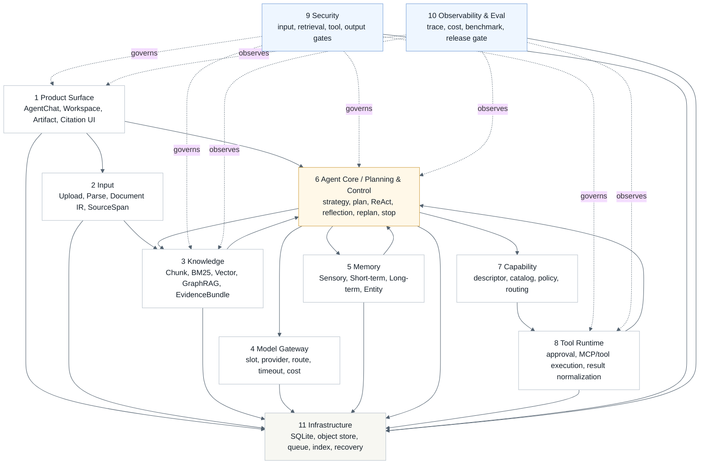

#### 分析

- 十一层是能力分解，六运行域是代码组织；两者不能互相替代。
- Agent Core / Planning & Control 协调 Model、Memory、Knowledge、Capability 和 Tool Runtime，但不拥有它们的执行实现。
- Security 与 Observability 是横切能力，必须贯穿输入、检索、工具、输出和 eval。

#### Memory Context Subsystem

Logical View 的局部展开：Memory 是独立逻辑能力，不是独立产品模式；Agent Core 在任务生命周期中读、用、写 Memory，并通过 ContextPack 使用它。

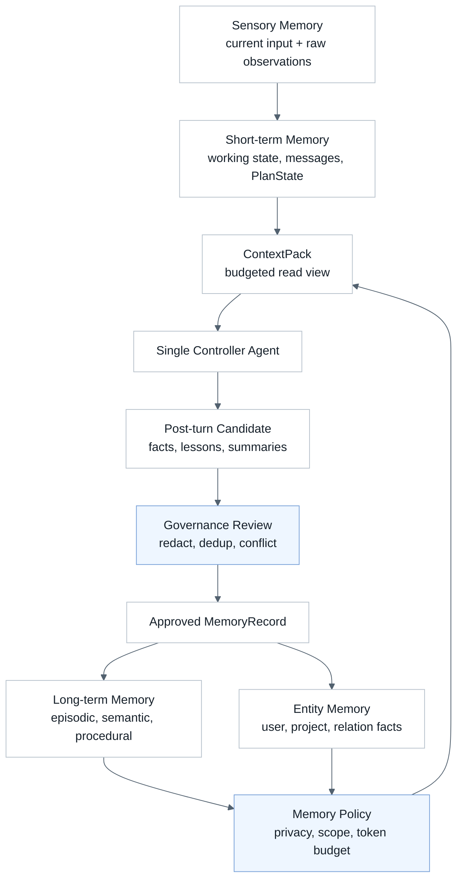

#### 分析

- Memory 采用 Sensory、Short-term、Long-term、Entity 四层；ContextPack 是读取视图，不是第五层。
- Privacy 和 workspace scope 是 memory 使用边界。
- Memory ContextPack 是否在真实 AgentChat 中可观测仍是 P1 closure gap。

### Scenarios View (4+1)

用户从模型配置和 Workspace 进入，文档被解析和索引，AgentChat 触发计划、检索、引用、回答、trace、feedback 和恢复。


#### 分析

- 这条链路是短期唯一主叙事。
- 每个节点都有 owner、contract、持久状态、trace event 和失败语义。
- Restart Recovery 是产品完成标准的一部分。

### Agentic GraphRAG Evidence and Agent Loop (Zuno)

standard、deep 和 agentic 共享 evidence/citation contract；agentic 模式的关键不是“多一个 Agent 节点”，而是检测检索失败、选择纠正动作、再次执行，并用 EvidenceLedger 保留跨轮 source-span 证据。

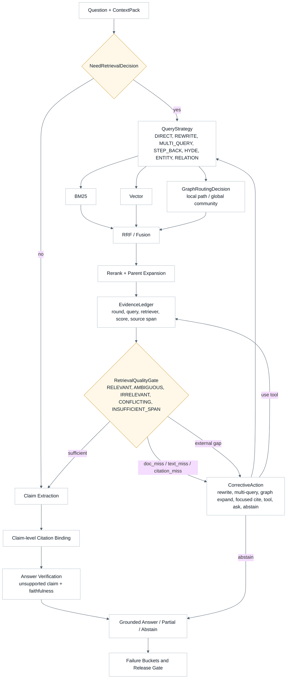

#### 分析

- agentic 不是独立产品模式，而是 Single Controller 内部策略。
- QueryStrategy 包含 DIRECT、REWRITE、MULTI_QUERY、STEP_BACK、HYDE、ENTITY_DECOMPOSITION、RELATION_QUERY。
- EvidenceLedger 负责跨轮去重、证据累积、冲突分组、source lineage、Context budget 和 eval attribution。
- strict citation 必须绑定 source span，doc-only evidence 不能冒充。
- 质量完成只看 fixed benchmark 和 release gate。

### Module View (Views & Beyond)

用户可见的 AgentChat、Workspace、Knowledge Space、file lifecycle、task lifecycle、citation UI、trace summary 和 feedback，都必须通过后端 DTO 与 durable state 对齐。

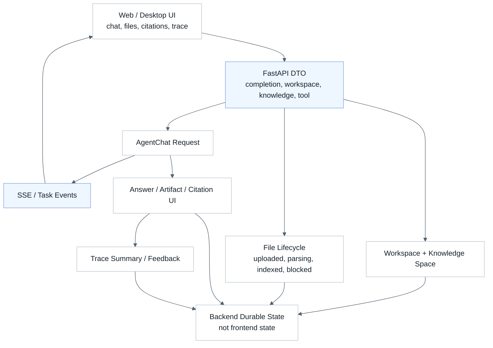

#### 分析

- 前端只负责 UI 和交互，不是业务事实源。
- API DTO 是产品请求和 runtime contract 的边界。
- 刷新或重启后必须从后端状态恢复核心结果。

#### Physical Runtime Domain Mapping

Module View 的局部展开：六个物理运行域回答“代码如何组合 owner”，不是逻辑能力层的替代物。Model Gateway、Memory、Agent Core / Planning & Control 可以位于 Agent Core 运行域协作，但逻辑 owner 必须分开。

```mermaid
%%{init: {"theme": "base", "themeVariables": {"background": "#f7f8fb", "lineColor": "#52616f"}}}%%
flowchart TB
  classDef domain fill:#ffffff,stroke:#b8c2cc,stroke-width:1px,color:#16202a;
  classDef logical fill:#eef6ff,stroke:#7aa2d8,stroke-width:1px,color:#16202a;

  ProductDomain["Product & API"]
  InputDomain["Input & Knowledge"]
  AgentDomain["Agent Core Runtime Domain"]
  CapabilityDomain["Capability & Tool"]
  GovDomain["Governance & Observability"]
  InfraDomain["Local Infrastructure"]

  ProductSurface["Product Surface"]
  Input["Input"]
  Knowledge["Knowledge"]
  Model["Model Gateway"]
  Memory["Memory"]
  Planning["Agent Core / Planning & Control"]
  Capability["Capability"]
  ToolRuntime["Tool Runtime"]
  Security["Security"]
  Observability["Observability & Eval"]
  Infrastructure["Infrastructure"]

  ProductSurface --> ProductDomain
  Input --> InputDomain
  Knowledge --> InputDomain
  Model --> AgentDomain
  Memory --> AgentDomain
  Planning --> AgentDomain
  Capability --> CapabilityDomain
  ToolRuntime --> CapabilityDomain
  Security --> GovDomain
  Observability --> GovDomain
  Infrastructure --> InfraDomain

  ProductDomain --> InfraDomain
  InputDomain --> InfraDomain
  AgentDomain --> InfraDomain
  CapabilityDomain --> InfraDomain
  GovDomain --> InfraDomain

  class ProductDomain,InputDomain,AgentDomain,CapabilityDomain,GovDomain,InfraDomain domain;
  class ProductSurface,Input,Knowledge,Model,Memory,Planning,Capability,ToolRuntime,Security,Observability,Infrastructure logical;
```

#### 分析

- 六运行域服务近期代码 owner，不否定十一逻辑能力层。
- Capability 是能力目录和策略路由；Tool Runtime 才是执行域。
- Agent Core 运行域内的 Model Gateway、Memory 和 Planning 必须保持 contract 独立。

### Data View (Views & Beyond)

文档从 SourceObject 进入，经过 ParseJob、Document IR、SourceSpan、CitationChunk、IndexManifest 和 CitationLineage，最终形成可检索的 EvidenceBundle。

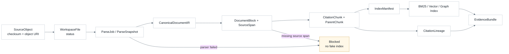

#### 分析

- parser blocked 时不能继续伪造 index。
- strict citation 必须有 SourceSpan 和 CitationLineage。
- Graph evidence 必须能回到 source object。

#### Dynamic Knowledge Update

Data View 的局部展开：知识库更新不能直接改旧 chunk，应通过新 DocumentVersion 和 candidate IndexManifest 原子切换，并失效旧 graph evidence 与 citation lineage。

```mermaid
%%{init: {"theme": "base", "themeVariables": {"background": "#f7f8fb", "lineColor": "#52616f"}}}%%
flowchart LR
  classDef node fill:#ffffff,stroke:#b8c2cc,stroke-width:1px,color:#16202a;
  classDef gate fill:#eef6ff,stroke:#7aa2d8,stroke-width:1px,color:#16202a;

  Change["Source changed<br/>checksum / version"]
  Version["New DocumentVersion"]
  Parse["Re-parse document"]
  Chunks["Rebuild all chunks<br/>CitationChunk + ParentChunk"]
  Candidate["Candidate IndexManifest"]
  Validate["Validate<br/>span, ACL, index health"]
  Activate["Atomic activate"]
  Retire["Retire old manifest"]
  Invalidate["Invalidate old graph evidence<br/>and citation lineage"]
  Trace["Update trace / diagnostics"]

  Change --> Version --> Parse --> Chunks --> Candidate --> Validate --> Activate --> Retire --> Invalidate --> Trace

  class Change,Version,Parse,Chunks,Candidate,Activate,Retire,Invalidate,Trace node;
  class Validate gate;
```

#### 分析

- 文档更新后不能假设旧 chunk 边界稳定。
- 旧 source-span citation 必须通过 document version 判断是否仍有效。
- IndexManifest active/retired 状态必须进入 trace 和 eval attribution。

### Process View (4+1)

Single Controller Agent 的目标状态是一条真实统一执行图：从 input gate、context、strategy、plan、step execution 到 evidence gate、claim binding、reflection、replan、finalize 和 post-turn memory commit。Reflection 必须有 PASS 出口和硬上限，不能无限自我修改。

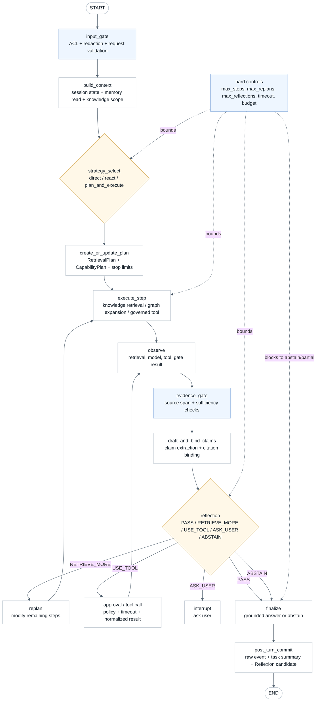

#### 分析

- Planner、ReAct step、Observation、Reflection、Replan、Stop Controller 和 Reflexion Bridge 是同一 Agent Core / Planning & Control 内部机制。
- 所有真实模型调用必须进入统一 Model Runtime / Gateway；所有工具执行必须经 Capability/Tool policy。
- abstain 是合法输出，不是失败绕过；max steps / max replans / max reflections 命中时不能写成 measured success。

#### Planning and Control Internal View

Process View 的局部展开：五个机制不是并列产品模式，而是同一 Agent Core / Planning & Control 内部状态机。Plan-and-Execute 负责宏观计划，ReAct 负责单步执行，Reflection 决定是否 PASS，Replan 必须改变真实执行轨迹，ReflexionBridge 只提交经验候选给 Memory governance。

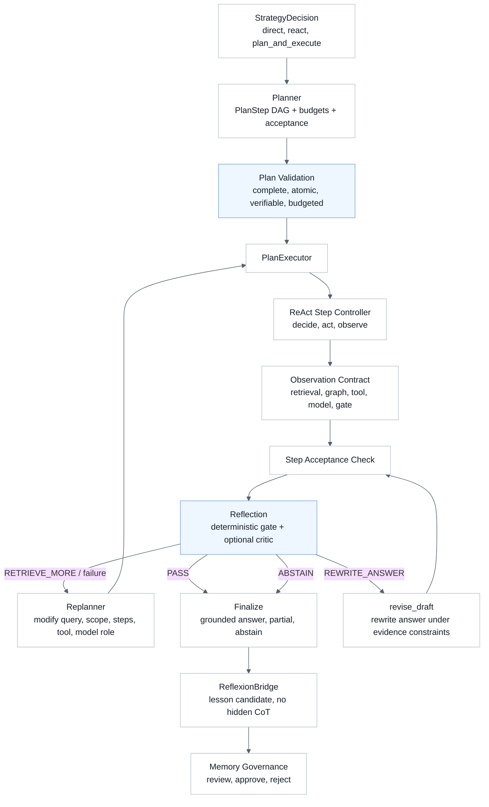

#### 分析

- PlanStep 必须包含 goal、action_type、dependencies、expected_output、acceptance_criteria、allowed_capabilities、model_role、budget、timeout、retry_policy 和 status。
- Reflection 输出限定为 PASS、REWRITE_ANSWER、RETRIEVE_MORE、USE_TOOL、ASK_USER、ABSTAIN。
- Replan 至少要修改 query strategy、retrieval scope、retriever mix、graph traversal、tool selection、remaining steps、acceptance criteria、model role 或 budget allocation 中的一项。

### Component-and-Connector View (Views & Beyond)

Agentic GraphRAG 的核心不是“图检索存在”，而是从 query planning 到 Graph expansion、EvidenceBundle、claim binding 和 release gate 都能保留 source span 证据链。

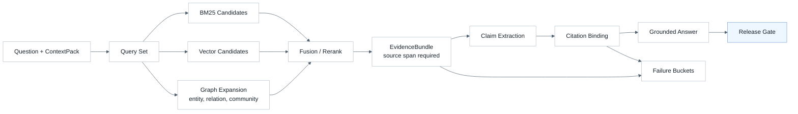

#### 分析

- doc-level hit 不能冒充 evidence-span hit。
- citation binding 失败必须能定位到 failure bucket。
- quality completed 只由 fixed benchmark 和 release gate 证明。

#### Tool Control Connector

Component-and-Connector View 的局部展开：Function Calling 是模型表达结构化调用意图的语言；Capability 是目录、策略和路由；Skill 是 SOP/模板/验收；MCP/Tool 是原子能力；Tool Runtime 负责审批、凭据、执行、timeout、normalize 和 trace。

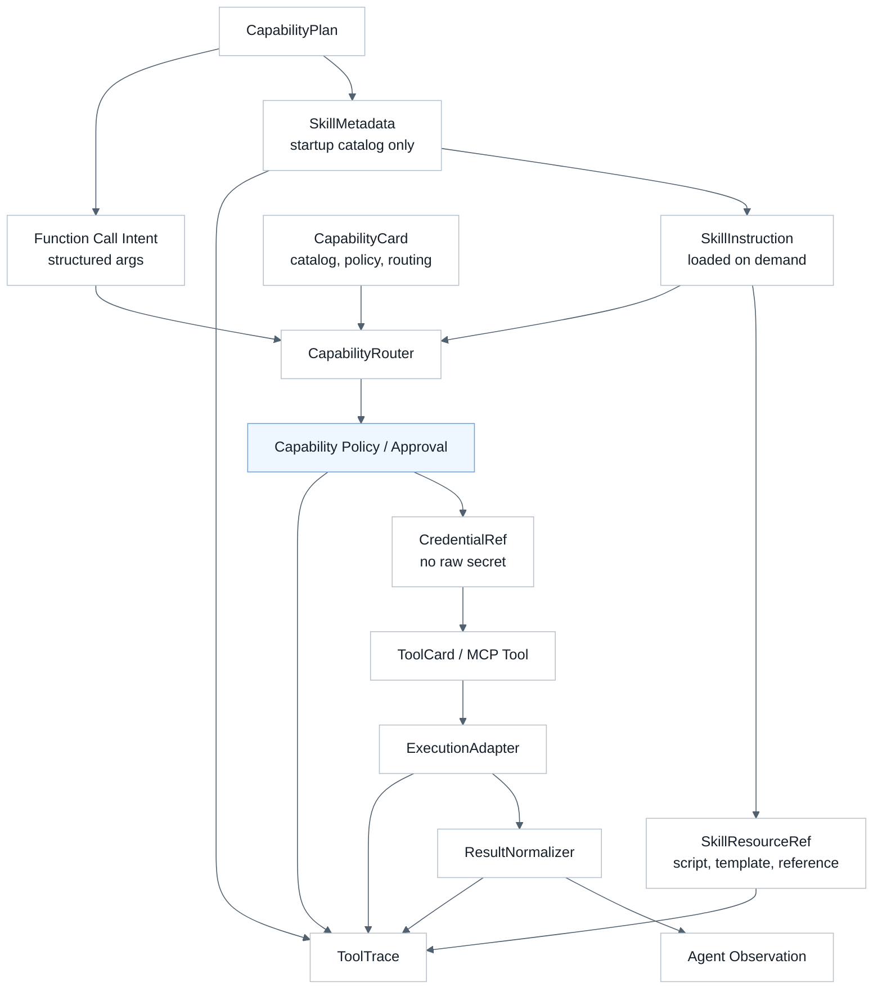

#### 分析

- Skill 不是 Tool；Function Calling 不是执行；MCP/Tool 是原子能力。
- Skill 采用 metadata -> instruction -> resource/script/template 的渐进式加载，避免一次性塞入 ContextPack。
- 副作用工具必须有审批、timeout、幂等和 trace。
- Agent 消费 normalized observation，不依赖工具内部结构。

### Development View (4+1)

代码组织视角说明前端、API、Agent Core、Knowledge、Capability、Platform、docs、tools 和 tests 如何围绕六运行域分工。Capability / Tool 控制面作为连接器展开到 Component-and-Connector View。

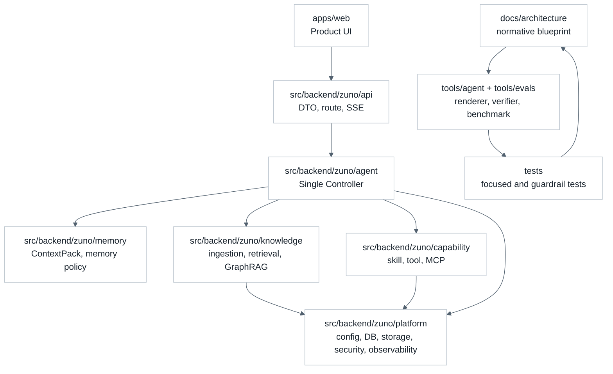

#### 分析

- 代码 owner 必须跟六运行域一致。
- docs、renderer、verifier 和 tests 是架构事实源的一部分。
- 不在 API route 或 planner 内新增绕过 owner 的业务逻辑。

### Quality View (Views & Beyond)

治理观测贯穿 input、retrieval、tool、output、trace、usage/cost、failure bucket、benchmark 和 release gate。

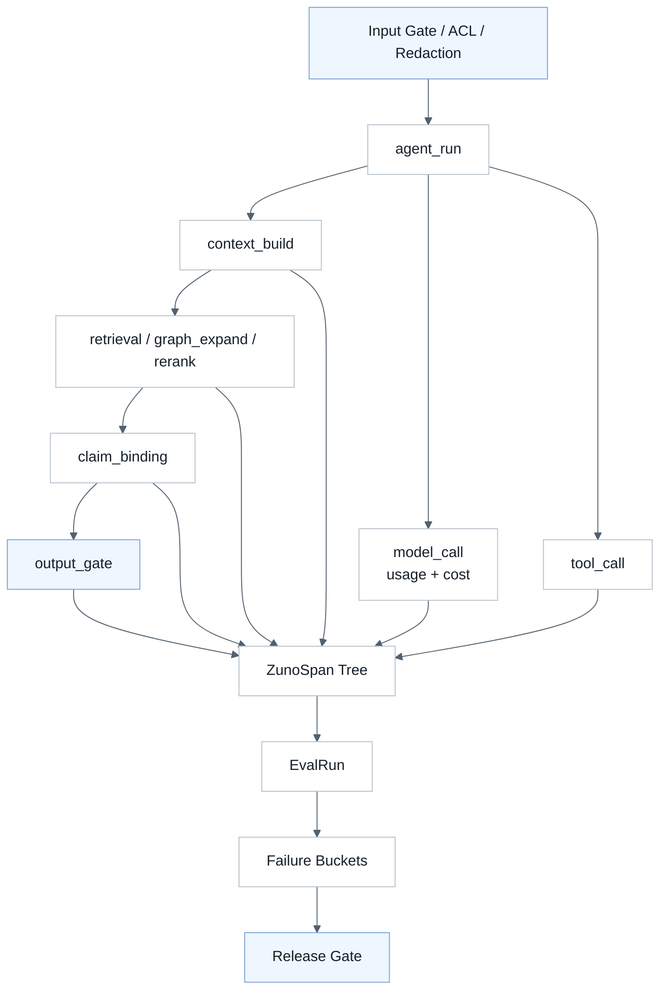

#### 分析

- blocked、prepared、runtime observed、measured 必须分开。
- 缺 trace 字段时输出 unavailable，不编造诊断。
- 近期先做本地持久 trace，不强求完整 LangSmith / OTel 平台。

#### Layered Metrics and Feedback Loop

Quality View 的局部展开：质量指标按 Retrieval、Generation、Agent、Memory、Product 分层；产品反馈只能生成 failure case 和 dataset update，不能直接证明 quality completed。

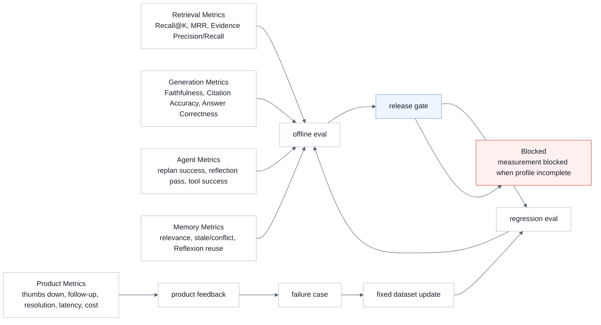

#### 分析

- Current verified、Partial / closure gap、Short-term target、Blocked、Future optional 必须在图和文字中可区分。
- fixed benchmark profile incomplete 时只能 blocked_not_measured，不能把 failed checks 当成 measured quality failure。
- feedback 是数据闭环输入，不是 release gate 替代物。

### Physical View (4+1)

近期部署是本地优先的正式实现：Web、FastAPI、SQLite、本地对象存储、本地队列、本地索引、模型 provider 和 trace store 构成闭环；外部集群只是可选 adapter。

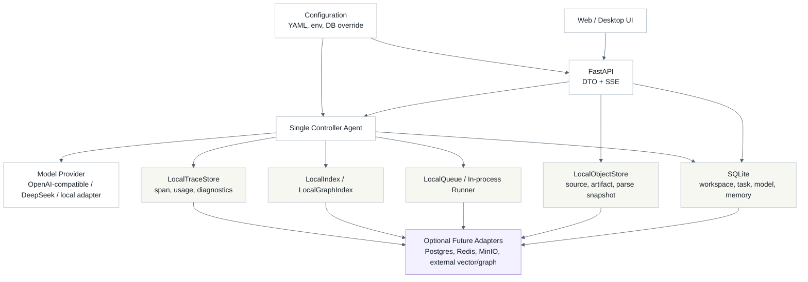

#### 分析

- 本地状态必须能支持 restart recovery。
- 外部 Postgres / Redis / MinIO / graph/vector store 是可替换方向，不是近期 blocker。
- 配置最终生效值必须进入 trace 和 eval 报告。
- 配置 owner、禁止写死、restart recovery 和 short-term gap 由本图与上文配置/状态表共同约束。

## 14. 验证和演示方式

最小演示：

1. 从干净环境启动 Web/API。
2. 配置 DeepSeek 或 OpenAI-compatible model slot。
3. 创建 Workspace。
4. 上传文本资料并看到 parse/index 状态。
5. 在 AgentChat 中选择知识库提问。
6. 查看 answer、claim-level citation、artifact 或 trace summary。
7. 提交 feedback。
8. 重启服务后恢复 workspace、file status、answer、citation 和 trace。

最小验证：

```powershell
python tools/agent/render_architecture.py --check
python tools/scripts/verify_docs_entrypoints.py
pytest -q tests/repo/test_docs_entrypoints.py -p no:cacheprovider
pytest -q tests/evals/test_enterprise_rag_paired_benchmark.py tests/evals/test_rag_eval_metrics.py -p no:cacheprovider
```

质量验证：

- EnterpriseRAG paired benchmark 必须包含 standard_rag 和 agentic_graphrag 同一 fixed case set。
- `metrics.json`、`report.md`、`failure_cases.md` 必须区分 retrieval、evidence text、citation binding、answer synthesis。
- blocked run 必须写 blocked_reason，不得写 measured。

历史证据只从统一入口查看：

- `docs/history/programs/README.md`
