# Zuno Target Architecture

updated: 2026-07-11  
status: normative-short-term-target  
current_state_source: `docs/architecture/production-readiness.md`

本文是 Zuno 的**目标总架构文档**，也是面向架构师、开发者和评审者的**重文字设计事实源**。它负责解释为什么这样设计、每个模块负责什么、模块如何协作、状态由谁持有、失败如何表达、怎样验收。Mermaid 图只用于辅助理解；以图为主的架构 HTML 位于 `docs/architecture/architecture.html`。

本文描述的是 **Target**，不是 Current。仓库当前真实实现、已知差距、blocked 原因和 measured 状态以 `docs/architecture/production-readiness.md` 为准。目标能力不得因为出现在本文或图中，就被写成当前已经完成。

兼容术语映射：

- Zuno 的产品定位仍是 **Lean Complete Agentic GraphRAG Product**，即本地优先的企业私有知识库与多功能 Agent 助手。
- Document Ingestion / Parse Gateway 属于 Input 与 Knowledge 的入口链路。
- Tool Control Plane 属于 Capability 与 Tool Runtime 的治理和执行边界。
- LangSmith-compatible Trace / Eval 属于 Observability & Eval 的可替换外部 sink，不是近期强依赖。
- `docs/architecture/architecture.md` 是文字总架构文档；`docs/architecture/architecture.html` 是架构 HTML 图谱；`.agent/architecture/architecture.md` 与 `.agent/architecture/architecture.html` 是同步镜像。

当前质量口径保持：

```text
implementation available
measurement blocked
quality not yet proven
```

---

## 1. 项目定位与系统边界

Zuno 的近期目标不是建设一个大规模多租户 AI 平台，而是做成一套本地优先、可恢复、可观测、可评测的企业知识库 Agent 产品。用户能够配置模型、创建 Workspace、上传和解析资料、建立索引、发起复杂任务、审批工具调用、查看引用与 Artifact，并在刷新或进程重启后继续查看任务状态。

目标系统采用 **Single Controller**。一个 LangGraph 驱动的 Agent Core 负责状态转换、规划、单步执行、反思、重规划、中断、恢复和结束判定；Model Gateway、Memory、Knowledge、Capability、Tool Runtime 则保持独立模块，通过 typed contract 被 Agent Core 调用。系统不把“多 Agent”作为近期默认产品结构，也不把所有能力塞进 LangGraph 节点内部。

Zuno 的核心产品价值是把普通 doc-level RAG 提升为可追溯的 Agentic GraphRAG：检索结果必须能够回到 `SourceObject -> DocumentVersion -> SourceSpan`，生成阶段必须把 claim 与 evidence 绑定，评测阶段必须比较同一 case set 下 standard、deep 和 agentic profile 的 correctness、citation、latency 与 cost。

近期明确不要求：

- Kafka、RabbitMQ、Kubernetes 或复杂服务网格；
- 默认产品级多 Agent runtime；
- 大规模在线评测平台；
- Milvus、Neo4j 集群作为运行 blocker；
- 企业级 SSO、DLP、Vault、Firecracker 的完整实现；
- 一次性接入大量 parser、provider 和 MCP server。

这些能力可以作为 **Future Optional Extensions**，但不得写成 Current 或近期完成条件。

---

## 2. 总体架构原则

### 2.1 一个控制器，多个独立能力模块

最终运行关系是：

```text
Product Surface
  -> UnifiedAgentRuntimeService
  -> Compiled LangGraph Agent Core
  -> Model / Memory / Knowledge / Capability / Tool ports
  -> Security and Observability cross-cutting controls
  -> Durable Infrastructure
```

LangGraph 是 Agent Core 的状态机，不是整个系统的容器。它决定“下一步做什么”，但不应该实现模型 provider、记忆数据库、BM25、Graph traversal、文件系统写入或凭证管理。

### 2.2 十一逻辑能力层与六物理运行域

十一逻辑能力层回答“系统需要哪些能力、谁拥有 contract、怎样验收”；六物理运行域回答“近期代码和运行责任怎样组合，才能保持模块化单体的简洁”。两种视角必须同时存在。

十一逻辑能力层：

1. Product Surface
2. Input
3. Knowledge
4. Model Gateway
5. Memory
6. Agent Core / Planning & Control
7. Capability
8. Tool Runtime
9. Security
10. Observability & Eval
11. Infrastructure

六物理运行域：

| 物理运行域 | 映射的逻辑能力 |
| --- | --- |
| Product & API | Product Surface |
| Input & Knowledge | Input、Knowledge |
| Agent Core Runtime | Model Gateway、Memory、Agent Core / Planning & Control；逻辑 owner 仍独立 |
| Capability & Tool | Capability、Tool Runtime |
| Governance & Observability | Security、Observability & Eval |
| Local Infrastructure | Infrastructure |

### 2.3 事实源与引用边界

- Product 数据由后端业务表和 Artifact Store 持有，浏览器状态不是事实源。
- Input 负责原始来源、解析结果和 SourceSpan，不负责回答问题。
- Knowledge 负责外部证据，不负责用户偏好或任务经验。
- Memory 负责跨轮、跨任务上下文，不替代知识库。
- Agent Core 负责运行状态和控制，不长期保存大型文档或 embedding。
- Tool Runtime 负责副作用执行，不决定全局计划。
- Infrastructure 保存事实，不决定 Agent 策略。
- Observability 记录发生过什么，不把“测试通过”伪装成“质量通过”。

### 2.4 配置化与禁止写死契约

模型、retrieval profile、workspace scope、tool policy、budget、timeout、approval 规则和存储路径必须来自配置或数据库。生产路径不得硬编码 provider、邮箱、文档路径、tool arguments、embedding base URL 或固定答案。

---

## 3. 目标端到端运行链路

一次完整 Agent 任务应经历以下阶段：

1. Product Surface 创建 `RuntimeRequest`，包含 user、workspace、session、message、model binding、knowledge scope 和输出要求。
2. Input Gate 校验身份、workspace scope、输入大小、敏感信息和 prompt injection 风险。
3. Context Builder 从 recent window、TaskState、Memory 和 Entity facts 构建预算化 `ContextPack`。
4. Strategy Selector 选择 direct、retrieval-first、ReAct 或 Plan-and-Execute。
5. Planner 为复杂任务创建可验证的 `PlanState`，每个 step 具有目标、动作类型、依赖、允许能力和验收条件。
6. Executor 执行 model、knowledge、tool 或单步 ReAct，并统一输出 `NormalizedObservation`。
7. Evidence Gate 评估证据覆盖、来源版本、矛盾、重复和 claim 支持度。
8. Grounded Synthesis 生成 draft、结构化 claims、citation bindings 和 unsupported claims。
9. Reflection 返回 `PASS`、`REWRITE_ANSWER`、`RETRIEVE_MORE`、`USE_TOOL`、`ASK_USER` 或 `ABSTAIN`。
10. Replan 必须修改真实后续执行轨迹，而不是只产生一份决策文档。
11. Finalize 形成 `GroundedAnswer`、Artifact、Citation 和最终 RuntimeEvent。
12. Post-turn Commit 写入 raw event、task summary、Memory candidate、usage、cost 和 trace。

所有循环必须受 `RuntimeLimits` 控制，包括最大步骤数、最大检索轮次、单步最大 action、总 token、总费用、总时长和工具副作用次数。

---

# 4. 十一逻辑模块设计

## 4.1 Product Surface

### 目标与职责

Product Surface 是用户可见的产品层，负责把用户操作转换成 typed request，并展示后端运行事实。最终包含 AgentChat、Workspace、Knowledge Space、File Upload、Parse/Index Status、Task Timeline、Approval UI、Citation UI、Artifact、Trace Viewer、Feedback 和 Model Configuration。

它不负责规划、检索、工具执行或记忆决策，也不能把浏览器内存当成任务事实源。刷新页面后，用户应能够使用 `workspace_id/session_id/task_id/run_id` 从后端重新读取状态。

### 关键 contract

- 输入：`CompletionRequest`、`WorkspaceTaskRequest`、`ApprovalDecision`、`FeedbackRequest`。
- 输出：`RuntimeRequest`、`RuntimeEvent`、`GroundedAnswer`、`ArtifactRef`、`CitationView`、`TraceSummary`。
- 持久事实：Workspace、Session、Task、Message、Artifact、Approval、Feedback、ModelSlotBinding。

### 失败语义

产品层必须把 `blocked`、`approval_required`、`waiting_for_user`、`partial`、`abstained`、`failed` 和 `completed` 区分展示；不能把模型不可用、无证据或预算耗尽统一显示为“生成失败”。

### 验收

Completion 与 Workspace 最终必须进入同一 Unified Runtime；Workspace Artifact 必须来自 runtime final state，而不是另一套独立 `_complete_task` 逻辑。

## 4.2 Input

### 目标与职责

Input 将 File、URL、Text、Image 等外部来源转换为可版本化、可重建、可定位的标准内部表示。它负责 SourceObject、MIME 检测、parser routing、ParseJob、CanonicalDocumentIR、DocumentVersion 和 IndexHandoffPayload。

Input 的关键价值不是“抽出一段文本”，而是保留结构和 provenance。PDF 应保留 page、bbox 和 char range；DOCX 保留 section/paragraph；PPTX 保留 slide/bbox；XLSX 保留 sheet/cell range；Markdown 和代码保留 line range 与 section path。

### 内部组件

- Source intake 与 object storage adapter；
- ParseGateway；
- 原生文本、PDF、Office、OCR/VLM adapter；
- CanonicalDocumentIR validator；
- SourceSpan builder；
- parse/index idempotency；
- parser job lifecycle 与 blocked reason。

### 关键 contract

- `SourceObject`
- `ParseJob`
- `ParseSnapshot`
- `CanonicalDocumentIR`
- `DocumentBlock`
- `SourceSpan`
- `IndexHandoffPayload`

### 边界

Input 不进行 query understanding、retrieval ranking 或 answer synthesis。解析失败时必须返回 `parser_unavailable`、`needs_ocr`、`invalid_ir`、`unsupported_format` 等明确状态，不能制造空文档并继续索引。

## 4.3 Knowledge

### 目标与职责

Knowledge 负责企业外部知识的组织、索引、检索和证据追踪。它拥有 chunk、index、BM25、vector、graph、fusion、rerank、parent expansion、EvidenceLedger、CitationLineage 和 knowledge version。

最终 Agentic GraphRAG 流程包括：

```text
NeedRetrievalDecision
-> Query Strategy
-> BM25 / Vector / Graph
-> RRF Fusion
-> Rerank
-> Parent / Neighbor Expansion
-> EvidenceLedger
-> Retrieval Quality Gate
-> Corrective Action
```

Query Strategy 支持 Direct、Rewrite、Multi Query、Step-back、HyDE、Entity Decomposition 和 Relation Query。策略生成应通过 Model Gateway 或可审计规则实现，不能只拼接固定字符串冒充 Agentic retrieval。

### 关键 contract

- `RetrievalPlan`
- `RetrieverResult`
- `GraphEvidence`
- `EvidenceLedgerRecord`
- `EvidenceBundle`
- `RetrievalQualityVerdict`
- `CorrectiveAction`
- `CitationLineage`

每条 Evidence 必须包含 document/version/source span、retrieval round、query strategy、retriever、score、selection reason 和 trace ref。

### 边界与失败语义

Knowledge 不保存用户偏好和任务经验。没有真实检索结果时返回 `no_candidate`、`evidence_unavailable`、`stale_index` 或 `acl_denied`，不得创建 synthetic evidence ref。Graph evidence 如果无法回到 SourceSpan，不能用于 strict citation。

## 4.4 Model Gateway

### 目标与职责

Model Gateway 是所有模型调用的唯一入口。它统一管理 chat、embedding、reranker、VLM 和 eval judge，并按 Planner、Executor、Tool Call、Critic、Synthesis、Query Rewrite、Memory Extraction 等角色选择模型。

它负责 provider adapter、ModelSlotBinding、timeout、retry、fallback、structured output、streaming、usage、cost、latency、redaction 和 trace。业务模块不得直接实例化 provider SDK。

### 关键 contract

- `ModelDefinition`
- `ModelSlotBinding`
- `ModelCallRequest`
- `ModelResult`
- `UsageRecord`
- `FallbackDecision`
- `ModelError`

### 运行规则

产品默认路径必须使用 Dialog/Workspace 配置的真实 provider。`MockModelProvider` 只允许用于测试或明确 local demo mode。Planner、ReAct、Critic、Synthesis 和 Query Rewrite 的调用都必须经过相同 Gateway，并带 run/task/trace/budget 信息。

### 失败语义

区分 invalid configuration、missing credential、provider unavailable、timeout、rate limited、schema invalid、budget exceeded 和 fallback exhausted。Fallback 必须进入 trace，不得静默切换。

## 4.5 Memory 与上下文管理

### Memory 不是 Context，Memory 也不是 Knowledge

- LangGraph State 是当前运行控制状态。
- ContextPack 是本轮提供给模型的预算化读取视图。
- Memory 是跨轮、跨任务可治理的持久经验与事实。
- Knowledge 是来自文档和外部来源的证据库。

### Four-layer governed Memory

1. **Sensory Memory**：当前输入、模型输出、tool/retrieval observation 和系统事件的原始短期信号。
2. **Short-term Memory**：当前任务的目标、PlanState、recent window、未完成事项和工作摘要。
3. **Long-term Memory**：Episodic、Semantic、Procedural 三类长期记忆。
4. **Entity Memory**：用户、项目、Workspace、组织、文档、关系、有效时间、置信度和来源。

ContextPack 不是第五层 Memory，而是经过 policy、retrieval、ranking 和 token budget 后的只读组合。

### 生命周期

```text
Capture
-> Normalize
-> Classify
-> Redact
-> Deduplicate
-> Score
-> Candidate
-> Review / Governance
-> Store
-> Retrieve
-> Rank
-> ContextPack
-> Consolidate / Decay / Revoke / Delete
```

长期记忆不能由模型输出直接写入。Reflexion 只能产生 `MemoryCandidate`，经过 privacy、conflict、confidence 和 review 后，才成为 approved episodic/procedural memory。

### 关键 contract

- `MemoryReadRequest`
- `MemoryCommit`
- `MemoryRecord`
- `EntityFact`
- `ReflexionCandidate`
- `MemoryGovernanceRecord`
- `ContextPack`
- `ContextExclusionReason`

### 验收

请求 A 产生经验，经 review approved；服务重启后请求 B 能检索该经验，并对 Strategy 或 Plan 产生可证明影响。删除或撤销后，后续 ContextPack 不再包含该记录。

## 4.6 Agent Core / Planning & Control

### 目标与职责

Agent Core 是 Single Controller 的大脑。它负责 Runtime State、Input Gate orchestration、Context Builder、Strategy Selector、Planner、Plan Validator、Executor、单步 ReAct、Observation Normalizer、Evidence Gate、Reflection、Replan、Grounded Synthesis、Finalize、Reflexion Bridge、Budget/Stop Controller 和 Interrupt/Resume。

### 五种机制的关系

- **Plan-and-Execute**：负责宏观任务拆解、依赖、顺序、验收和预算。
- **ReAct**：负责一个 PlanStep 内部的 reason-action-observation 循环。
- **Observation**：统一模型、检索、工具和安全门结果。
- **Reflection**：判断证据、答案、成本和约束是否达标。
- **Replan**：修改真实后续步骤和策略。
- **Reflexion**：把可复用经验作为 Memory candidate 提交治理。

ReAct 不控制整个任务，Reflection 不直接写长期记忆，Replan 不能只修改 metadata 而不执行新轨迹。

### Runtime State

正式状态至少包含：

- run/task/thread/workspace/user/trace identifiers；
- request、ContextPack、StrategyDecision、PlanState、current step；
- NormalizedObservations、EvidenceLedgerRef；
- draft answer、claims、claim bindings、unsupported claims；
- ReflectionResult、RuntimeCounters、RuntimeLimits；
- PendingInterrupt、GroundedAnswer、RuntimeFailure。

完整文档、embedding、大型 Evidence、二进制 tool result 和 Artifact binary 只保存引用。

### 关键 contract

- `RuntimeRequest`
- `AgentRuntimeState`
- `StrategyDecision`
- `PlanState`
- `PlanStep`
- `NormalizedObservation`
- `ReflectionResult`
- `GroundedAnswer`
- `RuntimeEvent`
- `PendingInterrupt`

### 完成标准

Compiled LangGraph 是唯一产品主控制器；使用原生 durable checkpoint、真实 `astream_events`、真实 planner/ReAct/synthesis；Completion 与 Workspace 不再并行运行旧 controller。

## 4.7 Capability

### 目标与职责

Capability 回答“系统具备什么能力、当前任务允许使用哪些能力”，而不是执行工具。它管理 CapabilityCard、SkillCard、ToolCard、MCP Server Card、Capability Policy、Capability Router 和 progressive loading。

Capability 是抽象能力，例如 `search_knowledge`、`read_workspace_file`、`write_artifact`；Tool 是原子动作，例如 `filesystem.read`；Skill 是带 instruction、resources、templates、required tools 和 acceptance criteria 的复用工作流；MCP 是发现和调用工具/资源的协议。

### Progressive Loading

模型不应一次看到全量工具和 Skill。Capability Router 根据任务选择少量 capability，先加载 metadata，必要时再加载 instruction、resource 和 tool schema。

### 关键 contract

- `CapabilityQuery`
- `CapabilityCard`
- `SkillCard`
- `CapabilityPlan`
- `AllowedTools`
- `ToolManifest`
- `ExecutionPolicy`

### 边界

Capability 不运行副作用，也不保存 credential。Tool Runtime 只能执行 Capability Plan 和 Security Gate 允许的动作。

## 4.8 Tool Runtime

### 目标与职责

Tool Runtime 把结构化 `ToolCallIntent` 转换为受治理的真实副作用。Function Calling 只代表模型生成 intent，不代表工具已经执行。

完整流程：

```text
ToolCallIntent
-> Capability Policy
-> Tool Manifest
-> Security Gate
-> Approval Gate
-> Credential Broker
-> Sandbox / Network Policy
-> Idempotency Claim
-> Executor Adapter
-> Result Normalizer
-> NormalizedToolObservation
```

### 关键能力

- approval、deny 和等待用户；
- CredentialRef，不向模型暴露 secret；
- workspace path containment 与 path traversal 防护；
- network allowlist；
- timeout、cancel、retry；
- atomic write；
- idempotency key 和 exactly-once side-effect claim；
- MCP/local executor adapter；
- artifact ref、audit ref 和 trace span。

### 最低真实工具集

近期至少实现安全 `filesystem.read`、经审批 `filesystem.write` 和一个无副作用 calculator/transform。返回固定字符串的 lambda 不算真实工具。

## 4.9 Security

### 目标与职责

Security 是横切边界，不是任务 Controller。最终至少覆盖 Input、Retrieval、Memory、Model Context、Tool、Output 和 Artifact Gate。

- Input Gate：身份、workspace scope、大小、PII、secret、prompt injection。
- Retrieval Gate：ACL、cross-workspace、stale version、untrusted instruction、sensitive chunk。
- Memory Gate：scope、privacy、conflict、expired/revoked record。
- Tool Gate：allowlist、arguments、side effect、approval、credential、network、path。
- Output Gate：unsupported claim、sensitive leakage、citation coverage、unsafe content。
- Artifact Gate：文件类型、大小、目标路径、敏感内容和发布权限。

每次 decision 输出 `GateDecision` 和 `AuditEvent`。拒绝必须有稳定 error code，不得只抛字符串异常。

## 4.10 Observability & Eval

### 目标与职责

Observability 记录一次 Agent Run 的完整 span tree，Eval 基于同一事实进行模块级、runtime 级和产品 release 级评测。

典型 trace：

```text
agent_run
├─ input_gate
├─ context_build / memory_retrieval
├─ strategy
├─ planner_model
├─ retrieval_round_1
│  ├─ bm25
│  ├─ vector
│  ├─ graph
│  ├─ fusion
│  └─ rerank
├─ reflection
├─ retrieval_round_2
├─ synthesis_model
├─ citation_binding
├─ output_gate
└─ memory_commit
```

每个 span 记录时间、状态、input/output refs、provider/model、token、cost、latency、failure bucket、fallback、security decision 和 evidence refs。

### Measurement Semantics

必须区分：

- implementation available；
- runtime observed；
- measurement blocked；
- measured pass/fail；
- quality proven/not proven。

缺少 trace 字段时应报告 `unavailable_due_to_missing_trace_fields`。外部数据库或模型不可用时输出 blocked report，不得 fake measured。

### Release Gate

standard_rag、deep_graphrag、agentic_graphrag 必须使用相同 case IDs、index version、模型和 runtime config。目标门槛包括 `Agentic Recall@5 >= standard_rag`、citation accuracy、unsupported claim rate、latency 和 cost。

## 4.11 Infrastructure

### 目标与职责

Infrastructure 提供本地可恢复的事实存储和运行支撑，包括 SQLite/SQLModel、Local Object Store、Index Store、LangGraph Checkpoint Store、Runtime Event Store、Memory Store、EvidenceLedger Store、Artifact Store、configuration、migration 和 health check。

近期采用模块化单体，不要求微服务。所有关键状态必须 workspace/user scoped、schema versioned、atomic、idempotent，并避免 pickle 或隐藏内存事实源。

### 恢复要求

```text
run starts
-> approval interrupt
-> process exits
-> new process uses same DB
-> load LangGraph checkpoint
-> resume correct node
-> tool executes once
-> final answer and trace preserved
```

Infrastructure 不选择模型、不判断检索策略、不决定是否 Replan。

---

## 5. 模块间核心 contract

| 调用方 | 被调用方 | 请求 | 返回 |
| --- | --- | --- | --- |
| Product Surface | Agent Core | RuntimeRequest | RuntimeEvent、GroundedAnswer、ArtifactRef |
| Agent Core | Model Gateway | ModelCallRequest | ModelResult、UsageRecord |
| Agent Core | Memory | MemoryReadRequest、MemoryCommit | ContextPack、MemoryRecord refs |
| Agent Core | Knowledge | RetrievalPlan | EvidenceBundle、RetrievalVerdict |
| Agent Core | Capability | CapabilityQuery | CapabilityPlan、AllowedTools |
| Agent Core | Tool Runtime | ToolCallIntent / ToolRuntimeRequest | NormalizedToolObservation |
| Input | Knowledge | CanonicalDocumentIR、IndexHandoffPayload | IndexManifest |
| Security | 各模块 | GateRequest | GateDecision、AuditEvent |
| 各模块 | Observability | Span/Event payload | TraceRef |
| 各模块 | Infrastructure | typed records | durable handles |

Connector 必须版本化、可序列化、可追踪。模块不能通过共享可变全局变量交换业务事实。

---

## 6. 数据与状态模型

### 6.1 产品事实

Workspace、Session、Task、Message、Artifact、Approval、Feedback 和 ModelSlotBinding 由 Product/API 与数据库模型拥有。

### 6.2 文档与证据事实

`SourceObject -> DocumentVersion -> CanonicalDocumentIR -> DocumentBlock -> CitationChunk -> IndexManifest -> EvidenceLedger -> ClaimBinding` 构成引用链。任何严格 Citation 必须指向不可变 document version 和 SourceSpan。

### 6.3 Runtime 事实

AgentRun、Checkpoint、RuntimeEvent、PlanVersion、Observation、Interrupt、ToolExecutionClaim 和 GroundedAnswer 构成可恢复运行事实。

### 6.4 Memory 事实

RawMemoryEvent、TaskSummary、MemoryCandidate、GovernanceRecord、ApprovedMemory 和 EntityFact 必须有唯一 authoritative owner。撤销、删除和 conflict resolution 都要留下治理记录。

---

## 7. 代码 Ownership Matrix

| 逻辑能力 | 近期代码 owner |
| --- | --- |
| Product Surface | `apps/web`、`src/backend/zuno/api` |
| Input | `src/backend/zuno/knowledge/ingestion`、parser/index handoff |
| Knowledge | `src/backend/zuno/knowledge` |
| Model Gateway | `src/backend/zuno/platform/model_gateway.py` 及 provider adapters |
| Memory | `src/backend/zuno/memory` |
| Agent Core | `src/backend/zuno/agent` |
| Capability | `src/backend/zuno/capability` catalog/skill/router |
| Tool Runtime | `src/backend/zuno/capability` tool control/executors |
| Security | `src/backend/zuno/platform/security` |
| Observability & Eval | `src/backend/zuno/platform/observability`、`tools/evals/zuno` |
| Infrastructure | `src/backend/zuno/platform/database`、storage、index/checkpoint adapters |

依赖方向以 ports/adapters 为主。Knowledge、Memory、Capability 不得反向依赖 Product UI；Agent Core 不得绕过 Gateway 和 Tool Runtime 直接访问 provider 或执行副作用。

---

## 8. Current、Target 与 Future 边界

### Current

Current 只写代码、测试和可复现运行已经证明的事实，详见 `production-readiness.md`。

### Target

本文全部模块设计、contract、状态模型和图均表示近期目标。目标完成需要真实 provider、真实工具、持久 Memory、原生 checkpoint、统一 Product path 和 measured benchmark，而不是只有类名或 fixture。

### Future Optional Extensions

可选方向包括外部 SQL/Graph/Vector 服务、事件 worker、企业身份与 Vault、更强 sandbox、完全离线 Mermaid vendor、产品级多 Agent 和分布式部署。它们不得成为近期 blocker。

---

## 9. Runtime 完成与质量完成

Runtime 完成必须证明：

- Compiled LangGraph 是产品唯一主控制流；
- Model、Memory、Knowledge、Capability、Tool 均通过真实 adapter 接入；
- interrupt/restart/resume 可恢复且副作用不重复；
- Completion 与 Workspace 使用同一 final state；
- Citation 能回到 SourceSpan；
- Trace、usage、cost 和 failure bucket 可查询。

质量完成必须证明：

- fixed paired case set 已追踪；
- profile completeness 完整；
- correctness、citation、unsupported claim、latency、cost 已测量；
- release gate 明确 pass 或 fail；
- blocked 时保持 `quality not yet proven`。

---

# 10. Architecture Visual Atlas

本节是 HTML 的图源。Markdown 读者应先阅读前述设计说明，再使用图谱理解模块关系。每类视图包含一张 Overall 图和两张 Local 图，共三十张 Mermaid 图。

箭头规范：

```text
==>  command / control request
-->  data / result / state transfer
-.-> cross-cutting governance / observation / constraint
```

## 一、4+1 View Model

### Logical View (4+1)

#### Overall — Eleven Logical Capabilities

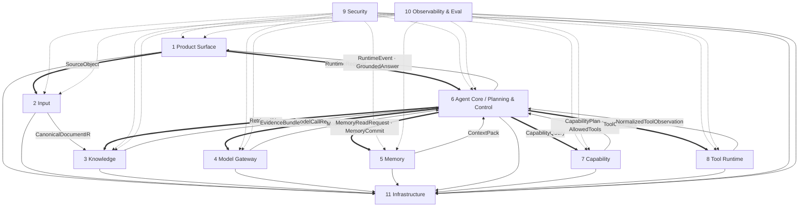

#### Local — Memory and Context Boundary

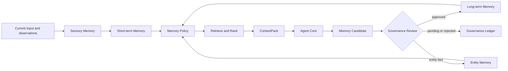

#### Local — Agent Core Capability Boundary

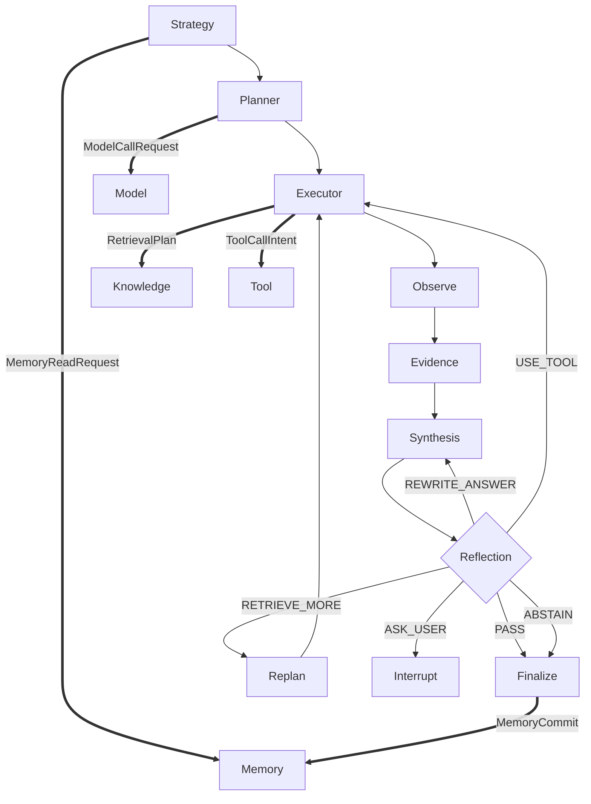

### Development View (4+1)

#### Overall — Repository Ownership and Dependency Direction

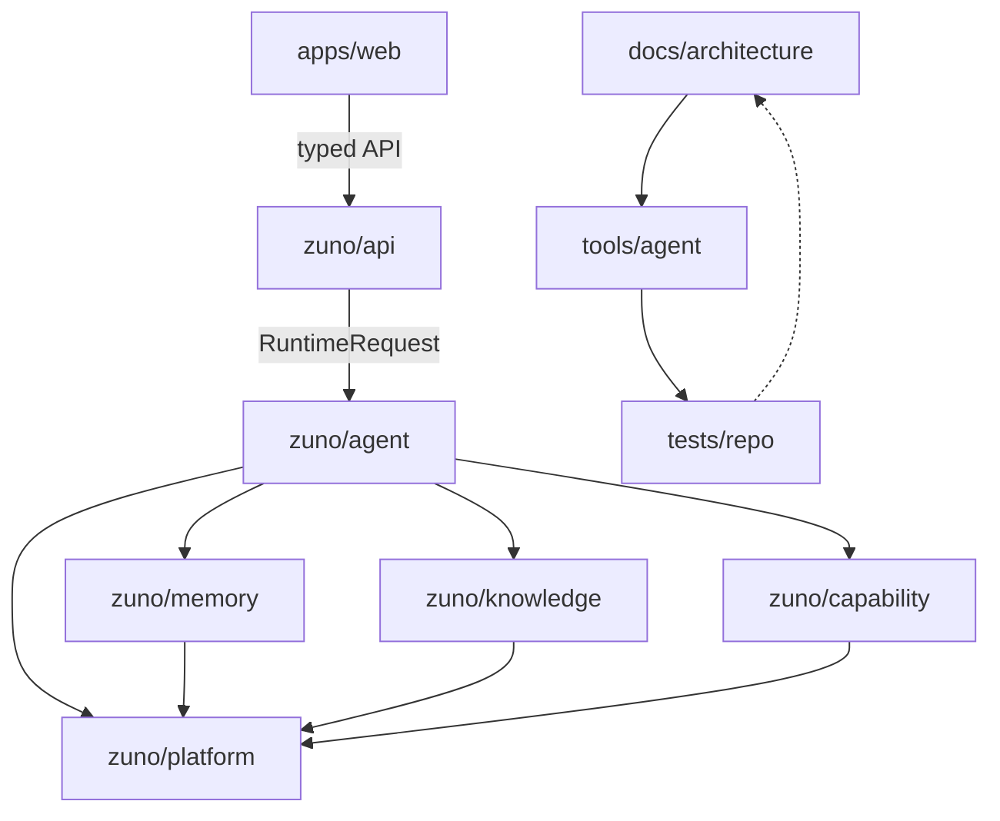

#### Local — Runtime Package Dependency Rule

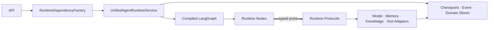

#### Local — Architecture Source Generation Chain

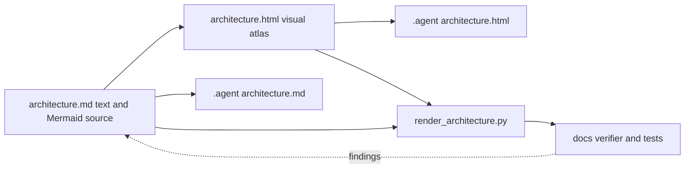

### Process View (4+1)

#### Overall — Unified LangGraph Runtime

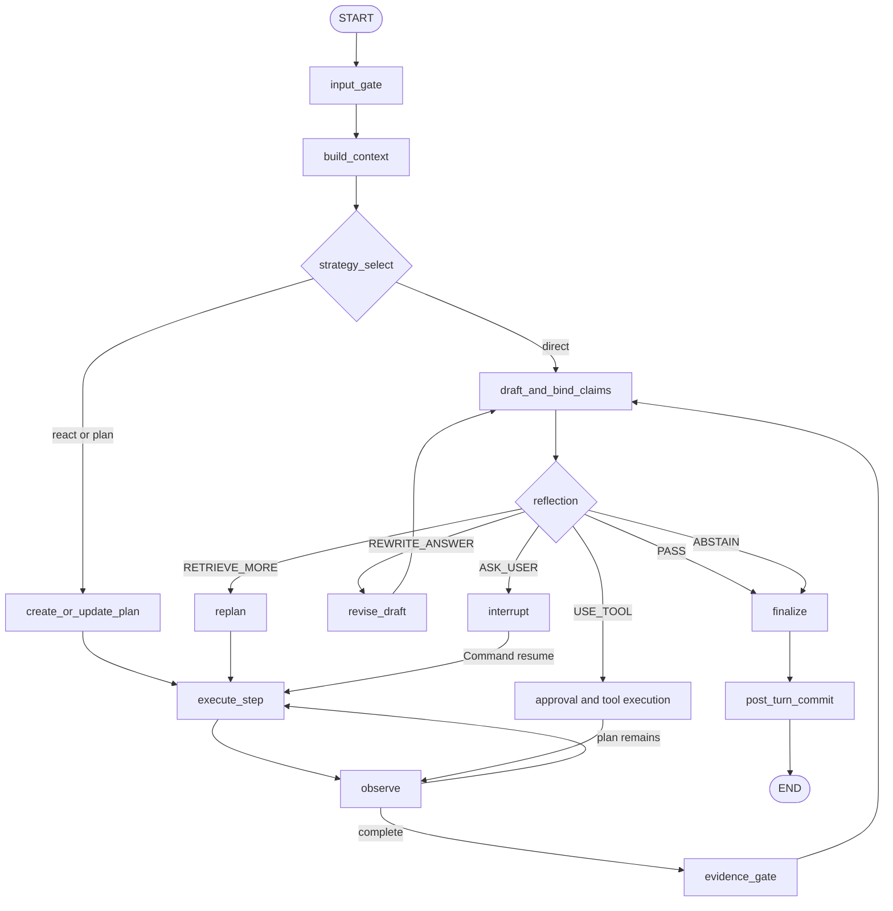

#### Local — Single-step ReAct

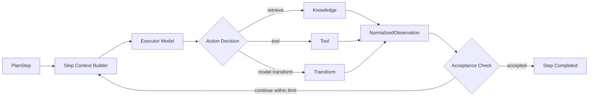

#### Local — Interrupt, Approval and Resume

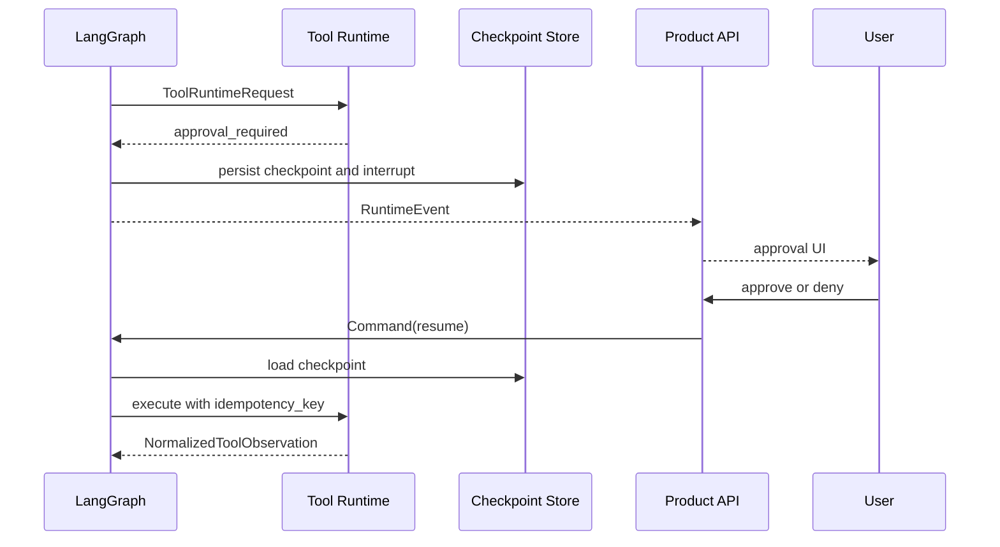

### Physical View (4+1)

#### Overall — Local-first Deployment

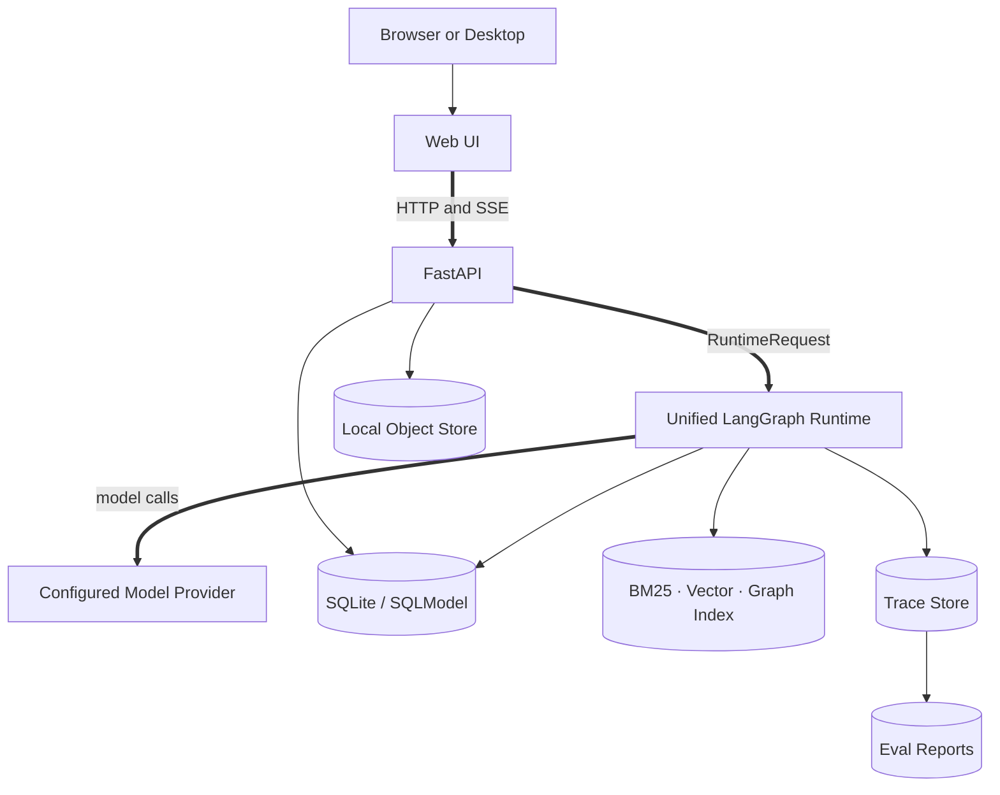

#### Local — Durable Storage and Recovery

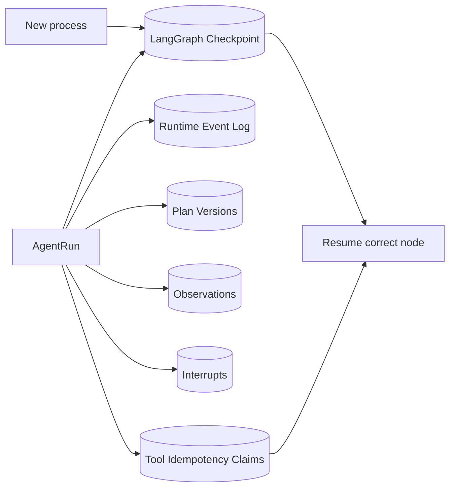

#### Local — Model Connectivity

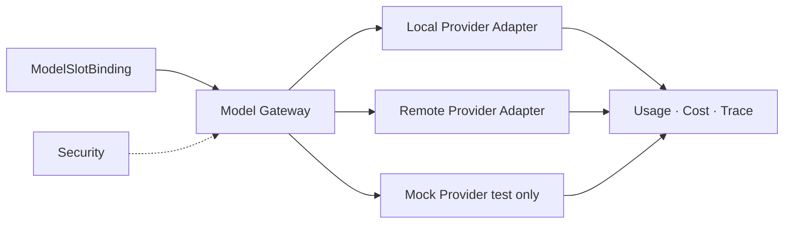

### Scenarios View (4+1)

#### Overall — Product Lifecycles

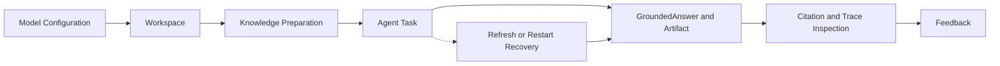

#### Local — Document Preparation Scenario

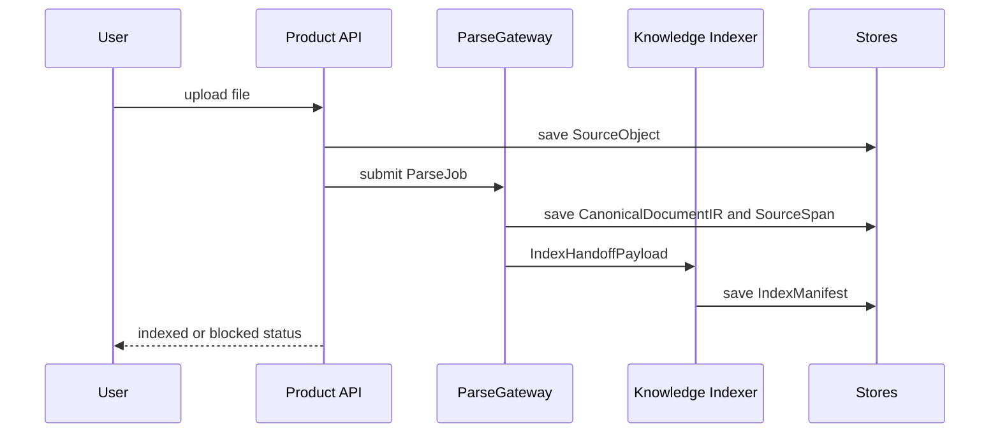

#### Local — Agent Task and Feedback

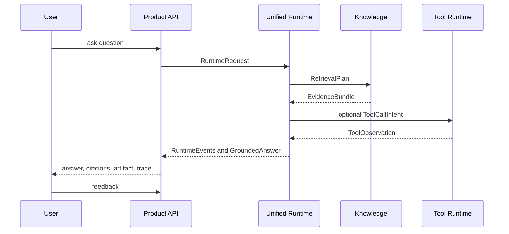

## 二、Views & Beyond

### Module View (Views & Beyond)

#### Overall — Eleven Modules to Six Runtime Domains

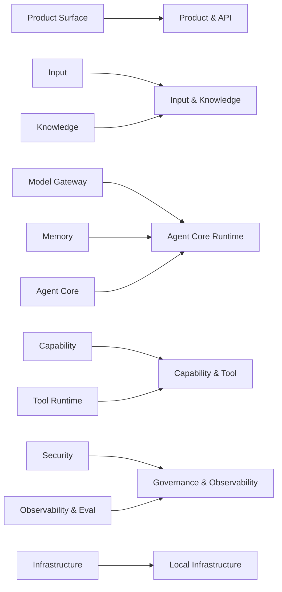

#### Local — Agent Core Module

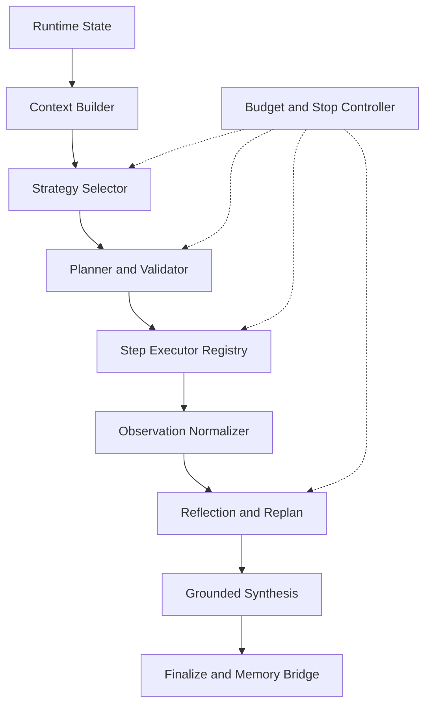

#### Local — Knowledge Module

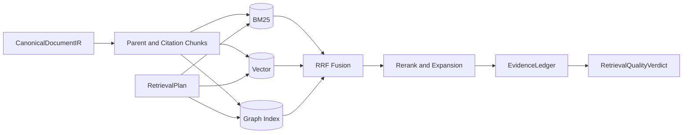

### Component-and-Connector View (Views & Beyond)

#### Overall — Runtime Components and Contracts

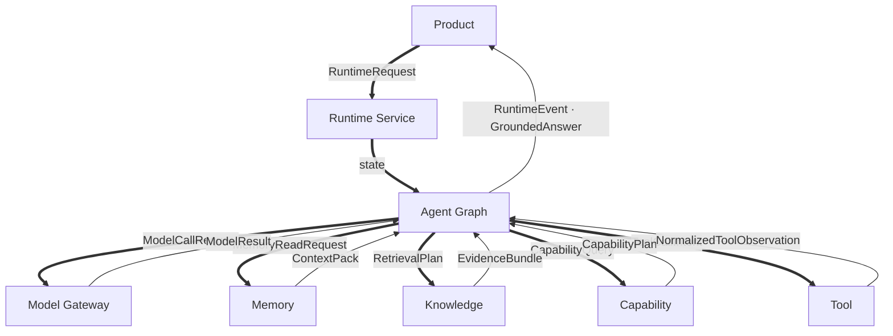

#### Local — Model and Memory Connectors

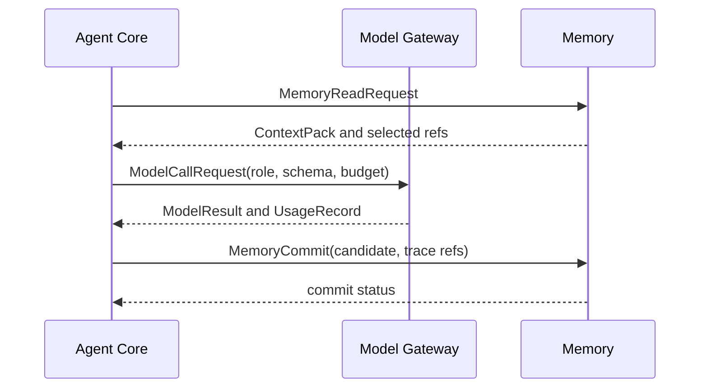

#### Local — Knowledge and Tool Connectors

```mermaid
sequenceDiagram
  participant A as Agent Core
  participant K as Knowledge
  participant C as Capability
  participant T as Tool Runtime
  A->>K: RetrievalPlan
  K-->>A: EvidenceBundle and RetrievalVerdict
  A->>C: CapabilityQuery
  C-->>A: CapabilityPlan and AllowedTools
  A->>T: ToolCallIntent
  T-->>A: approval_required or NormalizedToolObservation
```

### Data View (Views & Beyond)

#### Overall — Authoritative Data Ownership

```mermaid
flowchart TB
  Product[Workspace · Session · Task · Message] --> Run[AgentRun]
  Source[SourceObject · DocumentVersion] --> IR[DocumentIR · SourceSpan]
  IR --> Index[IndexManifest · CitationChunk]
  Run --> Plan[PlanVersion · Observation · Interrupt]
  Index --> Evidence[EvidenceLedger]
  Plan --> Answer[Claim · CitationBinding · GroundedAnswer]
  Evidence --> Answer
  Answer --> Artifact[Artifact · Feedback]
  Run --> Memory[MemoryCandidate · MemoryRecord · EntityFact]
  Run --> Trace[TraceSpan · Usage · EvalRun]
```

#### Local — Document and Citation Lineage

```mermaid
flowchart LR
  Source[SourceObject] --> Version[DocumentVersion]
  Version --> IR[CanonicalDocumentIR]
  IR --> Block[DocumentBlock]
  Block --> Span[SourceSpan]
  Block --> Chunk[CitationChunk]
  Chunk --> Index[IndexManifest]
  Index --> Evidence[EvidenceLedgerRecord]
  Evidence --> Binding[ClaimEvidenceBinding]
  Binding --> Citation[CitationView]
```

#### Local — Runtime and Memory Lifecycle

```mermaid
flowchart LR
  Request[RuntimeRequest] --> Run[AgentRun]
  Run --> Checkpoint[Checkpoint]
  Run --> Event[RuntimeEvent]
  Run --> Observation[NormalizedObservation]
  Run --> Final[GroundedAnswer]
  Final --> Raw[RawMemoryEvent]
  Raw --> Candidate[MemoryCandidate]
  Candidate --> Review[GovernanceRecord]
  Review -->|approved| Record[MemoryRecord]
  Record --> Context[Future ContextPack]
```

### Quality View (Views & Beyond)

#### Overall — Quality Attributes and Gates

```mermaid
flowchart TB
  Runtime[Agent Runtime]
  Security[Security]
  Grounding[Evidence and Citation]
  Recovery[Checkpoint and Idempotency]
  Observability[Trace and Diagnostics]
  Performance[Latency and Throughput]
  Cost[Budget and Usage]
  Privacy[Redaction and Memory Governance]
  Eval[Benchmark and Release Gate]
  Security -.-> Runtime
  Grounding -.-> Runtime
  Recovery -.-> Runtime
  Observability -.-> Runtime
  Performance -.-> Runtime
  Cost -.-> Runtime
  Privacy -.-> Runtime
  Eval -.-> Runtime
```

#### Local — Security Gate Chain

```mermaid
flowchart LR
  Input[Input Gate] --> Context[Memory and Model Context Gate]
  Context --> Retrieval[Retrieval Gate]
  Retrieval --> Tool[Tool Gate]
  Tool --> Output[Output Gate]
  Output --> Artifact[Artifact Gate]
  Input & Context & Retrieval & Tool & Output & Artifact --> Audit[(Audit Events)]
```

#### Local — Trace, Failure Buckets and Release Gate

```mermaid
flowchart LR
  Run[AgentRun] --> Spans[Span Tree]
  Spans --> Buckets[Failure Buckets]
  Spans --> Metrics[Correctness · Citation · Latency · Cost]
  Buckets --> Diagnostics[Environment and Profile Completeness]
  Metrics --> Gate{Release Gate}
  Diagnostics --> Gate
  Gate -->|measured pass| Pass[quality proven]
  Gate -->|measured fail| Fail[quality failed]
  Gate -->|blocked| Blocked[quality not yet proven]
```

## 三、Zuno Product Core

### Agentic GraphRAG Evidence and Agent Loop (Zuno)

#### Overall — Agentic GraphRAG Pipeline

```mermaid
flowchart TB
  Question[Question and ContextPack] --> Need{Need Retrieval?}
  Need -->|yes| Strategy[Query Strategy]
  Strategy --> BM25[BM25]
  Strategy --> Vector[Vector]
  Strategy --> Graph[Graph Traversal]
  BM25 & Vector & Graph --> Fusion[RRF Fusion]
  Fusion --> Rerank[Rerank and Expansion]
  Rerank --> Ledger[EvidenceLedger]
  Ledger --> Quality{Retrieval Quality Gate}
  Quality -->|sufficient| Claims[Claim Extraction and Binding]
  Quality -->|insufficient| Correct[Corrective Action]
  Correct --> Strategy
  Claims --> Synthesis[Grounded Synthesis]
  Synthesis --> Reflect{Reflection}
  Reflect -->|PASS| Final[GroundedAnswer]
  Reflect -->|RETRIEVE_MORE| Correct
  Reflect -->|ABSTAIN| Abstain[Abstained Answer]
```

#### Local — Corrective Retrieval Loop

```mermaid
flowchart LR
  Round[Retrieval Round] --> Verdict{Quality Verdict}
  Verdict -->|doc miss| Rewrite[Rewrite or Multi Query]
  Verdict -->|text miss| HyDE[HyDE or Step-back]
  Verdict -->|entity miss| Entity[Entity Decomposition]
  Verdict -->|relation miss| Relation[Graph Relation Query]
  Verdict -->|contradiction| Diversify[Diversify Sources]
  Rewrite & HyDE & Entity & Relation & Diversify --> Next[Next RetrievalPlan]
  Next --> Round
  Verdict -->|sufficient| Stop[Stop Retrieval]
  Verdict -->|limits reached| Abstain[Abstain or Ask User]
```

#### Local — EvidenceLedger and Claim Binding

```mermaid
flowchart LR
  R1[Round 1 Evidence] --> Ledger[EvidenceLedger]
  R2[Round 2 Evidence] --> Ledger
  R3[Round 3 Evidence] --> Ledger
  Ledger --> Dedup[Deduplicate · Version Check · Contradiction]
  Dedup --> Claims[Structured Claims]
  Claims --> Binder[Claim-level Citation Binder]
  Dedup --> Binder
  Binder --> Supported[Supported Claims]
  Binder --> Unsupported[Unsupported Claims]
  Supported --> Answer[GroundedAnswer]
  Unsupported --> Reflection[Reflection: rewrite, retrieve more, abstain]
```

---

## 11. Target completion criteria

目标架构完成时必须满足：

1. 十一逻辑模块都有唯一 owner、typed contract、failure semantics、持久化和 focused tests。
2. LangGraph 是唯一产品主运行时，支持 native checkpoint、interrupt/resume 和 live stream。
3. Product 默认使用真实 Model Gateway，不使用 mock 作为正常回答路径。
4. Memory 跨请求、跨重启持久化，并能证明 approved Reflexion lesson 被未来任务复用。
5. Knowledge 提供真实 Corrective Agentic GraphRAG 和 SourceSpan EvidenceLedger。
6. Capability 动态选择 Skill 与 AllowedTools；Tool Runtime 完成真实安全副作用。
7. Security 与 Observability 覆盖所有模块和关键 connector。
8. Completion、Workspace、Artifact、Citation 和 Trace 使用同一 Runtime 事实。
9. fixed paired benchmark 产生 measured pass/fail；若外部条件阻塞，则诚实保持 blocked。
10. Current / Target 边界由 `production-readiness.md` 和自动 guardrails 持续验证。
