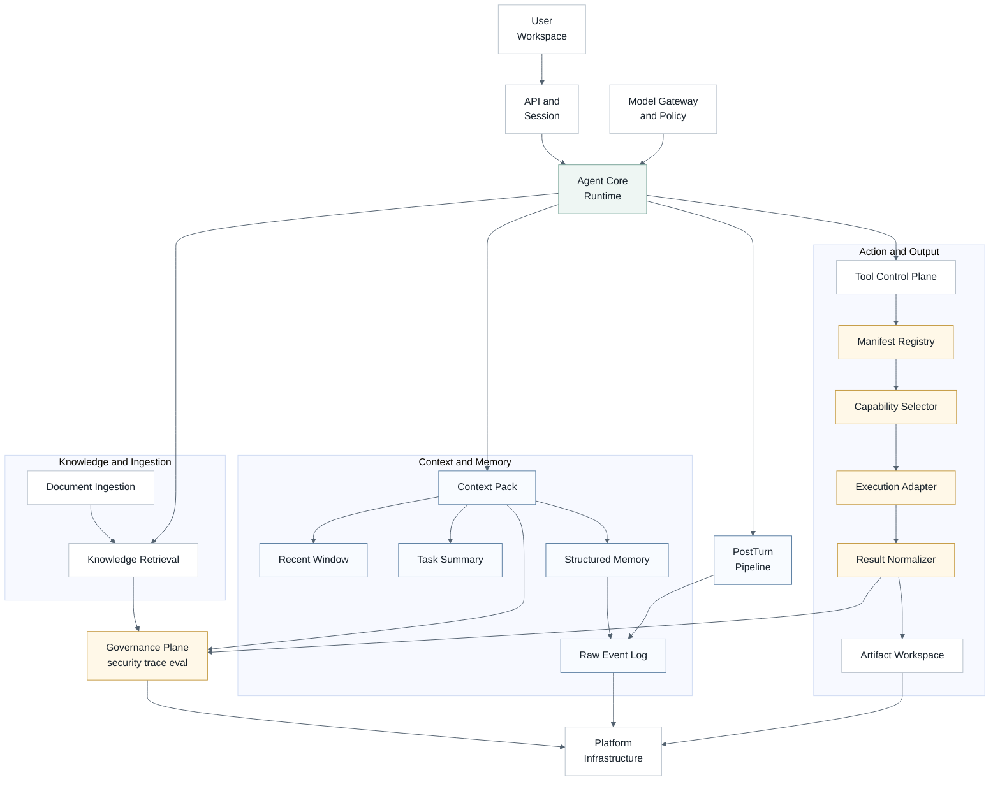
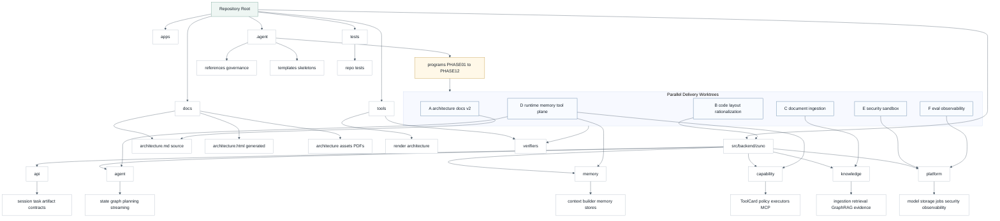
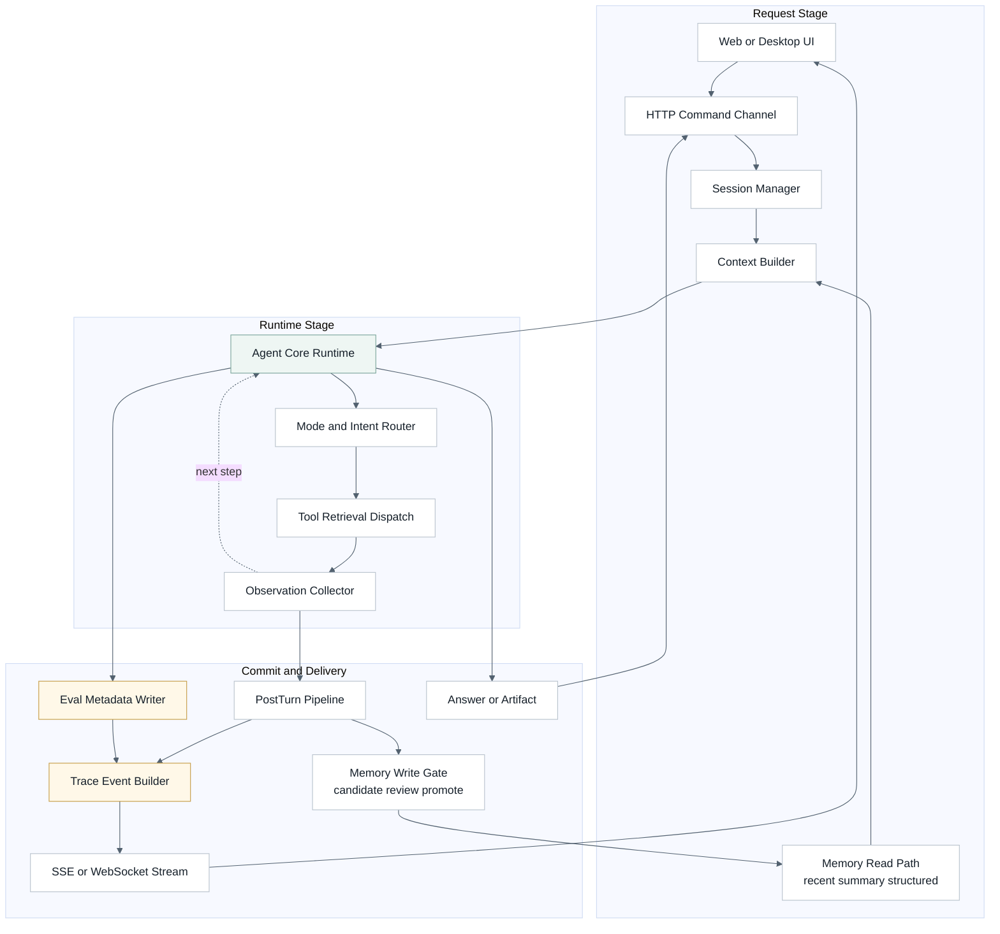
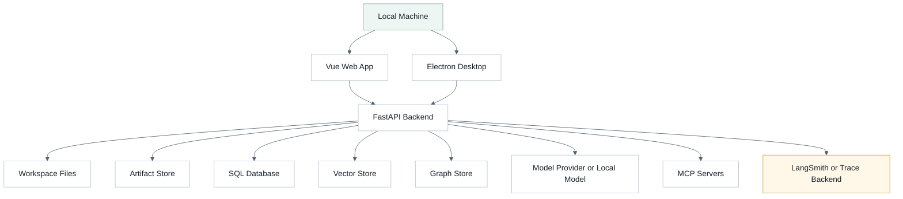
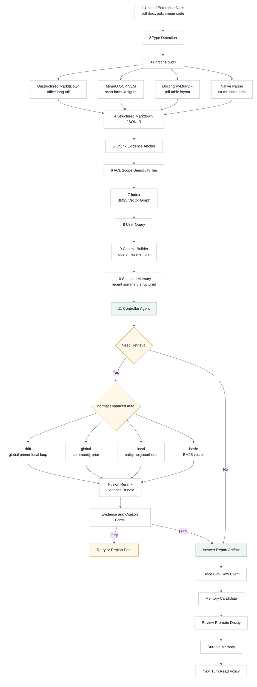
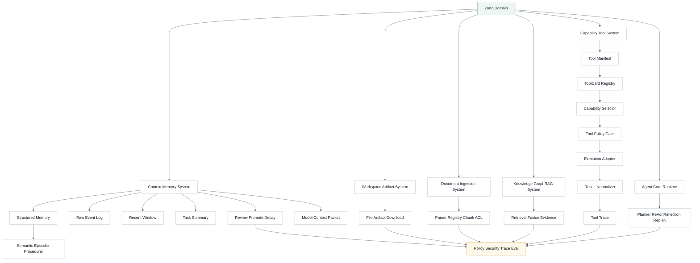
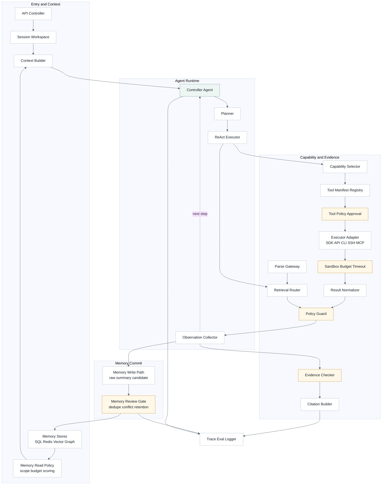
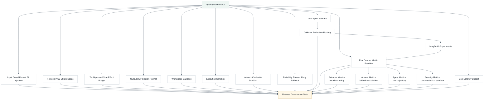

```mermaid
%%{init: {"theme": "base", "themeVariables": {"background": "#f7f8fb", "lineColor": "#52616f"}}}%%
flowchart TB
  classDef node fill:#ffffff,stroke:#b8c2cc,stroke-width:1px,color:#16202a;
  classDef accent fill:#eef6f3,stroke:#7aa59a,stroke-width:1px,color:#16202a;
  classDef guard fill:#fff8e8,stroke:#c59b43,stroke-width:1px,color:#16202a;

  APP["Zuno App"]:::accent
  STORE["Local Object Storage"]
  SQL["SQL Database"]
  VDB["Vector Store"]
  GDB["Graph Store"]
  SEARCH["Sparse Search Index"]
  JOBS["Background Jobs<br/>ingest embed graph artifact"]
  MODEL["Model Gateway"]
  MCP["MCP Provider"]
  SDK["SDK Adapter"]
  APIAD["API Adapter"]
  CLI["CLI Adapter"]
  SSH["SSH Adapter"]:::guard
  SANDBOX["Execution Sandbox"]:::guard
  NET["Network Proxy"]:::guard
  CREDS["Credential Broker"]:::guard
  OTEL["OTel Collector<br/>redaction routing"]
  TRACE["Local Trace Eval Backend"]
  LS["LangSmith Sink"]
  APP --> STORE
  APP --> SQL
  APP --> VDB
  APP --> GDB
  APP --> SEARCH
  APP --> JOBS
  APP --> MODEL
  APP --> MCP
  APP --> SDK
  APP --> APIAD
  APP --> SANDBOX
  SANDBOX --> CLI
  SANDBOX --> SSH
  SANDBOX --> NET
  SANDBOX --> CREDS
  APP --> OTEL --> TRACE
  OTEL --> LS
  class STORE,SQL,VDB,GDB,SEARCH,JOBS,MODEL,MCP,SDK,APIAD,CLI,TRACE,LS node;
```

```mermaid
%%{init: {"theme": "base", "themeVariables": {"background": "#f7f8fb", "lineColor": "#52616f"}}}%%
flowchart LR
  classDef node fill:#ffffff,stroke:#b8c2cc,stroke-width:1px,color:#16202a;
  classDef decision fill:#fff8e8,stroke:#c59b43,stroke-width:1px,color:#16202a;
  classDef accent fill:#eef6f3,stroke:#7aa59a,stroke-width:1px,color:#16202a;

  GOAL["Goal"]
  PREP["prepare_context"]
  READMEM["memory read<br/>recent task structured"]
  ROUTE["intent and mode router"]
  PLAN["plan"]
  STEP["ReAct step"]
  CALL["tool or retrieval dispatch"]
  OBS["observation"]
  RAW["raw event append"]
  WORK["working memory"]
  REFLECT{"reflection gate"}:::decision
  REPLAN["replan"]
  FINAL["final answer"]:::accent
  COMMIT["post_turn_commit trace memory eval"]
  SUMMARY["task summary update"]
  CAND["structured memory candidate"]
  REVIEW["review promote decay"]:::decision
  LONG["semantic episodic procedural memory"]

  subgraph PREPARE["Prepare"]
    direction TB
    GOAL --> PREP --> READMEM --> ROUTE --> PLAN
  end

  subgraph EXECUTE["Execute"]
    direction TB
    STEP --> CALL --> OBS --> RAW --> WORK --> REFLECT
  end

  subgraph POSTTURN["Post Turn"]
    direction TB
    FINAL --> COMMIT
    COMMIT --> SUMMARY
    COMMIT --> CAND --> REVIEW --> LONG
  end

  PLAN --> STEP
  REFLECT -->|continue| STEP
  REFLECT -->|replan| REPLAN --> PLAN
  REFLECT -->|finish| FINAL
  SUMMARY -. next turn .-> READMEM
  LONG -. next turn .-> READMEM
  class GOAL,PREP,READMEM,ROUTE,PLAN,STEP,CALL,OBS,RAW,WORK,REPLAN,COMMIT,SUMMARY,CAND,LONG node;
```

# Zuno 架构总文档

## 用途

这是 Zuno 当前正式的文字总架构文档。它回答四个问题：

1. Zuno 当前是什么。
2. Zuno 的目标架构是什么。
3. 下一阶段为什么落在企业私有知识库、多格式文档解析、评测观测和安全治理上。
4. 哪些能力仍是 Target，不能写成 Current。

图形化展示以 `docs/architecture/architecture.html` 为准；图源是 `docs/architecture/architecture.md`。Agent 侧维护镜像是 `.agent/architecture/architecture.md`，Agent 侧也保留同名 HTML 镜像。这四个 canonical paths 必须保持一致：

- `docs/architecture/architecture.md`
- `.agent/architecture/architecture.md`
- `docs/architecture/architecture.html`
- `.agent/architecture/architecture.html`

## 核心判断

Zuno 的主叙事是 **本地优先的企业私有知识库与多功能 Agent 助手**，不是普通 RAG 问答 demo，也不是默认多 Agent 平台。

当前仓库已经完成的是架构治理、文档系统、六层后端边界、`GeneralAgent` 单循环主线、Query Router foundation、Context / Memory foundation、ToolCard foundation、GraphRAG query contract、Evidence / Citation / Trace / Eval foundation。

仍然不能写成 Current 的能力包括：生产级 LangGraph runtime、成熟 Memory DB、完整 dynamic tool orchestration、统一 Parse Gateway、LangSmith 产品化评测、完整安全沙箱、credential broker、输出 DLP、前端 trace 面板和默认产品级多 Agent runtime。

```text
Zuno current
  = monorepo
  + FastAPI backend
  + Single GeneralAgent single loop
  + Knowledge / GraphRAG query path
  + evidence / citation / trace foundation

Zuno target
  = Local-first Enterprise Private Knowledge Agent Workspace
  + Single Controller Agent Runtime
  + Document Ingestion / Parse Gateway
  + Context / Memory write-manage-read
  + Tool Control Plane
  + Agentic RAG + GraphRAG
  + Security / Approval / Sandbox
  + LangSmith-compatible Trace / Eval
  + Workspace / Artifact / Event Flow
```

## Current

Current 只写代码、测试和可复现结果已经证明的事实：

- 当前是 monorepo，主要边界是 `apps/web`、`apps/desktop`、`src/backend/zuno`、`tools`、`tests`、`docs` 和 `.agent`。
- 当前 Python 后端 runtime 边界是 `src/backend/zuno`。
- 当前后端目标层已经收口为 `api / agent / memory / capability / knowledge / platform` 六层。
- 当前主线是 `GeneralAgent` single loop，不是完整产品级 LangGraph runtime，也不是默认多 Agent runtime。
- 当前知识问答链路是 `Completion API -> CompletionService -> GeneralAgent single loop -> search_knowledge_base -> KnowledgeQueryService -> GraphRAGQueryService -> RetrievalPlanner / RetrievalOrchestrator -> Evidence / Citation / Trace -> answer`。
- 当前已证明 `product_mode = normal | enhanced | auto` 与 `query_method = auto | basic | local | global | drift` 的请求、路由和 trace foundation；`auto` 是 router，不是第五种最终检索方法。
- 当前 Memory、Tool、Hooks、GraphRAG 和 Runtime Upgrade 都是 foundation slice，不是成熟产品能力。
- 当前 `src/backend/zuno` 是唯一当前 Python 后端 runtime 边界，没有 active root-level `services/` 后端树。

## Target 分层

| 平面 | 目标职责 | 当前边界 |
| --- | --- | --- |
| Presentation / Workspace | Web、Desktop、会话、上传、产物、trace 面板和用户反馈。 | 当前已有 Web / Desktop 工作区；完整产品闭环仍是 Target。 |
| API / Session | FastAPI routes、DTO、Auth、task / session、SSE / WebSocket、upload / download。 | 当前 API 基础存在；完整 task/session/event flow 仍是 Target。 |
| Agent Core Runtime | `prepare_context -> plan -> ReAct -> observe -> reflect -> replan -> post_turn_commit`。 | 当前是 `GeneralAgent` single loop + 最小 ledger，不是完整 LangGraph runtime。 |
| Context / Memory | Raw Event Log、recent window、task summary、structured memory、Context Pack、review / promotion / decay。 | 当前是 foundation contracts 和轻量 readback。 |
| Capability / Tool | ToolCard / manifest、capability retrieval、policy、approval、executor adapter、sandbox、result normalization。 | 当前已有 ToolCard foundation；动态编排和审批闭环仍是 Target。 |
| Knowledge / Retrieval | Basic RAG、GraphRAG local/global/drift、retrieval fusion、evidence、citation。 | 当前已有 GraphRAG query contract；生产级 extraction / RRF / rerank 仍是 Target。 |
| Document Ingestion | 多格式解析、OCR/VLM、chunk metadata、ACL 继承、BM25/vector/graph index handoff。 | 统一 Parse Gateway 和 Parser Capability Matrix 是下一阶段重点。 |
| Security / Governance | 输入检查、PII / 商业机密脱敏、prompt injection 防护、权限、审批、输出 DLP、审计。 | 当前不能声称成熟沙箱系统；完整治理仍是 Target / Future。 |
| Trace / Eval | runtime trace、LangSmith 映射、dataset、offline / online eval、retrieval / answer / tool / security 指标。 | 当前有本地 trace/eval foundation；LangSmith 产品化仍是 Target。 |
| Platform | storage、model gateway、worker、artifact、observability 和 provider。 | 近期保持模块化单体，不写成微服务 Current。 |

## 目标架构细化

Zuno 的目标架构可以理解为“单控制器运行时 + 多平面支撑”。单控制器不是简单聊天循环，而是一个能在企业知识库场景里持续做上下文准备、任务规划、工具选择、检索决策、证据检查、质量反思、计划修正和结果提交的运行时。多平面支撑不是微服务拆分，而是把文档解析、知识检索、记忆、工具、安全、评测和平台基础设施各自的责任边界讲清楚。近期实现仍应保持模块化单体，先把内部 contracts、tests、trace 和 verifier 做稳，再决定哪些能力需要 worker、队列或独立服务。

最新研究报告 `zuno-target-architecture-deep-research-implementation-blueprint-2026-06-30` 是本轮详细度基准。本文吸收它的核心结构：User Experience、API & Session、Agent Runtime、Memory & Context、Capability / Tool、Knowledge & Retrieval、Document Ingestion、Security & Governance、Eval & Observability 九个目标平面，以及 Platform / Infra 作为支撑平面。后文所有图和实施计划都围绕这九个平面展开，而不是只停留在“Agent + Tool + Memory + RAG”的粗粒度框架。

### 企业私有知识场景平面

产品主场景是企业内部文档知识库与多功能 Agent 助手。它不是“用户问一句，向量库召回几段，然后模型回答”的普通 RAG demo，而是围绕企业工作空间组织知识、任务、权限、文件、产物和审计。一个 workspace 可以绑定部门、项目、合同库、简历库、制度库或研发知识库；一个 knowledge space 管理文档集合、GraphRAG project、索引版本、ACL 和 citation policy；一个 tool space 管理搜索、数据库、邮件、文件、浏览器、CLI、MCP 和内部 API 等动作能力。

这个场景决定了 Zuno 不能只优化答案质量，还要关心文件从哪里来、谁有权看、解析是否保留页码和表格、检索结果是否可引用、工具动作是否需要审批、输出是否泄露隐私或商业机密、trace 能不能复盘。企业用户真正需要的是“可理解、可追溯、可执行、可评测、可治理”的知识工作台。问答只是入口，后续还要支持制度解释、文档对比、合同审查、候选人简历匹配、项目复盘摘要、竞品报告、邮件草拟、表单填充和报告产物下载。

### API / Session / Artifact 平面

API 层的目标不是只提供 completion endpoint，而是形成 task / session / artifact / event 的产品闭环。任务启动时，API 应创建会话、绑定 workspace scope、记录用户身份和权限上下文，并把上传文件、选定知识库、product mode、query method preference、工具授权策略写入 request envelope。运行过程中，SSE 或 WebSocket 推送 planning、retrieval、tool_call、approval_required、artifact_created、eval_diagnostic 和 error 等事件。运行结束后，artifact list / download 提供 Markdown、PDF、JSON、citation bundle 和 trace report。

这个平面是 deepsearch 类产品看起来“完整”的原因，也是 Zuno 下一阶段补产品感的关键。它不是近期 Current，也不要求立即做复杂微服务；但要求后端 contracts 把 session id、task id、trace id、artifact id、workspace id 和 graph project id 串起来。没有这层，LangSmith trace、文档解析、工具审批和产物下载都会各自存在，不能形成用户能感知的闭环。

### Single Controller Agent Runtime 平面

规划模块在 Zuno 里不应被画成独立于 Agent 的第五个大脑，而应落在 Single Controller Agent Runtime 内部。目标状态机是：

```text
prepare_context
  -> intent_and_policy_route
  -> plan
  -> act_react_loop
  -> observe
  -> evidence_check
  -> reflect
  -> replan_if_needed
  -> answer_or_artifact
  -> post_turn_commit
```

`plan` 负责把复杂目标拆成可执行步骤；`act_react_loop` 负责单步工具调用、检索和观察；`reflect` 负责检查当前答案是否有足够证据、格式是否正确、是否可能泄密或越权；`replan_if_needed` 在检索不足、工具失败或用户目标变化时重写剩余步骤；`post_turn_commit` 把 trace、artifact、memory candidate、eval diagnostics 和安全审计写回。LangGraph 适合承载这类 runtime，不是因为项目需要“装了 LangGraph”，而是因为 durable execution、interrupt / approval、streaming、checkpoint、resume 和状态图正好对应企业任务运行时的需求。

当前 Zuno 只能说已经有 `GeneralAgent` single loop、RuntimeTurnLedger 和最小 evidence chain foundation。完整 LangGraph-compatible runtime 仍是 Target。近期最短路径不是一开始就做多 Agent，而是先把单控制器的状态、输入输出、事件、失败恢复和审批点做稳。未来如果引入子 Agent，也应该作为工具或 delegated worker，由单控制器管理，而不是让产品架构默认变成多 Agent 混战。

### Context / Memory 平面

Memory 不是“把历史聊天塞进 prompt”。Zuno 的目标记忆层至少分五类：Raw Event Log、Recent Window、Task Summary、Structured Long-term Memory 和 Model Context Pack。Raw Event Log 是可审计的原始事件账本；Recent Window 是当前任务短期上下文；Task Summary 是压缩后的阶段状态；Structured Memory 是经过 review / promotion 的长期事实、偏好、项目状态或经验；Model Context Pack 是每轮真正喂给模型的受控上下文包。

记忆压缩应按风险和用途分层。滑动窗口只解决 token 预算；摘要压缩解决长任务连续性；结构化抽取解决可检索、可审计和可更新；反思型记忆解决失败经验和工具偏好沉淀。企业场景里，长期记忆还必须绑定 workspace、user、project、source、confidence、privacy label、retention policy 和 last_verified_at。敏感记忆不能因为“对回答有用”就自动进入 prompt；它必须经过权限检查、脱敏策略和上下文预算策略。

当前 Zuno 的 Context / Memory foundation 已有 taxonomy、Context Pack policy、source id coverage 和 review contract，但 production-grade memory retrieval / consolidation / decay 仍是 Target。实施时应先做 read-write-manage 的最小闭环：事件可写、近期窗口可构造、摘要可生成、候选记忆可 review、结构化记忆可检索、Context Pack 可解释为何包含或排除某条记忆。

### Document Ingestion / Parse Gateway 平面

企业知识库的质量首先取决于文档摄取，而不是检索算法。目标 Parse Gateway 应负责格式识别、parser routing、OCR / layout、结构抽取、chunk、metadata、ACL 继承、provenance 和 index handoff。它的输出不应是一段裸文本，而应是 Canonical Document IR，例如 document、section、page、paragraph、table、image、code_block、metadata、source_span 和 acl_scope 组成的结构化对象。

最低支持矩阵应覆盖 PDF、DOCX、PPTX、XLSX、TXT、MD、HTML、CSV / JSON、图片 / 扫描件和代码文件。PDF 需要页码、bbox、表格和 OCR fallback；Office 文件需要 heading、slide、sheet、table 和批注；Markdown / HTML 需要标题层级和链接；代码文件需要语言、路径、symbol、line range 和代码感知切块；图片需要 OCR 文本、视觉描述、bbox 和 confidence。Docling、PyMuPDF4LLM、MarkItDown、Unstructured、OCR / VLM 可以作为 adapter 候选，但 Zuno 自己要维护统一的 ParseRequest、ParseResult、Document IR、parser capability matrix 和 golden tests。

最新报告把 parser router 拆得更具体：TXT / MD / Code / HTML 走 native parser；复杂 PDF、表格和版面信息优先走 Docling / PyMuPDF4LLM；扫描件、公式、图表和 OCR-heavy 材料进入 MinerU / PaddleOCR-VL / VLM 路径；长尾办公格式用 Unstructured 或 MarkItDown 补齐。所有 parser 的输出都必须归一到结构化 Markdown / JSON，并保留 block-level provenance：文件 id、页码、bbox、表格单元、章节层级、parser id、confidence 和 ACL scope。GraphRAG indexing、citation、security DLP 和 eval 都只能消费这个统一 IR，而不是直接消费 parser 原始输出。

这就是为什么 Document Ingestion 不能继续隐含在工具层里。工具层负责“怎么调用解析器”，但知识系统需要“解析后的结构如何进入 BM25、vector、graph、citation 和 eval”。如果解析阶段没有保留 page、table、source span 和 ACL，后面的 citation、DLP、GraphRAG entity extraction 和 answer grounding 都会变弱。

### Tool Control Plane 平面

工具层按 capability domain 治理，不按 API / SDK / CLI / MCP 这些执行方式拆顶层业务分类。搜索、文件、数据库、邮件、浏览器、代码执行、知识库查询和内部系统访问是 capability；local function、SDK、HTTP API、CLI、SSH、MCP stdio、MCP HTTP 是 executor adapter。ToolCard 是工具的声明式身份证，运行时代码只是其中一个执行后端。

目标 ToolCard 至少需要 tool_id、display_name、description、input_schema、output_schema、capability_tags、execution_mode、trust_tier、side_effect_level、permissions_required、workspace_scope、rate_limit、timeout、cost_hint、secrets_required、approval_policy、audit_policy、failure_modes 和 result_normalizer。Tool Router 的顺序应是作用域过滤、权限过滤、trust tier 过滤、side-effect 分级、健康检查、成本 / 延迟策略、schema compatibility 和 fallback。高副作用工具，例如 send_email、外部写数据库、SSH、删除文件或覆盖产物，默认进入 approval / interrupt / resume 流程。

当前已有 ToolCard compact metadata、Native BM25 ToolCard retrieval、MCP/local tool policy trace 和 capability selection trace bridge。完整动态工具编排、approval UI、executor sandbox、credential broker 和 MCP trust governance 仍是 Target。

### Knowledge / RAG / GraphRAG 平面

Knowledge 平面需要同时保留 Basic RAG 和 GraphRAG，而不是把 GraphRAG 当成所有问题的默认解。`basic` 适合精确片段问答、合同条款查找、制度定位和低延迟回答，目标是 BM25 + dense vector + metadata filter + RRF + optional rerank。`local` 适合围绕实体、关系、人物、项目、条款或组织局部邻域的问题。`global` 适合跨文档主题、社群摘要和全局 sensemaking，它应作为 community-level prior，而不是和 chunk-level BM25 结果直接硬混排。`drift` 适合复杂研究，先用 global primer 形成主题和子问题，再用 local / basic 回补可引用证据。

Evidence / Citation 是 RAG 产品化的底座。检索结果进入答案前，应经过 evidence bundle 构造、citation coverage 检查、source trust label、ACL check、freshness check 和 answer grounding check。没有证据的答案可以草拟，但不能伪装成已引用知识库结论。对于企业知识库，引用不仅是“好看”，还是审计、合规、复盘和 eval 的入口。

当前 Zuno 有 KnowledgeQueryService、GraphRAGQueryService、GraphRAGProjectSnapshot、KnowledgeQueryResult、query_method trace 和 citation contract foundation。生产级 LLM-first entity / relation extraction、多套 extractor config、community report 生成、完整 RRF / rerank 和 GraphRAG index pipeline 仍是 Target。

### Security / Governance 平面

企业私有知识场景的安全问题主要分四类：稳定性、安全性、隐私和商业机密。稳定性是任务不要乱跑、工具不要误调用、失败要可恢复；安全性是 prompt injection、tool abuse、越权访问、恶意文件和不可信 MCP server 不应突破边界；隐私是 PII、候选人资料、员工信息、客户数据不能被误写入不该去的上下文或输出；商业机密是合同、报价、技术方案、内部策略、源代码和密钥不能被泄露、混入公开 provider 或输出给无权用户。

目标安全链路有四道闸：输入闸门、检索闸门、工具闸门、输出闸门。输入闸门做鉴权、限流、文件校验、PII / secret / injection 检测；检索闸门做 workspace / project scope、chunk ACL、document trust label 和恶意指令净化；工具闸门做 permission decision、side-effect approval、secret broker、network / cwd / host allowlist、timeout 和 sandbox；输出闸门做 DLP scan、citation coverage、敏感字段脱敏、格式校验和 policy violation report。

安全不是单独一个 endpoint，而是横切 runtime。每次检索、每次工具调用、每次输出都要能产出 policy decision 和 audit trace。LangGraph 的 interrupt / resume 可以承载审批恢复点；平台层的 sandbox 和 credential broker 负责把“模型建议调用工具”与“代码真正执行工具”隔开。

最新报告进一步把安全基线拆成四层 sandbox。第一层是 Policy Sandbox：ToolCard 自带 risk_level、side_effect_level、approval_required、sandbox_required、network_policy、credential_policy 和 audit_required。第二层是 Workspace Sandbox：原始知识库、上传文件、临时目录、生成目录、只读源码区和可写 artifact 区必须硬隔离。第三层是 Execution Sandbox：代码执行、CLI、SSH、local MCP server 和重文档解析都必须进入受限执行边界，至少具备 timeout、resource limit、cwd scope、allowlist、secret redaction 和 audit。第四层是 Network / Credential Sandbox：默认 deny，HTTP/HTTPS 通过代理出站，allowed domains 显式列白名单，原始 secrets 不进入 prompt 和 sandbox 文件系统，而由宿主侧 credential broker 注入。提示注入不能被当作一次性修好的输入漏洞；它必须被视为系统级残余风险，通过审批、隔离、最小权限和审计来控损。

### Eval / Observability 平面

评测与观测不是上线后才补的看板，而是 Zuno 能否证明自己进步的质量系统。目标 trace schema 应兼容 LangSmith 的 run / span / thread / dataset / experiment 组织方式，同时保留本地 JSONL 和 pytest / eval runner 作为 release gate。每次请求至少要关联 trace_id、session_id、workspace_id、requested_query_method、resolved_query_method、retrieval events、tool events、evidence bundle、citation coverage、latency、cost、fallback reason、approval decision 和 policy diagnostics。

指标分四层。检索层看 Recall@k、MRR、nDCG、retrieval relevance、context precision / recall、community report hit rate 和 citation coverage。回答层看 correctness、faithfulness / groundedness、answer relevance、format validity 和 hallucination risk。Agent 层看 tool selection、argument correctness、trajectory quality、fallback rate、retry rate、approval rate、task completion rate 和 P50 / P95 latency。安全层看 prompt injection block rate、redaction miss rate、sandbox violation、unauthorized retrieval block 和 output DLP violation。

当前 Zuno 有本地 eval baseline、trace/eval foundation 和 Contract Review eval 证据，但 LangSmith 驱动的持续评测平台仍是 Target。实施时应先做 schema mapping 和离线 dataset，再接 online monitoring。这样未来简历或 demo 里可以写出真实数字，而不是只说“做了 RAG 评测”。

最新报告把 observability 的内部标准进一步定为 OTel-compatible span schema，LangSmith 只是第一接收端和实验台，不是唯一事实源。推荐路径是：Zuno runtime 先生成 OTel / LangSmith-compatible spans；OTel Collector 负责 redaction、routing 和 sampling；本地 JSONL / database 保留 release gate 证据；LangSmith sink 承担 trace browser、dataset、offline / online experiment；Prometheus / OpenTelemetry-native backend 承担 latency、error、cost 和 security metrics。这样既能用 LangSmith，又不会把 Zuno 的 trace 数据结构锁死在单一 vendor。

### Platform / Storage / Worker 平面

近期平台层仍应保持模块化单体；微服务不是近期 Current，也不是默认路线。目标上，Platform 负责 model gateway、settings、database、object storage、vector store、graph store、search index、queue / worker、secrets、observability 和 provider adapter。文档解析、embedding、GraphRAG indexing、artifact rendering 和长任务可以先通过 background job / worker 抽象表达，不需要立刻引入完整分布式架构。

代码布局上，`src/backend/zuno` 顶层六层已经正确：`api / agent / memory / capability / knowledge / platform`。下一阶段要整理的是六层内部。`platform/services` 不能继续变成所有旧业务逻辑的停车场；`capability/tools` 不能让 provider、adapter、domain tool、legacy alias 混在一起；`platform/compatibility` 应逐步收缩为 legacy import registry、vendor shim 和 migration notice；Document Ingestion 应进入 `knowledge/ingestion` 或等价知识摄取边界，而不是散落在工具目录。任何移动都必须先由 import matrix、focused tests 和 verifier 证明，不为了视觉清爽直接删兼容路径。

目标代码树按最新报告收束为“业务语义拥有代码，platform 只承载跨层基础设施”：

```text
src/backend/zuno/
  api/                         # FastAPI routes, DTO, session/task/artifact contracts
  agent/                       # Single Controller Runtime, state graph, planning, streaming
  memory/                      # context_builder, raw events, summaries, structured memory
  capability/                  # ToolCard registry, selector, policy, executors, MCP adapters
  knowledge/
    ingestion/                 # parser router, Document IR, chunk/provenance, parser golden tests
    retrieval/                 # basic RAG, sparse/dense/hybrid search
    graphrag/                  # entity/relation extraction, community reports, local/global/drift
    evidence/                  # evidence bundle, citation, grounding checks
  platform/
    model_gateway/             # local/API model provider boundary
    storage/                   # SQL, object, vector, graph, search provider adapters
    jobs/                      # ingest/embedding/index/artifact background jobs
    observability/             # OTel/LangSmith-compatible trace, metrics, eval export
    security/                  # policy, DLP, approval, sandbox, credentials
    vendor/                    # vendored shims only
    compatibility/             # legacy import registry only
```

这个代码树不是 Current 承诺。它是 PHASE02 以后逐步收敛的 Target。兼容路径不能为了视觉清爽直接删除；每次移动都必须先有 import matrix、legacy guard tests、repo structure verifier 和 focused runtime tests。

## 主链路

```text
upload / sync enterprise docs
  -> format detection
  -> Parse Gateway
  -> OCR / table / code / metadata extraction
  -> chunk + provenance + ACL
  -> BM25 / vector / graph index
  -> user query
  -> Context Builder
  -> Single Controller Agent
  -> product mode policy: normal / enhanced / auto
  -> query method: basic / local / global / drift
  -> evidence and citation check
  -> answer / report / artifact
  -> trace / eval / memory candidate
  -> review / promotion / durable memory
```

这条链路解释为什么 Document Ingestion 不能继续隐含在工具层里：企业知识库质量首先取决于解析、metadata、ACL、chunk 和 provenance，而不只是检索算法。

## 文档解析边界

下一阶段需要把文档解析正式成层。目标 Parser Capability Matrix 至少覆盖：

- PDF：页码、span、图片、表格和 OCR metadata。
- DOCX / PPTX / XLSX：heading、slide、sheet、table 和结构信息。
- TXT / MD / CSV / JSON / HTML：行号、标题、row id、DOM section。
- 图片 / 扫描件：OCR 文本、bbox、confidence、视觉描述。
- 代码文件：语言、路径、symbol、line range 和代码感知切块。

这些能力进入 `Document Ingestion / Parse Gateway` program，而不是在当前文档里伪装成已经完成。

## 工具层边界

工具层按能力语义治理，不按 API / SDK / CLI / MCP 拆顶层业务分类。邮件、文件、数据库、搜索、知识库、代码执行和 SSH 是 capability domain；local function、SDK、API、CLI、SSH、MCP stdio、MCP HTTP 是 execution adapter。

高副作用工具，例如 `send_email`、外部写操作、SSH、删除或覆盖类命令，目标上必须经过 approval / interrupt / audit trace。当前只能说有 ToolCard / MCP policy foundation，不能声称已有完整工具审批和沙箱。

## 安全与评测

企业私有知识场景里，安全和评测不是附加功能，而是产品可信度的一部分。

安全目标分四道闸：

1. 输入闸门：鉴权、限流、文件校验、PII / 商业机密识别、prompt injection 检测。
2. 检索闸门：chunk 级 ACL、workspace / project scope、document trust label、检索结果净化。
3. 工具闸门：side effect 分级、permission decision、approval gate、timeout、cwd / host allowlist。
4. 输出闸门：DLP scan、citation coverage、format validation、敏感字段脱敏。

评测目标分四类：

- Retrieval eval：Recall@k、MRR、nDCG、retrieval relevance、citation coverage。
- Answer eval：correctness、faithfulness / groundedness、answer relevance、format validity。
- Agent eval：tool selection、argument correctness、trajectory quality、approval rate、fallback rate。
- Security eval：prompt injection block rate、redaction miss rate、sandbox violation、越权访问阻断率。

LangSmith-compatible Trace / Eval 是统一 trace / span / dataset / evaluator / experiment 的外部适配层；本地 pytest 和 eval runner 仍保留为 release gate。

## 实施落点

当前 active program 是 `zuno-master-architecture-implementation-v1`，不是上一轮只做图和执行计划的文档 program。它的目标是把目标架构分阶段落地，同时仍然遵守 Current / Target 边界。当前阶段是 `PHASE01_program-baseline-and-previous-closure`，只负责归档上一轮 program、修正状态面、归档研究产物、扩写架构源文档和同步 verifier / tests，不在本阶段实现 runtime feature。

本 program 的十二个 phase：

1. `PHASE01_program-baseline-and-previous-closure`：收口上一轮架构细化 program，打开本大型 implementation program，归档 ChatGPT 研究模式产物，固定 README、AGENTS、`.agent/references/current-program.md`、verifier 和 tests 的 active 状态。
2. `PHASE02_project-folder-and-code-layout-cleanup`：先处理用户指出的项目文件夹混乱问题，建立 ownership matrix、compat / vendor / provider 边界、缓存清理规则、legacy import matrix 和 repo structure guard。
3. `PHASE03_enterprise-scenario-and-product-loop`：把企业私有知识库场景落成 workspace、task / session、upload、artifact、SSE / WebSocket、trace panel 和 user feedback contracts。
4. `PHASE04_document-ingestion-parse-gateway`：实现多格式文档解析目标层，覆盖 PDF、Office、图片、代码、TXT、MD、HTML 等常见格式，输出 Canonical Document IR、chunk metadata、provenance 和 ACL。
5. `PHASE05_agent-runtime-langgraph-harness`：把 Single Controller Agent Runtime 从目标状态机推进到 LangGraph-compatible harness，形成 prepare_context、plan、ReAct、observe、reflect、replan 和 post_turn_commit 的最小闭环。
6. `PHASE06_context-memory-system`：落地 Raw Event Log、Recent Window、Task Summary、Structured Memory、Context Pack、review / promotion / decay 和 memory eval 的可测试路径。
7. `PHASE07_tool-control-plane-mcp-approval`：落地 ToolCard manifest、selector、policy、approval、executor adapter、MCP trust、credential broker 和 sandbox 的第一版。
8. `PHASE08_rag-graphrag-evidence-citation`：深化 basic / local / global / drift，补齐 retrieval fusion、GraphRAG indexing/query、evidence bundle、citation coverage 和 rerank / fallback trace。
9. `PHASE09_security-governance-sandbox`：实现输入闸门、检索闸门、工具闸门、输出闸门，覆盖 prompt injection、PII / 商业机密脱敏、ACL、DLP、side-effect approval 和 audit trace。
10. `PHASE10_eval-observability-langsmith`：建立 LangSmith-compatible trace schema、dataset、offline / online eval、RAG / answer / agent / security metrics 和 CI regression gate。
11. `PHASE11_architecture-docs-html-refresh`：根据已落地事实更新 `docs/architecture/architecture.md`、`.agent/architecture/architecture.md` 和两份 `architecture.html`，保证 Markdown 比 HTML 更详细，HTML 图为主。
12. `PHASE12_validation-release-closure`：运行 repo verifiers、focused tests、必要的 full pytest、文档 self-review、program closure、历史归档、commit 和 push。

这十二个 phase 可以在后续按 workstream 拆分并行，但共享状态面、架构源文档、verifier、tests 和 release closure 必须由主线程统一收口。

## 研究产物归档

用户提供的高质量架构 PDF 已作为 research input 归档到：

- `docs/history/research/chatgpt-research-mode-artifacts/zuno-enterprise-private-knowledge-agent-workspace-target-architecture-research-2026-06-30.pdf`
- `docs/history/research/chatgpt-research-mode-artifacts/zuno-enterprise-private-knowledge-agent-workspace-target-architecture-research-2026-06-30.md`
- `docs/history/research/chatgpt-research-mode-artifacts/zuno-target-architecture-deep-research-implementation-blueprint-2026-06-30.pdf`
- `docs/history/research/chatgpt-research-mode-artifacts/zuno-target-architecture-deep-research-implementation-blueprint-2026-06-30.md`

这个目录使用英文名 `chatgpt-research-mode-artifacts`，专门保存 ChatGPT 研究模式产物。它不是当前架构事实源。正式架构事实源仍是本文；HTML 展示仍由本文生成。吸收研究报告时，必须重新判断哪些是 Current，哪些是 Target，哪些只能作为 Future 或 History。

同时，最新实施蓝图 PDF 也复制到 `docs/architecture/assets/zuno-target-architecture-deep-research-implementation-blueprint-2026-06-30.pdf`，作为人类阅读附件。`assets/` 中的 PDF 不是第二事实源；正式架构结论仍以本文和由本文生成的 HTML 为准。

## 当前前台文档边界

`docs/architecture/` 当前只保留少数入口：

- `README.md`
- `architecture.md`
- `architecture.html`
- `assets/`
- `decisions/`

以下拆分文档已经被本文和 HTML 吸收，归档到 `docs/history/architecture-surface-cleanup-2026-06-30/docs-architecture/`：

- `current-architecture.md`
- `target-architecture.md`
- `roadmap.md`
- `product-scenario-enterprise-kb.md`
- `security-and-sandbox.md`
- `deliverables.md`

`.agent/architecture/` 当前只保留 `README.md`、`architecture.md` 和 `architecture.html`。旧 near-term / future / decisions 工作集归档到 `docs/history/architecture-surface-cleanup-2026-06-30/agent-architecture/`。

## 文档一致性规则

- 改文字架构时，先改 `docs/architecture/architecture.md`，再运行 `python tools/agent/render_architecture.py --write` 同步 `.agent/architecture/architecture.md`。
- 改图形架构时，先改 `docs/architecture/architecture.md` 中的 Mermaid 图源，再运行 `python tools/agent/render_architecture.py --write` 更新两个 `architecture.html`。
- 不再新增 `current-architecture.md`、`target-architecture.md`、`roadmap.md` 这类拆分入口，除非先打开新的文档重组 program。
- 高频变化的执行细节放进 `.agent/programs/`。
- Agent 操作规则放进 `.agent/references/`。
- 历史材料进入 `docs/history/`，不要留在当前前台。

验证入口：

```powershell
git diff --check
python tools/agent/render_architecture.py --check
python tools/scripts/verify_docs_entrypoints.py
python tools/scripts/verify_repo_structure.py
python .agent/scripts/verify_agent_system.py
python .agent/scripts/verify_doc_boundaries.py
pytest -q tests/repo/test_docs_entrypoints.py tests/repo/test_repo_structure_consistency.py tests/repo/test_agent_system.py -p no:cacheprovider
```

## 架构图视图集

以下十类图服务于架构 HTML 展示页，但它们不是独立事实源。每张图都必须能回到上文的文字设计：企业私有知识场景、Single Controller Agent Runtime、Document Ingestion、Memory、Tool Control Plane、Knowledge / GraphRAG、安全治理和 LangSmith-compatible Trace / Eval。

## 一、4+1 View Model

4+1 从五个角度解释同一个系统：Logical、Development、Process、Physical 和 Scenarios。Process View 关注运行时进程、通信、并发和事件流；Agent Loop 是 Zuno 的核心内部循环，但不等同于整个 Process View。

### Logical View

该图回答：Zuno 的目标职责如何分层，以及哪些能力是顶层模块、哪些能力是横切治理。

#### 图



#### 分析

- 关注点：系统职责，而不是物理目录。
- Zuno 映射：默认主线仍是 Single Controller Agent；`Agent Core Runtime` 是 `Single Controller Agent` 的二级展开；Memory 展开为 Raw Event Log、Recent Window、Task Summary、Structured Long-term Memory 和 Context Pack。
- 边界：Knowledge 可以作为 capability 被调用，但在架构上单独成层，因为 GraphRAG、retrieval fusion、citation 和 evidence contract 有独立生命周期。
- 边界：Security、Trace 和 Eval 收束为 Governance Plane；Tool Control Plane 以 ToolCard/manifest、selector、policy、executor、result normalizer 和 trace 为目标链路。

### Development View

该图回答：代码、正式文档和 Agent 工作流如何组织，并说明新增架构细化 program 放在哪里。

#### 图



#### 分析

- 关注点：开发者如何进入项目。
- Zuno 映射：`docs/architecture/architecture.md` 是 Mermaid 图源；`.agent/programs/` 是当前执行计划；`tools/agent/render_architecture.py` 生成 HTML；`docs/architecture/assets/` 保存人类阅读附件。
- 边界：高频执行细节进入 `.agent/programs/`，稳定结论进入 `docs/architecture/`；A-F 是工程交付 worktree，不是产品 runtime 多 Agent 架构。

### Process View

该图回答：一次请求如何经过 API、Context、Agent Core、工具/检索、事件流和评测追踪。

#### 图



#### 分析

- 关注点：运行时控制流、事件流和外部调用。
- Zuno 映射：Process View 覆盖 API、Agent runtime、工具调用、检索、memory read/write、trace 和 eval。
- 边界：SSE / WebSocket 是事件传输通道；trace / eval contract 才是可观测事实。

### Physical View

该图回答：Zuno 在本地优先部署中连接哪些节点，以及哪些 provider 是可替换边界。

#### 图



#### 分析

- 关注点：部署节点和外部依赖。
- Zuno 映射：本地文件、数据库、向量/图存储、模型 provider、MCP 和 trace backend 都是可替换边界。
- 边界：近期仍是模块化单体，不是微服务拆分。

### Scenarios View

该图回答：企业知识库场景中，文档如何进入知识空间，并如何变成可引用回答或报告。

#### 图



#### 分析

- 关注点：用企业知识库场景验证架构。
- Zuno 映射：文档解析层是企业知识库、GraphRAG、citation 和 eval 的共同前置依赖；parser router 把 native、Docling/PyMuPDF、MinerU/OCR/VLM、Unstructured/MarkItDown 收束为统一 Document IR。
- 边界：`auto` 是 router，不是第五种检索算法；`global` 是 community-level prior，不和 chunk-level BM25 直接生硬混榜。

## 二、View & Beyond

View & Beyond 以 view 为架构文档组织单位。这里采用四个工程化视图：Logical、Component-and-Connector、Deployment 和 Quality。

### V&B Logical View

该图回答：领域子系统如何组成一个 Agent Workspace，并区分顶层能力和横切治理。

#### 图



#### 分析

- 关注点：领域对象和职责。
- Zuno 映射：Runtime、Memory、Tool、Knowledge、Ingestion、Workspace 和 Policy 是目标领域子系统；Memory 是 write-manage-read 子系统，Tool 是 manifest-driven control plane，不是临时函数列表。
- 边界：GraphRAG 补充 BM25 和向量检索，不替代它们；文档解析是 Knowledge 的上游，不等同于 Memory。

### Component-and-Connector View

该图回答：运行时组件如何连接、由谁调度、在哪些节点做权限和证据检查。

#### 图



#### 分析

- 关注点：组件和连接器。
- Zuno 映射：控制由 Agent 集中；能力通过 Tool Manifest Registry、Capability Selector、Tool Policy Approval、Executor Adapter、Sandbox、Result Normalizer 和 Retrieval Router 进入结果；Memory 通过 read policy 进入 Context Pack，通过 post-turn write path 进入 durable memory。
- 边界：Planner 是 Agent Core Runtime 的内部控制点，不是一个独立顶层业务层。

### V&B Deployment View

该图回答：工程部署时哪些资源应保持可替换，以及工具执行方式如何作为 adapter 进入系统。

#### 图



#### 分析

- 关注点：软件元素到运行环境的映射。
- Zuno 映射：Provider 是边界，核心 runtime 不绑定单一 vendor；OTel 是内部 trace 标准，LangSmith 是第一 sink。
- 边界：SDK、API、CLI、SSH、MCP 是 execution adapter 或 provider metadata，不是 Capability 的业务顶层分类；CLI、SSH、local MCP 和重文档解析必须经过 sandbox / network / credential 边界。

### Quality View

该图回答：质量属性、安全、稳定性、观测和自动化评测如何作为治理闭环落地。

#### 图



#### 分析

- 关注点：性能、可靠性、安全、可观测性、可修改性和评测。
- Zuno 映射：Trace、Eval、Evidence、permission、budget、DLP、sandbox、OTel span schema、LangSmith experiment 和 verifier 共同约束质量。
- 边界：输出检查不能替代检索前 ACL 和工具前审批；安全必须贯穿输入、检索、工具和输出；LangSmith 是 sink 和实验台，不是唯一 trace 事实源。

## 三、Agent Loop 专题图

Agent Loop 是 Zuno 的核心运行范式。它属于 Process View 的内部细化，但不代表整个 Process View。

### Agent Loop View

该图回答：主控 Agent 如何在一个可观测的 runtime harness 中计划、执行、观察、反思、重规划并提交 trace / memory / eval。

#### 图



#### 分析

- 关注点：Agent 内部决策循环。
- Zuno 映射：Planning 是 Agent Core Runtime 的控制能力；runtime harness 负责状态、checkpoint、streaming、interrupt、trace、memory read/write 和失败处理。
- 边界：LangGraph 是目标实现候选，用于 state graph、checkpoint、durable execution、human-in-the-loop、streaming 和 resume；它不是“规划模块本身”。
- 边界：Reflection 是门控动作，不是每一步强制执行；ToT / LATS 只作为 Future 或离线困难模式，不进入近期默认路径。

## 边界

> [!warning] Current / Target 边界
> 本文是 Target 架构说明，不声称所有能力已经完成。Current 只写入有代码、测试、trace、eval 或可复现结果证明的事实。

- 产品模式：normal、enhanced、auto。
- 内部 query method：basic、local、global、drift。
- Global 不和 BM25 chunk ranking 生硬混榜；它更适合作为 community-level prior，再由 local/basic 回补 supporting evidence。
- Document Ingestion、Security / Policy、LangSmith trace / eval、企业知识库产品闭环是本轮目标架构细化和后续执行计划，不是 Current。
- PHASE08 当前已证明 extractor config contract、query method / citation / retrieval fusion trace contract 和 global community-only prior 边界；完整 LLM extraction、RRF/rerank 治理仍是 Target。
- PHASE09 当前已证明 RuntimeTurnLedger、当前轮 trace reset、GeneralAgent 最小 evidence chain、post-turn evidence payload、六层目标入口 import guard 和 eval diagnostics；完整产品级 runtime upgrade 仍是 Target。
- Domain Pack 只允许作为历史或兼容语境出现，不进入 Current 或 Target 主线图。
