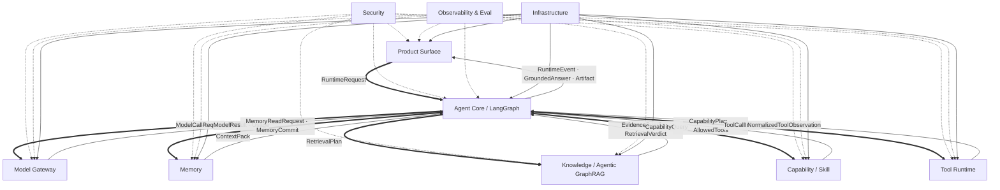
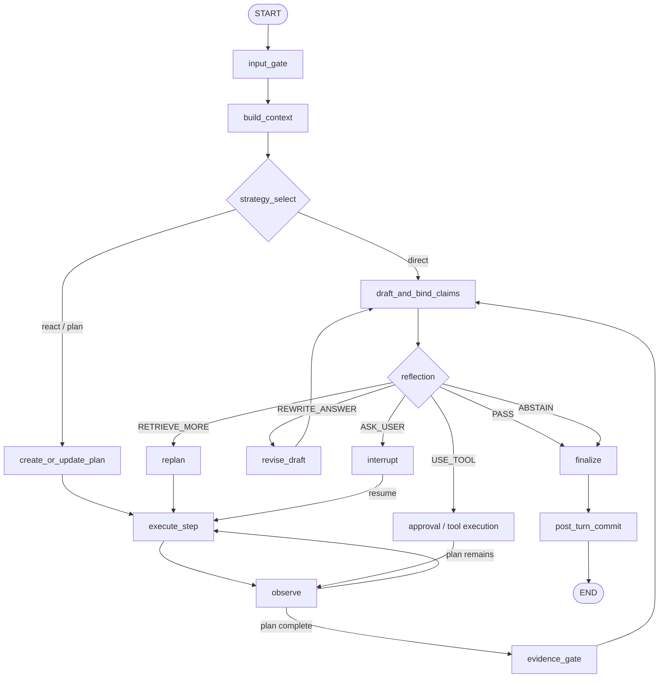
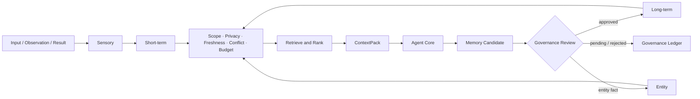
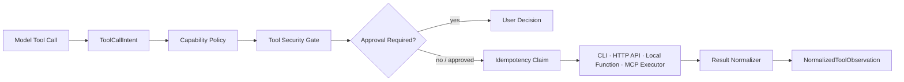

# Zuno Target Architecture Atlas

> Text-first Design Document

updated: 2026-07-11  
status: normative-short-term-target  
current_state_source: `docs/architecture/production-readiness.md`  
visual_atlas_source: `docs/architecture/architecture-views.md`

本文是 Zuno 的**目标总架构文档**。它以文字说明为主，负责讲清楚系统为什么这样设计、十一逻辑模块分别做什么、模块之间怎样协作、状态由谁持有、失败怎样表达、怎样在保持项目短小精悍的同时具备企业级成熟考虑。

Mermaid 图只用于辅助理解。完整十类视图和局部关系图由 `architecture-views.md` 维护，并通过 `architecture.html` 展示。

本文描述的是 **Target**，不是 Current。仓库当前真实实现、已知差距、blocked 原因和 measured 状态以 `docs/architecture/production-readiness.md` 为准。目标能力不得因为出现在本文或图中，就被写成当前已经完成。

当前质量口径保持：

```text
implementation available
measurement blocked
quality not yet proven
```

---

# 1. 项目定位：轻量实现，成熟设计

Zuno 的目标不是建设一个大规模、多租户、分布式的 AI 中台，而是做成一个**短小精悍的企业知识库问答与任务执行 Agent**：

- 能配置真实模型；
- 能上传常见文件并建立知识库；
- 能完成普通问答和复杂多步骤任务；
- 能使用本地 CLI、HTTP API、MCP Tool 和 Skill；
- 能通过 Agentic GraphRAG 给出可追溯引用；
- 能在任务失败时反思、重检索和重规划；
- 能保存经过治理的分层记忆；
- 能展示完整 trace、token、cost 和评测结果；
- 能进行基础脱敏、权限、输入输出检查和工具审批；
- 能在进程重启后恢复任务。

所谓“企业级成熟考虑”，指的是在设计上提前考虑：

```text
模块边界
typed contract
持久化
恢复
幂等
权限
脱敏
审计
可观测
成本
评测
失败语义
可替换适配器
```

但近期实现不追求复杂基础设施。默认形态仍是一个本地优先的模块化单体：

- FastAPI 提供产品 API；
- LangGraph 驱动 Agent Core；
- SQLite / SQLModel 保存结构化事实；
- 本地 Object Store 保存文件和 Artifact；
- 本地 BM25、Vector 和 Graph Index 提供检索；
- 简单后台 worker 处理解析和索引；
- RabbitMQ 只作为 `TaskQueuePort` 的可选适配器，不是近期运行 blocker；
- LangSmith 只作为 Trace 的可选外部 sink，本地 Trace Store 必须独立可用；
- Milvus、Neo4j、Kafka、Kubernetes、Vault、Firecracker 等只作为未来扩展边界。

设计原则可以概括为：

> **先把 Agent 自主闭环、Agentic GraphRAG、分层 Memory、真实 Tool、全链路 Trace 和基础 Security 做完整，再按实际规模替换基础设施。**

---

# 2. 总体架构

Zuno 采用 **Single Controller Agent**。一个 LangGraph Agent Core 负责状态和控制流，其他能力保持独立模块。



核心边界：

```text
LangGraph 管流程，不实现业务能力
Model Gateway 管模型，不决定任务计划
Memory 管记忆，不替代知识库
Knowledge 管证据，不保存用户偏好
Capability 管可用能力，不执行副作用
Tool Runtime 执行动作，不决定全局目标
Security 管边界，不成为任务控制器
Observability 记录事实，不伪造质量结论
Infrastructure 保存状态，不定义 Agent 策略
Product 展示和交互，不成为后端事实源
```

## 2.1 十一逻辑能力模块

1. Product Surface
2. Input
3. Knowledge
4. Model Gateway
5. Memory
6. Agent Core / Planning & Control
7. Capability
8. Tool Runtime
9. Security
10. Observability & Eval
11. Infrastructure

这十一层是逻辑边界，不代表十一个微服务。

## 2.2 六个物理运行域

| 物理运行域 | 逻辑模块映射 |
| --- | --- |
| Product & API | Product Surface |
| Input & Knowledge | Input、Knowledge |
| Agent Core Runtime | Model Gateway、Memory、Agent Core / Planning & Control；逻辑 owner 仍独立 |
| Capability & Tool | Capability、Tool Runtime |
| Governance & Observability | Security、Observability & Eval |
| Local Infrastructure | Infrastructure |

近期可以部署为一个后端进程加一个 Web 前端。物理上放在一起，不代表逻辑上可以相互绕过 contract。

---

# 3. 完整 Agent 闭环

普通 LLM 调用是“输入一次、输出一次”。Agent 必须形成：

```text
感知
-> 构建上下文
-> 选择策略
-> 规划
-> 行动
-> 获取 Observation
-> 判断质量
-> 调整计划
-> 完成目标
-> 沉淀经验
```

Zuno 的完整运行链路：

1. Product Surface 创建 `RuntimeRequest`。
2. Input Gate 进行身份、scope、敏感信息和 prompt injection 检查。
3. Context Builder 组合最近对话、TaskState、Memory、Entity facts、knowledge scope 和 tool constraints。
4. Strategy Selector 选择 Direct、Retrieval-first、ReAct 或 Plan-and-Execute。
5. Planner 为复杂任务生成带依赖和验收条件的 `PlanState`。
6. Executor 执行 Model、Knowledge、Tool 或单步 ReAct。
7. Observation Normalizer 将所有结果统一成 `NormalizedObservation`。
8. Evidence Gate 判断证据覆盖、来源版本、矛盾和支持度。
9. Grounded Synthesis 生成 draft、claims 和 citation bindings。
10. Reflection 返回 `PASS`、`REWRITE_ANSWER`、`RETRIEVE_MORE`、`USE_TOOL`、`ASK_USER` 或 `ABSTAIN`。
11. Replan 修改真实后续步骤并再次执行。
12. Finalize 形成 `GroundedAnswer`、Artifact、Citation 和最终 RuntimeEvent。
13. Post-turn Commit 写入 task summary、Memory candidate、usage、cost 和 trace。



所有循环必须有硬限制，包括最大步骤、最大检索轮次、单步最大 action、最大 token、最大费用、最大时长和最大副作用次数。

---

# 4. 十一模块目标设计

## 4.1 Product Surface

### 模块目标

Product Surface 是用户和系统交互的入口，最终包括：

```text
AgentChat
Workspace
Knowledge Space
File Upload
Parse / Index Status
Task Timeline
Approval UI
Citation UI
Artifact
Trace Viewer
Feedback
Model Configuration
```

它负责收集用户输入、创建任务、展示实时事件、处理审批、展示回答与引用、查看 Trace 和提交反馈。

### 近期精简实现

- 一个 Web 前端；
- Completion 与 Workspace 两类入口；
- SSE 展示 runtime event；
- Workspace 页面展示文件、索引状态、任务、Artifact 和 Citation；
- Approval 对话框支持 approve / deny；
- Trace 页面先展示节点、模型、检索、工具、token、cost 和错误；
- 刷新后根据 `task_id/run_id` 从后端恢复状态。

### 成熟设计考虑

- 前端不保存业务事实；
- API 使用 typed DTO；
- 所有状态具有稳定 error code；
- Artifact 与 Citation 可版本化；
- 用户反馈能够回到 Eval case 和 regression set；
- Completion 和 Workspace 使用同一个 Runtime，而不是两套 Agent 实现。

### 核心 contract

```text
CompletionRequest
WorkspaceTaskRequest
RuntimeRequest
RuntimeEvent
ApprovalDecision
GroundedAnswer
ArtifactRef
CitationView
TraceSummary
FeedbackRequest
```

### 完成标准

Workspace 生成的 Artifact 和 Completion 返回的答案都来自统一 Runtime final state。前端刷新、服务重启和审批恢复不丢失任务。

---

## 4.2 Input

### 模块目标

Input 把 File、URL、Text 和 Image 转换成可版本化、可重建、可定位的标准内部表示。

目标流程：

```text
File / URL / Text / Image
-> SourceObject
-> MIME Detection
-> Parser Routing
-> ParseJob
-> CanonicalDocumentIR
-> DocumentVersion
-> SourceSpan
-> IndexHandoffPayload
```

### 支持的输入类型

近期目标支持常见企业资料即可：

- PDF；
- DOCX；
- PPTX；
- XLSX / CSV；
- Markdown / TXT；
- HTML；
- 常见代码文件；
- 图片型 PDF 或图片通过 OCR/VLM adapter 处理。

不要求一开始支持所有格式，也不要求每种格式达到复杂版面恢复。关键是：解析结果必须统一进入 `CanonicalDocumentIR`，并保留 `SourceSpan`。

### SourceSpan

```text
PDF: page + bbox + char range
DOCX: section + paragraph
PPTX: slide + bbox
XLSX: sheet + cell range
Markdown / Code: section path + line range
HTML: selector / DOM path
```

### 异步设计

Input 和 Indexing 可能耗时，必须支持异步任务，但近期不需要强依赖 RabbitMQ。

定义统一 `TaskQueuePort`：

```text
TaskQueuePort
├─ InProcessQueueAdapter      默认开发模式
├─ LocalWorkerQueueAdapter    默认本地生产模式
└─ RabbitMQAdapter            可选扩展
```

上传后 API 先保存 `SourceObject` 和 `ParseJob`，后台 worker 领取任务并更新状态。任务必须幂等，重复提交同一 source version 不应生成重复索引。

### 成熟设计考虑

- parser adapter 可插拔；
- 原始文件和解析版本分离；
- ParseJob 有 queued/running/completed/blocked/failed；
- 支持取消、重试和错误原因；
- OCR、Office parser 和远程 parser 都是 adapter，不影响 IR contract；
- RabbitMQ 只替换 queue adapter，不修改业务流程。

### 核心 contract

```text
SourceObject
ParseJob
ParseSnapshot
CanonicalDocumentIR
DocumentBlock
DocumentTable
DocumentFigure
SourceSpan
IndexHandoffPayload
```

### 完成标准

常见文件能够上传、异步解析、生成 Document IR、进入索引，并从最终 Citation 回到原始文件位置。

---

## 4.3 Knowledge：Agentic GraphRAG

### 模块目标

Knowledge 负责外部知识事实的索引、检索、融合、重排、图扩展和证据追踪。它不保存用户偏好，也不负责规划整个任务。

离线阶段：

```text
CanonicalDocumentIR
-> Parent Chunk / Citation Chunk
-> Embedding
-> BM25 Index
-> Vector Index
-> Entity / Relation Extraction
-> Graph Index
-> IndexManifest
```

在线阶段：

```text
NeedRetrievalDecision
-> Query Strategy
-> BM25 / Vector / Graph
-> RRF Fusion
-> Rerank
-> Parent / Neighbor Expansion
-> EvidenceLedger
-> Retrieval Quality Gate
-> Corrective Action
```

### Agentic Retrieval 策略

根据问题和失败类型选择：

- Direct Query；
- Query Rewrite；
- Multi Query；
- Step-back Query；
- HyDE；
- Entity Decomposition；
- Relation Query；
- Graph Neighbor Expansion；
- Source Diversification。

策略生成可以先使用轻量规则加模型调用，后续再优化 planner。不能只在原 query 后拼接固定字符串，就声称实现了 HyDE 或 Step-back。

### 多路召回与 GraphRAG

近期无需强依赖大型图数据库。可采用：

- 本地 BM25；
- 本地向量索引；
- SQLite / 文件化轻量 entity-relation graph；
- RRF 融合；
- heuristic 或模型 rerank；
- parent / neighbor expansion。

未来规模增长后，可以通过 adapter 替换为 Elasticsearch、Milvus、Qdrant 或 Neo4j，不改变 `RetrievalPlan` 与 `EvidenceBundle`。

### EvidenceLedger

核心不是返回一组文本，而是保存每轮检索证据：

```python
class EvidenceLedgerRecord:
    evidence_id: str
    document_id: str
    document_version: str
    source_span: SourceSpan
    retrieval_round: int
    query_id: str
    query_strategy: str
    retriever: str
    raw_score: float
    fusion_score: float | None
    rerank_score: float | None
    graph_path: list[str]
    selection_reason: str
    trace_span: str
    text: str
```

Evidence 必须可以回到不可变 DocumentVersion 和 SourceSpan。无法回到原文的 Graph fact 不能用于 strict citation。

### Corrective Retrieval

当检索质量不足时，返回 failure bucket：

```text
document_miss
text_miss
entity_miss
relation_miss
contradiction
stale_index
acl_denied
no_candidate
```

Agent Core 根据 bucket 生成下一轮 `RetrievalPlan`。达到预算或仍无证据时，应 Ask User 或 Abstain，而不是编造答案。

### 核心指标

- Recall@K；
- Precision@K；
- MRR / nDCG；
- rerank gain；
- source coverage；
- citation accuracy；
- unsupported claim rate；
- retrieval rounds；
- latency；
- token 和 cost。

### 完成标准

真实 PDF 能走通：

```text
parse
-> index
-> first retrieval
-> corrective retrieval
-> EvidenceLedger
-> claim binding
-> page citation
-> grounded answer
```

---

## 4.4 Model Gateway

### 模块目标

Model Gateway 是所有模型调用的唯一入口，统一处理 Chat、Embedding、Reranker、VLM 和 Eval Judge。

Agent 角色至少包括：

```text
Planner
Executor
Tool Call
Critic
Synthesis
Query Rewrite
Memory Extraction
Eval Judge
```

### 近期精简实现

- 支持 1 个真实远程 provider 和 1 个本地 OpenAI-compatible provider；
- 支持用户配置 base URL、model name 和 credential ref；
- 支持 chat、embedding 和 reranker slot；
- 支持 timeout、一次 retry、fallback 和 structured output；
- 记录 token、cost、latency、provider、model 和 fallback；
- Mock provider 仅用于测试和 demo mode。

### 成熟设计考虑

- `ModelSlotBinding` 按 Workspace/Dialog 绑定 Planner、Executor、Critic、Synthesis、Embedding、Reranker；
- provider adapter 可替换；
- 统一预算和并发限制；
- prompt redaction；
- streaming；
- schema validation；
- fallback 不得静默；
- 选型考虑合规、成本、延迟和能力，而不是只看 benchmark。

### 核心 contract

```text
ModelDefinition
ModelSlotBinding
ModelCallRequest
ModelResult
UsageRecord
FallbackDecision
ModelError
```

业务模块禁止直接实例化 OpenAI、Anthropic、ChatOpenAI 或旧 ModelManager。

### 完成标准

Planner、ReAct、Critic、Synthesis、Query Rewrite、Embedding 和 Rerank 都从 Gateway 获取模型，并在 Trace 中看到真实 usage。

---

## 4.5 Memory 与 Context 管理

### 模块边界

必须区分：

```text
Context != Memory
Memory != Knowledge
Chat History != Long-term Memory
LangGraph State != Memory Database
```

- LangGraph State：当前 run 的控制状态；
- ContextPack：当前模型调用的预算化只读视图；
- Memory：跨轮、跨任务可治理的经验和事实；
- Knowledge：来自文档和外部来源的证据。

### 四层 Memory

#### Sensory Memory

原始短期信号：用户输入、模型输出、Tool Observation、Retrieval Observation、系统事件和错误事件。生命周期短，主要用于 trace、压缩和候选提取，不直接全部进入 prompt。

#### Short-term Memory

当前任务工作记忆：目标、PlanState、当前步骤、recent window、Evidence Summary、未完成事项和本轮约束。主要位于 AgentRuntimeState 和 Task Summary。

#### Long-term Memory

- Episodic：发生过什么；
- Semantic：稳定事实和偏好；
- Procedural：怎样做、什么策略有效。

#### Entity Memory

保存 User、Project、Workspace、Company、Document、Preference、Relation、Effective Time、Confidence 和 Source。结构化 Entity fact 是权威事实源，Semantic Memory 只是其语义检索表示。

### ContextPack

```python
class ContextPack:
    user_goal: str
    system_policy: list[str]
    recent_window: list[MessageSummary]
    task_state: TaskStateSummary
    selected_memories: list[MemoryItem]
    entity_facts: list[EntityFact]
    knowledge_scope: list[str]
    evidence_summary: list[str]
    tool_constraints: list[str]
    output_contract: dict
    exclusion_reasons: list[ContextExclusion]
    token_budget: int
```

ContextPack 必须记录选了什么、为什么选、排除了什么、是否过期、是否冲突和来源。

### Active 与 On-demand Retrieval

Active Retrieval 每轮读取：

- 用户偏好；
- 当前项目；
- 最近任务；
- 未完成事项；
- 高置信 Entity Fact；
- approved Procedural Memory。

On-demand Retrieval 只在 Agent 需要时查询类似历史任务、旧决策、故障经验和实体关系。

### Memory 生命周期

```text
Capture
-> Normalize
-> Classify
-> Redact
-> Deduplicate
-> Score
-> Candidate
-> Governance Review
-> Store
-> Retrieve
-> Rank
-> ContextPack
-> Consolidate / Decay / Revoke / Delete
```



### Reflexion

Reflexion 不是保存完整思维链，而是生成可审计经验：

```text
task type
failure type
trigger
root cause summary
failed action
lesson
recommended strategy
applicability conditions
confidence
trace refs
review status
```

只有 approved candidate 才能进入长期记忆。

### 近期精简实现

- SQLite Memory Store；
- recent window 和 task summary；
- semantic/procedural memory；
- Entity fact 基础表；
- candidate + approve/reject；
- 简单 relevance/recency/confidence 排序；
- token budget 和 exclusion reason；
- privacy delete 和 revoke。

### 完成标准

请求 A 产生经验，经审批后写入；服务重启后请求 B 能读取该经验，并对 Strategy 或 Plan 产生可证明影响。

---

## 4.6 Agent Core / Planning & Control

### 模块目标

Agent Core 是 Single Controller 的大脑，负责：

```text
Runtime State
Input Gate orchestration
Context Builder
Strategy Selector
Planner
Plan Validator
Plan Executor
Step Executor Registry
ReAct Step Controller
Observation Normalizer
Evidence Gate
Reflection Engine
Replan Engine
Grounded Synthesis
Finalization Controller
Reflexion Bridge
Budget / Stop Controller
Interrupt / Resume
```

### Plan-and-Execute

负责宏观任务拆解：

```text
目标
步骤
依赖
顺序
验收条件
允许能力
预算
风险
停止条件
```

简单任务不需要强制规划；复杂任务才生成多步 Plan。Plan 可以先是有序步骤，未来需要时再升级 DAG。

### ReAct

负责一个 PlanStep 内部的：

```text
Reason summary
-> Action decision
-> Knowledge / Tool / Model action
-> Observation
-> Acceptance check
-> next action or complete
```

ReAct 只控制当前步骤，不控制整个任务。模型只负责决策和结构化 ToolCall，宿主代码负责真实执行。

### Reflection

检查：

- 当前步骤是否满足验收条件；
- 证据是否充分；
- 是否存在 unsupported claims；
- 工具是否失败；
- 用户约束是否满足；
- 安全门是否阻止；
- 是否超出预算。

### Replan

真正修改后续执行轨迹：

- 换 Query Strategy；
- 增加 Retrieval Round；
- 更换 Retriever Mix；
- 增加 Tool Step；
- 删除无效步骤；
- 修改验收条件；
- 调整模型角色；
- Ask User 或 Abstain。

### Reflexion

任务完成或失败后，将经验作为 Memory candidate 提交治理，不直接写入长期记忆。

### Runtime State

```python
class AgentRuntimeState:
    run_id: str
    task_id: str
    thread_id: str
    workspace_id: str
    user_id: str
    trace_id: str

    request: RuntimeRequest
    context_pack: ContextPack
    strategy: StrategyDecision
    plan_state: PlanState
    current_step_id: str | None

    observations: list[NormalizedObservation]
    evidence_ledger_ref: str | None

    draft_answer: str | None
    claims: list[StructuredClaim]
    claim_bindings: list[ClaimEvidenceBinding]
    unsupported_claims: list[str]
    reflection: ReflectionResult | None

    counters: RuntimeCounters
    limits: RuntimeLimits
    pending_interrupt: PendingInterrupt | None
    final_answer: GroundedAnswer | None
    failure: RuntimeFailure | None
```

完整文档、Embedding、Evidence 文本、Tool binary 和 Artifact binary 只保存引用。

### 近期精简实现

- 一个 compiled LangGraph；
- direct、retrieval-first、ReAct、Plan-and-Execute 四种策略；
- 单步 ReAct；
- deterministic gate + 可选 critic model；
- SQLite checkpoint；
- approval interrupt/resume；
- live SSE event；
- RuntimeLimits；
- GroundedAnswer 正式 state。

### 完成标准

LangGraph 是唯一产品主 controller，Completion 与 Workspace 不再同时跑旧 durable runtime、sidecar runtime 和独立完成链路。

---

## 4.7 Capability

### 模块目标

Capability 回答：

> Agent 具备什么能力，当前任务允许使用什么能力？

它管理：

```text
Capability Registry
CapabilityCard
SkillCard
ToolCard
MCP Server Card
Capability Policy
Capability Router
Progressive Loader
```

### 概念边界

- Capability：抽象能力，例如 `search_knowledge`；
- Tool：原子动作，例如 `filesystem.read`；
- Skill：带 instruction、resources、templates、required tools 和 acceptance criteria 的复用流程；
- MCP：Agent 与外部工具/资源之间的标准协议；
- Function Calling：模型输出结构化工具意图的语言形式。

可以理解为：

```text
Function Calling = 模型表达调用意图的格式
MCP = 工具箱和资源接入协议
Skill = 如何完成一类任务的操作手册
Capability = Agent 能力目录和选择层
Tool Runtime = 真正执行动作的宿主
```

### Progressive Loading

模型不能一次看到所有工具和 Skill：

```text
Task
-> Capability Router
-> 选择少量 Capability
-> 加载 Skill metadata
-> 必要时加载 instruction / resource
-> 提供 AllowedTools schema 给 ReAct
```

### 近期精简实现

- 文件型 Capability/Skill registry；
- 3 到 8 个能力的动态选择；
- Skill markdown + resource/template；
- 本地 Tool 和 MCP Tool 统一 manifest；
- Capability policy 根据 workspace、安全和副作用过滤。

### 完成标准

PlanStep 只能看到当前允许的 capabilities 和 tools，不能使用未授权或未加载的工具。

---

## 4.8 Tool Runtime

### 模块目标

Tool Runtime 将模型产生的 `ToolCallIntent` 转换成受治理的真实动作。



### 工具类型

近期支持：

- 本地 Python function；
- 本地 CLI 命令；
- HTTP API；
- Workspace file read/write；
- calculator / JSON / text transform；
- MCP tools/resources；
- Skill 组合出的多步工具流程。

### 运行边界

模型只输出结构化 ToolCall，不直接执行代码、访问网络或读取 secret。宿主代码负责：

```text
schema validation
allowlist
approval
credential ref
workspace path scope
network policy
timeout
cancel
retry
idempotency
atomic write
audit
result normalization
```

### 近期精简实现

- 真实安全 `filesystem.read`；
- 经审批的 `filesystem.write`；
- calculator/transform；
- 一个 HTTP API Tool；
- 一个 MCP server adapter；
- CLI 只允许 manifest 注册的命令和参数；
- 不需要一开始建设复杂容器 sandbox。

### 成熟设计考虑

未来可接 Vault、容器 sandbox、网络代理和远程 worker，但 `ToolRuntimeRequest` 与 `NormalizedToolObservation` 不变。

### 完成标准

真实 ReAct 能执行工具、等待审批、进程重启后恢复，并通过 idempotency 保证副作用只发生一次。

---

## 4.9 Security

### 模块目标

Security 是横切能力，与 Observability 紧密协作。每次安全决策都必须进入 Trace 和 Audit，而不是只返回一个布尔值。

### 七类 Gate

1. Input Gate：身份、scope、PII、secret、prompt injection；
2. Retrieval Gate：ACL、cross-workspace、stale version、untrusted instruction；
3. Memory Gate：scope、privacy、expired/revoked/conflict record；
4. Model Context Gate：发送给模型前的脱敏和敏感信息过滤；
5. Tool Gate：allowlist、arguments、side effect、approval、credential、path、network；
6. Output Gate：unsupported claim、敏感泄露、citation coverage、unsafe content；
7. Artifact Gate：文件类型、路径、大小、敏感内容和发布权限。

### 近期精简实现

- regex + structured field 的 PII/secret redaction；
- Workspace ACL；
- retrieval chunk 中的 instruction sanitization；
- Tool allowlist 和 side-effect approval；
- 输出敏感词、secret 和 unsupported claim 检查；
- Artifact path containment；
- 安全事件关联 run_id、trace_id、user_id 和 workspace_id。

### 成熟设计考虑

未来可以替换为 DLP、企业身份、Vault 和更强策略引擎，但近期不需要建设复杂安全平台。

### 核心 contract

```text
GateRequest
GateDecision
PolicyReason
RedactionRecord
AuditEvent
SecurityFailure
```

### 完成标准

任何被阻止的输入、检索、Memory、Tool、输出和 Artifact 都能在 Trace Viewer 中看到原因、位置和处理动作。

---

## 4.10 Observability & Eval

### 模块目标

Observability 记录 Agent 全链路发生了什么；Eval 判断它做得好不好。

一次 Agent Run 的 Trace Tree：

```text
agent_run
├─ input_gate
├─ context_build
│  └─ memory_retrieval
├─ strategy
├─ planner_model
├─ plan_validation
├─ execute_step
│  ├─ model_call
│  ├─ retrieval_round
│  │  ├─ query_rewrite
│  │  ├─ bm25
│  │  ├─ vector
│  │  ├─ graph
│  │  ├─ fusion
│  │  └─ rerank
│  └─ tool_call
├─ evidence_gate
├─ reflection
├─ synthesis_model
├─ citation_binding
├─ output_gate
└─ memory_commit
```

### Trace 字段

每个 span 至少记录：

```text
start / end
status
input / output refs
model / provider
token input / output
cost
latency
retry / fallback
failure bucket
security decision
evidence refs
tool id
memory refs
```

### 本地 Trace 与 LangSmith

本地 Trace Store 是事实源，保证离线可查看。定义 `TraceSinkPort`：

```text
TraceSinkPort
├─ SQLiteTraceSink          默认
├─ JSONL / File Sink        调试
└─ LangSmithTraceSink       可选
```

接入 LangSmith 时，发送的是经过脱敏的 span，不把 LangSmith 作为系统可运行的强依赖。

### Eval 分层

#### 模块级

- parser success / structure accuracy；
- retrieval Recall@K、MRR、nDCG；
- memory relevance；
- tool success；
- security precision / false positive。

#### Agent Runtime 级

- plan completion；
- replan success；
- tool completion；
- grounded claim rate；
- citation support；
- unsupported claim rate；
- recovery success。

#### 产品 Release 级

- answer correctness；
- citation accuracy；
- latency；
- token；
- cost；
- task completion；
- user feedback。

### Measurement Semantics

严格区分：

```text
implementation available
runtime observed
measurement blocked
measured pass / fail
quality proven / not proven
```

外部数据库或模型不可用时输出 blocked report，不能 fake measured。

### 完成标准

standard_rag、deep_graphrag 和 agentic_graphrag 使用相同 case IDs、index version、模型和 runtime config，能够比较 Recall、correctness、citation、latency、token 和 cost。

---

## 4.11 Infrastructure

### 模块目标

Infrastructure 提供本地可恢复的事实存储和运行支撑，但不决定 Agent 策略。

近期组成：

```text
SQLite / SQLModel
Local Object Store
TaskQueuePort
Local Parse / Index Worker
LangGraph Checkpoint Store
Runtime Event Store
Memory Store
EvidenceLedger Store
Artifact Store
BM25 / Vector / Graph Index
Configuration
Migration
Health Check
```

### 异步任务

默认使用简单后台 worker 或本地任务队列。只要 `TaskQueuePort` 稳定，未来可以替换 RabbitMQ，不需要提前拆微服务。

### 持久化原则

- Workspace scoped；
- User scoped；
- schema versioned；
- atomic write；
- idempotent；
- migration 可追踪；
- 不使用 pickle 保存关键事实；
- 不允许 class-level dict 成为业务真相源；
- 临时缓存可以丢失，但 Run、Checkpoint、Memory、Evidence、Approval 和 Artifact 不可丢失。

### 恢复场景

```text
Run starts
-> Tool approval interrupt
-> Process exits
-> New process uses same DB
-> Load LangGraph checkpoint
-> Resume correct node
-> Tool executes once
-> Final answer, artifact and trace preserved
```

### 未来扩展

- RabbitMQ / Redis queue；
- PostgreSQL；
- Qdrant / Milvus；
- Neo4j；
- Object Storage；
- distributed worker。

这些是 adapter 替换，不应改变核心领域 contract。

---

# 5. 模块间核心 contract

| 调用方 | 被调用方 | 请求 | 返回 |
| --- | --- | --- | --- |
| Product Surface | Agent Core | `RuntimeRequest` | `RuntimeEvent`、`GroundedAnswer`、`ArtifactRef` |
| Agent Core | Model Gateway | `ModelCallRequest` | `ModelResult`、`UsageRecord` |
| Agent Core | Memory | `MemoryReadRequest`、`MemoryCommit` | `ContextPack`、Memory refs |
| Agent Core | Knowledge | `RetrievalPlan` | `EvidenceBundle`、`RetrievalVerdict` |
| Agent Core | Capability | `CapabilityQuery` | `CapabilityPlan`、`AllowedTools` |
| Agent Core | Tool Runtime | `ToolCallIntent`、`ToolRuntimeRequest` | `NormalizedToolObservation` |
| Input | Knowledge | `CanonicalDocumentIR`、`IndexHandoffPayload` | `IndexManifest` |
| 各模块 | Security | `GateRequest` | `GateDecision`、`AuditEvent` |
| 各模块 | Observability | Span/Event payload | `TraceRef` |
| 各模块 | Infrastructure | typed record | durable handle |

所有 connector 必须可序列化、可版本化、可追踪。模块之间不能通过共享可变全局变量交换业务事实。

---

# 6. 关键数据与事实源

## 6.1 产品事实

```text
Workspace
Session
Task
Message
Artifact
Approval
Feedback
ModelSlotBinding
```

由 Product/API 和数据库模型拥有。

## 6.2 文档与证据事实

```text
SourceObject
-> DocumentVersion
-> CanonicalDocumentIR
-> DocumentBlock
-> SourceSpan
-> CitationChunk
-> IndexManifest
-> EvidenceLedger
-> ClaimEvidenceBinding
-> Citation
```

严格 Citation 必须指向不可变 DocumentVersion 和 SourceSpan。

## 6.3 Runtime 事实

```text
AgentRun
Checkpoint
RuntimeEvent
PlanVersion
NormalizedObservation
Interrupt
ToolExecutionClaim
GroundedAnswer
```

## 6.4 Memory 事实

```text
RawMemoryEvent
TaskSummary
MemoryCandidate
GovernanceRecord
ApprovedMemory
EntityFact
```

撤销、删除和冲突解决都必须留下治理记录。

---

# 7. Current、Target 与 Future Optional

## Current

只写代码、测试和可复现运行已经证明的事实，详见 `production-readiness.md`。

## Target

本文定义近期理想架构。Target 完成必须有真实 provider、真实工具、持久 Memory、原生 checkpoint、统一产品路径和 measured benchmark，不能只存在 class、mock 或 fixture。

## Future Optional

可以扩展：

- RabbitMQ / Kafka；
- PostgreSQL；
- Milvus / Qdrant；
- Neo4j；
- Vault；
- container sandbox；
- enterprise SSO；
- distributed workers；
- Multi-Agent；
- fully offline Mermaid vendor。

这些不应成为近期 blocker。

---

# 8. 代码 Ownership

| 逻辑能力 | 近期代码 owner |
| --- | --- |
| Product Surface | `apps/web`、`src/backend/zuno/api` |
| Input | `src/backend/zuno/knowledge/ingestion` |
| Knowledge | `src/backend/zuno/knowledge` |
| Model Gateway | `src/backend/zuno/platform/model_gateway.py` 及 provider adapters |
| Memory | `src/backend/zuno/memory` |
| Agent Core | `src/backend/zuno/agent` |
| Capability | `src/backend/zuno/capability` catalog/skill/router |
| Tool Runtime | `src/backend/zuno/capability` tool control/executors |
| Security | `src/backend/zuno/platform/security` |
| Observability & Eval | `src/backend/zuno/platform/observability`、`tools/evals/zuno` |
| Infrastructure | `src/backend/zuno/platform/database`、storage、queue、index/checkpoint adapters |

Knowledge、Memory 和 Capability 不得反向依赖 Product UI；Agent Core 不得绕过 Gateway 或 Tool Runtime。

---

# 9. Target completion criteria

目标架构完成时必须满足：

1. 十一模块都有唯一 owner、typed contract、failure semantics、持久化和 focused tests。
2. LangGraph 是唯一产品主运行时，支持 native checkpoint、interrupt/resume 和 live SSE。
3. Product 默认使用真实 Model Gateway，不使用 Mock 作为正常回答路径。
4. Input 支持常见文件和简单异步任务，RabbitMQ 可以通过 adapter 接入但不是强依赖。
5. Memory 跨请求、跨重启持久化，并证明 approved Reflexion lesson 被未来任务复用。
6. Knowledge 提供真实 Corrective Agentic GraphRAG、EvidenceLedger 和 SourceSpan Citation。
7. Capability 动态选择 Skill、MCP 和 AllowedTools；Tool Runtime 能执行真实 CLI/API/文件工具。
8. Security 与 Observability 覆盖关键模块，脱敏、输入输出检查、审批和审计可查看。
9. Trace 能记录模型、检索、Memory、Tool、token、cost、failure bucket，并可选接入 LangSmith。
10. Completion、Workspace、Artifact、Citation 和 Trace 使用同一 Runtime 事实源。
11. fixed paired benchmark 产生 measured pass/fail；阻塞时诚实保持 quality not proven。

---

# 10. Architecture Visual Atlas

完整十类架构图不再堆放在本文件中，统一维护于：

- Mermaid 图源：`docs/architecture/architecture-views.md`
- HTML 图谱：`docs/architecture/architecture.html`

HTML 必须展示：

```text
4+1 View Model
  1 Logical View
  2 Development View
  3 Process View
  4 Physical View
  5 Scenarios View

Views & Beyond
  6 Module View
  7 Component-and-Connector View
  8 Data View
  9 Quality View

Zuno Product Core
  10 Agentic GraphRAG Evidence and Agent Loop
```

每类包含一张 Overall 图和至少两张 Local 图。Markdown 负责解释架构，HTML 负责看图。
