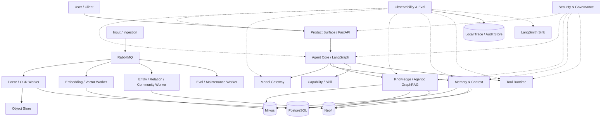
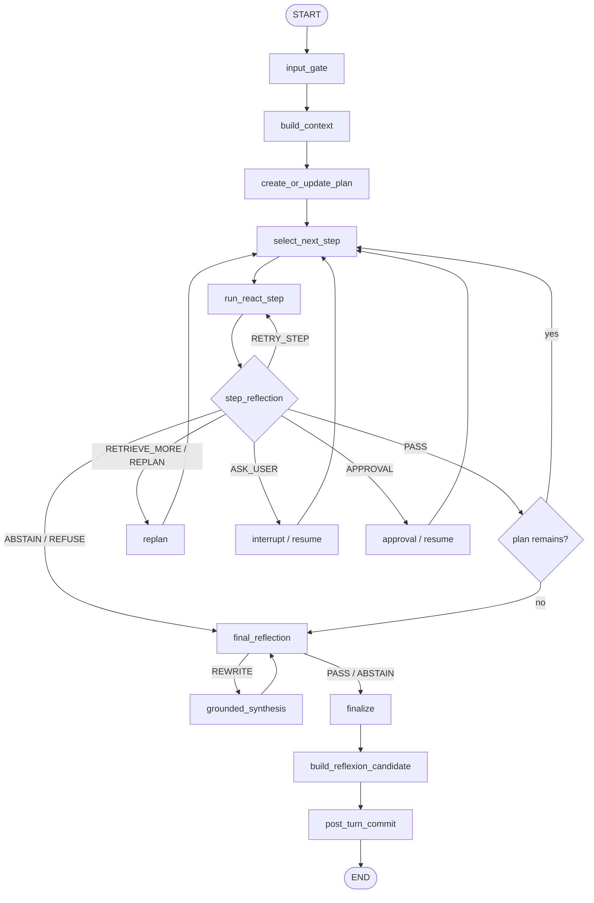
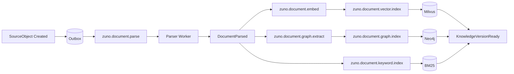
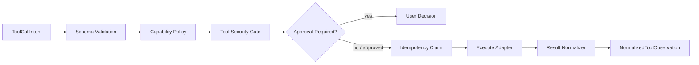

# Zuno Target Architecture Atlas

> Implementation-Level Event-Driven Agentic GraphRAG Specification

updated: 2026-07-11  
status: normative-target-architecture  
document_role: architecture-to-program source of truth  
current_state_source: `docs/architecture/production-readiness.md`  
visual_atlas_source: `docs/architecture/architecture-views.md`

本文是 Zuno 的**实施级目标架构规范**。它不仅说明系统“长什么样”，还必须能够直接驱动后续 Program、Phase、代码所有权、数据库迁移、集成测试、架构 HTML 和完成验收。

本文描述的是 **Target**，不是 Current。仓库当前真实实现、已知差距、blocked 原因、runtime observed 状态和 measured 结果，以 `docs/architecture/production-readiness.md` 为事实源。任何目标能力不得仅因出现在本文、依赖文件、Docker Compose、配置文件、接口骨架或测试替身中，就被描述为已经完成。

## 0.1 文档同步规则

- `docs/architecture/architecture.md` 是对外目标架构文字事实源；
- `.agent/architecture/architecture.md` 是 Agent 工作区同步镜像；
- 两个文件必须保持字节级等价；
- 修改任意一侧时，必须在同一轮变更中同步另一侧；
- `docs/architecture/architecture-views.md` 维护图形化架构视图；
- `docs/architecture/architecture.html` 展示架构图与摘要；
- `docs/architecture/production-readiness.md` 维护 Current、Gap、Blocked 和 Measurement；
- `.agent/programs/` 中的 Program 必须引用本文的稳定 Requirement ID。

## 0.2 本文如何驱动 Program

每个新 Program 必须从本文选择一组 Requirement ID，并为每个 Requirement 明确：

```text
requirement_ids
owner_paths
allowed_changes
forbidden_changes
database_migrations
event_contract_changes
api_contract_changes
focused_tests
integration_tests
eval_proof
docs_and_html_sync
rollback_strategy
completion_evidence
```

Program 不得只写“完善 Agent”“接入 Milvus”这类模糊目标。Phase 必须能回答：

1. 改哪个 Owner；
2. 引入或修改什么 Contract；
3. 谁保存事实；
4. 失败如何表达；
5. 如何恢复；
6. 如何观测；
7. 用什么测试证明；
8. 什么情况下仍必须写成 blocked。

---

# 1. 项目定位与架构目标

Zuno 的目标是建设一个面向企业私有知识、复杂任务执行和个人 Agent Workspace 的：

> **基于 LangGraph 的事件驱动 Agentic GraphRAG Runtime。**

核心技术定位：

- **LangGraph**：在线 Agent 控制平面；
- **Plan、ReAct、Reflection、Replan、Reflexion**：完整任务生命周期；
- **RabbitMQ**：文档处理、索引、评测、记忆整理和长任务的异步数据平面；
- **PostgreSQL**：事务事实源；
- **Milvus**：知识和长期记忆的语义向量索引；
- **Neo4j**：实体关系、图扩展、社区和多跳推理引擎；
- **BM25**：关键词精确召回；
- **Object Store**：原始文件、解析快照和 Artifact；
- **LangSmith-compatible sink**：外部 Trace 与 Eval；
- **本地 Trace/Audit Store**：系统独立运行和审计的事实源。

Zuno 不以“安装了多少组件”作为完成标准。所有组件必须通过稳定 Contract 真实参与主链路，并由测试、Trace、故障注入和固定评测集证明其行为。

## 1.1 核心能力目标

```text
统一 Agent Runtime
多格式文档摄取
异步索引流水线
BM25 + Milvus + Neo4j 混合检索
Corrective Agentic GraphRAG
严格 Evidence / Claim / Citation 绑定
分层 Memory 与 Reflexion
Capability / Skill / MCP 渐进加载
受治理 Tool Runtime
全链路 Security Gate
Checkpoint / Interrupt / Resume
本地 Trace + LangSmith
固定 Benchmark 与 Release Gate
```

## 1.2 设计原则

```text
Agent 自主，但控制边界明确
流程动态，但状态可恢复
组件深度融合，但领域层不绑定厂商 SDK
知识可检索，但答案必须回到证据
记忆可积累，但必须经过治理
工具可执行，但副作用必须审批和幂等
消息可重试，但业务事实只由数据库确认
索引可丢失，但必须能够从事实源重建
能力可观测，但不得伪造质量结论
默认单控制器，避免多 Agent 复杂度提前扩散
```

## 1.3 非目标

近期不追求：

- 以微服务数量体现成熟度；
- 让每个 LangGraph 节点都通过 RabbitMQ 调度；
- 保存模型隐藏思维链；
- 把 Milvus、Neo4j、Redis 或 RabbitMQ 当成事务事实源；
- 把 LangSmith 当成安全执行模块；
- 保留多套互相竞争的 Agent Controller；
- 默认建设产品级 Multi-Agent Runtime；
- 在 fixed benchmark 完成前宣称 Agentic GraphRAG 优于标准 RAG；
- 在没有真实恢复测试时宣称“支持持久化恢复”；
- 在只有 SDK Adapter 时宣称“深度融合完成”。

---

# 2. 质量属性与架构约束

## 2.1 质量属性场景

| ID | 质量属性 | 场景 | Target Response |
| --- | --- | --- | --- |
| QA-REL-001 | 可靠性 | Worker 在 Milvus 写入后、ACK 前崩溃 | 消息重投，InboxDedup 与 IndexManifest 阻止逻辑重复 |
| QA-REC-001 | 可恢复性 | Tool Approval 等待期间后端重启 | 从 PostgreSQL Checkpoint 恢复到正确节点，副作用未重复 |
| QA-SEC-001 | 隔离 | 用户查询命中其他 Workspace 的向量或图节点 | Storage Filter 和 Retrieval Gate 双重拒绝，并写 Audit |
| QA-OBS-001 | 可观测性 | 回答错误，需要定位是规划、检索还是生成失败 | Trace Tree 能关联 PlanVersion、RetrievalRound、Evidence 和 ModelCall |
| QA-PERF-001 | 延迟 | 普通知识问答 | 在线控制路径不经 RabbitMQ；检索、rerank 和 synthesis 有独立预算 |
| QA-SCALE-001 | 扩展性 | 文档批量导入造成解析峰值 | RabbitMQ 削峰，Worker 独立扩容，API 保持可用 |
| QA-MOD-001 | 可替换性 | Milvus 或 Neo4j 需要更换 | Domain Contract 不变，仅替换 Adapter 和迁移 Program |
| QA-EVAL-001 | 可评测性 | 比较 standard、graph、agentic 三种模式 | 使用相同 case、corpus、index version、model config 和 judge policy |
| QA-COST-001 | 成本 | Reflection/Replan 产生过多模型调用 | RuntimeBudget、最大轮数和 Role Model Slot 限制 |
| QA-AUDIT-001 | 审计 | Tool 修改文件或调用外部 API | Approval、IdempotencyClaim、ToolObservation 和 AuditEvent 完整关联 |

## 2.2 强制架构约束

- Agent Runtime 默认采用 **Single Controller**；
- PostgreSQL 是结构化事实源；
- Object Store 是大型不可变内容事实源；
- RabbitMQ 使用 at-least-once delivery，Consumer 必须幂等；
- Milvus 与 Neo4j 必须可重建；
- 所有跨模块调用使用 typed Contract；
- 所有持久化对象必须带 Workspace Scope；
- 所有 Runtime 事实必须关联 `run_id` 和 `trace_id`；
- 所有版本化索引必须关联 `document_version` 和 `index_version`；
- 所有 strict citation 必须回到 `SourceSpan`；
- 所有副作用 Tool 必须先获得 Idempotency Claim；
- 所有长期 Memory 必须经过 Governance；
- 所有外部 Trace Sink 数据必须先脱敏。

---

# 3. 架构视图总览

## 3.1 六个物理运行域

| 运行域 | 主要职责 | 典型进程 |
| --- | --- | --- |
| Product & API | Chat、Workspace、Upload、Approval、Citation、Artifact、SSE | `frontend`、`backend-api` |
| Agent Control Plane | Context、Plan、ReAct、Reflection、Replan、Finalize、Reflexion | `agent-runtime` |
| Knowledge & Memory Runtime | Retrieval Orchestrator、Memory Engine、Milvus、Neo4j、BM25 | backend 内部模块 |
| Async Data Plane | Parse、OCR、Embed、Graph、Index、Eval、Consolidation | 多类 Worker |
| Governance Plane | Security、ACL、Approval、Audit、Policy、Redaction | backend 横切模块 |
| Durable Infrastructure | PostgreSQL、Object Store、Checkpoint、Trace、Migration | 基础设施服务 |

这些是运行边界，不要求一开始拆成大量微服务。初期可以由同一 backend image 启动不同角色，但模块之间必须通过 Contract 协作。

## 3.2 十一逻辑模块

1. Product Surface
2. Input / Document Ingestion
3. Knowledge / Agentic GraphRAG
4. Model Gateway
5. Memory & Context
6. Agent Core / Planning & Control
7. Capability / Skill
8. Tool Runtime
9. Security
10. Observability & Eval
11. Infrastructure

## 3.3 系统上下文



## 3.4 在线控制平面与异步数据平面

在线控制平面：

```text
Request
-> Context
-> Plan
-> ReAct Step
-> Reflection
-> optional Replan
-> Final Reflection
-> Finalize
-> Reflexion Candidate
```

异步数据平面：

```text
Document Parse / OCR
Embedding
Vector Index
Entity / Relation Extraction
Graph Index
Community Detection
Knowledge Rebuild
Offline Eval
Memory Consolidation
Long-running Artifact / Tool Job
Retry / DLQ
```

原则：

> LangGraph 决定做什么，RabbitMQ 承载耗时任务；在线 Agent 的普通决策节点不通过消息队列往返。

---

# 4. 全局事实源与数据所有权

## 4.1 数据所有权矩阵

| 数据 | 权威事实源 | 索引/副本 | Owner |
| --- | --- | --- | --- |
| User、Workspace、Session | PostgreSQL | Redis Cache | Product / Platform |
| Task、AgentRun、RuntimeEvent | PostgreSQL | SSE Projection | Agent / Product |
| PlanVersion、PlanPatch | PostgreSQL | LangGraph State | Agent |
| Checkpoint、Interrupt、Approval | PostgreSQL | Runtime Cache | Agent / Tool |
| SourceObject、DocumentVersion | PostgreSQL + Object Store | Parse Projection | Input |
| CanonicalDocumentIR | Object Store + PostgreSQL Metadata | Worker Cache | Input |
| Chunk、SourceSpan | PostgreSQL | Milvus Metadata、Neo4j Backlink | Knowledge |
| Embedding | 可重算 | Milvus | Knowledge / Memory |
| Entity、Relation Evidence | PostgreSQL Metadata | Neo4j | Knowledge |
| EvidenceLedger | PostgreSQL | Trace Projection | Knowledge |
| Claim、ClaimEvidenceBinding | PostgreSQL | GroundedAnswer Projection | Agent / Knowledge |
| Memory 正文和治理状态 | PostgreSQL | Milvus / Neo4j | Memory |
| ToolExecutionClaim | PostgreSQL | Runtime State | Tool Runtime |
| Job、Outbox、InboxDedup | PostgreSQL | RabbitMQ Delivery | Infrastructure |
| Trace、Audit | PostgreSQL / Local Store | LangSmith | Observability |
| 原始文件、Artifact、Binary Result | Object Store | PostgreSQL Metadata | Input / Product / Tool |

## 4.2 一致性原则

- PostgreSQL 事务先确认事实；
- RabbitMQ 使用至少一次投递；
- Consumer 必须幂等；
- Milvus 和 Neo4j 是可重建索引；
- IndexManifest 记录源版本、模型版本、Schema 版本和索引版本；
- 查询禁止混用不兼容版本；
- 索引缺失或过期时返回 `blocked` / `stale`；
- 不允许静默使用错误版本的证据；
- Cache 丢失不得破坏事实；
- 所有删除采用明确的 revoke/tombstone/physical-delete 策略。

## 4.3 全局标识

所有核心对象使用稳定 ID：

```text
workspace_id
user_id
thread_id
task_id
run_id
trace_id
plan_id
step_id
observation_id
source_object_id
document_id
document_version
chunk_id
evidence_id
claim_id
memory_id
tool_execution_id
job_id
event_id
index_version
```

跨模块引用优先使用 ID/Ref，不在 RuntimeState 中复制大型内容。

---

# 5. Agent Core / Planning & Control

## 5.1 模块目标

Agent Core 是 Zuno 的唯一任务控制器，负责把用户目标转化为可恢复、可观测、受预算和安全约束的执行过程。

### Requirement IDs

- `ARCH-AGENT-001`：LangGraph 是唯一产品主 Controller；
- `ARCH-AGENT-002`：Plan、ReAct、Reflection、Replan、Reflexion 在同一 Runtime 中协作；
- `ARCH-AGENT-003`：Runtime State 可序列化、可版本化、可恢复；
- `ARCH-AGENT-004`：所有循环受统一 RuntimeBudget 控制；
- `ARCH-AGENT-005`：Completion 与 Workspace 共用同一 Runtime；
- `ARCH-AGENT-006`：Interrupt/Resume 跨进程可恢复；
- `ARCH-AGENT-007`：大对象只存引用；
- `ARCH-AGENT-008`：每个节点产生 RuntimeEvent 和 Trace Span。

## 5.2 内部组件

```text
RuntimeRequestFactory
InputGateOrchestrator
ContextBuilder
StrategyPolicy
Planner
PlanValidator
PlanRepository
PlanExecutor
StepExecutorRegistry
ReActController
ObservationNormalizer
EvidenceGate
ReflectionEngine
ReplanEngine
GroundedSynthesisEngine
FinalReflectionEngine
FinalizationController
ReflexionBridge
RuntimeBudgetController
InterruptController
CheckpointRepository
RuntimeEventPublisher
```

## 5.3 五层 Agent 闭环

| 机制 | 作用范围 | 职责 |
| --- | --- | --- |
| Plan | 整个任务 | 拆解目标、依赖、顺序、验收条件、预算、风险 |
| ReAct | 单个 PlanStep | 根据 Observation 动态选择知识、模型或工具动作 |
| Reflection | 步骤或最终结果 | 判断通过、重试、补检索、重规划、询问或放弃 |
| Replan | 剩余计划 | 当前提变化或执行偏离时修改后续轨迹 |
| Reflexion | 跨任务 | 把成功或失败经验形成受治理的长期记忆候选 |

## 5.4 LangGraph 顶层图



## 5.5 ReAct 步骤子图

```text
PlanStep
-> BuildStepContext
-> ReasonSummary
-> ActionDecision
-> CapabilityPolicy
-> SecurityGate
-> Execute Model / Retrieval / Tool
-> NormalizeObservation
-> StepAcceptanceCheck
-> Continue / Complete / Replan / Approval / Abstain
```

ReAct 只控制当前 PlanStep，不得：

- 覆盖全局 Goal；
- 直接修改已完成 Step；
- 绕过 Capability 和 Tool Runtime；
- 直接写长期 Memory；
- 在没有 Evidence Gate 时生成 grounded completion。

## 5.6 Plan 数据模型

```python
class PlanState:
    plan_id: str
    task_id: str
    version: int
    goal: str
    assumptions: list[str]
    steps: list[PlanStep]
    status: str
    current_step_id: str | None
    budget: RuntimeBudget
    risks: list[PlanRisk]
    created_by_model_call_id: str
    created_at: datetime
```

```python
class PlanStep:
    step_id: str
    title: str
    objective: str
    action_type: str
    dependencies: list[str]
    acceptance_criteria: list[AcceptanceCriterion]
    allowed_capabilities: list[str]
    expected_outputs: list[str]
    status: str
    attempt_count: int
    observation_refs: list[str]
```

Plan 状态机：

```text
draft
-> validating
-> ready
-> running
-> waiting
-> completed
-> failed
-> cancelled
-> superseded
```

Step 状态机：

```text
pending
-> ready
-> running
-> waiting_approval / waiting_user / waiting_job
-> completed / failed / skipped / cancelled
```

## 5.7 Replan 数据模型

Replan 不覆盖旧计划，产生 `PlanPatch`：

```python
class PlanPatch:
    patch_id: str
    plan_id: str
    base_plan_version: int
    remove_step_ids: list[str]
    update_steps: list[PlanStep]
    insert_steps: list[PlanStep]
    new_assumptions: list[str]
    reason: str
    trigger_observation_refs: list[str]
    created_by_model_call_id: str
```

Replan 触发条件：

```text
acceptance criteria failed
retrieval insufficient
tool failed with alternative path
security blocked original path
assumption invalidated
new user constraint
dependency output changed
budget requires plan simplification
contradictory evidence
stale index
```

## 5.8 Reflection Contract

```python
class ReflectionResult:
    decision: Literal[
        "PASS",
        "RETRY_STEP",
        "REWRITE_ANSWER",
        "RETRIEVE_MORE",
        "USE_TOOL",
        "REPLAN",
        "ASK_USER",
        "APPROVAL",
        "ABSTAIN",
        "REFUSE",
    ]
    reason: str
    failure_bucket: str | None
    unsupported_claims: list[str]
    missing_evidence: list[str]
    violated_constraints: list[str]
    suggested_actions: list[str]
    confidence: float
```

Reflection 由三层组成：

1. Deterministic Gate：状态、预算、Schema、安全、Evidence Coverage；
2. Domain Evaluator：任务验收条件；
3. Critic Model：高价值任务的语义质量判断。

## 5.9 Runtime State

```python
class AgentRuntimeState:
    schema_version: str
    run_id: str
    task_id: str
    thread_id: str
    workspace_id: str
    user_id: str
    trace_id: str

    request_ref: str
    context_pack_ref: str
    plan_id: str
    plan_version: int
    current_step_id: str | None

    observation_refs: list[str]
    evidence_ledger_ref: str | None
    draft_answer_ref: str | None
    claim_refs: list[str]
    unsupported_claims: list[str]
    reflection_ref: str | None

    counters: RuntimeCounters
    limits: RuntimeLimits
    pending_interrupt_ref: str | None
    final_answer_ref: str | None
    failure_ref: str | None
```

## 5.10 RuntimeBudget

```text
max_plan_steps
max_react_rounds_per_step
max_reflections
max_replans
max_retrieval_rounds
max_tool_calls
max_side_effect_calls
max_model_calls
max_input_tokens
max_output_tokens
max_cost
deadline_at
```

Budget 超限必须产生结构化 `budget_exceeded`，不能静默截断。

## 5.11 持久化与恢复

PostgreSQL 保存：

```text
AgentRun
RuntimeCheckpoint
PlanVersion
PlanPatch
RuntimeEvent
Interrupt
Approval
RuntimeFailure
GroundedAnswer
```

恢复流程：

```text
load Run
-> validate schema version
-> load latest committed checkpoint
-> resolve pending interrupt/job
-> verify idempotency claims
-> rebuild lightweight RuntimeState
-> resume exact LangGraph node
```

## 5.12 失败与降级

| 失败 | 行为 |
| --- | --- |
| Planner Schema Invalid | 修复一次；仍失败则使用受限 fallback plan 或 Ask User |
| ReAct Loop Exhausted | Reflection -> Replan / Abstain |
| Checkpoint Write Failed | 不执行下一副作用动作；Run 标记 blocked |
| Model Unavailable | Model Gateway fallback；必须记录 fallback |
| Tool Waiting Job | 持久化 JobHandle，Interrupt |
| Runtime Schema Incompatible | 阻止恢复并提供 migration requirement |

## 5.13 可观测性

每个节点记录：

```text
node_name
plan_version
step_id
input_refs
output_refs
decision
model_call_id
latency
token
cost
failure_bucket
next_route
```

## 5.14 测试

- Planner Contract Test；
- Plan Validation Property Test；
- ReAct 最大轮数测试；
- Reflection 路由矩阵测试；
- Replan Patch 不可修改历史 Step 测试；
- Checkpoint/Resume 集成测试；
- Approval 后重启 exactly-once 测试；
- RuntimeBudget 故障注入测试；
- Completion/Workspace 同 Runtime 测试。

## 5.15 完成标准

`ARCH-AGENT-*` 完成必须有：

- 真实 compiled LangGraph；
- PostgreSQL Checkpoint；
- 至少一个真实 Retrieval Step 和 Tool Step；
- Reflection 真实改变路由；
- Replan 真实产生新 PlanVersion；
- Reflexion 产生治理候选；
- 进程重启恢复测试；
- Trace Viewer 可查看完整节点链。

---

# 6. Input / Document Ingestion

## 6.1 模块目标

将 File、URL、Text、Image 和代码内容转化为可版本化、可重建、可引用的统一内部表示，并通过 RabbitMQ 驱动索引流水线。

### Requirement IDs

- `ARCH-INPUT-001`：所有输入形成 SourceObject 和 DocumentVersion；
- `ARCH-INPUT-002`：所有 Parser 输出 CanonicalDocumentIR；
- `ARCH-INPUT-003`：所有 Citation 可回到 SourceSpan；
- `ARCH-INPUT-004`：解析与索引任务异步、幂等、可重试；
- `ARCH-INPUT-005`：扫描文件不能 Fake Index；
- `ARCH-INPUT-006`：原文件、解析快照和索引版本可追踪；
- `ARCH-INPUT-007`：Parser 可插拔且不污染下游。

## 6.2 内部组件

```text
UploadService
SourceObjectRepository
MimeDetector
ParserRegistry
ParserRouter
ParseJobService
CanonicalIRValidator
DocumentVersionService
SourceSpanBuilder
ChunkPreparationService
IndexHandoffService
IngestionStatusProjection
OutboxWriter
```

## 6.3 支持输入

```text
PDF
DOCX
PPTX
XLSX / CSV
Markdown / TXT
HTML
Source Code
Image
Scanned PDF
URL Snapshot
Repository Snapshot
```

## 6.4 领域模型

```python
class SourceObject:
    source_object_id: str
    workspace_id: str
    source_type: str
    original_name: str
    mime_type: str
    content_hash: str
    object_uri: str
    size_bytes: int
    created_by: str
    created_at: datetime
```

```python
class DocumentVersion:
    document_id: str
    version_id: str
    source_object_id: str
    parser_name: str
    parser_version: str
    content_hash: str
    status: str
    canonical_ir_uri: str | None
    created_at: datetime
```

```python
class CanonicalDocumentIR:
    schema_version: str
    document_id: str
    document_version: str
    source_object_ref: str
    blocks: list[DocumentBlock]
    tables: list[DocumentTable]
    figures: list[DocumentFigure]
    metadata: dict
    parser_name: str
    parser_version: str
```

## 6.5 Block 模型

```text
ParagraphBlock
HeadingBlock
ListBlock
TableBlock
FigureBlock
CodeBlock
QuoteBlock
PageHeaderFooterBlock
```

每个 Block 包含：

```text
block_id
block_type
order
text / structured_content
source_span
parent_block_id
section_path
language
metadata
```

## 6.6 SourceSpan

```text
PDF: page + bbox + char range
DOCX: section + paragraph + run range
PPTX: slide + shape + bbox
XLSX: sheet + cell range
Markdown / Code: section path + line range
HTML: selector / DOM path
Image: image id + bbox
```

## 6.7 Parser Routing

ParserRouter 决策输入：

```text
mime_type
file_extension
content_signature
file_size
page_count
is_scanned
workspace_policy
available_parser_health
```

输出：

```text
selected_parser
fallback_parsers
ocr_required
vlm_required
estimated_cost
block_reason
```

## 6.8 异步流水线



## 6.9 Job 状态机

```text
queued
-> leased
-> running
-> waiting_dependency
-> retry_scheduled
-> completed
-> blocked
-> failed
-> cancelled
-> dead_lettered
```

## 6.10 幂等策略

| 操作 | Idempotency Key |
| --- | --- |
| Upload | workspace + content_hash + upload_policy |
| Parse | document_version + parser_version |
| Chunk | document_version + chunk_policy_version |
| Embed | chunk_hash + embedding_model_version |
| Milvus Upsert | index_version + chunk_id |
| Graph Extract | chunk_hash + extractor_version |
| Neo4j Upsert | index_version + entity/relation natural key |
| BM25 Index | index_version + chunk_id |

## 6.11 失败语义

```text
unsupported_format
parser_unavailable
parser_schema_invalid
password_protected
needs_ocr
ocr_failed
vlm_failed
corrupted_source
source_too_large
cancelled
dependency_unavailable
```

扫描 PDF 只能返回 `needs_ocr` 或真实 OCR 结果，不能用空文本继续索引。

## 6.12 安全

- 上传大小和类型限制；
- 压缩炸弹检测；
- 恶意文件隔离；
- 文件名规范化；
- Object Store 路径隔离；
- Parser 沙箱/资源限制；
- 文档内 Prompt Injection 标记；
- Workspace Scope 强制绑定。

## 6.13 可观测性

```text
upload_latency
parse_queue_lag
parse_duration
parser_success_rate
ocr_rate
block_count
block_type_distribution
source_span_coverage
index_handoff_latency
dlq_count
```

## 6.14 测试

- 每格式 Golden IR 测试；
- Parser Fallback 测试；
- SourceSpan 回链测试；
- 重复消息幂等测试；
- Worker 崩溃重投测试；
- 扫描 PDF blocked 测试；
- 恶意文件安全测试；
- 大文件资源限制测试。

## 6.15 完成标准

至少真实跑通：

```text
PDF / DOCX / PPTX / XLSX
-> Upload
-> Parse
-> CanonicalDocumentIR
-> SourceSpan
-> RabbitMQ Index Jobs
-> Milvus + Neo4j + BM25
-> Citation 回到原文件位置
```

---

# 7. Knowledge / Agentic GraphRAG

## 7.1 模块目标

Knowledge 负责外部知识的索引、检索计划、多路召回、图扩展、融合、重排、Evidence 管理、质量判断和 Corrective Retrieval。

### Requirement IDs

- `ARCH-KNOW-001`：BM25、Milvus、Neo4j 统一进入 RetrievalPlan；
- `ARCH-KNOW-002`：检索结果统一转为 EvidenceCandidate；
- `ARCH-KNOW-003`：EvidenceLedger 记录每轮证据；
- `ARCH-KNOW-004`：RetrievalVerdict 可触发 Corrective Retrieval；
- `ARCH-KNOW-005`：Graph Fact 必须有证据回链；
- `ARCH-KNOW-006`：查询强制 Workspace/ACL/Version Filter；
- `ARCH-KNOW-007`：Standard、Graph、Agentic 模式可公平比较；
- `ARCH-KNOW-008`：索引版本不兼容时阻止回答。

## 7.2 内部组件

```text
KnowledgeQueryService
NeedRetrievalDecider
QueryAnalyzer
RetrievalPlanner
RetrieverRegistry
BM25Retriever
MilvusRetriever
Neo4jRetriever
GraphExpansionService
CandidateNormalizer
FusionEngine
RerankEngine
EvidenceLedgerService
RetrievalQualityGate
CorrectiveRetrievalPolicy
ClaimBindingService
CitationService
IndexManifestRepository
```

## 7.3 离线索引

```text
CanonicalDocumentIR
-> Semantic Structure Analysis
-> Parent Chunk / Citation Chunk
-> Embedding
-> Milvus
-> BM25
-> Entity / Relation Extraction
-> Neo4j
-> Community Detection
-> Community Summary
-> IndexManifest
```

### Chunk 分层

```text
Document
└─ ParentChunk
   ├─ CitationChunk
   ├─ CitationChunk
   └─ CitationChunk
```

- ParentChunk：生成上下文；
- CitationChunk：精确证据与 SourceSpan；
- Entity/Relation：图索引；
- CommunitySummary：全局主题检索。

## 7.4 在线检索

```text
Question
-> NeedRetrievalDecision
-> QueryAnalysis
-> RetrievalPlan
-> Parallel Retriever Calls
-> Normalize
-> Fusion
-> Rerank
-> Expansion
-> EvidenceLedger
-> RetrievalVerdict
-> Return or Correct
```

## 7.5 RetrievalPlan

```python
class RetrievalPlan:
    retrieval_id: str
    workspace_id: str
    knowledge_space_ids: list[str]
    query: str
    strategies: list[QueryStrategy]
    retrievers: list[RetrieverSpec]
    graph_intent: GraphIntent | None
    filters: RetrievalFilters
    budgets: RetrievalBudget
    required_evidence_types: list[str]
    stop_conditions: list[str]
```

## 7.6 Query 策略

```text
Direct Query
Query Rewrite
Multi Query
Step-back
HyDE
Entity Decomposition
Relation Query
Graph Neighbor Expansion
Multi-hop Path
Community Search
Source Diversification
Contradiction Search
Temporal Version Query
```

每种策略必须真正改变 Query 或 Retriever Plan，并在 Trace 中保存输入、输出和采用原因。

## 7.7 Milvus 架构

建议 Collection：

```text
knowledge_chunks
knowledge_parents
knowledge_images
agent_memories
procedural_lessons
```

### `knowledge_chunks` 字段

```text
chunk_id                 primary key
workspace_id
knowledge_space_id
document_id
document_version
parent_chunk_id
source_span_ref
text_hash
embedding
embedding_model
embedding_dimension
index_version
acl_scope
language
content_type
status
created_at
```

### 索引与分区

- 按规模选择 partition key 或 scalar filter；
- Vector Index 类型由 Benchmark 决定，不在领域层写死；
- Collection Alias 指向 Active Index Version；
- 新版本 Build 完成后原子切换 Alias；
- 删除先写 Tombstone，再异步物理清理；
- Search 必须携带 Workspace、Status、IndexVersion 和 ACL Filter。

### Milvus Adapter 组件

```text
MilvusConnectionManager
MilvusCollectionManager
MilvusIndexVersionManager
MilvusBatchWriter
MilvusSearchAdapter
MilvusHealthProbe
MilvusRebuildVerifier
```

禁止每次请求创建新 Client/Connection。

## 7.8 Neo4j 架构

### 节点

```text
Workspace
KnowledgeSpace
Document
DocumentVersion
Chunk
Entity
Concept
GraphCommunity
User
Project
MemoryEntity
```

### 关系

```text
HAS_VERSION
HAS_CHUNK
MENTIONS
RELATES_TO
SUPPORTED_BY
IN_COMMUNITY
DERIVED_FROM
BELONGS_TO
HAS_FACT
PREFERS
WORKS_ON
```

### 图事实模型

关系必须包含：

```text
relation_id
relation_type
workspace_id
knowledge_space_id
index_version
confidence
extractor_version
source_chunk_ids
status
valid_from
valid_to
```

### Neo4j Adapter 组件

```text
Neo4jDriverManager
Neo4jTransactionRunner
EntityRepository
RelationRepository
GraphQueryService
PathQueryService
CommunityRepository
GraphBacklinkResolver
GraphRebuildVerifier
```

Driver 为 Application Scope，Session 为 Request/Transaction Scope。

## 7.9 BM25 架构

BM25 保存：

```text
chunk_id
normalized_text
fields
document_version
workspace_id
knowledge_space_id
index_version
acl_scope
```

支持标题、正文、代码符号、实体别名等字段权重。BM25 结果必须与 Milvus/Neo4j 使用统一 Candidate Contract。

## 7.10 Candidate Contract

```python
class EvidenceCandidate:
    candidate_id: str
    source_type: str
    chunk_id: str | None
    document_id: str | None
    document_version: str | None
    source_span_ref: str | None
    text_ref: str | None
    entity_refs: list[str]
    graph_path: list[str]
    raw_score: float | None
    score_semantics: str
    retriever: str
    query_strategy: str
    metadata: dict
```

## 7.11 Fusion 与 Rerank

Fusion 阶段：

1. 去重；
2. Version/ACL 验证；
3. RRF 或可解释 Weighted Fusion；
4. Source Diversity；
5. Parent/Neighbor Expansion；
6. Rerank；
7. Evidence Budget 截断。

禁止直接比较 Milvus Distance、BM25 Score 和 Graph Hop Score。

## 7.12 EvidenceLedger

```python
class EvidenceLedgerRecord:
    evidence_id: str
    run_id: str
    retrieval_id: str
    document_id: str
    document_version: str
    source_span_ref: str
    retrieval_round: int
    query_id: str
    query_strategy: str
    retriever: str
    raw_score: float | None
    fusion_score: float | None
    rerank_score: float | None
    graph_path: list[str]
    selection_reason: str
    trace_span_ref: str
    text_ref: str
    evidence_status: str
```

## 7.13 RetrievalVerdict

```python
class RetrievalVerdict:
    sufficient: bool
    failure_bucket: str | None
    coverage: float
    source_diversity: float
    missing_entities: list[str]
    missing_relations: list[str]
    contradictions: list[str]
    stale_refs: list[str]
    suggested_strategy: str | None
```

failure bucket：

```text
document_miss
text_miss
entity_miss
relation_miss
multi_hop_miss
contradiction
stale_index
version_mismatch
acl_denied
no_candidate
insufficient_source_diversity
unsupported_graph_fact
```

## 7.14 Corrective Retrieval 映射

| Bucket | 动作 |
| --- | --- |
| document_miss | Ask User、扩大 Knowledge Scope |
| text_miss | Rewrite、Multi Query、Step-back、HyDE |
| entity_miss | Entity Decomposition、Alias Resolution |
| relation_miss | Neo4j Relation Query |
| multi_hop_miss | Path Query、Community Search |
| contradiction | Temporal Filter、Source Diversification |
| stale_index | Block Answer、Trigger Rebuild |
| version_mismatch | 使用一致版本或 Block |
| acl_denied | Request Access 或 Abstain |
| unsupported_graph_fact | 回链 Chunk；无法回链则移除 |
| no_candidate | Ask User 或 Abstain |

## 7.15 Claim 与 Citation

```text
Draft Answer
-> Structured Claims
-> ClaimEvidenceBinding
-> Unsupported Claim Detection
-> Citation Rendering
-> Output Gate
```

ClaimEvidenceBinding：

```text
claim_id
evidence_ids
support_type
support_score
citation_refs
binding_model_call_id
status
```

## 7.16 安全

- Retriever 入口强制 Workspace/ACL；
- Prompt Injection 片段标记为 untrusted；
- Graph Path 不得跨 Workspace；
- 删除/撤销文档必须从三路索引隐藏；
- Citation 不暴露无权限原文；
- Retrieval Trace 对前端做权限过滤。

## 7.17 可观测性与指标

```text
Recall@K
Precision@K
MRR
nDCG
Cross-chunk Recall
Graph Path Hit
Relation Recall
Fusion Gain
Rerank Gain
Source Coverage
Citation Accuracy
Unsupported Claim Rate
Retrieval Rounds
Latency
Token
Cost
```

## 7.18 测试

- 单 Retriever Contract Test；
- Milvus Filter 隔离测试；
- Neo4j Path Evidence 回链测试；
- BM25/Milvus/Neo4j Score Normalize 测试；
- RRF Determinism 测试；
- Corrective Bucket 路由测试；
- Cross-chunk Golden Dataset；
- Graph Path Hit Dataset；
- Stale Index 故障测试；
- ACL 越权测试；
- Standard/Graph/Agentic Paired Eval。

## 7.19 完成标准

真实 Corpus 能走通：

```text
parse
-> versioned index
-> first retrieval
-> quality judgement
-> corrective retrieval
-> EvidenceLedger
-> Claim Binding
-> SourceSpan Citation
-> GroundedAnswer
```

且 fixed benchmark 产生 measured pass/fail。

---

# 8. Memory & Context

## 8.1 模块目标

Memory 管理跨轮、跨任务、可治理的用户事实、任务经验和程序性经验；Context Builder 为当前模型调用构造预算化只读视图。

### Requirement IDs

- `ARCH-MEM-001`：Context、Memory、Knowledge、LangGraph State 明确分离；
- `ARCH-MEM-002`：Memory 正文和治理状态由 PostgreSQL 保存；
- `ARCH-MEM-003`：Milvus 只保存语义索引；
- `ARCH-MEM-004`：Entity Relation 在 Neo4j 建索引但不替代 EntityFact；
- `ARCH-MEM-005`：长期记忆必须经过 Candidate/Review；
- `ARCH-MEM-006`：ContextPack 记录选择与排除原因；
- `ARCH-MEM-007`：Reflexion Lesson 能影响未来 Plan；
- `ARCH-MEM-008`：支持 Revoke、Delete、Conflict 和 Expiry。

## 8.2 概念边界

```text
Context != Memory
Memory != Knowledge
Chat History != Long-term Memory
LangGraph State != Memory Database
Milvus Index != Memory Fact Source
Neo4j Relation != Entity Fact Source
```

## 8.3 四层 Memory

### Sensory

- User Input；
- Model Output；
- Tool Observation；
- Retrieval Observation；
- Runtime Event；
- Error Event。

生命周期短，主要用于 Trace、压缩和候选提取。

### Short-term

- Goal；
- PlanState；
- 当前 Step；
- Recent Window；
- Evidence Summary；
- Unresolved Items；
- Runtime Constraints。

### Long-term

- Episodic：发生过什么；
- Semantic：稳定事实和偏好；
- Procedural：怎样做、什么策略有效。

### Entity

- User；
- Project；
- Workspace；
- Company；
- Document；
- Preference；
- Relation；
- Effective Time；
- Confidence；
- Source。

## 8.4 内部组件

```text
MemoryEventStore
TaskSummaryService
MemoryCandidateExtractor
MemoryClassifier
MemoryRedactor
MemoryDeduplicator
MemoryScorer
MemoryGovernanceService
ApprovedMemoryRepository
EntityFactRepository
MemoryVectorIndexer
EntityGraphIndexer
MemoryRetriever
ContextRanker
ContextBudgeter
ContextPackBuilder
MemoryConsolidationWorker
MemoryRevocationService
```

## 8.5 PostgreSQL 模型

```text
RawMemoryEvent
TaskSummary
MemoryCandidate
GovernanceDecision
ApprovedMemory
EntityFact
MemoryConflict
MemoryRevocation
MemoryDeletionRequest
```

ApprovedMemory 至少包含：

```text
memory_id
workspace_id
user_id
memory_type
content
content_hash
confidence
source_refs
effective_from
effective_to
governance_status
created_at
updated_at
```

## 8.6 Milvus Memory Collection

`agent_memories`：

```text
memory_id
workspace_id
user_id
memory_type
embedding
embedding_model
confidence
effective_from
effective_to
governance_status
source_trace_id
index_version
```

`procedural_lessons`：

```text
lesson_id
task_type
failure_type
recommended_strategy
applicability_conditions
confidence
embedding
review_status
source_trace_refs
```

## 8.7 Neo4j Entity Memory

关系视图示例：

```text
(User)-[:WORKS_ON]->(Project)
(User)-[:PREFERS]->(Preference)
(Project)-[:USES]->(Technology)
(Memory)-[:ABOUT]->(Entity)
(EntityFact)-[:SUPPORTED_BY]->(MemoryEvent)
```

权威内容仍来自 PostgreSQL。

## 8.8 ContextPack

```python
class ContextPack:
    context_pack_id: str
    user_goal: str
    system_policy: list[str]
    recent_window: list[MessageSummary]
    task_state: TaskStateSummary
    selected_memories: list[MemoryItem]
    entity_facts: list[EntityFact]
    knowledge_scope: list[str]
    evidence_summary: list[str]
    allowed_capabilities: list[str]
    tool_constraints: list[str]
    output_contract: dict
    exclusion_reasons: list[ContextExclusion]
    token_budget: int
    context_trace_ref: str
```

每个 Context Item 必须包含：

```text
source_ref
scope
freshness
confidence
selection_reason
token_cost
conflict_status
```

## 8.9 Active 与 On-demand Retrieval

Active 每轮读取：

```text
用户偏好
当前项目
最近任务
未完成事项
高置信 EntityFact
Approved Procedural Memory
```

On-demand 读取：

```text
类似历史任务
旧决策
故障经验
实体关系
低频偏好
```

## 8.10 Memory 生命周期

```text
Capture
-> Normalize
-> Classify
-> Redact
-> Deduplicate
-> Score
-> Candidate
-> Governance Review
-> PostgreSQL Store
-> Milvus / Neo4j Index
-> Retrieve
-> Rank
-> ContextPack
-> Consolidate / Decay / Revoke / Delete
```

## 8.11 Reflexion Candidate

```text
task_type
outcome
failure_type
root_cause_summary
failed_action
successful_action
lesson
recommended_strategy
applicability_conditions
confidence
evidence_refs
trace_refs
review_status
```

不保存完整隐藏思维链。

## 8.12 冲突与时效

EntityFact 冲突处理：

```text
new fact arrives
-> same entity/attribute detection
-> compare source trust
-> compare effective time
-> mark conflict
-> select active fact or request review
-> preserve old history
```

过期 Memory 不进入 Active Context，但保留审计记录。

## 8.13 安全

- PII/Secret Redaction；
- User/Workspace Scope；
- Sensitive Memory 单独 Policy；
- Right to Delete；
- Revocation 立即从 Milvus/Neo4j 隐藏；
- Memory Prompt Injection 检测；
- Governance 操作审计。

## 8.14 可观测性

```text
candidate_count
approval_rate
rejection_rate
dedup_rate
retrieval_hit_rate
context_inclusion_rate
exclusion_reason_distribution
token_budget_usage
memory_influenced_strategy
memory_influenced_plan
stale_memory_rate
```

## 8.15 测试

- Candidate Extractor Golden Test；
- Review/Reject 测试；
- Revoke 后索引隐藏测试；
- Context Budget Determinism；
- Conflict Resolution；
- Cross-user Isolation；
- Reflexion Reuse 集成测试；
- Service Restart 后 Memory Readback；
- Delete Propagation 测试。

## 8.16 完成标准

请求 A 产生 ReflexionCandidate，经批准后：

```text
PostgreSQL Store
-> Milvus Index
-> optional Neo4j Relation
-> service restart
-> request B retrieves lesson
-> ContextPack records selection
-> Plan/Strategy visibly changes
```

---

# 9. Model Gateway

## 9.1 模块目标

Model Gateway 是所有模型调用的唯一入口，统一管理 Provider、Model Slot、结构化输出、预算、重试、回退、Usage 和安全。

### Requirement IDs

- `ARCH-MODEL-001`：业务模块禁止直接调用 Provider SDK；
- `ARCH-MODEL-002`：所有调用产生 ModelCallRecord；
- `ARCH-MODEL-003`：Fallback 不得静默；
- `ARCH-MODEL-004`：Structured Output 必须 Schema Validate；
- `ARCH-MODEL-005`：不同 Agent Role 可绑定不同模型；
- `ARCH-MODEL-006`：Credential 只通过 Secret Ref；
- `ARCH-MODEL-007`：Token/Cost/Latency 可观测；
- `ARCH-MODEL-008`：发送外部模型前执行 Context Gate。

## 9.2 Model Slot

```text
planner
executor
react
critic
synthesis
query_rewrite
embedding
reranker
vlm
ocr
memory_extractor
reflexion
eval_judge
```

## 9.3 内部组件

```text
ModelRegistry
ProviderRegistry
ModelSlotResolver
CredentialResolver
ModelRequestValidator
StructuredOutputRunner
RetryPolicy
FallbackPolicy
BudgetPolicy
RateLimitPolicy
StreamingAdapter
UsageRecorder
ModelHealthMonitor
```

## 9.4 Contract

```python
class ModelCallRequest:
    call_id: str
    workspace_id: str
    run_id: str
    trace_id: str
    slot: str
    messages_ref: str
    schema_ref: str | None
    tool_schema_refs: list[str]
    budget: ModelBudget
    policy: ModelCallPolicy
```

```python
class ModelResult:
    call_id: str
    provider: str
    model: str
    output_ref: str
    structured_output: dict | None
    finish_reason: str
    usage: UsageRecord
    fallback: FallbackDecision | None
```

## 9.5 请求流程

```text
resolve slot
-> resolve provider/model
-> security redact
-> validate request
-> acquire budget/rate limit
-> execute
-> validate structured output
-> optional repair
-> optional fallback
-> record usage
-> return result
```

## 9.6 Fallback

Fallback 触发：

```text
provider timeout
rate limit
model unavailable
schema invalid after repair
context length exceeded
capability mismatch
```

FallbackDecision 必须记录：

```text
from_model
to_model
reason
attempt
quality_risk
cost_impact
```

## 9.7 Embedding 与 Reranker

Embedding Slot 必须记录：

```text
model
dimension
normalization
instruction
version
batch_size
```

IndexManifest 必须绑定 Embedding Version。更换模型必须走 Reindex Program。

Reranker 输入输出必须保存 Candidate ID，禁止丢失证据关联。

## 9.8 测试

- Provider Contract；
- Structured Output Repair；
- Fallback Trace；
- Rate Limit；
- Timeout；
- Credential Redaction；
- Slot Binding；
- Embedding Dimension Mismatch；
- Rerank Candidate Preservation。

## 9.9 完成标准

Planner、ReAct、Critic、Synthesis、Rewrite、Embedding、Rerank、Memory 和 Eval 全部从 Gateway 获取模型，并能在 Trace 中看到真实 Provider、Usage、Fallback 和 Cost。

---

# 10. Capability / Skill

## 10.1 模块目标

Capability 层回答：

> Agent 有什么能力，当前任务允许使用什么能力？

### Requirement IDs

- `ARCH-CAP-001`：Capability、Skill、Tool、MCP、Function Calling 概念分离；
- `ARCH-CAP-002`：Tool Schema 渐进加载；
- `ARCH-CAP-003`：选择过程可解释；
- `ARCH-CAP-004`：权限、健康、成本、副作用参与过滤；
- `ARCH-CAP-005`：Skill 资源按需加载；
- `ARCH-CAP-006`：PlanStep 只能看到 AllowedTools；
- `ARCH-CAP-007`：Registry 支持版本和 Owner。

## 10.2 概念边界

```text
Function Calling = 模型表达调用意图的格式
MCP = 工具和资源接入协议
Tool = 原子动作
Skill = 完成一类任务的复用流程
Capability = 能力目录和选择层
Tool Runtime = 真实执行宿主
```

## 10.3 内部组件

```text
CapabilityRegistry
ToolCardRegistry
SkillRegistry
MCPServerRegistry
CapabilityRetriever
CapabilityPolicyEngine
CapabilityRouter
ProgressiveLoader
AllowedToolSchemaBuilder
CapabilityHealthService
```

## 10.4 ToolCard

```text
tool_id
name
description
aliases
owner
version
tool_type
input_schema_ref
output_schema_ref
permissions
side_effect_level
approval_policy
cost_hint
latency_hint
health
source
```

## 10.5 Skill Package

```text
skill-name/
├─ SKILL.md
├─ references/
├─ scripts/
├─ templates/
├─ examples/
├─ schemas/
└─ assets/
```

`SKILL.md` 包含：

```text
trigger conditions
goal
workflow
required capabilities
acceptance criteria
output contract
constraints
resource pointers
```

Skill 是复用操作手册，不是默认子 Agent。

## 10.6 Progressive Loading

```text
Task
-> retrieve Capability candidates
-> policy filter
-> select 3-8 capabilities
-> load Skill metadata
-> load instruction/resource when required
-> build AllowedTools schema
-> inject into current PlanStep
```

## 10.7 选择策略

过滤维度：

```text
workspace permission
user permission
task relevance
tool health
side effect level
approval availability
cost
latency
network policy
required credentials
```

## 10.8 可观测性

```text
candidate_tool_ids
selected_tool_ids
rejected_tool_ids
retrieval_scores
filter_reasons
loaded_skill_ids
loaded_resource_refs
injected_schema_ids
```

## 10.9 测试

- ToolCard Schema；
- BM25/Vector Capability Retrieval；
- Permission Filter；
- Health Filter；
- Side Effect Filter；
- Progressive Loading；
- Skill Resource Resolution；
- AllowedTools 不泄露测试。

## 10.10 完成标准

每个 PlanStep 只能访问当前允许的 Capability 与 Tool，模型不能调用未加载或未授权工具，选择和拒绝原因可在 Trace 中查看。

---

# 11. Tool Runtime

## 11.1 模块目标

Tool Runtime 将模型产生的 ToolCallIntent 转换为受治理、可恢复、可审计的真实动作。

### Requirement IDs

- `ARCH-TOOL-001`：模型只表达意图，不直接执行；
- `ARCH-TOOL-002`：所有 Tool 输入进行 Schema Validate；
- `ARCH-TOOL-003`：副作用 Tool 需要 Idempotency Claim；
- `ARCH-TOOL-004`：高风险 Tool 需要 Approval；
- `ARCH-TOOL-005`：路径、网络、Credential 受 Policy 控制；
- `ARCH-TOOL-006`：长 Tool 可异步化并恢复；
- `ARCH-TOOL-007`：所有结果统一 NormalizedObservation；
- `ARCH-TOOL-008`：副作用达到 exactly-once effect。

## 11.2 工具类型

```text
Local Python Function
Local CLI
Remote CLI / SSH Adapter
HTTP API
Workspace File Read/Write
Database Query
MCP Tool / Resource
Browser / Search
Code Execution
Long-running Job
Skill-composed Workflow
```

## 11.3 内部组件

```text
ToolIntentValidator
ToolPolicyEngine
ApprovalService
CredentialResolver
IdempotencyService
ToolExecutorRegistry
LocalFunctionExecutor
CLIExecutor
HTTPExecutor
MCPExecutor
FileExecutor
DatabaseExecutor
LongJobExecutor
ResultNormalizer
ToolAuditService
```

## 11.4 执行流程



## 11.5 ToolCallIntent

```text
tool_call_id
run_id
step_id
tool_id
tool_version
arguments
expected_output_schema
side_effect_level
approval_policy
timeout
idempotency_key
```

## 11.6 Idempotency Claim

状态：

```text
claimed
executing
succeeded
failed_retryable
failed_terminal
unknown_requires_reconciliation
```

唯一键：

```text
workspace_id + tool_id + idempotency_key
```

发生超时但外部状态未知时，禁止盲目重试，进入 Reconciliation。

## 11.7 Approval

ApprovalRequest：

```text
approval_id
run_id
step_id
tool_id
human_readable_action
arguments_summary
risk
scope
expires_at
```

Decision：

```text
approved
denied
expired
cancelled
```

## 11.8 长任务

超过在线阈值的 Tool：

```text
create durable Job
-> write Outbox
-> publish RabbitMQ
-> persist JobHandle
-> interrupt LangGraph
-> worker executes
-> JobCompleted event
-> resume Runtime
```

## 11.9 安全

- CLI allowlist；
- 参数级 Policy；
- Workspace Path Containment；
- Network Domain Allowlist；
- Secret Ref，不把 Secret 注入模型；
- Database Read/Write 分级；
- Code Execution 资源限制；
- MCP Server Trust Level；
- Artifact Gate。

## 11.10 可观测性

```text
tool_id
executor
approval_latency
execution_latency
timeout
retry_count
idempotency_status
side_effect
result_size
error_code
audit_event_id
```

## 11.11 测试

- Schema Invalid；
- Approval Denied；
- Path Traversal；
- Network Block；
- Timeout；
- Duplicate Call；
- Unknown External State；
- Restart Resume；
- Long Job RabbitMQ；
- MCP Error Normalize；
- Exactly-once Side Effect。

## 11.12 完成标准

至少真实实现：

```text
safe file read
approved file write
HTTP API
CLI
MCP
long-running job
```

并通过审批、超时、恢复、幂等和 Audit 测试。

---

# 12. Product Surface

## 12.1 模块目标

提供统一产品交互面，同时不成为后端事实源。

### Requirement IDs

- `ARCH-PRODUCT-001`：Completion 与 Workspace 使用同一 Runtime；
- `ARCH-PRODUCT-002`：SSE 展示统一 RuntimeEvent；
- `ARCH-PRODUCT-003`：刷新后恢复 Task/Run；
- `ARCH-PRODUCT-004`：支持 Approval、Citation、Artifact、Trace；
- `ARCH-PRODUCT-005`：支持 Ingestion/Index 状态；
- `ARCH-PRODUCT-006`：支持 Memory Governance；
- `ARCH-PRODUCT-007`：错误使用稳定 Error Code；
- `ARCH-PRODUCT-008`：前端不直接访问基础设施。

## 12.2 产品页面

```text
AgentChat
Workspace
Knowledge Space
File Upload
Parse / Index Status
Task Timeline
Plan Viewer
Approval UI
Citation UI
Artifact Viewer
Trace Viewer
Feedback
Model Configuration
Capability Configuration
Memory Governance
```

## 12.3 API 边界

```text
/api/completions
/api/workspaces
/api/tasks
/api/runs
/api/events
/api/approvals
/api/knowledge
/api/files
/api/artifacts
/api/traces
/api/memories
/api/models
/api/capabilities
```

具体 URL 可调整，但资源边界必须稳定。

## 12.4 RuntimeEvent

```text
run_started
context_ready
plan_created
plan_updated
step_started
model_started
retrieval_started
retrieval_completed
tool_approval_required
tool_started
tool_completed
reflection_completed
replan_completed
artifact_created
run_interrupted
run_resumed
run_completed
run_failed
```

## 12.5 前端状态

前端保存 View State，不保存业务事实。所有页面可通过：

```text
task_id
run_id
last_event_sequence
```

恢复。

## 12.6 Citation UI

展示：

```text
claim
citation number
document name
document version
page/slide/sheet/line
highlight
retrieval method
support status
```

无权限时只显示安全摘要。

## 12.7 Trace Viewer

至少显示：

```text
node timeline
plan versions
model calls
retrieval rounds
Milvus/BM25/Neo4j candidates
tool calls
approvals
reflection/replan
memory reads/writes
token/cost
failures
security decisions
```

## 12.8 测试

- API Contract；
- SSE 顺序与断线恢复；
- Refresh Resume；
- Approval UI；
- Citation 定位；
- Trace 权限；
- Error Code；
- E2E Ingestion-to-Answer；
- Completion/Workspace 一致性。

## 12.9 完成标准

用户可以完成：

```text
upload document
-> see parse/index progress
-> ask complex question
-> inspect plan and retrieval
-> approve tool
-> receive grounded answer/artifact
-> open exact citation
-> inspect trace
-> refresh and restore
```

---

# 13. Security & Governance

## 13.1 模块目标

Security 是横切治理能力，所有决策必须进入 Trace 和 Audit。

### Requirement IDs

- `ARCH-SEC-001`：七类 Gate 全覆盖；
- `ARCH-SEC-002`：Workspace 数据隔离；
- `ARCH-SEC-003`：Secret 不进入模型和 Trace；
- `ARCH-SEC-004`：Tool 副作用审批；
- `ARCH-SEC-005`：Retrieval Prompt Injection 防护；
- `ARCH-SEC-006`：Audit 不可静默丢失；
- `ARCH-SEC-007`：Policy Decision 结构化；
- `ARCH-SEC-008`：外部 Sink 前脱敏。

## 13.2 七类 Gate

1. Input Gate：身份、Scope、PII、Secret、Prompt Injection；
2. Retrieval Gate：ACL、Cross-workspace、Stale Version、Untrusted Instruction；
3. Memory Gate：Scope、Privacy、Expired/Revoked/Conflict；
4. Model Context Gate：发送模型前脱敏；
5. Tool Gate：Allowlist、Arguments、Side Effect、Approval、Credential、Path、Network；
6. Output Gate：Unsupported Claim、敏感泄露、Citation Coverage、Unsafe Content；
7. Artifact Gate：类型、路径、大小、敏感内容和发布权限。

## 13.3 内部组件

```text
PolicyRegistry
PolicyEngine
IdentityContextResolver
WorkspaceACLService
PIIRedactor
SecretDetector
PromptInjectionDetector
RetrievalSanitizer
ToolRiskClassifier
OutputValidator
ArtifactScanner
AuditWriter
```

## 13.4 Gate Contract

```python
class GateRequest:
    gate_type: str
    workspace_id: str
    user_id: str
    run_id: str
    trace_id: str
    subject_ref: str
    action: str
    context: dict
```

```python
class GateDecision:
    decision: Literal["ALLOW", "ALLOW_WITH_REDACTION", "REQUIRE_APPROVAL", "DENY"]
    policy_ids: list[str]
    reasons: list[str]
    redaction_refs: list[str]
    audit_event_id: str
```

## 13.5 数据隔离

隔离必须在三层执行：

```text
Application Scope Validation
Storage Query Filter
Post-result Security Verification
```

不能只在前端或结果返回后过滤。

## 13.6 Prompt Injection

知识内容中的指令：

- 标记为 untrusted；
- 与系统/用户指令分区；
- 不允许改变 Tool Policy；
- 不允许请求 Secret；
- 可触发 Retrieval Gate 降权或剔除；
- 记录 SourceSpan 和检测原因。

## 13.7 Audit

AuditEvent：

```text
event_id
actor
workspace_id
action
resource
decision
policy_ids
reason
run_id
trace_id
timestamp
```

Audit 写入失败时，高风险动作不得继续。

## 13.8 测试

- Cross-workspace Vector/Graph；
- Prompt Injection Corpus；
- PII Redaction；
- Secret Leak；
- Approval Required；
- Path Traversal；
- Network SSRF；
- Output Unsupported Claim；
- Audit Write Failure；
- LangSmith Redaction。

## 13.9 完成标准

任何被阻止或修改的 Input、Retrieval、Memory、Model Context、Tool、Output、Artifact，都能在 Trace Viewer 中看到原因、策略和处理动作。

---

# 14. Observability & Eval

## 14.1 模块目标

Observability 记录发生了什么；Eval 判断做得好不好。

### Requirement IDs

- `ARCH-OBS-001`：所有模块共享 Trace Context；
- `ARCH-OBS-002`：本地 Trace 是事实源；
- `ARCH-OBS-003`：LangSmith 是可选脱敏 Sink；
- `ARCH-OBS-004`：Trace 关联 Plan/Evidence/Tool/Memory；
- `ARCH-EVAL-001`：模块、Runtime、Release 三层 Eval；
- `ARCH-EVAL-002`：公平 Paired Benchmark；
- `ARCH-EVAL-003`：Blocked 与 Measured 严格区分；
- `ARCH-EVAL-004`：Release Gate 可机器执行。

## 14.2 Trace Tree

```text
agent_run
├─ input_gate
├─ context_build
│  ├─ memory_postgres_read
│  ├─ memory_milvus_search
│  └─ entity_neo4j_query
├─ planner_model
├─ plan_validation
├─ execute_step
│  ├─ react_decision
│  ├─ retrieval_round
│  │  ├─ query_rewrite
│  │  ├─ bm25
│  │  ├─ milvus
│  │  ├─ neo4j
│  │  ├─ fusion
│  │  └─ rerank
│  └─ tool_call
├─ reflection
├─ replan
├─ synthesis
├─ citation_binding
├─ output_gate
├─ reflexion_candidate
└─ memory_commit
```

## 14.3 Span 字段

```text
trace_id
span_id
parent_span_id
run_id
task_id
workspace_id
component
operation
start/end
status
input/output refs
model/provider
token
cost
latency
retry/fallback
failure bucket
security decision
evidence refs
tool execution id
memory refs
queue event id
plan version
step id
```

## 14.4 Trace Sink

```text
TraceSinkPort
├─ PostgreSQL / Local Trace Sink
├─ JSONL Debug Sink
└─ LangSmith Sink
```

外部 Sink：

- 异步发送；
- 先脱敏；
- 失败不影响核心 Runtime；
- 保存 Delivery Status；
- 支持采样但安全/Audit 不采样。

## 14.5 指标

### Runtime

```text
run_success_rate
task_completion_rate
replan_rate
recovery_rate
approval_rate
latency_p50/p95/p99
token_per_run
cost_per_run
```

### Retrieval

```text
Recall@K
Precision@K
MRR
nDCG
Cross-chunk Recall
Graph Path Hit
Relation Recall
Citation Accuracy
Unsupported Claim Rate
```

### Queue

```text
publish_rate
consumer_rate
queue_lag
retry_count
dlq_count
job_duration
lease_timeout
```

### Infrastructure

```text
postgres_pool
milvus_latency
neo4j_latency
object_store_latency
outbox_backlog
checkpoint_latency
```

## 14.6 Eval 分层

模块级：

```text
parser accuracy
retriever recall
graph relation/path recall
rerank gain
memory relevance
tool success
security precision
```

Runtime 级：

```text
plan completion
step acceptance
replan success
grounded claim rate
citation support
recovery success
reflexion reuse impact
```

Release 级：

```text
answer correctness
citation accuracy
task completion
latency
token
cost
user feedback
```

## 14.7 Paired Benchmark

比较：

```text
standard_rag
graphrag
agentic_graphrag
```

必须固定：

```text
case_ids
corpus_version
index_version
embedding_model
chat_model
reranker
judge_policy
retrieval_budget
runtime_budget
```

## 14.8 Measurement Semantics

```text
implementation available
runtime observed
measurement blocked
measured pass
measured fail
quality proven
quality not proven
```

外部数据库、模型或 Dataset 不可用时输出 Blocked Report，不得补假指标。

## 14.9 测试

- Trace Parent/Child；
- Trace Redaction；
- Sink Failure；
- Metrics Aggregation；
- Paired Case Alignment；
- Missing Trace Field；
- Blocked Report；
- Release Gate；
- Cost Regression；
- Retrieval Regression。

## 14.10 完成标准

一次 Run 能从前端 Trace Viewer 和本地 Store 看到完整链路，并能用同一 fixed benchmark 对三种 RAG 模式产生可复现 measured pass/fail。

---

# 15. Infrastructure

## 15.1 PostgreSQL

### Requirement IDs

- `ARCH-INFRA-PG-001`：PostgreSQL 是结构化事实源；
- `ARCH-INFRA-PG-002`：所有 Schema 通过 Alembic；
- `ARCH-INFRA-PG-003`：Outbox 与业务变更同事务；
- `ARCH-INFRA-PG-004`：InboxDedup 支持 Consumer 幂等；
- `ARCH-INFRA-PG-005`：所有表具备 Workspace Scope 或明确全局属性；
- `ARCH-INFRA-PG-006`：关键状态不使用 Pickle。

### 主要 Schema

```text
identity
product
agent_runtime
ingestion
knowledge
memory
capability
tool_runtime
eventing
observability
```

物理上可以使用同一 Database/Schema，逻辑 Owner 不变。

### 数据库规则

- 使用 Migration；
- 乐观锁/版本字段；
- 事务边界明确；
- 大内容只存 URI/Ref；
- JSON 字段必须有 Schema Version；
- 所有状态变化写时间和 Actor；
- 删除策略明确；
- Index 和 Constraint 有命名规范。

## 15.2 RabbitMQ

### Requirement IDs

- `ARCH-INFRA-MQ-001`：Outbox 发布；
- `ARCH-INFRA-MQ-002`：Durable Queue/Persistent Message；
- `ARCH-INFRA-MQ-003`：Manual ACK；
- `ARCH-INFRA-MQ-004`：Retry/DLQ；
- `ARCH-INFRA-MQ-005`：Consumer 幂等；
- `ARCH-INFRA-MQ-006`：Trace Context 传播；
- `ARCH-INFRA-MQ-007`：Connection/Channel 长生命周期；
- `ARCH-INFRA-MQ-008`：Queue Lag 可观测。

### Queue

```text
zuno.document.parse
zuno.document.ocr
zuno.document.embed
zuno.document.vector.index
zuno.document.graph.extract
zuno.document.graph.index
zuno.document.keyword.index
zuno.knowledge.rebuild
zuno.eval.run
zuno.memory.consolidate
zuno.artifact.generate
zuno.tool.long-running
```

每个 Queue 配置：

```text
retry exchange/queue
dead-letter exchange/queue
message ttl
max attempts
prefetch
consumer concurrency
```

### Event Envelope

```python
class EventEnvelope:
    event_id: str
    event_type: str
    schema_version: str
    aggregate_type: str
    aggregate_id: str
    workspace_id: str
    correlation_id: str
    causation_id: str | None
    trace_id: str
    idempotency_key: str
    occurred_at: datetime
    payload: dict
```

### Outbox

```text
Business Transaction
├─ update aggregate
├─ create job
└─ insert OutboxEvent
        ↓
Outbox Publisher
        ↓
RabbitMQ
        ↓
Consumer
        ↓
InboxDedup + Business Transaction
```

### Consumer 生命周期

```text
receive
-> validate envelope/schema
-> check InboxDedup
-> acquire job lease
-> execute
-> persist result and next events
-> mark InboxDedup
-> ACK
```

## 15.3 Object Store

保存：

```text
source file
canonical IR
parse snapshot
OCR/VLM output
artifact
large tool result
immutable evidence text snapshot
```

要求：

- Content Hash；
- Workspace Prefix；
- Signed URL；
- Encryption；
- Retention；
- Virus Scan；
- Immutable Version；
- Metadata in PostgreSQL。

## 15.4 Redis

只用于：

```text
cache
rate limit
temporary lock
SSE fanout optimization
health cache
```

不得保存唯一 Runtime/Memory/Evidence 事实。

## 15.5 配置与 Secret

```text
Config
├─ static defaults
├─ environment
├─ workspace config
└─ runtime overrides

Secret
└─ SecretRef only
```

Secret 不能出现在：

- Model Prompt；
- Tool Schema；
- Trace；
- RuntimeEvent；
- Error Message；
- Git Repository。

## 15.6 Migration

Migration Program 必须包含：

```text
schema change
backfill
dual read/write if needed
index rebuild
compatibility period
rollback
verification query
data reconciliation
```

## 15.7 Health

```text
liveness
readiness
dependency health
database migration status
outbox backlog
queue lag
consumer heartbeat
milvus collection/index status
neo4j connectivity
object store access
dlq size
```

---

# 16. 关键端到端运行序列

## 16.1 文档摄取

```text
Client Upload
-> Product API validates
-> SourceObject + DocumentVersion + ParseJob + Outbox in PostgreSQL
-> RabbitMQ parse
-> Parser writes CanonicalIR
-> Outbox emits embed/graph/bm25
-> Workers write Milvus/Neo4j/BM25
-> IndexManifest marks components ready
-> KnowledgeVersionReady
-> UI status projection updates
```

## 16.2 知识问答

```text
RuntimeRequest
-> Input Gate
-> ContextPack
-> Plan
-> Retrieval Step
-> RetrievalPlan
-> BM25/Milvus/Neo4j
-> Fusion/Rerank
-> EvidenceLedger
-> RetrievalVerdict
-> optional Replan/Corrective Retrieval
-> Synthesis
-> Claim Binding
-> Output Gate
-> GroundedAnswer
```

## 16.3 Tool Approval

```text
ReAct selects Tool
-> Tool Gate
-> ApprovalRequest persisted
-> LangGraph interrupt
-> SSE approval event
-> user approves
-> Approval persisted
-> resume checkpoint
-> Idempotency Claim
-> execute once
-> Observation
-> continue Step
```

## 16.4 长任务

```text
Agent creates Job
-> PostgreSQL + Outbox
-> RabbitMQ
-> Worker
-> Job progress events
-> result persisted
-> JobCompleted
-> Runtime resume
```

## 16.5 Reflexion

```text
Run completes/fails
-> Reflexion Candidate
-> Redact/Dedup/Score
-> Governance Review
-> ApprovedMemory
-> Milvus/Neo4j index
-> later ContextPack retrieval
-> Planner uses lesson
-> Trace proves influence
```

## 16.6 故障恢复

```text
process crashes
-> new instance starts
-> health/migration check
-> load unfinished Runs
-> inspect checkpoint/interrupt/job
-> reconcile uncertain Tool claims
-> resume exact node or mark blocked
```

---

# 17. 部署架构

## 17.1 Target Full Runtime

```text
frontend
backend-api
agent-runtime
worker-parse
worker-index
worker-graph
worker-eval
worker-maintenance
postgresql
rabbitmq
milvus
neo4j
object-store
optional redis
optional langsmith
```

## 17.2 进程职责

| 进程 | 职责 |
| --- | --- |
| backend-api | Product API、Upload、Approval、Query、SSE |
| agent-runtime | LangGraph 在线执行 |
| worker-parse | Parse/OCR/VLM |
| worker-index | Embedding、Milvus、BM25 |
| worker-graph | Entity/Relation、Neo4j、Community |
| worker-eval | Offline Eval |
| worker-maintenance | Outbox、Memory Consolidation、Cleanup、Rebuild |

## 17.3 部署 Profile

### Development

真实 PostgreSQL/RabbitMQ/Milvus/Neo4j 可由 Docker Compose 提供；外部模型可替换为本地 Provider。测试替身只用于 Unit Test。

### Integration

运行真实基础设施，使用小型固定 Corpus 和 deterministic test model/provider，覆盖恢复、幂等、隔离。

### Demo

真实模型和固定 Demo Dataset，展示端到端 Trace、Citation、Approval 和 Artifact。

### Production Target

支持独立扩容 Worker、托管数据库、备份、监控、Secret Manager 和网络策略。

## 17.4 容量与预算

Program 必须为以下指标设定可测 Target，而不是在本文写死未经测量的数值：

```text
max upload size
parse throughput
queue lag SLO
retrieval p95
agent run p95
checkpoint latency
max concurrent runs
milvus collection scale
neo4j graph scale
cost per task
```

---

# 18. 代码结构与依赖规则

## 18.1 六层顶级 Owner

```text
src/backend/zuno/
├─ api/
├─ agent/
├─ memory/
├─ capability/
├─ knowledge/
└─ platform/
```

## 18.2 Owner 映射

| 模块 | Owner |
| --- | --- |
| Product/API | `api/` |
| Agent Core | `agent/` |
| Memory/Context | `memory/` |
| Capability/Tool | `capability/` |
| Knowledge/Input | `knowledge/` |
| Infrastructure/Security/Observability/Model | `platform/` |

若 Input 规模继续增长，可以在 `knowledge/ingestion` 内保持独立子域，不额外引入顶层目录。

## 18.3 依赖方向

```text
API -> Agent/Application
Agent -> Memory/Knowledge/Capability Ports
Memory/Knowledge/Capability -> Platform Ports
Platform Adapters -> External SDK
```

禁止：

- Knowledge 依赖 API；
- Memory 依赖 Product UI；
- Agent 直接 import Milvus/Neo4j/aio-pika；
- Domain Contract 直接返回 Provider SDK 对象；
- 模块通过全局 dict 共享事实；
- Compatibility Alias 成为新代码默认入口。

## 18.4 Port / Adapter

```text
TaskQueuePort -> RabbitMQAdapter
VectorIndexPort -> MilvusAdapter
GraphIndexPort -> Neo4jAdapter
ObjectStorePort -> MinIO/S3/LocalAdapter
TraceSinkPort -> PostgreSQL/LangSmithAdapter
ModelProviderPort -> OpenAI-Compatible/Anthropic/etc.
```

深度融合的含义是 Adapter 真实进入目标主链路，而不是取消 Port。

---

# 19. 测试与验证架构

## 19.1 测试金字塔

```text
Contract / Unit
Focused Component
Integration with Real Infrastructure
Runtime Scenario
Fault Injection
E2E
Offline Eval
Release Gate
```

## 19.2 必测场景

### Agent

- Plan/ReAct/Reflection/Replan；
- Budget；
- Interrupt/Resume；
- Restart；
- PlanVersion Audit。

### Input

- 多格式；
- SourceSpan；
- OCR Blocked；
- Duplicate Delivery。

### Knowledge

- BM25/Milvus/Neo4j；
- Cross-chunk；
- Graph Path；
- Corrective Retrieval；
- Citation。

### Memory

- Candidate/Review；
- Revoke/Delete；
- Conflict；
- Reflexion Reuse。

### Tool

- Approval；
- Idempotency；
- Timeout；
- Unknown State；
- Long Job。

### Security

- Workspace Isolation；
- Prompt Injection；
- Secret/PII；
- SSRF/Path Traversal。

### Infrastructure

- Outbox；
- Consumer Crash；
- DLQ；
- Index Rebuild；
- Database Migration。

## 19.3 测试数据

Repository 必须跟踪：

```text
small deterministic corpus
cross-chunk cases
graph relation cases
multi-hop cases
citation cases
prompt injection cases
memory reuse cases
tool idempotency cases
```

大型或敏感 Dataset 可以外部保存，但必须有 Manifest 和 Blocked Semantics。

## 19.4 Release Gate

Release Gate 至少检查：

```text
focused tests pass
real infrastructure integration pass
recovery/idempotency pass
security isolation pass
fixed paired eval produced
unsupported claim not regressed
citation accuracy threshold
latency/cost budget
docs/.agent mirror equal
architecture HTML synchronized
production-readiness updated
```

---

# 20. Program 派生规范

## 20.1 Program 基本结构

每个 Program：

```text
program name
problem statement
selected requirement ids
current evidence
target state
scope
non-scope
owner map
phase map
migration map
risk register
verification map
closure gate
```

## 20.2 Phase 结构

每个 Phase 必须包含：

```text
Requirement IDs
Why
Current Gap
Target Contract
Files/Owners
Data Migration
Events
Runtime Flow
Security
Observability
Tests
Eval
Rollback
Acceptance Evidence
Docs/.agent/HTML Sync
```

## 20.3 推荐 Program 切分

下一轮完整实施可以按以下 Program 或 Phase 族拆分，但打开 Program 时仍需重新核对 Current：

| Program Slice | 主要 Requirement |
| --- | --- |
| Unified Agent Runtime | `ARCH-AGENT-*`、`ARCH-MODEL-*` |
| PostgreSQL Runtime Facts | `ARCH-INFRA-PG-*` |
| RabbitMQ Event Backbone | `ARCH-INFRA-MQ-*`、`ARCH-INPUT-004` |
| Canonical Ingestion | `ARCH-INPUT-*` |
| Milvus Vector Runtime | `ARCH-KNOW-001/006/008` |
| Neo4j Graph Runtime | `ARCH-KNOW-001/005/006` |
| Agentic Retrieval Closure | `ARCH-KNOW-002/003/004/007` |
| Memory & Reflexion | `ARCH-MEM-*` |
| Capability & Tool Runtime | `ARCH-CAP-*`、`ARCH-TOOL-*` |
| Security & Audit | `ARCH-SEC-*` |
| Trace, Eval & Release Gate | `ARCH-OBS-*`、`ARCH-EVAL-*` |
| Product E2E | `ARCH-PRODUCT-*` |

## 20.4 Program 开始前

必须先更新：

```text
production-readiness.md
current program status
architecture requirement selection
architecture views / HTML impact
verification map
migration inventory
baseline metrics
```

## 20.5 Program 关闭时

必须：

- 更新 Current；
- 不把未测量能力写成 Quality Proven；
- 归档 Phase；
- 同步 docs/.agent；
- 更新 HTML；
- 保存验证命令和结果；
- 保存未完成风险；
- 检查是否产生新的 ADR。

---

# 21. 架构决策记录与待决策项

本文定义结构和约束；重大选择还应记录 ADR。

建议 ADR：

```text
ADR-001 Single Controller LangGraph
ADR-002 PostgreSQL as Transaction Source of Truth
ADR-003 RabbitMQ At-least-once + Outbox/Inbox
ADR-004 Milvus as Rebuildable Semantic Index
ADR-005 Neo4j as Rebuildable Graph Index
ADR-006 Evidence-backed Graph Facts
ADR-007 Plan/ReAct/Reflection/Replan/Reflexion Composition
ADR-008 Local Trace Source + Optional LangSmith Sink
ADR-009 Memory Governance before Long-term Commit
ADR-010 Exactly-once Effect for Side-effect Tools
```

待 Program 通过 Benchmark 决定：

```text
Milvus index type and parameters
BM25 implementation
Reranker model
Graph community algorithm
Chunk policy
OCR/VLM provider
PostgreSQL checkpoint implementation
Trace retention
Queue retry/backoff values
Service split and scaling threshold
```

这些不得在没有数据时写成永久架构事实。

---

# 22. Target Completion Criteria

目标架构完成必须满足：

1. 十一模块都有唯一 Owner、typed Contract、failure semantics、持久化和 focused tests。
2. LangGraph 是唯一产品主 Controller。
3. Plan、ReAct、Reflection、Replan、Reflexion 在同一真实链路运行。
4. PostgreSQL 是 Task、Run、Plan、Checkpoint、Evidence、Memory、Approval 和 Outbox 的事实源。
5. RabbitMQ 真实承载 Parse、Embed、Graph、Index、Eval 和维护任务，并具备 retry、DLQ、幂等、lag 监控。
6. Milvus 真实承载知识与长期记忆语义检索，支持 Workspace、ACL 和 Index Version Filter。
7. Neo4j 真实承载实体关系、多跳扩展和社区查询，图事实能回到支持 Chunk 和 SourceSpan。
8. BM25、Milvus、Neo4j 进入统一 RetrievalPlan、Fusion、Rerank 和 EvidenceLedger。
9. Corrective Retrieval 能根据 Failure Bucket 改变下一轮 RetrievalPlan。
10. Memory 跨请求、跨重启持久化，并证明 Approved Reflexion Lesson 影响未来 Plan。
11. Tool Runtime 支持审批、超时、恢复、Reconciliation 和副作用幂等。
12. Security Gate 覆盖 Input、Retrieval、Memory、Model Context、Tool、Output 和 Artifact。
13. Trace 记录模型、计划、检索、队列、工具、记忆、Token、Cost、Failure Bucket 和安全决策。
14. LangSmith 是脱敏后的外部 Sink，本地 Trace/Audit 可独立运行。
15. Completion、Workspace、Artifact、Citation 和 Trace 使用同一 Runtime 事实源。
16. `standard_rag`、`graphrag`、`agentic_graphrag` 在同一 fixed case set 上产生 measured pass/fail。
17. Blocked、Runtime Observed、Measured 和 Quality Proven 始终严格区分。
18. `docs/architecture/architecture.md` 与 `.agent/architecture/architecture.md` 始终一致。
19. Architecture HTML 能展示总体架构、模块内部架构、关键序列、数据所有权和实施路线。
20. 每个已完成 Requirement ID 都能反向定位代码、测试、迁移、Trace 或 Eval 证据。

---

# 23. 架构总纲

```text
用户请求
-> Product 创建 RuntimeRequest
-> Security Input Gate
-> LangGraph 构建 ContextPack
-> Plan 生成全局任务计划
-> ReAct 执行当前步骤
-> Milvus / Neo4j / BM25 提供证据
-> Tool Runtime 执行动作
-> Reflection 判断步骤质量
-> Replan 修改剩余计划
-> Final Reflection 验证答案
-> Claim/Evidence/Citation Binding
-> Finalize 输出 GroundedAnswer
-> Reflexion 形成受治理经验
-> PostgreSQL 保存事实
-> Milvus / Neo4j 建立可重建索引
-> RabbitMQ 驱动异步数据处理
-> Local Trace + LangSmith 记录与评测
```

核心原则：

> **LangGraph 管控制，RabbitMQ 管异步任务，PostgreSQL 管事实，Milvus 管语义检索，Neo4j 管关系推理，Security 管边界，Observability 管证据，Eval 管质量结论。**
