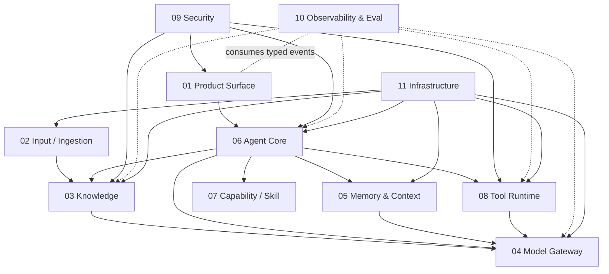
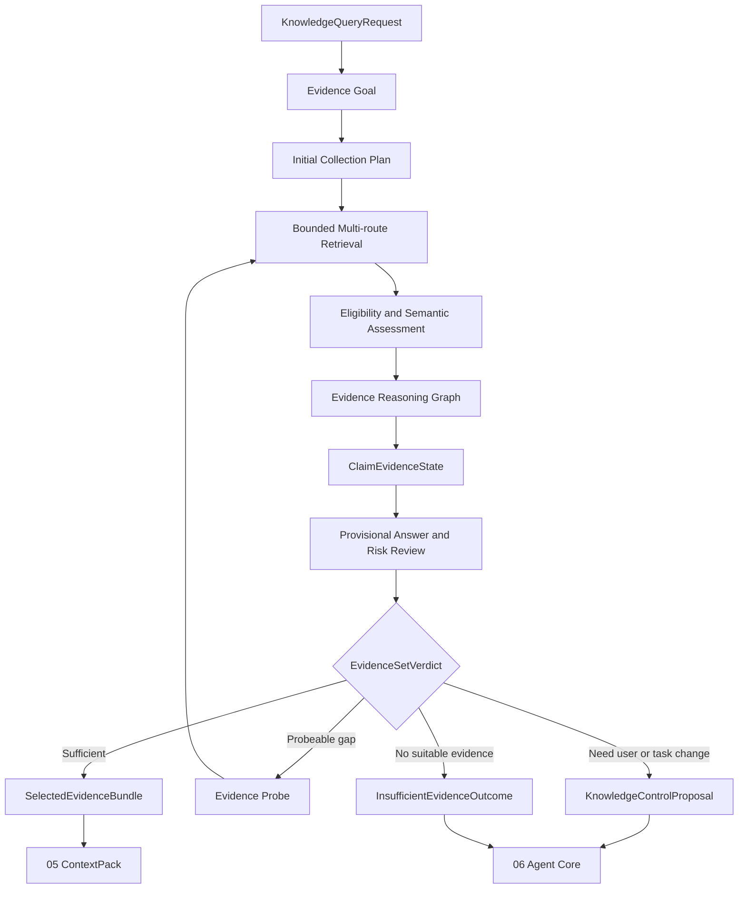

# Zuno 总体 Target 架构

updated: 2026-08-04
status: normative-target-architecture
architecture_generation: v2
formal_path: `docs/architecture/architecture.md`

> 本文是 Zuno 跨模块 Target 架构的唯一总览。十一模块的内部细节以 `docs/modules/01-*.md` 至 `11-*.md` 为 Canonical Owner；本文只定义全局问题、不可变原则、完整运行流程和跨模块边界。
>
> Architecture v2 的主要升级是：将 Knowledge / Agentic GraphRAG 从“动态 Retriever 路由与 Corrective Retrieval”提升为 **Evidence-Driven Agentic GraphRAG**，即有边界的广度证据发现、Claim 级证据审议、动态补证和安全停止。
>
> 本文是新的 Target，不修改现有 Program 和 PHASE01–PHASE22。旧 Program 继续以其冻结基线执行；Architecture v2 的实现 Program 必须在 PHASE22 收口后独立设计。

---

# 0. 文档体系与版本治理

## 0.1 正式架构文档集合

```text
docs/architecture/
  README.md
  architecture.md
  architecture-views.md
  architecture.html

docs/modules/
  01-product-surface.md
  02-input-document-ingestion.md
  03-knowledge-agentic-graphrag.md
  04-model-gateway.md
  05-memory-context.md
  06-agent-core-planning-control.md
  07-capability-skill.md
  08-tool-runtime.md
  09-security.md
  10-observability-eval.md
  11-infrastructure.md
```

`.agent/architecture/` 和 `.agent/modules/` 是 Agent 镜像，必须与正式文档保持字节级一致。

ADR 放在 `docs/decisions/`；Ownership 与共享 Contract 放在 `docs/governance/`；Current 与 Production Readiness 放在 `docs/status/`；旧材料放在 `docs/history/`；Program 与 Phase 放在 `.agent/programs/`。

## 0.2 规范优先级

```text
全局不可变原则和已接受 ADR
→ 模块 Canonical Target 架构
→ 本文跨模块集成规则
→ 共享 Contract Registry
→ 已确认 Program / Phase
→ 代码、Migration、配置
→ Trace、Eval 和运行证据
```

模块内部语义冲突时，以模块文档为准；跨模块 Ownership 冲突时，以已接受 ADR 和共享 Contract Registry 为准。

## 0.3 Architecture v1 与 v2

| 层级 | 说明 |
| --- | --- |
| Current | 当前代码、Migration、测试、Trace 与运行证据证明的事实 |
| Target v1 baseline | 现有 Program / PHASE01–PHASE22 执行时采用的冻结目标，可通过基线 Commit 读取 |
| Target v2 | 本文和升级后的模块文档定义的新目标 |
| Future | 未决定、未进入近期 Program 的长期能力 |
| History | 被替换设计和旧草稿，不参与当前决策 |

Architecture v2 不反向改写旧 Phase 的验收口径。后续 Program 必须显式说明从哪个 Current Baseline 迁移到哪个 Target v2 Contract。

---

# Part I：产品问题与全局目标

## 1. Zuno 是什么

Zuno 是基于 LangGraph 的企业知识库 Agent / Agentic GraphRAG 平台，目标是在领域无关的前提下提供：

```text
可配置的知识问答
跨文档分析
受控 Tool 执行
长任务规划与恢复
多租户和权限隔离
证据引用与无据拒答
运行审计、评测和发布门禁
```

它不是简单 Chat UI、固定 RAG Pipeline、任意 Tool Calling 外壳或自治 Multi-Agent Runtime。

## 2. 全局质量目标

1. **领域无关**：业务知识由数据、Capability、Skill 和配置注入，不写死行业流程。
2. **可扩展**：模块边界、Contract 和 Projection 可独立演进。
3. **可恢复**：服务重启、Worker Crash、重复消息和 Checkpoint 偏差可恢复。
4. **可并行**：默认最大化安全并行，资源冲突和副作用默认串行。
5. **可审计**：每个 Command、Plan、Evidence、ModelInvocation、Approval 和 Effect 有引用链。
6. **安全**：模型只产生 Proposal；权限、预算、审批和状态提交由确定性代码控制。
7. **证据驱动**：知识任务以 Claim–Evidence 充分性而非相似 Chunk 数量为完成标准。
8. **可测量**：任何“更好”必须由固定 Benchmark、Trace、Eval 和 Release Gate 证明。

## 3. 全局非目标

- 不默认引入微服务、Kafka、Kubernetes、事件溯源或复杂分布式锁；
- 不为每个 Retriever、模型角色或 Tool 创建自治 Agent；
- 不让模型直接更新最终数据库状态、批准权限或执行未审批副作用；
- 不让 LangGraph Checkpoint 替代 PostgreSQL 领域事实；
- 不因为文档、类名或表名存在就声明实现完成；
- 不在质量、安全、恢复和观测证据不足时声明 production ready。

---

# Part II：十一模块逻辑架构

## 4. 模块地图

| 编号 | 模块 | Canonical Ownership |
| --- | --- | --- |
| 01 | Product Surface | Command、Query、Projection、SSE、用户可见产品语义 |
| 02 | Input / Document Ingestion | SourceObject、DocumentVersion、CanonicalDocumentIR、SourceSpan |
| 03 | Knowledge / Agentic GraphRAG | KnowledgeVersion、Evidence、Claim、Probe、Verdict |
| 04 | Model Gateway | ModelInvocation、Routing、PromptVersion、Provider Failure、Usage |
| 05 | Memory & Context | Working / Session / Long-term Memory、ContextPack、Memory Governance |
| 06 | Agent Core / Planning & Control | AgentRun、PlanVersion、Step、Dispatch、Replan、Final Gate、RunOutcome |
| 07 | Capability / Skill | CapabilityDefinition、SkillDefinition、版本和装配 |
| 08 | Tool Runtime | PreparedToolAction、Attempt、Effect、Reconciliation、Compensation |
| 09 | Security | Principal、Authorization、Security Epoch、Approval、Disclosure、Audit |
| 10 | Observability & Eval | Trace、Metric、Eval、Benchmark、Release Gate、Quality Claim |
| 11 | Infrastructure | PostgreSQL、Checkpointer、Queue、Object、Search、Vector、Graph、Lease primitive |

## 5. 逻辑关系


```mermaid
flowchart TB
    PS[01 Product Surface] --> AC[06 Agent Core]
    ING[02 Input / Ingestion] --> K[03 Knowledge]
    AC --> K
    AC --> M[05 Memory & Context]
    AC --> C[07 Capability / Skill]
    AC --> T[08 Tool Runtime]
    K --> MG[04 Model Gateway]
    AC --> MG
    M --> MG
    T --> MG
    SEC[09 Security] --> PS
    SEC --> AC
    SEC --> K
    SEC --> T
    O[10 Observability & Eval] -. consumes typed events .- PS
    O -.-> AC
    O -.-> K
    O -.-> MG
    O -.-> T
    I[11 Infrastructure] --> ING
    I --> K
    I --> MG
    I --> M
    I --> AC
    I --> T
```

Infrastructure 提供物理 primitive，不拥有业务语义。Observability 消费事件，不反向修改领域状态。Security 的授权结果必须在执行和提交边界生效。

---

# Part III：完整在线运行流程

## 6. 从用户 Command 到 RunOutcome

```text
用户提交 Command
→ Product Surface 建立 Principal / tenant / workspace 上下文
→ Security 执行授权和 Disclosure Policy
→ Agent Core 创建 AgentRun
→ Task Analyzer 产生结构化 Proposal
→ 创建 Deterministic Single-Step Plan 或 Dynamic DAG Plan
→ 确定性 Validator 检查能力、依赖、预算、安全和副作用
→ 激活不可变 PlanVersion
→ 计算 Ready Set
→ 安全并行执行 StepExecutionGraph
→ 每个 Step 内执行确定性动作或受控 ReAct
→ Knowledge / Memory / Tool / Model 返回 typed outcome
→ Step Acceptance、条件 Reflection 与 Join Evaluation
→ 必要时 Retry、Repair、Fallback 或 Replan Barrier
→ Final Synthesis
→ Deterministic Final Gate / 条件 Final Reflection
→ 提交 RunOutcome
→ Product Surface 通过 Projection / SSE 展示
```

## 7. Agent Core 三层结构

```text
固定 AgentRunGraph
+ 动态 Plan DAG
+ 固定 StepExecutionGraph
```

- Plan-and-Execute 管理全局目标、依赖和并行；
- ReAct 管理单 Step 的 Action–Observation；
- Reflection 只在风险、冲突、失败或复杂 Final Gate 时触发；
- Replan 创建新 PlanVersion，不能修改激活版本；
- Reflexion 只形成长期经验候选，需 Memory Governance。

## 8. 并行原则

Ready Step 仅在以下条件全部满足时并行：

- 依赖完成；
- 输入可用；
- 无资源冲突；
- 无不可逆副作用冲突；
- Budget 和 quota 允许；
- Security Gate 允许；
- PlanVersion 仍有效。

默认串行：数据依赖、写同一资源、不可逆副作用、排他资源、Replan 和 Final Synthesis。

## 9. Retry 与 Replan

```text
Retry：计划仍正确，执行临时失败。
Replan：计划结构、依赖或假设失效。
```

Knowledge Targeted Probe 是知识步骤内的补证，不等于 Replan。Tool `UNKNOWN Effect` 必须先 Reconciliation，不等于 Retry。

---

# Part IV：Evidence-Driven Agentic GraphRAG

## 10. 架构升级核心

旧式 Agentic RAG 关注“下一步选哪个 Retriever”。Architecture v2 关注：

> 当前候选答案的关键 Claim 是否具有充分、独立、权威、有效且可引用的 Evidence；如果没有，下一步什么 Probe 最可能改变该判断。

## 11. 两阶段、两个闭环

```text
Broad Evidence Discovery
    有边界的多路径首轮证据采集

Evidence Deliberation
    Evidence Eligibility、语义关系、Claim 状态、冲突、风险与 Targeted Probe
```


```mermaid
flowchart TD
    Q[KnowledgeQueryRequest] --> G[Evidence Goal]
    G --> P[Initial Collection Plan]
    P --> R[Bounded Multi-route Retrieval]
    R --> E[Eligibility and Semantic Assessment]
    E --> RG[Evidence Reasoning Graph]
    RG --> C[ClaimEvidenceState]
    C --> A[Provisional Answer and Risk Review]
    A --> V{EvidenceSetVerdict}
    V -->|Sufficient| B[SelectedEvidenceBundle]
    V -->|Probeable gap| PR[Evidence Probe]
    PR --> R
    V -->|Need user or task change| CP[KnowledgeControlProposal]
    V -->|No suitable evidence| IO[InsufficientEvidenceOutcome]
    B --> MC[05 ContextPack]
    CP --> AC[06 Agent Core]
    IO --> AC
```

## 12. 首轮检索策略

STANDARD 默认：BM25 + Vector，最多一次 Citation Repair。

DEEP 允许按问题和 EvidenceGoal 选择：

- BM25；
- Vector；
- Graph Local；
- Graph Global / Community；
- DRIFT；
- Structured；
- Source / Authority / Temporal scoped retrieval。

DEEP 不等于全部 Retriever 无条件运行。Route 必须通过 Capability、Security、Budget、deadline、预计增益和多样性检查。

## 13. 双图

Knowledge Graph 表达世界中的 Entity、Relation、Community、Document 和 Text Unit。

Evidence Reasoning Graph 表达 Claim 为什么被支持、限定、反驳或阻断。关键关系：

```text
SUPPORTS
PARTIAL_SUPPORT
CONTRADICTS
QUALIFIES
SUPERSEDES
DUPLICATES
DERIVED_FROM
SUMMARIZES
APPLIES_TO
DOES_NOT_APPLY_TO
INSUFFICIENT_FOR
```

Community Summary、GraphPath 和原文若同源，只算一个独立 Source Family。

## 14. 四层证据评价

1. Deterministic Eligibility：ACL、Security Epoch、Snapshot、Version、SourceSpan、Hash、late result。
2. Single Evidence Semantic Assessment：Support、Contradict、Qualify、Applicability、Authority、Temporal、Citation。
3. ClaimEvidenceState：SUPPORTED、CONDITIONALLY_SUPPORTED、CONTESTED、CONTRADICTED、INSUFFICIENT、BLOCKED。
4. EvidenceSetVerdict：覆盖、独立来源、冲突、稳定性、边际收益与控制建议。

模型 Critic 只产生 Proposal，不能覆盖硬门或提交最终状态。

## 15. 动态补证

Evidence Probe 围绕关键 Gap 选择：

```text
QUERY_REWRITE
MULTI_QUERY
SOURCE_SCOPED_RETRIEVAL
PARENT / ADJACENT_EXPANSION
FOCUSED_CITATION
GRAPH_LOCAL / PATH / GLOBAL / DRIFT
TEMPORAL_RETRIEVAL
AUTHORITY_RETRIEVAL
SUPERSEDES_RETRIEVAL
STRUCTURED_LOOKUP
```

选择依据是 Answer Impact、Uncertainty、Expected Information Gain、Evidence Quality、Cost、Latency、Risk 和 Redundancy。

## 16. 安全停止与 Outcome

```text
SUFFICIENT_EVIDENCE
PARTIAL_EVIDENCE
CONFLICTING_EVIDENCE
NO_SUITABLE_EVIDENCE
AUTHORIZED_EVIDENCE_UNAVAILABLE
KNOWLEDGE_QUALITY_SUSPECTED
FAILED
CANCELLED
```

Knowledge 只返回 Proposal 和 Evidence Bundle；Agent Core 决定 Ask User、External Tool、Replan、Partial、Abstain 或 Finalize。

---

# Part V：文档摄取、版本与事实边界

## 17. Input / Ingestion

```text
Upload Session
→ immutable SourceObject
→ content hash and malware gate
→ DocumentVersion
→ parser selection
→ CanonicalDocumentIR
→ SourceSpan manifest
→ quality gate
→ IndexableDocumentSnapshot
→ KnowledgeVersion build
```

原始文件是事实根；OCR、VLM、清洗文本、Chunk、Entity、Community 和 Summary 都是派生结果。

## 18. 版本层级

- 源内容变化：新 DocumentVersion；
- Parser / 配置变化：新 ParseSnapshot；
- Chunk / Embedding / Graph / Index 变化：新 KnowledgeVersion；
- Run 绑定 KnowledgeSnapshot，不因新版本 Cutover 静默漂移。

Graph 结果必须回到 SourceSpan；无回链结果只能辅助。

## 19. 删除与撤权

```text
Product 隐藏
→ Document Tombstone
→ KnowledgeVersion / Index 删除或重建
→ Search / Vector / Graph Projection 失效
→ Cache 失效
→ Citation / Artifact 授权重验
→ Verification 确认不可召回
```

删除不是一个数据库布尔字段，而是跨模块受审计流程。

---

# Part VI：模型、记忆、Tool 与安全

## 20. Model Gateway

角色至少包括：

```text
TASK_ANALYZER
PLANNER
PLAN_REPAIR
EXECUTOR_FAST
EXECUTOR_REASONING
QUERY_REWRITER
EXTRACTOR
CRITIC
SYNTHESIZER
FINAL_CRITIC
```

Architecture v2 增加明确任务：Evidence Relation、Claim Extraction、Conflict、Applicability、Probe Proposal、Provisional Synthesis 和 Answer Risk Review。

模型只返回 Schema Proposal；Gateway 负责路由、PromptVersion、Provider Failure、Usage 和 Fallback；领域模块负责最终验证和提交。

## 21. Memory & Context

分层：

- Working Memory：当前 Run 临时状态；
- Session Memory：会话级稳定上下文；
- Long-term Semantic / Episodic / Procedural Memory；
- ReflexionCandidate：待治理经验。

ContextPack 由 Module 05 构建。它消费 SelectedEvidenceBundle，但不能重新打分 Evidence 或绕过 Security。

## 22. Tool Runtime

```text
ActionProposal
→ Canonical Args
→ Security Gate
→ Approval
→ Idempotency
→ Execute
→ SUCCESS / FAILURE / UNKNOWN
→ Reconciliation / Compensation
```

副作用 timeout 进入 UNKNOWN，不能盲目 Retry。Approval 绑定 ToolVersion、规范化参数、目标、Security Epoch 和过期时间。

## 23. Security

- 多租户 Principal；
- ACL 进入 Retriever Query；
- Security Epoch 支持中途撤权；
- 未授权 Evidence 不先交给模型；
- Prompt Injection 和 Indirect Injection 防护；
- Secret Broker；
- Tool Approval；
- Output Disclosure；
- Audit 与 Trace 分离。

---

# Part VII：数据、可靠性与基础设施

## 24. PostgreSQL 与 Checkpointer

```text
PostgreSQL：领域事实、状态机、版本、Receipt、Audit 关联。
LangGraph Checkpointer：图控制位置、pending writes、interrupt 和轻量引用。
```

二者不存在自动分布式事务。Node 必须幂等，恢复时领域事实优先。

## 25. Queue 与 Outbox / Inbox

数据库提交与消息发布使用 Outbox。Consumer 业务提交后 ACK；重复消息通过 Inbox / 唯一约束和幂等 Handler 处理。

ACK 不等于业务成功，Publisher Confirm 不等于 Consumer 完成。

## 26. Object、Search、Vector、Graph

- Object Store 保存原始文件和大 Artifact；
- Search 保存 BM25 Projection；
- Vector Store 保存 ANN Projection；
- Graph Store 保存 Entity / Relation / Community Projection；
- PostgreSQL 保存版本、Acceptance、Cutover 和领域 Receipt。

Projection 可重建，领域事实和原始对象优先保护。

## 27. 高并发演进

当前优先模块化单体 + 独立 Worker，而不是按目录拆微服务。

先测量：

- CPU / I/O；
- 发布频率；
- 扩缩容差异；
- 故障隔离；
- 数据 Ownership；
- 团队边界。

优先可拆候选：Ingestion Worker、Model Gateway、Tool Sandbox、Eval Worker。拆分必须带版本化 Contract、幂等、deadline、错误语义和数据 Ownership。

---

# Part VIII：可观测性、评测与完成标准

## 28. Trace

必须关联：

```text
Command
AgentRun
PlanVersion
StepRun
KnowledgeQueryRun
Evidence / Claim / Probe / Verdict
ModelInvocation
Approval / Tool Effect
RunOutcome
```

不保存隐藏思维链。

## 29. Eval

至少分：

- Component Eval；
- Trajectory Eval；
- End-to-End Eval；
- Fault Eval；
- Safety Eval；
- Cost / Latency Eval。

Evidence-Driven Agentic GraphRAG 至少比较：Vector-only、Hybrid、Fixed GraphRAG、Agentic Routing 和 Evidence-Driven。

指标包括：Gold Evidence Recall、Claim Coverage、Strict Citation Coverage、Unsupported Claim Rate、Conflict Disclosure、Probe Information Gain、Answer Stability、Abstention Precision / Recall、Knowledge Diagnosis Precision。

## 30. Target 变为 Current

文档完成不等于模块完成。Target 变为 Current 至少需要：

```text
代码
Migration
Unit Test
Integration Test
Fault Injection
E2E
Trace
固定 Eval
运行证据
文档镜像同步
```

推荐状态：

```text
design available
implementation available
measurement blocked / in progress
quality not yet proven
production readiness not established
```

未具备充分测试、观测、安全、恢复和运行证据时，不得声明 production ready。

---

# Part IX：Architecture v2 实施边界

## 31. 本次不修改的内容

- `.agent/programs/`；
- PHASE01–PHASE22；
- 业务代码；
- 数据库模型和 Migration；
- CI 和部署配置。

## 32. 后续顺序

PHASE22 收口后：

```text
读取最新 Current
→ 冻结 Architecture v2 Contract
→ 形成新 Program
→ 拆分 Phase
→ Codex 实现
→ 架构审查
→ Benchmark / Release Gate
→ Current 状态更新
```

在新 Program 确认前，不允许 Worker 自行把 Architecture v2 当作已批准实现任务。
