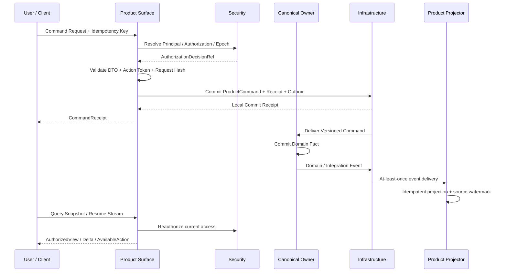
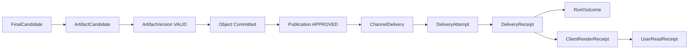

# 01 Product Surface

updated: 2026-07-14
status: normative-target-module-architecture
module_number: 01
formal_path: `docs/modules/01-product-surface.md`
agent_mirror: `.agent/modules/01-product-surface.md`

> 本文是 Zuno 第 01 个逻辑模块——Product Surface——唯一的正式 Target 架构文档。
>
> 本文定义北向产品边界、用户场景、Product-owned 领域对象、Command / Query / Projection / Stream / Delivery 协议、状态机、故障与恢复语义、安全与生命周期、目标代码和数据库规格，以及 Requirement-to-Test-to-Evidence 闭环。
>
> 本文只描述 Target，不把当前 FastAPI、Vue、Workspace Service 或内存态实现冒充为完成事实。Current、Gap、Measurement 和完成证据由 `docs/status/production-readiness.md` 维护；迁移、兼容入口和 Cutover 计划进入 `.agent/programs/`。

## 0. 文档边界与规范优先级

本文统一承载：

```text
问题、目标与概念架构
完整产品运行流程与异常路径
Ownership、Trust Boundary 与架构不变量
Conversation、Submission、Command、Projection、Delivery 领域模型
状态机、Transition Guard、Failure、Retry、Recovery、Idempotency
Command / Query / SSE / Download / Feedback 协议
安全、授权、撤权、渲染、Retention 与 Delete
目标代码、PostgreSQL、事务、索引和 Contract Versioning
Requirement、Control、Test 与完成证据
```

文档边界：

```text
docs/modules/01-product-surface.md
    唯一正式 Product Surface Target 架构事实源。

.agent/modules/01-product-surface.md
    字节级一致的 Agent 镜像。

.agent/programs/
    Current → Target 的实现、迁移、兼容、切流和收口计划。

docs/status/production-readiness.md
    Current、Gap、Measurement Blocked 和工程完成证据。
```

禁止新增以下拆分文档：

```text
01-product-surface-api.md
01-product-surface-projection.md
01-product-surface-streaming.md
01-product-surface-contracts.md
01-product-surface-security.md
01-product-surface-operations.md
```

规范优先级：

```text
全局架构原则
→ Wave 1 Cross-module Contract Registry / ADR
→ 各 Canonical Owner 的正式 Target Contract
→ 本 Product Surface Target 架构
→ 已确认 Program
→ 代码与 Migration
```

发生冲突时，Product Surface 不得复制并覆盖 Agent Core、Security、Tool Runtime、Knowledge、Memory、Observability 或 Infrastructure 的领域事实；必须修正文档或通过 ADR 解决。

### 0.1 文档内部规范层级

Part I–IV 是定位、流程和实现表面的说明性视图；Part V–VII 是对象、状态、协议和一致性的规范性视图；Part VIII 定义 Requirement、Control、测试和完成证据。说明性视图不得覆盖规范性 Contract。

---

# Part I：定位与概念架构

## 1. 为什么需要 Product Surface

Zuno 不是一次 HTTP 请求内完成的普通 CRUD 系统。企业知识问答和 Agent 任务可能包含文件摄取、检索、并行 Step、审批、外部副作用、等待、取消、恢复、Artifact、发布和质量证明。如果 API Router、Frontend Store 或单个 Workspace Service 直接承担这些语义，将出现：

```text
HTTP 2xx 被误认为 AgentRun 成功
SSE 关闭被误认为任务终局
Queue ACK 被误认为 Tool Effect 或 Publication 成功
Frontend 根据字符串猜测 Approval、Retry、Cancel 和 Outcome
FastAPI Router 直接调用 Planner、Retriever、Tool 或 Provider SDK
页面关闭导致后端 Run 被错误取消
Upload 成功被误认为文档已经可检索
Tool 响应丢失后允许盲目重试副作用
模型流式文本绕过 Final Gate 成为正式答案
Projection Cache 反向覆盖领域事实
撤权后旧 Stream、旧 Action Token 或旧 Download URL 继续泄露数据
```

一句话定义：

> Product Surface 是 Zuno 的统一北向产品边界。它通过 Web、Desktop 和 External API 接收用户意图，把版本化 Command 交给 Canonical Owner，并把各模块已提交、可访问、未撤销且经过授权的领域事实投影成可查询、可恢复、可解释和可审计的产品体验。

产品定位：

> Zuno 是面向企业内部资料和业务系统的可治理自定义 Agent 平台。Product Surface 必须支持企业管理员管理 Tenant、OrgUnit、Workspace、知识、模型、Skill、Tool、权限、预算和审批；也必须支持用户在授权范围内创建、发布、安装和使用多个 Agent 资产。

Product Surface 的 Agent 产品资产包括：

```text
AgentDefinition      稳定产品身份和元数据
AgentDraft           用户或团队正在编辑的草稿
AgentVersion         不可变运行配置
AgentPublication     某版本发布到 PRIVATE / WORKSPACE / TENANT 范围
AgentInstallation    Workspace 或用户安装并可使用的 AgentVersion
AgentCatalogEntry    Agent 目录中的授权可见条目
```

这些对象不等于 Agent Core 的 `AgentRun`，也不等于 Security 的 `AgentPrincipal`。Product Surface 拥有名称、描述、草稿、版本、发布、安装、目录和管理员视图；Security 拥有 Agent 安全身份、Grant、Policy、Epoch 和授权决定；Agent Core 拥有每次运行的 Task、Plan、Step、Publication 和 RunOutcome。

## 2. Product Surface 与后端核心

```text
Product Surface
    用户想做什么
    用户看到什么
    用户当前允许做什么
    如何通过 HTTP / SSE / Desktop / External API 交付

Agent Core
    Run 如何分析、计划、调度和执行
    Retry、Repair、Fallback、Replan 如何决策
    Interrupt、Signal 和控制命令如何仲裁
    Final Gate、Publication 和 RunOutcome 如何提交
```

Product Surface 是后端产品入口核心，但不是 Agent 运行核心。Product Surface 不得成为第二套 Controller。

## 3. 模块职责

Product Surface 负责：

```text
Web、Desktop 和 External API 北向适配
Authentication Adapter 与 PrincipalContext 解析入口
Tenant / OrgUnit / Workspace 管理入口与授权后的管理员视图
Agent Studio、Agent Catalog、Agent Draft / Version / Publication / Installation
Effective Permission Preview：资料、Tool、Model、审批、预算和外部 Provider 暴露范围预览
Conversation、UserSubmission、UserMessage 和产品交互事实
RuntimeRequest 与 ProductCommand 的规范化
Command 接受、拒绝、重复、冲突和可查询 Receipt
Query API、Base Projection、AuthorizedView 和 AvailableAction
Snapshot、SSE、Cursor、Gap、Resync、Backpressure 和 Reauthorization
用户输入 Interrupt、Approval、Cancel、Recovery、New Run 的交互入口
Citation、Artifact、Quality Disclosure、Admin 和 Audit View
ChannelDelivery、DeliveryAttempt、ClientRendered 和 UserRead
浏览器、Desktop、External API 的渲染与交付安全
产品级 ProblemDetail、Failure Mapping、SLO 和 Reconciler
```

Product Surface 不负责：

```text
创建、验证或激活 Plan
调度 Step、Action、Dispatch 或 Worker
选择 Retry、Repair、Fallback、Escalation 或 Replan
直接调用模型厂商 SDK
直接执行 Tool、Shell、浏览器、邮件或第三方 API
批准权限、修改 Policy、Grant 或 Security Epoch
解析 PDF、OCR、切分、索引或激活 KnowledgeVersion
写入长期 Memory 或直接删除 Memory 领域事实
创建 Trace、AuditEvent、EvalResult 或质量证明事实
保存或解释 LangGraph Checkpoint
把 HTTP、SSE、Queue、Object Store 或客户端 Receipt 当成其他模块的成功
```

## 4. Cross-module Ownership

| 模块 | Canonical Fact | Product Surface 行为 |
| --- | --- | --- |
| Product Surface | AgentDefinition、AgentDraft、AgentVersion、AgentPublication、AgentInstallation、AgentCatalogEntry、ConversationThread、UserSubmission、UserMessage、ProductCommand、RuntimeRequest、CommandReceipt、ProductProjection、ChannelDelivery、ClientRenderReceipt、UserReadReceipt、FeedbackSubmission | 直接拥有 |
| Input / Ingestion | SourceObject、WorkspaceFile、ParseJob、DocumentVersion、Ingestion Readiness | 消费 Projection，展示阶段，不推断 Searchable |
| Knowledge | RetrievalRound、Evidence、CitationLineage、KnowledgeVersion、Evidence Sufficiency | 形成授权后的 Evidence/Citation View，不改写事实 |
| Model Gateway | ModelRoutingDecision、ModelCallAttempt、UsageReceipt、Provider Failure | 只展示允许披露的执行与成本摘要 |
| Memory & Context | MemoryVersion、ContextPackVersion、Memory Commit/Delete | 展示可见和可管理视图，提交请求，不直接写事实 |
| Agent Core | TaskContract、AgentRun、GoalVersion、PlanVersion、StepRun、Interrupt、ControlDecision、Publication、RunOutcome | 创建 RuntimeRequest、提交 Signal/Command、消费 Projection |
| Capability / Skill | CapabilityDefinition、SkillDefinition、Selection Result | 展示可用能力，不自行选择执行结果 |
| Tool Runtime | PreparedToolAction、ToolAttempt、EffectReceipt、EffectReconciliation | 展示受控摘要和 UNKNOWN，不执行 Tool |
| Security | Principal、AuthorizationDecision、ApprovalDecision、Policy、Grant、EffectiveSecurityEpoch | 每个入口和敏感交付重新校验 |
| Observability & Eval | Trace、Metric、AuditEvent、EvalResult、Evidence Registry Projection | 展示分层质量和审计 View |
| Infrastructure | Object、Queue、Lease、Checkpoint、Outbox、Cursor Store、Delivery Primitive | 消费 Primitive，不把 Receipt 冒充领域结果 |

## 5. 产品参与者与渠道

```text
End User
Workspace Admin
Tenant / Org Admin
Approver
Auditor
Eval Operator
Platform Operator
Web Client
Desktop Client
External API Client
Channel Adapter
```

渠道能力可以不同，但领域语义相同。Desktop 能调用本地能力，不代表 Desktop 可以绕过 Agent Core、Security、Tool Runtime、Audit、Budget 或 Idempotency。

## 6. Trust Boundary

以下客户端输入默认不可信：

```text
user_id / tenant_id / workspace_id
role / grant / access_scope / approval_mode
trace_id / run_id 所有权声明
model_id / provider / api_key / base_url
tool credential / raw secret / local path / command
skill allowlist / capability result
desktop bridge token
artifact URI / citation URI / object URI
security epoch / policy version / data classification
```

客户端可以提交用户选择、偏好和资源引用，但服务端必须重新解析 Principal、Tenant、Workspace、Resource Grant、EffectiveSecurityEpoch、Capability 范围、SecretRef 和 AvailableAction。

## 7. 核心关系模型

```text
PrincipalSession                 Security-owned
    │
    ├── AgentCatalogEntry       Product-owned authorized view
    ├── AgentDraft              Product-owned editable config
    ├── AgentVersion            Product-owned immutable config
    │     ├── AgentPublication  Product-owned publication scope
    │     └── AgentInstallation Product-owned install/use scope
    │
    └── ConversationThread      Product-owned
          ├── UserSubmission    Product-owned original intent
          │     ├── UserMessage Product-owned accepted message
          │     ├── ProductCommand
          │     └── RuntimeRequest
          │            ├── PrimaryAgentVersionRef
          │            └── AgentRun              Agent Core-owned
          │                   ├── Interrupt[]
          │                   ├── Publication[]
          │                   └── RunOutcome
          └── AssistantMessageProjection         Product read model
                    └── PublicationRef

Publication                     Agent Core-owned
    └── ChannelDelivery         Product-owned
          ├── DeliveryAttempt[]
          ├── ClientRenderReceipt[]
          └── UserReadReceipt[]
```

规则：

- 一个 RuntimeRequest 最多创建一个 AgentRun；重复请求返回原 Receipt。
- 一个 RuntimeRequest 必须绑定一个 Primary AgentVersionRef；多个 Agent 产品资产不表示一次 Run 有多个自治 Controller。
- 已终结 Run 不复活；“再试一次”通常创建带 `parent_run_ref` 的新 RuntimeRequest。
- 一个 ConversationThread 可以存在多个 Run；UI 可选择一个前台 Run，但不得隐藏其他有效 Interrupt 或终局。
- 补充输入是 UserSubmission + ProductCommand；是否只解决 Interrupt、创建 GoalVersion 或创建新 Run，由 Agent Core 决定。
- AssistantMessageProjection 必须引用正式 Publication；Provisional Content 不能成为正式 Message。

## 8. 架构不变量

### INV-PRODUCT-001：统一北向入口
所有正式 Web、Desktop 和 External API 产品入口必须复用统一 Product Command / Query / Stream Contract。

### INV-PRODUCT-002：Product Surface 不得成为第二套 Controller
Product 不创建 Plan、不推进 Step、不决定 Retry/Replan、不写 RunOutcome。

### INV-PRODUCT-003：Frontend 不是事实源
Frontend Store、Local Storage、URL 参数和组件状态不能成为领域事实。

### INV-PRODUCT-004：Receipt 不等于领域成功
HTTP 2xx、SSE close、Queue ACK、Object Commit 和客户端 ACK 只证明各自边界事实。

### INV-PRODUCT-005：断线不取消 Run
ConnectionStatus 与 AgentRun Status 正交。

### INV-PRODUCT-006：正式输出只能来自 Publication
模型 Token、Progress Event 和 FinalCandidate 都不是正式 Assistant Message。

### INV-PRODUCT-007：Projection 单向派生
Product Projection 只能消费 Owner Fact，不能反向覆盖 Source Aggregate。

### INV-PRODUCT-008：Projection 可重建
丢失 Product Read Model 不得丢失源领域事实；必须可以从 Source Event / Snapshot 重建。

### INV-PRODUCT-009：AuthorizedView 每次重新授权
Base Projection 可持久化；Principal-specific AuthorizedView 必须结合当前 Grant、Epoch、Classification 和 Redaction 生成。

### INV-PRODUCT-010：AvailableAction 由服务端提供
前端不得根据状态字符串自行生成 Retry、Approve、Cancel、Download 或 Reconcile 动作。

### INV-PRODUCT-011：Action Token 有范围和过期
每个敏感动作绑定 Principal、Target、Command Kind、Projection Version、Security Epoch、Expiry 和 Nonce。

### INV-PRODUCT-012：多个序列不可混用
AggregateVersion、SourceEventSequence、ProjectionVersion 和 StreamSequence 必须分离。

### INV-PRODUCT-013：Command 幂等
相同 Idempotency Scope + Key + Request Hash 返回原结果；相同 Key 不同 Hash 返回冲突。

### INV-PRODUCT-014：用户身份由服务端解析
客户端不能指定可信 user_id、tenant_id、role、trace_id 或 EffectiveSecurityEpoch。

### INV-PRODUCT-015：简单问答仍进入 Agent Core
不存在通过 `/completion`、simple chat 或 direct answer 绕过 Plan、Trace、Budget、Final Gate 和 RunOutcome 的正式路径。

### INV-PRODUCT-016：Interrupt 支持多实例
一个 Run 可以同时存在多个 Pending Interrupt；Product 不压缩成单一 `pendingApproval`。

### INV-PRODUCT-017：Approval 只展示 Security 事实
Product 提交审批意图，但 ApprovalDecision 归 Security；批准不等于 Tool 执行成功。

### INV-PRODUCT-018：UNKNOWN 禁止盲目重试
Tool Effect UNKNOWN 只能展示 Owner 提供的 WAIT、RECONCILE、HUMAN_REVIEW 或 COMPENSATE 动作。

### INV-PRODUCT-019：Cancel 请求与终局分离
Cancel Accepted、Run CANCELLING 和 RunOutcome CANCELLED/PARTIAL 必须分别展示。

### INV-PRODUCT-020：Outcome 不压扁
COMPLETED、PARTIAL、ABSTAINED、REFUSED、BLOCKED、FAILED、CANCELLED、EXPIRED 保持不同语义。

### INV-PRODUCT-021：文件阶段不压扁
Upload Accepted、Object Committed、Parsed、Indexed、Accepted 和 Searchable 不能合并成“上传成功”。

### INV-PRODUCT-022：Artifact、Publication、Delivery、Render、Read 分离
任一后置状态不能由前置状态推断。

### INV-PRODUCT-023：Citation Metadata 不等于内容可访问
查看 SourceSpan、原文或下载源文件需要独立 Authorization。

### INV-PRODUCT-024：质量未测量不得冒充质量已证明
`measurement blocked`、`unavailable` 和 `quality not yet proven` 必须如实展示。

### INV-PRODUCT-025：Security Revocation 优先
撤权后停止敏感 Delta、失效 Action Token 和 Download Session；不通过取消 Run 掩盖撤权。

### INV-PRODUCT-026：敏感渲染默认不可信
Markdown、HTML、Tool Output、Citation 和 Artifact Preview 均需 Sanitization、CSP、Sandbox 和 MIME Gate。

### INV-PRODUCT-027：隐藏思维链不可外露
Query、Stream、Export 和 Admin View 不暴露 Raw Prompt、Raw Checkpoint、Hidden Reasoning 或 Secret Material。

### INV-PRODUCT-028：删除跨 Owner 协调
Product 记录 Delete Request/UX 状态，不直接删除 Knowledge、Memory、Audit 或 Object Store 事实。

### INV-PRODUCT-029：未知版本和枚举 Fail Closed
客户端和服务端遇到未知 Security/Action/Contract Enum 时不得猜测允许操作。

### INV-PRODUCT-030：Target 不等于 Current
文档、DTO 名称或表名不能作为 implementation available、quality proven 或 production ready 证据。

---

# Part II：产品机制与完整运行流程

## 9. 统一产品主路径



Command、Query 和 Stream 是三条不同路径：

```text
Command
    接受意图并持久化 ProductCommand；返回是否接受，不返回虚假的领域终局。

Query
    返回截至明确 SourceWatermark 的 Authorized Snapshot。

Stream
    交付 Product Projection Delta；断开、重复或延迟不改变源领域状态。
```

## 10. 普通知识问答

```text
UserSubmission RECEIVED
→ Authentication / Authorization
→ ProductCommand DISPATCH_COMMITTED
→ RuntimeRequest created
→ Agent Core creates AgentRun
→ Product RunProjection BUILDING / RUNNING
→ Progress Stream and optional Provisional Content
→ Agent Core commits FinalCandidate, Gate, Publication and RunOutcome
→ Product observes Publication and RunOutcome
→ AssistantMessageProjection committed
→ ChannelDelivery attempted
→ ClientRendered / UserRead observed independently
```

关键规则：

- 每个正式回答绑定 RuntimeRequest、AgentRun、Publication 和 RunOutcome。
- 简单任务由 Agent Core 创建 Deterministic Single-Step Plan；复杂任务使用 Dynamic DAG Plan。
- Provisional Content 可被替换、撤回或丢失；正式 Message 只能引用 Publication。
- Delivery 失败可以重试 Product-owned ChannelDelivery，不重新执行 AgentRun。

## 11. Strict Grounded Answer

```text
Evidence sufficient + Citation accessible + Final Gate pass
    → COMPLETED / PARTIAL Publication

Evidence insufficient
    → ABSTAINED

Evidence conflict unresolved
    → PARTIAL or ABSTAINED with conflict disclosure

Evidence revoked before publication
    → publication blocked, candidate invalidated or re-evaluated

Evidence revoked after publication
    → Correction / Withdraw / Replace / Notify projection
```

Product 不自行计算 Evidence Sufficiency，不以“检索到 N 篇文档”冒充质量结论。QualityDisclosure 必须引用 Knowledge / Observability / Agent Core 的结构化结果。

## 12. 文件上传与摄取

```text
Create Upload Session
→ Security validates workspace and data classification
→ Object bytes committed
→ SourceObject / WorkspaceFile registered
→ ParseJob queued
→ Parsing / OCR / Manual Review
→ DocumentVersion created
→ IndexWrite / Visibility / Verification
→ Knowledge domain accepts and activates KnowledgeVersion
→ Searchable projection becomes true
```

用户可见阶段至少区分：

```text
UPLOAD_PENDING
UPLOADING
OBJECT_COMMITTED
REGISTERED
PARSE_QUEUED
PARSING
OCR_REQUIRED
BLOCKED
DOCUMENT_READY
INDEXING
INDEX_VERIFICATION
SEARCHABLE
FAILED
DELETION_PENDING
DELETED
```

这些是 Product Display Mapping，不覆盖 Input/Knowledge 的 Canonical Enum。Run 等待摄取时使用 Agent Core Interrupt / External Job 语义，不轮询猜测成功。

## 13. 长任务、离开页面与断线恢复

```text
AgentRun remains RUNNING
Client disconnects
→ StreamSession DISCONNECTED
→ AgentRun unchanged

Client reconnects
→ authenticate again
→ validate EffectiveSecurityEpoch
→ validate ResumeCursor and retention
→ replay retained ProductProjectionEvent
   or return RESYNC_REQUIRED
→ client fetches Authorized Snapshot
→ apply Delta after snapshot cutoff
```

Run 是否在用户离开页面后继续由 RuntimePolicy 决定，不由 TCP 生命周期决定。

## 14. User Input Interrupt

```text
Agent Core creates Interrupt[]
→ Product projects InterruptView[]
→ AuthorizedView emits one AvailableAction per valid response
→ user submits schema-valid signal
→ Product commits ProductCommand + Receipt + Outbox
→ Agent Core validates Signal, Interrupt state, GoalVersion, PlanVersion, Security and Idempotency
→ Signal consumed or rejected as stale/expired/unauthorized/duplicate
→ Product projects new state
```

用户新输入分类：

```text
SUPPLEMENTAL_INPUT
CLARIFICATION_RESPONSE
CONSTRAINT_CHANGE
OUTPUT_CONTRACT_CHANGE
OBJECTIVE_CHANGE
CANCELLATION_REQUEST
NEW_TASK
```

Product 只表达用户意图；GoalVersion 和 Replan 决策归 Agent Core。

## 15. Approval

```text
ActionProposal
→ Tool Runtime PreparedToolAction
→ Security ActionAuthorizationDecision
→ Approval Required
→ Product ApprovalView
→ Approver submits APPROVE / DENY
→ Security commits ApprovalDecision
→ Agent Core / Tool Runtime revalidate Hash, Scope, Expiry, Policy and Epoch
→ ToolAttempt or NOT_EXECUTED
→ EffectReceipt / EffectReconciliation
→ Agent Core continues
```

ApprovalView 至少展示：

```text
operation summary
target resource summary
side-effect class
risk disclosure
prepared action fingerprint
approved scope
credential purpose summary
policy version
created_at / expires_at
strong authentication requirement
```

Product 不保存完整 Tool Args、Secret 或 Credential Material。重复点击审批返回原 Decision/Receipt；Action Hash、Scope、Credential Version、Policy 或 Epoch 变化使旧 Action Token 失效。

## 16. Tool Effect UNKNOWN

```text
ToolAttempt dispatched
→ external result cannot be confirmed
→ Effect = UNKNOWN / RECONCILING
→ Agent Core waits or blocks according to policy
→ Product displays RECONCILIATION_REQUIRED
→ ordinary retry hidden
→ owner-provided WAIT / RECONCILE / HUMAN_REVIEW / COMPENSATE action
→ definitive SUCCEEDED / FAILED / NOT_EXECUTED / HUMAN_REQUIRED
→ Agent Core resumes or terminates
```

Compensation 是新的副作用，必须重新经过 Proposal、Prepare、Security、Approval 和 Idempotency。

## 17. Cancellation、Recovery 与 New Run

### 17.1 Cancellation

```text
User requests cancel
→ ProductCommand committed
→ CommandReceipt DISPATCH_COMMITTED
→ Agent Core accepts or rejects control command
→ Run enters CANCELLING
→ no new Dispatch
→ interruptible work cancelled
→ non-interruptible effect drains or reconciles
→ RunOutcome CANCELLED or PARTIAL
→ Product projects terminal state
```

### 17.2 Recovery 动作

Product 不公开含义模糊的通用 `retry`。AvailableAction 只能使用：

```text
REQUEST_OWNER_RECOVERY
CREATE_NEW_RUN_FROM
RETRY_CHANNEL_DELIVERY
RESYNC_PROJECTION
RESOLVE_INTERRUPT
REQUEST_RECONCILIATION
DOWNLOAD_ARTIFACT
VIEW_CORRECTION
```

`REQUEST_OWNER_RECOVERY` 由 Agent Core 区分 Retry、Repair、Fallback、Escalate、Replan 或 Abstain。`CREATE_NEW_RUN_FROM` 创建新 RuntimeRequest 和 AgentRun；`RETRY_CHANNEL_DELIVERY` 只重试 Product-owned 交付。

## 18. RunOutcome 产品映射

| RunOutcome | 产品语义 | 默认动作 |
| --- | --- | --- |
| `COMPLETED` | 必需 Objective 满足，正式结果已发布或明确无需发布 | 查看结果、Citation、Artifact、创建新 Run |
| `PARTIAL` | 至少一个核心 Objective 完成，未完成项已披露 | 查看完成项、补充信息、创建新 Run |
| `ABSTAINED` | Runtime 正常但证据、能力或质量不足 | 添加证据、改变约束、创建新 Run |
| `REFUSED` | Security、Policy、权限或合规要求拒绝 | 查看安全说明、申请权限（若允许） |
| `BLOCKED` | 已知条件阻止继续且无自动等待路径 | 处理阻塞项、人工升级、创建新 Run |
| `FAILED` | 不可恢复技术、Contract、计划或执行故障 | Owner-provided recovery 或创建新 Run |
| `CANCELLED` | 取消收口完成 | 查看部分结果、创建新 Run |
| `EXPIRED` | Run、Deadline、Signal 或 Approval 到期 | 重新提交或创建新 Run |

这些 Outcome 不是统一的 `success/error` 布尔值。

## 19. Artifact、Publication、Delivery、Render 与 Read



Ownership：

```text
FinalCandidate / ArtifactVersion / Publication / RunOutcome
    Agent Core

Object Commit / Signed Object Access primitive
    Infrastructure

Artifact Access Authorization / Download Scope
    Security

ArtifactView / DownloadSession interaction / ChannelDelivery / ClientRenderReceipt / UserReadReceipt
    Product Surface
```

`PUBLISHED` 不表示已渲染或已读。下载前必须重新校验 Authorization、Security Epoch、ResultValidity、Retention 和 Object Availability。

## 20. Admin、Audit 与 Quality Disclosure

管理视图分层：

```text
Workspace Admin
    Workspace 范围成员、资源、Run、Artifact 和 Usage View

Tenant / Org Admin
    OrgUnit、Delegated Scope、Policy Summary、Risk 和 Usage View

Approver
    Prepared Action、Risk、Scope、Expiry 和 Decision History

Auditor
    AuditEvent、Decision Ref、Receipt、Correction 和 Retention View

Eval Operator
    EvalRun、Dataset、Metric、Failure Bucket 和 Quality Claim View

Platform Operator
    Projection Lag、Stream Health、Delivery Reconciliation 和 Infrastructure Status
```

QualityDisclosure 至少包含：

```text
measurement_status
quality_claim_status
grounding_mode
evidence_availability
citation_availability
conflict_status
partial_reason_codes
abstain_reason_codes
eval_result_ref
dataset_version
evaluator_version
measured_at
freshness
```

Product 只组合授权 View，不成为 Security Policy、AuditEvent 或 EvalResult Owner。

---

# Part III：状态、Projection、恢复与一致性概览

## 21. Product-owned 核心对象

```text
ConversationThread
UserSubmission
UserMessage
ProductCommand
RuntimeRequest
CommandReceipt
ChannelDelivery
DeliveryAttempt
ClientRenderReceipt
UserReadReceipt
FeedbackSubmission
ProductProjectionSnapshot
ProductProjectionEvent
SourceWatermark
ProjectionRebuildRecord
StreamCursorRecord
ProductFailure
ProductTransitionRecord
ProductOutboxEvent
ProductReconciliationRecord
```

## 22. 三个正交状态维度

### 22.1 ProductDisplayStatus

```text
SUBMITTED
PREPARING
RUNNING
INPUT_REQUIRED
APPROVAL_REQUIRED
EXTERNAL_WAIT
RECONCILIATION_REQUIRED
CANCELLATION_PENDING
FINALIZING
DELIVERY_PENDING
COMPLETED
PARTIAL
ABSTAINED
REFUSED
BLOCKED
FAILED
CANCELLED
EXPIRED
```

### 22.2 ProjectionFreshness

```text
BUILDING
CURRENT
STALE
GAP_DETECTED
REBUILD_REQUIRED
REBUILDING
UNAVAILABLE
QUARANTINED
EXPIRED
```

### 22.3 ConnectionStatus

```text
CONNECTING
CONNECTED
DEGRADED
DISCONNECTED
REAUTH_REQUIRED
CLOSED
```

`ConnectionStatus=DISCONNECTED` 与 `ProductDisplayStatus=RUNNING` 可以同时成立。

## 23. Projection 分层

```text
Owner Domain Facts
→ Versioned Integration Events / Owner Snapshot
→ Base Product Projection
→ Principal-specific Authorization + Redaction
→ AuthorizedView
→ Snapshot / Delta / Download / Client Render
```

Base Product Projection 保存最小必要的 Owner Ref、Display Mapping 输入、SourceWatermark 和 Classification；它不是某个 Principal 的最终可见结果。AuthorizedView 默认查询时生成，避免为每个用户复制敏感事实并在撤权后难以清理。

## 24. 四种版本与序列

```text
AggregateVersion
    Canonical Owner Aggregate 的乐观并发版本。

SourceEventSequence
    一个 Source Stream / Aggregate / Partition 内的事件顺序。

ProjectionVersion
    Product Projector 每次原子提交 Read Model 后的单调版本。

StreamSequence
    一个 Product Stream 的交付顺序，用于 Resume 和去重。
```

禁止使用单一 `sequence` 同时表示以上四者。跨 Owner 不假设全局顺序，使用 SourceWatermark Map：

```text
source_module
source_stream
partition_key
last_event_id
last_sequence_no
last_aggregate_version
observed_at
classification
```

## 25. Projection 状态机概览

```text
BUILDING → CURRENT
CURRENT → STALE
CURRENT / STALE → GAP_DETECTED
GAP_DETECTED → REBUILD_REQUIRED
REBUILD_REQUIRED → REBUILDING
REBUILDING → CURRENT
REBUILDING → UNAVAILABLE
ANY → QUARANTINED on unknown contract/hash/security violation
CURRENT / STALE → EXPIRED on retention or scope expiry
```

重建只修复 Product Read Model，不改变 AgentRun、Approval、Tool Effect 或 Evidence。

## 26. Snapshot + Delta

Snapshot 必须声明：

```text
projection_id
view_schema_version
projection_version
source_watermarks
stream_id
stream_sequence_cutoff
as_of
freshness
security_epoch_ref
redaction_decision_ref
payload_hash
```

Client 先应用 Snapshot，再只应用 `stream_sequence > cutoff` 的 Delta。Delta 缺失、版本不连续、Cursor 过期或 Hash 不匹配时停止应用并执行 Resync。

## 27. Recovery 与 Reconciler 概览

```text
CommandDispatchReconciler
ProjectionGapReconciler
ProjectionRebuildReconciler
StreamCursorReconciler
ChannelDeliveryReconciler
ClientReceiptReconciler
DeleteWorkflowReconciler
SecurityEpochInvalidationReconciler
```

每个 Reconciler 使用 Claim、Fencing、Idempotency、最大 Attempt、Backoff、Audit 和 Human Escalation。

## 28. 时间语义

```text
Business Timestamp     UTC
Deadline / Expiry      absolute UTC
Lease / Claim          database time
In-process Duration    monotonic clock
Display Time           user timezone only
```

Resume 不重置 Command、Run、Approval、Action Token、Cursor 或 Download Session 的 Deadline/Expiry。

---

# Part IV：目标实现表面与规范索引

## 29. Command API

目标 API 使用 `/api/v1/product` 作为逻辑命名空间；具体 Cutover 由 Program 执行。

```text
POST /api/v1/product/conversations
POST /api/v1/product/conversations/{conversation_id}/submissions
POST /api/v1/product/runs/{run_id}/signals
POST /api/v1/product/approvals/{approval_id}/decisions
POST /api/v1/product/runs/{run_id}/cancel
POST /api/v1/product/runs/{run_id}/recovery-requests
POST /api/v1/product/runs/{run_id}/successors
POST /api/v1/product/deliveries/{delivery_id}/retry
POST /api/v1/product/artifacts/{artifact_id}/download-sessions
POST /api/v1/product/feedback
DELETE /api/v1/product/conversations/{conversation_id}
```

Command 返回 `CommandReceipt`，不在同步 HTTP 中等待 AgentRun 终局。

## 30. Query API

```text
GET /api/v1/product/conversations/{conversation_id}
GET /api/v1/product/conversations/{conversation_id}/messages
GET /api/v1/product/runs/{run_id}/snapshot
GET /api/v1/product/runs/{run_id}/plan
GET /api/v1/product/runs/{run_id}/interrupts
GET /api/v1/product/runs/{run_id}/citations
GET /api/v1/product/runs/{run_id}/artifacts
GET /api/v1/product/runs/{run_id}/quality
GET /api/v1/product/commands/by-client-request/{client_request_id}
GET /api/v1/product/admin/projections/health
```

Query 不暴露 Raw Checkpoint、完整 Trace Span、Prompt、Hidden Reasoning、Secret、Raw Tool Args 或未经授权的 Citation Content。

## 31. Stream API

```text
GET /api/v1/product/runs/{run_id}/events
Accept: text/event-stream
Last-Event-ID: opaque cursor or event id
```

近期开启 HTTP Command + HTTP Query + SSE Projection Stream。WebSocket 仅作为 Future Optional，用于确有双向低延迟需求的场景，不改变 Command/Query/Owner 语义。

## 32. Typed Ports

```text
AgentCoreCommandPort
AgentCoreProjectionPort
SecurityAuthorizationPort
SecurityApprovalPort
IngestionCommandPort
IngestionProjectionPort
KnowledgeProjectionPort
MemoryCommandPort
MemoryProjectionPort
CapabilityProjectionPort
ToolProjectionPort
ObservabilityProjectionPort
ObjectAccessPort
EventSubscriptionPort
CursorStorePort
AuditRequirementPort
```

Port 不暴露其他模块 Repository、DB Session、Provider SDK、LangGraph Checkpointer 或 Secret Material。

## 33. Target 代码目录

遵守当前仓库六个后端根目录约束，不新增 `src/backend/zuno/product`：

```text
src/backend/zuno/api/
├── product/
│   ├── routes/{commands,queries,streams,downloads,feedback,admin}.py
│   ├── dto/{common,conversation,submission,command,receipt,projection,stream,artifact,quality,problem}.py
│   └── dependencies/{principal,authorization,idempotency,action_token}.py
├── services/product/
│   ├── command_service.py
│   ├── query_service.py
│   ├── projection_service.py
│   ├── stream_service.py
│   ├── delivery_service.py
│   ├── feedback_service.py
│   ├── delete_service.py
│   └── reconciliation_service.py
└── projection/
    ├── projectors/
    ├── reducers/
    ├── mappings/
    ├── authorization/
    ├── rebuild/
    └── watermarks/

src/backend/zuno/platform/database/product/
├── models.py
├── repositories.py
├── uow.py
└── migrations/

apps/web/src/product/
├── api/
├── contracts/
├── stores/
├── projections/
├── streaming/
├── components/
└── pages/

apps/desktop/src/product/
├── bridge/
├── contracts/
├── authorization/
└── delivery/
```

约束：

```text
Router 不拥有业务编排
Application Service 不导入 Vue/Electron
Projector 不执行外部副作用
View Mapper 不写 Source Domain
Frontend 不导入后端 ORM 或内部 Enum
Product 不导入 Provider SDK、Tool Adapter 或 LangGraph Checkpointer
ORM Row 不直接作为 API DTO
```

## 34. PostgreSQL Target Tables

Product-owned operational tables：

```text
Conversation and Input
├── product_conversation_threads
├── product_user_submissions
├── product_messages
├── product_commands
├── product_command_receipts
└── product_runtime_requests

Delivery and Feedback
├── product_channel_deliveries
├── product_delivery_attempts
├── product_client_render_receipts
├── product_user_read_receipts
└── product_feedback_submissions

Transition, Failure and Eventing
├── product_transition_records
├── product_failures
├── product_outbox_events
└── product_reconciliation_records

Projection and Streaming
├── product_conversation_projections
├── product_run_projections
├── product_interrupt_projections
├── product_ingestion_projections
├── product_artifact_projections
├── product_quality_projections
├── product_projection_events
├── product_projection_source_watermarks
├── product_projection_rebuilds
└── product_stream_cursors
```

Product 不建立复制表冒充 `agent_runs`、`security_approvals`、`tool_attempts`、`knowledge_evidence`、`memory_versions` 或 `eval_results`。

关键约束：

```text
UNIQUE(tenant_id, workspace_id, client_request_id)
UNIQUE(idempotency_scope, idempotency_key)
UNIQUE(conversation_thread_id, message_sequence_no)
UNIQUE(command_id, receipt_version)
UNIQUE(projection_id, projection_version)
UNIQUE(projector_name, source_event_id)
UNIQUE(projection_id, source_module, source_stream, partition_key)
UNIQUE(stream_id, stream_sequence_no)
UNIQUE(channel_delivery_id, attempt_no)
partial UNIQUE(tenant_id, workspace_id, owner_principal_ref)
    WHERE status = 'ACTIVE' AND is_primary = true
```

大型 Message Body、Artifact、Citation Bundle 和 Debug Export 保存 Object Store Ref + Hash；数据库不保存不必要的完整 Payload 或 Secret。

## 35. 事务边界

```text
Accept User Submission
    Conversation/UserSubmission/UserMessage/ProductCommand/CommandReceipt/ProductOutbox
    在同一 PostgreSQL 事务提交。

Dispatch to Owner
    Outbox Publisher 在事务外发送；Owner Receipt 回写新 Receipt Version，不覆盖旧记录。

Projection Apply
    去重 SourceEvent → 更新 Base Projection → 更新 SourceWatermark
    → 写 ProductProjectionEvent，在同一事务提交。

Channel Delivery
    事务 A 提交 DeliveryAttempt + Idempotency Key；事务外发送；
    事务 B 提交 DeliveryReceipt / Failure / UNKNOWN。

Delete Request
    提交 Product Delete Intent + Owner Commands + Audit Requirement；
    各 Owner 回执异步汇聚，禁止单事务假装跨模块原子删除。
```

外部调用不放在数据库事务内。

## 36. Contract Envelope 与 Versioning

跨模块消息复用 `CrossModuleEnvelopeV1`：

```text
contract_name
contract_version
contract_bundle_version
message_id
producer_module
consumer_module
tenant_id
workspace_id
run_id
step_run_id
correlation_id
causation_id
idempotency_key
aggregate_type
aggregate_id
aggregate_version
expected_generation
effective_security_epoch_ref
effective_security_epoch_hash
principal_context_ref
security_context_ref
authorization_decision_ref
deadline_at
trace_id
data_classification
redaction_decision_ref
audit_requirement_ref
occurred_at
created_at
payload / payload_ref
payload_hash
payload_schema_hash
```

兼容规则：

- Unknown Security Enum、Unknown Contract Major、Missing Tenant、Hash Mismatch、Stale Epoch 默认 Fail Closed 或 Quarantine。
- 新增可选字段使用 Minor Version；删除、重命名、语义变化使用 Major Version 和显式 Adapter。
- Client Capability Profile 声明支持的 View/Stream Version；服务端不可静默降级安全字段。
- RuntimeRequest 创建时固定 Product Contract Bundle、Client Capability、Security Context 和 Answer/Interaction Preference 版本引用。

---

# Part V：领域模型、状态转换与显示闭环

## 37. 对象分类与 Storage Mapping

| 类型 | 对象 | 规则 |
| --- | --- | --- |
| Aggregate Root | ConversationThread、UserSubmission、ProductCommand、ChannelDelivery、FeedbackSubmission | 通过 Product Application Service 和 Repository 修改 |
| Entity | UserMessage、RuntimeRequest、DeliveryAttempt、ClientRenderReceipt、UserReadReceipt | 生命周期从属于明确 Aggregate |
| Immutable Result | CommandReceipt、ProductFailure、ProductProjectionEvent、ProductTransitionRecord | 提交后不可覆盖；更正创建新版本 |
| Projection | ProductProjectionSnapshot、AuthorizedView、SourceWatermark | Read Model，可重建，不是 Source Fact |
| Infrastructure Record | ProductOutboxEvent、StreamCursorRecord、ProjectionRebuildRecord、ProductReconciliationRecord | 记录交付、恢复和 Claim，不冒充业务结果 |

Storage Mapping：

| 对象 | Owner | 载体 | 关键约束 |
| --- | --- | --- | --- |
| ConversationThread | Product | `product_conversation_threads` | Tenant/Workspace/Owner Scope |
| UserSubmission | Product | `product_user_submissions` | 原始意图不可覆盖 |
| UserMessage | Product | `product_messages` | Conversation 内有序 |
| ProductCommand | Product | `product_commands` | Ordered journal + request hash |
| CommandReceipt | Product | `product_command_receipts` | Append-only version |
| RuntimeRequest | Product | `product_runtime_requests` | 一个请求最多一个 AgentRun Ref |
| ChannelDelivery | Product | `product_channel_deliveries` | Publication Ref + Channel + Recipient Scope |
| DeliveryAttempt | Product | `product_delivery_attempts` | 每次真实发送一个 Attempt |
| ClientRenderReceipt | Product | `product_client_render_receipts` | 不能改变 Publication |
| UserReadReceipt | Product | `product_user_read_receipts` | 用户交互事实 |
| FeedbackSubmission | Product | `product_feedback_submissions` | Eval 接受与否归 Observability |
| ProductProjectionEvent | Product | `product_projection_events` | Projection 内有序、可重放 |
| SourceWatermark | Product | `product_projection_source_watermarks` | 每 Source/Partition 条件更新 |
| ProjectionRebuildRecord | Product | `product_projection_rebuilds` | Claim/Fencing/Result |
| StreamCursorRecord | Product | `product_stream_cursors` | Opaque、TTL、Security Scope |

## 38. ProductTransitionRecord

每次 Product-owned Aggregate 状态转换必须记录：

```text
transition_id
aggregate_type
aggregate_id
from_status
to_status
trigger_type
trigger_ref
guard_result_ref
reason_code
principal_context_ref
authorization_decision_ref
effective_security_epoch_ref
aggregate_version
occurred_at
trace_id
```

状态转换由确定性 Guard 执行；Frontend、模型或 Event Text 不得直接赋值状态。

## 39. ConversationThread Contract

```text
conversation_thread_id
tenant_id
workspace_id
owner_principal_ref
title
status
is_primary
last_message_sequence_no
active_run_refs
retention_policy_ref
legal_hold_ref
created_at
updated_at
archived_at
deletion_requested_at
deleted_at
aggregate_version
```

### 39.1 Conversation Transition Matrix

| From | Trigger | Guard | To | 同事务事实 |
| --- | --- | --- | --- | --- |
| — | CREATE | Principal authorized | `ACTIVE` | Thread + Transition |
| `ACTIVE` | ARCHIVE | no forbidden policy | `ARCHIVED` | Transition |
| `ARCHIVED` | RESTORE | retention valid and authorized | `ACTIVE` | Transition |
| `ACTIVE/ARCHIVED` | REQUEST_DELETE | Legal Hold checked | `DELETION_REQUESTED` | Delete Intent + Owner Commands + Audit |
| `DELETION_REQUESTED` | OWNER_BLOCKED | Legal Hold or mandatory retention | `LEGAL_HOLD` | Block reason |
| `DELETION_REQUESTED` | ALL_REQUIRED_RECEIPTS | Product payload removed/tombstoned | `DELETED` | Tombstone + Transition |
| `LEGAL_HOLD` | HOLD_RELEASED | reauthorized and retention permits | `DELETION_REQUESTED` | New delete workflow |

`DELETED` 是 Product 视图终态，不代表 AuditEvent 或法律要求保存的 Tombstone 被删除。

## 40. UserSubmission 与 UserMessage

UserSubmission：

```text
submission_id
conversation_thread_id
client_request_id
principal_context_ref
content_ref
attachment_refs
interaction_preset
locale
display_timezone
status
request_hash
created_at
accepted_at
rejected_at
aggregate_version
```

UserMessage：

```text
message_id
conversation_thread_id
submission_id
message_sequence_no
message_kind = USER | ASSISTANT_PUBLICATION | SYSTEM_DISCLOSURE
content_ref
publication_ref
classification
created_at
```

### 40.1 UserSubmission Transition Matrix

| From | Trigger | Guard | To |
| --- | --- | --- | --- |
| — | RECEIVE | schema parseable | `RECEIVED` |
| `RECEIVED` | VALIDATE | size/MIME/contract valid | `VALIDATED` |
| `VALIDATED` | AUTHORIZE | current Principal/Scope/Epoch valid | `AUTHORIZED` |
| `AUTHORIZED` | COMMIT | idempotency claim succeeds | `ACCEPTED` |
| `RECEIVED/VALIDATED/AUTHORIZED` | REJECT | deterministic failure | `REJECTED` |
| `RECEIVED/VALIDATED/AUTHORIZED` | DUPLICATE | same key and same hash | `DUPLICATE` |
| `RECEIVED/VALIDATED/AUTHORIZED` | CONFLICT | same key and different hash | `CONFLICT` |

## 41. ProductCommand、RuntimeRequest 与 CommandReceipt

ProductCommand：

```text
command_id
command_type
command_sequence_no
client_request_id
idempotency_scope
idempotency_key
request_hash
target_type
target_ref
principal_context_ref
authorization_decision_ref
effective_security_epoch_ref
action_token_ref
payload_ref
status
owner_module
created_at
deadline_at
```

Command Status：

```text
RECEIVED
VALIDATED
AUTHORIZED
DISPATCH_COMMITTED
OWNER_ACCEPTED
OWNER_REJECTED
DUPLICATE
CONFLICT
EXPIRED
OBSOLETE
```

RuntimeRequest：

```text
runtime_request_id
conversation_thread_id
user_submission_id
principal_context_ref
tenant_id
workspace_id
request_kind
user_content_ref
attachment_refs
knowledge_selection_refs
capability_preference_refs
output_preference
interaction_preset
client_capability_profile_ref
deadline_preference
parent_run_ref
contract_bundle_version
request_hash
created_at
agent_run_ref
```

`model_id`、`api_key`、`base_url`、可信 `user_id`、可信 `trace_id` 和最终 `access_scope` 不属于客户端可决定字段。

CommandReceipt：

```text
command_receipt_id
command_id
receipt_version
client_request_id
acceptance_status
owner_status
target_resource_ref
duplicate_of_receipt_ref
projection_ref
stream_ref
problem_ref
created_at
updated_at
```

### 41.1 Receipt Transition Matrix

| Current | Trigger | Next | 语义 |
| --- | --- | --- | --- |
| — | local commit | `DISPATCH_COMMITTED` | Product 已持久化并将通过 Outbox 投递 |
| `DISPATCH_COMMITTED` | owner accepts | `OWNER_ACCEPTED` | Owner 接受命令，不代表任务成功 |
| `DISPATCH_COMMITTED` | owner rejects | `OWNER_REJECTED` | Owner 确定性拒绝 |
| any pre-owner | same key/hash | `DUPLICATE` | 返回原命令结果 |
| any pre-owner | same key/different hash | `CONFLICT` | 不覆盖原命令 |
| pending | deadline | `EXPIRED` | 不再投递或 Owner 标记过期 |
| pending | target superseded | `OBSOLETE` | 不推进领域状态 |

## 42. ProductProjectionSnapshot 与 SourceWatermark

```text
projection_id
projection_kind
resource_type
resource_id
view_schema_version
projection_version
freshness
source_watermarks
source_fact_refs
display_status
available_action_descriptors
classification
last_successful_apply_at
stale_reason
rebuild_ref
payload_ref
payload_hash
created_at
updated_at
```

### 42.1 Projection Transition Matrix

| From | Trigger | Guard | To |
| --- | --- | --- | --- |
| — | CREATE | schema supported | `BUILDING` |
| `BUILDING` | INITIAL_APPLY | required sources observed | `CURRENT` |
| `CURRENT` | SOURCE_LAG | lag threshold exceeded | `STALE` |
| `CURRENT/STALE` | SEQUENCE_GAP | missing source sequence | `GAP_DETECTED` |
| `GAP_DETECTED` | CONFIRM_GAP | replay unavailable | `REBUILD_REQUIRED` |
| `REBUILD_REQUIRED` | CLAIM_REBUILD | fencing claim valid | `REBUILDING` |
| `REBUILDING` | REBUILD_PASS | hash/watermark valid | `CURRENT` |
| `REBUILDING` | TEMP_FAILURE | retry policy allows | `REBUILD_REQUIRED` |
| `REBUILDING` | PERMANENT_FAILURE | no safe view | `UNAVAILABLE` |
| any | UNKNOWN_CONTRACT/HASH/SECURITY | fail-closed | `QUARANTINED` |
| `CURRENT/STALE` | RETENTION_EXPIRED | no legal hold | `EXPIRED` |

## 43. AuthorizedView 与 AvailableAction

AuthorizedView：

```text
view_id
view_schema_version
resource_ref
projection_version
source_watermarks
as_of
freshness
principal_context_ref
authorization_decision_ref
effective_security_epoch_ref
redaction_decision_ref
data_classification
payload
actions
```

AvailableAction：

```text
action_id
action_kind
label_code
target_ref
command_endpoint_ref
action_token
required_confirmation
risk_disclosure
expires_at
disabled_reason
source_owner
source_fact_ref
```

AvailableAction 生成 Guard：

```text
Source fact permits action
Target is not superseded/terminal/expired
Principal authorized now
Security epoch matches
Projection is current enough for action class
No unresolved Tool UNKNOWN blocks unsafe action
Action token bound to command kind + target + projection version + epoch + nonce
```

## 44. ChannelDelivery 与 DeliveryAttempt

ChannelDelivery：

```text
channel_delivery_id
publication_ref
channel
recipient_scope
representation_ref
status
idempotency_key
latest_attempt_ref
delivery_receipt_ref
failure_ref
created_at
updated_at
```

状态：

```text
PREPARED
AUTHORIZED
DELIVERING
DELIVERED
FAILED
UNKNOWN
EXPIRED
SUPERSEDED
```

### 44.1 ChannelDelivery Transition Matrix

| From | Trigger | Guard | To |
| --- | --- | --- | --- | --- |
| — | PREPARE | Publication valid | `PREPARED` |
| `PREPARED` | AUTHORIZE | recipient/channel scope valid | `AUTHORIZED` |
| `AUTHORIZED` | START_ATTEMPT | idempotency claim succeeds | `DELIVERING` |
| `DELIVERING` | RECEIPT_CONFIRMED | receipt matches attempt/key | `DELIVERED` |
| `DELIVERING` | DEFINITIVE_FAILURE | provider confirms no delivery | `FAILED` |
| `DELIVERING` | RESULT_UNCERTAIN | cannot confirm delivery | `UNKNOWN` |
| `FAILED` | RETRY_ALLOWED | same delivery, new attempt | `AUTHORIZED` |
| `UNKNOWN` | RECONCILE_CONFIRMED | definitive receipt/failure | `DELIVERED/FAILED` |
| any non-terminal | EXPIRY | database time >= expiry | `EXPIRED` |
| `DELIVERED` | CORRECTION_REPLACES | new publication active | `SUPERSEDED` |

Delivery Retry 创建新 DeliveryAttempt，不重新执行 AgentRun。

## 45. FeedbackSubmission State Machine

```text
SUBMITTED
VALIDATED
AUTHORIZED
ACCEPTED
REJECTED
FORWARDED_TO_EVAL
```

Product 拥有用户反馈提交事实；Observability & Eval 是否接纳为 Dataset Candidate、Label 或 Eval Input 由其 Contract 决定。Feedback 不直接修改 RunOutcome、Evidence 或 Memory。

## 46. StreamSession Contract

```text
stream_id
principal_context_ref
resource_scope
view_schema_version
security_epoch_ref
status
resume_cursor_ref
last_delivered_sequence
last_acknowledged_sequence
opened_at
last_heartbeat_at
reauth_required_at
closed_at
expires_at
```

状态：

```text
CONNECTING
CONNECTED
DEGRADED
DISCONNECTED
REAUTH_REQUIRED
CLOSED
EXPIRED
```

StreamSession 是交付事实，不是 AgentRun 状态。

## 47. Display Mapping Matrix

| Source Facts | ProductDisplayStatus | 默认 AvailableAction |
| --- | --- | --- |
| Submission accepted, Run not observed | `SUBMITTED/PREPARING` | Refresh |
| Run RUNNING | `RUNNING` | Cancel（若 Owner 允许） |
| Pending USER_INPUT Interrupt | `INPUT_REQUIRED` | Submit Signal |
| Pending Approval | `APPROVAL_REQUIRED` | Approve / Deny |
| External Job / Ingestion wait | `EXTERNAL_WAIT` | View dependency / Cancel |
| Tool Effect UNKNOWN | `RECONCILIATION_REQUIRED` | Owner-provided reconcile only |
| Run CANCELLING | `CANCELLATION_PENDING` | none |
| Run FINALIZING | `FINALIZING` | none |
| Publication valid, delivery pending | `DELIVERY_PENDING` | none |
| RunOutcome COMPLETED | `COMPLETED` | View / Download / New Run |
| RunOutcome PARTIAL | `PARTIAL` | View missing items / Add input / New Run |
| RunOutcome ABSTAINED | `ABSTAINED` | Add evidence / New Run |
| RunOutcome REFUSED | `REFUSED` | View safe explanation |
| RunOutcome BLOCKED | `BLOCKED` | Resolve blocker / Human escalation |
| RunOutcome FAILED | `FAILED` | Owner recovery / New Run |
| RunOutcome CANCELLED | `CANCELLED` | View partial / New Run |
| RunOutcome EXPIRED | `EXPIRED` | Resubmit / New Run |
| Projection STALE | preserve status + stale badge | Refresh / Resync if safe |
| Projection GAP/UNAVAILABLE | unavailable shell | Resync only |

当多个 Interrupt 同时存在时，AuthorizedView 返回数组和确定性排序；不得只保留一个。

## 48. Failure Taxonomy

```text
PROD_INVALID_REQUEST
PROD_COMMAND_CONFLICT
PROD_COMMAND_ACCEPTANCE_UNKNOWN_TO_CLIENT
PROD_RESOURCE_NOT_FOUND
PROD_AUTHORIZATION_DENIED
PROD_SECURITY_EPOCH_STALE
PROD_ACTION_TOKEN_STALE
PROD_RUN_ALREADY_TERMINAL
PROD_INTERRUPT_EXPIRED
PROD_APPROVAL_EXPIRED
PROD_PROJECTION_STALE
PROD_PROJECTION_GAP
PROD_PROJECTION_REBUILDING
PROD_CURSOR_EXPIRED
PROD_STREAM_BACKPRESSURE
PROD_SOURCE_UNAVAILABLE
PROD_ARTIFACT_NOT_READY
PROD_ARTIFACT_REVOKED
PROD_DOWNLOAD_DENIED
PROD_PUBLICATION_UNAVAILABLE
PROD_CHANNEL_DELIVERY_FAILED
PROD_CHANNEL_DELIVERY_UNKNOWN
PROD_EVIDENCE_UNAVAILABLE
PROD_CITATION_DISCLOSURE_DENIED
PROD_QUALITY_NOT_MEASURED
PROD_CONTRACT_VERSION_UNSUPPORTED
PROD_RENDERING_BLOCKED
PROD_DELETE_BLOCKED
```

### 48.1 Failure Decision Matrix

| Failure | Retry same command | Resync | Reauth | Owner Recovery | New Run | User visible |
| --- | --- | --- | --- | --- | --- | --- |
| INVALID_REQUEST | 否 | 否 | 否 | 否 | 条件性 | 是 |
| COMMAND_CONFLICT | 否 | 查询原 Receipt | 否 | 否 | 条件性 | 是 |
| AUTHORIZATION_DENIED | 否 | 否 | 是 | 否 | 否 | 安全摘要 |
| SECURITY_EPOCH_STALE | 否 | 条件性 | 是 | 否 | 否 | 是 |
| PROJECTION_STALE | 否 | 是 | 条件性 | 否 | 否 | 是 |
| PROJECTION_GAP | 否 | 必须 | 条件性 | 否 | 否 | 是 |
| CURSOR_EXPIRED | 否 | 必须 | 是 | 否 | 否 | 是 |
| CHANNEL_DELIVERY_FAILED | Delivery only | 否 | 条件性 | 否 | 否 | 是 |
| CHANNEL_DELIVERY_UNKNOWN | 禁止盲目重试 | 否 | 条件性 | Reconcile | 否 | 是 |
| ARTIFACT_REVOKED | 否 | Refresh | 是 | Correction | 条件性 | 安全摘要 |
| QUALITY_NOT_MEASURED | 否 | Refresh | 否 | Eval | 否 | 是 |
| CONTRACT_UNSUPPORTED | 否 | 否 | 否 | Upgrade client | 否 | 是 |

PARTIAL、ABSTAINED、REFUSED、BLOCKED 是 RunOutcome，不是 ProductFailure。

---

# Part VI：Command、Query、Stream 与交付控制协议

## 49. Command Acceptance Protocol

```text
1. Parse request with explicit contract version
2. Resolve PrincipalContext server-side
3. Validate tenant/workspace/resource scope
4. Validate Action Token when required
5. Calculate canonical request hash
6. Claim idempotency scope/key
7. Validate current Security Epoch
8. Begin Product transaction
9. Commit ProductCommand + initial CommandReceipt + Outbox + Transition
10. Commit
11. Return Receipt and Query/Stream links
12. Outbox delivers to Canonical Owner
13. Owner response creates new Receipt Version
```

HTTP 状态只表达 Product API 边界：

```text
202 Accepted    command dispatch committed
200 OK          duplicate query returns existing receipt
400/422         invalid request/schema
401/403         authentication/authorization failure
404             not found or anti-enumeration response
409             idempotency conflict / stale action token / version conflict
410             expired cursor/action/download session
425/503         projection or dependency not ready, with retry guidance
```

## 50. Lost Response 与 Idempotency

客户端在 HTTP 超时后不得生成新随机请求重复执行。必须使用原 `client_request_id` 查询：

```text
GET /api/v1/product/commands/by-client-request/{client_request_id}
```

规则：

```text
same scope + same key + same hash
    return original command and latest receipt

same scope + same key + different hash
    return PROD_COMMAND_CONFLICT

client cannot determine whether server accepted
    query by client_request_id; do not infer from UI state
```

## 51. Query Consistency

Query Response 必须包含：

```text
view_schema_version
projection_version
source_watermarks
as_of
freshness
stale_reason
authorization_decision_ref
security_epoch_ref
available_actions
```

Consistency Mode：

```text
EVENTUAL
    返回最新可用 AuthorizedView，明确 freshness。

READ_YOUR_COMMAND
    等待或查询直到 ProductCommand 已进入 Projection Watermark，受 timeout 控制。

AT_LEAST_PROJECTION_VERSION
    projection_version >= requested_version，否则返回 not ready。

TERMINAL_REQUIRED
    仅在 RunOutcome/Publication 已观察时返回正式结果，否则 not ready。
```

Product 不承诺跨 Owner 线性一致性；通过 SourceWatermark 暴露已观察边界。

## 52. ProductProjectionEventV1

```text
stream_id
event_id
stream_sequence_no
event_type
projection_id
projection_version
previous_projection_version
resource_ref
source_watermarks
emitted_at
security_epoch_ref
data_classification
payload / payload_ref
payload_hash
schema_version
```

事件类型：

```text
SNAPSHOT
DELTA
PROVISIONAL_CONTENT
PROVISIONAL_RETRACTED
TERMINAL_OUTCOME_OBSERVED
DELIVERY_STATUS_CHANGED
CORRECTION_AVAILABLE
HEARTBEAT
GAP_DETECTED
RESYNC_REQUIRED
REAUTHORIZATION_REQUIRED
RETENTION_EXPIRED
STREAM_ERROR
```

## 53. SSE Resume Protocol

```text
1. Client sends Last-Event-ID or opaque resume_cursor
2. Server authenticates again
3. Server validates resource authorization and EffectiveSecurityEpoch
4. Server validates cursor signature, scope, view version and retention
5. If retained: replay from stream_sequence + 1
6. If expired/gap/version mismatch: emit or return RESYNC_REQUIRED
7. Client fetches Authorized Snapshot
8. Snapshot returns stream_sequence_cutoff
9. Client discards Delta <= cutoff and applies later Delta once
```

交付是 at-least-once；客户端按 `(stream_id, stream_sequence_no)` 去重。Heartbeat 只证明连接活性，不证明 Run 进展。

## 54. Gap、乱序与 Projection Rebuild

Projector 处理 Source Event：

```text
Duplicate event_id
    ignore idempotently

Expected next sequence
    apply and advance SourceWatermark

Future sequence with gap
    stop affected projection, mark GAP_DETECTED, request replay

Old aggregate version
    ignore or quarantine according to contract

Unknown contract/schema/hash/security epoch
    quarantine and alert; do not guess
```

如果 replay 不可用，使用 Owner Snapshot + Event Cutoff 重建。重建时可返回旧 STALE View 的场景必须由 Data Classification 和 ProductPolicy 明确；高风险视图默认不可用。

## 55. Backpressure 与 Slow Consumer

```text
Per-stream bounded buffer
Per-principal and per-workspace connection quota
Delta coalescing only for explicitly coalescible progress fields
Never coalesce terminal, approval, security, correction or UNKNOWN events
Slow consumer warning
Graceful disconnect with resumable cursor
Cursor retention independent from Run retention
```

不得无限缓存 Token Stream 或让慢客户端阻塞领域 Event Publisher。

## 56. Provisional Content Protocol

```text
Provisional Content
    optional, policy controlled, replaceable, retractable, not durable product answer

Transactional Final Publication
    immutable/versioned official answer, bound to RunOutcome and Citation/Artifact rules
```

Strict Grounded、高风险或敏感场景可以禁止 provisional answer，只流式展示结构化 Progress。Provisional Content 不进入长期 Memory、不成为 Feedback 的正式目标、不生成 Citation Claim，也不作为 Completion 证据。

## 57. Reauthorization Protocol

以下时点重新授权：

```text
Command submission
Query
SSE connect
SSE reconnect
Sensitive Delta delivery
Approval decision
Citation content access
Artifact metadata access
Artifact download session creation
Admin/Audit/Eval view
```

Security Epoch 变化：

```text
stop sensitive Delta
emit REAUTHORIZATION_REQUIRED if safe
invalidate Action Token and Download Session
rebuild AuthorizedView
clear client cache for revoked resources
keep AgentRun domain status unchanged unless Security separately commands Agent Core
```

## 58. Artifact Download Session

```text
POST download-session
→ authenticate
→ authorize ArtifactVersion + recipient scope
→ validate ResultValidity / Publication / Retention / Legal Hold
→ request short-lived signed object access from Infrastructure
→ return one scoped DownloadSession
→ record download audit requirement
```

DownloadSession 字段：

```text
download_session_id
artifact_ref
principal_context_ref
authorization_decision_ref
security_epoch_ref
object_access_ref
content_hash
mime_type
filename
expires_at
single_use_policy
created_at
```

Product 不返回永久 Object URI。

## 59. Client Render 与 Read

ClientRenderReceipt：

```text
client_render_receipt_id
publication_ref
representation_hash
client_type
client_version
render_status
failure_code
rendered_at
```

UserReadReceipt：

```text
user_read_receipt_id
publication_ref
principal_context_ref
read_at
interaction_context
```

这些 Receipt 不能把 Publication 从失败改成成功，也不能作为 AgentRun 完成条件，除非未来特定业务 Contract 明确要求用户确认并经 ADR 冻结。

---

# Part VII：安全、生命周期与一致性协议

## 60. Product Security Gate

所有入口执行：

```text
Authentication
Tenant/Workspace resolution
Resource authorization
EffectiveSecurityEpoch validation
Data classification
Purpose and recipient scope
Redaction decision
Mandatory audit requirement
Rate/quota/abuse gate
Contract version gate
```

Security 拥有 Decision；Product 保存 Ref 和最小展示摘要。未知安全枚举 Fail Closed。

## 61. 浏览器渲染安全

```text
Markdown / HTML sanitization
CSP without unsafe-eval
No arbitrary script/event handler
URL scheme allowlist
External image/link disclosure
Tool output rendered as untrusted content
Artifact preview in sandboxed origin/iframe
MIME and content sniffing gate
Content-Disposition and filename normalization
Clipboard/download warning for classified data
No internal object path or signed URL in persistent DOM/store/log
```

Citation 文本、网页片段和 Tool Output 都可能包含 Prompt Injection；Product 渲染安全不替代 Agent Core/Knowledge 的输入治理，但必须防止浏览器执行。

## 62. Desktop Security

```text
Renderer isolated from Node privileges
Preload exposes narrow typed bridge
Bridge request binds principal, workspace, purpose, expiry and nonce
Local path is never accepted as server authorization
Desktop local capability still goes through Tool Runtime and Security
Credential material stays in approved Secret/OS keychain boundary
IPC messages versioned and validated
```

Desktop Bridge ACK 不等于 Tool Effect 成功。

## 63. External API Security

```text
OAuth/service principal or signed credential
Explicit tenant/workspace scope
Request signing or replay protection when required
Rate limit and quota
Idempotency key required for mutating commands
No browser Cookie assumptions
Versioned ProblemDetail and Receipt
Webhook/callback delivery uses independent signing and retry
```

API Client 不能指定可信 Role、Security Epoch 或 Secret。

## 64. Anti-enumeration 与最小披露

对无权限资源，Security Policy 决定返回 403 或统一 404。ProblemDetail 不泄露：

```text
resource existence
hidden tenant/workspace identifiers
policy internals
secret names/material
raw tool arguments
provider credentials
private citation source URI
hidden reasoning
```

## 65. Retention、Deletion 与 Legal Hold

RetentionPolicy 区分：

```text
Conversation metadata
User submission payload
Published message
Provisional content
Projection and stream cursor
Artifact/Download audit
Feedback
Security-sensitive view
Debug/export bundle
```

删除流程：

```text
Product Delete Intent
→ Security Legal Hold / Policy Decision
→ Agent Core / Knowledge / Memory / Observability / Infrastructure owner commands
→ owner receipts
→ Product removes/tombstones owned payload
→ Projection rebuild excludes deleted content
→ signed URLs/cursors/actions invalidated
→ completion receipt and audit view
```

Product 不通过级联 SQL 删除其他 Owner 的事实。

## 66. Correction 与撤回

当 Evidence、权限或 Artifact 在发布后失效：

```text
Owner commits ResultValidity / Correction Decision
→ Product Projection marks correction available
→ AuthorizedView hides or annotates revoked content
→ existing Download Sessions invalidated
→ Channel Delivery performs withdraw/replace/notify if channel supports
→ original Publication/Receipt remains auditable
```

不得原地覆盖历史 Publication 或 Message。

## 67. Projection Schema Migration

Projection Schema 使用 Expand / Backfill / Verify / Cutover / Contract：

```text
Add new schema/version
Dual-write or dual-project when necessary
Backfill from Owner Snapshot/Event
Verify counts/hash/watermarks/authorization samples
Cut over query/read version
Retain rollback window
Remove old schema only after client and cursor retention expires
```

Migration 不改变 Source Domain 事实。

## 68. Product Reconciler Contract

```text
reconciler_name
scan_predicate
claim_scope
claim_token
fencing_epoch
batch_size
retry_policy
human_escalation_policy
metric_names
audit_requirement_ref
```

流程：扫描候选 → Claim → 重读最新事实 → 校验 Fencing/Epoch → 幂等修复 → 提交 ProductReconciliationRecord → 释放 Claim。

人工介入条件至少包括：

```text
repeated projection hash mismatch
unrecoverable source gap
channel delivery UNKNOWN beyond policy
security revocation unable to purge client-access path
cross-owner delete receipt conflict
correction cannot be delivered to required channel
```

## 69. Product SLO 与 Observability

至少观测：

```text
command_accept_latency
command_owner_accept_latency
projection_apply_latency
projection_lag_by_source
projection_gap_count
projection_rebuild_duration
sse_connected_sessions
sse_resume_success_rate
cursor_expired_rate
reauthorization_failure_rate
available_action_stale_rejection_rate
channel_delivery_success/failure/unknown
artifact_download_authorization_failure
client_render_failure
user_read_latency
feedback_forward_latency
```

Trace 记录结构化 Decision、Ref、状态转换、Failure 和 Receipt，不保存隐藏思维链或 Secret。

## 70. Compatibility Adapter Boundary

当前 `/completion`、`/workspace/simple/chat`、`/workspace/task` 等入口在 Program 中只能：

```text
translate legacy request to Product Command / RuntimeRequest
use server-side Principal and Security Context
return canonical Receipt / Projection semantics
emit deprecation telemetry
avoid separate success/cancel/approval/artifact/SSE state machine
```

Cutover 顺序：Expand canonical API → Adapter migrate → client migrate → parity/fault verify → freeze legacy → contract/remove。本文不定义具体时间表。

## 71. 完成状态语义

本文完成后仅可声明：

```text
design available
internally consistent
contract-complete
implementation-spec-complete
program-ready
```

不得仅凭文档声明：

```text
implementation available
measurement proven
quality proven
production ready
```

Target 转为 Current 必须有代码、Migration、Unit、Integration、Fault、E2E、Trace、Eval 和可复现运行证据。

---

# Part VIII：验证与完成证据

## 72. Target Test Matrix

```text
Domain
    Conversation、Submission、Command、Receipt、Delivery、Feedback 合法/非法转换

Idempotency
    duplicate same hash、conflict different hash、lost HTTP response、Outbox duplicate

Projection
    duplicate/out-of-order/gap、replay、snapshot rebuild、schema migration、hash mismatch

Authorization
    tenant isolation、stale epoch、revocation during stream、action token replay、download denial

SSE
    reconnect、cursor expiry、snapshot cutoff、duplicate delta、slow consumer、backpressure

Interrupt
    multiple pending interrupts、stale/expired signal、goal/plan superseded

Approval / Tool
    duplicate approval、hash change、epoch change、Tool UNKNOWN、human review、compensation

Cancellation
    request accepted、CANCELLING、receipt race、partial result、non-interruptible effect

Artifact
    object committed but unpublished、publication delivered but outcome commit delayed、download revoke

Rendering
    XSS、dangerous URL、MIME confusion、sandbox escape、classified clipboard/download

Lifecycle
    deletion、legal hold、retention、correction、withdraw、projection purge

Client
    Web/Desktop/External API contract parity、unknown enum fail-closed、old client upgrade path
```

## 73. Requirement Enforcement Matrix

每个 Requirement 必须映射：

```text
requirement_id
category
owner
enforcement_type
enforcement_ref
failure_code
test_ids
evidence_types
status
```

测试命名：Requirement `NNN` 对应 `PS-NNN-UT/IT/FT/E2E/SEC`，运行证据键为 `EV-PS-NNN`。

| Requirement 范围 | Category | 最低 Enforcement | 最低测试 | 运行证据 |
| --- | --- | --- | --- | --- |
| 001–010 | FOUNDATION / OWNERSHIP | Boundary Guard、Schema、Port | Unit + Integration | Ownership/Route Evidence |
| 011–020 | CONVERSATION / COMMAND | State Guard、Idempotency、Outbox | Unit + Integration + Fault | Transition/Receipt |
| 021–030 | PROJECTION / VIEW | Projector、Watermark、Auth View | Integration + Fault | Projection Apply/Rebuild |
| 031–040 | STREAM / CLIENT | Cursor、Sequence、Backpressure、Reauth | Integration + Fault + E2E | Stream Replay/Gap |
| 041–050 | INTERRUPT / APPROVAL / TOOL | Action Token、Signal、UNKNOWN Guard | Integration + Fault + E2E | Decision/Reconcile |
| 051–060 | OUTCOME / ARTIFACT / QUALITY | Mapping、Download Gate、Disclosure | Unit + Integration + E2E | Publication/Disclosure |
| 061–070 | SECURITY / LIFECYCLE | Epoch、Sanitizer、Delete/Retention | Security + Fault + E2E | Audit/Deletion Receipt |
| 071–080 | STORAGE / OPERATIONS / GOVERNANCE | DB Constraint、Reconciler、Verifier | Integration + Fault | Migration/SLO/Verifier |

高风险 Requirement（Authorization、Approval、UNKNOWN、Download、Revocation、Delete、Stream Resume）必须有 Fault 或 Security Test。状态机同时覆盖合法和非法转换。

## 74. Requirement Index

| ID | Requirement |
| --- | --- |
| `ARCH-PRODUCT-001` | Product Surface 是统一北向产品边界 |
| `ARCH-PRODUCT-002` | Product Surface 不得成为第二套 Controller |
| `ARCH-PRODUCT-003` | Web、Desktop、External API 复用统一 Contract |
| `ARCH-PRODUCT-004` | Product 只修改自己拥有的领域事实 |
| `ARCH-PRODUCT-005` | Receipt 不得冒充其他模块成功 |
| `ARCH-PRODUCT-006` | Frontend 和 Projection 不是 Source Fact |
| `ARCH-PRODUCT-007` | 所有正式回答绑定 AgentRun、Publication 和 RunOutcome |
| `ARCH-PRODUCT-008` | 简单任务不得绕过 Agent Core 治理 |
| `ARCH-PRODUCT-009` | 客户端身份、权限和 Secret 声明不可信 |
| `ARCH-PRODUCT-010` | 未知安全/Contract 枚举 Fail Closed |
| `ARCH-PRODUCT-011` | Conversation、Submission、Message、Request、Run 关系明确 |
| `ARCH-PRODUCT-012` | UserSubmission 原始意图不可覆盖 |
| `ARCH-PRODUCT-013` | UserMessage 在 Conversation 内有稳定顺序 |
| `ARCH-PRODUCT-014` | 一个 RuntimeRequest 最多创建一个 AgentRun |
| `ARCH-PRODUCT-015` | 已终结 Run 不得原地复活 |
| `ARCH-PRODUCT-016` | ProductCommand 使用有序 Journal |
| `ARCH-PRODUCT-017` | CommandReceipt 采用追加版本而非覆盖 |
| `ARCH-PRODUCT-018` | 相同幂等键同 Hash 返回原结果 |
| `ARCH-PRODUCT-019` | 相同幂等键不同 Hash 返回冲突 |
| `ARCH-PRODUCT-020` | Command 与 ProductOutbox 同事务提交 |
| `ARCH-PRODUCT-021` | Base Projection 与 AuthorizedView 分离 |
| `ARCH-PRODUCT-022` | Projection 可由 Source Fact 重建 |
| `ARCH-PRODUCT-023` | Product Projection 不反向写 Source Domain |
| `ARCH-PRODUCT-024` | SourceWatermark 按 Source/Partition 保存 |
| `ARCH-PRODUCT-025` | Aggregate、Source、Projection、Stream 序列分离 |
| `ARCH-PRODUCT-026` | Projector 按 source_event_id 幂等 |
| `ARCH-PRODUCT-027` | Gap 必须停止不安全增量并触发 Replay/Rebuild |
| `ARCH-PRODUCT-028` | Projection Schema Migration 可回滚 |
| `ARCH-PRODUCT-029` | AuthorizedView 结合当前 Epoch 和 Redaction |
| `ARCH-PRODUCT-030` | AvailableAction 只能由服务端 Guard 生成 |
| `ARCH-PRODUCT-031` | SSE 使用 Snapshot + Delta |
| `ARCH-PRODUCT-032` | SSE 支持 Resume Cursor 和 Retention Expiry |
| `ARCH-PRODUCT-033` | Stream 采用 at-least-once，客户端幂等去重 |
| `ARCH-PRODUCT-034` | Heartbeat 不代表 Run 进展或成功 |
| `ARCH-PRODUCT-035` | Stream 断开不取消 Run |
| `ARCH-PRODUCT-036` | Reconnect 必须重新授权 |
| `ARCH-PRODUCT-037` | Security Epoch 变化停止敏感 Delta |
| `ARCH-PRODUCT-038` | Slow Consumer 使用有界 Buffer 和 Backpressure |
| `ARCH-PRODUCT-039` | Provisional Content 与正式 Publication 分离 |
| `ARCH-PRODUCT-040` | Strict Grounded 可禁止 provisional answer |
| `ARCH-PRODUCT-041` | 一个 Run 支持多个 Pending Interrupt |
| `ARCH-PRODUCT-042` | Signal 提交绑定有效 Interrupt 和 Action Token |
| `ARCH-PRODUCT-043` | 输入分类和 GoalVersion 决策归 Agent Core |
| `ARCH-PRODUCT-044` | ApprovalDecision 归 Security |
| `ARCH-PRODUCT-045` | Approval 绑定 PreparedToolAction Hash/Scope/Expiry |
| `ARCH-PRODUCT-046` | Approval Accepted 不等于 Tool Effect 成功 |
| `ARCH-PRODUCT-047` | Tool UNKNOWN 禁止普通 Retry |
| `ARCH-PRODUCT-048` | Reconcile/Human Review 动作由 Owner 提供 |
| `ARCH-PRODUCT-049` | Compensation 作为新的受治理副作用 |
| `ARCH-PRODUCT-050` | Cancel Accepted、CANCELLING 和终局分离 |
| `ARCH-PRODUCT-051` | Product 保留所有 RunOutcome 语义差异 |
| `ARCH-PRODUCT-052` | PARTIAL 披露已完成和未完成 Objective |
| `ARCH-PRODUCT-053` | ABSTAINED 不得映射为技术失败 |
| `ARCH-PRODUCT-054` | REFUSED 只展示安全可披露解释 |
| `ARCH-PRODUCT-055` | Upload、Parse、Index、Searchable 分离 |
| `ARCH-PRODUCT-056` | Citation Metadata 与内容访问独立授权 |
| `ARCH-PRODUCT-057` | Artifact、Publication、Delivery、Render、Read 分离 |
| `ARCH-PRODUCT-058` | Artifact 下载使用短期授权 Session |
| `ARCH-PRODUCT-059` | QualityDisclosure 区分未测量与已证明 |
| `ARCH-PRODUCT-060` | Delivery Retry 不重新执行 AgentRun |
| `ARCH-PRODUCT-061` | Command、Query、Stream、Download 全链路授权 |
| `ARCH-PRODUCT-062` | Action Token 绑定 Principal/Target/Epoch/Expiry/Nonce |
| `ARCH-PRODUCT-063` | 撤权失效 Action Token、Cursor 和 Download Session |
| `ARCH-PRODUCT-064` | 浏览器对所有富文本和 Tool Output 执行 Sanitization |
| `ARCH-PRODUCT-065` | Artifact Preview 使用独立 Sandbox |
| `ARCH-PRODUCT-066` | Desktop Bridge 使用窄 Typed IPC 和隔离 Renderer |
| `ARCH-PRODUCT-067` | External API 使用服务身份、限流和重放防护 |
| `ARCH-PRODUCT-068` | Query/Stream 不暴露 Secret、Raw Checkpoint 或 Hidden Reasoning |
| `ARCH-PRODUCT-069` | Delete 流程尊重 Legal Hold 和各 Owner 回执 |
| `ARCH-PRODUCT-070` | Correction/Withdraw 保留历史 Publication 审计 |
| `ARCH-PRODUCT-071` | Product-owned 对象有明确 PostgreSQL Storage Mapping |
| `ARCH-PRODUCT-072` | 外部调用不得位于数据库事务内 |
| `ARCH-PRODUCT-073` | DeliveryAttempt 每次真实发送一条不可变记录 |
| `ARCH-PRODUCT-074` | Product Reconciler 使用 Claim、Fencing 和 Idempotency |
| `ARCH-PRODUCT-075` | Projection 和 Cursor Retention 独立于 Run Retention |
| `ARCH-PRODUCT-076` | 时间、Deadline、Expiry 和用户时区语义明确 |
| `ARCH-PRODUCT-077` | Product SLO 覆盖 Command、Projection、Stream 和 Delivery |
| `ARCH-PRODUCT-078` | Legacy 产品入口只能作为兼容 Adapter |
| `ARCH-PRODUCT-079` | 正式文档与 Agent 镜像字节级一致且只有一份 |
| `ARCH-PRODUCT-080` | Target 变 Current 必须有完整工程证据 |

## 75. Requirement Control Registry

| Control | Enforcement | Failure | Tests | Evidence |
| --- | --- | --- | --- | --- |
| `RC-PRODUCT-001` | NorthboundRouteGuard | PROD001_VIOLATION | PS-001-UT/IT | EV-PS-001 |
| `RC-PRODUCT-002` | OwnershipBoundaryGuard | PROD002_VIOLATION | PS-002-UT/IT | EV-PS-002 |
| `RC-PRODUCT-003` | ChannelContractParity | PROD003_VIOLATION | PS-003-IT/E2E | EV-PS-003 |
| `RC-PRODUCT-004` | ProductAggregateGuard | PROD004_VIOLATION | PS-004-UT/IT | EV-PS-004 |
| `RC-PRODUCT-005` | ReceiptSemanticGuard | PROD005_VIOLATION | PS-005-UT/FT | EV-PS-005 |
| `RC-PRODUCT-006` | ProjectionWriteBoundary | PROD006_VIOLATION | PS-006-UT/IT | EV-PS-006 |
| `RC-PRODUCT-007` | FormalMessagePublicationGuard | PROD007_VIOLATION | PS-007-IT/E2E | EV-PS-007 |
| `RC-PRODUCT-008` | UnifiedRuntimeAdapterGuard | PROD008_VIOLATION | PS-008-IT/E2E | EV-PS-008 |
| `RC-PRODUCT-009` | ServerPrincipalResolver | PROD009_VIOLATION | PS-009-SEC | EV-PS-009 |
| `RC-PRODUCT-010` | UnknownVersionFailClosed | PROD010_VIOLATION | PS-010-UT/SEC | EV-PS-010 |
| `RC-PRODUCT-011` | ConversationRelationValidator | PROD011_VIOLATION | PS-011-UT/IT | EV-PS-011 |
| `RC-PRODUCT-012` | ImmutableSubmissionStore | PROD012_VIOLATION | PS-012-UT/IT | EV-PS-012 |
| `RC-PRODUCT-013` | MessageSequenceConstraint | PROD013_VIOLATION | PS-013-IT/FT | EV-PS-013 |
| `RC-PRODUCT-014` | RuntimeRequestUniqueBinding | PROD014_VIOLATION | PS-014-IT/FT | EV-PS-014 |
| `RC-PRODUCT-015` | TerminalRunSuccessorGuard | PROD015_VIOLATION | PS-015-UT/E2E | EV-PS-015 |
| `RC-PRODUCT-016` | OrderedCommandJournal | PROD016_VIOLATION | PS-016-IT/FT | EV-PS-016 |
| `RC-PRODUCT-017` | AppendOnlyReceiptStore | PROD017_VIOLATION | PS-017-UT/IT | EV-PS-017 |
| `RC-PRODUCT-018` | IdempotencyReplayGuard | PROD018_VIOLATION | PS-018-IT/FT | EV-PS-018 |
| `RC-PRODUCT-019` | IdempotencyHashConflict | PROD019_VIOLATION | PS-019-IT/FT | EV-PS-019 |
| `RC-PRODUCT-020` | CommandOutboxTransaction | PROD020_VIOLATION | PS-020-IT/FT | EV-PS-020 |
| `RC-PRODUCT-021` | BaseAuthorizedViewSplit | PROD021_VIOLATION | PS-021-UT/SEC | EV-PS-021 |
| `RC-PRODUCT-022` | ProjectionRebuildProtocol | PROD022_VIOLATION | PS-022-IT/FT | EV-PS-022 |
| `RC-PRODUCT-023` | SourceFactImmutabilityGuard | PROD023_VIOLATION | PS-023-UT/IT | EV-PS-023 |
| `RC-PRODUCT-024` | SourceWatermarkStore | PROD024_VIOLATION | PS-024-IT/FT | EV-PS-024 |
| `RC-PRODUCT-025` | SequenceTypeValidator | PROD025_VIOLATION | PS-025-UT/IT | EV-PS-025 |
| `RC-PRODUCT-026` | SourceEventDeduplicator | PROD026_VIOLATION | PS-026-IT/FT | EV-PS-026 |
| `RC-PRODUCT-027` | ProjectionGapGuard | PROD027_VIOLATION | PS-027-IT/FT/E2E | EV-PS-027 |
| `RC-PRODUCT-028` | ProjectionSchemaMigration | PROD028_VIOLATION | PS-028-IT/FT | EV-PS-028 |
| `RC-PRODUCT-029` | AuthorizedViewBuilder | PROD029_VIOLATION | PS-029-SEC/E2E | EV-PS-029 |
| `RC-PRODUCT-030` | AvailableActionGuard | PROD030_VIOLATION | PS-030-UT/SEC | EV-PS-030 |
| `RC-PRODUCT-031` | SnapshotDeltaProtocol | PROD031_VIOLATION | PS-031-IT/E2E | EV-PS-031 |
| `RC-PRODUCT-032` | ResumeCursorValidator | PROD032_VIOLATION | PS-032-IT/FT/E2E | EV-PS-032 |
| `RC-PRODUCT-033` | StreamDeliveryDeduplicator | PROD033_VIOLATION | PS-033-IT/E2E | EV-PS-033 |
| `RC-PRODUCT-034` | HeartbeatSemanticGuard | PROD034_VIOLATION | PS-034-UT/IT | EV-PS-034 |
| `RC-PRODUCT-035` | DisconnectRunIsolationGuard | PROD035_VIOLATION | PS-035-FT/E2E | EV-PS-035 |
| `RC-PRODUCT-036` | StreamReauthorization | PROD036_VIOLATION | PS-036-SEC/E2E | EV-PS-036 |
| `RC-PRODUCT-037` | EpochSensitiveDeltaGuard | PROD037_VIOLATION | PS-037-SEC/FT | EV-PS-037 |
| `RC-PRODUCT-038` | StreamBackpressureController | PROD038_VIOLATION | PS-038-IT/FT | EV-PS-038 |
| `RC-PRODUCT-039` | ProvisionalPublicationSeparation | PROD039_VIOLATION | PS-039-UT/E2E | EV-PS-039 |
| `RC-PRODUCT-040` | GroundedStreamingPolicy | PROD040_VIOLATION | PS-040-UT/E2E | EV-PS-040 |
| `RC-PRODUCT-041` | MultiInterruptProjection | PROD041_VIOLATION | PS-041-IT/E2E | EV-PS-041 |
| `RC-PRODUCT-042` | SignalActionTokenGuard | PROD042_VIOLATION | PS-042-SEC/FT | EV-PS-042 |
| `RC-PRODUCT-043` | InputClassificationBoundary | PROD043_VIOLATION | PS-043-UT/IT | EV-PS-043 |
| `RC-PRODUCT-044` | SecurityApprovalPortGuard | PROD044_VIOLATION | PS-044-IT/SEC | EV-PS-044 |
| `RC-PRODUCT-045` | ApprovalPreparedActionBinding | PROD045_VIOLATION | PS-045-IT/FT/SEC | EV-PS-045 |
| `RC-PRODUCT-046` | ApprovalEffectSeparation | PROD046_VIOLATION | PS-046-UT/E2E | EV-PS-046 |
| `RC-PRODUCT-047` | UnknownEffectRetryBlock | PROD047_VIOLATION | PS-047-IT/FT/E2E | EV-PS-047 |
| `RC-PRODUCT-048` | OwnerRecoveryActionProjection | PROD048_VIOLATION | PS-048-IT/E2E | EV-PS-048 |
| `RC-PRODUCT-049` | CompensationNewActionGuard | PROD049_VIOLATION | PS-049-IT/FT | EV-PS-049 |
| `RC-PRODUCT-050` | CancellationPhaseMapping | PROD050_VIOLATION | PS-050-IT/FT/E2E | EV-PS-050 |
| `RC-PRODUCT-051` | RunOutcomeMappingGuard | PROD051_VIOLATION | PS-051-UT/E2E | EV-PS-051 |
| `RC-PRODUCT-052` | PartialDisclosureValidator | PROD052_VIOLATION | PS-052-UT/E2E | EV-PS-052 |
| `RC-PRODUCT-053` | AbstainFailureSeparation | PROD053_VIOLATION | PS-053-UT/E2E | EV-PS-053 |
| `RC-PRODUCT-054` | RefusalSafeRenderer | PROD054_VIOLATION | PS-054-SEC/E2E | EV-PS-054 |
| `RC-PRODUCT-055` | IngestionStageMapping | PROD055_VIOLATION | PS-055-IT/E2E | EV-PS-055 |
| `RC-PRODUCT-056` | CitationDisclosureAuthorization | PROD056_VIOLATION | PS-056-SEC/E2E | EV-PS-056 |
| `RC-PRODUCT-057` | OutputLifecycleSeparation | PROD057_VIOLATION | PS-057-UT/IT | EV-PS-057 |
| `RC-PRODUCT-058` | DownloadSessionAuthorization | PROD058_VIOLATION | PS-058-SEC/FT/E2E | EV-PS-058 |
| `RC-PRODUCT-059` | QualityDisclosureTruthGuard | PROD059_VIOLATION | PS-059-UT/E2E | EV-PS-059 |
| `RC-PRODUCT-060` | DeliveryRetryBoundary | PROD060_VIOLATION | PS-060-IT/FT | EV-PS-060 |
| `RC-PRODUCT-061` | ProductSecurityGate | PROD061_VIOLATION | PS-061-SEC/E2E | EV-PS-061 |
| `RC-PRODUCT-062` | ScopedActionTokenValidator | PROD062_VIOLATION | PS-062-SEC/FT | EV-PS-062 |
| `RC-PRODUCT-063` | RevocationInvalidationProtocol | PROD063_VIOLATION | PS-063-SEC/FT/E2E | EV-PS-063 |
| `RC-PRODUCT-064` | RichContentSanitizer | PROD064_VIOLATION | PS-064-SEC/E2E | EV-PS-064 |
| `RC-PRODUCT-065` | ArtifactPreviewSandbox | PROD065_VIOLATION | PS-065-SEC/E2E | EV-PS-065 |
| `RC-PRODUCT-066` | DesktopBridgeIsolation | PROD066_VIOLATION | PS-066-SEC/E2E | EV-PS-066 |
| `RC-PRODUCT-067` | ExternalApiReplayGuard | PROD067_VIOLATION | PS-067-SEC/FT | EV-PS-067 |
| `RC-PRODUCT-068` | SensitiveFieldDisclosureGuard | PROD068_VIOLATION | PS-068-SEC/IT | EV-PS-068 |
| `RC-PRODUCT-069` | CrossOwnerDeleteWorkflow | PROD069_VIOLATION | PS-069-IT/FT/E2E | EV-PS-069 |
| `RC-PRODUCT-070` | PublicationCorrectionProjection | PROD070_VIOLATION | PS-070-IT/E2E | EV-PS-070 |
| `RC-PRODUCT-071` | ProductStorageMappingVerifier | PROD071_VIOLATION | PS-071-IT | EV-PS-071 |
| `RC-PRODUCT-072` | ExternalCallTransactionGuard | PROD072_VIOLATION | PS-072-UT/IT | EV-PS-072 |
| `RC-PRODUCT-073` | ImmutableDeliveryAttemptStore | PROD073_VIOLATION | PS-073-IT/FT | EV-PS-073 |
| `RC-PRODUCT-074` | ProductReconcilerFramework | PROD074_VIOLATION | PS-074-IT/FT | EV-PS-074 |
| `RC-PRODUCT-075` | RetentionBoundaryGuard | PROD075_VIOLATION | PS-075-IT/FT | EV-PS-075 |
| `RC-PRODUCT-076` | ProductTimeSemanticGuard | PROD076_VIOLATION | PS-076-UT/FT | EV-PS-076 |
| `RC-PRODUCT-077` | ProductSloEvidenceRegistry | PROD077_VIOLATION | PS-077-IT/E2E | EV-PS-077 |
| `RC-PRODUCT-078` | LegacyAdapterConformance | PROD078_VIOLATION | PS-078-IT/E2E | EV-PS-078 |
| `RC-PRODUCT-079` | SingleDocumentMirrorVerifier | PROD079_VIOLATION | PS-079-UT | EV-PS-079 |
| `RC-PRODUCT-080` | RequirementEvidenceRegistry | PROD080_VIOLATION | PS-080-UT/IT | EV-PS-080 |

## 76. 完成证据

Product Surface 从 Target 变为 Current，至少需要：

```text
Code
    Canonical Product API/Application/Projection/Stream/Delivery 实现；Legacy 入口只作 Adapter。

Migration
    Product-owned tables、constraints、indexes、retention and rollback tested。

Unit
    State guards、mapping、idempotency、sanitizer、action token、failure decisions。

Integration
    Agent Core、Security、Input、Knowledge、Tool、Observability、Infrastructure Port contracts。

Fault
    lost response、duplicate event、gap、crash、stale epoch、UNKNOWN、delivery uncertainty、rebuild failure。

E2E
    Web/Desktop/API normal QA、strict grounded、upload、approval、cancel、reconnect、download、delete。

Security
    tenant isolation、anti-enumeration、XSS、signed URL、IPC、revocation、replay、data classification。

Trace / Metric
    command receipt、projection watermark、stream resume、delivery attempt、reconciliation and SLO evidence。

Eval
    quality disclosure correctness、abstain/partial/refuse rendering and user-facing evidence accuracy。
```

文档完成只代表设计和实现规格可用；没有上述证据时不得声明 production ready。
