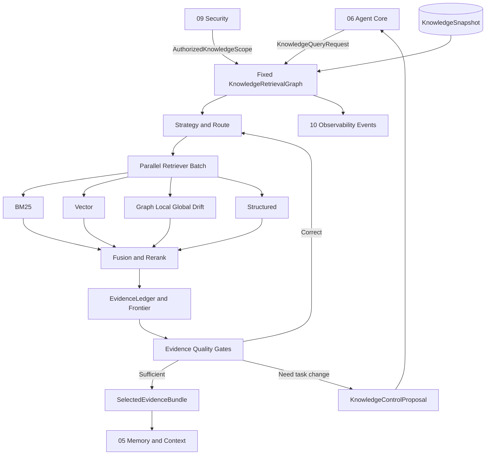

# 03 Knowledge / Agentic GraphRAG

updated: 2026-07-14
status: normative-target-module-architecture
module_number: 03
formal_path: `docs/modules/03-knowledge-agentic-graphrag.md`

> 本文是 Zuno 第 03 个逻辑模块——Knowledge / Agentic GraphRAG——的唯一正式 Target 架构主设计。
>
> 本文只描述目标架构、规范性 Contract、状态、故障语义、目标代码与数据库规格，不把任何设计描述当作 Current 实现证据。Current、Gap、Measurement 与生产就绪状态由 `docs/status/production-readiness.md` 和 `docs/evidence/` 维护。
>
> Agentic GraphRAG 不是“所有问题固定执行更多 Retriever”，也不是产品级 Multi-Agent Runtime。它是 Agent Core 外层任务控制与 Knowledge 内层证据获取控制共同组成的受治理闭环。

## 0. 文档边界与规范层级

本文统一承载：

```text
问题、目标与非目标
Agentic GraphRAG 概念架构
索引、检索、证据与版本的完整运行流程
KnowledgeRetrievalGraph、状态机和并发语义
Agent Core、Memory & Context、Security、Observability 的边界
Typed Contract、错误、Retry、Corrective Retrieval 与 Replan
KnowledgeVersion、KnowledgeSnapshot、配置、持久化与事务
目标代码目录、数据库、Migration、测试与完成证据
```

文档边界：

```text
docs/modules/03-knowledge-agentic-graphrag.md
    Knowledge / Agentic GraphRAG 唯一 Target 架构事实源。

.agent/programs/
    Current → Target 的实现、迁移、切流、回滚和收口 Program。

docs/status/
    Current、Gap、Measurement Blocked、Quality Proven 与 Production Readiness。

docs/evidence/
    可复现的代码、测试、Trace、Eval、Release Gate 和运行证据索引。
```

规范优先级：

```text
全局不可变原则与已接受 ADR / 共享 Contract Registry
→ 本模块 Target 架构
→ 总架构的跨模块集成视图
→ 已确认 Program
→ 代码、Migration 与部署配置
```

Part I–IV 是概念、流程和控制语义；Part V–VII 是 Contract、持久化和实现规格；Part VIII 定义 Requirement、测试与完成证据。说明性示例不得覆盖规范性字段、状态机和不变量。

---

# Part I：问题、定义与模块边界

## 1. 为什么需要 Agentic GraphRAG

固定 RAG 或固定 GraphRAG Pipeline 对简单问题可以稳定工作，但面对企业知识场景会出现：

```text
不需要检索的任务仍然检索，增加噪声与成本
简单事实和复杂多跳问题使用同一条路径
首轮命中相关文档，但缺少回答所需的具体 SourceSpan
图谱给出关系，却无法回到可引用原文
新旧制度、草稿与正式版本冲突时只按相似度排序
首轮检索失败后仅扩大 Top-K，无法识别真正缺失的证据
多个知识库并行检索时混用不同版本、权限和安全 Epoch
检索结果已经充分，系统仍继续执行昂贵 Graph 或模型调用
检索证据不足，生成模型却继续形成确定性结论
最终回答质量变化无法归因于 Graph、Agentic、模型或更大预算
```

一句话定义：

> Agentic GraphRAG 是由 Agent Core 决定“是否、何时、为什么检索”，由 Knowledge 在固定安全、版本、预算和 Profile 边界内，根据问题与 Evidence Ledger 动态决定“查什么、走哪些路径、是否补检以及何时停止”的证据获取控制系统。

## 2. 普通 GraphRAG 与 Agentic GraphRAG

```text
普通 GraphRAG
    预先定义 Graph Local / Global / Community 等路径，
    按固定 Pipeline 或固定规则路由查询图谱和文本。

Agentic GraphRAG
    先建立 Evidence Requirement，
    再按当前证据状态动态选择 Text / Vector / Graph / Corrective Action，
    每轮观察结果、更新缺口、判断边际收益并受治理停止。
```

关键区别：

| 维度 | 普通 GraphRAG | Agentic GraphRAG |
| --- | --- | --- |
| 是否检索 | 通常进入 Pipeline 即检索 | Agent Core 明确产生 RetrievalNeedDecision |
| Graph 地位 | 默认或主要检索路径 | 可选能力，不保证每次启用 |
| 路径 | 固定 Pipeline / 固定规则 | 动态 RetrievalPlan + RetrievalRound |
| 首轮失败 | 空结果、扩大 Top-K 或直接回答 | Quality Gate 后选择具体纠正动作 |
| 多轮状态 | 通常无跨轮事实 | EvidenceLedger、EvidenceFrontier、缺口和无进展计数 |
| 停止 | Pipeline 结束 | 充分、无增益、预算、澄清、安全或不可回答 |
| 控制边界 | Pipeline 内部 | Agent Core 外层控制 + Knowledge 内层控制 |
| 评测 | 最终答案或检索分数 | 路由、每轮增益、停止、证据与最终答案联合评测 |

固定多路检索不等于 Agentic：

```text
BM25 + Vector + Graph 每次全部运行
    = 静态 Hybrid GraphRAG

根据问题与首轮证据选择 BM25 / Vector / Graph，
结果不足后改变下一轮动作，
证据充分后提前停止
    = Agentic Retrieval
```

## 3. 产品 Profile、索引能力、控制 Policy 与内部方法

四个层次必须分开：

```text
Product Retrieval Profile
    STANDARD | DEEP
    用户和 Workspace 可见的产品选择。

Knowledge Capability
    TEXT | VECTOR | GRAPH | STRUCTURED | MULTIMODAL
    KnowledgeVersion 实际具备的索引能力。

Retrieval Control Policy
    可用动作、预算、并发、停止和降级边界。
    由配置和 Agent Core Request 共同确定。

Internal Query Method
    DIRECT、REWRITE、MULTI_QUERY、STEP_BACK、HYDE、
    GRAPH_LOCAL、GRAPH_GLOBAL、GRAPH_DRIFT 等内部动作。
```

强制原则：

1. `DEEP` 允许使用 Graph，但不强制使用 Graph。
2. `STANDARD` 仍可由 Agent Core 判断是否检索，但 Knowledge 的动作、轮次和成本上限更严格。
3. 用户显式选择 `STANDARD` 时不得静默升级为 `DEEP`。
4. KnowledgeVersion 没有 Graph capability 时，Agent 不得伪造 GraphRAG；必须记录 capability unavailable 与 fallback。
5. 前端不得把 Local / Global / Drift、Top-K、RRF、Graph hop 作为普通用户必须理解的模式。

## 4. 模块职责

Knowledge 负责：

```text
KnowledgeSpace、KnowledgeVersion、KnowledgeSnapshot 领域事实
Chunk、ParentChunk、CitationChunk、Entity、Relation、Community 的逻辑规格
IndexSpec、Knowledge Acceptance、Cutover 决策与服务版本
EvidenceRequirement 的检索解释
QueryStrategyDecision 与 RetrievalPlan
Retriever Adapter、RetrieverAttempt 与结果归一化
BM25 / Vector / Graph / Structured 检索编排
Fusion、Rerank、Parent / Adjacent Expansion
EvidenceLedger、EvidenceFrontier、CitationLineage
Authority、Temporal Validity、Supersedes 与 Conflict 判定
RetrievalQualityVerdict、CorrectiveRetrievalDecision
KnowledgeRetrievalOutcome 与 KnowledgeControlProposal
文档删除、版本替换与索引可召回性收口
Knowledge 领域事件、Outbox 与运行 Trace 关联
```

Knowledge 不负责：

```text
原始文件上传、OCR、解析和 CanonicalDocumentIR
决定 Agent 整体任务是否完成
创建或激活 Agent PlanVersion
直接调用模型 Provider SDK
执行互联网搜索、Shell、Browser 或第三方 API
批准权限、外部副作用或扩大 ACL
组装最终 ContextPack
生成或发布最终答案
拥有 Trace / Eval Projection
拥有物理存储健康、Queue、Lease 或 ServingWatermark primitive
保存隐藏思维链
```

## 5. Cross-module Ownership

| 模块 | Owns | 与 Knowledge 的边界 |
| --- | --- | --- |
| 01 Product Surface | 用户选择、Knowledge Scope 意图、STANDARD/DEEP 偏好 | 不直接提交内部 Retriever 参数 |
| 02 Input / Ingestion | DocumentVersion、CanonicalDocumentIR、SourceSpan | 通过不可变 IndexableDocumentSnapshot 交付 |
| 03 Knowledge | KnowledgeVersion、Snapshot、RetrievalRound、Evidence、CitationLineage | 本文 |
| 04 Model Gateway | ModelInvocation、Routing、Usage、Provider Failure | Knowledge 只按 model role / slot 请求 |
| 05 Memory & Context | ContextPack、Context Budget、Memory Candidate | 只消费 SelectedEvidenceBundle，不重做检索事实 |
| 06 Agent Core | Run、Goal、Plan、Step、Budget、Replan、Outcome | 决定 why/when；Knowledge 决定 how |
| 07 Capability / Skill | CapabilityDefinition、SkillDefinition | Knowledge capability 可被 Skill 引用，不归其拥有 |
| 08 Tool Runtime | External Tool execution 与外部副作用 | External search 只能由 Knowledge 提议 |
| 09 Security | Authorization、ACL、Security Epoch、Disclosure、Approval | Knowledge 强制执行授权结果，不扩大权限 |
| 10 Observability & Eval | Trace/Eval/Metric Projection、Benchmark、Release Gate | Knowledge 产生 typed events，不拥有评测结论 |
| 11 Infrastructure | Store、Index writer、Queue、Lease、Visibility、ServingWatermark primitive | 不拥有 KnowledgeVersion acceptance/cutover 语义 |

核心边界：

```text
Agent Core owns:
    Why / When / Evidence Goal / Step / Task Budget /
    Continue Task / Replan / Ask User / Abstain / Finalize

Knowledge owns:
    Query Interpretation / Retriever Path / Graph Route /
    Fusion / Evidence Quality / Corrective Retrieval /
    Stop Proposal inside the Knowledge Step

Memory & Context owns:
    Selected Evidence → ContextPack

Observability & Eval owns:
    Trace/Eval projection and quality claim
```

---

# Part II：总体架构与完整运行流程

## 6. 概念架构



总体运行由两层闭环组成：

```text
外层 Agent Core Loop
    Task → Plan → Knowledge Step → Observation → Continue / Replan / Finalize

内层 Knowledge Retrieval Loop
    Strategy → Retrieve → Fuse → Evaluate → Correct / Stop
```

Knowledge 内层循环不得自行创建新的任务目标或工具 Step。

## 7. 索引构建与 KnowledgeVersion 生命周期

```text
02 IndexableDocumentSnapshot
→ Validate SourceSpan / document version / security metadata
→ Create immutable IndexSpec
→ Create KnowledgeVersion BUILDING
→ Dispatch physical build requests to Infrastructure adapters
→ receive write / visibility / verification receipts
→ Knowledge validation
→ Knowledge Acceptance
→ Cutover active version
→ issue KnowledgeSnapshot references
```

### 7.1 输入 Contract

每个可索引文档必须固定：

```yaml
IndexableDocumentSnapshot:
  tenant_id: string
  workspace_id: string
  knowledge_space_id: string
  document_id: string
  document_version_id: string
  canonical_document_ir_ref: string
  source_span_manifest_ref: string
  content_hash: string
  metadata_hash: string
  security_epoch_ref: string
  data_classification: string
  ingestion_completion_ref: string
```

缺少 SourceSpan Manifest、Content Hash、DocumentVersion 或 Security metadata 时，KnowledgeVersion 不得进入 `ACCEPTED`。

### 7.2 三种检索粒度

```text
CitationChunk
    检索和严格引用的最小稳定单元。

ParentChunk
    Context 扩展单元，不替代 CitationChunk 的 SourceSpan。

SourceSpan
    原始文档定位、Citation 和审计单元。
```

Graph 节点和边必须带 Evidence Backlink：

```text
Entity / Relation / Community Claim
→ EvidenceEdge
→ CitationChunk
→ SourceSpan
→ DocumentVersion
```

没有 SourceSpan 的图结果只能标记为 `AUXILIARY_ONLY`。

### 7.3 KnowledgeVersion 状态机

```text
DRAFT
→ VALIDATING_INPUT
→ BUILDING
→ VERIFYING
→ ACCEPTANCE_PENDING
→ ACCEPTED
→ ACTIVE
→ SUPERSEDED
→ RETIRING
→ RETIRED
```

失败状态：

```text
VALIDATION_FAILED
BUILD_FAILED
VERIFICATION_FAILED
ACCEPTANCE_REJECTED
CUTOVER_FAILED
RETIREMENT_BLOCKED
```

不变量：

1. `ACTIVE` 版本必须已 `ACCEPTED`。
2. 同一 KnowledgeSpace 的服务流量只能解析到明确 Active Version 或固定 Snapshot。
3. `PlanVersion` / `AgentRun` 已固定的 KnowledgeSnapshot 不因新 Cutover 静默变化。
4. 新版本构建时旧 Active Version 继续服务。
5. 回滚是新的 Cutover 决策，不修改历史版本状态。
6. Infrastructure receipt 证明物理动作发生，不等于 Knowledge Acceptance。

## 8. Agent Core 发起检索

Agent Core 在创建 Knowledge Step 前完成：

```text
Task Analysis
→ RetrievalNeedDecision
→ EvidenceRequirement[]
→ Knowledge Scope intent
→ Security authorization
→ Retrieval Profile ceiling
→ Retrieval Budget reservation
→ KnowledgeQueryRequest
```

Knowledge 不根据一个裸字符串自行推断全部任务目标。

```yaml
KnowledgeQueryRequest:
  request_id: string
  run_id: string
  plan_version_id: string
  step_run_id: string
  goal_version_id: string
  user_query: string
  task_summary: string
  evidence_requirements: [EvidenceRequirement]
  requested_knowledge_space_ids: [string]
  requested_profile: STANDARD | DEEP
  answer_policy_ref: string
  authorization_context_ref: string
  authorized_scope_ref: string
  execution_context_snapshot_ref: string
  retrieval_budget_ref: string
  deadline_at: datetime
  idempotency_key: string
  trace_context: object
```

## 9. 固定 KnowledgeRetrievalGraph

Knowledge 使用固定控制图，动态内容只存在于 `RetrievalPlan` 和 `RetrievalRound`：

```text
START
→ validate_request
→ resolve_snapshot
→ validate_authorized_scope
→ interpret_evidence_requirements
→ select_effective_profile
→ plan_retrieval_round
→ admit_retriever_actions
→ dispatch_retriever_batch
→ normalize_results
→ fuse_and_rerank
→ expand_context_candidates
→ update_evidence_ledger
→ evaluate_evidence
→ decide_corrective_action
   ├── next_round
   ├── stop_sufficient
   ├── ask_user_proposal
   ├── external_search_proposal
   ├── replan_required
   └── abstain_proposal
→ build_outcome
→ persist_and_emit
→ END
```

固定图负责治理；动态 RetrievalPlan 负责适应问题。

### 9.1 KnowledgeGraphState

只保存图控制所需小状态和引用：

```yaml
KnowledgeGraphState:
  knowledge_query_run_id: string
  request_ref: string
  snapshot_refs: [string]
  effective_profile_ref: string
  current_round_no: int
  active_retriever_attempt_refs: [string]
  evidence_ledger_ref: string
  evidence_frontier_ref: string
  latest_quality_verdict_ref: string | null
  latest_control_decision_ref: string | null
  remaining_budget_ref: string
  deadline_at: datetime
  status: string
```

完整 Evidence、Retriever payload 和结果对象保存在 PostgreSQL / Object Store，不写入 LangGraph Checkpointer。

## 10. STANDARD 完整流程

STANDARD 是受限 Agentic Profile，不是完全无控制的静态调用：

```text
Validate request and scope
→ pin KnowledgeSnapshot
→ DIRECT query by default
→ BM25 + Vector in parallel
→ normalize + RRF
→ optional deterministic or configured rerank
→ deduplicate SourceSpan
→ Evidence Quality Gate
→ optional one focused citation repair
→ sufficient / insufficient / abstain proposal
```

默认约束：

```text
max_retrieval_rounds: 1
optional focused citation repair: 1
Graph: disabled unless explicit policy exception is confirmed
Query rewrite: deterministic only or disabled
External search: proposal only
```

STANDARD 的目标是：

```text
简单事实不退化
延迟和成本可预测
严格引用可验证
没有足够证据时不编造
```

## 11. DEEP / Agentic GraphRAG 完整流程

```text
Evidence Requirement interpretation
→ complexity and query strategy proposal
→ first-round breadth retrieval
→ EvidenceLedger / EvidenceFrontier
→ requirement-level quality evaluation
→ targeted corrective action
→ optional Graph route or graph expansion
→ conflict / temporal / citation repair
→ marginal-utility stop decision
→ SelectedEvidenceBundle or control proposal
```

DEEP 允许但不强制：

```text
REWRITE
MULTI_QUERY
STEP_BACK
HYDE
ENTITY_DECOMPOSITION
RELATION_QUERY
PARENT_EXPAND
ADJACENT_SPAN_EXPAND
GRAPH_LOCAL
GRAPH_GLOBAL
GRAPH_DRIFT
FOCUSED_CITATION
CONFLICT_RETRIEVE
```

DEEP 必须先做预期收益判断。Graph、HyDE 或模型 Critic 的预期收益低于额外成本时应跳过。

## 12. Graph 路由

### 12.1 Graph Local

适用于明确实体、关系和多跳问题：

```text
Grounded text / entity anchors
→ entity resolution
→ bounded neighborhood / path traversal
→ path scoring
→ supporting CitationChunk backfill
→ SourceSpan validation
→ graph evidence records
```

强制要求：

1. 入口优先来自已授权文本命中或高置信实体。
2. 最大 hop、path、fanout 受 Policy 与 Budget 双重限制。
3. 每条可选 Path 必须记录 entry、edges、score、version 和 evidence refs。
4. Graph Path 不能代替原始 SourceSpan。
5. 循环、超大 hub、低置信归一化必须被抑制。

### 12.2 Graph Global / Community

适用于 corpus-level 主题、模式、风险和整体总结：

```text
Question intent
→ eligible community version
→ community report retrieval
→ partial evidence selection
→ underlying source backfill
→ diversity and coverage evaluation
→ SelectedEvidence
```

Community Summary 不能作为唯一严格引用。最终 Claim 必须绑定到基础 SourceSpan 或明确声明为非严格辅助总结。

### 12.3 Graph Drift

适用于从高置信局部入口逐步扩展、但不能预先确定完整路径的问题：

```text
grounded seed
→ local graph observation
→ unresolved hop
→ bounded drift proposal
→ retrieve supporting text
→ update frontier
→ stop on closure or low gain
```

DRIFT 不是无限游走；每次扩展必须绑定未解决 Evidence Requirement、预算和 novelty。

## 13. 多知识库选择与并行

Agent Core 提交允许候选范围；Knowledge 可以在该范围内选择实际 KnowledgeSpace：

```text
Authorized Candidate Scope
∩ User task selection
∩ Workspace policy
∩ Snapshot availability
= Eligible KnowledgeSpace Set
```

多库运行：

```text
resolve per-space KnowledgeSnapshot
→ create per-space RetrieverAction
→ parallel dispatch where safe
→ normalize authority and scores
→ merge by Evidence Requirement
→ preserve space and version lineage
```

不得：

```text
把不同知识库的原始相似度直接比较
把一个库的 ACL 结果复用到另一个库
在同一 EvidenceRecord 中丢失 knowledge_space_id
因某个库失败而静默扩大到未授权库
```

## 14. Evidence Requirement 与 Evidence Frontier

```yaml
EvidenceRequirement:
  requirement_id: string
  claim_intent: string
  requirement_type: FACT | RELATION | PROCEDURE | TEMPORAL | GLOBAL | CONFLICT | CITATION
  required_source_types: [string]
  minimum_authority: string | null
  temporal_requirement: CURRENT | AS_OF | HISTORICAL | ANY
  as_of_time: datetime | null
  minimum_independent_sources: int
  strict_citation_required: boolean
  completion_criteria: object
```

多跳任务使用 Evidence Frontier，避免首轮错误路径锁死：

```yaml
EvidenceFrontier:
  frontier_id: string
  anchor_evidence_refs: [string]
  unresolved_requirement_refs: [string]
  unresolved_hops: [EvidenceHop]
  candidate_entity_refs: [string]
  explored_path_refs: [string]
  rejected_path_refs: [string]
  frontier_status: OPEN | SUFFICIENT | EXHAUSTED
  version: int
```

每个新动作必须指向至少一个未解决 Requirement 或 Citation 修复目标。

## 15. Fusion、Rerank 与 Selection

```text
BM25 ---------\
Vector --------\
Graph ----------> normalize → fusion → rerank → dedup → evidence selection
Structured -----/
```

规范：

1. 不同 Retriever 的原始分数不可直接比较。
2. Fusion 默认使用版本化 RRF / rank fusion Policy。
3. Rerank 只处理有界 Candidate Pool。
4. Model reranker 通过 Model Gateway role 调用。
5. Parent Expansion 发生在基础 CitationChunk 选中后。
6. 相同 SourceSpan、重复 Chunk、Parent/Child 重叠必须去重。
7. Selection 记录 rank_before、rank_after、reason、budget cost。
8. Context Budget 不是无限扩展理由；最终进入 Context 的是 SelectedEvidence，不是全部 Candidate。

## 16. Evidence Quality Gates

质量评价分层：

```text
Retriever Result Validation
→ Evidence Relevance
→ Requirement Coverage
→ Authority and Temporal Validity
→ Conflict Detection
→ Citation Eligibility
→ Novelty / Marginal Utility
→ Retrieval Stop Decision
```

```yaml
RetrievalQualityVerdict:
  verdict_id: string
  knowledge_query_run_id: string
  round_id: string
  status: SUFFICIENT | PARTIAL | AMBIGUOUS | IRRELEVANT | CONFLICTING | UNAVAILABLE
  satisfied_requirement_refs: [string]
  unresolved_requirement_refs: [string]
  relevance_score: number | null
  requirement_coverage: number
  source_span_coverage: number
  authority_status: PASS | FAIL | UNKNOWN
  temporal_status: PASS | FAIL | UNKNOWN
  conflict_status: NONE | RESOLVED | UNRESOLVED
  novelty_since_previous_round: number
  expected_next_round_gain: number | null
  citation_eligible_evidence_refs: [string]
  auxiliary_evidence_refs: [string]
  reason_codes: [string]
```

模型 Critic 可以产生 Proposal，但确定性字段、SourceSpan、版本、ACL、Citation Eligibility 和预算由代码验证。

## 17. Corrective Retrieval

Corrective Retrieval 表示“原 Knowledge Step 和 Evidence Requirement 仍然正确，只调整获取证据的方法”。

| Failure / Gap | 默认动作 |
| --- | --- |
| `doc_miss` | REWRITE、MULTI_QUERY、STEP_BACK、HYDE（若允许） |
| `doc_hit_text_miss` | Parent、Adjacent、Graph Local、Structured lookup |
| `text_hit_citation_miss` | FOCUSED_CITATION、SourceSpan backfill |
| `relation_gap` | ENTITY_DECOMPOSITION、GRAPH_LOCAL、DRIFT |
| `global_coverage_gap` | GRAPH_GLOBAL、community + source backfill |
| `temporal_gap` | version / effective-time focused retrieval |
| `conflicting_evidence` | retrieve both sides、authority / supersedes resolution |
| `permission_filtered` | 不扩大权限；返回受限缺口 |
| `capability_unavailable` | fallback to available route or control proposal |
| `no_progress` | stop / ask user / abstain proposal |

```yaml
CorrectiveRetrievalDecision:
  decision_id: string
  round_id: string
  action: string
  target_requirement_refs: [string]
  reason_codes: [string]
  expected_gain: number | null
  reserved_budget_ref: string | null
  next_round_query_specs: [object]
  requires_agent_core_decision: boolean
```

## 18. Retry、Corrective Retrieval 与 Replan

三者必须分开：

```text
Retry
    相同动作、相同语义、执行因瞬时故障失败。
    例如 Retriever timeout、临时连接错误。

Corrective Retrieval
    Evidence Goal 不变，但查询、路径或检索器需要调整。
    例如 Rewrite、Parent expansion、Graph expansion。

Replan
    任务结构、依赖、数据源或能力假设失效。
    例如需要先解析附件、调用日志工具、获得用户授权。
```

Knowledge 可以提交 `REPLAN_REQUIRED` Proposal，但只有 Agent Core 可以创建新 PlanVersion。

## 19. 停止与控制输出

内层停止原因：

```text
REQUIREMENTS_SATISFIED
NO_PROGRESS
ROUND_LIMIT
BUDGET_EXHAUSTED
DEADLINE_REACHED
SECURITY_BLOCKED
CAPABILITY_UNAVAILABLE
USER_CLARIFICATION_REQUIRED
EXTERNAL_EVIDENCE_REQUIRED
UNRESOLVED_CONFLICT
NO_SAFE_PATH
CANCELLED
```

Knowledge 的输出只允许：

```text
SUFFICIENT_EVIDENCE
PARTIAL_EVIDENCE
ASK_USER_PROPOSAL
EXTERNAL_SEARCH_PROPOSAL
REPLAN_REQUIRED
ABSTAIN_PROPOSAL
FAILED
CANCELLED
```

最终 Ask User、External Tool Step、Replan、Abstain 和 Answer Finalization 由 Agent Core 决定。

---

# Part III：状态、并发、有效性与恢复

## 20. 领域状态与 Checkpointer 边界

PostgreSQL 保存领域事实：

```text
KnowledgeQueryRun
RetrievalRound
RetrieverAttempt
EvidenceRecord
EvidenceLedger
EvidenceFrontier
QualityVerdict
CorrectiveDecision
KnowledgeVersion
KnowledgeSnapshot
KnowledgeControlProposal
```

LangGraph Checkpointer 保存：

```text
当前节点
待执行边
小型控制状态引用
Interrupt / Resume token
当前轮次和 active attempt refs
```

不变量：

```text
Domain Store 是证据、轮次和终态事实源
Checkpointer 是图控制位置事实源
恢复时先读取 Domain Store，再恢复/重放图控制
不得仅凭 checkpoint 推断 Retriever effect 未发生
```

## 21. KnowledgeQueryRun 状态机

```text
CREATED
→ VALIDATING
→ SNAPSHOT_PINNED
→ PLANNING
→ RETRIEVING
→ EVALUATING
→ CORRECTING
→ OUTCOME_PENDING
→ COMPLETED
```

可选终态：

```text
PARTIAL
CONTROL_PROPOSAL_EMITTED
FAILED
CANCELLED
EXPIRED
```

状态规则：

1. `COMPLETED` 必须有不可变 Outcome。
2. `CONTROL_PROPOSAL_EMITTED` 不代表 Agent Core 已接受 Proposal。
3. `FAILED` 必须有 FailureRecord 与可重试分类。
4. 终态不可原地回到活动状态；新尝试创建新的 attempt / run generation。
5. 超时晚到结果不得改变已终结 Outcome。

## 22. RetrievalRound 状态机

```text
PLANNED
→ ADMITTED
→ DISPATCHED
→ COLLECTING
→ FUSED
→ EVALUATED
→ COMPLETED
```

异常终态：

```text
PARTIAL
FAILED
CANCELLED
EXPIRED
SUPERSEDED
```

Round 是 append-only attempt。Corrective Retrieval 创建下一 Round，不修改上一 Round 的 Query 和结果。

## 23. RetrieverAttempt 状态机

```text
CREATED
→ ADMITTED
→ DISPATCHED
→ RUNNING
→ RESULT_RECEIVED
→ VALIDATED
→ COMMITTED
```

异常终态：

```text
REJECTED
RETRYABLE_FAILED
PERMANENT_FAILED
TIMED_OUT
CANCELLED
LATE_IGNORED
```

`RESULT_RECEIVED` 不等于 `COMMITTED`；必须通过 schema、scope、snapshot、security epoch、payload hash 和 deadline 验证。

## 24. 并行与 Join

BM25、Vector、Graph 和 Structured Retriever 可以并行，前提是：

```text
相互无数据依赖
共享 Snapshot 已固定
不会写同一外部可变资源
预算 Reservation 已成功
安全门和配额允许
JoinPolicy 已确定
```

```yaml
RetrieverBatch:
  batch_id: string
  round_id: string
  action_refs: [string]
  join_policy: ALL_REQUIRED | QUORUM | BEST_EFFORT | DEADLINE_BOUNDED
  minimum_success_count: int
  deadline_at: datetime
  reducer_policy_ref: string
```

Join 规则：

1. RetrieverResult 使用 `attempt_id + result_hash` 幂等提交。
2. 同一 attempt 相同 hash 重复到达可 ACK。
3. 同一 attempt 不同 hash 必须 quarantine。
4. 部分失败是否继续由 JoinPolicy 和 Requirement Coverage 决定。
5. Join 完成后晚到结果标记 `LATE_IGNORED`，不能污染当前 Outcome。
6. Graph 与文本结果在 Evidence 层融合，不直接合并原始 payload。

## 25. 结果有效性与 Taint

结果有效需要同时满足：

```text
attempt belongs to active round
round belongs to active run generation
snapshot id/hash matches
security epoch remains valid or has passed revalidation
deadline not exceeded
payload schema/hash valid
producer capability/version compatible
result not revoked or superseded
```

Taint 来源：

```text
security revocation
document deletion
snapshot retirement
index corruption
provider result integrity failure
conflicting duplicate
late result after cancellation
```

Tainted Evidence 不得进入新的 ContextPack；已发布回答是否需要后续处置由产品与治理流程决定。

## 26. Budget

Agent Core 拥有任务 Budget；Knowledge 使用受委托 Retrieval Budget：

```yaml
RetrievalBudget:
  budget_ref: string
  max_rounds: int
  max_retriever_attempts: int
  max_parallel_actions: int
  max_candidate_count: int
  max_graph_hops: int
  max_graph_paths: int
  max_model_calls: int
  max_tokens: int
  max_cost: number
  deadline_at: datetime
```

动作前必须 Reservation，动作完成后 Settlement：

```text
estimate
→ reserve
→ execute
→ settle actual
→ release unused
```

Knowledge 不得自行提高 Budget。预算不足时返回有证据的 Partial / Proposal，而不是无界继续。

## 27. Cancellation、Deadline 与 Signal

Agent Core 的 Cancel / Deadline Signal 必须传播到：

```text
KnowledgeQueryRun
RetrievalRound
RetrieverBatch
RetrieverAttempt
Model Gateway request
Infrastructure query adapter
```

无法取消的底层请求返回后执行 late-result guard。取消不是失败重试理由。

可恢复 Interrupt 只用于：

```text
等待 Agent Core 对 external search / ask user / replan Proposal 的决定
等待必须的 Security re-authorization
等待运维批准的 Knowledge maintenance action
```

普通 Retriever timeout 不创建人工 Interrupt。

## 28. Recovery 与 Reconciliation

恢复流程：

```text
load KnowledgeQueryRun and terminal facts
→ inspect active rounds and attempts
→ compare checkpointer node
→ reconcile adapter receipts / result commits
→ mark orphan or late attempts
→ resume from first uncommitted deterministic node
```

规则：

1. 已提交 EvidenceRecord 不重复创建。
2. 已完成 RetrieverAttempt 不重复执行，除非 Policy 创建新 attempt。
3. 不确定外部 Query 是否执行时先 Reconcile receipt，再决定 retry。
4. Checkpoint 存在而领域 Run 不存在时 quarantine，不伪造领域事实。
5. 领域 Run 已终态而图未结束时以领域终态为准，清理控制状态。
6. Worker Lease 过期后使用 fencing token 防止旧 worker 提交。

---

# Part IV：配置、安全、模型与可观测性

## 29. KnowledgeSpace 配置模型

用户配置、不可变构建规格和只读运行事实必须拆开。

### 29.1 KnowledgeSpaceIntent

```yaml
KnowledgeSpaceIntent:
  knowledge_space_id: string
  name: string
  purpose: string
  owner_ref: string
  default_profile: STANDARD | DEEP
  allowed_profiles: [STANDARD, DEEP]
  agent_auto_select_allowed: boolean
  strict_citation_policy: AUTO | REQUIRED
  external_evidence_policy: DENY | REQUIRE_APPROVAL | ALLOW_IF_INSUFFICIENT
  requested_capabilities: [TEXT, VECTOR, GRAPH, STRUCTURED, MULTIMODAL]
  retrieval_policy_ref: string
  chunk_profile_ref: string
  graph_profile_ref: string | null
  model_slot_binding_ref: string
  security_policy_ref: string
  version: int
```

### 29.2 IndexSpec

```yaml
IndexSpec:
  index_spec_id: string
  knowledge_version_id: string
  document_set_version: string
  chunk_policy_version: string
  parser_contract_version: string
  embedding_slot_ref: string
  bm25_schema_version: string
  vector_schema_version: string
  graph_schema_version: string | null
  graph_extractor_profile_ref: string | null
  source_span_required: boolean
  content_hash: string
  spec_hash: string
```

IndexSpec 激活后不可变。

### 29.3 ServingProjection

```yaml
KnowledgeServingProjection:
  knowledge_space_id: string
  active_knowledge_version_id: string | null
  building_knowledge_version_ids: [string]
  capability_status: map<string,string>
  verification_status: string
  acceptance_status: string
  serving_watermark_ref: string | null
  last_successful_cutover_at: datetime | null
  projection_freshness: datetime
```

前端不得提交 `health_status=ready` 等运行事实。

## 30. RetrievalProfileDefinition

```yaml
RetrievalProfileDefinition:
  profile_id: string
  profile_type: STANDARD | DEEP
  allowed_actions: [string]
  max_rounds: int
  max_parallel_queries: int
  max_retriever_attempts_per_round: int
  candidate_pool_default: int
  candidate_pool_max: int
  evidence_limit_default: int
  evidence_limit_max: int
  graph_policy_ref: string | null
  corrective_policy_ref: string
  evidence_policy_ref: string
  latency_slo_ms: int
  cost_ceiling: number
  version: int
```

管理员配置边界；Agent 选择本次实际动作和值。

## 31. Security

Security 在检索前产生授权事实：

```yaml
AuthorizedKnowledgeScope:
  authorization_decision_ref: string
  principal_context_ref: string
  tenant_id: string
  workspace_id: string
  allowed_knowledge_space_ids: [string]
  allowed_document_filters: object
  denied_document_refs: [string]
  effective_security_epoch_ref: string
  disclosure_policy_ref: string
  external_model_policy_ref: string
  expires_at: datetime
```

强制不变量：

1. ACL filter 必须进入 Retriever Query，不先召回敏感内容再在 Python 后过滤。
2. Agent 自动选库只能从 Authorized Scope 中缩小，不能扩大。
3. Graph traversal 的每个节点、边和支持文本都必须满足授权范围。
4. Fusion/Rerank 不得看到被拒绝文档内容。
5. Security Epoch 变化时，未提交结果必须重验；被撤销结果 taint。
6. External search Proposal 不得携带受保护原文，除非 Security 明确允许。
7. Trace/Event 只保存经 Redaction 的摘要、引用和 hash。

## 32. Model Roles

Knowledge 可能使用：

```text
QUERY_REWRITER
EXTRACTOR
CRITIC
EXECUTOR_FAST
EXECUTOR_REASONING
```

调用必须通过 Model Gateway。

模型只能产生 Proposal：

```text
Query rewrite proposal
Entity decomposition proposal
Graph route proposal
Evidence relevance proposal
Corrective action proposal
```

模型不能：

```text
扩大 ACL
创建最终 EvidenceRecord
伪造 SourceSpan
激活 KnowledgeVersion
批准 external search
提高 Budget
提交最终任务 Outcome
```

弱模型失败升级链：

```text
QUERY_REWRITER / EXECUTOR_FAST
→ 参数修正与 bounded retry
→ EXECUTOR_REASONING
→ CRITIC 判断 retry / alternative route / stop proposal
```

## 33. Domain Events 与 Observability

Knowledge 产生版本化事件：

```text
KnowledgeQueryRequested
KnowledgeSnapshotPinned
RetrievalProfileResolved
RetrievalRoundPlanned
RetrieverAttemptStarted
RetrieverAttemptCompleted
RetrieverAttemptFailed
GraphRouteDecided
EvidenceCommitted
EvidenceQualityEvaluated
CorrectiveRetrievalDecided
RetrievalStopped
KnowledgeControlProposalEmitted
KnowledgeRetrievalOutcomeCommitted
KnowledgeVersionStateChanged
KnowledgeVersionCutover
KnowledgeEvidenceRevoked
```

事件最小字段：

```yaml
KnowledgeRuntimeEvent:
  event_id: string
  event_type: string
  event_version: string
  tenant_id: string
  workspace_id: string
  run_id: string | null
  step_run_id: string | null
  knowledge_query_run_id: string
  round_id: string | null
  attempt_id: string | null
  knowledge_space_id: string | null
  knowledge_snapshot_ref: string | null
  requested_profile: string | null
  effective_profile: string | null
  reason_codes: [string]
  budget_delta_ref: string | null
  authorization_decision_ref: string
  security_epoch_ref: string
  trace_id: string
  payload_ref: string | null
  payload_hash: string
  occurred_at: datetime
```

禁止在普通事件中记录完整文档文本、Prompt、隐藏思维链、凭证或未脱敏用户数据。

## 34. Agentic GraphRAG Eval

至少比较：

```text
standard_rag
fixed_graphrag
agentic_text_rag
agentic_graphrag
```

可选第五组：

```text
agentic_graphrag_external_evidence
```

控制变量：

```text
相同 Dataset Version / Case Set Hash
相同 Corpus Manifest / KnowledgeSnapshot
相同 Security Scope
相同生成模型和 Model Routing Policy
相同 Judge Policy 和 Metric Definition
相同 Answer / Citation Policy
```

题型至少包括：

```text
simple_fact
exact_clause
single_document
multi_document
multi_hop_relation
global_theme
temporal_version
conflicting_evidence
no_answer
permission_filtered
stale_index
citation_repair
```

检索过程指标：

```text
Retrieval Need Precision / Recall
Profile Routing Accuracy
Retriever Selection Gain
Graph Routing Precision / Recall
Evidence Requirement Coverage
Evidence Recall / Precision
Citation Eligibility Accuracy
Corrective Action Success Rate
Novel Evidence Gain per Round
No-progress Round Rate
Premature Stop Rate
Over-retrieval Rate
```

最终回答指标：

```text
Answer Correctness
Answer Completeness
Groundedness
Citation Correctness
Citation Completeness
Unsupported Claim Rate
Conflict Disclosure Accuracy
Temporal Validity
Abstention Accuracy
```

效率指标：

```text
P50 / P95 latency
Retriever calls per grounded answer
Model calls and tokens
Graph queries and path expansion
Cost per correct answer
Cost per grounded answer
Timeout / failure / fallback rate
```

质量声明要求：

```text
复杂任务显著改善
简单事实不得明显退化
Citation 和 Unsupported Claim 不得恶化
P95 latency / cost 满足 Profile SLO
Graph 增量收益可从 Agentic 控制收益中分离
```

没有固定可比 Benchmark、Trace completeness 和 Release Gate，不得声明回答质量提高。

---

# Part V：Typed Contract

## 35. QueryStrategyDecision

```yaml
QueryStrategyDecision:
  decision_id: string
  round_id: string
  strategy: DIRECT | REWRITE | MULTI_QUERY | STEP_BACK | HYDE | ENTITY_DECOMPOSITION | RELATION_QUERY
  generated_query_specs: [QuerySpec]
  target_requirement_refs: [string]
  rationale_summary: string
  reason_codes: [string]
  expected_failure_to_fix: string | null
  estimated_budget: object
  model_proposal_ref: string | null
  deterministic_validation_ref: string
```

## 36. RetrieverAction

```yaml
RetrieverAction:
  action_id: string
  round_id: string
  retriever_type: BM25 | VECTOR | GRAPH_LOCAL | GRAPH_GLOBAL | GRAPH_DRIFT | STRUCTURED
  knowledge_snapshot_ref: string
  query_spec_ref: string
  target_requirement_refs: [string]
  metadata_filters: object
  acl_filter_ref: string
  candidate_limit: int
  timeout_ms: int
  graph_constraints: object | null
  budget_reservation_ref: string
  idempotency_key: string
```

External search 不属于 RetrieverAction；它是 Agent Core / Tool Runtime 的外部 Step。

## 37. RetrieverResult

```yaml
RetrieverResult:
  attempt_id: string
  action_id: string
  producer_capability_ref: string
  snapshot_ref: string
  result_items_ref: string
  result_count: int
  raw_score_semantics: string
  visibility_receipt_ref: string | null
  execution_receipt_ref: string
  payload_hash: string
  completed_at: datetime
```

## 38. EvidenceRecord

```yaml
EvidenceRecord:
  evidence_id: string
  knowledge_query_run_id: string
  retrieval_round_id: string
  knowledge_space_id: string
  knowledge_snapshot_ref: string
  source_document_id: string
  document_version_id: string
  citation_chunk_id: string | null
  parent_chunk_id: string | null
  source_span_ref: string | null
  citation_label: string | null
  retriever_type: string
  query_spec_ref: string
  raw_score: number | null
  normalized_score: number | null
  fusion_rank: int | null
  rerank_score: number | null
  graph_path_ref: string | null
  claim_requirement_refs: [string]
  authority_level: string
  effective_time: object | null
  supersedes_refs: [string]
  contradiction_group_ref: string | null
  citation_eligibility: STRICT | SUPPORTING | AUXILIARY_ONLY | REJECTED
  selection_status: CANDIDATE | SELECTED | REJECTED | TAINTED
  selection_reason_codes: [string]
  trace_span_id: string
  evidence_hash: string
```

## 39. EvidenceVerdict

```yaml
EvidenceVerdict:
  verdict_id: string
  knowledge_query_run_id: string
  sufficient: boolean
  authoritative: boolean
  temporally_valid: boolean
  conflicting: boolean
  citation_complete: boolean
  selected_evidence_refs: [string]
  superseded_evidence_refs: [string]
  conflict_refs: [string]
  unresolved_requirement_refs: [string]
  reason_codes: [string]
```

Agent Core 消费 Verdict，但不重定义 Knowledge 的 Authority 与 Citation 规则。

## 40. SelectedEvidenceBundle

```yaml
SelectedEvidenceBundle:
  bundle_id: string
  knowledge_query_run_id: string
  knowledge_snapshot_refs: [string]
  selected_evidence_refs: [string]
  evidence_verdict_ref: string
  citation_lineage_ref: string
  requirement_coverage: map<string,string>
  conflict_summary_ref: string | null
  budget_usage_ref: string
  security_context_ref: string
  bundle_hash: string
```

05 Memory & Context 只消费该 Bundle 并组装 ContextPack；不得把未选 Candidate 静默加入上下文。

## 41. KnowledgeRetrievalOutcome

```yaml
KnowledgeRetrievalOutcome:
  outcome_id: string
  knowledge_query_run_id: string
  status: SUFFICIENT_EVIDENCE | PARTIAL_EVIDENCE | CONTROL_PROPOSAL | FAILED | CANCELLED
  selected_evidence_bundle_ref: string | null
  latest_quality_verdict_ref: string
  control_proposal_ref: string | null
  round_count: int
  stop_reason: string
  requested_profile: STANDARD | DEEP
  effective_profile: STANDARD | DEEP
  actual_route_summary: object
  budget_usage_ref: string
  outcome_hash: string
  committed_at: datetime
```

## 42. KnowledgeControlProposal

```yaml
KnowledgeControlProposal:
  proposal_id: string
  knowledge_query_run_id: string
  proposal_type: ASK_USER | EXTERNAL_SEARCH | REPLAN | ABSTAIN
  unresolved_requirement_refs: [string]
  reason_codes: [string]
  suggested_question: string | null
  suggested_external_query_summary: string | null
  required_capability_refs: [string]
  security_constraints_ref: string
  budget_implication: object
  evidence_refs: [string]
  proposal_hash: string
```

Proposal 不修改 AgentRun / PlanVersion。

## 43. Contract Envelope

跨模块 Contract 必须使用当前冻结的 Canonical Envelope，并至少携带：

```text
tenant_id / workspace_id
run_id / step_run_id
correlation_id / causation_id
idempotency_key
aggregate_id / aggregate_version
expected_generation
security epoch / authorization refs
deadline
trace_id
classification / redaction / audit refs
payload hash / schema hash
```

---

# Part VI：Failure、持久化与事务

## 44. Failure Taxonomy

```text
KNOWLEDGE_REQUEST_INVALID
KNOWLEDGE_SCOPE_EMPTY
KNOWLEDGE_SNAPSHOT_UNAVAILABLE
KNOWLEDGE_SNAPSHOT_STALE
KNOWLEDGE_VERSION_INCOMPATIBLE
KNOWLEDGE_PERMISSION_FILTERED
KNOWLEDGE_SECURITY_EPOCH_CHANGED
RETRIEVER_TIMEOUT
RETRIEVER_UNAVAILABLE
RETRIEVER_RESULT_INVALID
RETRIEVER_DUPLICATE_CONFLICT
GRAPH_CAPABILITY_UNAVAILABLE
GRAPH_ENTRY_UNGROUNDED
GRAPH_PATH_LIMIT_EXCEEDED
EVIDENCE_INSUFFICIENT
EVIDENCE_CONFLICT
SOURCE_SPAN_MISSING
CITATION_INELIGIBLE
RETRIEVAL_NO_PROGRESS
RETRIEVAL_BUDGET_EXHAUSTED
KNOWLEDGE_OUTCOME_COMMIT_FAILED
KNOWLEDGE_CANCELLED
```

## 45. Failure Decision Matrix

| Failure | Owner | Retry | Corrective | Agent Core decision |
| --- | --- | --- | --- | --- |
| Retriever timeout | Knowledge / adapter | bounded retry | alternate retriever if allowed | only if step cannot progress |
| Empty result | Knowledge | no same-action blind retry | rewrite / multi-query | ask/replan/abstain if exhausted |
| Graph unavailable | Infrastructure capability + Knowledge route | retry transient only | text fallback | replan only if Graph mandatory |
| Permission filtered | Security | no | no scope expansion | ask authorization / partial / abstain |
| SourceSpan missing | Input/Knowledge lineage | no fake citation | focused backfill | partial / abstain |
| Conflict | Knowledge authority policy | no blind retry | retrieve both sides / resolve | disclose / ask / abstain |
| Budget exhausted | Agent Core budget | no | cheaper route if reserved | extend budget only by policy/user |
| Snapshot stale | Knowledge | resolve compatible snapshot only before pin | no mid-run swap | replan/new step if required |
| Commit failure | Knowledge store | idempotent retry | no | fail if durable commit unavailable |
| Security epoch change | Security | re-authorize | discard tainted results | continue only with new decision |

## 46. Target Persistence

| Domain object | Target table | Key constraints |
| --- | --- | --- |
| KnowledgeSpace | `knowledge_spaces` | tenant/workspace/name policy；version |
| KnowledgeSpaceIntent | `knowledge_space_intent_versions` | immutable version/hash |
| RetrievalProfile | `knowledge_retrieval_profile_versions` | profile/version unique |
| KnowledgeVersion | `knowledge_versions` | space/version unique；state guard |
| IndexSpec | `knowledge_index_specs` | spec hash unique；immutable |
| KnowledgeSnapshot | `knowledge_snapshots` | snapshot hash；pinned version refs |
| Snapshot Space Binding | `knowledge_snapshot_spaces` | snapshot+space unique |
| KnowledgeQueryRun | `knowledge_query_runs` | request/idempotency unique |
| RetrievalRound | `knowledge_retrieval_rounds` | run+round_no+generation unique |
| RetrieverAttempt | `knowledge_retriever_attempts` | action+attempt_no unique |
| Retriever Result Receipt | `knowledge_retriever_result_receipts` | attempt+payload hash |
| EvidenceRecord | `knowledge_evidence_records` | evidence hash；lineage indexes |
| Evidence Requirement | `knowledge_evidence_requirements` | request+requirement unique |
| Evidence Frontier | `knowledge_evidence_frontiers` | run+version unique |
| Quality Verdict | `knowledge_quality_verdicts` | run+round unique |
| Corrective Decision | `knowledge_corrective_decisions` | round+decision unique |
| Control Proposal | `knowledge_control_proposals` | proposal hash unique |
| Retrieval Outcome | `knowledge_retrieval_outcomes` | one committed outcome per generation |
| Citation Lineage | `knowledge_citation_lineage` | evidence/source span unique |
| Version Cutover | `knowledge_version_cutovers` | append-only decision |
| Domain Event / Outbox | `knowledge_domain_events/outbox` | event/message unique |

大对象、Retriever raw payload、Graph path detail 和大规模 evidence artifact 放 Object Store，数据库保存引用、hash 和关键可查询字段。

## 47. 关键数据库约束

```text
ACTIVE KnowledgeVersion must reference ACCEPTED version
one active serving version per KnowledgeSpace generation
one committed Outcome per KnowledgeQueryRun generation
round_no monotonic within run generation
terminal Round / Attempt / Outcome immutable
Evidence STRICT requires non-null SourceSpan and DocumentVersion
attempt result snapshot must equal action snapshot
authorization and security epoch refs are mandatory
idempotency key unique within tenant/workspace/operation scope
same message id + different payload hash is conflict
```

## 48. 事务边界

### 48.1 创建 Query Run

一个事务提交：

```text
KnowledgeQueryRun
EvidenceRequirement[]
initial domain event
Outbox message
```

### 48.2 提交 Retriever Result

一个事务提交：

```text
RetrieverAttempt transition
ResultReceipt
normalized result reference
DomainEvent + Outbox
```

不在同一事务中执行外部 Retriever 调用。

### 48.3 提交 Evidence 与 Verdict

一个事务提交：

```text
EvidenceRecord append / dedup
EvidenceLedger version
EvidenceFrontier version
QualityVerdict
Round state
DomainEvent + Outbox
```

### 48.4 提交 Outcome

一个事务提交：

```text
SelectedEvidenceBundle metadata
KnowledgeRetrievalOutcome
KnowledgeQueryRun terminal state
Budget settlement request
DomainEvent + Outbox
```

### 48.5 Version Cutover

Knowledge Acceptance 与 Cutover 使用独立事务和 expected generation：

```text
verify accepted version
compare active generation
append CutoverDecision
update active pointer
emit event/outbox
```

物理索引构建和可见性确认不在此事务内。

## 49. 删除、替换与召回撤销

删除流程：

```text
Security / Product authorized deletion request
→ mark DocumentVersion unavailable for new snapshots
→ create Knowledge invalidation record
→ remove from active logical retrieval scope
→ dispatch physical deletion
→ receive deletion receipts
→ reconcile BM25 / Vector / Graph / Cache
→ verify no new retrieval
→ retain permitted audit lineage
```

不变量：

1. 逻辑不可召回先于或与物理删除协调，不等待所有物理清理才停止服务。
2. 已固定 Snapshot 的行为由删除 Policy 明确：立即撤销或允许到期，不得隐含。
3. Graph 节点、社区摘要和派生 Evidence 必须传播 taint / invalidation。
4. 删除后 E2E 必须证明所有可服务路径不可召回。
5. 历史审计引用保留不等于内容仍可披露。

---

# Part VII：目标实现表面

## 50. Target Code Layout

```text
src/backend/zuno/knowledge/
  domain/
    knowledge_space.py
    knowledge_version.py
    knowledge_snapshot.py
    query_run.py
    retrieval_round.py
    retriever_attempt.py
    evidence.py
    evidence_frontier.py
    authority.py
    quality.py
    corrective.py
    outcome.py
    policies.py
    events.py

  application/
    knowledge_query_service.py
    retrieval_planner_service.py
    retrieval_execution_service.py
    evidence_service.py
    corrective_retrieval_service.py
    knowledge_version_service.py
    snapshot_service.py
    cutover_service.py
    deletion_reconciliation_service.py
    recovery_service.py

  graph/
    knowledge_retrieval_graph.py
    nodes/
      validate_request.py
      resolve_snapshot.py
      plan_round.py
      dispatch_retrievers.py
      fuse_rerank.py
      update_evidence.py
      evaluate_quality.py
      decide_correction.py
      build_outcome.py
    reducers/
      retriever_result_reducer.py
      evidence_ledger_reducer.py

  contracts/
    agent_core.py
    ingestion.py
    memory_context.py
    security.py
    observability.py
    infrastructure.py
    model_gateway.py

  ports/
    bm25_retriever.py
    vector_retriever.py
    graph_retriever.py
    structured_retriever.py
    model_gateway.py
    authorization.py
    infrastructure_index.py
    event_outbox.py
    object_store.py

  adapters/
    elasticsearch_bm25.py
    milvus_vector.py
    neo4j_graph.py
    postgres_domain_store.py
    object_artifact_store.py
    langgraph_checkpointer.py

  api/
    knowledge_spaces.py
    knowledge_query.py
    knowledge_versions.py
    knowledge_config.py
    knowledge_eval_projection.py
```

Domain 层不得 import Milvus、Neo4j、Elasticsearch、OpenTelemetry、LangSmith 或 Provider SDK。

## 51. Target API

产品 API 不直接暴露内部检索器开关。

```text
POST /knowledge-spaces
GET  /knowledge-spaces/{id}
PATCH /knowledge-spaces/{id}/intent
GET  /knowledge-spaces/{id}/serving-projection
POST /knowledge-spaces/{id}/config-impact
POST /knowledge-spaces/{id}/versions
GET  /knowledge-spaces/{id}/versions/{version}
POST /knowledge-spaces/{id}/versions/{version}/build
POST /knowledge-spaces/{id}/versions/{version}/accept
POST /knowledge-spaces/{id}/versions/{version}/cutover
POST /knowledge-spaces/{id}/versions/{version}/rollback
POST /knowledge-query-runs
GET  /knowledge-query-runs/{id}
GET  /knowledge-query-runs/{id}/evidence
```

内部 Agent Core 调用使用 typed service / internal API，不复用面向用户的可变配置 DTO。

## 52. 前端 Projection 边界

普通用户配置：

```text
知识库范围
STANDARD / DEEP
严格引用
Agent 自动选择允许范围
外部证据策略
速度 / 平衡 / 质量偏好
```

Knowledge Admin 配置：

```text
允许的 Agentic actions
最大轮次、候选、Graph hop/path
Chunk / Graph / Evidence Profile
Model Gateway slot binding
版本构建、Acceptance、Cutover
```

Platform Admin 配置：

```text
Elasticsearch / Milvus / Neo4j
连接、容量、Secret、Provider、租户配额
```

只读状态：

```text
Active KnowledgeVersion
Build / Verification / Acceptance
Index capability health
ServingWatermark
Eval / Release Gate
```

## 53. Migration 要求

实现 Program 必须：

1. 明确现有 `knowledge_config` 字段到 Intent / Profile / IndexSpec / ServingProjection 的映射。
2. 先双读验证，再切换权威读取路径。
3. 不把旧 `health_status=ready` 导入为真实运行事实。
4. 对旧 `rag/rag_graph` 和 `standard/deep` 做显式兼容映射并记录来源。
5. 所有新表使用 Alembic Migration，提供 downgrade 策略或明确不可逆原因。
6. 大对象迁移必须可断点、可重试、可审计。
7. 旧路径移除前运行引用搜索和 Contract 测试。
8. 迁移完成不自动声明质量提高。

---

# Part VIII：Requirement、测试与完成证据

## 54. Requirement Enforcement Matrix

| Requirement | Runtime Control | Required Tests | Evidence |
| --- | --- | --- | --- |
| ARCH-KNOW-001 Ownership | typed ports；domain import guard | UT/IT/repo guard | EV-KNOW-001 |
| ARCH-KNOW-002 Retrieval Need boundary | request requires Agent Core decision ref | Contract/IT/E2E | EV-KNOW-002 |
| ARCH-KNOW-003 Evidence Requirement | schema + completion validator | UT/IT | EV-KNOW-003 |
| ARCH-KNOW-004 Snapshot pinning | snapshot hash/version guard | IT/FT/E2E | EV-KNOW-004 |
| ARCH-KNOW-005 ACL prefilter | retriever query requires auth filter | IT/security/E2E | EV-KNOW-005 |
| ARCH-KNOW-006 Fixed graph | graph topology contract test | UT/repo/E2E | EV-KNOW-006 |
| ARCH-KNOW-007 Dynamic round plan | versioned RetrievalPlan | UT/IT | EV-KNOW-007 |
| ARCH-KNOW-008 Parallel retrievers | admission + idempotent reducer | IT/FT/E2E | EV-KNOW-008 |
| ARCH-KNOW-009 Result validation | snapshot/security/hash/deadline gate | UT/FT | EV-KNOW-009 |
| ARCH-KNOW-010 Fusion normalization | score semantics + RRF version | UT/benchmark | EV-KNOW-010 |
| ARCH-KNOW-011 Rerank boundary | bounded candidates + model slot | UT/IT | EV-KNOW-011 |
| ARCH-KNOW-012 Graph routing | reason code + capability + budget | UT/IT/eval | EV-KNOW-012 |
| ARCH-KNOW-013 Graph SourceSpan | backlink eligibility guard | IT/E2E/eval | EV-KNOW-013 |
| ARCH-KNOW-014 Evidence Ledger | append/dedup/version reducer | UT/IT/FT | EV-KNOW-014 |
| ARCH-KNOW-015 Evidence Frontier | unresolved-hop state | UT/IT/eval | EV-KNOW-015 |
| ARCH-KNOW-016 Authority/Temporal | deterministic policy version | UT/IT/eval | EV-KNOW-016 |
| ARCH-KNOW-017 Conflict | preserve both sides + disclosure ref | IT/E2E/eval | EV-KNOW-017 |
| ARCH-KNOW-018 Citation eligibility | SourceSpan/DocumentVersion guard | UT/IT/eval | EV-KNOW-018 |
| ARCH-KNOW-019 Corrective retrieval | gap → changed next action | UT/IT/E2E | EV-KNOW-019 |
| ARCH-KNOW-020 Retry separation | retry/correct/replan classifier | UT/FT/E2E | EV-KNOW-020 |
| ARCH-KNOW-021 Stop decision | sufficient/no-progress/budget guard | UT/IT/eval | EV-KNOW-021 |
| ARCH-KNOW-022 Budget | reserve/settle/no overrun | IT/FT | EV-KNOW-022 |
| ARCH-KNOW-023 Cancellation | signal propagation + late guard | FT/E2E | EV-KNOW-023 |
| ARCH-KNOW-024 Recovery | domain/checkpoint reconciliation | FT/E2E | EV-KNOW-024 |
| ARCH-KNOW-025 Version lifecycle | build/verify/accept/cutover guard | IT/FT/E2E | EV-KNOW-025 |
| ARCH-KNOW-026 Deletion propagation | all paths no longer retrieve | IT/FT/E2E | EV-KNOW-026 |
| ARCH-KNOW-027 Typed events | schema/version/redaction | Contract/IT | EV-KNOW-027 |
| ARCH-KNOW-028 Eval comparability | pinned profiles and case set | Eval/Release Gate | EV-KNOW-028 |
| ARCH-KNOW-029 Quality claim | measured+comparable+gate | Eval/Evidence | EV-KNOW-029 |
| ARCH-KNOW-030 Config separation | intent/spec/projection API guard | Contract/UI/E2E | EV-KNOW-030 |

## 55. Test Matrix

### 55.1 Unit

```text
Query strategy and graph routing policies
Evidence Requirement coverage
RRF / normalization / dedup
Authority / temporal / supersedes
Citation eligibility
Failure classifier
Corrective action selection
Stop and marginal utility
State transition guards
Budget reservation math
```

### 55.2 Integration

```text
BM25 + Vector independent recall and fusion
Graph path → CitationChunk → SourceSpan
Model Gateway rewrite / critic structured output
ACL filters at adapter query
Knowledge domain store + outbox
Version build receipts + Knowledge Acceptance
SelectedEvidenceBundle → Memory & Context
Agent Core request / outcome / proposal Contract
```

### 55.3 Fault Injection

```text
Retriever timeout and duplicate result
same attempt different payload hash
Graph backend unavailable
Security Epoch changes mid-round
worker crash after result before commit
commit succeeds but event delivery fails
checkpoint ahead/behind domain state
late result after cancellation
partial parallel batch
index visibility receipt missing
cutover compare-and-swap conflict
```

### 55.4 E2E

```text
simple fact uses bounded Standard path
multi-hop task enables Graph only when useful
global question uses community and source backfill
citation miss triggers focused retrieval
conflict preserves both sources
permission-filtered case does not leak
no-answer case abstains
new KnowledgeVersion builds while old serves
cutover and rollback
document deletion removes BM25/Vector/Graph retrieval
crash and resume produces one Outcome
```

### 55.5 Eval

```text
standard_rag vs fixed_graphrag
standard_rag vs agentic_text_rag
fixed_graphrag vs agentic_graphrag
agentic_text_rag vs agentic_graphrag
simple-task non-regression
multi-hop/global/conflict/temporal improvement
quality/cost/latency trade-off
route and stop calibration
```

## 56. 完成证据

Target 转为 Current 至少需要：

```text
领域对象和状态机实现
Alembic Migration
真实 BM25 / Vector / Graph Adapter
KnowledgeSnapshot 与版本 Cutover
ACL 前置过滤
SourceSpan Graph Backlink
EvidenceLedger / Frontier 持久化
Corrective Retrieval 真实改变下一轮动作
Retry / Corrective / Replan 边界测试
Crash / duplicate / late / security epoch fault tests
Agent Core 与 Memory & Context Contract E2E
Typed Observability events
固定可比 Benchmark
Release Gate artifact
Evidence Registry records
文档与入口同步
```

状态表达必须保持：

```text
design available
implementation available
measurement blocked
quality not yet proven
production ready
```

只有对应证据存在时才提升状态。`quality proven` 仍不等于 `production ready`。

## 57. Codex Program 生成约束

Codex 根据本文生成 Program 时必须明确：

```text
任务目标和 Current Gap
允许修改与禁止修改的目录
目标 Requirement ID
相关 Contract 和状态转换
Retry / Corrective / Replan 语义
安全、预算和可观测性要求
Migration 与数据回填
Unit / Integration / Fault / E2E / Eval
验收命令和完成证据
切流、回滚和旧路径移除条件
不得改变的架构不变量
```

禁止生成“实现 Agentic GraphRAG”“完善 Knowledge 模块”之类没有 Requirement、Contract、故障和验收条件的任务。

## 58. 设计参考

以下原始研究用于验证设计方向，不直接成为 Zuno 领域事实或实现证明：

- Self-RAG：按需检索与自我评价，<https://arxiv.org/abs/2310.11511>
- CRAG：检索质量评价与纠正动作，<https://arxiv.org/abs/2401.15884>
- Adaptive-RAG：按问题复杂度选择检索策略，<https://arxiv.org/abs/2403.14403>
- IRCoT：多步任务中交替检索与推理，<https://arxiv.org/abs/2212.10509>
- GraphRAG：实体图、社区与全局总结，<https://arxiv.org/abs/2404.16130>
- RAG-Gym：Agentic Retrieval 的过程级监督，<https://arxiv.org/abs/2502.13957>
- HippoRAG 2：图增强方法仍需保护基础事实检索能力，<https://arxiv.org/abs/2502.14802>

Zuno 的 Single Controller、领域 Ownership、Security、Budget、Snapshot、Evidence 和 Release Gate 仍以仓库正式架构为准。
