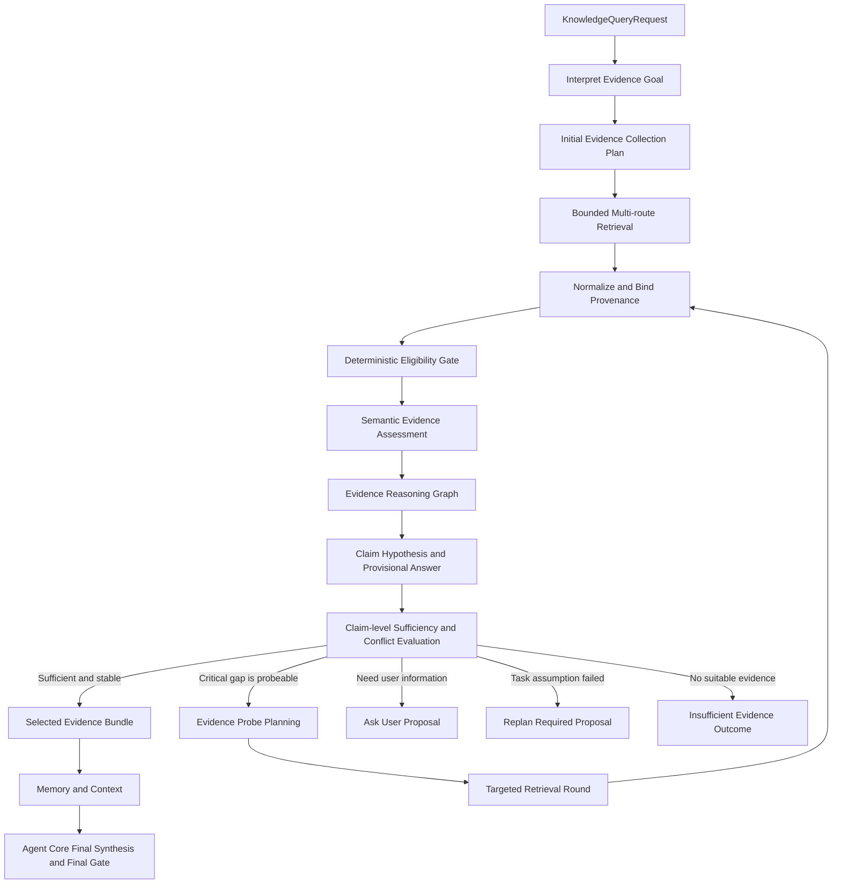
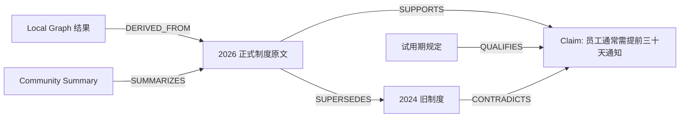

# 03 Knowledge / Agentic GraphRAG

updated: 2026-08-04
status: normative-target-module-architecture
architecture_generation: v2
module_number: 03
formal_path: `docs/modules/03-knowledge-agentic-graphrag.md`

> 本文是 Zuno 第 03 个逻辑模块——Knowledge / Agentic GraphRAG——的唯一正式 Target 架构主设计。
>
> Architecture v2 将本模块升级为 **Evidence-Driven Agentic GraphRAG**：证据驱动、先广后精、动态补证、可审计的知识获取与证据审议系统。
>
> 本文描述 Target，不把设计写成 Current。现有 Program 与 PHASE01–PHASE22 不因本次文档升级而改变；它们继续以原基线和各自冻结 Contract 执行。新的实现 Program 必须在 PHASE22 收口后另行设计。

---

# 0. 文档边界、版本与规范层级

## 0.1 本文回答什么

本文统一回答：

```text
Knowledge 模块解决什么企业知识问题
Agentic 决策发生在哪一层
为什么目标从 Retriever 选择升级为 Evidence Deliberation
如何先广后精地采集多类证据
如何区分原始证据、派生证据和独立来源
如何把 Evidence 绑定到 Claim
如何识别冲突、适用范围、新旧版本与引用缺口
如何根据关键缺口规划 Evidence Probe
何时继续、停止、询问用户、提议 Replan 或安全拒答
Knowledge 与 Agent Core、Memory、Model Gateway、Security、Observability、Infrastructure 的 Ownership
状态、错误、Retry、Probe、Replan、Recovery、Idempotency
Target Contract、持久化和测试完成证据
```

## 0.2 规范优先级

```text
已接受 ADR 与共享安全 / Ownership 原则
→ 本模块 Target 架构
→ 总架构跨模块集成视图
→ 已确认 Program / Phase 的冻结范围
→ 代码、Migration、配置与运行证据
```

当本 Architecture v2 与正在执行的旧 Program 描述不一致时：

- 旧 Program 继续按其冻结基线完成，不被本文静默改写；
- 本文是后续 Program 的设计输入；
- 任何 Target 变为 Current，都必须新增代码、Migration、测试、Trace、Eval 和运行证据。

## 0.3 Current、Target、Future、History

| 层级 | 含义 |
| --- | --- |
| Current | 由当前代码、Migration、测试、Trace 或运行证据证明的事实；以状态文档为准 |
| Target v1 | 当前 Program / PHASE01–PHASE22 执行时采用的既有目标基线，可通过 Git 历史基线读取 |
| Target v2 | 本文定义的 Evidence-Driven Agentic GraphRAG 目标 |
| Future | 更长期、未决定的可选能力，不进入近期 Program |
| History | 被替换设计、旧草稿与回顾材料，不参与当前决策 |

本次不修改 `.agent/programs/`、PHASE01–PHASE22、业务代码、数据库模型和 Migration。

---

# Part I：问题、目标与模块边界

## 1. 为什么需要 Evidence-Driven Agentic GraphRAG

传统 RAG 常把目标简化为“召回与问题相似的若干 Chunk”。固定 GraphRAG 又容易把目标简化为“增加图检索路径”。企业知识任务真正困难的是：**相关内容是否足以证明候选结论**。

常见失败包括：

```text
召回内容相关，但不支持答案中的关键 Claim
Local、Community Summary 和原文来自同一文档，却被重复计为三个独立来源
旧制度和新制度冲突，只按相似度排序
图路径存在，但没有 SourceSpan，无法严格引用
Evidence 来自正确文档，但适用主体、地区或时间不匹配
首轮缺证后只扩大 Top-K，继续得到相同内容
模型将部分支持写成确定事实
冲突证据被低分过滤，最终答案隐藏真实争议
知识库没有答案、检索漏召回、解析失败、索引故障和权限过滤被混为一种“没找到”
为了低延迟走最短路径，复杂任务在证据未充分时提前结束
为了显得深入又无条件运行全部 Retriever，导致噪声、成本与延迟失控
```

因此，Module 03 的 Target 控制中心不再是：

> 选择哪个 Retriever。

而是：

> 当前候选答案的关键 Claim 是否拥有充分、独立、权威、有效且可引用的证据；如果没有，下一步什么动作最可能改变这个判断。

## 2. 一句话定义

> Evidence-Driven Agentic GraphRAG 是在 Agent Core 给定任务目标、安全范围、KnowledgeSnapshot、AnswerPolicy、预算与截止时间内，由固定 KnowledgeRetrievalGraph 治理动态 Evidence Collection、Evidence Assessment、Claim–Evidence Reasoning、Targeted Probe 与停止决策的知识运行时。

它不是：

- 每个 Retriever 一个自治 Agent；
- 固定 `BM25 → Vector → Graph → Rerank` 流水线；
- 模型自由改写运行图；
- 一个总分决定 Evidence 去留；
- 知识模块直接生成并发布最终答案；
- 无预算的“尽可能多检索”。

## 3. 目标与非目标

### 3.1 目标

1. **质量优先、预算受控**：先满足 Evidence Requirement，再优化延迟；但任何检索都受预算、权限、截止时间和边际收益约束。
2. **先广后精**：首轮构建有多样性的 Initial Evidence Pool，后续围绕关键 Claim 缺口执行 Targeted Probe。
3. **证据可审计**：所有候选、拒绝、冲突、派生、版本和 lineage 事实可追踪。
4. **Claim 级充分性**：不是只判断“文档相关”，而是判断每个关键 Claim 是否被支持、限定、反驳或阻断。
5. **动态补证**：根据 Missing Evidence Map、Conflict Map、Answer Risk 和 Expected Information Gain 选择下一步动作。
6. **安全停止**：证据不足、冲突未解、权限受限或知识质量可疑时，返回明确 Outcome，而不是继续幻觉生成。
7. **可恢复与幂等**：Retriever 重复、延迟、取消、服务重启和 Checkpoint 偏差不会制造重复领域事实。
8. **可测量**：能够区分 Agentic Routing、Graph、Rerank、更多预算和模型升级各自带来的真实增益。

### 3.2 非目标

- 不建设产品级自治 Multi-Agent Retrieval Runtime。
- 不让 Knowledge 修改或激活 PlanVersion。
- 不让 Knowledge 批准外部搜索、扩大权限或执行副作用。
- 不让模型 Critic 成为 Evidence 最终事实 Owner。
- 不保证 GraphRAG 对所有问题都优于 Hybrid RAG。
- 不将 Community Summary 作为唯一严格证据。
- 不把知识健康诊断 Proposal 直接升级为基础设施故障事实。

## 4. 模块 Ownership

### 4.1 Knowledge 负责

```text
KnowledgeSpace、KnowledgeVersion、KnowledgeSnapshot
IndexSpec、Knowledge Acceptance 与 Cutover 语义
EvidenceGoal 的知识侧解释
InitialEvidenceCollectionPlan
RetrievalRound、RetrievalAction、RetrieverAttempt
候选归一化、Provenance 与 Lineage 绑定
确定性 Eligibility Gate
模型 Evidence Assessment Proposal 的请求与验证
EvidenceLedger、EvidenceFrontier、EvidenceReasoningGraph
ClaimHypothesis、ClaimEvidenceState、EvidenceSetVerdict
ProvisionalAnswerCandidate 的知识侧草案与 AnswerRiskReview
EvidenceProbeCandidate、EvidenceProbeDecision
KnowledgeRetrievalOutcome、KnowledgeControlProposal
InsufficientEvidenceOutcome、KnowledgeHealthSignal
文档删除、版本替换、索引不可召回与 Citation 回链收口
Knowledge 领域事件、Outbox 与 Trace 关联
```

### 4.2 Knowledge 不负责

```text
原始文件上传、OCR、解析与 CanonicalDocumentIR
决定整个 AgentRun 是否完成
创建、修改或激活 PlanVersion
直接访问底层模型 Provider SDK
执行互联网、Shell、Browser 或第三方 Tool
批准权限、审批副作用或扩大 ACL
组装最终 ContextPack
发布最终答案和 RunOutcome
拥有最终 Trace / Eval Projection
拥有物理 Store、Queue、Lease、ServingWatermark 健康事实
保存隐藏思维链
```

### 4.3 跨模块边界

| 模块 | Owns | 与 Knowledge 的边界 |
| --- | --- | --- |
| 01 Product Surface | 用户命令、产品 Profile、展示 Projection | 不提交内部 Retriever 参数 |
| 02 Input / Ingestion | DocumentVersion、CanonicalDocumentIR、SourceSpan | 交付不可变 IndexableDocumentSnapshot |
| 03 Knowledge | Evidence Discovery、Deliberation、Probe、Verdict | 本文 |
| 04 Model Gateway | ModelInvocation、Routing、PromptVersion、Usage、Provider Failure | Knowledge 只请求已注册任务；模型只返回 Proposal |
| 05 Memory & Context | Memory 事实、ContextPack、Context Budget | 只消费 SelectedEvidenceBundle，不重新打分 Evidence |
| 06 Agent Core | Goal、Plan、Step、Task Budget、Replan、Final Gate、RunOutcome | 决定 why/when；Knowledge 决定知识步骤内 how |
| 08 Tool Runtime | 外部 Tool 与副作用 | 外部证据只能由 Knowledge 提议、Agent Core 决定、Tool Runtime 执行 |
| 09 Security | Principal、ACL、Security Epoch、Disclosure、Approval | 未授权 Evidence 在进入模型前即被拒绝 |
| 10 Observability & Eval | Trace、Metric、Eval、Benchmark、Release Gate | Knowledge 产出 typed events，不拥有质量结论 |
| 11 Infrastructure | Store、Index、Queue、Lease、Receipt、Checkpointer primitive | 不拥有 Evidence Sufficiency、Claim Verdict 或 Cutover 业务语义 |

---

# Part II：总体架构与两阶段闭环

## 5. 两阶段架构

### 5.1 阶段一：Broad Evidence Discovery

目标是以**有边界的多路径采集**建立初始证据面，而不是立即写最终答案。

输入：

- KnowledgeQueryRequest；
- EvidenceGoal；
- AuthorizedKnowledgeScope；
- KnowledgeSnapshot；
- STANDARD / DEEP Profile；
- AnswerPolicy；
- Budget 与 deadline。

输出：

```text
Initial Evidence Pool
Initial Claim Hypotheses
Uncertainty Map
Conflict Map
Missing Evidence Map
```

### 5.2 阶段二：Evidence Deliberation

目标是判断：

- 哪些 Evidence 真正支持 Claim；
- 哪些只是背景、派生或重复；
- 哪些构成反证或限定条件；
- 哪些关键 Claim 仍无证据；
- 下一轮 Probe 是否可能显著改变答案。

输出：

- SelectedEvidenceBundle；或
- Targeted Probe；或
- Ask User / External Evidence Proposal；或
- Replan Required；或
- Partial / No Suitable Evidence Outcome。

## 6. 两个闭环


```mermaid
flowchart TD
    A[KnowledgeQueryRequest] --> B[Interpret Evidence Goal]
    B --> C[Initial Evidence Collection Plan]
    C --> D[Bounded Multi-route Retrieval]
    D --> E[Normalize and Bind Provenance]
    E --> F[Deterministic Eligibility Gate]
    F --> G[Semantic Evidence Assessment]
    G --> H[Evidence Reasoning Graph]
    H --> I[Claim Hypothesis and Provisional Answer]
    I --> J[Claim-level Sufficiency and Conflict Evaluation]

    J -->|Sufficient and stable| K[Selected Evidence Bundle]
    J -->|Critical gap is probeable| L[Evidence Probe Planning]
    J -->|Need user information| M[Ask User Proposal]
    J -->|Task assumption failed| N[Replan Required Proposal]
    J -->|No suitable evidence| O[Insufficient Evidence Outcome]

    L --> P[Targeted Retrieval Round]
    P --> E
    K --> Q[Memory and Context]
    Q --> R[Agent Core Final Synthesis and Final Gate]
```

两个闭环分别是：

```text
Evidence Discovery Loop
Retrieve → Normalize → Eligibility → Assess → Merge

Claim / Answer Deliberation Loop
Claim → Evidence Support → Risk → Probe → Revised Claim
```

## 7. 固定 KnowledgeRetrievalGraph

Target 固定图：

```text
START
→ validate_request
→ resolve_snapshot
→ validate_authorized_scope
→ interpret_evidence_goal
→ classify_query_and_risk
→ build_initial_collection_plan
→ admit_initial_actions
→ dispatch_initial_batch
→ normalize_candidates
→ bind_provenance_and_lineage
→ deterministic_eligibility_gate
→ semantic_evidence_assessment
→ classify_evidence
→ update_evidence_ledger
→ update_evidence_reasoning_graph
→ build_claim_hypotheses
→ build_provisional_answer
→ evaluate_claim_support
→ evaluate_evidence_set
→ review_answer_risk
→ decide_next_control

   ├── accept_evidence
   ├── plan_targeted_probe
   ├── ask_user_proposal
   ├── external_evidence_proposal
   ├── replan_required
   ├── partial_answer_proposal
   └── no_suitable_evidence

plan_targeted_probe
→ admit_probe
→ dispatch_probe_batch
→ normalize_candidates

terminal branch
→ build_outcome
→ persist_and_emit
→ END
```

固定图负责治理；动态内容只存在于：

- CollectionPlan；
- RetrievalRound；
- RetrievalAction；
- EvidenceAssessment；
- ClaimEvidenceState；
- EvidenceProbe；
- Verdict。

模型不得动态重写节点、边或跳过安全门。

---

# Part III：首轮证据采集与检索模式

## 8. InitialEvidenceCollectionPlan

```yaml
InitialEvidenceCollectionPlan:
  plan_id: string
  knowledge_query_run_id: string
  evidence_goal_ref: string
  profile: STANDARD | DEEP
  selected_routes:
    - route_type: BM25 | VECTOR | GRAPH_LOCAL | GRAPH_GLOBAL | GRAPH_DRIFT | STRUCTURED | SOURCE_SCOPED
      purpose: string
      candidate_limit: int
      query_spec_ref: string
  diversity_policy_ref: string
  join_policy: ALL_REQUIRED | QUORUM | BEST_EFFORT | DEADLINE_BOUNDED
  max_parallel_actions: int
  candidate_budget: int
  token_budget: int
  cost_budget: number
  deadline_at: datetime
  policy_version_ref: string
  idempotency_key: string
```

不变量：

1. Route 必须与 EvidenceGoal、Capability、Authorized Scope 和 Profile 相容。
2. `DEEP` 不等于全部 Retriever 全开。
3. 计划必须说明每条 Route 的目的，不能只给名称。
4. 候选上限、并发、预算和 deadline 在 Dispatch 前确定。
5. 同一 Plan 的重复提交按 idempotency key 返回已有 Receipt。

## 9. STANDARD 与 DEEP

### 9.1 STANDARD

默认目标是低延迟、稳定证据与严格引用：

```text
BM25 + Vector
→ Fusion / Rerank
→ Evidence Assessment
→ 最多一次 Focused Citation Repair
```

默认：

- 主检索轮次 1；
- Citation Repair 最多 1 次；
- Graph 只在明确实体关系需求且 Policy 允许时启用；
- 证据不足时宁可 Partial / Ask User / Abstain，不静默升级 DEEP。

### 9.2 DEEP

允许有限的多样化首轮：

- BM25；
- Vector；
- Graph Local；
- 必要时 Graph Global / Community；
- 必要时 DRIFT；
- Structured；
- Source-scoped；
- Temporal / Authority focused。

启用条件：

- 路径与问题类型匹配；
- KnowledgeVersion 具备 Capability；
- 预计增益高于成本；
- 不与其他路径完全重复；
- 预算、deadline 与 Security 允许。

DEEP 的目标不是“检索更多”，而是尽快建立能够暴露关键 Claim、冲突和缺口的 Evidence Pool。

## 10. GraphRAG 检索模式

### 10.1 Graph Local

用途：围绕已链接 Entity 获取关系、邻域、路径和支持文本。

适合：

- “某人负责哪些项目”；
- “制度条款与适用部门是什么关系”；
- “两个实体通过什么链路关联”。

必要门禁：

- Entity Linking 置信度；
- hop / fan-out 限制；
- 每个节点、边和 GraphPath 的 SourceSpan 回链；
- ACL 逐节点、逐边执行。

### 10.2 Graph Global / Community

用途：基于 Community Report 或全局主题聚合回答跨数据集、宏观主题问题。

适合：

- “公司今年主要风险主题是什么”；
- “多个项目共同出现了哪些问题”。

限制：

- 成本高；
- Community Summary 是派生证据；
- 必须回查 Text Unit / SourceSpan；
- 不得把同源 Community、Local 和原文计算成多个独立来源。

### 10.3 Graph DRIFT

用途：以 Community / Broad 起点形成探索假设，再围绕关键实体和 Follow-up 递归深入。

适合：

- 初始问题宽泛，但答案依赖若干局部事实；
- 首轮出现新的高影响实体；
- 当前 Claim 需要递归查证。

DRIFT 不是无限递归。每轮必须满足：

- 新增独立 Evidence；
- Claim Verdict 或 Answer Risk 可能变化；
- 预计信息增益高于阈值；
- 未触发轮次、成本、deadline 或无进展停止。

### 10.4 Graph 不是默认更优

简单 FAQ、精确编号、已知条款定位通常由 BM25 / Vector 更快更稳。Graph 只有在关系、多跳、全局主题或递归探索能补足 Evidence Gap 时才启用。

## 11. 质量优先但不无界

“质量优先”定义为：

> 在 AnswerPolicy、预算、deadline、安全和边际收益边界内，优先满足关键 Claim 的 Evidence Sufficiency，而不是优先选择最短执行路径。

它不等于：

- 每次全路径；
- 无限轮次；
- 总是使用强模型；
- 总是要求多个来源；
- 为低影响 Claim 支付高成本。

质量控制依赖：

- Evidence Requirement；
- Multi-route Diversity；
- Claim Coverage；
- Independent Source Family；
- Authority / Temporal / Applicability；
- Conflict Disclosure；
- Expected Information Gain；
- Answer Stability；
- Final Gate。

---

# Part IV：Evidence 生命周期与双图

## 12. EvidenceCandidate 状态机

```text
DISCOVERED
→ NORMALIZED
→ ELIGIBILITY_CHECKED
→ SEMANTIC_ASSESSED
→ CLASSIFIED
```

分类：

| 分类 | 含义 | 是否可进入最终严格 Context |
| --- | --- | --- |
| STRICT_ACCEPTED | 直接支持 Claim 且具备有效 SourceSpan | 是 |
| SUPPORTING_AUXILIARY | 有助于解释，但不能独立严格证明 | 仅辅助 |
| CONFLICTING | 与候选结论冲突 | 必须保留并披露/解决 |
| QUALIFYING | 增加前提、例外或适用范围 | 是，需修改 Claim |
| DUPLICATE | 与已有 Evidence 基本重复 | 不重复计票 |
| DERIVED | Community / Graph Summary / 模型派生 | 只能辅助，需回链 |
| REJECTED_LOW_QUALITY | 相关性、权威或适用性不足 | 不进入 Active Set |
| EXCLUDED | ACL、版本、Snapshot、完整性硬门失败 | 不得暴露给模型和回答 |
| SUPERSEDED | 被有效新版本替代 | 不支持当前 Claim，但保留历史 |

关键原则：

> “不进入最终答案”不等于删除领域事实。冲突、低质量、重复和派生 Evidence 必须保留在 Ledger 中用于审计、去重、诊断和 Eval。

## 13. Knowledge Graph 与 Evidence Reasoning Graph

### 13.1 Knowledge Graph

表达企业知识空间：

```text
Entity
Relation
Community
Document
TextUnit
```

用于发现实体入口、多跳关系、社区主题与潜在文档。

### 13.2 Evidence Reasoning Graph

表达一次 KnowledgeQueryRun 中“为什么候选答案可信或不可信”。

节点：

```text
Claim
Evidence
Source
DocumentVersion
GraphPath
CommunitySummary
```

关系：

```text
SUPPORTS
PARTIAL_SUPPORT
CONTRADICTS
QUALIFIES
SUPERSEDES
DUPLICATES
DERIVED_FROM
SUMMARIZES
EXPLAINS
APPLIES_TO
DOES_NOT_APPLY_TO
INSUFFICIENT_FOR
```

示例：


```mermaid
flowchart LR
    C[Claim: 员工通常需提前三十天通知]
    E1[2026 正式制度原文]
    E2[Local Graph 结果]
    E3[Community Summary]
    E4[试用期规定]
    E5[2024 旧制度]

    E1 -->|SUPPORTS| C
    E2 -->|DERIVED_FROM| E1
    E3 -->|SUMMARIZES| E1
    E4 -->|QUALIFIES| C
    E5 -->|CONTRADICTS| C
    E1 -->|SUPERSEDES| E5
```

E1、E2、E3 若同源，只能算一个 Source Family。

## 14. EvidenceDerivationEdge

```yaml
EvidenceDerivationEdge:
  edge_id: string
  knowledge_query_run_id: string
  from_evidence_ref: string
  relation_type: SUPPORTS | PARTIAL_SUPPORT | CONTRADICTS | QUALIFIES | SUPERSEDES | DUPLICATES | DERIVED_FROM | SUMMARIZES | APPLIES_TO | DOES_NOT_APPLY_TO | INSUFFICIENT_FOR
  to_claim_or_evidence_ref: string
  source_family_ref: string
  derivation_depth: int
  created_by: DETERMINISTIC | MODEL_PROPOSAL_VALIDATED
  model_invocation_ref: string | null
  validator_receipt_ref: string
  version: int
```

不变量：

- 模型不得引用不存在的 Evidence ID；
- 所有 DERIVED_FROM 必须能回溯到原始 SourceSpan 或标记无法严格引用；
- 关系更新采用新 Graph Version，不原地删除历史；
- Source Family 由确定性 lineage 规则拥有。

---

# Part V：四层证据评价与 Claim 推理

## 15. 第一层：Deterministic Eligibility Gate

由代码执行，模型不可覆盖：

- ACL 与 Disclosure 是否允许；
- Security Epoch 是否有效；
- KnowledgeSnapshot / DocumentVersion 是否匹配；
- SourceSpan 是否存在；
- Payload Hash 是否正确；
- Evidence 是否过期、撤销或被 Superseded；
- RetrieverAttempt 是否属于当前 Round；
- late / duplicate / cancelled result 是否允许提交；
- 数据分类是否允许进入选定 Model Provider。

硬门失败进入 `EXCLUDED`，不得先交给模型再过滤。

## 16. 第二层：单条 Evidence Semantic Assessment

模型 CRITIC 只产生 Proposal，确定性代码验证引用、枚举、lineage、权限与版本。

```yaml
EvidenceAssessment:
  assessment_id: string
  evidence_id: string
  claim_ref: string | null
  assessment_generation: int
  eligibility_status: PASS | FAIL
  semantic_relation: SUPPORTS | PARTIAL_SUPPORT | CONTRADICTS | QUALIFIES | IRRELEVANT | UNCERTAIN
  relevance_score: number | null
  entailment_score: number | null
  contradiction_score: number | null
  directness: DIRECT_SOURCE_TEXT | STRUCTURED_FACT | GRAPH_PATH | COMMUNITY_SUMMARY | MODEL_DERIVED
  authority_status: HIGH | MEDIUM | LOW | UNKNOWN
  temporal_status: CURRENT | HISTORICAL | EXPIRED | UNKNOWN
  applicability_status: MATCH | PARTIAL | MISMATCH | UNKNOWN
  citation_status: EXACT | PARTIAL | ABSENT
  source_family_ref: string
  derivation_depth: int
  independent_support_eligible: boolean
  reason_codes: [string]
  model_invocation_ref: string | null
  deterministic_validation_ref: string
  assessment_policy_version_ref: string
  idempotency_key: string
```

不得以一个 `quality_score` 覆盖硬门和多维 Verdict。可以为排序计算分数，但最终状态由明确维度和 Policy 决定。

## 17. 第三层：ClaimEvidenceState

```yaml
ClaimEvidenceState:
  claim_id: string
  claim_text: string
  claim_generation: int
  direct_support_refs: [string]
  indirect_support_refs: [string]
  contradiction_refs: [string]
  qualification_refs: [string]
  independent_source_family_refs: [string]
  supporting_authority_refs: [string]
  verdict: SUPPORTED | CONDITIONALLY_SUPPORTED | CONTESTED | CONTRADICTED | INSUFFICIENT | BLOCKED
  confidence_band: HIGH | MEDIUM | LOW | UNKNOWN
  unresolved_gap_codes: [string]
  answer_impact: CRITICAL | MAJOR | MINOR
  recommended_probe_refs: [string]
  version: int
```

Claim 不是模型可直接发布的事实。它是一次 QueryRun 的候选陈述，其状态随 Evidence Generation 版本化变化。

## 18. 第四层：EvidenceSetVerdict

```yaml
EvidenceSetVerdict:
  verdict_id: string
  knowledge_query_run_id: string
  assessment_generation: int
  status: SUFFICIENT | PARTIAL | CONTESTED | CONTRADICTED | NO_SUITABLE_EVIDENCE | BLOCKED
  satisfied_claim_refs: [string]
  conditional_claim_refs: [string]
  contested_claim_refs: [string]
  unsupported_claim_refs: [string]
  claim_coverage: number
  strict_citation_coverage: number
  independent_source_coverage: number
  authority_coverage: number
  temporal_validity_coverage: number
  unresolved_conflict_count: int
  duplicate_evidence_ratio: number
  derived_evidence_ratio: number
  novelty_since_previous_round: number
  answer_stability: number | null
  expected_next_probe_gain: number | null
  recommended_control: ACCEPT | TARGETED_PROBE | ASK_USER | REPLAN | PARTIAL_ANSWER | ABSTAIN
  reason_codes: [string]
  policy_version_ref: string
```

## 19. ProvisionalAnswerCandidate 与 AnswerRiskReview

第一轮评估后不得直接发布最终答案。Knowledge 可生成结构化候选，用于检查 Claim 与 Evidence 绑定：

```yaml
ProvisionalAnswerCandidate:
  candidate_id: string
  generation: int
  claim_refs: [string]
  evidence_binding_refs: [string]
  unresolved_claim_refs: [string]
  conditional_claim_refs: [string]
  answer_risk_level: LOW | MEDIUM | HIGH
  synthesis_model_invocation_ref: string | null
```

```yaml
AnswerRiskReview:
  review_id: string
  candidate_ref: string
  unsupported_claim_refs: [string]
  ignored_conflict_refs: [string]
  stale_source_refs: [string]
  missing_condition_refs: [string]
  derived_only_claim_refs: [string]
  citation_gap_refs: [string]
  verdict: PASS | REQUIRES_PROBE | REQUIRES_REVISION | BLOCKED
  reason_codes: [string]
```

检查：

- 是否包含无证据 Claim；
- 是否把 Partial 写成确定事实；
- 是否忽略反证；
- 是否把 Community Summary 当作原始证据；
- 是否使用过期或不适用来源；
- 是否缺少关键适用条件；
- 是否存在高影响争议 Claim。

---

# Part VI：动态补证与停止

## 20. EvidenceProbeCandidate

```yaml
EvidenceProbeCandidate:
  probe_id: string
  target_claim_refs: [string]
  target_gap_codes: [string]
  current_verdict: SUPPORTED | CONDITIONALLY_SUPPORTED | CONTESTED | CONTRADICTED | INSUFFICIENT
  possible_outcomes: [string]
  probe_type: QUERY_REWRITE | MULTI_QUERY | SOURCE_SCOPED_RETRIEVAL | PARENT_EXPANSION | ADJACENT_EXPANSION | FOCUSED_CITATION | GRAPH_LOCAL | GRAPH_PATH | GRAPH_GLOBAL | GRAPH_DRIFT | TEMPORAL_RETRIEVAL | AUTHORITY_RETRIEVAL | SUPERSEDES_RETRIEVAL | STRUCTURED_LOOKUP
  query_spec_ref: string
  expected_information_gain: HIGH | MEDIUM | LOW
  expected_answer_impact: CRITICAL | MAJOR | MINOR
  estimated_cost: number
  estimated_latency_ms: int
  required_capabilities: [string]
  reason_codes: [string]
  idempotency_key: string
```

## 21. Probe 决策

Probe 不是 Retriever 分数最大者。选择依据：

```text
改变最终答案的可能性
× 当前不确定度
× 预计 Evidence 质量
× 对关键 Claim 的影响
- 成本
- 延迟
- 重复度
- 安全风险
```

硬门、Capability 和 Security 不能被 Utility Score 覆盖。

常见映射：

| 当前缺口 | Probe |
| --- | --- |
| 完全无 Evidence | Query Rewrite / Multi-query / Scope 检查 |
| 命中文档但缺正文 | Parent / Adjacent / 条款级检索 |
| 只有 Community Summary | Text Unit / SourceSpan Backfill |
| 实体关系缺失 | Entity Resolve / Graph Local / Path |
| 全局模式不足 | Global / Community |
| 新旧版本矛盾 | Temporal / Supersedes Retrieval |
| 正反 Evidence 权威不明 | Authority-focused Retrieval |
| 主体或适用范围不同 | Scope / Applicability Retrieval |
| 引用位置缺失 | Focused Citation |
| 连续重复结果 | Stop，不再执行同类 Probe |
| 需要新附件或外部 Tool | KnowledgeControlProposal，由 Agent Core 决定 |

## 22. Retry、Probe、Corrective Retrieval 与 Replan

| 机制 | 触发 | 是否改变任务计划 | Owner |
| --- | --- | --- | --- |
| Retry | 执行临时失败，原动作仍正确 | 否 | Knowledge / Infrastructure 按 Error Policy |
| Repair | 参数、结构化输出或局部输入可修复 | 否 | 当前执行模块 |
| Targeted Probe | Evidence Gap 可通过新的知识动作补足 | 否 | Knowledge |
| Corrective Retrieval | 对检索结果执行 Query / Route / Citation 修正 | 否 | Knowledge，是 Probe 子集 |
| Replan | 任务假设、依赖或 Step 结构失效 | 是，新建 PlanVersion | Agent Core |

Knowledge 只能返回 `REPLAN_REQUIRED` Proposal，不能创建 PlanVersion。

## 23. 停止条件

### 23.1 成功停止

- 关键 Claim 为 `SUPPORTED` 或允许的 `CONDITIONALLY_SUPPORTED`；
- 严格引用覆盖满足 AnswerPolicy；
- 无未解决 Critical Conflict；
- 权威性、时效性、适用性满足 Policy；
- Provisional Answer 连续 Generation 稳定。

### 23.2 无收益停止

- 连续 Probe 没有新增独立来源；
- 新 Evidence 全部重复或派生；
- Claim Verdict 未变化；
- 预计下一轮信息增益低于阈值。

### 23.3 不可解决停止

- 知识不存在；
- 权限阻止；
- 来源本身冲突；
- 版本治理缺失；
- 索引、解析或 Graph Grounding 疑似异常；
- 需要用户补充输入或外部 Tool。

硬上限始终存在：`max_rounds`、`max_attempts`、`max_tokens`、`max_cost`、`deadline_at`。

## 24. Outcome

```text
SUFFICIENT_EVIDENCE
PARTIAL_EVIDENCE
CONFLICTING_EVIDENCE
NO_SUITABLE_EVIDENCE
AUTHORIZED_EVIDENCE_UNAVAILABLE
KNOWLEDGE_QUALITY_SUSPECTED
FAILED
CANCELLED
```

```yaml
InsufficientEvidenceOutcome:
  outcome_id: string
  status: PARTIAL_EVIDENCE | CONFLICTING_EVIDENCE | NO_SUITABLE_EVIDENCE | AUTHORIZED_EVIDENCE_UNAVAILABLE | KNOWLEDGE_QUALITY_SUSPECTED
  attempted_route_types: [string]
  attempted_probe_types: [string]
  retrieval_round_count: int
  candidate_evidence_count: int
  strict_accepted_count: int
  auxiliary_count: int
  rejected_count: int
  duplicate_count: int
  conflicting_count: int
  excluded_count: int
  unresolved_claim_refs: [string]
  unresolved_gap_codes: [string]
  stop_reason: LOW_MARGINAL_GAIN | ROUND_LIMIT | BUDGET_EXHAUSTED | DEADLINE_REACHED | SECURITY_BLOCKED | KNOWLEDGE_ABSENT | INDEX_UNAVAILABLE | SOURCE_CONFLICT_UNRESOLVED | USER_CLARIFICATION_REQUIRED
  diagnosis_primary: KNOWLEDGE_ABSENT | RETRIEVAL_MISS_SUSPECTED | PARSING_QUALITY_SUSPECTED | INDEX_QUALITY_SUSPECTED | GRAPH_GROUNDING_SUSPECTED | VERSION_GOVERNANCE_SUSPECTED | SOURCE_CONFLICT_UNRESOLVED | AUTHORIZATION_LIMITED | UNKNOWN
  diagnosis_confidence: HIGH | MEDIUM | LOW
  supporting_signal_refs: [string]
  safe_user_message_ref: string
```

“知识库有问题”只能先形成 `KnowledgeHealthSignal`。Infrastructure、Ingestion、KnowledgeVersion 验证与 Observability 共同确认后，才可升级为健康事件或运维告警。

---

# Part VII：状态、并发、故障与恢复

## 25. KnowledgeQueryRun 状态

```text
CREATED
→ VALIDATING
→ PLANNING_INITIAL_COLLECTION
→ COLLECTING
→ ASSESSING
→ DELIBERATING
→ PROBING
→ BUILDING_OUTCOME
→ SUCCEEDED | PARTIAL | BLOCKED | FAILED | CANCELLED
```

每个 RetrievalRound：

```text
PLANNED
→ ADMITTED
→ DISPATCHING
→ RUNNING
→ NORMALIZING
→ ASSESSING
→ MERGED
→ CLOSED
```

失败分支：

```text
REJECTED_BY_POLICY
BUDGET_DENIED
SECURITY_BLOCKED
TIMED_OUT
CANCELLED
RECONCILIATION_REQUIRED
```

## 26. 并行与 Join

首轮 Route 可并行，但必须先持久化：

- RetrievalRound；
- RetrievalAction；
- DispatchItem；
- Budget Reservation；
- Authorized Scope；
- idempotency key。

JoinPolicy：

- `ALL_REQUIRED`：关键 Route 全部完成；
- `QUORUM`：满足最小多样性和覆盖；
- `BEST_EFFORT`：允许部分失败；
- `DEADLINE_BOUNDED`：到期后合并已验证结果。

Reducer 合并规则：

- 按 Evidence ID、SourceSpan、content hash 和 source family 去重；
- late result 先检查 Round generation；
- 旧 Assessment Generation 不覆盖新 Verdict；
- 冲突不因分数低被覆盖；
- 派生结果不提升独立来源计数。

## 27. 错误分类

| 错误 | 默认语义 |
| --- | --- |
| Validation / Schema | Repair 或 Fail，不盲目 Retry |
| Provider 429 / temporary unavailable | 有界 Retry / Fallback，受 deadline 与 budget 约束 |
| Retriever timeout | Read-only 可 Retry；先检查 attempt receipt |
| Invalid model structured output | Schema Repair → Upgrade chain → Fail/Partial |
| Snapshot drift | Reject current result，重新 resolve 或返回 Replan Proposal |
| Security Epoch change | 未提交结果重新授权；撤权 Evidence taint/exclude |
| Index unavailable | Fallback 或 `KNOWLEDGE_QUALITY_SUSPECTED`，不伪造空答案 |
| Critic disagreement | 再校验、升级强模型或标记 UNCERTAIN；不得多数投票替代规则 |
| Cancellation | 传播到 batch；late result 丢弃或审计，不作为 Retry |

## 28. Recovery 与 Reconciliation

恢复：

```text
读取 KnowledgeQueryRun 终态
→ 读取当前 Round / Action / Attempt
→ 对比 LangGraph Checkpoint
→ Reconcile Retriever Receipt
→ 跳过已提交 Evidence
→ 重建 Evidence Reasoning Graph Projection
→ 从首个未提交确定性节点恢复
```

不变量：

1. 已提交 EvidenceRecord 不重复创建。
2. 已完成 Attempt 不重复执行，除非 Policy 创建新 attempt。
3. Checkpoint 只保存控制位置和引用，PostgreSQL 保存领域事实。
4. Checkpoint 存在但领域 Run 不存在时隔离，不伪造事实。
5. 领域 Run 已终态而图未结束时，以领域终态为准。
6. Lease 接管使用 fencing token，旧 Worker 不能提交。
7. 模型 Proposal 重放必须使用同 PromptVersion、输入 Hash 与 idempotency key。

## 29. LangGraph State

```yaml
KnowledgeDecisionGraphState:
  knowledge_query_run_id: string
  request_ref: string
  evidence_goal_ref: string
  snapshot_refs: [string]
  current_round_no: int
  current_assessment_generation: int
  active_action_refs: [string]
  active_attempt_refs: [string]
  evidence_ledger_ref: string
  evidence_reasoning_graph_ref: string
  claim_state_set_ref: string
  provisional_answer_ref: string | null
  latest_evidence_set_verdict_ref: string | null
  latest_probe_decision_ref: string | null
  remaining_budget_ref: string
  deadline_at: datetime
  status: string
```

State 不保存大段正文、完整 Evidence Payload 或最终领域状态。

---

# Part VIII：安全、模型、上下文与观测

## 30. Security

检索前由 Module 09 提供：

```yaml
AuthorizedKnowledgeScope:
  authorization_decision_ref: string
  principal_context_ref: string
  tenant_id: string
  workspace_id: string
  allowed_knowledge_space_ids: [string]
  allowed_document_filters: object
  denied_document_refs: [string]
  effective_security_epoch_ref: string
  disclosure_policy_ref: string
  external_model_policy_ref: string
  expires_at: datetime
```

强制规则：

- ACL 进入 BM25、Vector、Graph 和 Structured Query；
- Graph traversal 的节点、边和支持文本逐项授权；
- 未授权内容不得先交给 Critic 再过滤；
- Trace 仅保存脱敏摘要、引用和 Hash；
- Security Epoch 变化时未提交结果重新验证；
- External Evidence Proposal 不携带受保护原文，除非明确允许。

## 31. Model Gateway 使用

Knowledge 可请求：

```text
QUERY_UNDERSTANDING
QUERY_REWRITER
EVIDENCE_RELATION_ASSESSMENT
CLAIM_HYPOTHESIS_EXTRACTION
CONFLICT_CLASSIFICATION
APPLICABILITY_ASSESSMENT
PROBE_PROPOSAL
PROVISIONAL_SYNTHESIS
```

优先映射现有角色：`TASK_ANALYZER`、`EXTRACTOR`、`QUERY_REWRITER`、`CRITIC`、`SYNTHESIZER`、`FINAL_CRITIC`。

每次模型调用必须有：

- ModelInvocation；
- PromptVersion；
- Structured Output Schema；
- 输入 Evidence ID 列表和授权 Receipt；
- Schema Validation；
- Retry / Upgrade chain；
- Usage / Budget；
- model invocation ref。

模型只产生 Proposal，不能提交 Evidence 最终状态、修改 SourceSpan、扩大权限或决定 RunOutcome。

## 32. Memory & Context 边界

Module 03 输出 `SelectedEvidenceBundle`：

```yaml
SelectedEvidenceBundle:
  bundle_id: string
  knowledge_query_run_id: string
  evidence_refs: [string]
  claim_evidence_binding_refs: [string]
  conflict_disclosure_refs: [string]
  citation_lineage_refs: [string]
  evidence_set_verdict_ref: string
  security_epoch_ref: string
  snapshot_refs: [string]
```

Module 05 负责构建 ContextPack。它不得：

- 重新给 Evidence 打分；
- 覆盖 Claim Verdict；
- 把 EXCLUDED / REJECTED Evidence 放回 Context；
- 将派生摘要伪装成原始引用。

## 33. Trace 与指标

必须发出 typed events：

```text
initial_collection_plan_created
retrieval_action_admitted
retriever_attempt_started/completed
candidate_evidence_normalized
eligibility_decision_recorded
semantic_assessment_recorded
evidence_classified
evidence_lineage_bound
claim_hypothesis_created
claim_evidence_state_updated
provisional_answer_created
answer_risk_reviewed
probe_candidate_created
probe_decision_recorded
evidence_set_verdict_recorded
insufficient_evidence_outcome_created
knowledge_health_signal_created
```

Module 10 拥有 Projection、Metric 和质量结论。

---

# Part IX：Target Contract 与持久化

## 34. 核心领域对象

PostgreSQL Target 事实：

```text
EvidenceGoal
InitialEvidenceCollectionPlan
KnowledgeQueryRun
RetrievalRound
RetrievalAction
RetrieverAttempt
EvidenceCandidate
EvidenceRecord
EvidenceAssessment
EvidenceDerivationEdge
EvidenceReasoningGraphVersion
ClaimHypothesis
ClaimEvidenceState
ProvisionalAnswerCandidate
AnswerRiskReview
EvidenceSetVerdict
EvidenceProbeCandidate
EvidenceProbeDecision
InsufficientEvidenceOutcome
KnowledgeHealthSignal
SelectedEvidenceBundle
```

搜索、向量和图存储是 Projection；PostgreSQL 保存版本、Receipt、状态与 Ownership。

## 35. 事务边界

- 创建 Round、Action、Budget Reservation 和 Outbox 在同一 PostgreSQL 事务；
- Retriever 物理查询不在数据库长事务中；
- Evidence 提交使用唯一键：`run_id + round_no + action_id + normalized_evidence_hash`；
- Assessment 使用：`evidence_id + claim_id + assessment_generation + policy_version`；
- Probe 使用：`run_id + target_gap_hash + probe_type + generation`；
- 领域提交后再 ACK；重复消息返回已有 Receipt；
- Search/Graph/Vector 结果不能直接宣布领域成功。

## 36. 关键不变量

1. `STRICT_ACCEPTED` 必须有有效 SourceSpan 和授权范围。
2. 派生 Evidence 不得独立计票。
3. Claim `SUPPORTED` 必须满足 AnswerPolicy 的 Evidence Coverage。
4. `CONFLICTING` Evidence 不得因低相关分被删除。
5. Knowledge 不创建 PlanVersion。
6. Knowledge 不发布最终答案。
7. 模型不拥有 Evidence 最终状态。
8. 新 Assessment Generation 不被旧结果覆盖。
9. 同一 Snapshot 内所有 Evidence 的版本和 Security Epoch 可验证。
10. `KNOWLEDGE_QUALITY_SUSPECTED` 只是诊断，不是故障事实。

---

# Part X：评测、完成证据与演进

## 37. 评测矩阵

### 37.1 Baseline

必须至少比较：

```text
B0 Vector-only RAG
B1 BM25 + Vector Hybrid
B2 Fixed GraphRAG
B3 Agentic Routing
B4 Quality-first Evidence-Driven Agentic GraphRAG
```

结果必须按问题类型分层：

- 精确事实；
- 语义 FAQ；
- 实体关系；
- 多跳；
- 全局主题；
- 新旧版本；
- 冲突来源；
- 无答案；
- 权限受限。

不能只用总平均声明“Agentic 更好”。

### 37.2 检索层指标

- Initial Evidence Diversity；
- Retriever Candidate Yield；
- Strict Evidence Yield；
- Gold Evidence Recall；
- Fusion Gold Drop Rate；
- Reranker Gold Demotion Rate。

### 37.3 Evidence 层指标

- Evidence Relevance Precision；
- Entailment Classification Accuracy；
- Contradiction Classification Accuracy；
- Applicability Classification Accuracy；
- Independent Source Counting Accuracy；
- Citation Eligibility Accuracy；
- Supersedes Resolution Accuracy。

### 37.4 动态决策指标

- Probe Selection Accuracy；
- Probe Information Gain；
- No-progress Probe Rate；
- Average Rounds to Stable Answer；
- Unnecessary Graph Invocation Rate；
- Unnecessary Global Search Rate。

### 37.5 回答与诊断指标

- Claim Coverage；
- Strict Citation Coverage；
- Unsupported Claim Rate；
- Conditional Claim Precision；
- Conflict Disclosure Accuracy；
- Answer Stability；
- Abstention Precision / Recall；
- Knowledge Diagnosis Precision。

## 38. 测试要求

必须覆盖：

- 单一事实正常路径；
- STANDARD Hybrid 正常路径；
- DEEP 多路径并行；
- Community 与 Local 同源去重；
- GraphPath 无 SourceSpan；
- 新旧版本冲突；
- 适用主体不同；
- 正反 Evidence 权威不同；
- Critic invalid JSON；
- Critic timeout / fallback；
- Probe 无新增信息；
- late result；
- duplicate message；
- Security Epoch 变化；
- Snapshot drift；
- Worker crash / resume；
- No Suitable Evidence；
- Knowledge Health Diagnosis；
- 删除后不可召回；
- Claim Citation 绑定。

## 39. Target 变为 Current 的完成证据

至少需要：

```text
领域对象与 Migration
固定 KnowledgeRetrievalGraph 代码
Retriever Adapter 与幂等 Receipt
Evidence Ledger 与 Reasoning Graph Projection
Claim / Probe / Verdict Contract
单元测试
真实依赖 Integration Test
Fault Injection
E2E
Trace
固定 Benchmark
Eval 数据集与 Release Gate
文档与 .agent 镜像同步
```

在固定 Benchmark、故障恢复、安全和运行证据未完成前，只能表述：

```text
design available
implementation available（若已有代码）
measurement blocked / in progress
quality not yet proven
production readiness not established
```

## 40. 后续 Program 边界

本 Architecture v2 不修改当前 Program 与 PHASE01–PHASE22。PHASE22 收口后，Architecture Owner 应按以下顺序另建 Program：

```text
确认 Current Baseline
→ 冻结 v2 Contract
→ 数据模型与 Migration 计划
→ Graph / Ledger / Claim Projection
→ KnowledgeRetrievalGraph 增量实现
→ Model Gateway 结构化任务
→ Agent Core 边界接入
→ Observability / Eval
→ 灰度、回滚与 Release Gate
```

在新 Program 被确认前，不允许 Codex 或 Worker 自行把本文拆成业务实现任务。
