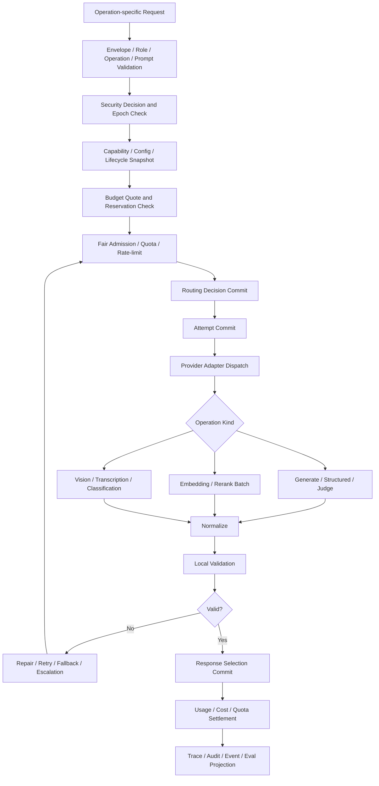

# 04 Model Gateway

updated: 2026-07-14
status: normative-target-module-architecture
module_number: 04
formal_path: `docs/modules/04-model-gateway.md`
agent_mirror: `.agent/modules/04-model-gateway.md`
dependency_baseline_sha: `140128fa7352094cac5a7a58f247090d0b451753`
confirmed_wave1_contract_sha: `849820d2c52d36abebee8c3d4a974bf035524e0a`

> 本文是 Zuno 第 04 个逻辑模块——Model Gateway——唯一的正式 Target 架构主设计。
>
> 本文统一承载模块定位、跨模块模型使用地图、完整运行流程、领域 Contract、状态机、故障语义、运维与一致性协议、目标代码和数据库规格、Requirement、测试与完成证据。Current、Gap、Measurement 和 Production Readiness 仍以当前代码、测试、Migration、Trace、Eval 与 `docs/status/production-readiness.md` 为事实源。本文中出现的类名、表名、Provider、模型、流程和测试编号均不代表已经实现。

## 0. 文档边界与事实源

本文是 Model Gateway 模块唯一的正式 Target 架构文档，统一承载：

```text
问题、目标与非目标
十一个模块的模型使用地图
概念架构与完整调用流程
Role、Operation、Provider、Model、Capability 与 Prompt Contract
Routing、Admission、Retry、Fallback、Escalation 与 Reconciliation
Streaming、Structured Output、Embedding、Rerank、Vision、Transcription 与 Judge
Budget、Quota、Usage、Cost、Health、Circuit 与多租户公平
Adapter Conformance、配置激活、Provider/Model 生命周期与兼容升级
Security、Credential、Residency、Redaction、Retention、Deletion 与 Legal Hold
运维命令、SLO、Readiness、Experiment、Cache 与 ResultValidity
目标代码、数据库、Migration、测试与完成证据
```

文档边界：

```text
docs/modules/04-model-gateway.md
    唯一 Target 架构事实源。

.agent/modules/04-model-gateway.md
    字节级一致的 Agent 镜像。

.agent/programs/
    Current → Target 的实现、升级、迁移、切流与收口计划。

docs/status/
    Current、Gap、Measurement、Quality 与 Production Readiness 状态。

docs/decisions/0003-wave1-cross-module-contract-freeze.md
    已接受的 Wave 1 共享 Target Contract 与物理 Ownership 决议。

docs/governance/wave1-cross-module-contract-registry.md
    共享 Contract 的 Canonical Owner、字段、Failure 和 Consumer 约束。
```

规范优先级：

```text
全局架构原则
→ 已合并的跨模块 ADR / Contract Registry
→ 本模块唯一 Target 架构文档
→ 已确认的 Program
→ 代码、Migration、测试与运行证据
```

`docs/decisions/0003-wave1-cross-module-contract-freeze.md` 已合并到 `main`，状态是 `accepted-target`。因此本文使用其已确认的 `CrossModuleEnvelopeV1`、`EffectiveSecurityEpochRefV1`、`CredentialVersionRefV1`、`ProviderConnectionRequestV1`、`ModelQuotaReservationV1`、`ModelUsageReceiptV1` 和 `ModelCancellationReceiptV1` 语义。Accepted Target 仍不是 Current、实现证据、质量证明或 Production Readiness。

### 0.1 文档内部规范层级

Part I–III 是问题、模型使用地图、概念架构与运行流程的说明性视图；Part IV–VII 是 Contract、状态、故障、运维、持久化与恢复的规范性视图；Part VIII 定义 Requirement、测试和完成证据。说明性视图不得覆盖规范性 Contract。

### 0.2 Current、Target、Future、History

| 层级 | 解释 |
| --- | --- |
| Current | 只由最新 `main` 的代码、测试、Migration、Trace、Eval 与状态文档证明。现有轻量 Gateway、兼容 facade 或旁路 allowlist 不能证明 Target 已实现。 |
| Target | 本文与已合并 ADR 定义的统一模型执行控制面、Contract、状态机、故障和实现规格。 |
| Future | 多区域主动流量市场、跨云自动采购、自治成本竞价、产品级模型市场等长期可选能力。 |
| History | 被替换的旧设计、旧路径和完成后的 Program，进入 `docs/history/`，不再作为规范入口。 |

---

# Part I：定位、问题与跨模块模型使用地图

# 1. 为什么需要 Model Gateway

Zuno 中大量模块都会使用模型。如果 Agent Core、Knowledge、Memory、Ingestion、Security、Eval 或 Skill 自行创建 Provider SDK Client，会产生：

```text
模型用途与具体厂商、模型名和 SDK 耦合
Prompt、Schema、Security、Budget 与 Provider 路由各自为政
SDK 隐式 Retry 导致真实调用次数、成本和失败原因不可知
Timeout、Cancellation、Streaming 和 Provider 终态不一致
Embedding、Rerank、VLM、Judge 被错误伪装成普通 Chat 调用
Structured Output 仅相信 Provider 返回，不做本地 Schema Validation
Provider 成功但响应丢失后盲目重试，造成重复计费和不一致
失败 Attempt、取消 Attempt、迟到 Usage 与 Cost Correction 丢失
租户配额、公平排队、Circuit、Health 和负载保护散落在业务模块
Security、Data Residency、Redaction 与 Credential Scope 无法在发出请求前统一门禁
调用方无法解释为什么选择某模型、为什么 fallback、为什么升级强模型
模型输出可能越权变成权限、计划、记忆、知识或外部副作用事实
```

一句话定义：

> Model Gateway 是 Zuno 所有模型能力的统一执行控制面。上游模块只描述“需要模型完成什么、需要什么能力和约束”；Gateway 负责安全校验、能力匹配、路由、调用、重试、降级、预算与配额核验、输出归一化、Usage 结算、审计和恢复，但不接管 Agent 计划控制或领域事实所有权。

# 2. 核心目标

Model Gateway 必须达到：

1. **统一入口**：所有真实生成、Embedding、Rerank、Vision、Transcription、Classification 和 Judge 调用进入统一 Contract。
2. **Role 与模型解耦**：业务模块依赖 Model Role 和 Operation，不依赖 Provider SDK、Secret 或固定模型名。
3. **能力可证明**：模型能力来自版本化 Capability Profile 与 Adapter Conformance Evidence，而不是厂商宣传文本。
4. **安全先于执行**：Authorization、Classification、Residency、Redaction、Credential Scope 和 Security Epoch 在 Dispatch 前生效。
5. **调用可恢复**：Call、Routing、Attempt、Stream、Validation、Usage、Cancellation 和 Reconciliation 均有状态与幂等语义。
6. **失败可决策**：明确区分 Retry、Parameter Repair、Provider Fallback、Role Escalation、Agent Replan 和 Abstain。
7. **成本可结算**：估算、Reservation、Observed Usage、Settlement 与 Correction 可关联；失败调用也不能丢失成本。
8. **多租户公平**：提供租户、Workspace、Run、Role、Operation、Provider 和 Credential 维度的 Admission、配额和防饥饿机制。
9. **Provider-neutral**：跨模块 Contract 不暴露 OpenAI、Anthropic、Gemini、LangChain 或本地推理 SDK 对象。
10. **可观测可评测**：路由理由、版本、失败映射、fallback、stream、schema、token、cost、latency、health、cache 和 experiment 均可审计。
11. **配置可治理**：配置、Adapter、Provider 和 Model 支持验证、Canary、Activation、Drain、Rollback、Deprecation 和 Retirement。
12. **模型输出非事实**：模型只产生 Proposal、Candidate、Score 或 Result，不能自行批准权限、执行副作用或提交最终领域状态。

# 3. 非目标

Model Gateway 不负责：

```text
Task Analysis、Plan 创建、PlanVersion 激活或 Replan 决策
Step、Join、Final Gate、Publication 或 RunOutcome
决定整个 AgentRun 是否继续或扩大 Run Budget
Security Authorization、Approval、Credential 授权或 Revocation 决策
Knowledge Evidence、Citation、Index Publication 或知识事实提交
Memory Commit、隐私授权或长期经验批准
Tool 执行、外部副作用、幂等 Effect Claim 或副作用审批
把模型输出直接写成数据库最终事实
保存模型隐藏思维链
把全部 Provider 私有功能暴露为公共 Contract
为了“平台化”默认拆微服务、引入 Kafka 或建设自治 Multi-Agent Runtime
```

# 4. 十一个模块的模型使用地图

## 4.1 总览

| 模块 | 典型模型能力 | 主要 Role / Operation | Gateway 之外的事实 Owner |
| --- | --- | --- | --- |
| 01 Product Surface | 意图分类、问题改写、语言转换、展示风格转换 | `TASK_ANALYZER`、`QUERY_REWRITER`、`CLASSIFICATION`、`TEXT_GENERATION` | Product Surface 拥有用户请求、渠道与展示状态 |
| 02 Input / Document Ingestion | VLM OCR、版面理解、表格恢复、文档分类、Metadata 和字段抽取 | `EXTRACTOR`、`VISION_EXTRACTION`、`STRUCTURED_GENERATION`、`CLASSIFICATION` | Ingestion 拥有 Source Object、ParseRun、Chunk 和摄取状态 |
| 03 Knowledge / Agentic GraphRAG | Chunk/Query Embedding、Rerank、Query Rewrite、实体关系抽取、证据质量判断 | `QUERY_REWRITER`、`EXTRACTOR`、`EMBEDDING`、`RERANK`、`JUDGE` | Knowledge 拥有 Evidence、RetrievalRound、IndexManifest 和 CitationLineage |
| 04 Model Gateway | Adapter Probe、Conformance、调用修复和归一化 | 所有 Operation 的执行控制 | Gateway 拥有 ModelCall、Attempt、Routing、Usage、Health、Circuit |
| 05 Memory & Context | 上下文压缩、对话摘要、Memory Candidate、实体记忆、Consolidation、Reflexion | `EXTRACTOR`、`SYNTHESIZER`、`STRUCTURED_GENERATION` | Memory 拥有 ContextPack、MemoryCandidate、Memory Commit 和删除语义 |
| 06 Agent Core | Task Analysis、Planning、Plan Repair、Step ReAct、Critic、Reflection、Final Synthesis | 所有主要 Model Role | Agent Core 拥有 Run、Plan、Step、Decision、Final Gate 和 Outcome |
| 07 Capability / Skill | 摘要、翻译、分类、结构化抽取、报告生成等模型型 Skill | Skill 声明的 Role + Operation | Capability/Skill 拥有 SkillDefinition 和输入输出 Contract |
| 08 Tool Runtime | Tool 参数 Proposal、Observation 解释 | `TOOL_CALL`、`STRUCTURED_GENERATION` | Tool Runtime 拥有 Prepare、Attempt、EffectReceipt 与 Reconcile |
| 09 Security | Prompt Injection、PII/Secret 候选识别、风险分类、策略文本辅助分析 | `CLASSIFICATION`、`EXTRACTOR`、`JUDGE` | Security 拥有 Authorization、Approval、Security Epoch 与 Revocation |
| 10 Observability & Eval | Groundedness、正确性、相关性、完整性、安全性和回归 Judge | `CRITIC`、`FINAL_CRITIC`、`JUDGE` | Observability & Eval 拥有 EvalResult、Evidence 和 Release Gate |
| 11 Infrastructure | 通常不直接做业务模型推理；提供连接、Secret Lease、事务、对象和恢复原语 | 无业务 Role | Infrastructure 拥有物理连接、存储、Clock、CAS 和恢复原语 |

## 4.2 Input / Document Ingestion：OCR 与视觉理解

必须区分：

```text
传统确定性 OCR Engine
    可以作为 Parser / OCR Tool，不一定经过 Model Gateway。

VLM / 多模态模型 OCR 与复杂版面理解
    属于模型调用，必须经过 Model Gateway。
```

模型适合处理：

```text
扫描 PDF、图片和手写内容识别
复杂版面、标题层级、脚注和阅读顺序恢复
表格、票据、合同、报告和表单字段抽取
图表标题、坐标轴、图例和视觉语义提取
OCR 结果纠错、语义补全和低置信度区域复核
文档类型、语言、敏感等级和无意义页面分类
```

模型只产生 `ExtractionCandidate` 或 `VisionExtractionResult`。Ingestion 必须负责 Source Lineage、页码和坐标绑定、Parser 版本、置信度、人工复核、Chunk 提交与 Index Handoff。

## 4.3 Knowledge / Agentic GraphRAG

### Embedding

```text
Document Chunk Embedding
Query Embedding
Entity / Relation / Path Embedding
Image or multimodal embedding
```

Embedding Contract 必须固定：

```text
model_definition_ref
model_revision
embedding_dimension
normalization
input_truncation_policy
batch_policy
input_hash
index_generation_ref
usage_receipt_ref
```

不同模型 Revision、维度或归一化规则的向量不得无标记地混入同一 Index Generation。

### Query Rewrite

模型可完成指代消解、多轮问题补全、检索子问题拆分、关键词扩展、HyDE Candidate 和图查询意图识别。Rewrite 是检索 Proposal，不是 Evidence。

### Rerank

Rerank 是独立 `RERANK` Operation，必须支持批量输入、稳定 Item ID、部分失败、Score Calibration、截断和排序确定性说明。不得把 Reranker 暗中实现成普通 Chat 后只返回无来源的排序。

### Graph Extraction

实体、关系、事件、时间、属性和引用抽取均是 Candidate。写入 Graph 前必须经过 Schema Validation、Source Lineage、去重、实体消歧、Policy 和 Knowledge Owner 的 Acceptance。

## 4.4 Memory & Context

### Context Compression

上下文压缩用于：

```text
长对话历史摘要
任务执行历史压缩
Tool Observation 压缩
Evidence Pack 压缩
按当前 Goal 选择性保留约束和未决问题
冲突信息和否定事实保留
模型 Context Window 与 Token Budget 适配
```

`ContextCompressionResult` 必须包含：

```text
source_message_range_refs
source_artifact_refs
compression_goal_ref
retained_constraints
retained_open_questions
retained_conflicts
omitted_sections
lineage_map
loss_risk
prompt_binding_ref
model_call_ref
validity
```

压缩结果不能覆盖原始事实；它是派生 Context Artifact。Security 约束、用户禁止项、审批状态、未解决冲突和关键 Evidence 不得因摘要“更顺畅”而丢失。

### Memory Extraction 与 Consolidation

模型可以产生：

```text
User Preference Candidate
Entity Memory Candidate
Task Experience Candidate
Failure Lesson Candidate
Reflexion Candidate
Conflict / Duplication Candidate
Expiration Suggestion
```

模型不能直接写长期 Memory。Memory Owner 必须执行来源绑定、隐私与授权、去重、冲突、Retention、用户删除和 Commit Policy。

## 4.5 Agent Core

Agent Core 使用：

```text
TASK_ANALYZER       识别目标、复杂度、风险和能力需求
PLANNER             生成 Dynamic DAG Plan Proposal
PLAN_REPAIR         修复计划 Contract，不直接激活 PlanVersion
EXECUTOR_FAST       普通 Step ReAct
EXECUTOR_REASONING  复杂或升级后的 Step ReAct
CRITIC              Action / Step / Join 判断 Proposal
SYNTHESIZER         多分支和 Evidence 综合
FINAL_CRITIC        Final Reflection 与质量建议
```

Gateway 执行模型调用；Agent Core 的 Deterministic Guard 决定 Plan 激活、Retry、Replan、Abstain、Final Gate 和 RunOutcome。

## 4.6 Capability / Skill 与 Tool Runtime

模型型 Skill 只声明 Role、Operation、输入输出 Schema、预算、安全和质量约束。Skill 不持有 Provider Secret 或 SDK Client。

Tool 选择、参数生成和 Observation 解释可以调用模型，但模型只产生 `ActionProposal`。Gateway 不执行外部副作用；Tool Runtime 和 Security 负责 Prepare、Authorization、Approval、Idempotency Claim、Attempt、EffectReceipt 与 Reconcile。

## 4.7 Security

模型可辅助 Prompt Injection、PII、Secret、恶意意图、数据分类和输出风险识别，但只能产生风险 Proposal 或 Score。

```text
模型说“安全”
≠ Security Authorization
≠ Approval
≠ Data Residency 许可
≠ Credential 使用授权
≠ Publication 许可
```

最终 Security Decision 必须由 Security 模块的确定性 Policy、权限事实和审批事实产生。

## 4.8 Observability & Eval

Judge 调用也必须经过 Gateway，并独立记录 Judge Role、Operation、Prompt、Model、Budget、Usage、Trace 和 Failure。产品调用成本、Eval/Judge 成本、Shadow 成本和 Cache Avoided Cost 必须分开。模型自评不能作为唯一质量证明。

# 5. Ownership

| 事实 / Contract | Owner | Gateway 允许 | Gateway 禁止 |
| --- | --- | --- | --- |
| Model Role、Operation、Provider、Model、Capability、Routing、Call、Attempt、Usage、Quota、Health、Circuit | Model Gateway | 受控创建、版本化和恢复 | 被业务模块直接改写 |
| Run、Plan、Step、Retry/Replan、Final Gate、Publication、Outcome | Agent Core | 消费调用结果和建议动作 | Gateway 修改控制终态 |
| Evidence、RetrievalRound、Citation、Index Generation | Knowledge | 发起模型请求、消费 Candidate | Gateway 写知识事实 |
| ContextPack、MemoryCandidate、Memory Commit | Memory & Context | 发起压缩和提取 | Gateway 提交长期 Memory |
| ParseRun、Source Object、Chunk、Index Handoff | Ingestion | 发起 Vision/Extraction | Gateway 提交摄取终态 |
| Authorization、Approval、Security Epoch、Revocation | Security | 消费决定、执行门禁 | Gateway 自批权限 |
| Tool Prepare、Attempt、EffectReceipt、Reconcile | Tool Runtime | 生成 Tool Proposal | Gateway 执行外部副作用 |
| EvalResult、Release Gate、质量 Evidence | Observability & Eval | 发送 Trace 和调用 Judge | Gateway 声明质量已证明 |
| Transaction、CAS、Clock、Transport、Secret Lease、Object Store | Infrastructure | 使用物理原语 | 将物理 Receipt 冒充业务成功 |

# 6. 架构不变量

1. 所有业务层不得导入具体 Provider SDK 或保存明文 Credential。
2. `ModelRoleDefinition` 与 `ModelOperationKind` 分离；Role 表达用途，Operation 表达执行类型。
3. 每个真实 Provider 请求必须对应唯一 `ModelCallAttempt`，包括失败、取消、验证失败和 Shadow 调用。
4. SDK 内部 Retry 必须禁用、显式配置或完整计入 Attempt；不得有不可见额外调用。
5. Security、Budget、Quota、Deadline、Capability、Config 和 Circuit Admission 必须在 Dispatch 前通过。
6. `ModelRoutingDecision` 提交后不可原地改写；重路由创建新版本。
7. Provider Success 不等于业务成功；只有归一化、验证和结果选择完成后才产生可消费 Response。
8. Structured Output 必须本地 Schema Validation；Provider-native schema 不是免验证通道。
9. Stream Chunk 是 provisional；Partial Stream 不得直接形成 FinalCandidate、Memory 或 Knowledge Fact。
10. Usage 未确认时必须表达 Estimate、Observed 或 Settlement Pending，不得伪造精确成本。
11. Provider 可能已执行但本地响应丢失时进入 UNKNOWN / RECONCILING，不得盲目重发。
12. Prompt、Schema、Model Revision、Provider Config、Adapter Version、Pricing Version、Security Epoch 和 Config Snapshot 必须固定到 Call/Attempt。
13. Cache Hit 不得伪装成 Provider Attempt，必须有独立 Reuse Receipt。
14. ResultValidity 变化只能发布事件，由事实 Owner 决定 Step、Memory、Knowledge 或 Publication 后果。
15. Gateway Failure 返回稳定 Provider-neutral Code、Recoverability 和 Suggested Action；Agent Core 决定 Replan、Abstain 或终止。
16. 模型输出永远是 `Proposal`、`Candidate`、`Score` 或 `Model Result`，不得直接批准、激活、发布或提交长期事实。

---

# Part II：概念架构、Role、Operation 与配置模型

# 7. 四个逻辑平面

```text
Execution Plane
    Request、Admission、Routing、Attempt、Adapter、Stream、Validation、Usage。

Control Plane
    Role、Operation、Provider、Model、Capability、Prompt、Config、Policy、Lifecycle。

Operations Plane
    Enable/Disable、Canary、Drain、Rollback、Circuit Override、Reconcile、Deletion。

Evidence Plane
    Domain Event、Trace、Metric、Audit、Conformance、Eval、Readiness 与 Release Evidence。
```

四个平面初期可以位于同一 backend process。模块边界由 Contract、Owner、状态机和测试证明，不由部署数量证明。

# 8. 概念组件

```text
Model Role Registry
Model Operation Registry
Provider Registry
Model Catalog
Capability Profile Registry
Prompt Artifact Registry
Prompt Execution Binding Registry
Gateway Config Snapshot Registry
Security Compatibility Gate
Feasibility Service
Admission and Fairness Controller
Routing Policy Engine
Provider Health and Circuit Service
Quota and Rate-limit Controller
Provider Adapter Registry
Adapter Conformance Service
Model Call Coordinator
Streaming Session Manager
Structured Output Validator and Repair Coordinator
Embedding / Rerank / Vision Batch Coordinator
Usage and Cost Meter
Cache Policy and Reuse Service
Reconciliation Service
Lifecycle and Operational Command Service
Retention and Deletion Coordinator
Trace / Metric / Audit / Eval Publisher
Readiness and SLO Evaluator
```

# 9. Model Role

目标角色：

```text
TASK_ANALYZER
PLANNER
PLAN_REPAIR
EXECUTOR_FAST
EXECUTOR_REASONING
QUERY_REWRITER
EXTRACTOR
CRITIC
SYNTHESIZER
FINAL_CRITIC
TOOL_CALL
```

`TOOL_CALL` 只代表模型产生 Tool Proposal，不代表模型执行或批准 Tool。

`ModelRoleDefinition`：

```text
role_id
role_version
purpose
allowed_operation_kinds
required_capabilities
preferred_capabilities
risk_tier
quality_tier
latency_class
structured_output_policy
streaming_policy
max_attempts
retry_policy_ref
fallback_policy_ref
escalation_targets
prompt_policy_ref
active_from
active_to
status
```

Role 不保存 SDK Client、Secret、固定 Endpoint 或 Agent Core 状态转换逻辑。

# 10. Model Operation

`ModelOperationKind`：

```text
TEXT_GENERATION
STRUCTURED_GENERATION
EMBEDDING
RERANK
VISION_EXTRACTION
TRANSCRIPTION
CLASSIFICATION
JUDGE
```

Role 与 Operation 组合示例：

```text
QUERY_REWRITER + STRUCTURED_GENERATION
EXTRACTOR + VISION_EXTRACTION
EXTRACTOR + STRUCTURED_GENERATION
EXECUTOR_FAST + TEXT_GENERATION
FINAL_CRITIC + JUDGE
Knowledge System Role + EMBEDDING
Knowledge System Role + RERANK
Security Risk Role + CLASSIFICATION
```

Operation 决定请求和结果 Schema、Batch 语义、Usage 单位、Capability、Error Mapping 和测试；不得让所有操作退化为通用 Chat Request。

# 11. Provider、Model 与 Capability

## 11.1 ProviderDefinition

```text
provider_id
provider_version
adapter_kind
endpoint_region
residency_zones
supported_data_classifications
credential_scope_types
transport_modes
request_id_support
idempotency_support
usage_receipt_modes
rate_limit_semantics
sdk_name
sdk_version
provider_api_version
provider_config_version
health_policy_ref
circuit_policy_ref
lifecycle_status
```

## 11.2 ModelDefinition

```text
model_definition_id
provider_ref
provider_model_id
model_revision
model_family
supported_operation_kinds
capability_profile_ref
pricing_version_ref
prompt_compatibility_refs
context_window_policy
availability_policy_ref
lifecycle_status
active_from
active_to
```

上游模块只引用 Role、Operation 和内部 `model_definition_ref`；不得依赖 Provider SDK 对象。

## 11.3 ModelCapabilityProfile

```text
capability_profile_id
profile_version
model_definition_ref
operation_kind
input_modalities
output_modalities
max_context_tokens
max_output_tokens
max_batch_items
embedding_dimension
score_semantics
supports_streaming
supports_native_structured_output
supported_schema_features
supports_tool_proposal
supports_usage_in_stream
supports_provider_request_id
supports_idempotency_key
supports_cancellation
supports_seed_or_determinism
supports_reasoning_controls
supported_languages
latency_class
quality_tier
residency_zones
supported_data_classifications
known_limitations
conformance_status
verified_at
verification_evidence_refs
```

Capability 状态：

```text
DECLARED_UNVERIFIED
VALIDATING
VERIFIED
DEGRADED
STALE
REVOKED
```

Provider Marketing Metadata 只能形成 `DECLARED_UNVERIFIED`，不能直接进入生产路由。

# 12. Prompt Artifact 与 Execution Binding

必须分离业务 Prompt 与执行绑定：

```text
PromptArtifact
    业务语义、模板、变量、System Policy、Few-shot、输出目的。

PromptExecutionBinding
    Role、Operation、Provider/Model 兼容、Schema、Redaction、Token、Rendering 和版本固定。
```

`PromptExecutionBinding`：

```text
prompt_binding_id
binding_version
prompt_artifact_ref
role_ref
operation_kind
prompt_template_hash
system_policy_ref
few_shot_bundle_ref
output_schema_ref
output_schema_hash
redaction_policy_ref
provider_compatibility_rules
model_compatibility_rules
renderer_version
created_at
status
```

Trace 默认不保存完整 Prompt/Response，只保存 Hash、脱敏 Preview、结构化标签和受权限控制的 encrypted object ref。

# 13. Gateway 配置快照

`ModelGatewayConfigSnapshot`：

```text
config_snapshot_id
config_version
parent_version
role_bundle_ref
provider_bundle_ref
model_bundle_ref
capability_bundle_ref
prompt_binding_bundle_ref
routing_policy_bundle_ref
quota_policy_bundle_ref
cache_policy_bundle_ref
retention_policy_bundle_ref
slo_policy_bundle_ref
security_compatibility_ref
content_hash
status
created_by
created_at
validated_at
activated_at
retired_at
```

状态：

```text
DRAFT
VALIDATING
READY
CANARY
ACTIVE
DRAINING
RETIRED
ROLLED_BACK
REJECTED
```

每个 Call 固定一个 Config Snapshot。Activation 使用 CAS，禁止在执行中读取不断变化的“当前配置”后产生不可重放路由。

# 14. Provider Adapter Contract

`ProviderAdapterContract`：

```text
adapter_id
adapter_version
provider_ref
sdk_name
sdk_version
provider_api_version
supported_operation_kinds
request_mapping_version
response_mapping_version
error_mapping_version
stream_mapping_version
usage_mapping_version
retry_configuration
timeout_configuration
cancellation_semantics
raw_payload_retention_policy_ref
conformance_profile_ref
```

`ProviderAdapterResult` 必须返回：

```text
transport_outcome
provider_request_id
provider_response_ref
normalized_result_candidate
normalized_usage_candidate
normalized_failure_candidate
stream_terminal_record
cancellation_evidence
mapping_warnings
raw_payload_ref
```

Unknown Provider Enum、Event、Finish Reason 或 Error Shape 不得默认为成功；必须 Fail-closed、Quarantine 或进入 Mapping Warning + Conformance Failure。

---

# Part III：完整运行流程与 Operation 协议

# 15. Step Feasibility

Agent Core 拥有最终 `StepFeasibilityDecision`。Gateway 提供模型侧事实：

```text
assess_model_feasibility(
    role_requirement,
    operation_requirement,
    capability_requirement,
    security_constraint_ref,
    budget_constraint_ref,
    deadline_at,
) -> ModelFeasibilityAssessment
```

`ModelFeasibilityAssessment`：

```text
assessment_id
role_ref
operation_kind
required_capabilities
candidate_model_refs
rejected_candidate_refs
rejection_reason_codes
estimated_input_range
estimated_output_range
estimated_cost_range
estimated_latency_range
availability_snapshot_refs
security_compatibility_refs
quota_feasible
fallback_available
escalation_available
valid_until
```

Gateway 不得激活 PlanVersion，也不得把“存在可调用模型”冒充 Step 整体可执行。

# 16. 通用 ModelCall 流程



事务顺序：

```text
1. 验证 Envelope、Role、Operation、Prompt、Schema 和输入引用
2. 获取 Security Decision、有效 Epoch、Data Classification 与 Residency
3. 固定 Config、Provider、Model、Capability、Adapter 和 Pricing Version
4. 核验 Agent Core BudgetReservationRef
5. 执行多租户公平 Admission，原子创建 Quota Reservation
6. 提交不可变 Routing Decision
7. 提交 ModelCallAttempt=ADMITTED
8. COMMIT 后调用 Provider，不在长事务中等待网络
9. 持久化 Response/Failure/Stream/Validation/Usage/Reconciliation
10. 选择唯一可消费 Response，发布 Usage、Trace、Health、Audit 和 Domain Event
```

# 17. CrossModuleEnvelopeV1

跨模块请求和事件使用 ADR 0003 已确认的最小 Envelope：

```text
contract_name
contract_version
contract_bundle_version
message_id
producer_module
consumer_module
tenant_id
workspace_id
run_id
step_run_id
correlation_id
causation_id
idempotency_key
aggregate_type
aggregate_id
aggregate_version
expected_generation
effective_security_epoch_ref
effective_security_epoch_hash
principal_context_ref
security_context_ref
authorization_decision_ref
deadline_at
trace_id
data_classification
redaction_decision_ref
audit_requirement_ref
occurred_at
created_at
payload
payload_ref
payload_hash
payload_schema_hash
```

`security_epoch` scalar 只允许作为迁移别名；正式字段是 `effective_security_epoch_ref` 和 `effective_security_epoch_hash`。Receipt 只证明 Canonical Owner 的事实，不自动改变其他模块状态。

# 18. ModelCallRequest 与 Operation-specific Request

`ModelCallRequest` 是逻辑聚合请求：

```text
request_id
idempotency_key
envelope_ref
role_ref
operation_kind
prompt_binding_ref
input_payload_ref
input_payload_hash
required_capabilities
preferred_capabilities
output_contract_ref
streaming_policy
security_decision_ref
effective_security_epoch_ref
effective_security_epoch_hash
data_classification
residency_constraints
budget_reservation_ref
max_input_units
max_output_units
deadline_at
cancellation_ref
routing_hints
config_snapshot_ref
metadata_refs
```

Operation-specific Request：

```text
TextGenerationRequest
StructuredGenerationRequest
EmbeddingRequest
RerankRequest
VisionExtractionRequest
TranscriptionRequest
ClassificationRequest
JudgeRequest
```

调用方可给出偏好，但不得指定明文 Secret、SDK Client、未经批准的 Provider 或绕过 Security/Residency 的强制路由。

# 19. Routing

Routing 输入：

```text
Role + Operation
Required / Preferred Capability
Prompt / Schema Compatibility
Security Decision / Effective Epoch
Data Classification / Residency
Budget Reservation / Cost Quote
Deadline / Latency Class
Provider Health / Circuit
Rate Limit / Quota / Fair Admission
Credential Scope Availability
Tenant / Workspace Policy
Provider / Model Lifecycle
Adapter Conformance
Config Snapshot
Experiment Assignment / Stickiness
```

`ModelRoutingDecision`：

```text
routing_decision_id
routing_version
request_id
role_ref
operation_kind
candidate_rankings
selected_provider_ref
selected_model_ref
selected_capability_profile_ref
selected_adapter_ref
availability_snapshot_refs
security_decision_ref
effective_security_epoch_ref
effective_security_epoch_hash
budget_reservation_ref
quota_reservation_ref
prompt_binding_ref
config_snapshot_ref
pricing_version_ref
credential_version_ref
rejected_candidates
reason_codes
fallback_chain
escalation_chain
experiment_assignment_ref
created_at
valid_until
```

拒绝原因至少包括：

```text
CAPABILITY_MISMATCH
OPERATION_UNSUPPORTED
ADAPTER_NON_CONFORMANT
SECURITY_DENIED
SECURITY_EPOCH_STALE
RESIDENCY_MISMATCH
CLASSIFICATION_UNSUPPORTED
CREDENTIAL_SCOPE_UNAVAILABLE
MODEL_DISABLED
MODEL_DRAINING
PROVIDER_UNHEALTHY
CIRCUIT_OPEN
RATE_LIMITED
QUOTA_UNAVAILABLE
FAIR_ADMISSION_REJECTED
BUDGET_INSUFFICIENT
DEADLINE_UNACHIEVABLE
PROMPT_INCOMPATIBLE
SCHEMA_UNSUPPORTED
CONFIG_NOT_ACTIVE
```

Routing Replay 必须能基于固定的 Config、Security、Capability、Availability、Quota、Experiment 和 Candidate Snapshot 重放并解释选择结果。

# 20. Provider Connection、Credential 与 Secret

Gateway 使用 ADR 0003 已确认的 `CredentialVersionRefV1`，Security 拥有授权、Scope、Revocation 与 Epoch。Infrastructure 通过 `SecretLeaseV1` 受控交付 Secret Material；明文 Secret 不进入数据库普通列、Queue、Checkpoint、Prompt、Trace 或 Audit。

Gateway 向 Infrastructure Port 提交 `ProviderConnectionRequestV1`：

```text
provider_ref
credential_version_ref
purpose
residency_ref
tls_profile_ref
proxy_profile_ref
connect_timeout_ms
request_timeout_ms
cancellation_token_ref
trace_id
```

Infrastructure 只返回 Transport、Pool、TLS、Timeout、Cancellation 的物理证据，不返回 Provider 业务成功结论。

# 21. Retry、Repair、Fallback、Escalation 与 Replan

| 机制 | Plan 是否仍正确 | 变化范围 | Owner |
| --- | --- | --- | --- |
| Transport Recovery | 是 | 可证明请求未发出时重连 | Adapter |
| Retry | 是 | 新 Attempt，可同 Model | Gateway 在 Policy 许可下执行 |
| Parameter Repair | 是 | Prompt framing、参数、Schema mode | Agent Core/Gateway Contract |
| Provider Fallback | 是 | 同 Role、Operation 和 Output Contract，换 Provider/Model | Gateway |
| Role Escalation | 是 | 弱 Role 升级强 Role | Agent Core 触发，Gateway 路由 |
| Replan | 否或假设失效 | 新 PlanVersion，修改剩余 DAG | Agent Core |
| Abstain | 无安全可靠路径 | 结构化终局 | Agent Core |

默认弱模型升级链：

```text
EXECUTOR_FAST
→ 参数调整后的 bounded Retry
→ Provider Fallback
→ EXECUTOR_REASONING
→ CRITIC Proposal
→ Agent Core 决定 Retry / Replan / Abstain
```

Gateway 不直接修改 AgentRun 终态，不自行 Replan，也不得自行扩大 Run Budget。

# 22. Text 与 Structured Generation

`TextGenerationResult`：

```text
response_id
call_id
selected_attempt_id
content_ref
content_hash
finish_reason
provider_metadata_projection
usage_receipt_refs
validity
```

`StructuredOutputResult`：

```text
structured_result_id
call_id
attempt_id
schema_ref
schema_hash
raw_response_ref
parsed_payload_ref
validation_status
validation_error_refs
repair_attempt_refs
selected_payload_ref
validity
```

Provider-native Structured Output 必须再做本地 Schema Validation、Business Constraint Validation 和 Security Output Check。

Repair 是新的 Attempt 或确定性转换，原 Invalid Payload、Validation Error、Repair Binding 和 Repaired Result 必须保留。

# 23. Embedding

`EmbeddingRequest`：

```text
request_id
item_refs
input_hashes
model_role_ref
required_dimension
normalization_policy
truncation_policy
batch_policy
index_generation_ref
deadline_at
```

`EmbeddingResult`：

```text
result_id
item_results[]
model_definition_ref
model_revision
embedding_dimension
normalization
batch_attempt_refs
partial_failure_refs
usage_receipt_refs
```

Batch 允许部分失败，但每个 Item 必须有稳定 Item ID 和终态；不得因为一个 Item 失败丢弃已成功向量，也不得无记录地重算全部 Batch。

# 24. Rerank

`RerankRequest`：

```text
query_ref
candidate_items[]
item_id
content_ref
metadata_ref
top_k
score_policy
calibration_profile_ref
```

`RerankResult`：

```text
ranked_items[]
item_id
rank
raw_score
normalized_score
explanation_ref_optional
model_revision
partial_failure_refs
usage_receipt_refs
```

排序必须保持 Item ID，支持重复检测、截断、Tie Policy、批量边界和部分失败。

# 25. Vision、OCR 与 Transcription

`VisionExtractionRequest` 支持页、图片、区域、坐标、目标 Schema、OCR Hint 和 Source Lineage Ref。

`VisionExtractionResult` 必须保留：

```text
page_ref
region_ref
text_candidate
structured_fields
bounding_boxes
confidence
source_lineage
model_revision
validation_status
human_review_required
```

`TranscriptionRequest` 和 `TranscriptionResult` 必须定义音频分片、时间戳、说话人、语言、重叠、敏感内容和 Partial Segment 语义。

# 26. Classification 与 Judge

`ClassificationResult`：

```text
label_set_ref
predicted_labels
scores
threshold_profile_ref
abstain_reason
calibration_ref
model_revision
validity
```

`JudgeResult`：

```text
judge_result_id
subject_ref
rubric_ref
criteria_scores
verdict
confidence
reasoning_summary_ref
citation_refs
judge_model_ref
prompt_binding_ref
independence_policy_ref
calibration_ref
validity
```

Judge Failure 必须表达 BLOCKED、UNAVAILABLE 或 INCONCLUSIVE，不能当成 0 分。高风险 Release Gate 不能只依赖单一模型自评。

# 27. Streaming 三层模型

```text
Provider Stream
    Provider SDK / HTTP 事件，可能包含未知事件、错误、Usage 和 Finish Reason。

Gateway Internal Stream
    归一化、排序、去重、校验、持久化和取消状态。

Product Delivery Stream
    Product Surface 的展示、断线重连、用户可见状态和 Delivery Receipt。
```

`ModelStreamChunk`：

```text
stream_session_id
attempt_id
sequence_no
provider_event_id
event_kind
content_delta_ref
structured_delta_ref
usage_delta_ref
finish_reason
received_at
payload_hash
```

Provider Stream 成功不等于 Product 已交付；Product Delivery Failure 也不应反向伪造 Provider Failure。

---

# Part IV：聚合、状态机与生命周期

# 28. ModelCall 聚合

`ModelCall` 是逻辑调用聚合：

```text
call_id
request_id
role_ref
operation_kind
status
active_routing_decision_ref
attempt_refs
selected_response_ref
result_validity_ref
usage_summary_ref
config_snapshot_ref
security_epoch_ref
created_at
completed_at
```

状态：

```text
CREATED
VALIDATING
ADMISSION_PENDING
ROUTED
EXECUTING
RESPONSE_SELECTION_PENDING
SUCCEEDED
FAILED
CANCELLED
TIMED_OUT
UNKNOWN
RECONCILING
ABANDONED
```

同一 Call 最多一个 Selected Response。晚到成功必须经过 CAS 和 Selection Policy，不能覆盖已发布的另一响应。

# 29. ModelCallAttempt 状态机

```text
CREATED
ADMITTED
DISPATCHING
IN_FLIGHT
STREAMING
RESPONSE_RECEIVED
VALIDATING
SUCCEEDED
FAILED
TIMED_OUT
CANCELLATION_REQUESTED
CANCELLED
UNKNOWN
RECONCILING
ABANDONED
```

关键转换：

| From | Trigger | Guard | To |
| --- | --- | --- | --- |
| CREATED | ADMISSION_PASSED | Security、Budget、Quota、Config、Circuit 有效 | ADMITTED |
| ADMITTED | DISPATCH_STARTED | 未取消且 Epoch 有效 | DISPATCHING |
| DISPATCHING | REQUEST_ACCEPTED | Provider request/transport evidence | IN_FLIGHT |
| IN_FLIGHT | FIRST_CHUNK | Stream Policy 允许 | STREAMING |
| IN_FLIGHT/STREAMING | TERMINAL_RESPONSE | Envelope 可解析 | RESPONSE_RECEIVED |
| RESPONSE_RECEIVED | VALIDATION_STARTED | Payload 完整 | VALIDATING |
| VALIDATING | VALIDATION_PASS | Contract 与安全检查通过 | SUCCEEDED |
| VALIDATING | VALIDATION_FAIL | Repair/Fallback 耗尽 | FAILED |
| 非终态 | DEADLINE_EXCEEDED | Deadline 命中 | TIMED_OUT 或 UNKNOWN |
| 非终态 | CANCEL_REQUESTED | 取消已持久化 | CANCELLATION_REQUESTED |
| CANCELLATION_REQUESTED | CANCEL_CONFIRMED | Provider/transport evidence | CANCELLED |
| IN_FLIGHT/STREAMING | LOCAL_RESPONSE_LOST | Provider 可能已执行 | UNKNOWN |
| UNKNOWN | RECONCILE_STARTED | 有 Request ID/Receipt/Query 能力 | RECONCILING |
| RECONCILING | SUCCESS_CONFIRMED | 找回权威响应 | SUCCEEDED |
| RECONCILING | FAILURE_CONFIRMED | Provider 明确失败 | FAILED |
| RECONCILING | PROOF_UNAVAILABLE | 无法证明 | ABANDONED |

终态不原地改写；迟到 Usage、Cost、Health 和 Validity 通过追加 Receipt/Correction/Record 表达。

# 30. Response Selection

`ModelResponseSelection`：

```text
selection_id
call_id
candidate_response_refs
selected_response_ref
selection_policy_ref
expected_call_version
selection_reason
selected_at
```

规则：

```text
同一 Call 只能 CAS 选择一次
Invalid/Revoked/Quarantined Response 不可选择
晚到 Response 只能成为未选 Candidate 或触发 Re-evaluation Event
已发布 Response 被撤销时发布 ResultValidityChanged，不直接改 Agent Outcome
```

# 31. Streaming Session 状态机

```text
CREATED
OPENING
OPEN
TERMINATING
COMPLETED
FAILED
DISCONNECTED
CANCELLATION_REQUESTED
CANCELLED
```

Chunk Sequence 必须单调、唯一和可去重。未知 Event 进入 `UNKNOWN_PROVIDER_EVENT`。Provider 不支持 Continuation 时，断流后重新调用必须创建新 Attempt 并记录重复成本风险。

# 32. Structured Output 状态机

```text
NOT_REQUIRED
PENDING
PROVIDER_VALIDATED
LOCAL_VALIDATING
VALID
INVALID
REPAIR_PROPOSED
REPAIRING
EXHAUSTED
```

Provider Validation 只是输入证据，本地验证才决定 VALID。每次模型修复均是独立 Attempt、Usage 和 Trace。

# 33. ModelQuotaReservationV1 状态机

ADR 0003 确认 `ModelQuotaReservationV1` 由 Model Gateway 拥有，Infrastructure 只提供 CAS、权威 Clock、Lease/Fencing、事务和恢复。

```text
RESERVED
CONSUMING
RELEASED
EXPIRED
RECONCILING
```

Gateway 内部 Admission Proposal 和 Reject 可以作为独立记录，但不得改变 Canonical Receipt 的状态语义。Quota 是 Provider/Capacity 控制，不等于 Agent Core 业务 Budget。并发 Race 必须使用数据库条件更新、CAS 或等价原子 Port，不能依赖进程内字典。

# 34. ModelUsageReceiptV1 生命周期

ADR 0003 确认：

```text
ESTIMATED
OBSERVED
SETTLED
CORRECTION
```

`ModelUsageReceiptV1`：

```text
usage_receipt_id
receipt_version
model_call_id
attempt_id
provider_request_ref
usage_kind
input_units
output_units
cost_amount
currency
pricing_version_ref
supersedes_receipt_ref
observed_at
idempotency_key
```

Correction 追加新 Receipt，不覆盖旧 Receipt。Gateway 的内部 Projection 可以表达 PARTIAL、SETTLEMENT_PENDING 和 UNAVAILABLE，但不能篡改 Canonical Receipt。

# 35. Provider Health 与 Circuit

Provider Health：

```text
UNKNOWN
HEALTHY
DEGRADED
UNAVAILABLE
RECOVERING
DISABLED
```

Circuit：

```text
CLOSED
OPEN
HALF_OPEN
FORCED_OPEN
DISABLED
```

Circuit Key 至少包含 Provider、Model、Region、Operation 和 Adapter Version，避免 Embedding Endpoint 故障关闭全部生成流量。

Security Denied 不是 Provider Health Failure；Credential Auth Error 应先隔离 Credential Version；Malformed Response 可能是 Adapter/SDK 不兼容。

# 36. Adapter Conformance 生命周期

`AdapterConformanceProfile`：

```text
conformance_profile_id
adapter_ref
provider_ref
sdk_version
provider_api_version
model_revision_scope
operation_kind
suite_version
status
limitations
evidence_refs
validated_at
expires_at
```

状态：

```text
DECLARED
VALIDATING
CONFORMANT
CONFORMANT_WITH_LIMITATIONS
NON_CONFORMANT
STALE
REVOKED
```

Conformance Suite 至少覆盖 Text、Structured、Embedding、Rerank、Vision、Transcription、Classification、Judge、Streaming、Usage、Error、Timeout、Cancellation、Unknown Event 和 Redaction。

SDK、API、Endpoint、Model Revision、Stream、Usage、Error Mapping、Transport 或 Redaction 行为变化后必须失效或重新验证。

# 37. Config Activation 状态机

```text
DRAFT
VALIDATING
READY
CANARY
ACTIVE
DRAINING
RETIRED
ROLLED_BACK
REJECTED
```

流程：

```text
Schema / Reference Validation
→ Adapter Conformance Check
→ Offline Routing Replay
→ Security Compatibility Check
→ Capacity / Quota Check
→ Canary
→ CAS Activation
→ Drain Previous Snapshot
→ Retire or Rollback
```

# 38. Provider 与 Model 生命周期

```text
DISCOVERED
DECLARED
PROBING
ENABLED
DEPRECATED
DRAINING
DISABLED
RETIRED
```

正常 Deprecation 允许 Drain；Security Emergency Disable 立即阻止新 Dispatch 并隔离迟到结果。Retirement 不删除历史 Attempt、Usage、Audit 和 Routing Evidence。

# 39. Admission Queue 状态机

```text
CREATED
QUEUED
ADMITTED
REJECTED
EXPIRED
CANCELLED
DISPATCHED
```

Admission Queue Item 固定 Tenant、Workspace、Run、Role、Operation、Deadline、Priority、Estimated Units、Reservation、Security Epoch 和 Config。公平策略不得在排队中静默改变请求的 Security 或 Output Contract。

# 40. Overload 状态机

```text
NORMAL
ELEVATED
SATURATED
SHEDDING
RECOVERING
```

过载下仍不得跳过 Security、Validation、Usage、Audit、Budget、Deadline 和 Idempotency。

# 41. Result Cache 状态机

```text
DISABLED
ELIGIBLE
LOOKUP_PENDING
HIT_VALIDATING
HIT
MISS
INVALIDATED
QUARANTINED
EXPIRED
```

Result Cache 默认关闭。任何 Hit 必须重新验证 Tenant、Security Epoch、Prompt、Schema、Model Revision、Config、Policy、Data Classification、Retention 和 ResultValidity。

# 42. Deletion 状态机

```text
REQUESTED
AUTHORIZED
LEGAL_HOLD_CHECKING
TOMBSTONED
QUERY_VISIBILITY_REVOKED
OBJECT_DELETE_PENDING
OBJECT_DELETING
VERIFYING
COMPLETED
BLOCKED_BY_HOLD
FAILED
```

先撤销查询可见性，再做物理清理。Object Delete Receipt 不证明 Cache、Projection、Backup 或派生索引已清理；完成必须有 Verification。

---

# Part V：故障、恢复、幂等、安全与事件

# 43. Timeout 与 ModelCancellationReceiptV1

Timeout 分层：

```text
connect_timeout
write_timeout
read_timeout
stream_idle_timeout
provider_request_timeout
attempt_deadline
step_deadline
run_deadline
```

ADR 0003 确认 `ModelCancellationReceiptV1`：

```text
REQUESTED
CONFIRMED
UNCONFIRMED
TOO_LATE
FAILED
```

Transport Receipt 只是输入；`REQUESTED` 不等于 `CONFIRMED`。Provider 不支持取消时，仍需处理迟到响应和 Usage。Timeout 后无法证明请求未执行时进入 UNKNOWN。

# 44. Provider Success but Response Lost

```text
Attempt 已 Dispatch
→ Provider 可能成功并计费
→ 本地连接断开或进程崩溃
→ Attempt=UNKNOWN
→ 禁止盲目 Retry
→ Reconciliation 查询 Request ID、Provider Receipt、Usage 或回调
→ SUCCESS_CONFIRMED / FAILURE_CONFIRMED / PROOF_UNAVAILABLE
```

若 Provider 无查询能力，Policy 必须在首次 Dispatch 前明确该 Operation 的未知执行风险和重试边界。

# 45. Budget、Quota 与 Usage 崩溃矩阵

| 崩溃点 | 权威事实 | 恢复动作 |
| --- | --- | --- |
| Budget 已授权，Quota 未预留 | Budget Reservation | 重做 Admission，不计 Usage |
| Quota 已预留，Attempt 未 Dispatch | Quota Reservation | 释放或过期 |
| Attempt 已提交，网络请求未发出可证明 | Attempt + Transport Evidence | 可受控 Retry |
| 请求可能已发出，无 Response | Attempt UNKNOWN | Reconcile，禁止盲重试 |
| Response 已提交，Usage 未到 | Response + Settlement Pending | 异步 Settlement |
| Usage 已提交，Budget Ledger 未消费 | Usage Receipt | 幂等重放 Usage Event |
| Provider 账单晚到且不一致 | 原 Receipt + Provider Bill | 追加 Correction |
| Call 成功但 Trace Publish 失败 | Domain Facts + Outbox | 重放 Projection，不回滚成功 |

Gateway 拥有 Model Cost Quote、Usage Receipt 和 Quota 语义；Agent Core/Budget Ledger 拥有 Run Budget Reservation、Consumption 和是否继续执行。

# 46. Idempotency

幂等键至少区分：

```text
Logical Call Idempotency
Attempt Dispatch Idempotency
Provider Request Idempotency when supported
Stream Chunk Deduplication
Usage Receipt Deduplication
Response Selection CAS
Operational Command Idempotency
Deletion Step Idempotency
Projection / Outbox Idempotency
```

Provider 不支持 Idempotency Key 时，不能伪造 exactly-once；必须使用 Attempt UNKNOWN、Reconciliation 和业务级 Duplicate Risk 表达。

# 47. Security Gate

`ModelSecurityDecision` 由 Security 拥有，至少表达：

```text
allowed
allowed_provider_refs
allowed_model_classes
allowed_regions
data_classification
redaction_requirement
credential_scope_requirement
prompt_retention_policy
response_retention_policy
external_processing_allowed
effective_security_epoch_ref
effective_security_epoch_hash
revocation_policy
reason_codes
```

Gateway 只执行门禁，不生成权限事实。

# 48. Data Residency 与 Redaction

Routing 必须在候选排序前过滤 Residency 和 Classification 不兼容项。Redaction 产生不可变 Decision Ref、Policy Version、Input Hash 和必要的 Token Mapping。任何未授权 Raw Payload 不能因 Debug、Conformance 或 Eval 被复制到另一区域。

# 49. ResultValidity

```text
VALID
STALE
TAINTED
REVOKED
QUARANTINED
UNKNOWN
```

触发原因包括 Security Revocation、Prompt/Model 缺陷、Adapter Mapping Bug、数据删除、恶意输入、Schema 缺陷和人工撤销。

Gateway 发布 `ModelResultValidityChanged`，但不得直接修改 Step、Plan、Memory、Knowledge、Publication 或 RunOutcome。对应 Owner 决定传播和补救。

# 50. Provider-neutral Failure

`ModelFailure`：

```text
failure_id
call_id
attempt_id
failure_code
failure_class
operation_kind
provider_ref_optional
retryable
repairable
fallback_allowed
reconcile_required
security_sensitive
suggested_control_action
provider_error_ref
normalized_details_ref
occurred_at
```

Canonical Failure 前缀使用 `MODEL_*`。至少包括：

```text
MODEL_SECURITY_DENIED
MODEL_SECURITY_EPOCH_STALE
MODEL_CAPABILITY_UNAVAILABLE
MODEL_ADAPTER_NON_CONFORMANT
MODEL_ROUTING_UNAVAILABLE
MODEL_BUDGET_UNAVAILABLE
MODEL_QUOTA_UNAVAILABLE
MODEL_RATE_LIMITED
MODEL_PROVIDER_TIMEOUT
MODEL_PROVIDER_UNAVAILABLE
MODEL_ATTEMPT_UNKNOWN
MODEL_STREAM_DISCONNECTED
MODEL_STREAM_PROTOCOL_ERROR
MODEL_OUTPUT_INVALID
MODEL_SCHEMA_UNSUPPORTED
MODEL_USAGE_SETTLEMENT_PENDING
MODEL_USAGE_UNAVAILABLE
MODEL_CANCELLATION_UNCONFIRMED
MODEL_CONFIG_INVALID
MODEL_RESULT_REVOKED
MODEL_CACHE_ENTRY_INVALID
MODEL_OVERLOAD_REJECTED
MODEL_DEADLINE_EXCEEDED
MODEL_FALLBACK_EXHAUSTED
```

Provider 原始 Error Code 保存在受控明细中，不能成为跨模块公共控制码。

# 51. Suggested Control Action

```text
RETRY_SAME_ROLE
REPAIR_PARAMETERS
FALLBACK_PROVIDER
ESCALATE_ROLE
WAIT_QUOTA
RECONCILE
REQUEST_REPLAN
ABSTAIN
FAIL
```

它只是建议。Agent Core Decision Guard 提交最终控制决定。

# 52. Domain Event Catalog

事件至少包括：

```text
ModelCallCreated
ModelAdmissionQueued
ModelAdmissionRejected
ModelRoutingDecided
ModelAttemptAdmitted
ModelAttemptDispatched
ModelStreamOpened
ModelStreamChunkRecorded
ModelStreamTerminated
ModelResponseReceived
ModelOutputValidated
ModelResponseSelected
ModelAttemptFailed
ModelAttemptUnknown
ModelReconciliationStarted
ModelReconciliationCompleted
ModelUsageObserved
ModelUsageSettled
ModelUsageCorrected
ModelQuotaReserved
ModelQuotaReleased
ModelHealthChanged
ModelCircuitChanged
ModelCapabilityChanged
ModelAdapterConformanceChanged
ModelConfigActivated
ModelConfigRolledBack
ModelLifecycleChanged
ModelResultValidityChanged
ModelCacheReuseRecorded
ModelOperationalCommandCompleted
ModelDeletionStateChanged
```

每个事件必须有 Version、Idempotency Key、Aggregate Version、Correlation/Causation、Security Epoch、Redaction、Ordering 和 Replay 规则。Event 是事实投影，不替代聚合状态。

# 53. Operational Command

`ModelGatewayOperationalCommand`：

```text
command_id
command_type
target_ref
requested_by
reason
expected_generation
authorization_decision_ref
approval_ref
audit_requirement_ref
parameters
idempotency_key
status
result_receipt_ref
created_at
completed_at
```

命令包括：

```text
ENABLE / DISABLE / DEPRECATE / DRAIN PROVIDER OR MODEL
FORCE_OPEN / RELEASE CIRCUIT
ACTIVATE / ROLLBACK CONFIG
START RECONCILIATION
CANCEL CALL OR ATTEMPT
QUARANTINE RESULT OR ADAPTER
INVALIDATE CACHE
START DELETION
```

禁止绕过 Command 直接修改运维状态表。高风险命令需要 Authorization、Approval、Expected Generation 和 Mandatory Audit。

---

# Part VI：多租户、缓存、运维、SLO 与兼容

# 54. Capacity Hierarchy

```text
Global
→ Provider
→ Endpoint / Region
→ Credential Version
→ Tenant
→ Workspace
→ Run
→ Operation
→ Role
```

所有层级均可定义并发、请求率、Token/Unit Rate、Queue、Burst、Reserved Capacity 和 Deadline Admission。

# 55. TenantAdmissionPolicy

```text
policy_id
tenant_tier
weight
reserved_capacity
burst_capacity
max_concurrency
max_queue_depth
max_wait_duration
age_boost
starvation_threshold
operation_limits
role_limits
provider_limits
```

公平策略可以使用 Weighted Fair Queue、Deficit 或等价算法，但必须可测试、可解释和防饥饿。高权重租户不能无限阻塞普通租户；低优先级请求不能绕过 Deadline 和 Budget。

# 56. Overload 与 Load Shedding

确定性顺序：

```text
拒绝无效或过期请求
→ 停止非必要 Shadow / Experiment
→ 限制低优先级 Eval
→ 收紧 Burst
→ 排队并应用公平策略
→ 对可降级 Role 选择已批准低成本模型
→ 在 Deadline 不可满足时明确拒绝
```

不得通过跳过 Security、Schema Validation、Usage、Audit 或 Idempotency 来“保服务”。

`LoadSheddingDecision` 必须记录状态、被影响 Scope、原因、规则版本和恢复条件。

# 57. Cache 与 Reuse

分三类：

```text
Provider-managed Prompt Cache
    Provider 侧缓存，Gateway 记录 cached token 和 Provider 语义。

Gateway Metadata Cache
    Capability、Pricing、Config、Health 等可重建 Projection。

Gateway Result Cache
    可复用模型结果，默认关闭，受严格安全与版本约束。
```

`GatewayResultCachePolicy`：

```text
operation_kind
role_ref
eligible
security_tier
tenant_scope
workspace_scope
key_fields
ttl
max_staleness
validity_requirements
retention_binding_ref
delete_propagation
```

Cache Key 至少包含 Tenant、Workspace、Security Epoch、Prompt Hash、Input Hash、Schema Hash、Model Revision、Config Version、Policy Version、Data Classification 和 Operation。

`ModelCacheReuseReceipt` 独立于 Provider Attempt，记录 Cache Entry、原 Call、当前请求、验证结果、避免成本和 Usage 语义。

# 58. Retention、Deletion 与 Legal Hold

数据类型分别绑定策略：

```text
Rendered Prompt
Raw Provider Request
Raw Provider Response
Normalized Response
Stream Chunk
Usage Receipt
Failure Detail
Routing Decision
Audit / Trace Projection
Conformance Payload
Cache Entry
```

`ModelDataRetentionBinding` 固定 Classification、Retention、Encryption、Region、Legal Hold、Deletion 和 Access Policy。

Legal Hold 优先于物理删除，但不能自动恢复业务可见性。删除必须传播到 Result Cache、Object Store、Projection 和受控调试副本。

# 59. SLI 与 SLO

`ModelGatewayServiceLevelProfile` 至少定义：

```text
Call Success Rate
Attempt Success Rate
Operation-specific Success Rate
Queue Wait and Admission Reject Rate
Time to First Token
Total Latency
Structured Output Validity Rate
Stream Disconnect Rate
Unknown Execution Rate
Reconciliation Completion Time
Usage Completeness and Settlement Lag
Routing Replay Determinism
Fallback and Escalation Rate
Adapter Mapping Warning Rate
Config Rollback Rate
Cache Isolation Violation Rate
Deletion Verification Time
```

必须按 Provider、Model、Operation、Role、Tenant Tier、Region、Adapter Version 和 Config Version 切分。

# 60. Readiness

`GatewayReadinessSnapshot`：

```text
status
provider_readiness
adapter_conformance
security_integration
persistence_readiness
outbox_readiness
usage_settlement_readiness
reconciliation_readiness
capacity_readiness
retention_deletion_readiness
slo_window_ref
evidence_refs
captured_at
```

状态：

```text
READY
DEGRADED
NOT_READY
UNKNOWN
```

无证据不能默认为 READY。Mock-only、单次成功调用或文档完成不能证明生产 Readiness。

# 61. Compatibility

`ModelGatewayCompatibilityEntry`：

```text
provider_ref
adapter_version
sdk_version
provider_api_version
model_revision
operation_kind
compatibility_status
limitations
sunset_at
canary_policy_ref
rollback_target_ref
evidence_refs
```

支持并行 Adapter Version、Canary、Drain 和 Rollback。未知版本、枚举和事件必须 Quarantine 或 Fail-closed。Provider API Sunset 前必须完成受控迁移和证据。

# 62. Eval、Judge、Shadow 与 Experiment

`ModelRoutingExperimentAssignment`：

```text
experiment_id
assignment_id
subject_scope
bucket
policy_version
candidate_routes
sticky_scope
security_gate_ref
budget_ref
created_at
```

强制 Gate 先于 Experiment。Shadow Call 必须有独立 Security、Budget、Usage、Trace 和 Retention；Shadow Result 永远不能进入业务输出。

Judge 应尽量与被评模型在 Prompt、Role、Model 或 Provider 上保持独立；高风险质量结论需要固定 Benchmark、人类校准、多 Judge 或确定性验证补强。

# 63. Observability 与 Audit

Gateway 拥有调用源事实，Observability & Eval 拥有 Telemetry Ingest、Projection、Eval 和 Release Gate。

Trace 至少能回答：

```text
谁、在哪个 Tenant/Workspace/Run/Step 发起
调用了哪个 Role 和 Operation
为什么选中或拒绝某 Provider/Model
固定了哪些 Prompt、Schema、Config、Security、Adapter 和 Pricing Version
发生了多少 Attempt、Retry、Fallback、Escalation 和 Repair
Provider 是否可能已执行但响应丢失
使用多少 Token/Unit、估算和结算成本是多少
哪一个 Response 被选择，后来是否被撤销
是否命中 Cache、是否为 Judge/Shadow/Eval
```

Mandatory Audit 失败时，高风险 Credential 使用、Break-glass 或 Security 指定操作必须阻断 Dispatch。

---

# Part VII：目标实现规格

# 64. 目标代码边界

ADR 0003 已冻结 Infrastructure 是逻辑模块，物理代码统一归 `src/backend/zuno/platform/**`。Model Gateway 的目标物理落位是：

```text
src/backend/zuno/platform/model_gateway/
├── application/
│   ├── feasibility_service.py
│   ├── admission_service.py
│   ├── routing_service.py
│   ├── call_service.py
│   ├── reconciliation_service.py
│   ├── lifecycle_service.py
│   ├── operations_service.py
│   └── deletion_service.py
├── domain/
│   ├── roles.py
│   ├── operations.py
│   ├── providers.py
│   ├── models.py
│   ├── capabilities.py
│   ├── prompts.py
│   ├── config.py
│   ├── calls.py
│   ├── attempts.py
│   ├── routing.py
│   ├── streaming.py
│   ├── usage.py
│   ├── quota.py
│   ├── health.py
│   ├── circuit.py
│   ├── cache.py
│   ├── retention.py
│   ├── failures.py
│   └── events.py
├── adapters/
│   ├── base.py
│   ├── registry.py
│   ├── conformance.py
│   └── providers/
├── ports/
│   ├── repositories.py
│   ├── security.py
│   ├── budget.py
│   ├── credential.py
│   ├── transport.py
│   ├── object_store.py
│   ├── clock.py
│   └── telemetry.py
└── persistence/
    ├── repositories/
    ├── outbox/
    └── projections/
```

不得新增 `src/backend/zuno/model_gateway/` 顶层包。Gateway 使用 `platform/database`、`platform/storage`、`platform/jobs`、`platform/coordination`、`platform/network`、`platform/security` 和 `platform/observability` 提供的物理原语，但领域语义仍由 `platform/model_gateway/**` 拥有。

# 65. Application API

```text
assess_feasibility()
invoke_text()
invoke_structured()
embed()
rerank()
extract_vision()
transcribe()
classify()
judge()
stream()
cancel()
reconcile()
activate_config()
execute_operational_command()
request_deletion()
get_readiness()
```

不得保留返回具体 LangChain ChatModel 或 Provider Client 的公共 facade 作为 Target 主路径。兼容 facade 必须有迁移期限、旁路审计和禁止新增调用约束。

# 66. PostgreSQL 目标表

```text
model_role_definitions
model_operation_definitions
model_provider_definitions
model_definitions
model_capability_profiles
model_capability_verifications
model_prompt_artifacts
model_prompt_execution_bindings
model_gateway_config_snapshots
model_gateway_config_activations
model_provider_model_lifecycle_records
model_adapter_definitions
model_adapter_conformance_profiles
model_adapter_conformance_runs
model_feasibility_assessments
model_availability_snapshots
model_calls
model_call_requests
model_routing_decisions
model_call_attempts
model_response_candidates
model_response_selections
model_responses
model_structured_output_results
model_embedding_batches
model_embedding_items
model_rerank_batches
model_rerank_items
model_vision_results
model_transcription_results
model_classification_results
model_judge_results
model_stream_sessions
model_stream_chunks
model_usage_receipts
model_usage_corrections
model_rate_limit_states
model_quota_reservations
model_admission_queue_items
model_provider_health_snapshots
model_circuit_breaker_states
model_failure_records
model_reconciliation_records
model_result_validity_records
model_cache_entries
model_cache_reuse_receipts
model_operational_commands
model_data_retention_bindings
model_data_deletion_records
model_slo_profiles
model_readiness_snapshots
model_compatibility_entries
model_routing_experiment_assignments
model_domain_events
model_outbox_events
```

# 67. 数据约束

```text
Unique(call_id, selected_response_marker) 或等价 CAS 约束
Unique(attempt_id, provider_dispatch_generation)
Unique(stream_session_id, sequence_no)
Unique(usage_receipt_id, receipt_version)
Unique(provider_ref, model_ref, region, operation_kind, circuit_generation)
Unique(config_version)
Unique(command_id, idempotency_key)
Unique(deletion_id, state_generation)
Foreign Key 与 Tenant/Workspace Scope 一致
Append-only Receipt / Correction / Event
Payload Hash 和 Schema Hash 可验证
```

# 68. Migration 原则

1. Migration 必须先建立新事实表、约束、索引和 Backfill Evidence，再迁移调用路径。
2. 旧 Direct SDK Call 不得只通过重命名伪装为 Gateway。
3. 兼容 facade 必须进入旁路清单并逐步减少，不允许新增。
4. Provider/Model/Prompt/Config Version Backfill 必须明确 UNKNOWN，而不是伪造默认版本。
5. Usage/Cost 无历史证据时标记 UNAVAILABLE，不做虚假精确回填。
6. Schema、Enum、Failure Code 和 State 变更必须有向后兼容、双读/双写或受控 Cutover 方案。
7. 本文不包含具体 Phase；实施计划进入 `.agent/programs/`。

# 69. Contract Versioning

向后兼容：新增可选字段、可忽略 Metadata、带安全默认值的新枚举。

破坏性变更：删除/重命名字段、改变必填性或含义、改变状态机、Idempotency Scope、安全默认值、Usage 语义和 Response Selection 规则。

未知安全枚举、未知终态、未知 Provider Event 必须 fail-closed 或 quarantine。

# 70. Failure Decision Matrix

| Fault | Gateway 状态 | Gateway 动作 | 上游动作 |
| --- | --- | --- | --- |
| Provider Timeout | TIMED_OUT 或 UNKNOWN | Cancel/Reconcile/受控 Retry | Agent Core 决定继续或 Replan |
| Rate Limit | QUEUED/REJECTED | Retry-After、Wait、Fallback | Agent Core 消费建议 |
| Malformed Structured Output | INVALID | Local Validation、Repair、Fallback | Step Acceptance 决定是否接受 |
| Stream Disconnect | DISCONNECTED/UNKNOWN | Preserve partial、Cancel/Reconcile | Product 不把 partial 当正式结果 |
| Usage Receipt Delayed | SETTLEMENT_PENDING | Async Settlement | Budget Ledger 保留 Pending |
| Provider Success but Response Lost | UNKNOWN | Reconcile，禁止盲重试 | Agent Core 等待或选择替代路径 |
| Circuit Breaker Transition | OPEN/HALF_OPEN | Reject/Probe | Routing 使用 Snapshot |
| Fallback Exhausted | FAILED | 返回稳定 Failure | Agent Core Replan/Abstain |
| Security Revocation | QUARANTINED/CANCEL | 阻止新 Dispatch、隔离迟到结果 | Security/Agent Core 决定后果 |
| Quota Race | REJECTED/RETRY_ADMISSION | CAS 重试 Admission | 不产生重复 Dispatch |
| Credential Rotation | Re-admission | 使用新 Lease/Version | 不回写历史 Attempt |
| Provider SDK Error Mapping | NON_CONFORMANT | Quarantine Adapter/Mapping Warning | 不把未知错误当成功 |
| Config Activation Failure | ROLLED_BACK | CAS Rollback | 旧 Snapshot Drain/Resume |
| Cache Isolation Mismatch | MISS/QUARANTINED | 禁止复用、审计 | Security Incident 流程 |
| Deletion Partial Failure | VERIFYING/FAILED | 保持不可见、继续清理 | 不恢复业务可见性 |
| Judge Unavailable | BLOCKED/UNAVAILABLE | 返回 Eval Failure | Release Gate 不伪造分数 |
| Overload | QUEUED/REJECTED | Fair Admission/Shedding | 调用方获得明确拒绝 |

# 71. 必测故障场景

```text
Provider Timeout before send / after possible send
429 with and without Retry-After
Provider 5xx and SDK hidden retry
Malformed JSON and schema-valid but business-invalid payload
Streaming duplicate, out-of-order, unknown event and disconnect
Cancellation requested but unconfirmed
Process crash after Attempt commit before network send
Process crash after Provider success before Response commit
Usage observed before Response and Response before Usage
Usage late correction after RunOutcome
Concurrent Response selection race
Concurrent Quota reservation race
Security Epoch changes after Routing before Dispatch
Credential rotation during in-flight Attempt
Adapter SDK/API version drift
Config Canary failure and rollback
Provider/model emergency disable with late response
Tenant starvation and reserved-capacity exhaustion
Overload shedding without bypassing Security/Audit
Cross-tenant cache key collision attempt
Cache hit after ResultValidity revocation
Deletion with Legal Hold
Deletion object success but projection failure
Judge unavailable and self-evaluation circularity
Shadow call budget exhaustion
Embedding batch partial failure
Rerank item identity loss
Vision extraction source-lineage mismatch
Routing replay under frozen snapshot
Provider retirement with historical Usage query
```

---

# Part VIII：Requirement、测试与完成证据

# 72. Requirement Registry

| Requirement | 规范 | Runtime Control | Tests | Evidence |
| --- | --- | --- | --- | --- |
| `ARCH-MODEL-001` | 所有模型调用必须通过统一 Provider-neutral Gateway Contract | `RC-MODEL-001` | `MODEL-001-UT` `MODEL-001-IT` `MODEL-001-FT` `MODEL-001-E2E` | `EV-MODEL-001` |
| `ARCH-MODEL-002` | 业务层不得导入 Provider SDK 或保存明文 Secret | `RC-MODEL-002` | `MODEL-002-UT` `MODEL-002-IT` `MODEL-002-FT` `MODEL-002-E2E` | `EV-MODEL-002` |
| `ARCH-MODEL-003` | Role 与 Provider/Model 必须解耦 | `RC-MODEL-003` | `MODEL-003-UT` `MODEL-003-IT` `MODEL-003-FT` `MODEL-003-E2E` | `EV-MODEL-003` |
| `ARCH-MODEL-004` | Role 与 Operation 必须分离 | `RC-MODEL-004` | `MODEL-004-UT` `MODEL-004-IT` `MODEL-004-FT` `MODEL-004-E2E` | `EV-MODEL-004` |
| `ARCH-MODEL-005` | Capability 必须版本化并有验证证据 | `RC-MODEL-005` | `MODEL-005-UT` `MODEL-005-IT` `MODEL-005-FT` `MODEL-005-E2E` | `EV-MODEL-005` |
| `ARCH-MODEL-006` | Prompt Artifact 与 Execution Binding 必须分离 | `RC-MODEL-006` | `MODEL-006-UT` `MODEL-006-IT` `MODEL-006-FT` `MODEL-006-E2E` | `EV-MODEL-006` |
| `ARCH-MODEL-007` | 每个 Call 必须固定 Config、Prompt、Schema、Model、Adapter、Pricing 和 Security 版本 | `RC-MODEL-007` | `MODEL-007-UT` `MODEL-007-IT` `MODEL-007-FT` `MODEL-007-E2E` | `EV-MODEL-007` |
| `ARCH-MODEL-008` | Agent Core 保留最终 StepFeasibilityDecision | `RC-MODEL-008` | `MODEL-008-UT` `MODEL-008-IT` `MODEL-008-FT` `MODEL-008-E2E` | `EV-MODEL-008` |
| `ARCH-MODEL-009` | Security Gate 必须先于 Routing 与 Dispatch | `RC-MODEL-009` | `MODEL-009-UT` `MODEL-009-IT` `MODEL-009-FT` `MODEL-009-E2E` | `EV-MODEL-009` |
| `ARCH-MODEL-010` | Budget 和 Quota 必须在 Dispatch 前核验和预留 | `RC-MODEL-010` | `MODEL-010-UT` `MODEL-010-IT` `MODEL-010-FT` `MODEL-010-E2E` | `EV-MODEL-010` |
| `ARCH-MODEL-011` | Routing Decision 必须不可变、可解释和可重放 | `RC-MODEL-011` | `MODEL-011-UT` `MODEL-011-IT` `MODEL-011-FT` `MODEL-011-E2E` | `EV-MODEL-011` |
| `ARCH-MODEL-012` | 每个真实 Provider 请求必须有唯一 Attempt | `RC-MODEL-012` | `MODEL-012-UT` `MODEL-012-IT` `MODEL-012-FT` `MODEL-012-E2E` | `EV-MODEL-012` |
| `ARCH-MODEL-013` | SDK 隐式 Retry 必须禁用、限制或完整计入 | `RC-MODEL-013` | `MODEL-013-UT` `MODEL-013-IT` `MODEL-013-FT` `MODEL-013-E2E` | `EV-MODEL-013` |
| `ARCH-MODEL-014` | Call 和 Attempt 必须使用独立状态机 | `RC-MODEL-014` | `MODEL-014-UT` `MODEL-014-IT` `MODEL-014-FT` `MODEL-014-E2E` | `EV-MODEL-014` |
| `ARCH-MODEL-015` | 同一 Call 最多选择一个 Response | `RC-MODEL-015` | `MODEL-015-UT` `MODEL-015-IT` `MODEL-015-FT` `MODEL-015-E2E` | `EV-MODEL-015` |
| `ARCH-MODEL-016` | Structured Output 必须本地 Schema Validation | `RC-MODEL-016` | `MODEL-016-UT` `MODEL-016-IT` `MODEL-016-FT` `MODEL-016-E2E` | `EV-MODEL-016` |
| `ARCH-MODEL-017` | Repair 必须保留原结果并形成独立 Attempt 或确定性记录 | `RC-MODEL-017` | `MODEL-017-UT` `MODEL-017-IT` `MODEL-017-FT` `MODEL-017-E2E` | `EV-MODEL-017` |
| `ARCH-MODEL-018` | Provider、Gateway 和 Product Streaming 必须分层 | `RC-MODEL-018` | `MODEL-018-UT` `MODEL-018-IT` `MODEL-018-FT` `MODEL-018-E2E` | `EV-MODEL-018` |
| `ARCH-MODEL-019` | Stream Chunk 必须顺序、去重、校验且保持 provisional | `RC-MODEL-019` | `MODEL-019-UT` `MODEL-019-IT` `MODEL-019-FT` `MODEL-019-E2E` | `EV-MODEL-019` |
| `ARCH-MODEL-020` | Timeout 与 Cancellation 必须分层并表达未确认状态 | `RC-MODEL-020` | `MODEL-020-UT` `MODEL-020-IT` `MODEL-020-FT` `MODEL-020-E2E` | `EV-MODEL-020` |
| `ARCH-MODEL-021` | Provider 可能已执行时必须进入 UNKNOWN/Reconcile | `RC-MODEL-021` | `MODEL-021-UT` `MODEL-021-IT` `MODEL-021-FT` `MODEL-021-E2E` | `EV-MODEL-021` |
| `ARCH-MODEL-022` | Retry、Repair、Fallback、Escalation 与 Replan 必须分开 | `RC-MODEL-022` | `MODEL-022-UT` `MODEL-022-IT` `MODEL-022-FT` `MODEL-022-E2E` | `EV-MODEL-022` |
| `ARCH-MODEL-023` | Gateway 不得激活 PlanVersion 或修改 RunOutcome | `RC-MODEL-023` | `MODEL-023-UT` `MODEL-023-IT` `MODEL-023-FT` `MODEL-023-E2E` | `EV-MODEL-023` |
| `ARCH-MODEL-024` | Embedding 必须固定 Revision、Dimension、Normalization 和 Index Generation | `RC-MODEL-024` | `MODEL-024-UT` `MODEL-024-IT` `MODEL-024-FT` `MODEL-024-E2E` | `EV-MODEL-024` |
| `ARCH-MODEL-025` | Embedding Batch 必须支持 Item 级终态和部分失败 | `RC-MODEL-025` | `MODEL-025-UT` `MODEL-025-IT` `MODEL-025-FT` `MODEL-025-E2E` | `EV-MODEL-025` |
| `ARCH-MODEL-026` | Rerank 必须保留 Item ID、Score 和批量语义 | `RC-MODEL-026` | `MODEL-026-UT` `MODEL-026-IT` `MODEL-026-FT` `MODEL-026-E2E` | `EV-MODEL-026` |
| `ARCH-MODEL-027` | Vision/OCR 结果必须保留页、坐标与 Source Lineage | `RC-MODEL-027` | `MODEL-027-UT` `MODEL-027-IT` `MODEL-027-FT` `MODEL-027-E2E` | `EV-MODEL-027` |
| `ARCH-MODEL-028` | Transcription 必须定义 Segment、Timestamp 和 Partial 语义 | `RC-MODEL-028` | `MODEL-028-UT` `MODEL-028-IT` `MODEL-028-FT` `MODEL-028-E2E` | `EV-MODEL-028` |
| `ARCH-MODEL-029` | Classification 必须支持 Threshold、Calibration 和 Abstain | `RC-MODEL-029` | `MODEL-029-UT` `MODEL-029-IT` `MODEL-029-FT` `MODEL-029-E2E` | `EV-MODEL-029` |
| `ARCH-MODEL-030` | Judge 调用必须独立经过 Gateway 和预算审计 | `RC-MODEL-030` | `MODEL-030-UT` `MODEL-030-IT` `MODEL-030-FT` `MODEL-030-E2E` | `EV-MODEL-030` |
| `ARCH-MODEL-031` | 模型自评不得成为唯一质量证明 | `RC-MODEL-031` | `MODEL-031-UT` `MODEL-031-IT` `MODEL-031-FT` `MODEL-031-E2E` | `EV-MODEL-031` |
| `ARCH-MODEL-032` | Context Compression 必须保留 Lineage、约束、冲突和失真风险 | `RC-MODEL-032` | `MODEL-032-UT` `MODEL-032-IT` `MODEL-032-FT` `MODEL-032-E2E` | `EV-MODEL-032` |
| `ARCH-MODEL-033` | Memory 模型输出只能形成 Candidate | `RC-MODEL-033` | `MODEL-033-UT` `MODEL-033-IT` `MODEL-033-FT` `MODEL-033-E2E` | `EV-MODEL-033` |
| `ARCH-MODEL-034` | Security 模型输出只能形成风险 Proposal | `RC-MODEL-034` | `MODEL-034-UT` `MODEL-034-IT` `MODEL-034-FT` `MODEL-034-E2E` | `EV-MODEL-034` |
| `ARCH-MODEL-035` | Tool 模型输出只能形成 Action Proposal | `RC-MODEL-035` | `MODEL-035-UT` `MODEL-035-IT` `MODEL-035-FT` `MODEL-035-E2E` | `EV-MODEL-035` |
| `ARCH-MODEL-036` | 每个 Attempt 包括失败和取消都必须产生 Usage 事实 | `RC-MODEL-036` | `MODEL-036-UT` `MODEL-036-IT` `MODEL-036-FT` `MODEL-036-E2E` | `EV-MODEL-036` |
| `ARCH-MODEL-037` | Usage Estimate、Observed、Settled 和 Correction 必须分离 | `RC-MODEL-037` | `MODEL-037-UT` `MODEL-037-IT` `MODEL-037-FT` `MODEL-037-E2E` | `EV-MODEL-037` |
| `ARCH-MODEL-038` | Pricing Version 必须固定且历史 Receipt 不回写 | `RC-MODEL-038` | `MODEL-038-UT` `MODEL-038-IT` `MODEL-038-FT` `MODEL-038-E2E` | `EV-MODEL-038` |
| `ARCH-MODEL-039` | Quota 与业务 Budget 必须分离 | `RC-MODEL-039` | `MODEL-039-UT` `MODEL-039-IT` `MODEL-039-FT` `MODEL-039-E2E` | `EV-MODEL-039` |
| `ARCH-MODEL-040` | Quota Race 必须由原子持久化或 CAS 解决 | `RC-MODEL-040` | `MODEL-040-UT` `MODEL-040-IT` `MODEL-040-FT` `MODEL-040-E2E` | `EV-MODEL-040` |
| `ARCH-MODEL-041` | Provider Health 必须基于窗口证据且无证据不默认为健康 | `RC-MODEL-041` | `MODEL-041-UT` `MODEL-041-IT` `MODEL-041-FT` `MODEL-041-E2E` | `EV-MODEL-041` |
| `ARCH-MODEL-042` | Circuit 必须按 Provider/Model/Region/Operation/Adapter 隔离 | `RC-MODEL-042` | `MODEL-042-UT` `MODEL-042-IT` `MODEL-042-FT` `MODEL-042-E2E` | `EV-MODEL-042` |
| `ARCH-MODEL-043` | Capability 生命周期必须支持 Degrade、Stale 和 Revoke | `RC-MODEL-043` | `MODEL-043-UT` `MODEL-043-IT` `MODEL-043-FT` `MODEL-043-E2E` | `EV-MODEL-043` |
| `ARCH-MODEL-044` | Adapter 必须有 Operation-specific Conformance Suite | `RC-MODEL-044` | `MODEL-044-UT` `MODEL-044-IT` `MODEL-044-FT` `MODEL-044-E2E` | `EV-MODEL-044` |
| `ARCH-MODEL-045` | SDK/API/Model/Mapping 变化必须使 Conformance 失效或重验 | `RC-MODEL-045` | `MODEL-045-UT` `MODEL-045-IT` `MODEL-045-FT` `MODEL-045-E2E` | `EV-MODEL-045` |
| `ARCH-MODEL-046` | 未知 Provider Enum/Event/Error 不得默认为成功 | `RC-MODEL-046` | `MODEL-046-UT` `MODEL-046-IT` `MODEL-046-FT` `MODEL-046-E2E` | `EV-MODEL-046` |
| `ARCH-MODEL-047` | Gateway Config 必须不可变、版本化和内容寻址 | `RC-MODEL-047` | `MODEL-047-UT` `MODEL-047-IT` `MODEL-047-FT` `MODEL-047-E2E` | `EV-MODEL-047` |
| `ARCH-MODEL-048` | Config Activation 必须经过 Validation、Replay、Canary、CAS 和 Rollback | `RC-MODEL-048` | `MODEL-048-UT` `MODEL-048-IT` `MODEL-048-FT` `MODEL-048-E2E` | `EV-MODEL-048` |
| `ARCH-MODEL-049` | 每个 Call 必须固定 Config Snapshot | `RC-MODEL-049` | `MODEL-049-UT` `MODEL-049-IT` `MODEL-049-FT` `MODEL-049-E2E` | `EV-MODEL-049` |
| `ARCH-MODEL-050` | Provider/Model 必须有 Probe、Enable、Deprecate、Drain、Disable、Retire 生命周期 | `RC-MODEL-050` | `MODEL-050-UT` `MODEL-050-IT` `MODEL-050-FT` `MODEL-050-E2E` | `EV-MODEL-050` |
| `ARCH-MODEL-051` | Emergency Disable 必须阻止新 Dispatch 并隔离迟到结果 | `RC-MODEL-051` | `MODEL-051-UT` `MODEL-051-IT` `MODEL-051-FT` `MODEL-051-E2E` | `EV-MODEL-051` |
| `ARCH-MODEL-052` | Retirement 不得删除历史 Attempt、Usage 和 Audit | `RC-MODEL-052` | `MODEL-052-UT` `MODEL-052-IT` `MODEL-052-FT` `MODEL-052-E2E` | `EV-MODEL-052` |
| `ARCH-MODEL-053` | Admission 必须覆盖全局到 Role 的容量层级 | `RC-MODEL-053` | `MODEL-053-UT` `MODEL-053-IT` `MODEL-053-FT` `MODEL-053-E2E` | `EV-MODEL-053` |
| `ARCH-MODEL-054` | Admission 必须实现租户公平、Reserved Capacity 和防饥饿 | `RC-MODEL-054` | `MODEL-054-UT` `MODEL-054-IT` `MODEL-054-FT` `MODEL-054-E2E` | `EV-MODEL-054` |
| `ARCH-MODEL-055` | 排队请求必须保留 Deadline、Security、Budget 和 Config 绑定 | `RC-MODEL-055` | `MODEL-055-UT` `MODEL-055-IT` `MODEL-055-FT` `MODEL-055-E2E` | `EV-MODEL-055` |
| `ARCH-MODEL-056` | Overload 必须有显式状态、Backpressure 和 Load Shedding | `RC-MODEL-056` | `MODEL-056-UT` `MODEL-056-IT` `MODEL-056-FT` `MODEL-056-E2E` | `EV-MODEL-056` |
| `ARCH-MODEL-057` | 过载不得绕过 Security、Validation、Usage、Audit 和 Budget | `RC-MODEL-057` | `MODEL-057-UT` `MODEL-057-IT` `MODEL-057-FT` `MODEL-057-E2E` | `EV-MODEL-057` |
| `ARCH-MODEL-058` | Provider Prompt Cache、Metadata Cache 和 Result Cache 必须分离 | `RC-MODEL-058` | `MODEL-058-UT` `MODEL-058-IT` `MODEL-058-FT` `MODEL-058-E2E` | `EV-MODEL-058` |
| `ARCH-MODEL-059` | Result Cache 必须默认关闭并严格按租户与版本隔离 | `RC-MODEL-059` | `MODEL-059-UT` `MODEL-059-IT` `MODEL-059-FT` `MODEL-059-E2E` | `EV-MODEL-059` |
| `ARCH-MODEL-060` | Cache Hit 必须产生 Reuse Receipt 而不是 Provider Attempt | `RC-MODEL-060` | `MODEL-060-UT` `MODEL-060-IT` `MODEL-060-FT` `MODEL-060-E2E` | `EV-MODEL-060` |
| `ARCH-MODEL-061` | Revocation、Deletion、Model Retirement 和 Validity 变化必须失效 Cache | `RC-MODEL-061` | `MODEL-061-UT` `MODEL-061-IT` `MODEL-061-FT` `MODEL-061-E2E` | `EV-MODEL-061` |
| `ARCH-MODEL-062` | 所有运维状态变化必须通过版本化 Operational Command | `RC-MODEL-062` | `MODEL-062-UT` `MODEL-062-IT` `MODEL-062-FT` `MODEL-062-E2E` | `EV-MODEL-062` |
| `ARCH-MODEL-063` | 高风险 Command 必须有 Authorization、Approval、Expected Generation 和 Audit | `RC-MODEL-063` | `MODEL-063-UT` `MODEL-063-IT` `MODEL-063-FT` `MODEL-063-E2E` | `EV-MODEL-063` |
| `ARCH-MODEL-064` | Prompt、Response、Stream、Usage、Failure 和 Decision 必须独立绑定 Retention | `RC-MODEL-064` | `MODEL-064-UT` `MODEL-064-IT` `MODEL-064-FT` `MODEL-064-E2E` | `EV-MODEL-064` |
| `ARCH-MODEL-065` | 删除必须先 Tombstone 和 Visibility Revocation，再物理清理和验证 | `RC-MODEL-065` | `MODEL-065-UT` `MODEL-065-IT` `MODEL-065-FT` `MODEL-065-E2E` | `EV-MODEL-065` |
| `ARCH-MODEL-066` | Legal Hold 必须优先于物理删除但不恢复业务可见性 | `RC-MODEL-066` | `MODEL-066-UT` `MODEL-066-IT` `MODEL-066-FT` `MODEL-066-E2E` | `EV-MODEL-066` |
| `ARCH-MODEL-067` | SLI/SLO 必须区分 Call、Attempt、Operation、Role、Tenant、Provider 和 Config | `RC-MODEL-067` | `MODEL-067-UT` `MODEL-067-IT` `MODEL-067-FT` `MODEL-067-E2E` | `EV-MODEL-067` |
| `ARCH-MODEL-068` | Readiness 必须覆盖 Adapter、Security、Persistence、Usage、Reconcile、Capacity 和删除证据 | `RC-MODEL-068` | `MODEL-068-UT` `MODEL-068-IT` `MODEL-068-FT` `MODEL-068-E2E` | `EV-MODEL-068` |
| `ARCH-MODEL-069` | 无证据和 Mock-only 不得标记 READY | `RC-MODEL-069` | `MODEL-069-UT` `MODEL-069-IT` `MODEL-069-FT` `MODEL-069-E2E` | `EV-MODEL-069` |
| `ARCH-MODEL-070` | Adapter/API/SDK 必须支持并行版本、Canary、Drain 和 Rollback | `RC-MODEL-070` | `MODEL-070-UT` `MODEL-070-IT` `MODEL-070-FT` `MODEL-070-E2E` | `EV-MODEL-070` |
| `ARCH-MODEL-071` | Provider API Sunset 必须有迁移、回滚和兼容证据 | `RC-MODEL-071` | `MODEL-071-UT` `MODEL-071-IT` `MODEL-071-FT` `MODEL-071-E2E` | `EV-MODEL-071` |
| `ARCH-MODEL-072` | Experiment 必须在 Security、Capability、Budget 和 Deadline Gate 之后 | `RC-MODEL-072` | `MODEL-072-UT` `MODEL-072-IT` `MODEL-072-FT` `MODEL-072-E2E` | `EV-MODEL-072` |
| `ARCH-MODEL-073` | Experiment Assignment 必须可复现并支持 Sticky Scope | `RC-MODEL-073` | `MODEL-073-UT` `MODEL-073-IT` `MODEL-073-FT` `MODEL-073-E2E` | `EV-MODEL-073` |
| `ARCH-MODEL-074` | Shadow Call 必须独立记录 Security、Budget、Usage、Trace 和 Retention | `RC-MODEL-074` | `MODEL-074-UT` `MODEL-074-IT` `MODEL-074-FT` `MODEL-074-E2E` | `EV-MODEL-074` |
| `ARCH-MODEL-075` | Shadow Result 不得进入业务输出 | `RC-MODEL-075` | `MODEL-075-UT` `MODEL-075-IT` `MODEL-075-FT` `MODEL-075-E2E` | `EV-MODEL-075` |
| `ARCH-MODEL-076` | ResultValidity 变化必须事件化并由事实 Owner 决定传播 | `RC-MODEL-076` | `MODEL-076-UT` `MODEL-076-IT` `MODEL-076-FT` `MODEL-076-E2E` | `EV-MODEL-076` |
| `ARCH-MODEL-077` | Provider-neutral Failure Code 必须稳定且保留原始错误引用 | `RC-MODEL-077` | `MODEL-077-UT` `MODEL-077-IT` `MODEL-077-FT` `MODEL-077-E2E` | `EV-MODEL-077` |
| `ARCH-MODEL-078` | Suggested Control Action 不能替代 Agent Core 决策 | `RC-MODEL-078` | `MODEL-078-UT` `MODEL-078-IT` `MODEL-078-FT` `MODEL-078-E2E` | `EV-MODEL-078` |
| `ARCH-MODEL-079` | Domain Event 必须版本化、幂等、可排序、可重放和脱敏 | `RC-MODEL-079` | `MODEL-079-UT` `MODEL-079-IT` `MODEL-079-FT` `MODEL-079-E2E` | `EV-MODEL-079` |
| `ARCH-MODEL-080` | Trace、Audit、Eval Projection 不得取代 Gateway 源事实 | `RC-MODEL-080` | `MODEL-080-UT` `MODEL-080-IT` `MODEL-080-FT` `MODEL-080-E2E` | `EV-MODEL-080` |
| `ARCH-MODEL-081` | Model Gateway 必须遵守跨模块 Ownership Matrix | `RC-MODEL-081` | `MODEL-081-UT` `MODEL-081-IT` `MODEL-081-FT` `MODEL-081-E2E` | `EV-MODEL-081` |
| `ARCH-MODEL-082` | 所有跨模块请求和事件必须使用版本化 Envelope | `RC-MODEL-082` | `MODEL-082-UT` `MODEL-082-IT` `MODEL-082-FT` `MODEL-082-E2E` | `EV-MODEL-082` |
| `ARCH-MODEL-083` | PostgreSQL Domain Fact、Object Payload 和 Projection 必须分层 | `RC-MODEL-083` | `MODEL-083-UT` `MODEL-083-IT` `MODEL-083-FT` `MODEL-083-E2E` | `EV-MODEL-083` |
| `ARCH-MODEL-084` | 兼容 facade 必须有旁路清单、禁止新增和迁移期限 | `RC-MODEL-084` | `MODEL-084-UT` `MODEL-084-IT` `MODEL-084-FT` `MODEL-084-E2E` | `EV-MODEL-084` |
| `ARCH-MODEL-085` | Migration 不得伪造历史版本、Usage 或实现状态 | `RC-MODEL-085` | `MODEL-085-UT` `MODEL-085-IT` `MODEL-085-FT` `MODEL-085-E2E` | `EV-MODEL-085` |
| `ARCH-MODEL-086` | 未知安全枚举、未知终态和未知事件必须 Fail-closed 或 Quarantine | `RC-MODEL-086` | `MODEL-086-UT` `MODEL-086-IT` `MODEL-086-FT` `MODEL-086-E2E` | `EV-MODEL-086` |
| `ARCH-MODEL-087` | 每个高风险故障必须有 Fault Injection 和恢复证据 | `RC-MODEL-087` | `MODEL-087-UT` `MODEL-087-IT` `MODEL-087-FT` `MODEL-087-E2E` | `EV-MODEL-087` |
| `ARCH-MODEL-088` | Target 变为 Current 必须有代码、Migration、测试、Trace、Eval 和运行证据 | `RC-MODEL-088` | `MODEL-088-UT` `MODEL-088-IT` `MODEL-088-FT` `MODEL-088-E2E` | `EV-MODEL-088` |

# 73. 测试层级

```text
Unit
    Policy、State Transition、Schema、Error Mapping、Cache Key、Fairness 算法。

Integration
    PostgreSQL、Outbox、Adapter、Security、Budget、Credential、Object Store、Clock。

Fault Injection
    Crash、Timeout、Unknown Execution、Race、Disconnect、Revocation、Rollback、Deletion Partial Failure。

E2E
    从 Agent/Knowledge/Ingestion/Memory/Security/Eval 请求到 Provider、Usage、Trace 和恢复闭环。

Conformance
    每个 Provider/SDK/API/Model/Operation 的契约套件。

Benchmark / Eval
    质量、延迟、成本、Groundedness、Calibration 和回归。
```

# 74. Target 变为 Current 的证据

至少需要：

```text
统一 Application API 和边界 Guard
真实 Provider Adapter 与 Operation-specific Contract
PostgreSQL Schema 和 Alembic Migration
Unit / Integration / Fault / E2E / Conformance 测试
真实 Streaming、Cancellation、Usage Settlement 和 Reconciliation 证据
Embedding、Rerank、Vision、Classification、Judge 的端到端证据
Security、Credential、Residency、Redaction 和 Revocation 集成
公平 Admission、Quota Race、Overload 和 Cache Isolation 证据
Config Canary、Rollback、Provider/Model Lifecycle 证据
Retention、Deletion、Legal Hold 和 Verification 证据
固定 Benchmark、Trace、Audit、SLO Window 和 Eval Evidence
所有 legacy direct model call 已迁移或有明确受控例外
```

本文通过语义验证后只能声明：

```text
design available
internally consistent
contract-complete
implementation-spec-complete
program-ready
```

不得仅凭本文声明：

```text
implementation available
measurement complete
quality proven
production ready
```
