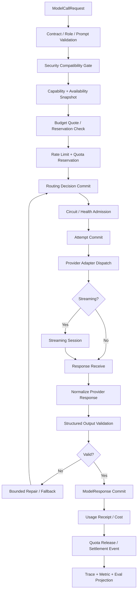

# 04 Model Gateway

updated: 2026-07-13  
status: normative-target-module-architecture  
module_number: 04  
formal_path: `docs/modules/04-model-gateway.md`  
agent_mirror: `.agent/modules/04-model-gateway.md`  
dependency_baseline_sha: `729e439e29deadc101c5687fc47125104e62e2c1`

> 本文是 Zuno 第 04 个逻辑模块——Model Gateway——的正式 Target 架构设计。
>
> 本文只定义目标边界、运行协议、领域 Contract、状态机、失败语义、存储与验证规格。Current、Gap、Measurement 和 Production Readiness 仍以 `docs/status/production-readiness.md`、当前代码、测试、Migration、Trace 与 Eval 为事实源。本文中出现的类名、表名、Provider、流程和测试编号均不代表已经实现。

## 0. 文档边界与规范优先级

```text
全局架构原则
→ Agent Core 正式 Target Contract
→ 本模块 Target Contract
→ 已确认的跨模块 Contract / ADR
→ Program
→ 代码、Migration、测试与运行证据
```

本文解决的是“所有模型调用如何以 Provider-neutral（供应商无关）的方式被安全、可恢复、可计量、可审计地执行”，不负责把模型结果直接变成最终业务事实。

Current / Target / Future 的解释方式：

| 层级 | 本文中的处理方式 |
| --- | --- |
| Current | 只作为设计输入引用：仓库已有 Gateway surface、统一 runtime service、少量真实调用接入；生产状态仍明确存在“所有真实模型调用尚未统一进入 Gateway”的 P0 Gap。本文不维护可变 Current 清单。 |
| Target | 本文的规范性主体：Role、Provider、Model、Capability、Routing、Attempt、Streaming、Structured Output、Usage、Quota、Health、Circuit、Security 与 Trace 的闭环。 |
| Future | 多区域主动流量调度、跨云经济优化、自动模型采购、全局多租户容量市场等长期可选能力，不是当前 Program 的完成前提。 |

正式实现前必须重新盘点真实调用链。当前仓库的 `tools/scripts/verify_model_gateway_boundaries.py` 仍保存大量 legacy allowlist，这只能证明旁路被识别，不能证明旁路已经消失。

---

# Part I：问题、目标与 Ownership

## 1. 为什么需要 Model Gateway

如果 Agent Core、Knowledge、Memory、Eval 或业务服务直接构造 Provider SDK Client，会同时产生以下问题：

```text
模型角色和具体厂商耦合
Provider 重试与 Runtime Retry 重叠，实际调用次数不可知
Timeout、Cancellation 和 Stream 终态不一致
Structured Output 成功仅凭 SDK 返回，不做本地 Schema 验证
Token / Cost 只估算或只记录最终成功调用，失败 Attempt 丢失
Rate Limit、Quota、Circuit Breaker 分散在各业务模块
Security、Data Residency 和 Credential Scope 无法在路由前统一门禁
模型成功但响应丢失时可能盲目重试，产生重复成本或副作用提案
Prompt、Model、Provider、SDK 和 Policy 版本无法固定到一次 Run
Trace 只能看到“调用了模型”，无法解释为什么选择、为什么 fallback
```

一句话定义：

> Model Gateway 是模型执行控制面。它将 `Model Role + Capability Requirement + Security / Budget / Residency / Deadline Constraints` 解析为不可变 `ModelRoutingDecision`，通过 Provider Adapter 执行一个或多个可审计 `ModelCallAttempt`，产出 Provider-neutral 的 `ModelResponse`、`StructuredOutputResult`、`UsageReceipt` 和 `ModelFailure`。

## 2. 目标

Model Gateway 必须达到：

1. **Role 与 Provider / Model 分离**：Agent Core 只选择 Role 和约束，不依赖具体 SDK、Provider 名称或模型 ID。
2. **能力可证明**：每个模型由版本化 `ModelCapabilityProfile` 描述；Planner 与 Agent Core 可以在计划激活前获得模型可行性事实。
3. **调用可恢复**：每次路由、Attempt、Stream、Validation、Usage 和 Reconcile 都有明确状态和幂等语义。
4. **失败可决策**：区分 Retry、Parameter Repair、Provider Fallback、Role Escalation 与 Agent Replan。
5. **成本可结算**：估算、Reservation、Provider Receipt、延迟 Usage 和最终 Settlement 可关联，且不把最终业务 Budget 所有权移入 Gateway。
6. **安全先于路由**：Provider Allowed List、Data Classification、Residency、Prompt Redaction、Credential Scope 和 Security Epoch 在发出请求前生效。
7. **Provider-neutral**：跨模块 Contract 不暴露 OpenAI、Anthropic、Gemini 或 LangChain 的 SDK 对象。
8. **可观测可评测**：路由理由、失败映射、fallback、stream、structured output、token、cost、latency 和 health 都可 Trace / Metric / Eval。

## 3. 非目标

Model Gateway 不负责：

```text
Task Planning 或 PlanVersion 激活
Step 状态、Acceptance、Reflection、Final Gate 或 RunOutcome
决定最终业务 Budget 是否允许整个 Run 继续
Security Authorization、Approval 或 Credential 发放
Tool 执行、外部副作用或副作用审批
Knowledge Evidence、Citation、Memory Commit 或长期经验治理
把模型输出直接写成最终领域事实
保存模型隐藏思维链
自动把所有 Provider 特性暴露为公共 Contract
建设产品级自治 Multi-Agent Runtime
```

模型输出永远是 `Proposal`、`Candidate` 或 `Model Result`。它可以被 Agent Core、Knowledge、Memory、Tool、Security 或 Eval 消费，但不得直接批准、激活、发布或提交长期事实。

## 4. Consumes / Produces / Owns / Does Not Own

| 方向 | Contract / Fact | Owner | 说明 |
| --- | --- | --- | --- |
| Consumes | `ModelRoleRequirement`、`StepModelRequirement`、`Deadline`、`CancellationRef` | Agent Core | Gateway 不重写 Step 或 Plan。 |
| Consumes | `BudgetReservationRef`、`BudgetLimitSnapshot` | Agent Core / Budget Ledger | Gateway 只能核验与消费已授权额度。 |
| Consumes | `ModelSecurityDecision`、Allowed Provider、Classification、Residency、Redaction、Credential Scope、Security Epoch | Security | Security 决定“允许什么”；Gateway 执行门禁。 |
| Consumes | `SecretRef`、`ConfigVersion`、Provider Connection、Clock、Transport、Store Port | Infrastructure | Gateway 不持有明文 Secret。 |
| Produces | `ModelCapabilityProfile`、`ModelAvailabilitySnapshot`、`ModelFeasibilityAssessment` | Model Gateway | Agent Core据此形成最终 `StepFeasibilityDecision`。 |
| Produces | `ModelRoutingDecision`、`ModelCallAttempt`、`ModelResponse`、`StructuredOutputResult` | Model Gateway | 均为不可变或版本化事实。 |
| Produces | `UsageReceipt`、`ModelFailure`、Provider Health / Circuit 事件 | Model Gateway | 供 Budget、Observability 与 Agent Core 消费。 |
| Produces | Model Trace / Metric / Eval Projection Event | Model Gateway | Observability 保存 Projection，不反向成为调用事实 Owner。 |
| Owns | Role Registry、Provider / Model Definition、Capability、Routing、Attempt、Quota、Health、Circuit、Prompt Binding | Model Gateway | 所有写入通过 Gateway Application Service。 |
| Does Not Own | Plan、Step、Answer、RunOutcome、Security Authorization、Tool Effect、Memory、Evidence | 对应模块 | Gateway 不得越权更新。 |

## 5. 架构不变量

1. Agent Core、Knowledge、Memory、Tool、Product 和 Eval 业务层不得导入具体 Provider SDK。
2. `ModelRoleDefinition` 不包含固定 Provider Secret、SDK Client 或不可替换的模型实例。
3. `ModelRoutingDecision` 提交后不可原地改写；重新路由创建新 Decision Version。
4. 每个真实 Provider 请求必须对应唯一 `ModelCallAttempt`，包括失败、超时、取消和验证失败。
5. SDK 内部 Retry 必须被禁用、显式配置或完整计入 Attempt；不得出现不可见的额外调用。
6. Security Gate、Budget Reservation 和 Quota Reservation 必须在 Provider Dispatch 前通过。
7. Stream Chunk 是 provisional（临时内容）；只有 terminal response 经过 Validation 后才形成可消费 `ModelResponse`。
8. Structured Output 必须执行本地 Schema Validation；Provider-native structured output 不是免验证通道。
9. Usage 未最终确认时必须表达 `ESTIMATED` 或 `SETTLEMENT_PENDING`，不得伪造精确成本。
10. Provider 成功但本地响应丢失时 Attempt 进入 `UNKNOWN` / `RECONCILING`，不得默认盲目重发。
11. Security Epoch、Prompt Binding、Model Definition、Provider Config 和 Pricing Version 必须固定到 Routing / Attempt。
12. Gateway Failure 只返回 `FailureClass + Recoverability + Suggested Control Action`；Agent Core 决定是否 Replan、Abstain 或终止。

---

# Part II：概念架构与 Provider-neutral Contract

## 6. 概念组件

```text
Model Role Registry
Model Catalog
Provider Registry
Capability Profile Registry
Availability Service
Feasibility Service
Security Compatibility Gate
Routing Policy Engine
Quota / Rate-limit Controller
Provider Health Service
Circuit Breaker Service
Prompt Binding Registry
Provider Adapter Registry
Model Call Coordinator
Streaming Session Manager
Structured Output Validator / Repair Coordinator
Usage & Cost Meter
Attempt / Response / Failure Repository
Reconciliation Service
Trace / Metric / Eval Publisher
```

这些组件初期可以位于同一 backend process，不要求先拆微服务。模块边界以 Contract、Owner、状态机和测试证明，而不是以部署数量证明。

## 7. Model Role 与 Provider / Model 分离

### 7.1 目标角色

```text
TASK_ANALYZER
PLANNER
PLAN_REPAIR
EXECUTOR_FAST
EXECUTOR_REASONING
QUERY_REWRITER
EXTRACTOR
CRITIC
SYNTHESIZER
FINAL_CRITIC
TOOL_CALL
```

`TOOL_CALL` 保留为受控兼容角色；它只代表模型需要生成 Tool Proposal，不代表模型可以执行或批准 Tool。

### 7.2 ModelRoleDefinition

```text
role_id
role_version
purpose
allowed_output_kinds
required_capabilities
preferred_capabilities
risk_tier
quality_tier
latency_class
structured_output_policy
streaming_policy
max_attempts
same_model_retry_policy
provider_fallback_policy
role_escalation_targets
prompt_binding_policy_ref
active_from / active_to
status
```

Role 只表达任务意图和能力要求。它不得保存：

```text
api_key
SDK client
固定 endpoint
无法替换的 provider/model object
Agent Core 的状态转换逻辑
```

### 7.3 默认角色升级链

```text
EXECUTOR_FAST
→ 同一 Role 内 Parameter Repair + bounded Retry
→ EXECUTOR_REASONING
→ CRITIC 产生 Retry / Replan / Abstain Proposal
→ Agent Core Decision Guard 提交控制决定
```

Gateway 负责执行“同 Role Retry”“Provider Fallback”“Role Escalation 的候选解析和调用”；Agent Core 负责触发升级、接受 Critic Proposal、决定 Replan 或 Abstain。

## 8. ProviderDefinition、ModelDefinition 与 Capability

### 8.1 ProviderDefinition

```text
provider_id
provider_version
adapter_kind
endpoint_region
residency_zones
supported_data_classifications
credential_scope_types
transport_modes
request_id_support
idempotency_support
usage_receipt_modes
rate_limit_semantics
sdk_name
sdk_version
provider_config_version
health_policy_ref
circuit_policy_ref
status
```

### 8.2 ModelDefinition

```text
model_definition_id
provider_id
provider_version
provider_model_id
model_revision
model_family
lifecycle_status
capability_profile_ref
pricing_version_ref
prompt_compatibility_refs
context_window_policy
availability_policy_ref
active_from / active_to
```

`provider_model_id` 只存在于 Gateway 内部定义与 Trace Projection；Agent Core Contract 只引用 `model_definition_ref` 或 Role。

### 8.3 ModelCapabilityProfile

```text
capability_profile_id
profile_version
model_definition_ref
input_modalities
output_modalities
max_context_tokens
max_output_tokens
supports_streaming
supports_native_structured_output
supported_schema_features
supports_tool_proposal
supports_parallel_tool_proposal
supports_usage_in_stream
supports_provider_request_id
supports_idempotency_key
supports_cancellation
supports_seed_or_determinism
supports_reasoning_controls
supports_logprobs
supported_languages
latency_class
quality_tier
residency_zones
supported_data_classifications
known_limitations
verified_at
verification_evidence_refs
```

Capability 不能只来自 Provider marketing metadata。生产可用 Profile 至少需要 Adapter Contract Test 或受控 Probe Evidence；未经验证的字段标为 `DECLARED_UNVERIFIED`。

### 8.4 ModelAvailabilitySnapshot

路由时冻结可用性，而不是执行中读取一个不断变化的全局布尔值：

```text
availability_snapshot_id
captured_at
provider_ref
model_definition_ref
region
health_state
circuit_state
rate_limit_state_ref
quota_summary
credential_version_ref
config_version
security_epoch
available
reason_codes
expires_at
```

Snapshot 失效、Security Epoch 变化或 Circuit 强制打开时，Dispatch 必须重新 Admission，不得沿用旧决定。

## 9. PromptBinding 与版本固定

`PromptBinding` 将模型角色、Prompt Template、Output Schema 和安全处理绑定为不可变版本：

```text
prompt_binding_id
binding_version
role_ref
prompt_template_ref
prompt_template_hash
system_policy_ref
few_shot_bundle_ref
output_schema_ref
output_schema_hash
redaction_policy_ref
provider_compatibility_rules
model_compatibility_rules
created_at
status
```

每个 `ModelCallRequest` 必须记录：

```text
prompt_binding_ref
rendered_prompt_hash
input_payload_ref
model_role_ref
contract_bundle_version
security_epoch
```

默认不在 Trace 中保存完整 Prompt / Response；保存 hash、脱敏 preview、结构化标签和受权限控制的 encrypted object ref。

## 10. StepFeasibility 接口

Agent Core 拥有最终 `StepFeasibilityDecision`。Gateway 只提供模型侧事实：

```text
assess_model_feasibility(
    StepModelRequirement,
    SecurityConstraintRef,
    BudgetConstraintRef,
    Deadline,
) -> ModelFeasibilityAssessment
```

`ModelFeasibilityAssessment`：

```text
assessment_id
required_role
required_capabilities
candidate_model_refs
rejected_candidate_refs
rejection_reason_codes
estimated_token_range
estimated_cost_range
estimated_latency_range
availability_snapshot_refs
security_compatibility_refs
quota_feasible
fallback_available
escalation_available
valid_until
```

Agent Core 将它与 Tool、Knowledge、Resource、Side-effect、Budget 和 Security 事实组合，生成最终 `StepFeasibilityDecision`。Gateway 不得激活 PlanVersion。

---

# Part III：完整调用流程、Routing、Fallback 与 Escalation

## 11. ModelCall 完整流程



关键事务顺序：

```text
1. 校验 Request / Role / Contract
2. 获取 Security Decision 与有效 Security Epoch
3. 读取 Capability、Availability、Health、Circuit、Rate Limit
4. 核验 Agent Core BudgetReservationRef
5. 原子创建 QuotaReservation
6. 提交 ModelRoutingDecision
7. 提交 ModelCallAttempt=ADMITTED
8. COMMIT 后调用 Provider
9. 持久化响应、失败、Stream 终态、Validation 与 Usage
10. 发送 Usage / Trace / Health Event
```

不得在持有数据库长事务时等待 Provider 网络响应。

## 12. ModelCallRequest

```text
request_id
idempotency_key
contract_version
contract_bundle_version
tenant_id
workspace_id
run_id
task_id
step_run_id
action_run_id
trace_id
correlation_id
causation_id
model_role_ref
prompt_binding_ref
input_payload_ref
input_payload_hash
required_capabilities
preferred_capabilities
output_contract_ref
structured_output_policy
tool_proposal_policy
streaming_policy
security_decision_ref
security_epoch
data_classification
residency_constraints
budget_reservation_ref
max_input_tokens
max_output_tokens
deadline_at
cancellation_ref
routing_hints
metadata_refs
```

`routing_hints` 只能表达偏好或已批准约束，不允许调用方绕过 Gateway 直接指定 Secret、SDK Client 或未经 Security 允许的 Provider。

## 13. Routing Decision

### 13.1 决策输入

```text
Model Role Definition
Required / Preferred Capability
Prompt / Schema Compatibility
Security Decision
Data Classification / Residency
Budget Reservation / Cost Quote
Deadline / Latency Class
Provider Health / Circuit
Rate Limit / Quota
Credential Scope Availability
Tenant / Workspace Policy
Provider / Model Version Lifecycle
Routing Stickiness / Experiment Assignment
```

### 13.2 ModelRoutingDecision

```text
routing_decision_id
routing_version
request_id
role_ref
candidate_rankings
selected_provider_ref
selected_model_ref
selected_capability_profile_ref
availability_snapshot_refs
security_decision_ref
security_epoch
budget_reservation_ref
quota_reservation_ref
prompt_binding_ref
provider_config_version
pricing_version_ref
rejected_candidates
reason_codes
fallback_chain
escalation_chain
created_at
valid_until
```

候选排序必须可解释，至少保存 rejection reason：

```text
CAPABILITY_MISMATCH
SECURITY_DENIED
RESIDENCY_MISMATCH
CLASSIFICATION_UNSUPPORTED
CREDENTIAL_SCOPE_UNAVAILABLE
MODEL_DISABLED
PROVIDER_UNHEALTHY
CIRCUIT_OPEN
RATE_LIMITED
QUOTA_UNAVAILABLE
BUDGET_INSUFFICIENT
DEADLINE_UNACHIEVABLE
PROMPT_INCOMPATIBLE
SCHEMA_UNSUPPORTED
```

### 13.3 Routing 与实验

A/B 或 Eval 路由必须先经过 Security / Budget / Capability Gate，再按可复现 assignment 选择。实验标签不能覆盖强制门禁。一次 Run 可选择 sticky routing，但 Security Revocation、Model Disabled 或 Circuit Open 必须打破 stickiness。

## 14. Retry、Fallback、Escalation、Replan 边界

| 机制 | 计划是否仍正确 | 变化范围 | Owner | 示例 |
| --- | --- | --- | --- | --- |
| Same-attempt transport recovery | 是 | SDK / connection 内部受控恢复 | Provider Adapter | 可证明请求未发出前的连接失败 |
| Retry | 是 | 新 `ModelCallAttempt`，同 Role / 可同 Model | Gateway 执行，Agent Core Policy 授权 | Timeout、可重试 5xx |
| Parameter Repair | 是 | 调整 temperature、max tokens、prompt framing、schema mode | Agent Core / Gateway Contract | Structured output malformed |
| Provider Fallback | 是 | 同 Role、同 Output Contract，更换 Provider / Model | Gateway | 429、Circuit Open |
| Role Escalation | 是 | 弱角色升级为强角色 | Agent Core 触发，Gateway 解析 | EXECUTOR_FAST → EXECUTOR_REASONING |
| Replan | 否或假设失效 | 创建新 PlanVersion，修改剩余 DAG | Agent Core | 执行器能力不足、目标依赖变化 |
| Abstain | 无安全可靠路径 | 结构化终局建议 | Agent Core | fallback exhausted + evidence不足 |

Gateway 不得因为 Fallback Exhausted 自行修改 Plan 或 AgentRun。它返回 `ModelFailure` 与建议动作：

```text
RETRY_SAME_ROLE
REPAIR_PARAMETERS
FALLBACK_PROVIDER
ESCALATE_ROLE
WAIT_QUOTA
REQUEST_REPLAN
ABSTAIN
FAIL
```

最终动作由 Agent Core Decision Guard 提交。

## 15. Fallback Policy

Fallback 必须满足：

```text
同一 Output Contract
能力不低于 required capability
Security / Residency / Classification 重新校验
独立 Quota Reservation
独立 ModelCallAttempt
成本和延迟仍在剩余 Budget / Deadline 内
PromptBinding 兼容
失败原因和链路可 Trace
```

不得把“换模型后输出看起来合理”当成兼容证明。Structured schema、tool proposal、stream semantics、usage semantics 和 context limit 均需重新验证。

---

# Part IV：规范性状态机

所有状态转换使用结构化 Transition Record：

```text
transition_id
aggregate_type
aggregate_id
from_status
to_status
trigger_type
trigger_ref
guard_result_ref
reason_code
security_epoch
config_version
occurred_at
trace_id
```

## 16. ModelCallAttempt 状态机

状态：

```text
CREATED
ADMITTED
DISPATCHING
IN_FLIGHT
STREAMING
RESPONSE_RECEIVED
VALIDATING
SUCCEEDED
FAILED
TIMED_OUT
CANCELLED
UNKNOWN
RECONCILING
ABANDONED
```

| From | Trigger | Guard | To | 同步事实 |
| --- | --- | --- | --- | --- |
| `CREATED` | `ADMISSION_PASSED` | Security、Budget、Quota、Circuit 均有效 | `ADMITTED` | Route + Reservation refs |
| `ADMITTED` | `DISPATCH_STARTED` | Attempt 未被取消且 Epoch 有效 | `DISPATCHING` | dispatch timestamp |
| `DISPATCHING` | `REQUEST_ACCEPTED` | Provider request id 或 transport receipt 可用 | `IN_FLIGHT` | provider_request_id |
| `IN_FLIGHT` | `FIRST_CHUNK` | Stream policy 允许 | `STREAMING` | stream_session_ref |
| `IN_FLIGHT` | `FULL_RESPONSE` | response envelope 可解析 | `RESPONSE_RECEIVED` | raw response ref |
| `STREAMING` | `TERMINAL_RESPONSE` | terminal event 顺序合法 | `RESPONSE_RECEIVED` | stream terminal record |
| `RESPONSE_RECEIVED` | `VALIDATION_STARTED` | payload hash 完整 | `VALIDATING` | validation attempt |
| `VALIDATING` | `VALIDATION_PASS` | output contract 和 safety checks 通过 | `SUCCEEDED` | ModelResponse + UsageReceipt |
| `VALIDATING` | `VALIDATION_FAIL` | repair / fallback 不可用或耗尽 | `FAILED` | StructuredOutputResult + Failure |
| 非终态 | `DEADLINE_EXCEEDED` | monotonic elapsed / absolute deadline 命中 | `TIMED_OUT` | timeout failure + cancellation request |
| 非终态 | `CANCEL_CONFIRMED` | cancellation policy 允许 | `CANCELLED` | cancellation receipt |
| `IN_FLIGHT`/`STREAMING` | `LOCAL_RESPONSE_LOST` | Provider 可能已成功 | `UNKNOWN` | reconciliation required |
| `UNKNOWN` | `RECONCILE_STARTED` | request id / receipt / provider query 可用 | `RECONCILING` | reconciliation record |
| `RECONCILING` | `SUCCESS_CONFIRMED` | Provider response 或 authoritative receipt 找回 | `SUCCEEDED` | response + usage |
| `RECONCILING` | `FAILURE_CONFIRMED` | Provider 明确失败 | `FAILED` | normalized failure |
| `RECONCILING` | `PROOF_UNAVAILABLE` | policy / retention / provider能力不足 | `ABANDONED` | human / budget correction required |

终态记录不可原地改写。对迟到 Usage、Health 或 Cost 更正，追加 Receipt / Adjustment / Reconciliation Record。

## 17. ProviderHealth 状态机

状态：

```text
UNKNOWN
HEALTHY
DEGRADED
UNAVAILABLE
RECOVERING
DISABLED
```

| From | Trigger | To | 规则 |
| --- | --- | --- | --- |
| `UNKNOWN` | startup probe / sufficient passive samples | `HEALTHY` 或 `DEGRADED` | 无证据不得默认 HEALTHY |
| `HEALTHY` | latency/error/rate-limit threshold breached | `DEGRADED` | 使用窗口与最小样本数 |
| `DEGRADED` | hard failure threshold / Security disable | `UNAVAILABLE` 或 `DISABLED` | Security disable 优先 |
| `UNAVAILABLE` | cooldown + probe success | `RECOVERING` | 只允许受限探测流量 |
| `RECOVERING` | success window reached | `HEALTHY` | 恢复必须有证据 |
| `RECOVERING` | probe failure | `UNAVAILABLE` | 重新冷却 |
| 任意 | admin/security disable | `DISABLED` | 不接受自动恢复 |
| `DISABLED` | explicit approved enable | `UNKNOWN` | 重新探测 |

Provider Health 是带版本的时间窗口 Projection；Routing Decision 必须引用使用的 Snapshot。

## 18. CircuitBreaker 状态机

状态：

```text
CLOSED
OPEN
HALF_OPEN
FORCED_OPEN
DISABLED
```

| From | Trigger | Guard | To |
| --- | --- | --- | --- |
| `CLOSED` | failure threshold reached | minimum samples + policy | `OPEN` |
| `OPEN` | cooldown elapsed | probe quota available | `HALF_OPEN` |
| `HALF_OPEN` | probe success threshold reached | consecutive / ratio policy | `CLOSED` |
| `HALF_OPEN` | probe failure | any configured failure | `OPEN` |
| 任意 | Security / operator force open | authorized command | `FORCED_OPEN` |
| `FORCED_OPEN` | approved release | current Security Epoch valid | `OPEN` 或 `HALF_OPEN` |
| 任意 | circuit feature disabled for deterministic test | test/admin policy | `DISABLED` |

Circuit Key 至少包含 `provider + model + endpoint_region + operation_kind`，避免一个 embedding endpoint 失败关闭全部 chat 流量。Circuit 只保护流量，不替代 Provider Health 或 Security Decision。

## 19. QuotaReservation 状态机

状态：

```text
PROPOSED
RESERVED
CONSUMING
SETTLEMENT_PENDING
SETTLED
REJECTED
RELEASED
EXPIRED
```

| From | Trigger | Guard | To |
| --- | --- | --- | --- |
| `PROPOSED` | atomic capacity claim | CAS / transactional guard | `RESERVED` 或 `REJECTED` |
| `RESERVED` | provider dispatch | Attempt ref 唯一 | `CONSUMING` |
| `RESERVED` | route invalidated / cancel | 未 dispatch | `RELEASED` |
| `RESERVED` | lease timeout | 未消费 | `EXPIRED` |
| `CONSUMING` | authoritative usage available | receipt complete | `SETTLED` |
| `CONSUMING` | response complete but usage delayed | estimate exists | `SETTLEMENT_PENDING` |
| `SETTLEMENT_PENDING` | receipt / reconciliation arrives | dedup by receipt key | `SETTLED` |
| `SETTLEMENT_PENDING` | reconciliation deadline | policy | `SETTLED` with estimate + adjustment pending |

Quota 是 Provider 容量控制，不等于 Agent Core 业务 Budget。Quota Race 必须通过数据库条件更新、原子计数器或等价一致性 Port 解决，不能使用进程内字典作为唯一事实源。

## 20. Streaming Session 状态机

状态：

```text
CREATED
OPENING
OPEN
TERMINATING
COMPLETED
FAILED
DISCONNECTED
CANCELLED
```

| From | Trigger | To | 规则 |
| --- | --- | --- | --- |
| `CREATED` | dispatch | `OPENING` | Session 与 Attempt 一对一或显式多段 |
| `OPENING` | first valid event | `OPEN` | sequence 从 0/1 单调递增 |
| `OPEN` | terminal success event | `TERMINATING` | 等待 final usage / response normalize |
| `TERMINATING` | response + validation committed | `COMPLETED` | 才可消费正式结果 |
| `OPENING`/`OPEN` | transport disconnect | `DISCONNECTED` | partial content 仍 provisional |
| 非终态 | provider error event | `FAILED` | 错误事件可出现在正常 HTTP 200 stream 内 |
| 非终态 | cancellation confirmed | `CANCELLED` | 记录已产生 token / cost |

规则：

```text
chunk sequence 唯一且单调
重复 chunk 按 event_id / sequence 去重
未知 Provider event type 保存为 UNKNOWN_PROVIDER_EVENT，并按兼容策略处理
partial stream 不得直接形成 FinalCandidate
stream reconnect 只有 Provider 能证明 continuation semantics 时才续接
否则创建新 Attempt，并明确重复成本风险
```

## 21. Structured Output Repair 状态机

状态：

```text
NOT_REQUIRED
PENDING
PROVIDER_VALIDATED
LOCAL_VALIDATING
VALID
INVALID
REPAIR_PROPOSED
REPAIRING
EXHAUSTED
```

| From | Trigger | Guard | To |
| --- | --- | --- | --- |
| `PENDING` | provider-native schema success | capability profile 支持 | `PROVIDER_VALIDATED` |
| `PENDING`/`PROVIDER_VALIDATED` | local validation start | schema hash 固定 | `LOCAL_VALIDATING` |
| `LOCAL_VALIDATING` | schema pass | no policy violation | `VALID` |
| `LOCAL_VALIDATING` | schema fail | errors structured | `INVALID` |
| `INVALID` | repair allowed | repair_count < max + budget available | `REPAIR_PROPOSED` |
| `REPAIR_PROPOSED` | new repair Attempt admitted | independent Usage / Trace | `REPAIRING` |
| `REPAIRING` | validation pass | same output contract | `VALID` |
| `REPAIRING` | fail and no remaining path | bound exhausted | `EXHAUSTED` |

Repair 是新的模型 Attempt 或确定性转换，不得隐式修改原 Response。原 invalid payload、validation error、repair prompt binding 和 repaired result 必须可追踪。

---

# Part V：Timeout、Cancellation、Usage、Quota、Health 与 Security

## 22. Timeout 与 Cancellation

Timeout 分层：

```text
connect_timeout
read_timeout
write_timeout
stream_idle_timeout
provider_request_timeout
attempt_deadline
step_deadline
run_deadline
```

原则：

1. Gateway 使用绝对 `deadline_at` 和进程内 monotonic elapsed；Provider SDK 默认 timeout 不得成为唯一控制。
2. SDK 自动 retry 和 timeout 必须显式配置并计入 Trace。以 OpenAI Python SDK 当前行为为例，部分连接错误、408、409、429 和 5xx 默认会自动重试，默认请求 timeout 也很长；Adapter 必须覆盖或暴露这些行为，避免 Gateway 统计少于真实调用次数。
3. Cancellation 是 best-effort。Provider 不支持取消时，本地标记取消仍需继续接收或丢弃迟到结果，并记录 Usage。
4. Security Revocation 高于普通 Cancellation：停止新 Dispatch，撤销未使用 Credential Scope，正在执行的 Attempt 按 Provider 能力取消或隔离其结果。
5. Timeout 后若不能证明 Provider 未执行，状态为 `UNKNOWN`，不得直接归类为 `FAILED_NOT_SENT`。

## 23. Rate Limit 与 Quota

### 23.1 RateLimitState

```text
rate_limit_state_id
provider_ref
model_ref
region
scope_type
scope_ref
window_start / window_end
request_limit / request_remaining
token_limit / token_remaining
retry_after_at
source
confidence
version
observed_at
```

`source` 可以是 Provider Header、Provider Error、Local Projection 或 Admin Config。Provider Header 是 observation，不是本地绝对真相；并发请求下必须允许保守误差。

### 23.2 Admission 顺序

```text
Security
→ Circuit
→ Provider Health
→ Budget Reservation
→ Local Quota Reservation
→ Provider Rate-limit Prediction
→ Dispatch
```

429 默认动作：

```text
尊重 Retry-After
→ 若 Deadline 允许则 WAIT_QUOTA
→ 若同 Role fallback 合法则 Provider Fallback
→ 若均不可用返回 RATE_LIMITED / QUOTA_EXHAUSTED
```

不得在每个业务模块各自 sleep 重试。

## 24. Provider Health 与 Circuit

Health 信号包括：

```text
success / failure ratio
connect / first-token / total latency
stream disconnect rate
structured output failure rate
429 / quota rejection rate
usage receipt delay
provider status probe
credential / auth failures
region-specific errors
```

安全或凭证错误不得简单计入一般 Provider 质量：

- `AUTH_INVALID` 可能是 Credential Rotation / Scope 错误；先隔离 credential version。
- `SECURITY_DENIED` 不是 Provider Health failure。
- `MALFORMED_RESPONSE` 可能是 Adapter / SDK 版本不兼容；按 Model + Adapter Version 开 Circuit。

## 25. UsageReceipt、Token 与 Cost

### 25.1 UsageReceipt

```text
usage_receipt_id
receipt_version
request_id
attempt_id
provider_ref
model_ref
provider_request_id
provider_receipt_id
usage_source
usage_status
input_tokens
cached_input_tokens
output_tokens
reasoning_tokens
tool_tokens
image_units / audio_units
request_count
currency
unit_prices
pricing_version_ref
estimated_cost
provider_reported_cost
billable_cost
observed_at
settled_at
reconciliation_ref
```

`usage_status`：

```text
ESTIMATED
PARTIAL
PROVIDER_REPORTED
SETTLEMENT_PENDING
RECONCILED
CORRECTED
UNAVAILABLE
```

规则：

1. 每个 Attempt 都产生 Usage 记录，即使失败、取消或 Structured Validation 失败。
2. Tokenizer Estimate 与 Provider Receipt 分开保存，不能覆盖。
3. Stream 中间 usage 可以累计，但最终 receipt 必须按 Provider semantics 归一化并去重。
4. Usage Receipt Delayed 时 ModelResponse 可以完成，但 Budget Settlement 保持 pending；RunOutcome 必须能引用 pending settlement，而不是丢失成本。
5. Pricing Version 必须固定；价格变化不回写历史 Receipt。
6. Usage Correction 追加更正记录，不修改已审计原始 receipt。

### 25.2 Budget Reservation / Consumption 对接

```text
Agent Core / Budget Ledger
    owns BudgetReservation, BudgetConsumption, BudgetSettlement

Model Gateway
    consumes BudgetReservationRef
    owns ModelCostQuote and UsageReceipt
    emits UsageObserved / UsageCorrected
```

Gateway Admission 检查 reservation scope、remaining amount、expiry、security epoch 和 attempt allowance。Gateway 不得自行扩大 Run Budget，也不得因为某 Provider 更便宜就绕过 Agent Core 的质量或安全策略。

## 26. Provider Success but Response Lost

故障序列：

```text
Provider 完成请求
→ 网络在响应到达本地前断开
→ 本地只知道请求可能已执行
```

处理：

1. 保存 Provider Request ID、Idempotency Key、dispatch receipt 和 request hash。
2. Attempt 进入 `UNKNOWN`，释放/冻结 Quota 按 Policy 处理。
3. Provider 支持 retrieve-by-request-id 时执行 Reconcile。
4. 只有能证明请求未被 Provider 接受，才允许 same-request safe retry。
5. 无法证明时，新 Attempt 必须带 duplicate-risk reason，并由上层 Policy 明确允许；默认不盲目重发高成本或会产生 Tool Proposal 的请求。
6. 迟到响应与后续 Attempt 竞争时，不得静默覆盖已提交结果；创建 Reconciliation / Supersession Record。

## 27. Security、Data Residency、Classification 与 Credential

### 27.1 Model Security Decision

Gateway 消费 Security 模块给出的：

```text
security_decision_id
security_epoch
allowed_provider_refs
allowed_model_refs
data_classification
residency_constraints
cross_border_allowed
prompt_redaction_result_ref
response_redaction_policy_ref
credential_scope_ref
purpose_limit
retention_constraints
expires_at
```

Gateway 不解释企业 ACL，也不自己批准 Provider。它必须 fail-closed：Decision 缺失、过期、Epoch 不匹配或 Provider 不在 allowlist 时不 Dispatch。

### 27.2 Prompt Redaction

```text
raw input refs
→ Security redaction / policy transform
→ redacted payload ref + redaction manifest
→ Prompt Renderer
→ rendered prompt hash
→ Provider Dispatch
```

Gateway Trace 只记录安全允许的 preview。Redaction Manifest 属于 Security 决策证据；Gateway 保存引用，不改变其结论。

### 27.3 Secret 与 Credential Scope

```text
SecretRef only
CredentialVersionRef
Provider / Tenant / Workspace / Purpose Scope
least privilege
short-lived where supported
rotation and revocation
no secret in prompt / trace / error / event
```

Credential Rotation：

- Routing 决策固定 `credential_version_ref`。
- 新 Attempt 使用最新有效版本。
- 已在途 Attempt 默认继续使用固定版本；若旧版本被 Security 撤销，则取消或隔离结果。
- Rotation 失败返回 `CREDENTIAL_UNAVAILABLE`，不得回退到未批准的全局 key。

### 27.4 Security Revocation

Security Epoch 变化触发：

```text
停止新 Attempt
使未 Dispatch Routing Decision 失效
释放 Quota Reservation
请求取消在途 Attempt
标记迟到响应为 SECURITY_REVOKED / TAINTED
通知 Agent Core 进行控制仲裁
```

Gateway 不直接修改 AgentRun 终态。

---

# Part VI：Structured Output、Streaming、Failure 与 Observability

## 28. Structured Output Contract

### 28.1 StructuredOutputResult

```text
structured_output_result_id
attempt_id
output_contract_ref
schema_hash
requested_mode
actual_mode
provider_validation_status
local_validation_status
normalized_payload_ref
validation_errors
repair_attempt_refs
repair_count
status
created_at
```

`actual_mode`：

```text
PROVIDER_NATIVE
TOOL_STRATEGY
PROMPTED_JSON
DETERMINISTIC_TRANSFORM
```

Capability Profile 决定可选模式。Provider-native 模式可能只支持 JSON Schema 子集；Gateway 必须在路由前做 Schema Compatibility，响应后做本地完整验证。Schema 不兼容时可以选择 Tool Strategy 或 Prompted JSON，但必须记录降级。

### 28.2 Repair

Repair 输入只能包含：

```text
原 payload ref
validation error list
固定 output schema ref
允许修改的字段范围
repair prompt binding ref
剩余 budget / deadline
```

不得把 Repair 变成无限自我修正循环。默认最大次数由 Role / Output Contract Policy 决定；耗尽后返回 `STRUCTURED_OUTPUT_EXHAUSTED`。

## 29. Streaming Contract

### 29.1 ModelStreamChunk

```text
stream_chunk_id
stream_session_id
attempt_id
sequence_no
provider_event_id
chunk_type
content_ref
content_hash
provisional
usage_delta
finish_reason
provider_event_type
received_at
trace_span_id
```

`chunk_type` 至少支持：

```text
SESSION_STARTED
CONTENT_DELTA
REASONING_SUMMARY_DELTA
TOOL_PROPOSAL_DELTA
STRUCTURED_OUTPUT_DELTA
USAGE_DELTA
PROVIDER_WARNING
PROVIDER_ERROR
SESSION_COMPLETED
UNKNOWN_PROVIDER_EVENT
```

禁止保存隐藏思维链。若 Provider 提供 reasoning 内容，只允许保存产品和政策明确允许的 reasoning summary 或受限 metadata。

### 29.2 Provider 事件归一化

不同 Provider 的 stream terminal 事件、usage 累计方式和错误事件不同。Adapter 负责映射到统一 Contract，但不得丢失原始 event type、provider request id 和未知事件。以当前官方行为为例：

- OpenAI Responses Streaming 使用 SSE，并区分 created、in_progress、completed、failed、incomplete；完成事件可携带 usage，失败或 incomplete 可能没有完整 usage。
- Anthropic Streaming 有 message / content block 生命周期，usage 可能在后续 delta 中累计，HTTP 200 stream 内仍可能出现 error event，也可能新增未知 event type。
- Gemini / LangChain 的 structured streaming 需要结合实际 Capability Profile 与本地 Schema Validation，不应由调用方静态假定。

这些 Provider 事实只指导 Adapter 实现，不进入跨模块公共枚举。

## 30. ModelFailure

```text
model_failure_id
attempt_id
failure_class
provider_error_code
normalized_error_code
http_status
sdk_exception_type
retryable
safe_to_retry
request_may_have_executed
partial_response_available
usage_status
security_relevant
suggested_control_action
redacted_message
raw_error_ref
created_at
```

统一 Failure Class：

```text
CONTRACT_INVALID
ROLE_UNRESOLVED
CAPABILITY_UNAVAILABLE
SECURITY_DENIED
SECURITY_REVOKED
RESIDENCY_MISMATCH
CREDENTIAL_UNAVAILABLE
AUTH_FAILED
BUDGET_DENIED
QUOTA_EXHAUSTED
RATE_LIMITED
CIRCUIT_OPEN
PROVIDER_UNAVAILABLE
CONNECT_TIMEOUT
READ_TIMEOUT
STREAM_IDLE_TIMEOUT
CANCELLED
STREAM_DISCONNECTED
PROVIDER_ERROR
SDK_ERROR
MALFORMED_RESPONSE
STRUCTURED_OUTPUT_INVALID
STRUCTURED_OUTPUT_EXHAUSTED
USAGE_UNAVAILABLE
RESPONSE_LOST
UNKNOWN_EXECUTION
FALLBACK_EXHAUSTED
```

## 31. Failure Decision Matrix

| Failure | Gateway 状态变化 | 默认恢复 | 对 Agent Core 输出 | 禁止行为 |
| --- | --- | --- | --- | --- |
| Provider Timeout | Attempt `TIMED_OUT` 或 `UNKNOWN` | safe retry / fallback，受 deadline 限制 | timeout class + may_have_executed | 无证据标记“未执行” |
| Rate Limit | Attempt `FAILED`，RateLimit 更新 | Retry-After wait / fallback | `WAIT_QUOTA` 或 fallback exhausted | 业务模块自行无限 sleep |
| Malformed Structured Output | `VALIDATING → FAILED` | bounded repair / compatible fallback | validation errors | 把 invalid JSON 当成功 |
| Stream Disconnect | Stream `DISCONNECTED`，Attempt `UNKNOWN`/`FAILED` | provider-supported resume 或新 Attempt | partial ref + duplicate risk | 把 partial content 发布为 final |
| Usage Receipt Delayed | Response 可成功，Quota `SETTLEMENT_PENDING` | async reconcile | pending usage ref | 写 0 token / 0 cost 冒充最终值 |
| Provider Success but Response Lost | Attempt `UNKNOWN → RECONCILING` | request-id reconcile | unknown execution | 盲目重发 |
| Circuit Breaker Transition | Circuit `CLOSED/OPEN/HALF_OPEN` | alternate candidate / probe | circuit reason | 在 OPEN 上继续常规流量 |
| Fallback Exhausted | Call terminal failure | none in Gateway | failure + escalation/replan suggestion | Gateway 修改 Plan |
| Security Revocation | route invalid + cancel/taint | fail-closed | security revoked | 使用旧 Epoch / credential |
| Quota Race | Reservation `REJECTED` | alternate / wait | quota unavailable | 超卖进程内配额 |
| Credential Rotation | old ref pinned/revoked | new version re-route | credential failure | 回退未批准 global key |
| Provider SDK Error Mapping | Attempt failure normalized | policy by mapped class | stable FailureClass | 向 Agent Core 泄漏 SDK object |

## 32. Trace、Metric 与 Eval

### 32.1 Span Tree

```text
model_call
  -> model_security_gate
  -> model_feasibility
  -> model_routing
  -> quota_reservation
  -> model_attempt[n]
       -> provider_dispatch
       -> model_stream
       -> response_normalize
       -> structured_output_validate
       -> usage_observe
  -> model_reconcile
```

每个 span 至少记录：

```text
run_id / task_id / step_run_id / trace_id / workspace_id
role_ref
provider_ref / model_ref / capability_profile_ref
prompt_binding_ref / schema_hash
routing_decision_ref / reason_codes
security_decision_ref / security_epoch / classification / residency result
budget_reservation_ref / quota_reservation_ref
attempt_no / sdk_retry_count / provider_request_id
connect / first-token / total latency
token / usage_status / cost / pricing_version
stream status / chunk count / disconnect
structured output mode / validation / repair count
failure class / retry / fallback / escalation
health snapshot / circuit state
```

Prompt、Response、Secret 和错误必须按 Security Redaction Policy 处理。Audit / Security Event 不采样；普通高容量 chunk trace 可以采样或只保存聚合，但不得影响 Usage 与失败事实完整性。

### 32.2 Metrics

```text
model_call_success_rate
model_attempts_per_call
model_retry_rate
provider_fallback_rate
role_escalation_rate
first_token_latency
model_total_latency
stream_disconnect_rate
structured_output_valid_rate
structured_output_repair_rate
usage_receipt_delay
estimated_vs_reported_token_error
cost_per_role / per_run / per_workspace
rate_limit_rejection
quota_rejection
circuit_open_count
provider_health_state_duration
unknown_execution_count
security_denial_count
```

### 32.3 Eval

Eval 固定：

```text
role definition version
prompt binding version
model definition / revision
provider config version
capability profile version
routing policy version
security policy version
output schema hash
pricing version
```

比较不同模型时必须固定 case set、输入、Prompt、Output Contract、Security 条件和评判 Policy。Observed production success 不等于 quality proven。

---

# Part VII：Typed Contract、Storage、代码目录与跨模块 Proposal

## 33. Typed Contract 总表

| Contract | 类型 | Owner | 关键规则 |
| --- | --- | --- | --- |
| `ModelRoleDefinition` | Versioned Definition | Gateway | 不绑定 SDK / Secret |
| `ProviderDefinition` | Versioned Definition | Gateway | 描述 Adapter、区域与 Provider 语义 |
| `ModelDefinition` | Versioned Definition | Gateway | Provider 内模型及 revision |
| `ModelCapabilityProfile` | Versioned Profile | Gateway | declared 与 verified 状态分离 |
| `ModelAvailabilitySnapshot` | Immutable Snapshot | Gateway | 路由时冻结 |
| `ModelCallRequest` | Command | Caller → Gateway | Provider-neutral，含 Security / Budget refs |
| `ModelRoutingDecision` | Immutable Decision | Gateway | 候选、拒绝、版本、fallback 全记录 |
| `ModelCallAttempt` | Aggregate / Attempt | Gateway | 每次 Provider 请求一条 |
| `ModelResponse` | Immutable Result | Gateway | Proposal / model result，不是业务终局 |
| `ModelStreamChunk` | Ordered Event | Gateway | provisional、去重、单调 sequence |
| `StructuredOutputResult` | Immutable Result | Gateway | Provider + local validation |
| `UsageReceipt` | Append-only Receipt | Gateway | estimate / provider / correction 分离 |
| `RateLimitState` | Versioned Projection | Gateway | 来源和置信度明确 |
| `QuotaReservation` | Aggregate | Gateway | CAS / lease / settlement |
| `ProviderHealth` | Versioned Projection | Gateway | window + evidence |
| `CircuitBreakerState` | Aggregate / State | Gateway | key 按 provider/model/region/operation |
| `PromptBinding` | Immutable Binding | Gateway | prompt/schema/security/model compatibility |
| `ModelFailure` | Immutable Failure | Gateway | stable class + SDK mapping |
| `ModelFeasibilityAssessment` | Immutable Assessment | Gateway | 供 Agent Core StepFeasibility 使用 |

### 33.1 ModelResponse

```text
model_response_id
request_id
successful_attempt_id
role_ref
provider_ref
model_ref
output_kind
content_ref
content_hash
structured_output_result_ref
finish_reason
provider_request_id
usage_receipt_refs
result_validity
security_epoch
created_at
```

`result_validity`：`VALID`、`PARTIAL`、`TAINTED`、`REVOKED`、`UNKNOWN`。Security Revocation、迟到 Provider Error 或 Reconciliation 可以追加 Validity Record；不得覆盖原始响应。

### 33.2 Contract Envelope

跨模块所有 Request / Result / Event 至少带：

```text
contract_name
contract_version
contract_bundle_version
message_id
correlation_id
causation_id
tenant_id
workspace_id
run_id
step_run_id
trace_id
security_context_ref
security_epoch
data_classification
created_at
payload_schema_hash
payload
```

## 34. PostgreSQL Storage Mapping

逻辑 schema 可命名为 `model_gateway`；物理部署可以与其他模块共用 PostgreSQL，但 Owner 不变。

| 对象 | 目标表 | 关键约束 / 索引 |
| --- | --- | --- |
| Role | `model_role_definitions` | `UNIQUE(role_id, role_version)`；active version 条件唯一 |
| Provider | `model_provider_definitions` | `UNIQUE(provider_id, provider_version)`；状态索引 |
| Model | `model_definitions` | `UNIQUE(provider_id, provider_model_id, model_revision)` |
| Capability | `model_capability_profiles` | `UNIQUE(model_definition_id, profile_version)`；JSON Schema hash |
| Availability | `model_availability_snapshots` | `(provider_id, model_definition_id, captured_at DESC)` |
| Prompt Binding | `model_prompt_bindings` | `UNIQUE(prompt_binding_id, binding_version)`；template/schema hash |
| Call | `model_calls` | `UNIQUE(workspace_id, idempotency_key)`；run / step / trace indexes |
| Routing | `model_routing_decisions` | `UNIQUE(request_id, routing_version)`；immutable |
| Attempt | `model_call_attempts` | `UNIQUE(model_call_id, attempt_no)`；partial unique provider request id |
| Response | `model_responses` | `UNIQUE(model_call_id, response_version)`；large body 只存 object ref |
| Stream Session | `model_stream_sessions` | `UNIQUE(attempt_id, session_no)` |
| Stream Chunk | `model_stream_chunks` | `UNIQUE(stream_session_id, sequence_no)`；可按 retention 分区 |
| Structured Output | `model_structured_output_results` | attempt / schema hash index |
| Usage | `model_usage_receipts` | provider receipt id / attempt / status indexes；append-only |
| Rate Limit | `model_rate_limit_states` | provider/model/region/scope/window composite index |
| Quota | `model_quota_reservations` | `UNIQUE(reservation_key)`；status/expiry index；version CAS |
| Health | `model_provider_health_snapshots` | provider/model/region/window index |
| Circuit | `model_circuit_breaker_states` | `UNIQUE(circuit_key)`；version / next_probe_at index |
| Failure | `model_failure_records` | attempt / class / created_at indexes |
| Reconcile | `model_reconciliation_records` | `UNIQUE(attempt_id, reconciliation_no)` |
| Validity | `model_result_validity_records` | response / security_epoch / status index |

共同约束：

```text
workspace scope 或明确 global definition
UTC timestamp
optimistic version / fencing where mutable
状态 CHECK constraint
所有 refs 使用稳定 opaque ID
Secret 明文禁止入库
大型 Prompt / Response 使用 encrypted object ref + content hash
删除 / retention / legal hold policy 明确
Usage / Attempt / Failure 采用 append-only 或 correction record
```

`model_stream_chunks` 不要求永久保存每个 token。默认可保存终端事件、checkpoint chunk、hash 和聚合；高审计场景才按 Policy 保存完整 chunk object。无论 retention 如何，sequence、terminal status、usage 与 failure 必须可证明。

## 35. 目标代码目录

```text
src/backend/zuno/model_gateway/
├── contracts/
│   ├── role.py
│   ├── provider.py
│   ├── model.py
│   ├── capability.py
│   ├── request.py
│   ├── routing.py
│   ├── attempt.py
│   ├── response.py
│   ├── streaming.py
│   ├── structured_output.py
│   ├── usage.py
│   ├── quota.py
│   ├── health.py
│   ├── failure.py
│   └── events.py
├── domain/
│   ├── role_registry.py
│   ├── catalog.py
│   ├── routing_policy.py
│   ├── attempt.py
│   ├── quota.py
│   ├── circuit_breaker.py
│   ├── provider_health.py
│   └── prompt_binding.py
├── application/
│   ├── feasibility_service.py
│   ├── routing_service.py
│   ├── model_call_service.py
│   ├── streaming_service.py
│   ├── structured_output_service.py
│   ├── usage_service.py
│   └── reconciliation_service.py
├── adapters/
│   ├── base.py
│   ├── openai_adapter.py
│   ├── anthropic_adapter.py
│   ├── gemini_adapter.py
│   └── local_adapter.py
├── persistence/
│   ├── repositories.py
│   ├── uow.py
│   └── models.py
├── ports/
│   ├── security.py
│   ├── budget.py
│   ├── secrets.py
│   ├── clock.py
│   ├── transport.py
│   └── observability.py
└── bootstrap.py
```

迁移期可以保留 `zuno.platform.model_gateway` facade，但 facade 只能转发到新模块，不得继续成为 Provider SDK 构造和领域规则混合点。旁路清理必须由独立 Codex Program 逐项完成。

## 36. 对 Agent Core 的正式接口

```text
resolve_capabilities(role_ref) -> ModelCapabilityProfile[]
assess_model_feasibility(requirement, constraints) -> ModelFeasibilityAssessment
invoke_model(ModelCallRequest) -> ModelCallResult
stream_model(ModelCallRequest) -> AsyncIterator[ModelStreamChunk]
get_usage(call_ref) -> UsageReceipt[]
get_failure(call_ref) -> ModelFailure | None
cancel_call(call_ref, cancellation_ref) -> CancellationReceipt
```

`ModelCallResult`：

```text
status
model_response_ref
structured_output_result_ref
usage_receipt_refs
routing_decision_ref
attempt_refs
failure_ref
suggested_control_action
```

Agent Core 不依赖 Provider SDK 类型、HTTP Response、LangChain `BaseChatModel` 或具体 stream event。

## 37. Parallel Wave 1 Contract Proposals

截至本文 baseline，未发现 09 Security、10 Observability & Eval、11 Infrastructure 的已合并 Wave 1 Target Contract 或可作为正式事实源的开放 PR。以下仅为 Model Gateway 对跨模块接口的依赖请求；对方模块 PR 合并前均标记 `Parallel Proposal`。

### 37.1 对 09 Security 的依赖请求

请确认或提供：

```text
ModelSecurityDecision
ProviderAllowedListRef
DataClassification
ResidencyConstraint
PromptRedactionResult
CredentialScopeRef
SecurityEpoch
SecurityRevocationEvent
```

需要明确：Decision expiry、Epoch 变化、跨境策略、Prompt/Response redaction owner、credential rotation/revocation、迟到响应 taint 规则。

### 37.2 对 11 Infrastructure 的依赖请求

请确认或提供：

```text
SecretRef / CredentialVersionRef
ConfigVersion
ProviderConnectionFactory
Transactional Store / UoW
Usage Ledger Storage Port
Rate-limit / Quota Atomic State Port
Streaming Transport
Monotonic Clock / Database Clock
Timeout / Cancellation Primitive
Encrypted Object Store Ref
```

Infrastructure 提供连接、Secret、Config、Clock 和持久化能力；不得成为 Routing、Attempt、Usage、Health 或 Circuit 领域事实 Owner。

### 37.3 对 10 Observability & Eval 的依赖请求

请确认或提供：

```text
ModelCall Trace Schema
Prompt / Response Redaction Contract
Token / Cost Metric Schema
Routing / Fallback / Escalation Trace
Structured Output Failure Event
Provider Health / Circuit Metric
Eval Model Configuration Snapshot
Trace Delivery Status
```

Observability 保存 Projection 与 Eval，不覆盖 Gateway 原始调用事实。

---

# Part VIII：Requirement Registry、测试与完成证据

## 38. Requirement Registry

每个 Requirement 必须在实现 Program 中映射 Owner Path、Migration、Contract、正常测试、故障测试、E2E、Trace / Evidence 和 Rollback。下表中的测试 ID 是最小证据槽，不表示测试已经存在。

| Requirement | 规范 | Runtime Control | Unit | Integration | Fault | E2E | Evidence |
| --- | --- | --- | --- | --- | --- | --- | --- |
| `ARCH-MODEL-001` | Role 与 Provider / Model 必须分离 | `RC-MODEL-001` | `MODEL-001-UT` | `MODEL-001-IT` | `MODEL-001-FT` | `MODEL-001-E2E` | `EV-MODEL-001` |
| `ARCH-MODEL-002` | Role Registry 必须覆盖十一种正式角色 | `RC-MODEL-002` | `MODEL-002-UT` | `MODEL-002-IT` | `MODEL-002-FT` | `MODEL-002-E2E` | `EV-MODEL-002` |
| `ARCH-MODEL-003` | Agent Core 只消费 Provider-neutral Contract | `RC-MODEL-003` | `MODEL-003-UT` | `MODEL-003-IT` | `MODEL-003-FT` | `MODEL-003-E2E` | `EV-MODEL-003` |
| `ARCH-MODEL-004` | 每个模型必须有版本化 Capability Profile | `RC-MODEL-004` | `MODEL-004-UT` | `MODEL-004-IT` | `MODEL-004-FT` | `MODEL-004-E2E` | `EV-MODEL-004` |
| `ARCH-MODEL-005` | Routing 必须固定 Availability Snapshot | `RC-MODEL-005` | `MODEL-005-UT` | `MODEL-005-IT` | `MODEL-005-FT` | `MODEL-005-E2E` | `EV-MODEL-005` |
| `ARCH-MODEL-006` | Gateway 必须输出 StepFeasibility 所需模型事实 | `RC-MODEL-006` | `MODEL-006-UT` | `MODEL-006-IT` | `MODEL-006-FT` | `MODEL-006-E2E` | `EV-MODEL-006` |
| `ARCH-MODEL-007` | Routing Decision 必须不可变、可解释、可版本化 | `RC-MODEL-007` | `MODEL-007-UT` | `MODEL-007-IT` | `MODEL-007-FT` | `MODEL-007-E2E` | `EV-MODEL-007` |
| `ARCH-MODEL-008` | Security Gate 必须先于 Provider Dispatch | `RC-MODEL-008` | `MODEL-008-UT` | `MODEL-008-IT` | `MODEL-008-FT` | `MODEL-008-E2E` | `EV-MODEL-008` |
| `ARCH-MODEL-009` | Data Classification 与 Residency 必须进入路由约束 | `RC-MODEL-009` | `MODEL-009-UT` | `MODEL-009-IT` | `MODEL-009-FT` | `MODEL-009-E2E` | `EV-MODEL-009` |
| `ARCH-MODEL-010` | Credential 必须使用 SecretRef 与最小 Scope | `RC-MODEL-010` | `MODEL-010-UT` | `MODEL-010-IT` | `MODEL-010-FT` | `MODEL-010-E2E` | `EV-MODEL-010` |
| `ARCH-MODEL-011` | Prompt、Model、Provider、SDK、Pricing 版本必须绑定 Attempt | `RC-MODEL-011` | `MODEL-011-UT` | `MODEL-011-IT` | `MODEL-011-FT` | `MODEL-011-E2E` | `EV-MODEL-011` |
| `ARCH-MODEL-012` | 每个 Provider 请求必须有独立 ModelCallAttempt | `RC-MODEL-012` | `MODEL-012-UT` | `MODEL-012-IT` | `MODEL-012-FT` | `MODEL-012-E2E` | `EV-MODEL-012` |
| `ARCH-MODEL-013` | Timeout 与 Cancellation 必须分层且可审计 | `RC-MODEL-013` | `MODEL-013-UT` | `MODEL-013-IT` | `MODEL-013-FT` | `MODEL-013-E2E` | `EV-MODEL-013` |
| `ARCH-MODEL-014` | SDK 内部 Retry 必须禁用、配置或完整计数 | `RC-MODEL-014` | `MODEL-014-UT` | `MODEL-014-IT` | `MODEL-014-FT` | `MODEL-014-E2E` | `EV-MODEL-014` |
| `ARCH-MODEL-015` | Provider Fallback 必须保持 Role 与 Output Contract | `RC-MODEL-015` | `MODEL-015-UT` | `MODEL-015-IT` | `MODEL-015-FT` | `MODEL-015-E2E` | `EV-MODEL-015` |
| `ARCH-MODEL-016` | Role Escalation 必须与 Provider Fallback 分离 | `RC-MODEL-016` | `MODEL-016-UT` | `MODEL-016-IT` | `MODEL-016-FT` | `MODEL-016-E2E` | `EV-MODEL-016` |
| `ARCH-MODEL-017` | Retry、Repair、Fallback、Escalation、Replan 必须分别审计 | `RC-MODEL-017` | `MODEL-017-UT` | `MODEL-017-IT` | `MODEL-017-FT` | `MODEL-017-E2E` | `EV-MODEL-017` |
| `ARCH-MODEL-018` | Structured Output 必须本地 Schema Validation | `RC-MODEL-018` | `MODEL-018-UT` | `MODEL-018-IT` | `MODEL-018-FT` | `MODEL-018-E2E` | `EV-MODEL-018` |
| `ARCH-MODEL-019` | Structured Output Repair 必须有界并产生独立 Attempt | `RC-MODEL-019` | `MODEL-019-UT` | `MODEL-019-IT` | `MODEL-019-FT` | `MODEL-019-E2E` | `EV-MODEL-019` |
| `ARCH-MODEL-020` | Streaming Session 必须有显式终态和 provisional 语义 | `RC-MODEL-020` | `MODEL-020-UT` | `MODEL-020-IT` | `MODEL-020-FT` | `MODEL-020-E2E` | `EV-MODEL-020` |
| `ARCH-MODEL-021` | Stream 未知事件与错误事件不得静默丢弃 | `RC-MODEL-021` | `MODEL-021-UT` | `MODEL-021-IT` | `MODEL-021-FT` | `MODEL-021-E2E` | `EV-MODEL-021` |
| `ARCH-MODEL-022` | Usage Receipt 必须表达估算、延迟、权威与更正 | `RC-MODEL-022` | `MODEL-022-UT` | `MODEL-022-IT` | `MODEL-022-FT` | `MODEL-022-E2E` | `EV-MODEL-022` |
| `ARCH-MODEL-023` | Token 与 Cost 必须固定 Pricing Version 并覆盖失败 Attempt | `RC-MODEL-023` | `MODEL-023-UT` | `MODEL-023-IT` | `MODEL-023-FT` | `MODEL-023-E2E` | `EV-MODEL-023` |
| `ARCH-MODEL-024` | Gateway 只能消费业务 Budget Reservation，不拥有最终 Budget 决策 | `RC-MODEL-024` | `MODEL-024-UT` | `MODEL-024-IT` | `MODEL-024-FT` | `MODEL-024-E2E` | `EV-MODEL-024` |
| `ARCH-MODEL-025` | Provider Rate Limit 必须归一化并遵守 Retry-After | `RC-MODEL-025` | `MODEL-025-UT` | `MODEL-025-IT` | `MODEL-025-FT` | `MODEL-025-E2E` | `EV-MODEL-025` |
| `ARCH-MODEL-026` | Quota Reservation 必须原子、可释放、可过期、可结算 | `RC-MODEL-026` | `MODEL-026-UT` | `MODEL-026-IT` | `MODEL-026-FT` | `MODEL-026-E2E` | `EV-MODEL-026` |
| `ARCH-MODEL-027` | Quota Race 必须由一致性机制阻止超卖 | `RC-MODEL-027` | `MODEL-027-UT` | `MODEL-027-IT` | `MODEL-027-FT` | `MODEL-027-E2E` | `EV-MODEL-027` |
| `ARCH-MODEL-028` | Provider Health 必须按证据与时间窗口转换 | `RC-MODEL-028` | `MODEL-028-UT` | `MODEL-028-IT` | `MODEL-028-FT` | `MODEL-028-E2E` | `EV-MODEL-028` |
| `ARCH-MODEL-029` | Circuit Breaker 必须支持 Closed/Open/Half-open 与强制打开 | `RC-MODEL-029` | `MODEL-029-UT` | `MODEL-029-IT` | `MODEL-029-FT` | `MODEL-029-E2E` | `EV-MODEL-029` |
| `ARCH-MODEL-030` | Provider Success but Response Lost 必须进入 UNKNOWN / Reconcile | `RC-MODEL-030` | `MODEL-030-UT` | `MODEL-030-IT` | `MODEL-030-FT` | `MODEL-030-E2E` | `EV-MODEL-030` |
| `ARCH-MODEL-031` | Request、Attempt、Receipt 与 Reconcile 必须幂等去重 | `RC-MODEL-031` | `MODEL-031-UT` | `MODEL-031-IT` | `MODEL-031-FT` | `MODEL-031-E2E` | `EV-MODEL-031` |
| `ARCH-MODEL-032` | Prompt / Response / Error Trace 必须按 Security Policy 脱敏 | `RC-MODEL-032` | `MODEL-032-UT` | `MODEL-032-IT` | `MODEL-032-FT` | `MODEL-032-E2E` | `EV-MODEL-032` |
| `ARCH-MODEL-033` | Routing、Attempt、Fallback、Usage、Health 必须完整 Trace | `RC-MODEL-033` | `MODEL-033-UT` | `MODEL-033-IT` | `MODEL-033-FT` | `MODEL-033-E2E` | `EV-MODEL-033` |
| `ARCH-MODEL-034` | Provider / SDK Error 必须映射为稳定 ModelFailure | `RC-MODEL-034` | `MODEL-034-UT` | `MODEL-034-IT` | `MODEL-034-FT` | `MODEL-034-E2E` | `EV-MODEL-034` |
| `ARCH-MODEL-035` | Gateway 领域事实必须有明确 PostgreSQL / Object Store 映射 | `RC-MODEL-035` | `MODEL-035-UT` | `MODEL-035-IT` | `MODEL-035-FT` | `MODEL-035-E2E` | `EV-MODEL-035` |
| `ARCH-MODEL-036` | 所有跨模块 Contract 必须版本化并带 Security / Trace Context | `RC-MODEL-036` | `MODEL-036-UT` | `MODEL-036-IT` | `MODEL-036-FT` | `MODEL-036-E2E` | `EV-MODEL-036` |
| `ARCH-MODEL-037` | Agent Core 与业务模块不得依赖具体 Provider SDK | `RC-MODEL-037` | `MODEL-037-UT` | `MODEL-037-IT` | `MODEL-037-FT` | `MODEL-037-E2E` | `EV-MODEL-037` |
| `ARCH-MODEL-038` | Gateway 不得提交 Plan、RunOutcome、Approval、Tool Effect 或长期 Memory | `RC-MODEL-038` | `MODEL-038-UT` | `MODEL-038-IT` | `MODEL-038-FT` | `MODEL-038-E2E` | `EV-MODEL-038` |
| `ARCH-MODEL-039` | 指定故障场景必须有 Fault Injection 与恢复证据 | `RC-MODEL-039` | `MODEL-039-UT` | `MODEL-039-IT` | `MODEL-039-FT` | `MODEL-039-E2E` | `EV-MODEL-039` |
| `ARCH-MODEL-040` | Target 只有在调用链、Migration、测试、Trace、Eval 全部完成后才能提升为 Current | `RC-MODEL-040` | `MODEL-040-UT` | `MODEL-040-IT` | `MODEL-040-FT` | `MODEL-040-E2E` | `EV-MODEL-040` |

## 39. 必须覆盖的 Fault Test

```text
Provider Timeout
Rate Limit
Malformed Structured Output
Stream Disconnect
Usage Receipt Delayed
Provider Success but Response Lost
Circuit Breaker Transition
Fallback Exhausted
Security Revocation
Quota Race
Credential Rotation
Provider SDK Error Mapping
```

每个 Fault Test 必须验证：

```text
触发条件
Attempt / Stream / Quota / Circuit 状态变化
FailureClass 与 suggested action
Retry / Fallback / Escalation / Replan 边界
Usage 与 Cost 是否丢失
Security Epoch 与 Credential 行为
Trace / Metric / Audit 输出
恢复后是否重复调用或重复结算
```

## 40. Target 转为 Current 的证据

只有同时满足以下证据，状态文档才可把对应 Target 提升为 Current：

1. `ModelRoleDefinition`、Provider / Model Catalog、Capability Profile 和 Routing 的业务代码完成。
2. 所有真实 chat、embedding、rerank、VLM、extract、rewrite、judge 调用均通过 Gateway；legacy allowlist 被逐项删除，新增旁路由 repo guard 拒绝。
3. PostgreSQL Migration、索引、约束、rollback 和 reconciliation query 可复现。
4. Provider Adapter Contract Tests 覆盖至少一个真实 Provider 和一个 deterministic fake provider。
5. Unit / Integration / Fault / E2E 覆盖正常路径、所有指定故障和恢复路径。
6. Trace 能关联 Role、Route、Attempt、Provider Request、Usage、Cost、Fallback、Security 与 Step。
7. Structured Output 与 Streaming 在真实 SDK 行为下验证，包含 malformed / disconnect / delayed usage。
8. Quota Race、Circuit Transition、Credential Rotation 和 Security Revocation 有并发或故障注入证据。
9. Usage 与 Budget Ledger 的估算、延迟结算和 correction 可对账。
10. Fixed Eval 能固定 Prompt / Model / Provider / Capability / Security / Routing 版本并产生可复现结果。
11. 文档、Agent 镜像、入口、Verifier、测试和 workflow 同步。
12. 未运行完整 CI、真实 Provider 测试或 Fault Injection 时，必须明确写 `Not Run`，不得声称 production ready。

本文完成并通过文档验证后，只能声明：

```text
design available
contract complete
implementation specification available
program ready
```

不得仅凭本文声明：

```text
implementation available
quality proven
production ready
```

## 41. 官方实现参考

Provider Adapter 实现必须在 Program 开始时重新核对最新官方资料。本文 baseline 使用以下官方入口作为行为参考，而不把其 SDK 类型写入公共 Contract：

- OpenAI Responses Streaming API：`https://platform.openai.com/docs/api-reference/responses-streaming`
- OpenAI Python SDK：`https://github.com/openai/openai-python`
- Anthropic Streaming Messages：`https://platform.claude.com/docs/en/build-with-claude/streaming`
- Google Gemini Structured Output：`https://ai.google.dev/gemini-api/docs/structured-output`
- LangChain Structured Output：`https://docs.langchain.com/oss/python/langchain/structured-output`

