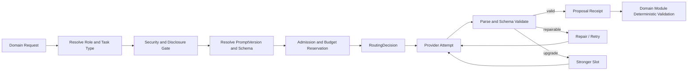

# 04 Model Gateway

updated: 2026-08-04
status: normative-target-module-architecture
architecture_generation: v2
module_number: 04
formal_path: `docs/modules/04-model-gateway.md`

> 本文是 Zuno 第 04 个逻辑模块——Model Gateway——的唯一正式 Target 架构主设计。
>
> Architecture v2 重点补充 Evidence-Driven Agentic GraphRAG 所需的结构化模型任务。模型始终只产生 Proposal，不能成为 Evidence、权限、PlanVersion、长期 Memory、Tool Effect 或最终领域状态的 Owner。
>
> 本次只升级 Target 文档，不修改现有 Program、PHASE01–PHASE22、业务代码、Migration 或 Provider 配置。

---

# Part I：定位、目标与边界

## 1. 模块定位

Model Gateway 是所有模型调用的统一受治理入口，负责把业务模块的**任务意图**转换为可追踪、可预算、可校验、可回退的 `ModelInvocation`。

它解决：

```text
不同模块直接调用 Provider SDK，导致配置、预算、安全和 Trace 分裂
业务模块把模型名称写死，无法按角色和能力路由
模型输出缺少 Schema，失败后只能字符串修补
Provider 429、超时、限流和内容策略错误无法统一分类
强模型被用于所有任务，成本和延迟失控
模型 Proposal 被误写成最终业务事实
Evidence Critic 引用不存在或未授权的 Evidence
Prompt、模型、参数和输出无法复现
```

## 2. 目标

1. 角色与 Provider 解耦。
2. 每次调用都有 ModelInvocation、PromptVersion、Schema、Budget、Trace 和结果 Receipt。
3. 结构化输出由确定性代码校验。
4. 支持弱模型重试、参数修复、强模型升级和安全降级。
5. 支持 Agent Core、Knowledge、Memory、Tool 和 Eval 的不同模型任务，但不接管它们的领域状态。
6. Evidence Deliberation 的 Critic、Claim、Conflict、Probe 和 Provisional Synthesis 可独立评测。
7. 任何模型调用都遵守数据披露、租户、Provider Policy 和 Security Epoch。

## 3. 非目标

- 不直接规划 AgentRun；
- 不激活 PlanVersion；
- 不决定 Evidence 最终状态；
- 不批准 Tool Action；
- 不把模型 Confidence 当作领域真相；
- 不持久化隐藏思维链；
- 不绕过 Module 09 的授权和披露；
- 不把 Provider SDK 异常直接暴露为跨模块 Contract；
- 不声明某模型“质量更好”而缺少固定 Eval。

## 4. Ownership

Model Gateway owns：

```text
ModelRoleDefinition
ModelSlotDefinition
ModelRoutePolicy
PromptVersion
StructuredOutputSchema
ModelInvocation
ModelAttempt
ProviderRequestReceipt
ModelUsageRecord
RoutingDecision
FallbackDecision
ProviderFailureClassification
ModelOutputValidationReceipt
```

业务模块 owns：

```text
Agent Core：Plan、Step、Reflection Decision、Final Gate
Knowledge：Evidence、Claim、Probe、Verdict
Memory：MemoryCandidate、MemoryDecision
Tool Runtime：PreparedToolAction、Effect
Observability：Eval、Benchmark、质量结论
Security：授权、披露、Provider Allow/Deny
```

---

# Part II：模型角色与任务映射

## 5. 基础 Model Roles

至少支持：

```text
TASK_ANALYZER
PLANNER
PLAN_REPAIR
EXECUTOR_FAST
EXECUTOR_REASONING
QUERY_REWRITER
EXTRACTOR
CRITIC
SYNTHESIZER
FINAL_CRITIC
```

角色不是具体模型名。每个角色绑定一个或多个 Model Slot；Slot 再映射 Provider、Model ID、参数、上下文窗口、数据政策和 Fallback。

## 6. Evidence-Driven Agentic GraphRAG 任务

Architecture v2 不强制增加大量新的顶级 Role，而是新增明确任务类型，优先映射到现有 Role：

| 任务类型 | 推荐 Role | 输出 |
| --- | --- | --- |
| QUERY_UNDERSTANDING | TASK_ANALYZER | QueryIntentProposal |
| QUERY_REWRITE | QUERY_REWRITER | QueryRewriteProposal |
| CLAIM_HYPOTHESIS_EXTRACTION | EXTRACTOR | ClaimHypothesisProposal |
| EVIDENCE_RELATION_ASSESSMENT | CRITIC | EvidenceCriticProposal |
| CONFLICT_CLASSIFICATION | CRITIC | ConflictClassificationProposal |
| APPLICABILITY_ASSESSMENT | CRITIC | ApplicabilityProposal |
| PROBE_PROPOSAL | CRITIC / PLANNER | EvidenceProbeProposal |
| PROVISIONAL_SYNTHESIS | SYNTHESIZER | ProvisionalAnswerProposal |
| ANSWER_RISK_REVIEW | FINAL_CRITIC | AnswerRiskProposal |

这些输出都是 Proposal。Module 03 必须再次验证：

- Evidence ID 是否存在；
- 是否属于 Authorized Scope；
- SourceSpan 是否真实；
- Source Family 与 lineage 是否匹配；
- 枚举和字段是否符合 Schema；
- 推荐 Probe 是否在允许动作集合；
- Budget 与 deadline 是否允许。

## 7. 强弱模型分工

弱模型适合：

- Query Rewrite；
- 结构化提取；
- 分类；
- 格式转换；
- 低风险 Evidence Relation 初评；
- 普通 ReAct Action Proposal。

强模型适合：

- 复杂规划；
- Plan Repair；
- 高影响 Evidence 冲突；
- 多适用范围判断；
- 关键 Reflection；
- Final Reflection。

确定性能力优先：

```text
Retrieval
Tool Execution
Schema Validation
Citation Check
ACL
Security Gate
Approval Gate
Hash / Version / SourceSpan Validation
```

模型不得替代这些门禁。

---

# Part III：调用流程与 Contract

## 8. 标准调用流程


```mermaid
flowchart LR
    A[Domain Request] --> B[Resolve Role and Task Type]
    B --> C[Security and Disclosure Gate]
    C --> D[Resolve PromptVersion and Schema]
    D --> E[Admission and Budget Reservation]
    E --> F[RoutingDecision]
    F --> G[Provider Attempt]
    G --> H[Parse and Schema Validate]
    H -->|valid| I[Proposal Receipt]
    H -->|repairable| J[Repair / Retry]
    H -->|upgrade| K[Stronger Slot]
    J --> G
    K --> G
    I --> L[Domain Module Deterministic Validation]
```

## 9. ModelInvocation

```yaml
ModelInvocation:
  invocation_id: string
  tenant_id: string
  workspace_id: string
  run_ref: string | null
  step_ref: string | null
  domain_request_ref: string
  role: string
  task_type: string
  model_slot_ref: string
  prompt_version_ref: string
  structured_output_schema_ref: string | null
  input_hash: string
  authorized_disclosure_ref: string
  security_epoch_ref: string
  budget_reservation_ref: string
  deadline_at: datetime
  idempotency_key: string
  status: CREATED | ADMITTED | RUNNING | SUCCEEDED | FAILED | CANCELLED
  created_at: datetime
```

## 10. ModelAttempt

```yaml
ModelAttempt:
  attempt_id: string
  invocation_id: string
  attempt_no: int
  provider_ref: string
  provider_model_id: string
  parameter_profile_ref: string
  request_receipt_ref: string | null
  response_hash: string | null
  usage_ref: string | null
  failure_code: string | null
  retryable: boolean
  started_at: datetime
  completed_at: datetime | null
```

## 11. EvidenceCriticRequest

```yaml
EvidenceCriticRequest:
  request_id: string
  question: string
  provisional_claim_ref: string | null
  evidence_refs: [string]
  lineage_refs: [string]
  requested_dimensions:
    - semantic_relation
    - applicability
    - contradiction
    - missing_conditions
    - suggested_probe
  authorized_disclosure_ref: string
  assessment_policy_version_ref: string
  output_schema_ref: string
```

只传递经过 Security 允许的 Evidence。若 Provider 不允许处理某数据分类，Routing 必须拒绝或选择合规 Slot。

## 12. EvidenceCriticProposal

```yaml
EvidenceCriticProposal:
  proposal_id: string
  invocation_ref: string
  claim_verdict_proposal: SUPPORTED | CONDITIONALLY_SUPPORTED | CONTESTED | CONTRADICTED | INSUFFICIENT | UNCERTAIN
  evidence_relations:
    - evidence_ref: string
      relation: SUPPORTS | PARTIAL_SUPPORT | CONTRADICTS | QUALIFIES | IRRELEVANT | UNCERTAIN
      applicability: MATCH | PARTIAL | MISMATCH | UNKNOWN
      independent_support_proposal: boolean
      reason_codes: [string]
  missing_conditions: [string]
  proposed_claim_revision: string | null
  recommended_probe_types: [string]
  confidence_band: HIGH | MEDIUM | LOW | UNKNOWN
  raw_response_hash: string
```

Model Gateway 只证明“模型返回了什么并通过 Schema”；Module 03 才决定 Proposal 是否可提交为领域事实。

## 13. PromptVersion

```yaml
PromptVersion:
  prompt_version_id: string
  role: string
  task_type: string
  system_template_hash: string
  input_contract_version: string
  output_schema_version: string
  safety_policy_version: string
  evaluation_profile_ref: string | null
  status: DRAFT | VALIDATED | ACTIVE | RETIRED
  created_at: datetime
```

激活后不可原地修改。Prompt 变化必须产生新版本，并通过 Eval 与回归门禁。

---

# Part IV：路由、Fallback 与预算

## 14. RoutingDecision

路由输入：

- role / task_type；
- 复杂度；
- 风险等级；
- 数据分类和地域；
- 租户 Policy；
- 预算与 deadline；
- 上下文长度；
- Provider 健康；
- 所需 Structured Output 能力。

```yaml
RoutingDecision:
  routing_decision_id: string
  invocation_ref: string
  selected_slot_ref: string
  fallback_slot_refs: [string]
  reason_codes: [string]
  policy_version_ref: string
  decided_at: datetime
```

## 15. 升级链

默认弱模型链：

```text
EXECUTOR_FAST / weak CRITIC
→ 参数或 Prompt Repair
→ 有界 Retry
→ EXECUTOR_REASONING / stronger CRITIC
→ CRITIC 判断 Retry / Domain Repair / Replan Proposal / Abstain
```

升级前必须检查剩余 Budget 和 deadline。强模型不是错误恢复的无限兜底。

## 16. Fallback 语义

- Provider 429：读取 Retry-After、退避和 Jitter；
- Provider overload：短重试后切同能力 Slot；
- Schema invalid：先确定性解析，再一次结构化修复，再升级；
- Content policy blocked：不得通过换 Provider 绕过 Security；
- Context too long：返回可识别 Failure，让 Domain 模块压缩 Context；
- deadline 不足：返回 `DEADLINE_EXCEEDED`，不启动昂贵 Fallback。

Fallback 变化必须记录在 RoutingDecision，便于解释质量差异。

## 17. Budget

Model Gateway 负责 Reservation、Actual Usage 和 Release：

```text
estimate
→ reserve
→ admit
→ execute
→ settle actual
→ release unused
```

业务模块拥有任务级 Budget；Gateway 不得自行提高预算。

---

# Part V：错误、恢复与幂等

## 18. 错误分类

```text
MODEL_REQUEST_INVALID
MODEL_UNAUTHORIZED_DISCLOSURE
MODEL_PROVIDER_RATE_LIMITED
MODEL_PROVIDER_UNAVAILABLE
MODEL_PROVIDER_TIMEOUT
MODEL_CONTEXT_TOO_LONG
MODEL_OUTPUT_SCHEMA_INVALID
MODEL_OUTPUT_REFERENCE_INVALID
MODEL_BUDGET_DENIED
MODEL_DEADLINE_EXCEEDED
MODEL_CANCELLED
MODEL_RESULT_UNKNOWN
```

`MODEL_OUTPUT_REFERENCE_INVALID` 表示模型引用不存在或未授权的 Evidence / Tool / Memory ID。此类错误不能通过字符串猜测修复为领域事实。

## 19. Retry

允许 Retry：

- 429；
- temporary unavailable；
- 可确认未执行的 read-only request；
- Schema 输出可修复且未超过限制。

不允许盲目 Retry：

- 权限拒绝；
- 数据策略拒绝；
- Context 根本超限；
- 同一 invalid output 连续重复；
- deadline 已耗尽；
- Provider 执行结果 UNKNOWN 且可能计费或产生不可重复语义。

## 20. Idempotency

`idempotency_key` 至少包含：

```text
domain request id
role / task type
prompt version
input hash
schema version
security epoch
```

重复调用可返回已有 Proposal Receipt，但不得跨 PromptVersion 或 Security Epoch 复用。

## 21. Recovery

PostgreSQL 保存 ModelInvocation / Attempt / Usage 等领域事实。LangGraph Checkpoint 只保存调用引用和控制位置。

恢复流程：

```text
load invocation terminal state
→ inspect active attempt
→ reconcile provider receipt if available
→ avoid duplicate billing/request when result exists
→ retry or fallback only under policy
→ return existing validated proposal receipt
```

---

# Part VI：安全与可观测性

## 22. 安全门

任何调用前必须完成：

- Principal / tenant / workspace 绑定；
- Authorized Disclosure；
- Provider Allowlist；
- Data Residency；
- Secret Redaction；
- Prompt Injection 边界；
- Security Epoch；
- Trace Redaction Policy。

Secret 通过 Secret Broker 在执行边界注入，不能进入 Prompt、Trace 或领域 Payload。

## 23. Trace

至少发出：

```text
model_invocation_created
model_invocation_admitted
model_route_selected
model_attempt_started
model_attempt_failed
model_attempt_retried
model_fallback_selected
model_output_schema_validated
model_output_reference_validation_failed
model_invocation_completed
model_usage_settled
```

## 24. 指标

- success / failure by role and task type；
- p50 / p95 latency；
- token and cost；
- Retry / Fallback rate；
- Schema validity；
- Reference validity；
- weak-to-strong upgrade rate；
- Critic disagreement rate；
- PromptVersion regression；
- Evidence Assessment calibration；
- Provider policy block rate。

Module 10 拥有指标 Projection 和质量结论。

---

# Part VII：Current、Target、Gap 与完成证据

## 25. Current / Target / Future

### Current

以代码、测试和状态文档为准。本文不因为已有模型角色名称或 Gateway 类而声明 Evidence Critic、Probe Proposal 或完整路由治理已实现。

### Target v2

- 所有模型调用统一 ModelInvocation；
- Evidence Deliberation 任务使用结构化 Contract；
- 模型只产生 Proposal；
- 强弱模型升级链、Budget、Security、Trace 和 Eval 可复现；
- Provider Failure 不泄漏到跨模块 Contract。

### Future

- 基于线上反馈的自动 Slot 优化；
- 多 Provider 成本预测；
- 更细粒度蒸馏模型；
- 但不得绕过固定 Release Gate 和人工治理。

## 26. 测试要求

必须覆盖：

- 每个 role / task_type 的 Schema；
- Evidence ID 引用验证；
- 未授权 Evidence 拦截；
- 429 / timeout / overload；
- weak-to-strong upgrade；
- Context too long；
- PromptVersion 不可变；
- idempotent replay；
- Security Epoch 变化；
- Cancellation 和 deadline；
- Usage Settlement；
- Provider Fallback 不绕过 Policy；
- Critic disagreement；
- 固定 Eval 回归。

## 27. Target 变为 Current 的证据

```text
代码和配置
数据库模型与 Migration
Provider Adapter Integration Test
Schema / Reference Validation Test
Security Test
Fault Injection
Trace
固定 Eval
成本与延迟测量
文档镜像同步
```

未具备这些证据时，只能表述 `design available`，不得声明 quality proven 或 production ready。
