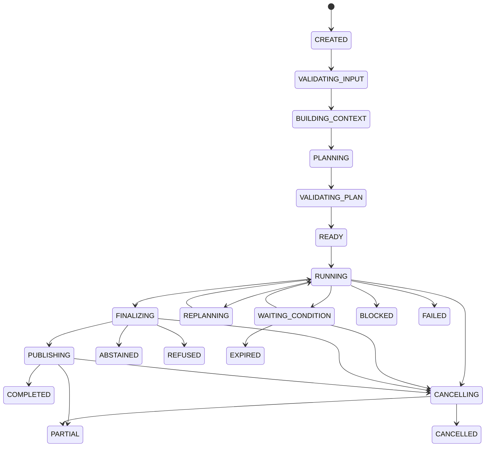

# 06 Agent Core / Planning & Control：规范性控制协议

updated: 2026-07-12  
status: normative-target-control-protocols  
module_number: 06  
formal_path: `docs/modules/06-agent-core-control-protocols.md`  
agent_mirror: `.agent/modules/06-agent-core-control-protocols.md`  
parent_design: `docs/modules/06-agent-core-planning-control.md`  
consistency_protocols: `docs/modules/06-agent-core-consistency-lifecycle-protocols.md`

> 本文冻结 Agent Core Target 的控制不变量、状态机、DAG、并发、Interrupt、Signal、副作用、Finalization、Failure、Budget、Ownership 与 Contract Versioning。
>
> 本文只定义 Target，不描述当前实现事实或具体迁移计划。若主设计中的概念说明与本文冲突，以本文为准，并必须同步修正文档与验证器。

---

# 1. 控制权模型

## 1.1 Agent、Proposal 与领域事实

Zuno 是 Agent，LangGraph 是 Agent 的受治理控制系统。

模型可以产生：

```text
TaskAnalysisProposal
PlanProposal
ActionProposal
ReflectionProposal
PlanPatchProposal
FinalCandidateProposal
ReflexionCandidate
```

模型不得直接：

```text
激活 PlanVersion
改变 Run、Step 或 Action 终态
批准权限或副作用
提交外部执行成功
绕过 Budget、Deadline 或 Security
提交长期 Memory
发布最终答案
提交 RunOutcome
```

Proposal 只有通过 Schema、Policy、Security 和确定性验证后，才能由事实 Owner 转换为领域事实。

## 1.2 Definition、Run 与 Result

```text
Definition
    声明应该做什么，激活后不可变。

Run
    记录某次实际执行，可以有多个 Attempt。

Result
    已提交、可引用、可验证且带有效性状态的产物。
```

禁止把运行状态、Attempt、Observation 或 Usage 写回不可变 Definition。

---

# 2. 架构不变量

### INV-AGENT-001：每个 Run 必须有 Plan

简单任务使用 Deterministic Single-Step Plan，复杂任务使用动态 DAG Plan。不存在绕过 Plan 的正式回答路径。

### INV-AGENT-002：一个 Run 同时最多一个 Active PlanVersion

Plan 激活和切换必须原子完成。

### INV-AGENT-003：Active PlanVersion 不可变

Step、依赖、条件、输出 Contract、预算和安全约束发生变化时，必须创建新 PlanVersion。

### INV-AGENT-004：PlanVersion 必须绑定 GoalVersion

任何 PlanVersion 都必须明确其目标、约束和输出要求来自哪个 GoalVersion。

### INV-AGENT-005：StepRun 必须来源于有效 Active PlanVersion

旧 PlanVersion、旧 controller_epoch 或 Replan Barrier 后的调度不得创建新 StepRun。

### INV-AGENT-006：Plan 完成不等于 Run 完成

Plan 完成后仍必须经过 Finalization、Final Gate、Artifact Validation、Publication 和 RunOutcome。

### INV-AGENT-007：并行 Worker 不直接覆盖共享领域事实

Worker 只能提交不可变 BranchResultRef、Observation 和 Usage。

### INV-AGENT-008：Dispatch 必须先持久化后执行

DispatchGroup、DispatchItem、StepRun、Budget Reservation 和 Resource Claim 必须先提交，之后才允许 Send。

### INV-AGENT-009：Controller 与 Worker 写入必须使用 Fencing

所有状态写入必须校验 `controller_epoch` 或 `execution_epoch`。

### INV-AGENT-010：Reducer 必须幂等、可重放、顺序无关

重复 BranchResult 或不同到达顺序不得改变确定性 JoinOutcome。

### INV-AGENT-011：Replan Barrier 期间旧计划不得继续扩散

进入 Barrier 后，旧 PlanVersion 不得创建新 Dispatch。

### INV-AGENT-012：模型无权批准副作用

Planner、Executor、Critic 和 Reflection 只能建议审批。

### INV-AGENT-013：Approval 必须绑定不可变 PreparedAction

参数、目标资源、凭证范围或 Policy Version 变化后，旧 Approval 自动失效。

### INV-AGENT-014：UNKNOWN 副作用禁止盲目重试

必须先 Reconcile 外部事实。

### INV-AGENT-015：Checkpoint 恢复不能重复已确认副作用

恢复决策必须参考 ActionRun、IdempotencyClaim 和外部 Receipt。

### INV-AGENT-016：Signal 只能被有效 Interrupt 消费一次

重复、过期、无权限或指向废弃 Step 的 Signal 不得推进状态。

### INV-AGENT-017：每个 Action 都有 Evaluation

至少执行确定性 Schema、状态和安全评估。

### INV-AGENT-018：每个 Step 都有 Acceptance

Executor 返回结果不等于 Step 完成。

### INV-AGENT-019：每个正式输出都经过 AnswerPolicy 与 Final Gate

正式输出必须检查目标、Evidence、Citation、安全、预算和 Artifact 完整性。

### INV-AGENT-020：FinalCandidate 与 Publication 分离

模型 Candidate 不是已发布答案。

### INV-AGENT-021：RunOutcome 必须结构化

必须明确完成和未完成 Objective、Evidence、Artifact、Failure、Budget、安全与 Publication。

### INV-AGENT-022：Agent Core 不冒充其他模块的事实 Owner

Agent Core 编排其他模块，但不修改其领域真相。

### INV-AGENT-023：所有跨模块交互必须版本化

请求、响应、事件和引用都必须使用版本化 Contract。

### INV-AGENT-024：Trace 不保存隐藏思维链

只记录结构化决策、输入输出 Ref、Policy、状态变化和失败。

---

# 3. AgentRun 状态机

## 3.1 状态

```text
CREATED
VALIDATING_INPUT
BUILDING_CONTEXT
PLANNING
VALIDATING_PLAN
READY
RUNNING
WAITING_CONDITION
REPLANNING
FINALIZING
PUBLISHING
CANCELLING

COMPLETED
PARTIAL
ABSTAINED
REFUSED
BLOCKED
FAILED
CANCELLED
EXPIRED
```

`WAITING_CONDITION` 是非终态，等待用户、审批、外部任务、资源或安全审查。

`BLOCKED` 是终态，表示当前 Policy 下无法继续且没有可自动等待的条件。

## 3.2 主路径



## 3.3 终态语义

| 状态 | 语义 |
| --- | --- |
| `COMPLETED` | 所有必需 Objective 满足，Final Gate 通过，正式结果已发布或明确无需发布 |
| `PARTIAL` | 至少一个核心 Objective 完成，未完成部分已披露 |
| `ABSTAINED` | Runtime 正常，但证据、能力或质量不足以可靠结论 |
| `REFUSED` | 安全、合规、权限或政策要求拒绝 |
| `BLOCKED` | 已知条件阻止继续，且当前 Policy 无自动恢复路径 |
| `FAILED` | 不可恢复的技术、Contract、计划或执行故障 |
| `CANCELLED` | 取消收口完成 |
| `EXPIRED` | Run、Deadline、Signal 或 Approval 到期 |

每次迁移必须保存 from_status、to_status、reason、trigger_ref、controller_epoch、policy_version、domain_generation、occurred_at 和 trace_id。非法迁移必须失败。

---

# 4. PlanVersion 状态机

```text
PROPOSED
VALIDATING
REJECTED
ACTIVE
SUPERSEDED
COMPLETED
INVALIDATED
```

字段：

```text
plan_version_id
run_id
goal_version_id
version_no
parent_plan_version_id
status
goal_snapshot
assumption_snapshot
step_definitions
dependency_definitions
output_contract
budget_allocation
security_constraints
planner_role
planner_model_ref
prompt_bundle_version
contract_bundle_version
created_at
validated_at
activated_at
superseded_at
completed_at
invalidated_at
```

激活条件：

```text
Schema 合法
Objective 可追踪
Step ID 唯一
DAG 无环且可达
依赖与条件合法
Input / Output Contract 可解析
Capability 可满足或有 Fallback
Budget 可分配
Security Constraints 可执行
Acceptance 可测试
JoinPolicy 完整
并行资源冲突可解释
存在 Terminal Deliverable
```

原子激活同时完成：新版本 ACTIVE、旧版本 SUPERSEDED、更新 Run.active_plan_version_id、递增 plan_generation 和 domain_generation、记录 PlanActivationEvent。

---

# 5. StepRun 与 ActionRun 状态机

## 5.1 StepRun

```text
QUEUED
CLAIMED
RUNNING
WAITING_CONDITION
RETRY_SCHEDULED
COMPLETED
FAILED
BLOCKED
CANCELLED
UNKNOWN
OBSOLETE
```

字段：

```text
step_run_id
run_id
plan_version_id
step_definition_id
attempt_no
controller_epoch
execution_epoch
status
disposition
dispatch_item_id
input_refs
observation_refs
result_ref
result_validity
failure_ref
acceptance_result_ref
budget_reservation_ref
budget_usage_ref
resource_claim_refs
claim_token
started_at
heartbeat_at
finished_at
```

进入 COMPLETED 必须满足：结果提交、Output Contract 通过、Observation 归一化、Acceptance 通过、Evidence/Citation 要求满足、没有未解决 UNKNOWN、ResultValidity=VALID。

## 5.2 ActionRun

```text
PROPOSED
VALIDATING
PREPARED
WAITING_APPROVAL
CLAIMED
EXECUTING
SUCCEEDED
FAILED
UNKNOWN
RECONCILING
RECONCILED
CANCELLED
```

Action 进入 SUCCEEDED 需要外部结果和本地领域事实均提交；响应丢失时进入 UNKNOWN。

---

# 6. DAG、Condition 与 Disposition

DependencyRule：

```text
dependency_rule_id
upstream_step_ids
mode
quorum
required_result_contract
on_unsatisfied
```

模式：

```text
ALL_SUCCESS
ALL_TERMINAL
ANY_SUCCESS
OPTIONAL_INPUT
QUORUM
```

ActivationCondition 必须版本化、可审计、可确定性重放；允许引用结构化 Result、Run Policy、Evidence Summary、Budget、Security Decision 和 Signal；禁止任意 Python、Shell、未版本化自然语言条件和隐藏思维链依赖。

StepDisposition：

```text
EXECUTE
REUSE_COMPLETED
SKIP_CONDITION_FALSE
SKIP_OPTIONAL
BLOCKED_DEPENDENCY
BLOCKED_SECURITY
BLOCKED_BUDGET
OBSOLETE_BY_REPLAN
CANCELLED_BY_RUN
```

Result Reuse 至少验证 Exact Input Fingerprint、GoalVersion、KnowledgeSnapshot、Output Contract、Evidence/Artifact 可访问性、上游假设、Security Scope 和 ResultValidity。

---

# 7. ReadySet、Liveness 与 Join

Step 进入 ReadySet 必须满足：

```text
PlanVersion ACTIVE
不存在有效可复用 Result
ActivationCondition 为 true 或不存在
DependencyRule 满足
Input Contract 可构造
Security Gate 允许
Capability 可用
资源 Claim 可获得
Budget 可预留
Deadline 可满足
不存在 Replan Barrier 或高优先级控制命令
```

当 ready_count=0、running_count=0、pending_interrupt_count=0、non_terminal_count>0 时，必须生成 PlanLivenessFinding：

```text
DEPENDENCY_UNSATISFIABLE
CONDITION_UNRESOLVABLE
CAPABILITY_UNAVAILABLE
RESOURCE_STARVATION
APPROVAL_EXPIRED
BUDGET_UNAVAILABLE
DEADLINE_UNACHIEVABLE
PLAN_INCONSISTENT
```

下一步必须明确为 Replan、Block、Partial、Abstain 或 Fail，禁止无限 WAIT。

JoinPolicy：

```text
ALL_REQUIRED
BEST_EFFORT
QUORUM
FIRST_VALID
ANY_SUCCESS
CUSTOM_DETERMINISTIC
```

JoinOutcome：

```text
JOINED
PARTIAL_JOIN
CONFLICT
INSUFFICIENT
BLOCKED
CANCELLED
```

晚到结果不得静默修改已提交 JoinOutcome；重新聚合创建新的 JoinAttempt。

---

# 8. Dispatch、Fencing 与 Reducer

Dispatch 事务：

```text
BEGIN
创建 DispatchGroup
创建 DispatchItem
创建 StepRun
预留 Budget
获取 Resource Claim
记录 DispatchCommittedEvent
COMMIT

COMMIT 后才允许 Send
```

Controller 每次获得 Run 控制权时递增 `controller_epoch`；Worker 每次重新 Claim StepRun 时递增 `execution_epoch`。

BranchResult 提交必须匹配 step_run_id、attempt_no、execution_epoch 和 claim_token。

BranchResultRef：

```text
branch_result_id
dispatch_item_id
step_run_id
attempt_no
execution_epoch
status
result_ref
observation_refs
failure_ref
budget_usage_ref
trace_refs
created_at
```

Reducer 去重键：

```text
dispatch_item_id + step_run_id + attempt_no + execution_epoch
```

Reducer 必须幂等、可重放、顺序无关、拒绝旧 epoch，并输出不可变 ReductionAttempt。

---

# 9. Replan Barrier

触发条件：关键假设失效、GoalVersion 变化、依赖结构不可满足、证据冲突改变结构、必要 Capability 永久不可用、重复失败表明 Step 粒度错误、Security 或 Policy 使剩余计划不再合法。

协议：

```text
1. Run 进入 REPLANNING
2. 禁止旧 PlanVersion 新建 Dispatch
3. 运行分支分类
4. CANCEL_SAFE 请求取消
5. DRAIN_REQUIRED 等待但不保证复用
6. NON_INTERRUPTIBLE 等待副作用完成并 Reconcile
7. 收集已提交结果
8. 生成 PlanPatch Proposal
9. 验证新 PlanVersion
10. 原子切换 Active PlanVersion
11. 旧版本 SUPERSEDED
12. 重新计算 ReadySet
```

Barrier 超时必须产生显式控制结果。

---

# 10. Interrupt 与 Signal

Interrupt 类型：

```text
USER_INPUT
APPROVAL
EXTERNAL_JOB
INGESTION_COMPLETION
SECURITY_REVIEW
MANUAL_RECONCILIATION
RESOURCE_AVAILABLE
```

一个 Run 可以同时存在多个 Pending Interrupt。

Interrupt Contract：

```text
interrupt_id
run_id
plan_version_id
step_run_id
action_run_id
interrupt_type
reason_code
payload_ref
expected_response_schema
status
idempotency_scope
created_at
expires_at
resolved_at
resolved_by
```

状态：PENDING、RESOLVED、EXPIRED、CANCELLED、OBSOLETE。

Signal Contract：

```text
signal_id
interrupt_id
signal_type
producer_identity
payload
payload_schema_version
idempotency_key
created_at
expires_at
```

消费前校验 Interrupt 状态、Schema、权限、幂等、Expiry、Step 和 PlanVersion 有效性。重复 Signal 返回原消费结果；指向 OBSOLETE Step 的 Signal 记录为 STALE_SIGNAL。

---

# 11. Side Effect Protocol

```text
Proposal
→ Prepare
→ Validate
→ Authorize
→ Approve
→ Claim
→ Execute
→ Observe
→ Reconcile
→ Commit Outcome
```

PreparedAction：

```text
prepared_action_id
run_id
step_run_id
action_type
tool_id
normalized_arguments
arguments_hash
target_resources
credential_scope
side_effect_class
security_policy_version
approval_policy_version
idempotency_key
expires_at
status
```

ApprovalDecision：

```text
approval_id
prepared_action_id
arguments_hash
decision
approved_scope
approver_identity
approver_authority
policy_version
created_at
expires_at
```

审批执行前重新验证权限、Policy、Hash、Scope 和 Expiry。

IdempotencyClaim：

```text
idempotency_claim_id
idempotency_key
action_run_id
scope
status
claimed_at
completed_at
external_receipt_ref
```

状态：CLAIMED、EXECUTING、SUCCEEDED、FAILED、UNKNOWN、RECONCILED。

UNKNOWN 时禁止盲目重试。Compensation 是新的受治理副作用，需要新的 PreparedAction、Security、Approval 和 IdempotencyClaim；不可补偿操作标记 NON_COMPENSATABLE。

---

# 12. AnswerPolicy、Final Gate 与 Publication

AnswerPolicy 至少定义 Grounding Mode、Model Prior、Retrieval/SourceSpan、最低 Evidence/Citation Coverage、Partial/Abstain/Refuse、Final Reflection、Provisional Streaming、Artifact 和敏感信息规则。

FinalCandidate：

```text
final_candidate_id
run_id
plan_version_id
goal_version_id
content_ref
claim_set_ref
evidence_bundle_ref
citation_set_ref
artifact_refs
candidate_version
result_validity
created_by
created_at
```

Final Gate 检查 Objective Coverage、Step/Join 终态、未解决 Failure/UNKNOWN、Evidence、Citation、SourceSpan、ResultValidity、Security、AnswerPolicy、Budget、Artifact 和输出 Contract。

Final Gate 输出：

```text
PASS
REWRITE
RETRIEVE_MORE
REPLAN
PARTIAL
ABSTAIN
REFUSE
BLOCK
FAIL
```

Publication 状态：

```text
PREPARED
VALIDATING
APPROVED
PUBLISHING
PUBLISHED
FAILED
SUPERSEDED
WITHDRAWN
```

Publication Contract：

```text
publication_id
run_id
final_candidate_id
artifact_version_refs
candidate_version
channel
recipient_scope
status
idempotency_key
prepared_at
published_at
delivery_receipt_ref
failure_ref
```

Publication 重试使用相同 Idempotency Key；发布成功但 Outcome 提交失败时，通过 DeliveryReceipt 恢复。

---

# 13. Failure Taxonomy

```text
TRANSIENT_INFRASTRUCTURE
RATE_LIMIT
TIMEOUT
CONTRACT_VIOLATION
INVALID_MODEL_OUTPUT
DEPENDENCY_FAILURE
CAPABILITY_UNAVAILABLE
SECURITY_BLOCK
APPROVAL_DENIED
BUDGET_EXHAUSTED
DEADLINE_EXCEEDED
QUALITY_FAILURE
UNKNOWN_SIDE_EFFECT
DATA_STALE
PLAN_INVALID
NO_PROGRESS
CANCELLED
```

每个 FailureClass 定义 retryable、repairable、fallback_allowed、replannable、user_visible、security_sensitive、requires_reconcile、requires_human、propagation_policy 和 default_run_outcome。

Failure 传播由 DependencyRule、JoinPolicy、Objective Criticality 和 AnswerPolicy 共同决定，不得统一把 Run 标记 FAILED。

---

# 14. Retry、Repair、Fallback 与 Replan

| 机制 | DAG 结构 | Step Objective | 执行方法 | 新 PlanVersion |
| --- | --- | --- | --- | --- |
| Retry | 不变 | 不变 | 基本不变 | 否 |
| Parameter Repair | 不变 | 不变 | 参数或 Prompt 调整 | 否 |
| Executor Escalation | 不变 | 不变 | 更强 Model Role | 否 |
| Capability Fallback | 不变 | 不变 | 替代 Capability | 否 |
| Step Repair | 不变 | 不变 | Step 内方法改变 | 否 |
| Replan | 改变 | 可能改变 | 剩余结构改变 | 是 |

每种机制必须记录独立 Decision Event。

---

# 15. Budget、Admission 与 No-progress

Budget：

```text
token_budget
cost_budget
wall_clock_deadline
model_call_budget
tool_call_budget
retrieval_round_budget
reflection_budget
replan_budget
parallelism_budget
external_side_effect_budget
```

三层：Run Budget → Step Reservation → Action Consumption。

状态：AVAILABLE、RESERVED、CONSUMED、RELEASED、EXHAUSTED。并行 Dispatch 前必须预留预算。

Admission 检查 Tenant、Workspace、User、Provider、Tool 并发、系统负载、Deadline 和 Budget。优先级组合 critical_path、deadline、run、user、retry、fair_share，并必须有 Starvation Detection。

No-progress 指纹：plan、action、evidence_set、failure、candidate。连续重复 Action、Evidence、Failure、Plan 震荡或 Reflection 无改善时触发 NO_PROGRESS。

---

# 16. Cross-module Ownership

| 事实 / Contract | Owner | Agent Core 允许 | Agent Core 禁止 |
| --- | --- | --- | --- |
| AgentRun、Goal、Plan、Step、Dispatch、Outcome | Agent Core | 受控创建和更新 | 被其他模块直接改终态 |
| RuntimeRequest、展示与渠道 | Product Surface | 消费请求、准备 Publication | 冒充已展示成功 |
| ModelInvocation、Usage | Model Gateway | 发起请求、消费结果 | 直接调用厂商 SDK |
| Evidence、RetrievalRound | Knowledge | 请求检索、引用 | 修改索引或伪造 Evidence |
| ContextPack、MemoryCandidate | Memory & Context | 请求 Context、提交 Candidate | 直接写长期 Memory |
| CapabilityDefinition、SkillDefinition | Capability / Skill | 选择和引用 | 修改 Capability 真相 |
| ToolExecution、External Effect | Tool Runtime | 编排和消费状态 | 绕过 Tool Runtime |
| Authorization、Approval Policy、Revocation | Security | 请求并消费决定 | 自批权限 |
| Trace、Metric、EvalResult | Observability & Eval | 产生结构化事件 | 修改 Eval 真相 |
| Checkpoint、Lease、ObjectStore | Infrastructure | 使用基础能力 | 将基础设施状态冒充领域事实 |

---

# 17. Contract Versioning

统一 Envelope：

```text
contract_name
contract_version
message_id
correlation_id
causation_id
run_id
step_run_id
producer
consumer
created_at
payload
payload_schema_hash
```

向后兼容：新增可选字段、带默认行为的枚举、可忽略 Metadata。

破坏性变更：删除或重命名字段、改变含义或必填性、改变状态机、Idempotency Scope 或安全默认值。

未知安全枚举和未知终态必须 fail-closed。AgentRun 创建时固定 Runtime、Graph、State、Contract、Prompt、Model Routing、Security 和 Answer Policy 版本。

---

# 18. Checkpoint、Domain Fact 与 Object Payload

Checkpointer 保存 Graph Node、Channel、Pending Send、Pending Interrupt Refs、Resume Cursor、Reducer Control State 和 Checkpoint Generation。

Domain Store 保存 TaskContract、GoalVersion、AgentRun、PlanVersion、StepRun、ActionRun、Dispatch、BranchResult、Join、Interrupt、SignalConsumption、PreparedAction、Approval、IdempotencyClaim、FinalCandidate、ArtifactVersion、Publication、RunOutcome、Event、Failure、Validity 和 Reconciliation。

Object Store 保存大型 Observation、模型输出快照、检索快照、Artifact 和调试包。

---

# 19. Requirement IDs

| ID | Requirement |
| --- | --- |
| `ARCH-AGENT-033` | Agent Core 必须维护并验证架构不变量 |
| `ARCH-AGENT-034` | AgentRun、PlanVersion、StepRun、ActionRun 和 Publication 必须使用独立状态机 |
| `ARCH-AGENT-035` | PlanVersion 激活后不可变且同一 Run 最多一个 Active Version |
| `ARCH-AGENT-036` | DAG 必须支持结构化 DependencyRule 与 ActivationCondition |
| `ARCH-AGENT-037` | Step 必须区分 Status、Disposition 与 ResultValidity |
| `ARCH-AGENT-038` | Scheduler 必须检测不可满足依赖和计划死锁 |
| `ARCH-AGENT-039` | Join 必须使用显式 JoinPolicy、JoinAttempt 和 JoinOutcome |
| `ARCH-AGENT-040` | Dispatch 必须先持久化后执行 |
| `ARCH-AGENT-041` | Controller 与 Worker 写入必须使用 Fencing Epoch |
| `ARCH-AGENT-042` | Reducer 必须幂等、可重放、顺序无关 |
| `ARCH-AGENT-043` | Replan 必须经过 Replan Barrier 并创建新 PlanVersion |
| `ARCH-AGENT-044` | 一个 Run 必须支持多个 Pending Interrupt |
| `ARCH-AGENT-045` | Signal 必须版本化、鉴权、幂等并绑定 Interrupt |
| `ARCH-AGENT-046` | 副作用必须遵循 Prepare、Approve、Claim、Execute、Reconcile 协议 |
| `ARCH-AGENT-047` | UNKNOWN 副作用不得盲目重试 |
| `ARCH-AGENT-048` | AnswerPolicy 与 Final Gate 必须覆盖所有正式输出 |
| `ARCH-AGENT-049` | FinalCandidate、ArtifactVersion 与 Publication 必须分离 |
| `ARCH-AGENT-050` | Publication 必须幂等、可恢复并保存 DeliveryReceipt |
| `ARCH-AGENT-051` | Failure 必须使用统一 Failure Taxonomy |
| `ARCH-AGENT-052` | Retry、Repair、Fallback 与 Replan 必须分别审计 |
| `ARCH-AGENT-053` | Budget 必须支持 Run、Step、Action 三层 Reservation 与 Consumption |
| `ARCH-AGENT-054` | Scheduler 必须实现 Admission Control、公平性与 Starvation Detection |
| `ARCH-AGENT-055` | Runtime 必须检测 No-progress 和 Plan Oscillation |
| `ARCH-AGENT-056` | Agent Core 必须遵守 Cross-module Ownership Matrix |
| `ARCH-AGENT-057` | 所有跨模块交互必须使用版本化 Contract Envelope |
| `ARCH-AGENT-058` | 同一 Run 必须固定 Runtime、Graph、Contract、Prompt 与 Policy Bundle Version |
| `ARCH-AGENT-059` | Checkpoint、Domain Fact 与 Object Payload 必须明确分层 |
| `ARCH-AGENT-060` | 每个不变量和 Requirement 必须映射到测试与运行证据 |

---

# 20. 验证与完成证据

至少覆盖：Active PlanVersion 不可修改、同一 Run 不能有两个 Active Version、旧 controller_epoch/execution_epoch 写入被拒绝、重复 BranchResult 不改变 JoinOutcome、重复 Signal 只消费一次、Final Gate 未通过不能 Publication、UNKNOWN 不能自动重试、Approval Hash 不匹配不能执行、Replan Barrier 期间旧计划不能 Dispatch、WAITING_CONDITION 与 BLOCKED 不混用、CANCELLING 能收口不可中断副作用。

本文完成后只可声明 design available、contract-complete 和 program-ready，不得仅凭文档声明 implementation available、quality proven 或 production ready。
