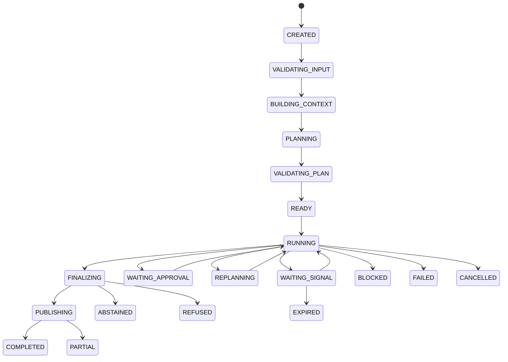
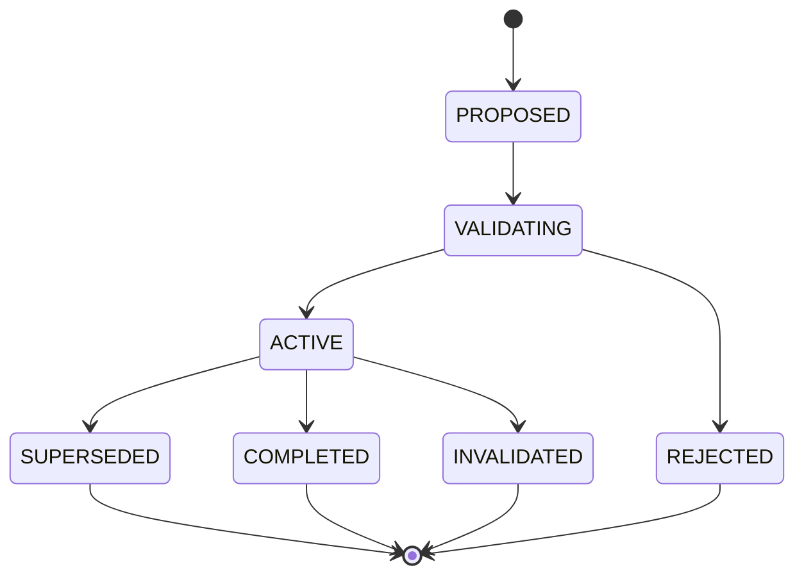
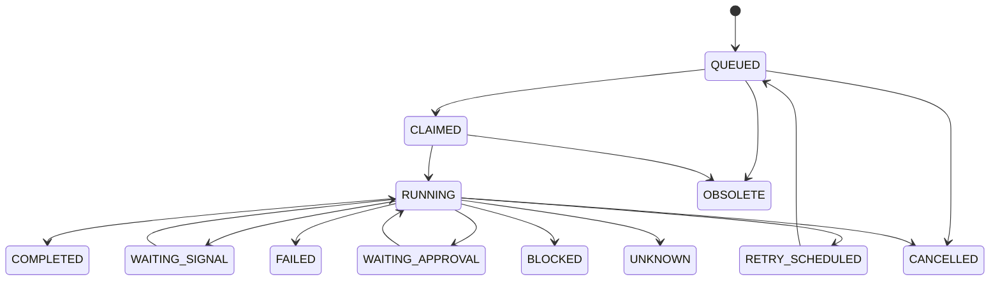

# 06 Agent Core / Planning & Control：规范性控制协议

updated: 2026-07-12  
status: normative-target-protocols  
module_number: 06  
formal_path: `docs/modules/06-agent-core-control-protocols.md`  
agent_mirror: `.agent/modules/06-agent-core-control-protocols.md`  
parent_design: `docs/modules/06-agent-core-planning-control.md`

> 本文是 Agent Core / Planning & Control 理想 Target Architecture 的规范性配套文档。
>
> `06-agent-core-planning-control.md` 负责说明问题、概念架构、完整运行流程和实施规格；本文负责冻结不可违反的不变量、状态机、并发协议、外部信号、副作用、最终发布、失败预算和跨模块 Contract。
>
> 本文只定义 Target，不讨论现有代码、兼容路径、切流、迁移 Program 或历史实现。后续 Program 必须以本文为目标约束，但不得反向降低本文的架构要求。

---

# 1. 文档目标与适用范围

Agent Core 的理想架构不能只描述“有 Plan、有 Reflection、有并行”，还必须回答：

```text
哪些规则永远不能被绕过
Run、Plan 和 Step 如何进入与离开每个状态
依赖失败、条件不成立和分支晚到时怎样处理
多个 Controller 或 Worker 如何避免提交过期结果
等待用户、审批和外部任务时如何恢复
副作用如何做到审批绑定、幂等和不确定结果对账
最终答案何时才算可发布
预算、失败和无进展如何影响控制决策
跨模块事实由谁拥有、Contract 怎样版本化
```

本文将这些问题固化为八组规范：

1. 架构不变量；
2. AgentRun、PlanVersion、StepRun 三套状态机；
3. DAG 依赖、条件、Disposition 与 Join；
4. Dispatch、Reducer、Fencing 与 Replan Barrier；
5. Interrupt、Signal 与 Side Effect Protocol；
6. AnswerPolicy、Final Gate 与 Publication；
7. Failure Taxonomy、Budget 与 No-progress；
8. Cross-module Ownership 与 Contract Versioning。

---

# 2. 术语与控制权模型

## 2.1 Zuno 是 Agent，Graph 是 Agent 的控制系统

Zuno 的产品形态是 Agent。固定 Graph 不替代 Agent，而是约束 Agent 的运行生命周期：

```text
固定 AgentRunGraph
    负责生命周期、安全、预算、恢复和终局

动态 Plan DAG
    负责本次任务的目标分解、依赖和并行结构

固定 StepExecutionGraph
    负责单个 Step 内受控的 ReAct Action / Observation 循环
```

动态智能存在于：

```text
Plan Proposal
Action Proposal
Reflection Proposal
PlanPatch Proposal
Final Candidate
Reflexion Candidate
```

确定性 Runtime 拥有：

```text
Proposal Validation
Plan Activation
Dispatch Commit
Security / Approval Gate
Budget Reservation
State Transition
Idempotency Claim
Final Gate
Publication Commit
RunOutcome Commit
```

## 2.2 Proposal 与 Fact

模型只能产生 Proposal。Proposal 在完成 Schema Validation、Policy Validation 和必要的确定性检查前，不是领域事实。

领域事实必须由对应事实 Owner 通过受控事务写入。以下操作不得由模型直接完成：

```text
激活 PlanVersion
修改已激活 PlanVersion
批准权限或副作用
提交 Tool Execution 成功
提交长期 Memory
宣告 Evidence 有效
绕过 Budget
发布最终答案
提交 RunOutcome
```

## 2.3 Definition、Run 与 Result

所有计划对象必须区分：

```text
Definition
    计划中声明应该做什么，激活后不可变。

Run
    某次实际执行发生了什么，可以多次尝试。

Result
    已提交、可引用、可验证的执行产物。
```

禁止把 `status`、`attempt`、运行时间或 Observation 直接写回不可变 Definition。

---

# 3. 架构不变量

本节是不依赖具体代码结构的最高级约束。任何实现、Program、数据库模型或优化都不得破坏这些不变量。

## 3.1 Run 与 Plan 不变量

### INV-AGENT-001：每个 Run 必须有 Plan

每个 `AgentRun` 必须关联 Plan。简单任务使用 Deterministic Single-Step Plan，复杂任务使用动态 DAG Plan。不存在绕过 Plan 的最终回答路径。

### INV-AGENT-002：一个 Run 同时最多一个 Active PlanVersion

`AgentRun.active_plan_version_id` 在任意时刻最多指向一个 `ACTIVE` PlanVersion。计划切换必须原子完成。

### INV-AGENT-003：Active PlanVersion 不可变

PlanVersion 激活后，Step Definition、依赖、条件、输出 Contract、预算分配和安全约束不得原地修改。任何结构变化必须创建新版本。

### INV-AGENT-004：StepRun 必须来源于 Active PlanVersion

创建 `StepRun` 时，其 `step_definition_id` 必须属于当时的 Active PlanVersion。旧版本晚到调度不得创建新 StepRun。

### INV-AGENT-005：Plan 完成不等于 Run 完成

Plan 的工作 Step 进入满足完成条件的终态后，Run 仍必须经过 Finalization、Final Gate 和 Publication 决策。

## 3.2 执行与并发不变量

### INV-AGENT-006：并行分支不能直接覆盖共享事实

Worker 只提交不可变 `BranchResultRef`、Observation 和 Usage，不直接修改 Run 聚合状态。共享事实只由 Reducer、Join 或 Controller 提交。

### INV-AGENT-007：Dispatch 必须先提交再执行

只有在 DispatchGroup、DispatchItem、StepRun、预算预留和必要资源 Claim 已成功提交后，才允许发出实际执行。

### INV-AGENT-008：所有执行提交必须携带 Fencing 信息

Controller 和 Worker 的状态写入必须携带当前 `controller_epoch` 或 `execution_epoch`。过期 epoch 的写入必须被拒绝。

### INV-AGENT-009：Reducer 必须幂等且顺序无关

相同 BranchResult 重放不能改变最终聚合结果。并行结果到达顺序不能改变确定性 JoinOutcome。

### INV-AGENT-010：Replan Barrier 期间禁止旧计划继续扩散

进入 Replan Barrier 后，旧 PlanVersion 不得再产生新 Dispatch。已运行分支按取消、排空或不可中断策略处理。

## 3.3 安全、副作用与恢复不变量

### INV-AGENT-011：模型无权批准副作用

模型 Critic、Planner、Executor 或 Reflection 只能建议审批，不得生成被系统视为有效的 Approval Decision。

### INV-AGENT-012：审批必须绑定 PreparedAction

Approval 必须绑定不可变 PreparedAction 及其参数 Hash、目标资源和 Policy Version。参数变化后旧审批自动失效。

### INV-AGENT-013：不确定副作用禁止盲目重试

外部副作用进入 `UNKNOWN` 后，必须先 Reconcile。未确认外部状态前不得自动重复执行。

### INV-AGENT-014：Checkpoint 恢复不能重复已确认副作用

恢复后必须通过 ActionRun、Idempotency Claim 和外部回执判断是否已经执行，不能仅根据 Graph 节点位置重新调用工具。

### INV-AGENT-015：Signal 只能被有效 Interrupt 消费一次

Signal 必须绑定 Interrupt，并通过 Idempotency Key 防止重复消费。过期、已解决或已废弃 Step 的 Signal 不得改变 Run 状态。

## 3.4 质量与终局不变量

### INV-AGENT-016：每个 Action 都有 Evaluation

Action 结果至少经过确定性 Schema、状态和安全评估。模型级 Evaluation 仅按策略触发。

### INV-AGENT-017：每个 Step 都有 Acceptance

Step 只有在 AcceptancePolicy 通过后才能进入 `COMPLETED`。执行器“返回结果”不等于 Step 完成。

### INV-AGENT-018：每个最终答案都经过 AnswerPolicy 与 Final Gate

任何用户可见的正式结果必须经过目标覆盖、证据、引用、安全、权限、预算和 Artifact 完整性检查。

### INV-AGENT-019：Final Candidate 与 Published Answer 分离

模型生成的 Final Candidate 不是已发布答案。Publication 必须是独立、可幂等、可恢复的领域阶段。

### INV-AGENT-020：RunOutcome 必须结构化

RunOutcome 不能只是一段文本，必须明确终态、完成范围、未完成目标、证据、Artifact、失败、预算和发布结果。

## 3.5 Ownership 与可审计性不变量

### INV-AGENT-021：Agent Core 不拥有其他模块的领域事实

Agent Core 编排 Model、Knowledge、Memory、Capability、Tool、Security、Observability 和 Infrastructure，但不冒充这些模块的事实 Owner。

### INV-AGENT-022：跨模块交互必须使用版本化 Contract

所有跨模块请求、响应、事件和引用必须带 Contract Version，并由生产者与消费者按兼容策略验证。

### INV-AGENT-023：Trace 不保存隐藏思维链

Trace 记录结构化决策、输入引用、输出引用、Policy、失败和状态变化，不保存模型隐藏推理过程。

### INV-AGENT-024：Target 完成必须有证据

架构文档完成只代表 `design available`。只有代码、Migration、测试、故障注入、Trace、Eval 和运行证据齐备后，目标能力才能转为 Current。

---

# 4. 三套核心状态机

Agent Core 的理想状态模型由三套状态机组成：

```text
AgentRun State Machine
    任务级生命周期与用户可见终局

PlanVersion State Machine
    计划提议、验证、激活、替换与完成

StepRun State Machine
    单步实际执行、等待、重试、阻塞与结果提交
```

三者不可合并为一个 `status` 字段。

## 4.1 AgentRun 状态机

### 4.1.1 状态定义

```text
CREATED
VALIDATING_INPUT
BUILDING_CONTEXT
PLANNING
VALIDATING_PLAN
READY
RUNNING
WAITING_SIGNAL
WAITING_APPROVAL
REPLANNING
FINALIZING
PUBLISHING

COMPLETED
PARTIAL
ABSTAINED
REFUSED
BLOCKED
FAILED
CANCELLED
EXPIRED
```

### 4.1.2 主路径



### 4.1.3 非终态与终态

非终态：

```text
CREATED
VALIDATING_INPUT
BUILDING_CONTEXT
PLANNING
VALIDATING_PLAN
READY
RUNNING
WAITING_SIGNAL
WAITING_APPROVAL
REPLANNING
FINALIZING
PUBLISHING
BLOCKED（可恢复条件存在时）
```

终态：

```text
COMPLETED
PARTIAL
ABSTAINED
REFUSED
FAILED
CANCELLED
EXPIRED
BLOCKED（Policy 判定不可自动恢复时）
```

`BLOCKED` 必须携带 `recoverability`，避免同时表达“等待资源”和“永久无法继续”。

### 4.1.4 终态语义

| Outcome | 语义 |
| --- | --- |
| `COMPLETED` | 所有必需目标满足，Final Gate 通过，正式结果已发布或明确不需要发布 |
| `PARTIAL` | 至少一个核心目标完成，但存在被披露的未完成目标或缺失证据 |
| `ABSTAINED` | Runtime 正常运行，但证据、能力或质量不足，系统主动不下结论 |
| `REFUSED` | 因安全、合规、权限或政策要求拒绝执行或回答 |
| `BLOCKED` | 已知外部条件阻止继续，且无法在当前策略内解决 |
| `FAILED` | 不可恢复技术、Contract、计划或执行故障 |
| `CANCELLED` | 用户或授权系统主动取消 |
| `EXPIRED` | Deadline、Approval、Signal 或 Run TTL 到期 |

### 4.1.5 合法迁移要求

每次 Run 状态迁移必须记录：

```text
from_status
to_status
transition_reason
trigger_type
trigger_ref
controller_epoch
policy_version
occurred_at
trace_id
```

非法迁移必须失败，而不是静默修正。

## 4.2 PlanVersion 状态机

### 4.2.1 状态定义

```text
PROPOSED
VALIDATING
REJECTED
ACTIVE
SUPERSEDED
COMPLETED
INVALIDATED
```

### 4.2.2 状态转换



### 4.2.3 PlanVersion 字段

```text
plan_version_id
run_id
version_no
parent_plan_version_id
status
goal_snapshot
assumption_snapshot
step_definitions
dependency_definitions
output_contract
budget_allocation
security_constraints
planner_role
planner_model_ref
prompt_bundle_version
contract_bundle_version
created_at
validated_at
activated_at
superseded_at
completed_at
invalidated_at
```

### 4.2.4 激活规则

PlanVersion 只有同时满足以下条件才能激活：

```text
Schema 合法
Step ID 唯一
DAG 无环
依赖引用存在
条件表达式合法
输入输出 Contract 可解析
Capability 可满足或有显式 Fallback
Budget 可分配
Security Constraints 可执行
AcceptancePolicy 可测试
JoinPolicy 完整
没有并行写冲突或已声明互斥资源
```

激活事务必须同时：

```text
将新版本标记 ACTIVE
将旧 ACTIVE 标记 SUPERSEDED
更新 AgentRun.active_plan_version_id
记录 PlanActivationEvent
递增 plan_generation
```

### 4.2.5 完成、替换与失效

- `COMPLETED`：该版本所有必需 Step 已达到完成条件，且没有未解决 Join。
- `SUPERSEDED`：Replan 已激活更高版本；旧版本不再产生新 Dispatch。
- `INVALIDATED`：安全撤销、Contract 失效或关键假设被证明不成立，且不能仅通过普通 Replan 保留其有效性。

## 4.3 StepRun 状态机

### 4.3.1 状态定义

```text
QUEUED
CLAIMED
RUNNING
WAITING_SIGNAL
WAITING_APPROVAL
RETRY_SCHEDULED
COMPLETED
FAILED
BLOCKED
CANCELLED
UNKNOWN
OBSOLETE
```

### 4.3.2 状态转换



### 4.3.3 StepRun 字段

```text
step_run_id
run_id
plan_version_id
step_definition_id
attempt_no
execution_epoch
status
disposition
controller_epoch
dispatch_item_id
input_refs
observation_refs
result_ref
failure_ref
acceptance_result_ref
budget_reservation_ref
budget_usage_ref
resource_claim_refs
started_at
heartbeat_at
finished_at
```

### 4.3.4 COMPLETED 的必要条件

StepRun 进入 `COMPLETED` 必须同时满足：

```text
执行结果已提交
Output Contract 校验通过
必要 Observation 已归一化
AcceptancePolicy 通过
需要的 Evidence / Citation 条件满足
没有未解决 UNKNOWN 副作用
结果有效性不是 REVOKED 或 TAINTED
```

### 4.3.5 Definition 与 Run 的关系

同一个 StepDefinition 可以对应多个 StepRun：

```text
Retry
Executor Escalation
Parameter Repair
恢复后的新 Execution Epoch
```

但不同 StepRun 不得修改 StepDefinition。

---

# 5. DAG 依赖、条件、Disposition 与 Join

## 5.1 DependencyRule

每条依赖必须是结构化对象，而不是简单字符串列表：

```text
DependencyRule
    dependency_rule_id
    upstream_step_ids
    mode
    quorum
    required_result_contract
    on_unsatisfied
```

支持的模式：

| 模式 | 含义 |
| --- | --- |
| `ALL_SUCCESS` | 所有上游必须成功且结果有效 |
| `ALL_TERMINAL` | 所有上游进入终态即可，失败信息也可作为输入 |
| `ANY_SUCCESS` | 任意一个上游成功即可 |
| `OPTIONAL_INPUT` | 成功时消费，失败或跳过不阻塞 |
| `QUORUM` | 满足指定成功数或比例 |

`CONDITIONAL` 不作为依赖模式，而由独立 `ActivationCondition` 表达。

## 5.2 ActivationCondition

条件必须是可审计、可版本化、可确定性重放的表达式。

```text
activation_condition_id
expression_language
expression
input_refs
schema_version
evaluation_policy
```

允许引用：

```text
上游结构化 Result 字段
Run Policy
Evidence Summary
Budget 状态
Security Decision
用户已提交的结构化 Signal
```

禁止：

```text
任意 Python / Shell
未版本化自然语言条件
依赖隐藏思维链
恢复时重新让模型自由判断相同条件
```

模型可以提出条件表达式，但激活后由确定性 Condition Evaluator 计算并保存结果。

## 5.3 StepDisposition

Step 未执行不能统一视为失败。必须记录 Disposition：

```text
EXECUTE
REUSE_COMPLETED
SKIP_CONDITION_FALSE
SKIP_OPTIONAL
BLOCKED_DEPENDENCY
BLOCKED_SECURITY
BLOCKED_BUDGET
OBSOLETE_BY_REPLAN
CANCELLED_BY_RUN
```

Disposition 与 StepRun Status 的边界：

- `Disposition` 解释调度决策；
- `Status` 解释一次实际执行的生命周期；
- 未创建 StepRun 的 Step 也可以有 Plan-level Disposition；
- `SKIP_*` 不等于 `COMPLETED`；
- `OBSOLETE_BY_REPLAN` 不等于执行失败。

## 5.4 ReadySet 判定

Step 进入 ReadySet 必须满足：

```text
所属 PlanVersion 为 ACTIVE
没有已完成且可复用的有效结果
ActivationCondition 为 true 或不存在
DependencyRule 已满足
输入 Contract 可构造
Security Gate 允许
Capability 可用
资源 Claim 可获得
预算可预留
Deadline 仍有可执行窗口
不存在 Replan Barrier
```

## 5.5 Liveness 与死锁检测

每个调度周期必须判断：

```text
ready_count
running_count
waiting_count
non_terminal_count
```

当：

```text
ready_count = 0
running_count = 0
waiting_count = 0
non_terminal_count > 0
```

必须生成 `PlanLivenessFinding`，原因至少包括：

```text
DEPENDENCY_UNSATISFIABLE
CONDITION_UNRESOLVABLE
CAPABILITY_UNAVAILABLE
RESOURCE_STARVATION
APPROVAL_EXPIRED
BUDGET_UNAVAILABLE
DEADLINE_UNACHIEVABLE
PLAN_INCONSISTENT
```

Liveness Finding 必须触发明确 Policy：

```text
REPLAN
BLOCK
PARTIAL
ABSTAIN
FAIL
```

禁止无限 WAIT。

## 5.6 JoinPolicy

并行分支汇合必须是正式领域决策。

支持：

```text
ALL_REQUIRED
BEST_EFFORT
QUORUM
FIRST_VALID
ANY_SUCCESS
CUSTOM_DETERMINISTIC
```

JoinPolicy 至少包含：

```text
join_policy_id
required_branch_ids
optional_branch_ids
completion_rule
quorum
conflict_policy
late_result_policy
partial_failure_policy
timeout_policy
output_contract
```

## 5.7 JoinOutcome

```text
JOINED
PARTIAL_JOIN
CONFLICT
INSUFFICIENT
BLOCKED
CANCELLED
```

Join 必须输出：

```text
join_outcome_id
joined_result_ref
accepted_branch_refs
rejected_branch_refs
missing_branch_refs
conflict_refs
coverage_summary
quality_summary
security_validity
next_decision
```

## 5.8 早停与晚到结果

- `FIRST_VALID` 或 `ANY_SUCCESS` 达成后，其余分支按 Step Policy 决定取消或排空。
- Join 已提交后到达的结果不得静默改变既有 JoinOutcome。
- 晚到结果可被记录为 `LATE_RESULT`，由 Policy 决定忽略、触发 Replan 或生成新 JoinAttempt。
- 任何重新聚合都必须产生新的 JoinAttempt，不原地覆盖旧结果。

---

# 6. Dispatch、Reducer、Fencing 与 Replan Barrier

## 6.1 Scheduler 决策顺序

Scheduler 按以下顺序构造安全并行集合：

```text
1. 校验 Active PlanVersion
2. 计算 ReadySet
3. 应用 ActivationCondition
4. 校验输入可用性
5. 校验 Security Gate
6. 校验 Capability Availability
7. 检查读写资源冲突
8. 检查不可逆副作用串行约束
9. 预留 Run / Step Budget
10. 检查 Provider Quota
11. 应用 Workspace Fair Share
12. 检查 Deadline 与 Critical Path
13. 获取 Execution Claim
14. 创建 DispatchGroup / DispatchItem / StepRun
15. 提交事务
16. 发出实际执行
```

## 6.2 安全并行选择

默认最大化安全并行，但必须满足：

```text
无数据依赖
无同资源写冲突
无相互覆盖的 Artifact 输出
无不可逆副作用冲突
预算和配额已预留
Security 与 Approval 条件满足
资源 Claim 可同时获得
JoinPolicy 能解释部分失败
```

默认串行：

```text
Replan
Final Synthesis
同一外部资源写入
不可逆副作用
需要人工审批的连续动作
依赖顺序敏感的 Artifact 修改
```

## 6.3 Dispatch 事务

Dispatch 领域对象：

```text
DispatchGroup
    dispatch_group_id
    run_id
    plan_version_id
    controller_epoch
    join_policy_id
    status

DispatchItem
    dispatch_item_id
    dispatch_group_id
    step_run_id
    execution_epoch
    budget_reservation_ref
    resource_claim_refs
    status
```

事务边界：

```text
BEGIN
创建 DispatchGroup
创建 DispatchItem
创建 StepRun
预留预算
写入资源 Claim
记录 DispatchCommittedEvent
COMMIT

COMMIT 成功后才允许 Send
```

如果 Commit 后、Send 前崩溃，恢复器根据未发送 DispatchItem 重放 Send；重复 Send 由 Idempotency 和 execution_epoch 去重。

## 6.4 Fencing Token

### Controller Fencing

每次 Controller 获得 Run 控制权时递增：

```text
controller_epoch
```

所有 Controller 写入必须验证：

```text
run_id
expected_controller_epoch
```

旧 Controller 恢复后提交旧 epoch，数据库必须拒绝。

### Worker Fencing

每次 StepRun 被重新 Claim 时递增：

```text
execution_epoch
```

BranchResult 提交必须同时匹配：

```text
step_run_id
attempt_no
execution_epoch
claim_token
```

## 6.5 BranchResultRef

Worker 只能返回引用和结构化摘要：

```text
branch_result_id
dispatch_item_id
step_run_id
attempt_no
execution_epoch
status
result_ref
observation_refs
failure_ref
budget_usage_ref
trace_refs
created_at
```

大型 Payload 存入 Object Store，领域表只保存引用和摘要。

## 6.6 Reducer 规则

Reducer 去重键：

```text
dispatch_item_id + step_run_id + attempt_no + execution_epoch
```

Reducer 必须：

```text
幂等
可重放
顺序无关
拒绝旧 epoch
不覆盖不可变 BranchResult
输出新的 ReductionAttempt
记录接受、忽略和冲突原因
```

Reducer 失败后重新执行不得重复增加计数、重复消费预算或重复触发 Join。

## 6.7 Replan Barrier

进入 Replan Barrier 的触发条件：

```text
关键假设失效
依赖结构不可满足
证据冲突改变任务结构
必要 Capability 永久不可用
重复失败表明 Step 粒度或方法错误
用户目标发生实质变化
Security 或 Policy 使剩余计划不再合法
```

Barrier 协议：

```text
1. 标记 run.replan_barrier = ENTERING
2. 禁止旧 PlanVersion 创建新 Dispatch
3. 对运行分支分类
4. CANCEL_SAFE：请求取消
5. DRAIN_REQUIRED：等待结果但不保证复用
6. NON_INTERRUPTIBLE：等待副作用完成并 Reconcile
7. 收集已提交 BranchResult
8. 生成 PlanPatch Proposal
9. 验证新 PlanVersion
10. 原子激活新 PlanVersion
11. 标记旧 PlanVersion SUPERSEDED
12. 重新计算 ReadySet
13. 退出 Barrier
```

运行分支分类：

```text
CANCEL_SAFE
DRAIN_REQUIRED
NON_INTERRUPTIBLE
```

Barrier 超时必须产生明确结果：继续等待、人工介入、Partial、Blocked 或 Failed，不能静默解除。

---

# 7. Interrupt、Signal 与 Side Effect Protocol

## 7.1 Interrupt 是等待外部事实

Interrupt 不只表示等待用户批准，而是 AgentRun 暂时缺少继续执行所需的外部事实。

支持类型：

```text
USER_INPUT
APPROVAL
EXTERNAL_JOB
INGESTION_COMPLETION
SECURITY_REVIEW
MANUAL_RECONCILIATION
RESOURCE_AVAILABLE
```

一个 Run 可以同时存在多个 Pending Interrupt。

## 7.2 Interrupt Contract

```text
interrupt_id
run_id
plan_version_id
step_run_id
action_run_id
interrupt_type
reason_code
payload_ref
expected_response_schema
status
idempotency_scope
created_at
expires_at
resolved_at
resolved_by
```

状态：

```text
PENDING
RESOLVED
EXPIRED
CANCELLED
OBSOLETE
```

## 7.3 Signal Contract

```text
signal_id
interrupt_id
signal_type
producer_identity
payload
payload_schema_version
idempotency_key
created_at
expires_at
```

Signal 消费前必须校验：

```text
Interrupt 仍为 PENDING
Signal 未过期
Schema 合法
Producer 有权限
Idempotency Key 未消费
StepRun 未被 Replan 废弃
PlanVersion 关系可解释
```

## 7.4 乱序、重复与过期

- 重复 Signal 返回原消费结果，不重复推进状态。
- Signal 到达时 Interrupt 已解决，记录 Duplicate/AlreadyResolved。
- Signal 到达时 Step 已 `OBSOLETE`，记录 `STALE_SIGNAL`，不得恢复旧 Step。
- Signal 过期后不得消费；Policy 决定重新请求、Replan、Block 或 Expire Run。
- 多 Interrupt 只解决其中一个时，其他分支继续等待，不强制整个 Run 保持单一等待原因。

## 7.5 Side Effect Protocol

所有外部副作用遵循：

```text
Proposal
→ Prepare
→ Validate
→ Authorize
→ Approve
→ Claim
→ Execute
→ Observe
→ Reconcile
→ Commit Outcome
```

### PreparedAction

```text
prepared_action_id
run_id
step_run_id
action_type
tool_id
normalized_arguments
arguments_hash
target_resources
credential_scope
side_effect_class
security_policy_version
approval_policy_version
idempotency_key
expires_at
status
```

PreparedAction 激活后不可变。任何参数、目标、凭证范围或 Policy 变化都必须创建新 PreparedAction。

### ApprovalDecision

```text
approval_id
prepared_action_id
arguments_hash
decision
approved_scope
approver_identity
approver_authority
policy_version
created_at
expires_at
```

审批有效条件：

```text
PreparedAction 未过期
arguments_hash 完全一致
Approver 仍有权限
Security Policy 未发生使审批失效的变化
审批范围覆盖目标资源
```

### IdempotencyClaim

```text
idempotency_claim_id
idempotency_key
action_run_id
scope
status
claimed_at
completed_at
external_receipt_ref
```

状态：

```text
CLAIMED
EXECUTING
SUCCEEDED
FAILED
UNKNOWN
RECONCILED
```

## 7.6 UNKNOWN 与 Reconcile

进入 `UNKNOWN` 的典型情况：

```text
请求已发出但响应丢失
外部系统超时但可能已提交
本地事务失败但外部副作用可能成功
连接断开导致结果不确定
```

UNKNOWN 处理：

```text
禁止自动重复执行
创建 MANUAL_RECONCILIATION 或 EXTERNAL_JOB Interrupt
调用只读查询能力核对外部状态
根据外部 Receipt / Resource State 提交 RECONCILED
只有确认未执行后，才允许新 ActionRun
```

## 7.7 Compensation

Compensation 是新的受治理副作用，不是数据库回滚。

必须定义：

```text
是否支持 Compensation
Compensation PreparedAction
新的 Security / Approval
新的 Idempotency Claim
Compensation 失败语义
原 Action 与 Compensation 的关联
```

不可逆操作必须明确标记 `NON_COMPENSATABLE`。

---

# 8. AnswerPolicy、Final Gate 与 Publication

## 8.1 AnswerPolicy

AnswerPolicy 是 Finalization 的输入 Contract，至少定义：

```text
允许使用模型先验与否
是否必须检索
是否必须有 SourceSpan
最低 Evidence Coverage
最低 Citation Coverage
是否允许 Partial
何时 Abstain
何时 Refuse
是否要求模型级 Final Reflection
是否允许 Provisional Streaming
Artifact 类型与格式约束
敏感信息披露规则
```

## 8.2 Final Candidate

Final Candidate 是待验证产物：

```text
final_candidate_id
run_id
plan_version_id
content_ref
claim_set_ref
evidence_bundle_ref
citation_set_ref
artifact_refs
candidate_version
created_by
created_at
```

模型生成 Candidate 不改变 Run 终态。

## 8.3 Final Gate

所有任务都执行确定性 Final Gate。检查项：

```text
目标覆盖
必需 Step 终态
JoinOutcome
未解决失败
未解决 UNKNOWN 副作用
Evidence 充分性
Citation 完整性
SourceSpan 可定位性
权限与安全有效性
AnswerPolicy
Budget 结果
Artifact 完整性
用户输出 Contract
敏感信息处理
```

Final Gate 输出：

```text
PASS
REWRITE
RETRIEVE_MORE
REPLAN
PARTIAL
ABSTAIN
REFUSE
BLOCK
FAIL
```

## 8.4 Final Reflection

Final Reflection 只在策略触发时使用模型角色 `FINAL_CRITIC`。

默认触发：

```text
复杂多步任务
Strict Grounded Answer
高风险结论
证据冲突
管理层正式报告
关键 Artifact
Final Gate 无法通过纯确定性规则判断的语义质量问题
```

简单任务默认只运行 Deterministic Final Gate。

Final Critic 只能返回结构化 Proposal：

```text
PASS
REWRITE
RETRIEVE_MORE
REPLAN
PARTIAL
ABSTAIN
REFUSE
```

它不能直接发布答案或改变 RunOutcome。

## 8.5 Publication

正式发布是独立领域阶段：

```text
PREPARED
VALIDATING
APPROVED
PUBLISHING
PUBLISHED
FAILED
SUPERSEDED
```

Publication Contract：

```text
publication_id
run_id
final_candidate_id
candidate_version
channel
recipient_scope
status
idempotency_key
prepared_at
published_at
delivery_receipt_ref
failure_ref
```

## 8.6 发布事务与幂等

发布必须满足：

```text
Final Gate PASS 或明确 PARTIAL Policy
Candidate 未被 SUPERSEDED
Security Validity 为 VALID
Publication Idempotency Key 未完成
Channel Contract 可用
```

Publication 重试使用相同 Idempotency Key。发布成功但 RunOutcome 提交失败时，恢复器通过 Delivery Receipt 恢复，不重复推送。

## 8.7 流式输出

区分三种流：

```text
Progress Stream
    检索、执行、分支完成数、等待原因，不是最终正文。

Provisional Content
    低风险任务可按 Policy 提供，必须明确未最终确认。

Transactional Final Publication
    Strict Grounded、高风险、正式报告和 Artifact 在 Final Gate 后发布。
```

## 8.8 RunOutcome

```text
run_outcome_id
run_id
status
completed_objectives
incomplete_objectives
final_candidate_ref
publication_refs
evidence_refs
artifact_refs
failure_refs
budget_summary
security_summary
quality_summary
created_at
```

PARTIAL 必须披露未完成目标；ABSTAINED 必须说明缺少什么证据或能力；REFUSED 只披露允许公开的 Policy 原因。

---

# 9. Failure Taxonomy、Budget 与 No-progress

## 9.1 FailureClass

统一失败分类：

```text
TRANSIENT_INFRASTRUCTURE
RATE_LIMIT
TIMEOUT
CONTRACT_VIOLATION
INVALID_MODEL_OUTPUT
DEPENDENCY_FAILURE
CAPABILITY_UNAVAILABLE
SECURITY_BLOCK
APPROVAL_DENIED
BUDGET_EXHAUSTED
DEADLINE_EXCEEDED
QUALITY_FAILURE
UNKNOWN_SIDE_EFFECT
DATA_STALE
PLAN_INVALID
NO_PROGRESS
CANCELLED
```

每个 FailureClass 必须定义：

```text
retryable
repairable
fallback_allowed
replannable
user_visible
security_sensitive
requires_reconcile
requires_human
propagation_policy
default_run_outcome
```

## 9.2 Retry、Repair、Fallback 与 Replan

| 机制 | 计划结构 | Step 目标 | 执行方法 | 是否新 PlanVersion |
| --- | --- | --- | --- | --- |
| Retry | 不变 | 不变 | 基本不变 | 否 |
| Parameter Repair | 不变 | 不变 | 调整参数或 Prompt | 否 |
| Executor Escalation | 不变 | 不变 | 弱模型升级强模型 | 否 |
| Capability Fallback | 不变 | 不变 | 替代模型、检索器或工具 | 否 |
| Step Repair | 不变 | 不变 | 修改 Step 内执行策略 | 否 |
| Replan | 改变 | 可能改变 | 改变剩余结构 | 是 |

任何机制都必须记录独立决策事件，不能都记为 Retry。

## 9.3 Failure Propagation

Failure 不得直接把整个 Run 统一标记 FAILED。传播由 DependencyRule、JoinPolicy 和 Step Criticality 决定：

```text
关键必需 Step 永久失败
    → Replan / Partial / Failed

可选 Step 失败
    → Join 记录缺失，可能继续

安全阻断
    → Refuse / Block，不自动 Fallback 到更弱安全路径

UNKNOWN 副作用
    → 阻止依赖 Step，进入 Reconcile

数据过期
    → 结果 STALE，触发重新检索或 Abstain
```

## 9.4 Budget 模型

Budget 至少包含：

```text
token_budget
cost_budget
wall_clock_deadline
model_call_budget
tool_call_budget
retrieval_round_budget
reflection_budget
replan_budget
parallelism_budget
external_side_effect_budget
```

三层结构：

```text
Run Budget
→ Step Reservation
→ Action Consumption
```

## 9.5 Budget Reservation

并行调度前必须预留预算，避免多个分支同时超支。

预算状态：

```text
AVAILABLE
RESERVED
CONSUMED
RELEASED
EXHAUSTED
```

规则：

- Dispatch 前 Reservation；
- 未执行或取消分支释放未消费预算；
- 已消费预算不可通过 Retry 重置；
- Executor Escalation 需要新的成本检查；
- 软限制触发降级或警告；
- 硬限制禁止继续消费；
- 关键分支借用预算必须由 BudgetPolicy 明确允许并审计。

## 9.6 Admission Control 与公平性

创建 Run 或 Dispatch 前检查：

```text
Tenant 配额
Workspace 并发
User 并发
Provider 并发
Tool 并发
系统负载
Deadline 可行性
预算可用性
```

Scheduler 优先级可组合：

```text
critical_path_priority
deadline_priority
run_priority
user_priority
retry_priority
fair_share_priority
```

必须有 Starvation Detection，不能让大量短任务永久挤压长任务。

## 9.7 No-progress

系统不仅限制次数，还要判断是否有实质进展。

指纹：

```text
plan_fingerprint
action_fingerprint
evidence_set_fingerprint
failure_fingerprint
candidate_fingerprint
```

进展指标：

```text
新增有效 Evidence
减少 Unsupported Claims
Acceptance 从失败转为通过
解决依赖或冲突
Plan Diff 改变关键路径
质量评分显著提升
```

触发 `NO_PROGRESS`：

```text
重复相同 Action 且 Observation 无变化
连续获取相同 EvidenceSet
连续发生相同 Failure
PlanVersion 在两个结构间震荡
Reflection 多轮后质量无提升
Replan 未改变可执行轨迹
```

处理：

```text
Executor Escalation
Replan
Ask User
Human Review
Partial
Abstain
Fail
```

---

# 10. Cross-module Ownership 与 Contract Versioning

## 10.1 事实 Ownership Matrix

| 事实 / Contract | Owner | Agent Core 权限 | Agent Core 禁止行为 |
| --- | --- | --- | --- |
| AgentRun、PlanVersion、StepRun、Dispatch、RunOutcome | Agent Core | 创建、更新受控状态 | 被其他模块直接改终态 |
| RuntimeRequest、用户可见 Publication | Product Surface | 消费请求、提交发布候选 | 冒充 Product 已完成展示 |
| ModelInvocation、ModelUsage、Provider Failure | Model Gateway | 发起版本化请求、消费结果 | 直接调用厂商 SDK、伪造成本 |
| Evidence、RetrievalRound、CitationLineage | Knowledge | 请求检索、引用 Evidence | 修改索引事实、宣告虚假 Evidence |
| ContextPack、MemoryCandidate、Memory Commit | Memory & Context | 请求 Context、提交 Candidate | 直接写长期 Memory |
| CapabilityDefinition、SkillDefinition | Capability / Skill | 选择、引用、校验可用性 | 修改 Capability 真相 |
| PreparedAction、ToolExecution、Reconcile | Tool Runtime | 编排、消费执行状态 | 直接绕过 Tool Runtime 执行副作用 |
| AuthorizationDecision、ApprovalPolicy、Revocation | Security | 请求并消费决定 | 自批权限、缓存撤销为永久有效 |
| TraceEvent、Metric、EvalResult | Observability & Eval | 产生结构化事件 | 修改评测真相、保存隐藏思维链 |
| Checkpoint、Lease、Transaction、ObjectStore | Infrastructure | 使用基础能力 | 把基础设施状态冒充领域事实 |

## 10.2 Port Contract

Agent Core 仅通过 typed Port 交互：

```text
ModelGatewayPort
KnowledgeQueryPort
ContextAssemblyPort
CapabilityResolutionPort
ToolExecutionPort
SecurityDecisionPort
ObservationSinkPort
CheckpointPort
ArtifactPort
PublicationPort
```

Port 不暴露其他模块内部 Repository、SDK Client 或数据库 Session。

## 10.3 Contract Envelope

所有跨模块请求、响应和事件使用统一 Envelope：

```text
contract_name
contract_version
message_id
correlation_id
causation_id
run_id
step_run_id
producer
consumer
created_at
payload
payload_schema_hash
```

## 10.4 兼容规则

### 向后兼容变更

```text
新增可选字段
新增有默认行为的枚举值
扩展 Metadata
增加消费者可忽略的 Event
```

### 破坏性变更

```text
删除字段
重命名字段
改变字段含义
改变必填性
改变状态机语义
改变 Idempotency Scope
改变安全默认值
```

破坏性变更必须提升 Major Contract Version，并提供显式转换或拒绝策略。

## 10.5 枚举扩展规则

消费者必须：

```text
对未知可扩展枚举使用 UNKNOWN / UNSUPPORTED
不把未知安全状态默认解释为允许
不把未知终态默认解释为成功
记录 ContractCompatibilityFinding
```

安全相关枚举采用 fail-closed。

## 10.6 同一 Run 的版本固定

AgentRun 创建时固定：

```text
runtime_engine_version
graph_schema_version
state_schema_version
contract_bundle_version
prompt_bundle_version
model_routing_policy_version
security_policy_version
answer_policy_version
```

同一 Run 执行期间不得无审计地切换这些版本。允许变更时必须产生显式 VersionTransition，并证明兼容。

## 10.7 Checkpoint 与领域事实边界

Checkpointer 保存：

```text
当前 Graph Node
Graph Channel State
Pending Send
Pending Interrupt
Resume Cursor
Reducer Control State
```

Agent Core Domain Store 保存：

```text
AgentRun
PlanVersion
StepDefinition
StepRun
ActionRun
DispatchGroup
DispatchItem
BranchResultRef
Interrupt
Signal Consumption
PreparedAction
Approval
IdempotencyClaim
RunOutcome
Publication
```

Object Store 保存：

```text
大型 Observation
完整模型输出快照
检索结果快照
Artifact
报告正文
调试包
```

Checkpoint 可以恢复控制流，但不能取代领域审计事实；领域事实可以解释发生了什么，但不能自行决定 Graph 从哪个节点恢复。

---

# 11. Requirement IDs

新增规范性 Requirement：

| ID | Requirement |
| --- | --- |
| `ARCH-AGENT-033` | Agent Core 必须维护并验证架构不变量 |
| `ARCH-AGENT-034` | AgentRun、PlanVersion、StepRun 必须使用独立状态机 |
| `ARCH-AGENT-035` | PlanVersion 激活后不可变且同一 Run 最多一个 Active Version |
| `ARCH-AGENT-036` | DAG 必须支持结构化 DependencyRule 与 ActivationCondition |
| `ARCH-AGENT-037` | Step 必须区分 Status 与 Disposition |
| `ARCH-AGENT-038` | Scheduler 必须检测不可满足依赖和计划死锁 |
| `ARCH-AGENT-039` | Join 必须使用显式 JoinPolicy 和 JoinOutcome |
| `ARCH-AGENT-040` | Dispatch 必须先持久化后执行 |
| `ARCH-AGENT-041` | Controller 与 Worker 写入必须使用 Fencing Epoch |
| `ARCH-AGENT-042` | Reducer 必须幂等、可重放、顺序无关 |
| `ARCH-AGENT-043` | Replan 必须经过 Replan Barrier 并创建新 PlanVersion |
| `ARCH-AGENT-044` | 一个 Run 必须支持多个 Pending Interrupt |
| `ARCH-AGENT-045` | Signal 必须版本化、鉴权、幂等并绑定 Interrupt |
| `ARCH-AGENT-046` | 副作用必须遵循 Prepare、Approve、Claim、Execute、Reconcile 协议 |
| `ARCH-AGENT-047` | UNKNOWN 副作用不得盲目重试 |
| `ARCH-AGENT-048` | AnswerPolicy 与 Final Gate 必须覆盖所有正式输出 |
| `ARCH-AGENT-049` | Final Candidate 与 Publication 必须分离 |
| `ARCH-AGENT-050` | Publication 必须幂等、可恢复并保存 Delivery Receipt |
| `ARCH-AGENT-051` | Failure 必须使用统一 Failure Taxonomy |
| `ARCH-AGENT-052` | Retry、Repair、Fallback 与 Replan 必须分别审计 |
| `ARCH-AGENT-053` | Budget 必须支持 Run、Step、Action 三层 Reservation 与 Consumption |
| `ARCH-AGENT-054` | Scheduler 必须实现 Admission Control、公平性与 Starvation Detection |
| `ARCH-AGENT-055` | Runtime 必须检测 No-progress 和 Plan Oscillation |
| `ARCH-AGENT-056` | Agent Core 必须遵守 Cross-module Ownership Matrix |
| `ARCH-AGENT-057` | 所有跨模块交互必须使用版本化 Contract Envelope |
| `ARCH-AGENT-058` | 同一 Run 必须固定 Runtime、Graph、Contract、Prompt 与 Policy Bundle Version |
| `ARCH-AGENT-059` | Checkpoint、Domain Fact 与 Object Payload 必须明确分层 |
| `ARCH-AGENT-060` | 每个不变量和 Requirement 必须映射到测试与运行证据 |

---

# 12. 验证与完成证据

## 12.1 架构不变量测试

至少覆盖：

```text
同一 Run 不能激活两个 PlanVersion
Active PlanVersion 不能修改
旧 controller_epoch 写入被拒绝
旧 execution_epoch BranchResult 被拒绝
重复 BranchResult 不改变 JoinOutcome
重复 Signal 只消费一次
Final Gate 未通过不能 Publication
UNKNOWN 副作用不能自动重试
过期 Approval 不能执行 PreparedAction
Replan Barrier 期间旧计划不能创建 Dispatch
```

## 12.2 状态机测试

```text
所有合法迁移
所有非法迁移
终态不可逆
BLOCKED 可恢复与不可恢复语义
PlanVersion 原子切换
StepRun Retry 创建新 Attempt
Cancellation 与不可中断副作用
```

## 12.3 并行与故障注入

```text
Dispatch Commit 前 Controller 崩溃
Dispatch Commit 后、Send 前崩溃
Worker 执行后、Result Commit 前崩溃
Result Commit 后 ACK 前崩溃
Reducer 重复执行
Join 后收到晚到结果
Replan Barrier 中 Controller 崩溃
Lease 过期后旧 Worker 恢复
```

## 12.4 Signal 与副作用测试

```text
多个并行 Interrupt
Signal 乱序、重复、过期
Signal 到达时 Step 已废弃
Approval 参数 Hash 不一致
Approval 后 Policy 撤销
Tool 成功但回执丢失
UNKNOWN Reconcile 成功、失败和人工介入
Compensation 成功与失败
```

## 12.5 Finalization 与 Publication 测试

```text
Evidence 不足触发 Retrieve More
Citation Coverage 不足触发 Rewrite / Partial / Abstain
Final Reflection 失败回退
Publication 重试不重复发送
发布成功但 Outcome Commit 失败后恢复
Candidate 被新版本替代后禁止发布
```

## 12.6 Budget 与 No-progress 测试

```text
并行预算预留避免超支
取消分支释放预算
硬限制阻止继续执行
软限制触发降级
公平调度避免 Workspace 垄断
重复 Evidence 和 Action 触发 NO_PROGRESS
Plan 震荡触发停止策略
```

## 12.7 Cross-module Contract 测试

```text
Producer / Consumer Contract Version 兼容
未知安全枚举 fail-closed
未知普通可扩展枚举进入 UNKNOWN
破坏性字段变更被拒绝
同一 Run Version Bundle 固定
Checkpoint 不保存大型 Payload
```

## 12.8 完成状态表达

本文完成后，Agent Core 仅可声明：

```text
design available
contract-ready
program-ready
```

不得仅凭本文声明：

```text
implementation available
quality proven
production ready
```

Target 变为 Current 需要对应代码、Migration、Unit Test、Integration Test、Fault Injection、E2E、Trace、Eval 和运行证据。
