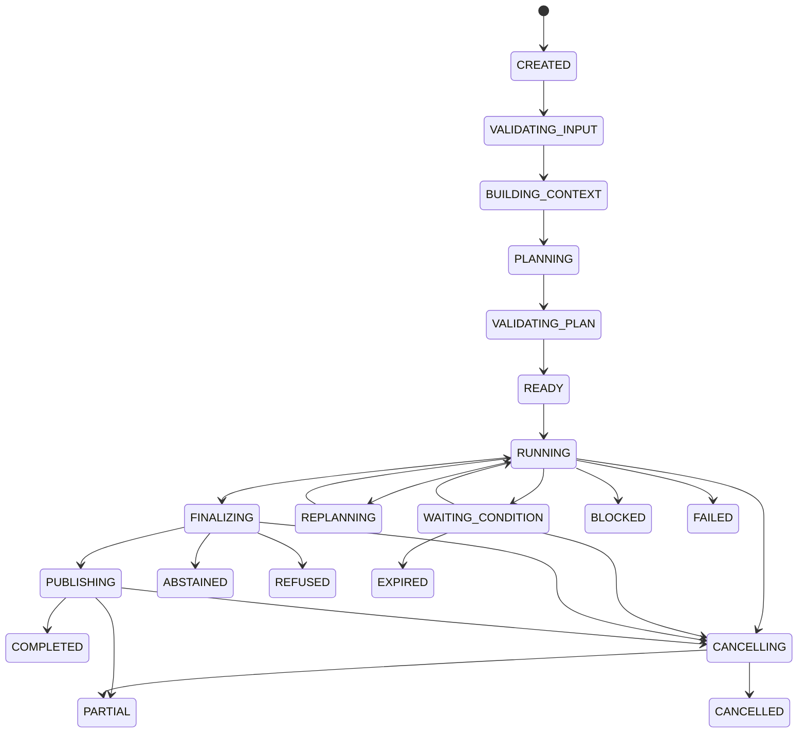

# 06 Agent Core / Planning & Control

updated: 2026-07-12  
status: normative-target-module-architecture  
module_number: 06  
formal_path: `docs/modules/06-agent-core-planning-control.md`  
agent_mirror: `.agent/modules/06-agent-core-planning-control.md`

> 本文是 Zuno 第 06 个逻辑模块——Agent Core / Planning & Control——的正式 Target 架构主设计。
>
> 本文只描述理想目标架构，不包含当前实现事实或具体迁移计划。Current 与 Gap 由 `docs/status/production-readiness.md` 维护；未来 Program 必须以本文为目标约束。

## 0. 文档边界与事实源

本文是 Agent Core / Planning & Control 模块唯一的正式 Target 架构文档，统一承载：

```text
问题与目标
概念架构与完整运行流程
架构不变量和状态机
DAG、并发、Interrupt、Signal 与副作用协议
TaskContract、GoalVersion 与一致性协议
Finalization、Artifact、Publication 与 RunOutcome
Failure、Budget、Recovery、Event 与时间语义
目标代码、数据库、Contract、测试和完成证据
```

文档边界：

```text
docs/modules/06-agent-core-planning-control.md
    唯一 Target 架构事实源。

.agent/modules/06-agent-core-planning-control.md
    字节级一致的 Agent 镜像。

.agent/programs/
    Current → Target 的实现、升级、迁移、切流和收口计划。

docs/status/
    Current、Gap、Measurement 和完成证据状态。
```

规范优先级：

```text
全局架构原则
→ 本模块 Target 架构文档
→ 已确认的 Program
→ 代码与 Migration
```

任何 Program 或实现不得自行改变本文已经确认的架构原则。本文不包含 Current Baseline、具体迁移阶段或 Cutover 步骤。

### 0.1 文档内部规范层级

Part I–IV 是问题、流程和实现表面的说明性视图；Part V–VII 是字段、状态、Policy、持久化与恢复的规范性视图；Part VIII 定义 Requirement、测试和完成证据。说明性视图不得覆盖规范性 Contract。

---

# Part I：定位与概念架构

# 1. 为什么需要 Agent Core

企业级 Agent 不能只依赖一个模型循环决定下一步。任务涉及多目标、并行、审批、外部副作用、长时间等待和恢复后，单循环会出现：

```text
目标和约束只存在于上下文中
计划结构不稳定，无法可靠并行
模型返回结果，但系统无法证明 Step 合格
失败后无法区分 Retry、Repair、Fallback 与 Replan
并行分支竞争共享状态或提交晚到结果
审批、权限、预算和副作用可能被绕过
重启后无法确认外部操作是否已经发生
最终文本已经发送，但质量门和审计事实尚未提交
```

一句话定义：

> Agent Core 是 Zuno 的 Single Controller Agent Runtime。它使用固定 AgentRunGraph 管理生命周期，以动态 Plan DAG 表达任务结构，并在固定 StepExecutionGraph 内执行受控 ReAct；模型产生 Proposal，Runtime、Policy 和各事实 Owner 决定领域状态与外部执行。

# 2. Zuno 是 Agent，Graph 是控制系统

Zuno 的产品形态是 Agent，因为它围绕目标形成动态闭环：

```text
理解目标
→ 形成计划
→ 选择行动
→ 观察环境
→ 判断质量
→ Retry / Repair / Replan
→ 完成、部分完成、拒绝或主动放弃
```

固定 Graph 不是 Agent 的替代品，而是防止动态智能绕过治理。

```text
固定 AgentRunGraph
    生命周期、状态、预算、安全、恢复、发布与终局。

动态 Plan DAG
    Objective、Step、依赖、条件、并行、Join 和完成标准。

固定 StepExecutionGraph
    Action Proposal、Validation、Execution、Observation、Evaluation、Acceptance 与 Reflection。
```

# 3. 模块职责

Agent Core 负责：

```text
Runtime Request 与 TaskContract 校验
GoalVersion、Objective 和输出要求管理
ExecutionContextSnapshot
Task Analysis 与 Complexity Classification
RuntimePolicy / AnswerPolicy 解析
Plan 创建、验证、激活和版本化
ReadySet、Admission、Budget、资源冲突和安全并行调度
Step 内 ReAct
Action Proposal 校验和跨模块调度
Observation 归一化
Action Evaluation 与 Step Acceptance
Step / Join / Final Reflection 与 Decision Guard
Retry、Repair、Fallback、Replan 与 Replan Barrier
多 Interrupt、Signal、Resume 与外部等待
Cancellation、Deadline 与控制命令仲裁
FinalCandidate、Final Gate、Publication 与 RunOutcome
Reflexion Candidate Bridge
Domain Event、Runtime Progress、Trace 与审计关联
崩溃恢复、Orphan Reconciliation 和幂等控制
```

Agent Core 不负责：

```text
文档解析或 OCR
直接访问 Milvus、Neo4j 或 BM25 内部实现
直接调用模型厂商 SDK
直接执行 Shell、浏览器、邮件或第三方 API
直接批准权限或副作用
直接写长期 Memory
直接修改 Knowledge、Security、Tool、Model 或 Eval 的领域事实
保存大型 Payload、完整凭证或隐藏思维链
```

# 4. Cross-module Ownership

```text
Product Surface        RuntimeRequest、用户交互与展示渠道
Input / Ingestion      文档处理任务与摄取状态
Knowledge              RetrievalRound、Evidence、CitationLineage
Model Gateway          ModelInvocation、Usage、Provider Failure
Memory & Context       ContextPack、MemoryCandidate、Memory Commit
Capability / Skill     CapabilityDefinition、SkillDefinition
Tool Runtime           ToolExecution、External Effect、Reconcile
Security               Authorization、Approval Policy、Revocation
Observability & Eval   Trace、Metric、Eval Result
Infrastructure         Checkpoint、Lease、Transaction、Object Store
Agent Core             Run、Goal、Plan、Step、Dispatch、Decision、Outcome
```

Agent Core 是编排者，不冒充其他模块的事实 Owner。

---

# Part II：智能机制与运行流程

# 5. 五种机制

```text
Plan-and-Execute
    管理整个任务的目标、依赖、并行和完成条件。

ReAct
    管理单个 Step 内 Action 与 Observation 的动态循环。

Reflection
    判断 Action、Step、Join 或最终结果是否合格。

Replan
    目标、假设、依赖或能力边界实质变化时创建新 PlanVersion。

Reflexion
    Run 结束后生成可治理经验候选，不直接写长期 Memory。
```

# 6. 所有任务都必须有 Plan

简单任务使用 Deterministic Single-Step Plan，复杂任务使用动态 DAG Plan。不存在绕过以下治理的正式回答路径：

```text
Plan
Trace
Budget
AnswerPolicy
Final Gate
Publication
RunOutcome
```

# 7. TaskContract 与 GoalVersion

```text
TaskContract
├── GoalVersion
│   ├── ObjectiveDefinition[]
│   ├── UserConstraint[]
│   ├── OutputRequirement[]
│   └── CompletionPolicy
└── Conversation / Workspace / Security Context Refs
```

用户追加信息必须分类为：

```text
SUPPLEMENTAL_INPUT
CLARIFICATION_RESPONSE
CONSTRAINT_CHANGE
OUTPUT_CONTRACT_CHANGE
OBJECTIVE_CHANGE
CANCELLATION_REQUEST
NEW_TASK
```

实质目标、约束或输出 Contract 变化创建新 GoalVersion 并触发 Replan；普通补充输入只解决 Interrupt。

# 8. Planner Pipeline

```text
TaskAnalyzer
→ ComplexityClassifier
→ RuntimePolicyResolver
→ PlannerRouter
→ DeterministicPlanner / SkillPlanner / ModelPlanner
→ PlanNormalizer
→ PlanValidator
→ PlanRepair
→ PlanVersion Activation
```

PlanValidator 至少检查：

```text
Schema
Goal Coverage 与 Objective Traceability
Step ID 唯一
DAG 无环与可达性
DependencyRule 与 ActivationCondition
输入输出兼容
Capability 可满足
Security 可执行
Budget 可分配
并行资源冲突
JoinPolicy 完整
Acceptance 可测试
Terminal Deliverable 存在
```

模型 Planner、Repair 和 Critic 只产生 Proposal。

# 9. Plan DAG

每个 StepDefinition 必须包含：

```text
Objective
Input / Output Contract
DependencyRule
ActivationCondition
AcceptancePolicy
Required Evidence
Allowed Capability / Tool / Model Role
Retry / Repair / Fallback Policy
Reflection Policy
Budget / Deadline
Resource Claims
Side-effect Class
Join Relationship
```

依赖类型：

```text
ALL_SUCCESS
ALL_TERMINAL
ANY_SUCCESS
OPTIONAL_INPUT
QUORUM
```

Disposition：

```text
EXECUTE
REUSE_COMPLETED
SKIP_CONDITION_FALSE
SKIP_OPTIONAL
BLOCKED_DEPENDENCY
BLOCKED_SECURITY
BLOCKED_BUDGET
OBSOLETE_BY_REPLAN
CANCELLED_BY_RUN
```

JoinPolicy：

```text
ALL_REQUIRED
BEST_EFFORT
QUORUM
FIRST_VALID
ANY_SUCCESS
CUSTOM_DETERMINISTIC
```

# 10. AgentRunGraph

```text
START
→ initialize_run
→ validate_runtime_request
→ create_or_resolve_task_contract
→ resolve_authorization
→ create_execution_context_snapshot
→ check_input_readiness
→ build_context
→ analyze_task
→ resolve_runtime_and_answer_policy
→ create_plan_proposal
→ normalize_and_validate_plan
→ activate_plan_version
→ controller_loop
```

Controller Loop：

```text
arbitrate_control_commands
→ reconcile_domain_and_checkpoint_generation
→ reconcile_expired_or_orphaned_facts
→ calculate_ready_set
→ evaluate_liveness
→ reserve_budget_and_resources
→ commit_dispatch
→ dynamic_send_step_workers
→ collect_branch_results
→ reduce_branch_results
→ evaluate_join
→ continue / wait / retry / replan / finalize
```

Finalization：

```text
final_synthesis
→ create_final_candidate
→ extract_claims
→ bind_claims_evidence_and_citations
→ final_gate
→ maybe_final_reflection
→ prepare_artifact_versions
→ prepare_publication
→ publish
→ confirm_delivery
→ commit_run_outcome
→ build_reflexion_candidate
→ END
```

一个 Run 可以同时存在多个 Pending Interrupt：

```text
USER_INPUT
APPROVAL
EXTERNAL_JOB
INGESTION_COMPLETION
SECURITY_REVIEW
MANUAL_RECONCILIATION
RESOURCE_AVAILABLE
```

# 11. StepExecutionGraph

```text
START
→ load_step_definition
→ verify_plan_and_execution_epoch
→ resolve_step_inputs
→ acquire_resource_claims
→ confirm_budget_reservation
→ preflight_security_gate
→ decide_action_proposal
→ validate_action
→ prepare_side_effect_if_needed
→ await_approval_if_needed
→ claim_idempotency
→ execute_action
→ normalize_observation
→ persist_action_observation_and_usage
→ evaluate_action
→ evaluate_acceptance
→ maybe_step_reflection
→ decide_step_progress
```

Step Progress：

```text
CONTINUE_REACT
RETRY_ACTION
REPAIR_PARAMETERS
FALLBACK_CAPABILITY
ESCALATE_MODEL
COMPLETE
RETRY_STEP
REQUEST_REPLAN
WAIT_SIGNAL
BLOCK
ABSTAIN
FAIL
```

外部副作用统一遵循：

```text
Proposal
→ Prepare
→ Validate
→ Authorize
→ Approve
→ Claim
→ Execute
→ Observe
→ Reconcile
→ Commit Outcome
```

# 12. 并行与 Dispatch

Scheduler 依次检查：

```text
Active PlanVersion
Dependency 与 Condition
输入可用性
Security
Capability
资源冲突
副作用串行要求
Budget Reservation
Provider Quota
Workspace Fair Share
Deadline 和 Critical Path
Execution Claim
Dispatch Commit
```

Dispatch 必须先持久化再 Send：

```text
BEGIN
创建 DispatchGroup
创建 DispatchItem
创建 StepRun
预留 Budget
获取 Resource Claim
记录 DispatchCommittedEvent
COMMIT

COMMIT 后才允许 Send
```

Worker 只返回不可变 BranchResultRef，不直接修改共享 Run 状态。

# 13. Reflection、Retry 与 Replan

```text
Action Evaluation       每个 Action 都执行，确定性优先
Step Acceptance         每个 Step 都执行
Step Reflection         失败、冲突、关键决策或重复失败时触发
Join Evaluation         每个 Join 都执行
Join Reflection         部分失败、冲突或 ReplanRequest 时触发
Final Gate              所有任务必经
Final Reflection        复杂、严格 Grounded 或高风险任务触发
```

```text
Retry                   目标和计划结构不变
Parameter Repair        调整参数、Query 或 Prompt
Executor Escalation     弱模型升级为强模型角色
Capability Fallback     更换能力但保持 Output Contract
Step Repair             改变 Step 内执行方法
Replan                   修改剩余结构并创建新 PlanVersion
```

Replan Barrier：

```text
禁止旧 Plan 新建 Dispatch
CANCEL_SAFE 分支请求取消
DRAIN_REQUIRED 分支允许完成但不保证复用
NON_INTERRUPTIBLE 副作用必须完成并 Reconcile
收集已提交结果
创建并验证新 PlanVersion
原子切换 Active PlanVersion
重新计算 ReadySet
```

# 14. Finalization 与 Publication

```text
FinalCandidate
→ FinalGateResult
→ ArtifactVersion
→ Publication
→ DeliveryReceipt
→ RunOutcome
```

Final Gate 前不得把 Candidate 当作正式答案发布。流式输出分为 Progress Stream、Policy 允许的 Provisional Content 和 Transactional Final Publication。

# 15. Cancellation 与控制命令

所有控制命令进入 per-run 串行仲裁。默认优先级：

```text
Security Revocation
→ Cancellation
→ Deadline / Expiration
→ Unknown Side-effect Reconciliation
→ Approval / Signal
→ Budget
→ Replan
→ Quality Decision
→ Normal Scheduling
```

取消流程：

```text
Run → CANCELLING
停止新 Dispatch
取消 QUEUED / CLAIMED StepRun
请求取消可中断 Action
释放未消费 Budget 和 Lease
等待或 Reconcile 不可中断副作用
提交 CANCELLED 或 PARTIAL Outcome
```

---

# Part III：状态、恢复与一致性概览

# 16. 核心状态模型


```text
AgentRun
PlanVersion
StepRun
ActionRun
Publication
```

`WAITING_CONDITION` 是非终态；`BLOCKED` 是终态；取消必须经过 `CANCELLING`。

# 17. Graph State

```python
class AgentRunGraphState(TypedDict, total=False):
    schema_version: str
    run_id: str
    thread_id: str
    trace_id: str
    phase: str
    domain_generation: int
    checkpoint_generation: int
    controller_epoch: int
    task_contract_id: str
    active_goal_version_id: str
    execution_snapshot_id: str
    active_plan_version_id: str
    current_dispatch_group_id: str | None
    pending_interrupt_refs: list[str]
    branch_result_refs: list[str]
    latest_control_decision_ref: str | None
    final_candidate_ref: str | None
    publication_ref: str | None
    outcome_ref: str | None
```

```python
class StepGraphState(TypedDict, total=False):
    run_id: str
    step_run_id: str
    step_definition_id: str
    plan_version_id: str
    controller_epoch: int
    execution_epoch: int
    resolved_input_ref: str | None
    latest_action_run_id: str | None
    latest_observation_ref: str | None
    latest_acceptance_ref: str | None
    latest_reflection_ref: str | None
    pending_interrupt_refs: list[str]
    output_ref: str | None
    failure_ref: str | None
```

Graph State 禁止保存完整 Plan、Context、Prompt、Observation Payload、检索结果、Artifact 或隐藏思维链。

# 18. Domain Store 与 Checkpointer

```text
PostgreSQL Domain Store
    可审计领域事实与状态转换。

LangGraph Checkpointer
    Graph Node、Channel、Pending Send、Interrupt Cursor 和 Reducer 控制状态。

Object Store
    大型不可变 Payload、Artifact 和调试包。
```

一致性原则：

```text
Domain Generation 是权威提交序列
Checkpoint 只能引用已提交的 Domain Generation
Domain > Checkpoint 时从领域事实重建控制状态
Checkpoint > Domain 时回退到最后合法 Generation
```

# 19. Result Validity

```text
VALID
STALE
REVOKED
TAINTED
SUPERSEDED
UNKNOWN_VALIDITY
```

污染传播：

```text
Evidence REVOKED
→ Observation TAINTED
→ StepResult TAINTED
→ JoinResult TAINTED
→ FinalCandidate TAINTED
→ Publication 被阻止、撤回或创建更正版本
```

# 20. Event、Outbox 与 Trace

```text
DomainEvent
RuntimeProgressEvent
AuditEvent
IntegrationEvent
PublicationEvent
```

```text
Outbox at-least-once
同一 run_id 内 sequence_no 有序
跨 Run 不保证顺序
消费者按 event_id 幂等
事件带 contract_version 和 payload_schema_hash
敏感字段在 Integration Event 前脱敏
```

# 21. Orphan Recovery

```text
RunOrphanReconciler
DispatchReconciler
StepLeaseReconciler
UnknownActionReconciler
InterruptExpiryReconciler
PublicationReconciler
OutboxReconciler
BudgetReservationReconciler
```

每个 Reconciler 使用 Claim、Fencing 和 Idempotency，并定义人工介入条件。

# 22. 时间语义

```text
持久化时间统一 UTC
Deadline 和 Expiry 使用绝对时间
进程内耗时使用 monotonic clock
Lease 到期以数据库时间为准
用户时区只用于展示
Clock Skew 超阈值时拒绝 Lease-sensitive 操作
等待是否消耗 Wall-clock Budget 由 BudgetPolicy 明确声明
```

---

# Part IV：目标实现表面与规范索引

# 23. 主要领域对象

```text
TaskContract
GoalVersion
ObjectiveDefinition
ObjectiveOutcome
ExecutionContextSnapshot
EffectivePolicySnapshot
AgentRun
RunCommand
ControlDecision
Plan
PlanVersion
PlanStepDefinition
DependencyRule
ActivationCondition
StepRun
ActionRun
Observation
AcceptanceResult
ReflectionResult
DispatchGroup
DispatchItem
ResourceClaim
BranchResultRef
ReductionAttempt
JoinAttempt
PlanPatch
PlanPatchOperation
ReplanBarrier
Interrupt
SignalConsumption
PreparedAction
ApprovalDecision
IdempotencyClaim
DomainCommitMarker
RecoveryWatermark
ResultValidityRecord
FinalCandidate
ArtifactCandidate
ArtifactVersion
ArtifactValidation
Publication
PublicationArtifactBinding
PublicationCorrectionDecision
DeliveryReceipt
RunOutcome
BudgetConsumption
BudgetAdjustment
BudgetSettlement
DomainEvent
RuntimeEvent
OutboxEvent
ReconciliationRecord
```

# 24. Typed Ports

```text
ModelGatewayPort
KnowledgeQueryPort
ContextAssemblyPort
CapabilityResolutionPort
IngestionPort
ToolExecutionPort
SecurityDecisionPort
ArtifactPort
PublicationPort
CheckpointPort
ObservationSinkPort
```

Port 不暴露其他模块内部 Repository、数据库 Session 或 Provider SDK。

# 25. 目标代码目录

```text
src/backend/zuno/agent/
├── contracts/{task,policy,planning,execution,interrupt,side_effect,publication,outcome,events}.py
└── runtime/
    ├── domain/{task_contract,run,plan,step,action,dispatch,interrupt,signal,prepared_action,approval,idempotency,result_validity,artifact,publication,failure,outcome}.py
    ├── application/{run,task_contract,planning,scheduling,step_execution,reflection,replan,signal,side_effect,reconciliation,finalization,publication,command_arbitration,recovery,cancellation}_service.py
    ├── graph/run/{state,nodes,routing,builder}.py
    ├── graph/step/{state,nodes,routing,builder}.py
    ├── planning/{analyzer,validator,repair,planners/}
    ├── scheduling/{readiness,liveness,admission,selector,fencing,reduction,join}.py
    ├── execution/{action_decider,action_validator,executor_registry,executors/}
    ├── finalization/{candidate,claims,gate,artifact,publication}.py
    ├── recovery/{generation,reconcilers,replay}.py
    ├── persistence/{repositories,uow,outbox,event_sequence}.py
    └── ports/
```

约束：Domain 不导入 LangGraph；Graph Node 不直接写 SQL；Application 不导入 FastAPI；外部调用不放在数据库事务内；ORM Row 不直接作为 Graph State。

# 26. PostgreSQL 目标表

```text
Task and Run
├── agent_task_contracts
├── agent_goal_versions
├── agent_objectives
├── agent_objective_outcomes
├── agent_runs
├── agent_run_commands
├── agent_control_decisions
├── agent_execution_context_snapshots
├── agent_runtime_policy_snapshots
├── agent_answer_policy_snapshots
└── agent_effective_policy_snapshots

Plan Definition
├── agent_plans
├── agent_plan_versions
├── agent_plan_steps
├── agent_dependency_rules
├── agent_activation_conditions
└── agent_step_acceptance_criteria

Scheduling and Execution
├── agent_dispatch_groups
├── agent_dispatch_items
├── agent_step_runs
├── agent_branch_results
├── agent_reduction_attempts
├── agent_join_attempts
├── agent_resource_leases
├── agent_resource_claims
├── agent_budget_reservations
├── agent_budget_consumptions
├── agent_budget_adjustments
└── agent_budget_settlements

Action and Side Effect
├── agent_action_runs
├── agent_observations
├── agent_acceptance_results
├── agent_reflection_results
├── agent_prepared_actions
├── agent_approval_decisions
├── agent_idempotency_claims
└── agent_reconciliation_records

Replan and Wait
├── agent_plan_patches
├── agent_plan_patch_operations
├── agent_replan_barriers
├── agent_interrupts
├── agent_signal_consumptions
└── agent_external_job_handles

Output
├── agent_final_candidates
├── agent_artifact_candidates
├── agent_claims
├── agent_claim_evidence_bindings
├── agent_artifact_versions
├── agent_artifact_validations
├── agent_publications
├── agent_publication_artifact_bindings
├── agent_publication_correction_decisions
├── agent_delivery_receipts
└── agent_run_outcomes

Consistency, Validity and Eventing
├── agent_domain_commit_markers
├── agent_recovery_watermarks
├── agent_result_validity
├── agent_failures
├── agent_runtime_events
└── agent_outbox_events
```

关键约束：

```text
UNIQUE(workspace_id, client_request_id)
partial UNIQUE(run_id) WHERE PlanVersion.status = ACTIVE
UNIQUE(plan_version_id, logical_step_id)
UNIQUE(step_definition_id, attempt_no)
UNIQUE(idempotency_scope, idempotency_key)
UNIQUE(interrupt_id, signal_id)
UNIQUE(run_id, domain_generation)
UNIQUE(run_id, event_sequence_no)
partial INDEX(agent_interrupts.run_id) WHERE status = PENDING
partial INDEX(agent_outbox_events.created_at) WHERE published_at IS NULL
```

# 27. 事务边界

```text
Run / TaskContract / GoalVersion / RunCreated Event / Outbox
    同一事务提交。

Plan Activation
    验证在事务外；原子切换 Active PlanVersion 并提交 Event。

Dispatch
    DispatchGroup、Item、StepRun、Budget、Resource Claim 和 Event 同事务提交；之后才 Send。

External Action
    事务 A 提交 PreparedAction、ActionRun、IdempotencyClaim；事务外执行；事务 B 提交 Observation 和 Outcome。

Publication
    事务 A 提交 FinalCandidate、Gate、ArtifactVersion 和 PREPARED Publication；事务外发送；事务 B 提交 DeliveryReceipt、PUBLISHED 和 RunOutcome。
```

# 28. Contract Versioning

统一 Envelope：

```text
contract_name
contract_version
contract_bundle_version
message_id
correlation_id
causation_id
tenant_id
workspace_id
run_id
step_run_id
producer
consumer
security_context_ref
authorization_decision_ref
data_classification
created_at
payload
payload_schema_hash
```

Run 创建时固定 Runtime、Graph、State、Contract、Prompt、Model Routing、Security 和 Answer Policy 版本。未知安全枚举必须 fail-closed。

---

# Part V：领域模型、状态转换与决策闭环

本 Part 是跨章节 Schema、状态转换、Policy 和持久化闭环的规范性事实源。Part I–IV 用于解释问题、流程和实现表面；Part VI–VII 定义详细控制与一致性协议。发生重复或表述冲突时，按以下顺序解释：

```text
Part V 的对象分类、状态转换、Policy 与存储映射
→ Part VI 的控制协议
→ Part VII 的一致性与生命周期协议
→ Part I–IV 的说明性概览
```

任何冲突必须在同一轮文档修改中消除，不能让 Program 或实现自行选择解释。

## 29. 领域对象分类与存储闭环

### 29.1 对象类型

| 类型 | 对象 | 规则 |
| --- | --- | --- |
| Aggregate Root | `TaskContract`、`AgentRun`、`PlanVersion`、`StepRun`、`PreparedAction`、`ArtifactVersion`、`Publication` | 通过 Application Service 和 Repository 修改；拥有独立并发与不变量边界 |
| Entity | `GoalVersion`、`ObjectiveDefinition`、`ObjectiveOutcome`、`ActionRun`、`Interrupt`、`DispatchGroup`、`DispatchItem`、`FinalCandidate`、`DeliveryReceipt` | 生命周期从属于明确 Aggregate，不允许跨 Aggregate 隐式写入 |
| Immutable Result | `Observation`、`AcceptanceResult`、`ReflectionResult`、`BranchResultRef`、`JoinOutcome`、`ControlDecision`、`RunOutcome` | 提交后不可原地改写；更正创建新版本或 Correction Record |
| Value Object / Policy Snapshot | `DependencyRule`、`ActivationCondition`、`JoinPolicy`、`ResourceClaim`、`EffectivePolicySnapshot`、`ResultValidityRecord` | 必须版本化、可哈希、可审计；不得隐藏可执行代码 |
| Infrastructure Record | `DomainCommitMarker`、`RecoveryWatermark`、`OutboxEvent`、`ReconciliationRecord`、`IdempotencyClaim`、Lease | 记录恢复和交付事实，不冒充业务结果 |

不是每个名称都需要独立 Repository。是否建表由本节 Storage Mapping 决定，Codex 不得仅根据类名自行拆表。

### 29.2 Storage Mapping

| 对象 | Owner | 持久化形式 | 目标表 / 载体 | 关键约束 |
| --- | --- | --- | --- | --- |
| `TaskContract` | Agent Core | Relational Aggregate | `agent_task_contracts` | 一个 Run 一个有效 Contract |
| `GoalVersion` | Agent Core | Relational Entity | `agent_goal_versions` | 同一 Contract 最多一个 ACTIVE |
| `ObjectiveDefinition` | Agent Core | Relational Entity | `agent_objectives` | `logical_objective_id` 跨版本可追踪 |
| `ObjectiveOutcome` | Agent Core | Relational Immutable Result | `agent_objective_outcomes` | RunOutcome 必须引用，不得只写自由文本 |
| `EffectivePolicySnapshot` | Agent Core | JSONB Snapshot + Hash | `agent_effective_policy_snapshots` | Run 创建时冻结 |
| `RunCommand` | Agent Core | Ordered Command Journal | `agent_run_commands` | `UNIQUE(run_id, command_sequence_no)` |
| `ControlDecision` | Agent Core | Immutable Result | `agent_control_decisions` | 引用 Command 与 applied generation |
| `ResourceClaim` | Agent Core | Relational Lease/Claim | `agent_resource_claims` | Canonical Resource ID + Access Mode |
| `PlanPatchOperation` | Agent Core | Relational Operation | `agent_plan_patch_operations` | 只生成新 PlanVersion，不原地改 Active Plan |
| `DomainCommitMarker` | Agent Core | Relational Infrastructure Record | `agent_domain_commit_markers` | `UNIQUE(run_id, domain_generation)` |
| `RecoveryWatermark` | Agent Core | Relational Projection | `agent_recovery_watermarks` | 每个 Run 单行条件更新 |
| `ArtifactCandidate` | Agent Core | Metadata + Object Ref | `agent_artifact_candidates` | 未验证草稿不得发布 |
| `PublicationArtifactBinding` | Agent Core | Relational Binding | `agent_publication_artifact_bindings` | Publication 与 ArtifactVersion 多对多 |
| `PublicationCorrectionDecision` | Agent Core | Immutable Decision | `agent_publication_correction_decisions` | 不覆盖原 Publication / Receipt |
| `BudgetConsumption` | Agent Core | Append-only Ledger | `agent_budget_consumptions` | Usage 可延迟结算但不可丢失 |
| `BudgetAdjustment` | Agent Core | Append-only Ledger | `agent_budget_adjustments` | 必须有 reason 和 causation |
| `BudgetSettlement` | Agent Core | Immutable Result | `agent_budget_settlements` | Run 终局前或后台 Reconcile 完成 |
| 大型 Observation / Artifact | 对应事实 Owner | Immutable Object | Object Store + content hash | 数据库只保存 Ref、Hash 和 Metadata |

没有列为独立表的 `DependencyRule`、`ActivationCondition`、`JoinPolicy`、`CompletionPolicy` 和 Acceptance Check Definition，可以作为其 Aggregate 的版本化 JSONB Snapshot；一旦需要独立查询、外键引用或局部更新，必须先通过 ADR 改变存储决策。

## 30. 状态转换协议

### 30.1 通用 Transition Record

每次状态转换必须产生结构化 Transition Record：

```text
transition_id
aggregate_type
aggregate_id
from_status
to_status
trigger_type
trigger_ref
guard_result_ref
reason_code
controller_epoch
execution_epoch
policy_snapshot_ref
domain_generation
occurred_at
trace_id
```

状态转换必须由确定性 Guard 执行。模型只能建议 `reason` 或下一步，不得提交状态。

### 30.2 AgentRun Transition Matrix

| From | Trigger | Guard | To | 同事务事实 |
| --- | --- | --- | --- | --- |
| `CREATED` | `START_VALIDATION` | RuntimeRequest 已幂等提交 | `VALIDATING_INPUT` | RunTransition + Event |
| `VALIDATING_INPUT` | `INPUT_VALID` | TaskContract 可构造 | `BUILDING_CONTEXT` | TaskContract + GoalVersion |
| `VALIDATING_INPUT` | `INPUT_INVALID` | 不可 Repair | `FAILED` | Failure + RunOutcome |
| `BUILDING_CONTEXT` | `CONTEXT_READY` | Snapshot 完整且 Security 有效 | `PLANNING` | ExecutionContextSnapshot |
| `PLANNING` | `PLAN_PROPOSED` | Planner Budget 未耗尽 | `VALIDATING_PLAN` | Proposed PlanVersion |
| `VALIDATING_PLAN` | `PLAN_ACCEPTED` | DAG、Capability、Budget、Security、Acceptance 全部合法 | `READY` | Active PlanVersion + ActivationEvent |
| `VALIDATING_PLAN` | `PLAN_REJECTED` | Repair/Replan 预算耗尽 | `FAILED` 或 `ABSTAINED` | Failure + Outcome |
| `READY` | `SCHEDULE_TICK` | Admission 允许 | `RUNNING` | Dispatch Commit |
| `RUNNING` | `WAIT_REQUIRED` | 存在有效 Interrupt / External Job / Resource Wait | `WAITING_CONDITION` | Interrupt/Handle + Event |
| `WAITING_CONDITION` | `VALID_SIGNAL` | Signal 鉴权、幂等、未过期 | `RUNNING` | SignalConsumption + ControlDecision |
| `RUNNING` | `REPLAN_REQUIRED` | 原计划结构或假设失效 | `REPLANNING` | ReplanBarrier |
| `REPLANNING` | `PLAN_ACTIVATED` | 新 PlanVersion 原子激活 | `RUNNING` | Plan switch + ReadySet generation |
| `RUNNING` | `OBJECTIVES_READY` | REQUIRED Objective 可进入 Finalization | `FINALIZING` | FinalCandidate seed |
| `FINALIZING` | `FINAL_GATE_PASS` | Evidence、Citation、Security、Validity、Artifact 全通过 | `PUBLISHING` | ArtifactVersion + PREPARED Publication |
| `FINALIZING` | `FINAL_GATE_ABSTAIN` | 证据或能力不足 | `ABSTAINED` | RunOutcome |
| `FINALIZING` | `FINAL_GATE_REFUSE` | Policy / Security 要求拒绝 | `REFUSED` | RunOutcome |
| `PUBLISHING` | `DELIVERY_CONFIRMED` | Receipt 幂等且 Publication Gate 仍有效 | `COMPLETED` 或 `PARTIAL` | Receipt + Publication + RunOutcome |
| 任意非终态 | `SECURITY_REVOKE` | 撤权影响继续执行 | `CANCELLING`、`REFUSED` 或 `BLOCKED` | ControlDecision + AuditEvent |
| 任意非终态 | `CANCEL` | 命令合法 | `CANCELLING` | CancellationBarrier |
| `CANCELLING` | `DRAIN_COMPLETE` | 不可中断副作用已完成或 Reconcile | `CANCELLED` 或 `PARTIAL` | RunOutcome + BudgetSettlement |
| `WAITING_CONDITION` | `EXPIRE` | Deadline / Interrupt / Approval 到期且无替代路径 | `EXPIRED` | Failure + RunOutcome |

`PUBLISHING` 失败不自动等于 Run `FAILED`：可恢复渠道故障保持 `PUBLISHING` 并由 PublicationReconciler 处理；明确不可恢复且没有其他渠道时，依据 AnswerPolicy 进入 `PARTIAL`、`BLOCKED` 或 `FAILED`。

### 30.3 聚合投影规则

```text
存在未解决 ActionOutcome=UNKNOWN
    → StepRun 不得 COMPLETED
    → Final Gate 不得 PASS

所有 REQUIRED ObjectiveOutcome=SATISFIED
且 Final Gate=PASS
且 Publication 已确认或 Policy 明确无需发布
    → AgentRun=COMPLETED

至少一个 REQUIRED Objective SATISFIED
且未完成部分已披露
且 AnswerPolicy 允许 Partial
    → AgentRun=PARTIAL

Active PlanVersion 的所有可达 Step 已终止
但 REQUIRED Objective 未满足
    → Retry / Fallback / Replan / Abstain / Fail，不能直接 COMPLETED
```

### 30.4 非法转换与终态不可变

必须拒绝：`COMPLETED → RUNNING`、`CANCELLED → PUBLISHING`、`SUPERSEDED PlanVersion → ACTIVE`、`OBSOLETE StepRun → RUNNING`、无新 Attempt 的 `FAILED Publication → PUBLISHED`。

终态后允许新增 AuditEvent、Metric、ReconciliationRecord 和 PublicationCorrectionDecision；禁止覆盖原 GoalVersion、PlanVersion、RunOutcome、DeliveryReceipt 和历史 Event。

## 31. Action 生命周期与对账结果

Action 的执行生命周期和业务结果是两个正交维度：

```text
ActionLifecycleStatus
    PROPOSED
    VALIDATING
    PREPARED
    WAITING_APPROVAL
    CLAIMED
    EXECUTING
    RECONCILING
    TERMINAL

ActionOutcome
    SUCCEEDED
    FAILED
    NOT_EXECUTED
    CANCELLED
    UNKNOWN
    HUMAN_REQUIRED
```

`RECONCILING` 表示正在确认外部事实，不是业务结果。Reconciler 必须提交明确 `ActionOutcome`；仍无法确认时为 `UNKNOWN` 或 `HUMAN_REQUIRED`，不得使用含义模糊的 `RECONCILED` 代替结果。

## 32. RunCommand 与 ControlDecision

### 32.1 RunCommand

```text
command_id
run_id
command_sequence_no
command_type
producer
producer_authority
payload_ref
idempotency_key
correlation_id
causation_id
expected_controller_epoch
security_epoch
policy_snapshot_ref
observed_at
received_at
status
applied_domain_generation
```

`command_sequence_no` 由 PostgreSQL 在同一 `run_id` 范围分配并形成唯一约束；命令顺序不得依赖 Worker 本地时间或 `observed_at`。Command 已提交但 Controller 崩溃时，由新 Controller 从最后 `applied_domain_generation` 继续。

### 32.2 ControlDecision

```text
control_decision_id
run_id
command_id
command_sequence_no
decision_type
reason_code
previous_state
next_state
selected_plan_version_id
selected_interrupt_refs
policy_snapshot_ref
controller_epoch
applied_domain_generation
created_at
```

ControlDecision 是不可变 Result；重复 Command 返回原 Decision，不再次修改领域状态。

## 33. Effective Policy Snapshot

Policy 解析顺序：

```text
System Default
→ Tenant Policy
→ Workspace Policy
→ User Policy
→ Task Policy
→ Security Override
→ Runtime Emergency Override
```

解析结果必须保存不可变 `EffectivePolicySnapshot`：

```text
effective_policy_snapshot_id
run_id
system_policy_version
tenant_policy_version
workspace_policy_version
user_policy_version
task_policy_version
security_override_version
runtime_override_version
resolved_policy
resolution_trace
content_hash
created_at
```

`RuntimePolicy` 至少包含 planning_mode、parallelism_mode、reflection_mode、replan_mode、recovery_mode、publication_mode、max_plan_versions、max_step_attempts、max_action_attempts、max_react_iterations 和 max_finalization_cycles。

`AcceptancePolicy` 至少包含 required_checks、evaluator_types、output_schema、evidence_threshold、citation_threshold、confidence_threshold、failure_disposition 和 reflection_trigger。

`ReflectionPolicy` 至少包含 trigger_conditions、model_role、budget_limit、max_iterations 和 allowed_decisions。模型不得自行决定绕过 Reflection Policy。

## 34. ResourceClaim 与 PlanPatch Algebra

### 34.1 ResourceClaim

```text
resource_claim_id
run_id
step_run_id
resource_type
canonical_resource_id
access_mode
scope
quantity
lease_duration
renewal_policy
acquisition_order
preemptible
claim_token
fencing_epoch
```

Access Mode：`READ_SHARED`、`WRITE_EXCLUSIVE`、`APPEND_SERIALIZED`、`CAPACITY_SHARED`、`NON_PREEMPTIBLE`。

多资源 Claim 必须按 `(resource_type, canonical_resource_id, acquisition_order)` 固定顺序获取；部分获取失败时释放已获取 Claim。父子资源冲突、Deadlock、Priority Inversion、Lease Renewal 和 Replan 后 Claim 转移必须由 Resource Policy 明确处理。

### 34.2 PlanPatchOperation

```text
ADD_STEP
REMOVE_STEP
REPLACE_STEP
REWIRE_DEPENDENCY
CHANGE_ACTIVATION_CONDITION
CHANGE_JOIN_POLICY
CHANGE_ACCEPTANCE_POLICY
CHANGE_CAPABILITY_BINDING
CHANGE_BUDGET_ALLOCATION
CHANGE_TERMINAL_DELIVERABLE
```

每个 Operation 保存 operation_id、operation_type、target_logical_id、before_hash、after_definition_ref、reason_code、affected_objective_refs、invalidated_result_refs 和 reusable_result_refs。

PlanPatch 只能生成新 PlanVersion；不能原地修改 Active PlanVersion。已提交副作用不能被 Patch 当作未发生，旧结果复用必须重新检查 GoalVersion、ResultValidity、Security Scope、Knowledge Snapshot 和 Output Contract。

## 35. Failure Decision Matrix

| FailureClass | Retry | Repair | Fallback | Replan | Reconcile | Human | 默认 Run 处置 |
| --- | --- | --- | --- | --- | --- | --- | --- |
| `TRANSIENT_INFRASTRUCTURE` | 有限 | 否 | 可选 | 否 | 否 | 否 | WAIT / FAILED |
| `RATE_LIMIT` | 有限退避 | 否 | 是 | 否 | 否 | 否 | WAIT / FAILED |
| `TIMEOUT` | 条件性 | 条件性 | 是 | 条件性 | 副作用时必须 | 条件性 | WAIT / FAILED |
| `CONTRACT_VIOLATION` | 否 | 是 | 条件性 | 条件性 | 否 | 否 | FAILED |
| `INVALID_MODEL_OUTPUT` | 有限 | 是 | 是 | 条件性 | 否 | 否 | FAILED |
| `CAPABILITY_UNAVAILABLE` | 否 | 否 | 是 | 是 | 否 | 否 | PARTIAL / FAILED |
| `SECURITY_BLOCK` | 否 | 否 | 否 | 否 | 否 | 条件性 | REFUSED / BLOCKED |
| `APPROVAL_DENIED` | 否 | 否 | 条件性 | 条件性 | 否 | 否 | PARTIAL / REFUSED |
| `BUDGET_EXHAUSTED` | 否 | 否 | 条件性 | 条件性 | 否 | 否 | PARTIAL / ABSTAINED |
| `UNKNOWN_SIDE_EFFECT` | 否 | 否 | 否 | 否 | 必须 | 条件性 | BLOCKED |
| `DATA_STALE` | 否 | 否 | 是 | 是 | 否 | 否 | PARTIAL / ABSTAINED |
| `PLAN_INVALID` | 否 | 是 | 否 | 是 | 否 | 否 | FAILED |
| `NO_PROGRESS` | 否 | 条件性 | 条件性 | 有限 | 否 | 条件性 | ABSTAINED / FAILED |

项目 Policy 可以收紧默认值；放宽安全、副作用或证据相关默认值必须经过 Security/Architecture 审批并版本化审计。

## 36. Budget Ledger

Budget 不是可覆盖计数器，而是可审计 Ledger：

```text
BudgetEstimate
BudgetReservation
BudgetConsumption
BudgetAdjustment
BudgetSettlement
```

关键不变量：

```text
available = limit + adjustments - reserved - consumed
reserved 不得小于零
并行 Dispatch 先 Reservation，防止超卖
Provider Usage 延迟返回时先保存 provisional consumption，再结算差额
失败调用是否计费以 Provider Receipt 为准
取消释放未消费 Reservation，但不回滚已发生 Consumption
Reservation 到期由 Reconciler 释放
所有金额保存 currency、scale 和 provider pricing version
```

RunOutcome 必须引用最终 BudgetSettlement；无法及时获得 Provider Usage 时允许先进入终态，但必须标记 `SETTLEMENT_PENDING` 并由后台 Reconciler 完成，不得丢失账务责任。

## 37. Publication Ownership 与企业 Contract Envelope

### 37.1 Publication Ownership

```text
PublicationIntent / PublicationRecord
    Owner：Agent Core

ChannelDelivery
    Owner：Product Surface

DeliveryReceipt
    Producer：Product Surface 或渠道 Adapter
    Consumer：Agent Core

ClientRendered / UserRead
    Owner：Product Surface
```

`PUBLISHED` 只表示渠道返回可验证 DeliveryReceipt，不表示用户已经阅读或客户端已经成功渲染。

ArtifactVersion 的生命周期状态仅允许 `DRAFT`、`VALIDATING`、`VALID`、`INVALID`、`SUPERSEDED`；发布、撤回和渠道失败属于 Publication，不写回 ArtifactVersion 生命周期。

### 37.2 Contract Envelope

所有跨模块请求、响应和事件必须带：

```text
contract_name
contract_version
contract_bundle_version
message_id
correlation_id
causation_id
tenant_id
workspace_id
run_id
step_run_id
producer
consumer
security_context_ref
authorization_decision_ref
data_classification
created_at
payload
payload_schema_hash
```

消费者必须独立验证 tenant、workspace、security context 和 contract version，不能只通过 `run_id` 反查后默认可信。

## 38. Requirement Enforcement Matrix

每个 001–080 Requirement 必须有一条 `RequirementControl`：

```text
requirement_id
category
owner
enforcement_type
enforcement_ref
failure_code
test_ids
evidence_types
status
```

测试和证据命名采用稳定规则：Requirement `NNN` 对应测试前缀 `AG-NNN-*`，运行证据键 `EV-AG-NNN`。Program 可以增加多个测试，但不得缺失基础映射。

| Requirement 范围 | Category | 最低 Enforcement | 最低测试 | 运行证据 |
| --- | --- | --- | --- | --- |
| 001–010 | FOUNDATION / PLAN | Schema、Plan Validator、Unique Constraint | Unit + Integration | PlanValidation / Activation Event |
| 011–020 | EXECUTION / QUALITY | Step Guard、Acceptance、Decision Guard | Unit + Integration + E2E | StepTransition / Acceptance Record |
| 021–032 | RECOVERY / SECURITY | Idempotency、Fencing、Security Gate | Integration + Fault | Rejected Write / Reconciliation Record |
| 033–043 | CONTROL / DAG | State Guard、DAG Validator、Barrier | Unit + Integration + Fault | Transition / Barrier Event |
| 044–050 | INTERRUPT / SIDE_EFFECT / FINAL | Signal Guard、PreparedAction、Receipt | Integration + Fault + E2E | SignalConsumption / DeliveryReceipt |
| 051–060 | FAILURE / BUDGET / OWNERSHIP | Decision Matrix、Ledger、Port Boundary | Unit + Integration | FailureDecision / BudgetSettlement |
| 061–070 | GOAL / COMMAND / CONSISTENCY | Version Constraint、Command Journal、Generation Guard | Integration + Fault | ControlDecision / DomainCommitMarker |
| 071–080 | VALIDITY / EVENT / ARTIFACT / TIME | Validity Gate、Outbox、Artifact Validation、Clock Guard | Integration + Fault + E2E | ValidityRecord / OutboxReceipt / AuditEvent |

高风险 Requirement（Fencing、Approval、UNKNOWN、副作用、Security、Publication、Recovery）必须有 Fault Test。状态机 Requirement 必须同时覆盖合法和非法转换。

---

# Part VI：规范性控制协议

## 1. 控制权模型

### 1.1 Agent、Proposal 与领域事实

Zuno 是 Agent，LangGraph 是 Agent 的受治理控制系统。

模型可以产生：

```text
TaskAnalysisProposal
PlanProposal
ActionProposal
ReflectionProposal
PlanPatchProposal
FinalCandidateProposal
ReflexionCandidate
```

模型不得直接：

```text
激活 PlanVersion
改变 Run、Step 或 Action 终态
批准权限或副作用
提交外部执行成功
绕过 Budget、Deadline 或 Security
提交长期 Memory
发布最终答案
提交 RunOutcome
```

Proposal 只有通过 Schema、Policy、Security 和确定性验证后，才能由事实 Owner 转换为领域事实。

### 1.2 Definition、Run 与 Result

```text
Definition
    声明应该做什么，激活后不可变。

Run
    记录某次实际执行，可以有多个 Attempt。

Result
    已提交、可引用、可验证且带有效性状态的产物。
```

禁止把运行状态、Attempt、Observation 或 Usage 写回不可变 Definition。

---

## 2. 架构不变量

#### INV-AGENT-001：每个 Run 必须有 Plan

简单任务使用 Deterministic Single-Step Plan，复杂任务使用动态 DAG Plan。不存在绕过 Plan 的正式回答路径。

#### INV-AGENT-002：一个 Run 同时最多一个 Active PlanVersion

Plan 激活和切换必须原子完成。

#### INV-AGENT-003：Active PlanVersion 不可变

Step、依赖、条件、输出 Contract、预算和安全约束发生变化时，必须创建新 PlanVersion。

#### INV-AGENT-004：PlanVersion 必须绑定 GoalVersion

任何 PlanVersion 都必须明确其目标、约束和输出要求来自哪个 GoalVersion。

#### INV-AGENT-005：StepRun 必须来源于有效 Active PlanVersion

旧 PlanVersion、旧 controller_epoch 或 Replan Barrier 后的调度不得创建新 StepRun。

#### INV-AGENT-006：Plan 完成不等于 Run 完成

Plan 完成后仍必须经过 Finalization、Final Gate、Artifact Validation、Publication 和 RunOutcome。

#### INV-AGENT-007：并行 Worker 不直接覆盖共享领域事实

Worker 只能提交不可变 BranchResultRef、Observation 和 Usage。

#### INV-AGENT-008：Dispatch 必须先持久化后执行

DispatchGroup、DispatchItem、StepRun、Budget Reservation 和 Resource Claim 必须先提交，之后才允许 Send。

#### INV-AGENT-009：Controller 与 Worker 写入必须使用 Fencing

所有状态写入必须校验 `controller_epoch` 或 `execution_epoch`。

#### INV-AGENT-010：Reducer 必须幂等、可重放、顺序无关

重复 BranchResult 或不同到达顺序不得改变确定性 JoinOutcome。

#### INV-AGENT-011：Replan Barrier 期间旧计划不得继续扩散

进入 Barrier 后，旧 PlanVersion 不得创建新 Dispatch。

#### INV-AGENT-012：模型无权批准副作用

Planner、Executor、Critic 和 Reflection 只能建议审批。

#### INV-AGENT-013：Approval 必须绑定不可变 PreparedAction

参数、目标资源、凭证范围或 Policy Version 变化后，旧 Approval 自动失效。

#### INV-AGENT-014：UNKNOWN 副作用禁止盲目重试

必须先 Reconcile 外部事实。

#### INV-AGENT-015：Checkpoint 恢复不能重复已确认副作用

恢复决策必须参考 ActionRun、IdempotencyClaim 和外部 Receipt。

#### INV-AGENT-016：Signal 只能被有效 Interrupt 消费一次

重复、过期、无权限或指向废弃 Step 的 Signal 不得推进状态。

#### INV-AGENT-017：每个 Action 都有 Evaluation

至少执行确定性 Schema、状态和安全评估。

#### INV-AGENT-018：每个 Step 都有 Acceptance

Executor 返回结果不等于 Step 完成。

#### INV-AGENT-019：每个正式输出都经过 AnswerPolicy 与 Final Gate

正式输出必须检查目标、Evidence、Citation、安全、预算和 Artifact 完整性。

#### INV-AGENT-020：FinalCandidate 与 Publication 分离

模型 Candidate 不是已发布答案。

#### INV-AGENT-021：RunOutcome 必须结构化

必须明确完成和未完成 Objective、Evidence、Artifact、Failure、Budget、安全与 Publication。

#### INV-AGENT-022：Agent Core 不冒充其他模块的事实 Owner

Agent Core 编排其他模块，但不修改其领域真相。

#### INV-AGENT-023：所有跨模块交互必须版本化

请求、响应、事件和引用都必须使用版本化 Contract。

#### INV-AGENT-024：Trace 不保存隐藏思维链

只记录结构化决策、输入输出 Ref、Policy、状态变化和失败。

---

## 3. AgentRun 状态机

### 3.1 状态

```text
CREATED
VALIDATING_INPUT
BUILDING_CONTEXT
PLANNING
VALIDATING_PLAN
READY
RUNNING
WAITING_CONDITION
REPLANNING
FINALIZING
PUBLISHING
CANCELLING

COMPLETED
PARTIAL
ABSTAINED
REFUSED
BLOCKED
FAILED
CANCELLED
EXPIRED
```

`WAITING_CONDITION` 是非终态，等待用户、审批、外部任务、资源或安全审查。

`BLOCKED` 是终态，表示当前 Policy 下无法继续且没有可自动等待的条件。

### 3.2 主路径



### 3.3 终态语义

| 状态 | 语义 |
| --- | --- |
| `COMPLETED` | 所有必需 Objective 满足，Final Gate 通过，正式结果已发布或明确无需发布 |
| `PARTIAL` | 至少一个核心 Objective 完成，未完成部分已披露 |
| `ABSTAINED` | Runtime 正常，但证据、能力或质量不足以可靠结论 |
| `REFUSED` | 安全、合规、权限或政策要求拒绝 |
| `BLOCKED` | 已知条件阻止继续，且当前 Policy 无自动恢复路径 |
| `FAILED` | 不可恢复的技术、Contract、计划或执行故障 |
| `CANCELLED` | 取消收口完成 |
| `EXPIRED` | Run、Deadline、Signal 或 Approval 到期 |

每次迁移必须保存 from_status、to_status、reason、trigger_ref、controller_epoch、policy_version、domain_generation、occurred_at 和 trace_id。非法迁移必须失败。

---

## 4. PlanVersion 状态机

```text
PROPOSED
VALIDATING
REJECTED
ACTIVE
SUPERSEDED
COMPLETED
INVALIDATED
```

字段：

```text
plan_version_id
run_id
goal_version_id
version_no
parent_plan_version_id
status
goal_snapshot
assumption_snapshot
step_definitions
dependency_definitions
output_contract
budget_allocation
security_constraints
planner_role
planner_model_ref
prompt_bundle_version
contract_bundle_version
created_at
validated_at
activated_at
superseded_at
completed_at
invalidated_at
```

激活条件：

```text
Schema 合法
Objective 可追踪
Step ID 唯一
DAG 无环且可达
依赖与条件合法
Input / Output Contract 可解析
Capability 可满足或有 Fallback
Budget 可分配
Security Constraints 可执行
Acceptance 可测试
JoinPolicy 完整
并行资源冲突可解释
存在 Terminal Deliverable
```

原子激活同时完成：新版本 ACTIVE、旧版本 SUPERSEDED、更新 Run.active_plan_version_id、递增 plan_generation 和 domain_generation、记录 PlanActivationEvent。

---

## 5. StepRun 与 ActionRun 状态机

### 5.1 StepRun

```text
QUEUED
CLAIMED
RUNNING
WAITING_CONDITION
RETRY_SCHEDULED
COMPLETED
FAILED
BLOCKED
CANCELLED
UNKNOWN
OBSOLETE
```

字段：

```text
step_run_id
run_id
plan_version_id
step_definition_id
attempt_no
controller_epoch
execution_epoch
status
disposition
dispatch_item_id
input_refs
observation_refs
result_ref
result_validity
failure_ref
acceptance_result_ref
budget_reservation_ref
budget_usage_ref
resource_claim_refs
claim_token
started_at
heartbeat_at
finished_at
```

进入 COMPLETED 必须满足：结果提交、Output Contract 通过、Observation 归一化、Acceptance 通过、Evidence/Citation 要求满足、没有未解决 UNKNOWN、ResultValidity=VALID。

### 5.2 ActionRun

Action 使用正交的生命周期和结果：

```text
ActionLifecycleStatus
    PROPOSED
    VALIDATING
    PREPARED
    WAITING_APPROVAL
    CLAIMED
    EXECUTING
    RECONCILING
    TERMINAL

ActionOutcome
    SUCCEEDED
    FAILED
    NOT_EXECUTED
    CANCELLED
    UNKNOWN
    HUMAN_REQUIRED
```

进入 `TERMINAL / SUCCEEDED` 需要外部结果和本地领域事实均提交；响应丢失时 Outcome 为 `UNKNOWN` 并进入 `RECONCILING`。对账完成后必须提交明确 Outcome，不能只写含义模糊的 `RECONCILED`。

---

## 6. DAG、Condition 与 Disposition

DependencyRule：

```text
dependency_rule_id
upstream_step_ids
mode
quorum
required_result_contract
on_unsatisfied
```

模式：

```text
ALL_SUCCESS
ALL_TERMINAL
ANY_SUCCESS
OPTIONAL_INPUT
QUORUM
```

ActivationCondition 必须版本化、可审计、可确定性重放；允许引用结构化 Result、Run Policy、Evidence Summary、Budget、Security Decision 和 Signal；禁止任意 Python、Shell、未版本化自然语言条件和隐藏思维链依赖。

StepDisposition：

```text
EXECUTE
REUSE_COMPLETED
SKIP_CONDITION_FALSE
SKIP_OPTIONAL
BLOCKED_DEPENDENCY
BLOCKED_SECURITY
BLOCKED_BUDGET
OBSOLETE_BY_REPLAN
CANCELLED_BY_RUN
```

Result Reuse 至少验证 Exact Input Fingerprint、GoalVersion、KnowledgeSnapshot、Output Contract、Evidence/Artifact 可访问性、上游假设、Security Scope 和 ResultValidity。

---

## 7. ReadySet、Liveness 与 Join

Step 进入 ReadySet 必须满足：

```text
PlanVersion ACTIVE
不存在有效可复用 Result
ActivationCondition 为 true 或不存在
DependencyRule 满足
Input Contract 可构造
Security Gate 允许
Capability 可用
资源 Claim 可获得
Budget 可预留
Deadline 可满足
不存在 Replan Barrier 或高优先级控制命令
```

当 ready_count=0、running_count=0、pending_interrupt_count=0、non_terminal_count>0 时，必须生成 PlanLivenessFinding：

```text
DEPENDENCY_UNSATISFIABLE
CONDITION_UNRESOLVABLE
CAPABILITY_UNAVAILABLE
RESOURCE_STARVATION
APPROVAL_EXPIRED
BUDGET_UNAVAILABLE
DEADLINE_UNACHIEVABLE
PLAN_INCONSISTENT
```

下一步必须明确为 Replan、Block、Partial、Abstain 或 Fail，禁止无限 WAIT。

JoinPolicy：

```text
ALL_REQUIRED
BEST_EFFORT
QUORUM
FIRST_VALID
ANY_SUCCESS
CUSTOM_DETERMINISTIC
```

JoinOutcome：

```text
JOINED
PARTIAL_JOIN
CONFLICT
INSUFFICIENT
BLOCKED
CANCELLED
```

晚到结果不得静默修改已提交 JoinOutcome；重新聚合创建新的 JoinAttempt。

---

## 8. Dispatch、Fencing 与 Reducer

Dispatch 事务：

```text
BEGIN
创建 DispatchGroup
创建 DispatchItem
创建 StepRun
预留 Budget
获取 Resource Claim
记录 DispatchCommittedEvent
COMMIT

COMMIT 后才允许 Send
```

Controller 每次获得 Run 控制权时递增 `controller_epoch`；Worker 每次重新 Claim StepRun 时递增 `execution_epoch`。

BranchResult 提交必须匹配 step_run_id、attempt_no、execution_epoch 和 claim_token。

BranchResultRef：

```text
branch_result_id
dispatch_item_id
step_run_id
attempt_no
execution_epoch
status
result_ref
observation_refs
failure_ref
budget_usage_ref
trace_refs
created_at
```

Reducer 去重键：

```text
dispatch_item_id + step_run_id + attempt_no + execution_epoch
```

Reducer 必须幂等、可重放、顺序无关、拒绝旧 epoch，并输出不可变 ReductionAttempt。

---

## 9. Replan Barrier

触发条件：关键假设失效、GoalVersion 变化、依赖结构不可满足、证据冲突改变结构、必要 Capability 永久不可用、重复失败表明 Step 粒度错误、Security 或 Policy 使剩余计划不再合法。

协议：

```text
1. Run 进入 REPLANNING
2. 禁止旧 PlanVersion 新建 Dispatch
3. 运行分支分类
4. CANCEL_SAFE 请求取消
5. DRAIN_REQUIRED 等待但不保证复用
6. NON_INTERRUPTIBLE 等待副作用完成并 Reconcile
7. 收集已提交结果
8. 生成 PlanPatch Proposal
9. 验证新 PlanVersion
10. 原子切换 Active PlanVersion
11. 旧版本 SUPERSEDED
12. 重新计算 ReadySet
```

Barrier 超时必须产生显式控制结果。

---

## 10. Interrupt 与 Signal

Interrupt 类型：

```text
USER_INPUT
APPROVAL
EXTERNAL_JOB
INGESTION_COMPLETION
SECURITY_REVIEW
MANUAL_RECONCILIATION
RESOURCE_AVAILABLE
```

一个 Run 可以同时存在多个 Pending Interrupt。

Interrupt Contract：

```text
interrupt_id
run_id
plan_version_id
step_run_id
action_run_id
interrupt_type
reason_code
payload_ref
expected_response_schema
status
idempotency_scope
created_at
expires_at
resolved_at
resolved_by
```

状态：PENDING、RESOLVED、EXPIRED、CANCELLED、OBSOLETE。

Signal Contract：

```text
signal_id
interrupt_id
signal_type
producer_identity
payload
payload_schema_version
idempotency_key
created_at
expires_at
```

消费前校验 Interrupt 状态、Schema、权限、幂等、Expiry、Step 和 PlanVersion 有效性。重复 Signal 返回原消费结果；指向 OBSOLETE Step 的 Signal 记录为 STALE_SIGNAL。

---

## 11. Side Effect Protocol

```text
Proposal
→ Prepare
→ Validate
→ Authorize
→ Approve
→ Claim
→ Execute
→ Observe
→ Reconcile
→ Commit Outcome
```

PreparedAction：

```text
prepared_action_id
run_id
step_run_id
action_type
tool_id
normalized_arguments
arguments_hash
target_resources
credential_scope
side_effect_class
security_policy_version
approval_policy_version
idempotency_key
expires_at
status
```

ApprovalDecision：

```text
approval_id
prepared_action_id
arguments_hash
decision
approved_scope
approver_identity
approver_authority
policy_version
created_at
expires_at
```

审批执行前重新验证权限、Policy、Hash、Scope 和 Expiry。

IdempotencyClaim：

```text
idempotency_claim_id
idempotency_key
action_run_id
scope
status
claimed_at
completed_at
external_receipt_ref
```

状态：CLAIMED、EXECUTING、SUCCEEDED、FAILED、UNKNOWN、RECONCILED。

UNKNOWN 时禁止盲目重试。Compensation 是新的受治理副作用，需要新的 PreparedAction、Security、Approval 和 IdempotencyClaim；不可补偿操作标记 NON_COMPENSATABLE。

---

## 12. AnswerPolicy、Final Gate 与 Publication

AnswerPolicy 至少定义 Grounding Mode、Model Prior、Retrieval/SourceSpan、最低 Evidence/Citation Coverage、Partial/Abstain/Refuse、Final Reflection、Provisional Streaming、Artifact 和敏感信息规则。

FinalCandidate：

```text
final_candidate_id
run_id
plan_version_id
goal_version_id
content_ref
claim_set_ref
evidence_bundle_ref
citation_set_ref
artifact_refs
candidate_version
result_validity
created_by
created_at
```

Final Gate 检查 Objective Coverage、Step/Join 终态、未解决 Failure/UNKNOWN、Evidence、Citation、SourceSpan、ResultValidity、Security、AnswerPolicy、Budget、Artifact 和输出 Contract。

Final Gate 输出：

```text
PASS
REWRITE
RETRIEVE_MORE
REPLAN
PARTIAL
ABSTAIN
REFUSE
BLOCK
FAIL
```

Publication 状态：

```text
PREPARED
VALIDATING
APPROVED
PUBLISHING
PUBLISHED
FAILED
SUPERSEDED
WITHDRAWN
```

Publication Contract：

```text
publication_id
run_id
final_candidate_id
artifact_version_refs
candidate_version
channel
recipient_scope
status
idempotency_key
prepared_at
published_at
delivery_receipt_ref
failure_ref
```

Publication 重试使用相同 Idempotency Key；发布成功但 Outcome 提交失败时，通过 DeliveryReceipt 恢复。

---

## 13. Failure Taxonomy

```text
TRANSIENT_INFRASTRUCTURE
RATE_LIMIT
TIMEOUT
CONTRACT_VIOLATION
INVALID_MODEL_OUTPUT
DEPENDENCY_FAILURE
CAPABILITY_UNAVAILABLE
SECURITY_BLOCK
APPROVAL_DENIED
BUDGET_EXHAUSTED
DEADLINE_EXCEEDED
QUALITY_FAILURE
UNKNOWN_SIDE_EFFECT
DATA_STALE
PLAN_INVALID
NO_PROGRESS
CANCELLED
```

每个 FailureClass 定义 retryable、repairable、fallback_allowed、replannable、user_visible、security_sensitive、requires_reconcile、requires_human、propagation_policy 和 default_run_outcome。

Failure 传播由 DependencyRule、JoinPolicy、Objective Criticality 和 AnswerPolicy 共同决定，不得统一把 Run 标记 FAILED。

---

## 14. Retry、Repair、Fallback 与 Replan

| 机制 | DAG 结构 | Step Objective | 执行方法 | 新 PlanVersion |
| --- | --- | --- | --- | --- |
| Retry | 不变 | 不变 | 基本不变 | 否 |
| Parameter Repair | 不变 | 不变 | 参数或 Prompt 调整 | 否 |
| Executor Escalation | 不变 | 不变 | 更强 Model Role | 否 |
| Capability Fallback | 不变 | 不变 | 替代 Capability | 否 |
| Step Repair | 不变 | 不变 | Step 内方法改变 | 否 |
| Replan | 改变 | 可能改变 | 剩余结构改变 | 是 |

每种机制必须记录独立 Decision Event。

---

## 15. Budget、Admission 与 No-progress

Budget：

```text
token_budget
cost_budget
wall_clock_deadline
model_call_budget
tool_call_budget
retrieval_round_budget
reflection_budget
replan_budget
parallelism_budget
external_side_effect_budget
```

三层：Run Budget → Step Reservation → Action Consumption。

状态：AVAILABLE、RESERVED、CONSUMED、RELEASED、EXHAUSTED。并行 Dispatch 前必须预留预算。

Admission 检查 Tenant、Workspace、User、Provider、Tool 并发、系统负载、Deadline 和 Budget。优先级组合 critical_path、deadline、run、user、retry、fair_share，并必须有 Starvation Detection。

No-progress 指纹：plan、action、evidence_set、failure、candidate。连续重复 Action、Evidence、Failure、Plan 震荡或 Reflection 无改善时触发 NO_PROGRESS。

---

## 16. Cross-module Ownership

| 事实 / Contract | Owner | Agent Core 允许 | Agent Core 禁止 |
| --- | --- | --- | --- |
| AgentRun、Goal、Plan、Step、Dispatch、Outcome | Agent Core | 受控创建和更新 | 被其他模块直接改终态 |
| RuntimeRequest、展示与渠道 | Product Surface | 消费请求、准备 Publication | 冒充已展示成功 |
| ModelInvocation、Usage | Model Gateway | 发起请求、消费结果 | 直接调用厂商 SDK |
| Evidence、RetrievalRound | Knowledge | 请求检索、引用 | 修改索引或伪造 Evidence |
| ContextPack、MemoryCandidate | Memory & Context | 请求 Context、提交 Candidate | 直接写长期 Memory |
| CapabilityDefinition、SkillDefinition | Capability / Skill | 选择和引用 | 修改 Capability 真相 |
| ToolExecution、External Effect | Tool Runtime | 编排和消费状态 | 绕过 Tool Runtime |
| Authorization、Approval Policy、Revocation | Security | 请求并消费决定 | 自批权限 |
| Trace、Metric、EvalResult | Observability & Eval | 产生结构化事件 | 修改 Eval 真相 |
| Checkpoint、Lease、ObjectStore | Infrastructure | 使用基础能力 | 将基础设施状态冒充领域事实 |

---

## 17. Contract Versioning

统一 Envelope：

```text
contract_name
contract_version
contract_bundle_version
message_id
correlation_id
causation_id
tenant_id
workspace_id
run_id
step_run_id
producer
consumer
security_context_ref
authorization_decision_ref
data_classification
created_at
payload
payload_schema_hash
```

向后兼容：新增可选字段、带默认行为的枚举、可忽略 Metadata。

破坏性变更：删除或重命名字段、改变含义或必填性、改变状态机、Idempotency Scope 或安全默认值。

未知安全枚举和未知终态必须 fail-closed。AgentRun 创建时固定 Runtime、Graph、State、Contract、Prompt、Model Routing、Security 和 Answer Policy 版本。

---

## 18. Checkpoint、Domain Fact 与 Object Payload

Checkpointer 保存 Graph Node、Channel、Pending Send、Pending Interrupt Refs、Resume Cursor、Reducer Control State 和 Checkpoint Generation。

Domain Store 保存 TaskContract、GoalVersion、AgentRun、PlanVersion、StepRun、ActionRun、Dispatch、BranchResult、Join、Interrupt、SignalConsumption、PreparedAction、Approval、IdempotencyClaim、FinalCandidate、ArtifactVersion、Publication、RunOutcome、Event、Failure、Validity 和 Reconciliation。

Object Store 保存大型 Observation、模型输出快照、检索快照、Artifact 和调试包。

---

## 19. Requirement IDs

| ID | Requirement |
| --- | --- |
| `ARCH-AGENT-033` | Agent Core 必须维护并验证架构不变量 |
| `ARCH-AGENT-034` | AgentRun、PlanVersion、StepRun、ActionRun 和 Publication 必须使用独立状态机 |
| `ARCH-AGENT-035` | PlanVersion 激活后不可变且同一 Run 最多一个 Active Version |
| `ARCH-AGENT-036` | DAG 必须支持结构化 DependencyRule 与 ActivationCondition |
| `ARCH-AGENT-037` | Step 必须区分 Status、Disposition 与 ResultValidity |
| `ARCH-AGENT-038` | Scheduler 必须检测不可满足依赖和计划死锁 |
| `ARCH-AGENT-039` | Join 必须使用显式 JoinPolicy、JoinAttempt 和 JoinOutcome |
| `ARCH-AGENT-040` | Dispatch 必须先持久化后执行 |
| `ARCH-AGENT-041` | Controller 与 Worker 写入必须使用 Fencing Epoch |
| `ARCH-AGENT-042` | Reducer 必须幂等、可重放、顺序无关 |
| `ARCH-AGENT-043` | Replan 必须经过 Replan Barrier 并创建新 PlanVersion |
| `ARCH-AGENT-044` | 一个 Run 必须支持多个 Pending Interrupt |
| `ARCH-AGENT-045` | Signal 必须版本化、鉴权、幂等并绑定 Interrupt |
| `ARCH-AGENT-046` | 副作用必须遵循 Prepare、Approve、Claim、Execute、Reconcile 协议 |
| `ARCH-AGENT-047` | UNKNOWN 副作用不得盲目重试 |
| `ARCH-AGENT-048` | AnswerPolicy 与 Final Gate 必须覆盖所有正式输出 |
| `ARCH-AGENT-049` | FinalCandidate、ArtifactVersion 与 Publication 必须分离 |
| `ARCH-AGENT-050` | Publication 必须幂等、可恢复并保存 DeliveryReceipt |
| `ARCH-AGENT-051` | Failure 必须使用统一 Failure Taxonomy |
| `ARCH-AGENT-052` | Retry、Repair、Fallback 与 Replan 必须分别审计 |
| `ARCH-AGENT-053` | Budget 必须支持 Run、Step、Action 三层 Reservation 与 Consumption |
| `ARCH-AGENT-054` | Scheduler 必须实现 Admission Control、公平性与 Starvation Detection |
| `ARCH-AGENT-055` | Runtime 必须检测 No-progress 和 Plan Oscillation |
| `ARCH-AGENT-056` | Agent Core 必须遵守 Cross-module Ownership Matrix |
| `ARCH-AGENT-057` | 所有跨模块交互必须使用版本化 Contract Envelope |
| `ARCH-AGENT-058` | 同一 Run 必须固定 Runtime、Graph、Contract、Prompt 与 Policy Bundle Version |
| `ARCH-AGENT-059` | Checkpoint、Domain Fact 与 Object Payload 必须明确分层 |
| `ARCH-AGENT-060` | 每个不变量和 Requirement 必须映射到测试与运行证据 |

---

## 20. 验证与完成证据

至少覆盖：Active PlanVersion 不可修改、同一 Run 不能有两个 Active Version、旧 controller_epoch/execution_epoch 写入被拒绝、重复 BranchResult 不改变 JoinOutcome、重复 Signal 只消费一次、Final Gate 未通过不能 Publication、UNKNOWN 不能自动重试、Approval Hash 不匹配不能执行、Replan Barrier 期间旧计划不能 Dispatch、WAITING_CONDITION 与 BLOCKED 不混用、CANCELLING 能收口不可中断副作用。

本文通过语义验证后可声明 design available、internally consistent、contract-complete、implementation-spec-complete 和 program-ready；不得仅凭文档声明 implementation available、quality proven 或 production ready。

# Part VII：一致性与生命周期协议

## 1. TaskContract、GoalVersion 与 Objective

### 1.1 为什么不能只有 goal_summary

用户可能追加材料、修改约束、改变输出格式或改变核心目标。如果所有变化都覆盖同一个 goal_summary，系统无法判断原 Plan 针对哪个目标、已完成 Step 是否仍有效、新消息是 Resume、Replan 还是新任务，以及 PARTIAL 到底完成了什么。

### 1.2 TaskContract

```text
TaskContract
    task_contract_id
    run_id
    workspace_id
    requester_identity
    initial_request_ref
    active_goal_version_id
    contract_version
    status
    created_at
```

TaskContract 是一个 Run 的目标聚合根，不保存隐藏思维链。

### 1.3 GoalVersion

```text
GoalVersion
    goal_version_id
    task_contract_id
    version_no
    parent_goal_version_id
    change_type
    change_reason
    objective_refs
    user_constraint_refs
    output_requirement_refs
    completion_policy_ref
    content_hash
    status
    created_by
    created_at
    activated_at
    superseded_at
```

状态：

```text
PROPOSED
VALIDATING
ACTIVE
SUPERSEDED
REJECTED
INVALIDATED
```

同一 TaskContract 同时最多一个 ACTIVE GoalVersion。

### 1.4 ObjectiveDefinition 与 ObjectiveOutcome

```text
ObjectiveDefinition
    objective_id
    goal_version_id
    logical_objective_id
    title
    description
    criticality
    acceptance_contract
    required_evidence
    parent_objective_id
    sequence_no
```

Criticality：REQUIRED、IMPORTANT、OPTIONAL。

```text
ObjectiveOutcome
    objective_outcome_id
    run_id
    goal_version_id
    objective_id
    status
    satisfied_by_refs
    missing_requirements
    failure_refs
    result_validity
    created_at
```

Outcome 状态：SATISFIED、PARTIALLY_SATISFIED、UNSATISFIED、SKIPPED、REFUSED、INVALIDATED。

RunOutcome 的 completed/incomplete objectives 必须引用 ObjectiveOutcome，不得只保存自由文本。

### 1.5 用户输入分类

```text
SUPPLEMENTAL_INPUT
CLARIFICATION_RESPONSE
CONSTRAINT_CHANGE
OUTPUT_CONTRACT_CHANGE
OBJECTIVE_CHANGE
CANCELLATION_REQUEST
NEW_TASK
```

- SUPPLEMENTAL_INPUT：增加材料，不改变目标结构；
- CLARIFICATION_RESPONSE：解决已有 Interrupt；
- CONSTRAINT_CHANGE：修改时间、来源、安全或业务约束；
- OUTPUT_CONTRACT_CHANGE：改变格式、渠道或 Artifact 类型；
- OBJECTIVE_CHANGE：新增、删除或改变核心 Objective；
- NEW_TASK：与当前 Run 无法保持因果连续性，应创建新 Run。

Constraint、Output Contract 或 Objective 的实质变化创建新 GoalVersion，并要求 Replan。

### 1.6 GoalVersion 与 PlanVersion

```text
GoalVersion 1
├── PlanVersion 1
└── PlanVersion 2

GoalVersion 2
└── PlanVersion 3
```

PlanVersion 必须绑定明确 GoalVersion，旧 GoalVersion 的 Plan 不得重新激活。

---

## 2. 控制命令仲裁与 Policy Precedence

### 2.1 为什么需要统一仲裁

并行 Run 可能同时收到用户取消、安全撤权、审批通过、Tool 回执、Deadline、ReplanRequest、Budget Exhaustion 和 Final Gate 决策。如果不同服务直接写 Run 状态，会产生终态竞争和已取消任务继续发布等问题。

### 2.2 RunCommand

```text
command_id
run_id
command_sequence_no
command_type
producer
producer_authority
payload_ref
idempotency_key
correlation_id
causation_id
observed_at
received_at
expected_controller_epoch
security_epoch
policy_snapshot_ref
status
applied_domain_generation
```

CommandType：

```text
SECURITY_REVOKE
CANCEL
EXPIRE
SIDE_EFFECT_RECONCILE
SIGNAL_RECEIVED
APPROVAL_DECIDED
BUDGET_LIMIT_REACHED
REPLAN_REQUESTED
QUALITY_DECISION
SCHEDULE_TICK
```

状态：RECEIVED、VALIDATED、APPLIED、REJECTED、OBSOLETE、DUPLICATE。

### 2.3 Per-run 串行控制通道

同一 Run 的命令必须由 Single Controller 按 command_sequence_no 串行处理：

```text
接收 Command
→ 幂等校验
→ 权限与 Epoch 校验
→ 排序与仲裁
→ 生成 ControlDecision
→ 领域事务中应用
→ 记录 Event / Outbox
```

其他模块不得直接修改 Run 终态。

### 2.4 默认优先级

```text
1. SECURITY_REVOKE
2. CANCEL
3. EXPIRE / DEADLINE
4. SIDE_EFFECT_RECONCILE
5. SIGNAL_RECEIVED / APPROVAL_DECIDED
6. BUDGET_LIMIT_REACHED
7. REPLAN_REQUESTED
8. QUALITY_DECISION
9. SCHEDULE_TICK
```

原则：Security fail-closed；Cancellation 不抹掉已发生副作用；Deadline 不跳过 UNKNOWN Reconcile；Approval 不能覆盖之后的 Security Revocation；Replan 不能覆盖更高优先级终止命令；Quality Decision 不得绕过 Budget、Security 或 Cancellation。

### 2.5 竞态示例

审批与撤权同时到达：Security 优先，Approval 标记 OBSOLETE，PreparedAction 不执行。

取消与 Tool 成功回执同时到达：先确认副作用事实，ActionRun=SUCCEEDED，然后 Run 进入 CANCELLING，停止后续工作，Outcome 为 CANCELLED 或 PARTIAL。

Deadline 与 Publication 成功同时发生：DeliveryReceipt 事实不能回滚，RunOutcome 记录超期警告，不重复发送。

### 2.6 ControlDecision

```text
control_decision_id
run_id
command_refs
selected_command_id
precedence_rule
from_status
to_status
actions
rejected_command_refs
controller_epoch
domain_generation
created_at
```

---

## 3. Domain Store 与 LangGraph Checkpoint 一致性

### 3.1 边界

```text
Domain Store
    保存已发生的业务事实、领域状态和审计记录。

LangGraph Checkpointer
    保存图从哪个节点、Channel 和 Pending Send/Interrupt 继续。
```

两者不能使用分布式事务假装原子，必须使用可恢复的一致性协议。

### 3.2 Generation

每个 AgentRun 保存 domain_generation 和 checkpoint_generation。每次改变控制流依赖的领域事实时，domain_generation 单调递增。

Checkpoint 保存：

```text
run_id
domain_generation
checkpoint_generation
graph_schema_version
state_schema_version
node_ref
channel_state_hash
created_at
```

### 3.3 Control Commit Protocol

```text
1. 校验 controller_epoch
2. PostgreSQL 事务提交领域事实
3. 递增 domain_generation
4. 写 DomainCommitMarker
5. COMMIT
6. Checkpointer 写入引用该 domain_generation 的图状态
7. 成功后更新 checkpoint_generation / receipt
```

外部副作用只能在所需 Domain Commit 已完成后启动。

### 3.4 崩溃矩阵

Domain Commit 成功、Checkpoint 失败：Domain Generation > Checkpoint Generation，PostgreSQL 事实有效，Recovery 从领域事实重建控制状态并写新 Checkpoint。

Checkpoint 写成功、Domain Commit 失败：Checkpoint 引用不存在的 Generation，标记 INVALID_AHEAD，回退到最后合法 Domain Generation。

Dispatch Commit 成功、Send 前崩溃：DispatchItem=COMMITTED/UNSENT，DispatchReconciler 重放 Send，Worker 使用 execution_epoch 和 idempotency 去重。

External Action 成功、Observation Commit 失败：ActionRun/IdempotencyClaim=UNKNOWN，先 Reconcile 外部 Receipt，不能直接再次执行。

### 3.5 RecoveryWatermark

```text
RecoveryWatermark
    run_id
    last_valid_domain_generation
    last_valid_checkpoint_generation
    last_reconciled_event_sequence
    updated_at
```

恢复完成前，Run 不进入正常 Scheduling。

### 3.6 禁止

```text
仅根据 Graph Node 判断副作用是否执行
把完整领域对象复制进 Checkpoint 作为第二事实源
Checkpoint 失败后继续下一个副作用
忽略 Generation 差异
用模型猜测恢复位置
```

---

## 4. ResultValidity 与污染传播

### 4.1 状态

```text
VALID
STALE
REVOKED
TAINTED
SUPERSEDED
UNKNOWN_VALIDITY
```

- VALID：当前 Snapshot、权限、Contract 和 Policy 下可用；
- STALE：来源或 Snapshot 过期；
- REVOKED：权限、来源或政策明确撤销；
- TAINTED：依赖了无效或冲突未解决的上游；
- SUPERSEDED：有更新版本取代；
- UNKNOWN_VALIDITY：无法确认，高风险场景 fail-closed。

### 4.2 ResultValidityRecord

```text
validity_record_id
subject_type
subject_id
status
reason_code
source_change_ref
security_epoch
knowledge_snapshot_ref
policy_version
valid_from
valid_until
supersedes_record_id
created_at
```

### 4.3 污染传播

```text
Evidence
→ Observation
→ StepResult
→ BranchResult
→ JoinResult
→ FinalCandidate
→ ArtifactVersion
→ Publication
```

REVOKED 上游默认使依赖结果 TAINTED；STALE 是否传播由 AnswerPolicy 决定；SUPERSEDED 不影响历史审计，但禁止新 Publication 引用旧版本；UNKNOWN_VALIDITY 在 Strict Grounded 场景不可发布。

### 4.4 撤权时点

Final Gate 前：标记结果 TAINTED，重新计算 Objective Coverage，触发重新检索、Replan、Partial 或 Abstain。

Final Gate 后、Publication 前：Publication Gate 重新校验 ResultValidity，TAINTED/REVOKED 时禁止发布并使 Candidate INVALIDATED。

Publication 后：创建 PublicationCorrectionDecision，根据渠道能力选择 WITHDRAW、REPLACE、ANNOTATE 或 NOTIFY，保留原 Publication 与 Receipt 审计事实。

### 4.5 Result Reuse

Reuse 前重新检查 ResultValidity、Security Scope、GoalVersion、KnowledgeSnapshot、Artifact 可访问性、Evidence 和 Output Contract。

---

## 5. Domain Event、Outbox 与交付语义

### 5.1 事件分类

```text
DomainEvent
RuntimeProgressEvent
AuditEvent
IntegrationEvent
PublicationEvent
```

Trace Span 和 Metric 不是 Domain Event。

### 5.2 Event Envelope

```text
event_id
event_type
event_version
run_id
workspace_id
sequence_no
correlation_id
causation_id
producer
occurred_at
recorded_at
payload_ref
payload_schema_hash
security_classification
```

### 5.3 排序与投递

```text
Outbox 提供 at-least-once delivery
同一 run_id 内按 sequence_no 有序
跨 Run 不保证全局顺序
消费者按 event_id 幂等
事件可以重复但不能丢失已提交领域事实
```

### 5.4 Outbox 状态

```text
PENDING
CLAIMED
PUBLISHED
RETRY_SCHEDULED
DEAD_LETTER
```

字段：outbox_event_id、event_id、partition_key、status、claim_token、claimed_at、claim_expires_at、attempt_count、next_attempt_at、published_at、last_failure_ref。

Publisher 使用 `FOR UPDATE SKIP LOCKED` Claim。Claim 到期后可重新抢占，旧 Publisher 的提交通过 claim_token 拒绝。超过最大 Attempt 进入 DEAD_LETTER，并触发告警和人工处置。

消费者必须按 event_id 幂等，不把 RuntimeProgressEvent 当成完成事实，不基于重复消息累计业务计数。

Integration Event 发出前按消费者执行最小化和脱敏；任何 Event 不保存隐藏思维链或不必要凭证。

---

## 6. Artifact 生命周期

### 6.1 ArtifactCandidate

```text
artifact_candidate_id
run_id
final_candidate_id
artifact_type
content_ref
content_hash
schema_version
created_by
created_at
```

Candidate 是未验证草稿，不能作为正式版本。

### 6.2 ArtifactVersion

```text
artifact_version_id
artifact_logical_id
version_no
source_candidate_id
content_ref
content_hash
format
status
result_validity
created_at
superseded_at
```

生命周期状态：DRAFT、VALIDATING、VALID、INVALID、SUPERSEDED。发布和撤回属于 Publication 状态，不写回 ArtifactVersion 生命周期。

### 6.3 ArtifactValidation

```text
artifact_validation_id
artifact_version_id
validator_type
contract_version
checks
status
failure_refs
created_at
```

检查包括 Schema/MIME、内容完整性、引用与 SourceSpan、敏感信息、安全范围、格式可打开性、公式/图表/代码测试。

Rewrite 创建新 ArtifactVersion，不覆盖旧版本。历史版本保留审计，新 Publication 只能绑定 VALID 且未 SUPERSEDED 的版本。

### 6.4 Publication Binding

```text
Publication
└── PublicationArtifactBinding[]
    ├── artifact_version_id
    ├── channel_representation
    └── delivery_ref
```

同一个 ArtifactVersion 可发布到多个渠道，但每个 Publication 有独立 Idempotency Key 和 DeliveryReceipt。

### 6.5 Retention

RetentionPolicy 区分 Draft、Invalid、Published、Withdrawn、Security-sensitive Artifact 和 Debug Bundle。删除 Object Store Payload 前保留 Hash、Metadata、审计和 Tombstone。

---

## 7. Orphan Recovery 与后台 Reconciler

### 7.1 通用 Contract

```text
reconciler_name
scan_predicate
claim_scope
claim_token
fencing_epoch
batch_size
retry_policy
human_escalation_policy
metric_names
```

通用流程：扫描候选 → Claim → 重读最新事实 → 校验 Fencing → 幂等修复 → 提交 ReconciliationRecord → 释放 Claim。

### 7.2 Reconciler

```text
RunOrphanReconciler
    非终态 Run 长时间无 Controller Heartbeat；接管、恢复或 Block。

DispatchReconciler
    Dispatch 已提交但未 Send，或 Send 后无 Worker Claim；重放或过期取消。

StepLeaseReconciler
    Step Lease 过期；安全时重新 Claim，有副作用风险时进入 UNKNOWN。

UnknownActionReconciler
    查询外部事实，提交 ActionOutcome=SUCCEEDED、FAILED、NOT_EXECUTED、UNKNOWN 或 HUMAN_REQUIRED；生命周期进入 TERMINAL 或保持 RECONCILING。

InterruptExpiryReconciler
    PENDING Interrupt 到期；重新请求、Replan、Block 或 Run EXPIRED。

PublicationReconciler
    PUBLISHING 无 Receipt；查询渠道状态、确认后重试或人工核对。

OutboxReconciler
    Claim 过期、Attempt 超限或 DEAD_LETTER；重新 Claim、告警或人工处置。

BudgetReservationReconciler
    Run/Step 已终止但 Reservation 未释放；结算并释放剩余 Budget。
```

### 7.3 ReconciliationRecord

```text
reconciliation_id
subject_type
subject_id
reconciler_name
before_state
action
after_state
claim_token
fencing_epoch
failure_ref
created_at
```

---

## 8. 时间语义

### 8.1 时间类型

```text
Business Timestamp
    持久化领域事实时间，统一 UTC。

Deadline / Expiry
    绝对 UTC 时间。

Duration
    使用进程 monotonic clock 测量。

Lease Time
    以数据库时间为权威。

Display Time
    按用户时区展示，不参与内部比较。
```

Lease、Claim、Expiry 和 Deadline 的持久化比较使用数据库时间，不依赖 Worker 本地时钟。

### 8.2 Clock Skew

保存 clock_skew_observed_ms 和 clock_skew_threshold_ms。超过阈值时禁止新的 Lease-sensitive 副作用、记录 Audit/Metric、Worker 退出或等待同步，并且不延长已有 Lease。

### 8.3 Deadline

Deadline 是绝对时间，Resume 后不重置：

```text
remaining_time = deadline_at - database_now
```

到期通过 RunCommand EXPIRE 进入统一仲裁。

### 8.4 Waiting 与 Budget

BudgetPolicy 明确：

```text
wall_clock_includes_user_wait
wall_clock_includes_approval_wait
wall_clock_includes_external_job_wait
active_compute_budget
```

默认 Run TTL 包含等待；Active Compute Budget 不包含等待；Approval 和 Signal 有独立 expires_at；Deadline 是否暂停必须由明确产品 Policy 决定。

### 8.5 Event Time

每个事件保存 occurred_at 和 recorded_at。领域排序以同一 Run 的 sequence_no 为准，不使用外部发生时间推断顺序。

---

## 9. Requirement IDs

| ID | Requirement |
| --- | --- |
| `ARCH-AGENT-061` | 每个 Run 必须使用版本化 TaskContract 与 GoalVersion |
| `ARCH-AGENT-062` | PlanVersion 必须绑定明确 GoalVersion |
| `ARCH-AGENT-063` | ObjectiveDefinition 与 ObjectiveOutcome 必须结构化并驱动 PARTIAL |
| `ARCH-AGENT-064` | 用户新输入必须分类为补充、澄清、约束、输出、目标变化或新任务 |
| `ARCH-AGENT-065` | 同一 Run 的控制命令必须经 Single Controller 串行仲裁 |
| `ARCH-AGENT-066` | Security、Cancellation、Deadline、Reconcile、Approval、Budget、Replan 和 Quality 必须有确定优先级 |
| `ARCH-AGENT-067` | 所有 ControlDecision 必须可审计并携带 Epoch 与 Generation |
| `ARCH-AGENT-068` | Domain Store 与 Checkpoint 必须使用 Generation 和 RecoveryWatermark 协调 |
| `ARCH-AGENT-069` | Checkpoint 不得引用未提交 Domain Generation |
| `ARCH-AGENT-070` | Domain/Checkpoint 不一致必须通过确定性 Recovery Rule 修复 |
| `ARCH-AGENT-071` | 所有可复用结果必须有 ResultValidity |
| `ARCH-AGENT-072` | REVOKED、STALE、TAINTED 与 SUPERSEDED 必须按依赖图传播 |
| `ARCH-AGENT-073` | Publication 前必须重新校验 ResultValidity |
| `ARCH-AGENT-074` | Domain、Progress、Audit、Integration 与 Publication Event 必须分离 |
| `ARCH-AGENT-075` | Outbox 必须提供同一 Run 有序的 at-least-once 交付和消费者幂等 |
| `ARCH-AGENT-076` | Artifact 必须使用不可变 Version、Validation、Supersession 和 Publication Binding |
| `ARCH-AGENT-077` | 已发布 Artifact 的撤回、更正与保留必须可审计 |
| `ARCH-AGENT-078` | Run、Dispatch、Step、UNKNOWN Action、Interrupt、Publication、Outbox 和 Budget 必须有 Reconciler |
| `ARCH-AGENT-079` | 所有 Reconciler 必须使用 Claim、Fencing、Idempotency 和人工升级策略 |
| `ARCH-AGENT-080` | Deadline、Expiry、Lease、Duration 与用户时区必须使用明确时间语义 |

---

## 10. 验证与完成证据

至少覆盖：补充输入不创建 GoalVersion；Objective 变化创建 GoalVersion 并 Replan；Security 与 Approval 竞态；Cancel 与 Tool Receipt 竞态；Domain Commit 成功而 Checkpoint 失败；Checkpoint 超前 Domain；Evidence 撤销传播；Final Gate 后撤权阻止 Publication；Artifact Rewrite 创建新 Version；Outbox 重复投递；Claim 过期接管；所有 Reconciler 幂等；数据库时间决定 Lease Expiry；Clock Skew 防护；Resume 不重置 Deadline。

本文完成后仅代表 design available、contract-complete 和 program-ready。

# Part VIII：验证与完成证据

# 29. Target 测试矩阵

```text
状态：合法和非法迁移、Active PlanVersion 唯一、GoalVersion、CANCELLING、Epoch Fencing
DAG：依赖模式、Condition、Liveness、Join、Result Reuse
并发：Dispatch 崩溃点、Send 重放、Reducer 幂等、晚到结果、Replan Barrier
信号：多个 Interrupt、重复/乱序/过期 Signal、废弃 Step
副作用：Approval Hash、UNKNOWN、Reconcile、Compensation
一致性：Domain/Checkpoint Generation、RecoveryWatermark、Orphan Reconciler
质量：Evidence/Citation、ResultValidity、Final Gate、Final Reflection
发布：ArtifactVersion、Publication 幂等、DeliveryReceipt、撤回和更正
预算：Reservation、Soft/Hard Limit、公平性、No-progress
时间：数据库时间、Clock Skew、Deadline、Waiting Budget
```

# 30. Requirement Index

## 30.1 主设计 Requirement

| ID | Requirement |
| --- | --- |
| `ARCH-AGENT-001` | AgentRunGraph 是唯一产品主 Controller |
| `ARCH-AGENT-002` | Plan、ReAct、Reflection、Replan、Reflexion 在同一 Runtime 分层协作 |
| `ARCH-AGENT-003` | Runtime State 必须可序列化、版本化和恢复 |
| `ARCH-AGENT-004` | 所有循环必须受 RuntimeBudget 和 Deadline 控制 |
| `ARCH-AGENT-005` | 所有产品入口复用同一 Agent Runtime Contract |
| `ARCH-AGENT-006` | Interrupt / Signal / Resume 必须跨进程恢复 |
| `ARCH-AGENT-007` | Graph State 和领域表只保存大型内容 Ref |
| `ARCH-AGENT-008` | 每个控制阶段产生 RuntimeEvent 和 Trace Span |
| `ARCH-AGENT-009` | 所有任务都必须创建 Plan |
| `ARCH-AGENT-010` | Plan 表达为 DAG，并默认最大化安全并行 |
| `ARCH-AGENT-011` | PlanVersion 激活后不可变，Replan 创建新版本 |
| `ARCH-AGENT-012` | PlanStepDefinition、StepRun、ActionRun 和 Result 分离 |
| `ARCH-AGENT-013` | 每个 Run 固定 ExecutionContextSnapshot |
| `ARCH-AGENT-014` | 知识任务固定 KnowledgeSnapshot |
| `ARCH-AGENT-015` | Grounded Completion 通过 AnswerPolicy 和 Final Gate |
| `ARCH-AGENT-016` | 动态 Fan-out 通过 DispatchGroup、DispatchItem 和 StepRun 持久化 |
| `ARCH-AGENT-017` | 副作用 Action 声明 Replay、Approval 和 Idempotency Policy |
| `ARCH-AGENT-018` | RunOutcome 精确区分所有终局 |
| `ARCH-AGENT-019` | Cancellation、Deadline、Budget 和 Security 传播到所有分支 |
| `ARCH-AGENT-020` | 所有等待使用统一 Interrupt / Signal Contract |
| `ARCH-AGENT-021` | Graph State 只保存控制 Ref |
| `ARCH-AGENT-022` | 分层质量控制必须分离 |
| `ARCH-AGENT-023` | 每个 Step Acceptance，Critic 按 Trigger 调用 |
| `ARCH-AGENT-024` | 并行 Replan 经过 Replan Barrier |
| `ARCH-AGENT-025` | PostgreSQL 保存领域事实，Checkpointer 保存图控制状态 |
| `ARCH-AGENT-026` | 跨模块 Port 使用明确类型 |
| `ARCH-AGENT-027` | 外部执行明确 SUCCEEDED、FAILED 或 UNKNOWN |
| `ARCH-AGENT-028` | 领域写入与事件发布使用事务 + Outbox |
| `ARCH-AGENT-029` | 模型职责使用独立 Model Role |
| `ARCH-AGENT-030` | Planner 获得 Executor ModelCapabilityProfile |
| `ARCH-AGENT-031` | 模型升级受 RetryPolicy、Risk 和 Budget 控制 |
| `ARCH-AGENT-032` | 并行 Worker 只返回幂等 BranchResultRef |

编号 033–060 由本文 Part VI 定义；编号 061–080 由本文 Part VII 定义。验证器确保编号 001 至 080 连续、无重复。

# 31. 完成状态

文档完成后仅可声明：

```text
design available
internally consistent
contract-complete
implementation-spec-complete
program-ready
```

不能仅凭文档声明 implementation available、measurement proven、quality proven 或 production ready。Target 转为 Current 必须具备代码、Migration、测试、故障注入、E2E、Trace、Eval 和可复现运行证据。
