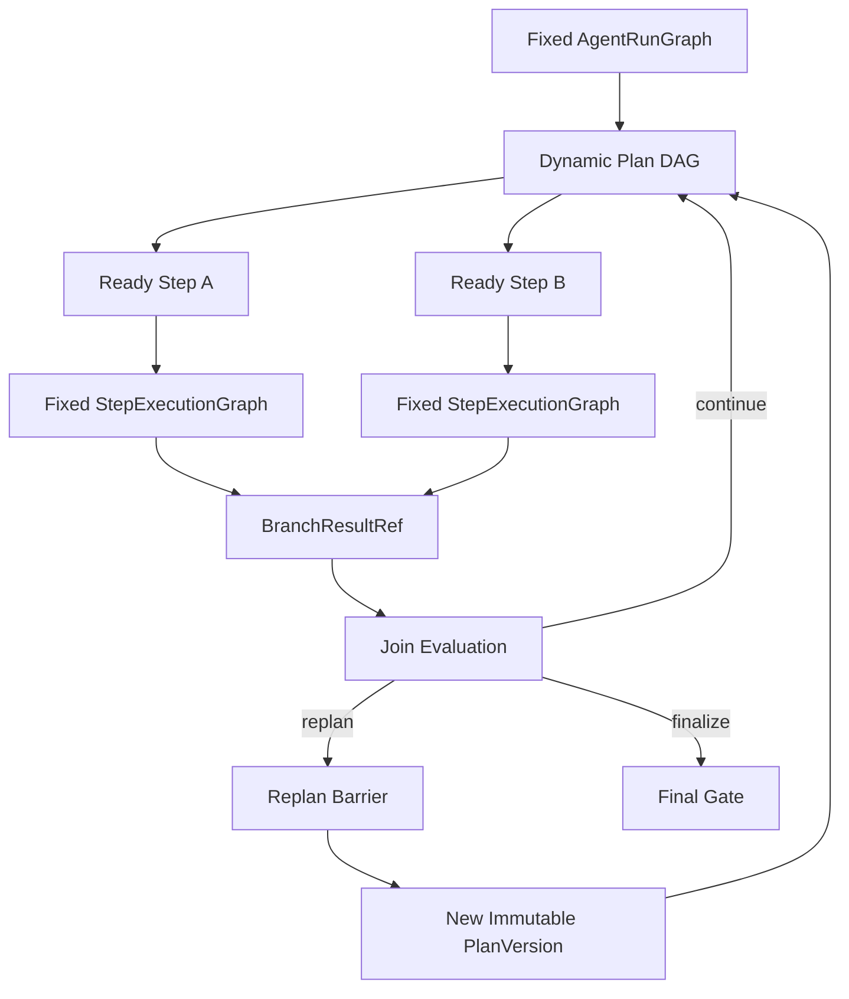

# 06 Agent Core / Planning & Control

updated: 2026-08-04
status: normative-target-module-architecture
architecture_generation: v2
module_number: 06
formal_path: `docs/modules/06-agent-core-planning-control.md`

> 本文是 Zuno 第 06 个逻辑模块——Agent Core / Planning & Control——的唯一正式 Target 架构主设计。
>
> Architecture v2 保持 **Single Controller**：一次 AgentRun 只有 Agent Core 拥有任务级控制权。Knowledge 的 Evidence Deliberation 是受治理的内层知识闭环，不是第二个自治 Controller。
>
> 本次只升级 Target 文档；不修改当前 Program、PHASE01–PHASE22、业务代码、Migration 或运行配置。

---

# Part I：定位、原则与 Ownership

## 1. 模块定位

Agent Core 是 Zuno 的任务级控制平面，负责把用户目标转化为可执行、可恢复、可并行、可审计的 Plan，并在执行过程中决定：

```text
接下来执行哪个 Step
哪些 Ready Step 可以并行
何时 Retry、Repair、Fallback 或 Replan
何时调用 Knowledge、Memory、Tool 或 Model
何时 Ask User 或等待 Approval
何时接受 Partial Evidence
何时安全拒答
何时进入 Final Gate
最终 RunOutcome 是什么
```

Agent Core 不直接执行底层检索、模型 Provider、数据库查询或 Tool Effect。它通过跨模块 Contract 进行调度，并消费 typed outcome。

## 2. 固定原则

1. 基于 LangGraph，采用 Single Controller。
2. 不默认建设产品级自治 Multi-Agent Runtime。
3. 所有任务都有 Plan：
   - 简单任务：Deterministic Single-Step Plan；
   - 复杂任务：Dynamic DAG Plan。
4. 不允许通过 `direct_answer` 绕过 Plan、Trace、Budget、AnswerPolicy 和 RunOutcome。
5. 总体结构：

```text
固定 AgentRunGraph
+ 动态 Plan DAG
+ 固定 StepExecutionGraph
```

6. Plan-and-Execute 管理目标、依赖和并行。
7. ReAct 管理单个 Step 内的 Action 与 Observation。
8. Reflection 负责质量判断和控制 Proposal。
9. Replan 在计划结构或假设失效时创建新 PlanVersion。
10. Reflexion 在 Run 结束后形成长期经验候选，但不能直接写入长期 Memory。
11. 模型只产生 Proposal；确定性代码拥有状态提交、安全门、预算、PlanVersion 激活和最终 Outcome。

## 3. Ownership

Agent Core owns：

```text
AgentRun
TaskGoal
TaskAnalysis
Plan
PlanVersion
PlanStep
DependencyGraph
StepRun
DispatchGroup
DispatchItem
JoinDecision
Budget Envelope
Retry / Repair / Replan Decision
AskUserDecision
Approval Wait State
Final Gate
RunOutcome
```

Agent Core 不 owns：

```text
Knowledge Evidence / Claim / Probe / Verdict
ModelInvocation / Provider Attempt
Memory Fact / ContextPack
Tool Effect / PreparedToolAction
Security Decision / Approval Fact
Trace / Eval Projection
Queue / Lease / Checkpointer physical primitive
```

---

# Part II：总体运行架构

## 4. 三层运行结构


```mermaid
flowchart TB
    A[Fixed AgentRunGraph] --> B[Dynamic Plan DAG]
    B --> C1[Ready Step A]
    B --> C2[Ready Step B]
    C1 --> D1[Fixed StepExecutionGraph]
    C2 --> D2[Fixed StepExecutionGraph]
    D1 --> E[BranchResultRef]
    D2 --> E
    E --> F[Join Evaluation]
    F -->|continue| B
    F -->|replan| G[Replan Barrier]
    G --> H[New Immutable PlanVersion]
    H --> B
    F -->|finalize| I[Final Gate]
```

### 4.1 AgentRunGraph

固定节点至少覆盖：

```text
validate_command
load_principal_and_policy
analyze_task
create_or_load_plan
activate_plan_version
dispatch_ready_steps
join_step_results
decide_retry_or_replan
prepare_final_synthesis
run_final_gate
persist_run_outcome
```

### 4.2 Dynamic Plan DAG

PlanVersion 激活后不可变。每个 Step 定义：

- goal；
- inputs；
- output contract；
- dependencies；
- capability requirements；
- resource claims；
- side-effect class；
- evidence requirement；
- budget；
- timeout；
- acceptance policy。

### 4.3 StepExecutionGraph

固定执行图：

```text
load_step
→ validate_inputs
→ resolve_capabilities
→ security_gate
→ budget_gate
→ execute ReAct / deterministic action
→ action_evaluation
→ step_acceptance
→ conditional_step_reflection
→ persist_step_result
```

Step 内允许 ReAct，但不能绕过 Step Contract、预算、最大 Action 数和 Tool 安全门。

---

# Part III：Plan、并行与 Join

## 5. Plan Contract

```yaml
PlanVersion:
  plan_version_id: string
  agent_run_id: string
  version_no: int
  parent_plan_version_ref: string | null
  trigger_reason: INITIAL | REPLAN
  task_goal_ref: string
  step_refs: [string]
  dependency_graph_hash: string
  policy_version_ref: string
  created_by_invocation_ref: string | null
  status: DRAFT | VALIDATED | ACTIVE | SUPERSEDED | REJECTED
  created_at: datetime
```

不变量：

- 同一 Run 同时只有一个 Active PlanVersion；
- Active 后不可修改；
- Replan 创建新版本，不改旧版本；
- 模型不能激活 PlanVersion；
- Plan 中所有 Step 必须由 Executor 能力覆盖；
- 巨大 Step 必须被拆解，Planner 不能超出 Executor 边界。

## 6. Ready Step

Step 只有在以下条件同时满足时进入 Ready：

- 所有依赖达到允许终态；
- 输入 Artifact / Evidence / Memory 引用可用；
- 资源冲突检查通过；
- 副作用串行规则通过；
- Budget Reservation 成功；
- Tenant quota 允许；
- Security Gate 允许；
- PlanVersion 仍为 Active；
- Run 未取消且 deadline 未到。

## 7. 默认最大化安全并行

允许并行：

- 无数据依赖；
- 读不同资源；
- 只读检索；
- 独立模型分析；
- 可幂等且无资源冲突的动作。

默认串行：

- 数据依赖；
- 写同一资源；
- 不可逆副作用；
- 排他资源；
- Replan；
- Final Synthesis；
- Security / Approval 要求串行的动作。

动态并行使用：

```text
LangGraph Send
DispatchGroup
DispatchItem
StepRun
BranchResultRef
幂等 Reducer
JoinPolicy
```

## 8. Reducer 与 Join

Reducer 不简单拼接结果。必须：

- 根据 Branch ID、PlanVersion、StepRun generation 去重；
- 拒绝旧 PlanVersion 的 late result；
- 保留冲突结果；
- 验证 Artifact / Evidence / Effect Receipt；
- 不让重试分支重复计入成功数。

JoinPolicy：

```text
ALL_SUCCESS
QUORUM
BEST_EFFORT
FIRST_SUCCESS
CUSTOM
```

Join Evaluation 决定：

- 接受；
- Retry 某分支；
- Partial；
- Join Reflection；
- Replan；
- Fail。

---

# Part IV：Plan-and-Execute、ReAct、Reflection、Replan、Reflexion

## 9. Plan-and-Execute

负责全局任务结构。Planner 输入至少包括：

- TaskGoal；
- Authorized Capability；
- Knowledge / Tool / Memory 能力边界；
- Executor 能力；
- Budget；
- deadline；
- side-effect policy；
- AnswerPolicy。

Planner 输出 Proposal，确定性 Validator 检查依赖环、不可执行 Step、预算、权限和副作用。

## 10. ReAct

ReAct 位于单个 Step 内：

```text
Decision
→ Action Proposal
→ Deterministic Validation
→ Execute
→ Observation
→ Action Evaluation
→ Continue / Accept / Fail
```

ReAct 不是整个 AgentRun 的唯一控制结构。它不得自行创建 Plan Step、扩大目标或无限循环。

循环控制：

- max_actions；
- repeated action signature；
- no-progress counter；
- budget；
- deadline；
- repeated failure；
- Tool Effect risk。

## 11. Reflection

质量控制分为：

```text
Action Evaluation
Step Acceptance
Step Reflection
Join Evaluation
Join Reflection
Final Gate
Final Reflection
```

规则：

- 每个 Action 都 Evaluation；
- 每个 Step 都 Acceptance；
- 不是每个 Step 都调用模型 Reflection；
- Acceptance 失败、Evidence 冲突、关键决策、重复失败或高风险时触发 Step Reflection；
- 并行结果部分失败或冲突时触发 Join Reflection；
- 简单任务默认确定性 Final Gate；
- 复杂任务和 Strict Grounded Answer 使用模型级 Final Reflection。

Reflection 只返回控制 Proposal，不能直接修改 Step、Plan 或领域事实。

## 12. Retry、Repair、Fallback 与 Replan

| 机制 | 含义 | 是否新建 PlanVersion |
| --- | --- | --- |
| Retry | 计划仍正确，执行临时失败 | 否 |
| Repair | 参数、格式或局部输入可修复 | 否 |
| Fallback | 同能力执行路径或模型切换 | 否 |
| Knowledge Probe | Evidence Gap 可由知识内层动作补足 | 否 |
| Replan | 计划结构、依赖或假设失效 | 是 |

Replan 触发：

- Step 输出 Contract 不再可满足；
- 必要 Capability 不存在；
- 用户目标澄清改变任务；
- Knowledge 返回 `REPLAN_REQUIRED`；
- Tool Effect 改变后续依赖；
- 关键假设被 Evidence 推翻；
- 预算结构需要重新分配，而不是简单缩减。

## 13. Replan Barrier

并行执行中不得直接激活新 PlanVersion。

```text
Replan Proposal
→ stop admitting old-plan work
→ cancel or drain active branches by policy
→ reconcile unknown effects
→ persist branch outcomes
→ enter Replan Barrier
→ create and validate new PlanVersion
→ atomically activate
→ dispatch new Ready Set
```

旧 PlanVersion 的 late result 只能作为审计事实，不得写入新 Plan 的 Reducer。

## 14. Reflexion

Run 结束后可形成 `ReflexionCandidate`：

- 有用策略；
- 失败模式；
- 用户稳定偏好；
- Tool 使用经验；
- 检索经验。

候选必须进入 Module 05 Governance：去重、冲突检查、敏感性、过期策略和用户授权。模型不能直接写长期 Memory。

---

# Part V：与 Evidence-Driven Agentic GraphRAG 的边界

## 15. Agent Core 输入 Knowledge 的 Contract

```yaml
KnowledgeQueryRequest:
  request_id: string
  agent_run_id: string
  plan_version_id: string
  step_run_id: string
  task_goal_ref: string
  evidence_goal_ref: string
  answer_policy_ref: string
  authorized_scope_ref: string
  knowledge_snapshot_refs: [string]
  profile: STANDARD | DEEP
  budget_ref: string
  deadline_at: datetime
  idempotency_key: string
```

Agent Core owns：

- 为什么需要 Knowledge；
- 当前 Step 需要什么 Evidence；
- 允许的 Profile；
- 总预算、deadline 和 AnswerPolicy；
- 是否继续任务、Ask User、Replan、Partial、Abstain 或 Finalize。

Knowledge owns：

- Initial Collection Plan；
- 内部 Route、Round、Fusion、Assessment；
- Evidence Reasoning Graph；
- ClaimEvidenceState；
- Targeted Probe；
- Knowledge-side Stop Proposal。

## 16. Knowledge 输出

```yaml
KnowledgeRetrievalOutcome:
  outcome_id: string
  request_ref: string
  selected_evidence_bundle_ref: string | null
  evidence_set_verdict_ref: string
  insufficient_evidence_outcome_ref: string | null
  knowledge_health_signal_refs: [string]
  recommended_control: ACCEPT | TARGETED_PROBE_COMPLETED | ASK_USER | EXTERNAL_EVIDENCE | REPLAN | PARTIAL_ANSWER | ABSTAIN
  budget_usage_ref: string
  trace_ref: string
```

Agent Core 不盲从 `recommended_control`。它结合 Plan、其他 Step、预算、安全和用户目标做最终决定。

## 17. Outcome 映射

| Knowledge 状态 | Agent Core 可选动作 |
| --- | --- |
| SUFFICIENT_EVIDENCE | 接受并继续 Synthesis / Final Gate |
| PARTIAL_EVIDENCE | Partial Answer、继续其他 Step、Ask User |
| CONFLICTING_EVIDENCE | Join Reflection、披露冲突、Ask User、Replan |
| NO_SUITABLE_EVIDENCE | Ask User、External Evidence Proposal、Abstain |
| AUTHORIZED_EVIDENCE_UNAVAILABLE | 不扩大权限；提示权限限制或请求重新授权 |
| KNOWLEDGE_QUALITY_SUSPECTED | 标记 Degraded，创建诊断/运维 Signal，不直接宣布故障 |

Knowledge 不发布最终答案。

---

# Part VI：预算、安全、副作用与恢复

## 18. Budget

Agent Core owns Task Budget。每个 Step 和分支先 Reservation：

```text
estimate
→ reserve
→ admit
→ settle actual
→ release unused
```

预算维度：

- model tokens / cost；
- retrieval rounds；
- Tool attempts；
- latency；
- parallelism；
- memory/context size。

任何模块不得自行提高预算。预算不足时可 Partial、Ask User、Abstain 或 Replan。

## 19. Security

Agent Core 每次执行前必须消费有效：

- Principal Context；
- Authorization Decision；
- Security Epoch；
- Capability Grant；
- Disclosure Policy；
- Tool Approval（需要时）。

Plan 激活时的授权不构成永久授权。Security Epoch 变化后，新 Action 和 Result Commit 必须重新检查。

## 20. Tool 副作用

```text
ActionProposal
→ Canonical Args
→ Security Gate
→ Approval
→ Idempotency
→ Execute
→ Effect SUCCESS / FAILURE / UNKNOWN
→ Reconciliation / Compensation
```

Tool timeout 对副作用动作不是普通失败。`UNKNOWN` 必须进入 Reconciliation，不能盲目 Retry。

Agent Core 只根据 PreparedToolAction 和 EffectReceipt 推进 Plan，不直接相信模型文字。

## 21. Checkpointer 与 PostgreSQL

```text
PostgreSQL
    AgentRun、PlanVersion、StepRun、Dispatch、Approval、Effect、Outcome 等领域事实

LangGraph Checkpointer
    图执行位置、pending writes、interrupt、轻量控制引用
```

恢复时：

- 领域事实优先；
- Node 先查询是否已提交；
- 已完成 Step 不重复执行；
- Checkpoint 领先而领域事实缺失时回到 Commit / Reconcile；
- 领域终态存在而图未结束时清理控制状态；
- Interrupt 前动作必须幂等。

## 22. Cancellation 与 Deadline

Cancel / deadline 传播到：

- Active Step；
- Knowledge Round；
- ModelInvocation；
- Tool Attempt；
- Queue Worker。

不可取消的副作用完成后仍需记录 Effect。取消不是删除历史事实。

---

# Part VII：状态、Contract 与测试

## 23. AgentRun 状态

```text
CREATED
→ VALIDATING
→ ANALYZING
→ PLANNING
→ RUNNING
→ WAITING_INPUT | WAITING_APPROVAL | REPLANNING
→ FINALIZING
→ SUCCEEDED | PARTIAL | ABSTAINED | FAILED | CANCELLED
```

`FAILED`、`PARTIAL`、`ABSTAINED` 必须区分。

## 24. StepRun 状态

```text
PENDING
→ READY
→ DISPATCHED
→ RUNNING
→ ACCEPTANCE_PENDING
→ SUCCEEDED | RETRYABLE_FAILED | FAILED | PARTIAL | CANCELLED | UNKNOWN_EFFECT
```

## 25. Idempotency

关键键：

```text
Command：tenant + client_request_id
PlanVersion：run + version_no
StepRun：plan_version + step + attempt_no
DispatchItem：dispatch_group + item_key
Tool Action：tool_version + canonical_args_hash + target + run scope
Knowledge Request：run + plan_version + step_run + evidence_goal_hash
```

## 26. Trace

至少发出：

```text
agent_run_created
plan_version_proposed/validated/activated
step_became_ready
step_dispatched
step_action_started/completed
step_acceptance_recorded
step_reflection_triggered
join_evaluated
replan_proposed
replan_barrier_entered
plan_version_superseded
final_gate_started/completed
run_outcome_committed
```

## 27. 测试要求

必须覆盖：

- Deterministic Single-Step Plan；
- Dynamic DAG；
- 并行 Ready Step；
- Resource conflict 串行；
- Reducer 去重；
- Join partial failure；
- Retry 与 Replan 分离；
- Replan Barrier；
- late old-plan result；
- Knowledge sufficient / partial / conflict / no evidence；
- Approval Interrupt / Resume；
- Tool UNKNOWN Effect；
- Security Epoch 变化；
- Checkpoint 与 PostgreSQL 偏差；
- Worker crash；
- Budget exhaustion；
- Cancellation；
- Final Gate；
- ReflexionCandidate Governance。

## 28. Current、Target、Future 与完成证据

### Current

以代码、Migration、测试、Trace 和状态文档为准。本文中的类名、状态和流程不自动证明实现存在。

### Target v2

Single Controller 与 Evidence-Driven Knowledge 内层闭环清晰分层；PlanVersion 不可变；Retry、Probe、Replan 分离；并行、恢复、安全和最终 Outcome 均可审计。

### Future

可研究更复杂的团队协同和长期任务，但不默认引入自治 Multi-Agent Runtime。

### Target 变为 Current 的证据

```text
代码与 Migration
Graph 定义和 Checkpointer 接入
单元、集成、E2E、Fault Injection
Trace
固定 Eval
Budget 与安全验证
恢复演练
文档与镜像同步
```

在证据不足时只能声明 `design available` 或 `implementation available`，不能声明 quality proven / production ready。
