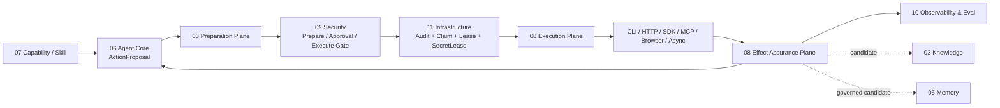

# 08 Tool Runtime

updated: 2026-07-14
status: normative-target-module-architecture
module_number: 08
formal_path: `docs/modules/08-tool-runtime.md`
agent_mirror: `.agent/modules/08-tool-runtime.md`

> 本文是 Zuno 第 08 个逻辑模块——Tool Runtime——唯一的正式 Target 架构主设计。
>
> 本文定义统一工具执行平面、领域对象、状态机、效果保证、CLI / HTTP / OpenAPI / SDK / MCP / Browser / Async Job Adapter Contract、跨模块边界、目标代码与数据库规格、测试和完成证据。Current、Gap、Measurement 与生产状态仍由 `docs/status/production-readiness.md` 维护；实现、Migration、回填、切流和旁路收口必须进入 `.agent/programs/`。

## 0. 文档边界、优先级与状态

本文统一承载：

```text
问题与目标
Tool Runtime 的负责和不负责范围
Capability、Skill、Tool、API、SDK 与 MCP 的边界
完整执行主链路
PreparedToolAction、ToolAttempt、ToolObservation
ToolExecutionReceipt、EffectReceipt、EffectReconciliation
CLI / HTTP / OpenAPI / SDK / MCP / Browser / Async Job Adapter
审批、Secret、Sandbox、输出治理和安全协作
幂等、Retry、Reconciliation、Cancellation 与 Compensation
并行、资源冲突、容量、生命周期和运维
目标代码、PostgreSQL、Event、Envelope 和 Migration 边界
Current、Target、Gap、Future
Requirement、测试与完成证据
```

文档边界：

```text
docs/modules/08-tool-runtime.md
    唯一正式 Tool Runtime Target 架构事实源。

.agent/modules/08-tool-runtime.md
    与正式文档字节级一致的 Agent 镜像，不是第二事实源。

docs/decisions/0003-wave1-cross-module-contract-freeze.md
    Wave 1 共享 Owner、Envelope、Receipt、Security Epoch 与恢复边界。

docs/governance/wave1-cross-module-contract-registry.md
    已冻结共享 Contract Registry。

.agent/programs/
    Current → Target 的代码实现、Migration、切流和旁路收口计划。

docs/status/production-readiness.md
    Current、Gap、Measurement Blocked 和完成状态。
```

规范优先级：

```text
全局架构原则
→ ADR 0003 与 Wave 1 Contract Registry
→ 本模块唯一 Target 文档
→ 其他领域 Owner 的正式 Target Contract
→ 已确认 Program
→ 代码与 Migration
```

本文完成后可以声明：

```text
design available
internally consistent
contract-complete
implementation-spec-complete
program-ready
```

本文不能证明：

```text
implementation available
runtime migration complete
quality proven
production ready
```

---

# Part I：定位、术语与边界

## 1. 为什么需要独立 Tool Runtime

企业 Agent 的 Tool 不只是一个 Python 函数。一次工具动作可能跨越模型 Tool Call、审批等待、Secret 租约、远端 API、MCP Session、CLI 子进程、异步 Job、Webhook、网络超时和服务重启。如果任意 Agent、LangChain Tool、MCPManager、SDK 或 Adapter 可以直接执行，会产生：

```text
模型看到 Tool 就等于有权执行
HTTP 2xx 被误认为业务效果成功
Timeout 后盲目重试并产生重复副作用
Queue ACK 或 Worker 完成被误认为外部效果完成
Approval 只绑定 Tool 名称而未绑定参数和目标资源
SDK 隐藏 Retry 导致一次 Attempt 实际多次 Dispatch
CLI 继承宿主环境变量并在宿主进程直接执行
MCP Server 修改 Schema 后旧审批仍被复用
Tool Result 中的 Prompt Injection 直接进入模型或 Memory
Agent Checkpoint 恢复时重新执行已经发生的副作用
多个旧执行入口绕过统一 Security、Audit 和 Idempotency
```

一句话定义：

> Tool Runtime 是 Zuno 唯一的受治理工具效果执行平面。它把 Agent Core 的 `ActionProposal` 转换为不可变 `PreparedToolAction`，协调 Security、Audit、Idempotency、Lease、Secret 和 Adapter 执行，并产生可恢复、可审计的 `ToolAttempt`、`ToolObservation`、`ToolExecutionReceipt`、`EffectReceipt` 或 `EffectReconciliation`。

## 2. 统一判断标准

一个调用进入 Tool Runtime，不是因为它“底层使用 HTTP”，而是因为它同时符合以下特征之一：

```text
被 Agent / Skill 作为 Tool 动作选择
需要 ToolVersion、参数规范化和 Adapter 绑定
需要执行权限、凭据、网络或 Sandbox 治理
需要 Attempt、Timeout、Cancellation 或异步状态
需要 Observation、Effect Receipt 或 Reconciliation
```

Tool Runtime 不是万能 Integration Bus。模块内部的普通函数调用、Repository 调用和专业领域 Runtime 不因使用 HTTP 或 SDK 而自动变成 Tool。

## 3. 支持的工具类型

```text
BUILTIN_TOOL       可信内置工具
LOCAL_FUNCTION     受控本地函数
CLI_PROCESS        CLI、脚本、编译器和本地进程
HTTP_API           手工定义 HTTP API
OPENAPI            OpenAPI 3.x 导入操作
PROVIDER_SDK       GitHub、Slack、Google、AWS 等 SDK
MCP_TOOL           MCP Server 暴露的 Tool
BROWSER            Playwright / Browser Automation
FILE_ARTIFACT      文件和 Artifact 操作
CODE_EXECUTION     受限代码执行器
ASYNC_JOB          远端构建、导出、扫描、转码
WEBHOOK_CALLBACK   外部回调和任务完成通知
REMOTE_MANAGED     受托管执行服务
```

外部动作既包括读取，也包括写入。只读工具仍需身份、Deadline、Credential、Network、Output Validation 和 Trace；有副作用工具额外需要 Effect Assurance。

## 4. Capability、Skill、Tool、API、SDK 和 MCP

```text
Function Calling
    模型表达结构化调用意图的协议。

Capability
    系统能做什么、适用条件、成本、风险和 Planner 投影。

Skill
    使用一组 Capability 完成任务的 SOP、模板和验收方法。

Tool
    一个可被准备和执行的具体操作。

API
    Tool Adapter 可能使用的远端协议表面。

SDK
    Tool Adapter 的 Provider 实现方式，不是新的领域 Owner。

MCP
    跨模块工具、资源、Prompt、Sampling 和 Elicitation 协议；只有 MCP Tool 的具体执行归 08。
```

固定 Ownership：

```text
07 Capability / Skill
    CapabilityDefinition
    SkillDefinition
    ToolCapabilityDescriptor
    发现、目录、路由、allowed_tools 和 Planner 投影

08 Tool Runtime
    ToolProviderDefinition
    ToolDefinition
    ToolVersion
    ToolOperation
    ToolInstallation / Activation
    PreparedToolAction
    ToolAttempt / ToolObservation
    ToolExecutionReceipt
    EffectReceipt / EffectReconciliation
    Adapter Binding / Conformance

09 Security
    Tool Exposure / Prepare / Execute Authorization
    SecurityApprovalDecision
    EffectiveSecurityEpoch
    Secret Access 语义

11 Infrastructure
    事务、Outbox / Inbox、Queue、Lease、Fencing
    IdempotencyClaim、Clock、Object、SecretLease 物理交付
```

## 5. 负责范围

Tool Runtime 负责：

```text
权威 ToolDefinition、ToolVersion、ToolOperation
Tool Provider、Installation、Activation 与 Adapter Binding
把 ActionProposal 准备为 PreparedToolAction
输入 Schema、Canonicalization 和 TargetResourceSet
Effect、Reversibility、Idempotency 和 Impact 分类
执行前 Contract 完整性验证
统一 Tool Invocation Gateway
CLI / API / OpenAPI / SDK / MCP / Browser / Async Adapter
每次真实 Dispatch 的 ToolAttempt
原生结果保存与 ToolObservation
所有工具的 ToolExecutionReceipt
副作用工具的 EffectReceipt / EffectReconciliation
Cancellation、Compensation 和 ManualEffectAssessment
Adapter Conformance、Health、Canary、Drain、Quarantine
Tool Runtime source event 与运行证据
旁路清单、Boundary Guard 和迁移收口要求
```

## 6. 不负责范围

Tool Runtime 不负责：

```text
Plan、Step、Retry / Replan / Wait / Abort 决策
Capability 和 Skill 的 Planner 路由
最终 Authorization、Approval 或 Security Epoch
Queue、Lease、Fencing、事务和 Secret Store 的物理实现
LLM、Embedding、Rerank、Vision、Transcription 或 Judge 调用
企业知识库 Retrieval、GraphRAG、Evidence 和 Citation
MemoryVersion、ContextPack 和长期 Memory 写入
Product UI、Approval 页面和用户交互
Trace / Metric / Eval / Release Gate 投影
把 Tool Result 自动认定为 Agent Step 成功
```

专业领域运行时保持独立：

```text
Model Provider Execution     → 04 Model Gateway
Knowledge / GraphRAG         → 03 Knowledge
Memory / Context             → 05 Memory & Context
Plan / Control               → 06 Agent Core
```

## 7. Cross-module Ownership

| 模块 | Canonical facts | Tool Runtime 关系 |
| --- | --- | --- |
| 01 Product Surface | ToolActionPreview、用户操作、Projection、Channel Delivery | 提供授权后的 Prepared/Attempt/Effect 只读投影，不接受前端伪造终态 |
| 03 Knowledge | Evidence、SourceSpan、Citation、KnowledgeSnapshot | Tool 返回资源可作为候选输入，但需 Knowledge 接受后才是 Evidence |
| 04 Model Gateway | ModelCall、ModelAttempt、Usage、Routing | MCP Sampling 必须经 04；SDK 是模型 SDK 时不得经 08 |
| 05 Memory & Context | MemoryCandidate、MemoryVersion、ContextPack | Tool 输出不得自动进入长期 Memory |
| 06 Agent Core | ActionProposal、ActionExecutionBinding、ControlDecision | 08 消费 Proposal，返回执行和效果事实；06 决定下一步 |
| 07 Capability / Skill | Capability、Skill、ToolCapabilityDescriptor | 07 发布可选能力；08 保存权威可执行定义 |
| 08 Tool Runtime | PreparedToolAction、Attempt、Observation、Effect | Canonical Owner |
| 09 Security | Authorization、Approval、Epoch、Classification、Redaction | 08 只能消费 Security Decision，不自行授权 |
| 10 Observability & Eval | Telemetry、AuditEvent、Projection、Eval | 08 产生源事实和 Envelope，10 接受、投影和评估 |
| 11 Infrastructure | Claim、Transaction、Queue、Lease、Fencing、Object、SecretLease | 08 使用 Primitive，不把基础设施 Receipt 当业务 Effect |

固定不等价关系：

```text
Security ALLOW != Tool Effect success
Approval != Dispatch
Audit COMMITTED != Tool Effect success
Idempotency Claim acquired != Provider effect success
Queue ACK != Tool Effect success
Worker completed != Tool Effect success
HTTP 2xx != EffectReceipt
ToolExecutionReceipt != Agent Step accepted
Checkpoint commit != external effect commit
```

## 8. 逻辑架构



内部划分：

```text
Control Plane
    Tool definitions, versions, installations, activation, adapter conformance

Preparation Plane
    resolution, schema validation, canonicalization, target resources, effect profile

Execution Plane
    gate verification, dispatch binding, attempt, timeout, cancellation

Effect Assurance Plane
    observation, execution receipt, effect receipt, reconciliation, compensation

Operations Plane
    health, quota, capacity, circuit, canary, drain, retention, quarantine
```

---

# Part II：完整执行流程

## 9. 唯一 Tool Invocation Boundary

所有正式 Tool 调用必须进入：

```text
ToolInvocationGateway
```

Canonical 主路径：

```text
Model Tool Call / Skill Action
→ Agent Core ActionProposal
→ ToolInvocationGateway.prepare
→ PreparedToolAction
→ Security Prepare Gate
→ optional Approval Interrupt
→ Security Execute Gate + latest Epoch recheck
→ Mandatory Audit durable commit（按要求）
→ Infrastructure IdempotencyClaim
→ Capacity / Queue / Lease / Fencing / SecretLease
→ ToolAttempt
→ Adapter Dispatch
→ NativeToolResult
→ ToolObservation + ToolExecutionReceipt
→ EffectReceipt or EffectReconciliation（有副作用时）
→ Agent Core ActionExecutionBinding
→ ControlDecision
```

禁止旁路：

```text
Model → LangChain handler → Provider
MCPManager → tool.coroutine
Agent → adapter.execute
Agent → httpx / SDK / subprocess
UI → Provider
Checkpoint replay → historical effect reexecution
```

LangChain `BaseTool`、OpenAI Tool schema 或 MCP Tool wrapper 只能是意图代理；真正执行必须委托 ToolInvocationGateway。

## 10. Prepare 阶段

输入：`ActionProposal`。

步骤：

```text
1. 解析 ToolCapabilityDescriptor 到确定 ToolDefinition / ToolVersion / Operation
2. 校验 Installation、Activation 和 Tenant / Workspace 可用性
3. 校验 Input JSON Schema
4. 按 CanonicalizationProfile 规范化参数
5. 解析 TargetResourceSet 和访问模式
6. 计算 EffectProfile
7. 选择允许的 AdapterCompatibilityClass
8. 绑定 Credential Scope、Network、Sandbox 和 Deadline 要求
9. 绑定 Policy Snapshot 与 EffectiveSecurityEpoch
10. 计算 canonical_args_hash、target_resource_refs_hash 和 prepared_action_hash
11. 持久化不可变 PreparedToolAction
```

Prepare 不执行 Tool，不取得 Secret Material，也不自行批准。

## 11. 只读同步工具

```text
PreparedToolAction
→ Security Prepare / Execute Gate
→ Audit（按 Policy）
→ 可选 Idempotency Claim
→ ToolAttempt
→ Adapter Dispatch
→ Output Schema / Safety / Classification
→ ToolObservation
→ ToolExecutionReceipt
→ Agent NormalizedObservation
```

只读动作通常不产生 `EffectReceipt`。若 Provider 的“读取”本身会产生审计记录、计费、游标推进或临时资源，应按真实语义提高 EffectProfile。

## 12. 需要审批的副作用

```text
PreparedToolAction(PREPARED)
→ Security Prepare Gate
→ APPROVAL_REQUIRED
→ Agent Core 创建 APPROVAL Interrupt
→ Product 展示 ToolActionPreview
→ SecurityApprovalDecision
→ 同一 Run Resume
→ 验证 prepared_action_hash / scope / nonce / expiry
→ 最新 Epoch Execute Gate
→ Mandatory Audit COMMITTED
→ Idempotency Claim
→ ToolAttempt
→ Dispatch
→ EffectReceipt / Reconciliation
```

Approval 必须绑定具体动作，不得只绑定 Tool 名称：

```text
prepared_tool_action_id
prepared_action_hash
tenant / workspace / principal
tool definition + version + operation
canonical_args_hash
target_resource_refs_hash
side_effect_class
credential_scope
policy_snapshot
security_epoch_hash
expires_at
nonce
consumption_mode
```

任一绑定输入改变，原 Approval 失效，动作变为 `OBSOLETE`。

## 13. CLI / 本地进程

```text
PreparedToolAction
→ executable digest / package identity
→ SandboxProfile resolution
→ mount / cwd / env allowlist
→ resource and network limits
→ process group dispatch
→ stdout / stderr / artifact capture
→ process tree termination on timeout
→ output validation
→ local file / resource effect verification
```

CLI Adapter 必须：

```text
不继承完整宿主环境
不允许任意 host cwd
不把 Secret 写入命令行、日志或 Trace
限制 CPU、Memory、PID、Disk、File Count 和 Output Size
按进程组终止子孙进程
限制网络、文件系统、设备和系统调用
记录 executable / image digest
验证生成 Artifact 的 hash、scope 和 ownership
```

MCP `stdio` Server 的发现和调用同样属于代码执行，必须经过 Sandbox 和 Security，而不是无害元数据读取。

## 14. HTTP API / OpenAPI

```text
ToolVersion Operation
→ frozen endpoint profile
→ path / query / body mapping
→ SecretLease injection
→ DNS resolution and IP classification
→ TLS / mTLS / proxy policy
→ redirect revalidation
→ Provider request
→ response size / content type limit
→ schema and business result mapping
→ effect verification
```

必须防止：

```text
SSRF
localhost / loopback
link-local metadata endpoint
private network escape
DNS rebinding
redirect to disallowed address
unexpected scheme or port
credential leakage in URL
unbounded response
OpenAPI operationId collision
```

Connectivity Test 是受治理动作。没有显式无副作用 Health Operation 时，只能验证 Schema、DNS、TLS、Endpoint 和 CredentialRef，不得随意执行第一个 POST / DELETE Operation。

## 15. Provider SDK

SDK Adapter 必须固定：

```text
SDK package / version
Provider API version
endpoint and region
credential scope
retry configuration
connect / request / overall timeout
pagination behavior
request / operation id extraction
idempotency key injection
exception mapping
cancellation and status-query support
```

禁止隐藏副作用 Retry。一次真实 Provider Dispatch 必须可以映射到一个 `ToolAttempt`；若 SDK 不允许观察内部重试，Adapter 只能声明较低保证等级或被隔离到只读操作。

## 16. MCP Tool

MCP 是跨模块协议，不是 08 单模块私有 Runtime。

```text
07 owns
    MCP Provider discovery
    capability catalog and Planner projection

08 owns
    MCP Tool binding and execution
    ToolAttempt / Observation / Effect

04 owns
    MCP Sampling 触发的 Model Call

01 + 06 own
    MCP Elicitation interaction and Interrupt

09 owns
    MCP trust, authorization, consent and credential semantics

11 owns
    transport, process, network, session persistence primitives
```

MCP Tool 执行流程：

```text
McpCapabilitySnapshot
→ McpToolBinding
→ PreparedToolAction binds snapshot hash and input schema hash
→ Security / Approval / Audit / Claim
→ McpSession
→ tools/call or task-augmented call
→ protocol result / task / progress
→ output schema validation
→ McpNativeResult
→ ToolObservation / Receipt / Reconciliation
```

MCP 必须支持或明确拒绝：

```text
protocol version negotiation
capability negotiation
tools/list pagination
tools/list_changed
inputSchema / outputSchema
structuredContent
text / image / audio / resource_link / embedded_resource
taskSupport = forbidden / optional / required
progress
cancellation
Streamable HTTP session resume
message redelivery dedup
stdio process lifecycle
```

Server `description`、`instructions` 和 Tool annotations 默认不可信。本地 `EffectProfile`、Risk、Credential、Network 和 Approval Policy 才是权威。

Tool list 或 Schema 改变时：

```text
new McpCapabilitySnapshot
→ compare schema / behavior hash
→ affected ToolVersion DEPRECATED or QUARANTINED
→ unexecuted PreparedToolAction OBSOLETE
→ pending Approval invalidated
```

MCP Resource 由 08 证明“Server 返回了什么”，只有经过 Security 和 Knowledge 接受后才成为 Evidence。MCP Sampling 必须进入 Model Gateway；MCP Elicitation 不能冒充 Security Approval。

## 17. Browser / Computer Use

Browser Adapter 需要专有对象：

```text
BrowserSession
BrowserOrigin
NavigationObservation
FormSubmissionPreview
DownloadArtifactRef
BrowserActionReceipt
```

关键规则：

```text
navigate / read 与 submit / publish 分离
跨 Origin 跳转重新检查 Network 与 Credential Scope
下载文件先进入隔离 Object / Malware / Classification 流程
密码、Token 和支付数据不能进入模型可见 Tool args
点击返回成功不等于业务 Effect 成功
不可逆提交必须有 Preview 和 Approval
```

## 18. 异步 Job、Streaming 和 Callback

```text
ToolAttempt
→ Provider accepts job
→ ProviderJobBinding
→ ToolExecutionReceipt(ACCEPTED)
→ ProgressObservation / PollAttempt / Callback
→ Provider terminal
→ output verification
→ final ToolExecutionReceipt
→ EffectReceipt or Reconciliation
```

必须区分：

```text
Provider accepted != job completed
job completed != output valid
output stored != business effect published
callback received != callback authentic
```

Callback 必须验证签名、Audience、Nonce、Timestamp、Replay Key 和 Job Binding。

## 19. Cancellation

```text
Agent Core Cancellation Intent
→ Tool Runtime validates current attempt
→ Provider cancellation request
→ CancellationReceipt
→ continue effect reconciliation when necessary
```

状态：

```text
NOT_REQUESTED
REQUESTED
PROVIDER_ACCEPTED
CONFIRMED
TOO_LATE
UNCONFIRMED
FAILED
```

`CANCEL_REQUESTED`、客户端断线或 Worker 终止均不代表外部执行停止。

## 20. UNKNOWN Effect 与 Reconciliation

当 Dispatch 后无法确定外部效果：

```text
ToolAttempt UNKNOWN
→ EffectReconciliation PENDING
→ query provider idempotency key
→ query provider operation id
→ query target resource state / version / hash
→ consume authenticated callback
→ compare before / after state
→ manual assessment when automation exhausted
```

结论：

```text
CONFIRMED_EXECUTED
CONFIRMED_NOT_EXECUTED
PARTIAL
UNRESOLVED
ESCALATED
```

只有 `CONFIRMED_NOT_EXECUTED` 才允许 Agent Core考虑重新执行同一副作用。Reconciliation 必须在 AgentRun 已结束或服务重启后继续运行。

## 21. Compensation

Compensation 是新的受治理副作用，不是隐藏式数据库回滚：

```text
new ActionProposal
→ new PreparedToolAction
→ Security / Approval / Audit / Claim
→ CompensationAttempt
→ EffectReceipt / Reconciliation
```

能力枚举：

```text
NON_COMPENSATABLE
MANUAL_COMPENSATION
BEST_EFFORT_COMPENSATION
AUTOMATIC_COMPENSATION
```

发送邮件通常不可撤回；其补偿可能是发送更正邮件。删除远端资源的补偿也可能无法完全恢复外部可见影响。

## 22. 并行与资源冲突

Agent Core 决定 Ready Step 是否并行；Tool Runtime提供确定性冲突输入：

```text
TargetResourceSet
AccessMode = READ / APPEND / WRITE / DELETE / ADMIN
ConflictKey
ExpectedVersion
Commutativity
EffectKind
Reversibility
```

默认串行：

```text
写同一资源
不可逆副作用
排他 Credential / Session
同一浏览器交互 Session
Reconciliation / Compensation
Replan Barrier 后的旧 PlanVersion
```

Infrastructure 提供 Lock、Lease、CAS 和 Fencing；Tool Runtime 不自建第二套物理锁系统。

---

# Part III：领域对象与 Contract

## 23. ToolProviderDefinition

```text
tool_provider_definition_id
provider_kind
canonical_name
owner
trust_class
supported_adapter_kinds
residency_profile
lifecycle_status
created_at
retired_at
```

Provider 是 GitHub、飞书、某个 MCP Server 类型、本地 CLI 包或 Browser Runtime 等稳定来源，不等于某个 Tenant 已安装实例。

## 24. ToolDefinition、ToolVersion 与 ToolOperation

```text
ToolDefinition
    tool_definition_id
    canonical_name
    provider_definition_ref
    owner
    description
    lifecycle_status

ToolVersion
    tool_definition_ref
    tool_version
    input_schema_ref / hash
    output_schema_ref / hash
    operation_refs
    effect_profile_ref
    credential_requirement
    network_requirement
    sandbox_requirement
    idempotency_capability
    reconciliation_policy_ref
    compensation_policy_ref
    adapter_compatibility_class
    max_execution_deadline
    release_status

ToolOperation
    tool_operation_id
    tool_version_ref
    operation_name
    operation_contract_hash
    target_resource_resolver_ref
    result_contract_ref
```

`ToolVersion` 激活后不可变。以下变化必须产生新版本：

```text
Schema
Operation 语义
Effect / Risk
Credential / Network / Residency
Idempotency / Reconciliation
Adapter Compatibility
Compensation
```

## 25. Installation、Activation 与 Capability Projection

```text
ToolInstallation
    tenant / workspace 安装和配置边界

ToolActivation
    哪个 ToolVersion 当前允许新 Prepare

ToolCapabilityDescriptor
    07 拥有的 Planner-facing 只读投影
```

必须区分：

```text
Definition exists
!= installed
!= activated
!= exposed to model
!= authorized for principal
!= healthy
```

## 26. ToolAdapterBinding 与 Conformance

```text
ToolAdapterBinding
    adapter_binding_id
    tool_version_ref
    adapter_kind
    adapter_version
    compatibility_class
    endpoint_profile_ref
    conformance_profile_ref
    status

AdapterConformanceProfile
    supports_native_idempotency
    supports_status_query
    supports_async_job
    supports_progress
    supports_cancellation
    supports_compensation
    supports_streaming
    supports_callback
    supports_structured_output
    supports_multimodal_output
    supports_sandbox
    hidden_retry_visibility
    verified_at
    invalidated_at
```

SDK、API、Schema、Endpoint、Transport 或行为变化后 Conformance 失效，必须重新验证。

## 27. CanonicalizationProfile

```text
canonicalization_profile_id
version
json_schema_dialect
unknown_field_policy
default_value_policy
null_missing_policy
unicode_normalization
number_decimal_policy
datetime_timezone_policy
uri_normalization_policy
array_order_policy
object_ref_policy
secret_placeholder_policy
canonical_encoding
```

Canonicalization 必须确定：字段排序、默认值、未知字段、Unicode、数字、小数、日期时区、URI、数组、null 与缺失、ObjectRef 和 Secret placeholder。不能依赖语言运行时默认序列化。

## 28. TargetResourceSet

```text
target_resource_set_id
tenant_id
workspace_id
resource_items[]
    resource_ref
    access_mode
    conflict_key
    expected_version
    scope
resolution_version
resolved_by
target_resource_refs_hash
```

Hash 用于 Approval 和 Integrity；结构化集合用于 Preview、Security Scope、并发冲突和 Reconciliation。

## 29. EffectProfile

```text
EffectKind
    NONE / READ / CREATE / UPDATE / DELETE / COMMUNICATE
    PUBLISH / EXECUTE_CODE / TRANSFER_VALUE / ADMINISTER

Reversibility
    REVERSIBLE / COMPENSATABLE / IRREVERSIBLE

IdempotencyCapability
    PROVIDER_NATIVE / RESOURCE_CAS / QUERY_BEFORE_WRITE
    RUNTIME_DEDUP_ONLY / NON_IDEMPOTENT_RECONCILABLE / NONE

ImpactScope
    LOCAL / WORKSPACE / TENANT / EXTERNAL_PARTY / PUBLIC

HumanImpactClass
    LOW / MATERIAL / FINANCIAL / LEGAL / SAFETY_CRITICAL
```

一个粗粒度 `side_effect=true` 无法表达完整风险和恢复语义。

## 30. PreparedToolAction

沿用 ADR 0003 已冻结字段：

```text
prepared_tool_action_id
action_proposal_ref
tenant_id
workspace_id
principal_context_ref
tool_definition_ref
tool_definition_version
operation
canonical_args_ref
canonical_args_hash
target_resource_refs_hash
side_effect_class
credential_scope_ref
idempotency_scope
policy_snapshot_ref
effective_security_epoch_ref
effective_security_epoch_hash
deadline_at
canonical_hash_version
prepared_action_hash
status
```

状态：

```text
PREPARED
WAITING_APPROVAL
AUTHORIZED
EXECUTING
TERMINAL
OBSOLETE
```

补充关系引用：

```text
canonicalization_profile_ref
target_resource_set_ref
effect_profile_ref
tool_runtime_config_snapshot_ref
```

这些是 Tool Runtime 内部关系，不修改 Wave 1 冻结 Hash 输入。PreparedToolAction 不保存 Secret Material。

## 31. ToolDispatchBinding

```text
tool_dispatch_binding_id
prepared_tool_action_ref
adapter_binding_ref
adapter_compatibility_class
endpoint_profile_ref
sandbox_profile_ref
secret_lease_refs
worker_lease_ref
fencing_token_ref
transport_profile_ref
bound_at
binding_hash
```

Approval 后只允许在相同 Security、Residency、Credential、Effect Guarantee 和 Compatibility Class 内选择 Adapter；跨类切换必须重新 Prepare。

## 32. ToolAttempt

```text
tool_attempt_id
prepared_tool_action_ref
prepared_action_hash
dispatch_binding_ref
attempt_no
idempotency_claim_ref
provider_idempotency_ref
provider_operation_ref
transport_request_ref
transport_receipt_ref
status
dispatch_certainty
effect_may_have_occurred
retry_safety
reconciliation_required
failure_ref
started_at
dispatch_started_at
dispatched_at
provider_accepted_at
completed_at
trace_id
```

一次真实 Provider Dispatch 对应一个 ToolAttempt。框架函数重入、Queue redelivery 和 LangGraph replay 不能伪装成同一 Attempt。

## 33. NativeToolResult、ToolObservation 与 NormalizedObservation

```text
NativeToolResult
    Provider 原始协议结果或 ObjectRef，08 owns

ToolObservation
    08 对执行和返回内容的领域解释事实

NormalizedObservation
    06 为控制决策构建的投影
```

`ToolObservation`：

```text
tool_observation_id
tool_attempt_ref
observation_kind
provider_status
native_result_ref
native_result_hash
output_schema_validation
resource_refs
warnings
data_classification
redaction_ref
observed_at
```

## 34. ToolExecutionReceipt

所有工具都产生：

```text
tool_execution_receipt_id
tool_attempt_ref
execution_status
provider_request_ref
provider_operation_ref
transport_status
output_validation_status
started_at
completed_at
payload_ref
payload_hash
```

它证明本次执行过程和返回，不证明有副作用工具的外部业务效果。

## 35. EffectReceipt 与 EffectItemReceipt

只用于具有业务 Effect 的动作：

```text
effect_receipt_id
receipt_version
prepared_tool_action_ref
tool_attempt_ref
provider_effect_ref
provider_idempotency_ref
affected_resource_refs
before_version_refs
after_version_refs
verification_method
verification_evidence_ref
effect_status
observed_at
payload_ref
payload_hash
supersedes_receipt_ref
```

状态：

```text
CONFIRMED
CONFIRMED_NOT_APPLIED
PARTIAL
REJECTED
UNKNOWN
COMPENSATED
```

批量动作使用 `EffectItemReceipt[]` 表达成功、失败和未知的资源子集。Receipt 追加式写入，后续更正创建新版本，不覆盖历史。

## 36. EffectReconciliation

```text
effect_reconciliation_id
prepared_tool_action_ref
trigger_attempt_refs
trigger_reason
strategy
provider_lookup_refs
resource_state_refs
status
conclusion
retry_allowed
human_intervention_required
started_at
next_check_at
deadline_at
```

状态：

```text
PENDING → RUNNING
RUNNING → CONFIRMED_EXECUTED
RUNNING → CONFIRMED_NOT_EXECUTED
RUNNING → PARTIAL
RUNNING → UNRESOLVED
UNRESOLVED → ESCALATED
```

## 37. Cancellation、Compensation 与 Manual Assessment

```text
CancellationReceipt
    请求、Provider 接受、确认、Too Late、失败和证据

CompensationDefinition
    operation ref、窗口、前置条件、残余影响

CompensationAttempt
    新的受治理执行 Attempt

ManualEffectAssessment
    人工判断、证据、置信度和剩余不确定性
```

人工 Assessment 不能伪造 Provider EffectReceipt，也不能删除 UNKNOWN 历史。

## 38. MCP 领域对象

```text
McpServerInstallation
McpConnectionProfile
McpCapabilitySnapshot
McpToolBinding
McpSession
McpTaskBinding
McpStreamCursor
McpAuthorizationSessionRef
```

`McpCapabilitySnapshot` 至少保存：

```text
protocol_version
client_capabilities
server_capabilities
server_info
server_instructions_hash
tool_list_hash
negotiated_at
expires_at
snapshot_hash
```

Discovery 与 Planner 投影归 07；具体 Tool Binding、Session 执行和 Attempt 归 08；Transport 物理实现归 11。

## 39. ToolRuntimeConfigSnapshot

每个 PreparedToolAction 固定：

```text
tool catalog generation
adapter configuration generation
canonicalization profile
failure mapping version
network policy version
sandbox profile version
reconciliation policy version
timeout policy version
output governance profile
```

运行中配置变更不能静默改变已准备动作的语义。

---

# Part IV：状态机与不变量

## 40. Definition / Version / Installation 生命周期

```text
ToolDefinition
DRAFT → ACTIVE → DEPRECATED → RETIRED

ToolVersion
DISCOVERED → VALIDATING → ADMITTED → ACTIVE
ACTIVE → DEGRADED → DRAINING → RETIRED
ANY_NON_TERMINAL → QUARANTINED

ToolInstallation
PENDING → ACTIVE → SUSPENDED → DELETING → DELETED
```

`RETIRED` 后禁止新 Prepare，但历史 Attempt、Receipt 和 Reconciliation 必须继续可读和可恢复。

## 41. PreparedToolAction 状态机

```text
PREPARED
├─→ WAITING_APPROVAL
├─→ AUTHORIZED
└─→ OBSOLETE

WAITING_APPROVAL
├─→ AUTHORIZED
└─→ OBSOLETE

AUTHORIZED
├─→ EXECUTING
└─→ OBSOLETE

EXECUTING
└─→ TERMINAL
```

非法转换：

```text
TERMINAL → EXECUTING
OBSOLETE → AUTHORIZED
WAITING_APPROVAL → EXECUTING without Approval and Execute Gate
PREPARED → EXECUTING without Security / Audit / Claim
```

## 42. ToolAttempt 状态机

```text
CREATED
→ PREPARING_TRANSPORT
→ DISPATCHING
→ DISPATCHED
→ PROVIDER_ACCEPTED
→ RUNNING
→ SUCCEEDED | FAILED | UNKNOWN

RUNNING → CANCEL_REQUESTED
CANCEL_REQUESTED → CANCELLED | TOO_LATE | UNKNOWN
UNKNOWN → RECONCILING
```

终态记录不可原地改写。新的 Retry 创建新 Attempt；后续 Reconciliation 通过新 Receipt 或 Conclusion 更正认知。

## 43. Dispatch Certainty

```text
NOT_DISPATCHED
MAYBE_DISPATCHED
DISPATCHED_UNCONFIRMED
PROVIDER_ACCEPTED
PROVIDER_COMPLETED
```

`FAILED` 必须与 `dispatch_certainty`、`effect_may_have_occurred` 和 `retry_safety` 联合解释。

## 44. Adapter 生命周期

```text
DISCOVERED
→ VALIDATING
→ ACTIVE
→ DEGRADED
→ DRAINING
→ RETIRED

ANY → QUARANTINED
QUARANTINED → VALIDATING only by authorized operational command
```

## 45. 架构不变量

1. 只有 Tool Runtime 可以提交 `PreparedToolAction`、`ToolAttempt`、`ToolObservation`、`ToolExecutionReceipt`、`EffectReceipt` 和 `EffectReconciliation`。
2. Agent Core 只保存 ActionExecutionBinding 和 Tool Runtime Ref，不持有可执行 Payload 或 Secret Material。
3. Tool Runtime 不产生 Security ALLOW、Approval 或 EffectiveSecurityEpoch。
4. 任何真实 Tool 执行必须经过 ToolInvocationGateway。
5. ToolVersion 激活后不可变。
6. Approval 必须绑定 Prepared Action hash。
7. Mandatory Audit 未 COMMITTED 时不得产生受约束 Effect。
8. Claim、Queue ACK、Lease 或 HTTP 2xx 不等于 Effect success。
9. Dispatch 后 UNKNOWN 禁止盲目 Retry。
10. Compensation 是新副作用。
11. Tool Output 默认不可信。
12. MCP annotations 默认不可信。
13. Secret Material 不进入参数、Prompt、Checkpoint、Queue、Trace、Audit 或 Memory。
14. Checkpoint replay 不得重新执行历史 Effect。
15. Product Projection 不得修改 Tool Runtime 源事实。
16. Reconciliation 生命周期可以超越 AgentRun。
17. Adapter 隐藏 Retry 必须可观测或被禁止。
18. 只读工具产生 ToolExecutionReceipt，不伪装为业务 Effect。
19. Tool Definition 存在不代表已安装、暴露、授权或健康。
20. 模块 Target 文档不能冒充 Runtime Current。

---

# Part V：一致性、失败与恢复

## 46. 固定执行顺序

```text
ActionProposal
→ Tool Runtime Prepare / canonicalize
→ Security Prepare Gate
→ optional Approval
→ Security Execute Gate + latest Epoch recheck
→ Mandatory Audit durable commit
→ Infrastructure Idempotency Claim
→ ToolAttempt
→ ToolObservation / ToolExecutionReceipt
→ EffectReceipt or EffectReconciliation（effectful action）
→ Agent Core ControlDecision
```

任何实现不得交换以下顺序：

```text
先执行再审批
先 Dispatch 再写 Mandatory Audit
先调用 Provider 再取得 Claim
Approval 后跳过 Execute Gate
Timeout 后直接重试未知副作用
```

## 47. 幂等和 Effect Assurance

Zuno 不承诺通用 Exactly Once。目标保证是：

> 通过业务 Idempotency Key、Infrastructure Claim、Provider 原生幂等、资源 CAS、Lease/Fencing 和 Effect Reconciliation，阻断可识别的重复效果并最终收口未知效果。

层次：

```text
Envelope / Message dedup
IdempotencyClaim
Provider idempotency
Resource version CAS
Fencing
Effect Reconciliation
```

`message_id` 不能替代业务 Idempotency Key。

## 48. Retry、Reconciliation 与 Replan

```text
Retry
    计划和 Tool 仍正确，且已确认 Effect 未发生；创建新 ToolAttempt。

Reconciliation
    Effect 是否发生未知；查询外部世界，不重新执行。

Replan
    Tool、依赖、权限、资源或假设已失效；由 Agent Core 修改剩余 Plan。
```

默认决策：

| 故障 | Effect 可能发生 | Tool Runtime 输出 |
| --- | --- | --- |
| Input Schema 无效 | 否 | terminal failure，不重试 |
| Security Deny | 否 | Security ref，交给 Agent Core |
| Audit 持久化失败 | 否 | block before effect |
| SecretLease 获取失败 | 否 | retryable infra failure |
| Connect 前确定失败 | 否 | retry-safe |
| Dispatch 后连接断开 | 是 | UNKNOWN + reconcile |
| Provider 429 | 视阶段而定 | respect retry-after；先确定 Dispatch |
| Provider 5xx | 可能 | reconcile or retry based on evidence |
| Output Schema 无效 | 是 | effect state独立，不能当未执行 |
| Worker Lease 过期 | 可能 | fencing + reconcile |
| Callback 验证失败 | 未知 | reject callback，主动查询 |

## 49. Failure Namespace

Tool Runtime 自有：

```text
TOOL_DEFINITION_NOT_FOUND
TOOL_VERSION_UNAVAILABLE
TOOL_INSTALLATION_INACTIVE
TOOL_OPERATION_UNSUPPORTED
TOOL_INPUT_SCHEMA_INVALID
TOOL_CANONICALIZATION_FAILED
TOOL_TARGET_RESOURCE_UNRESOLVED
TOOL_PREPARED_ACTION_INVALID
TOOL_PREPARED_ACTION_OBSOLETE
TOOL_ADAPTER_UNAVAILABLE
TOOL_ADAPTER_CONTRACT_VIOLATION
TOOL_ADAPTER_CONFORMANCE_EXPIRED
TOOL_DISPATCH_NOT_STARTED
TOOL_PROVIDER_REJECTED
TOOL_PROVIDER_RATE_LIMITED
TOOL_PROVIDER_TIMEOUT
TOOL_OUTPUT_SCHEMA_INVALID
TOOL_OUTPUT_QUARANTINED
TOOL_ATTEMPT_UNKNOWN
TOOL_EFFECT_UNKNOWN
TOOL_EFFECT_PARTIAL
TOOL_EFFECT_RECONCILIATION_REQUIRED
TOOL_RECONCILIATION_EXHAUSTED
TOOL_DUPLICATE_EFFECT_BLOCKED
TOOL_CANCELLATION_UNCONFIRMED
TOOL_COMPENSATION_REQUIRED
TOOL_COMPENSATION_FAILED
TOOL_CALLBACK_VERIFICATION_FAILED
TOOL_MCP_CAPABILITY_CHANGED
TOOL_MCP_PROTOCOL_ERROR
TOOL_MCP_TASK_UNSUPPORTED
TOOL_SANDBOX_REQUIREMENT_UNMET
TOOL_ENDPOINT_POLICY_VIOLATION
```

不得重命名其他 Owner 的 `SEC_*`、`INFRA_*`、`OBS_*`、`AGENT_*` 或 `MODEL_*` Failure。

## 50. Timeout 与 Deadline

```text
prepare_deadline
approval_expiry
queue_wait_deadline
capacity_wait_deadline
secret_lease_deadline
connect_timeout
request_write_timeout
provider_acceptance_timeout
read_timeout
job_execution_deadline
poll_interval
reconciliation_deadline
overall_action_deadline
```

Queue Timeout 通常无 Effect；Read Timeout after Dispatch 可能已有 Effect；Overall Deadline 到期不代表 Provider 已停止。

## 51. Crash Cut Points

必须恢复：

```text
PreparedAction commit 前后
Approval 决策前后
Audit commit 后、Dispatch 前
Claim 后、Attempt 创建前
Dispatch 中 Worker 崩溃
Provider 已执行、Response 丢失
Receipt 持久化前崩溃
Callback 接收后、消费前
Reconciliation 中崩溃
Compensation 中崩溃
```

每个 Cut Point 必须有明确 Source of Truth、恢复 Owner、幂等键和可观察证据。

## 52. Envelope 与事件

跨模块命令和事件必须使用 `CrossModuleEnvelopeV1`，至少包括：

```text
tenant_id
workspace_id
run_id
step_run_id
producer_module
consumer_module
contract_bundle_version
message_id
idempotency_key
expected_generation
effective_security_epoch_ref / hash
deadline_at
trace_id
payload_hash
payload_schema_hash
```

主要事件：

```text
ToolActionPrepared
ToolActionObsoleted
ToolAttemptCreated
ToolDispatchStarted
ToolProviderAccepted
ToolAttemptCompleted
ToolAttemptUnknown
ToolExecutionReceiptRecorded
ToolEffectReceiptRecorded
ToolReconciliationRequested
ToolReconciliationCompleted
ToolCancellationUpdated
ToolCompensationUpdated
ToolVersionQuarantined
```

Tool Runtime Event 与 PostgreSQL 领域事实通过 Outbox 同事务提交；Observability 接受事件不改变源事实。

---

# Part VI：安全、输出治理与隔离

## 53. 两阶段 Security Gate

Prepare Gate 检查：

```text
Principal 是否可提出动作
Tool / Operation / Target Resource 是否允许
Data Classification
Network / Credential / Residency
Effect、Risk、Approval 和 Audit 要求
```

Execute Gate 在 Dispatch 前重检：

```text
Approval 仍有效
Prepared hash 未变化
Security Epoch 最新
Principal / Grant 未撤销
Credential 未撤销
Target Scope 未漂移
Deadline 未过期
Adapter / Endpoint 仍满足 Policy
```

## 54. Exposure、Consent、Approval 与 Elicitation

```text
ToolExposureDecision
    是否允许 Tool Schema / 描述暴露给模型。

ToolExposureConsent
    用户是否同意将某类 Tool 暴露给模型。

SecurityApprovalDecision
    是否批准一个具体 PreparedToolAction。

UserInput / MCP Elicitation
    执行中补充普通信息，不是 Approval。

ExternalAuthFlow
    外部登录或授权交互，不通过普通 Tool args 传 Secret。
```

模型可见不等于可执行；Elicitation 不得冒充审批。

## 55. Secret 与 Credential

保存和传递：

```text
CredentialVersionRef
SecretRef
SecretLeaseRef
McpAuthorizationSessionRef
```

禁止：

```text
API Key / Token 作为模型 Tool 参数
Secret 写入 canonical args
Secret 写入 Queue、Checkpoint、Trace、Audit、Error 或 Memory
Client Token 直接 passthrough 给下游 Provider
```

Secret 仅在最终 Dispatch 阶段通过受控内存或进程通道注入。

## 56. SandboxProfile

```text
IN_PROCESS_TRUSTED
LOCAL_RESTRICTED
ROOTLESS_CONTAINER
SYSTEM_CALL_SANDBOX
MICRO_VM
REMOTE_MANAGED
```

职责：

```text
09 Security
    定义最低隔离、网络和数据要求。

08 Tool Runtime
    选择匹配 Profile，验证 Adapter 能力，拒绝降级。

11 Infrastructure
    提供进程、容器、gVisor、Kata、microVM、网络和 SecretLease。
```

高风险 Tool 无满足要求的物理隔离时必须 fail-closed。

## 57. Tool Input 和 Output Firewall

输入：

```text
Schema validation
size / depth / count limit
URI / path / domain validation
classification
secret placeholder enforcement
canonicalization
```

输出：

```text
Output Schema Validation
Content-Type and size limit
Malware / archive bomb inspection
Prompt Injection / malicious instruction detection
Data Classification
Redaction
Resource / Artifact quarantine
safe projection generation
```

Tool Output、Error 和 Trace 默认不可信，不能自动进入模型、UI、Knowledge 或 Memory。Knowledge 必须创建独立 Evidence Acceptance；Memory 必须创建独立 MemoryCandidate 和治理决策。

## 58. Mandatory Audit

高风险 Effect：

```text
SecurityAuditRequirement
→ Infrastructure AuditPersistenceReceipt(COMMITTED)
→ Tool Dispatch
```

审计关联：

```text
PreparedToolAction
Authorization / Approval
Execute Gate
Audit Persistence
Idempotency Claim
ToolAttempt
Provider Acceptance
EffectReceipt
Reconciliation
Cancellation
Compensation
Manual Assessment
```

Audit Payload 使用 Hash、脱敏摘要和 Ref，不保存 Secret 或不必要正文。

---

# Part VII：Adapter、运维、存储与代码规格

## 59. Adapter SPI

```text
describe_capabilities()
validate_binding()
prepare_transport_request()
dispatch()
poll()
query_effect()
cancel()
compensate()
normalize_native_result()
health_check()
```

Adapter 可以不支持全部接口，但必须在 Conformance Profile 中明确声明。缺失状态查询的非幂等副作用 Tool 不能声明可安全自动 Retry。

## 60. Adapter 特定 Contract

| Adapter | 特有 Contract |
| --- | --- |
| CLI | executable digest、cwd/mount、env、process tree、resource limit、sandbox |
| HTTP/OpenAPI | endpoint、DNS、TLS、redirect、SSRF、method、status mapping |
| SDK | SDK/API version、hidden retry、request ID、pagination、exception mapping |
| MCP | protocol/capability snapshot、tool schema、session、task、redelivery |
| Browser | origin、session、navigation、download、irreversible submit |
| Async Job | provider job、progress、poll、callback、cancel、terminal verify |

## 61. Capacity、Quota 与 Cost

Tool Runtime owns：

```text
ToolCostEstimate
ToolUsageReceipt
ProviderQuota semantic state
Provider RateLimit observation
Adapter Health / Circuit state
```

Infrastructure owns：

```text
CapacityReservation
physical resource usage
Queue fairness primitive
Lease / Semaphore / Clock
```

Agent Core owns Run Budget Ledger 和 Continue / Wait / Replan / Abort。过载不得跳过 Security、Audit、Output Validation 或 Effect Reconciliation。

## 62. Lifecycle、Canary、Drain 与 Operational Command

```text
Offline Conformance
→ Read-only shadow where safe
→ Canary tenant / percentage
→ Active
→ Drain old adapter
→ Retire or Rollback
```

禁止对真实副作用执行无约束 Shadow Dispatch。

Operational Command：

```text
QUARANTINE_TOOL_VERSION
DISABLE_INSTALLATION
DRAIN_ADAPTER
FORCE_RECONCILIATION
ROTATE_CREDENTIAL_BINDING
INVALIDATE_MCP_SNAPSHOT
MARK_MANUAL_ASSESSMENT
RETIRE_TOOL_VERSION
```

高风险命令同样需要 Security、Approval 和 Mandatory Audit。

## 63. Observability 与 SLO

关联 ID：

```text
run_id
step_run_id
action_proposal_id
prepared_tool_action_id
tool_attempt_id
tool_execution_receipt_id
effect_receipt_id
reconciliation_id
trace_id
authorization_decision_ref
approval_decision_ref
audit_persistence_receipt_ref
idempotency_claim_ref
```

核心指标：

```text
prepare_latency
approval_wait_duration
queue_wait_duration
dispatch_latency
provider_acceptance_latency
effect_confirmation_latency
unknown_effect_rate
reconciliation_success_rate
reconciliation_age
duplicate_effect_block_rate
compensation_rate
adapter_failure_rate
output_schema_violation_rate
output_quarantine_rate
audit_block_rate
stale_epoch_block_rate
hidden_retry_violation_rate
```

SLO 以 Confirmed Effect、UNKNOWN 收口和重复 Effect 事故为核心，不能只统计 HTTP 成功率。

## 64. 目标 PostgreSQL 表

Tool Runtime 领域 Schema：

```text
tool_provider_definitions
tool_definitions
tool_versions
tool_operations
tool_installations
tool_activations
tool_adapter_bindings
adapter_conformance_profiles
tool_runtime_config_snapshots
canonicalization_profiles
target_resource_sets
prepared_tool_actions
tool_dispatch_bindings
tool_attempts
native_tool_results
tool_observations
tool_execution_receipts
effect_receipts
effect_item_receipts
effect_reconciliations
cancellation_receipts
compensation_definitions
compensation_attempts
manual_effect_assessments
mcp_server_installations
mcp_connection_profiles
mcp_capability_snapshots
mcp_tool_bindings
mcp_sessions
mcp_task_bindings
mcp_stream_cursors
tool_operational_commands
```

Infrastructure 共享能力：

```text
idempotency_claims
outbox_records
inbox_records
worker_leases
fencing_tokens
audit_persistence_receipts
secret_leases
object_manifests
```

约束：

```text
ToolVersion immutable
Prepared Action hash integrity
attempt_no unique per action
one active reconciliation per action generation
Receipt append-only versioning
Tenant / Workspace row scope
Claim bound to prepared_action_hash
Provider effect id optional uniqueness
large payload via ObjectRef + hash
```

## 65. 目标代码边界

受 Repository 六层物理约束，逻辑 Module 08 不新增顶层 `zuno/tool_runtime`。目标目录：

```text
src/backend/zuno/capability/tool_runtime/
├── domain/
│   ├── definition.py
│   ├── prepared_action.py
│   ├── attempt.py
│   ├── observation.py
│   ├── effect.py
│   ├── reconciliation.py
│   └── failure.py
├── application/
│   ├── preparation_service.py
│   ├── invocation_gateway.py
│   ├── execution_service.py
│   ├── reconciliation_service.py
│   └── compensation_service.py
├── ports/
│   ├── security.py
│   ├── infrastructure.py
│   ├── observability.py
│   └── adapter.py
├── adapters/
│   ├── builtin/
│   ├── cli/
│   ├── http/
│   ├── sdk/
│   ├── mcp/
│   ├── browser/
│   └── async_job/
└── projection/
    ├── capability.py
    ├── agent_observation.py
    └── product.py
```

Infrastructure 物理实现继续归 `src/backend/zuno/platform/**`；Security 物理隔离和 Secret 能力不复制到 capability。

## 66. Retention、Deletion 与 Legal Hold

分别绑定 Retention：

```text
canonical arguments
native result
ToolObservation
ToolExecutionReceipt
EffectReceipt
Reconciliation evidence
CLI stdout / stderr
Browser screenshot
MCP payload
AuditEvent
```

删除流程：

```text
Tombstone
→ visibility revoke
→ dependent projection cleanup
→ physical payload delete
→ verification receipt
```

Legal Hold 优先。删除 Tool 或 Installation 不得删除历史 Attempt、Effect 和审计事实。

## 67. 部署原则

初期采用模块化单体和独立 Worker：

```text
Zuno Backend
├── Agent Core
├── Tool Runtime domain/application
├── bounded sync executor
└── Tool Worker / Reconciler
```

只有出现独立扩缩容、隔离、发布或故障域证据后才拆服务。不默认引入 Kafka、Kubernetes、多 Agent Runtime 或复杂分布式锁。

---

# Part VIII：Current、Target、Gap、Future 与迁移

## 68. Current 证据

当前代码证明局部本地能力：

```text
Tool manifest / registry
本地 read tool
本地 Tool Security Gate
boolean approved
CredentialRef surface
Network policy surface
local deterministic SandboxContext
normalized observation and local events
SQLite primary-key dedup claim
MCP client / manager / tools / resources / prompts
stdio / SSE / Streamable HTTP / WebSocket transport code
user-defined CLI and OpenAPI adapters
GeneralAgent LangChain Tool integration
```

当前同时存在直接执行路径：

```text
GeneralAgent → LangChain Tool handler
MCPManager → tool.coroutine / asyncio.gather
User-defined StructuredTool → CLI adapter.execute
User-defined StructuredTool → OpenAPI adapter.execute → httpx
```

当前不能证明：

```text
独立 Tool Runtime 领域已建立
所有入口已收口
真实 Sandbox 隔离
PreparedToolAction 已完整实现
ToolAttempt / EffectReceipt / Reconciliation 已持久化
外部副作用幂等和恢复正确
MCP Snapshot / Task / Session 恢复完整
生产 SLO 或安全质量
```

Current 状态：

```text
local implementation available
unified cutover incomplete
external-effect correctness not proven
measurement blocked
quality not yet proven
production ready not established
```

## 69. Target

```text
唯一 ToolInvocationGateway
完整 Tool Definition / Version / Installation
不可变 PreparedToolAction
两阶段 Security 与 Approval Binding
Mandatory Audit before Effect
Infrastructure Claim / Lease / Fencing / SecretLease
ToolAttempt / Observation / ExecutionReceipt
EffectReceipt / Reconciliation / Compensation
CLI / API / SDK / MCP / Browser / Async Conformance
输出安全和跨模块 Projection
持久 Reconciler 和运维生命周期
Boundary Guard 收口所有旁路
```

## 70. Current → Target Migration

实现 Program 必须采用 Expand / Migrate / Verify / Contract：

```text
M1 Inventory
    枚举所有 Tool、直接 SDK、httpx、subprocess、MCP 和 Browser 入口。

M2 Domain Foundation
    实现 Definition、Version、PreparedAction、Attempt、Receipt Schema。

M3 Invocation Gateway
    建立统一入口和 Adapter SPI，不立即删除旧兼容层。

M4 Read-only Cutover
    先迁移低风险 Builtin / HTTP read tools。

M5 Side-effect Cutover
    接入 Security、Approval、Audit、Claim 和 Effect Assurance。

M6 CLI / OpenAPI / SDK
    收口用户定义工具并建立 Conformance / Sandbox。

M7 MCP
    引入 Capability Snapshot、Tool Binding、Task、Session 和恢复。

M8 Browser / Async
    接入长任务、Callback、Cancellation 和 Reconciliation。

M9 Boundary Contract
    静态验证器逐步收紧 ALLOWED_LEGACY_TOOL_EXECUTION_PATHS。

M10 Legacy Removal
    Allowlist 归零，删除直接执行兼容入口并保留迁移证据。
```

## 71. Boundary Guard

禁止在非 Adapter / Infrastructure 允许路径新增：

```text
tool.ainvoke / tool.coroutine
adapter.execute
httpx request / Provider SDK write
asyncio.create_subprocess_exec
MCP tools/call
Browser submit
```

过渡期维护：

```text
ALLOWED_LEGACY_TOOL_EXECUTION_PATHS
```

每个 Allowlist 条目必须有 Owner、迁移 Program、测试和移除条件。

## 72. Future Optional

```text
Tool Marketplace
跨组织 Tool Federation
大规模 microVM 池
独立多区域 Tool Worker Service
形式化 Effect Protocol 验证
自动生成 Adapter Conformance Suite
Provider-specific compensation marketplace
```

Future Optional 不得成为当前统一入口、幂等、审批、输出安全和 Reconciliation 的替代品。

---

# Part IX：测试、Requirement 与完成证据

## 73. 测试体系

### Unit Test

```text
Schema validation
Canonicalization
Hash stability
TargetResourceSet
Effect classification
state transitions
failure mapping
output validation
redaction
idempotency key derivation
```

### Contract Test

```text
ActionProposal → PreparedToolAction
PreparedToolAction → Security
Approval binding
Audit receipt gate
Idempotency claim
ToolObservation → Agent projection
Tool facts → Product projection
CrossModuleEnvelope
```

### Adapter Conformance

```text
request mapping
real dispatch count
hidden retry
timeout
provider errors
idempotency
status query
cancellation
callback
output schema
credential leakage
```

### Integration / E2E

至少覆盖：

```text
read-only HTTP or MCP Tool
idempotent external write Tool
CLI Tool with sandbox
async Job with callback
approval + resume
UNKNOWN + reconciliation
compensation
full Agent Run to Final Gate
```

### Fault Injection

```text
Audit commit 后、Dispatch 前崩溃
Dispatch 后、Receipt 前崩溃
Provider 已执行但响应丢失
Worker Lease 过期
重复 Queue Delivery
重复 Approval Resume
Epoch 在等待期间变化
Secret 在 Attempt 期间撤销
MCP Schema 在审批期间变化
Callback 重放、乱序、伪造
Reconciliation 再次崩溃
Compensation 部分失败
```

### Security Attack Test

```text
SSRF / DNS rebinding / redirect to private IP
MCP malicious annotations
Tool description prompt injection
Tool output indirect prompt injection
CLI env leakage / path traversal / symlink escape
child process escape
Secret in error or trace
cross-tenant binding
approval replay
malicious archive / oversized payload
```

## 74. Requirement Enforcement Matrix

| Requirement | Control | Mandatory tests | Runtime evidence |
| --- | --- | --- | --- |
| ARCH-TOOL-001 唯一正式模块文档 | RC-TOOL-001 document boundary verifier | repository | document hash |
| ARCH-TOOL-002 正式文档与镜像一致 | RC-TOOL-002 byte compare | repository | blob SHA |
| ARCH-TOOL-003 08 拥有权威 ToolDefinition | RC-TOOL-003 ownership guard | contract | definition event |
| ARCH-TOOL-004 07 只拥有 Planner 投影 | RC-TOOL-004 boundary test | contract | projection lineage |
| ARCH-TOOL-005 所有执行进入 Gateway | RC-TOOL-005 bypass guard | integration | gateway trace |
| ARCH-TOOL-006 ToolVersion 不可变 | RC-TOOL-006 DB constraint | unit/integration | version hash |
| ARCH-TOOL-007 Installation 与 Definition 分离 | RC-TOOL-007 schema constraint | unit | installation ref |
| ARCH-TOOL-008 Activation 显式版本化 | RC-TOOL-008 CAS activation | concurrency | activation receipt |
| ARCH-TOOL-009 Exposure 不等于 Execute | RC-TOOL-009 dual gate | security | decision refs |
| ARCH-TOOL-010 ActionProposal 由 06 提供 | RC-TOOL-010 producer guard | contract | proposal ref |
| ARCH-TOOL-011 PreparedToolAction 由 08 提交 | RC-TOOL-011 aggregate guard | contract | prepared ref |
| ARCH-TOOL-012 Canonicalization 版本化 | RC-TOOL-012 profile binding | unit | profile hash |
| ARCH-TOOL-013 Hash 稳定且可重放 | RC-TOOL-013 canonical vectors | unit | canonical bytes hash |
| ARCH-TOOL-014 TargetResourceSet 显式 | RC-TOOL-014 resolver contract | unit/integration | resource set ref |
| ARCH-TOOL-015 EffectProfile 多维分类 | RC-TOOL-015 classifier | unit | profile ref |
| ARCH-TOOL-016 PreparedAction 不含 Secret | RC-TOOL-016 secret scanner | security | scan receipt |
| ARCH-TOOL-017 Approval 绑定完整 Hash | RC-TOOL-017 approval verifier | security/fault | approval ref |
| ARCH-TOOL-018 Execute 前重检 Epoch | RC-TOOL-018 execute gate | fault | epoch decision |
| ARCH-TOOL-019 Mandatory Audit 先于 Effect | RC-TOOL-019 audit gate | fault | audit receipt |
| ARCH-TOOL-020 Claim 先于 Dispatch | RC-TOOL-020 claim gate | fault/concurrency | claim ref |
| ARCH-TOOL-021 Claim 不等于 Effect | RC-TOOL-021 fact type guard | unit | separate refs |
| ARCH-TOOL-022 每次真实 Dispatch 有 Attempt | RC-TOOL-022 dispatch interceptor | integration | attempt ref |
| ARCH-TOOL-023 SDK 隐藏 Retry 受控 | RC-TOOL-023 conformance | adapter/fault | dispatch count |
| ARCH-TOOL-024 Attempt 状态合法 | RC-TOOL-024 transition matrix | unit | state history |
| ARCH-TOOL-025 Dispatch certainty 显式 | RC-TOOL-025 failure mapper | fault | certainty field |
| ARCH-TOOL-026 所有 Tool 有 ExecutionReceipt | RC-TOOL-026 receipt writer | integration | receipt ref |
| ARCH-TOOL-027 Effectful Tool 有 EffectReceipt | RC-TOOL-027 effect assurer | integration | effect ref |
| ARCH-TOOL-028 批量 Effect 逐项表达 | RC-TOOL-028 item receipt | integration | item refs |
| ARCH-TOOL-029 Receipt 追加不可覆盖 | RC-TOOL-029 append-only constraint | unit/db | receipt versions |
| ARCH-TOOL-030 UNKNOWN 禁止盲目 Retry | RC-TOOL-030 control guard | fault/E2E | reconcile ref |
| ARCH-TOOL-031 Reconciliation 可超越 Run | RC-TOOL-031 durable scheduler | recovery | reconciliation age |
| ARCH-TOOL-032 只有确认未执行才可重试 | RC-TOOL-032 retry gate | fault | conclusion ref |
| ARCH-TOOL-033 Compensation 是新动作 | RC-TOOL-033 proposal requirement | E2E | compensation proposal |
| ARCH-TOOL-034 Cancellation 不冒充停止 | RC-TOOL-034 cancellation receipt | fault | cancellation ref |
| ARCH-TOOL-035 ToolObservation 归 08 | RC-TOOL-035 owner guard | contract | observation ref |
| ARCH-TOOL-036 NormalizedObservation 归 06 | RC-TOOL-036 projection guard | contract | projection ref |
| ARCH-TOOL-037 Tool Output 默认不可信 | RC-TOOL-037 output firewall | security | classification ref |
| ARCH-TOOL-038 Output Schema 强校验 | RC-TOOL-038 schema validator | adapter | validation status |
| ARCH-TOOL-039 Output 不自动进 Memory | RC-TOOL-039 memory write gate | E2E | memory decision ref |
| ARCH-TOOL-040 Output 不自动成为 Evidence | RC-TOOL-040 knowledge acceptance | E2E | evidence decision ref |
| ARCH-TOOL-041 CLI 不继承宿主环境 | RC-TOOL-041 env allowlist | security | sandbox receipt |
| ARCH-TOOL-042 CLI 终止进程树 | RC-TOOL-042 process-group kill | fault | termination receipt |
| ARCH-TOOL-043 CLI 资源受限 | RC-TOOL-043 sandbox quota | stress | usage receipt |
| ARCH-TOOL-044 OpenAPI 防 SSRF | RC-TOOL-044 endpoint policy | security | endpoint decision |
| ARCH-TOOL-045 Redirect 重新校验 | RC-TOOL-045 redirect interceptor | security | redirect trace |
| ARCH-TOOL-046 Connectivity Probe 无隐式 Effect | RC-TOOL-046 probe contract | integration | probe receipt |
| ARCH-TOOL-047 SDK 版本固定 | RC-TOOL-047 adapter binding | conformance | adapter version |
| ARCH-TOOL-048 Adapter Conformance 可失效 | RC-TOOL-048 invalidation rules | lifecycle | conformance ref |
| ARCH-TOOL-049 MCP 初始化先协商 | RC-TOOL-049 lifecycle state | protocol | capability snapshot |
| ARCH-TOOL-050 MCP 只使用已协商能力 | RC-TOOL-050 capability guard | protocol | negotiated refs |
| ARCH-TOOL-051 MCP Tool Schema 绑定 Snapshot | RC-TOOL-051 snapshot hash | fault | binding hash |
| ARCH-TOOL-052 MCP listChanged 使旧动作失效 | RC-TOOL-052 invalidator | fault | obsolete event |
| ARCH-TOOL-053 MCP annotations 不可信 | RC-TOOL-053 local classification | security | local profile |
| ARCH-TOOL-054 MCP 输出支持多模态结构 | RC-TOOL-054 native result model | protocol | content refs |
| ARCH-TOOL-055 MCP Task 可恢复 | RC-TOOL-055 task binding | recovery | task ref |
| ARCH-TOOL-056 MCP redelivery 与 Effect 幂等分离 | RC-TOOL-056 inbox + claim | fault | both receipts |
| ARCH-TOOL-057 MCP Sampling 经 04 | RC-TOOL-057 route guard | contract | model call ref |
| ARCH-TOOL-058 MCP Elicitation 不是 Approval | RC-TOOL-058 interrupt typing | E2E | interrupt ref |
| ARCH-TOOL-059 Token 禁止 passthrough | RC-TOOL-059 audience/secret gate | security | auth session ref |
| ARCH-TOOL-060 Browser Submit 可预览 | RC-TOOL-060 preview gate | E2E | preview hash |
| ARCH-TOOL-061 Async accepted 不等于完成 | RC-TOOL-061 job state split | integration | job receipt refs |
| ARCH-TOOL-062 Callback 防重放 | RC-TOOL-062 signature/nonce | security/fault | callback receipt |
| ARCH-TOOL-063 并行使用资源冲突键 | RC-TOOL-063 conflict resolver | concurrency | resource claim refs |
| ARCH-TOOL-064 Replan Barrier 阻止旧 Dispatch | RC-TOOL-064 epoch guard | concurrency | rejection event |
| ARCH-TOOL-065 Timeout 分阶段 | RC-TOOL-065 timeout profile | unit/fault | timeout stage |
| ARCH-TOOL-066 Deadline 贯穿 Envelope | RC-TOOL-066 envelope validator | contract | deadline trace |
| ARCH-TOOL-067 Tool Failure 保持 Namespace | RC-TOOL-067 code registry | unit | failure code |
| ARCH-TOOL-068 Outbox 与领域事实同事务 | RC-TOOL-068 transaction boundary | fault | commit marker |
| ARCH-TOOL-069 Secret 只以 Lease 交付 | RC-TOOL-069 secret port | security | lease ref |
| ARCH-TOOL-070 隔离不足 fail-closed | RC-TOOL-070 sandbox matcher | security | block decision |
| ARCH-TOOL-071 Capacity 不绕过 Gate | RC-TOOL-071 admission ordering | overload | ordering trace |
| ARCH-TOOL-072 Canary 不复制真实 Effect | RC-TOOL-072 shadow policy | lifecycle | canary evidence |
| ARCH-TOOL-073 Drain 保持恢复 | RC-TOOL-073 drain protocol | recovery | drain watermark |
| ARCH-TOOL-074 Retired Tool 可核对历史 Effect | RC-TOOL-074 historical resolver | recovery | receipt query |
| ARCH-TOOL-075 Large Payload 使用 ObjectRef | RC-TOOL-075 payload threshold | integration | object manifest |
| ARCH-TOOL-076 Legal Hold 优先删除 | RC-TOOL-076 retention gate | lifecycle | hold decision |
| ARCH-TOOL-077 SLO 关注 Confirmed Effect | RC-TOOL-077 metric contract | observability | SLI series |
| ARCH-TOOL-078 Current 旁路有 Allowlist | RC-TOOL-078 boundary verifier | repository | allowlist report |
| ARCH-TOOL-079 Allowlist 最终归零 | RC-TOOL-079 cutover gate | E2E/repository | zero report |
| ARCH-TOOL-080 Target 变 Current 需要工程证据 | RC-TOOL-080 readiness gate | full evidence | evidence bundle |

## 75. 完成证据

### design available

```text
唯一正式文档与镜像
Ownership、流程、状态机、Contract、Failure、存储和测试规格
ARCH-TOOL-001..080 映射
专用 Verifier 和 focused tests
```

### implementation available

```text
领域代码
PostgreSQL Models / Alembic Migration
Unit / Contract Test
至少三个真实 Adapter Integration Test
```

### Current

```text
所有正式入口切流
Boundary Allowlist 归零
真实 Security / Secret / Sandbox / Queue / Database 集成
Fault Injection
恢复和 Reconciliation 证据
Trace / Audit / Eval
状态文档同步
```

### production ready

```text
生产级隔离和 Secret 交付
未知 Effect SLO
容量、限流、降级和 Drain 演练
安全攻击测试
备份、恢复和事故演练
固定窗口生产运行证据
```

## 76. 设计依据

本设计吸收但不复制以下资料的约束：

- [MCP Tools 2025-11-25](https://modelcontextprotocol.io/specification/2025-11-25/server/tools)：Tool Schema、listChanged、结构化/多模态结果、Task、Human-in-the-loop 与输出校验。
- [MCP Lifecycle](https://modelcontextprotocol.io/specification/2025-11-25/basic/lifecycle)：协议版本、Capability 协商和 Session 生命周期。
- [MCP Transports](https://modelcontextprotocol.io/specification/2025-11-25/basic/transports)：stdio、Streamable HTTP、Session 与消息恢复。
- [MCP Authorization](https://modelcontextprotocol.io/specification/2025-11-25/basic/authorization)：Audience 和禁止 Token Passthrough。
- [Temporal Activities](https://docs.temporal.io/activities)：单一明确动作、至少一次、幂等和 Heartbeat 恢复原则。
- [LangGraph Interrupts](https://docs.langchain.com/oss/python/langgraph/interrupts)：Resume 重入和 Interrupt 前副作用幂等要求。
- [Kubernetes Jobs](https://kubernetes.io/docs/concepts/workloads/controllers/job/)：Worker 可能重复执行，不能依赖调度器提供 Exactly Once。
- [Firecracker](https://firecracker-microvm.github.io/) 与 [gVisor](https://gvisor.dev/docs/)：不可信代码的分级隔离参考。
- [AgentDojo](https://arxiv.org/abs/2406.13352)：Tool 返回数据中的间接 Prompt Injection。
- [τ-bench](https://arxiv.org/abs/2406.12045)：以最终业务状态和多次运行可靠性评估 Tool Agent。
- [ToolEmu](https://arxiv.org/abs/2309.15817)：高风险工具行为和安全后果模拟。
- [ToolSandbox](https://arxiv.org/abs/2408.04682)：状态依赖、Canonicalization 和信息不足场景。
- [TUA-Bench](https://arxiv.org/abs/2606.28480)：真实 Terminal Task 的确定性环境与执行结果验证。

## 77. 最终状态声明

本文建立：

```text
design available
internally consistent
contract-complete
implementation-spec-complete
program-ready
```

本文不建立：

```text
implementation available
migration complete
measurement complete
quality proven
production ready
```
