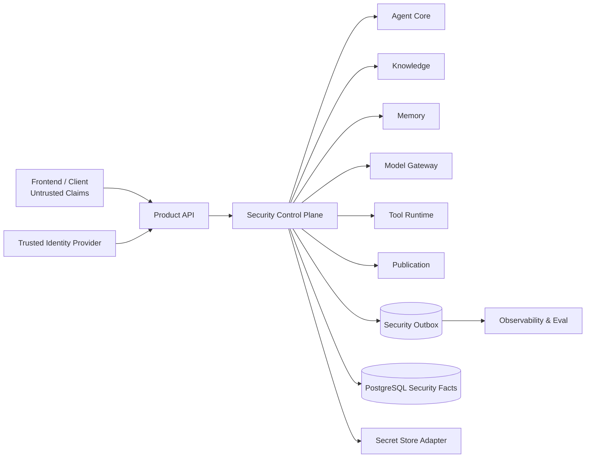
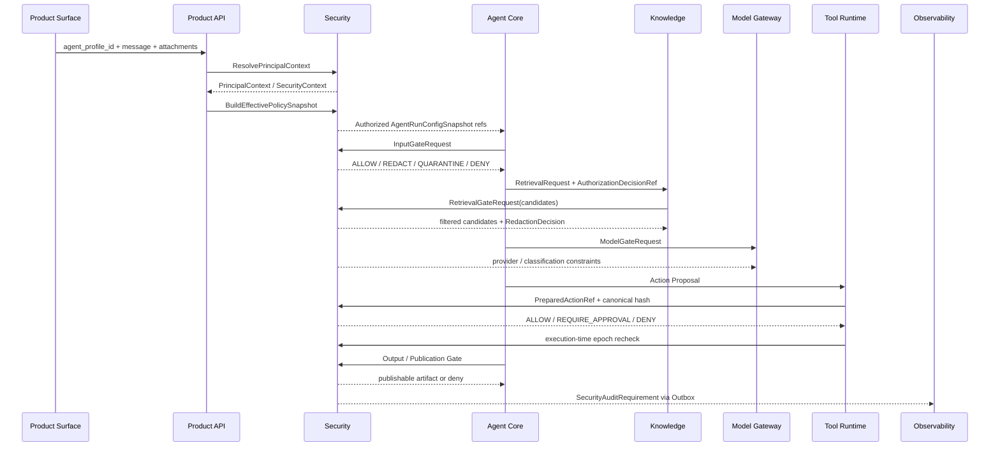

# Zuno 09 Security Target 架构

updated: 2026-07-13  
status: design available  
document_role: module target architecture  
formal_truth: `docs/modules/09-security.md`  
agent_mirror: `.agent/modules/09-security.md`  
current_state_source: `docs/status/production-readiness.md`

> 本文是 Zuno 第 09 个逻辑模块——Security——的正式 Target 架构设计。
>
> 本文定义企业知识库 Agent 的身份、组织管理树、资源授权、委派、策略、输入输出检测、脱敏、审批、撤销、Secret、安全审计以及跨模块 Contract。本文不把目标对象、表结构或流程描述当成已经实现的 Current 事实。

## 0. 文档边界与事实源

事实解释顺序：

```text
最新 main 的代码、测试、Migration、Trace、Eval
→ docs/status/production-readiness.md 的 Current / Gap
→ 本文 Target Contract
→ Future Optional
→ docs/history/ 历史材料
```

正式文档与 Agent 镜像必须字节级一致：

```text
docs/modules/09-security.md
.agent/modules/09-security.md
```

并行 Wave 1 的 04 Model Gateway、10 Observability & Eval、11 Infrastructure Draft PR 只能作为 Parallel Proposal 阅读，不是 Current，也不是已经批准的 Contract。Agent Core 正式 Target 文档是已冻结上游约束；发现冲突时记录跨模块请求，不由 Security 单方面改写上游所有权。

---

## 1. 问题、目标与非目标

### 1.1 要解决的问题

Zuno 允许用户配置 Agent、知识库、模型、Memory 和 Tool。企业环境中，仅有“登录成功”远远不够。系统必须持续回答：

```text
谁（Principal）
在什么 Tenant / Workspace / 组织节点中
以什么角色和管理范围
针对哪个资源
执行什么动作
在什么 PolicyVersion 与 SecurityEpoch 下
是否允许使用、是否允许继续委派、是否需要审批
哪些内容需要检测、过滤、脱敏或隔离
权限撤销后正在运行的 Agent 是否还能继续
```

安全不能依赖模型自律，也不能依赖前端传入的 `allowed=true`。模型与前端只能产生 Proposal；最终安全事实由后端确定性策略和状态机提交。

### 1.2 核心目标

1. 建立平台、Tenant、Workspace、组织、角色、用户、AgentProfile 多层安全控制。
2. 支持企业组织树、上级管理员、下级管理员和限定范围的委派授权。
3. 为知识库和工具提供三档用户可理解权限：`DENY`、`USE_ONLY`、`USE_AND_DELEGATE`。
4. 在 Prompt、Retrieval、Memory、Model、Tool、Output / Publication 全链路执行 Security Gate。
5. 支持可配置输入检测、输出检测、数据分类和分阶段脱敏。
6. 支持副作用 Tool 审批、执行前复核、撤销和防重放。
7. 产生可关联、可查询、不可伪造的安全决策与审计要求，同时避免把 Secret 和原始敏感内容写入 Trace。
8. 明确 PostgreSQL 领域事实、LangGraph 控制状态、Observability 投影和 Infrastructure 能力之间的边界。
9. 为 Retry、Recovery、Idempotency、Fault Test 和完成证据提供可执行规格。

### 1.3 非目标

近期不默认建设：

- 产品级自治 Multi-Agent Security Runtime；
- 以微服务数量体现成熟度；
- 自研企业身份提供商、HSM、DLP 或杀毒引擎；
- 让模型直接批准权限、修改 PolicyVersion 或提交 Grant；
- 让前端成为权限事实源；
- 把完整 Prompt、文档原文或 Secret 写入安全日志；
- 用组织上下级关系替代资源授权；
- 用单一 `role` 字段覆盖所有 Tenant、Workspace、资源和临时委派场景；
- 在没有 Migration、故障测试、Trace 和 E2E 证据时宣称 production ready。

---

## 2. Current、Target、Gap、Future、History

### 2.1 Current

当前代码证据仅能证明一个本地确定性 Governance 基线：

- `src/backend/zuno/platform/security/governance.py` 定义 Input、Retrieval、Tool、Output Gate；
- 能识别部分 Secret、邮箱、SSN 和 Prompt Injection 模式；
- 能对 RetrievalCandidate 做 Workspace / ACL 过滤与不可信指令清理；
- 能根据 Tool side-effect profile 返回 Allow 或 Require Approval；
- 能生成基础 `SandboxAuditEvent` / `SecurityTraceSummary`；
- 现有测试证明的是这些 Surface 行为，不是完整企业身份、组织树、Policy、Grant、Revocation 或持久化闭环。

因此 Current 只能写为：

```text
implementation available（局部本地安全门禁）
measurement not established
production security not proven
```

### 2.2 Target

本文 Target 包括：

- Principal 与可信身份上下文；
- Tenant / Workspace / OrgUnit 管理树；
- 管理员委派范围；
- Knowledge / Tool ResourceGrant；
- 三档权限及确定性继承算法；
- PolicyVersion、EffectiveSecurityPolicySnapshot；
- 输入、检索、Memory、模型、Tool、输出和发布 Gate；
- DataClassification、DetectionProfile、RedactionProfile；
- Approval、Revocation、SecurityEpoch、BreakGlass；
- SecretAccessDecision；
- SecurityDecision、SecurityViolation、SecurityAuditRequirement；
- 状态机、失败语义、存储映射、Migration 和测试证据。

### 2.3 Gap

当前缺少工程证据的主要能力：

- 生产级 Principal / Session / SSO 身份信任链；
- OrgUnit 树、管理员作用域、Grant lineage 和授权撤销传播；
- PolicyVersion / SecurityEpoch 持久化和条件写；
- 知识库、文档、Tool、模型、Memory 的统一 Authorization Contract；
- 可配置 Detection / Redaction Profile；
- 审批请求与 PreparedAction hash 绑定；
- Secret Store 与短期 Credential Lease；
- append-only Security Outbox；
- PostgreSQL / Alembic Migration；
- 跨 Workspace / 委派放大 / 审批重放 / stale epoch 故障测试；
- 真实前端权限树和管理员操作 E2E。

### 2.4 Future Optional

- SCIM 自动同步组织树；
- 企业 IdP 高级 Federation；
- 外部 DLP / CASB / SIEM；
- HSM-backed signing；
- Firecracker 或同等级强隔离执行；
- 复杂跨企业资源共享；
- 基于风险评分的持续身份验证；
- 大规模策略模拟与形式化验证。

### 2.5 History

被替换或废弃的规则、旧 ACL 设计和历史 Program 必须进入 `docs/history/`。History 只能解释演进，不参与当前权限计算。

---

## 3. 威胁模型与信任边界

### 3.1 主要威胁

| 威胁 | 示例 | Prevent | Detect | Respond / Evidence |
| --- | --- | --- | --- | --- |
| Cross-tenant retrieval | A Workspace 命中 B Workspace Chunk | Storage Scope + Retrieval Gate | `SEC_CROSS_SCOPE` | 阻断、Violation、Audit |
| 前端权限伪造 | 请求携带未授权 `tool_ids` | 后端重算 Effective Scope | `SEC_CLIENT_SCOPE_TAMPER` | 拒绝或忽略字段 |
| 委派放大 | 下级授予超出自身的权限 | Delegation Ceiling | `SEC_DELEGATION_AMPLIFICATION` | Grant REJECTED |
| 组织树越界 | 管理者向非下级组织授权 | Managed Subtree Guard | `SEC_ADMIN_SCOPE_VIOLATION` | 阻断并审计 |
| Prompt Injection | 文档诱导泄露或调用危险 Tool | Input/Retrieval/Tool Gate | Finding / Violation | 清理、隔离、阻断 |
| Approval Replay | 旧批准用于新参数 | PreparedAction canonical hash | `SEC_APPROVAL_REPLAY` | 拒绝并失效 |
| Stale Authorization | 权限撤销后继续执行 | SecurityEpoch recheck | `SEC_STALE_EPOCH` | 中止或等待重新授权 |
| Secret 泄露 | Token 进入 Prompt / Trace | Secret Ref + Redaction | `SEC_SECRET_EXPOSURE` | 阻断、轮换、Incident |
| Model Provider 外泄 | Restricted 数据发外部模型 | Model Gate + Residency Policy | `SEC_PROVIDER_POLICY_DENIED` | Fail closed |
| Memory Poisoning | 恶意内容进入长期 Memory | Memory Gate + Governance | `SEC_MEMORY_POLICY_DENIED` | Quarantine |
| Citation Disclosure | 答案脱敏但引用泄露原文 | Publication Gate | `SEC_CITATION_DISCLOSURE` | 删除或降级引用 |
| Break-glass 滥用 | 管理员无限期提升权限 | TTL、双人规则、强审计 | `SEC_BREAK_GLASS_ABUSE` | 终止 Session、Incident |

### 3.2 信任边界



Frontend、模型输出、文档内容、Tool 参数和外部 Event 默认不可信。只有经过鉴权、Schema Validation、Policy Snapshot 和 Gate 的结构化结果才能进入领域状态转换。

---

## 4. Ownership 与模块边界

### 4.1 Security Owns

- `PrincipalContext` 与 `SecurityContext` 的安全语义；
- `OrgUnit` 安全管理树约束；
- `DelegatedAdminScope`；
- `ResourceGrant`、Grant lineage、撤销与有效性；
- `PolicyVersion`、`EffectiveSecurityPolicySnapshot`；
- `AuthorizationDecision` / `SecurityDecision`；
- `DetectionProfile`、`RedactionProfile`、`RedactionDecision`；
- `DataClassification` 的安全词汇与传播规则；
- `ApprovalPolicy` 与 `SecurityApprovalDecision`；
- `RevocationRecord`、`SecurityEpoch`；
- `SecretAccessDecision`；
- `BreakGlassSession`、`SecurityViolation`、`SecurityIncident`；
- `SecurityAuditRequirement` 和 Security Outbox 产生语义。

### 4.2 Security Does Not Own

- 用户页面和交互组件：Product Surface；
- AgentRun、PlanVersion、StepRun、Interrupt：Agent Core；
- KnowledgeCollection、Document、Chunk 的内容事实：Knowledge / Ingestion；
- ToolDefinition、PreparedAction、ToolAttempt、Effect Reconcile：Tool Runtime；
- Model Provider 调用、RoutingDecision、UsageReceipt：Model Gateway；
- MemoryItem 内容生命周期：Memory；
- Trace / Eval 查询投影和外部 Sink Delivery：Observability & Eval；
- PostgreSQL、Queue、Object Store、Vault 产品部署：Infrastructure。

### 4.3 跨模块所有权原则

```text
Security 决定“是否允许以及附带什么限制”
领域模块决定“业务对象发生了什么”
Observability 保存“可查询的安全和运行证据投影”
Infrastructure 提供“可靠持久化和交付能力”
```

接收到 `SecurityDecision` 不会把源领域对象 Ownership 转移给 Security。Security 也不能直接修改 AgentRun、KnowledgeCollection 或 ToolAttempt 的最终状态。

### 4.4 PreparedAction 冲突请求

冻结 Agent Core 文档将 `PreparedAction` 列为 Aggregate，而 Wave 1 更合理的运行边界是：

```text
Agent Core：Action Proposal / orchestration ref
Tool Runtime：executable PreparedAction / ToolAttempt / Effect Reconcile
Security：绑定 PreparedAction canonical hash 的批准和授权事实
```

在正式协调前，Security 只消费 `PreparedActionRef` 与 `prepared_action_hash`，不创建第二份可执行 PreparedAction 事实。记录：`XMOD-SEC-001`。

---

## 5. 强制安全不变量

1. 默认拒绝：没有有效 Allow 证据时结果是 `DENY`。
2. 显式 `DENY` 高于继承 Allow 和用户偏好。
3. 客户端、模型、Prompt 或 Tool 不得自行声明权限。
4. 任何委派不能扩大授权者的 Effective Permission。
5. `USE_ONLY` 永远不能产生下级 Grant。
6. `USE_AND_DELEGATE` 只能在管理员的 `DelegatedAdminScope` 和授权资源范围内继续委派。
7. 下层配置只能收紧平台 / Tenant / Workspace 强制策略，不能放宽。
8. 每次 Retrieval、Model Call、Tool Execute、Publication 都使用有效 SecurityEpoch；高风险动作必须执行时复核。
9. 激活后的 PolicyVersion、Grant decision、Approval decision 和 Redaction decision 不原地改写。
10. Secret 明文不得进入普通 Prompt、长期 Memory、Trace 或 Audit。
11. Mandatory Audit 无法可靠提交时，高风险副作用默认 fail closed。
12. 模型只能产生 Proposal，不得批准权限、激活 PolicyVersion、批准自己的 Tool 行为或执行 Break-glass。
13. Tenant / Workspace Scope 必须同时存在于领域事实、查询条件、Contract Envelope 和审计关联中。
14. 未知枚举、缺失安全上下文、过期 Snapshot、循环组织树、断裂 Grant lineage 一律 fail closed。

---

## 6. Principal、身份与组织管理树

### 6.1 PrincipalAccount

`PrincipalAccount` 表示可被授权的主体账号：

```text
principal_id
tenant_id
principal_type          USER / SERVICE_ACCOUNT / SYSTEM
account_status          INVITED / ACTIVE / SUSPENDED / DISABLED / DELETED
identity_provider_ref
subject_ref
security_version
created_at
updated_at
```

账号状态和身份来源必须由可信认证链产生。客户端传入的 `principal_id`、`tenant_id`、`roles`、`org_unit_id` 仅作为输入线索，不是可信事实。

### 6.2 Primary OrgUnit Tree

企业主组织采用单父节点树：

```text
Tenant Root
└── 总管理员
    ├── 部门 A
    │   └── 管理者 A
    │       ├── 小组 A1
    │       │   └── 管理者 A1
    │       │       ├── 用户 U1
    │       │       └── 用户 U2
    │       └── 小组 A2
    │           └── 用户 U3
    └── 部门 B
        └── 管理者 B
            ├── 用户 U4
            └── 用户 U5
```

`OrgUnit`：

```text
org_unit_id
tenant_id
parent_org_unit_id
name
path
status
version
```

约束：

- 一个 Primary OrgUnit 最多一个父节点；
- 不允许环；
- 不能跨 Tenant 设置父节点；
- 移动节点必须检查现有管理员作用域、Grant lineage 和撤销影响；
- `path` 是查询投影，不是唯一事实源；
- 用户的行政上级关系不自动等于资源授权。

### 6.3 OrgMembership

用户可以拥有一个 Primary Membership，并可有附加项目 Membership：

```text
membership_id
principal_id
org_unit_id
membership_type       PRIMARY / PROJECT / TEMPORARY
membership_role       MEMBER / MANAGER / SECURITY_ADMIN
valid_from
valid_until
status
```

多个 Membership 只扩展可参与的候选范围，最终仍按明确 ResourceGrant 和 Policy 计算；不能因为属于某组织就默认获得全部资源。

### 6.4 DelegatedAdminScope

`DelegatedAdminScope` 描述“谁可以管理谁以及能管理什么”，不等同于账号表里的 `parent_user_id`：

```text
admin_scope_id
administrator_principal_id
root_org_unit_id
include_descendants
managed_resource_types
max_permission
max_delegation_depth
allow_grant
allow_revoke
allow_manage_admin_scope
valid_from
valid_until
status
policy_version_id
```

管理员只能对 `root_org_unit_id` 子树中的 Subject 操作，并且不能授予超过 `max_permission`、超过自身 Effective Grant 或超过剩余 `delegation_depth` 的权限。

### 6.5 为什么不直接保存 parent_user_id

直接把上下级写成 `account.parent_user_id` 会混淆：

- 行政上级；
- 项目负责人；
- 知识库管理员；
- Tool 管理员；
- 临时授权人；
- 安全审批人。

Target 使用 OrgUnit Tree 表达主组织关系，使用 DelegatedAdminScope 表达管理权限，使用 ResourceGrant 表达资源权限。三者分别演进并通过引用关联。

---

## 7. ResourceGrant 与三档权限

### 7.1 用户可见权限

前端对知识库和工具统一展示三档：

| UI 权限 | Contract 枚举 | 可使用 | 可继续委派 |
| --- | --- | --- | --- |
| 禁止使用 | `DENY` | 否 | 否 |
| 只能使用，不能分发 | `USE_ONLY` | 是 | 否 |
| 可以使用并分发 | `USE_AND_DELEGATE` | 是 | 是，受管理范围和深度限制 |

“分发”正式术语为 **Delegation（委派授权）**。它不是复制知识库、导出数据、查看 Secret 或绕过审批。

### 7.2 ResourceGrant

```text
grant_id
tenant_id
workspace_id
resource_type          KNOWLEDGE_COLLECTION / DOCUMENT / TOOL / MODEL / MEMORY_SCOPE
resource_id
subject_type           PRINCIPAL / ORG_UNIT / ROLE / AGENT_PROFILE
subject_id
permission             DENY / USE_ONLY / USE_AND_DELEGATE
inherit_to_descendants
delegation_depth
source_grant_id
grant_lineage_hash
granted_by_principal_id
granted_under_admin_scope_id
policy_version_id
security_epoch
valid_from
expires_at
status                  PROPOSED / VALIDATING / ACTIVE / SUSPENDED / REVOKED / EXPIRED / REJECTED
reason_code
created_at
```

### 7.3 Grant lineage

任何转授 Grant 必须引用 `source_grant_id`。系统沿 lineage 验证：

```text
父 Grant 仍 ACTIVE
父 Grant 是 USE_AND_DELEGATE
父 Grant 覆盖同一资源或更宽资源范围
父 Grant 的 Subject 管理范围包含目标 Subject
父 Grant 未过期
父 Grant delegation_depth > 0
子 Grant 权限不高于父 Grant
子 Grant 有效期不晚于父 Grant
```

父 Grant 被撤销、过期或降级后，其全部派生 Grant 进入 `SUSPENDED` 或 `REVOKED`，由 Reconciler 收口。

### 7.4 权限计算优先级

候选策略按以下步骤确定性计算：

```text
1. 验证 Principal / Tenant / Workspace / Resource 状态
2. 加载平台和 Tenant 强制 Policy
3. 加载 Workspace / Resource Policy
4. 加载直接 Principal Grant
5. 加载 OrgUnit / Role 继承 Grant
6. 验证每条 Grant lineage 与 Admin Scope
7. 任意适用的显式 DENY -> DENY
8. 剩余 Allow 取最小能力上界
9. 应用 AgentTemplate / AgentProfile 选择，仅允许进一步收窄
10. 应用本次请求限制，仅允许进一步收窄
11. 产生 AuthorizationDecision 与 Policy Snapshot hash
```

“最小能力上界”示例：上级 `USE_AND_DELEGATE`，Workspace Policy 仅允许 `USE_ONLY`，最终为 `USE_ONLY`。

### 7.5 默认规则

- 无匹配 Allow：`DENY`；
- 未知 Subject / Resource：`DENY`；
- 显式用户 DENY 可覆盖组织继承 Allow；
- 管理员不能自我提升；
- 授权人不能授予比自己更高或更长有效期的权限；
- 资源删除、Tenant 禁用或 Workspace 冻结使 Grant 不可用；
- 权限变化递增相关 SecurityEpoch。

### 7.6 示例

```text
财务制度库
Tenant Policy: 允许财务组织使用
部门 A: USE_ONLY
管理者 A: 继承 USE_ONLY
用户 U1: 继承 USE_ONLY
用户 U2: 显式 DENY
部门 B: USE_AND_DELEGATE, depth=2
管理者 B: 可在部门 B 子树内继续授权
```

结果：管理者 A 可以使用但不能授权；U2 被显式拒绝；管理者 B 不能把权限授予部门 A，也不能授予超过剩余深度的委派权。

---

## 8. Policy 层级与个性化安全设置

### 8.1 Policy 层级

```text
Platform Mandatory Policy
  > Tenant Policy
  > Workspace Policy
  > Resource Policy
  > Delegated Admin Grant Ceiling
  > AgentTemplate Policy
  > AgentProfile SecurityPreference
  > User Preference
  > Request Restriction
```

下层只能收紧上层强制规则。只有获得明确管理授权的管理员，才可在其作用域和上限内创建 Allow Grant；用户偏好不能把组织禁止项改为允许。

### 8.2 SecurityPreference

用户或 AgentProfile 可以选择：

```text
input_detection_level
output_detection_level
pii_redaction_profile
custom_sensitive_terms
external_model_preference
tool_confirmation_preference
memory_retention_preference
trace_content_preference
citation_disclosure_preference
publication_preference
```

这些是 Preference，不是权威 Policy。Policy Resolver 将 Preference 与强制策略合并为不可变 `EffectiveSecurityPolicySnapshot`。

### 8.3 预设模式

| 模式 | 说明 |
| --- | --- |
| `PUBLIC` | 公开资料问答，仍执行 Secret 和跨租户检测 |
| `STANDARD` | 默认企业策略 |
| `STRICT` | 强输入输出检测、外部 Tool 确认、严格脱敏 |
| `ISOLATED` | 禁止外部模型、外部 Tool 和长期 Memory |
| `CUSTOM` | 管理员在强制策略范围内配置 |

“宽松”模式也不能关闭 Tenant 隔离、Secret 防泄露、显式 DENY 或 Mandatory Audit。

---

## 9. 完整运行流程



运行原则：

1. API 不接受客户端自报的 Effective Grant；
2. Run 开始时冻结 Snapshot，但高风险阶段仍检查最新 SecurityEpoch；
3. Gate 结果包含结构化 reason code、policy ref、epoch 和限制；
4. Agent Core 根据结果确定继续、等待审批、中止或重规划，但不能改写安全决定；
5. Security 领域事实和 Outbox 在同一事务提交。

---

## 10. Security Gate 模型

### 10.1 Gate 类型

```text
IDENTITY
INPUT
RETRIEVAL
MEMORY_READ
MEMORY_WRITE
MODEL
TOOL_PREPARE
TOOL_EXECUTE
OUTPUT
PUBLICATION
ADMIN_GRANT
BREAK_GLASS
```

### 10.2 Decision 类型

```text
ALLOW
ALLOW_WITH_RESTRICTIONS
ALLOW_WITH_REDACTION
REQUIRE_APPROVAL
QUARANTINE
DENY
ABSTAIN_DUE_TO_POLICY_UNAVAILABLE
```

`ABSTAIN_DUE_TO_POLICY_UNAVAILABLE` 是 fail-closed 结果，不等同于 Allow。

### 10.3 GateResult

```text
decision_id
gate_type
decision
principal_context_ref
resource_ref
action
policy_snapshot_ref
security_epoch
restrictions
redaction_decision_ref
approval_requirement_ref
reason_codes
evidence_refs
expires_at
trace_id
created_at
```

---

## 11. 输入与输出检测

### 11.1 Input Detection

检测对象：

- Prompt Injection / Jailbreak；
- Secret、Token、密码、连接串；
- PII / PHI / 财务敏感字段；
- 恶意文件类型、宏、脚本或隐藏指令；
- 跨 Tenant / Workspace 资源引用；
- 不允许的数据等级；
- Tool 越权意图；
- 用户自定义敏感实体。

处理动作：

```text
ALLOW
SANITIZE_AND_ALLOW
REDACT_AND_ALLOW
QUARANTINE
REQUIRE_APPROVAL
DENY
```

检测模型只能输出 Finding Proposal；Schema、策略匹配和最终 Gate 必须确定性执行。检测服务超时或不可用时，根据 DataClassification 和 Policy 选择 fail closed 或进入隔离队列，不能静默跳过。

### 11.2 Output Detection

最终交付前检查：

- 是否包含未授权知识库或其他 Tenant 数据；
- 是否暴露 Secret、PII、内部 ID 或隐藏 System Prompt；
- Citation 是否泄露受限原文；
- 是否包含未经批准的副作用结果声明；
- 是否违反接收者、渠道或导出策略；
- 生成时使用的 Grant / Epoch 是否仍有效；
- Artifact 与 Publication 的 DataClassification 是否匹配。

Retrieval 允许读取不代表允许输出。内部分析可以读取 Restricted 文档，但 Publication 可能只能输出脱敏摘要或完全拒绝。

### 11.3 DetectionProfile

```text
detection_profile_id
version
scope
input_rules
output_rules
prompt_injection_mode
secret_detection_mode
pii_entity_types
custom_patterns
model_detector_policy
failure_mode
created_by
status
```

自定义正则、词典或模型检测规则必须有版本、测试样例、性能预算和误报处理；用户自定义规则只能增加检测，不能关闭 Mandatory Rule。

---

## 12. DataClassification 与脱敏

### 12.1 分类词汇

```text
PUBLIC
INTERNAL
CONFIDENTIAL
RESTRICTED
SECRET_MATERIAL
```

`SECRET_MATERIAL` 是凭证或密钥材料，原则上不得进入模型上下文。

### 12.2 分类传播

```text
Document
→ Chunk
→ RetrievalCandidate
→ ContextPack / Prompt Segment
→ Model Output
→ FinalCandidate
→ ArtifactVersion
→ Publication
```

默认取参与内容的最高分类。只有显式 `DeclassificationDecision` 或经过验证的 RedactionDecision 才能降低输出暴露等级；删除显示字符不自动证明已经降级。

### 12.3 RedactionProfile

支持：

- Mask：`138****5678`；
- Remove：`[REDACTED]`；
- Tokenize：`PERSON_001`；
- Hash / Stable Pseudonym；
- Generalize：精确地址转地区；
- Partial Reveal：仅保留后四位；
- Field Drop；
- Citation Suppression。

```text
redaction_profile_id
version
entity_type
stage
strategy
preserve_format
reversible
key_ref
minimum_classification
replacement_template
status
```

### 12.4 分阶段策略

| 阶段 | 典型规则 |
| --- | --- |
| Ingestion | 保留原文到受控 Object Store，标记分类 |
| Indexing | 对指定字段 Tokenize，派生索引可重建 |
| Retrieval | ACL + classification 过滤 |
| Prompt | Secret 删除、PII 按 Provider Policy 脱敏 |
| Trace | 仅保存 Ref / Hash / Finding，不保存明文 |
| Memory | Restricted 默认禁止长期写入 |
| Output | 按接收者权限动态脱敏 |
| Publication | 按渠道使用最严格策略并检查 Citation |

### 12.5 RedactionDecision

必须记录输入 content hash、规则版本、命中的实体类别、执行策略、输出 content hash、可逆性和 Evidence Ref。不得在 Audit 中保存被移除的原始 Secret。

---

## 13. 知识库访问控制

### 13.1 Knowledge Permission

`USE_ONLY` 对知识库表示：

- 可在被授权 Agent 中启用；
- 可检索允许的 Collection / Document / Chunk；
- 可查看经过 Publication Gate 的 Citation；
- 不代表可以导出原始文档或给其他用户授权。

`USE_AND_DELEGATE` 额外允许在 Admin Scope 和 delegation depth 内创建下级 ResourceGrant。

### 13.2 EffectiveKnowledgeScope

```text
Platform/Tenant Policy
∩ Workspace Scope
∩ Knowledge ResourceGrant
∩ Document ACL
∩ DataClassification Policy
∩ AgentTemplate Allowlist
∩ AgentProfile Selection
∩ Request Restriction
```

### 13.3 Retrieval Gate

每轮检索都必须携带：

```text
principal_context_ref
tenant_id
workspace_id
knowledge_collection_ids
policy_snapshot_ref
security_epoch
agent_run_id
trace_id
```

Storage Filter 和 Retrieval Gate 双重执行。向量或图索引误返回其他 Scope 时必须阻断并产生 `SEC_CROSS_SCOPE`，不能只在最终输出阶段修复。

### 13.4 Citation

Citation 必须重新检查：

- 用户是否仍可访问 SourceSpan；
- Citation 片段是否需要脱敏；
- 是否允许显示文档标题、路径和原文；
- Publication 渠道是否允许该分类。

---

## 14. Tool 访问控制

### 14.1 Tool Permission

`USE_ONLY` 表示 Agent 可以选择该 Tool，但仍需满足：

- ToolDefinition ACTIVE；
- 操作和参数在 Grant scope 内；
- Security Policy 允许；
- Budget / Quota 允许；
- 风险等级对应的 Approval 满足；
- execution-time SecurityEpoch 有效；
- Idempotency Claim 已获取。

`USE_AND_DELEGATE` 只增加“给下级授权使用 Tool”的能力，不允许查看 Tool Secret、修改 ToolDefinition、跳过审批或批准自己的高风险操作。

### 14.2 风险等级

```text
READ_ONLY
LOW_SIDE_EFFECT
REVERSIBLE_WRITE
EXTERNAL_EFFECT
DESTRUCTIVE
PRIVILEGED
```

默认策略：

| 风险 | Target 行为 |
| --- | --- |
| READ_ONLY | 可自动允许，仍审计 |
| LOW_SIDE_EFFECT | Policy 决定是否确认 |
| REVERSIBLE_WRITE | 推荐确认与 Effect Reconcile |
| EXTERNAL_EFFECT | 默认 Require Approval |
| DESTRUCTIVE | 强审批、短 TTL、执行前复核 |
| PRIVILEGED | 管理员策略、职责分离、最小 Credential Scope |

### 14.3 Tool 流程

```text
Action Proposal
→ Tool Runtime canonicalize PreparedAction
→ Security Tool Prepare Gate
→ optional Approval
→ Security Tool Execute Gate / epoch recheck
→ Idempotency Claim
→ ToolAttempt
→ Effect Reconcile
→ Security Audit Requirement
```

---

## 15. AgentTemplate、AgentProfile 与运行快照

前端允许用户在已授权范围中配置个人 Agent，但后端必须形成版本化事实：

```text
AgentTemplate
→ AgentProfile
→ AgentProfileVersion
→ AgentRunConfigSnapshot
```

`AgentRunConfigSnapshot` 至少引用：

```text
agent_profile_version_id
principal_context_ref
knowledge_scope_ref
tool_scope_ref
model_policy_ref
memory_policy_ref
effective_security_policy_snapshot_ref
security_epoch
runtime_budget_ref
created_at
```

AgentProfile 中“选择某知识库 / Tool”只会收窄 Effective Scope，不产生新的 ResourceGrant。Run 启动时后端重新计算有效范围，不能复用前端缓存的可用列表。

---

## 16. Approval Contract

### 16.1 ApprovalRequest

Product Surface 可以展示和收集批准意图，但批准有效性由 Security 提交。

```text
approval_request_id
prepared_action_ref
prepared_action_hash
requester_principal_id
approver_policy
required_approver_count
separation_of_duties
policy_snapshot_ref
security_epoch
expires_at
status
```

### 16.2 SecurityApprovalDecision

批准绑定：

```text
prepared_action_hash
principal_id
tenant_id
workspace_id
resource_scope
tool_id
operation
canonical_args_hash
policy_snapshot_id
security_epoch
approval_policy_id
approver_principal_ids
expires_at
nonce
```

任一字段变化都必须重新批准。批准不能跨 Tenant、跨 Tool、跨参数、跨 Epoch 或跨有效期复用。

### 16.3 职责分离

高风险操作可要求：

- 请求人不能批准自己的操作；
- 至少两个不同 Principal 批准；
- 批准人必须位于允许的管理员作用域；
- Break-glass 不能关闭 Mandatory Audit；
- Approval 被撤销或 Epoch 变化后执行必须停止。

---

## 17. Revocation、SecurityEpoch 与 TOCTOU

### 17.1 SecurityEpoch

Epoch 不是一个全局数字，而是可组合范围：

```text
TenantSecurityEpoch
WorkspaceSecurityEpoch
PrincipalSecurityEpoch
ResourceSecurityEpoch
```

`EffectiveSecurityEpoch` 是本次 Decision 引用的各 Scope epoch tuple/hash。

### 17.2 递增触发

- Principal 禁用或角色变化；
- OrgMembership 变化；
- Admin Scope 变化；
- ResourceGrant 创建、降级、撤销或过期；
- PolicyVersion 激活；
- Resource 分类或 ACL 变化；
- Tool 风险、Secret Scope 或 Provider Policy 变化；
- Break-glass 开始或终止。

### 17.3 执行时复核

以下阶段必须复核最新 epoch：

- Retrieval 每轮；
- 外部 Model Call 前；
- Tool Execute 前；
- 长时间 Tool 的关键提交点；
- Final Gate；
- Publication 前。

发现 stale epoch：

```text
READ path        -> 重新授权或中止当前步骤
SIDE EFFECT path -> 禁止执行，已有 Attempt 进入 Reconcile
PUBLICATION      -> 阻止发布或生成更正流程
```

### 17.4 RevocationRecord

```text
revocation_id
scope_type
scope_id
target_type
target_id
reason_code
requested_by
effective_at
new_epoch
cascade_mode
status
```

Revocation 与 epoch 条件更新、派生 Grant 标记和 Security Outbox 必须在一致事务边界内提交。

---

## 18. Secret 与 Credential

### 18.1 原则

```text
secret_ref
→ AuthorizationDecision
→ short-lived CredentialLease
→ Tool / Provider Adapter 使用
→ usage receipt
→ lease expiry / revoke
```

模型原则上只看到能力结果，不看到 Secret 明文。

### 18.2 SecretAccessDecision

```text
secret_access_decision_id
principal_context_ref
consumer_type
consumer_id
secret_ref
purpose
scope
lease_ttl
provider_or_tool_binding
policy_snapshot_ref
security_epoch
decision
reason_codes
```

禁止：

- Secret 明文写入 Prompt；
- Secret 写入长期 Memory；
- Secret 写入 Trace / Audit；
- Tool Observation 回显 Secret；
- 一个 Tool 的 CredentialLease 被另一个 Tool 使用；
- 超过 TTL 或 Epoch 的 Lease 继续执行。

---

## 19. Break-glass 与 SecurityIncident

### 19.1 BreakGlassSession

```text
break_glass_session_id
principal_id
scope
requested_reason
approved_by
policy_id
started_at
expires_at
status
mandatory_audit=true
incident_ref
```

状态：

```text
REQUESTED -> VALIDATING -> ACTIVE -> EXPIRED / TERMINATED -> REVIEW_REQUIRED -> CLOSED
```

Break-glass 必须：

- 限定 Scope 和 TTL；
- 默认禁止自批；
- 不允许关闭脱敏、审计和 Tenant 隔离；
- 产生高优先级安全事件；
- 结束后撤销临时 Grant、递增 Epoch；
- 进入事后复盘。

### 19.2 SecurityIncident

Secret 暴露、跨租户命中、审批重放、管理员越界和 Break-glass 滥用可以创建 Incident Proposal。Incident 系统的工单 UI 可由 Product / Observability 提供，但安全分类、严重度建议和证据引用由 Security 产生。

---

## 20. 全链路审计与 Trace 边界

Security 负责产生安全事实，Observability 负责可靠接收、关联、投影、查询和告警。

```text
SecurityDecision / Violation / Grant / Revocation / Approval
→ SecurityAuditRequirement
→ Security Outbox
→ Observability append-only ingest
→ Trace / Audit query projection / alert
```

安全事件关联字段：

```text
request_id
trace_id
agent_run_id
plan_version_id
step_run_id
action_id
tool_attempt_id
principal_id
tenant_id
workspace_id
org_unit_id
policy_snapshot_id
security_epoch
authorization_decision_id
approval_decision_id
redaction_decision_id
violation_id
publication_decision_id
```

默认只记录：Ref、Hash、Classification、Decision Code、Finding、PolicyVersion、Redaction Strategy 和 Evidence Ref。不得为了审计完整性记录原始 Secret 或无限制完整 Prompt。

Mandatory Audit 规则：

- 领域事实和 Outbox 同事务；
- Observability 暂时不可用不回滚已提交的低风险本地事实；
- 高风险副作用若 Outbox 无法可靠提交则 fail closed；
- 重复投递由 message_id 幂等去重；
- Observability 不得修改 Security 决策事实或降低 Redaction。

---

## 21. Typed Contract

### 21.1 Contract Envelope

所有跨模块安全消息使用：

```text
contract_name
contract_version
message_id
correlation_id
causation_id
producer
consumer
tenant_id
workspace_id
principal_context_ref
security_context_ref
policy_snapshot_ref
security_epoch
trace_id
created_at
payload_schema_hash
payload
```

未知版本和缺失 Scope 默认拒绝。

### 21.2 核心 Contract 清单

```text
PrincipalAccount
PrincipalContext
SecurityContext
OrgUnit
OrgMembership
DelegatedAdminScope
ResourceGrant
GrantLineage
PolicyVersion
EffectiveSecurityPolicySnapshot
SecurityPreference
DetectionProfile
DetectionFinding
DataClassification
RedactionProfile
RedactionDecision
AuthorizationRequest
AuthorizationDecision
SecurityGateRequest
SecurityGateResult
ApprovalPolicy
ApprovalRequest
SecurityApprovalDecision
RevocationRecord
SecurityEpoch
SecretAccessDecision
CredentialLeaseRef
BreakGlassSession
SecurityViolation
SecurityIncident
SecurityAuditRequirement
SecurityOutboxEvent
```

### 21.3 AuthorizationRequest

必须明确 Subject、Resource、Action、Context，禁止只传一个模糊 `is_admin`：

```text
subject_principal_id
subject_org_memberships
tenant_id
workspace_id
resource_type
resource_id
action
agent_profile_version_id
request_restrictions
current_time
trace_id
```

### 21.4 AuthorizationDecision

```text
authorization_decision_id
decision                 DENY / USE_ONLY / USE_AND_DELEGATE / ALLOW_WITH_RESTRICTIONS
applicable_grant_ids
winning_deny_refs
delegation_ceiling
managed_subtree_ref
restrictions
policy_snapshot_ref
security_epoch
reason_codes
expires_at
```

---

## 22. 状态机

### 22.1 PrincipalAccount

```text
INVITED -> ACTIVE
ACTIVE -> SUSPENDED -> ACTIVE
ACTIVE / SUSPENDED -> DISABLED
DISABLED -> DELETED
```

禁用 Principal 必须递增 Principal Epoch，并使其 Session、Approval 和派生临时 Grant 失效。

### 22.2 PolicyVersion

```text
DRAFT -> VALIDATING -> APPROVED -> ACTIVE -> SUPERSEDED -> ARCHIVED
                    \-> REJECTED
```

一个 Scope 同类型最多一个 ACTIVE。激活在事务内替换旧版本并递增相关 Epoch。ACTIVE 版本不可原地修改。

### 22.3 ResourceGrant

```text
PROPOSED -> VALIDATING -> ACTIVE
                       \-> REJECTED
ACTIVE -> SUSPENDED -> ACTIVE
ACTIVE / SUSPENDED -> REVOKED
ACTIVE / SUSPENDED -> EXPIRED
```

Validation 必须验证 lineage、Admin Scope、permission ceiling、有效期和资源状态。

### 22.4 DelegatedAdminScope

```text
PROPOSED -> ACTIVE -> SUSPENDED -> ACTIVE
ACTIVE / SUSPENDED -> REVOKED / EXPIRED
```

Admin Scope 失效会暂停其直接创建的派生 Grant，不能只隐藏 UI。

### 22.5 ApprovalRequest

```text
CREATED -> WAITING_APPROVAL -> APPROVED
                            -> REJECTED
                            -> EXPIRED
APPROVED -> REVOKED / CONSUMED
```

`CONSUMED` 绑定一次性副作用执行；可重复只读动作也必须由 Policy 明确声明，而不是默认复用。

### 22.6 Revocation

```text
REQUESTED -> COMMITTING -> EFFECTIVE -> RECONCILING -> CLOSED
                       \-> FAILED_RETRYABLE
```

`EFFECTIVE` 代表权威 epoch 已提交；派生对象清理可以异步 Reconcile，但旧权限已不可用。

### 22.7 BreakGlassSession

```text
REQUESTED -> VALIDATING -> ACTIVE -> EXPIRED / TERMINATED
                                  -> REVIEW_REQUIRED -> CLOSED
```

### 22.8 SecurityIncident

```text
DETECTED -> TRIAGED -> CONTAINING -> CONTAINED -> RECOVERING -> CLOSED
                 \-> FALSE_POSITIVE
```

---

## 23. Failure 分类与传播

| 类别 | 示例 | 是否 Retry | 是否 Replan | 默认传播 |
| --- | --- | --- | --- | --- |
| `SEC_AUTHENTICATION_INVALID` | Token 无效 | 否 | 否 | 请求失败 |
| `SEC_CONTEXT_MISSING` | Tenant/Workspace 缺失 | 否 | 否 | fail closed |
| `SEC_POLICY_UNAVAILABLE` | Policy Store 不可读 | 有限 Retry | 通常否 | 高风险阻断 |
| `SEC_POLICY_VERSION_CONFLICT` | 激活并发冲突 | 是 | 否 | 条件写重试 |
| `SEC_GRANT_DENIED` | 无有效 Grant | 否 | 可能 | Step 拒绝或 Replan |
| `SEC_ADMIN_SCOPE_VIOLATION` | 向非下级授权 | 否 | 否 | Grant REJECTED |
| `SEC_DELEGATION_AMPLIFICATION` | 子 Grant 超权 | 否 | 否 | Grant REJECTED |
| `SEC_STALE_EPOCH` | 权限已变化 | 重新授权 | 可能 | 中止当前动作 |
| `SEC_APPROVAL_REQUIRED` | 需人工批准 | 否 | 否 | Interrupt / Wait |
| `SEC_APPROVAL_REPLAY` | hash / nonce 不匹配 | 否 | 否 | 阻断 + Violation |
| `SEC_DETECTION_UNAVAILABLE` | 检测服务异常 | Policy 决定 | 否 | 隔离或阻断 |
| `SEC_REDACTION_FAILED` | 无法安全脱敏 | 可 Retry | 否 | 禁止导出 |
| `SEC_CROSS_SCOPE` | 跨 Tenant/Workspace | 否 | 否 | 阻断 + Incident 候选 |
| `SEC_SECRET_EXPOSURE` | Secret 出现在输出 | 否 | 否 | 阻断、轮换、Incident |
| `SEC_AUDIT_COMMIT_FAILED` | Mandatory Outbox 失败 | 是 | 否 | 高风险 fail closed |

Retry 与 Replan 分开：执行基础设施暂时失败且安全目标不变时 Retry；资源不可用、权限长期拒绝或策略改变导致原计划不可执行时由 Agent Core 判断 Replan。Security 只返回结构化原因和限制，不直接修改 Plan。

---

## 24. Retry、Recovery、Idempotency 与 Reconcile

### 24.1 Retry

- Policy read timeout：指数退避、短上限、不得绕过；
- 条件写冲突：重新加载版本后重试；
- Detection / Redaction adapter timeout：按分类和 Policy 决定隔离或阻断；
- Outbox delivery：at-least-once，message_id 去重；
- Secret Lease：仅在原 Decision、Epoch、Purpose 均有效时重取。

### 24.2 Idempotency Key

```text
Grant command:
  tenant_id + command_id

Approval decision:
  approval_request_id + approver_id + decision_version

Authorization evaluation:
  request_hash + policy_snapshot_hash + effective_epoch

Redaction:
  input_content_hash + redaction_profile_version + stage

Revocation:
  scope_type + scope_id + target_type + target_id + requested_epoch
```

### 24.3 Recovery

重启后必须能够：

- 从 PostgreSQL 恢复 ACTIVE Policy / Grant / Epoch；
- 识别已提交领域事实但尚未投递的 Outbox；
- 重放不会生成重复 Grant 或 Approval；
- 对 EFFECTIVE 但未 CLOSED 的 Revocation 继续 Reconcile；
- 对过期 Approval、Grant、Admin Scope 和 BreakGlassSession 收口；
- 不依赖 LangGraph Checkpoint 推断安全领域事实。

### 24.4 Reconcile

定期检查：

- 断裂或循环 Grant lineage；
- 父 Grant 已失效但子 Grant 仍 ACTIVE；
- OrgUnit 移动后越界 Grant；
- Epoch 与 PolicyVersion / Grant mutation 不一致；
- 已禁用 Principal 的 Session / Approval / Lease；
- Secret Lease 超期；
- Mandatory Audit Outbox 积压；
- Publication 使用了 stale AuthorizationDecision。

---

## 25. Storage Mapping 与 Migration

### 25.1 PostgreSQL 事实表

```text
security_principals
security_org_units
security_org_memberships
security_delegated_admin_scopes
security_resource_grants
security_grant_lineage
security_policy_versions
security_effective_policy_snapshots
security_detection_profiles
security_redaction_profiles
security_authorization_decisions
security_redaction_decisions
security_approval_policies
security_approval_requests
security_approval_decisions
security_epochs
security_revocations
security_secret_access_decisions
security_break_glass_sessions
security_violations
security_incidents
security_outbox_events
```

### 25.2 关键约束

- 所有表必须含 Tenant Scope；Workspace 资源必须含 Workspace Scope；
- `org_units(parent_org_unit_id)` 不能跨 Tenant；
- 同 Scope / Policy Type 最多一个 ACTIVE PolicyVersion；
- Grant 必须有资源、Subject、权限和有效期索引；
- 派生 Grant 必须有 `source_grant_id`；
- Approval canonical hash + nonce 防重放；
- SecurityEpoch 使用版本号条件更新；
- AuthorizationDecision、ApprovalDecision、RedactionDecision append-only；
- Outbox 与领域变更同事务；
- Secret 明文不进入数据库普通列。

### 25.3 Migration 顺序

```text
1. Expand：建立 Principal / Org / Policy / Grant / Epoch / Outbox 表
2. Backfill：把现有 Workspace / ACL / Tool profile 映射为显式 Grant 草稿
3. Verify：双读比较旧逻辑与新 Decision，不自动放宽权限
4. Enforce：Gate 消费新 AuthorizationDecision
5. Contract：移除旧的隐式 ACL 写路径
```

Backfill 不得把未知旧权限默认转换为 Allow；不确定项进入人工审核或保持 Deny。

### 25.4 PostgreSQL 与 LangGraph Checkpointer

```text
PostgreSQL Security tables：安全领域事实
LangGraph Checkpointer：Agent 图控制状态和 Interrupt 位置
```

恢复时 Checkpoint 只能引用安全事实 ID，不能成为 Grant、Approval、Epoch 的唯一来源。

---

## 26. Product API 与权限树 UX

### 26.1 只读可选项 API

```http
GET /api/me/security-context
GET /api/me/available-knowledge
GET /api/me/available-tools
GET /api/me/effective-policies
GET /api/admin/org-tree
GET /api/admin/resources/{type}/{id}/grant-tree
```

返回后端计算后的可选项和 `can_delegate`，不返回 Secret 或不属于管理员作用域的用户信息。

### 26.2 Grant Command API

```http
POST /api/admin/resource-grants
POST /api/admin/resource-grants/{id}/suspend
POST /api/admin/resource-grants/{id}/resume
POST /api/admin/resource-grants/{id}/revoke
```

Command 必须包含 idempotency key、目标 Subject、资源、权限、有效期和理由。后端重新验证 Admin Scope 与权限上限。

### 26.3 权限树展示

```text
财务制度库
└── Tenant Root: USE_AND_DELEGATE
    ├── 部门 A: USE_ONLY
    │   └── 管理者 A: inherited USE_ONLY
    │       ├── U1: inherited USE_ONLY
    │       └── U2: explicit DENY
    └── 部门 B: USE_AND_DELEGATE
        └── 管理者 B: delegated depth=1
```

UI 必须区分：

- Direct Grant；
- Inherited Grant；
- Explicit Deny；
- Effective Permission；
- Grant Source；
- Remaining Delegation Depth；
- Expiry；
- Policy 限制。

UI 不允许仅显示“管理员”而不解释具体资源和作用域。

### 26.4 并发与防覆盖

管理界面更新 Grant / Policy 时必须传 `expected_version`。并发冲突返回 409 和当前版本，不允许最后写入者静默覆盖另一个管理员的修改。

---

## 27. Fault Test Matrix

| ID | Fault | 注入方式 | 预期结果 | 必须证据 |
| --- | --- | --- | --- | --- |
| FT-SEC-001 | Cross-tenant Retrieval | 混入其他 Workspace Chunk | 全部阻断 | Violation + Audit |
| FT-SEC-002 | Client Scope Tamper | 请求未授权 Tool ID | 后端重算并拒绝 | Decision reason |
| FT-SEC-003 | Delegation Amplification | USE_ONLY 创建子 Grant | REJECTED | lineage validation |
| FT-SEC-004 | Admin Subtree Escape | A 管理者授权 B 部门 | REJECTED | scope violation |
| FT-SEC-005 | Grant Cascade Revocation | 撤销父 Grant | 子 Grant 不再生效 | epoch + reconcile |
| FT-SEC-006 | Stale Security Epoch | 授权后立即撤销 | Tool Execute 阻断 | stale epoch finding |
| FT-SEC-007 | Approval Replay | 修改参数复用批准 | 阻断 | hash mismatch |
| FT-SEC-008 | Redaction Failure | Adapter 超时 | Restricted 输出禁止 | no external payload |
| FT-SEC-009 | Secret in Trace | Tool 返回 Token | Trace 仅保留 hash/ref | leak scanner pass |
| FT-SEC-010 | Policy Store Unavailable | DB read failure | 高风险 fail closed | retry + failure code |
| FT-SEC-011 | Duplicate Grant Command | 重放 command_id | 仅一个 Grant | unique evidence |
| FT-SEC-012 | Concurrent Policy Activation | 两管理员同时激活 | 单一 ACTIVE | conditional write |
| FT-SEC-013 | Org Tree Cycle | 把父节点移到子节点下 | 拒绝 | invariant evidence |
| FT-SEC-014 | Break-glass Expiry | TTL 到期仍调用 Tool | 阻断并递增 Epoch | incident/audit |
| FT-SEC-015 | Audit Outbox Failure | Outbox commit 失败 | 高风险动作不执行 | transaction rollback |
| FT-SEC-016 | Citation Disclosure | 输出已脱敏但引用含原文 | Publication Gate 阻断 | citation finding |

---

## 28. Requirement Enforcement Matrix

每条 Requirement 必须映射到 Runtime Contract、测试和完成证据。Target 出现在文档中不代表完成。

| Requirement | 目标 | Runtime Contract | Test | Evidence |
| --- | --- | --- | --- | --- |
| ARCH-SEC-001 | Principal 可信身份上下文 | RC-SEC-001 | SEC-001-UT/IT/FT/E2E | EV-SEC-001 |
| ARCH-SEC-002 | Tenant / Workspace 强隔离 | RC-SEC-002 | SEC-002-UT/IT/FT/E2E | EV-SEC-002 |
| ARCH-SEC-003 | OrgUnit 无环单父主树 | RC-SEC-003 | SEC-003-UT/IT/FT/E2E | EV-SEC-003 |
| ARCH-SEC-004 | Membership 与授权分离 | RC-SEC-004 | SEC-004-UT/IT/FT/E2E | EV-SEC-004 |
| ARCH-SEC-005 | DelegatedAdminScope 限定管理子树 | RC-SEC-005 | SEC-005-UT/IT/FT/E2E | EV-SEC-005 |
| ARCH-SEC-006 | 三档 Resource Permission | RC-SEC-006 | SEC-006-UT/IT/FT/E2E | EV-SEC-006 |
| ARCH-SEC-007 | Explicit Deny 优先 | RC-SEC-007 | SEC-007-UT/IT/FT/E2E | EV-SEC-007 |
| ARCH-SEC-008 | 默认拒绝 | RC-SEC-008 | SEC-008-UT/IT/FT/E2E | EV-SEC-008 |
| ARCH-SEC-009 | 禁止委派放大 | RC-SEC-009 | SEC-009-UT/IT/FT/E2E | EV-SEC-009 |
| ARCH-SEC-010 | Grant lineage 可追踪 | RC-SEC-010 | SEC-010-UT/IT/FT/E2E | EV-SEC-010 |
| ARCH-SEC-011 | 父 Grant 撤销级联 | RC-SEC-011 | SEC-011-UT/IT/FT/E2E | EV-SEC-011 |
| ARCH-SEC-012 | PolicyVersion 不可变激活 | RC-SEC-012 | SEC-012-UT/IT/FT/E2E | EV-SEC-012 |
| ARCH-SEC-013 | 个性化设置只能收紧 | RC-SEC-013 | SEC-013-UT/IT/FT/E2E | EV-SEC-013 |
| ARCH-SEC-014 | Input Detection | RC-SEC-014 | SEC-014-UT/IT/FT/E2E | EV-SEC-014 |
| ARCH-SEC-015 | Output Detection | RC-SEC-015 | SEC-015-UT/IT/FT/E2E | EV-SEC-015 |
| ARCH-SEC-016 | Retrieval Gate | RC-SEC-016 | SEC-016-UT/IT/FT/E2E | EV-SEC-016 |
| ARCH-SEC-017 | Memory Read / Write Gate | RC-SEC-017 | SEC-017-UT/IT/FT/E2E | EV-SEC-017 |
| ARCH-SEC-018 | Model Provider Gate | RC-SEC-018 | SEC-018-UT/IT/FT/E2E | EV-SEC-018 |
| ARCH-SEC-019 | Tool Prepare / Execute Gate | RC-SEC-019 | SEC-019-UT/IT/FT/E2E | EV-SEC-019 |
| ARCH-SEC-020 | Publication 与 Citation Gate | RC-SEC-020 | SEC-020-UT/IT/FT/E2E | EV-SEC-020 |
| ARCH-SEC-021 | DataClassification 传播 | RC-SEC-021 | SEC-021-UT/IT/FT/E2E | EV-SEC-021 |
| ARCH-SEC-022 | 分阶段 RedactionProfile | RC-SEC-022 | SEC-022-UT/IT/FT/E2E | EV-SEC-022 |
| ARCH-SEC-023 | Redaction 失败不降级导出 | RC-SEC-023 | SEC-023-UT/IT/FT/E2E | EV-SEC-023 |
| ARCH-SEC-024 | Approval 绑定 PreparedAction hash | RC-SEC-024 | SEC-024-UT/IT/FT/E2E | EV-SEC-024 |
| ARCH-SEC-025 | Approval 防重放与职责分离 | RC-SEC-025 | SEC-025-UT/IT/FT/E2E | EV-SEC-025 |
| ARCH-SEC-026 | SecurityEpoch 执行时复核 | RC-SEC-026 | SEC-026-UT/IT/FT/E2E | EV-SEC-026 |
| ARCH-SEC-027 | Revocation 权威提交与 Reconcile | RC-SEC-027 | SEC-027-UT/IT/FT/E2E | EV-SEC-027 |
| ARCH-SEC-028 | Secret 使用引用与短期 Lease | RC-SEC-028 | SEC-028-UT/IT/FT/E2E | EV-SEC-028 |
| ARCH-SEC-029 | Secret 不进入 Prompt/Trace/Memory | RC-SEC-029 | SEC-029-UT/IT/FT/E2E | EV-SEC-029 |
| ARCH-SEC-030 | Break-glass 限时、限域、强审计 | RC-SEC-030 | SEC-030-UT/IT/FT/E2E | EV-SEC-030 |
| ARCH-SEC-031 | Security 事实与 Outbox 同事务 | RC-SEC-031 | SEC-031-UT/IT/FT/E2E | EV-SEC-031 |
| ARCH-SEC-032 | Audit 接收不转移领域 Ownership | RC-SEC-032 | SEC-032-UT/IT/FT/E2E | EV-SEC-032 |
| ARCH-SEC-033 | Contract Envelope 完整 Scope | RC-SEC-033 | SEC-033-UT/IT/FT/E2E | EV-SEC-033 |
| ARCH-SEC-034 | Retry / Idempotency / Recovery | RC-SEC-034 | SEC-034-UT/IT/FT/E2E | EV-SEC-034 |
| ARCH-SEC-035 | PostgreSQL 安全事实源 | RC-SEC-035 | SEC-035-UT/IT/FT/E2E | EV-SEC-035 |
| ARCH-SEC-036 | 前端权限树只展示后端有效结果 | RC-SEC-036 | SEC-036-UT/IT/FT/E2E | EV-SEC-036 |
| ARCH-SEC-037 | AgentProfile 选择只能收窄 Grant | RC-SEC-037 | SEC-037-UT/IT/FT/E2E | EV-SEC-037 |
| ARCH-SEC-038 | 未知版本与缺失 Context fail closed | RC-SEC-038 | SEC-038-UT/IT/FT/E2E | EV-SEC-038 |
| ARCH-SEC-039 | 高风险 Mandatory Audit 失败阻断 | RC-SEC-039 | SEC-039-UT/IT/FT/E2E | EV-SEC-039 |
| ARCH-SEC-040 | 状态变更具备版本和并发保护 | RC-SEC-040 | SEC-040-UT/IT/FT/E2E | EV-SEC-040 |

---

## 29. 跨模块 Contract 请求

### 29.1 Product Surface — DEP-SEC-PS-001

- 可信 Identity Provider 结果传递；
- Org Tree / Grant Tree 管理 UX；
- AgentTemplate / AgentProfile / AgentRunConfigSnapshot；
- Approval、Break-glass、Incident UX；
- 前端不得成为 Grant 或 Approval 事实源。

### 29.2 Knowledge — DEP-SEC-KNOW-001

- 稳定 KnowledgeCollection / Document / Chunk / SourceSpan ID；
- Storage Scope Filter；
- RetrievalCandidate 携带 Scope、ACL、Classification；
- Citation 重新授权接口。

### 29.3 Memory — DEP-SEC-MEM-001

- MemoryItem Classification；
- Memory Read / Write Gate；
- Retention、Deletion、Poisoning quarantine；
- Restricted 内容默认不得长期保存。

### 29.4 Agent Core — DEP-SEC-AG-001

- AgentRunConfigSnapshot 引用安全 Snapshot；
- 确定性消费 GateResult；
- Approval Interrupt / Resume；
- stale epoch / revocation 控制命令；
- Final Gate / Publication Gate 强制执行。

### 29.5 Tool Runtime — DEP-SEC-TOOL-001

- PreparedAction canonical hash；
- Tool 风险等级、参数 Schema、Credential Scope；
- execution-time epoch recheck；
- Idempotency Claim 和 Effect Reconcile；
- 解决 `XMOD-SEC-001` Ownership。

### 29.6 Model Gateway — DEP-SEC-MG-001

- Provider 数据驻留、分类允许范围、Prompt Redaction；
- Credential Scope；
- ModelCallAttempt 与 SecurityDecisionRef；
- Provider Policy 变化触发 Epoch。

### 29.7 Observability & Eval — DEP-SEC-OBS-001

- `SecurityAuditRequirement` append-only ingest；
- Redaction 不可降级；
- Mandatory Audit catalog；
- retention / legal hold；
- Trace / Audit / Incident 关联和告警。

### 29.8 Infrastructure — DEP-SEC-INF-001

- PostgreSQL 条件写、事务、Migration、Backup/Restore；
- Secret Store / Credential Lease adapter；
- append-only Outbox / Inbox；
- Tenant 数据库约束；
- 时钟、TTL、加密、Key rotation。

---

## 30. Target 代码布局

```text
src/backend/zuno/security/
├── domain/
│   ├── principal.py
│   ├── organization.py
│   ├── admin_scope.py
│   ├── grant.py
│   ├── policy.py
│   ├── classification.py
│   ├── redaction.py
│   ├── approval.py
│   ├── revocation.py
│   ├── secret.py
│   ├── incident.py
│   └── events.py
├── application/
│   ├── identity_service.py
│   ├── authorization_service.py
│   ├── grant_service.py
│   ├── policy_service.py
│   ├── detection_service.py
│   ├── redaction_service.py
│   ├── approval_service.py
│   ├── revocation_service.py
│   └── reconciliation_service.py
├── contracts/
│   ├── envelopes.py
│   ├── requests.py
│   ├── decisions.py
│   └── events.py
├── ports/
│   ├── repositories.py
│   ├── identity_provider.py
│   ├── detector.py
│   ├── secret_store.py
│   └── audit_sink.py
└── adapters/
    ├── persistence/
    ├── identity/
    ├── detection/
    ├── secrets/
    └── audit/
```

现有 `src/backend/zuno/platform/security/` 可以在迁移期作为 facade / adapter，但不能长期混合领域模型、外部适配器和 UI DTO。

---

## 31. Target 转为 Current 的完成证据

“文档完成”只能写 `design available`。以下证据全部满足后，具体能力才能逐项从 Target 变为 Current：

```text
代码实现
Alembic Migration
Unit Test
Integration Test
Fault Injection
E2E
真实 Trace / Audit
安全 Eval / Leak Scan
恢复与幂等证明
文档与 Agent 镜像同步
```

至少必须证明：

- Org Tree 无环和管理员子树限制；
- 三档权限、显式 Deny 和默认 Deny；
- 委派不能放大且可级联撤销；
- 知识库跨 Scope 检索被双重阻断；
- Tool Approval hash 和 Epoch 防重放；
- Secret 不进入 Prompt / Trace / Memory；
- Redaction 失败不向外部导出；
- Mandatory Audit 的事务与重投；
- 重启后 Policy / Grant / Epoch / Revocation 可恢复；
- 前端权限树与后端 Effective Decision 一致。

推荐状态表达：

```text
design available
implementation available
measurement blocked
quality not yet proven
production ready
```

在真实 SSO、PostgreSQL Migration、Secret Store、完整故障测试、运行审计和安全 E2E 完成前，Security 不得声明 production ready。
