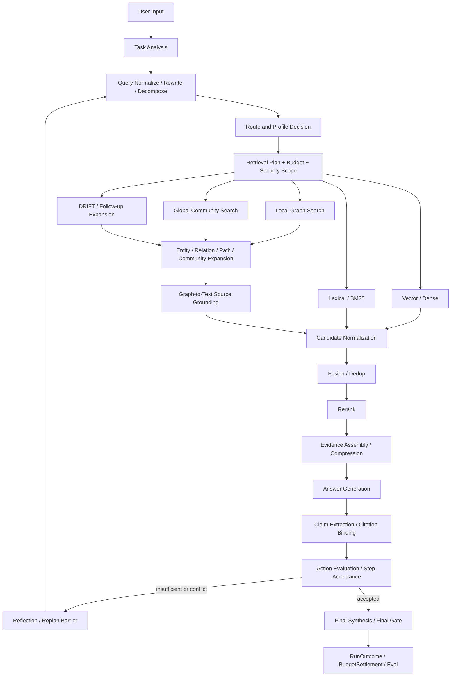

# 10 Observability & Eval：RAG Core Five、Agentic GraphRAG 与 Agent Efficiency 规范附录

updated: 2026-07-13
status: normative-target-controlled-appendix
module_number: 10
formal_parent: `docs/modules/10-observability-eval.md`
formal_path: `docs/modules/10-observability-eval-rag-agent-evaluation.md`
agent_mirror: `.agent/modules/10-observability-eval-rag-agent-evaluation.md`

> 本文是 `10 Observability & Eval` 的受控规范附录，补充 RAG / GraphRAG 五项核心质量指标、Agentic GraphRAG 全过程可观测性和 Agent 效率评测。主文档仍定义 Trace、Audit、Eval、Evidence、Release Gate 和 Ownership 总边界；本附录不得把设计中的 Metric、Trace、Runner 或 Dashboard 写成 Current。当前状态仍是 `implementation available / measurement blocked / quality not yet proven`。

## 1. 问题与设计目标

现有 Zuno Eval 能计算 Retrieval Recall@K、Hit Rate@K、简化的 `context_precision_at_k`、MRR、NDCG、Faithfulness、Answer Correctness、Citation 和 Failure Bucket，但存在三个结构性缺口：

1. 仓库中的简化 `context_precision_at_k = relevant_count / top_k_count` 不是排序敏感的标准 Context Precision。
2. `Context Recall` 和 `Answer Relevancy` 尚未成为一级、版本化、可审计的正式 Metric Contract。
3. Agentic GraphRAG 的 Query Rewrite、Route、Graph Traversal、Source Grounding、Fusion、Rerank、Reflection、Replan 和效率成本没有形成可重放的端到端 Trace/Eval 闭环。

本附录的目标是：

- 冻结五项核心 RAG 指标：`Context Precision`、`Context Recall`、`Faithfulness`、`Answer Relevancy`、`Answer Correctness`。
- 保留 Retrieval、Citation、Graph 和 Safety 指标作为诊断层，而不是用它们替代五项核心指标。
- 让每个指标可下钻到 Case、Claim、Context、Graph Object、Retrieval Attempt、StepRun 和 ActionRun。
- 让 `standard_rag`、`local_graphrag`、`deep_graphrag`、`agentic_graphrag` 在相同 Dataset Version、Case Set、Knowledge Snapshot 和 Metric Version 下可比较。
- 让 Agent 效率同时覆盖延迟、成本、步骤、并行、重试、返工、证据产出和任务成功，不用单一速度指标掩盖质量下降。
- 所有缺失输入、Judge 失败、Trace 不完整和 Profile 不完整都必须显式 `BLOCKED` 或 `UNAVAILABLE`，不得写成 0 分或 PASS。

非目标：

- 不把 Ragas、LangSmith、OpenTelemetry 或 Microsoft GraphRAG 作为内部领域事实 Owner。
- 不要求运行时必须依赖某一个外部评测 SDK。
- 不保存隐藏思维链；只保存结构化 Proposal、Action、Observation、Decision、Claim、Evidence 和理由码。
- 不用一个不可解释的综合分替代五项质量指标和效率向量。
- 不在本 PR 中实现业务 Runner、数据库 Migration 或真实 Benchmark。

## 2. 指标分层与 Ownership

### 2.1 一级核心质量指标

Zuno 将以下五项冻结为 `RAG Core Five`：

| Canonical Name | 中文 | 评测层 | 回答的问题 |
| --- | --- | --- | --- |
| `CONTEXT_PRECISION` | 上下文精确率 | Retrieval Ranking | 相关 Context 是否排在不相关 Context 前面 |
| `CONTEXT_RECALL` | 上下文召回率 | Context Coverage | Reference Answer 所需事实有多少被 Retrieved Context 支持 |
| `FAITHFULNESS` | 忠实度 | Grounded Generation | Generated Answer 中有多少 Claim 能被 Retrieved Context 支持 |
| `ANSWER_RELEVANCY` | 回答相关性 | Intent Alignment | Answer 是否直接、完整、适当地回应 User Input |
| `ANSWER_CORRECTNESS` | 回答正确性 | End Quality | Answer 与 Reference Answer / Gold Claims 是否事实一致且语义等价 |

外部 Adapter 可以映射 `Response Relevancy` 为 `ANSWER_RELEVANCY`，但内部 Canonical Name 不随外部 SDK 重命名。

### 2.2 诊断指标

以下指标继续保留，但不得冒充 RAG Core Five：

- Retrieval：Document Recall@K、Evidence Recall@K、Hit Rate@K、MRR@K、NDCG@K。
- Graph：Entity Recall、Relation Recall、Graph Path Recall、Community Coverage、Graph-to-Text Grounding Rate。
- Citation：Citation Accuracy、Source Doc Citation Accuracy、Source Span Accuracy、Claim Citation Coverage。
- Safety：Unsupported Claim Rate、Contradicted Claim Rate、Abstention Correctness。
- Runtime：Latency、Token、Cost、Retry、Fallback、Queue Wait、Cache Hit、Trace Completeness。
- Agent：Agent Goal Accuracy、Tool Call Accuracy、Tool Call F1、Plan Completion、Replan、Reflection、Human Intervention。

### 2.3 Ownership

- Knowledge / Agentic GraphRAG owns query interpretation、route、retrieval、graph traversal、fusion、rerank、evidence selection 和 KnowledgeVersion 事实。
- Agent Core owns PlanVersion、StepRun、ActionRun、Retry / Replan / Reflection 决策、RunOutcome 和 BudgetSettlement。
- Model Gateway owns ModelCallAttempt、RoutingDecision、UsageReceipt、Provider fallback 和 settled token/cost。
- Observability & Eval owns MetricDefinition、MetricEvaluationAttempt、RAGMetricResult、AgentEfficiencySnapshot、Eval Projection、BenchmarkComparison 和 ReleaseGateEvaluation。
- Security owns数据分类、授权、Redaction、External Sink Policy 和 Audit 内容要求。
- Infrastructure owns Store、Queue、Lease、Clock、Artifact 和 durable delivery primitive。
- Observability 接收事件不转移上述源领域事实 Ownership。

## 3. Metric Contract

### 3.1 MetricDefinition

```yaml
MetricDefinition:
  metric_definition_id: string
  canonical_name:
    CONTEXT_PRECISION
    | CONTEXT_RECALL
    | FAITHFULNESS
    | ANSWER_RELEVANCY
    | ANSWER_CORRECTNESS
    | diagnostic_metric_name
  aliases: [string]
  version: string
  evaluation_layer:
    RETRIEVAL_RANKING
    | CONTEXT_COVERAGE
    | GROUNDING
    | INTENT_ALIGNMENT
    | ANSWER_QUALITY
    | DIAGNOSTIC
    | EFFICIENCY
  evaluator_type: DETERMINISTIC | MODEL_JUDGE | EMBEDDING | HYBRID | HUMAN
  required_inputs: [string]
  optional_inputs: [string]
  reference_mode: REFERENCE_REQUIRED | REFERENCE_OPTIONAL | REFERENCE_FREE
  scoring_method: string
  aggregation_method: string
  score_range: object
  null_policy: BLOCKED | UNAVAILABLE
  claim_policy_ref: string | null
  context_relevance_policy_ref: string | null
  embedding_policy_ref: string | null
  judge_policy_ref: string | null
  calibration_dataset_ref: string | null
  threshold_policy_ref: string | null
  metric_hash: string
```

`metric_hash` 必须覆盖算法、Prompt、Judge、Embedding、Claim 分解、Context relevance、归一化、聚合和阈值版本。只变更显示名称不得改变 Metric 语义；任何语义变化必须创建新版本。

### 3.2 MetricEvaluationAttempt

```yaml
MetricEvaluationAttempt:
  metric_attempt_id: string
  eval_run_id: string
  case_execution_id: string
  metric_definition_ref: string
  attempt_no: int
  status:
    CREATED
    | VALIDATING_INPUTS
    | RUNNING
    | MEASURED
    | BLOCKED
    | UNAVAILABLE
    | INVALID
    | TIMED_OUT
    | CANCELLED
  input_artifact_refs: [string]
  evaluator_model_attempt_refs: [string]
  embedding_attempt_refs: [string]
  started_at: datetime
  ended_at: datetime | null
  reason_codes: [string]
  result_ref: string | null
```

状态转换：

```text
CREATED -> VALIDATING_INPUTS -> RUNNING -> MEASURED
                           |-> BLOCKED | UNAVAILABLE | INVALID
RUNNING -> TIMED_OUT | UNAVAILABLE | CANCELLED
```

Retry 创建新 Attempt。旧 Attempt 不原地改成 MEASURED。Judge 超时、Embedding 缺失、Reference 缺失或 Trace 字段缺失不能记为 0。

### 3.3 RAGMetricResult

```yaml
RAGMetricResult:
  rag_metric_result_id: string
  metric_attempt_ref: string
  canonical_name: string
  metric_version: string
  score: number | null
  status: MEASURED | BLOCKED | UNAVAILABLE | INVALID
  user_input_ref: string
  response_ref: string | null
  reference_answer_ref: string | null
  retrieved_context_refs: [string]
  reference_context_refs: [string]
  relevant_context_refs: [string]
  irrelevant_context_refs: [string]
  reference_claim_refs: [string]
  generated_claim_refs: [string]
  supported_claim_refs: [string]
  unsupported_claim_refs: [string]
  contradicted_claim_refs: [string]
  missing_reference_claim_refs: [string]
  true_positive_claim_refs: [string]
  false_positive_claim_refs: [string]
  false_negative_claim_refs: [string]
  component_scores: map<string,number>
  reason_codes: [string]
  trace_ref: string
  result_hash: string
```

大对象和原文保存到 Artifact Store，Result 保存版本、引用、Hash 和可解释诊断。Dashboard 展示 Score 时必须同时展示 Metric Version、Status、Case Count、Unavailable Count 和 Calibration 状态。

## 4. RAG Core Five 规范

### 4.1 Context Precision

目标：判断相关 Context 是否被排序到不相关 Context 之前。

Canonical V1 为排序敏感的 Average Precision 风格：

```text
Context Precision@K
= sum(Precision@k * relevance(k)) / relevant_items_in_top_k
```

规则：

- `relevance(k)` 必须由 versioned ContextRelevancePolicy 产生。
- Reference Context / Gold Evidence 可用时，Release Gate 默认使用 reference-based 版本。
- ID-based、non-LLM similarity 和 LLM relevance 可以是不同 Metric Version，禁止混合聚合。
- 仓库现有 `relevant_count / retrieved_count` 只命名为 `TOP_K_CONTEXT_RELEVANT_RATIO`，不得满足 `CONTEXT_PRECISION` Requirement。
- 空 Top-K、无 Reference 且 Metric 要求 Reference、或 relevance 判定缺失时返回 BLOCKED/UNAVAILABLE。

必须输出：

- 每个 Context 的 rank、relevance verdict、Precision@k。
- 原始 Retriever rank、Fusion rank、Rerank rank。
- 被 Fusion/Rerank 丢弃的相关 Context 及 dropped reason。

### 4.2 Context Recall

目标：判断 Reference Answer 所需事实有多少能由 Retrieved Context 支持。

Canonical V1：

```text
Context Recall
= retrieved_context_supported_reference_claims
  / total_reference_claims
```

规则：

- Reference Answer 先按 versioned ClaimPolicy 分解为 Atomic Reference Claims。
- 每个 Reference Claim 必须关联支持它的 Retrieved Context refs 或标记 MISSING/CONTRADICTED/UNAVAILABLE。
- `Retrieval Recall@K`、Document Recall@K、Evidence Recall@K 是重要诊断，但不能替代 Claim-based Context Recall。
- 无 Reference Answer 的 Case 不能计算 reference-based Context Recall；可运行单独命名的 reference-free coverage diagnostic，但不得写入 Core Five 同名字段。
- No-answer / Refuse Case 使用 expected_behavior 和 required abstention evidence，不伪造普通 Reference Claims。

### 4.3 Faithfulness

目标：判断 Generated Answer 是否忠实于 Retrieved Context，而不是判断世界事实是否正确。

Canonical V1：

```text
Faithfulness
= supported_generated_claims / total_generated_claims
```

流程：

1. Generated Answer 分解为 Atomic Generated Claims。
2. 每个 Claim 对 Retrieved Context 执行 entailment / contradiction 判定。
3. 输出 `SUPPORTED`、`UNSUPPORTED`、`CONTRADICTED`、`UNVERIFIABLE`。
4. Score 只在全部必需判定完成后生成；部分 Judge 失败时 Result 为 UNAVAILABLE 或按 Policy 生成带 completeness 的 partial diagnostic，后者不得进入 Release Gate。
5. Faithfulness 不等于 Answer Correctness、Citation Accuracy 或 Citation Faithfulness。

`Unsupported Claim Rate` 和 `Contradicted Claim Rate` 必须从同一 Claim Ledger 派生，避免多个 Evaluator 使用不同分母。

### 4.4 Answer Relevancy

内部 Canonical Name 为 `ANSWER_RELEVANCY`，外部别名可以是 `Response Relevancy`。

Canonical V1 对齐常用 reverse-question 语义：

1. 使用 pinned JudgePolicy 从 Generated Answer 反向生成 N 个 Candidate Questions。
2. 使用 pinned EmbeddingPolicy 比较原始 User Input 与 Candidate Questions。
3. Score 为平均 cosine similarity。
4. `N`、Prompt、Embedding Model、语言归一化和 Clamp Policy 全部进入 metric_hash。

同时输出解释性诊断：

- directness；
- completeness；
- unnecessary_detail；
- intent_coverage；
- non_answer / refusal correctness。

Answer Relevancy 不评价事实正确性。一个事实正确但只回答一半的问题，应得到较低 Relevancy。

### 4.5 Answer Correctness

目标：判断 Generated Answer 与 Reference Answer / Gold Claims 的事实一致性和语义等价性。

Canonical V1 为 versioned Hybrid：

```text
Factual Correctness:
  TP = generated and reference both contain the fact
  FP = generated contains an incorrect or non-reference factual claim
  FN = required reference fact is missing

Factual F1
= TP / (TP + 0.5 * (FP + FN))

Answer Correctness
= weighted(Factual F1, Semantic Similarity)
```

规则：

- 权重必须由 MetricDefinition 固定，不能由单次 EvalRun 临时改变。
- 必须分别保存 factual_precision、factual_recall、factual_f1、semantic_similarity 和 final score。
- 对数字、日期、实体、否定、条件、范围和时态使用类型化比较或专用 Rubric。
- Reference 多答案、等价表达和允许的附加事实必须由 Case Rubric 明确。
- 无 Reference 的在线样本可以运行 factuality / groundedness diagnostic，但不得写入 reference-based Answer Correctness。

## 5. 五项指标输入闭包

每个 Case 至少固定：

```yaml
RAGCoreFiveInputBundle:
  user_input_ref: string
  reference_answer_ref: string
  reference_claim_set_ref: string
  reference_context_refs: [string]
  expected_doc_ids: [string]
  expected_evidence_refs: [string]
  generated_response_ref: string
  retrieved_context_refs: [string]
  retrieval_trace_ref: string
  graph_trace_ref: string | null
  claim_ledger_ref: string
  citation_ledger_ref: string
  metric_definition_refs: [string]
  judge_policy_ref: string
  embedding_policy_ref: string
  knowledge_snapshot_ref: string
  corpus_manifest_ref: string
  runtime_config_ref: string
  model_routing_policy_ref: string
```

缺少任一 Metric 的 required input 时，只阻塞该 Metric；若 Release Gate 要求 Core Five 全部 measured，则 Gate 为 BLOCKED。不得用旧 Run 的某项分数拼接新 Run。

## 6. Agentic GraphRAG 全过程 Trace

### 6.1 规范流程



`basic | local | global | drift` 是 Query Method；`standard_rag | local_graphrag | deep_graphrag | agentic_graphrag` 是 Eval Profile。两者必须分别记录，不得通过一个字符串混淆。

### 6.2 Span Tree

```text
agent_run
  task_analysis
  query_processing
    query_normalize
    query_rewrite
    query_decompose
    intent_classify
  retrieval_route
    profile_select
    query_method_select
    budget_feasibility
    security_scope_gate
  retrieval_attempt
    dense_retrieval
    lexical_retrieval
    local_graph_search
      entity_resolution
      entity_expand
      relation_expand
      path_expand
      community_lookup
      text_unit_mapping
    global_graph_search
      community_select
      map_batch
      intermediate_rate
      reduce
    drift_search
      primer
      followup_generate
      followup_local_search
      hierarchy_rank
    candidate_normalize
    fusion
    dedup
    rerank
    evidence_assemble
    context_compress
  answer_generate
  claim_extract
  citation_bind
  action_evaluation
  step_acceptance
  optional_step_reflection
  optional_replan
  final_synthesis
  final_gate
  run_outcome
  budget_settlement
  eval
```

### 6.3 AgenticGraphRAGTrace

```yaml
AgenticGraphRAGTrace:
  graph_trace_id: string
  run_id: string
  plan_version_id: string
  step_run_id: string
  action_run_id: string
  retrieval_attempt_id: string
  original_query_ref: string
  normalized_query_ref: string
  query_variant_refs: [string]
  requested_profile: string
  resolved_profile: string
  requested_query_method: auto | basic | local | global | drift
  resolved_query_method: basic | local | global | drift
  router_decision: string
  route_reason_codes: [string]
  knowledge_snapshot_ref: string
  graph_snapshot_ref: string | null
  index_version_refs: [string]
  enabled_retrievers: [string]
  budget_reservation_ref: string
  security_scope_ref: string
  fallback_policy_ref: string
  fusion_policy_ref: string
  rerank_policy_ref: string
  context_budget: object
  candidate_refs: [string]
  evidence_refs: [string]
  dropped_candidate_refs: [string]
  graph_traversal_refs: [string]
  reflection_refs: [string]
  replan_refs: [string]
  status: CREATED | RUNNING | SUCCEEDED | PARTIAL | BLOCKED | FAILED | CANCELLED
  reason_codes: [string]
```

### 6.4 RetrievalCandidateTrace

```yaml
RetrievalCandidateTrace:
  candidate_id: string
  retrieval_attempt_id: string
  query_variant_id: string
  retriever: dense | lexical | entity | relation | path | community | drift | other
  source_backend: string
  source_type: document | chunk | entity | relation | path | community_report | covariate
  source_ref: string
  document_ref: string | null
  chunk_ref: string | null
  evidence_span_ref: string | null
  graph_entity_refs: [string]
  graph_relation_refs: [string]
  graph_path_ref: string | null
  community_ref: string | null
  raw_score: number | null
  normalized_score: number | null
  source_rank: int | null
  fusion_score: number | null
  fusion_rank: int | null
  rerank_score: number | null
  final_rank: int | null
  selected: boolean
  dropped_stage: retrieval | grounding | fusion | dedup | rerank | budget | security | null
  dropped_reason_code: string | null
  latency_ms: number
  token_count: int | null
  cost_amount: number | null
  trace_ref: string
```

### 6.5 GraphTraversalRecord

```yaml
GraphTraversalRecord:
  traversal_id: string
  retrieval_attempt_id: string
  method: local | global | drift
  seed_entity_refs: [string]
  resolved_entity_refs: [string]
  unresolved_mentions: [string]
  relation_refs: [string]
  path_refs: [string]
  community_refs: [string]
  text_unit_refs: [string]
  document_refs: [string]
  hop_limit: int
  hops_executed: int
  branch_count: int
  pruned_branch_count: int
  graph_snapshot_ref: string
  traversal_budget: object
  stop_reason: enough_evidence | budget | no_frontier | security | timeout | cancelled
  latency_ms: number
  reason_codes: [string]
```

Graph Entity、Relation、Community 或 Path 被用于回答时，必须最终回溯到授权后的 Text Unit / Document / Evidence Span。只有 Graph Summary 而没有 Source Grounding 的结果可以用于导航，但默认不能成为严格 Grounded Answer 的最终证据。

## 7. Agentic 循环可观测性

每一次 Agentic GraphRAG 循环必须记录：

- Query Variant 是初始、Rewrite、Decomposition、Reflection 还是 Replan 产生。
- 触发条件：insufficient evidence、conflict、low confidence、citation gap、budget、timeout 或 policy。
- 旧 PlanVersion 和新 PlanVersion；Replan 后只执行新激活版本的剩余步骤。
- Reflection 输入只能是结构化结果和 Evidence，不保存隐藏思维链。
- Retry 与 Replan 分开计数：执行瞬时失败属于 Retry，假设或依赖失效属于 Replan。
- 并行 DispatchGroup、DispatchItem、BranchResultRef、JoinPolicy 和 Partial Failure。
- Final Synthesis 串行，不能因为并行分支更快而绕过 Join Evaluation、Final Gate 或 Citation Check。

### 7.1 AgentLoopObservation

```yaml
AgentLoopObservation:
  observation_id: string
  run_id: string
  plan_version_id: string
  step_run_id: string
  loop_no: int
  phase: PLAN | EXECUTE | EVALUATE | REFLECT | REPLAN | SYNTHESIZE | FINAL_GATE
  trigger_reason: string
  input_ref: string
  output_ref: string
  evidence_count: int
  accepted_evidence_count: int
  conflict_count: int
  retry_count_delta: int
  replan_count_delta: int
  model_call_count_delta: int
  tool_call_count_delta: int
  retrieval_call_count_delta: int
  token_delta: int
  cost_delta: number
  wall_time_ms: number
  active_time_ms: number
  wait_time_ms: number
  outcome: CONTINUE | ACCEPT | RETRY | REPLAN | ABSTAIN | FAIL | CANCEL
  reason_codes: [string]
```

## 8. GraphRAG 与 Agentic Failure Bucket

现有四个 Bucket 保留：

- `doc_miss`
- `doc_hit_text_miss`
- `text_hit_citation_miss`
- `citation_hit_answer_wrong`

新增分层 Bucket：

### Query / Route

- `query_analysis_error`
- `query_rewrite_drift`
- `query_decomposition_incomplete`
- `route_mismatch`
- `profile_fallback_unexplained`

### Graph Retrieval

- `entity_resolution_miss`
- `relation_retrieval_miss`
- `graph_path_miss`
- `community_summary_miss`
- `graph_snapshot_unavailable`
- `graph_traversal_budget_exhausted`
- `drift_followup_low_yield`

### Grounding / Ranking

- `graph_source_grounding_miss`
- `text_unit_mapping_miss`
- `fusion_dropped_gold_evidence`
- `rerank_demoted_gold_evidence`
- `context_noise_excess`
- `context_coverage_gap`
- `evidence_conflict_unresolved`

### Generation / Agent Control

- `answer_unfaithful`
- `answer_irrelevant`
- `answer_incorrect`
- `citation_binding_miss`
- `budget_exhausted_before_evidence`
- `redundant_retrieval`
- `retry_churn`
- `replan_churn`
- `reflection_churn`
- `model_escalation_excess`
- `tool_overcall`
- `parallel_join_waste`

每个 Bucket 必须声明 required trace fields。缺失字段返回 `unavailable_due_to_missing_trace_fields`，不根据最终分数猜测根因。

## 9. Agent 效率 Scorecard

### 9.1 原则

Agent 效率是质量约束下的多维向量：

```text
Efficiency = outcome quality
           + work required
           + latency
           + resource/cost
           + coordination overhead
           + recovery overhead
```

禁止默认建立一个不可解释的 `Agent Efficiency Score`。如未来需要综合分，必须独立 MetricDefinition、权重版本、校准集、适用任务类型和 ADR。

质量、安全、权限和正确性是硬约束。低成本或低延迟不能抵消 Faithfulness、Answer Correctness、Security Gate 或 Tool Effect 错误。

### 9.2 AgentEfficiencySnapshot

```yaml
AgentEfficiencySnapshot:
  efficiency_snapshot_id: string
  run_id: string
  eval_run_id: string | null
  profile: string
  question_type: string | null
  outcome:
    SUCCEEDED
    | ABSTAINED
    | REFUSED
    | PARTIAL
    | FAILED
    | CANCELLED
  agent_goal_accuracy: number | null
  task_success: boolean | null
  plan_version_count: int
  planned_step_count: int
  executed_step_count: int
  accepted_step_count: int
  failed_step_count: int
  skipped_step_count: int
  action_count: int
  model_call_count: int
  retrieval_call_count: int
  tool_call_count: int
  tool_call_accuracy: number | null
  tool_call_f1: number | null
  retry_count: int
  fallback_count: int
  replan_count: int
  reflection_count: int
  escalation_count: int
  human_intervention_count: int
  duplicate_work_count: int
  discarded_result_count: int
  retrieved_candidate_count: int
  accepted_evidence_count: int
  citation_count: int
  wall_time_ms: number
  active_time_ms: number
  queue_wait_ms: number
  model_time_ms: number
  retrieval_time_ms: number
  graph_time_ms: number
  tool_time_ms: number
  reflection_time_ms: number
  synthesis_time_ms: number
  first_token_ms: number | null
  critical_path_ms: number
  parallel_branch_time_sum_ms: number
  token_input: int
  token_output: int
  token_total: int
  estimated_cost: number
  settled_cost: number | null
  budget_limit: number
  budget_utilization: number
  cache_hit_count: int
  cache_miss_count: int
  trace_completeness: number
  metric_definition_refs: [string]
```

### 9.3 派生效率指标

必须支持以下派生指标并记录分母：

```text
Plan Churn
= plan_version_count - 1

Step Acceptance Rate
= accepted_step_count / executed_step_count

Retry Rate
= retry_count / execution_attempt_count

Replan Rate
= replan_count / run_count

Evidence Yield
= accepted_evidence_count / retrieval_call_count

Candidate Yield
= accepted_evidence_count / retrieved_candidate_count

Citation Yield
= supported_citation_count / accepted_evidence_count

Wasted Work Ratio
= discarded_or_duplicate_active_time / active_time_ms

Parallel Efficiency
= critical_path_work_saved / parallelizable_work
```

`Parallel Efficiency` 的精确定义必须由版本化 MetricDefinition 固定。Dashboard 同时展示 wall time、critical path、branch time sum、join wait 和 idle time，避免只看并发数。

```text
Quality per Cost
= quality_metric / settled_cost

Goal Success per 1K Tokens
= successful_goal_count / token_total * 1000
```

`Quality per Cost` 必须指定 quality_metric，不能将五项平均后隐式计算。

### 9.4 延迟与成本归因

每个 Run 必须满足：

```text
wall_time
≈ active_time + wait_time + orchestration_overhead
```

允许并行导致各 Span duration 之和大于 wall_time，因此不能把 Span duration 直接相加当作端到端延迟。

成本必须区分：

- estimated vs settled；
- business budget vs provider quota；
- initial attempt vs hidden SDK retry；
- successful vs discarded branch；
- Judge / Eval cost vs Product Run cost；
- cache hit avoided cost；
- response lost but provider charged；
- fallback 和 role escalation cost。

## 10. Evaluation Slice 与可比性

至少按以下 Slice 输出 Core Five、Graph 诊断和 Efficiency：

- profile：standard / local / deep / agentic；
- query method：basic / local / global / drift；
- question type：single-hop、multi-hop、entity、relation、aggregation、comparison、temporal、conflict、no-answer、citation-required；
- difficulty / expected hop count；
- language；
- source type；
- graph snapshot / index version；
- model routing policy；
- budget class；
- security scope class；
- success / abstain / refuse / failure。

任何 Slice 样本数不足必须显示 sample_count 和 confidence 状态，不得以小样本高分宣称质量。

Benchmark 可比性必须固定：

- Dataset Version 和 Case Set Hash；
- Reference Answer / Claim Set Version；
- Corpus Manifest、Knowledge Snapshot、Graph Snapshot、Index Version；
- Runtime Config、Retrieval Profile、Query Method；
- Model Routing Policy、Judge Policy、Embedding Policy；
- Metric Definition 和 Aggregation；
- Sampling Policy；
- Allowed external knowledge policy；
- Security scope。

## 11. Release Gate

### 11.1 RAG Core Five Gate

`RAG_CORE_FIVE_GATE_V1` 的顺序：

```text
Input Completeness
-> Trace Completeness
-> Profile Completeness
-> Metric Completeness
-> Judge / Embedding Calibration
-> Benchmark Comparability
-> Core Five Thresholds
-> Citation / Safety Guardrails
-> Efficiency Guardrails
```

Core Five 全部必须是 MEASURED。任一项 BLOCKED、UNAVAILABLE 或 INVALID，则 Gate 为 BLOCKED，不能以其余四项平均补偿。

在固定绝对阈值完成校准和 ADR 前，Target 默认采用：

- candidate 不得低于批准的 baseline；
- critical question type / security slice 不得退化；
- Faithfulness、Answer Correctness 和 Unsupported Claim Rate 属于不可被成本收益抵消的质量 Guardrail；
- Context Precision 改善不能掩盖 Context Recall 下降；
- Answer Relevancy 改善不能掩盖 Answer Correctness 下降；
- 总平均改善不能掩盖 no-answer、conflict、multi-hop 或 citation-required Slice 退化。

现有 Release Gate 阈值继续作为兼容诊断：

```text
Agentic Recall@5 >= standard_rag
Evidence Text Available@5 >= 0.60
Source Doc Citation Accuracy >= 0.85
Citation Accuracy >= 0.30
Answer Correctness >= standard_rag
Unsupported Claim Rate 不得恶化
```

它们不能替代 RAG Core Five 全部 measured。

### 11.2 Quality-constrained Efficiency Gate

效率比较只能在候选满足质量、安全和可比性后进行：

- wall latency、p95、first token；
- settled cost；
- token total；
- model / retrieval / tool call count；
- retry、fallback、replan、reflection；
- human intervention；
- wasted work；
- evidence yield；
- critical path 和 parallel efficiency。

候选更快但质量下降时 Gate 失败；候选质量相同且成本/延迟更低时才可声明效率改善。若 settled usage 缺失，只能显示 estimated，不能通过 Cost Gate。

## 12. Dashboard 与 Drill-down

Dashboard 至少提供：

### RAG Quality

- Core Five 总览；
- Profile / Query Method / Question Type Slice；
- Case-level Metric Status；
- Context rank relevance；
- Reference Claims 与 Retrieved Context 覆盖；
- Generated Claims 与 Context 支持关系；
- Answer Relevancy reverse questions；
- Answer Correctness TP/FP/FN；
- Citation 和 Unsupported Claim。

### GraphRAG Trace

- Route Timeline；
- Query Rewrite / Decomposition；
- Entity、Relation、Path、Community；
- Graph Snapshot；
- Graph-to-Text mapping；
- Candidate rank 变化；
- Fusion / Rerank dropped reasons；
- Context Budget；
- Evidence provenance；
- DRIFT follow-up tree。

### Agent Efficiency

- End-to-end critical path；
- Active vs Wait；
- Parallel branches / Join wait；
- Plan / Step / Action；
- Retry / Replan / Reflection；
- Model role escalation；
- Token / Cost；
- Evidence Yield；
- Wasted Work；
- Goal Accuracy / Tool Call Accuracy；
- Human Intervention。

Dashboard 只能读取授权后的 Projection，不得修改源领域事实、Metric Result 或 Release Gate。

## 13. Failure、Retry、Recovery 与 Idempotency

- Metric Attempt 以 `eval_run_id + case_execution_id + metric_definition_id + attempt_no` 唯一。
- 相同 input hash 和 metric hash 可复用已验证结果；不同 input hash 禁止复用。
- Judge 超时按 JudgePolicy bounded retry；耗尽后 UNAVAILABLE。
- Embedding Provider 失败不能切换到未记录的模型；Fallback 必须生成新 Attempt 并改变 metric_hash / compatibility。
- Claim Extraction 与 Entailment 结果使用 Artifact hash 和 provenance，可独立重放。
- Graph Trace 丢失时 Graph-specific Bucket 和 Metric 为 UNAVAILABLE；普通 Answer Metric 是否可测由 required input 决定。
- Eval Worker Crash 后先检查已提交 Result hash，再对未完成 Metric 创建新 Attempt。
- Late Trace 到达可触发新 Evaluation Revision，不原地篡改已发布 Result。
- Release Gate 只绑定 immutable Eval Result set 和 comparison hash。

## 14. Fault Test Matrix

| Fault | 必须证明 |
| --- | --- |
| Context Rank Swap | 相关 Context 后移时 Context Precision 下降 |
| Missing Reference Claims | Context Recall BLOCKED/UNAVAILABLE，不伪造 0 |
| Partial Claim Judge Failure | Faithfulness 不进入 Release Gate |
| Answer Relevancy Judge Timeout | 新 Attempt 或 UNAVAILABLE，不沿用旧分 |
| Embedding Policy Drift | Benchmark INCOMPARABLE |
| Answer Correctness Reference Mismatch | INVALID/INCOMPARABLE |
| Entity Resolution Miss | `entity_resolution_miss` 且可下钻 mention/entity |
| Graph Snapshot Missing | Graph 流程 BLOCKED，允许策略化回退但必须记录 |
| Graph-to-Text Mapping Loss | Graph Candidate 不可作为严格 Evidence |
| Fusion Drops Gold | `fusion_dropped_gold_evidence` |
| Reranker Demotes Gold | rank delta 和 dropped reason 可查 |
| DRIFT Follow-up Explosion | budget stop、branch count 和低 yield 可查 |
| Replan Churn | PlanVersion、trigger、cost 和 wasted work 可查 |
| Parallel Partial Failure | Join Evaluation、critical path 和 discarded work 可查 |
| Hidden Model Retry | Usage/latency/cost 不被少计 |
| Settled Usage Delayed | Cost Gate BLOCKED 或 estimated-only |
| Missing Agent Trace | Efficiency Metric UNAVAILABLE |
| Profile Partial Run | Core Five Gate BLOCKED |
| Critical Slice Regression | 总平均改善也不能 PASS |
| Quality-Cost Tradeoff | 质量 Guardrail 不被低成本覆盖 |

## 15. Requirement Enforcement Matrix

| Requirement | Runtime Control | Tests | Evidence |
| --- | --- | --- | --- |
| ARCH-OBS-RAG-001 Core Five Registry | RC-OBS-RAG-001 canonical/version/alias guard | OBS-RAG-001-UT/IT/FT/E2E | EV-OBS-RAG-001 |
| ARCH-OBS-RAG-002 Context Precision | RC-OBS-RAG-002 rank-aware relevance ledger | OBS-RAG-002-UT/IT/FT/E2E | EV-OBS-RAG-002 |
| ARCH-OBS-RAG-003 Context Recall | RC-OBS-RAG-003 reference-claim coverage | OBS-RAG-003-UT/IT/FT/E2E | EV-OBS-RAG-003 |
| ARCH-OBS-RAG-004 Faithfulness | RC-OBS-RAG-004 generated-claim entailment | OBS-RAG-004-UT/IT/FT/E2E | EV-OBS-RAG-004 |
| ARCH-OBS-RAG-005 Answer Relevancy | RC-OBS-RAG-005 reverse-question/embedding policy | OBS-RAG-005-UT/IT/FT/E2E | EV-OBS-RAG-005 |
| ARCH-OBS-RAG-006 Answer Correctness | RC-OBS-RAG-006 factual F1/semantic policy | OBS-RAG-006-UT/IT/FT/E2E | EV-OBS-RAG-006 |
| ARCH-OBS-RAG-007 Metric Status | RC-OBS-RAG-007 no-null-as-zero guard | OBS-RAG-007-UT/IT/FT/E2E | EV-OBS-RAG-007 |
| ARCH-OBS-RAG-008 Metric Versioning | RC-OBS-RAG-008 metric hash/calibration guard | OBS-RAG-008-UT/IT/FT/E2E | EV-OBS-RAG-008 |
| ARCH-OBS-RAG-009 Route Trace | RC-OBS-RAG-009 requested/resolved route adapter | OBS-RAG-009-UT/IT/FT/E2E | EV-OBS-RAG-009 |
| ARCH-OBS-RAG-010 Graph Traversal Trace | RC-OBS-RAG-010 entity/relation/path/community ledger | OBS-RAG-010-UT/IT/FT/E2E | EV-OBS-RAG-010 |
| ARCH-OBS-RAG-011 Source Grounding | RC-OBS-RAG-011 graph-to-text evidence guard | OBS-RAG-011-UT/IT/FT/E2E | EV-OBS-RAG-011 |
| ARCH-OBS-RAG-012 Fusion/Rerank Trace | RC-OBS-RAG-012 rank lineage/dropped reason | OBS-RAG-012-UT/IT/FT/E2E | EV-OBS-RAG-012 |
| ARCH-OBS-RAG-013 Agentic Loop Trace | RC-OBS-RAG-013 loop trigger/outcome ledger | OBS-RAG-013-UT/IT/FT/E2E | EV-OBS-RAG-013 |
| ARCH-OBS-RAG-014 Failure Buckets | RC-OBS-RAG-014 required-field classifier | OBS-RAG-014-UT/IT/FT/E2E | EV-OBS-RAG-014 |
| ARCH-OBS-RAG-015 Evaluation Slices | RC-OBS-RAG-015 slice completeness guard | OBS-RAG-015-UT/IT/FT/E2E | EV-OBS-RAG-015 |
| ARCH-OBS-RAG-016 Agent Efficiency | RC-OBS-RAG-016 efficiency snapshot reducer | OBS-RAG-016-UT/IT/FT/E2E | EV-OBS-RAG-016 |
| ARCH-OBS-RAG-017 Quality-constrained Efficiency | RC-OBS-RAG-017 quality-first gate | OBS-RAG-017-UT/IT/FT/E2E | EV-OBS-RAG-017 |
| ARCH-OBS-RAG-018 Cost/Latency Attribution | RC-OBS-RAG-018 critical-path/usage reconciliation | OBS-RAG-018-UT/IT/FT/E2E | EV-OBS-RAG-018 |
| ARCH-OBS-RAG-019 Core Five Release Gate | RC-OBS-RAG-019 complete/comparable/core-five guard | OBS-RAG-019-UT/IT/FT/E2E | EV-OBS-RAG-019 |
| ARCH-OBS-RAG-020 Reproducible Evidence | RC-OBS-RAG-020 immutable artifact/result hashes | OBS-RAG-020-UT/IT/FT/E2E | EV-OBS-RAG-020 |

Target 变为 Current 至少需要：Metric 实现、Dataset/Claim Schema、Migration（如适用）、UT、IT、FT、E2E、固定 Benchmark、Trace Artifact、Judge Calibration、EvidenceRecord 和可重放 Release Gate。文档或 Dashboard 存在不代表 quality proven。

## 16. Cross-Module Dependency Requests

### 03 Knowledge / Agentic GraphRAG

冻结 Query Variant、RetrievalPlan、requested/resolved profile、requested/resolved query method、RetrievalCandidate、GraphTraversal、Graph-to-Text mapping、Fusion/Rerank rank lineage、Knowledge/Graph Snapshot 和 dropped reason Contract。

### 04 Model Gateway

冻结 Judge、Embedding、Generator 的 ModelCallAttempt、RoutingDecision、UsageReceipt、hidden retry、fallback、estimated/settled cost 和 cancellation Contract。

### 06 Agent Core

输出 PlanVersion、StepRun、ActionRun、DispatchGroup、BranchResultRef、Join、Reflection、Replan、Final Gate、RunOutcome 和 BudgetSettlement 关联事件；不把 Trace Projection 当作控制事实。

### 09 Security

确认 Eval Artifact 数据分类、Prompt/Answer/Context Redaction、外部 Eval Provider policy、Judge data residency 和敏感 Dataset retention。

### 11 Infrastructure

提供 Eval Job Queue、Artifact Store、Metric Result persistence、Trace Store、critical-path timestamps、Lease/Fencing、Backup/Restore 和容量能力。

ADR 0003 与 Wave 1 Registry 已合并；共享字段、枚举、Owner 和 Failure Code 为 `CONFIRMED_TARGET`，但仍不是 Current 或工程完成证据。

## 17. Current、Target、Future

### Current

- 本地 Retrieval 指标和部分 Answer/Judge 字段存在。
- `context_precision_at_k` 当前是简化 relevant ratio，不满足本附录 Canonical Context Precision。
- Faithfulness 和 Answer Correctness 可从 Judge 输出读取，但没有完整 Metric Attempt、Claim Ledger、Calibration 和 Release Gate 证据。
- Context Recall 与 Answer Relevancy 尚无完整实现证据。
- Agentic GraphRAG 部分 route、retrieval、fallback、citation trace 字段存在，但不证明全链路和效率闭环完成。

### Target

- 本附录全部 Contract、Trace、Metric、Failure Bucket、Dashboard、Gate 和 Requirement-to-Evidence 闭环。
- Core Five 对相同固定 Case Set 的四个 Profile 全量测量。
- Agentic GraphRAG 每阶段可下钻且能定位质量增益或损失发生在哪一步。
- Agent 效率在质量约束下可比较。

### Future

- 经过校准的专用 Judge / Hallucination classifier。
- 在线 Shadow Eval 和 drift detection。
- 因果归因与自动实验建议。
- 经治理批准的综合 Agent Efficiency Score。
- 生产 Tail Sampling 和跨区域 Eval Federation。

## 18. 官方参考

- Ragas Context Precision: https://docs.ragas.io/en/stable/concepts/metrics/available_metrics/context_precision/
- Ragas Context Recall: https://docs.ragas.io/en/stable/concepts/metrics/available_metrics/context_recall/
- Ragas Faithfulness: https://docs.ragas.io/en/stable/concepts/metrics/available_metrics/faithfulness/
- Ragas Answer / Response Relevancy: https://docs.ragas.io/en/stable/concepts/metrics/available_metrics/answer_relevance/
- Ragas Answer Correctness: https://docs.ragas.io/en/stable/concepts/metrics/available_metrics/answer_correctness/
- Ragas Agentic / Tool Metrics: https://docs.ragas.io/en/stable/concepts/metrics/available_metrics/agents/
- Microsoft GraphRAG Query Overview: https://microsoft.github.io/graphrag/query/overview/
- Microsoft GraphRAG Local Search: https://microsoft.github.io/graphrag/query/local_search/
- Microsoft GraphRAG Global Search: https://microsoft.github.io/graphrag/query/global_search/
- Microsoft GraphRAG DRIFT Search: https://microsoft.github.io/graphrag/query/drift_search/
- LangSmith Observability Concepts: https://docs.langchain.com/langsmith/observability-concepts
- LangSmith Evaluation Concepts: https://docs.langchain.com/langsmith/evaluation-concepts


## 17.1 Wave 1 Metric 与 Receipt 对齐

RAG Core Five 与 Agent Efficiency 使用 Wave 1 已确认的源事实：Model 调用成本读取 Model Gateway `UsageReceipt` 的 `ESTIMATED / OBSERVED / SETTLED / CORRECTION` 版本；Security 范围读取 `effective_security_epoch_ref/hash`；运行对象引用 Agent Core `PlanVersion / StepRun / ActionRun / RunOutcome / BudgetSettlement`。Observability 不重定义这些领域事实。

现有 Release Gate 阈值继续保留；RAG Core Five 是新增一级质量维度，不自动替换、降低或重新解释 Recall、Citation、Unsupported Claim 等现有门槛。阈值变化必须由独立 Policy/ADR 完成。Core Five 任一必需输入 `BLOCKED / UNAVAILABLE / INCOMPARABLE` 时，不得通过单一效率分或成本下降补偿。

Judge 调用必须经过 Model Gateway，具有独立 ModelCallAttempt、UsageReceipt、Security、Budget 和 Trace；模型自评不能单独证明自身质量。Agent Efficiency 保持质量优先的向量，不选择不透明综合分。
