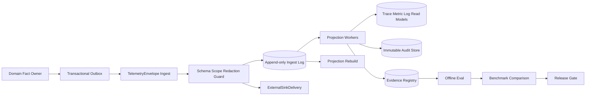

# 10 Observability & Eval

updated: 2026-07-13  
status: normative-target-module-design  
module_number: 10
formal_path: `docs/modules/10-observability-eval.md`  
agent_mirror: `.agent/modules/10-observability-eval.md`

所属运行域：Governance & Observability、Agent Core Runtime、Durable Infrastructure。

> 本文是 Zuno 10 Observability & Eval（可观测性与评测）的唯一正式 Target 设计。Current、Gap、Measurement Blocked 与质量声明仍以 `docs/status/production-readiness.md` 和 `docs/evidence/` 为事实源。存在 Runner、Report、Gate 或 Trace helper 只证明 `implementation available`，不能证明 `quality proven`。

## 1. 问题、目标与非目标

企业知识库 Agent 的一次回答会跨越输入门禁、上下文、PlanVersion、StepRun、ActionRun、模型、检索、工具、安全、Final Gate、Publication、RunOutcome 与 BudgetSettlement。仅保存文本日志无法回答：失败发生在哪一层、事件是否丢失、结果是否可比较、Release Gate 为什么阻塞、审计是否完整、质量声明由什么证据支持。

本模块目标：

1. 建立稳定的 Trace Context、Trace Tree、Span/Event Ingestion、Metric、Structured Log、Audit 与 Evidence read model。
2. 在重复、乱序、延迟、Store/Queue/Sink 故障下保持可解释、可恢复、幂等。
3. 建立 Eval Dataset、Case、Run、Result、Judge Policy、Failure Bucket、Benchmark Comparison、Release Gate 与 Evidence Registry。
4. 严格区分 `prepared`、`runtime observed`、`measured`、`blocked`、`unavailable`、`quality proven`。
5. 支持本地事实存储，并通过经 Security Redaction 的 vendor-neutral adapter 导出到 OpenTelemetry/LangSmith-compatible sink。

非目标：修改 AgentRun/PlanVersion/StepRun/ActionRun/RunOutcome；修改 SecurityDecision；批准 Tool；执行 Model Routing；重定义 Knowledge/Memory/Tool 事实；由缺失数据推断质量结论；保存隐藏思维链。

## 2. Current、Target、Measurement Blocked

### 2.1 Current Telemetry / Eval Evidence

仓库已有 local trace/eval helpers、EnterpriseRAG paired eval runner、failure bucket diagnostics、profile completeness diagnostics、release gate output surface，以及 `blocked_not_measured` 防误报语义。

当前质量状态必须保持：

```text
implementation available
measurement blocked
quality not yet proven
```

已知 blocker 包括 sample-8 embedding model/base_url 未配置、tracked fixed 80-case EnterpriseRAG set 缺失、required profiles 未在同一固定 case set 完整运行。任何缺失都不得用 partial、零值或旧 run 替代。

### 2.2 Target

Target 是完整 Trace/Audit/Eval/Evidence 合同、状态机、存储映射、恢复协议、故障测试和 Requirement-to-Evidence 闭环。Target 文档本身不把状态提升为 Current。

### 2.3 Measurement Semantics

- `PREPARED`：数据、配置或工作面已准备，但未完成真实运行。
- `RUNTIME_OBSERVED`：真实 runtime 产生 trace，但不是固定 benchmark。
- `MEASURED`：同一固定 case set、兼容版本和完整 profile 已运行并生成可比较指标。
- `BLOCKED`：存在明确 blocker，不能推断指标。
- `UNAVAILABLE`：所需 trace、artifact 或 evaluator 输出不可用。
- `QUALITY_PROVEN`：完整 measured、comparable、release gate pass 且 Evidence 可用；仍不等于 production ready。

## 3. Ownership 与边界

| 参与者 | Owns | Produces | Does not own |
| --- | --- | --- | --- |
| 业务模块 | Agent/Knowledge/Memory/Tool/Model 的领域事实 | versioned DomainEvent/RuntimeEvent + Outbox | Trace/Eval projection |
| Security | 安全决策、数据分类、Redaction、外部 Sink 与 Audit 内容要求 | SecurityAuditRequirement、RedactionDecision、ExternalSinkPolicy | Trace projection |
| Observability & Eval | Trace/Eval/Metric/Log projection、已接收 AuditEvent、Eval/Evidence 事实、Delivery attempt | 查询模型、ReleaseGateEvaluation、EvidenceRecord | 原业务事实、安全决策、工具批准 |
| Infrastructure | Store、Queue、Append-only ingest、Retention/Legal Hold、Backup/Restore、Export primitive | capability 与运行收据 | Observability 业务语义 |

接收到事件不转移领域事实 Ownership。普通 Projection 丢失可从领域事件/Outbox 重建。AuditEvent 一旦按合规合同接收，即成为 Observability 拥有的独立不可变合规事实；不能只依赖普通 telemetry projection 重建，也不能以 StructuredLog 代替。

## 4. 总体运行流程



交付是 at-least-once；业务效果通过 Inbox/Dedup/Reducer 实现 effect-once。普通 telemetry pipeline 过载不得阻塞非审计业务提交；Security 标记为 mandatory audit 的路径是否 fail closed 由 Security policy 决定，Observability 不得自行降级。

## 5. Typed Contract

### 5.1 TraceContext

```yaml
TraceContext:
  trace_id: string
  span_id: string
  parent_span_id: string | null
  trace_flags: string
  trace_state: string | null
  correlation_id: string
  causation_id: string | null
  tenant_id: string
  workspace_id: string
  run_id: string | null
  task_id: string | null
  security_context_ref: string
  data_classification: string
  baggage: map<string,string>
```

`traceparent` 可作为 W3C wire format，但外部 header 不可信，必须校验长度、格式、来源和 scope；必要时重建内部 trace。Baggage 禁止 PII、credential、API key、document text、prompt/output。`run_id` 是 Agent Core 领域标识，`trace_id` 是可观测关联标识，二者不得互相替代。

### 5.2 Trace、Event 与 Envelope

```yaml
TraceRecord:
  trace_id: string
  root_span_id: string
  run_id: string | null
  tenant_id: string
  workspace_id: string
  trace_type: agent_run | ingestion | eval | maintenance | external_job
  status: OPEN | ACTIVE | END_REQUESTED | COMPLETE | INCOMPLETE | QUARANTINED | EXPIRED
  started_at: datetime
  ended_at: datetime | null
  last_observed_at: datetime
  missing_event_refs: [string]
  sampling_policy_ref: string
  completeness_hash: string | null

SpanRecord:
  span_id: string
  trace_id: string
  parent_span_id: string | null
  linked_span_ids: [string]
  name: string
  kind: INTERNAL | CLIENT | SERVER | PRODUCER | CONSUMER
  status: UNSET | OK | ERROR
  start_at: datetime
  end_at: datetime | null
  attributes: map<string,scalar>
  event_refs: [string]
  error_type: string | null
  error_code: string | null
  effective_config_hash: string
  sampling_decision_ref: string
  redaction_decision_ref: string

RuntimeEvent:
  event_id: string
  event_type: string
  aggregate_type: string
  aggregate_id: string
  aggregate_version: int | null
  transition_from: string | null
  transition_to: string | null
  reason_code: string | null
  trigger_ref: string | null
  policy_ref: string | null
  trace_context: TraceContext
  occurred_at: datetime
  payload_ref: string | null

TelemetryEnvelope:
  envelope_id: string
  message_id: string
  contract_name: string
  contract_version: string
  schema_hash: string
  producer: string
  producer_instance_id: string
  producer_sequence: int | null
  stream_key: string
  correlation_id: string
  causation_id: string | null
  trace_context: TraceContext
  category: DOMAIN_FACT | CONTROL_DECISION | OPERATION | POINT_EVENT | SECURITY_AUDIT | EVAL | INFRASTRUCTURE
  occurred_at: datetime
  observed_at: datetime
  payload_ref: string | null
  payload_inline: object | null
  payload_hash: string
  redaction_decision_ref: string
  authorization_decision_ref: string
  retention_policy_ref: string
  idempotency_key: string
```

### 5.3 Audit、Metric 与 Structured Log

```yaml
AuditEvent:
  audit_event_id: string
  audit_sequence: int
  tenant_id: string
  workspace_id: string
  actor_ref: string
  actor_type: string
  action: string
  target_type: string
  target_ref: string
  decision_ref: string
  decision: ALLOW | DENY | REQUIRE_APPROVAL | BREAK_GLASS
  reason_code: string
  data_classification: string
  source_event_ref: string
  correlation_id: string
  trace_id: string | null
  redaction_decision_ref: string
  retention_policy_ref: string
  legal_hold_refs: [string]
  occurred_at: datetime
  ingested_at: datetime
  previous_hash: string | null
  record_hash: string
  supersedes_audit_event_id: string | null

MetricPoint:
  metric_name: string
  metric_version: string
  instrument: COUNTER | UP_DOWN_COUNTER | HISTOGRAM | GAUGE
  value: number
  unit: string
  temporality: DELTA | CUMULATIVE | INSTANT
  labels: map<string,scalar>
  exemplar_trace_id: string | null
  observed_at: datetime

StructuredLog:
  log_id: string
  severity: string
  event_name: string
  message_template: string
  fields: map<string,scalar>
  trace_id: string | null
  span_id: string | null
  correlation_id: string
  tenant_id: string
  workspace_id: string
  redaction_decision_ref: string
  occurred_at: datetime
```

Metric labels 禁止默认放 `run_id`、`user_id`、`document_id`、prompt hash 等高基数值。StructuredLog 只用于诊断，不是 AuditEvent 或 EvidenceRecord 的替代品。

### 5.4 Policy Contract

```yaml
SamplingPolicy:
  sampling_policy_id: string
  version: string
  mode: ALWAYS_KEEP | DETERMINISTIC_HEAD | RATE_LIMITED | SUPPRESS
  rate: number | null
  always_keep_categories: [string]
  attribute_allowlist: [string]
  policy_hash: string

RetentionPolicy:
  retention_policy_id: string
  version: string
  record_class: string
  minimum_days: int
  maximum_days: int | null
  deletion_mode: HARD_DELETE | CRYPTO_SHRED | TOMBSTONE
  residency: string
  legal_hold_precedence: boolean
  policy_hash: string
```

## 6. Trace Tree 与专项 Trace

固定根结构：

```text
agent_run
  input_gate
  context_build -> memory_read
  planning -> plan_validation -> plan_activation
  execute_step
    action_proposal -> security_gate
    model_call | retrieval | tool_call
    action_evaluation -> step_acceptance -> optional_step_reflection
  join_evaluation -> optional_join_reflection
  replan_barrier
  final_synthesis -> final_gate -> optional_final_reflection
  artifact_validation -> publication
  run_outcome -> budget_settlement -> reflexion_candidate -> eval
```

Span name 低基数、稳定、版本化；对象 ID 放 attribute。异步 fan-out 使用 child span 或 span link + causation_id，不伪造同步父子关系。

Agent Core 必须关联：`run_id`、`trace_id`、PlanVersion、StepRun、ActionRun、ControlDecision、FailureDecision、RunCommand、ResultValidity、FinalCandidate、ArtifactVersion、Publication、RunOutcome、BudgetSettlement、RC-AG/EV-AG Evidence。Agent Core 保存领域事实；Observability 保存查询 Projection 和证明。

Model Trace 至少关联 ModelCallAttempt、RoutingDecision、UsageReceipt、role slot、provider/model、estimated/settled token-cost、timeout、retry、fallback、ProviderHealth、StructuredOutputFailure。Retrieval Trace 至少关联 KnowledgeSnapshot、query strategy、retriever attempts、rank before/after、Evidence/Citation lineage、failure bucket 必需字段。Tool Trace 至少关联 request、approval、SecurityDecision、idempotency claim、execution attempt、receipt、observation、reconcile、side-effect class。

## 7. Event Category、Ordering、Dedup 与 Delivery

Event Category：

- `DOMAIN_FACT`：由领域事实 Owner 产生的不可替代事实。
- `CONTROL_DECISION`：Plan、Security、Budget、Approval、Release Gate 等决策。
- `OPERATION`：有持续时间的模型、检索、工具、队列、存储操作。
- `POINT_EVENT`：无持续时间的业务重要时点。
- `SECURITY_AUDIT`：按 Security 内容合同形成的合规事件。
- `EVAL`：Dataset、Run、Case、Judge、Result、Benchmark、Gate 事件。
- `INFRASTRUCTURE`：Store、Queue、Lease、Backup、Restore、Export 运行事件。

交付规则：

- 唯一键：`UNIQUE(producer, message_id)`；相同键+相同 payload hash 返回原 ingest 结果。
- 相同键+不同 hash：`QUARANTINED_CONFLICT`，保留双方 metadata，触发 producer defect alert。
- 业务顺序优先使用 aggregate_version/producer_sequence；缺失时只能标记 ordering unknown。
- Projection 保存 stream watermark、pending gap、projection version；乱序事件先追加再投影，补齐后按序重建。
- `occurred_at`、`observed_at`、`ingested_at` 同时保留；wall clock 只用于诊断，不作为唯一顺序依据。
- Producer 使用 transactional outbox 或等价原子交付；Consumer 使用 inbox dedup；Projection 可重放。

## 8. 状态机

### 8.1 Trace Lifecycle

```text
none -> OPEN -> ACTIVE -> END_REQUESTED -> COMPLETE
                                  |-> INCOMPLETE
OPEN/ACTIVE/END_REQUESTED -> QUARANTINED
COMPLETE/INCOMPLETE -> EXPIRED (retention disposition且无legal hold)
```

END_REQUESTED 后检查 required events；缺失则在 gap window 后进入 INCOMPLETE，记录 missing set，绝不伪造。Trace COMPLETE 不等于 AgentRun 成功。

### 8.2 ExternalSinkDelivery

```yaml
ExternalSinkDelivery:
  delivery_id: string
  sink_id: string
  envelope_id: string
  export_schema_version: string
  delivery_key: string
  status: PENDING | REDACTION_REQUIRED | READY | IN_FLIGHT | DELIVERED | RETRY_SCHEDULED | DEAD_LETTERED | BLOCKED | SUPPRESSED
  attempt_count: int
  next_attempt_at: datetime | null
  receipt_ref: string | null
  error_code: string | null
```

```text
PENDING -> REDACTION_REQUIRED -> READY -> IN_FLIGHT -> DELIVERED
                           |-> BLOCKED
IN_FLIGHT -> RETRY_SCHEDULED -> READY
IN_FLIGHT/RETRY_SCHEDULED -> DEAD_LETTERED
PENDING/READY -> SUPPRESSED
```

`delivery_key = sink_id + envelope_id + export_schema_version`。外部 Sink 失败不回滚本地事实。Redaction 失败不得降级导出。

### 8.3 EvalRun / EvalCaseExecution

```text
EvalRun: CREATED -> VALIDATING -> QUEUED -> RUNNING -> COMPLETED
                              |-> BLOCKED | FAILED
RUNNING -> PARTIAL | QUEUED(recoverable retry) | CANCELLED

EvalCaseExecution: PENDING -> RUNNING -> SUCCEEDED
                          |-> FAILED | BLOCKED | TIMED_OUT | SKIPPED | INVALID
```

每次 Case retry 创建新 attempt；旧 attempt 不原地改成成功。Worker lease 过期后复用已提交的幂等结果，只为未完成 Case 创建新 attempt。

### 8.4 ReleaseGateEvaluation

```text
CREATED -> VALIDATING_INPUTS -> EVALUATING -> PASSED | FAILED
                         |-> BLOCKED | INCOMPARABLE
any nonterminal -> ERROR
```

BLOCKED、INCOMPARABLE、ERROR 都不是 FAILED，更不能折算为 PASS。

### 8.5 EvidenceRecord

```text
DRAFT -> VALIDATING -> AVAILABLE | REJECTED
AVAILABLE -> SUPERSEDED
AVAILABLE/SUPERSEDED -> EXPIRED (无legal hold且claim失效)
```

### 8.6 MeasurementStatus

```yaml
MeasurementStatus:
  measurement_status_id: string
  subject_type: string
  subject_ref: string
  status: PREPARED | RUNTIME_OBSERVED | MEASURED | BLOCKED | UNAVAILABLE | QUALITY_PROVEN
  reason_code: string
  blocker_refs: [string]
  evidence_refs: [string]
  scope_hash: string
  validity_window: object | null
  decided_at: datetime
```

```text
PREPARED -> RUNTIME_OBSERVED -> MEASURED -> QUALITY_PROVEN
any nonterminal -> BLOCKED | UNAVAILABLE
BLOCKED/UNAVAILABLE -> PREPARED（仅在blocker解决后创建新attempt）
```

`QUALITY_PROVEN` 必须绑定具体 dataset/system/scope/version/validity window，不等于 production ready。

## 9. Security Redaction、Sampling、Retention 与 Legal Hold

Security 产生 DataClassification、RedactionDecision、ExternalSinkPolicy、AuditRetentionPolicy、BreakGlassDecision。Redaction 在本地 payload 持久化前、外部导出前分别执行。失败时仅保存安全最小 envelope/hash/classification/failure code/policy ref，并隔离 payload；Observability 不得把 REDACT 改为 ALLOW。

AuditEvent、Security deny、break-glass、approval/side effect、RunOutcome/Publication/BudgetSettlement、Release Gate/Evidence、redaction failure、trace integrity gap 不采样。普通高频成功 span 可使用 deterministic head sampling；tail sampling 属于 Future/Infrastructure capability，未实现前不得声称支持。所有 sampled eval/metric 必须记录 SamplingPolicy 与适用边界。

RetentionPolicy 至少包含 record class、min/max days、deletion mode、residency、policy hash。Legal Hold 优先于普通过期；删除产生可审计 DispositionRecord。Backup/Restore 后必须重新验证 audit sequence/hash、projection watermark、evidence hash、dataset/case hash 与 legal hold。

## 10. Eval Dataset / Case / Run / Result

```yaml
EvalDataset:
  dataset_id: string
  name: string
  purpose: regression | benchmark | safety | retrieval | release
  owner: string
  current_version_ref: string
  data_classification: string
  retention_policy_ref: string

EvalCase:
  case_id: string
  dataset_version_id: string
  input_ref: string
  reference_output_ref: string | null
  expected_evidence_refs: [string]
  expected_doc_ids: [string]
  expected_behavior: answer | abstain | refuse | tool_action
  question_type: string
  tags: [string]
  case_hash: string

EvalRun:
  eval_run_id: string
  status: CREATED | VALIDATING | QUEUED | RUNNING | PARTIAL | COMPLETED | BLOCKED | FAILED | CANCELLED
  dataset_version_id: string
  case_set_hash: string
  required_profiles: [string]
  corpus_manifest_ref: string
  knowledge_snapshot_ref: string
  runtime_config_ref: string
  model_routing_policy_ref: string
  judge_policy_ref: string
  metric_definition_ref: string
  sampling_policy_ref: string
  profile_completeness_ref: string | null
  measurement_status_ref: string

EvalResult:
  eval_result_id: string
  eval_run_id: string
  case_execution_id: string
  evaluator_id: string
  evaluator_version: string
  result_type: metric | verdict | diagnostic
  score: number | null
  verdict: PASS | FAIL | BLOCKED | UNAVAILABLE | INCOMPARABLE
  reason_code: string
  input_artifact_refs: [string]
  output_artifact_refs: [string]
  trace_ref: string
  judge_policy_ref: string | null
  result_hash: string
```

Eval Dataset 版本不可原地修改；修订 case 必须创建新 Dataset Version、case set hash 和 provenance。Offline Eval Job 通过 Infrastructure 提供的 Eval Job Queue 执行，使用 lease、heartbeat、checkpoint、resume、cancel 和 worker fencing。

## 11. Judge Policy、Failure Bucket 与 Benchmark Comparison

```yaml
JudgePolicy:
  judge_policy_id: string
  version: string
  evaluator_type: CODE | HUMAN | MODEL | PAIRWISE
  model_role: CRITIC | FINAL_CRITIC | null
  model_capability_profile_ref: string | null
  prompt_template_version: string | null
  rubric_version: string
  timeout_ms: int
  max_attempts: int
  disagreement_policy: string
  calibration_dataset_ref: string | null
  output_schema_hash: string
  policy_hash: string

FailureBucket:
  failure_bucket_id: string
  eval_run_id: string
  case_id: string
  bucket_name: string
  classifier_version: string
  required_trace_fields: [string]
  missing_trace_fields: [string]
  status: CLASSIFIED | UNAVAILABLE | CONFLICTED
  reason_code: string

BenchmarkComparison:
  comparison_id: string
  baseline_eval_run_id: string
  candidate_eval_run_id: string
  status: VALIDATING | COMPARABLE | INCOMPARABLE | COMPLETED
  compatibility_dimensions: map<string,string>
  mismatch_reasons: [string]
  metric_delta_refs: [string]
  created_at: datetime

ReleaseGateEvaluation:
  release_gate_evaluation_id: string
  release_candidate_ref: string
  comparison_ref: string
  status: CREATED | VALIDATING_INPUTS | EVALUATING | PASSED | FAILED | BLOCKED | INCOMPARABLE | ERROR
  threshold_policy_ref: string
  measurement_status_ref: string
  decision_reasons: [string]
  evidence_refs: [string]
  decided_at: datetime | null
```

保留核心 failure buckets：`doc_miss`、`doc_hit_text_miss`、`text_hit_citation_miss`、`citation_hit_answer_wrong`。缺少必需 trace 字段必须返回 `unavailable_due_to_missing_trace_fields`，不得猜测。

BenchmarkComparison 只有在 dataset/case-set/corpus/index/runtime/model-role/judge/metric/sampling 版本兼容时为 COMPARABLE；成本或 provider 变化可以是比较维度，但必须显式记录 mismatch。Dataset 修改创建新不可变版本。

required profiles：`standard_rag`、`deep_graphrag`、`agentic_graphrag`。任何 profile case set/hash 不一致、含未允许的 BLOCKED/UNAVAILABLE、或 measured_case_count=0，MeasurementStatus 必须 BLOCKED，metrics source 为 `blocked_not_measured`。

## 12. Release Gate 与质量门

只有完整、可比、同 case set 的 measured profile 才能进入 Release Gate。现有阈值不得降低：

```text
Agentic Recall@5 >= standard_rag
Evidence Text Available@5 >= 0.60
Source Doc Citation Accuracy >= 0.85
Citation Accuracy >= 0.30
Answer Correctness >= standard_rag
Unsupported Claim Rate 不得恶化
```

阈值变更必须独立 ADR/policy version，记录原因、统计影响、回放结果与审批。

## 13. Evidence Registry

```yaml
EvidenceRecord:
  evidence_id: string
  requirement_id: string
  subject_type: string
  subject_ref: string
  evidence_type: code | migration | unit_test | integration_test | fault_test | e2e | trace | eval | release_gate | operational
  artifact_ref: string
  artifact_hash: string
  producer: string
  producer_version: string
  validation_status: DRAFT | VALIDATING | AVAILABLE | REJECTED | SUPERSEDED | EXPIRED
  validation_result_ref: string | null
  source_trace_ref: string | null
  retention_policy_ref: string
  legal_hold_refs: [string]
  supersedes_evidence_id: string | null
  created_at: datetime
```

EvidenceRecord 只保存索引、hash、provenance 和验证结果，大对象位于 Artifact Store。缺失 artifact、hash mismatch、未授权来源或过期 validity window 时不得支持质量声明。

## 14. Storage Mapping

| 对象 | Target Store/Table | 约束 |
| --- | --- | --- |
| TelemetryEnvelope | `observability_ingest_envelopes` | producer/message unique；append-only |
| TraceRecord / SpanRecord | `observability_traces` / `observability_spans` | trace/span unique；terminal span immutable |
| RuntimeEvent | `observability_runtime_events` | source event ref unique |
| AuditEvent | `observability_audit_events` | append-only sequence/hash；不采样 |
| MetricPoint / StructuredLog | TS adapter 或 relational baseline | controlled cardinality；redacted |
| Projection watermark/gap | `observability_projection_watermarks/gaps` | projection+stream unique |
| ExternalSinkDelivery | `observability_external_deliveries` | delivery_key unique |
| EvalDataset/Version/Case | `eval_datasets/dataset_versions/cases` | immutable case_set_hash |
| EvalRun/CaseExecution/Result | `eval_runs/case_executions/results` | attempt append-only；config refs immutable |
| JudgePolicy/FailureBucket | `eval_judge_policies/failure_buckets` | version/hash |
| Benchmark/ReleaseGate | `eval_benchmark_comparisons/release_gate_evaluations` | comparability before thresholds |
| MeasurementStatus | `eval_measurement_status_records` | append-only decision |
| EvidenceRecord | `evidence_registry_records` | artifact hash + supersession |
| Large payload/artifact | Object Store | encryption、content hash、retention |

所有查询先应用 tenant/workspace authorization filter；“可观测”不表示所有运维人员可读所有 payload。

PostgreSQL/Alembic 是否落地由实现 Program 决定；Target 表名不是 Current 证据。

## 15. Target Code Layout

```text
src/backend/zuno/observability/
  domain/{trace,telemetry,audit,metric,evidence,eval,benchmark,release_gate,policies}.py
  application/{ingest,projection,audit,evidence,eval,benchmark,release_gate,external_sink,recovery}_service.py
  contracts/{envelopes,agent_events,model_events,retrieval_events,tool_events,security_events,infrastructure}.py
  adapters/{local_trace_store,postgres_audit_store,object_artifact_store,otel_exporter,langsmith_exporter,metric_backend,eval_job_queue}.py
  api/{trace_query,audit_query,eval_query,dashboard_query}.py

tools/evals/zuno/{datasets,evaluators,runners,reports,release_gate}/
```

Domain 层不得 import OpenTelemetry/LangSmith SDK；adapter 负责映射，外部平台对象 ID 只作为 delivery receipt，不成为内部 primary key。

## 16. Failure、Retry、Recovery、Idempotency

- Validation：schema/hash/scope invalid，修复后新 envelope/run；原记录隔离。
- Transient Infrastructure：Store/Queue/Sink timeout，bounded retry + backoff；Outbox/lease replay。
- Permanent Infrastructure：unsupported sink/schema，dead letter + operator action。
- Security：redaction/auth deny，不绕过；policy/approval 后新 attempt。
- Completeness：missing event/profile/case，Projection rebuild 或 rerun；状态 BLOCKED/INCOMPLETE。
- Comparability：dataset/index/judge mismatch，不重试旧 comparison；创建兼容的新 EvalRun。
- Judge：timeout/invalid/disagreement，按 JudgePolicy 重试或返回 UNAVAILABLE/BLOCKED，不记 0 分。
- Integrity：duplicate conflict/audit gap/hash mismatch，quarantine + reconciliation；Evidence invalid。

恢复：Projection 从 watermark 扫描 append log，幂等 reducer 重建；Eval Worker lease 过期后检查已提交 case result，再创建新 attempt；External Sink 先查 receipt/reconcile，再按 delivery_key 重发；Backup/Restore 校验 append/audit/evidence/eval/legal-hold 连续性。

## 17. Fault Test Matrix

| Fault | 必须证明 |
| --- | --- |
| Duplicate Event | 相同 hash 幂等 ACK；不同 hash quarantine |
| Out-of-order Event | 原始事件保留；gap/watermark；补齐后重建 |
| Trace Store Unavailable | durable buffer/outbox；mandatory audit 按 Security fail-close |
| External Sink Failure | 本地事实不回滚；retry/dead-letter；delivery key 幂等 |
| Redaction Failure | 不持久化/导出敏感 payload；安全最小记录与告警 |
| Audit Event Loss | sequence/hash gap；reconciliation；合规告警；不伪造 |
| Eval Worker Crash | lease fencing；新 attempt；复用有效结果 |
| Partial Eval Run | PARTIAL/BLOCKED；不得输出 measured release claim |
| Judge Timeout | TIMED_OUT/UNAVAILABLE；按 policy retry；不记 0/pass |
| Dataset Version Mismatch | INCOMPARABLE；Gate 不算阈值 |
| Missing Trace Fields | FailureBucket UNAVAILABLE + missing fields |
| Blocked Profile | `blocked_not_measured`、case_count=0、Gate BLOCKED |
| Release Gate with Incomparable Runs | INCOMPARABLE，不输出 PASS/FAIL |
| Retention / Legal Hold Conflict | legal hold 优先；记录 disposition blocked |

## 18. Requirement Enforcement Matrix

| Requirement | Runtime Control | Tests | Evidence |
| --- | --- | --- | --- |
| ARCH-OBS-001 Trace Context | RC-OBS-001 schema/scope/propagation guard | OBS-001-UT/IT/FT/E2E | EV-OBS-001 |
| ARCH-OBS-002 Trace Tree | RC-OBS-002 parent/link/causation reducer | OBS-002-UT/IT/FT/E2E | EV-OBS-002 |
| ARCH-OBS-003 Envelope Versioning | RC-OBS-003 schema hash/version gate | OBS-003-UT/IT/FT/E2E | EV-OBS-003 |
| ARCH-OBS-004 Dedup | RC-OBS-004 message/hash inbox | OBS-004-UT/IT/FT/E2E | EV-OBS-004 |
| ARCH-OBS-005 Ordering | RC-OBS-005 sequence/watermark/gap | OBS-005-UT/IT/FT/E2E | EV-OBS-005 |
| ARCH-OBS-006 Trace Lifecycle | RC-OBS-006 guarded state reducer | OBS-006-UT/IT/FT/E2E | EV-OBS-006 |
| ARCH-OBS-007 Agent Core Mapping | RC-OBS-007 typed event adapters | OBS-007-UT/IT/FT/E2E | EV-OBS-007 |
| ARCH-OBS-008 Model/Retrieval/Tool Trace | RC-OBS-008 required-field validator | OBS-008-UT/IT/FT/E2E | EV-OBS-008 |
| ARCH-OBS-009 Security Redaction | RC-OBS-009 two-stage fail-closed hook | OBS-009-UT/IT/FT/E2E | EV-OBS-009 |
| ARCH-OBS-010 Immutable Audit | RC-OBS-010 sequence/hash append | OBS-010-UT/IT/FT/E2E | EV-OBS-010 |
| ARCH-OBS-011 Sampling | RC-OBS-011 always-keep/never-sample policy | OBS-011-UT/IT/FT/E2E | EV-OBS-011 |
| ARCH-OBS-012 External Sink | RC-OBS-012 delivery state/idempotency | OBS-012-UT/IT/FT/E2E | EV-OBS-012 |
| ARCH-OBS-013 Retention/Legal Hold | RC-OBS-013 policy precedence/disposition | OBS-013-UT/IT/FT/E2E | EV-OBS-013 |
| ARCH-OBS-014 Eval Dataset/Case | RC-OBS-014 immutable version/hash | OBS-014-UT/IT/FT/E2E | EV-OBS-014 |
| ARCH-OBS-015 Eval Run/Case Recovery | RC-OBS-015 lease/checkpoint/attempt | OBS-015-UT/IT/FT/E2E | EV-OBS-015 |
| ARCH-OBS-016 Judge Policy | RC-OBS-016 version/timeout/schema guard | OBS-016-UT/IT/FT/E2E | EV-OBS-016 |
| ARCH-OBS-017 Failure Bucket | RC-OBS-017 required trace fields | OBS-017-UT/IT/FT/E2E | EV-OBS-017 |
| ARCH-OBS-018 Benchmark Comparability | RC-OBS-018 pinned-input comparator | OBS-018-UT/IT/FT/E2E | EV-OBS-018 |
| ARCH-OBS-019 Profile Completeness | RC-OBS-019 case-set completeness guard | OBS-019-UT/IT/FT/E2E | EV-OBS-019 |
| ARCH-OBS-020 Release Gate | RC-OBS-020 completeness/comparability before threshold | OBS-020-UT/IT/FT/E2E | EV-OBS-020 |
| ARCH-OBS-021 Measurement Status | RC-OBS-021 explicit status transition guard | OBS-021-UT/IT/FT/E2E | EV-OBS-021 |
| ARCH-OBS-022 Evidence Registry | RC-OBS-022 artifact hash/validation/supersession | OBS-022-UT/IT/FT/E2E | EV-OBS-022 |
| ARCH-OBS-023 Projection Rebuild | RC-OBS-023 append-log replay/watermark | OBS-023-UT/IT/FT/E2E | EV-OBS-023 |
| ARCH-OBS-024 Quality Proven | RC-OBS-024 measured+comparable+gate+evidence guard | OBS-024-UT/IT/FT/E2E | EV-OBS-024 |

每个 Requirement 只有在代码、Migration（如适用）、UT、IT、FT、E2E、Trace/Eval artifact 和 EvidenceRecord 可复现后，才能从 design available 提升为 implementation available；只有 fixed benchmark 可比测量与 Release Gate 通过后，才可声明 quality proven。

## 19. 与 Wave 1 并行模块的依赖请求

### 09 Security

确认 mandatory audit catalog、Redaction fail-close matrix、DataClassification、External Sink allowlist、Audit Retention/Legal Hold precedence、Break-glass Evidence 字段。Observability 不会自行降低 Redaction。

### 11 Infrastructure

确认 Trace Store Capability、Append-only Ingest、Outbox-Inbox、Eval Job Queue、Queue lease/fencing、Retention/Legal Hold API、Artifact Store、Backup/Restore RPO/RTO、External Connector 与 mandatory audit backpressure capability。

### 04 Model Gateway

确认 ModelCallAttempt、RoutingDecision、UsageReceipt、Token/Cost estimated-vs-settled、Fallback、ProviderHealth、StructuredOutputFailure 与 Judge call 的稳定 ID/状态/错误 taxonomy。

未合并 PR 仅是 Parallel Proposal；最新 `main` 仍是唯一规范基线。

## 20. Operational Dashboard Contract

Dashboard 只查询授权后的 read model，不反向修改 AgentRun、SecurityDecision、ReleaseGateEvaluation 或 EvidenceRecord。每个视图必须展示数据 freshness、projection lag、sampling policy、trace completeness、measurement status、blocked reason 和 data gaps。

核心 operational metrics：ingest lag、projection lag、duplicate/conflict count、gap count、redaction block、audit gap、external sink backlog/dead letter、eval queue lag、judge timeout、profile completeness、Release Gate status。

## 21. Target 转为 Current 与 quality proven

Target 转为 Current 至少需要：实现代码、Migration、Unit/Integration/Fault/E2E、Outbox/Projection 恢复、Audit loss 检测、External Sink 故障、Eval worker crash、固定 dataset/profile 运行、可比 Benchmark、Release Gate artifact、Evidence Registry、文档/镜像同步与运行证据。

`quality proven` 还必须同时满足：EvalRun=COMPLETED；required profiles 完整；BenchmarkComparison=COMPARABLE；ReleaseGateEvaluation=PASSED；输入版本固定；所有输入 EvidenceRecord=AVAILABLE；无 unresolved audit/trace integrity gap；质量声明明确 scope/version/date/validity window。

在此之前必须继续写：

```text
design available
implementation available
measurement blocked
quality not yet proven
```

## 22. 官方设计参考

- OpenTelemetry Traces：<https://opentelemetry.io/docs/concepts/signals/traces/>
- OpenTelemetry Context Propagation：<https://opentelemetry.io/docs/concepts/context-propagation/>
- OpenTelemetry Sampling：<https://opentelemetry.io/docs/concepts/sampling/>
- LangSmith Observability Concepts：<https://docs.langchain.com/langsmith/observability-concepts>
- LangSmith Evaluation Concepts：<https://docs.langchain.com/langsmith/evaluation-concepts>

这些资料只用于对齐 trace/span/context/sampling/eval 概念；Zuno 的领域事实、Ownership、MeasurementStatus 与 Release Gate 仍由本文合同定义。