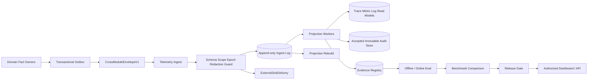
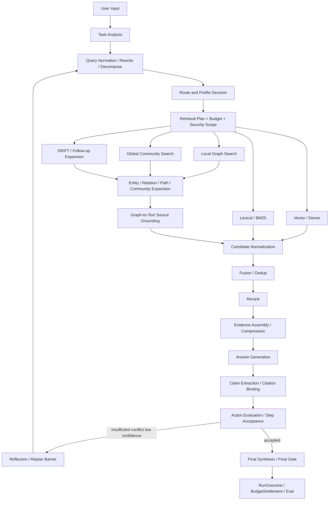

# 10 Observability & Eval

updated: 2026-07-14
status: normative-target-module-architecture
module_number: 10
formal_path: `docs/modules/10-observability-eval.md`
agent_mirror: `.agent/modules/10-observability-eval.md`

> 本文是 Zuno 第 10 个逻辑模块——Observability & Eval（可观测性与评测）——唯一的正式 Target 架构主设计。
>
> 本文统一承载 Trace、Audit、Metric、Log、Eval、RAG Core Five、Agentic GraphRAG 全过程观测、Agent Efficiency、Evidence Registry、Benchmark 和 Release Gate。Current、Gap、Measurement 和 Production Readiness 由 `docs/status/production-readiness.md` 维护；实现与迁移计划进入 `.agent/programs/`。

## 0. 文档边界与事实源

本文是 Observability & Eval 模块唯一的正式 Target 架构文档，不再维护模块 10 的独立架构附录，统一承载：

```text
问题、目标与概念架构
端到端运行流程与 Trace Tree
跨模块 Envelope、Audit、Delivery 和 Ownership
Trace、Span、Event、Metric、Log、Sampling、Retention
Eval Dataset、Case、Run、Judge、Result、Benchmark
RAG Core Five 与 GraphRAG 专项诊断
Agentic GraphRAG 全过程 Trace 与 Failure Bucket
Agent Efficiency、成本、并行、返工和质量约束
状态机、失败语义、Retry、Recovery、Idempotency
Security、Redaction、Legal Hold、External Sink
Evidence Registry、Release Gate 和质量证明
目标代码、数据库、API、测试与完成证据
```

文档边界：

```text
docs/modules/10-observability-eval.md
    唯一 Target 架构事实源。

.agent/modules/10-observability-eval.md
    字节级一致的 Agent 镜像。

.agent/programs/
    Current → Target 的实现、Migration、Backfill、Cutover 和收口计划。

docs/status/
    Current、Gap、Measurement Blocked、Quality Proven 和 Production Readiness 状态。

docs/evidence/
    可复现的 Trace、Eval、Benchmark、Release Gate 与运行证据索引。
```

规范优先级：

```text
全局架构与 Wave 1 Confirmed Target Contract
→ 本模块 Target 架构文档
→ 已确认的实现 Program
→ 代码、Migration、测试和运行配置
```

任何 Program 或实现不得自行改变本文已经确认的 Ownership、状态、失败、恢复、指标和 Release Gate 原则。

### 0.1 文档内部规范层级

Part I–III 是定位、概念和完整运行流程；Part IV–VI 是 Contract、状态、评测、GraphRAG 与效率的规范性视图；Part VII 是持久化和代码规格；Part VIII 是 Requirement、测试和完成证据。说明性视图不得覆盖规范性 Contract。

### 0.2 Current、Target、Future、History

本文以 Target 为主，只保留用于说明 Gap 的最小 Current 证据：

```text
Current
    仓库存在 local trace/eval helper、EnterpriseRAG paired runner、部分 Retrieval 指标、
    failure bucket、profile completeness 和 release-gate surface。

Target
    本文定义的完整 Trace/Audit/Eval/Evidence/Release Gate 与 RAG/Agent 观测体系。

Future
    Tail Sampling、Shadow Eval、因果归因、跨区域 Eval Federation 等可选能力。

History
    已完成 Program、旧指标语义和被替换设计进入 docs/history/，不得继续作为正式 Target。
```

存在 Runner、Report、Dashboard 或 Trace helper 只证明局部 `implementation available`，不能证明 `quality proven` 或 `production ready`。

---

# Part I：定位与概念架构

# 1. 为什么需要 Observability & Eval

企业知识库 Agent 的一次回答跨越输入门禁、Context、PlanVersion、StepRun、ActionRun、模型、检索、GraphRAG、工具、安全、审批、Final Gate、Publication、RunOutcome 与 BudgetSettlement。仅保存日志无法回答：

```text
失败发生在哪一层
事件是否重复、乱序、丢失或晚到
Agent 为什么 Retry、Reflection 或 Replan
GraphRAG 的实体、关系、路径、社区或文本回溯在哪里失败
正确 Evidence 是在 Retrieval、Fusion 还是 Rerank 阶段丢失
回答是否切题、正确并忠实于证据
低延迟是否以质量、安全或正确性下降为代价
Release Gate 为什么 PASS、FAIL、BLOCKED 或 INCOMPARABLE
审计是否在副作用前持久化并保持完整
“模块完成”“质量提升”或“可发布”由什么证据支持
```

一句话定义：

> Observability & Eval 是 Zuno 的运行黑匣子、质量实验室、合规审计账本和发布裁判。它接收各领域 Owner 的版本化事实，形成可重建 Projection、不可变 Audit、可复现 Eval 和 Evidence，但不夺取源领域事实 Ownership。

# 2. 模块目标

本模块目标：

1. 建立稳定的 Trace Context、Trace Tree、Span、Event、Metric、Structured Log 与查询 Projection。
2. 建立 Security 驱动的不可变 Audit 接收、完整性、Retention、Legal Hold 和 External Sink Delivery。
3. 在重复、乱序、延迟、Store/Queue/Sink 故障下保持可解释、可恢复和幂等。
4. 建立 Eval Dataset、Case、Run、Metric、Judge、Failure Bucket、Benchmark Comparison 和 Release Gate。
5. 冻结 RAG Core Five：Context Precision、Context Recall、Faithfulness、Answer Relevancy、Answer Correctness。
6. 观察 Agentic GraphRAG 从 Query Rewrite 到 Graph Traversal、Grounding、Fusion、Rerank、Reflection、Replan 和 Final Gate 的完整过程。
7. 以质量约束的多维向量衡量 Agent Goal、Tool Use、步骤、并行、延迟、Token、成本、返工和 Evidence Yield。
8. 严格区分 `PREPARED`、`RUNTIME_OBSERVED`、`MEASURED`、`BLOCKED`、`UNAVAILABLE` 与 `QUALITY_PROVEN`。
9. 使用服务端权威存储，通过经 Security Redaction 的 vendor-neutral Adapter 导出到 OpenTelemetry、LangSmith-compatible 或其他外部 Sink。
10. 将 Requirement、Runtime Control、测试、Trace、Eval、Release Gate 和 EvidenceRecord 连接为可审计完成证据。

# 3. 非目标

本模块不负责：

```text
修改 AgentRun、PlanVersion、StepRun、ActionRun 或 RunOutcome
决定 Tool 是否批准或执行源领域副作用
修改 SecurityDecision、Authorization、Approval 或 Redaction Policy
执行 Model Routing 或直接调用模型 Provider SDK
重定义 Knowledge、Memory、Tool、Model 或 Infrastructure 领域事实
使用缺失、旧 Run、部分 Profile 或零值推断质量
保存隐藏思维链、完整 Credential 或未经授权的 Prompt/Document Payload
将 OpenTelemetry、LangSmith、Ragas 或 Microsoft GraphRAG 变成内部事实 Owner
以单一黑盒分数替代 Core Five、Safety Guardrail 和 Efficiency Vector
因为 Dashboard 存在就声明模块 Current、quality proven 或 production ready
```

# 4. 概念架构



核心分层：

```text
Source Facts
    Agent、Knowledge、Model、Memory、Tool、Security、Infrastructure 的领域事实。

Ingest and Integrity
    Envelope 校验、Scope、Security Epoch、Redaction、Hash、Dedup、Ordering 和 Gap。

Projection and Audit
    可重建 Trace/Metric/Log Projection；独立不可变 Audit 事实。

Evaluation
    Dataset、Case、Metric Attempt、Judge、Result、Failure Bucket 和 Agent Efficiency。

Evidence and Release
    Benchmark、Release Gate、EvidenceRecord、质量声明和 Operational Read Model。
```

# 5. Cross-module Ownership

| 模块 | Owns | Observability 消费 | Observability 不得做 |
| --- | --- | --- | --- |
| Product Surface | Runtime Request、展示与用户交互 | session/request/presentation refs | 保存权威 Trace/Audit/Eval 事实 |
| Input / Ingestion | Document、IngestionRun、Parser/OCR 事实 | ingestion events、artifact refs | 修改摄取终态 |
| Knowledge / Agentic GraphRAG | RetrievalRound、Evidence、Citation、GraphTraversal、Snapshot | route/retrieval/fusion/rerank/grounding events | 修改 Knowledge 或 Graph 事实 |
| Model Gateway | ModelCallAttempt、RoutingDecision、UsageReceipt、ProviderHealth、StructuredOutputFailure | model attempt、usage、fallback、judge call | 重路由或结算 Provider 用量 |
| Memory & Context | ContextPack、MemoryCandidate、MemoryCommit | context/memory refs | 直接写长期 Memory |
| Agent Core | Run、Goal、Plan、Step、Action、Decision、Outcome、BudgetSettlement | 生命周期、控制决策和证据引用 | 修改 Agent Core 状态 |
| Capability / Skill | CapabilityDefinition、SkillDefinition | capability/version refs | 修改 Skill 事实 |
| Tool Runtime | PreparedToolAction、ExecutionAttempt、EffectReceipt、Reconcile | tool/approval/effect events | Retry 源副作用或伪造 EffectReceipt |
| Security | Principal、Policy、Authorization、Redaction、Audit Requirement | SecurityAuditRequirementV1、Decision refs | 降低 Security Gate 或 Redaction |
| Infrastructure | Store、Queue、Lease、Checkpoint、Receipt、Backup/Restore | physical receipt、capacity、health | 重定义 Eval 或 Audit 业务语义 |
| Observability & Eval | Projection、accepted AuditEvent、Metric/Eval/Evidence/Benchmark/Gate | 上述版本化事实 | 冒充源事实 Owner |

强制不变量：

```text
接收到事件不转移领域事实 Ownership
Projection 丢失可从领域事件/Outbox 重建
AuditEvent 一旦按合规合同接收，即成为独立不可变合规事实
Trace Projection != immutable Audit fact
StructuredLog != AuditEvent
Metric Result != source-domain success
```

# 6. 服务端权威产品边界

Wave 1 正式事实源：

```text
docs/decisions/0003-wave1-cross-module-contract-freeze.md
docs/governance/wave1-cross-module-contract-registry.md
```

当前共享状态为 `CONFIRMED_TARGET`，仍不是 Runtime Current 或生产证据。

```text
Web / Desktop Frontend
→ Server-hosted Product API
→ Backend Domain Fact Owners
→ Transactional Outbox
→ Observability Ingest / Eval Workers
→ PostgreSQL / Object Store / Queue / External Sink Adapter
```

前端只读取经过授权和脱敏的 Projection。SQLite、本地文件和 in-process queue 仅是 Developer / CI Adapter，不是多用户产品部署 Target。

---

# Part II：完整运行流程

# 7. Runtime Telemetry 流程

```text
领域事务提交
→ 同事务写 Outbox
→ Infrastructure durable dispatch
→ CrossModuleEnvelopeV1 / TelemetryEnvelopeV1 校验
→ Tenant / Workspace / Security Epoch / Authorization 校验
→ Redaction 和 Payload Hash 校验
→ Append-only Ingest
→ Inbox Dedup
→ Ordering / Watermark / Gap 处理
→ Trace / Metric / Log / Audit / Evidence Projection
→ 查询、告警、重建、Eval 或外部导出
```

交付语义为 at-least-once；Consumer 通过 Inbox、Dedup 和幂等 Reducer 实现 effect-once。普通 Telemetry 过载不得阻塞非审计业务提交；`MANDATORY_BEFORE_EFFECT` 是否 fail closed 由 SecurityAuditRequirementV1 决定。

# 8. Agent Run Trace Tree

```text
agent_run
  product_request
  input_gate
  context_build
    memory_read
    knowledge_scope_resolve
  task_analysis
  planning
    plan_validation
    plan_activation
  execute_step
    action_proposal
    security_gate
    model_call | retrieval | tool_call
    action_evaluation
    step_acceptance
    optional_step_reflection
  dispatch_group
    parallel_branch*
    join_evaluation
    optional_join_reflection
  replan_barrier
  final_synthesis
  final_gate
  optional_final_reflection
  artifact_validation
  publication
  run_outcome
  budget_settlement
  reflexion_candidate
  eval
```

Span name 必须低基数、稳定、版本化；对象 ID 放 Attributes。异步 fan-out 使用 Span Link 与 causation_id，不伪造同步父子关系。

Agent Core Trace 至少关联：

```text
run_id、trace_id、GoalVersion、PlanVersion、StepRun、ActionRun
DispatchGroup、DispatchItem、BranchResultRef、JoinPolicy
ControlDecision、FailureDecision、RunCommand、ResultValidity
FinalCandidate、ArtifactVersion、Publication、RunOutcome、BudgetSettlement
RC-AG/EV-AG Evidence
```

# 9. Agentic GraphRAG 完整流程



```text
basic | local | global | drift
    Query Method，描述一次检索采用的方法。

standard_rag | local_graphrag | deep_graphrag | agentic_graphrag
    Eval Profile，描述被比较的系统配置。
```

两者必须分别记录，禁止复用一个字符串字段。

# 10. Agentic 循环

每一次 Agentic GraphRAG 循环必须记录：

```text
Query Variant 来源：INITIAL | REWRITE | DECOMPOSITION | REFLECTION | REPLAN
触发条件：insufficient_evidence | conflict | low_confidence | citation_gap | budget | timeout | policy
旧 PlanVersion 与新 PlanVersion
Retry、Fallback、Reflection 和 Replan 的独立计数与理由
DispatchGroup、并行分支、Join、Partial Failure 和丢弃结果
Evidence 数量、冲突、Accepted Evidence、Token、Cost、Wall/Active/Wait Time
Outcome：CONTINUE | ACCEPT | RETRY | REPLAN | ABSTAIN | FAIL | CANCEL
```

Reflection 只保存结构化输入、输出、Decision 和理由码，不保存隐藏思维链。Final Synthesis 默认串行，不能绕过 Join Evaluation、Final Gate、Citation Check 或 Security Gate。

# 11. Eval 与 Release 流程

```text
Dataset Definition
→ Immutable Dataset Version
→ Case Set Hash
→ Profile Matrix
→ EvalRun Validation
→ Case Execution Attempts
→ Metric Input Validation
→ Deterministic / Judge / Embedding Evaluation
→ RAGMetricResult / Diagnostic Result
→ Failure Bucket
→ Slice Aggregation
→ Benchmark Comparison
→ Release Gate
→ EvidenceRecord
→ MeasurementStatus
```

Release Gate 顺序：

```text
Input Completeness
→ Trace Completeness
→ Profile Completeness
→ Metric Completeness
→ Judge / Embedding Calibration
→ Benchmark Comparability
→ RAG Core Five
→ Citation / Safety Guardrails
→ Quality-constrained Efficiency Guardrails
→ PASSED | FAILED | BLOCKED | INCOMPARABLE | ERROR
```

---

# Part III：Telemetry、Trace、Audit 与 Delivery Contract

# 12. CrossModuleEnvelopeV1 与 TelemetryEnvelopeV1

```yaml
CrossModuleEnvelopeV1:
  contract_name: string
  contract_version: string
  contract_bundle_version: string
  message_id: string
  producer_module: string
  consumer_module: string
  tenant_id: string
  workspace_id: string | null
  run_id: string | null
  step_run_id: string | null
  correlation_id: string
  causation_id: string | null
  idempotency_key: string | null
  aggregate_type: string | null
  aggregate_id: string | null
  aggregate_version: int | null
  expected_generation: int | null
  effective_security_epoch_ref: string | null
  effective_security_epoch_hash: string | null
  principal_context_ref: string | null
  security_context_ref: string | null
  authorization_decision_ref: string | null
  deadline_at: datetime | null
  trace_id: string
  data_classification: string
  redaction_decision_ref: string | null
  audit_requirement_ref: string | null
  occurred_at: datetime
  created_at: datetime
  payload: object | null
  payload_ref: string | null
  payload_hash: string
  payload_schema_hash: string

TelemetryEnvelopeV1:
  envelope: CrossModuleEnvelopeV1
  producer_instance_id: string
  producer_sequence: int | null
  stream_key: string
  category:
    DOMAIN_FACT
    | CONTROL_DECISION
    | OPERATION
    | POINT_EVENT
    | SECURITY_AUDIT
    | EVAL
    | INFRASTRUCTURE
  observed_at: datetime
  retention_policy_ref: string
```

`TelemetryEnvelopeV1` 不能删减 Tenant、Workspace、Security Epoch、Authorization、Classification、Payload Hash 或 Schema Hash。未知 Contract/Enum、Hash 不一致、Scope 缺失或 stale epoch 使用稳定失败码：

```text
OBS_ENVELOPE_SCHEMA_UNSUPPORTED
OBS_INGEST_GAP
OBS_AUDIT_ACCEPTANCE_FAILED
OBS_EXTERNAL_SINK_DELIVERY_FAILED
```

# 13. TraceContext、TraceRecord、SpanRecord 与 RuntimeEvent

```yaml
TraceContext:
  trace_id: string
  span_id: string
  parent_span_id: string | null
  trace_flags: string
  trace_state: string | null
  correlation_id: string
  causation_id: string | null
  tenant_id: string
  workspace_id: string
  run_id: string | null
  task_id: string | null
  security_context_ref: string
  data_classification: string
  baggage: map<string,string>

TraceRecord:
  trace_id: string
  root_span_id: string
  run_id: string | null
  tenant_id: string
  workspace_id: string
  trace_type: agent_run | ingestion | eval | maintenance | external_job
  status: OPEN | ACTIVE | END_REQUESTED | COMPLETE | INCOMPLETE | QUARANTINED | EXPIRED
  started_at: datetime
  ended_at: datetime | null
  last_observed_at: datetime
  missing_event_refs: [string]
  sampling_policy_ref: string
  completeness_hash: string | null

SpanRecord:
  span_id: string
  trace_id: string
  parent_span_id: string | null
  linked_span_ids: [string]
  name: string
  kind: INTERNAL | CLIENT | SERVER | PRODUCER | CONSUMER
  status: UNSET | OK | ERROR
  start_at: datetime
  end_at: datetime | null
  attributes: map<string,scalar>
  event_refs: [string]
  error_type: string | null
  error_code: string | null
  effective_config_hash: string
  sampling_decision_ref: string
  redaction_decision_ref: string

RuntimeEvent:
  event_id: string
  event_type: string
  aggregate_type: string
  aggregate_id: string
  aggregate_version: int | null
  transition_from: string | null
  transition_to: string | null
  reason_code: string | null
  trigger_ref: string | null
  policy_ref: string | null
  trace_context: TraceContext
  occurred_at: datetime
  payload_ref: string | null
```

`traceparent` 可以作为 W3C wire format，但外部 Header 不可信，必须校验格式、来源、Tenant 和 Scope。Baggage 禁止 PII、Credential、API Key、Document Text、Prompt 或完整 Output。

`run_id` 是 Agent Core 领域标识；`trace_id` 是可观测关联标识；二者不得互相替代。

# 14. Audit 三层事实

```text
SecurityAuditRequirementV1
    Owner: Security
    定义哪些事件必须审计、分类、Redaction、Retention、Legal Hold 与 fail mode。

AuditDurabilityRequirement
AuditPersistenceReceiptV1
    Owner: Infrastructure execution fact
    证明本地持久化、Outbox、Integrity Chain 和容量预留。

AuditEvent
    Owner: Observability accepted immutable fact
    提供查询、完整性、Retention、Legal Hold 和外部交付语义。
```

Mandatory Audit 顺序：

```text
SecurityAuditRequirementV1
→ AuditDurabilityRequirement
→ local durable AuditPersistenceReceiptV1
→ source effect may execute when MANDATORY_BEFORE_EFFECT is satisfied
→ TelemetryEnvelopeV1
→ accepted immutable AuditEvent
→ optional ExternalSinkDelivery
```

强制不等价：

```text
AuditPersistenceReceipt != accepted AuditEvent
accepted AuditEvent != Tool Effect success
ExternalSinkDelivery != source-domain success
Queue ACK != accepted AuditEvent
StructuredLog != AuditEvent
Trace Projection != immutable Audit fact
```

```yaml
AuditEvent:
  audit_event_id: string
  audit_sequence: int
  tenant_id: string
  workspace_id: string
  actor_ref: string
  actor_type: string
  action: string
  target_type: string
  target_ref: string
  decision_ref: string
  decision: ALLOW | DENY | REQUIRE_APPROVAL | BREAK_GLASS
  reason_code: string
  data_classification: string
  source_event_ref: string
  audit_requirement_ref: string
  persistence_receipt_ref: string
  correlation_id: string
  trace_id: string | null
  redaction_decision_ref: string
  retention_policy_ref: string
  legal_hold_refs: [string]
  occurred_at: datetime
  ingested_at: datetime
  previous_hash: string | null
  record_hash: string
  supersedes_audit_event_id: string | null
```

# 15. MetricPoint、StructuredLog 与 Policy

```yaml
MetricPoint:
  metric_name: string
  metric_version: string
  instrument: COUNTER | UP_DOWN_COUNTER | HISTOGRAM | GAUGE
  value: number
  unit: string
  temporality: DELTA | CUMULATIVE | INSTANT
  labels: map<string,scalar>
  exemplar_trace_id: string | null
  observed_at: datetime

StructuredLog:
  log_id: string
  severity: string
  event_name: string
  message_template: string
  fields: map<string,scalar>
  trace_id: string | null
  span_id: string | null
  correlation_id: string
  tenant_id: string
  workspace_id: string
  redaction_decision_ref: string
  occurred_at: datetime

SamplingPolicy:
  sampling_policy_id: string
  version: string
  mode: ALWAYS_KEEP | DETERMINISTIC_HEAD | RATE_LIMITED | SUPPRESS
  rate: number | null
  always_keep_categories: [string]
  attribute_allowlist: [string]
  policy_hash: string

RetentionPolicy:
  retention_policy_id: string
  version: string
  record_class: string
  minimum_days: int
  maximum_days: int | null
  deletion_mode: HARD_DELETE | CRYPTO_SHRED | TOMBSTONE
  residency: string
  legal_hold_precedence: boolean
  policy_hash: string
```

Metric Label 禁止默认放 `run_id`、`user_id`、`document_id`、Prompt Hash 等高基数值。StructuredLog 只用于诊断，不是 AuditEvent、Domain Event 或 EvidenceRecord 的替代品。

# 16. Ordering、Dedup 与 Delivery

规则：

```text
唯一键：producer_module + message_id
相同键 + 相同 payload_hash：幂等返回原 ingest 结果
相同键 + 不同 payload_hash：QUARANTINED_CONFLICT
领域顺序优先 aggregate_version / producer_sequence
Projection 保存 stream watermark、pending gap 和 projection version
occurred_at、observed_at、ingested_at 同时保存
Producer 使用 Transactional Outbox
Consumer 使用 Inbox Dedup
Projection 可从 Append-only Ingest Log 重放
```

```yaml
ExternalSinkDelivery:
  delivery_id: string
  sink_id: string
  envelope_id: string
  export_schema_version: string
  delivery_key: string
  status:
    PENDING
    | REDACTION_REQUIRED
    | READY
    | IN_FLIGHT
    | DELIVERED
    | RETRY_SCHEDULED
    | DEAD_LETTERED
    | BLOCKED
    | SUPPRESSED
  attempt_count: int
  next_attempt_at: datetime | null
  receipt_ref: string | null
  error_code: string | null
```

`delivery_key = sink_id + envelope_id + export_schema_version`。外部 Sink 失败不回滚本地事实。Redaction 失败不得降级导出。

---

# Part IV：Eval、RAG Core Five 与质量 Contract

# 17. Measurement Semantics

```yaml
MeasurementStatus:
  measurement_status_id: string
  subject_type: string
  subject_ref: string
  status:
    PREPARED
    | RUNTIME_OBSERVED
    | MEASURED
    | BLOCKED
    | UNAVAILABLE
    | QUALITY_PROVEN
  reason_code: string
  blocker_refs: [string]
  evidence_refs: [string]
  scope_hash: string
  validity_window: object | null
  decided_at: datetime
```

含义：

- `PREPARED`：Dataset、配置或工作面准备完成，未完成真实运行。
- `RUNTIME_OBSERVED`：真实 Runtime 产生 Trace，但不是固定 Benchmark。
- `MEASURED`：固定 Case Set、兼容版本和完整 Profile 已运行并可比较。
- `BLOCKED`：存在明确 Blocker，不能推断指标。
- `UNAVAILABLE`：Trace、Artifact、Judge、Embedding 或结果不可用。
- `QUALITY_PROVEN`：完整 Measured、Comparable、Gate Passed 且 Evidence Available；仍不等于 production ready。

```text
PREPARED -> RUNTIME_OBSERVED -> MEASURED -> QUALITY_PROVEN
any nonterminal -> BLOCKED | UNAVAILABLE
BLOCKED/UNAVAILABLE -> PREPARED（Blocker 解决后创建新 Attempt）
```

# 18. Eval Dataset、Case、Run 与 Result

```yaml
EvalDataset:
  dataset_id: string
  name: string
  purpose: regression | benchmark | safety | retrieval | release
  owner: string
  current_version_ref: string
  data_classification: string
  retention_policy_ref: string

EvalCase:
  case_id: string
  dataset_version_id: string
  input_ref: string
  reference_output_ref: string | null
  expected_evidence_refs: [string]
  expected_doc_ids: [string]
  expected_behavior: answer | abstain | refuse | tool_action
  question_type: string
  difficulty: string | null
  expected_hop_count: int | null
  tags: [string]
  case_hash: string

EvalRun:
  eval_run_id: string
  status: CREATED | VALIDATING | QUEUED | RUNNING | PARTIAL | COMPLETED | BLOCKED | FAILED | CANCELLED
  dataset_version_id: string
  case_set_hash: string
  required_profiles: [string]
  corpus_manifest_ref: string
  knowledge_snapshot_ref: string
  graph_snapshot_ref: string | null
  runtime_config_ref: string
  model_routing_policy_ref: string
  judge_policy_ref: string
  embedding_policy_ref: string | null
  metric_definition_refs: [string]
  sampling_policy_ref: string
  profile_completeness_ref: string | null
  measurement_status_ref: string

EvalResult:
  eval_result_id: string
  eval_run_id: string
  case_execution_id: string
  evaluator_id: string
  evaluator_version: string
  result_type: metric | verdict | diagnostic
  score: number | null
  verdict: PASS | FAIL | BLOCKED | UNAVAILABLE | INCOMPARABLE
  reason_code: string
  input_artifact_refs: [string]
  output_artifact_refs: [string]
  trace_ref: string
  judge_policy_ref: string | null
  result_hash: string
```

Dataset Version 不可原地修改。Case 修订必须创建新 Dataset Version、Case Set Hash 和 Provenance。Eval Job 使用 Infrastructure 的 Queue、Lease、Heartbeat、Checkpoint、Resume、Cancel 和 Worker Fencing。

# 19. MetricDefinition、Attempt 与 RAGMetricResult

```yaml
MetricDefinition:
  metric_definition_id: string
  canonical_name:
    CONTEXT_PRECISION
    | CONTEXT_RECALL
    | FAITHFULNESS
    | ANSWER_RELEVANCY
    | ANSWER_CORRECTNESS
    | diagnostic_metric_name
  aliases: [string]
  version: string
  evaluation_layer:
    RETRIEVAL_RANKING
    | CONTEXT_COVERAGE
    | GROUNDING
    | INTENT_ALIGNMENT
    | ANSWER_QUALITY
    | DIAGNOSTIC
    | EFFICIENCY
  evaluator_type: DETERMINISTIC | MODEL_JUDGE | EMBEDDING | HYBRID | HUMAN
  required_inputs: [string]
  optional_inputs: [string]
  reference_mode: REFERENCE_REQUIRED | REFERENCE_OPTIONAL | REFERENCE_FREE
  scoring_method: string
  aggregation_method: string
  score_range: object
  null_policy: BLOCKED | UNAVAILABLE
  claim_policy_ref: string | null
  context_relevance_policy_ref: string | null
  embedding_policy_ref: string | null
  judge_policy_ref: string | null
  calibration_dataset_ref: string | null
  threshold_policy_ref: string | null
  metric_hash: string

MetricEvaluationAttempt:
  metric_attempt_id: string
  eval_run_id: string
  case_execution_id: string
  metric_definition_ref: string
  attempt_no: int
  status:
    CREATED
    | VALIDATING_INPUTS
    | RUNNING
    | MEASURED
    | BLOCKED
    | UNAVAILABLE
    | INVALID
    | TIMED_OUT
    | CANCELLED
  input_artifact_refs: [string]
  evaluator_model_attempt_refs: [string]
  embedding_attempt_refs: [string]
  started_at: datetime
  ended_at: datetime | null
  reason_codes: [string]
  result_ref: string | null

RAGMetricResult:
  rag_metric_result_id: string
  metric_attempt_ref: string
  canonical_name: string
  metric_version: string
  score: number | null
  status: MEASURED | BLOCKED | UNAVAILABLE | INVALID
  user_input_ref: string
  response_ref: string | null
  reference_answer_ref: string | null
  retrieved_context_refs: [string]
  reference_context_refs: [string]
  relevant_context_refs: [string]
  irrelevant_context_refs: [string]
  reference_claim_refs: [string]
  generated_claim_refs: [string]
  supported_claim_refs: [string]
  unsupported_claim_refs: [string]
  contradicted_claim_refs: [string]
  missing_reference_claim_refs: [string]
  true_positive_claim_refs: [string]
  false_positive_claim_refs: [string]
  false_negative_claim_refs: [string]
  component_scores: map<string,number>
  reason_codes: [string]
  trace_ref: string
  result_hash: string
```

`metric_hash` 必须覆盖算法、Prompt、Judge、Embedding、Claim 分解、Context Relevance、归一化、聚合和阈值版本。任何语义变化创建新 Metric Version。

```text
CREATED -> VALIDATING_INPUTS -> RUNNING -> MEASURED
                           |-> BLOCKED | UNAVAILABLE | INVALID
RUNNING -> TIMED_OUT | UNAVAILABLE | CANCELLED
```

Retry 创建新 Attempt。Judge 超时、Embedding 缺失、Reference 缺失或 Trace 字段缺失不能记为 0。

# 20. RAG Core Five 输入闭包

```yaml
RAGCoreFiveInputBundle:
  user_input_ref: string
  reference_answer_ref: string
  reference_claim_set_ref: string
  reference_context_refs: [string]
  expected_doc_ids: [string]
  expected_evidence_refs: [string]
  generated_response_ref: string
  retrieved_context_refs: [string]
  retrieval_trace_ref: string
  graph_trace_ref: string | null
  claim_ledger_ref: string
  citation_ledger_ref: string
  metric_definition_refs: [string]
  judge_policy_ref: string
  embedding_policy_ref: string
  knowledge_snapshot_ref: string
  graph_snapshot_ref: string | null
  corpus_manifest_ref: string
  runtime_config_ref: string
  model_routing_policy_ref: string
```

缺少某个 Metric 的 Required Input 只阻塞该 Metric；若 Release Gate 要求 Core Five 全部 Measured，则 Gate 为 BLOCKED。不得用旧 Run 的分数拼接新 Run。

# 21. Context Precision

目标：相关 Context 是否排在不相关 Context 前面。

Canonical V1 使用排序敏感的 Average Precision 风格：

```text
Context Precision@K
= sum(Precision@k * relevance(k)) / relevant_items_in_top_k
```

规则：

- `relevance(k)` 由版本化 ContextRelevancePolicy 产生。
- Release Gate 优先使用 Reference Answer / Gold Evidence 驱动的版本。
- ID-based、Non-LLM Similarity 和 LLM Relevance 是不同 Metric Version，不混合聚合。
- 当前简化的 `relevant_count / retrieved_count` 只能命名为 `TOP_K_CONTEXT_RELEVANT_RATIO`，不得满足 `CONTEXT_PRECISION` Requirement。
- 必须保存每个 Context 的 Rank、Relevance Verdict、Precision@k、Source/Fusion/Rerank Rank 和 Dropped Reason。

# 22. Context Recall

目标：Reference Answer 所需事实有多少能由 Retrieved Context 支持。

```text
Context Recall
= retrieved_context_supported_reference_claims
  / total_reference_claims
```

规则：

- Reference Answer 按版本化 ClaimPolicy 分解为 Atomic Reference Claims。
- 每个 Reference Claim 关联支持它的 Context，或标记 MISSING、CONTRADICTED、UNAVAILABLE。
- Retrieval Recall@K、Document Recall@K 和 Evidence Recall@K 是诊断指标，不能替代 Claim-based Context Recall。
- 无 Reference Answer 的 Case 不能写入 Reference-based Context Recall。
- No-answer / Refuse Case 使用 expected_behavior 和 Required Abstention Evidence。

# 23. Faithfulness

目标：Generated Answer 是否忠实于 Retrieved Context，而不是判断世界事实是否正确。

```text
Faithfulness
= supported_generated_claims / total_generated_claims
```

流程：

1. Generated Answer 分解为 Atomic Generated Claims。
2. 每个 Claim 对 Retrieved Context 做 Entailment / Contradiction 判定。
3. 输出 `SUPPORTED`、`UNSUPPORTED`、`CONTRADICTED`、`UNVERIFIABLE`。
4. 部分 Judge 失败时返回 UNAVAILABLE，或只生成不得进入 Gate 的 Partial Diagnostic。
5. Unsupported Claim Rate 和 Contradicted Claim Rate 从同一 Claim Ledger 派生。

Faithfulness 不等于 Answer Correctness、Citation Accuracy 或现实世界真实性。

# 24. Answer Relevancy

内部 Canonical Name 为 `ANSWER_RELEVANCY`；外部 Adapter 可映射 `Response Relevancy`。

Canonical V1：

1. 使用固定 JudgePolicy 从 Generated Answer 反向生成 N 个 Candidate Questions。
2. 使用固定 EmbeddingPolicy 比较原始 User Input 与 Candidate Questions。
3. Score 为平均 Cosine Similarity。
4. N、Prompt、Embedding Model、语言归一化和 Clamp Policy 全部进入 metric_hash。

同时输出：

```text
directness
completeness
unnecessary_detail
intent_coverage
non_answer / refusal correctness
```

一个事实正确但只回答部分问题的答案，Answer Relevancy 必须较低。

# 25. Answer Correctness

目标：Generated Answer 与 Reference Answer / Gold Claims 的事实一致性和语义等价性。

```text
TP = generated and reference both contain the fact
FP = generated contains an incorrect or non-reference factual claim
FN = required reference fact is missing

Factual F1
= TP / (TP + 0.5 * (FP + FN))

Answer Correctness
= weighted(Factual F1, Semantic Similarity)
```

规则：

- 权重由 MetricDefinition 固定。
- 保存 factual_precision、factual_recall、factual_f1、semantic_similarity 和 final score。
- 数字、日期、实体、否定、条件、范围和时态使用类型化比较或专用 Rubric。
- Reference 多答案、等价表达和允许的附加事实必须在 Case Rubric 中明确。
- 无 Reference 的在线样本只能运行另命名的 Factuality / Groundedness Diagnostic。

# 26. 诊断指标体系

RAG Core Five 是一级质量 Scorecard；以下指标用于定位根因：

```text
Retrieval
    Document Recall@K
    Evidence Recall@K
    Hit Rate@K
    MRR@K
    NDCG@K

Graph
    Entity Recall
    Relation Recall
    Graph Path Recall
    Community Coverage
    Graph-to-Text Grounding Rate

Citation
    Citation Accuracy
    Source Doc Citation Accuracy
    Source Span Accuracy
    Claim Citation Coverage

Safety
    Unsupported Claim Rate
    Contradicted Claim Rate
    Abstention Correctness

Runtime
    Latency、Token、Cost、Retry、Fallback、Queue Wait、Cache Hit、Trace Completeness

Agent
    Agent Goal Accuracy、Tool Call Accuracy、Tool Call F1、Plan Completion、Human Intervention
```

诊断指标不得冒充或替代 Core Five。

# 27. JudgePolicy、Calibration 与统计有效性

```yaml
JudgePolicy:
  judge_policy_id: string
  version: string
  evaluator_type: CODE | HUMAN | MODEL | PAIRWISE
  model_role: CRITIC | FINAL_CRITIC | null
  model_capability_profile_ref: string | null
  prompt_template_version: string | null
  rubric_version: string
  timeout_ms: int
  max_attempts: int
  disagreement_policy: string
  calibration_dataset_ref: string | null
  output_schema_hash: string
  policy_hash: string
```

规则：

- Judge 调用必须经过 Model Gateway，产生独立 ModelCallAttempt、RoutingDecision、UsageReceipt、Security、Budget 和 Trace。
- 模型自评不能单独证明自身质量。
- Judge、Embedding、Prompt、Rubric、Seed、Temperature 和解析策略必须版本化。
- Calibration 至少记录与 Human Gold 的一致性、False Positive/Negative、分布漂移和语言 Slice。
- 随机指标必须记录 Seed、Repeat Count、Mean、Variance、Confidence Interval 或 Bootstrap Policy。
- 样本量不足时必须显示 sample_count 和 confidence status，不得以小样本高分声明质量。
- Dataset Leakage、Prompt Leakage 和 Reference Contamination 必须作为 Dataset Validation Gate。

# 28. Benchmark Comparison 与 Slice

```yaml
BenchmarkComparison:
  comparison_id: string
  baseline_eval_run_id: string
  candidate_eval_run_id: string
  status: VALIDATING | COMPARABLE | INCOMPARABLE | COMPLETED
  compatibility_dimensions: map<string,string>
  mismatch_reasons: [string]
  metric_delta_refs: [string]
  created_at: datetime
```

必须固定：

```text
Dataset Version、Case Set Hash、Reference Claims
Corpus Manifest、Knowledge Snapshot、Graph Snapshot、Index Version
Runtime Config、Retrieval Profile、Query Method
Model Routing Policy、Judge Policy、Embedding Policy
Metric Definition、Aggregation、Sampling Policy
Allowed External Knowledge Policy、Security Scope
```

至少按以下 Slice 输出：

```text
profile: standard / local / deep / agentic
query_method: basic / local / global / drift
question_type: single-hop / multi-hop / entity / relation / aggregation / comparison / temporal / conflict / no-answer / citation-required
difficulty / expected_hop_count
language
source_type
graph_snapshot / index_version
model_routing_policy
budget_class
security_scope_class
outcome: success / abstain / refuse / failure
```

---

# Part V：Agentic GraphRAG 与 Agent Efficiency Contract

# 29. AgenticGraphRAGTrace

```yaml
AgenticGraphRAGTrace:
  graph_trace_id: string
  run_id: string
  plan_version_id: string
  step_run_id: string
  action_run_id: string
  retrieval_attempt_id: string
  original_query_ref: string
  normalized_query_ref: string
  query_variant_refs: [string]
  requested_profile: string
  resolved_profile: string
  requested_query_method: auto | basic | local | global | drift
  resolved_query_method: basic | local | global | drift
  router_decision: string
  route_reason_codes: [string]
  knowledge_snapshot_ref: string
  graph_snapshot_ref: string | null
  index_version_refs: [string]
  enabled_retrievers: [string]
  budget_reservation_ref: string
  security_scope_ref: string
  fallback_policy_ref: string
  fusion_policy_ref: string
  rerank_policy_ref: string
  context_budget: object
  candidate_refs: [string]
  evidence_refs: [string]
  dropped_candidate_refs: [string]
  graph_traversal_refs: [string]
  reflection_refs: [string]
  replan_refs: [string]
  status: CREATED | RUNNING | SUCCEEDED | PARTIAL | BLOCKED | FAILED | CANCELLED
  reason_codes: [string]
```

# 30. RetrievalCandidateTrace

```yaml
RetrievalCandidateTrace:
  candidate_id: string
  retrieval_attempt_id: string
  query_variant_id: string
  retriever: dense | lexical | entity | relation | path | community | drift | other
  source_backend: string
  source_type: document | chunk | entity | relation | path | community_report | covariate
  source_ref: string
  document_ref: string | null
  chunk_ref: string | null
  evidence_span_ref: string | null
  graph_entity_refs: [string]
  graph_relation_refs: [string]
  graph_path_ref: string | null
  community_ref: string | null
  raw_score: number | null
  normalized_score: number | null
  source_rank: int | null
  fusion_score: number | null
  fusion_rank: int | null
  rerank_score: number | null
  final_rank: int | null
  selected: boolean
  dropped_stage: retrieval | grounding | fusion | dedup | rerank | budget | security | null
  dropped_reason_code: string | null
  latency_ms: number
  token_count: int | null
  cost_amount: number | null
  trace_ref: string
```

每个候选必须能够回答：来自哪个 Query Variant 和 Retriever、原始/Fusion/Rerank Rank 如何变化、是否进入 Context、在哪个阶段被丢弃、为什么被丢弃。

# 31. GraphTraversalRecord

```yaml
GraphTraversalRecord:
  traversal_id: string
  retrieval_attempt_id: string
  method: local | global | drift
  seed_entity_refs: [string]
  resolved_entity_refs: [string]
  unresolved_mentions: [string]
  relation_refs: [string]
  path_refs: [string]
  community_refs: [string]
  text_unit_refs: [string]
  document_refs: [string]
  hop_limit: int
  hops_executed: int
  branch_count: int
  pruned_branch_count: int
  graph_snapshot_ref: string
  traversal_budget: object
  stop_reason: enough_evidence | budget | no_frontier | security | timeout | cancelled
  latency_ms: number
  reason_codes: [string]
```

Graph Entity、Relation、Community 或 Path 用于回答时，必须最终回溯到授权后的 Text Unit、Document 和 Evidence Span。只有 Graph Summary 而无 Source Grounding 的结果可用于导航，默认不能成为 Strict Grounded Answer 的最终证据。

# 32. AgentLoopObservation

```yaml
AgentLoopObservation:
  observation_id: string
  run_id: string
  plan_version_id: string
  step_run_id: string
  loop_no: int
  phase: PLAN | EXECUTE | EVALUATE | REFLECT | REPLAN | SYNTHESIZE | FINAL_GATE
  trigger_reason: string
  input_ref: string
  output_ref: string
  evidence_count: int
  accepted_evidence_count: int
  conflict_count: int
  retry_count_delta: int
  replan_count_delta: int
  model_call_count_delta: int
  tool_call_count_delta: int
  retrieval_call_count_delta: int
  token_delta: int
  cost_delta: number
  wall_time_ms: number
  active_time_ms: number
  wait_time_ms: number
  outcome: CONTINUE | ACCEPT | RETRY | REPLAN | ABSTAIN | FAIL | CANCEL
  reason_codes: [string]
```

Retry 与 Replan 必须分开：执行瞬时失败属于 Retry；计划结构、依赖或假设失效属于 Replan。Replan 创建新 PlanVersion，并经过 Replan Barrier。

# 33. GraphRAG 与 Agent Failure Bucket

基础 Bucket：

```text
doc_miss
doc_hit_text_miss
text_hit_citation_miss
citation_hit_answer_wrong
```

Query / Route：

```text
query_analysis_error
query_rewrite_drift
query_decomposition_incomplete
route_mismatch
profile_fallback_unexplained
```

Graph Retrieval：

```text
entity_resolution_miss
relation_retrieval_miss
graph_path_miss
community_summary_miss
graph_snapshot_unavailable
graph_traversal_budget_exhausted
drift_followup_low_yield
```

Grounding / Ranking：

```text
graph_source_grounding_miss
text_unit_mapping_miss
fusion_dropped_gold_evidence
rerank_demoted_gold_evidence
context_noise_excess
context_coverage_gap
evidence_conflict_unresolved
```

Generation / Agent Control：

```text
answer_unfaithful
answer_irrelevant
answer_incorrect
citation_binding_miss
budget_exhausted_before_evidence
redundant_retrieval
retry_churn
replan_churn
reflection_churn
model_escalation_excess
tool_overcall
parallel_join_waste
```

每个 Bucket 必须声明 Required Trace Fields。缺失字段返回 `unavailable_due_to_missing_trace_fields`，不得根据最终分数猜测根因。

# 34. Agent Efficiency 原则

Agent 效率是质量约束下的多维向量：

```text
Efficiency = outcome quality
           + work required
           + latency
           + resource / cost
           + coordination overhead
           + recovery overhead
```

禁止默认建立不可解释的单一 `Agent Efficiency Score`。未来如需综合分，必须独立 MetricDefinition、权重版本、Calibration Dataset、适用任务类型和 ADR。

质量、安全、权限和正确性是硬约束。低成本或低延迟不能抵消 Faithfulness、Answer Correctness、Security Gate 或 Tool Effect 错误。

# 35. AgentEfficiencySnapshot

```yaml
AgentEfficiencySnapshot:
  efficiency_snapshot_id: string
  run_id: string
  eval_run_id: string | null
  profile: string
  question_type: string | null
  outcome: SUCCEEDED | ABSTAINED | REFUSED | PARTIAL | FAILED | CANCELLED
  agent_goal_accuracy: number | null
  task_success: boolean | null
  plan_version_count: int
  planned_step_count: int
  executed_step_count: int
  accepted_step_count: int
  failed_step_count: int
  skipped_step_count: int
  action_count: int
  model_call_count: int
  retrieval_call_count: int
  tool_call_count: int
  tool_call_accuracy: number | null
  tool_call_f1: number | null
  retry_count: int
  fallback_count: int
  replan_count: int
  reflection_count: int
  escalation_count: int
  human_intervention_count: int
  duplicate_work_count: int
  discarded_result_count: int
  retrieved_candidate_count: int
  accepted_evidence_count: int
  citation_count: int
  wall_time_ms: number
  active_time_ms: number
  queue_wait_ms: number
  model_time_ms: number
  retrieval_time_ms: number
  graph_time_ms: number
  tool_time_ms: number
  reflection_time_ms: number
  synthesis_time_ms: number
  first_token_ms: number | null
  critical_path_ms: number
  parallel_branch_time_sum_ms: number
  token_input: int
  token_output: int
  token_total: int
  estimated_cost: number
  settled_cost: number | null
  budget_limit: number
  budget_utilization: number
  cache_hit_count: int
  cache_miss_count: int
  trace_completeness: number
  metric_definition_refs: [string]
```

# 36. Agent Efficiency 派生指标

```text
Plan Churn
= plan_version_count - 1

Step Acceptance Rate
= accepted_step_count / executed_step_count

Retry Rate
= retry_count / execution_attempt_count

Replan Rate
= replan_count / run_count

Evidence Yield
= accepted_evidence_count / retrieval_call_count

Candidate Yield
= accepted_evidence_count / retrieved_candidate_count

Citation Yield
= supported_citation_count / accepted_evidence_count

Wasted Work Ratio
= discarded_or_duplicate_active_time / active_time_ms

Parallel Efficiency
= critical_path_work_saved / parallelizable_work

Quality per Cost
= named_quality_metric / settled_cost

Goal Success per 1K Tokens
= successful_goal_count / token_total * 1000
```

所有派生指标必须记录分子、分母、Metric Version 和零分母策略。`Quality per Cost` 必须指定具体 Quality Metric，不能隐式平均 Core Five。

延迟归因：

```text
wall_time
≈ active_time + wait_time + orchestration_overhead
```

并行 Span Duration 之和可以大于 Wall Time，不能直接相加作为端到端延迟。

成本必须区分：

```text
estimated vs settled
business budget vs provider quota
initial attempt vs hidden SDK retry
successful vs discarded branch
Judge / Eval cost vs Product Run cost
cache-hit avoided cost
response lost but provider charged
fallback and role escalation cost
```

# 37. Dashboard 与 Drill-down

Dashboard 只查询授权后的 Read Model，不得修改源领域事实、Metric Result、ReleaseGateEvaluation 或 EvidenceRecord。

RAG Quality：

```text
Core Five 总览和 Case-level Status
Profile / Query Method / Question Type Slice
Context Rank Relevance
Reference Claims 与 Context Coverage
Generated Claims 与 Context Support
Answer Relevancy Reverse Questions
Answer Correctness TP / FP / FN
Citation、Unsupported Claim 和 Abstention
```

GraphRAG Trace：

```text
Route Timeline
Query Rewrite / Decomposition
Entity、Relation、Path、Community
Graph Snapshot 与 Index Version
Graph-to-Text Mapping
Candidate Rank 变化
Fusion / Rerank Dropped Reason
Context Budget 和 Evidence Provenance
DRIFT Follow-up Tree
```

Agent Efficiency：

```text
End-to-end Critical Path
Active vs Wait
Parallel Branches / Join Wait
Plan / Step / Action
Retry / Replan / Reflection
Model Role Escalation
Token / Cost / Budget
Evidence Yield / Wasted Work
Goal Accuracy / Tool Call Accuracy
Human Intervention
```

所有视图展示 Data Freshness、Projection Lag、Sampling Policy、Trace Completeness、Measurement Status、Blocked Reason 和 Data Gap。

---

# Part VI：状态机、安全、失败与恢复

# 38. Trace Lifecycle

```text
none -> OPEN -> ACTIVE -> END_REQUESTED -> COMPLETE
                                   |-> INCOMPLETE
OPEN/ACTIVE/END_REQUESTED -> QUARANTINED
COMPLETE/INCOMPLETE -> EXPIRED（Retention disposition 且无 Legal Hold）
```

END_REQUESTED 后检查 Required Events；Gap Window 后仍缺失则进入 INCOMPLETE，并保存 Missing Set。Trace COMPLETE 不等于 AgentRun 成功。

# 39. EvalRun 与 EvalCaseExecution

```text
EvalRun:
CREATED -> VALIDATING -> QUEUED -> RUNNING -> COMPLETED
                              |-> BLOCKED | FAILED
RUNNING -> PARTIAL | QUEUED(recoverable retry) | CANCELLED

EvalCaseExecution:
PENDING -> RUNNING -> SUCCEEDED
                  |-> FAILED | BLOCKED | TIMED_OUT | SKIPPED | INVALID
```

Case Retry 创建新 Attempt。Worker Lease 过期后复用已经提交且 Hash 有效的结果，只为未完成 Case 创建新 Attempt。

# 40. ReleaseGateEvaluation

```yaml
ReleaseGateEvaluation:
  release_gate_evaluation_id: string
  release_candidate_ref: string
  comparison_ref: string
  status:
    CREATED
    | VALIDATING_INPUTS
    | EVALUATING
    | PASSED
    | FAILED
    | BLOCKED
    | INCOMPARABLE
    | ERROR
  threshold_policy_ref: string
  measurement_status_ref: string
  decision_reasons: [string]
  evidence_refs: [string]
  decided_at: datetime | null
```

```text
CREATED -> VALIDATING_INPUTS -> EVALUATING -> PASSED | FAILED
                         |-> BLOCKED | INCOMPARABLE
any nonterminal -> ERROR
```

BLOCKED、INCOMPARABLE、ERROR 都不是 FAILED，更不能折算为 PASS。

# 41. EvidenceRecord Lifecycle

```yaml
EvidenceRecord:
  evidence_id: string
  requirement_id: string
  subject_type: string
  subject_ref: string
  evidence_type:
    code
    | migration
    | unit_test
    | integration_test
    | fault_test
    | e2e
    | trace
    | eval
    | release_gate
    | operational
  artifact_ref: string
  artifact_hash: string
  producer: string
  producer_version: string
  validation_status: DRAFT | VALIDATING | AVAILABLE | REJECTED | SUPERSEDED | EXPIRED
  validation_result_ref: string | null
  source_trace_ref: string | null
  retention_policy_ref: string
  legal_hold_refs: [string]
  supersedes_evidence_id: string | null
  created_at: datetime
```

```text
DRAFT -> VALIDATING -> AVAILABLE | REJECTED
AVAILABLE -> SUPERSEDED
AVAILABLE/SUPERSEDED -> EXPIRED（无 Legal Hold 且 Claim 失效）
```

EvidenceRecord 保存索引、Hash、Provenance 和验证结果；大型 Artifact 位于 Object Store。Hash mismatch、未授权来源或过期 Validity Window 不能支持质量声明。

# 42. Security、Redaction、Sampling、Retention 与 Legal Hold

Security 产生：

```text
DataClassification
RedactionDecision
ExternalSinkPolicy
AuditRetentionPolicy
BreakGlassDecision
SecurityAuditRequirementV1
```

Redaction 在本地敏感 Payload 持久化前和外部导出前分别执行。失败时只保存安全最小 Envelope、Hash、Classification、Failure Code 和 Policy Ref，并隔离 Payload；Observability 不得把 REDACT 改为 ALLOW。

以下事件不采样：

```text
AuditEvent
Security Deny / Break-glass
Approval / Side Effect
RunOutcome / Publication / BudgetSettlement
Release Gate / Evidence
Redaction Failure
Trace Integrity Gap
```

普通高频成功 Span 可使用 Deterministic Head Sampling。Tail Sampling 属于 Future；未实现前不得声明支持。

Legal Hold 优先于普通 Retention。删除产生可审计 DispositionRecord。Backup/Restore 后重新校验 Audit Sequence/Hash、Projection Watermark、Evidence Hash、Dataset/Case Hash 与 Legal Hold。

# 43. Failure Taxonomy

```text
VALIDATION
    Schema、Hash、Scope、Version、Epoch 或 Required Input 无效。

TRANSIENT_INFRASTRUCTURE
    Store、Queue、Sink、Provider 或 Network Timeout。

PERMANENT_INFRASTRUCTURE
    Unsupported Sink、Schema、Storage Capability 或 Capacity Policy。

SECURITY
    Authorization、Redaction、Residency、Secret 或 Policy Deny。

COMPLETENESS
    Missing Event、Trace Field、Profile、Case、Claim 或 Result。

COMPARABILITY
    Dataset、Snapshot、Index、Judge、Embedding、Metric 或 Runtime Mismatch。

JUDGE
    Timeout、Invalid Output、Disagreement、Calibration Failure。

INTEGRITY
    Duplicate Conflict、Audit Gap、Hash Mismatch、Sequence Gap。

QUALITY
    Core Five、Citation、Safety 或 Critical Slice Regression。

EFFICIENCY
    Retry/Replan/Reflection Churn、Hidden Retry、Parallel Waste、Cost Overrun。
```

# 44. Retry、Recovery 与 Idempotency

- Validation Failure：修复后创建新 Envelope、Run 或 Attempt；原记录 Quarantine。
- Transient Infrastructure：Bounded Retry + Backoff；使用 Outbox、Lease 和 Fencing。
- Permanent Infrastructure：Dead Letter + Operator Action，不无限 Retry。
- Security Failure：不得绕过；Policy 或 Approval 变化后创建新 Attempt。
- Completeness Failure：Projection Rebuild、Late Event Revision 或 Rerun；保持 BLOCKED/INCOMPLETE。
- Comparability Failure：不 Retry 旧 Comparison；创建兼容 EvalRun。
- Judge Failure：按 JudgePolicy Retry；耗尽后 UNAVAILABLE/BLOCKED，不记 0。
- Integrity Failure：Quarantine + Reconciliation；相关 Evidence Invalid。
- Tool/Model/Knowledge 源领域副作用只能由其 Owner Retry 或 Reconcile，Observability 不得代做。

幂等键：

```text
Telemetry Ingest
    producer_module + message_id + payload_hash

External Sink
    sink_id + envelope_id + export_schema_version

Metric Attempt
    eval_run_id + case_execution_id + metric_definition_id + attempt_no

Metric Cache
    input_hash + metric_hash

Projection
    projection_name + stream_key + source_event_id
```

Late Trace 到达可以创建新的 Evaluation Revision，不原地篡改已发布 Result。Release Gate 只绑定不可变 Eval Result Set 和 Comparison Hash。

# 45. Operational SLO、Alert 与 Runbook

需要定义但必须由实现 Program 校准的 SLO：

```text
Telemetry ingest availability and lag
Projection freshness and gap age
Mandatory Audit acceptance latency and gap count
External Sink backlog and dead-letter age
Eval queue wait and completion time
Judge timeout / invalid rate
Trace completeness and profile completeness
Release Gate blocked duration
Evidence validation latency
```

告警必须包含 Tenant Scope、Failure Code、First Seen、Last Seen、Count、Affected Run/Profile、Runbook Ref 和 Correlated Trace。

Runbook 至少覆盖：

```text
Ingest Gap Reconciliation
Audit Hash / Sequence Gap
Projection Rebuild
External Sink Dead Letter Replay
Eval Worker Lease Recovery
Judge Provider Outage
Dataset / Snapshot Mismatch
Blocked Profile Diagnosis
Core Five Regression Triage
GraphRAG Source Grounding Loss
Usage Settlement Delay
Legal Hold / Retention Conflict
```

---

# Part VII：存储、代码与 API 规格

# 46. Storage Mapping

| 对象 | Target Store/Table | 约束 |
| --- | --- | --- |
| TelemetryEnvelopeV1 | `observability_ingest_envelopes` | producer/message unique；append-only |
| TraceRecord / SpanRecord | `observability_traces` / `observability_spans` | trace/span unique；terminal immutable |
| RuntimeEvent | `observability_runtime_events` | source event ref unique |
| AuditEvent | `observability_audit_events` | append-only sequence/hash；never sample |
| MetricPoint / StructuredLog | TS Adapter 或 relational baseline | controlled cardinality；redacted |
| Projection Watermark / Gap | `observability_projection_watermarks` / `observability_projection_gaps` | projection+stream unique |
| ExternalSinkDelivery | `observability_external_deliveries` | delivery_key unique |
| EvalDataset / Version / Case | `eval_datasets` / `eval_dataset_versions` / `eval_cases` | immutable case_set_hash |
| EvalRun / CaseExecution / Result | `eval_runs` / `eval_case_executions` / `eval_results` | attempts append-only |
| MetricDefinition / Attempt | `eval_metric_definitions` / `eval_metric_attempts` | version/hash immutable |
| RAGMetricResult | `eval_rag_metric_results` | claim/context refs + result hash |
| AgenticGraphRAGTrace | `observability_graphrag_traces` | run/step/action/retrieval correlation |
| RetrievalCandidateTrace | `observability_retrieval_candidates` | rank lineage + dropped reason |
| GraphTraversalRecord | `observability_graph_traversals` | snapshot and source grounding refs |
| AgentLoopObservation | `observability_agent_loop_observations` | immutable loop observations |
| AgentEfficiencySnapshot | `eval_agent_efficiency_snapshots` | source facts and metric refs |
| JudgePolicy / FailureBucket | `eval_judge_policies` / `eval_failure_buckets` | version/hash |
| Benchmark / Release Gate | `eval_benchmark_comparisons` / `eval_release_gate_evaluations` | comparability before threshold |
| MeasurementStatus | `eval_measurement_status_records` | append-only decision |
| EvidenceRecord | `evidence_registry_records` | artifact hash + supersession |
| Large Payload / Artifact | Object Store | encryption、content hash、retention |

所有查询先应用 Tenant / Workspace Authorization Filter。“可观测”不表示运维人员可读全部 Payload。

PostgreSQL、Alembic、Object Store、Queue 和外部系统 Adapter 的实际落地由 Program 决定；Target 表名不是 Current 证据。

# 47. Target Code Layout

```text
src/backend/zuno/platform/observability/
  domain/
    trace.py
    telemetry.py
    audit.py
    metric.py
    evidence.py
    eval.py
    benchmark.py
    release_gate.py
    policies.py
    rag_metrics.py
    graphrag_trace.py
    agent_efficiency.py

  application/
    ingest_service.py
    projection_service.py
    audit_service.py
    evidence_service.py
    eval_service.py
    metric_evaluation_service.py
    benchmark_service.py
    release_gate_service.py
    external_sink_service.py
    recovery_service.py

  contracts/
    envelopes.py
    agent_events.py
    model_events.py
    retrieval_events.py
    tool_events.py
    security_events.py
    infrastructure_events.py
    eval_contracts.py

  adapters/
    postgres_trace_store.py
    postgres_audit_store.py
    postgres_eval_store.py
    object_artifact_store.py
    otel_exporter.py
    langsmith_exporter.py
    metric_backend.py
    eval_job_queue.py

  api/
    trace_query.py
    audit_query.py
    eval_query.py
    evidence_query.py
    dashboard_query.py

tools/evals/zuno/
  datasets/
  claims/
  evaluators/
  runners/
  reports/
  release_gate/
```

Domain 层不得 Import OpenTelemetry、LangSmith、Ragas 或 Provider SDK。Adapter 负责映射；外部平台 Object ID 只作为 Delivery Receipt，不成为内部 Primary Key。

# 48. Query API 与 Projection

只读 API 至少包括：

```text
GET /observability/traces/{trace_id}
GET /observability/runs/{run_id}/timeline
GET /observability/runs/{run_id}/graphrag
GET /observability/runs/{run_id}/efficiency
GET /observability/audit/{audit_event_id}
GET /eval/runs/{eval_run_id}
GET /eval/runs/{eval_run_id}/metrics
GET /eval/runs/{eval_run_id}/failures
GET /eval/comparisons/{comparison_id}
GET /eval/release-gates/{gate_id}
GET /evidence/{evidence_id}
```

API 返回 Projection Freshness、Authorization Scope、Redaction Status、Trace Completeness 和 Measurement Status。API 不提供修改源领域事实的写接口。

# 49. Migration 与数据生命周期

实现 Program 必须说明：

```text
Schema Version 和 Alembic Revision
旧 Trace / Eval Artifact Backfill
旧 context_precision_at_k 到 TOP_K_CONTEXT_RELEVANT_RATIO 的语义迁移
Metric Definition Seed 和 Hash
Dataset / Claim Ledger 导入
Projection Rebuild 和 Cutover
Dual-read / Dual-write 是否需要
Rollback 与 Replay
Retention、Legal Hold 和 Crypto Shred
Object Artifact Reference Integrity
```

旧指标不能无版本地重命名成 Core Five。历史结果必须保留原 Metric Version 和算法语义。

---

# Part VIII：Release Gate、测试与完成证据

# 50. RAG Core Five Release Gate

`RAG_CORE_FIVE_GATE_V1`：

```text
Core Five 全部必须是 MEASURED
任一项 BLOCKED、UNAVAILABLE 或 INVALID → Gate BLOCKED
Candidate 不得低于批准 Baseline
Critical Question Type / Security Slice 不得退化
Faithfulness、Answer Correctness、Unsupported Claim Rate 是硬 Guardrail
Context Precision 改善不能掩盖 Context Recall 下降
Answer Relevancy 改善不能掩盖 Answer Correctness 下降
总平均改善不能掩盖 No-answer、Conflict、Multi-hop 或 Citation-required Slice 退化
```

现有兼容门槛继续保留：

```text
Agentic Recall@5 >= standard_rag
Evidence Text Available@5 >= 0.60
Source Doc Citation Accuracy >= 0.85
Citation Accuracy >= 0.30
Answer Correctness >= standard_rag
Unsupported Claim Rate 不得恶化
```

它们不能替代 Core Five 全部 Measured。阈值变化必须独立 ADR 或版本化 Policy，并包含原因、统计影响、回放结果和审批。

# 51. Quality-constrained Efficiency Gate

效率比较只在质量、安全和可比性通过后执行：

```text
wall latency / p95 / first token
settled cost
token total
model / retrieval / tool call count
retry / fallback / replan / reflection
human intervention
wasted work
evidence yield
critical path / parallel efficiency
```

Candidate 更快但质量下降时 Gate 失败；质量等价且 Cost/Latency 更低时才可声明效率改善。Settled Usage 缺失时只能展示 Estimated，不能通过 Cost Gate。

# 52. Fault Test Matrix

| Fault | 必须证明 |
| --- | --- |
| Duplicate Event | 相同 Hash 幂等 ACK；不同 Hash Quarantine |
| Out-of-order Event | 原始事件保留；Gap/Watermark；补齐后重建 |
| Trace Store Unavailable | Durable Buffer/Outbox；Mandatory Audit 按 Security fail-close |
| External Sink Failure | 本地事实不回滚；Retry/Dead Letter；Delivery Key 幂等 |
| Redaction Failure | 不持久化/导出敏感 Payload；安全最小记录与告警 |
| Audit Event Loss | Sequence/Hash Gap；Reconciliation；不伪造 |
| Eval Worker Crash | Lease Fencing；新 Attempt；复用有效结果 |
| Partial Eval Run | PARTIAL/BLOCKED；不得输出 Measured Release Claim |
| Judge Timeout | TIMED_OUT/UNAVAILABLE；按 Policy Retry；不记 0/PASS |
| Dataset Version Mismatch | INCOMPARABLE；Gate 不计算阈值 |
| Missing Trace Fields | FailureBucket UNAVAILABLE + Missing Fields |
| Blocked Profile | `blocked_not_measured`、case_count=0、Gate BLOCKED |
| Release Gate with Incomparable Runs | INCOMPARABLE，不输出 PASS/FAIL |
| Retention / Legal Hold Conflict | Legal Hold 优先；记录 Disposition Blocked |
| Context Rank Swap | 相关 Context 后移时 Context Precision 下降 |
| Missing Reference Claims | Context Recall BLOCKED/UNAVAILABLE，不伪造 0 |
| Partial Claim Judge Failure | Faithfulness 不进入 Release Gate |
| Answer Relevancy Judge Timeout | 新 Attempt 或 UNAVAILABLE，不沿用旧分 |
| Embedding Policy Drift | Benchmark INCOMPARABLE |
| Answer Correctness Reference Mismatch | INVALID/INCOMPARABLE |
| Entity Resolution Miss | `entity_resolution_miss` 且可下钻 Mention/Entity |
| Graph Snapshot Missing | Graph 流程 BLOCKED；Fallback 必须记录 |
| Graph-to-Text Mapping Loss | Graph Candidate 不可作为 Strict Evidence |
| Fusion Drops Gold | `fusion_dropped_gold_evidence` |
| Reranker Demotes Gold | Rank Delta 和 Dropped Reason 可查 |
| DRIFT Follow-up Explosion | Budget Stop、Branch Count 和低 Yield 可查 |
| Replan Churn | PlanVersion、Trigger、Cost 和 Wasted Work 可查 |
| Parallel Partial Failure | Join Evaluation、Critical Path 和 Discarded Work 可查 |
| Hidden Model Retry | Usage、Latency、Cost 不被少计 |
| Settled Usage Delayed | Cost Gate BLOCKED 或 Estimated-only |
| Missing Agent Trace | Efficiency Metric UNAVAILABLE |
| Profile Partial Run | Core Five Gate BLOCKED |
| Critical Slice Regression | 总平均改善也不能 PASS |
| Quality-Cost Tradeoff | 质量 Guardrail 不被低成本覆盖 |

# 53. Platform Requirement Enforcement Matrix

| Requirement | Runtime Control | Tests | Evidence |
| --- | --- | --- | --- |
| ARCH-OBS-001 Trace Context | RC-OBS-001 schema/scope/propagation guard | OBS-001-UT/IT/FT/E2E | EV-OBS-001 |
| ARCH-OBS-002 Trace Tree | RC-OBS-002 parent/link/causation reducer | OBS-002-UT/IT/FT/E2E | EV-OBS-002 |
| ARCH-OBS-003 Envelope Versioning | RC-OBS-003 schema hash/version gate | OBS-003-UT/IT/FT/E2E | EV-OBS-003 |
| ARCH-OBS-004 Dedup | RC-OBS-004 message/hash inbox | OBS-004-UT/IT/FT/E2E | EV-OBS-004 |
| ARCH-OBS-005 Ordering | RC-OBS-005 sequence/watermark/gap | OBS-005-UT/IT/FT/E2E | EV-OBS-005 |
| ARCH-OBS-006 Trace Lifecycle | RC-OBS-006 guarded state reducer | OBS-006-UT/IT/FT/E2E | EV-OBS-006 |
| ARCH-OBS-007 Agent Core Mapping | RC-OBS-007 typed event adapters | OBS-007-UT/IT/FT/E2E | EV-OBS-007 |
| ARCH-OBS-008 Model/Retrieval/Tool Trace | RC-OBS-008 required-field validator | OBS-008-UT/IT/FT/E2E | EV-OBS-008 |
| ARCH-OBS-009 Security Redaction | RC-OBS-009 two-stage fail-closed hook | OBS-009-UT/IT/FT/E2E | EV-OBS-009 |
| ARCH-OBS-010 Immutable Audit | RC-OBS-010 sequence/hash append | OBS-010-UT/IT/FT/E2E | EV-OBS-010 |
| ARCH-OBS-011 Sampling | RC-OBS-011 always-keep/never-sample policy | OBS-011-UT/IT/FT/E2E | EV-OBS-011 |
| ARCH-OBS-012 External Sink | RC-OBS-012 delivery state/idempotency | OBS-012-UT/IT/FT/E2E | EV-OBS-012 |
| ARCH-OBS-013 Retention/Legal Hold | RC-OBS-013 policy precedence/disposition | OBS-013-UT/IT/FT/E2E | EV-OBS-013 |
| ARCH-OBS-014 Eval Dataset/Case | RC-OBS-014 immutable version/hash | OBS-014-UT/IT/FT/E2E | EV-OBS-014 |
| ARCH-OBS-015 Eval Run/Case Recovery | RC-OBS-015 lease/checkpoint/attempt | OBS-015-UT/IT/FT/E2E | EV-OBS-015 |
| ARCH-OBS-016 Judge Policy | RC-OBS-016 version/timeout/schema guard | OBS-016-UT/IT/FT/E2E | EV-OBS-016 |
| ARCH-OBS-017 Failure Bucket | RC-OBS-017 required trace fields | OBS-017-UT/IT/FT/E2E | EV-OBS-017 |
| ARCH-OBS-018 Benchmark Comparability | RC-OBS-018 pinned-input comparator | OBS-018-UT/IT/FT/E2E | EV-OBS-018 |
| ARCH-OBS-019 Profile Completeness | RC-OBS-019 case-set completeness guard | OBS-019-UT/IT/FT/E2E | EV-OBS-019 |
| ARCH-OBS-020 Release Gate | RC-OBS-020 completeness/comparability before threshold | OBS-020-UT/IT/FT/E2E | EV-OBS-020 |
| ARCH-OBS-021 Measurement Status | RC-OBS-021 explicit status transition guard | OBS-021-UT/IT/FT/E2E | EV-OBS-021 |
| ARCH-OBS-022 Evidence Registry | RC-OBS-022 artifact hash/validation/supersession | OBS-022-UT/IT/FT/E2E | EV-OBS-022 |
| ARCH-OBS-023 Projection Rebuild | RC-OBS-023 append-log replay/watermark | OBS-023-UT/IT/FT/E2E | EV-OBS-023 |
| ARCH-OBS-024 Quality Proven | RC-OBS-024 measured+comparable+gate+evidence guard | OBS-024-UT/IT/FT/E2E | EV-OBS-024 |

# 54. RAG 与 Agent Requirement Enforcement Matrix

| Requirement | Runtime Control | Tests | Evidence |
| --- | --- | --- | --- |
| ARCH-OBS-RAG-001 Core Five Registry | RC-OBS-RAG-001 canonical/version/alias guard | OBS-RAG-001-UT/IT/FT/E2E | EV-OBS-RAG-001 |
| ARCH-OBS-RAG-002 Context Precision | RC-OBS-RAG-002 rank-aware relevance ledger | OBS-RAG-002-UT/IT/FT/E2E | EV-OBS-RAG-002 |
| ARCH-OBS-RAG-003 Context Recall | RC-OBS-RAG-003 reference-claim coverage | OBS-RAG-003-UT/IT/FT/E2E | EV-OBS-RAG-003 |
| ARCH-OBS-RAG-004 Faithfulness | RC-OBS-RAG-004 generated-claim entailment | OBS-RAG-004-UT/IT/FT/E2E | EV-OBS-RAG-004 |
| ARCH-OBS-RAG-005 Answer Relevancy | RC-OBS-RAG-005 reverse-question/embedding policy | OBS-RAG-005-UT/IT/FT/E2E | EV-OBS-RAG-005 |
| ARCH-OBS-RAG-006 Answer Correctness | RC-OBS-RAG-006 factual F1/semantic policy | OBS-RAG-006-UT/IT/FT/E2E | EV-OBS-RAG-006 |
| ARCH-OBS-RAG-007 Metric Status | RC-OBS-RAG-007 no-null-as-zero guard | OBS-RAG-007-UT/IT/FT/E2E | EV-OBS-RAG-007 |
| ARCH-OBS-RAG-008 Metric Versioning | RC-OBS-RAG-008 metric hash/calibration guard | OBS-RAG-008-UT/IT/FT/E2E | EV-OBS-RAG-008 |
| ARCH-OBS-RAG-009 Route Trace | RC-OBS-RAG-009 requested/resolved route adapter | OBS-RAG-009-UT/IT/FT/E2E | EV-OBS-RAG-009 |
| ARCH-OBS-RAG-010 Graph Traversal Trace | RC-OBS-RAG-010 entity/relation/path/community ledger | OBS-RAG-010-UT/IT/FT/E2E | EV-OBS-RAG-010 |
| ARCH-OBS-RAG-011 Source Grounding | RC-OBS-RAG-011 graph-to-text evidence guard | OBS-RAG-011-UT/IT/FT/E2E | EV-OBS-RAG-011 |
| ARCH-OBS-RAG-012 Fusion/Rerank Trace | RC-OBS-RAG-012 rank lineage/dropped reason | OBS-RAG-012-UT/IT/FT/E2E | EV-OBS-RAG-012 |
| ARCH-OBS-RAG-013 Agentic Loop Trace | RC-OBS-RAG-013 loop trigger/outcome ledger | OBS-RAG-013-UT/IT/FT/E2E | EV-OBS-RAG-013 |
| ARCH-OBS-RAG-014 Failure Buckets | RC-OBS-RAG-014 required-field classifier | OBS-RAG-014-UT/IT/FT/E2E | EV-OBS-RAG-014 |
| ARCH-OBS-RAG-015 Evaluation Slices | RC-OBS-RAG-015 slice completeness guard | OBS-RAG-015-UT/IT/FT/E2E | EV-OBS-RAG-015 |
| ARCH-OBS-RAG-016 Agent Efficiency | RC-OBS-RAG-016 efficiency snapshot reducer | OBS-RAG-016-UT/IT/FT/E2E | EV-OBS-RAG-016 |
| ARCH-OBS-RAG-017 Quality-constrained Efficiency | RC-OBS-RAG-017 quality-first gate | OBS-RAG-017-UT/IT/FT/E2E | EV-OBS-RAG-017 |
| ARCH-OBS-RAG-018 Cost/Latency Attribution | RC-OBS-RAG-018 critical-path/usage reconciliation | OBS-RAG-018-UT/IT/FT/E2E | EV-OBS-RAG-018 |
| ARCH-OBS-RAG-019 Core Five Release Gate | RC-OBS-RAG-019 complete/comparable/core-five guard | OBS-RAG-019-UT/IT/FT/E2E | EV-OBS-RAG-019 |
| ARCH-OBS-RAG-020 Reproducible Evidence | RC-OBS-RAG-020 immutable artifact/result hashes | OBS-RAG-020-UT/IT/FT/E2E | EV-OBS-RAG-020 |

# 55. Target 转为 Current 与 Quality Proven

Target 转为 Current 至少需要：

```text
领域代码和 Adapter
PostgreSQL/Alembic Migration（如适用）
Unit、Integration、Fault、E2E
Outbox/Inbox、Projection Rebuild 和 Recovery
Audit Loss / Hash Gap Detection
External Sink Failure and Replay
Eval Worker Crash / Lease Recovery
MetricDefinition、Claim Ledger 和 Core Five 实现
固定 Dataset / Profile / Snapshot 全量运行
Judge / Embedding Calibration
Agentic GraphRAG Trace 和 Failure Bucket
Agent Efficiency Measurement
Comparable Benchmark
Release Gate Artifact
Evidence Registry
Dashboard / API Authorization
文档与 Agent 镜像同步
```

`quality proven` 还必须同时满足：

```text
EvalRun = COMPLETED
Required Profiles 完整
Core Five 全部 MEASURED
BenchmarkComparison = COMPARABLE
ReleaseGateEvaluation = PASSED
输入版本、Dataset、Snapshot、Judge、Embedding、Metric 全部固定
Required EvidenceRecord = AVAILABLE
无 unresolved Audit / Trace Integrity Gap
质量声明明确 Scope、Version、Date 和 Validity Window
```

在此之前必须继续写：

```text
design available
implementation available（仅针对已有局部能力）
measurement blocked
quality not yet proven
```

Architecture Design Complete 不等于 Runtime Complete；Runtime Complete 不等于 Quality Proven；Quality Proven 不等于 Production Ready。

# 56. 官方设计参考

- OpenTelemetry Traces：<https://opentelemetry.io/docs/concepts/signals/traces/>
- OpenTelemetry Context Propagation：<https://opentelemetry.io/docs/concepts/context-propagation/>
- OpenTelemetry Sampling：<https://opentelemetry.io/docs/concepts/sampling/>
- LangSmith Observability Concepts：<https://docs.langchain.com/langsmith/observability-concepts>
- LangSmith Evaluation Concepts：<https://docs.langchain.com/langsmith/evaluation-concepts>
- Ragas Context Precision：<https://docs.ragas.io/en/stable/concepts/metrics/available_metrics/context_precision/>
- Ragas Context Recall：<https://docs.ragas.io/en/stable/concepts/metrics/available_metrics/context_recall/>
- Ragas Faithfulness：<https://docs.ragas.io/en/stable/concepts/metrics/available_metrics/faithfulness/>
- Ragas Response Relevancy：<https://docs.ragas.io/en/stable/concepts/metrics/available_metrics/answer_relevance/>
- Ragas Answer Correctness：<https://docs.ragas.io/en/stable/concepts/metrics/available_metrics/answer_correctness/>
- Ragas Agentic / Tool Metrics：<https://docs.ragas.io/en/stable/concepts/metrics/available_metrics/agents/>
- Microsoft GraphRAG Query Overview：<https://microsoft.github.io/graphrag/query/overview/>
- Microsoft GraphRAG Local Search：<https://microsoft.github.io/graphrag/query/local_search/>
- Microsoft GraphRAG Global Search：<https://microsoft.github.io/graphrag/query/global_search/>
- Microsoft GraphRAG DRIFT Search：<https://microsoft.github.io/graphrag/query/drift_search/>

外部资料用于对齐通用概念和评测语义；Zuno 的领域事实、Ownership、MeasurementStatus、Failure、Recovery、Evidence 与 Release Gate 仍由本文定义。
