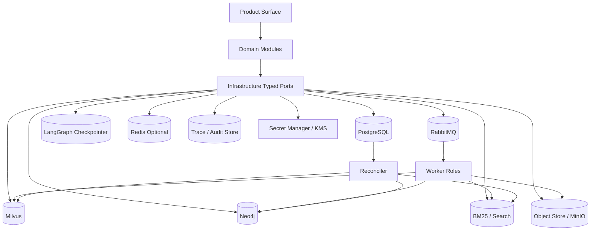
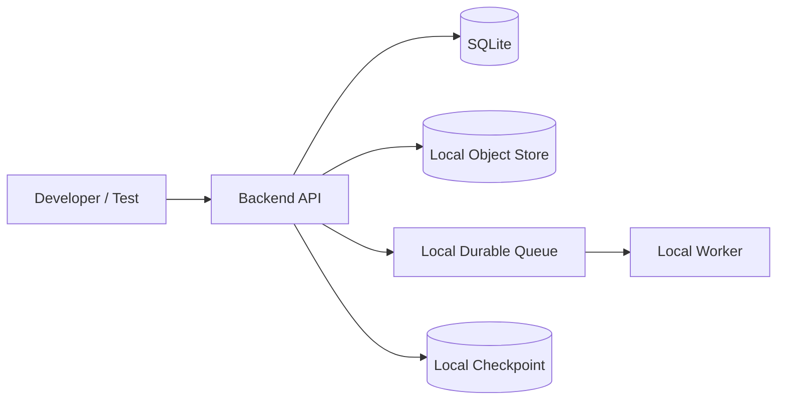
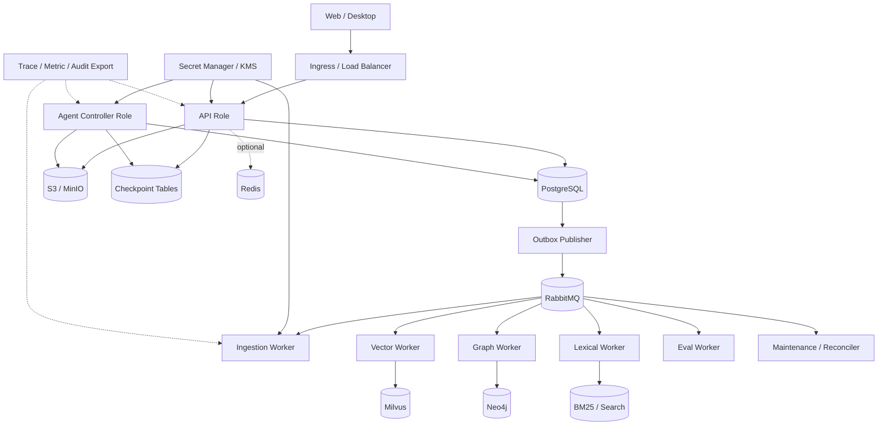

# 11 Infrastructure

updated: 2026-07-14
status: normative-target-module-architecture
module_number: 11
formal_path: `docs/modules/11-infrastructure.md`
agent_mirror: `.agent/modules/11-infrastructure.md`
current_state_source: `docs/status/production-readiness.md`
shared_contract_source: `docs/decisions/0003-wave1-cross-module-contract-freeze.md`
shared_contract_registry: `docs/governance/wave1-cross-module-contract-registry.md`

> 本文是 Zuno 第 11 个逻辑模块 Infrastructure 的唯一正式 Target 架构文档。
>
> 本文统一承载原主文档、数据服务附录和一致性生命周期附录中的全部有效设计。模块不再维护第二份规范性附录。Current、Gap、Measurement 与 production readiness 仍由 `docs/status/production-readiness.md` 维护；实现和迁移计划进入 `.agent/programs/`。

## 0. 文档边界与规范优先级

本文统一承载：

```text
问题、目标、选择与非目标
概念架构、部署拓扑与完整运行流程
PostgreSQL、RabbitMQ、Object Store / MinIO、Checkpointer
Milvus、Neo4j、BM25 / Search、Redis、Trace/Audit、Secret/KMS
事务、Inbox/Outbox、Lease/Fencing、Clock、Capacity
派生索引发布、删除、恢复、审计、升级与兼容
状态机、失败语义、幂等、重试、对账与灾备
安全、多租户、网络、发布、SLO 与成本归属
目标代码、数据库、Port、Migration、测试和完成证据
```

文档边界：

```text
docs/modules/11-infrastructure.md
    唯一 Infrastructure Target 架构事实源。

.agent/modules/11-infrastructure.md
    字节级一致的 Agent 镜像。

docs/decisions/0003-wave1-cross-module-contract-freeze.md
    Wave 1 共享 Contract、物理目录和副作用 Ownership 决议。

docs/governance/wave1-cross-module-contract-registry.md
    跨模块 Owner、Producer、Consumer、Failure 与 Recovery Registry。

docs/status/production-readiness.md
    Current、Gap、Measurement 和完成状态事实源。

.agent/programs/
    Current → Target 的实现、迁移、切流、回滚和收口计划。
```

规范优先级：

```text
全局架构原则
→ 已接受 ADR 与共享 Contract Registry
→ 本模块唯一 Target 架构文档
→ 已确认 Program
→ 代码、Migration 与部署配置
```

本文描述 Target，不因出现类名、表名、Compose 服务或 Adapter 就把能力提升为 Current。

### 0.1 文档内部规范层级

Part I–II 描述问题、概念架构和完整流程；Part III–VI 冻结 Contract、状态、故障、安全与运维语义；Part VII–VIII 冻结实现表面、Requirement、测试与证据。说明性流程不得覆盖规范性 Contract。

---

# Part I：定位、目标与架构选择

# 1. 为什么需要 Infrastructure

企业知识库 Agent 的可靠性问题通常发生在组件边界，而不是单个函数内部：

```text
PostgreSQL 已提交领域事实，但 RabbitMQ 消息尚未发布
MinIO 对象已经上传，但数据库 metadata 尚未提交
RabbitMQ 重投消息，Worker 再次执行外部副作用
Worker Lease 已过期，旧进程仍晚到提交结果
LangGraph Checkpoint 已保存，但领域事务并未完成
Milvus 写入成功，但 Knowledge IndexManifest 未验证
Neo4j 已提交图数据，但版本切流 Receipt 丢失
删除已写 Tombstone，但向量、图或搜索仍可检索
PITR 只恢复 PostgreSQL，派生索引却包含恢复点之后的数据
Mandatory Audit 不可用，高风险 Tool Effect 仍被执行
Migration 执行一半，新旧应用无法兼容
Backup 文件存在，但从未证明可以恢复
容量耗尽后系统仍无界接收任务
```

如果各领域模块各自处理这些问题，会形成互不兼容的事务、重试、时钟、幂等、租约、备份和恢复语义。

一句话定义：

> Infrastructure 是 Zuno 的数据与运行可靠性底座。它把关系数据库、消息队列、对象存储、图控制状态、向量索引、图索引、关键词索引、缓存、审计持久化和 Secret Delivery 封装为可替换、可恢复、可验证的 typed capability；领域模块仍拥有数据含义和业务终局。

# 2. 目标

Infrastructure 提供：

```text
Database Runtime 与 Unit of Work
Object Store 与 Commit Protocol
Queue / Worker Runtime
Transactional Inbox / Outbox
Lease / Heartbeat / Fencing
Authoritative Clock、Deadline 与 Timeout
LangGraph Checkpointer Adapter
Vector / Graph / Lexical Index Runtime
Optional Cache Acceleration
Migration、Upgrade 与 Compatibility
Backup、Restore、PITR 与 Rebuild
Retention、Deletion 与 Legal Hold Enforcement
Configuration、Secret Delivery 与 Encryption
Health、Readiness、Drain 与 Degradation
Capacity、Admission 与 Backpressure
Network Plane 与 Release Provenance
Telemetry / Audit Persistence Primitive
Resource Usage Attribution
```

质量目标：

- 外部调用不嵌入数据库事务。
- at-least-once delivery 下不重复领域提交或不可逆副作用。
- 进程、Worker、连接、上传、索引构建和部署重启后可恢复。
- 所有权威事实、派生索引和缓存的边界明确。
- Local 与 Enterprise Adapter 共用 Contract，但不伪造相同故障语义。
- 多租户过滤在存储和查询入口强制执行。
- 所有“备份、恢复、重建、删除、兼容、性能、安全”声明都能映射到测试和 Evidence。

# 3. 负责与不负责

Infrastructure 负责：

```text
物理连接、连接池和客户端生命周期
事务、条件写、锁、Schema Compatibility
对象上传、Hash、Version、Commit 与清理
消息投递、确认、重投、DLQ、Drain 与容量
Inbox、Outbox、Idempotency Claim
Lease、Heartbeat、Fencing、Clock
Checkpoint 物理保存、兼容和对账
Milvus / Neo4j / Search / Redis 物理 Adapter
Migration、Backup、Restore、PITR、Rebuild
Tenant Isolation Profile 的物理执行
Secret Lease、TLS、Encryption primitive
Health、Readiness、Capacity 和 Telemetry Hook
物理 Receipt、Watermark、Recovery 和 Reconciliation
```

Infrastructure 不负责：

```text
AgentRun、PlanVersion、StepRun 与 RunOutcome 的业务状态
Security Authorization、Approval、Revocation 与 Policy 结论
Model Routing、Provider 选择、Usage 业务语义
ParseJob、Document、Chunk 与 OCR 业务流程
Embedding、Vector Schema、Entity、Relation、Ontology 与检索质量
KnowledgeVersion、MemoryVersion 和 IndexManifest 的领域 Acceptance
Tool 是否允许执行以及 Effect 是否业务成功
Eval Verdict、Release Gate 和质量证明
哪些数据可以缓存、缓存命中是否满足业务正确性
```

不变量：

```text
Infrastructure owns the capability to run a service reliably.
Domain modules own the meaning of facts stored through that capability.
```

# 4. Cross-module Ownership

| Surface | Canonical Owner | Infrastructure 责任 |
| --- | --- | --- |
| Document / ParseJob / Chunk | Input / Ingestion | 事务、对象、Queue、Worker primitive |
| IndexManifest / KnowledgeVersion | Knowledge | 物理索引写入、验证、切流和 Watermark |
| MemoryVersion / MemoryCandidate | Memory | Store、Index Adapter、Retention primitive |
| AgentRun / Plan / Step / Outcome | Agent Core | PostgreSQL、Checkpoint、Lease、ObjectRef |
| ModelCall / Usage / Quota | Model Gateway | Provider Transport、Secret Lease、CAS、Clock |
| PreparedToolAction / EffectReceipt | Tool Runtime | Idempotency、Queue、Lease、Audit、Transport Receipt |
| Authorization / Approval / Epoch | Security | 条件写、Isolation、Secret、Audit Durability |
| Trace / AuditEvent / Eval | Observability & Eval | Durable Append、Outbox、Artifact、Sink Delivery |
| Physical Service Capability | Infrastructure | 完整 Owner |

Infrastructure 是横向运行域，不要求每种能力拆成独立微服务。

当前 Target 部署形态是模块化单体加 Worker Role：

```text
Web / Desktop
→ Server-hosted Product API
→ Python modular monolith
→ Ingestion / Index / Eval / Reconciler worker roles
→ PostgreSQL / RabbitMQ / Object Store / Checkpointer / Index Services
```

十一模块是逻辑 Owner 和 Contract 边界，不是十一套默认微服务。一个后端镜像可以承担多个角色，只要 Port、Contract、事务、Security、Trace、Recovery 和 Deployment Role 边界保持清晰。

# 5. Current / Target / Future / Not Selected

## 5.1 Current Inventory

Current 只由最新代码、Migration、测试和运行证据决定。当前状态事实源仍将下列能力视为本地基线：

| Surface | Current 事实 | 不代表 |
| --- | --- | --- |
| Database | SQLite / SQLModel、本地 durable store | PostgreSQL 并发、锁、PITR 已完成 |
| Object Store | Local filesystem、Hash 与 workspace path | MinIO/S3 Commit、Version 和 Lifecycle 已完成 |
| Runtime Store | 本地 checkpoint/event/interrupt surface | PostgreSQL Checkpointer 对账已完成 |
| Queue | 配置、Compose 或 Adapter skeleton | RabbitMQ Inbox/Outbox、DLQ、Recovery 已证明 |
| Vector / Graph | 本地或声明性 surface | 外部 Milvus/Neo4j 集成与质量已证明 |
| Cache | 本地或配置 surface | Redis 企业缓存、限流或 HA 已证明 |

因此以下句子均不成立：

```text
PostgreSQL 已是 Current
RabbitMQ 已是 Current
MinIO 已是 Current
Milvus 已是 Current
Neo4j 已是 Current
Redis 已是 Current
Kubernetes 已是 Current
production ready 已完成
```

## 5.2 Target Selection

| Capability | Developer / CI Adapter | Canonical Server Product Target | Authority |
| --- | --- | --- | --- |
| Relational facts | SQLite | PostgreSQL 16+ | authoritative，领域语义归各模块 |
| Async work queue | local durable/in-process queue | RabbitMQ durable/quorum queue | transport，不是领域事实源 |
| Immutable payload | local immutable filesystem | S3-compatible Object Store / MinIO | committed object authority |
| Graph control state | local checkpoint | LangGraph-compatible PostgreSQL Checkpointer | control-state authority within boundary |
| Vector index | local test adapter | Milvus Adapter | rebuildable derived |
| Graph index | local test adapter | Neo4j / replaceable graph Adapter | rebuildable derived |
| Lexical index | local BM25 | pluggable BM25/Search Adapter | rebuildable derived |
| Cache | bounded in-process cache | Redis Adapter | optional, non-authoritative |
| Trace/Audit persistence | local append store | PostgreSQL/Object Store + external sink | physical durability |
| Secret/KMS | env/file ref | Secret Manager/KMS Adapter | delivery primitive |

服务端统一后端是产品 Target：

```text
Web / Desktop Frontend
→ Server-hosted Product API
→ Principal / Tenant / Workspace resolution
→ Security Control Plane
→ Agent / Input / Knowledge / Memory / Model / Tool
→ PostgreSQL / RabbitMQ / Object Store / Checkpoint / Index Services
```

前端不得直连数据库、Queue、对象存储、模型 Provider 或 Secret Store。

## 5.3 Future Optional

- Redis 高级缓存、Rate Limit acceleration 和非权威协调优化。
- Managed PostgreSQL、Managed Queue、Managed Object Store。
- Kubernetes、Operator 与 Service Mesh。
- Warm Standby、跨区域 Read Replica、专用 Backup Appliance。
- HSM/KMS、高等级 Confidential Computing。
- 多区域 Active-Passive 自动化。

## 5.3.1 Polyglot 和选择性服务拆分边界

未来可以引入 Java 或其他语言承载传统企业业务控制面，例如 Tenant / Organization、Workspace、Membership、Resource Catalog、Billing / Quota、Notification、企业审批流或既有业务领域服务。但语言边界不能替代领域 Ownership：

```text
Java Service 可以拥有组织成员、Workspace 或业务资源事实。
Python Agent Runtime 继续拥有 Agent Core、Knowledge、Memory、Model Gateway、Capability、Tool Runtime 和 Eval 的 AI/Agent 领域事实。
Security 仍拥有授权语义、Policy、Grant、Epoch 和 SecurityDecision。
Product Surface 只消费授权后的 Projection 和 AvailableAction。
```

跨语言服务必须使用 OpenAPI / gRPC、AsyncAPI / CrossModuleEnvelope、Contract Bundle Version、Schema Registry、Idempotency Key、Correlation / Causation、Security Epoch、Deadline、Failure Namespace、Owner 和 Recovery Owner。禁止跨服务共享 ORM、直接访问其他服务数据库、重复定义同一状态枚举，或把 Java / Python 分工写成领域事实边界。

选择性拆分服务必须由证据触发：

```text
独立扩缩容
故障隔离
发布节奏不同
数据驻留或安全边界不同
资源模型差异巨大
独立团队 Ownership
单体部署成为可测量瓶颈
```

优先可拆的是 Ingestion Worker、Model Gateway、Tool Execution Worker、Eval Worker、Indexing Worker 和 Delivery / Notification。Agent Core 的 Plan、Run 和 Outcome 一致性核心不得过早拆散。

## 5.4 Explicitly Not Selected

```text
Kafka 作为默认工作队列
Event Sourcing 作为全系统事实模型
XA / 2PC 或跨存储分布式事务
默认多区域 Active-Active
大量微服务与 Service Mesh 作为先决条件
Kubernetes 作为本模块完成标准
Redis 作为 Authorization、Budget、Usage、AgentRun 或 IndexManifest 唯一事实源
Milvus、Neo4j、RabbitMQ 或 Redis 作为事务事实源
把所有在线 LangGraph Node 放入 RabbitMQ
用一个 CRUD Adapter 抹平不同存储的故障和一致性语义
仅凭 Docker Compose 启动成功宣称 production ready
```

---

# Part II：概念架构、拓扑与完整流程

# 6. 概念架构



# 7. 部署拓扑

## 7.1 Developer / CI Local Adapter Topology



约束：

- 只用于开发、测试、CI 和离线演示。
- 不能证明 PostgreSQL Isolation、RabbitMQ Confirm、Milvus Visibility、Neo4j Cluster 或 Redis Failover。
- 不支持的语义必须 fail-fast，不能静默模拟。
- 业务代码不得通过 `if sqlite`、`if local_queue` 改变领域规则。

## 7.2 Canonical Server Product Topology



推荐以同一 Backend Image 按 Role 启动，不默认拆成大量微服务。

# 8. 文档摄取与索引构建流程

```text
1. Product API 接收文件和可信 Principal/Tenant/Workspace Context
2. Input 在 PostgreSQL 创建 Document、SourceObject、IngestionJob 草稿
3. Infrastructure 创建 ObjectCommit 和上传 Session
4. 文件上传 Object Store staging key
5. 校验 size、hash、media type、encryption metadata
6. PostgreSQL 同一事务提交领域事实、Committed ObjectRef 与 Outbox
7. Outbox Publisher 发送 Parse/Extract/Index Command 到 RabbitMQ
8. Worker 通过 Inbox Claim、Lease 和 Fencing 获得工作
9. Input Worker 解析、OCR、Chunk；大型结果写 Object Store
10. Knowledge 创建 IndexBuildRun 和 immutable target version
11. Vector / Graph / Lexical Worker 分别写 Milvus、Neo4j、BM25/Search
12. Infrastructure 返回 IndexWriteReceipt 与 WriteVisibilityReceipt
13. Infrastructure 执行物理 IndexVerification
14. Knowledge 提交 IndexManifest、Lineage 和质量 Acceptance
15. Knowledge 使用 generation/CAS 激活 KnowledgeVersion
16. Infrastructure 执行 alias/routing cutover并写 ServingWatermark
17. 旧版本按 Snapshot、Retention、LegalHold 进入 RETIRING
```

边界：

```text
Input / Knowledge 决定“做什么、结果是否合格”。
Infrastructure 决定“如何可靠保存、投递、写入、切流和恢复”。
```

# 9. 在线查询流程

```text
Product API
→ Agent Core 固定 KnowledgeSnapshotRef / MemorySnapshotRef
→ Knowledge Retrieval Orchestrator
    → BM25 / Search lexical retrieval
    → Milvus vector retrieval
    → Neo4j graph retrieval
→ Evidence Merge / Rerank / Citation
→ Model Gateway
→ Final Gate / Answer
```

规则：

- 普通在线问答不默认经过 RabbitMQ。
- Redis 只能缓存带 Source Generation、Security Scope 和 Version 的可失效结果。
- ACL/Authorization Filter 必须在 Vector、Graph、Lexical 召回前或存储引擎内部执行。
- Query 不得静默混用不同 KnowledgeVersion 或 Serving Generation。

# 10. 异步工作流程

适合 RabbitMQ 的任务：

```text
Parse / OCR / Chunk
Embedding / Vector Index
Entity / Relation / Graph Build
BM25 / Search Build
Eval Job
Memory Consolidation
Deletion / Retention / Rebuild
Backup / Restore / Reconciliation
```

Canonical Consumer Flow：

```text
RabbitMQ Delivery
→ Validate CrossModuleEnvelopeV1
→ Claim Inbox
→ Acquire CapacityReservation
→ Acquire WorkerLease + FencingToken
→ Execute Domain Handler
→ Domain Facts + Inbox COMMITTED + Outbox in one PostgreSQL transaction
→ ACK RabbitMQ
```

ACK 前崩溃会重投；已有 COMMITTED Inbox 时直接 ACK duplicate，不重复领域副作用。

# 11. 跨存储发布流程

Cross-store Publish Protocol：

```text
PostgreSQL Draft + Outbox
→ RabbitMQ Build Command
→ Idempotent physical writes
→ IndexWriteReceipt
→ WriteVisibilityReceipt
→ IndexVerification
→ Domain IndexManifest
→ Domain Acceptance
→ generation/CAS Cutover
→ ServingWatermark
```

不使用 2PC。依靠：

```text
PostgreSQL Domain Facts
Outbox / Inbox
Idempotency Key
Immutable Version
Physical Receipt
IndexManifest
Generation / CAS
Reconciler
```

# 12. Cross-store Deletion

```text
DeletionRequest
→ Security / LegalHold Check
→ Domain Tombstone
→ Query Visibility Revocation
→ RabbitMQ Cleanup Commands
→ Object / Vector / Graph / Lexical / Cache / Checkpoint Cleanup
→ DeletionVerification
→ Retention-aware Physical Purge
```

删除不变量：

- Domain Tombstone 是删除事实源。
- Visibility Deadline 优先于物理清理完成时间。
- 任一派生存储清理失败，不得恢复查询可见性。
- LegalHold 可以阻止 Purge，但是否阻止前台隐藏由 Security/Policy 决定。
- Backup 到期策略不能冒充实时删除。

# 13. Recovery Set 与灾难恢复流程

```text
Backup / PITR Request
→ Restore PostgreSQL to isolated target
→ Restore Object Manifest
→ Restore or reconstruct Checkpoint
→ Align Outbox Sequence and Security Epoch
→ Classify Milvus / Neo4j / Search versions
→ Rebuild stale derived indexes
→ Validate Tenant Isolation and Configuration
→ RecoverySetValidation
→ Explicit Cutover Approval
→ Production Cutover or Rollback
```

规则：

- 派生索引领先恢复点：`QUARANTINED`。
- 派生索引落后恢复点：`STALE → REBUILDING`。
- Redis 默认冷启动重建，不进入权威 Recovery Set。
- `cutover_allowed=false` 时不得自动切生产。

---

# Part III：核心 Contract 与事实边界

# 14. InfrastructureCapabilityProfile

```python
class InfrastructureCapabilityProfile(BaseModel):
    profile_id: str
    profile_version: str
    deployment_class: Literal["DEVELOPER_CI", "SERVER_PRODUCT"]
    database: DataServiceCapability
    object_store: DataServiceCapability
    checkpoint_store: DataServiceCapability
    queue: DataServiceCapability
    vector_index: DataServiceCapability | None
    graph_index: DataServiceCapability | None
    lexical_index: DataServiceCapability | None
    cache: DataServiceCapability | None
    secret_delivery: DataServiceCapability
    telemetry: DataServiceCapability
    limits: InfrastructureLimits
    content_hash: str
```

Profile 必须 immutable、可哈希、可版本化，并在进程启动时固定。运行中切换通过新 Profile、Drain 和 Cutover，不允许静默改变语义。

# 15. DataServiceCapability

```python
class DataServiceCapability(BaseModel):
    service_kind: Literal[
        "RELATIONAL", "QUEUE", "OBJECT", "CHECKPOINT",
        "VECTOR", "GRAPH", "LEXICAL", "CACHE",
        "TRACE_AUDIT", "SECRET_KMS",
    ]
    adapter_name: str
    adapter_version: str
    deployment_profile: str
    authoritative: bool
    rebuildable: bool
    consistency_model: str
    tenant_isolation_mode: str
    backup_restore_class: str
    schema_or_contract_version: str
    config_hash: str
    supported_semantics: list[str]
    unsupported_semantics: list[str]
```

- PostgreSQL 领域事实和 Committed Object Metadata 可以是 authoritative。
- Milvus、Neo4j、BM25/Search、Redis 默认 `authoritative=false`。
- `rebuildable=true` 必须声明权威输入、重建命令、版本 Pin、验证和 Receipt。
- Adapter 替换不得静默改变 Transaction、Filter、Score、Visibility 或 Failure Semantics。

# 16. DatabaseTransaction 与 Unit of Work

```python
class DatabaseTransaction(BaseModel):
    transaction_id: str
    tenant_id: str
    workspace_id: str | None
    isolation_level: str
    read_only: bool
    expected_schema_version: str
    effective_security_epoch_ref: str | None
    expected_generation: int | None
    fencing_token: int | None
    deadline_at: datetime
    statement_timeout_ms: int
    lock_timeout_ms: int
    trace_id: str
```

规则：

- Application Service 开启和提交 Unit of Work；Repository 不自行 Commit。
- 外部模型、Queue、Object Store、HTTP、Milvus、Neo4j 和 Tool 调用不进入数据库事务。
- Serialization / Deadlock 只按 Policy 重试整个 UoW。
- Unique/FK/Check Violation 是结构化冲突，不盲目重试。
- Generation、Security Epoch、Fencing 不匹配产生 stale-write failure。

# 17. StorageObject 与 ObjectCommit

```python
class StorageObject(BaseModel):
    object_id: str
    tenant_id: str
    workspace_id: str
    object_kind: str
    content_hash: str
    size_bytes: int
    media_type: str
    encryption_key_ref: str | None
    storage_uri: str
    version_id: str | None
    commit_id: str
    status: Literal["STAGED", "COMMITTED", "TOMBSTONED", "PURGED", "QUARANTINED"]
    retention_policy_ref: str
    legal_hold_refs: list[str]

class ObjectCommit(BaseModel):
    commit_id: str
    object_id: str
    idempotency_key: str
    expected_content_hash: str
    upload_session_ref: str
    status: str
    trace_id: str
```

读路径只接受 `COMMITTED` 且 metadata、version、hash 匹配的对象。

# 18. QueueMessage、InboxRecord 与 OutboxRecord

```python
class QueueMessage(BaseModel):
    message_id: str
    contract_name: str
    contract_version: str
    tenant_id: str
    workspace_id: str | None
    correlation_id: str
    causation_id: str | None
    idempotency_key: str
    payload_ref: str
    payload_hash: str
    available_at: datetime
    deadline_at: datetime
    priority: int
    delivery_count: int

class InboxRecord(BaseModel):
    consumer_name: str
    message_id: str
    idempotency_key: str
    status: Literal["CLAIMED", "COMMITTED", "REJECTED", "DUPLICATE"]
    domain_result_ref: str | None
    failure_ref: str | None

class OutboxRecord(BaseModel):
    outbox_id: str
    aggregate_type: str
    aggregate_id: str
    event_sequence_no: int
    contract_name: str
    contract_version: str
    payload_ref: str
    payload_hash: str
    status: Literal["PENDING", "PUBLISHING", "PUBLISHED", "RETRY_WAIT", "DEAD"]
    attempt_count: int
    next_attempt_at: datetime | None
```

# 19. WorkerLease、FencingToken、Clock 与 CapacityReservation

```python
class WorkerLease(BaseModel):
    lease_id: str
    resource_type: str
    resource_id: str
    owner_worker_id: str
    lease_epoch: int
    fencing_token: int
    acquired_at: datetime
    heartbeat_at: datetime
    expires_at: datetime
    status: str

class FencingToken(BaseModel):
    resource_id: str
    token: int
    issued_at: datetime
    issued_to: str
    valid_until: datetime

class CapacityReservation(BaseModel):
    reservation_id: str
    tenant_id: str
    resource_class: str
    units: int
    priority: int
    deadline_at: datetime
    owner_ref: str
    status: str
```

Clock 规则：

- 持久化时间使用 UTC。
- 进程内 elapsed/timeout 使用 monotonic clock。
- Lease、Deadline、Retention 使用数据库或权威时间源。
- Clock Skew 超阈值时拒绝 Lease-sensitive write。

# 20. CheckpointRecord 与 Domain Boundary

```python
class CheckpointRecord(BaseModel):
    checkpoint_id: str
    thread_id: str
    checkpoint_namespace: str
    checkpoint_generation: int
    parent_checkpoint_id: str | None
    graph_bundle_id: str
    graph_schema_version: str
    state_schema_version: str
    state_payload_ref: str
    state_payload_hash: str
    pending_interrupt_refs: list[str]
    domain_generation_seen: int
    effective_security_epoch_ref: str
    created_at: datetime

class RecoveryWatermark(BaseModel):
    scope_type: str
    scope_id: str
    domain_generation: int
    checkpoint_generation: int
    outbox_sequence: int
    object_commit_sequence: int
    reconciled_at: datetime
    reconciler_version: str
    status: str
```

事实边界：

```text
PostgreSQL 保存领域事实
LangGraph Checkpointer 保存图控制状态
Object Store 保存大型不可变 Payload
Generation、Fencing、RecoveryWatermark 与 Outbox 负责对账
Checkpoint 不能替代 Domain Commit
```

# 21. 派生索引 Contract

```python
class IndexBuildRun(BaseModel):
    build_run_id: str
    owner_module: Literal["KNOWLEDGE", "MEMORY"]
    tenant_id: str
    workspace_id: str
    index_kind: Literal["VECTOR", "GRAPH", "LEXICAL"]
    target_version: str
    source_snapshot_ref: str
    source_manifest_hash: str
    schema_spec_ref: str
    config_version: str
    idempotency_key: str
    deadline_at: datetime
    status: str

class IndexWriteBatch(BaseModel):
    batch_id: str
    build_run_id: str
    target_version: str
    item_identity_scheme: str
    item_count: int
    payload_ref: str
    payload_hash: str
    idempotency_key: str
    expected_generation: int
    tenant_scope_hash: str

class IndexWriteReceipt(BaseModel):
    receipt_id: str
    batch_id: str
    service_kind: str
    physical_target_ref: str
    attempt_no: int
    accepted_count: int
    rejected_count: int
    observed_generation: int
    service_commit_ref: str | None
    checksum_or_digest: str | None
    status: Literal["COMMITTED", "PARTIAL", "DUPLICATE", "FAILED", "UNKNOWN"]

class WriteVisibilityReceipt(BaseModel):
    receipt_id: str
    write_receipt_ref: str
    consistency_class: Literal["IMMEDIATE", "READ_YOUR_WRITE", "BOUNDED_EVENTUAL", "EVENTUAL"]
    visible_at: datetime | None
    visibility_deadline_at: datetime
    serving_watermark_ref: str | None
    status: Literal["PENDING", "VISIBLE", "DEADLINE_EXCEEDED", "FAILED"]

class IndexVerification(BaseModel):
    verification_id: str
    build_run_id: str
    target_version: str
    schema_match: bool
    count_match: bool
    lineage_match: bool
    tenant_filter_passed: bool
    representative_query_passed: bool
    status: Literal["PASSED", "FAILED", "QUARANTINED"]

class DerivedIndexReplica(BaseModel):
    replica_id: str
    owner_module: str
    index_kind: str
    tenant_id: str
    workspace_id: str
    version: str
    physical_ref: str
    schema_version: str
    source_snapshot_ref: str
    source_manifest_hash: str
    serving_generation: int
    status: str

class IndexCutover(BaseModel):
    cutover_id: str
    index_kind: str
    from_version: str | None
    to_version: str
    expected_serving_generation: int
    owner_approval_ref: str
    effective_security_epoch_ref: str
    deadline_at: datetime
    status: str

class ServingWatermark(BaseModel):
    owner_module: str
    tenant_id: str
    workspace_id: str
    index_kind: str
    serving_version: str
    serving_generation: int
    source_generation: int
    visible_through_batch_id: str
    status: Literal["CURRENT", "LAGGING", "STALE", "BLOCKED"]
```

Infrastructure Verification 只证明物理条件；`IndexManifest`、KnowledgeVersion、MemoryVersion 和质量 Acceptance 归领域 Owner。

# 22. 删除、恢复与审计 Contract

```python
class DeletionRequest(BaseModel):
    deletion_id: str
    owner_module: str
    tenant_id: str
    workspace_id: str
    subject_type: str
    subject_id: str
    requested_by_ref: str
    effective_security_epoch_ref: str
    legal_hold_check_ref: str
    visibility_deadline_at: datetime
    physical_delete_not_before: datetime
    status: str

class DeletionTarget(BaseModel):
    deletion_id: str
    target_kind: Literal[
        "POSTGRES_DOMAIN", "OBJECT", "VECTOR", "GRAPH",
        "LEXICAL", "CACHE", "CHECKPOINT_REF", "BACKUP",
    ]
    target_ref: str
    required_action: Literal["TOMBSTONE", "HIDE", "DELETE", "PURGE", "REBUILD"]
    receipt_ref: str | None
    status: str

class DeletionVerification(BaseModel):
    deletion_id: str
    query_visibility_revoked: bool
    active_snapshot_refs: list[str]
    unresolved_target_refs: list[str]
    legal_hold_refs: list[str]
    status: Literal["PASSED", "PARTIAL", "BLOCKED"]

class RecoverySetManifest(BaseModel):
    recovery_set_id: str
    recovery_point_at: datetime
    postgres_lsn: str
    object_manifest_version: str
    checkpoint_generation: int
    outbox_sequence: int
    effective_security_epoch_ref: str
    config_version: str
    knowledge_versions: list[str]
    memory_versions: list[str]
    vector_watermarks: list[str]
    graph_watermarks: list[str]
    lexical_watermarks: list[str]
    backup_manifest_refs: list[str]
    status: str

class RecoverySetValidation(BaseModel):
    recovery_set_id: str
    domain_consistent: bool
    checkpoint_consistent: bool
    object_consistent: bool
    security_consistent: bool
    derived_indexes_consistent: bool
    stale_replica_refs: list[str]
    rebuild_required_refs: list[str]
    cutover_allowed: bool
    evidence_ref: str

class AuditDurabilityRequirement(BaseModel):
    audit_class: Literal["BEST_EFFORT", "DURABLE", "MANDATORY_BEFORE_EFFECT"]
    event_catalog_id: str
    owner_module: str
    local_persistence_required: bool
    external_delivery_required: bool
    max_buffer_age_seconds: int
    fail_mode: Literal["DEGRADE", "REJECT", "BLOCK_EFFECT"]

class AuditBufferReservation(BaseModel):
    reservation_id: str
    tenant_id: str
    audit_class: str
    units: int
    deadline_at: datetime
    status: str

class AuditPersistenceReceipt(BaseModel):
    audit_event_id: str
    local_commit_ref: str
    outbox_ref: str | None
    integrity_chain_ref: str
    status: Literal["COMMITTED", "DUPLICATE", "FAILED"]
```

# 23. Compatibility、Isolation、Release 与 Attribution

```python
class TenantIsolationProfile(BaseModel):
    service_kind: str
    isolation_class: Literal[
        "SHARED_WITH_ENFORCED_SCOPE", "NAMESPACE_PER_TENANT",
        "DATABASE_PER_TENANT", "DEDICATED_DEPLOYMENT",
    ]
    scope_injection_mode: str
    physical_policy_ref: str
    encryption_context_required: bool

class ServiceCompatibilityEntry(BaseModel):
    service_kind: str
    application_version: str
    adapter_version: str
    server_version: str
    schema_version: str
    read_compatible_versions: list[str]
    write_compatible_versions: list[str]
    rollback_compatible_versions: list[str]

class AdapterConformanceProfile(BaseModel):
    adapter_name: str
    service_kind: str
    deployment_class: Literal["DEVELOPER_CI", "SERVER_PRODUCT"]
    supported_semantics: list[str]
    unsupported_semantics: list[str]
    fail_fast_on_unsupported: bool
    conformance_suite_version: str

class ServiceCriticalityProfile(BaseModel):
    role: str
    service_kind: str
    criticality: Literal["REQUIRED", "DEGRADED_ALLOWED", "OPTIONAL", "REBUILDABLE"]
    readiness_behavior: str
    degradation_policy_ref: str

class ReleaseManifest(BaseModel):
    release_id: str
    source_commit: str
    application_image_digest: str
    sbom_ref: str
    signature_ref: str
    config_versions: list[str]
    migration_versions: list[str]
    adapter_versions: list[str]
    data_service_compatibility_ref: str
    rollback_release_ref: str | None

class ResourceUsageAttribution(BaseModel):
    attribution_id: str
    tenant_id: str
    workspace_id: str | None
    run_id: str | None
    service_kind: str
    resource_class: str
    units: float
    source_receipt_ref: str
```

---

# Part IV：数据服务组件设计

# 24. PostgreSQL

定位：结构化权威事实、事务协调、Inbox/Outbox、Lease、Migration、Backup/PITR 的核心能力。

Infrastructure Owns：

```text
Engine / Driver / Pool
Role-specific Pool Profile
Unit of Work / Transaction
Statement / Lock Timeout
Schema Compatibility
Migration Runtime
Backup / WAL / PITR
Conditional Write / CAS
Physical Tenant Isolation
Health / Capacity / Telemetry
```

Domain Owns：领域 Schema、状态机、业务约束和事实含义。

规则：

- API、Controller、Worker、Migration 使用独立 Pool Profile。
- 长模型调用、对象上传、Queue Publish、Tool 调用不占用事务连接。
- `FOR UPDATE SKIP LOCKED` 必须配公平性、Deadline 和饥饿监测。
- Schema Version 不在兼容窗口时 Readiness fail-closed。
- Failover 后验证 WAL/LSN、Outbox Sequence、Fencing 和 RecoveryWatermark。

# 25. RabbitMQ

定位：长时间异步工作和削峰数据平面，不是在线 Agent 控制状态或业务终局事实源。

Infrastructure Owns：

```text
Connection / Channel Lifecycle
Exchange / Queue / Routing Key
Durable / Quorum Configuration
Publisher Confirm
ACK / NACK / Redelivery
DLQ / Retry Queue / Expiry
Prefetch / Capacity / Backpressure
Consumer Drain / Reconnect
Queue Envelope Validation
```

Domain Owns：Command/Event Contract、处理结果、业务 Retry/Replan 和终局。

规则：

- 采用 at-least-once，不宣称 Broker exactly-once。
- Publisher Confirm 丢失允许重发，Consumer 必须幂等。
- DLQ 只证明 Delivery 失败，不替领域模块决定业务失败。
- Queue ACK != Tool Effect Success。

# 26. Object Store / MinIO / S3

定位：原始文档、解析快照、Observation、Artifact、Checkpoint 大 Payload 和 Backup Manifest 的不可变对象能力。

Infrastructure Owns：

```text
Bucket / Key / Prefix
Staging Upload / Multipart
Hash / Size / Media Type Verification
Version / Encryption Metadata
ObjectCommit
Retention / Lifecycle / LegalHold Binding
Orphan Reconciliation
Backup / Restore
```

规则：

- 对象上传与 PostgreSQL 不使用 XA/2PC。
- 先 Reserve，事务外上传，后提交 Metadata、Domain Ref 和 Outbox。
- 读路径拒绝 STAGED、Hash Mismatch 和缺 Metadata 对象。
- Object Commit != Publication Success。

# 27. LangGraph Checkpointer

定位：图控制状态、Interrupt、Pending Send 和 Graph/State Version，不替代领域事实。

Infrastructure Owns：Saver Adapter、Physical Schema、Compatibility、Retention、Backup 和 Reconciliation。

Agent Core Owns：控制状态含义、恢复决策和 Run 生命周期。

规则：

- Checkpoint Ahead of Domain：阻止副作用并 Reconcile。
- Checkpoint Behind Domain：从领域事实重建可派生控制状态或回到兼容 Node。
- Graph/State Schema 不兼容：`BLOCKED_INCOMPATIBLE_CHECKPOINT`。
- Active/Waiting Run 的恢复链不得被 Retention 破坏。

# 28. Milvus

定位：向量检索派生索引，可重建，不是权威事实源。

Infrastructure Owns：

```text
Client / Connection
Collection / Partition / Index Physical Lifecycle
Batch Upsert
Visibility Probe
Capacity / Compaction / Health
Backup Snapshot / Rebuild Primitive
Version / Alias Cutover
Tenant Isolation Enforcement
```

Knowledge / Memory Owns：Embedding、Dimension、Metadata Schema、Filter、Top-K、Score、Rerank、IndexManifest 和质量。

规则：

- Stable Vector ID + Target Version + Idempotency Key。
- Write-Then-Crash Before Manifest：重投 Verify/Upsert，不激活版本。
- Partial Write、Count Mismatch、Schema Mismatch：`FAILED/QUARANTINED`。
- Milvus unavailable 时只返回能力状态，Knowledge 决定降级或 fail-closed。

# 29. Neo4j / Replaceable Graph Store

定位：实体关系、社区和多跳 GraphRAG 的派生图索引。

Infrastructure Owns：Driver、Database/Constraint Physical Lifecycle、Transaction Retry、Capacity、Backup/Rebuild 和 Version Cutover。

Knowledge Owns：Entity、Relation、Ontology、Provenance、Community、Traversal 和 GraphRAG 语义。

规则：

- Node/Edge Identity 包含 Tenant、Workspace、KnowledgeVersion 和 Stable Domain Key。
- Replay 使用 MERGE/Conditional Write 或等价幂等策略。
- Commit-Then-Crash Before Manifest：通过 Receipt 和 Version Scope 对账。
- 图路径无法回到 SourceSpan 是 Knowledge Evidence Failure，不是 Infrastructure 成功。

# 30. BM25 / Search

定位：关键词、精确匹配和 Hybrid Retrieval 的可替换派生索引。

Infrastructure Owns：Service Client、Physical Index Lifecycle、Snapshot、Alias、Capacity、Health 和 Rebuild。

Knowledge Owns：Analyzer、Tokenization、Synonym、Mapping、Query、Ranking Profile 和质量。

规则：

- Analyzer、Mapping、Synonym、Index Version immutable。
- Active Index 不原地静默修改。
- Restore/Rebuild 后验证 Count、Version Distribution、Tenant Filter 和 Representative Query。

# 31. Redis

定位：Future Optional Cache / Rate-limit Acceleration / Non-authoritative Coordination。

Infrastructure Owns：Client/Pool、Namespace、TTL、Eviction、Failover、Generation、Health 和 Metrics。

Domain Owns：哪些数据可缓存、Cache Key 业务组成、Invalidation 和 Fallback。

禁止仅存 Redis：

```text
AgentRun / PlanVersion
Authorization / Approval
Usage Ledger
IndexManifest / KnowledgeVersion
长期 Memory
任何无法从权威来源重建的事实
```

Redis unavailable 时必须回退权威 Store 或显式降级，不能触发领域状态变化。

# 32. Trace/Audit Persistence 与 Secret/KMS

Trace/Audit persistence：

- Infrastructure 提供 Local Durable Append、Outbox、Integrity Chain、Object Artifact 和 Sink Delivery Primitive。
- Observability 拥有 TelemetryEnvelope、AuditEvent、Projection 和 Eval Verdict。
- External Sink 不可用不能导致 Mandatory Audit 本地事实丢失。

Secret/KMS：

- Security 拥有授权、Purpose、Scope、Classification、Revocation。
- Infrastructure 提供 SecretLease、Version、TTL、Rotation、Connection Drain 和 Delivery Receipt。
- Secret Material 不进入普通数据库字段、Queue、Checkpoint、Prompt、Trace 或 Audit。

---

# Part V：状态机与一致性生命周期

# 33. ObjectCommit State Machine

```text
PREPARED → UPLOADING → UPLOADED → COMMITTING → COMMITTED
UPLOADING/UPLOADED → ABORTED
UPLOADED → ORPHANED → PURGED
UPLOADED → QUARANTINED
```

Guard：Hash、Size、Version、Encryption Metadata、Domain Ref 和 Idempotency。

# 34. QueueMessage / Delivery State Machine

```text
PERSISTED → AVAILABLE → DELIVERED → PROCESSING
→ COMMIT_CONFIRMED → ACKED

DELIVERED/PROCESSING → RETRY_WAIT → AVAILABLE
DELIVERED → ACKED_DUPLICATE
* → DEAD_LETTERED
AVAILABLE/RETRY_WAIT → EXPIRED
```

# 35. WorkerLease State Machine

```text
AVAILABLE → CLAIMED → ACTIVE
ACTIVE → EXPIRING → ACTIVE | EXPIRED
ACTIVE → RELEASED
* → REVOKED
```

每次重新获取同一资源的 Lease 必须增加 Fencing Token。旧 Worker 晚到只能形成 Late Result，不能写领域状态。

# 36. MigrationRun State Machine

```text
PLANNED → PRECHECKING → READY → APPLYING_EXPAND
→ BACKFILLING → VERIFYING → CONTRACTING → COMPLETED

PRECHECKING → BLOCKED
APPLYING_EXPAND/BACKFILLING/VERIFYING → FAILED
FAILED → ROLLING_BACK → ROLLED_BACK
FAILED → FORWARD_FIXING → VERIFYING
```

默认 Expand → Dual Support → Backfill → Verify → Drain Old Version → Contract。

# 37. BackupRun 与 RestoreRun State Machine

BackupRun：

```text
SCHEDULED → SNAPSHOTTING → UPLOADING → VERIFYING → COMPLETED
SNAPSHOTTING/UPLOADING → RETRY_WAIT
VERIFYING → CORRUPT
* → FAILED
COMPLETED → EXPIRED
```

RestoreRun：

```text
REQUESTED → VALIDATING_INPUT → PROVISIONING_ISOLATED_TARGET
→ RESTORING_DATABASE → RESTORING_OBJECTS
→ REBUILDING_DERIVED_INDEXES → VERIFYING
→ READY_FOR_CUTOVER → CUTTING_OVER → COMPLETED

* → FAILED → CLEANING_UP → ABORTED
CUTTING_OVER → ROLLED_BACK
```

# 38. DerivedIndexReplica State Machine

```text
DECLARED → SOURCE_PINNED → PROVISIONING → BUILDING → VERIFYING
→ READY_FOR_OWNER_ACCEPTANCE → ACCEPTED → CUTTING_OVER → SERVING

BUILDING/VERIFYING → FAILED → RETRY_WAIT | REBUILDING | ABORTED
READY_FOR_OWNER_ACCEPTANCE → REJECTED
CUTTING_OVER → CONFLICT | ROLLED_BACK
SERVING → STALE | RETIRING
STALE → REBUILDING
RETIRING → RETIRED
* → QUARANTINED
```

- `READY_FOR_OWNER_ACCEPTANCE` 只证明物理完整性。
- `SERVING` 只能由领域 Owner Acceptance + generation/CAS 触发。
- Active Snapshot、Retention、LegalHold 会阻止错误 Retirement。

# 39. Deletion State Machine

```text
REQUESTED → AUTHORIZED → LEGAL_HOLD_CHECKING → TOMBSTONED_IN_DOMAIN
→ QUERY_VISIBILITY_REVOKING → QUERY_VISIBILITY_REVOKED
→ PHYSICAL_DELETE_PENDING → PHYSICAL_DELETING → VERIFYING → COMPLETED

LEGAL_HOLD_CHECKING → BLOCKED_LEGAL_HOLD
QUERY_VISIBILITY_REVOKING → PARTIAL_VISIBILITY_REVOKED
PHYSICAL_DELETING → PARTIAL_DELETE
PARTIAL_* → RETRY_WAIT | RECONCILING
VERIFYING → FAILED_VERIFICATION
```

# 40. Recovery Set State Machine

```text
REQUESTED → LOCATING_ARTIFACTS → RESTORING_ISOLATED_TARGET
→ ALIGNING_DOMAIN_OBJECT_CHECKPOINT → CLASSIFYING_DERIVED_INDEXES
→ REBUILDING_REQUIRED_INDEXES → VERIFYING_SECURITY_AND_CONFIG
→ READY_FOR_CUTOVER → CUTTING_OVER → COMPLETED

* → FAILED → CLEANING_UP → ABORTED
CUTTING_OVER → ROLLED_BACK
```

# 41. Mandatory Audit Backpressure State Machine

```text
REQUIRED → CAPACITY_RESERVED → LOCAL_COMMITTING → LOCAL_COMMITTED
→ OUTBOX_PENDING → EXTERNAL_DELIVERING → DELIVERED

CAPACITY_RESERVED → REJECTED_CAPACITY
LOCAL_COMMITTING → FAILED_LOCAL_COMMIT
OUTBOX_PENDING/EXTERNAL_DELIVERING → RETRY_WAIT | DEAD_LETTERED
```

| Audit Class | Local Store unavailable | External Sink unavailable | Buffer exhausted |
| --- | --- | --- | --- |
| `BEST_EFFORT` | 可按策略丢弃非敏感调试事件并计数 | 降级 | 丢弃并告警 |
| `DURABLE` | 降级或拒绝，不能伪造成功 | Local + Outbox 重试 | Backpressure / retryable reject |
| `MANDATORY_BEFORE_EFFECT` | `BLOCK_EFFECT` | Local 已提交后可异步外送 | `BLOCK_EFFECT` |

PreparedAction 与 Tool Effect Ownership 服从 ADR 0003：Agent Core 拥有 ActionProposal/Binding，Tool Runtime 拥有 PreparedToolAction/Attempt/Effect，Security 拥有 Approval/Epoch，Infrastructure 拥有 Idempotency、Lease、Transaction、Outbox 和 Audit Persistence。

# 42. Upgrade Compatibility State Machine

```text
PLANNED → COMPATIBILITY_CHECKING → PROVISIONING_PARALLEL_TARGET
→ DUAL_SUPPORT → BACKFILLING → VERIFYING → CUTTING_OVER
→ OBSERVING → CONTRACTING_OLD_VERSION → COMPLETED

COMPATIBILITY_CHECKING → BLOCKED
BACKFILLING/VERIFYING → FAILED
CUTTING_OVER/OBSERVING → ROLLING_BACK
FAILED → FORWARD_FIXING | ABORTED
```

组件策略：

- PostgreSQL：Expand/Contract、Dual Read/Write、Online Backfill。
- RabbitMQ：Versioned Exchange/Route、兼容 Consumer 窗口。
- Object Store：Versioned Metadata，不原地重写 immutable object。
- Milvus/Neo4j/Search：并行版本、回填、验证、Alias Cutover。
- Redis：Versioned Namespace 或 Cold Rebuild。
- Checkpointer：保留旧 Run 的 Graph/State Compatibility。

# 43. Drain 与 CapacityReservation State Machine

Drain State Machine：

```text
REQUESTED → QUIESCING_ADMISSION → WAITING_INFLIGHT
→ TRANSFERRING_LEASES → VERIFYING → DRAINED

WAITING_INFLIGHT → DEADLINE_EXCEEDED
DEADLINE_EXCEEDED → FENCING_REMAINDER → DRAINED_WITH_UNRESOLVED
```

CapacityReservation：

```text
REQUESTED → CHECKING → RESERVED → CONSUMING → RELEASED
CHECKING → QUEUED | REJECTED
QUEUED → RESERVED | EXPIRED | CANCELLED
RESERVED → EXPIRED
```

---

# Part VI：失败、安全、恢复与运维

# 44. 一致性与幂等原则

```text
PostgreSQL Transaction
    提供单数据库原子性。

Cross-store Workflow
    使用 Domain Fact + Outbox/Inbox + Version + Receipt + Reconciler。

RabbitMQ
    at-least-once；业务 exactly-once 通过幂等和领域约束实现。

Object Store
    Staging + Hash + Metadata Commit。

Derived Index
    Immutable Version + Visibility + Verification + Manifest + CAS Cutover。

Redis
    可丢失、可重建，不参与领域终局。
```

Retry 与 Recovery：

- Retry：计划和业务意图仍正确，只是物理执行暂时失败。
- Reconcile：无法确认物理动作是否已经发生。
- Rebuild：派生数据损坏或版本不兼容。
- Replan：由 Agent Core 在目标、依赖或假设失效时执行，不归 Infrastructure。

# 45. Multi-tenant Storage Isolation

| Service | 默认 Target | 强隔离选项 |
| --- | --- | --- |
| PostgreSQL | Tenant/Workspace Scope；高安全可 RLS | Schema/Database per Tenant |
| RabbitMQ | Scoped Envelope、Routing、Queue | VHost per Tenant |
| Object Store | Prefix + Bucket Policy + Encryption Context | Bucket/Account per Tenant |
| Milvus | Database/Collection/Partition + Mandatory Filter | Dedicated Database/Deployment |
| Neo4j | Database 或 Tenant Property/Label Scope | Dedicated Database/Deployment |
| BM25/Search | Index/Alias 或 Mandatory Filter | Dedicated Index/Deployment |
| Redis | Tenant Namespace + ACL | Dedicated Instance |
| Checkpointer | Thread/Namespace + Tenant Binding | Schema/Database per Tenant |

应用末端过滤不能作为唯一隔离措施。Tenant Filter Omission / Cross-tenant Hit 必须 Quarantine、Fail-closed、产生 Mandatory Audit 和故障证据。

# 46. Encryption、Secret 与 Network Plane

Encryption：

- PostgreSQL、Object Store、Backup 和本地敏感文件支持 at-rest encryption。
- 服务间、数据库、RabbitMQ、Object Store 使用 TLS；证书校验不能默认关闭。
- Key Material 由 Secret/KMS 管理，数据库只保存 Ref/Version。

Network Plane：

```text
Ingress / Egress Policy Execution
DNS / Service Discovery
TLS / optional mTLS
Certificate Lifecycle / Rotation
Outbound Proxy
Provider Allowlist Primitive
Connection Pool / Drain
Network Partition Detection
Timeout / Retry Boundary
```

Security 决定允许访问什么；Infrastructure 执行网络能力和 fail-closed 门禁。

# 47. Health、Readiness、Degradation 与 SLO

语义：

- Liveness：进程和内部 Watchdog 可运行，不依赖所有外部服务。
- Readiness：当前 Role 的 Required Service、Schema、Epoch、Clock、Drain、Capacity 满足要求。
- Degraded：仍可服务但能力受限，必须返回 Capability 和 Reason。
- Health Snapshot 不代表业务质量或 Eval 通过。

Role-specific Criticality：

| Role | Required | Degraded Allowed / Rebuildable |
| --- | --- | --- |
| API / Controller | PostgreSQL、Checkpoint、Object、Security Epoch、Mandatory Audit local path | Redis、未启用 Retriever |
| Ingestion Worker | PostgreSQL、RabbitMQ、Object Store | 非本任务 Index Service |
| Vector Worker | PostgreSQL、RabbitMQ、Object Store、Milvus | Neo4j/Search、Redis |
| Graph Worker | PostgreSQL、RabbitMQ、Object Store、Neo4j | Milvus/Search、Redis |
| Online Knowledge | PostgreSQL、Object Store、RuntimePolicy 必需 Retriever | 其他 Policy 允许降级的 Retriever |
| Reconciler | PostgreSQL、Object Store、Queue、目标服务 | External Sink、Redis |

SLO 必须通过真实 Workload 冻结：

```text
p95 / p99 latency
error rate
pool wait / lock wait
queue age / depth / redelivery / unacked
outbox lag
index build / rebuild throughput
serving watermark lag
backup RPO / restore RTO
maximum stale duration
tenant fairness
capacity saturation threshold
```

# 48. Release、Supply Chain 与 Resource Attribution

ReleaseManifest 必须绑定：

```text
Source Commit
Image Digest
SBOM
Signature / Provenance
Configuration Version
Migration Version
Adapter Version
Data-service Compatibility Matrix
Rollback Release
```

Infrastructure 产生物理用量 Receipt：

```text
PostgreSQL storage/query/connection units
RabbitMQ message/byte/queue-age units
Object Store bytes/operations/transfer
Milvus vector/storage/query units
Neo4j node-edge/storage/query units
Search index/query units
Redis memory/operation units
Backup/Restore/Rebuild units
```

业务预算、计费和产品展示归上层 Owner。

# 49. Failure Taxonomy

基础失败：

```text
INFRA_DB_UNAVAILABLE
INFRA_DB_SERIALIZATION_RETRYABLE
INFRA_DB_CONSTRAINT_CONFLICT
INFRA_POOL_EXHAUSTED
INFRA_OBJECT_UPLOAD_INTERRUPTED
INFRA_OBJECT_HASH_MISMATCH
INFRA_OBJECT_ORPHANED
INFRA_CHECKPOINT_AHEAD_OF_DOMAIN
INFRA_CHECKPOINT_BEHIND_DOMAIN
INFRA_CHECKPOINT_INCOMPATIBLE
INFRA_QUEUE_REDELIVERED
INFRA_INBOX_DUPLICATE
INFRA_OUTBOX_STALLED
INFRA_LEASE_EXPIRED
INFRA_STALE_FENCING_TOKEN
INFRA_CLOCK_SKEW
INFRA_MIGRATION_BLOCKED
INFRA_MIGRATION_PARTIAL
INFRA_BACKUP_CORRUPT
INFRA_RESTORE_FAILED
INFRA_DRAIN_DEADLINE
INFRA_CAPACITY_EXHAUSTED
INFRA_TENANT_ISOLATION_VIOLATION
INFRA_ENCRYPTION_CAPABILITY_MISSING
```

数据服务与生命周期失败：

```text
INFRA_DATA_SERVICE_UNAVAILABLE
INFRA_DATA_SERVICE_TIMEOUT
INFRA_DATA_SERVICE_AUTH_FAILED
INFRA_DATA_SERVICE_SCHEMA_INCOMPATIBLE
INFRA_VECTOR_WRITE_PARTIAL
INFRA_VECTOR_SCHEMA_INCOMPATIBLE
INFRA_VECTOR_VERSION_NOT_READY
INFRA_GRAPH_WRITE_PARTIAL
INFRA_GRAPH_SCHEMA_INCOMPATIBLE
INFRA_GRAPH_VERSION_NOT_READY
INFRA_LEXICAL_INDEX_CORRUPT
INFRA_CACHE_UNAVAILABLE
INFRA_CACHE_STALE_GENERATION
INFRA_CROSS_STORE_VERSION_DIVERGENCE
INFRA_INDEX_CUTOVER_CONFLICT
INFRA_DERIVED_INDEX_REBUILD_FAILED
INFRA_INDEX_BUILD_SOURCE_CHANGED
INFRA_INDEX_WRITE_VISIBILITY_DEADLINE
INFRA_INDEX_OWNER_ACCEPTANCE_REJECTED
INFRA_INDEX_CUTOVER_GENERATION_CONFLICT
INFRA_INDEX_ACTIVE_SNAPSHOT_BLOCKS_RETIREMENT
INFRA_DELETION_LEGAL_HOLD_BLOCKED
INFRA_DELETION_VISIBILITY_DEADLINE
INFRA_DELETION_PARTIAL
INFRA_DELETION_VERIFICATION_FAILED
INFRA_RECOVERY_SET_INCONSISTENT
INFRA_RECOVERY_CUTOVER_BLOCKED
INFRA_AUDIT_CAPACITY_EXHAUSTED
INFRA_AUDIT_LOCAL_PERSISTENCE_FAILED
INFRA_MANDATORY_AUDIT_BLOCK_EFFECT
INFRA_TENANT_ISOLATION_PROFILE_MISSING
INFRA_CROSS_TENANT_HIT
INFRA_WRITE_VISIBILITY_DEADLINE
INFRA_SERVICE_COMPATIBILITY_BLOCKED
INFRA_ADAPTER_SEMANTIC_UNSUPPORTED
INFRA_RELEASE_PROVENANCE_INVALID
INFRA_NETWORK_POLICY_DENIED
INFRA_RESOURCE_ATTRIBUTION_MISSING
```

Failure 必须携带：Service、Operation、Tenant/Workspace、Owner、Retryability、Attempt、Deadline、Expected/Observed Version、Idempotency Key、Generation、Security Epoch Ref、Recovery Action、Evidence Ref 和 Trace ID。

# 50. Crash Matrix

| Crash / Partition Point | 已有事实 | 恢复动作 | 禁止 |
| --- | --- | --- | --- |
| DB Commit 前崩溃 | 事务未提交 | Rollback + Idempotent Retry | 推断业务成功 |
| DB Commit 后、Outbox Publish 前 | Domain + Outbox committed | Publisher 重扫 | 重做 Domain Mutation |
| Object Upload 后、Metadata 前 | Staged Object | Resume/Verify 或 Orphan Cleanup | 读路径暴露对象 |
| ACK 前崩溃 | Inbox/Domain 可能已提交 | Redelivery + Inbox Dedup | 重复副作用 |
| Lease Expiry 后旧 Worker 晚到 | 新 Fencing Token 已签发 | Reject + LateResult | 覆盖新结果 |
| Checkpoint Ahead of Domain | Control State 超前 | Block Effect + Reconcile | 当作 Domain Commit |
| Milvus Write-Then-Crash Before Manifest Commit | 可能部分写入 | Verify/Upsert + 不发布 | 激活版本 |
| Neo4j Commit-Then-Crash Before Manifest Commit | 图物理已提交 | Receipt/Version Reconcile | 激活图版本 |
| Manifest Commit 后 Cutover 前 | Domain 待切流 | generation/CAS Retry | 静默混读 |
| Cutover Receipt Lost After Alias Switch | 物理已切流 | 对账 ServingWatermark | 再次无条件切流 |
| Tombstone 后索引删除失败 | Domain 已删除 | 保持隐藏并重试 | 恢复可见性 |
| Legal Hold Arrives During Purge | 部分目标已处理 | Stop Purge + Record Receipt | 继续删除受保护副本 |
| PITR with Stale Derived Indexes | 索引落后 | STALE/REBUILDING | 直接服务 |
| PITR With Ahead / Behind Derived Index | 索引领先或落后 | Quarantine 或 Rebuild | 混用版本 |
| Audit Committed Before Tool Effect Crash | Audit 已持久化、Effect 未知 | Tool Runtime Reconcile | Infrastructure 标记成功 |
| Mandatory Audit Local Failure | 无 Durable Audit | BLOCK_EFFECT | 放行高风险动作 |
| Network Partition With Stale Worker | 旧 Worker 恢复 | Fencing Reject | 晚到覆盖 |
| Migration Rollback / Partial | Schema 中间态 | Resume/Rollback/Forward-fix | 标记 Completed |
| Backup Corruption | Artifact 不可信 | Mark CORRUPT + Rebackup | 标记 Completed |
| Restore Failure | Isolated Target 不完整 | Cleanup/Abort | 覆盖生产 |
| Clock Skew | 本地时间不可信 | Reject Lease-sensitive write | 续租旧 Lease |
| Drain Deadline | Inflight 未清零 | Fence remainder + Evidence | 静默终止 |
| Capacity Exhaustion | Reservation 不足 | Backpressure/Queue/Reject | 无界接收 |
| Tenant Filter Omission / Cross-tenant Hit | 隔离失败 | Quarantine + Mandatory Audit | 返回敏感结果 |

---

# Part VII：目标实现规格

# 51. Target Ports

```python
class TransactionalStorePort(Protocol): ...
class ObjectStorePort(Protocol): ...
class CheckpointStorePort(Protocol): ...
class QueuePort(Protocol): ...
class InboxOutboxPort(Protocol): ...
class LeaseFencingPort(Protocol): ...
class ClockPort(Protocol): ...
class MigrationRuntimePort(Protocol): ...
class BackupRestorePort(Protocol): ...
class RetentionLegalHoldPort(Protocol): ...
class SecretDeliveryPort(Protocol): ...
class HealthReadinessPort(Protocol): ...
class CapacityAdmissionPort(Protocol): ...
class InfrastructureTelemetryPort(Protocol): ...
class VectorIndexRuntimePort(Protocol): ...
class GraphIndexRuntimePort(Protocol): ...
class LexicalIndexRuntimePort(Protocol): ...
class CacheAccelerationPort(Protocol): ...
```

Port 不暴露 SQLAlchemy Session、RabbitMQ Channel、S3 Client、LangGraph Saver、Milvus Client、Neo4j Driver、Redis Client 或 Secret Material。

# 52. Target Code Mapping

Infrastructure 是逻辑模块，物理代码归 `src/backend/zuno/platform/**`，不新增 `zuno/infrastructure` 顶层：

```text
src/backend/zuno/platform/
├── database/
│   ├── contracts.py
│   ├── engine.py
│   ├── uow.py
│   ├── repositories.py
│   ├── outbox.py
│   ├── inbox.py
│   ├── locks.py
│   └── migrations.py
├── storage/
│   ├── contracts.py
│   ├── local.py
│   ├── s3.py
│   ├── object_commit.py
│   └── reconciler.py
├── jobs/
│   ├── contracts.py
│   ├── local.py
│   ├── rabbitmq.py
│   ├── publisher.py
│   ├── consumer.py
│   └── dlq.py
├── checkpoint/
│   ├── contracts.py
│   ├── local.py
│   ├── postgres_langgraph.py
│   ├── compatibility.py
│   └── reconciliation.py
├── coordination/
│   ├── lease.py
│   ├── fencing.py
│   ├── clock.py
│   └── capacity.py
├── data_services/
│   ├── contracts.py
│   ├── capability_registry.py
│   ├── vector/{local,milvus,health,rebuild}.py
│   ├── graph/{local,neo4j,health,rebuild}.py
│   ├── lexical/{local,search,health,rebuild}.py
│   └── cache/{local,redis,health}.py
├── operations/
│   ├── migration.py
│   ├── backup.py
│   ├── restore.py
│   ├── retention.py
│   ├── deletion.py
│   ├── recovery_set.py
│   ├── drain.py
│   └── reconciliation.py
├── network/
├── release/
├── security/
└── observability/

infra/
├── compose/
├── postgres/
├── rabbitmq/
├── object-store/
├── milvus/
├── neo4j/
├── search/
├── redis/
├── backup-restore/
├── conformance/
├── benchmarks/
└── runbooks/
```

依赖方向：Domain/Application → Port；Adapter → Port。Knowledge/Memory 不导入 Milvus、Neo4j、Redis 或 Search SDK。

# 53. Target Storage Mapping

| Object | Canonical Owner | Target Storage | 关键约束 |
| --- | --- | --- | --- |
| InfrastructureCapabilityProfile | Infrastructure | PostgreSQL JSONB + Hash | Immutable Version |
| StorageObject / ObjectCommit | Infrastructure physical metadata | PostgreSQL + Object Store | Committed Ref Only |
| CheckpointRecord | Infrastructure Adapter | Checkpoint Tables + ObjectRef | Thread/Namespace/Generation |
| QueueMessage | Producer Contract / Infra Envelope | RabbitMQ + Outbox | Message/Idempotency/Deadline |
| InboxRecord / OutboxRecord | Infrastructure primitive | PostgreSQL | Unique Dedup / Ordering |
| WorkerLease / FencingToken | Infrastructure | PostgreSQL | Monotonic Token |
| IndexWriteReceipt / Watermark | Infrastructure | PostgreSQL | Physical Evidence |
| IndexManifest / KnowledgeVersion | Knowledge | Knowledge Domain Tables | Infra 不拥有 |
| Migration / Backup / Restore | Infrastructure | PostgreSQL + Object Manifest | Verified before Terminal |
| Retention / LegalHold Binding | Policy Owner + Infra | PostgreSQL | Hold overrides Purge |
| AuditPersistenceReceipt | Infrastructure | Durable Append + PostgreSQL | Mandatory before Effect when required |
| AgentRun / Plan / Step | Agent Core | Agent Domain Tables | Checkpoint 不替代 |

# 54. Transaction Boundaries

```text
Domain Mutation
    Domain Facts + DomainCommitMarker + Outbox 同一 PostgreSQL Transaction。

Object Commit
    DB Reserve；事务外 Upload；DB 提交 Metadata + Domain Ref + Outbox。

Consumer
    Inbox Claim + Domain Result + Inbox COMMITTED 同事务；之后 ACK。

Derived Index Build
    Domain Draft；事务外物理写；Receipt/Verification；Domain Manifest；CAS Cutover。

Checkpoint
    Graph Control Write 与 Domain Commit 不伪装成同一事务；Generation/Watermark 对账。

External Sink
    Local Append + Outbox Commit；事务外发送；Receipt 更新 Delivery State。

Backup / Restore
    Control Metadata 入库；数据复制在事务外；验证后进入 COMPLETED/READY。
```

# 55. Migration、Runbook 与 Conformance

每个 Server Product Adapter 必须提供：

```text
Configuration Schema
Compatibility Matrix
Migration / Upgrade / Rollback
Health / Readiness Probe
Backup / Restore or Rebuild
Tenant Isolation Test
Fault Injection Plan
Capacity Benchmark
Operational Runbook
Evidence Output
```

Adapter Conformance Suite 必测：

```text
transaction / rollback / conflict
idempotency / duplicate delivery
deadline / cancellation
lease / fencing
tenant scope
schema / version compatibility
write visibility
restart / reconnect
backup / restore / rebuild
health / readiness / degradation
telemetry / failure normalization
```

# 56. Cross-module Contracts

Infrastructure 必须消费并服从：

```text
CrossModuleEnvelopeV1
EffectiveSecurityEpochRefV1
CredentialVersionRefV1 / SecretLeaseV1
SecurityAuditRequirementV1
ModelQuotaReservationV1 / ModelUsageReceiptV1 / CancellationReceipt
VectorIndexSpec / GraphIndexSpec / LexicalIndexSpec
IndexManifest / KnowledgeVersion / MemoryVersion
ActionProposal / PreparedToolAction / EffectReceipt
TelemetryEnvelope / AuditEvent
```

关键不等价关系：

```text
Queue ACK != Tool Effect Success
Lease Release != Tool Effect Success
Audit Persistence != Tool Effect Success
External Sink Delivery != Source Domain Success
Object Commit != Publication Success
Checkpoint Commit != Domain Commit
IndexWriteReceipt != IndexManifest Accepted
```

---

# Part VIII：Requirement、测试与完成证据

# 57. Requirement Enforcement Matrix

每条 Requirement 映射 Control、最低测试和 Evidence。Program 可以增加，不得删除基础门禁。

| Requirement | Target | Control / Failure | Required Tests | Evidence |
| --- | --- | --- | --- | --- |
| `ARCH-INFRA-001` | Current/Target/Future/Not Selected 分层 | `RC-INFRA-001` | `INFRA-001-UT, INFRA-001-IT` | `EV-INFRA-001` |
| `ARCH-INFRA-002` | 单一正式架构文档与镜像 | `RC-INFRA-002` | `INFRA-002-UT, INFRA-002-IT` | `EV-INFRA-002` |
| `ARCH-INFRA-003` | Capability Profile immutable/versioned | `RC-INFRA-003` | `INFRA-003-UT, INFRA-003-IT` | `EV-INFRA-003` |
| `ARCH-INFRA-004` | Infrastructure 不拥有领域终局 | `RC-INFRA-004` | `INFRA-004-UT, INFRA-004-IT` | `EV-INFRA-004` |
| `ARCH-INFRA-005` | Local/Server Product 共用 Typed Port | `RC-INFRA-005` | `INFRA-005-UT, INFRA-005-IT` | `EV-INFRA-005` |
| `ARCH-INFRA-006` | PostgreSQL 权威结构化事实能力 | `RC-INFRA-006` | `INFRA-006-UT, INFRA-006-IT` | `EV-INFRA-006` |
| `ARCH-INFRA-007` | Repository 不自行 Commit | `RC-INFRA-007` | `INFRA-007-UT, INFRA-007-IT` | `EV-INFRA-007` |
| `ARCH-INFRA-008` | 外部调用不进入 DB Transaction | `RC-INFRA-008` | `INFRA-008-UT, INFRA-008-IT` | `EV-INFRA-008` |
| `ARCH-INFRA-009` | Generation/Epoch/Fencing 条件写 | `RC-INFRA-009` | `INFRA-009-UT, INFRA-009-IT` | `EV-INFRA-009` |
| `ARCH-INFRA-010` | Role-specific Pool/Timeout/Leak Evidence | `RC-INFRA-010` | `INFRA-010-UT, INFRA-010-IT` | `EV-INFRA-010` |
| `ARCH-INFRA-011` | ObjectCommit Staging/Hash/Metadata | `RC-INFRA-011` | `INFRA-011-UT, INFRA-011-IT` | `EV-INFRA-011` |
| `ARCH-INFRA-012` | Orphan Object 可 Reconcile | `RC-INFRA-012` | `INFRA-012-UT, INFRA-012-IT` | `EV-INFRA-012` |
| `ARCH-INFRA-013` | 只读 COMMITTED Object | `RC-INFRA-013` | `INFRA-013-UT, INFRA-013-IT` | `EV-INFRA-013` |
| `ARCH-INFRA-014` | Producer Domain + Outbox 同事务 | `RC-INFRA-014` | `INFRA-014-UT, INFRA-014-IT` | `EV-INFRA-014` |
| `ARCH-INFRA-015` | Consumer Inbox + Domain 同事务 | `RC-INFRA-015` | `INFRA-015-UT, INFRA-015-IT` | `EV-INFRA-015` |
| `ARCH-INFRA-016` | RabbitMQ Redelivery 不重复 Effect | `RC-INFRA-016` | `INFRA-016-UT, INFRA-016-IT` | `EV-INFRA-016` |
| `ARCH-INFRA-017` | DLQ/Expiry/Retry 有 Owner | `RC-INFRA-017` | `INFRA-017-UT, INFRA-017-IT` | `EV-INFRA-017` |
| `ARCH-INFRA-018` | Lease 使用权威 Clock | `RC-INFRA-018` | `INFRA-018-UT, INFRA-018-IT` | `EV-INFRA-018` |
| `ARCH-INFRA-019` | Fencing Token 单调拒绝旧 Worker | `RC-INFRA-019` | `INFRA-019-UT, INFRA-019-IT` | `EV-INFRA-019` |
| `ARCH-INFRA-020` | Clock/Deadline/Timeout/Skew 分离 | `RC-INFRA-020` | `INFRA-020-UT, INFRA-020-IT` | `EV-INFRA-020` |
| `ARCH-INFRA-021` | Checkpoint/Domain 事实分离 | `RC-INFRA-021` | `INFRA-021-UT, INFRA-021-IT` | `EV-INFRA-021` |
| `ARCH-INFRA-022` | RecoveryWatermark 对账 | `RC-INFRA-022` | `INFRA-022-UT, INFRA-022-IT` | `EV-INFRA-022` |
| `ARCH-INFRA-023` | Checkpoint Version 不兼容 Fail-closed | `RC-INFRA-023` | `INFRA-023-UT, INFRA-023-IT` | `EV-INFRA-023` |
| `ARCH-INFRA-024` | Migration Expand/Contract | `RC-INFRA-024` | `INFRA-024-UT, INFRA-024-IT` | `EV-INFRA-024` |
| `ARCH-INFRA-025` | Migration 可 Resume/Rollback/Forward-fix | `RC-INFRA-025` | `INFRA-025-UT, INFRA-025-IT` | `EV-INFRA-025` |
| `ARCH-INFRA-026` | Backup 定义 Scope/RPO/Encryption/Verify | `RC-INFRA-026` | `INFRA-026-UT, INFRA-026-IT` | `EV-INFRA-026` |
| `ARCH-INFRA-027` | Backup 验证后才 Completed | `RC-INFRA-027` | `INFRA-027-UT, INFRA-027-IT` | `EV-INFRA-027` |
| `ARCH-INFRA-028` | Restore 隔离验证后 Cutover | `RC-INFRA-028` | `INFRA-028-UT, INFRA-028-IT` | `EV-INFRA-028` |
| `ARCH-INFRA-029` | PITR 对齐 DB/Object/Checkpoint/Index | `RC-INFRA-029` | `INFRA-029-UT, INFRA-029-IT` | `EV-INFRA-029` |
| `ARCH-INFRA-030` | Retention/LegalHold 优先级 | `RC-INFRA-030` | `INFRA-030-UT, INFRA-030-IT` | `EV-INFRA-030` |
| `ARCH-INFRA-031` | Drain 停止 Admission 并 Fence | `RC-INFRA-031` | `INFRA-031-UT, INFRA-031-IT` | `EV-INFRA-031` |
| `ARCH-INFRA-032` | CapacityReservation 原子保留释放 | `RC-INFRA-032` | `INFRA-032-UT, INFRA-032-IT` | `EV-INFRA-032` |
| `ARCH-INFRA-033` | Capacity Exhaustion Backpressure | `RC-INFRA-033` | `INFRA-033-UT, INFRA-033-IT` | `EV-INFRA-033` |
| `ARCH-INFRA-034` | Tenant Scope 进入物理约束 | `RC-INFRA-034` | `INFRA-034-UT, INFRA-034-IT` | `EV-INFRA-034` |
| `ARCH-INFRA-035` | Encryption/Secret Rotation 可回滚 | `RC-INFRA-035` | `INFRA-035-UT, INFRA-035-IT` | `EV-INFRA-035` |
| `ARCH-INFRA-036` | Health/Readiness/Degraded 分离 | `RC-INFRA-036` | `INFRA-036-UT, INFRA-036-IT` | `EV-INFRA-036` |
| `ARCH-INFRA-037` | Telemetry Hook 不伪造 Eval | `RC-INFRA-037` | `INFRA-037-UT, INFRA-037-IT` | `EV-INFRA-037` |
| `ARCH-INFRA-038` | Failure 含 Owner/Retry/Recovery/Evidence | `RC-INFRA-038` | `INFRA-038-UT, INFRA-038-IT` | `EV-INFRA-038` |
| `ARCH-INFRA-039` | Reconciler 使用 Lease/Fencing/Idempotency | `RC-INFRA-039` | `INFRA-039-UT, INFRA-039-IT` | `EV-INFRA-039` |
| `ARCH-INFRA-040` | DR Profile 明确 RPO/RTO/Owner | `RC-INFRA-040` | `INFRA-040-UT, INFRA-040-IT` | `EV-INFRA-040` |
| `ARCH-INFRA-041` | PostgreSQL/RabbitMQ/Object/Checkpoint 边界 | `RC-INFRA-041` | `INFRA-041-UT, INFRA-041-IT` | `EV-INFRA-041` |
| `ARCH-INFRA-042` | Milvus 可重建且非事实源 | `RC-INFRA-042` | `INFRA-042-UT, INFRA-042-IT` | `EV-INFRA-042` |
| `ARCH-INFRA-043` | Neo4j 可重建且不拥有 Ontology | `RC-INFRA-043` | `INFRA-043-UT, INFRA-043-IT` | `EV-INFRA-043` |
| `ARCH-INFRA-044` | BM25/Search Versioned/Rebuildable | `RC-INFRA-044` | `INFRA-044-UT, INFRA-044-IT` | `EV-INFRA-044` |
| `ARCH-INFRA-045` | Redis Optional/Non-authoritative | `RC-INFRA-045` | `INFRA-045-UT, INFRA-045-IT` | `EV-INFRA-045` |
| `ARCH-INFRA-046` | Index Write/Visibility/Verification 分层 | `RC-INFRA-046` | `INFRA-046-UT, INFRA-046-IT` | `EV-INFRA-046` |
| `ARCH-INFRA-047` | IndexManifest/Acceptance 归领域 Owner | `RC-INFRA-047` | `INFRA-047-UT, INFRA-047-IT` | `EV-INFRA-047` |
| `ARCH-INFRA-048` | Cutover 使用 Generation/CAS | `RC-INFRA-048` | `INFRA-048-UT, INFRA-048-IT` | `EV-INFRA-048` |
| `ARCH-INFRA-049` | Active Snapshot 阻止错误 Retirement | `RC-INFRA-049` | `INFRA-049-UT, INFRA-049-IT` | `EV-INFRA-049` |
| `ARCH-INFRA-050` | 删除先撤销可见性再 Purge | `RC-INFRA-050` | `INFRA-050-UT, INFRA-050-IT` | `EV-INFRA-050` |
| `ARCH-INFRA-051` | 删除有跨服务 Verification | `RC-INFRA-051` | `INFRA-051-UT, INFRA-051-IT` | `EV-INFRA-051` |
| `ARCH-INFRA-052` | RecoverySet 对齐权威和派生 Watermark | `RC-INFRA-052` | `INFRA-052-UT, INFRA-052-IT` | `EV-INFRA-052` |
| `ARCH-INFRA-053` | Recovery Cutover 显式允许 | `RC-INFRA-053` | `INFRA-053-UT, INFRA-053-IT` | `EV-INFRA-053` |
| `ARCH-INFRA-054` | Mandatory Audit Durable 后才 Effect | `RC-INFRA-054` | `INFRA-054-UT, INFRA-054-IT` | `EV-INFRA-054` |
| `ARCH-INFRA-055` | Audit Capacity 有 Fail Mode | `RC-INFRA-055` | `INFRA-055-UT, INFRA-055-IT` | `EV-INFRA-055` |
| `ARCH-INFRA-056` | PreparedToolAction Ownership 不重叠 | `RC-INFRA-056` | `INFRA-056-UT, INFRA-056-IT` | `EV-INFRA-056` |
| `ARCH-INFRA-057` | 每种服务有 TenantIsolationProfile | `RC-INFRA-057` | `INFRA-057-UT, INFRA-057-IT` | `EV-INFRA-057` |
| `ARCH-INFRA-058` | Cross-tenant Hit Quarantine/Fail-closed | `RC-INFRA-058` | `INFRA-058-UT, INFRA-058-IT` | `EV-INFRA-058` |
| `ARCH-INFRA-059` | Visibility Consistency 不静默假设 | `RC-INFRA-059` | `INFRA-059-UT, INFRA-059-IT` | `EV-INFRA-059` |
| `ARCH-INFRA-060` | Upgrade Compatibility 显式版本化 | `RC-INFRA-060` | `INFRA-060-UT, INFRA-060-IT` | `EV-INFRA-060` |
| `ARCH-INFRA-061` | Local/Enterprise 共用 Conformance | `RC-INFRA-061` | `INFRA-061-UT, INFRA-061-IT` | `EV-INFRA-061` |
| `ARCH-INFRA-062` | Unsupported Local Semantic Fail-fast | `RC-INFRA-062` | `INFRA-062-UT, INFRA-062-IT` | `EV-INFRA-062` |
| `ARCH-INFRA-063` | Network/Release/Provenance 可验证 | `RC-INFRA-063` | `INFRA-063-UT, INFRA-063-IT` | `EV-INFRA-063` |
| `ARCH-INFRA-064` | Target→Current 需要完整工程证据 | `RC-INFRA-064` | `INFRA-064-UT, INFRA-064-IT` | `EV-INFRA-064` |

# 58. Mandatory Fault / E2E Tests

```text
Outbox Crash
Inbox Duplicate
Object Commit Crash
Lease Expiry
Stale Fencing Token
Checkpoint / Domain Divergence
Queue Redelivery
Publisher Confirm Loss
Migration Rollback
Backup Corruption
Restore Failure
Clock Skew
Drain Deadline
Capacity Exhaustion
Milvus Write-Then-Crash Before Manifest Commit
Milvus Partial Batch / Schema Incompatibility
Milvus Rebuild / Version Cutover
Neo4j Commit-Then-Crash Before Manifest Commit
Neo4j Duplicate Batch / Constraint Mismatch
Neo4j Rebuild / Version Cutover
BM25 Analyzer / Mapping Version Mismatch
Cross-store Version Divergence
Cutover Receipt Lost After Alias Switch
Deletion Partial Across Vector / Graph / Lexical
Deletion Visibility Deadline
Legal Hold Arrives During Purge
PITR with Stale Derived Indexes
PITR With Ahead / Behind Derived Index
Mandatory Audit Local Store Failure
Mandatory Audit Capacity Exhaustion
Audit Committed Before Tool Effect Crash
Tenant Filter Omission / Cross-tenant Hit
Local Adapter Unsupported Semantic
Network Partition With Stale Worker
Unsigned Release Rejected
Resource Attribution Missing
```

每项 Fault Test 必须证明：触发条件、状态变化、失败传播、事实 Owner、Retry/Recovery、幂等、安全门禁、Trace 和终局 Evidence。

# 59. Target → Current Evidence

任一 Target 能力提升为 Current，需要对应：

```text
Runtime implementation
Schema / Alembic Migration / Index Version
Unit Test
Real Service Integration Test
Fault Injection
E2E
Restart / Recovery / Idempotency Evidence
Security Isolation Evidence
Backup / Restore / Rebuild / Deletion Rehearsal
SLO / Capacity / Performance Measurement
Trace / Audit / Evidence Record
Runbook / Rollback / Release Provenance
Production Readiness Update
```

推荐状态：

```text
design available
implementation available
measurement blocked
quality not yet proven
production ready
```

本文和其验证器只能证明 `design available` 与 Target Contract 完整，不能证明外部组件已经接入、质量已证明或 production ready。
