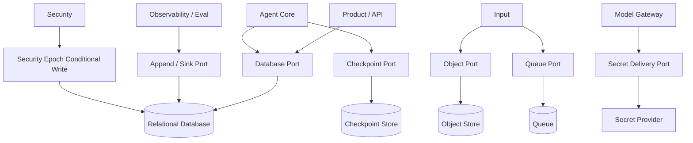
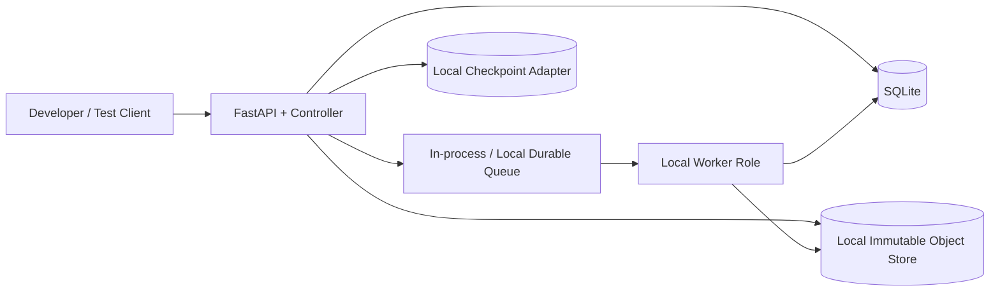
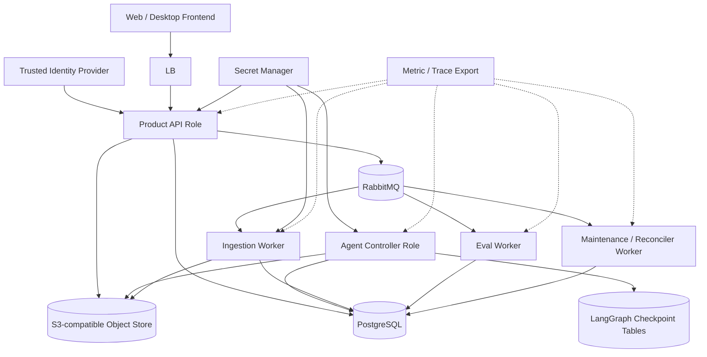

# 11 Infrastructure

updated: 2026-07-13
status: normative-target-module-architecture
module_number: 11
formal_path: `docs/modules/11-infrastructure.md`
agent_mirror: `.agent/modules/11-infrastructure.md`
current_state_source: `docs/status/production-readiness.md`

> 本文是 Zuno 第 11 个逻辑模块 Infrastructure 的正式 Target 架构文档。
>
> Infrastructure 提供可替换、可验证的持久化、消息、对象、租约、时间、迁移、备份、恢复与部署 primitive；它不拥有 Agent、Security、Model、Knowledge、Memory 或 Eval 的领域结论。Target 只有在代码、Migration、故障测试、Trace 与运行证据完成后才能提升为 Current。

## 0. 文档边界与事实源

```text
docs/modules/11-infrastructure.md
    Infrastructure Target 架构事实源。
.agent/modules/11-infrastructure.md
    字节级一致的 Agent 镜像。
docs/status/production-readiness.md
    Current、Gap、Measurement 与 production readiness 事实源。
.agent/programs/
    Current → Target 的迁移、切流、回滚与收口计划。
```

规范优先级：

```text
最新 main 的全局架构原则
→ Agent Core 已冻结 Target Contract
→ 本模块 Target 架构
→ 已确认 ADR / Program
→ 代码、Migration 与部署配置
```

未合并的 Wave 1 PR 只是 Parallel Proposal，可提出依赖，不能替代最新 `main`，也不能被写成 Current。

---

# Part I：问题、目标与选择

## 1. 问题

企业 Agent 的可靠性问题常发生在边界之间：

```text
数据库已经提交，但消息尚未发布
对象已经上传，但 metadata 尚未提交
Worker 已失去 Lease，却晚到写入结果
Checkpoint 已保存，但领域事务没有完成
Migration 执行一半，应用版本不再兼容
Backup 文件存在，但从未验证可恢复
Drain 已开始，旧 Worker 仍继续接收任务
容量耗尽后系统仍无界接受请求
```

如果各业务模块自行实现这些能力，会形成互不兼容的事务、重试、时钟、租约、备份和恢复语义。Infrastructure 的目的不是隐藏失败，而是把失败变成可分类、可拒绝、可恢复、可审计的 primitive。

## 2. 目标

Infrastructure 提供：

```text
Database Runtime
Transaction Capability
Object Store
Checkpoint Store Adapter
Queue / Worker Runtime
Inbox / Outbox Primitives
Lease / Heartbeat / Fencing
Clock / Deadline Source
Migration Runtime
Backup / Restore / PITR
Retention / Legal Hold
Configuration
Secret Delivery Adapter
Deployment Topology
Health / Readiness / Drain
Capacity / Admission / Backpressure
Disaster Recovery
Storage Encryption Capability
Observability Hook
```

质量目标：

- 事务边界明确，外部调用不嵌入数据库事务。
- at-least-once delivery 下通过 Inbox、Outbox、Idempotency 与 Fencing 保持业务事实一致。
- 进程、Worker、数据库连接、对象上传和部署重启后可以恢复。
- 服务端统一后端是产品 Target；浏览器或桌面前端只通过 Product API 访问。SQLite、本地对象存储和本地队列仅作为开发、测试与 CI Adapter，共用同一 typed contract。
- 所有恢复、备份、迁移和容量声明都有测试与证据，不靠配置文件存在来证明。

## 3. 非目标

Infrastructure 不负责：

```text
AgentRun、PlanVersion、StepRun 的业务状态
Security Authorization / Approval / Revocation 结论
Model Routing Decision 与模型角色策略
Tool 副作用是否允许的业务判断
Eval Verdict、质量门或发布结论
Knowledge / Memory 的领域语义
ParseJob、IndexManifest、UsageRecord 等上层领域事实
```

Infrastructure 可以拥有 `LeaseRecord`、`QueueDelivery`、`StorageObjectMetadata`、`BackupRun`、`MigrationRun` 与 `InfrastructureHealth`，但不能把 primitive 状态冒充上层领域状态。

## 4. Current / Target / Future Optional / Not Selected

### 4.1 Current Inventory

以 `docs/status/production-readiness.md` 和 `main` 代码为准：

| Surface | Current 事实 | 不代表 |
| --- | --- | --- |
| Database | SQLite / SQLModel、本地 durable store、database surface | PostgreSQL 事务、连接池、并发写、PITR 已完成 |
| Object Store | local filesystem object store、SHA-256 校验、workspace 路径 | S3-compatible commit protocol、多副本、对象版本已完成 |
| Runtime Store | SQLite runtime records、checkpoint/event/interrupt persistence bridge | 正式 LangGraph PostgreSQL Checkpointer 或 Domain/Checkpoint 对账已完成 |
| Configuration | 本地 YAML / environment surface | Secret Manager、动态 rotation、企业配置治理已完成 |
| Queue Skeleton | RabbitMQ adapter/config/Compose 声明存在 | Outbox、Inbox、Lease、DLQ、Recovery 已被运行证据证明 |
| Deployment | Docker Compose 中声明多种服务 | 组件已接入主链路、已测量或 production ready |

因此 PostgreSQL、Redis、MinIO、RabbitMQ、Kafka、Kubernetes、外部 Milvus/Neo4j 集群均不得描述为 Current。

### 4.2 Target Selection

| Capability | Developer / CI Adapter | Canonical Server Product Target | 理由 |
| --- | --- | --- | --- |
| Relational DB | SQLite adapter，仅单机开发/测试 | PostgreSQL 16+ | Agent Core 已冻结 PostgreSQL 领域事实边界；支持事务、条件写、锁、PITR |
| Object Store | Local immutable filesystem adapter | S3-compatible Object Store；managed S3 或 MinIO adapter | 大型不可变 payload、hash、版本和 lifecycle |
| Checkpoint | Local adapter | LangGraph-compatible PostgreSQL Checkpointer adapter | 控制状态可恢复，并与领域事实对账 |
| Async Queue | in-process/local durable adapter | RabbitMQ durable/quorum queue adapter | 工作队列、backpressure、redelivery、routing 明确 |
| Rate-limit State | PostgreSQL baseline | PostgreSQL baseline | 避免 Redis 成为必选事实源 |
| Deployment | 单 backend image 按 role 启动 | API / controller / worker roles，可容器化 | 保持模块边界，不提前微服务化 |
| Secret Delivery | env/file reference adapter | external secret manager port | 业务只持有 secret reference |

Target 选择不等于 Current 提升；迁移必须进入独立 Program。

产品部署边界固定为：

```text
Web / Desktop Frontend
    只持有短期客户端会话和展示状态
    → Server-hosted Product API
        → Principal / Tenant / Workspace resolution
        → Security Control Plane
        → Agent / Knowledge / Memory / Model / Tool backends
        → PostgreSQL / Object Store / Queue / Checkpoint
```

前端不得直连数据库、对象存储、Queue、Checkpointer、模型 Provider 或 Secret Store。每个用户请求必须在服务端解析可信 `PrincipalAccount`、Tenant、Workspace、Policy 与 Effective Security Epoch。本地 Adapter 只用于开发、单元测试、集成测试和离线演示，不是多用户产品部署模式。

### 4.3 Future Optional

- Redis：缓存、短期 rate-limit acceleration、非权威协调优化；不得成为唯一事实源。
- Kubernetes：仅当 Compose/VM 无法满足扩缩容、升级和证据要求时选择。
- Managed PostgreSQL、managed queue、managed object store。
- warm standby、跨区域 read replica、专用 backup appliance。
- 外部 HSM/KMS 与高等级 confidential computing。

### 4.4 Explicitly Not Selected

```text
Kafka 作为默认工作队列
Event Sourcing 作为全系统事实模型
XA / 2PC 或复杂分布式事务
默认多区域 Active-Active
大量微服务与 Service Mesh 作为先决条件
Redis 作为 Authorization、Budget、Usage 或 AgentRun 唯一事实源
Kubernetes 作为本模块完成标准
```

未来若选择这些能力，必须通过 ADR 说明必要性、替代方案、成本、迁移、故障模型与验证方式。

---

# Part II：逻辑边界与运行拓扑

## 5. Ownership

Infrastructure Owns：

```text
InfrastructureCapabilityProfile
DatabaseTransaction metadata
StorageObject physical metadata
ObjectCommit
CheckpointRecord physical/control metadata
QueueMessage physical envelope
QueueDelivery
InboxRecord primitive
OutboxRecord primitive
WorkerLease
FencingToken
MigrationPlan / MigrationRun
BackupPlan / BackupRun / RestoreRun
Retention execution metadata
LegalHold enforcement binding
DrainMarker
InfrastructureHealth
CapacityReservation
```

Infrastructure Does Not Own：

```text
AgentRun / PlanVersion / StepRun / RunOutcome
SecurityDecision / ApprovalDecision
ModelRoutingDecision / ModelInvocation semantics
EvalVerdict
ParseJob / IndexManifest / MemoryCandidate
ToolEffectDecision
```

上层模块拥有领域记录内容和状态；Infrastructure 提供 Repository/UoW、条件写、Outbox、Lease、对象引用、队列和恢复 primitive。

## 6. 物理运行域



Infrastructure 是横向运行域，不要求每种 primitive 拆成独立微服务。

## 7. Developer / CI Local Adapter Topology



约束：

- 单写者或受控低并发，不声称 PostgreSQL 隔离级别语义。
- typed ports 不变，业务代码不得用 `if sqlite` 改变领域规则。
- 必须覆盖进程重启、重复投递、对象中断与 SQLite lock contention。
- Local backup/restore 可以轻量，但不得称为 server product deployment 或 production ready。
- 不在该拓扑承载正式多用户账号、组织委派、生产 Secret 或生产权限事实。

## 8. Canonical Server Product Topology



推荐部署单位是 role，不是默认微服务。相同 backend image 可以按 role 启动；只有隔离、扩缩容或安全要求出现时才拆镜像。

该拓扑是 Zuno 产品 Target：后端部署在受控服务器或云运行环境，前端只是 API Client。所有账号、组织、权限、知识、Memory、AgentRun、Usage、Audit 与配置事实均由后端权威存储和校验；客户端缓存不能成为授权或业务事实源。

---

# Part III：核心 Contract 与状态机

## 9. InfrastructureCapabilityProfile

```python
class InfrastructureCapabilityProfile(BaseModel):
    profile_id: str
    profile_version: str
    deployment_class: Literal["DEV_LOCAL", "SERVER"]
    database: DatabaseCapability
    object_store: ObjectStoreCapability
    checkpoint_store: CheckpointCapability
    queue: QueueCapability
    lease: LeaseCapability
    clock: ClockCapability
    migration: MigrationCapability
    backup_restore: BackupRestoreCapability
    retention: RetentionCapability
    encryption: EncryptionCapability
    secret_delivery: SecretDeliveryCapability
    telemetry: TelemetryCapability
    limits: InfrastructureLimits
    content_hash: str
```

Profile 必须可哈希、版本化，并在进程启动时固定。运行中切换通过新版本和 drain/cutover，不允许静默替换语义。

## 10. DatabaseTransaction

```python
class DatabaseTransaction(BaseModel):
    transaction_id: str
    tenant_id: str
    workspace_id: str | None
    isolation_level: str
    read_only: bool
    expected_schema_version: str
    security_epoch: int | None
    deadline_at: datetime
    statement_timeout_ms: int
    lock_timeout_ms: int
    trace_id: str
```

规则：

- Application Service 通过 Unit of Work 开启/提交事务；Repository 不自行 commit。
- 外部模型、队列、对象、HTTP 和 Tool 调用不得位于数据库事务内。
- serialization/deadlock 只按确定性 policy 重试整个事务。
- unique/FK/check violation 是业务冲突，不盲目重试。
- `expected_generation`、`security_epoch`、`fencing_token` 不匹配时必须产生结构化 stale-write failure。

## 11. StorageObject 与 ObjectCommit

```python
class StorageObject(BaseModel):
    object_id: str
    tenant_id: str
    workspace_id: str
    object_kind: str
    content_hash: str
    size_bytes: int
    media_type: str
    encryption_key_ref: str | None
    storage_uri: str
    version_id: str | None
    commit_id: str
    status: Literal["STAGED", "COMMITTED", "TOMBSTONED", "PURGED", "QUARANTINED"]
    retention_policy_ref: str
    legal_hold_refs: list[str]

class ObjectCommit(BaseModel):
    commit_id: str
    object_id: str
    idempotency_key: str
    expected_content_hash: str
    upload_session_ref: str
    status: str
    trace_id: str
```

### 11.1 ObjectCommit State Machine

| From | Trigger | Guard | To | 同步事实 |
| --- | --- | --- | --- | --- |
| `PREPARED` | `START_UPLOAD` | idempotency claim 成功 | `UPLOADING` | ObjectCommit |
| `UPLOADING` | `UPLOAD_COMPLETE` | hash/size 匹配 | `UPLOADED` | staged metadata |
| `UPLOADED` | `COMMIT_METADATA` | DB transaction 可提交 | `COMMITTING` | pending commit |
| `COMMITTING` | `DB_COMMIT_OK` | unique(commit_id) | `COMMITTED` | StorageObject + domain ref + Outbox |
| `UPLOADING/UPLOADED` | `ABORT` | 未被领域引用 | `ABORTED` | reason |
| `UPLOADED` | `STAGING_TTL_EXPIRED` | 无 committed metadata | `ORPHANED` | orphan marker |
| `ORPHANED` | `RECONCILE_DELETE` | 无 LegalHold | `PURGED` | deletion receipt |
| `UPLOADED` | `HASH_MISMATCH` | deterministic check | `QUARANTINED` | integrity finding |

Commit protocol：

```text
1. DB reserve ObjectCommit + idempotency key
2. 事务外上传到 staging key
3. 校验 size/hash/encryption metadata
4. DB transaction 提交 StorageObject metadata + domain ref + outbox
5. 异步发布 event
6. Reconciler 清理超时 staging/orphan object
```

对象存储不参与数据库 2PC。读路径只接受 `COMMITTED` 且 metadata/content hash 一致的对象。

## 12. CheckpointRecord 与领域事实边界

```python
class CheckpointRecord(BaseModel):
    checkpoint_id: str
    thread_id: str
    checkpoint_namespace: str
    checkpoint_generation: int
    parent_checkpoint_id: str | None
    graph_bundle_id: str
    graph_schema_version: str
    state_schema_version: str
    state_payload_ref: str
    state_payload_hash: str
    pending_interrupt_refs: list[str]
    domain_generation_seen: int
    security_epoch_seen: int
    created_at: datetime
```

边界：

```text
PostgreSQL Domain Tables
    AgentRun、PlanVersion、StepRun、PreparedAction、RunOutcome 等领域事实。
LangGraph Checkpointer
    Graph 控制状态、channel values、interrupt、pending sends、graph/state version。
Object Store
    大型 state payload、Observation、Artifact；Checkpoint/Domain 只保存 ref + hash。
```

Checkpoint 不能替代 Domain Commit；Domain table 也不能保存一份独立 Graph State 冒充恢复真相。

### 12.1 Checkpoint / Domain Consistency

```text
Domain transaction commit
→ DomainCommitMarker(run_id, domain_generation, event_sequence)
→ Checkpoint records domain_generation_seen
→ RecoveryWatermark 记录已对账 generation
```

- checkpoint generation < committed domain generation：从领域事实重建可派生 control state，或回到兼容 node；不得重放已提交副作用。
- checkpoint generation > domain generation：`CHECKPOINT_AHEAD_OF_DOMAIN`，阻止副作用并运行 reconciler。
- graph/state/hash 不兼容：`BLOCKED_INCOMPATIBLE_CHECKPOINT`。
- Checkpoint retention 不得破坏 active/waiting Run 的恢复链。

## 13. QueueMessage、InboxRecord 与 OutboxRecord

```python
class QueueMessage(BaseModel):
    message_id: str
    queue_name: str
    contract_name: str
    contract_version: str
    tenant_id: str
    workspace_id: str | None
    correlation_id: str
    causation_id: str
    idempotency_key: str
    payload_ref: str
    payload_hash: str
    available_at: datetime
    deadline_at: datetime
    priority: int
    delivery_count: int

class InboxRecord(BaseModel):
    consumer_name: str
    message_id: str
    idempotency_key: str
    status: Literal["CLAIMED", "COMMITTED", "REJECTED", "DUPLICATE"]
    domain_result_ref: str | None
    failure_ref: str | None

class OutboxRecord(BaseModel):
    outbox_id: str
    aggregate_type: str
    aggregate_id: str
    event_sequence_no: int
    contract_name: str
    contract_version: str
    payload_ref: str
    payload_hash: str
    status: Literal["PENDING", "PUBLISHING", "PUBLISHED", "RETRY_WAIT", "DEAD"]
    attempt_count: int
    next_attempt_at: datetime | None
```

### 13.1 QueueMessage / Delivery State Machine

| From | Trigger | Guard | To |
| --- | --- | --- | --- |
| `PERSISTED` | `PUBLISH` | outbox committed | `AVAILABLE` |
| `AVAILABLE` | `DELIVER` | consumer capacity | `DELIVERED` |
| `DELIVERED` | `CLAIM_INBOX` | Inbox unique 成功 | `PROCESSING` |
| `PROCESSING` | `DOMAIN_COMMIT_OK` | Inbox 与 domain 同事务 | `COMMIT_CONFIRMED` |
| `COMMIT_CONFIRMED` | `ACK_OK` | broker receipt | `ACKED` |
| `DELIVERED/PROCESSING` | `NACK_RETRYABLE` | retry budget | `RETRY_WAIT` |
| `RETRY_WAIT` | `BACKOFF_ELAPSED` | deadline 未过 | `AVAILABLE` |
| `DELIVERED` | `INBOX_DUPLICATE` | existing COMMITTED | `ACKED_DUPLICATE` |
| `*` | `NON_RETRYABLE/EXHAUSTED` | policy | `DEAD_LETTERED` |
| `AVAILABLE/RETRY_WAIT` | `DEADLINE_EXPIRED` | authoritative clock | `EXPIRED` |

Broker redelivery 不得直接改 ParseJob、AgentRun 或 EvalJob 的领域状态。Consumer 必须先 claim Inbox，在同一数据库事务中提交领域结果与 Inbox COMMITTED，成功后才 ACK。

## 14. WorkerLease 与 FencingToken

```python
class WorkerLease(BaseModel):
    lease_id: str
    resource_type: str
    resource_id: str
    owner_worker_id: str
    lease_epoch: int
    fencing_token: int
    acquired_at: datetime
    heartbeat_at: datetime
    expires_at: datetime
    status: str

class FencingToken(BaseModel):
    resource_id: str
    token: int
    issued_at: datetime
    issued_to: str
    valid_until: datetime
```

### 14.1 WorkerLease State Machine

| From | Trigger | Guard | To |
| --- | --- | --- | --- |
| `AVAILABLE` | `ACQUIRE` | capacity/security/admission pass | `CLAIMED` |
| `CLAIMED` | `START` | token 最新 | `ACTIVE` |
| `ACTIVE` | `HEARTBEAT` | owner + epoch 匹配 | `ACTIVE` |
| `ACTIVE` | `NEAR_EXPIRY` | grace window | `EXPIRING` |
| `ACTIVE/EXPIRING` | `RENEW` | token 最新且未 drain | `ACTIVE` |
| `ACTIVE/EXPIRING` | `TIMEOUT` | authoritative clock | `EXPIRED` |
| `ACTIVE` | `RELEASE` | owner 匹配 | `RELEASED` |
| `*` | `REVOKE/DRAIN` | admin policy | `REVOKED` |

同一 resource 每次重新获取 Lease 必须增加 `fencing_token`。数据库写、对象 metadata commit、Reducer commit 与 ACK confirmation 都验证 token；旧 Worker 晚到结果只能形成 `LateResultRecord`，不得改领域状态。

## 15. Clock / Deadline / Timeout / Skew

```python
class ClockCapability(Protocol):
    def utc_now(self) -> datetime: ...
    def monotonic_now(self) -> float: ...
    async def authoritative_now(self) -> datetime: ...
    async def skew_status(self) -> ClockSkewStatus: ...
```

- 持久化时间统一 UTC。
- 进程内 elapsed/timeout 使用 monotonic clock。
- Lease、deadline、retention 和 LegalHold effective time 使用数据库或权威时间源。
- `abs(process_clock - authoritative_clock) > max_skew` 时拒绝 Lease-sensitive write。
- Deadline 是绝对时间；Timeout 是相对预算；二者均写入 Trace。
- NTP/clock step 不允许让已过期 Lease 重新有效。

## 16. MigrationPlan 与 MigrationRun

```python
class MigrationPlan(BaseModel):
    migration_id: str
    from_schema_version: str
    to_schema_version: str
    compatibility_window: list[str]
    strategy: Literal["EXPAND_CONTRACT", "ONLINE_BACKFILL", "OFFLINE"]
    prechecks: list[str]
    verification_queries: list[str]
    rollback_kind: Literal["REVERSIBLE", "FORWARD_FIX", "RESTORE_REQUIRED"]
    required_drain_scope: str
```

### 16.1 MigrationRun State Machine

```text
PLANNED → PRECHECKING → READY → APPLYING_EXPAND → BACKFILLING
→ VERIFYING → CONTRACTING → COMPLETED

PRECHECKING → BLOCKED
APPLYING_EXPAND/BACKFILLING/VERIFYING → FAILED
FAILED → ROLLING_BACK → ROLLED_BACK
FAILED → FORWARD_FIXING → VERIFYING
```

- 默认 Expand → dual read/write → backfill → verify → drain old version → Contract。
- destructive contract 前必须证明旧应用已 drain。
- Migration lock 有 TTL/owner/fencing，失败不可留下伪 COMPLETED。
- 破坏性 rollback 不能靠“反向 SQL”假装安全，必须选择 forward-fix 或 restore。

## 17. BackupPlan、BackupRun 与 RestoreRun

```python
class BackupPlan(BaseModel):
    backup_plan_id: str
    scope: str
    rpo_seconds: int
    schedule: str
    include_database: bool
    include_object_manifest: bool
    include_checkpoint_store: bool
    encryption_key_ref: str
    retention_policy_ref: str
    verification_policy_ref: str
```

### 17.1 BackupRun State Machine

```text
SCHEDULED → SNAPSHOTTING → UPLOADING → VERIFYING → COMPLETED
SNAPSHOTTING/UPLOADING → RETRY_WAIT
VERIFYING → CORRUPT
* → FAILED
COMPLETED → EXPIRED（仅在 retention 与 LegalHold 允许时）
```

`COMPLETED` 必须有 manifest、checksum、source LSN/WAL position、object version manifest 与 verification result。

### 17.2 RestoreRun State Machine

```text
REQUESTED → VALIDATING_INPUT → PROVISIONING_ISOLATED_TARGET
→ RESTORING_DATABASE → RESTORING_OBJECTS
→ REBUILDING_DERIVED_INDEXES → VERIFYING
→ READY_FOR_CUTOVER → CUTTING_OVER → COMPLETED

* → FAILED
FAILED → CLEANING_UP → ABORTED
READY_FOR_CUTOVER → REJECTED
CUTTING_OVER → ROLLBACK_CUTOVER
```

Restore 先在隔离目标验证 tenant counts、hash、schema、checkpoint/domain watermark 与关键查询，再由审批控制 cutover。未经过 restore rehearsal 的 backup 不构成可恢复证据。

## 18. RetentionPolicy 与 LegalHold

```python
class RetentionPolicy(BaseModel):
    retention_policy_id: str
    tenant_id: str
    data_class: str
    object_type: str
    retain_for_seconds: int | None
    archive_after_seconds: int | None
    purge_after_seconds: int | None
    backup_retention_seconds: int
    policy_version: str

class LegalHold(BaseModel):
    legal_hold_id: str
    tenant_id: str
    scope_type: str
    scope_id: str
    effective_from: datetime
    effective_to: datetime | None
    authority_ref: str
    status: Literal["ACTIVE", "RELEASED"]
```

优先级：

```text
Active LegalHold
> Security preservation requirement
> Domain tombstone
> Retention purge
> Backup expiry
```

Pruning 只能删除 Infrastructure 明确拥有的物理副本，或已获得领域 Owner 授权的记录。Checkpoint pruning 不得破坏 active/waiting Run 的恢复链。

## 19. DrainMarker 与 Drain State Machine

```python
class DrainMarker(BaseModel):
    drain_id: str
    scope_type: str
    scope_id: str
    reason: str
    started_at: datetime
    deadline_at: datetime
    status: str
```

```text
REQUESTED → QUIESCING_ADMISSION → WAITING_INFLIGHT
→ TRANSFERRING_LEASES → VERIFYING → DRAINED

WAITING_INFLIGHT → DEADLINE_EXCEEDED
DEADLINE_EXCEEDED → FENCING_REMAINDER → DRAINED_WITH_UNRESOLVED
* → CANCELLED（仅在 cutover 未开始时）
```

Drain 开始后停止新 admission；可完成的事务完成，不可完成工作 checkpoint/requeue；Lease 转移或过期；deadline 后对旧 token fencing，并输出 unresolved work evidence。

## 20. CapacityReservation 与 State Machine

```python
class CapacityReservation(BaseModel):
    reservation_id: str
    tenant_id: str
    resource_class: str
    units: int
    priority: int
    deadline_at: datetime
    status: str
    owner_ref: str
```

```text
REQUESTED → CHECKING → RESERVED → CONSUMING → RELEASED
CHECKING → QUEUED | REJECTED
QUEUED → RESERVED | EXPIRED | CANCELLED
RESERVED → EXPIRED（未消费）
```

Admission 顺序：hard safety limit → tenant quota → class quota → priority/fairness → deadline → reserve。容量不足时选择 backpressure、queue 或 reject，不允许无界增长；终局、取消、Lease 过期与 reconciliation 必须释放 reservation。

---

# Part IV：数据库、队列、配置与运维协议

## 21. PostgreSQL 事务与连接管理

- API、controller、worker、migration/maintenance 使用独立 pool profile。
- pool 必须有 max size、acquire timeout、max lifetime、idle timeout、statement timeout 与 leak diagnostics。
- 长模型调用、对象上传、Queue publish、Tool 调用不得占用事务连接。
- 高风险写使用 optimistic generation/epoch/fencing；争用热点才使用行锁。
- queue claim 使用 `FOR UPDATE SKIP LOCKED` 时必须有公平性、deadline 与饥饿监测。
- tenant/workspace scope 必须进入主键、索引、RLS 或强制 query context；不能只靠 API filter。
- schema version 不在兼容窗口时 readiness fail-closed。

推荐基础表：

```text
infra_capability_profiles
infra_storage_objects
infra_object_commits
infra_queue_deliveries
infra_inbox_records
infra_outbox_records
infra_worker_leases
infra_fencing_tokens
infra_migration_plans
infra_migration_runs
infra_backup_plans
infra_backup_runs
infra_restore_runs
infra_retention_policies
infra_legal_holds
infra_drain_markers
infra_capacity_reservations
infra_health_snapshots
infra_recovery_watermarks
```

LangGraph checkpoint 表由 adapter/migration 管理，表名前缀与 schema 明确隔离；它们不是 Agent Core 领域表。

关键约束：

```text
UNIQUE(profile_id, profile_version)
UNIQUE(tenant_id, object_id)
UNIQUE(commit_id)
UNIQUE(consumer_name, message_id)
UNIQUE(aggregate_type, aggregate_id, event_sequence_no)
UNIQUE(resource_type, resource_id, fencing_token)
partial INDEX infra_outbox_records(next_attempt_at) WHERE status IN ('PENDING','RETRY_WAIT')
partial INDEX infra_worker_leases(expires_at) WHERE status IN ('CLAIMED','ACTIVE','EXPIRING')
partial INDEX infra_capacity_reservations(deadline_at) WHERE status IN ('QUEUED','RESERVED','CONSUMING')
```

## 22. Inbox / Outbox

Producer：领域写、DomainEvent 与 Outbox 同一 PostgreSQL 事务；publisher claim Outbox、事务外 publish、记录 broker receipt。数据库提交后 publisher 崩溃只会导致重发，不会丢失领域事实。

Consumer：接收消息 → Inbox claim → 领域写 + Inbox COMMITTED 同一事务 → ACK。ACK 前崩溃会 redelivery；已有 COMMITTED Inbox 时直接 ACK duplicate。

禁止：先 publish 后写 domain、用 broker delivery tag 当业务幂等键、在 consumer callback 中跨多个未协调事务更新状态。

## 23. Config 与 Secret Delivery

配置层级：

```text
code defaults
< versioned deployment config
< environment-specific config
< tenant/workspace binding（仅允许声明字段）
< runtime emergency override（有 TTL、审批、审计）
```

`EffectiveInfrastructureConfig` 必须包含 schema/version/hash/source refs。未知字段、非法枚举、缺失安全必需项 fail-fast；secret value 不进入 config snapshot、日志、Trace、Queue 或 Checkpoint。

Secret Delivery Port：

```python
class SecretDeliveryPort(Protocol):
    async def resolve(self, secret_ref: str, *, consumer: str, purpose: str) -> SecretLease: ...
    async def current_version(self, secret_ref: str) -> str: ...
    async def revoke(self, lease_id: str) -> None: ...
```

Rotation 使用双版本重叠：发布新版本 → 新连接使用新版本 → 观察成功 → drain 旧连接 → revoke 旧版本。失败回滚到旧版本并写审计；不得把 secret material 持久化到数据库。

## 24. Health / Readiness / Liveness

- Liveness：进程事件循环与内部 watchdog 可运行，不依赖所有外部组件。
- Readiness：关键依赖、schema compatibility、security epoch source、clock skew、drain 与 capacity 满足当前 role 要求。
- Degraded：可服务但能力受限，必须返回 capability profile 和 reason。
- Health snapshot 是 Infrastructure 事实，不代表业务质量或 Eval 通过。

## 25. Backpressure 与 Admission

信号包括 pool saturation、queue age/depth、worker lease count、object upload backlog、disk watermark、Outbox lag、checkpoint latency、tenant quota。控制动作按严重度：降低并发 → 延迟 admission → queue → reject retryable → fail-closed。不得通过无限增大 pool、prefetch 或 queue 隐藏容量问题。

## 26. Multi-tenant Storage Isolation

- 所有记录和对象 key 带 tenant/workspace scope。
- 唯一约束与幂等键包含 tenant scope，除非对象是全局 immutable CAS 且经过安全审查。
- PostgreSQL 使用强制 query scope；高安全级别可加 RLS。
- Object Store 使用 prefix/bucket policy + encryption context；禁止仅在应用返回前过滤。
- Queue envelope 带 tenant scope，consumer 在处理前验证 security context ref。
- Backup/restore、retention、LegalHold、metric label 同样 tenant-aware。

Security 决定谁有权限；Infrastructure 只执行隔离约束与条件写。

## 27. Encryption at Rest / in Transit

- PostgreSQL、Object Store、Backup 与本地敏感文件支持 at-rest encryption capability。
- 服务间、数据库、Queue、Object Store 使用 TLS；证书验证不可默认关闭。
- key material 由 Secret/KMS provider 管理；数据库仅保存 key reference/version。
- rotation、re-encryption、key revocation 有状态和审计。
- encryption capability 缺失时，受保护 data class 的 readiness/admission fail-closed。

## 28. Observability Hook

每个 transaction、queue delivery、lease、object commit、migration、backup、restore、drain 与 capacity decision 发出结构化 hook：

```text
operation_id / trace_id / tenant_id / role
capability_profile_version
start/end/status/latency
attempt/retry/reason code
resource class / queue age / pool wait
fencing token / domain generation（不含 secret）
artifact/object/backup manifest ref
```

Infrastructure 负责产生可靠原始事实与导出 primitive；Observability 拥有 Trace/Eval Projection 与 verdict。

---

# Part V：故障、恢复与灾备

## 29. Failure Taxonomy

```text
INFRA_DB_UNAVAILABLE
INFRA_DB_SERIALIZATION_RETRYABLE
INFRA_DB_CONSTRAINT_CONFLICT
INFRA_POOL_EXHAUSTED
INFRA_OBJECT_UPLOAD_INTERRUPTED
INFRA_OBJECT_HASH_MISMATCH
INFRA_OBJECT_ORPHANED
INFRA_CHECKPOINT_AHEAD_OF_DOMAIN
INFRA_CHECKPOINT_BEHIND_DOMAIN
INFRA_CHECKPOINT_INCOMPATIBLE
INFRA_QUEUE_REDELIVERED
INFRA_INBOX_DUPLICATE
INFRA_OUTBOX_STALLED
INFRA_LEASE_EXPIRED
INFRA_STALE_FENCING_TOKEN
INFRA_CLOCK_SKEW
INFRA_MIGRATION_BLOCKED
INFRA_MIGRATION_PARTIAL
INFRA_BACKUP_CORRUPT
INFRA_RESTORE_FAILED
INFRA_DRAIN_DEADLINE
INFRA_CAPACITY_EXHAUSTED
INFRA_TENANT_ISOLATION_VIOLATION
INFRA_ENCRYPTION_CAPABILITY_MISSING
```

Failure 必须包含 retryability、scope、owner、causation、attempt、deadline、recovery action 与 evidence ref。Infrastructure 不把领域失败改写为基础设施失败，也不反向替领域模块决定 Retry/Replan/Abstain。

## 30. Crash Matrix

| Crash Point | 已有事实 | 恢复动作 | 不允许 |
| --- | --- | --- | --- |
| 数据库提交前崩溃 | 事务未提交 | rollback；按 idempotency 重试 | 推断业务已成功 |
| 数据库提交后、Outbox 发布前崩溃 | domain + outbox committed | publisher 重扫并发布 | 重做 domain mutation |
| 对象上传后、Metadata Commit 前崩溃 | staged object，无 committed ref | resume/verify 或 orphan cleanup | 让读路径发现 staged object |
| Queue ACK 前崩溃 | domain + Inbox 可能已提交 | redelivery；Inbox 去重 | 再执行已提交副作用 |
| Lease 过期后旧 Worker 晚到 | 新 token 已签发 | stale token 拒绝，记录 LateResult | 覆盖新 Worker 结果 |
| Checkpoint 已写但 Domain Commit 未完成 | checkpoint ahead | block effect；回退到 watermark/reconcile | 把 checkpoint 当 domain commit |
| Migration 半完成 | MigrationRun 非终局 | resume、rollback 或 forward-fix | 标记 completed |
| Restore 失败 | 隔离目标不完整 | cleanup/abort，生产不切换 | 部分覆盖生产 |
| Backup verification 失败 | artifact 存在但不可信 | mark CORRUPT、重备份、告警 | 标记 completed |
| Clock skew 超阈值 | 本地时间不可信 | 拒绝 lease-sensitive write | 续租或复活旧 Lease |
| Drain deadline 到期 | inflight 未清零 | fence remainder、输出 unresolved | 静默终止 |
| Capacity 耗尽 | reservation 不足 | backpressure/queue/reject | 无界接收 |

## 31. RecoveryWatermark

```python
class RecoveryWatermark(BaseModel):
    scope_type: str
    scope_id: str
    domain_generation: int
    checkpoint_generation: int
    outbox_sequence: int
    object_commit_sequence: int
    reconciled_at: datetime
    reconciler_version: str
    status: str
```

Reconciler 必须使用 Lease + Fencing + Idempotency；只修复 Infrastructure primitive 或调用领域 Owner 的 typed repair command，不直接改领域语义。

## 32. Failure Domains

| Domain | 隔离目标 | 恢复 |
| --- | --- | --- |
| API process | 不丢 domain/outbox | restart + readiness |
| Controller process | 不重复 effect | checkpoint/domain watermark + fencing |
| Worker process | message 可重投 | Inbox + Lease expiry |
| PostgreSQL connection | 事务原子回滚 | reconnect + bounded retry |
| PostgreSQL primary | 满足 RPO/RTO | failover + WAL/PITR validation |
| Object Store | metadata 不指向缺失对象 | version/checksum/retry/restore |
| RabbitMQ node | durable queue 可继续 | quorum/managed HA + redelivery |
| Secret provider | 不泄密且不使用过期 secret | cached lease within TTL / fail-closed |
| Deployment zone | 企业可选 | standby/restore；不是默认 Active-Active |

## 33. Disaster Recovery

每个 deployment profile 明确 RPO、RTO、数据范围、依赖顺序、恢复顺序、cutover/rollback owner 与演练频率。建议恢复顺序：Secret/KMS → PostgreSQL → Object manifests/objects → Checkpoint → Queue/Outbox → derived index rebuild → application readiness → controlled traffic。

派生索引可重建，不应阻塞事实源恢复；但 strict citation/knowledge readiness 在索引验证前必须 degraded 或 blocked。只有真实 restore rehearsal、故障注入与证据完成后才能声明 DR 可用。

---

# Part VI：跨模块依赖协议

## 34. 对 09 Security

Infrastructure 提供：

```text
Security Epoch 条件写
Secret Delivery Port
Encryption Capability
Tenant Isolation Constraint
append-only Audit storage primitive
Retention / Legal Hold enforcement
credential/certificate rotation primitive
```

Security 提供并拥有：Authorization、Approval、Revocation、data classification、retention/legal hold policy、audit content semantics。Infrastructure 不决定谁有权限。

依赖请求：Security 需冻结 `security_epoch` 单调性、条件写失败语义、SecretRef/SecretLease、LegalHold authority 与 Audit append contract。

## 35. 对 04 Model Gateway

Infrastructure 提供：Provider Config storage、Secret Reference、durable rate-limit state、Usage Ledger storage primitive、streaming transport capability、connection pool/timeout、provider health primitive。

Model Gateway 拥有 ModelRoutingDecision、provider fallback、role/model capability、usage semantics 与 provider failure classification。

依赖请求：Model Gateway 需冻结 ProviderConfig/SecretRef 生命周期、Usage Ledger 幂等键、stream abort/timeout 与 rate-limit consistency 需求。

## 36. 对 10 Observability & Eval

Infrastructure 提供：Trace/Audit store capability、append-only event ingest、artifact/object retention、metric export、external sink delivery、Eval Job Queue、sink retry/outbox。

Observability & Eval 拥有 span schema projection、metric meaning、EvalVerdict、release gate 与 quality conclusion。

依赖请求：Observability 需冻结 ingest envelope、redaction boundary、sink delivery receipt、retention class 与 Eval queue priority/deadline。

## 37. 对 Agent Core

必须服从冻结边界：

```text
PostgreSQL 保存领域事实
LangGraph Checkpointer 保存图控制状态
Object Store 保存大型不可变 Payload
Generation、Fencing、RecoveryWatermark 与 Outbox 边界不可破坏
```

Agent Core 拥有 AgentRun/PlanVersion/StepRun/PreparedAction/RunOutcome；Infrastructure 只提供 UoW、conditional write、Checkpoint adapter、Lease、Outbox、ObjectRef 与 Recovery primitive。Infrastructure 不自行重放 Action、不激活 PlanVersion、不提交 RunOutcome。

依赖请求：Agent Core 实现 Program 必须使用 `DomainCommitMarker`、`domain_generation_seen`、fencing token、outbox sequence 与 pinned graph/state versions；不得以 checkpoint 成功代替领域 commit。

## 38. 对 Input / Knowledge / Memory

- Input 拥有 SourceObject/DocumentVersion/ParseJob/SourceSpan；Infrastructure 提供 object commit、queue、lease、retention execution。
- Knowledge 拥有 IndexManifest、RetrievalChunk、Evidence；Infrastructure 提供 index storage adapter/backup primitive，但派生索引可重建。
- Memory 拥有 MemoryCandidate、MemoryRecord、privacy delete semantics；Infrastructure 执行 scoped purge/retention，不决定记忆内容。

---

# Part VII：目标实现规格

## 39. Typed Ports

```python
class DatabaseRuntimePort(Protocol): ...
class UnitOfWorkPort(Protocol): ...
class ObjectStorePort(Protocol): ...
class ObjectCommitPort(Protocol): ...
class CheckpointStorePort(Protocol): ...
class QueueRuntimePort(Protocol): ...
class InboxOutboxPort(Protocol): ...
class LeaseFencingPort(Protocol): ...
class ClockPort(Protocol): ...
class MigrationRuntimePort(Protocol): ...
class BackupRestorePort(Protocol): ...
class RetentionLegalHoldPort(Protocol): ...
class SecretDeliveryPort(Protocol): ...
class HealthReadinessPort(Protocol): ...
class CapacityAdmissionPort(Protocol): ...
class InfrastructureTelemetryPort(Protocol): ...
```

Port 不暴露 SQLAlchemy Session、RabbitMQ channel、S3 client、LangGraph saver 内部对象或 Secret material。

## 40. 目标代码与部署目录

```text
src/backend/zuno/infrastructure/
├── contracts/{capability,database,object,checkpoint,queue,lease,clock,migration,backup,retention,health,capacity}.py
├── application/{transaction,object_commit,delivery,lease,migration,backup,restore,drain,capacity,reconciliation}_service.py
├── ports/
├── persistence/postgres/{engine,uow,repositories,outbox,inbox,locks}.py
├── checkpoint/{local,postgres_langgraph,compatibility,reconciliation}.py
├── object_store/{local,s3,commit,reconciler}.py
├── queue/{local,rabbitmq,publisher,consumer,dlq}.py
├── coordination/{lease,fencing,clock}.py
├── operations/{migration,backup,restore,retention,drain,health,capacity}.py
├── security/{secret_delivery,encryption,tenant_scope}.py
└── telemetry/{hooks,metrics}.py

infra/
├── compose/
├── postgres/
├── rabbitmq/
├── object-store/
├── backup-restore/
├── migrations/
└── runbooks/
```

依赖方向：domain/application → ports；adapter → ports。Domain 不导入 SQLAlchemy/aio-pika/boto/langgraph saver；Application 不导入 FastAPI；Migration 不承载业务决策。

## 41. Storage Mapping

| Object | Owner | Target storage | 关键约束 |
| --- | --- | --- | --- |
| InfrastructureCapabilityProfile | Infrastructure | PostgreSQL JSONB + hash | immutable version |
| StorageObject/ObjectCommit | Infrastructure physical metadata | PostgreSQL + Object Store | committed ref only |
| CheckpointRecord | Infrastructure adapter | LangGraph PostgreSQL tables + object refs | thread/namespace/generation/version |
| QueueMessage | producer contract；Infrastructure envelope | RabbitMQ + Outbox | message_id/idempotency/deadline |
| InboxRecord/OutboxRecord | Infrastructure primitive | PostgreSQL | unique dedup/order |
| WorkerLease/FencingToken | Infrastructure | PostgreSQL | monotonic token |
| MigrationRun | Infrastructure execution record | PostgreSQL | immutable attempt history |
| BackupRun/RestoreRun | Infrastructure | PostgreSQL + Object Store manifest | verified before completed |
| RetentionPolicy/LegalHold | policy owner + Infrastructure binding | PostgreSQL | hold overrides purge |
| DrainMarker/CapacityReservation | Infrastructure | PostgreSQL | deadline/fencing/release |
| AgentRun/PlanVersion/StepRun | Agent Core | Agent Core domain tables | Infrastructure 不拥有 |
| SecurityDecision | Security | Security domain store | Infrastructure 只保存 ref/epoch |
| Trace/Eval Projection | Observability | Observability store | Infrastructure 只提供 ingest/storage capability |

## 42. 事务边界

```text
Domain Mutation
    domain facts + DomainCommitMarker + Outbox 同一 PostgreSQL 事务。
Dispatch
    domain dispatch + capacity reservation + lease claim + outbox 同事务；之后 publish。
Object Commit
    reserve in DB；事务外 upload；DB 提交 metadata + domain ref + outbox。
Consumer
    Inbox claim + domain result + Inbox COMMITTED 同事务；之后 ACK。
Checkpoint
    graph control write 与 domain commit 不伪装成单事务；用 generation/watermark 对账。
External Sink
    local append/outbox commit；事务外发送；receipt 后更新 delivery state。
Backup/Restore
    control metadata 入库；数据复制在事务外；验证后才进入 COMPLETED/READY。
```

---

# Part VIII：Requirement、测试与完成证据

## 43. Requirement Enforcement Matrix

每条 Requirement 必须映射 Control、测试与 Evidence；Program 可以增加测试，不能删除基础映射。

| Requirement | 目标 | Control / Failure | Required Tests | Evidence |
| --- | --- | --- | --- | --- |
| `ARCH-INFRA-001` | Current/Target/Future/Not Selected 严格分层 | `RC-INFRA-001` / `INFRA001_FACT_LAYER_VIOLATION` | `INFRA-001-UT, INFRA-001-IT` | `EV-INFRA-001` |
| `ARCH-INFRA-002` | Capability Profile 可哈希、版本化、启动固定 | `RC-INFRA-002` / `INFRA002_PROFILE_INVALID` | `INFRA-002-UT, INFRA-002-IT` | `EV-INFRA-002` |
| `ARCH-INFRA-003` | Infrastructure 不拥有上层领域结论 | `RC-INFRA-003` / `INFRA003_OWNERSHIP_VIOLATION` | `INFRA-003-UT, INFRA-003-IT` | `EV-INFRA-003` |
| `ARCH-INFRA-004` | Local/Enterprise 共用 typed ports | `RC-INFRA-004` / `INFRA004_PORT_DIVERGENCE` | `INFRA-004-UT, INFRA-004-IT` | `EV-INFRA-004` |
| `ARCH-INFRA-005` | PostgreSQL 作为企业结构化事实能力 | `RC-INFRA-005` / `INFRA005_DB_CAPABILITY_MISSING` | `INFRA-005-UT, INFRA-005-IT, INFRA-005-E2E` | `EV-INFRA-005` |
| `ARCH-INFRA-006` | Repository 不自行 commit，外部调用不进事务 | `RC-INFRA-006` / `INFRA006_TRANSACTION_BOUNDARY` | `INFRA-006-UT, INFRA-006-IT, INFRA-006-FT` | `EV-INFRA-006` |
| `ARCH-INFRA-007` | 连接池有 role profile、timeout 与 leak 证据 | `RC-INFRA-007` / `INFRA007_POOL_EXHAUSTED` | `INFRA-007-UT, INFRA-007-IT, INFRA-007-FT` | `EV-INFRA-007` |
| `ARCH-INFRA-008` | generation/security epoch/fencing 条件写 | `RC-INFRA-008` / `INFRA008_STALE_WRITE` | `INFRA-008-UT, INFRA-008-IT, INFRA-008-FT` | `EV-INFRA-008` |
| `ARCH-INFRA-009` | ObjectCommit 使用 staging/hash/metadata commit | `RC-INFRA-009` / `INFRA009_OBJECT_COMMIT_INVALID` | `INFRA-009-UT, INFRA-009-IT, INFRA-009-FT` | `EV-INFRA-009` |
| `ARCH-INFRA-010` | staged/orphan object 可对账清理 | `RC-INFRA-010` / `INFRA010_OBJECT_ORPHANED` | `INFRA-010-UT, INFRA-010-IT, INFRA-010-FT` | `EV-INFRA-010` |
| `ARCH-INFRA-011` | 只读取 COMMITTED 且 hash 匹配对象 | `RC-INFRA-011` / `INFRA011_OBJECT_INTEGRITY` | `INFRA-011-UT, INFRA-011-IT` | `EV-INFRA-011` |
| `ARCH-INFRA-012` | Checkpoint 与 Domain 事实分离 | `RC-INFRA-012` / `INFRA012_BOUNDARY_VIOLATION` | `INFRA-012-UT, INFRA-012-IT, INFRA-012-FT` | `EV-INFRA-012` |
| `ARCH-INFRA-013` | DomainCommitMarker/RecoveryWatermark 对账 | `RC-INFRA-013` / `INFRA013_DIVERGENCE` | `INFRA-013-UT, INFRA-013-IT, INFRA-013-FT, INFRA-013-E2E` | `EV-INFRA-013` |
| `ARCH-INFRA-014` | Checkpoint bundle/state version 不兼容 fail-closed | `RC-INFRA-014` / `INFRA014_CHECKPOINT_INCOMPATIBLE` | `INFRA-014-UT, INFRA-014-IT, INFRA-014-FT` | `EV-INFRA-014` |
| `ARCH-INFRA-015` | Producer domain/outbox 同事务 | `RC-INFRA-015` / `INFRA015_OUTBOX_GAP` | `INFRA-015-UT, INFRA-015-IT, INFRA-015-FT` | `EV-INFRA-015` |
| `ARCH-INFRA-016` | Consumer Inbox/domain 同事务，ACK 在后 | `RC-INFRA-016` / `INFRA016_INBOX_GAP` | `INFRA-016-UT, INFRA-016-IT, INFRA-016-FT` | `EV-INFRA-016` |
| `ARCH-INFRA-017` | Queue redelivery 不重复业务副作用 | `RC-INFRA-017` / `INFRA017_DUPLICATE_EFFECT` | `INFRA-017-UT, INFRA-017-IT, INFRA-017-FT, INFRA-017-E2E` | `EV-INFRA-017` |
| `ARCH-INFRA-018` | DLQ/expiry/retry 有明确状态与 owner | `RC-INFRA-018` / `INFRA018_DELIVERY_TERMINAL_INVALID` | `INFRA-018-UT, INFRA-018-IT` | `EV-INFRA-018` |
| `ARCH-INFRA-019` | Lease 使用权威时钟、heartbeat 与 expiry | `RC-INFRA-019` / `INFRA019_LEASE_INVALID` | `INFRA-019-UT, INFRA-019-IT, INFRA-019-FT` | `EV-INFRA-019` |
| `ARCH-INFRA-020` | Fencing token 单调并拒绝旧 Worker | `RC-INFRA-020` / `INFRA020_STALE_FENCING_TOKEN` | `INFRA-020-UT, INFRA-020-IT, INFRA-020-FT, INFRA-020-E2E` | `EV-INFRA-020` |
| `ARCH-INFRA-021` | Clock/Deadline/Timeout/Skew 语义分离 | `RC-INFRA-021` / `INFRA021_CLOCK_SEMANTICS` | `INFRA-021-UT, INFRA-021-IT, INFRA-021-FT` | `EV-INFRA-021` |
| `ARCH-INFRA-022` | Config 有 schema/version/hash/source | `RC-INFRA-022` / `INFRA022_CONFIG_INVALID` | `INFRA-022-UT, INFRA-022-IT` | `EV-INFRA-022` |
| `ARCH-INFRA-023` | Secret value 不持久化，rotation 可回滚 | `RC-INFRA-023` / `INFRA023_SECRET_LIFECYCLE` | `INFRA-023-UT, INFRA-023-IT, INFRA-023-FT` | `EV-INFRA-023` |
| `ARCH-INFRA-024` | Migration 默认 Expand/Contract | `RC-INFRA-024` / `INFRA024_DESTRUCTIVE_MIGRATION` | `INFRA-024-UT, INFRA-024-IT, INFRA-024-FT` | `EV-INFRA-024` |
| `ARCH-INFRA-025` | MigrationRun 可 resume/rollback/forward-fix | `RC-INFRA-025` / `INFRA025_MIGRATION_PARTIAL` | `INFRA-025-UT, INFRA-025-IT, INFRA-025-FT, INFRA-025-E2E` | `EV-INFRA-025` |
| `ARCH-INFRA-026` | BackupPlan 定义 scope/RPO/encryption/verify | `RC-INFRA-026` / `INFRA026_BACKUP_PLAN_INVALID` | `INFRA-026-UT, INFRA-026-IT` | `EV-INFRA-026` |
| `ARCH-INFRA-027` | Backup 只有验证后才能 COMPLETED | `RC-INFRA-027` / `INFRA027_BACKUP_CORRUPT` | `INFRA-027-UT, INFRA-027-IT, INFRA-027-FT` | `EV-INFRA-027` |
| `ARCH-INFRA-028` | Restore 在隔离目标验证后 cutover | `RC-INFRA-028` / `INFRA028_RESTORE_UNVERIFIED` | `INFRA-028-UT, INFRA-028-IT, INFRA-028-FT, INFRA-028-E2E` | `EV-INFRA-028` |
| `ARCH-INFRA-029` | PITR 同时对齐 DB/Object/Checkpoint/Index watermark | `RC-INFRA-029` / `INFRA029_PITR_INCOMPLETE` | `INFRA-029-UT, INFRA-029-IT, INFRA-029-FT` | `EV-INFRA-029` |
| `ARCH-INFRA-030` | Retention scope/version 可审计 | `RC-INFRA-030` / `INFRA030_RETENTION_INVALID` | `INFRA-030-UT, INFRA-030-IT` | `EV-INFRA-030` |
| `ARCH-INFRA-031` | LegalHold 优先于 purge/backup expiry | `RC-INFRA-031` / `INFRA031_LEGAL_HOLD_VIOLATION` | `INFRA-031-UT, INFRA-031-IT, INFRA-031-FT` | `EV-INFRA-031` |
| `ARCH-INFRA-032` | Readiness 检查关键依赖/schema/skew/drain | `RC-INFRA-032` / `INFRA032_READINESS_INVALID` | `INFRA-032-UT, INFRA-032-IT, INFRA-032-FT` | `EV-INFRA-032` |
| `ARCH-INFRA-033` | Drain 停止 admission、转移 Lease、deadline fencing | `RC-INFRA-033` / `INFRA033_DRAIN_DEADLINE` | `INFRA-033-UT, INFRA-033-IT, INFRA-033-FT, INFRA-033-E2E` | `EV-INFRA-033` |
| `ARCH-INFRA-034` | CapacityReservation 原子保留与终局释放 | `RC-INFRA-034` / `INFRA034_CAPACITY_RESERVATION` | `INFRA-034-UT, INFRA-034-IT, INFRA-034-FT` | `EV-INFRA-034` |
| `ARCH-INFRA-035` | Capacity exhaustion 执行 backpressure/queue/reject | `RC-INFRA-035` / `INFRA035_CAPACITY_EXHAUSTED` | `INFRA-035-UT, INFRA-035-IT, INFRA-035-FT, INFRA-035-E2E` | `EV-INFRA-035` |
| `ARCH-INFRA-036` | tenant/workspace scope 进入存储与队列约束 | `RC-INFRA-036` / `INFRA036_TENANT_ISOLATION` | `INFRA-036-UT, INFRA-036-IT, INFRA-036-FT, INFRA-036-E2E` | `EV-INFRA-036` |
| `ARCH-INFRA-037` | at-rest/in-transit encryption 与 key ref | `RC-INFRA-037` / `INFRA037_ENCRYPTION_MISSING` | `INFRA-037-UT, INFRA-037-IT, INFRA-037-FT` | `EV-INFRA-037` |
| `ARCH-INFRA-038` | Infrastructure hook 不伪造 Eval verdict | `RC-INFRA-038` / `INFRA038_TELEMETRY_MISSING` | `INFRA-038-UT, INFRA-038-IT` | `EV-INFRA-038` |
| `ARCH-INFRA-039` | Failure taxonomy 含 retry/recovery/owner | `RC-INFRA-039` / `INFRA039_FAILURE_UNCLASSIFIED` | `INFRA-039-UT, INFRA-039-IT` | `EV-INFRA-039` |
| `ARCH-INFRA-040` | Reconciler 使用 Lease/Fencing/Idempotency | `RC-INFRA-040` / `INFRA040_RECONCILER_UNFENCED` | `INFRA-040-UT, INFRA-040-IT, INFRA-040-FT` | `EV-INFRA-040` |
| `ARCH-INFRA-041` | DR profile 明确 RPO/RTO/顺序/owner | `RC-INFRA-041` / `INFRA041_DR_UNPROVEN` | `INFRA-041-UT, INFRA-041-IT, INFRA-041-FT, INFRA-041-E2E` | `EV-INFRA-041` |
| `ARCH-INFRA-042` | Security Epoch/Secret/Isolation/Hold contract 可消费 | `RC-INFRA-042` / `INFRA042_SECURITY_CONTRACT_GAP` | `INFRA-042-UT, INFRA-042-IT` | `EV-INFRA-042` |
| `ARCH-INFRA-043` | Model Provider config/usage/rate-limit/stream capability | `RC-INFRA-043` / `INFRA043_MODEL_CONTRACT_GAP` | `INFRA-043-UT, INFRA-043-IT` | `EV-INFRA-043` |
| `ARCH-INFRA-044` | Trace/Audit/Event/Sink/Eval queue capability | `RC-INFRA-044` / `INFRA044_OBSERVABILITY_CONTRACT_GAP` | `INFRA-044-UT, INFRA-044-IT` | `EV-INFRA-044` |
| `ARCH-INFRA-045` | Agent Core generation/fencing/watermark/outbox 不变量 | `RC-INFRA-045` / `INFRA045_AGENT_BOUNDARY_VIOLATION` | `INFRA-045-UT, INFRA-045-IT, INFRA-045-FT, INFRA-045-E2E` | `EV-INFRA-045` |
| `ARCH-INFRA-046` | Kafka/K8s/Event Sourcing/XA/Active-Active 不默认引入 | `RC-INFRA-046` / `INFRA046_NOT_SELECTED_VIOLATION` | `INFRA-046-UT, INFRA-046-IT` | `EV-INFRA-046` |
| `ARCH-INFRA-047` | Target 只有工程证据完成后提升 Current | `RC-INFRA-047` / `INFRA047_CURRENT_WITHOUT_EVIDENCE` | `INFRA-047-UT, INFRA-047-IT` | `EV-INFRA-047` |
| `ARCH-INFRA-048` | 正式文档、镜像、入口、验证器、测试同步 | `RC-INFRA-048` / `INFRA048_DOC_SYNC` | `INFRA-048-UT, INFRA-048-IT` | `EV-INFRA-048` |

## 44. Mandatory Fault Tests

| Fault Test | 注入点 | 必须证明 |
| --- | --- | --- |
| `Outbox Crash` | domain commit 后 kill publisher | 消息最终发布且 domain 不重复 |
| `Inbox Duplicate` | 同 message 多次投递 | 只提交一次领域副作用 |
| `Object Commit Crash` | upload 完成、metadata commit 前 kill | staged object 可清理或恢复，读路径不可见 |
| `Lease Expiry` | 停止 heartbeat | 新 Worker 可接管 |
| `Stale Fencing Token` | 旧 Worker 晚到 commit | 写入被拒绝并留证据 |
| `Checkpoint / Domain Divergence` | 只写 checkpoint 或只写 domain marker | 恢复到最后合法 generation，副作用不重复 |
| `Queue Redelivery` | domain commit 后 ACK 前 kill | redelivery 被 Inbox 吸收 |
| `Migration Rollback` | backfill 中途失败 | 可续跑、rollback 或 forward-fix，schema compatibility 明确 |
| `Backup Corruption` | 修改 backup block/manifest | verification 拒绝 completed |
| `Restore Failure` | restore 中断/验证失败 | 生产目标不被切换 |
| `Clock Skew` | 注入超阈值时钟偏移 | Lease-sensitive action fail-closed |
| `Drain Deadline` | 长任务不退出 | fencing + unresolved work evidence |
| `Capacity Exhaustion` | pool/queue/disk 达阈值 | backpressure/queue/reject，无界增长被阻止 |

## 45. Validation Commands

```text
python tools/scripts/verify_infrastructure_target_protocols.py
pytest -q tests/repo/test_infrastructure_target_protocols.py -p no:cacheprovider
python .agent/scripts/verify_agent_system.py
python .agent/scripts/verify_doc_boundaries.py
python tools/scripts/verify_docs_entrypoints.py
git diff --check
```

本 PR 的专用 workflow 只证明文档 Contract 和 verifier，不证明 PostgreSQL、RabbitMQ、Object Store、Backup 或 Restore 已实现。

## 46. Target → Current Evidence

任一 Target 能力变为 Current 至少需要：

```text
implementation available
+ typed adapter
+ database Migration
+ unit test
+ integration test
+ mandatory fault test
+ restart/recovery test
+ trace/metric evidence
+ backup/restore rehearsal（适用时）
+ security/tenant isolation verification
+ documentation/status sync
```

推荐状态：

```text
design available
implementation available
measurement blocked
quality not yet proven
production ready
```

只有对应 `EV-INFRA-NNN` 可复现，并更新 `docs/status/production-readiness.md` 后，才可声明 Current。Compose service、environment key、SDK dependency、class 名或 happy-path mock test 均不是完成证据。

## 47. 完成定义

Infrastructure Target 设计完成意味着：

- Ownership、typed contract、状态机、失败、恢复、幂等、时间、安全与测试规格已冻结。
- Local/Enterprise topology 与技术选择明确。
- 不代表 runtime 已实现、完整 CI 已通过、DR 已演练或 production ready。
- 后续 Codex Program 不得自行引入 Kafka、Kubernetes、Event Sourcing、XA/2PC、Active-Active，或改变 Agent Core Domain/Checkpoint 边界。
