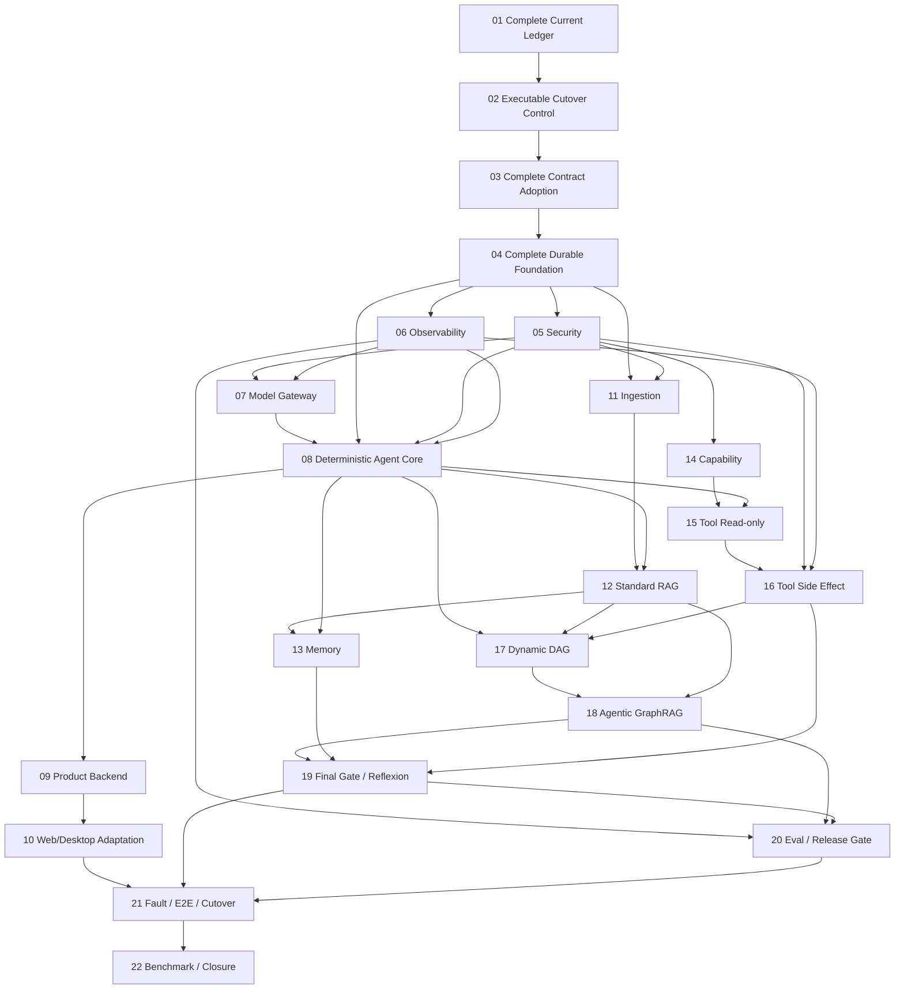

# zuno-canonical-architecture-runtime-realization-v1 实施路线

state: active
current_phase: PHASE08
program_version: 2
phase_count: 22
execution_mode: full-scope / runtime-first / vertical-slice-checkpoints / evidence-gated

## 1. Program 定义

本 Program 是从旧架构到十一模块 Canonical Target 的唯一总迁移计划，覆盖后端、数据、异步基础设施、LangGraph、模型、检索、工具、安全、可观测性、Web、Desktop、E2E、Benchmark、切流和 Legacy 删除。

它不是新一轮架构设计，也不以新增类、表、接口、Mock、局部 Happy Path 或最小闭环作为 Phase 完成标准。Vertical Slice 用于尽早发现集成问题，但 Phase 只有在完整范围、真实默认路径、异常恢复、Migration、Requirement 和 Evidence 都完成后才能关闭。

最终必须形成：

```text
Product RuntimeRequest
→ Security Context
→ TaskContract / GoalVersion
→ PlanVersion
→ Controller Loop
→ Knowledge / Model / Memory / Capability / Tool
→ Evidence / Effect / Observation
→ Final Gate
→ Publication / Delivery / RunOutcome
→ Trace / Audit / Eval / Release Gate
```

并证明该链路在 Crash、Duplicate、Out-of-order、Revocation、UNKNOWN Effect、Replan、Delete、Restore 和依赖部分故障下保持事实一致。

## 2. PHASE01–04 订正

2026-07-16 撤回 PHASE01–04 的旧 `completed` 结论：

- PHASE01：从“已有盘点文件”提升为完整、可复现、双向追踪的 Current Baseline。
- PHASE02：从“迁移矩阵”提升为真实 Adapter、Flag State Machine、Cutover Controller、Rollback Drill 与 Guard。
- PHASE03：从“共享 Contract 内核”提升为十一模块完整 Contract Bundle、Producer/Consumer Adoption 与 Multi-client Type Pipeline。
- PHASE04：从“PostgreSQL Primitive 最小闭环”提升为 PostgreSQL、RabbitMQ、S3-compatible Object Store、LangGraph PostgreSQL Checkpointer、Backup/Restore、Fault/Concurrency 的完整耐久基础。

已有产物保留为部分证据，不作为 Phase Completion。PHASE04 completed 后，PHASE05、PHASE06、PHASE07 已完成 Coordinator Closure；2026-07-20 Goal01 audit 将 PHASE11 重新打开为 in_progress；PHASE08 仍 ready，因为只依赖 PHASE04–07；PHASE12 仍 planned，等待 PHASE08 completed 与 PHASE11 completed。

## 3. Phase 依赖图



## 4. Phase Map

| Phase | 名称 | 主要模块 | 完成结果 |
| --- | --- | --- | --- |
| 01 | Current Baseline and Requirement Ledger | 全部 | 最新 Current、Gap、Requirement、入口、数据、风险和 Evidence 双向可查询且可复现 |
| 02 | Legacy Runtime Compatibility and Cutover Control | 全部 | 旧入口全部进入可执行 Adapter/Flag/Cutover/Rollback/Guard，新增旁路默认失败 |
| 03 | Executable Cross-module Contract Bundle | 全部 | 十一模块共享 Contract 唯一版本化，真实 Producer/Consumer 与 Web/Desktop 类型完成采用 |
| 04 | PostgreSQL Domain and Transaction Foundation | 11 | PHASE04 completed：PostgreSQL、Alembic、RabbitMQ、Outbox/Inbox、Idempotency、Lease/Fencing、Object Store、Checkpointer、Backup/Restore、Generic Replay、Fault/Operator evidence 完整可用 |
| 05 | Security Control Plane | 09 | PHASE05 completed：Principal、Scope、Epoch、Authorization、Approval、SecretLease、Redaction、Audit Requirement implementation available |
| 06 | Observability Minimum Black Box | 10 | PHASE06 completed：Append-only Ingest、Trace、Audit、Dedup/Gap、Projection/Rebuild 和授权只读 Query API implementation available |
| 07 | Model Gateway Runtime | 04 | PHASE07 completed：统一 Chat / Embedding / Rerank / Judge、Provider Adapter、Attempt、Usage、Fallback、Trace 和 bypass guard implementation available |
| 08 | Deterministic Single Controller Runtime | 06 | 单步 Plan 的真实 AgentRunGraph/StepExecutionGraph 可恢复运行 |
| 09 | Product Surface Backend Runtime | 01 | Command/Query/Projection/SSE/Signal/Compatibility API |
| 10 | Web and Desktop Product Adaptation | 01 | Web/Desktop 使用新 Contract、Projection、AvailableAction 和 SSE Resume |
| 11 | Durable Ingestion and Source Lineage | 02 | PHASE11 reopened/in_progress：SourceObject→DocumentVersion→ParseSnapshot→IR→SourceSpan、Quality Gate、Indexable Snapshot、Outbox/Delete/Restore 需按完整生产默认路径重新证明 |
| 12 | Knowledge Version and Standard RAG | 03 | KnowledgeVersion、Index Cutover、Evidence/Citation、Hybrid RAG |
| 13 | Memory and Context Governance Runtime | 05 | ContextPackVersion、Candidate/Governance/Activation、Privacy Delete |
| 14 | Capability and Skill Control Plane | 07 | Versioned Capability/Skill、Availability、Feasibility、Progressive Loading |
| 15 | Tool Definition and Read-only Cutover | 08 | 唯一 Invocation Gateway、PreparedAction、Read-only Adapter 收口 |
| 16 | Tool Side Effect and Reconciliation | 08 | Approval/Audit/Claim/Attempt/Effect/UNKNOWN/Reconciliation/Compensation |
| 17 | Dynamic Plan DAG and Parallel Control | 06 | ReadySet、Commit-before-Send、Reducer、Join、Replan Barrier |
| 18 | Agentic GraphRAG Inner Loop | 03 | RetrievalRound、Graph Route、EvidenceLedger、Corrective Retrieval、Proposal |
| 19 | Final Synthesis, Publication and Reflexion | 06/05/03/01 | Claim/Citation、Final Gate、Publication、RunOutcome、Reflexion Candidate |
| 20 | Observability Eval, Benchmark and Release Gate | 10 | Core Five、Failure Bucket、Efficiency、Comparison、Gate、Evidence |
| 21 | Fault Recovery, Full E2E and Cutover | 全部 | Crash/Resume/Unknown/Revocation/Delete/Restore、Web E2E、切流演练 |
| 22 | Fixed Benchmark, Production Readiness and Closure | 全部 | 同集对照、Legacy 删除、状态更新、归档 |

## 5. 黄金脊柱

任何 Phase 都不得破坏以下最短可运行链：

```text
Complete Contract
→ Complete Durable Infrastructure
→ Security
→ Trace
→ Model Gateway
→ Deterministic Agent Core
→ Ingestion
→ Standard RAG Evidence
→ Final Gate
→ Product Backend
→ Web/Desktop
```

Dynamic DAG、Agentic GraphRAG、Tool Side Effect 和 Reflexion 必须在黄金脊柱通过后增量接入。增量接入不允许降低基础正确性，也不能用于把前置 Phase 未完成范围推迟到后续。

## 6. 受控并行

允许：

- PHASE05 与 PHASE06 在订正后的 PHASE03/04 完整关闭后并行；共享 Envelope 由 Coordinator 合并。
- PHASE09 与 PHASE11 在 PHASE08 和 Security/DB 基线稳定后并行；禁止共同修改 Agent Core Domain。
- PHASE13 与 PHASE14 在 PHASE12/08 稳定后并行。

必须串行收口：PHASE01、02、03、04、08、10、16、17、19、21、22。

## 7. 每 Phase 固定产物

```text
完整范围的代码与配置
Alembic Migration（如涉及持久化）
Unit / Contract / Integration / Fault / E2E Tests
真实默认路径 Vertical Slice 和异常/恢复 Trace
完成证据 docs/evidence/
Requirement Ledger 更新
Current / Gap 更新
Legacy/Allowlist/Removal Gate 更新
Phase completion candidate 报告
Coordinator closure decision
```

最小 Vertical Slice、局部 Adapter 或单个 Happy Path 只能作为中间产物，不能替代上述完整产物。

## 8. Program 级验证层次

- L0：文档、Program、架构、共享 Contract Verifier。
- L1：Schema、Enum、Hash、状态机、Producer/Consumer、跨语言 Contract。
- L2：真实 PostgreSQL、RabbitMQ、Object Store、Checkpointer、Crash/Fencing/Restore。
- L3：Security、Model、Knowledge、Memory、Capability、Tool、Observability Integration。
- L4：API→Run→Plan→Retrieval/Tool→Final Gate→Publication→SSE/Web/Desktop。
- L5：Fixed Dataset、Standard/Local/Deep/Agentic 对照、Core Five、Critical Slice、Cost/Latency、Release Gate。

## 9. 禁止捷径

- 用最小闭环、局部 Happy Path 或未来补齐关闭 Phase。
- 先建所有表再补领域状态机。
- Route 直接跨模块写表。
- Agent Core 直接调用 Provider SDK。
- Memory、Knowledge、Checkpoint、Trace 混成同一 Store。
- Queue Redelivery 当业务 Retry。
- HTTP 2xx、Queue ACK、Object Commit 或 Checkpoint Commit当领域成功。
- Query Rewrite、Corrective Retrieval 和 Replan 混为一体。
- LLM Judge 替代确定性 Schema、Citation、Security 或 State Validation。
- 用旧 API 永久代理新架构而不设删除门。
- 前端根据字符串猜 AvailableAction 或领域成功。
- 因为局部 CI 绿灯就声明 Phase 或 Production Ready。
- Readiness/Evidence 仍为 `completion_candidate` 或 Approval `pending` 时标记 `completed`。

## 10. Program 关闭条件

- 22 个 Phase 全部完成或有正式 ADR 移出范围。
- 十一模块 Mandatory Requirement 100% 有实现与 Code/Migration/Test/Trace/Eval/Evidence 映射。
- 真实 PostgreSQL、RabbitMQ、Object Store 和 LangGraph Checkpointer 路径完成并经过故障恢复验证。
- Single Controller、Dynamic DAG、Tool UNKNOWN、Agentic GraphRAG、Memory、Security、Trace/Eval 完成 E2E。
- Web/Desktop 已切换到新 Product Contract，并验证断线、撤权、多 Interrupt 和 UNKNOWN UI。
- Fixed Benchmark 形成可比较结果，Release Gate 如实给出状态。
- Legacy 主路径删除；任何保留 Adapter 都有正常版本化 API 身份、Owner、期限和验证器。
- 完整 CI、Migration、Fault、Security、Load、Backup/Restore、DR 的运行和未运行情况被披露。
- 状态文档按证据更新。
- Program 整体归档，`.agent/programs/` 恢复 no-active。
