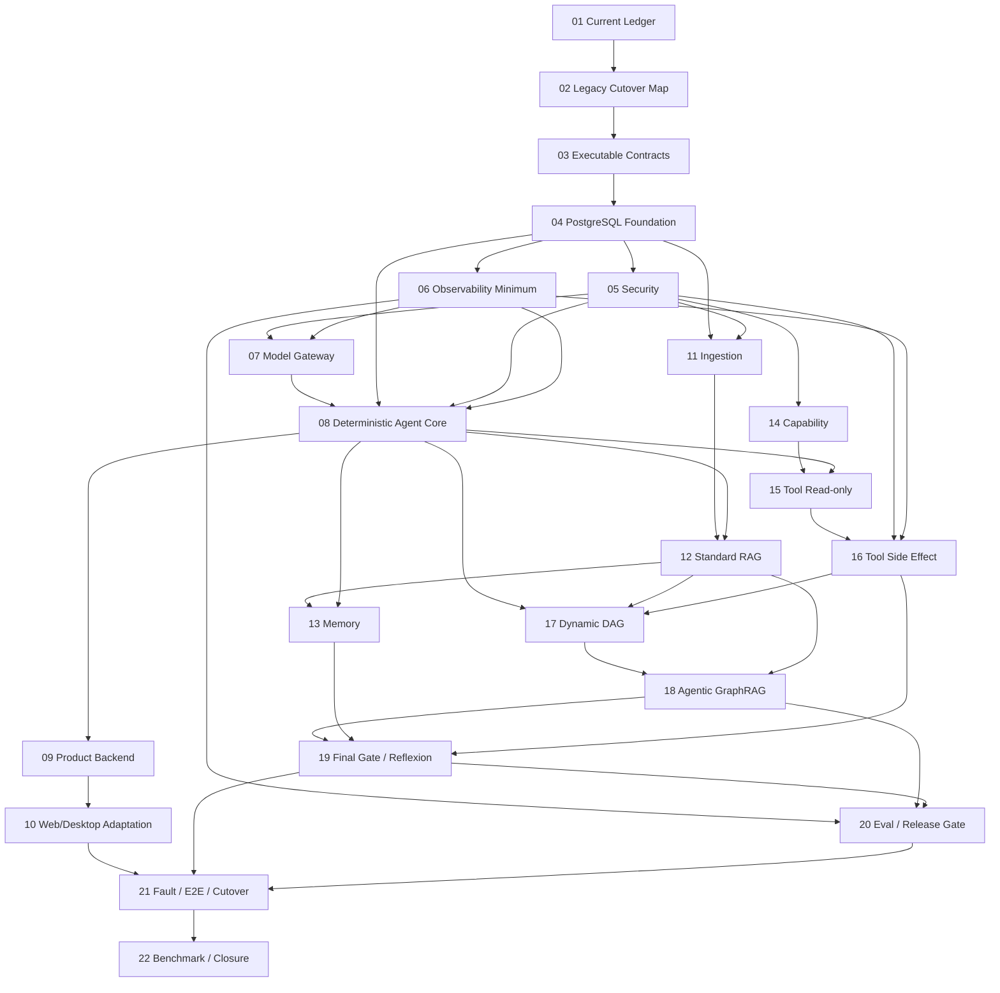

# zuno-canonical-architecture-runtime-realization-v1 实施路线

state: active
current_phase: PHASE04
phase_count: 22
execution_mode: runtime-first / vertical-slice-first / evidence-gated

## 1. Program 定义

本 Program 是从旧架构到十一模块新架构的唯一总迁移计划，覆盖后端、数据、异步基础设施、LangGraph、模型、检索、工具、安全、可观测性、Web、Desktop、E2E、Benchmark、切流和 Legacy 删除。

它不是新一轮架构设计，不以新增类、表、接口、Mock 或文档作为完成标准。最终必须形成：

```text
Product RuntimeRequest
→ Security Context
→ TaskContract / GoalVersion
→ PlanVersion
→ Controller Loop
→ Knowledge / Model / Memory / Capability / Tool
→ Evidence / Effect / Observation
→ Final Gate
→ Publication / Delivery / RunOutcome
→ Trace / Audit / Eval / Release Gate
```

并证明该链路在 Crash、Duplicate、Out-of-order、Revocation、UNKNOWN Effect、Replan、Delete 和 Restore 下保持事实一致。

## 2. Phase 依赖图



## 3. Phase Map

| Phase | 名称 | 主要模块 | 完成结果 |
| --- | --- | --- | --- |
| 01 | Current Baseline and Requirement Ledger | 全部 | Requirement→Current/Gap/Test/Evidence 可查询 |
| 02 | Legacy Runtime Compatibility and Cutover Map | 全部 | 旧入口、兼容、Flag、Rollback、删除门固定 |
| 03 | Executable Cross-module Contract Bundle | 全部 | 共享 Contract 成为版本化 Schema、Hash、Fixture、兼容测试 |
| 04 | PostgreSQL Domain and Transaction Foundation | 11 | PostgreSQL、Alembic、UoW、Outbox/Inbox、Idempotency、Lease/Fencing、Checkpointer 基础 |
| 05 | Security Control Plane | 09 | Principal、Scope、Epoch、Authorization、Approval、SecretLease、Redaction、Audit Requirement |
| 06 | Observability Minimum Black Box | 10 | Append-only Ingest、Trace、Audit、Dedup/Gap、Projection/Rebuild |
| 07 | Model Gateway Runtime | 04 | 所有真实模型调用统一 Gateway，Usage/Cancel/Fallback 可追踪 |
| 08 | Deterministic Single Controller Runtime | 06 | 单步 Plan 的真实 AgentRunGraph/StepExecutionGraph 可恢复运行 |
| 09 | Product Surface Backend Runtime | 01 | Command/Query/Projection/SSE/Signal/Compatibility API |
| 10 | Web and Desktop Product Adaptation | 01 | Web/Desktop 使用新 Contract、Projection、AvailableAction 和 SSE Resume |
| 11 | Durable Ingestion and Source Lineage | 02 | SourceObject→DocumentVersion→ParseSnapshot→IR→SourceSpan |
| 12 | Knowledge Version and Standard RAG | 03 | KnowledgeVersion、Index Cutover、Evidence/Citation、Hybrid RAG |
| 13 | Memory and Context Governance Runtime | 05 | ContextPackVersion、Candidate/Governance/Activation、Privacy Delete |
| 14 | Capability and Skill Control Plane | 07 | Versioned Capability/Skill、Availability、Feasibility、Progressive Loading |
| 15 | Tool Definition and Read-only Cutover | 08 | 唯一 Invocation Gateway、PreparedAction、Read-only Adapter 收口 |
| 16 | Tool Side Effect and Reconciliation | 08 | Approval/Audit/Claim/Attempt/Effect/UNKNOWN/Reconciliation/Compensation |
| 17 | Dynamic Plan DAG and Parallel Control | 06 | ReadySet、Commit-before-Send、Reducer、Join、Replan Barrier |
| 18 | Agentic GraphRAG Inner Loop | 03 | RetrievalRound、Graph Route、EvidenceLedger、Corrective Retrieval、Proposal |
| 19 | Final Synthesis, Publication and Reflexion | 06/05/03/01 | Claim/Citation、Final Gate、Publication、RunOutcome、Reflexion Candidate |
| 20 | Observability Eval, Benchmark and Release Gate | 10 | Core Five、Failure Bucket、Efficiency、Comparison、Gate、Evidence |
| 21 | Fault Recovery, Full E2E and Cutover | 全部 | Crash/Resume/Unknown/Revocation/Delete/Restore、Web E2E、切流演练 |
| 22 | Fixed Benchmark, Production Readiness and Closure | 全部 | 同集对照、Legacy 删除、状态更新、归档 |

## 4. 黄金脊柱

任何 Phase 都不得破坏以下最短可运行链：

```text
Contract
→ PostgreSQL
→ Security
→ Trace
→ Model Gateway
→ Deterministic Agent Core
→ Ingestion
→ Standard RAG Evidence
→ Final Gate
→ Product Backend
→ Web/Desktop
```

Dynamic DAG、Agentic GraphRAG、Tool Side Effect 和 Reflexion 必须在该脊柱通过后增量接入，不能替代基础正确性。

## 5. 受控并行

允许：

- PHASE05 与 PHASE06 在 PHASE03/04 稳定后并行；共享 Envelope 由 Coordinator 合并。
- PHASE09 与 PHASE11 在 PHASE08 和 Security/DB 基线稳定后并行；禁止共同修改 Agent Core Domain。
- PHASE13 与 PHASE14 在 PHASE12/08 稳定后并行。

必须串行收口：PHASE02、03、04、08、10、16、17、19、21、22。

## 6. 每 Phase 固定产物

```text
代码与配置
Alembic Migration（如涉及持久化）
Unit / Contract / Integration / Fault Tests
真实 Vertical Slice 或 Trace
完成证据 docs/evidence/
Requirement Ledger 更新
Current / Gap 更新
Phase completion candidate 报告
```

## 7. Program 级验证层次

- L0：文档、Program、架构、共享 Contract Verifier。
- L1：Schema、Enum、Hash、状态机和 Producer/Consumer Contract Test。
- L2：PostgreSQL、Queue、Object Store、Checkpointer、Crash/Fencing。
- L3：Security、Model、Knowledge、Memory、Capability、Tool、Observability Integration。
- L4：API→Run→Plan→Retrieval/Tool→Final Gate→Publication→SSE/Web。
- L5：Fixed Dataset、Standard/Local/Deep/Agentic 对照、Core Five、Critical Slice、Cost/Latency、Release Gate。

## 8. 禁止捷径

- 先建所有表再补领域状态机。
- Route 直接跨模块写表。
- Agent Core 直接调用 Provider SDK。
- Memory、Knowledge、Checkpoint、Trace 混成同一 Store。
- Queue Redelivery 当业务 Retry。
- HTTP 2xx 当 EffectReceipt。
- Query Rewrite、Corrective Retrieval 和 Replan 混为一体。
- LLM Judge 替代确定性 Schema、Citation、Security 或 State Validation。
- 用旧 API 永久代理新架构而不设删除门。
- 前端根据字符串猜 AvailableAction 或领域成功。
- 因为 CI 绿灯就声明 Production Ready。

## 9. Program 关闭条件

- 22 个 Phase 全部完成或有正式 ADR 移出范围。
- 十一模块 Mandatory Requirement 有实现与证据映射。
- 真实 PostgreSQL、RabbitMQ、Object Store 和 LangGraph Checkpointer 路径完成。
- Single Controller、Dynamic DAG、Tool UNKNOWN、Agentic GraphRAG、Memory、Security、Trace/Eval 完成 E2E。
- Web/Desktop 已切换到新 Product Contract，并验证断线、撤权、多 Interrupt 和 UNKNOWN UI。
- Fixed Benchmark 形成可比较结果，Release Gate 如实给出状态。
- Legacy 主路径删除或保留条件有明确 Owner、Deadline 和验证器。
- 状态文档按证据更新。
- Program 整体归档，`.agent/programs/` 恢复 no-active。
