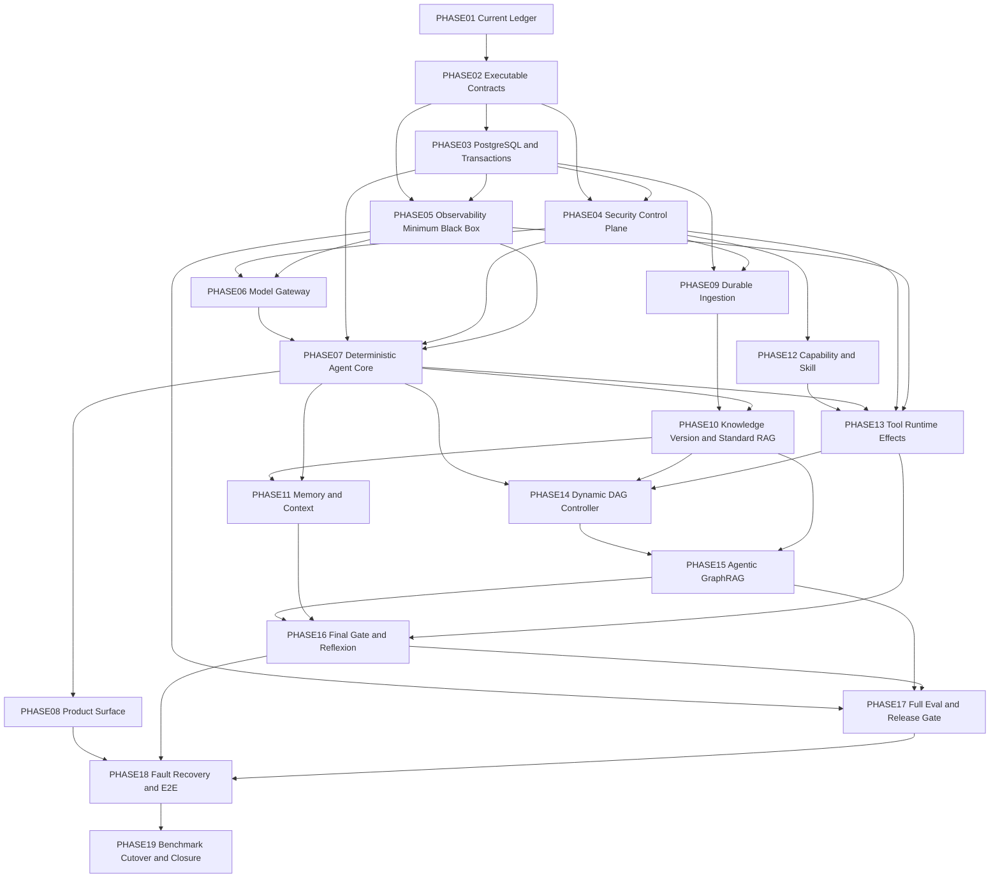

# zuno-canonical-architecture-runtime-realization-v1 实施路线

state: active
current_phase: PHASE01
phase_count: 19
execution_mode: runtime-first / vertical-slice-first / evidence-gated

## 1. Program 定义

本 Program 将十一份 Canonical Module Target 架构转化为 Runtime Current。它不重新设计十一模块，不以类、表、接口、Mock 或文档数量作为完成标准。

核心目标是形成一条真实可执行脊柱：

```text
Product RuntimeRequest
→ Security Context
→ TaskContract / GoalVersion
→ PlanVersion
→ Controller Loop
→ Knowledge / Model / Memory / Capability / Tool
→ Evidence / Effect / Observation
→ Final Gate
→ Publication / Delivery / RunOutcome
→ Trace / Audit / Eval / Release Gate
```

并证明该脊柱在 Crash、Duplicate、Out-of-order、Revocation、UNKNOWN Effect、Replan、Delete 和 Restore 下仍保持事实一致。

## 2. 权威输入

```text
docs/modules/01-product-surface.md
docs/modules/02-input-document-ingestion.md
docs/modules/03-knowledge-agentic-graphrag.md
docs/modules/04-model-gateway.md
docs/modules/05-memory-context.md
docs/modules/06-agent-core-planning-control.md
docs/modules/07-capability-skill.md
docs/modules/08-tool-runtime.md
docs/modules/09-security.md
docs/modules/10-observability-eval.md
docs/modules/11-infrastructure.md
docs/decisions/0003-wave1-cross-module-contract-freeze.md
docs/governance/wave1-cross-module-contract-registry.md
```

总架构用于跨模块组合；模块文档拥有领域对象、状态、Failure、持久化和测试语义。

## 3. 依赖主图



## 4. Phase Map

| Phase | 名称 | 主要模块 | 关闭结果 |
| --- | --- | --- | --- |
| PHASE01 | current-baseline-and-requirement-ledger | 全部 | 每个 ARCH Requirement 映射到 Current/Gap/Test/Evidence |
| PHASE02 | executable-cross-module-contract-bundle | 全部 | 共享 Contract 成为版本化可执行 Schema 与兼容测试 |
| PHASE03 | postgres-domain-and-transaction-foundation | 11 | PostgreSQL、Alembic、UoW、Outbox/Inbox、Idempotency/Fencing 可用 |
| PHASE04 | security-control-plane | 09 | Principal、Scope、Epoch、Authorization、Approval、Secret、Redaction 可用 |
| PHASE05 | observability-minimum-black-box | 10 | Append-only Ingest、Trace、Audit、Dedup/Gap 和查询基线可用 |
| PHASE06 | model-gateway-runtime | 04 | 所有真实模型调用统一通过 Gateway，Usage/Cancel/Fallback 可追踪 |
| PHASE07 | deterministic-single-controller-runtime | 06 | 单步 Plan 的真实 AgentRunGraph/StepExecutionGraph 可恢复运行 |
| PHASE08 | product-surface-command-query-projection | 01 | Thin API、Command/Query、SSE Cursor、Approval Signal 和 Projection 可用 |
| PHASE09 | durable-ingestion-and-source-lineage | 02 | SourceObject→DocumentVersion→ParseSnapshot→IR→SourceSpan 真实闭环 |
| PHASE10 | knowledge-version-publication-standard-rag | 03 | KnowledgeVersion、Snapshot、Index Cutover、Evidence/Citation 和 Hybrid RAG 可用 |
| PHASE11 | memory-context-governance-runtime | 05 | ContextPackVersion、Candidate/Governance/Activation、Privacy Delete 可用 |
| PHASE12 | capability-skill-control-plane | 07 | Versioned Capability/Skill、Availability、Feasibility 和渐进加载可用 |
| PHASE13 | tool-runtime-side-effect-plane | 08 | PreparedAction→Approval→Attempt→Effect/Reconciliation 全链路可用 |
| PHASE14 | dynamic-plan-dag-parallel-control | 06 | ReadySet、Commit-before-Send、Reducer、Join、Replan Barrier 可用 |
| PHASE15 | agentic-graphrag-inner-loop | 03 | RetrievalRound、Graph Route、EvidenceLedger、Corrective Retrieval 和 Proposal 可用 |
| PHASE16 | final-synthesis-publication-reflexion | 06/05/03/01 | Claim/Citation、Final Gate、Publication、RunOutcome、Reflexion Candidate 可用 |
| PHASE17 | observability-eval-benchmark-release-gate | 10 | Core Five、Failure Bucket、Efficiency、Comparison、Gate、Evidence 可用 |
| PHASE18 | fault-recovery-security-e2e | 全部 | Crash/Resume/Unknown/Revocation/Delete/Restore 的 E2E 故障证据 |
| PHASE19 | fixed-benchmark-cutover-and-closure | 全部 | 固定 Benchmark、切流、遗留收缩、状态更新和 Program 归档 |

## 5. 黄金脊柱

优先保证以下最短闭环始终可运行：

```text
PHASE02 Contract
→ PHASE03 PostgreSQL
→ PHASE04 Security
→ PHASE05 Trace
→ PHASE06 Model Gateway
→ PHASE07 Deterministic Agent Core
→ PHASE09 Ingestion
→ PHASE10 Standard RAG Evidence
→ PHASE16 Final Gate
→ PHASE08 Product Delivery
```

任何后续 Phase 不得破坏该脊柱。PHASE14–PHASE15 是在已通过的单步、标准 RAG 和副作用语义上增加动态并行和 Agentic 能力，不得作为基础正确性的替代品。

## 6. 并行策略

只允许以下受控并行：

- PHASE04 与 PHASE05：在 PHASE02/03 的共享 Contract 和持久化基础稳定后，可由不同 Worktree 处理 Security 与 Observability；共享 Envelope 由 Coordinator 合并。
- PHASE08 与 PHASE09：PHASE07 稳定后，Product Surface 和 Ingestion 可并行，禁止共同修改 Agent Core Domain。
- PHASE11 与 PHASE12：Knowledge/Agent Core 基线稳定后，Memory 和 Capability 可并行。

PHASE03、PHASE07、PHASE13、PHASE14、PHASE16、PHASE18、PHASE19 必须串行收口。

## 7. 每 Phase 固定产物

```text
代码 / Migration
focused unit tests
integration tests
fault tests when applicable
E2E or trace when applicable
completion evidence under docs/evidence/
Current/Gap ledger update
phase status update
```

每个 Phase 的原子 Work Package 见对应 `PHASENN_*.md`。工作包必须使用 `.agent/programs/task-execution-contract.md`。

## 8. Program 级验证层次

### L0 文档与治理

```bash
git diff --check
python tools/scripts/verify_current_program.py
python .agent/scripts/verify_agent_system.py
python tools/scripts/verify_architecture_document_set.py
python tools/scripts/verify_architecture_semantic_alignment.py
python tools/scripts/verify_wave1_contract_freeze.py
```

### L1 Contract / Domain

- Schema、Enum、Hash、状态机、非法转换。
- Producer/Consumer Fixture。
- Backward/Forward Compatibility。

### L2 Persistence / Adapter

- PostgreSQL、Alembic、Object Store、RabbitMQ、Checkpointer。
- Crash、Duplicate、Out-of-order、Lease/Fencing、Retry Exhaustion。

### L3 Module Integration

- Security、Model、Knowledge、Memory、Capability、Tool、Observability 的真实 Port/Adapter。

### L4 Vertical Slice

- API→Run→Plan→Retrieval→Evidence→Final Gate→Publication→SSE。
- Approval→Tool Effect→Response Lost→Reconciliation→Resume。

### L5 Release Evidence

- Fixed Dataset。
- Standard/Local/Deep/Agentic 同集对照。
- Core Five、Citation/Safety、Cost/Latency、Critical Slice。
- Release Gate 和 EvidenceRecord。

## 9. 不允许的捷径

- 先实现所有表，再补领域状态机。
- 让 FastAPI Route 直接跨模块写表。
- 让 Agent Core 直接调用 Provider SDK。
- 把 Memory、Knowledge、Checkpoint 或 Trace 混成同一个 Store。
- 把 Queue Redelivery 当业务 Retry。
- 把 Tool HTTP 2xx 当 EffectReceipt。
- 把 Query Rewrite、Corrective Retrieval 和 Replan 混为一体。
- 用 LLM Judge 分数替代确定性 Schema、Citation、Security 或 State Validation。
- 因为 CI 通过就声明 Production Ready。

## 10. Phase Closure 规则

Phase 状态只允许：

```text
planned
ready
in_progress
blocked
completed
```

`completed` 必须由 Coordinator 更新，Implementer Agent 只能提交 `completion_candidate` 报告。

Phase 关闭后：

1. 更新 `current.md` 到下一个 Phase。
2. 更新 `closure-checklist.md`。
3. 更新 Requirement Ledger 与 Evidence。
4. 合并前运行该 Phase 的集成验证。
5. 禁止把未测量质量写成已证明。

## 11. Program 关闭条件

Program 只有满足全部条件才能归档：

- 19 个 Phase 全部完成或有正式 ADR 移出范围；
- 十一模块 Mandatory Requirement 有实现和证据映射；
- 真实 PostgreSQL/Queue/Object/Checkpointer 路径完成；
- Single Controller、Dynamic DAG、Tool UNKNOWN、GraphRAG、Memory、Security、Trace/Eval 完成 E2E；
- Fixed Benchmark 形成可比较结果；
- Release Gate 给出真实 PASSED/FAILED/BLOCKED/INCOMPARABLE，不伪造；
- Legacy 主路径完成切流或保留条件被明确记录；
- `docs/status/production-readiness.md` 按证据更新；
- Program 移入 `docs/history/programs/zuno-canonical-architecture-runtime-realization-v1/`；
- `.agent/programs/` 恢复 no-active。