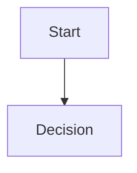

# Mermaid Diagram Template

## Diagram Name

填写固定图名。若是十类架构视图之一，必须与 `.agent/references/diagram-inventory.md` 和 `tools/agent/render_architecture.py` 的 `EXPECTED_DIAGRAMS` 一致。

## Diagram Type

Context / Layered / Component / Runtime Flow / Agent Loop / Memory / Retrieval / Deployment / Quality

## Source of Truth

- Human doc:
- Mermaid source:
- Generated HTML:
- Inventory:

## Status

Current / Target / Future / History

## Mermaid Block

## Explanation

用 2-4 句话解释这张图改变读者的哪个判断。

## View Mapping

- 4+1 View:
- View & Beyond / C&C View:

## Update Triggers

- 触发条件：
- 受影响文档：
- 受影响 verifier/test：

## Validation

- `python tools/agent/render_architecture.py --check`
- `python tools/scripts/verify_docs_entrypoints.py`
