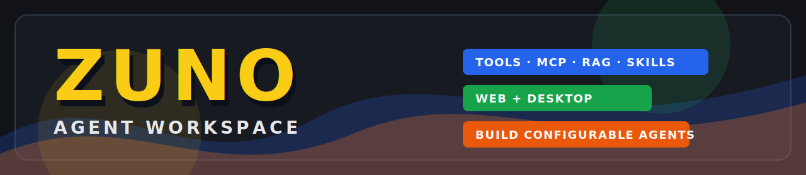

# Zuno

<p align="center">
  
</p>

<p align="center">
  <a href="https://github.com/ProfessorZhi/Zuno"></a>
  
  
  
  
</p>

<p align="center">
  <b>Agent Workspace for tools, MCP, RAG, Skills, API integration and desktop automation.</b>
</p>

Zuno 是一个面向 Agent 应用开发、调试和日常使用的工作台。它把对话、工具调用、MCP 服务、知识库、Skill、自定义 API/CLI 工具和桌面端运行能力整合到同一套界面中，适合用来搭建可配置、可观察、可扩展的本地 Agent 系统。

项目仓库：<https://github.com/ProfessorZhi/Zuno>

## 项目定位

Zuno 不是单纯的聊天 UI，也不是只封装一个模型接口。它的目标是提供一个可以持续扩展的 Agent Workspace：

- 让用户在一个工作台里管理模型、知识库、工具、Skill 和 MCP 服务。
- 让 Agent 可以根据任务自动选择工具、检索知识库、读取文档、调用远程 API 或本地 CLI。
- 让开发者可以验证工具连通性、观察执行过程、调试 RAG 和工具调用链路。
- 让同一套能力同时服务 Web 控制台和 Electron 桌面端。

## 主要功能

### Agent 工作台

- 支持普通聊天和 Agent 工作区两种使用方式。
- 支持流式输出、执行状态、工具调用事件和最终答案展示。
- 支持图片、PDF、Word、PPT、TXT、Markdown、Excel 等资料输入和解析。
- 支持基于 ReAct 的工具调用链路。
- 对确定性信息做运行时校验和整理，例如日期星期、行情表格、涨跌幅等不交给模型自由猜。

### 工具系统

- 支持系统内置工具和用户自定义工具。
- 支持远程 API 工具接入，包含文档读取、OpenAPI/Swagger、API Key 认证、测试参数和真实连通性检测。
- 支持 CLI 工具接入，包含命令、工作目录、参数模板和 healthcheck。
- 支持工具列表状态、检测结果、运行方式和配置元数据展示。
- 支持 Agent 辅助填表：给出文档链接和 API Key 后，由 Agent 推断接口地址、认证方式、参数和描述。

### MCP

- 支持内置和自定义 MCP 服务管理。
- 支持 STDIO 和流式 HTTP 接入。
- 支持工具发现、连接测试、用户级参数配置和状态检查。
- 支持在工作区中按显式命令或语义路由调用 MCP 能力。

### 知识库与 RAG

- 支持知识库创建、文件上传、解析、分块、索引和检索。
- 支持多格式文档解析和任务进度展示。
- 支持向量检索、重排、查询改写和 GraphRAG 相关链路。
- 支持 PostgreSQL、Redis、Neo4j、MinIO 等基础设施配合运行。

### Skill 与能力管理

- 支持 Skill 管理、绑定和工作区快速调用。
- 支持能力注册与检索，让 Agent 更容易发现当前可用能力。
- 支持将工具、MCP、知识库和 Skill 纳入统一执行入口。

### 桌面端

- 提供 Electron 客户端。
- 支持桌面启动、停止、重建和本地前端运行。
- 支持桌面 bridge 与本地文件、终端、运行环境联动。
- 提供 Windows 启动器脚本，降低本地运行门槛。

## 技术栈

### 后端

- Python 3.12+
- FastAPI
- SQLModel
- LangChain
- LangGraph
- PostgreSQL
- Redis
- Neo4j
- MinIO
- Docker / Docker Compose

### 前端

- Vue 3
- TypeScript
- Vite
- Element Plus
- Pinia
- ECharts
- Monaco Editor

### 桌面端

- Electron
- Node.js
- 本地 Vite 开发服务

## 目录结构

```text
Zuno/
├─ src/
│  ├─ backend/          # FastAPI 后端、Agent runtime、RAG、MCP、工具系统
│  └─ frontend/         # Vue 3 前端控制台和工作台界面
├─ desktop/             # Electron 桌面端
├─ docker/              # Dockerfile、Compose、示例运行配置
├─ launchers/           # Windows Web/Desktop 启动器
├─ scripts/             # 启动、迁移、验证和维护脚本
├─ cli_tools/           # 本地 CLI 工具目录
├─ docs/                # 设计文档、开发计划和参考资料
├─ tests/               # 顶层端到端/集成测试
├─ README.md
└─ LICENSE
```

本地私有目录不会上传到 GitHub，例如：

- `study_hub/`
- `interview_hub/`
- `docker/data/`
- `src/backend/agentchat/config.yaml`
- `src/backend/agentchat/config.local.yaml`
- `node_modules/`
- `tmp/`

## 快速上手

### 1. 克隆项目

```bash
git clone https://github.com/ProfessorZhi/Zuno.git
cd Zuno
```

### 2. 准备配置文件

Zuno 不会把真实 API Key 上传到仓库。仓库中只提供示例配置。

后端本地配置：

```bash
copy src\backend\agentchat\config.example.yaml src\backend\agentchat\config.local.yaml
```

Docker 配置：

```bash
copy docker\docker_config.example.yaml docker\docker_config.local.yaml
```

然后根据需要填写：

- 模型 API Key、Base URL、模型名
- 搜索、天气、物流等系统工具 Key
- MinIO / OSS 配置
- LangSmith / Langfuse 可观测性配置
- 邮箱、MCP 或其它工具凭证

配置加载优先级：

1. `AGENTCHAT_CONFIG` 或 `ZUNO_CONFIG` 环境变量
2. `src/backend/agentchat/config.local.yaml`
3. `src/backend/agentchat/config.yaml`
4. `src/backend/agentchat/config.example.yaml`

### 3. Docker 方式启动

适合第一次体验完整栈。

```bash
cd docker
docker compose up -d
```

默认服务：

- 后端 API：<http://127.0.0.1:7860>
- 前端 Web：<http://127.0.0.1:8090>
- MinIO Console：<http://127.0.0.1:9001>
- Neo4j Browser：<http://127.0.0.1:7474>

停止：

```bash
docker compose down
```

### 4. Windows 启动器方式

如果你在 Windows 上使用，推荐直接运行 `launchers/` 下的脚本。

Web 模式：

```powershell
.\launchers\Zuno-Web-Start.cmd
```

桌面模式：

```powershell
.\launchers\Zuno-Desktop-Start.cmd
```

常用脚本：

- `Zuno-Web-Start.cmd`
- `Zuno-Web-Stop.cmd`
- `Zuno-Web-Rebuild.cmd`
- `Zuno-Web-Full-Rebuild.cmd`
- `Zuno-Desktop-Start.cmd`
- `Zuno-Desktop-Stop.cmd`
- `Zuno-Desktop-Rebuild.cmd`
- `Zuno-Desktop-Full-Rebuild.cmd`

更多说明见 [launchers/README.md](./launchers/README.md)。

### 5. 本地开发方式

后端：

```bash
pip install -r requirements.txt
cd src/backend
uvicorn agentchat.main:app --host 0.0.0.0 --port 7860 --reload
```

前端：

```bash
cd src/frontend
npm install
npm run dev
```

桌面端：

```bash
cd desktop
npm install
npm run dev
```

前端开发服务默认使用 Vite。Web 模式通常使用 `8090`，桌面模式本地前端通常使用 `8091`。

## 常用操作

### 配置模型

进入系统配置或模型页面，填写：

- Provider
- Model Name
- Base URL
- API Key
- 模型用途，例如对话模型、工具调用模型、推理模型、Embedding、Rerank、视觉模型等

建议至少配置：

- 对话模型
- 工具调用模型
- Embedding 模型

### 接入远程 API 工具

在工具页面新建远程 API 工具，可以提供：

- API 文档链接
- OpenAPI / Swagger 链接
- API Key
- curl 示例

Agent 会尝试自动推断：

- 工具名称和描述
- Base URL 和路径
- 请求方法
- 认证方式
- 参数字段
- 测试参数

检测语义采用真实检测：只有实际发起请求并成功，才显示连通性正常。

### 接入 CLI 工具

CLI 工具需要提供：

- 命令
- 参数模板
- 工作目录
- 健康检查命令

仅命令存在不代表工具可用。Zuno 会优先执行 healthcheck 来判断 CLI 工具是否真正就绪。

### 使用知识库

知识库支持上传文档并建立索引。常见流程：

1. 创建知识库
2. 上传文件
3. 等待解析和索引任务完成
4. 在工作区提问
5. Agent 根据检索结果回答

## 安全与隐私

仓库不会提交真实运行密钥。以下文件和目录默认忽略：

- `.env`
- `.env.*`
- `src/backend/agentchat/config.yaml`
- `src/backend/agentchat/config.local.yaml`
- `docker/docker_config.local.yaml`
- `docker/data/`
- `study_hub/`
- `interview_hub/`
- `tmp/`
- `node_modules/`
- `*.log`
- `*.sqlite`
- `*.db`
- `*.pem`
- `*.key`

如果你要公开 fork 或推送到 GitHub，请先检查：

```bash
git status --ignored
git grep -n -I -E "sk-|gho_|tvly-|LTAI|api_key|secret|password|token"
```

真实 API Key 应该放在本地配置、环境变量或部署平台的 Secret 管理中，不应该写入可提交源码。

## 验证与测试

后端测试示例：

```bash
python -m pytest src/backend/agentchat/test -q
```

前端类型检查：

```bash
cd src/frontend
npm run lint
```

端到端烟雾测试脚本：

```powershell
powershell -ExecutionPolicy Bypass -File .\scripts\run-full-e2e-smoke.ps1
```

## 当前状态

Zuno 仍在快速迭代中，重点方向包括：

- 更稳定的 Agent 工具编排
- 更可靠的远程 API / CLI 接入体验
- 更完整的 RAG 和 GraphRAG 工作流
- 更清晰的系统工具检测语义
- 更强的桌面端本地执行能力
- 更丰富的结构化结果渲染，例如表格和图表组件

## License

MIT
