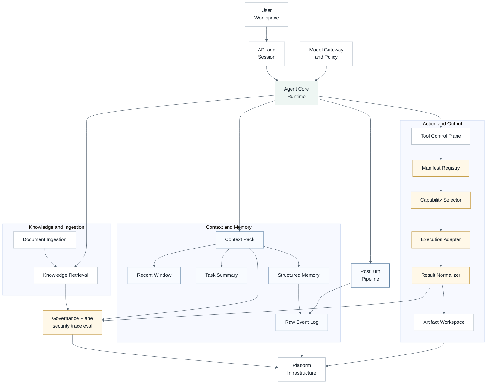
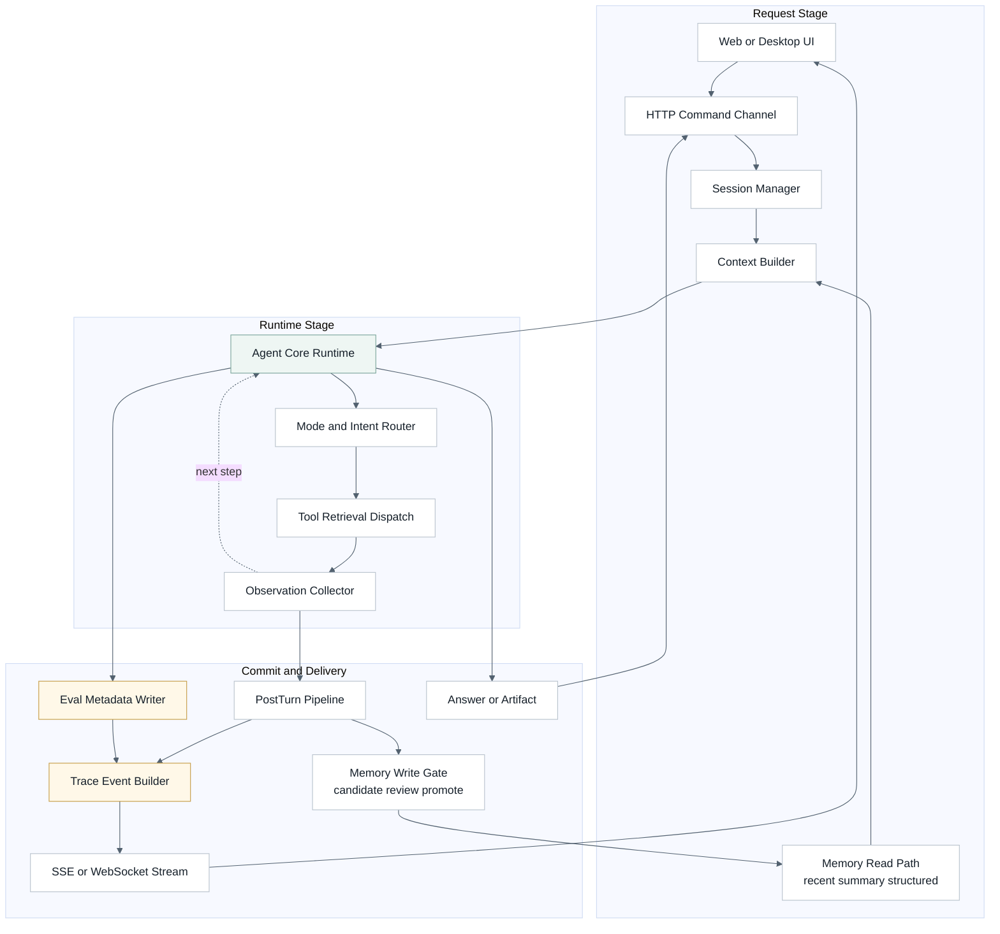
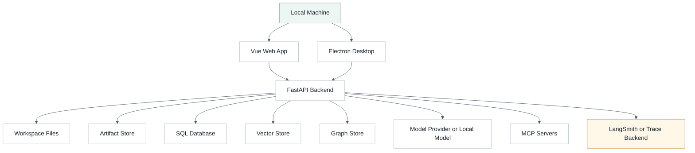
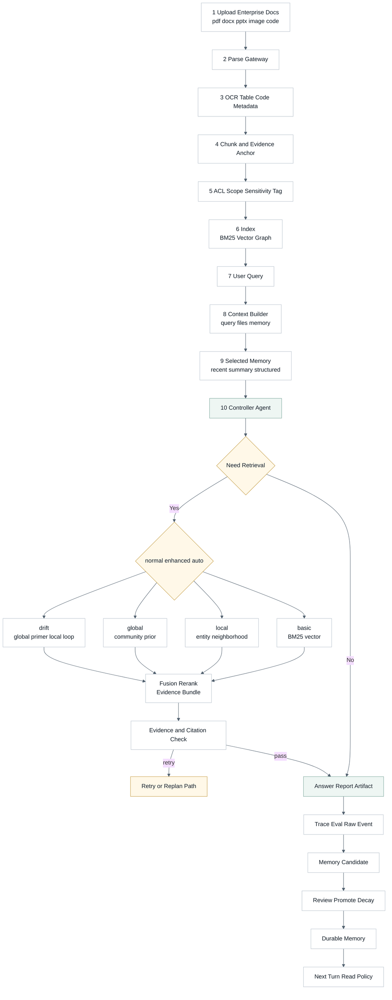
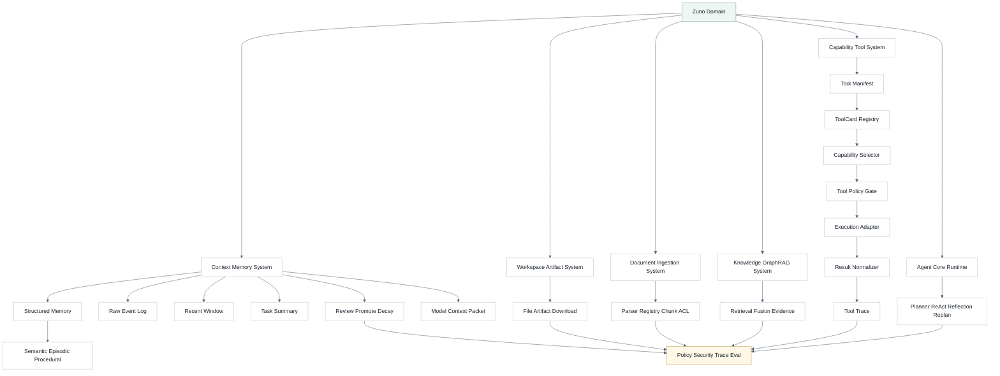
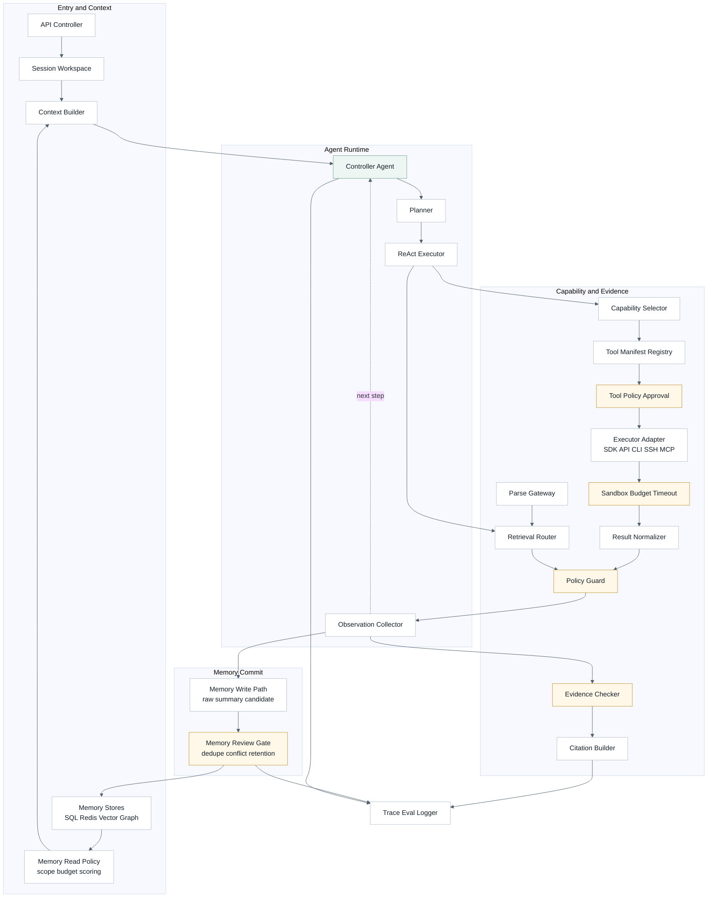
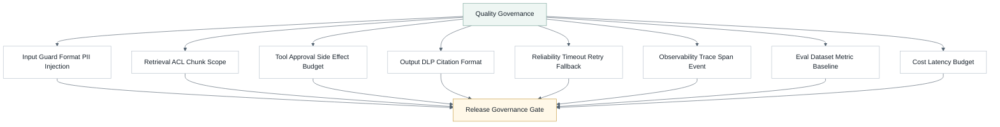

```mermaid
%%{init: {"theme": "base", "themeVariables": {"background": "#f7f8fb", "lineColor": "#52616f"}}}%%
flowchart TB
  classDef node fill:#ffffff,stroke:#b8c2cc,stroke-width:1px,color:#16202a;
  classDef accent fill:#eef6f3,stroke:#7aa59a,stroke-width:1px,color:#16202a;
  classDef guard fill:#fff8e8,stroke:#c59b43,stroke-width:1px,color:#16202a;

  R["Repository Root"]:::accent
  R --> APPS["apps"]
  R --> BACKEND["src/backend/zuno"]
  R --> DOCS["docs"]
  R --> AGENT[".agent"]
  R --> TOOLS["tools"]
  R --> TESTS["tests"]
  BACKEND --> API["api"]
  BACKEND --> AG["agent"]
  BACKEND --> MEM["memory"]
  BACKEND --> CAP["capability"]
  BACKEND --> KNO["knowledge"]
  BACKEND --> PLA["platform"]
  DOCS --> FORMAL["architecture current target roadmap"]
  DOCS --> HTML["architecture.html generated"]
  AGENT --> PROGRAM["programs active phases"]:::guard
  AGENT --> REFS["references governance"]
  AGENT --> TPL["templates skeletons"]
  TOOLS --> RENDER["render architecture"]
  TOOLS --> VERIFY["verifiers"]
  TESTS --> REPO["repo tests"]
  class APPS,BACKEND,DOCS,AGENT,TOOLS,TESTS,API,AG,MEM,CAP,KNO,PLA,FORMAL,HTML,REFS,TPL,RENDER,VERIFY,REPO node;
```

```mermaid
%%{init: {"theme": "base", "themeVariables": {"background": "#f7f8fb", "lineColor": "#52616f"}}}%%
flowchart TB
  classDef node fill:#ffffff,stroke:#b8c2cc,stroke-width:1px,color:#16202a;
  classDef accent fill:#eef6f3,stroke:#7aa59a,stroke-width:1px,color:#16202a;
  classDef guard fill:#fff8e8,stroke:#c59b43,stroke-width:1px,color:#16202a;

  APP["Zuno App"]:::accent
  STORE["Local Storage"]
  SQL["SQL Database"]
  VDB["Vector Store"]
  GDB["Graph Store"]
  MODEL["Model Gateway"]
  SEARCH["Search Provider"]
  MCP["MCP Provider"]
  SDK["SDK Adapter"]
  APIAD["API Adapter"]
  CLI["CLI Adapter"]
  SSH["SSH Adapter"]:::guard
  TRACE["Trace Eval Backend"]
  APP --> STORE
  APP --> SQL
  APP --> VDB
  APP --> GDB
  APP --> MODEL
  APP --> SEARCH
  APP --> MCP
  APP --> SDK
  APP --> APIAD
  APP --> CLI
  APP --> SSH
  APP --> TRACE
  class STORE,SQL,VDB,GDB,MODEL,SEARCH,MCP,SDK,APIAD,CLI,TRACE node;
```

```mermaid
%%{init: {"theme": "base", "themeVariables": {"background": "#f7f8fb", "lineColor": "#52616f"}}}%%
flowchart LR
  classDef node fill:#ffffff,stroke:#b8c2cc,stroke-width:1px,color:#16202a;
  classDef decision fill:#fff8e8,stroke:#c59b43,stroke-width:1px,color:#16202a;
  classDef accent fill:#eef6f3,stroke:#7aa59a,stroke-width:1px,color:#16202a;

  GOAL["Goal"]
  PREP["prepare_context"]
  READMEM["memory read<br/>recent task structured"]
  ROUTE["intent and mode router"]
  PLAN["plan"]
  STEP["ReAct step"]
  CALL["tool or retrieval dispatch"]
  OBS["observation"]
  RAW["raw event append"]
  WORK["working memory"]
  REFLECT{"reflection gate"}:::decision
  REPLAN["replan"]
  FINAL["final answer"]:::accent
  COMMIT["post_turn_commit trace memory eval"]
  SUMMARY["task summary update"]
  CAND["structured memory candidate"]
  REVIEW["review promote decay"]:::decision
  LONG["semantic episodic procedural memory"]

  subgraph PREPARE["Prepare"]
    direction TB
    GOAL --> PREP --> READMEM --> ROUTE --> PLAN
  end

  subgraph EXECUTE["Execute"]
    direction TB
    STEP --> CALL --> OBS --> RAW --> WORK --> REFLECT
  end

  subgraph POSTTURN["Post Turn"]
    direction TB
    FINAL --> COMMIT
    COMMIT --> SUMMARY
    COMMIT --> CAND --> REVIEW --> LONG
  end

  PLAN --> STEP
  REFLECT -->|continue| STEP
  REFLECT -->|replan| REPLAN --> PLAN
  REFLECT -->|finish| FINAL
  SUMMARY -. next turn .-> READMEM
  LONG -. next turn .-> READMEM
  class GOAL,PREP,READMEM,ROUTE,PLAN,STEP,CALL,OBS,RAW,WORK,REPLAN,COMMIT,SUMMARY,CAND,LONG node;
```

# Zuno 架构总览

> [!abstract] 定位
> Zuno 是本地优先的 Agent Workspace。本文用 **4+1 View Model**、**View & Beyond** 和 **Agent Loop 专题图**说明 Agentic RAG、GraphRAG、文档解析、安全治理与评测追踪的目标架构。

正式事实以 [[architecture/current-architecture|当前架构]] 为准。近期目标以 [[architecture/target-architecture|目标架构]] 为准。执行计划进入 `.agent/programs/`。

本文件是 Mermaid 源和 Obsidian 版架构总览。展示页由以下命令生成：

```powershell
python tools/agent/render_architecture.py --write
python tools/agent/render_architecture.py --check
```

## 一、4+1 View Model

4+1 从五个角度解释同一个系统：Logical、Development、Process、Physical 和 Scenarios。Process View 关注运行时进程、通信、并发和事件流；Agent Loop 是 Zuno 的核心内部循环，但不等同于整个 Process View。

### Logical View

该图回答：Zuno 的目标职责如何分层，以及哪些能力是顶层模块、哪些能力是横切治理。

#### 图



#### 分析

- 关注点：系统职责，而不是物理目录。
- Zuno 映射：默认主线仍是 Single Controller Agent；`Agent Core Runtime` 是 `Single Controller Agent` 的二级展开；Memory 展开为 Raw Event Log、Recent Window、Task Summary、Structured Long-term Memory 和 Context Pack。
- 边界：Knowledge 可以作为 capability 被调用，但在架构上单独成层，因为 GraphRAG、retrieval fusion、citation 和 evidence contract 有独立生命周期。
- 边界：Security、Trace 和 Eval 收束为 Governance Plane；Tool Control Plane 以 ToolCard/manifest、selector、policy、executor、result normalizer 和 trace 为目标链路。

### Development View

该图回答：代码、正式文档和 Agent 工作流如何组织，并说明新增架构细化 program 放在哪里。

#### 图



#### 分析

- 关注点：开发者如何进入项目。
- Zuno 映射：`docs/architecture.md` 是 Mermaid 图源；`.agent/programs/` 是当前执行计划；`tools/agent/render_architecture.py` 生成 HTML。
- 边界：高频执行细节进入 `.agent/programs/`，稳定结论进入 `docs/architecture/`。

### Process View

该图回答：一次请求如何经过 API、Context、Agent Core、工具/检索、事件流和评测追踪。

#### 图



#### 分析

- 关注点：运行时控制流、事件流和外部调用。
- Zuno 映射：Process View 覆盖 API、Agent runtime、工具调用、检索、memory read/write、trace 和 eval。
- 边界：SSE / WebSocket 是事件传输通道；trace / eval contract 才是可观测事实。

### Physical View

该图回答：Zuno 在本地优先部署中连接哪些节点，以及哪些 provider 是可替换边界。

#### 图



#### 分析

- 关注点：部署节点和外部依赖。
- Zuno 映射：本地文件、数据库、向量/图存储、模型 provider、MCP 和 trace backend 都是可替换边界。
- 边界：近期仍是模块化单体，不是微服务拆分。

### Scenarios View

该图回答：企业知识库场景中，文档如何进入知识空间，并如何变成可引用回答或报告。

#### 图



#### 分析

- 关注点：用企业知识库场景验证架构。
- Zuno 映射：文档解析层是企业知识库、GraphRAG、citation 和 eval 的共同前置依赖。
- 边界：`auto` 是 router，不是第五种检索算法；`global` 是 community-level prior，不和 chunk-level BM25 直接生硬混榜。

## 二、View & Beyond

View & Beyond 以 view 为架构文档组织单位。这里采用四个工程化视图：Logical、Component-and-Connector、Deployment 和 Quality。

### V&B Logical View

该图回答：领域子系统如何组成一个 Agent Workspace，并区分顶层能力和横切治理。

#### 图



#### 分析

- 关注点：领域对象和职责。
- Zuno 映射：Runtime、Memory、Tool、Knowledge、Ingestion、Workspace 和 Policy 是目标领域子系统；Memory 是 write-manage-read 子系统，Tool 是 manifest-driven control plane，不是临时函数列表。
- 边界：GraphRAG 补充 BM25 和向量检索，不替代它们；文档解析是 Knowledge 的上游，不等同于 Memory。

### Component-and-Connector View

该图回答：运行时组件如何连接、由谁调度、在哪些节点做权限和证据检查。

#### 图



#### 分析

- 关注点：组件和连接器。
- Zuno 映射：控制由 Agent 集中；能力通过 Tool Manifest Registry、Capability Selector、Tool Policy Approval、Executor Adapter、Sandbox、Result Normalizer 和 Retrieval Router 进入结果；Memory 通过 read policy 进入 Context Pack，通过 post-turn write path 进入 durable memory。
- 边界：Planner 是 Agent Core Runtime 的内部控制点，不是一个独立顶层业务层。

### V&B Deployment View

该图回答：工程部署时哪些资源应保持可替换，以及工具执行方式如何作为 adapter 进入系统。

#### 图



#### 分析

- 关注点：软件元素到运行环境的映射。
- Zuno 映射：Provider 是边界，核心 runtime 不绑定单一 vendor。
- 边界：SDK、API、CLI、SSH、MCP 是 execution adapter 或 provider metadata，不是 Capability 的业务顶层分类。

### Quality View

该图回答：质量属性、安全、稳定性、观测和自动化评测如何作为治理闭环落地。

#### 图



#### 分析

- 关注点：性能、可靠性、安全、可观测性、可修改性和评测。
- Zuno 映射：Trace、Eval、Evidence、permission、budget、DLP 和 verifier 共同约束质量。
- 边界：输出检查不能替代检索前 ACL 和工具前审批；安全必须贯穿输入、检索、工具和输出。

## 三、Agent Loop 专题图

Agent Loop 是 Zuno 的核心运行范式。它属于 Process View 的内部细化，但不代表整个 Process View。

### Agent Loop View

该图回答：主控 Agent 如何在一个可观测的 runtime harness 中计划、执行、观察、反思、重规划并提交 trace / memory / eval。

#### 图



#### 分析

- 关注点：Agent 内部决策循环。
- Zuno 映射：Planning 是 Agent Core Runtime 的控制能力；runtime harness 负责状态、checkpoint、streaming、interrupt、trace、memory read/write 和失败处理。
- 边界：LangGraph 是目标实现候选，用于 state graph、checkpoint、durable execution、human-in-the-loop、streaming 和 resume；它不是“规划模块本身”。
- 边界：Reflection 是门控动作，不是每一步强制执行；ToT / LATS 只作为 Future 或离线困难模式，不进入近期默认路径。

## 边界

> [!warning] Current / Target 边界
> 本文是 Target 架构说明，不声称所有能力已经完成。Current 只写入有代码、测试、trace、eval 或可复现结果证明的事实。

- 产品模式：normal、enhanced、auto。
- 内部 query method：basic、local、global、drift。
- Global 不和 BM25 chunk ranking 生硬混榜；它更适合作为 community-level prior，再由 local/basic 回补 supporting evidence。
- Document Ingestion、Security / Policy、LangSmith trace / eval、企业知识库产品闭环是本轮目标架构细化和后续执行计划，不是 Current。
- PHASE08 当前已证明 extractor config contract、query method / citation / retrieval fusion trace contract 和 global community-only prior 边界；完整 LLM extraction、RRF/rerank 治理仍是 Target。
- PHASE09 当前已证明 RuntimeTurnLedger、当前轮 trace reset、GeneralAgent 最小 evidence chain、post-turn evidence payload、六层目标入口 import guard 和 eval diagnostics；完整产品级 runtime upgrade 仍是 Target。
- Domain Pack 只允许作为历史或兼容语境出现，不进入 Current 或 Target 主线图。
