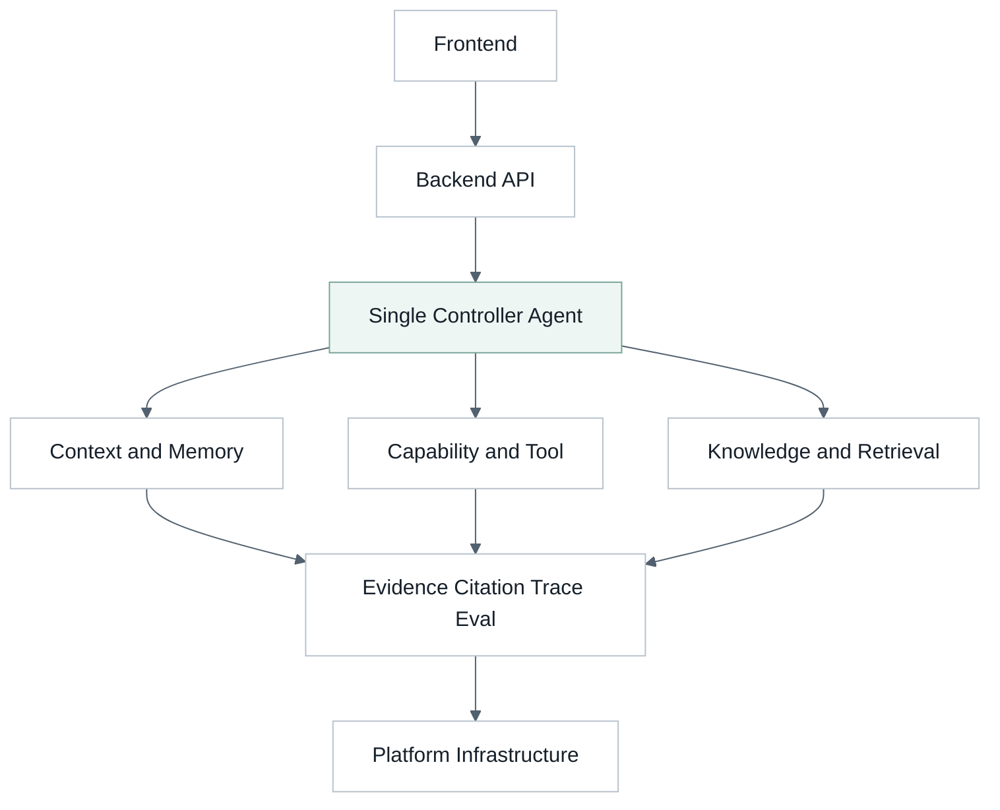
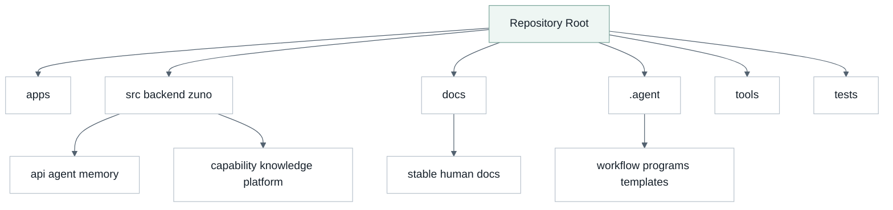
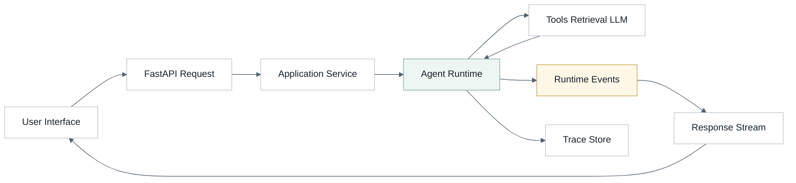
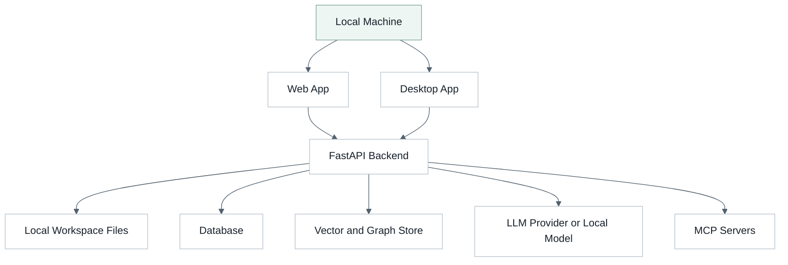
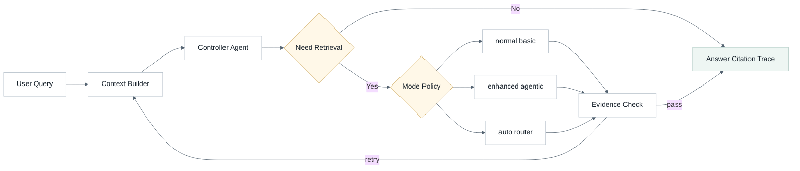
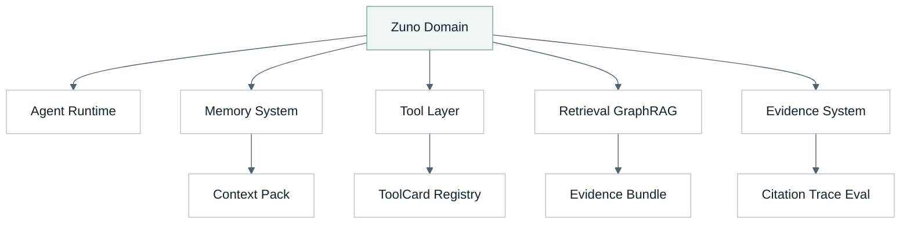
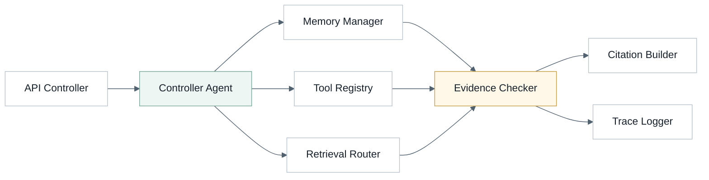
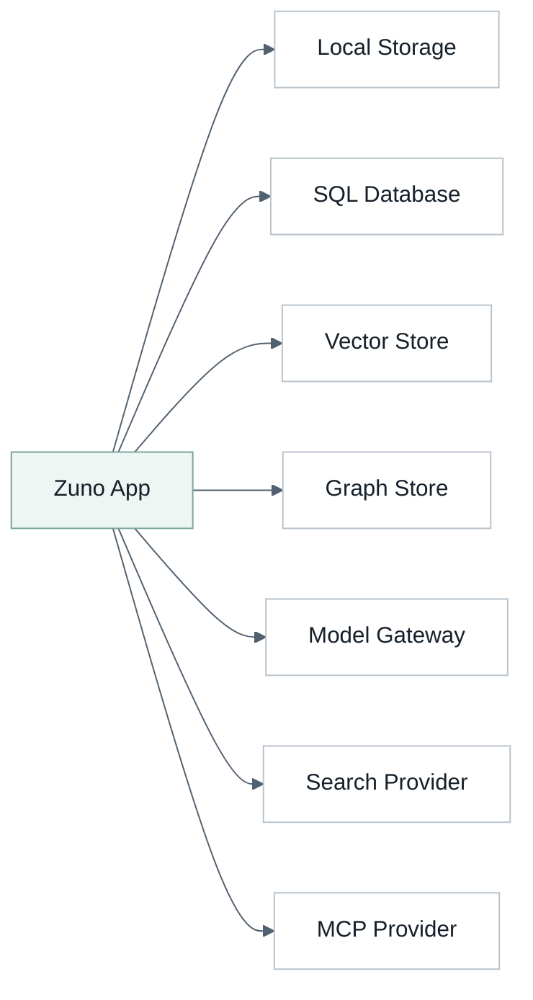
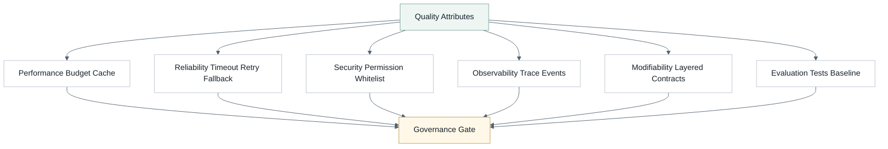
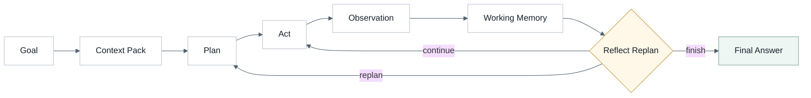

# Zuno 架构总览

> [!abstract] 定位
> Zuno 是本地优先的 Agent Workspace。本文用 **4+1 View Model**、**View & Beyond** 和 **Agent Loop 专题图**说明 Agentic RAG 与 GraphRAG 目标架构。

正式事实以 [[architecture/current-architecture|当前架构]] 为准。近期目标以 [[architecture/target-architecture|目标架构]] 为准。执行计划进入 `.agent/programs/`。

本文件是 Mermaid 源和 Obsidian 版架构总览。展示页由以下命令生成：

```powershell
python tools/agent/render_architecture.py --write
python tools/agent/render_architecture.py --check
```

## 一、4+1 View Model

4+1 从五个角度解释同一个系统：Logical、Development、Process、Physical 和 Scenarios。Process View 关注运行时进程、通信、并发和事件流；Agent Loop 是 Zuno 的核心内部循环，但不等同于整个 Process View。

### Logical View

该图回答：Zuno 的核心职责如何分层。

#### 图



#### 分析

- 关注点：系统职责，而不是物理目录。
- Zuno 映射：默认主线是 Single Controller Agent。
- 边界：Memory、Tool、Knowledge 是能力层，不是默认多 Agent runtime。

### Development View

该图回答：代码、正式文档和 Agent 工作流如何组织。

#### 图



#### 分析

- 关注点：开发者如何进入项目。
- Zuno 映射：docs 保持少而精，.agent 承载高频变化的执行设计。
- 边界：展示页只有 docs/architecture.html；.agent 不再保存架构 HTML。

### Process View

该图回答：一次请求在运行时如何经过同步入口、异步能力和观测链路。

#### 图



#### 分析

- 关注点：运行时控制流、事件流和外部调用。
- Zuno 映射：Process View 覆盖 API、Agent runtime、工具调用、检索和 trace。
- 边界：Agent Loop 是 runtime 内部循环，单独放在第三章。

### Physical View

该图回答：Zuno 在本地优先部署中连接哪些节点。

#### 图



#### 分析

- 关注点：部署节点和外部依赖。
- Zuno 映射：本地文件、数据库、向量/图存储、模型 provider 和 MCP 都是可替换边界。
- 边界：近期仍是模块化单体，不是微服务拆分。

### Scenarios View

该图回答：用户 query 如何被验证为一个完整场景。

#### 图



#### 分析

- 关注点：用场景验证架构。
- Zuno 映射：Agent 可决定是否检索，以及使用 normal、enhanced 或 auto。
- 边界：auto 是 router，不是第五种检索算法。

## 二、View & Beyond

View & Beyond 以 view 为架构文档组织单位。这里采用四个工程化视图：Logical、Component-and-Connector、Deployment 和 Quality。

### V&B Logical View

该图回答：领域子系统如何组成一个 Agent Workspace。

#### 图



#### 分析

- 关注点：领域对象和职责。
- Zuno 映射：Runtime、Memory、Tool、Retrieval、Evidence 是稳定概念。
- 边界：GraphRAG 补充 BM25 和向量检索，不替代它们。

### Component-and-Connector View

该图回答：运行时组件如何连接和通信。

#### 图



#### 分析

- 关注点：组件和连接器。
- Zuno 映射：控制由 Agent 集中，能力通过 registry、router 和 checker 进入结果。
- 边界：WebSocket 或 SSE 是事件通道，不是架构真相来源。

### V&B Deployment View

该图回答：工程部署时哪些资源应保持可替换。

#### 图



#### 分析

- 关注点：软件元素到运行环境的映射。
- Zuno 映射：Provider 是边界，核心 runtime 不绑定单一 vendor。
- 边界：Tavily、RAGFlow、MySQL 可以作为集成参考，不写死为唯一实现。

### Quality View

该图回答：质量属性通过哪些机制落地。

#### 图



#### 分析

- 关注点：性能、可靠性、安全、可观测性、可修改性和评测。
- Zuno 映射：Trace、Eval、Evidence、permission、budget 和 verifier 共同约束质量。
- 边界：异常捕获不是熔断；熔断必须有阈值、状态和降级策略。

## 三、Agent Loop 专题图

Agent Loop 是 Zuno 的核心运行范式。它属于 Process View 的内部细化，但不代表整个 Process View。

### Agent Loop View

该图回答：主控 Agent 如何计划、执行、观察和重规划。

#### 图



#### 分析

- 关注点：Agent 内部决策循环。
- Zuno 映射：Plan、Act、Observation、Working Memory、Reflection 共同形成可追踪执行。
- 边界：Reflection 是门控动作，不是每一步强制执行。

## 边界

> [!warning] Current / Target 边界
> 本文是 Target 架构说明，不声称所有能力已经完成。Current 只写入有代码、测试、trace、eval 或可复现结果证明的事实。

- 产品模式：normal、enhanced、auto。
- 内部 query method：basic、local、global、drift。
- Global 不和 BM25 chunk ranking 生硬混榜；它更适合作为 community-level prior，再由 local/basic 回补 supporting evidence。
- PHASE08 当前已证明 extractor config contract、query method / citation / retrieval fusion trace contract 和 global community-only prior 边界；完整 LLM extraction、RRF/rerank 治理仍是 Target。
- Domain Pack 只允许作为历史或兼容语境出现，不进入 Current 或 Target 主线图。
