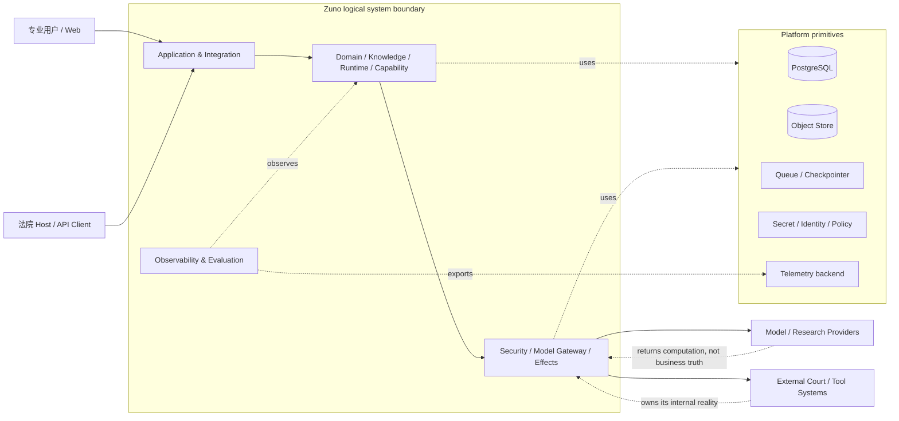
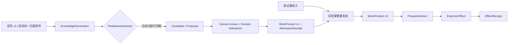
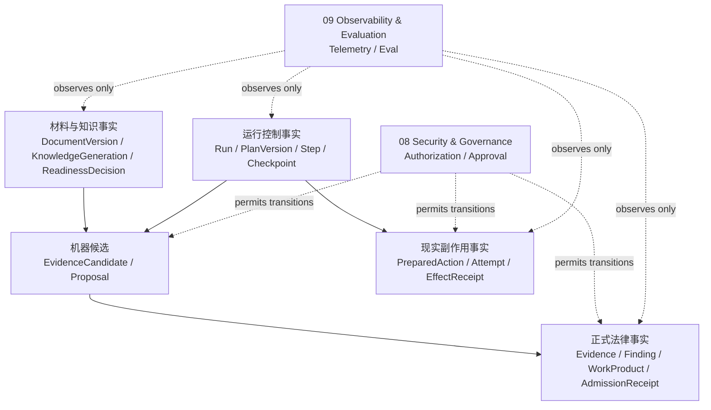
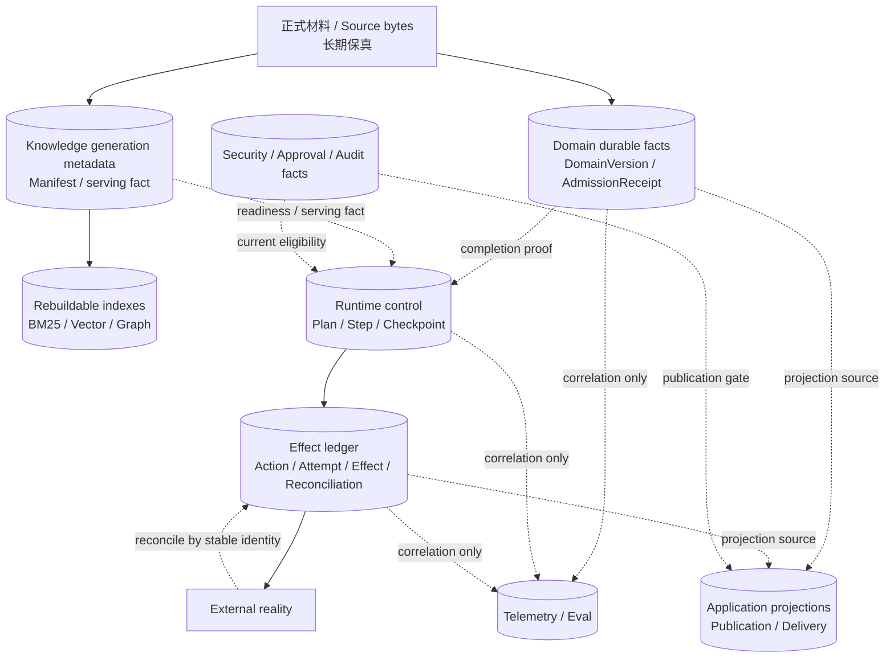
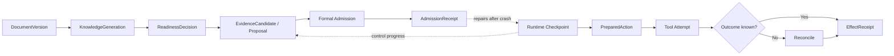
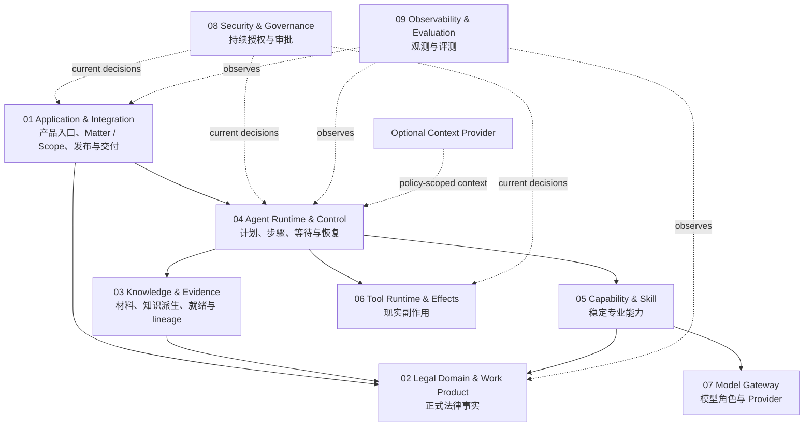
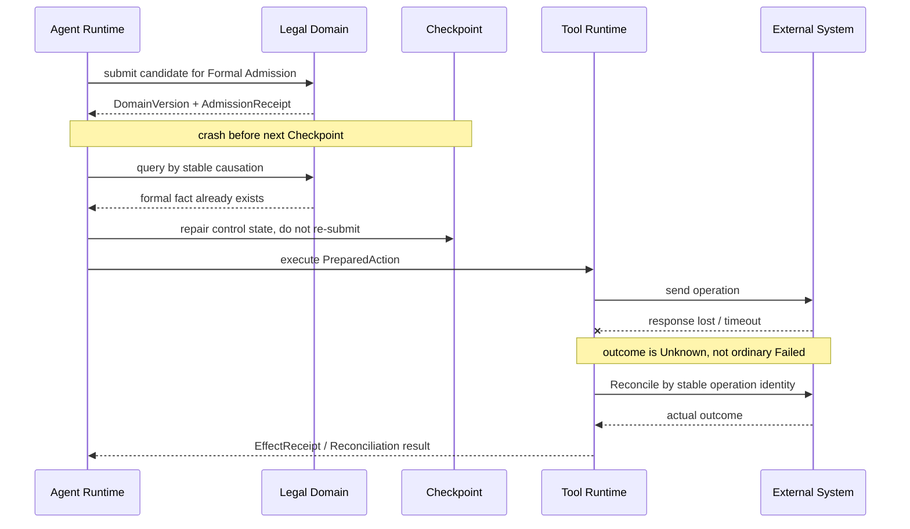
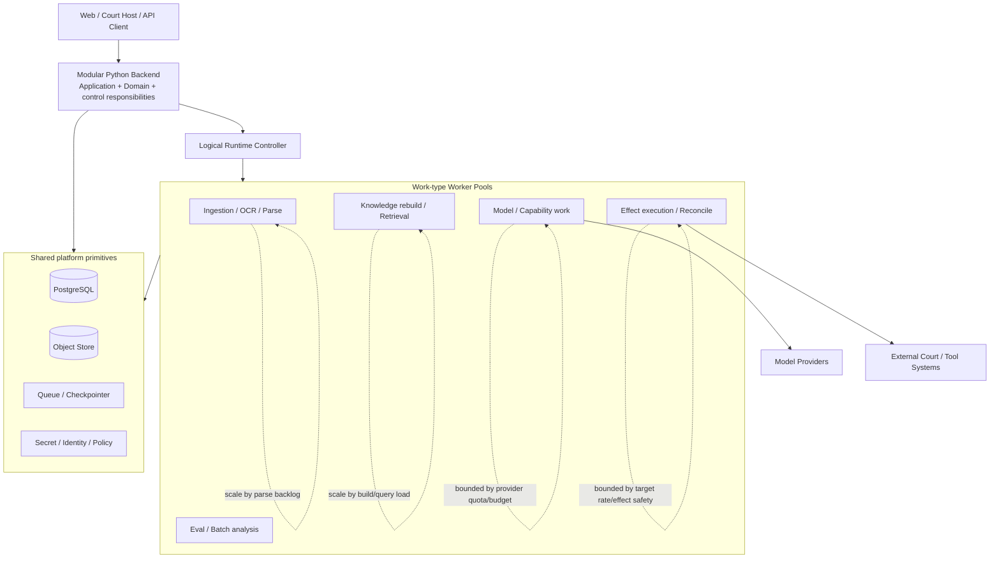
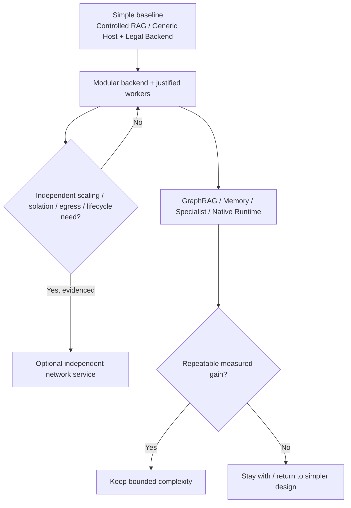

# Zuno Architecture Views

本文件只提供 `architecture.md` 的视觉补充。图中的边界和箭头用于帮助理解整体关系，不引入第二套架构事实。

updated: 2026-09-11
status: normative-target-visual-source
text_design_source: `docs/architecture/architecture.md`

## System Context View

Zuno 位于调用者、可替换计算 Provider、外围现实系统和平台基础设施之间。外部输入首先是 assertion / observation；模型结果不是正式业务事实，HTTP timeout 也不是远端现实失败证明。Platform 提供物理机制，不因此拥有法律业务完成语义。

## Case Timeline View

## Fact Authority View

## State / Persistence / Consistency View

Owner 内部使用自己的事务、version / CAS 和完成证明保护强一致；跨 Owner 默认不做全局 2PC。Projection 可以落后并被修复，外部现实不确定时必须保留 Unknown 并 Reconcile。Knowledge index 可重建，不代表 serving pointer 可以指向半成品。

## Boundary Transition View

## Responsibility View

## Recovery View

## Deployment / Scale / Backpressure View

默认不按九个责任域拆九个服务。扩容先看工作类型和真实瓶颈；`Single Controller` 是逻辑写者，不等于单机。入口、Runtime、Provider 和外部目标之间都需要显式 Backpressure，避免下游过载被放大成无界队列、费用或重复副作用。

## Deployment Evolution View

## 图的阅读边界

这些视图分别回答：Zuno 与外部世界的系统边界在哪里；一件案件怎样随时间变化；系统里有哪些不同事实；状态怎样落在不同耐久边界并在没有全局 2PC 的情况下收敛；哪些跨边界转换需要更强证明；九个责任域怎样协作；两个关键故障窗口怎样恢复；默认部署怎样按工作类型扩缩容并传播 Backpressure；复杂度和服务拆分什么时候应该升级或退回。

模块内部状态、Contract、事务、幂等和故障注入继续由 `docs/modules/` 与相关 ADR 负责；实现是否成立由 `docs/evidence/` 证明。