# Zuno Architecture Visual Atlas Source

本图源展示 Python-only Target、FastAPI Application Interface、LangGraph orchestration provider、EvidenceRequirement、ConflictProposal、PostgreSQL Domain State 和 Runtime Checkpoint 的边界；这些图不把 Target 伪装成 Current。

updated: 2026-08-13
status: normative-target-visual-source
architecture_state: ACCEPTED_TARGET
text_design_source: `docs/architecture/architecture.md`
canonical_taxonomy_source: `docs/README.md` and `docs/decisions/0011-architecture-document-taxonomy.md`

本文件是总体架构的展示图源。服务、数据、状态和 Owner 事实以 `architecture.md` 与专题 Canonical 文档为准；本文件不创建第二套 Contract。

## 五层责任视图

下面五层用于帮助读者理解责任，不代表最终五个模块、五个服务或五个团队：

1. **Legal Work Surface**：案件分析、合同审查、法律研究、报告和 Human Review；
2. **Legal Domain & Intelligence**：Evidence、Fact / Event、Conflict、Finding、Version 和 Staleness；
3. **Agentic Knowledge & Context**：Ingestion、Hybrid Retrieval、条件 Graph、Citation 和 Memory；
4. **Agent Runtime & Execution**：Single Controller、Plan、受控 Worker、Model、Skill 和 Tool；
5. **Trust & Platform Engineering**：Permission、Approval、Sandbox、Audit、Observability、Eval 和 Infrastructure。

`FINAL_MODULE_COUNT: NOT_DECIDED`。Logical Capability、Physical Service、Worker、Process、Container、Database 和 Team 不做一一映射。

## Product Context

### Product Context View

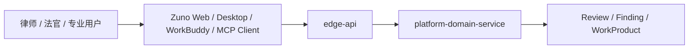

### Business Flow View

```mermaid
flowchart LR
  M[Create Matter] --> D[Upload DocumentVersion]
  D --> S[Domain Snapshot / DomainVersion]
  S --> A[Agent Coordinator + PlanVersion]
  A --> G[Evidence / Security / Budget Gate]
  G --> K[Retrieval / Memory / Capability / Tool Proposal]
  K --> P[Domain Proposal + Evidence lineage]
  P --> V[Domain Owner validation/version]
  V --> F[Finding + Human Review]
  F --> W[WorkProduct / Response]
```

## Logical Architecture

### Logical Capability View

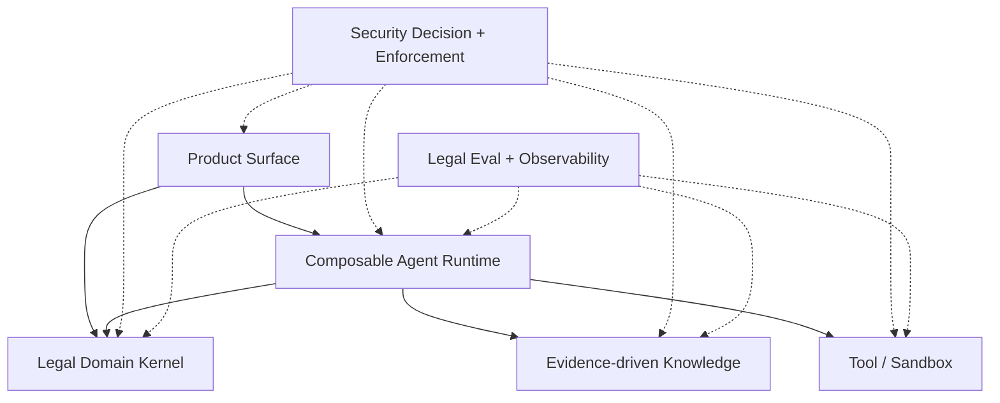

### Provider Boundary View

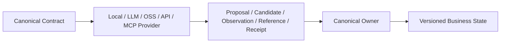

## Legal Domain

### Domain State View

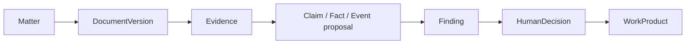

### Staleness and Review View

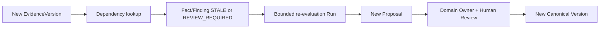

## Multi-Agent Runtime

### Agent Runtime View

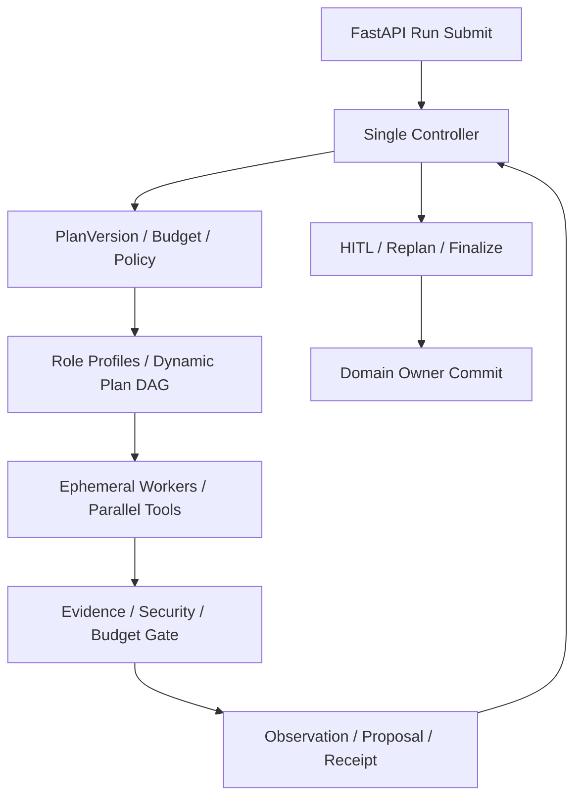

### Runtime and Domain State View

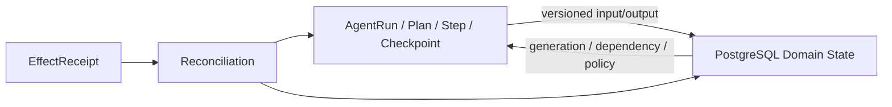

## Microservice and Deployment

### Microservice View

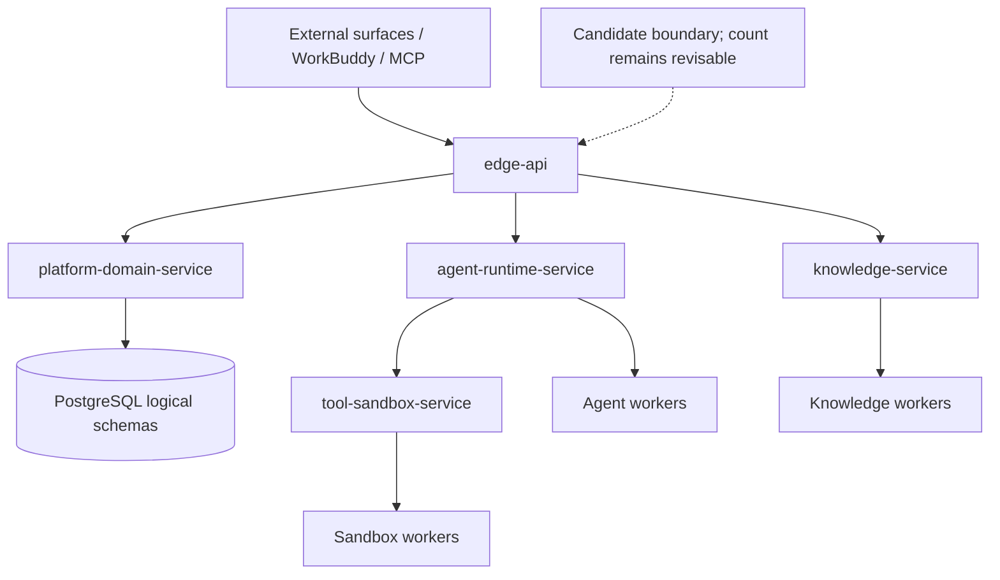

### Deployment Profiles View

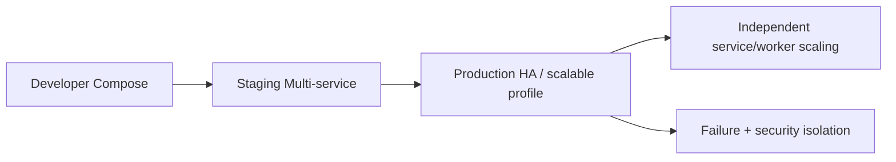

## Data and Recovery

### Data Ownership View

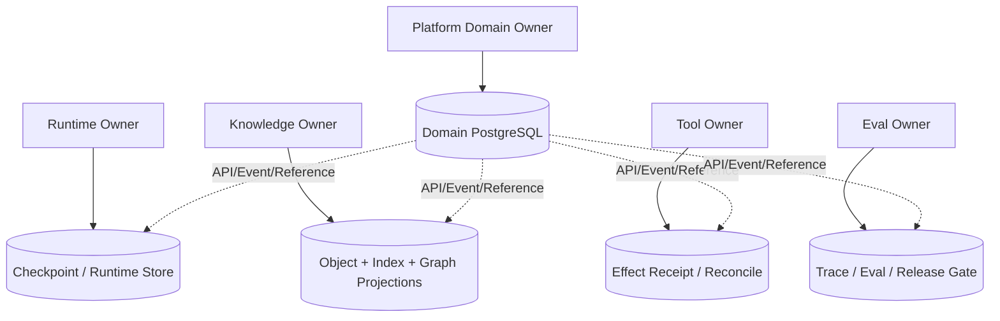

### Failure and Recovery View

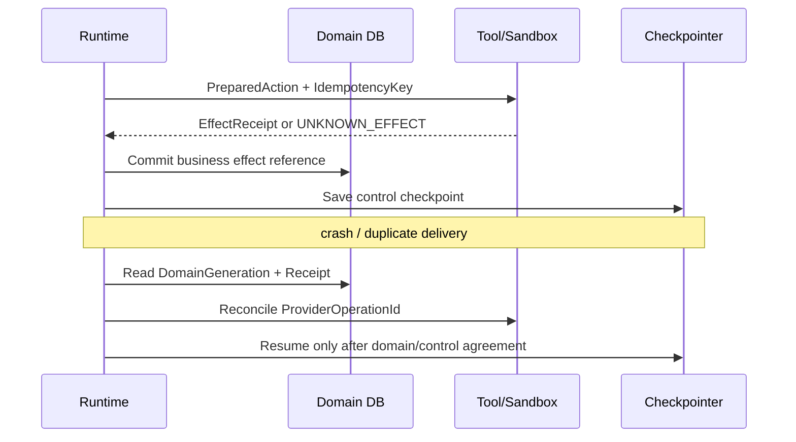

## Quality and Security

### A/B/C Eval View

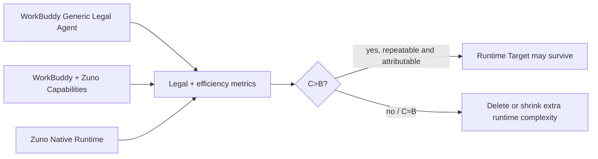

### Security Verification View

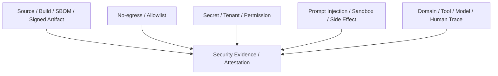
