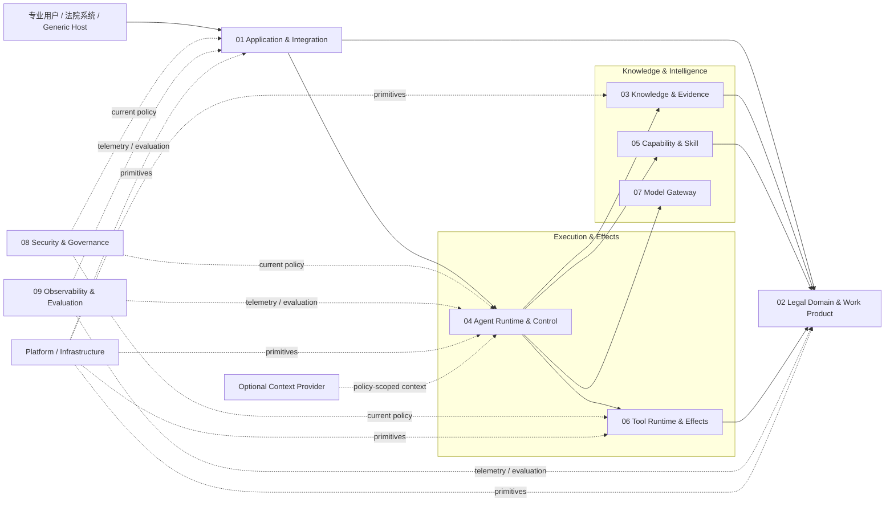
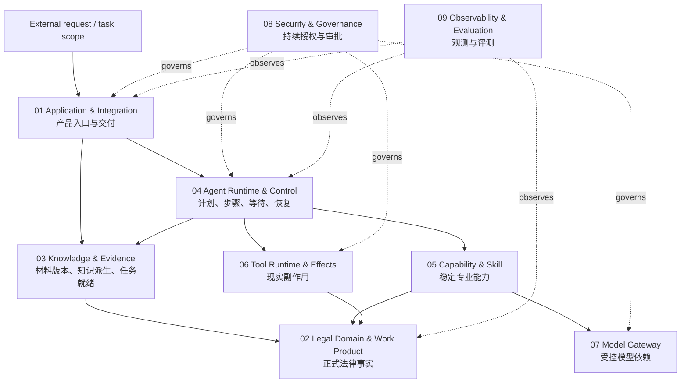
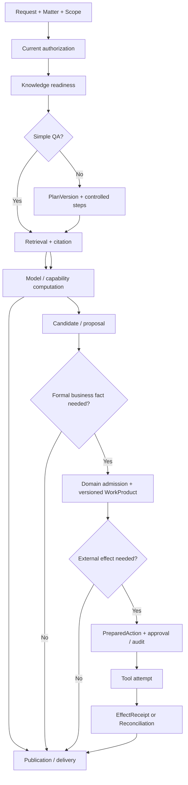
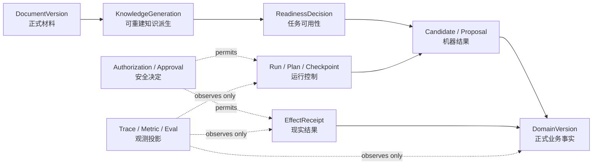
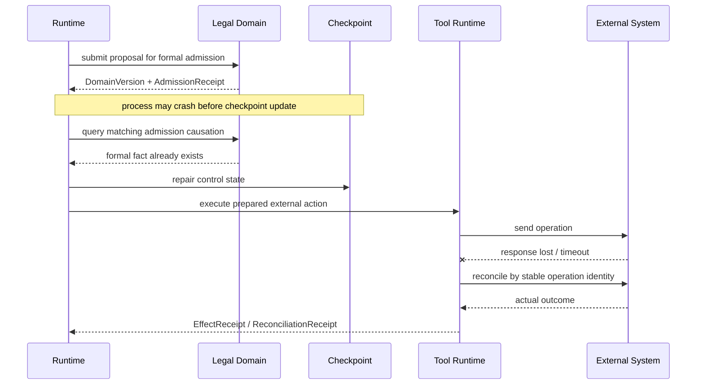
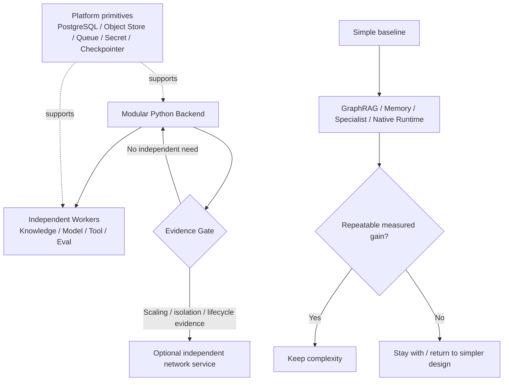

# Zuno Architecture Views

本文件只提供 `architecture.md` 的视觉补充。图中的边界和箭头用于帮助理解整体关系，不引入第二套架构事实。

updated: 2026-09-02
status: normative-target-visual-source
text_design_source: `docs/architecture/architecture.md`

## System Context View

## Responsibility View

## Task Flow View

## Authority and State View

## Recovery View

## Deployment and Evolution View

## 图的阅读边界

这些图只表达总体关系。九个责任域的内部状态、Contract、事务、幂等和故障注入设计继续由 `docs/modules/` 与相关 ADR 负责；实现是否成立由 `docs/evidence/` 证明。
