# Zuno Architecture Visual Atlas Source

本图源展示 Python-only Target、10 个逻辑模块候选、模块化 Backend + Worker 默认起点、Evidence-gated Physical Service Split、Research → Capability → Domain Result、Native / Embedded Product Mode、FastAPI Application Interface、LangGraph orchestration provider、OTel-compatible Observability Contract、EvidenceRequirement、ConflictProposal、PostgreSQL Domain State 和 Runtime Checkpoint 的边界；这些图不把 Target 伪装成 Current。

updated: 2026-08-14
status: normative-target-visual-source
architecture_state: ACCEPTED_TARGET
text_design_source: `docs/architecture/architecture.md`
canonical_taxonomy_source: `docs/README.md` and `docs/architecture/README.md`

本文件是总体架构的展示图源。服务、数据、状态和 Owner 事实以 `architecture.md` 与专题 Canonical 文档为准；本文件不创建第二套 Contract。

## Responsibility Lens 与 10 个候选模块

下面五层用于帮助读者理解跨层责任，不代表最终五个模块、五个服务或五个团队。10 个模块图也是 Candidate Map，不是冻结后的模块或服务清单：

1. **Legal Work Surface**：案件分析、合同审查、法律研究、报告和 Human Review；
2. **Legal Domain & Intelligence**：Evidence、Fact / Event、Conflict、Finding、Version 和 Staleness；
3. **Agentic Knowledge & Context**：Ingestion、Hybrid Retrieval、条件 Graph、Citation 和 Memory；
4. **Agent Runtime & Execution**：Single Controller、Plan、受控 Worker、Model、Skill 和 Tool；
5. **Trust & Platform Engineering**：Permission、Approval、Sandbox、Audit、Observability、Eval 和 Infrastructure。

`NEW_10_MODULE_SET: CANDIDATE_ONLY`、`FINAL_MODULE_COUNT: NOT_FROZEN`、`MODULE_DECOMPOSITION_GATE: NOT_OPEN`。Logical Capability、Physical Service、Worker、Process、Container、Database 和 Team 不做一一映射。

## Product Context

### Product Context View

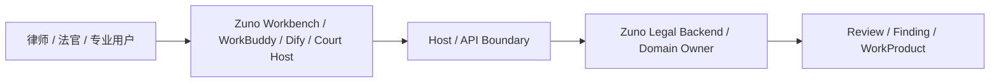

### Business Flow View

```mermaid
flowchart TB
  subgraph A[FLOW A — Simple Grounded QA]
    AQ[Question / Scope] --> AR[Authorization + Knowledge Readiness]
    AR --> AE[Retrieve Evidence / Citation]
    AE --> AG[Deterministic Final Gate]
    AG --> AO[Response]
  end
  subgraph B[FLOW B — Complex Legal Analysis]
    BM[Matter / Version Set] --> BR[Readiness + Continuous Authorization]
    BR --> BP[Dynamic DAG Plan]
    BP --> BC[Retrieval / Capability / optional Specialist]
    BC --> BJ[Join / Evaluation / Synthesis]
    BJ --> BD[Domain Admission / Human Review]
    BD --> BW[Versioned WorkProduct]
  end
  subgraph C[FLOW C — Controlled External Effect]
    CT[Tool Proposal] --> CP[PreparedAction]
    CP --> CG[Security / Approval Gate]
    CG --> CE[Execute / EffectReceipt]
    CE --> CR[Reconcile if Unknown]
    CR --> CF[Final Gate / Domain Result]
  end
```

## Logical Architecture

### Logical Capability View

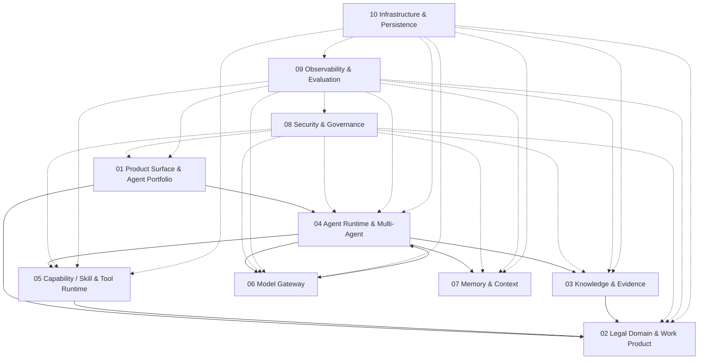

### Provider Boundary View

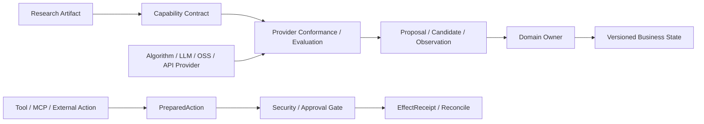

## Legal Domain

### Domain State View

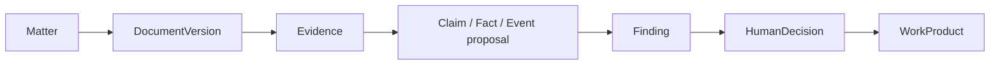

### Staleness and Review View

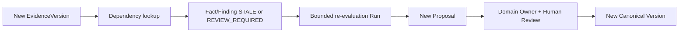

## Multi-Agent Runtime

### Agent Runtime View

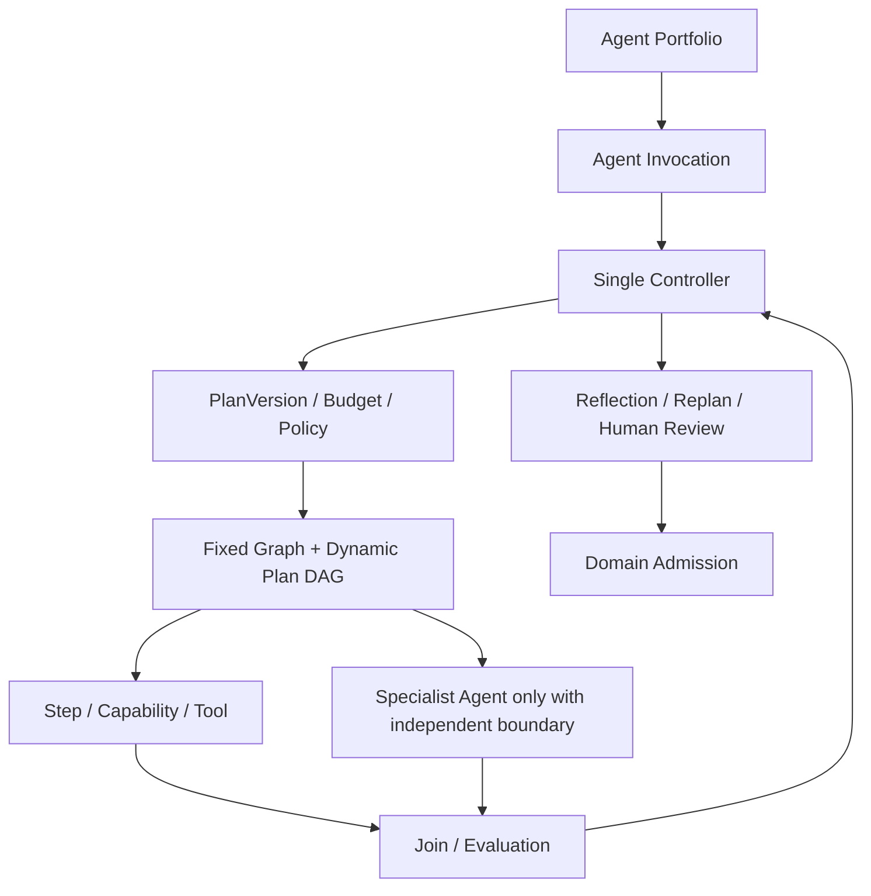

### Runtime and Domain State View

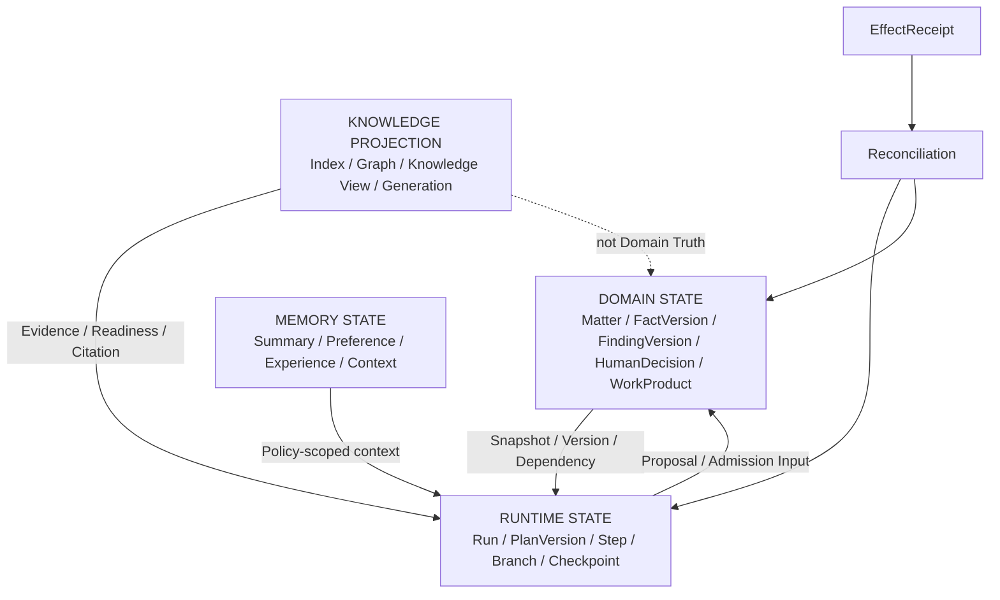

## Physical Deployment and Service Split

### Physical Deployment Decision View

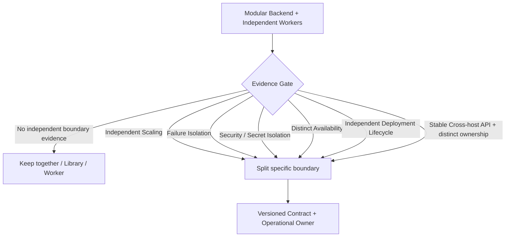

### Deployment Profiles View

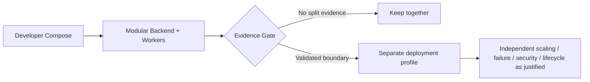

## Data and Recovery

### Data Ownership View

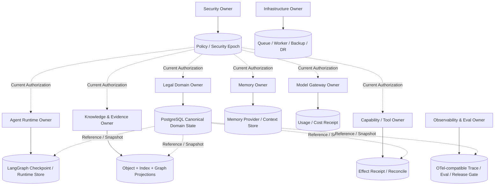

### Failure and Recovery View

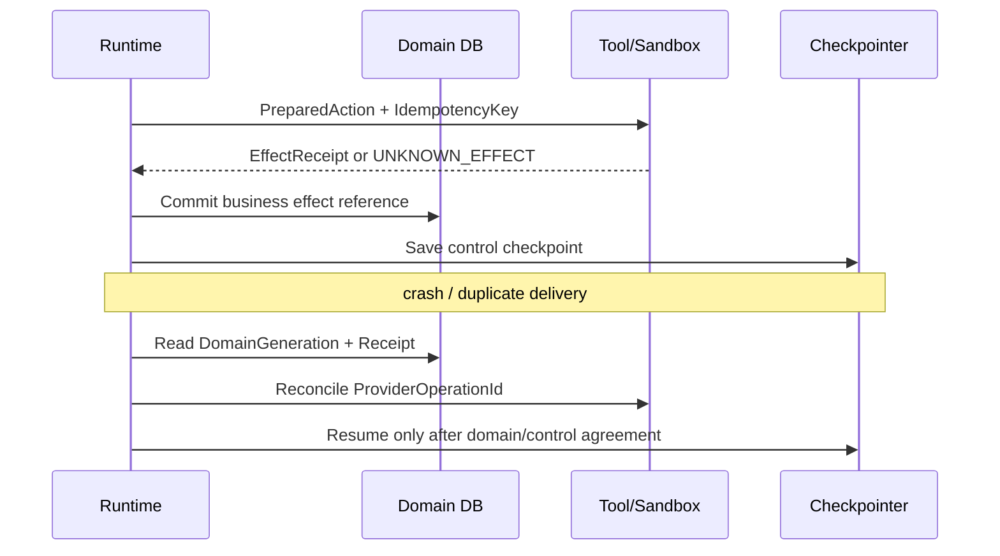

## Quality and Security

### A/B/C Eval View

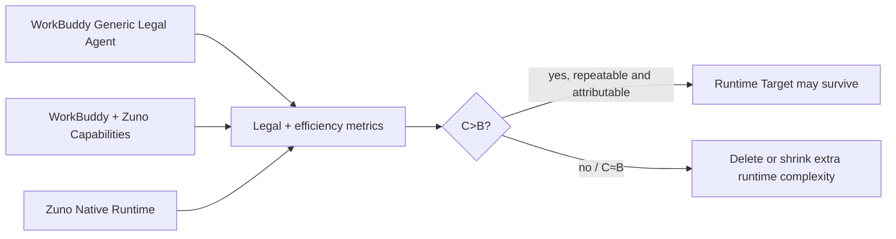

### Security Verification View

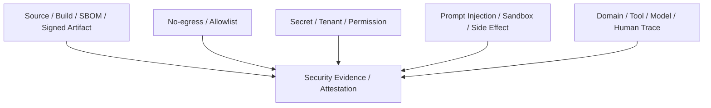
