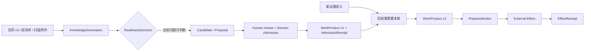
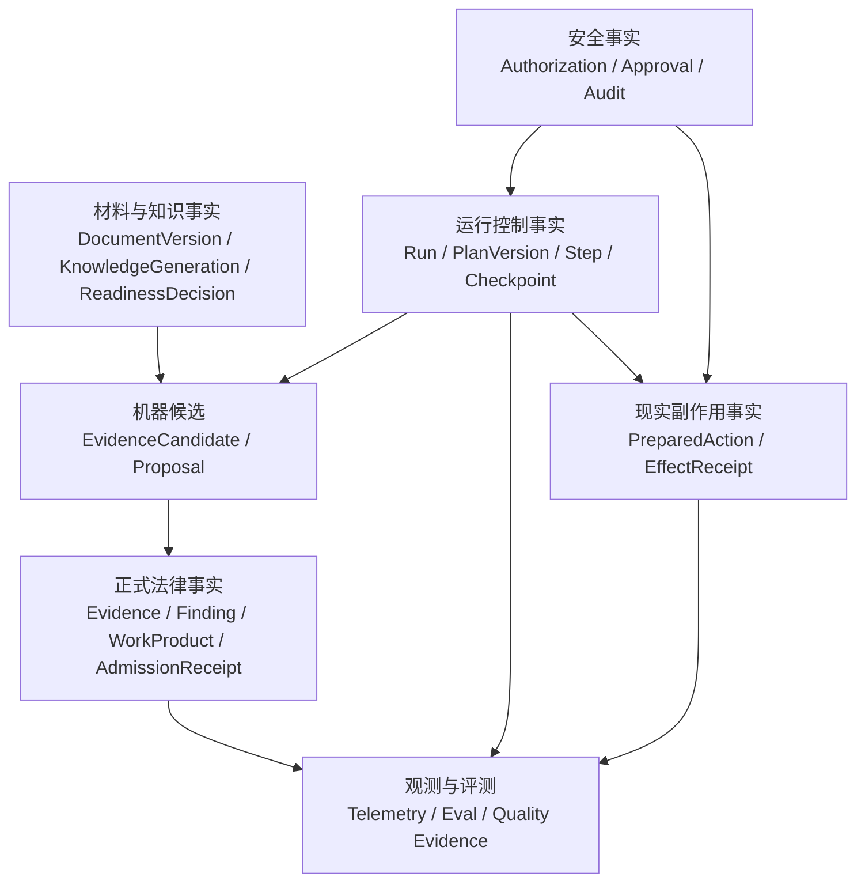
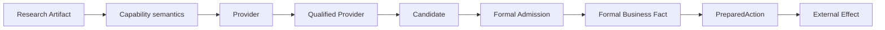
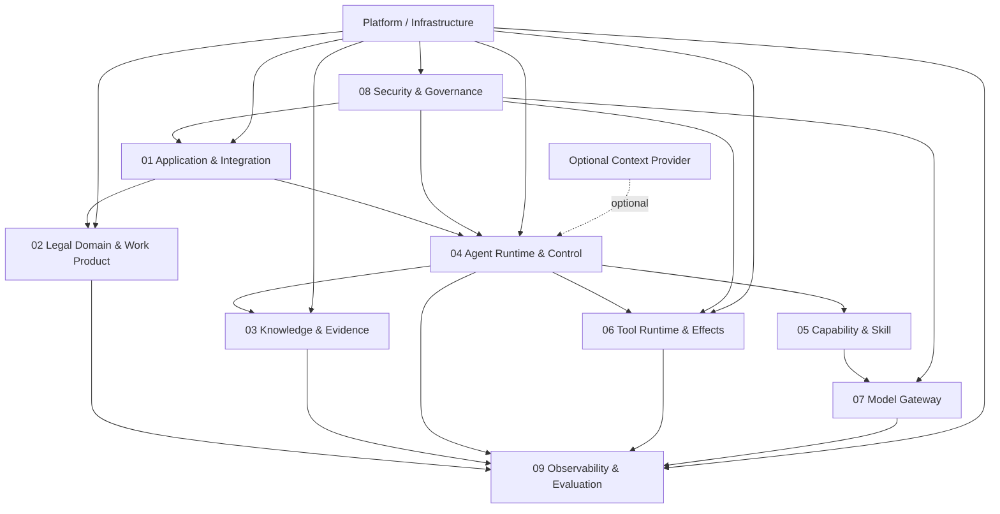
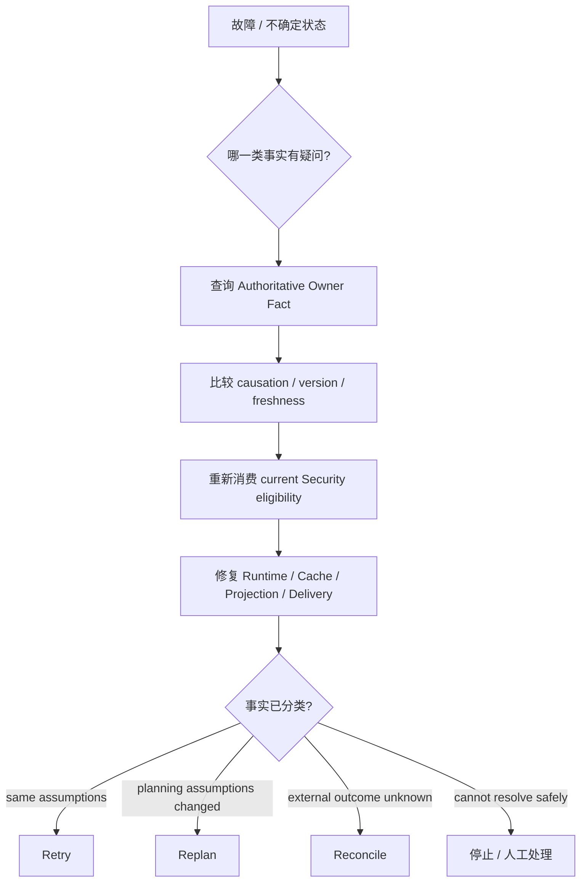
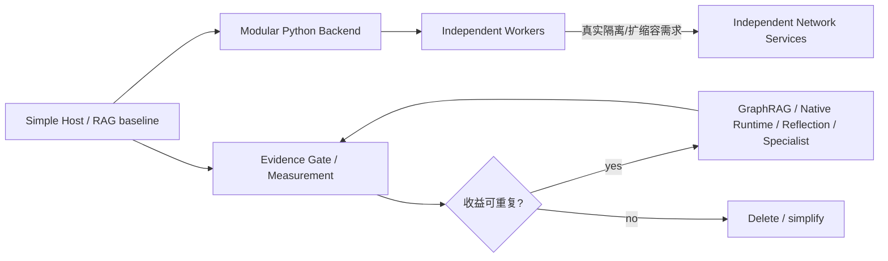

# Zuno Architecture Views

本文件只提供 `architecture.md` 的视觉补充。图中的边界和箭头用于帮助理解整体关系，不引入第二套架构事实。

updated: 2026-09-10
status: normative-target-visual-source
text_design_source: `docs/architecture/architecture.md`

## Case Timeline View

## Fact Authority View

## Boundary Transition View

## Responsibility View

## Recovery View

## Deployment and Evolution View

