# Zuno Architecture Visual Atlas Source

本文件是 `docs/architecture/architecture.md` 的图源配对。它把九个逻辑责任域、Platform / Infrastructure Responsibility Layer、Optional Context Provider 和三条代表性业务流画出来；它不拥有第二套架构事实，也不把 Target 伪装成 Current。图源对应 Python-only Target、FastAPI Application Interface、LangGraph Control Provider、PostgreSQL Domain Store、Independent Workers 和 OTel-compatible Evaluation boundary。

updated: 2026-08-15
status: normative-target-visual-source
architecture_state: ACCEPTED_TARGET
text_design_source: `docs/architecture/architecture.md`
canonical_taxonomy_source: `docs/architecture/README.md` and `docs/decisions/0013-round-02-responsibility-taxonomy.md`

## Product and Business Flows

### Product Context View

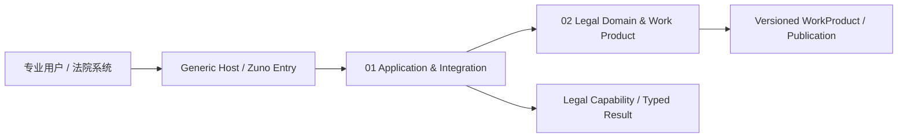

### Business Flow View

```mermaid
flowchart TB
  subgraph A[Simple QA — Host-owned path is allowed]
    AQ[Question + material scope] --> AR[Authorization + Readiness]
    AR --> AE[Source retrieval + citation]
    AE --> AF[Answer eligibility / publication]
  end
  subgraph B[Complex Legal Analysis]
    BM[Matter + document versions] --> BP[Bounded plan / capability]
    BP --> BE[Evidence + proposal]
    BE --> BA[Admission + WorkProduct]
  end
  subgraph C[Controlled External Effect]
    CT[Tool proposal] --> CP[PreparedAction + approval]
    CP --> CE[Execute + EffectReceipt]
    CE --> CR[Reconcile unknown outcome]
  end
```

## Responsibility Taxonomy

### Logical Capability View

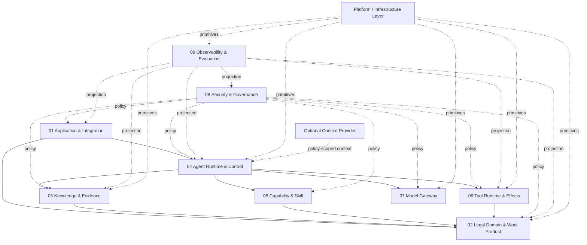

### Provider Boundary View

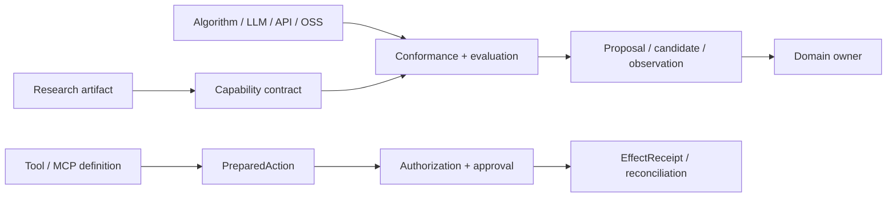

## Domain and Control State

### Domain State View

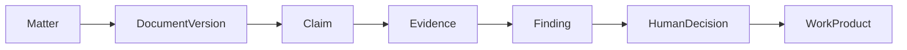

### Staleness and Review View

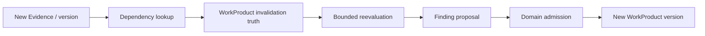

## Agent Runtime and Control

### Agent Runtime View

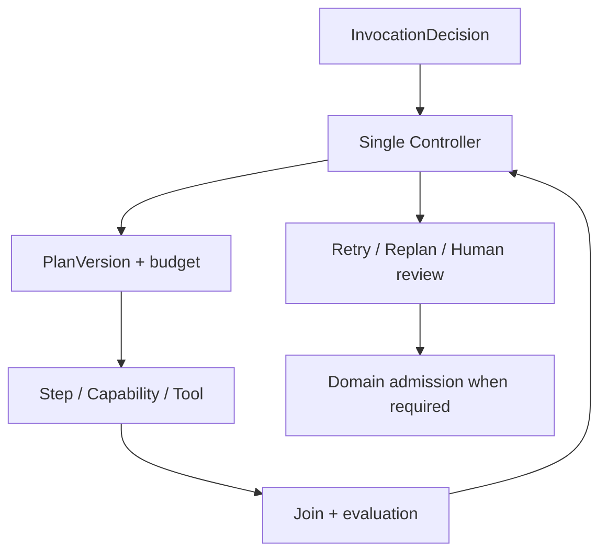

### Runtime and Domain State View

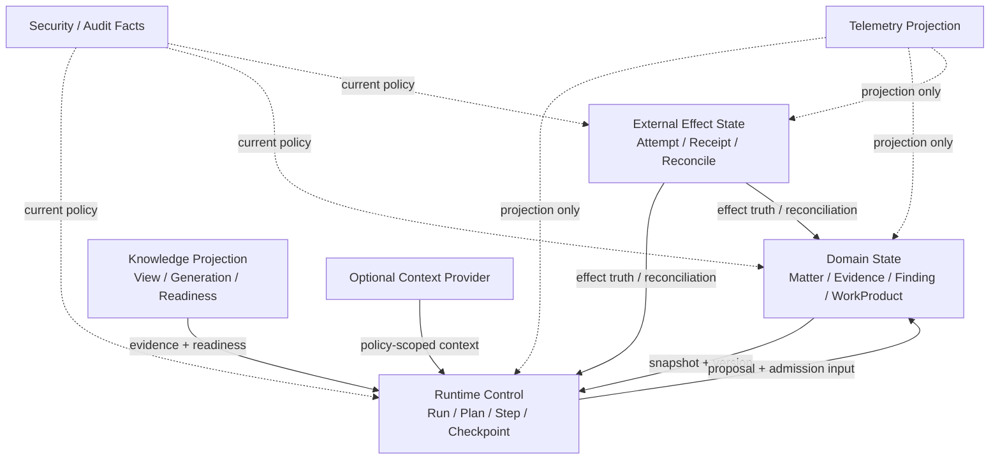

## Deployment

### Physical Deployment Decision View

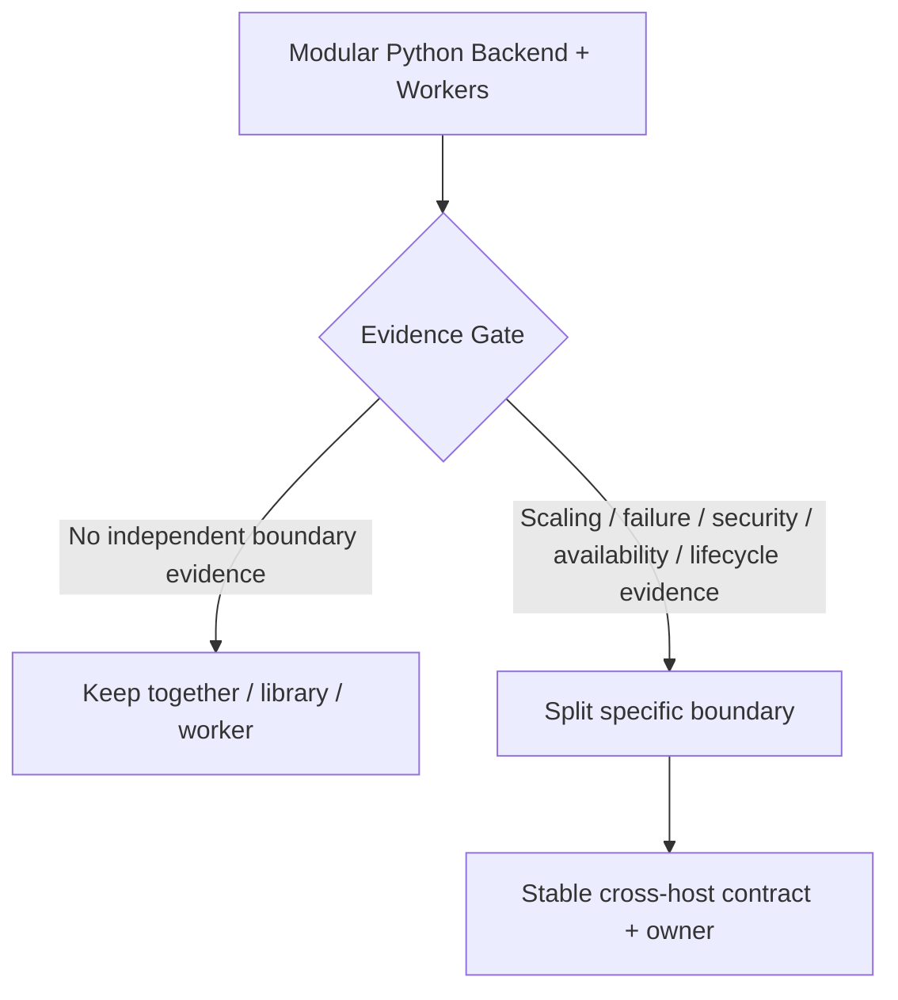

### Deployment Profiles View

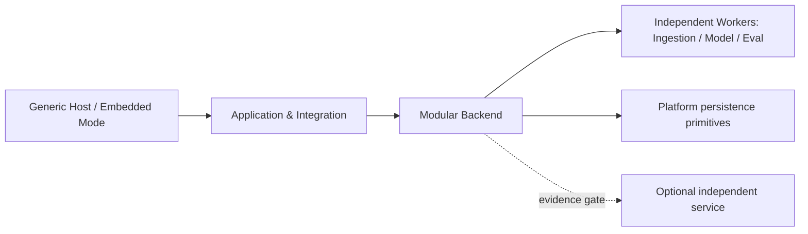

## Data and Recovery

### Data Ownership View

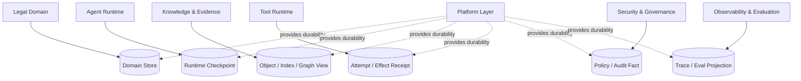

### Failure and Recovery View

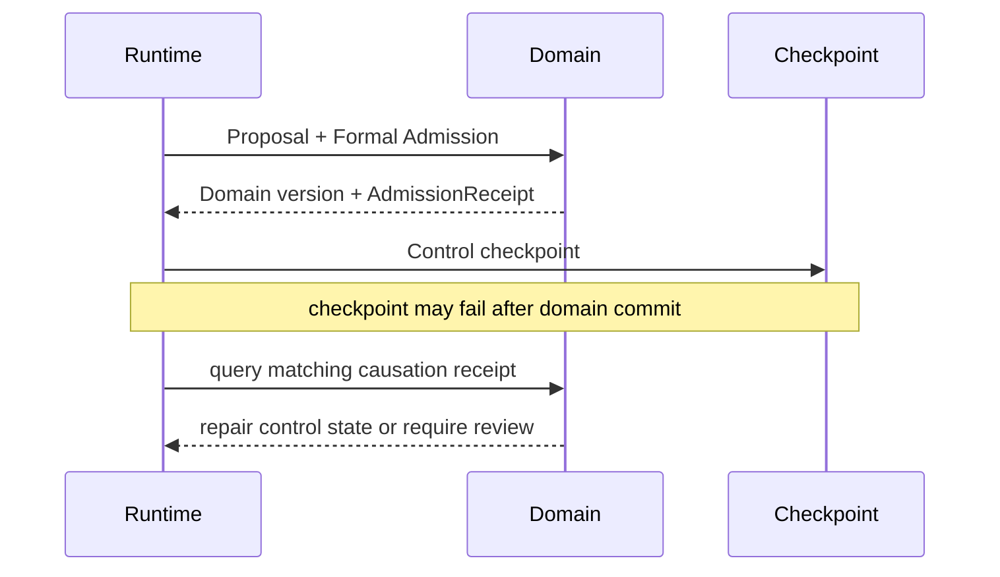

## Quality and Security

### A/B/C Eval View

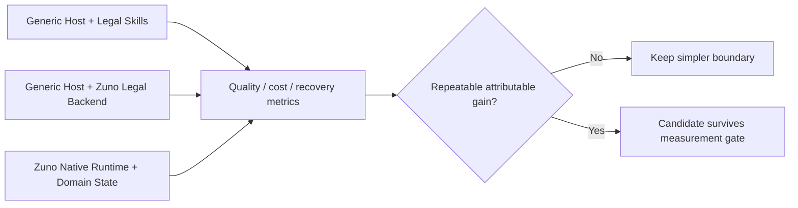

### Security Verification View

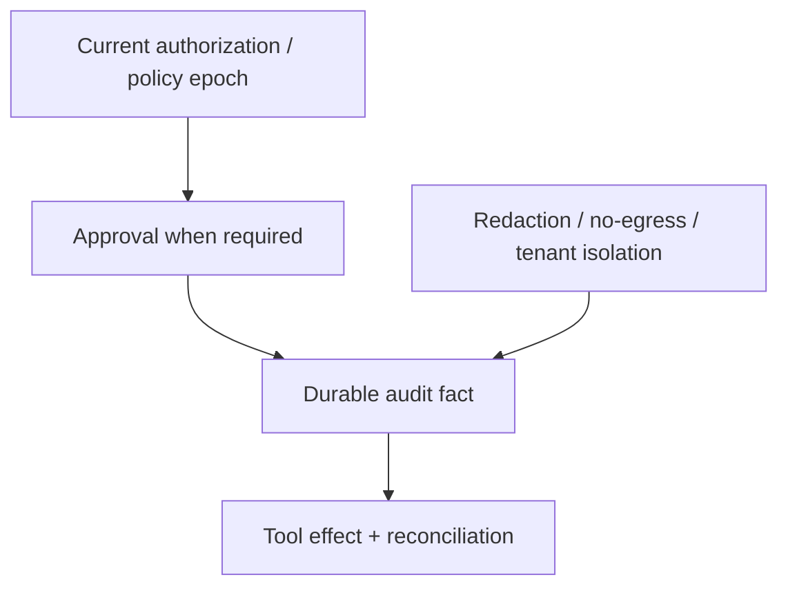

## 图源边界

每张图只表达一个主要关系，通常保持在 5–12 个节点。具体 Contract、状态枚举和证据要求以 `architecture.md` Part B 与 ADR 为准；`architecture.html` 由本图源动态展示，不维护第二套 Mermaid 内容。
