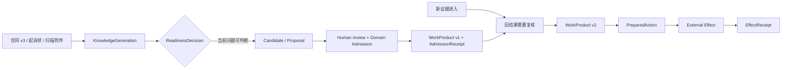
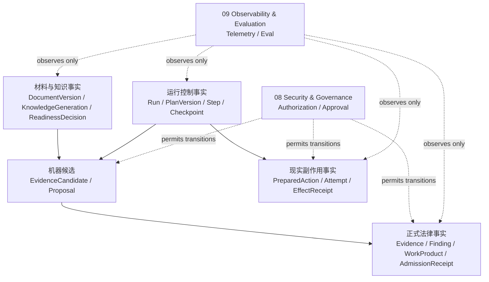
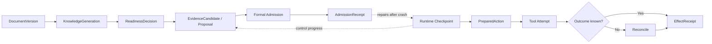
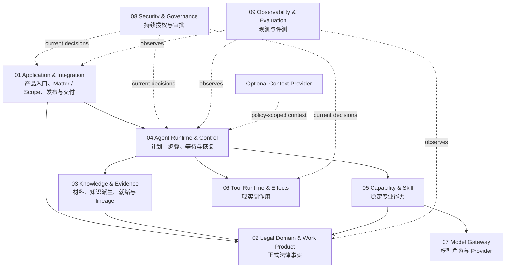
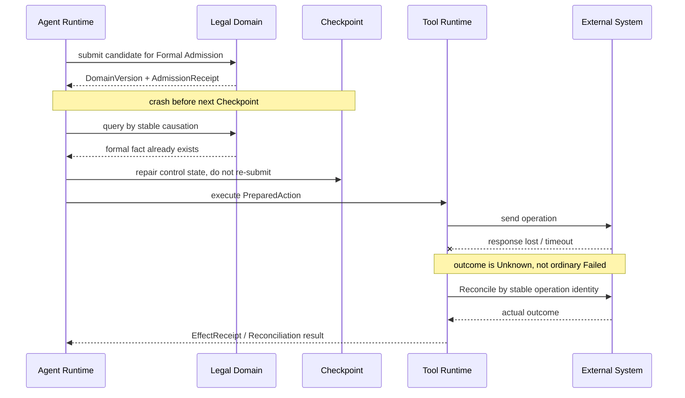
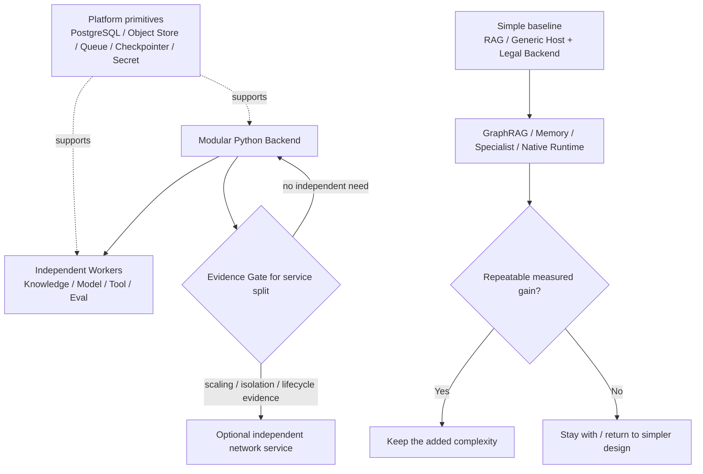

# Zuno Architecture Views

本文件只提供 `architecture.md` 的视觉补充。图中的边界和箭头用于帮助理解整体关系，不引入第二套架构事实。

updated: 2026-09-02
status: normative-target-visual-source
text_design_source: `docs/architecture/architecture.md`

## Case Timeline View

## Fact Authority View

## Boundary Transition View

## Responsibility View

## Recovery View

## Deployment and Evolution View

## 图的阅读边界

六张图分别回答：一件案件怎样随时间变化；系统里有哪些不同事实；哪些跨边界转换需要更强证明；九个责任域为什么存在；两个关键故障窗口怎样恢复；复杂度和部署什么时候应该升级或退回。

模块内部状态、Contract、事务、幂等和故障注入继续由 `docs/modules/` 与相关 ADR 负责；实现是否成立由 `docs/evidence/` 证明。
