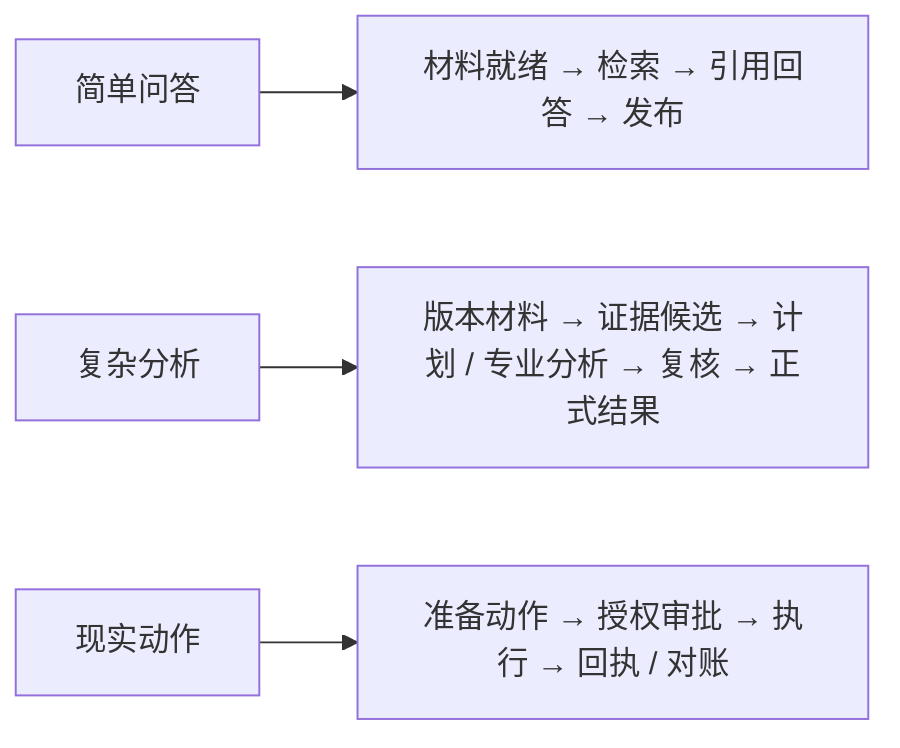
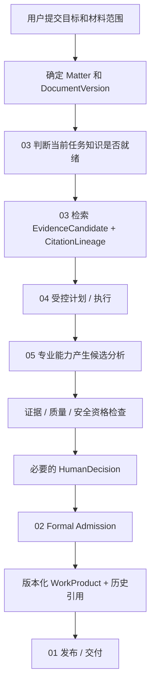
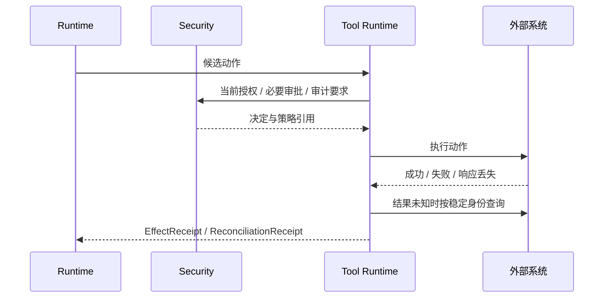
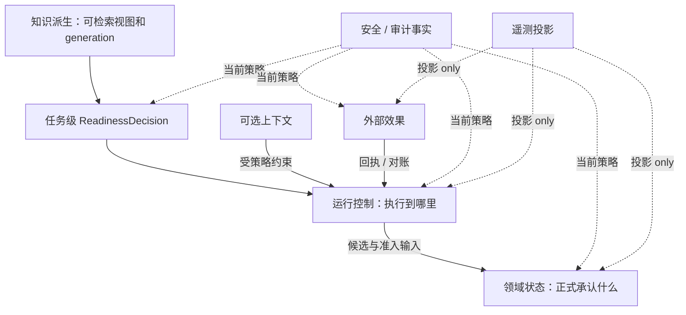
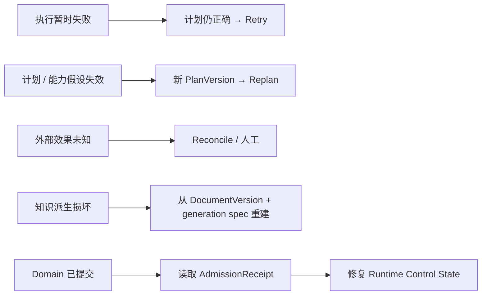

# Zuno 总体 Target 架构

Zuno 面向智慧司法和法律专业工作，目标是把材料、证据、专业分析、人工判断、正式工作成果和受控外部动作组织成一条可追溯、可复核、可恢复的工作链。它不是为了“做 Agent”而给普通 RAG 叠加更多框架，而是解决复杂法律任务里几个普通问答系统很难长期回答的问题：依据的是哪一版材料，结论为什么成立，新证据出现后旧结果是否仍有效，人工判断怎样进入正式结果，系统崩溃后哪些业务事实已经真正提交，以及外部动作到底有没有发生。

简单问题应该保持简单。对“合同第 8 条写了什么”这类任务，通用宿主加受控检索完全可能已经足够；只有当多材料版本、长期领域状态、人工复核、恢复或现实副作用确实带来额外要求时，Zuno 才引入更重的领域和运行机制。复杂度必须由任务和测量证明，而不是由架构图证明。

本文记录 **Target（目标架构）**，不把文档中的对象、Contract（契约）或状态自动写成 Current（当前实现），也不把 Pilot 写成 Production。Part A 面向人类读者解释问题、流程、边界和失败；Part B 面向实现、测试和审查给出精确 Ownership（事实所有权）、Contract、状态、恢复和持久化规则。项目故事见 [`docs/project/project.md`](../project/project.md)，Current 证据见 [`docs/evidence/`](../evidence/)，模块详细设计见 [`docs/modules/`](../modules/README.md)，架构审查历史见 [`docs/history/red-blue/`](../history/red-blue/README.md)。History 解释架构如何演进，但不重新拥有当前 Target 或 Current。

<!--
updated: 2026-08-16
status: normative-target
architecture_state: ACCEPTED_TARGET
architecture_revision: COMPLETED
architecture_revision_sha: 7ce987f5d747395d4926622f42ac4f0013bc53ed
canonical_revision_gate: PASS
overall_architecture_state: ROUND_02_FROZEN
target_logical_module_count: 9
final_module_count: 9
platform_infrastructure: RESPONSIBILITY_LAYER
context_provider: OPTIONAL
module_decomposition_gate: OPEN
module_design_baseline: AVAILABLE_V1
module_deep_design: AVAILABLE_V2
module_deep_design_coverage: 9/9
cross_module_consistency: AVAILABLE_V1
module_human_narrative: DEEPENED
module_detail_freeze: NOT_YET
implementation_authorization: NO
observability_architecture: OTEL_COMPATIBLE
langsmith_role: PREFERRED_AGENT_TRACE_AND_EVAL_PROVIDER
canonical_question: Zuno 如何把法律领域状态、证据、执行控制、安全和可验证交付组合成可恢复且可替换的 Target？
owner: Cross-cutting Architecture Owner
acceptance_scope: Round 02 Main Judgment 的 Canonical Revision；九模块已达到 Deep Design V2 / Cross-Module Consistency，并完成 Human-first 叙事深化；字段级 Detail Freeze、实现、测量和外部资格尚未完成
readability_state: HUMAN_FIRST_PART_A_AND_PART_B
canonical_taxonomy: docs/architecture/ 仅保存总体架构四文件；模块设计由 docs/modules/ 负责；项目事实由 docs/project/ 负责
current_state_source: docs/project/project.md 和 docs/evidence/
review_history_source: docs/history/red-blue/
decision_sources: docs/decisions/0003-wave1-cross-module-contract-freeze.md、0005-official-langgraph-postgres-checkpointer.md、0007-reuse-first-provider-boundary.md、0008-legal-domain-kernel-and-host-boundary.md、0012-evidence-gated-physical-service-split.md、0013-round-02-responsibility-taxonomy.md、0014-round-02-cross-boundary-authority-and-recovery.md
-->

## Part A — Architecture Narrative

### 1. Zuno 要解决的到底是什么问题

简单的法律问答并不一定需要一套复杂系统。用户问“合同第 8 条规定了什么违约责任”时，只要确认材料和权限、找到正确原文、给出有依据的回答，往往已经解决了问题。

真正困难的是另一类工作：同一事项包含多份甚至多版材料；模型提出的事实和结论需要证据支持；专业人员可能修改或拒绝模型建议；成果已经发布以后还会出现新证据；任务可能运行很久，中间发生权限变化或服务崩溃；有时系统还要把结果提交到外围法院系统，现实动作是否发生不能只看一次 HTTP 返回。

在这些任务里，系统必须长期回答：

- 当前分析依据的是哪一版材料；
- 检索到的内容只是候选，还是已经成为正式证据；
- 某个结论依赖哪些证据和人工判断；
- 新材料出现以后，哪些旧结果需要复核或失效；
- 运行检查点和正式业务提交不一致时，以什么事实恢复；
- 外部调用超时时，是否已经产生现实副作用；
- 权限、审批和审计怎样贯穿长任务，而不是只在入口检查一次。

Zuno 的价值假设，就是为这些复杂法律工作保护稳定的业务状态、证据关系和恢复边界。这个假设仍需要通过真实任务证明；如果一个更简单的宿主加法律后端已经足够，就应保留更简单的形态，而不是为了“平台完整”继续堆复杂度。

### 2. 不是所有法律任务都需要同样复杂的系统

复杂度应该跟着任务走。总体上可以先把任务理解为三类。

#### 简单问答

例如“合同第 8 条写了什么”。系统确认材料范围和当前权限，确认所需材料已经达到当前任务的知识就绪条件，检索原文和稳定位置，生成带依据的回答，再检查引用和发布资格。

这条路径可以由 Generic Host（通用 Agent 宿主）承担，也可以由 Zuno 的直接问答路径承担。它**不需要为了形式统一而进入 Zuno 原生 Agent Runtime（智能体运行时）**。

#### 复杂法律分析

例如同时分析原告材料、被告材料、补充协议和沟通记录。系统需要绑定材料版本，检索证据候选，调用专业能力，形成候选结论，必要时做多步计划、并行分析和人工复核，最后把满足条件的结果正式准入为新的领域版本和工作成果版本。

如果这类任务进入 Zuno 原生运行时，它始终有 Plan（计划）：简单运行使用 Deterministic Single-Step Plan（确定性单步计划），复杂任务使用 Dynamic DAG Plan（动态有向无环图计划）。原生运行时中不存在通过 `direct_answer` 绕过 Plan、Trace、Budget、AnswerPolicy 和 RunOutcome 的路径。

#### 带现实副作用的任务

例如把工作成果提交到外围法院系统。除了分析正确性，还要在执行前绑定当前参数、授权、必要审批、幂等身份和强制审计要求；执行后保存效果回执。请求超时而结果未知时，必须先对账，不能盲目重试。



三类任务可以共享材料、模型和专业能力，但不应被迫共享同样重的控制路径。

### 3. Zuno 的核心设计思想

整个架构可以用七条原则理解。

1. **模型只提出候选，不直接成为正式事实。** 模型、检索、专业能力和 Specialist（专家执行单元）都只能产生 Proposal（候选方案）、Candidate（候选结果）、Observation（观察）或 Reference（引用）。
2. **正式结果必须能回到材料、证据和人工判断。** 工作成果不能只保存一段最终文字，而要能解释自己依赖哪些不可变材料版本和正式证据。
3. **领域状态和运行状态分开。** Domain State（领域状态）回答业务世界正式承认什么；Runtime Control State（运行控制状态）回答一次任务执行到了哪里。Checkpoint（检查点）不能替代正式领域提交。
4. **知识派生和正式业务事实分开。** OCR、切分、向量、图和 KnowledgeGeneration（知识生成版本）可以重建；正式 Evidence（证据）、Finding（结论）和 WorkProduct（工作成果）不能随着索引重建而漂移。
5. **Retry（重试）、Replan（重规划）和 Reconcile（对账）是三种不同问题。** 执行暂时失败才重试；计划假设失效要重规划；外部现实结果未知必须对账。
6. **安全是持续门禁。** 新读取、模型外发、秘密使用、工具执行和正式准入都消费当前安全决定，不能无限复用任务开始时的一次授权。
7. **复杂度必须由证据证明。** Native Runtime（原生运行时）、Long-term Memory（长期记忆）、GraphRAG（图增强检索）、专业 Multi-Agent（多智能体）和独立网络服务都属于可删除或可替换能力，只有测量收益才能扩大使用范围。

### 3.1 为什么按“事实谁负责”切架构，而不是按技术栈切

很多系统图习惯按照 FastAPI、PostgreSQL、LangGraph、Milvus、Neo4j、LLM、Worker 来分块。这种图适合解释“用了什么技术”，却不容易回答故障发生以后谁说了算。例如同样落在 PostgreSQL 里，DomainVersion 和 Runtime Checkpoint 仍然不是同一种事实；同样由模型产生，Finding Proposal 和 AuthorizationDecision 也不能拥有相同权威。

Zuno 的九个责任域因此优先按照长期事实和失败恢复来切。谁能创建一个事实，谁能修改、使其失效、删除或恢复；什么 Receipt 能证明成功；崩溃以后先相信哪个 Store——这些问题比“代码放在哪个 package”更稳定。技术框架可以替换，只要这些 Authority（权威）和 Contract 没有漂移，架构仍然成立。

这种切法也解释了为什么九模块不是九个微服务。Application、Domain、Knowledge、Runtime、Capability、Tool、Model、Security、Observability 首先是九种责任。它们可以暂时共处一个模块化 Python 后端，也可以因为独立扩缩容、安全隔离或故障半径在未来部分拆开。物理部署是后一层决策，不反过来定义事实所有权。

### 4. 一次复杂法律任务怎样完整运行

以“基于多份合同及沟通材料分析一个付款争议”为例，可以看到整体责任怎样协作。下面是目标架构说明，不是对过去项目历史流程的断言。



#### 4.1 先确定正在处理什么

入口先明确 Matter（事项）、任务目标、材料范围以及希望使用的 DocumentVersion（材料版本）。材料版本是正式业务身份，不由向量库、文件名或当前索引 ID 代替。

范围不清时，系统应要求补充，而不是让模型猜。进入原生运行时后，每个候选结果还要能回到 run、PlanVersion、StepRun 和对应的材料 / 领域版本。

#### 4.2 材料上传成功不等于当前任务可以使用

03 Knowledge & Evidence（知识与证据）围绕正式 DocumentVersion 建立 KnowledgeGeneration（知识生成版本），包括解析、OCR、切分和各类检索派生视图。

这里必须区分两件事：

- **KnowledgeGeneration 生命周期**：这一代派生知识是否正在处理、已构建、已激活 Serving（提供检索服务）或已经陈旧；
- **ReadinessDecision（知识就绪判断）**：在当前材料版本、当前 Serving generation、任务 Scope、最低能力要求和安全条件下，这一次任务究竟是 READY、PARTIAL 还是 BLOCKED 类语义。

所以一个 generation 构建完成，不代表所有任务都 Ready。100 份材料中只完成 40 份时，可以显式缩小 Scope 做局部任务，但不能继续沿用 100 份材料的完整范围并伪装成完整结论。

#### 4.3 从可用材料中寻找“证据候选”，而不是直接产生正式证据

知识模块输出 EvidenceCandidate（证据候选）、RetrievalResult（检索结果）和 CitationLineage（检索引用链）。CitationLineage 解释候选是怎样从当前材料和知识版本中被找到的。

这些结果还不是正式 Evidence。02 Legal Domain & Work Product（法律领域与工作成果）才决定某个候选是否被业务正式接纳为 Evidence，并建立它与 Claim（主张）、Finding 和 WorkProduct 的长期关系。

因此两个不等式必须长期成立：

```text
EvidenceCandidate != Evidence
CitationLineage != WorkProductCitationBinding
```

后者中的 WorkProductCitationBinding（工作成果历史引用绑定）回答“正式成果当时实际采用了哪一版材料的哪一处”，不能随着索引重建变化。

#### 4.4 专业能力只产生可以审查的候选

05 Capability & Skill（专业能力与技能）可以提供事件抽取、事件对齐、冲突检测、事实—法条对应、法律适用性、类案检索等能力。具体实现可以是确定性算法、模型、外部 API 或其他 Provider（提供方）。

它们的输出首先是候选，不自动增加 Canonical Domain Object（正式领域对象）。Event、Conflict、Dispute、LegalIssue、ApplicableLaw 和 SimilarCase 等只有未来证明需要独立身份、版本、依赖、失效和审核生命周期时，才考虑升级为正式领域对象。

#### 4.5 运行控制负责“怎样继续”，不负责“业务上已经成立”

04 Agent Runtime & Control（智能体运行与控制）采用 Single Controller（单控制器）。复杂任务总体使用固定 AgentRunGraph（运行图）+ 动态 Plan DAG（计划图）+ 固定 StepExecutionGraph（步骤执行图）。Plan-and-Execute 管理目标、依赖和并行；ReAct 管理单个步骤中的动作与观察；Reflection（反思）只在质量或风险触发时使用；Replan 修改剩余计划；Reflexion（长期经验反思）只能产生长期经验候选，不能直接提交 Memory（记忆）或 Domain State。

并行只在依赖、输入、资源冲突、副作用、预算、配额和 Security Gate（安全门禁）都允许时发生。数据依赖、同一资源写、不可逆副作用、排他资源、Replan 和 Final Synthesis（最终综合）默认串行。

运行控制可以决定 Retry、Replan、暂停、继续和 Join（汇合），但不能因为某个 StepRun 标记完成就宣布正式领域结果已经提交。

#### 4.6 候选结论怎样成为正式结果

候选 Finding 需要检查材料版本、证据充分性、引用稳定性、当前授权以及必要 HumanDecision（人工业务决定）。满足条件后，02 执行 Formal Admission（正式准入）。

正式准入必须留下 AdmissionReceipt（正式准入回执），证明是哪次运行、哪版计划、哪个步骤、哪个候选和哪个幂等身份导致了哪个新的 DomainVersion（领域版本）。领域变更和匹配回执位于同一个 PostgreSQL 事务耐久边界。

如果正式工作成果要求历史引用，那么对应 WorkProductCitationBinding 也必须在成果获得正式资格时已经存在并可验证，不能先把成果标为正式，再异步“以后补引用”。

#### 4.7 发布、正式准入和外部展示是三件不同的事

模型生成文字，不等于领域已经准入；领域已经准入，不等于用户已经看到；Zuno 已经完成交付，也不等于外部系统确认收到。

01 Application & Integration（应用与集成）拥有 Zuno 侧普通答案发布、WorkProduct 交付、失效通知和 Consumer acknowledgement observation（消费者确认观测）。如果最终展示发生在外部 Generic Host 中，外部宿主仍拥有最终 UI / 展示决定，Zuno 只能提供带资格、引用和策略依据的类型化结果。

### 5. 新证据出现以后，旧结果为什么会失效

假设昨天 Evidence V1 支持 Finding V3，并形成 WorkProduct V5。今天新的 DocumentVersion 或 Evidence V2 被正式接纳，它可能改变 V3 的依据。

02 根据正式依赖关系找到受影响的 Finding 和 WorkProduct，把旧版本标记为 review-required / stale 类业务语义，再只对可安全确定的影响范围执行 bounded re-evaluation（有界重新评估）。依赖关系不完整或影响范围不清时，应扩大复核范围或交人工，而不是假装局部影响已经确定。

新的分析再次形成 Proposal，经过必要 HumanDecision 和 Formal Admission 后产生新版本。V5 仍作为历史上真实存在并可能已经交付过的版本保留，只是不再冒充当前有效结果。

同时必须区分三种事实：

1. **Domain invalidation truth（领域失效事实）**：哪个正式 WorkProductVersion 已经失效或需要复核，Owner 是 02；
2. **Invalidation delivery fact（失效通知交付事实）**：通知是否待发送、已发送、失败或重试，Owner 是 01；
3. **Consumer acknowledgement observation（消费者确认观测）**：是否观察到外部消费者确认，Owner 也是 01，但它不能声称掌握远端内部认知状态。

外部系统离线不能阻止领域失效成立。

### 6. 外部动作为什么需要另一套处理方式

假设用户要求把工作成果提交到外围法院系统。Zuno 发出 POST 后超时，至少有三种可能：请求根本没有执行；外部系统已经执行但响应丢失；外部状态暂时无法确认。

这三种情况不能都写成 FAILED 然后直接 Retry。06 Tool Runtime & Effects（工具运行与外部效果）先形成 PreparedAction（准备动作），绑定操作身份、参数、工具版本、当前授权、必要 ApprovalDecision（审批决定）、幂等身份和高风险审计要求；随后记录 ToolAttempt（工具尝试）。

如果结果明确，保存 EffectReceipt（效果回执）；如果 Outcome Unknown（结果未知），进入 Reconciliation（对账恢复），通过操作编号、幂等键、回执或外部状态确认事实。无法安全确认时进入人工处理。



专业能力负责“建议做什么”，工具运行负责“现实动作怎样安全发生”。两者即使物理上共用进程，也不能共享成功语义。

### 7. 为什么系统里的状态不能全部放在一起

一次复杂任务同时存在多种事实，不能压成一个 `task.status`。

- **Domain State（领域状态）**：业务世界正式承认什么。Owner：02。
- **Runtime Control State（运行控制状态）**：一次运行执行到哪里。Owner：04 / Runtime Provider。
- **Knowledge Projection（知识派生视图）**：围绕正式材料形成的可重建知识。Owner：03。
- **Optional Context（可选上下文）**：会话摘要、工作上下文、长期记忆等可替换辅助信息，不是业务权威。
- **External Effect State（外部效果状态）**：现实动作的准备、尝试、回执和对账。Owner：06。
- **Security / Audit Facts（安全与审计事实）**：为什么允许访问 / 执行，以及哪些事实必须耐久保存。政策 Owner：08；各耐久边界保存自己的执行事实。
- **Telemetry Projection（遥测派生视图）**：Trace、Metric、日志和 Eval 投影。Owner：09；它不能替代业务或安全事实。

尤其要再区分知识内部两类状态：KnowledgeGeneration 生命周期描述“一代知识派生处理到哪里”，ReadinessDecision 描述“某次任务现在能不能安全使用它”。它们不是同一个状态机。



因此：Checkpoint 完成不能证明 Domain Commit；索引写成功不能证明任务 Ready；Memory 不能成为 Domain Fact；Trace 不能替代强制审计事实。

### 8. 谁来负责这些不同事实

九个冻结的 Logical Responsibility（逻辑责任域）描述“谁对哪类事实负责”，不是九个必须单独部署的网络服务。一个 Python 进程可以暂时承载多个责任域，只要 Owner 和跨域 Contract 保持清楚。

#### 01 Application & Integration（应用与集成）

负责外部任务入口、Agent Definition / Version 产品表面、调用决定组合、Zuno 侧普通答案发布、WorkProduct 交付、失效通知、消费者确认观测，以及 Generic Host / 法院系统集成。它消费 Security、Knowledge、Model、Capability 和 Runtime 已经做出的决定，不重新计算它们。

它不拥有正式 Domain Admission，也不拥有外部 Host 最终 UI 展示事实。

#### 02 Legal Domain & Work Product（法律领域与工作成果）

拥有第一阶段七对象最小正式内核：Matter、DocumentVersion、Claim、Evidence、Finding、HumanDecision、WorkProduct，以及 Formal Admission、AdmissionReceipt、正式依赖、WorkProduct 历史引用绑定和 Domain invalidation truth。

它不拥有 KnowledgeGeneration、CitationLineage、Runtime Checkpoint、Security policy、Tool effect 或 Delivery / Ack state。

#### 03 Knowledge & Evidence（知识与证据）

拥有 KnowledgeGeneration、processing projection、manifest / serving 语义、任务级 ReadinessDecision、EvidenceCandidate、RetrievalResult 和 CitationLineage。

它读取 02 的 DocumentVersion，不重新定义正式材料身份；它产生 EvidenceCandidate，但不把候选直接升级成正式 Evidence；它可以判定 generation stale，但不能直接把正式 WorkProduct 写成 stale。

#### 04 Agent Runtime & Control（智能体运行与控制）

拥有 Single Controller、AgentRun、PlanVersion、StepRun、Budget、Dispatch / Join、Retry、Replan、Reconcile 控制、Interrupt、Resume、Checkpoint 和 RunOutcome。进入 Zuno Native Agent Runtime 的任务始终有 Plan。

它不拥有 Domain commit、Authorization approval 或现实 Tool effect truth。Native Runtime 仍然是 Conditional / Measurement-gated（条件启用 / 测量门控）。

#### 05 Capability & Skill（专业能力与技能）

拥有专业 Capability Contract（能力契约）、版本、Provider Conformance（提供方一致性）和专业候选输出。长期工程化链是 Research Artifact（研究成果）→ Domain Capability（领域能力）→ Versioned Provider（版本化提供方）→ Conformance / Eval → Eligibility（可用资格）。

Capability 不能直接提交 Canonical Domain State，也不拥有现实副作用。

#### 06 Tool Runtime & Effects（工具运行与外部效果）

拥有 PreparedAction、ToolAttempt、EffectReceipt、ReconciliationReceipt、工具调用幂等和现实副作用恢复语义。只读工具、可安全重试调用和不可逆副作用必须有不同失败策略。

它不扩大权限；Security 决定是否允许，外部系统拥有其内部最终事实。

#### 07 Model Gateway（模型网关）

拥有模型角色到 Provider / Model 的路由、调用尝试、配额、Usage / Cost 和允许范围内的模型升级 / 降级。强模型用于复杂规划、Plan Repair、关键 Reflection 和 Final Reflection；弱模型用于 Query Rewrite、提取、分类、普通 ReAct 等。

Retrieval、Tool execution、Schema Validation、Citation Check、Test、Security Gate 和 Approval Gate 能确定性完成时，不默认交给模型。模型只产生 Proposal。

#### 08 Security & Governance（安全与治理）

拥有 AuthorizationDecision、Security Epoch、ApprovalDecision、模型外发政策、工具权限、Secret / Credential policy、Effective Lifecycle Policy（有效生命周期政策）和 Audit Requirement（审计要求）。

安全决定与执行事实分开：08 决定政策，各 Domain / Knowledge / Tool / Store 边界执行并保存各自的 enforcement fact（执行事实）。HumanDecision 是 02 的业务事实，不等于 ApprovalDecision。

#### 09 Observability & Evaluation（可观测性与评测）

拥有 OTel-compatible Telemetry Contract（OpenTelemetry 兼容遥测契约）、Trace / Metric 投影、Eval Dataset、Evaluation Result 和 Release Evaluation input。LangSmith 可以作为首选 Agent Trace / Eval Provider，但不是架构事实源。

09 帮助回答“系统发生了什么”和“复杂度值不值得保留”，但不拥有 Domain Truth、Security Truth、Tool Effect Truth 或 Mandatory Audit durability。

另外两类边界不重新变成第十、第十一个逻辑模块：Platform / Infrastructure（平台与基础设施）只是责任层，提供 PostgreSQL、对象存储、Queue / Worker、CAS、Lease、Fencing、Checkpoint Adapter、Index Adapter、Network、Secret Delivery、Backup / Restore 等物理原语；Memory / Context 是可选上下文边界，长期记忆只有在消融评测证明收益后才启用。

### 8.1 九个责任域不是九段必须依次经过的流水线

把九个模块按编号列出来以后，很容易产生一个错觉：每次请求都要从 01 一直调用到 09。实际并不是这样。简单问答可能只涉及 01、08、03、07 和必要的 09；一个纯知识构建任务主要发生在 02 的材料身份、03 的知识加工和 08 的安全边界；只有复杂多步任务才需要 04，而有现实副作用时才必须进入 06。

同一模块也不一定只在流程里出现一次。08 的安全决定会在读取材料、模型外发、工具执行和正式准入等多个边界反复被消费；09 则横跨全过程做观测和评测，但不进入业务 Authority；02 的领域事实既可能是任务开始时的输入，也可能在任务结束时成为新的正式结果。

所以九模块描述的是“不同事实归谁负责”，而不是固定调用顺序。理解这点以后，系统才能既允许简单路径保持简单，又保证复杂路径在需要时获得足够控制，而不把所有任务都塞进一条重量级总流程。

### 9. 一次系统故障以后怎样恢复

恢复首先判断“失败的是哪一类事实”，再决定动作。

**模型暂时 503。** 如果计划、输入、能力、安全和质量要求都未变化，这是执行暂时失败，可以 Retry，并保留预算和幂等身份。

**能力或 Tool Schema 已变化。** 原计划依赖的语义已经失效，不能继续猜参数；重新解析能力，必要时创建新的不可变 PlanVersion 并 Replan。

**外部 POST 超时。** 现实结果未知，先读取 ToolAttempt、幂等身份、EffectReceipt 和外部状态；确认未执行后才允许在重新授权下再次执行，无法确认时 Reconcile 或人工处理。

**Domain commit + AdmissionReceipt 成功，但 Runtime Checkpoint 失败。** 读取匹配的 AdmissionReceipt 修复运行状态，不重复正式提交。

**Checkpoint 显示完成，但 AdmissionReceipt 缺失。** 不能宣称 Formal Admission 成功；检查 DomainVersion 和因果身份，必要时进入 Review。

**Knowledge index 部分写入。** 不移动 Serving generation；修复或重建同一 generation，再完成 manifest / serving 校验。Index write 不是 Knowledge Ready。

**新 DocumentVersion 已正式进入领域，但任务仍引用旧 generation。** 03 返回 stale / blocked knowledge eligibility，04 重新判断计划；02 只有在正式依赖变化成立后才改变 Finding / WorkProduct 的业务有效性。

**长任务中权限被撤销。** 后续新的受保护读取、检索、模型外发、工具执行和 Formal Admission 使用当前 Security Epoch 重新判断；不能沿用旧授权。

**并行旧分支晚到。** 结果必须带原 PlanVersion、材料版本和因果身份回来；它不能覆盖新计划或绕过当前 DomainVersion / Admission gate。



### 10. 安全、审批、人工复核和审计如何贯穿任务

安全不是任务入口的一次性开关。读取受保护材料、执行检索、向外部模型发送内容、读取 Secret、调用工具、Resume / Retry / Replan 后继续访问、正式准入和发布，都需要消费当前适用的安全决定。

HumanDecision（人工业务决定）与 ApprovalDecision（安全审批决定）必须分开：前者改变业务上承认什么，后者只决定某个高风险动作是否允许发生。

Retention（保留）、Deletion（删除）、Legal Hold（法律保全）和 Compliance Exception（合规例外）的有效政策由 08 拥有，各 Store 执行。数据因为 Legal Hold 继续保留字节，不代表它还具有未来 Recall / Retrieval 资格；删除某个 Memory 副本也不代表所有依法保留的审计副本都立即物理消失。

高风险 Effect 前如果策略要求 `MANDATORY_BEFORE_EFFECT` 类强制审计，则对应 Audit Fact 必须先耐久化并获得 AuditPersistenceReceipt（审计持久化回执）。OpenTelemetry、LangSmith、普通日志和 Trace 可以做诊断和关联，但不能事后补出不存在的批准、正式准入或现实效果。

### 11. 哪些能力应该自己建设，哪些能力应该复用

Generic Host（通用 Agent 宿主）可以负责 UI、会话、普通工作流、简单问答、一般模型编排和通用工具接入。Zuno 不应因为要讲“完整平台”就重新建设所有通用能力。

Zuno 真正需要长期保护的是法律领域状态、材料和证据版本、正式准入、历史引用、结果失效、人工业务决定、受控外部效果以及这些事实的恢复契约。只要外部宿主能够安全承载入口和简单执行，就可以复用它。

具体复用边界包括：LangGraph 提供持久执行、Checkpoint、interrupt / resume、Send / reducer 等运行原语；MCP 提供工具互操作；OpenViking 可以作为可选 Context Provider；PostgreSQL 提供领域事务耐久原语；LangSmith 可以作为 Agent Trace / Eval Provider；OpenTelemetry 提供 Provider-neutral 遥测契约；向量库、图数据库和关键词引擎都是可替换的知识 Provider。

物理部署默认从**模块化 Python 后端**和确有必要的 Independent Workers（独立 Worker）开始，FastAPI 可以作为应用层 HTTP 接口。只有重复出现独立扩缩容、故障隔离、安全 / Secret 隔离、不同可用性目标、独立部署生命周期、稳定跨主机 Contract 或独立运营责任时，才拆成**独立网络服务**。

每次 Service Split（服务拆分）都要回答：为什么必须独立服务，为什么**不是库或 Worker**即可解决。未来用户变多本身不是微服务证据。

### 11.1 一项复杂机制什么时候应该主动删除

架构深化不能只回答“还能加什么”，还要不断回答“什么可以删”。如果一个机制只是让系统更像先进 Agent 平台，却没有改善真实法律任务质量、恢复、安全或成本，它就不应该因为已经写了代码而获得永久存在权。

Native Runtime 要和 Generic Host + Legal Backend 做对照；GraphRAG 要按具体 Query Class 与更简单的 Hybrid Retrieval 比；Long-term Memory 要做消融；Specialist / Multi-Agent 要与 Single Controller + 并行 Step / Subgraph 比。物理微服务也要证明独立扩缩容、隔离或运营价值，而不是因为逻辑模块已经分开就自动拆服务。

删除并不意味着否定前面的设计。一个机制在探索期可能有价值，测量以后发现收益不足，最健康的结果就是缩小、外置或移除。09 的评测因此不仅是 Release Gate，也承担“复杂度淘汰”的责任。

### 12. 当前哪些能力仍然没有证明

Round 02 已经冻结 Overall Target Architecture（总体目标架构）和九个逻辑责任域。九篇模块正文已经完成 **Deep Design V2 / Cross-Module Consistency**，并完成了一轮更充分的 Human-first Part A 深化。**这仍然不等于 Module Detail Freeze，也不等于实现授权。**

当前仍需要真实工程和测量回答：

- Formal Admission + AdmissionReceipt 的完整 PostgreSQL 并发和故障恢复是否成立；
- KnowledgeGeneration 的 manifest / Serving 切换和任务级 ReadinessDecision 是否能在真实数据规模可靠工作；
- 新证据失效、局部重评和 HumanDecision 是否能形成完整 E2E；
- Native Runtime 是否比“Generic Host + Zuno Legal Backend”有可重复优势；
- Long-term Memory 是否改善法律任务；
- Specialist / Multi-Agent 是否优于单控制器 + 并行步骤 / Subgraph；
- GraphRAG 是否只在特定 Query Class 值得启用；
- Security、Audit、Tool Effect Reconciliation、HA、DR 和实际部署是否达到 Production Readiness。

这些实验既可能保留能力，也可能删除能力。当前最诚实的状态是：总体架构和九模块责任边界已稳定，模块 Deep Design V2 可用于继续字段级 Detail Design 和审查；implementation available、quality proven 和 production ready 都需要另行证据。

## Target Status Boundary

以下状态只说明 Target 治理，不证明实现或生产资格。

| 项目 | 当前状态 |
| --- | --- |
| Canonical Revision | `COMPLETED` |
| Overall Architecture | `ROUND_02_FROZEN` |
| Logical Responsibility | 9 个 Target Logical Modules，已冻结 |
| Module Design Baseline | `AVAILABLE_V1` |
| Module Deep Design | `AVAILABLE_V2`，9/9 |
| Cross-Module Consistency | `AVAILABLE_V1` |
| Human-first Module Narrative | `DEEPENED` |
| Module Detail Freeze | `NOT_YET` |
| Implementation Authorization | `NO` |
| Platform / Infrastructure | Responsibility Layer，不是第 10 个逻辑业务模块 |
| Context Provider | Optional，不是一级逻辑模块 |
| Native Runtime | Conditional / Measurement-gated |
| Long-term Memory | Optional / Measurement-gated |
| GraphRAG | Query-class / Evidence-gated |
| Production Readiness | Not established |
| Module Decomposition Gate | Open for design only |

## Part B — Detailed Architecture Specification

Part B 是 Part A 的工程参考。它不能增加 Part A 没有解释过的重大决策；模块内部字段、ORM、表和最终 enum 继续由 `docs/modules/` 的逐模块 Deep Design 冻结。

### B1 Scope and Global Invariants

1. Logical Responsibility 不等于 Process、Container、Database、Worker、Network Service 或 Team。
2. Domain State、Runtime Control State、Knowledge Projection、Optional Context、External Effect State、Security / Audit Fact 和 Telemetry Projection 拥有不同 Owner。
3. Model、Capability、Retrieval、Memory、Specialist 和 Runtime 只能产生 Proposal / Candidate / Observation / Reference；不能直接提交 Canonical Domain State。
4. Simple QA 可以由 Generic Host / direct path 完成，不强制进入 Zuno Native Agent Runtime。
5. 进入 Native Runtime 的任务必须有 Plan：Deterministic Single-Step Plan 或 Dynamic DAG Plan；不得通过 direct_answer 绕过 Plan / Trace / Budget / AnswerPolicy / RunOutcome。
6. `Retry != Replan != Reconcile`；外部 Outcome Unknown 禁止 Blind Retry。
7. Formal Admission 的完成必须有匹配 AdmissionReceipt；Checkpoint 不能单独证明 Domain Commit。
8. `EvidenceCandidate != Evidence`；`CitationLineage != WorkProductCitationBinding`。
9. `KnowledgeGeneration lifecycle != task-level ReadinessDecision`；Index write success != Serving activation != task READY。
10. Current 只能由代码、Migration、Test、Trace、Eval 或真实运行证据证明；文档完整度不是 Current 证据。
11. Network Service Split 必须由 Evidence Gate 门控；默认物理起点是 Modular Python Backend + Independent Workers where justified。
12. Telemetry 不能替代 Durable Audit、Domain Receipt、Security Decision 或 Tool Effect Receipt。

### B2 Responsibility / Ownership Map

| Fact / State | Authoritative Owner | 其他边界只能怎样消费 |
| --- | --- | --- |
| Matter、DocumentVersion、Claim、Evidence、Finding、HumanDecision、WorkProduct | 02 Legal Domain & Work Product | Snapshot、Reference、Admission Input |
| Formal Admission、AdmissionReceipt、WorkProductCitationBinding、Domain invalidation truth | 02 | 04 用 Receipt 恢复；01 负责通知 |
| KnowledgeGeneration、processing / manifest / serving semantics | 03 Knowledge & Evidence | 读取 generation / coverage references |
| task-level ReadinessDecision、EvidenceCandidate、RetrievalResult、CitationLineage | 03 | 01 / 04 / 05 / 02 消费，不重算 Owner fact |
| AgentRun、PlanVersion、StepRun、Dispatch / Join、Budget、Interrupt、Checkpoint、RunOutcome | 04 Agent Runtime & Control | 其他模块返回事实 / Receipt，不接管 Control State |
| CapabilityRequirement、CapabilityVersion、ProviderConformance、专业 Proposal | 05 Capability & Skill | 04 选择 / 调度；02 决定正式接纳 |
| PreparedAction、ToolAttempt、EffectReceipt、ReconciliationReceipt | 06 Tool Runtime & Effects | 08 决定 policy；Runtime / Domain 消费 confirmed outcome |
| Model role routing、attempt、Quota、Usage / Cost | 07 Model Gateway | 09 评测；08 控制 egress / credential policy |
| AuthorizationDecision、SecurityEpoch、ApprovalDecision、EffectiveLifecycleDecision、Audit Requirement | 08 Security & Governance | 各边界执行并保存自己的 enforcement fact |
| Durable Audit Persistence Fact | 对应耐久执行边界，在 08 requirement 下 | 以 AuditPersistenceReceipt 被消费 |
| Trace、Metric、Eval Dataset、Evaluation Result、Release Evaluation | 09 Observability & Evaluation | 诊断 / 评测，不改变业务 Truth |
| External task composition、Zuno-side answer publication、delivery、invalidation delivery、consumer ack observation | 01 Application & Integration | 不重算 Domain / Security / Knowledge facts |
| Physical durability primitive | Platform / Infrastructure | Storage / Queue / Worker / lease 等 primitive receipt |

### B3 Cross-boundary Contracts

本节只记录总体层真正跨责任域的 Contract。模块内部私有 DTO、helper、ORM 字段和最终表结构不在这里冻结。

#### InvocationDecision

- Purpose：组合当前请求是否允许进入 Zuno 某条执行路径。
- Producer / Owner：01 Application & Integration。
- Consumer：Host、direct QA path、04 Runtime。
- Input / Output：request + Scope + AuthorizationDecision + ReadinessDecision + applicable capability / model eligibility + optional runtime gate → allow / wait / reject / review 类决定。
- Versioning：绑定 request identity、相关 Domain / Knowledge / Security refs。
- Validation：01 只组合 Owner facts，不重新计算它们。
- Failure Semantics：底层事实缺失或冲突时 fail closed / wait / review。
- Idempotency / Replay：同一 invocation identity 可识别重放。
- Security Requirements：消费当前 Security Epoch。
- Persistence Requirement：保存足以解释组合决定的引用或 Receipt；具体形态由 01 Deep Design 冻结。
- Observability Requirement：记录决定来源，不把组合结果伪装成底层 Truth。
- Evidence：Host / invocation integration tests。

#### AnswerPublicationDecision

- Purpose：判断普通回答是否具备发布资格。
- Producer / Owner：Zuno 自己发布时为 01；外部 Host 最终展示时，Host 拥有最终 UI / publication truth。
- Consumer：Zuno response surface / external Host。
- Input / Output：typed result + citation / eligibility evidence + policy refs → publish / draft / review / reject 类决定。
- Versioning：绑定 answer / source / policy refs。
- Validation：引用、资格和当前发布权限可检查。
- Failure Semantics：不满足要求时不静默发布正式答案。
- Idempotency / Replay：Delivery 使用独立 delivery identity。
- Security Requirements：遵守当前 publication / redaction policy。
- Persistence Requirement：Zuno-side publication / delivery fact 可恢复。
- Observability Requirement：区分 Zuno decision 与外部 Host display。
- Evidence：Publication / Host Integration Tests。

#### ReadinessDecision

- Purpose：回答某次任务能否基于指定 DocumentVersion、Serving KnowledgeGeneration 和当前要求安全工作。
- Producer / Owner：03 Knowledge & Evidence。
- Consumer：01 / 04；必要时 02 admission eligibility 消费引用。
- Input / Output：DocumentVersion refs + serving generation + task Scope + minimum processing / retrieval requirements + current Authorization / Security refs → READY / PARTIAL / BLOCKED 类语义 + coverage / missing refs。
- Versioning：绑定 generation、scope、requirements 和 policy refs。
- Validation：source version、generation eligibility、coverage、required capability、security 均可追溯。
- Failure Semantics：PARTIAL 必须显式携带覆盖范围；不能冒充 full-scope READY。
- Idempotency / Replay：相同输入可重算；generation / policy / scope 变化后重新评估。
- Security Requirements：当前授权是输入。
- Persistence Requirement：关键 generation / serving facts耐久；decision 本身持久策略由 03 详细设计冻结。
- Observability Requirement：记录 decision identity / coverage / missing reason，敏感正文最小化。
- Evidence：Partial Knowledge / stale generation / security revocation tests。

#### EvidenceCandidate / CitationLineage

- Purpose：把当前允许范围中的证据候选及其检索来源送到 01 / 02 / 04 / 05。
- Producer / Owner：03 Knowledge & Evidence。
- Consumer：direct QA、02 Domain Admission、04 Runtime、05 Capability。
- Input / Output：task query / scope + serving generation → candidate refs + stable source DocumentVersion / location + retrieval lineage。
- Versioning：绑定 DocumentVersion、KnowledgeGeneration、retrieval identity。
- Validation：stale generation、scope mismatch、unauthorized source 不得静默作为合法候选。
- Failure Semantics：zero evidence、insufficient evidence、partial coverage、provider failure 必须区分。
- Idempotency / Replay：检索可重放，但重放结果不改写过去正式引用。
- Security Requirements：检索和外发遵守当前授权 / egress policy。
- Persistence Requirement：必要 lineage / source refs 可耐久保存；不把完整 ranking trace 自动升级为 Domain fact。
- Observability Requirement：记录策略、candidate count、lineage completeness。
- Evidence：Citation Provenance / retrieval integration tests。

#### WorkProductCitationBinding

- Purpose：保存正式 WorkProductVersion 当时实际采用的不可变材料位置。
- Producer / Owner：02 Legal Domain & Work Product。
- Consumer：Review、Audit、01 Delivery、后续 staleness analysis。
- Input / Output：DocumentVersion + immutable source reference / hash + stable location / span + source representation identity / hash + necessary excerpt / evidence hash + optional CitationLineage ref → durable binding。
- Versioning：绑定 WorkProductVersion，不被新 Index / Chunk / Graph 覆盖。
- Validation：能够回到原始不可变表示。
- Failure Semantics：正式成果需要的 binding 不完整时不得 Formal Admit。
- Idempotency / Replay：同一 WorkProductVersion + binding identity 幂等。
- Security Requirements：按材料访问 / redaction policy 展示。
- Persistence Requirement：Domain durable boundary。
- Observability Requirement：Trace 只记录 binding identity / completeness，不导出敏感全文。
- Evidence：Source replacement / historical citation tests。

#### AdmissionReceipt

- Purpose：证明 `StepRun → Proposal → Formal Admission → resulting DomainVersion` 的因果链。
- Producer / Owner：02 Domain Admission boundary。
- Consumer：04 Runtime、Recovery、Audit / Review。
- Input / Output：run identity + PlanVersion + StepRun identity + proposal / admission identity + idempotency identity + expected prior DomainVersion → resulting DomainVersion receipt。
- Versioning：绑定唯一 resulting DomainVersion 和预期前置版本。
- Validation：Domain mutation 与 Receipt 在同一 Domain transactional durability boundary。
- Failure Semantics：缺匹配 Receipt 时，04 不能宣布要求 Formal Admission 的 Step 完成。
- Idempotency / Replay：同一 identity 重放返回既有合法结果；同 key 不同输入冲突失败。
- Security Requirements：提交时消费当前 AuthorizationDecision 和必要 HumanDecision / Approval refs。
- Persistence Requirement：Domain durable boundary，不得只在 Checkpoint / Trace。
- Observability Requirement：Trace 引用 Receipt，不替代 Receipt。
- Evidence：Admission causation / crash recovery tests。

#### WorkProductInvalidationFact / InvalidationDeliveryFact / ConsumerAcknowledgementObservation

- Purpose：分别表示正式成果失效、失效通知交付和消费者确认观测。
- Producer / Owner：WorkProductInvalidationFact 归 02；DeliveryFact 与 AckObservation 归 01。
- Consumer：Host、法院系统、Review、current-validity query、04 targeted reevaluation。
- Input / Output：canonical dependency change → invalidation；delivery attempt → delivery fact；consumer response → acknowledgement observation。
- Versioning：每个 WorkProductVersion / delivery identity 独立。
- Validation：不能用单个 `WorkProduct.status` 代替三类事实。
- Failure Semantics：Domain stale 不等待 Consumer 在线；delivery 可重试；Ack unknown 不代表远端已知。
- Idempotency / Replay：invalidations / delivery identity 幂等。
- Security Requirements：通知遵守当前 consumer scope / redaction。
- Persistence Requirement：各 Owner 在自己的 durable boundary 持久化。
- Observability Requirement：Telemetry 清楚区分 Truth、Delivery 和 Observation。
- Evidence：Invalidation / delivery / offline consumer fault tests。

#### AuthorizationDecision / ApprovalDecision / EffectiveLifecycleDecision

- Purpose：分别回答当前访问是否允许、高风险动作是否获批、数据生命周期政策是什么。
- Producer / Owner：08 Security & Governance。
- Consumer：01、02、03、04、06、07、Context Provider、Platform Stores。
- Input / Output：principal + tenant / Matter / Scope + Policy Epoch + action / data risk → typed security / approval / lifecycle decision。
- Versioning：绑定 Security Epoch / policy version / action identity when applicable。
- Validation：新的受保护访问重新消费当前决定；Approval 必须绑定具体 action hash / scope。
- Failure Semantics：deny / pause / review；policy unknown 时 fail closed。
- Idempotency / Replay：稳定 decision identity；Retry / Resume / Replan 不能沿用已失效决定。
- Security Requirements：Secret 和敏感 policy material 不进入普通 Prompt / Trace。
- Persistence Requirement：高风险 Approval、Lifecycle policy refs 和必要 Audit facts 可审计。
- Observability Requirement：只输出脱敏 reason / identity refs。
- Evidence：Revoked Permission、Approval binding、Lifecycle tests。

#### PreparedAction / ToolAttempt / EffectReceipt / ReconciliationReceipt

- Purpose：绑定现实动作、记录执行尝试、保存确认结果，并在结果未知时对账。
- Producer / Owner：06 Tool Runtime & Effects；External System 仍拥有其内部最终现实事实。
- Consumer：04、01、02、08 Audit / Review。
- Input / Output：tool definition + args + Authorization / Approval + idempotency → ToolAttempt → EffectReceipt 或 OUTCOME_UNKNOWN → ReconciliationReceipt。
- Versioning：绑定 action identity / hash、run / StepRun causation 和 idempotency identity。
- Validation：调用前校验 schema、semantics、tool / capability version 和当前安全决定。
- Failure Semantics：明确 transient failure 可 Retry；Outcome Unknown 必须 Reconcile；无法安全确认则 Human Review。
- Idempotency / Replay：副作用必须具备 external idempotency 或 reconciliation path。
- Security Requirements：执行时重新授权，敏感参数不进入普通日志。
- Persistence Requirement：Attempt / Effect / Reconciliation 必须耐久到可恢复。
- Observability Requirement：Telemetry 只引用这些事实。
- Evidence：Duplicate Effect、Timeout、Provider Drift、Reconciliation tests。

#### AuditPersistenceReceipt

- Purpose：证明被 Security policy 要求耐久化的 Audit Fact 已经落盘。
- Producer / Owner：执行该审计耐久化的 persistence boundary；Audit Requirement policy Owner 仍为 08。
- Consumer：08、06、02、09。
- Input / Output：Audit Requirement + source event identity + policy ref → committed / failed Receipt。
- Versioning：绑定 source event / requirement version。
- Validation：`MANDATORY_BEFORE_EFFECT` 类要求在高风险 Effect 前必须 committed。
- Failure Semantics：要求耐久但持久化失败时阻止或按明确 policy 降级；不能用 Telemetry 补齐。
- Idempotency / Replay：按 source event identity 去重。
- Security Requirements：redaction / minimization；Secret NEVER EXPORT。
- Persistence Requirement：Receipt 自身位于 durable boundary。
- Observability Requirement：Trace 可引用但不能替代。
- Evidence：Audit durability / audit-loss tests。

### B4 Domain / Control Objects

**Canonical Domain Kernel（正式领域内核）**第一阶段仅包括：Matter、DocumentVersion、Claim、Evidence、Finding、HumanDecision、WorkProduct。Event、Conflict、Dispute、LegalIssue、StatuteVersion、LegalElement、ApplicableLaw、SimilarCase 默认是 Proposal / Projection / Derived View / Capability Output。

**Knowledge objects / facts**：KnowledgeGeneration、ProcessingItem / Projection、IndexManifest、Serving Watermark / ServingGeneration、ReadinessDecision、EvidenceCandidate、RetrievalResult、CitationLineage。KnowledgeView 可以作为派生视图概念；是否需要独立持久对象由 03 Deep Design 决定。

**Runtime control objects**：AgentRun、PlanVersion、StepRun、DispatchGroup / DispatchItem 或等价 LangGraph Send / branch identity、BranchResultRef、Budget、Join、Interrupt、Checkpoint、RunOutcome。具体自定义对象只有在 LangGraph 原生 primitive 不足时才引入。

**Tool effect objects**：PreparedAction、ToolAttempt、EffectReceipt、ReconciliationReceipt。

**Optional Context objects**：Session / Working Context、Summary、Preference、Experience Candidate 等，只属于 Context Provider，不得冒充 Domain Object。

### B5 State Machines

#### Formal Admission

```text
Proposal / EvidenceCandidate
→ EligibilityCheck
→ HumanDecision when required
→ Domain Admission
→ Domain mutation + AdmissionReceipt
→ Canonical DomainVersion / WorkProductVersion
```

历史 WorkProductVersion 不 destructive overwrite；新依赖变化通过 review-required / stale + new version 表达。

#### KnowledgeGeneration Lifecycle

```text
DECLARED
→ PROCESSING
→ STAGED / BUILT
→ SERVING
→ STALE / SUPERSEDED
→ REBUILDING when needed

any non-terminal stage → FAILED / PARTIAL_BUILD
```

这里描述一代可重建知识派生。`STAGED / BUILT != SERVING`。

#### Task-level ReadinessDecision

```text
(DocumentVersion refs
 + eligible serving KnowledgeGeneration
 + task Scope
 + minimum processing / retrieval requirements
 + current Security refs)
→ READY / PARTIAL / BLOCKED
```

PARTIAL 必须携带 covered scope / missing requirements。调用方缩小 Scope 后重新计算新的 ReadinessDecision，不能把原 PARTIAL 直接重命名成 READY。

#### Agent Runtime

```text
AgentRun
→ PlanVersion ACTIVE (immutable)
→ READY StepRun(s)
→ Action / Observation / Evaluation
→ Step Acceptance
→ Join / next steps
→ Final Gate / Final Reflection when required
→ RunOutcome
```

Plan assumption invalid → Replan Barrier → new PlanVersion。Late branch result 仍绑定旧 PlanVersion，不能污染新计划或越过 Domain Admission。

#### External Effect

```text
PreparedAction
→ AUTHORIZATION / APPROVAL / mandatory audit when required
→ ToolAttempt
→ SUCCEEDED / FAILED / OUTCOME_UNKNOWN
→ OUTCOME_UNKNOWN: Reconcile
→ CONFIRMED / NOT_EXECUTED / MANUAL_RECONCILIATION
```

### B6 Retry / Replan / Reconcile

| 控制 | 允许条件 | 结果 / 恢复锚点 |
| --- | --- | --- |
| Retry | 执行失败，但计划、依赖、能力、安全和输入假设仍成立 | 同一 Step / item / attempt identity 重试，保留 budget / idempotency |
| Replan | 计划结构、依赖、能力、权限或事实假设失效 | Replan Barrier 后创建新的 immutable PlanVersion |
| Reconcile | External Effect outcome unknown | 查询 operation id、idempotency key、EffectReceipt 或外部事实；禁止 Blind Retry |
| Recovery | Domain / Runtime / Knowledge 等持久边界不一致 | 使用对应 Owner 的 durable facts / Receipt 修复自己的 projection / control state |
| Staleness | canonical evidence / dependency change | 02 标记 formal result stale / review-required，并进行 bounded reevaluation |
| Knowledge rebuild | derived index / generation corruption | 从 DocumentVersion + processing spec + manifest 重建，不改写 historical citation |

### B7 Failure Semantics

统一原则是：**Provider 成功不等于业务成功；Provider 降级也不等于结果仍然有正式资格。**

- Model 503：计划仍正确时 Retry；重复失败可升级模型或由 Critic 判断 Retry / Replan / Abstain。
- Zero evidence / insufficient evidence：03 返回明确知识事实；04 / 05 决定 query rewrite、补检索、Replan 或 Abstain，不能由 Model 编造证据。
- Partial Knowledge：只能缩小 Scope、等待或 BLOCK；不能生成完整 Scope 的正式结果。
- Capability / Tool schema drift：重新解析 capability / tool semantics；计划假设失效则 Replan。
- DomainVersion conflict：02 不覆盖写；调用方读取最新版本后决定 Replan / Human Review。
- Security revoked：后续新的受保护访问 fail closed / pause。
- Audit persistence required but failed：在政策要求下阻止 Effect / Admission 或显式降级；Telemetry 不能补位。
- Consumer offline：不影响 Domain invalidation truth；01 保存 Delivery state 并重试。
- Memory unavailable：不依赖长期 Memory 的任务可以降级；关键业务事实不能依赖 Memory 才能恢复。

### B8 Security / Approval / Audit

所有跨边界受保护操作绑定 tenant、Matter / Scope、principal、Policy / Security Epoch、必要 idempotency / action identity 和 trace correlation ref。

08 是 Authorization、Approval、Model Egress、Tool Permission、Secret / Credential 和 Effective Lifecycle Policy 的唯一政策 Owner。各模块执行当前决定并保存自己的 enforcement fact，不自行放宽 policy。

HumanDecision 属于 02 Domain；ApprovalDecision 属于 08 Security。Approval for Effect 绑定 PreparedAction / action hash，不能用“这个人曾经批准过类似事情”作为重放授权。

Durable Audit 与 Telemetry 分离。OpenTelemetry / LangSmith / 日志丢失不能使 Domain、Approval、Effect、Admission 或 Mandatory Audit Fact 消失。Secret Material 不写入普通 Prompt、普通 Trace、普通 Audit payload、普通 Domain payload 或可被检索的 Knowledge metadata。

### B9 Recovery and Idempotency

恢复使用“各 Owner 的耐久事实”，而不是一个巨大的全局 checkpoint。

关键场景：

1. **Domain Commit + AdmissionReceipt success；Checkpoint fail**：04 查询匹配 Receipt，修复 Runtime Control State，不重复 Domain commit。
2. **Checkpoint completed；AdmissionReceipt missing**：Formal Admission 未被证明；不能把更高 DomainVersion 自动归因于当前 StepRun。
3. **Knowledge generation partial write**：03 不移动 Serving Watermark；按 generation / processing item identity 重试或重建。
4. **Serving pointer lost / drift**：03 从 durable generation / manifest 恢复合法 Serving；无法确认时 fail closed。
5. **External Effect unknown**：06 使用 action / operation / idempotency identity + Effect / ReconciliationReceipt 对账，不盲 Retry。
6. **Invalidation delivery failed**：01 重试 delivery；02 stale truth 保持不变。
7. **Late branch result**：04 根据 PlanVersion / StepRun causation 丢弃、重评或交 Human；不能覆盖新计划。

幂等原则：同一个稳定 identity + 同一规范化输入重放返回既有合法结果；同 identity 不同输入必须冲突失败。不同模块拥有不同幂等域，不能用一个 request_id 假装解决所有 Domain / Tool / Delivery / Knowledge idempotency。

### B10 Persistence Boundaries

- 02 Domain Store（默认 PostgreSQL）：Canonical Domain State、version、dependency、HumanDecision、WorkProductCitationBinding、AdmissionReceipt。
- 04 Runtime Checkpointer：Graph control / execution state；LangGraph 官方 PostgreSQL Checkpointer 是当前 Target provider 选择之一，但不拥有 Domain truth。
- 03 Knowledge Store / Providers：generation metadata、processing status、manifest、serving pointer、necessary lineage、rebuildable index / graph projection。
- Optional Context Provider：policy-scoped working / session / long-term context。
- 06 Tool persistence：PreparedAction / ToolAttempt / EffectReceipt / ReconciliationReceipt。
- 08 / audit boundaries：Security decision refs、Approval、Lifecycle policy refs、required AuditPersistenceReceipt。
- 09 Observability Store：Trace / Metric / Eval projection。
- Platform / Infrastructure：提供 object store、queue、lease、CAS、clock、backup / restore、network、secret delivery 等物理耐久与运行原语。

关键事务：

```text
expected DomainVersion check
+ canonical Domain mutation
+ matching AdmissionReceipt
+ admission-critical dependency / citation facts when required
= one Domain transactional durability boundary
```

Knowledge Serving activation 是 03 自己的 manifest / pointer 可恢复切换；它不和 02 Domain transaction 或 04 Runtime Checkpoint 做跨 Store 2PC。Queue ACK、Index write、HTTP 2xx、Checkpoint commit 都不能冒充 Domain Success。

### B11 Observability / Evaluation

跨层使用 OTel-compatible Telemetry Contract，至少贯通 request / task、run、PlanVersion、StepRun、knowledge generation、domain version、action identity 和 security epoch 的 correlation refs。09 负责 Projection 和 Evaluation，不拥有业务 truth。

评测至少分两类：

**运行 / 产品复杂度 A/B/C：**

- A：Generic Host + Legal Skills；
- B：Generic Host + Zuno Legal Backend；
- C：Zuno Native Runtime + first-class Domain State。

比较 Citation Correctness、Evidence Sufficiency、Unsupported Claim Rate、Reviewer Acceptance、Applicability Accuracy、Task Completion、Latency、Token、Cost、Model Calls、Retrieval Rounds、Tool Calls、Domain State Reuse Rate 和 recovery / safety behavior。

**模块内部评测：**

- 02：provenance completeness、formal admission correctness、human review、staleness propagation、recovery；
- 03：processing coverage、Readiness correctness、retrieval quality、citation lineage completeness、serving switch / rebuild、GraphRAG query-class gain；
- 04：plan success、retry / replan correctness、parallel join、late branch、budget；
- 06：duplicate effect / timeout / reconciliation；
- 08：revocation、egress、approval binding、lifecycle；
- 09：telemetry loss tolerance、eval reproducibility。

Offline Release Eval 不等于单次任务 Formal Admission 或 Answer Publication eligibility。

### B12 Current / Target / Gap

| 能力 | 架构状态 | Current / Gap 说明 |
| --- | --- | --- |
| 9-module Responsibility Taxonomy | `FROZEN TARGET` | Round 02 已冻结；不等于九模块都已完整实现 |
| 9 Module Design Baseline V1 | `AVAILABLE` | 九篇模块正文已建立；字段级 Detail Freeze 仍 `NOT_YET` |
| 9 Module Deep Design V2 | `AVAILABLE` | 9/9 完成；Cross-Module Consistency V1 与 Human-first 叙事已深化，仍不等于实现 |
| Legal Domain minimal kernel | `ACCEPTED TARGET` | Current 只有有限 mutation / provenance evidence |
| AdmissionReceipt | `ACCEPTED TARGET` | 语义已冻结；完整 DB / fault-recovery 仍未证明 |
| WorkProductCitationBinding | `ACCEPTED TARGET` | 与 Index identity 分离；完整历史替换测试待补 |
| KnowledgeGeneration + task ReadinessDecision | `TARGET / DEEPENING` | Current 有 ingestion / provenance / index 表面；完整 serving / readiness E2E 待证明 |
| Simple QA outside Native Runtime | `ACCEPTED TARGET` | Host / direct integration 仍需可重复验证 |
| Native Runtime | `CONDITIONAL / MEASUREMENT-GATED` | 未证明优于 Generic Host + Legal Backend |
| Long-term Memory | `OPTIONAL / MEASUREMENT-GATED` | 可外置或删除 |
| Specialist / Multi-Agent | `OPTIONAL / MEASUREMENT-GATED` | 默认 Single Controller；优先 parallel steps / subgraphs |
| GraphRAG | `QUERY-CLASS / EVIDENCE-GATED` | 不能因图存储存在就视为默认能力 |
| Security / Tool Effect / Audit full closure | `TARGET WITH PARTIAL CURRENT FOUNDATION` | 需故障注入、E2E 和资格证明 |
| Production Readiness | `NOT ESTABLISHED` | 正式 Benchmark、生产负载、DR / HA / security / operational attestation 未闭合 |

模块 Deep Design 的存在意味着可以继续字段级 Detail Design 与逐模块 Freeze Review；它不授权 Codex 自动实现所有 Target。

### B13 Evidence / Verification

Target 进入 Current 前，按风险需要代码、Migration、Unit / Integration Test、Fault Injection、E2E、Trace / Eval 和真实运行证据。当前可复核入口见 [`docs/evidence/`](../evidence/README.md)。

跨层重点证据包括：

- Simple QA Host Integration；
- Simple RAG vs Legal Backend；
- A/B/C Runtime Kill Test；
- Domain admission causation / crash recovery；
- real PostgreSQL concurrency / CAS；
- Partial Knowledge / Serving switch / stale generation；
- Citation lineage / historical citation replacement；
- new evidence → stale / bounded reevaluation；
- Dynamic Permission Revocation；
- Tool Duplicate Effect / Timeout / Reconciliation；
- Invalidation Delivery with offline Consumer；
- Graph / Memory / Multi-Agent ablation；
- Evidence-gated Service Split。

Architecture Revision 或 Module Design 本身都不是这些实验的结果。

### B14 Code / Database / Migration Constraints

当前总体架构和九模块 Deep Design 已建立，但 **implementation_authorization: NO**。本阶段不因为文档深化自动授权新增 AdmissionReceipt table、完整 Lifecycle Engine、Invalidation Outbox、Tool Runtime 重构、数据库大迁移、Kafka、Kubernetes、Event Sourcing、跨 Store 2PC 或九个网络服务。

`docs/modules/01-*.md` 到 `09-*.md` 已经是当前模块设计正文；后续实现必须读取总体 Part A / B、目标模块 Part A / B / C、相关 ADR 和 Current Evidence。模块 Detail Design 可以进一步冻结字段、enum、transaction、API / schema 和 Migration 约束，但这些冻结必须先通过模块审查，不能从已有类名或数据库表反向推导。

如果模块深化发现必须改变九模块 Owner、Canonical Kernel、Formal Admission causation、Knowledge / Domain authority、Retry / Replan / Reconcile、安全政策 Owner 或物理拆分原则，应停止局部设计并记录 Architecture Gap，而不是在模块文档或代码里悄悄改变 Overall Architecture。

## Architecture Freeze Boundary

当前状态仍是 `ROUND_02_FROZEN`：Overall Target Architecture 和九个 Logical Responsibility Modules 已冻结；Module Decomposition Gate 已打开，九模块 Design Baseline V1 与 Deep Design V2 / Cross-Module Consistency V1 已存在，Human-first Part A 已深化，Module Detail Freeze 仍未完成。实现、Measurement 和 Production Readiness 需要独立授权与证据。
