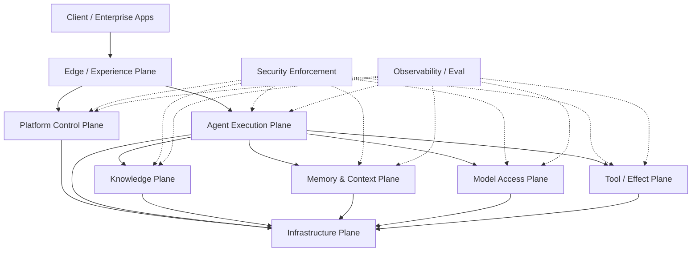
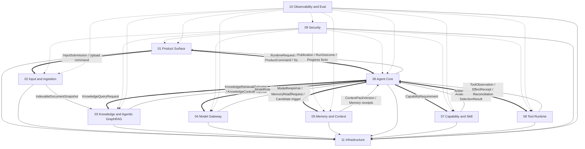
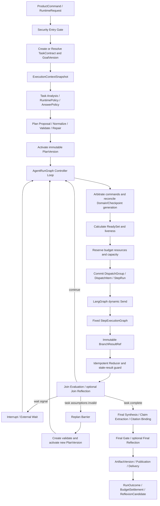
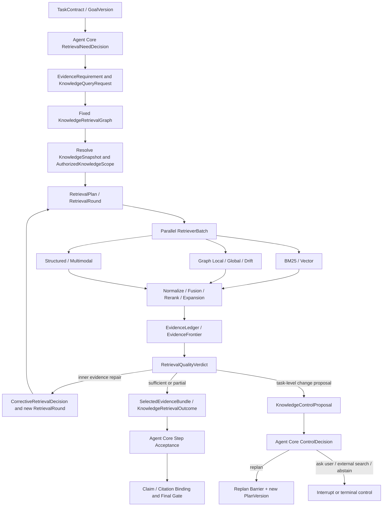
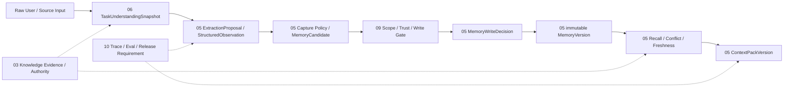
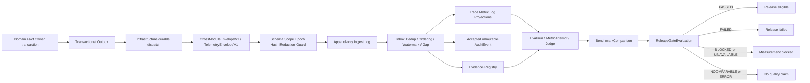

# Zuno 总体 Target 架构

updated: 2026-08-11
status: normative-target-integration-architecture
human_readable_part: Part A — 面向人的设计说明
normative_specification_part: Part B — 规范性架构与实施约束
reading_order: Part A → Owner module Part A → Part B → Current Status / Evidence
document_role: cross-module integration source
canonical_domain_sources: `docs/modules/01-*.md` through `docs/modules/11-*.md`
current_state_source: `docs/status/production-readiness.md`
writing_standard: `docs/governance/architecture-document-writing-standard.md`

> 本文是 Zuno 十一模块（十一个逻辑模块）的跨模块集成架构。它解释模块如何组成一个可恢复、可并行、可审计的企业 Agent 系统，但不复制每个模块的全部字段、状态机、数据库表和 Adapter 规格。
>
> 领域对象、状态转换、Failure、持久化和测试细节发生冲突时，以对应 Canonical Owner 的模块文档为准；本文必须在同一轮治理变更中被修正。正式文字设计面只包括本文和十一份模块文档；`architecture-views.md` 与 `architecture.html` 是不可拆分的展示配对，不拥有独立架构语义。

本文按六个阅读 Part 组织，但保留既有章节编号作为稳定引用锚点。阅读顺序是：问题与约束 → 平台形态 → 一次任务如何运行 → 分布式系统如何保持正确 → 如何部署和演练 → 如何验证与演进。模块文档中的字段、状态和 Failure 细节不在此复制。

# Part A — 面向人的设计说明

本部分先回答“Zuno 为什么这样设计”。读者可以把它当作总体架构导读：先理解企业法律工作的业务问题，再沿着一个统一案例看到模块如何协作。正式对象、状态和实现约束在 Part B 与对应 Owner 模块中定义，本部分不创建第二套状态机。

## A0. 用一个案例理解 Zuno

统一案例是企业采购 SaaS 合同审查：供应商提交第三版合同，用户希望检查责任限制是否按上一轮意见修改；若仍有偏离，系统形成带证据的 Finding 和 Redline，经律师确认后生成报告，必要时在批准后发送给法务负责人。这个案例会贯穿 Matter、DocumentVersion、Evidence、Memory、Plan、Tool、Security 和 Eval。

## A1. 先读问题，再读规范

Part A 解释问题、取舍、正常流程和异常体验；Part B 解释谁拥有事实、状态如何推进、什么可以重试、什么必须对账、数据如何持久化以及什么证据才算完成。两部分共用同一份 Canonical Markdown，任何正式 Contract 只在规范部分和 Owner 模块中定义一次。

## A2. 本部分的阅读出口

读完 Part A 后，读者应能用自己的话说明 Zuno 的产品定位、四层能力、十一个模块、Single Controller、Evidence-driven Agent、Memory、Tool Safety 和恢复边界；继续实现或审查时，必须转入 Part B，而不是从叙事段落推断代码行为。

## A3. 先从一项真实的法律工作开始

企业合同审查看起来像“上传文件然后问 AI”，但真实工作通常持续数小时、数天甚至数周。一份 SaaS 采购合同可能经历供应商初稿、我方修改、对方返稿和最终签署多个版本；法务不仅要知道合同写了什么，还要比较企业 Playbook、历史审查意见和适用法律。最后的成果也不是一段聊天文本，而是可以逐条复核的风险发现、修改建议、Redline、报告以及经过授权的后续动作。

因此，Zuno 的产品中心不是一轮 Conversation，而是一项可持续的法律工作。下面用一个统一案例说明这条链路：用户上传供应商发回的第三版合同，并提出“重点检查责任限制是否按照上一轮意见修改；如果没有，给出修改建议，审批后发给法务负责人”。

系统首先要确定用户说的是哪个 Matter、哪个 Contract 和哪个不可变 DocumentVersion，而不能把“最新上传文件”当成隐式答案。随后，文档摄取层解析责任限制条款、相关 Defined Term、交叉引用和附件；知识层分别查找当前合同事实、企业 Playbook 和适用法律；Agent 先判断结论成立前必须取得哪些证据，再决定是否需要补充检索。证据充分后，系统形成一条包含问题位置、原子 Claim、证据、适用政策、风险和建议的 FindingProposal，经过确定性检查后交给律师接受、修改、拒绝或升级。最终报告和 Redline 仍然是受控 Work Product；如果用户还要求发送邮件，发送动作必须再次通过权限、审批、幂等和外部效果确认。

这条流程可以概括为：

```text
Matter / Contract / DocumentVersion
        ↓
Document Understanding
        ↓
Review Profile + Playbook
        ↓
Task Understanding + Plan
        ↓
Evidence Requirement → Hybrid / Graph / Corrective Retrieval
        ↓
Claim + Evidence → FindingProposal
        ↓
Human Review → FindingVersion / ReviewerDecision
        ↓
Redline / Report / Work Product
        ↓
受控 Tool Effect + Audit + Feedback / Eval
```

## A4. Zuno 是什么，以及它刻意不是什么

Zuno 是面向企业法律与合同工作的 Agent 平台。合同审查是当前旗舰场景，但底层 Agent、检索、记忆、模型、工具和安全机制保持领域可扩展；法律能力通过文档结构、证据需求、企业 Playbook、法律知识和审查工作流进入系统，而不是在 Agent Runtime 中散落许多 `if legal` 分支。

这也决定了 Zuno 不只是一个通用聊天 Agent、一个向量数据库前端或一个 MCP 工具箱。通用平台更侧重“给定目标后灵活调用模型和工具”，Zuno 保留这种通用能力，同时把企业法律工作需要的 Matter、版本、证据域、Finding、人工审查和审计做成正式业务链。差异不在于有没有 GraphRAG 或能不能调工具，而在于能否从合同原文走到可引用 Evidence，再走到可复核 Finding、律师决定和受控 Work Product。这里不是贬低通用平台，而是说明两者的优化目标不同：一个优化横向任务覆盖，Zuno 优化高风险法律工作的可验证性、可追溯性和可持续改进。

## A5. 模块为什么存在：不是为了凑成十一份微服务

上述案例里存在几类不能混在一起的问题：用户到底在完成哪一项法律工作；PDF 的第 8.2 条究竟是什么；哪些证据足以支撑一个 Claim；哪个模型适合当前步骤；过去哪些信息可以安全复用；下一步如何规划；一个能力是否可用；外部动作是否允许执行；权限是否已经撤销；质量如何证明；进程崩溃后怎样恢复。Zuno 将这些责任拆成十一个逻辑模块，模块数量服务于事实 Ownership，不要求每个模块都对应独立进程。

这里引出一个核心原则：**事实唯一负责方（Canonical Owner）**。例如，Agent Core 可以提出“下一步需要查 Playbook”，但不能自己伪造 Evidence；Knowledge 可以返回候选证据，但不能仅凭召回结果宣布整个 Review 完成；模型可以建议发送邮件，但不能批准发送；前端可以展示状态，却不能因为收到 HTTP 200 就把 AgentRun 写成成功。跨模块调用可以传递 Proposal、Snapshot、Reference 和 Receipt，但不能复制另一模块的最终事实。

## A6. 模型负责提出候选，系统负责确认事实

模型适合处理语义判断：理解用户任务、提出计划、生成检索查询、抽取条款关系、评估候选证据和形成风险分析。但模型输出首先是**候选结果（Proposal）**，不是已经生效的业务事实。Proposal 需要经过 Schema 校验、权限检查、版本检查、Evidence Gate、状态转换和对应 Canonical Owner 的提交。

这条边界的原因不是简单地“不信模型”，而是企业系统必须能够解释：谁产生了这个候选，依据了哪一版文档、Profile 和模型，谁批准了状态变更，进程崩溃后从哪里恢复，以及外部动作是否真的发生。它同样适用于 Memory 写入、Finding 接受、Tool Effect 和最终发布。模型可以建议，确定性规则和业务 Owner 才能提交。

## A7. 计划、执行和恢复如何连接

即使是简单任务，也需要一个最小的 Plan。Plan 不只是把复杂任务拆小，它同时承载目标、完成条件、预算、允许能力、Trace 和恢复位置。复杂任务会形成带依赖关系的 Plan DAG；没有数据依赖、资源冲突、审批要求或副作用冲突的步骤可以并行，有前后依赖、共享可变资源或需要最终综合的步骤必须串行。一个 Step 内部还可以根据观察结果动态选择下一步行动，这就是 ReAct；但 ReAct 始终受 Step 的目标、预算、Capability 和 Acceptance 约束。

“失败以后怎么办”也不能统一叫 Retry。网络暂时超时且计划仍然正确时可以重试；参数格式不对时先 Repair；当前 Provider 不可用时可以在安全约束内 Fallback；能力不足时可以升级模型；只有发现原任务结构、依赖或能力假设已经失效，才需要 Replan。外部副作用又是另一类问题：发送邮件后网络超时，不能因为没有响应就再次发送，因为第一封可能已经成功。系统必须先查询 Provider Operation ID、幂等记录或业务结果，确认外部世界发生了什么，这叫**副作用对账（Effect Reconciliation）**。

## A8. 业务事实与图执行位置为什么要分开保存

PostgreSQL 保存“业务世界现在是什么状态”，例如 Review、PlanVersion、Finding、Approval 和 EffectReceipt；LangGraph Checkpointer 保存“图执行到了哪里”，例如哪个节点完成、哪个分支待恢复、下一次从哪里继续。队列负责分发工作，不是业务事实源；向量索引、图索引和缓存是可重建投影，也不能反向覆盖业务事实。

恢复时要对两者做对账，而不是盲信其中一个。如果数据库已经记录邮件 Effect 成功，但 Checkpoint 仍停留在调用前，恢复不能再次发送；如果 Checkpoint 显示节点结束，但领域事务没有提交，系统也不能假装业务已经完成。正确做法是由对应 Owner 根据提交 Receipt、版本、幂等记录和当前状态重新决定是继续、补偿、对账还是阻塞。具体状态、失败命名和持久化 Contract 以 Part B 为准。

## A8.1. 从工具中心到一次安全执行

企业管理员首先要解决的不是“Agent 能不能调用 MCP”，而是企业究竟安装了哪些可用工具、哪些组织可以使用、哪个身份连接外部系统，以及某个 Agent 在当前任务中到底能看到什么。工具目录可以同时展示 Gmail MCP、Microsoft Graph Mail、企业 Mail API、Word、合同系统和 GitHub，但它们不应形成四套独立权限系统；MCP、HTTP API、CLI、SDK 和本地桥接只是不同的 Adapter，产品层统一把它们当作 Tool，执行层再选择对应 Adapter 和 Sandbox。

这条链路应按四层理解：

```text
工具目录 / 安装与激活
        ↓
组织、Workspace、成员和资源授权
        ↓
用户偏好 + AgentVersion Allowlist
        ↓
当前 Task Downscope + Capability Selection
        ↓
PreparedToolAction → Security Gate → Effect Assurance
```

上级组织给出的是权限上限，下级只能继续缩小；用户在“我的工具”中勾选的是“允许自己的 Agent 使用哪些已获授权工具”，不是给自己增加授权；AgentVersion 再做一次最小权限裁剪；当前任务还可以继续 Downscope。最终集合可以抽象为：

```text
Principal Ceiling
∩ Tenant / OrgUnit / Workspace Grant
∩ User Enabled Set
∩ AgentVersion Allowlist
∩ Task Downscope
∩ Tool Installation / Activation
∩ Resource Policy
∩ Current Security Epoch
```

工具是什么、企业是否安装、谁能用、Agent 想用什么、这次动作是否真的执行，是不同问题。当前架构中，能力语义与候选选择由 07 管理，具体可执行 Tool Definition、Version、Installation 和业务连接由 08 管理，授权和 Approval 由 09 管理，AgentVersion 与用户配置体验由 01 管理。可用性、授权和执行结果不能互相推断：工具可能 `AVAILABLE` 但用户无权使用，也可能已授权但 Connection 过期或 Provider 不健康。

工具选择也要区分自动选择、优先选择和固定选择。用户说“通常用 Gmail”是偏好，Gmail 不可用时可以在政策允许的范围内切换；用户说“必须经过企业 Mail Gateway”是约束，固定实现不可用时应阻塞；企业 Security/Compliance Policy 的 Pin 优先于 AgentVersion 约束、用户要求、用户偏好和 Runtime 自动选择。模型可以提出“偏好 Gmail”的 Proposal，但最终 Resolver 必须按 Policy、Compatibility、Availability、Connection、Health、Cost、Residency 和风险确定选择。

本轮将这条工具治理链提升为正式跨模块 Contract：`ToolConnection` 是 08 拥有的业务身份连接，`ProviderInstance` 是绑定 ToolVersion、Connection 和 Adapter 的执行实例；`ToolGrant` 与 `DelegationGrant` 由 09 拥有；`AgentToolBinding` 与 `UserToolPreference` 由 01 拥有；07 只负责在已授权候选中做能力兼容和确定性选择。详细字段和状态以各 Owner 的 Part B 为准。

## A9. 从这篇总览怎样进入规范

Part A 的目的，是让读者先理解“为什么 Zuno 需要这些边界、正常流程怎样走、异常时用户和系统分别等待什么”。它不替代模块 Contract，也不凭叙事新增状态。继续阅读时，按案例中的顺序进入 Product、Ingestion、Knowledge、Model、Memory、Agent Core、Capability、Tool、Security、Observability 和 Infrastructure；任何涉及正式字段、状态终态、Failure Namespace、CAS、Outbox、Approval 或测试门槛的实现，都必须以 Part B 和对应模块文档为准。

# Part I — 为什么需要 Zuno

## 0. 正式事实源、优先级与维护顺序

Zuno 正式架构设计事实共十二份：

```text
11 × docs/modules/<NN>-<module>.md
 1 × docs/architecture/architecture.md
```

维护支撑文件：

```text
docs/architecture/README.md
    目录、优先级、唯一事实源与维护规则。

docs/architecture/architecture-views.md
    HTML 的 Mermaid 图源；与 architecture.html 作为展示配对维护，不是文字事实源。

docs/architecture/architecture.html
    Mermaid Architecture Atlas 展示层；与 architecture-views.md 配对维护，不是文字事实源。

.agent/*
    仅保存项目级 Agent Skill、路由、验证器、模板和当前执行状态；不保存架构或模块镜像。
```

规范优先级和更新方向固定为：

```text
全局不可变原则、已接受 ADR、共享 Contract Registry
→ 对应 Canonical Owner 的十一份模块 Target 文档
→ architecture.md 跨模块集成架构
→ 已确认 Program
→ 代码、Migration、测试、Trace、Eval 与运行证据
```

含义：

1. 模块文档最接近领域事实，定义 Owner、Contract、状态、Failure 和完成证据。
2. 总架构负责跨模块组合，不得发明模块文档不存在的领域终态。
3. `architecture.md` 中的 Mermaid 仅服务于阅读，不能删除会改变语义的 Gate、Commit、Proposal、Barrier、Reconciliation 或状态分支。
4. `architecture-views.md` 与 `architecture.html` 不拥有独立架构语义；只有图形关系变化时才作为一个整体同步。
5. Current、Gap、Measurement 和 Production Readiness 只由最新 `main` 的代码、Migration、测试、Trace、Eval、`docs/status/` 与 `docs/evidence/` 证明。

---

# 1. 问题、目标与非目标

## 1.1 问题

Zuno 面向企业知识问答和长运行任务执行。一次请求可能跨越用户交互、文件摄取、任务规划、证据检索、多模型调用、能力选择、工具审批、外部副作用、长期记忆、审计、评测和异步恢复。普通“FastAPI → 单个 Agent 循环 → Provider SDK”结构无法稳定回答：

```text
Run 是否持久存在并可恢复
计划和任务目标是否有不可变版本
Ready Step 为什么可以或不可以并行
模型输出是否只是 Proposal
检索结果能否回到授权后的 SourceSpan
Knowledge 内层纠正是否错误升级为 Agent Replan
Tool timeout 后外部效果是否已经发生
Approval 是否绑定准确参数、目标资源和 Security Epoch
Domain Commit 与 LangGraph Checkpoint 不一致时如何恢复
Trace、Audit、Eval 与源领域事实分别由谁拥有
质量提升是否来自可比较的 Benchmark 和 Release Gate
```

## 1.2 产品定位

Zuno 的正式产品定位是：

> Zuno 是面向企业内部资料和业务系统的可治理自定义 Agent 平台。企业管理员统一管理 Tenant、OrgUnit、Workspace、知识、模型、Skill、Tool、权限、预算与审批；员工可以在授权范围内创建或使用多个个人、团队或企业 Agent，通过任务式工作台完成知识问答、跨文档分析、报告生成和受控业务操作。

Zuno 不是单一 RAG 聊天机器人、Prompt 管理器、MCP 工具箱或 LangGraph Runtime。它的产品组合是：

```text
企业组织和权限
+ 企业资料库
+ Agent Studio / Agent Catalog
+ Single Controller Agent Runtime
+ 受控工具执行
+ Evidence / Citation / Audit / Eval
```

产品层允许多个 Agent 资产共存：

```text
一个用户可以创建多个个人 Agent
一个 Workspace 可以发布多个团队 Agent
一个 Tenant 可以维护企业 Agent 目录
多个用户可以使用同一个已发布 AgentVersion
```

运行层的边界是：一次 `AgentRun` 绑定一个 Primary `AgentVersion`、一个 Single Controller 和一个 Active `PlanVersion`。Run 内可以有多个 Step、并行分支、Capability、Model Role 和 Tool Action，但当前不建设多个自治 Agent 各自拥有控制权的 Runtime。

## 1.3 目标

Zuno Target 必须实现：

1. **领域无关**：Agent Core 只依赖 typed Contract，不硬编码知识库、模型厂商或工具 Provider。
2. **Single Controller**：一个 AgentRun 只有 Agent Core 可以决定 Plan、Step、Retry、Replan、Finalize 和 RunOutcome。
3. **证据保真**：原始文件、SourceSpan、CitationLineage、Evidence 和 Claim Binding 可追踪。
4. **安全并行**：Plan DAG、Retriever Batch 和异步任务只在依赖、资源、副作用、安全、预算和配额允许时并行。
5. **可恢复**：Domain Fact、Checkpoint、Queue、Lease、外部调用和 Projection 均有明确恢复与 Reconciliation。
6. **可审计**：安全决定、Tool Effect、模型 Attempt、Evidence、Publication 和质量声明可关联。
7. **可验证**：每个 Requirement 映射 Control、Unit、Integration、Fault、E2E、Eval 和 Evidence。
8. **安全默认关闭**：未知权限、未知 Effect、陈旧 Epoch、缺失证据和不兼容版本 fail closed。
9. **轻量部署、成熟语义**：初期允许一个后端镜像承担多个角色，不以微服务数量证明成熟度。

## 1.4 非目标

近期不默认建设：

```text
产品级自治 Multi-Agent Runtime
全系统 Event Sourcing
XA / 2PC
Kafka 作为默认工作队列
Kubernetes 作为完成条件
默认多区域 Active-Active
保存模型隐藏思维链
让模型、前端或 Projection 直接提交领域终态
让 Redis、Milvus、Neo4j、RabbitMQ、LangSmith 或 Checkpoint 成为业务事实源
公开 Agent 交易市场
自研企业 IAM / HR 主系统
十一模块不是当前微服务拆分计划；不得直接拆成十一微服务
自治 Agent 网络或 Agent 社交运行时
```

---

# 2. 全局架构原则

## 2.1 Agent Core 是唯一控制器

```text
固定 AgentRunGraph
+ 动态 Plan DAG
+ 固定 StepExecutionGraph
```

所有任务都有 Plan：简单任务使用 Deterministic Single-Step Plan，复杂任务使用 Dynamic DAG Plan。正式回答不得绕过 TaskContract、GoalVersion、Plan、Trace、Budget、AnswerPolicy、Final Gate、Publication 与 RunOutcome。

## 2.2 模型只产生 Proposal

模型可以产生 Task Analysis、Plan Proposal、ActionProposal、Query Rewrite、Extraction Candidate、Critic Result、MemoryCandidate 和 Security Risk Proposal；模型不能激活 PlanVersion、批准权限、取得明文 Secret、提交 Tool Effect、修改 KnowledgeVersion、提交长期 Memory、绕过 Budget 或发布最终答案。

## 2.3 Canonical Owner 决定领域事实

每个 Contract 只有一个 Canonical Owner。消费者可以校验、拒绝、投影和引用，但不能重命名生产者 Failure、覆盖状态或把 Proposal 当成最终决定。

## 2.4 Receipt 只证明自己的边界

```text
HTTP 2xx
Queue ACK
Object Commit
Checkpoint Commit
IndexWriteReceipt
AuditPersistenceReceipt
SSE Close
Client ACK
```

只证明各自物理或交付事实，不能冒充 AgentRun、KnowledgeVersion、Tool Effect、AuditEvent、Publication 或质量成功。

## 2.5 Retry、Corrective Retrieval、Replan 与 Reconciliation 分离

```text
Retry
    计划与假设仍成立，只重做一次 Attempt。

Repair / Fallback
    修参数、Schema 或兼容实现，不改变目标结构。

Corrective Retrieval
    Knowledge 内创建新的 RetrievalRound，修复证据缺口，不修改 Agent PlanVersion。

Replan
    Agent Core 判断目标、假设、依赖或能力结构失效，经 Replan Barrier 创建新 PlanVersion。

Reconciliation
    外部结果未知，先确认实际状态，不盲目重做副作用。

Compensation
    新的受治理 ActionProposal，不删除历史 Effect。
```

## 2.6 PostgreSQL、Checkpointer 与 Projection 分工

```text
PostgreSQL
    领域事实、状态转换、Generation、版本、Outbox、Approval、Effect、Evidence、Memory、Eval 关联。

LangGraph Checkpointer
    Graph 节点、Channel、Pending Send、Interrupt Cursor、Reducer 控制状态和恢复位置。

Object Store
    大型不可变 Payload、Artifact、Parser 产物和调试包。

BM25 / Vector / Graph / Product / Observability Projection
    可重建的派生读模型，不是源领域事实。
```

## 2.7 安全、预算与审计先于副作用

```text
ActionProposal
→ Tool Runtime Prepare / Canonicalize
→ Security Prepare Gate
→ optional Approval
→ Security Execute Gate + latest EffectiveSecurityEpoch
→ Mandatory Audit durable receipt（适用时）
→ Infrastructure IdempotencyClaim
→ ToolAttempt
→ EffectReceipt 或 EffectReconciliation
→ Agent Core ControlDecision
```

## 2.8 统一平台责任视图

Plane 是跨模块责任的阅读视图，不等于十一模块，也不等于一一对应的微服务或编程语言。它帮助读者先理解“系统为什么这样组合”，再进入模块 Owner 文档。



当前正式 Target 只冻结这些责任和 Owner 边界。Java/Python、多服务拆分和 Kubernetes 等实现候选，若尚未有 accepted ADR，必须保持为 Candidate，不得由本图或本文章节暗示为 Current。

# Part II — 平台宏观架构

---

# 3. 十一个逻辑模块



| 编号 | 模块 | Canonical Ownership | 唯一详细设计 |
| --- | --- | --- | --- |
| 01 | Product Surface | AgentDefinition、AgentDraft、AgentVersion、AgentPublication、AgentInstallation、AgentToolBinding、UserToolPreference、AgentCatalogEntry、Conversation、Submission、ProductCommand、RuntimeRequest、CommandReceipt、Projection、ChannelDelivery、ClientRender、UserRead | `docs/modules/01-product-surface.md` |
| 02 | Input / Document Ingestion | SourceObject、DocumentVersion、ParsePlan/Job/Attempt/Snapshot、CanonicalDocumentIR、原始 SourceSpan、质量门和 Handoff | `docs/modules/02-input-document-ingestion.md` |
| 03 | Knowledge / Agentic GraphRAG | KnowledgeVersion/Snapshot、IndexSpec/Manifest 接受语义、RetrievalPlan/Round、EvidenceLedger、CitationLineage | `docs/modules/03-knowledge-agentic-graphrag.md` |
| 04 | Model Gateway | Model Role/Operation、Provider/Model、Routing、Call/Attempt、Response、Usage、Quota、Health、Circuit | `docs/modules/04-model-gateway.md` |
| 05 | Memory & Context | Session/Long-term Memory、Candidate、Governance、MemoryVersion、ContextPackVersion、UseTrace、Privacy Lifecycle | `docs/modules/05-memory-context.md` |
| 06 | Agent Core | TaskContract、GoalVersion、AgentRun、PlanVersion、StepRun、ActionRun、ControlDecision、Publication、RunOutcome | `docs/modules/06-agent-core-planning-control.md` |
| 07 | Capability / Skill | Capability/Skill Definition 与 Version、Requirement、ProviderBinding、CapabilitySelectionPolicy、Availability、Selection | `docs/modules/07-capability-skill.md` |
| 08 | Tool Runtime | ToolOnboardingRequest、Tool Provider/Definition/Version/Operation、ToolInstallation、ToolConnection、ProviderInstance、PreparedToolAction、ToolAttempt、Observation、Execution/Effect/Reconciliation | `docs/modules/08-tool-runtime.md` |
| 09 | Security | Principal、ToolGrant、DelegationGrant、ToolAccessRequest、授权、Policy、Approval、EffectiveSecurityEpoch、Secret、Information Flow 与安全 Gate | `docs/modules/09-security.md` |
| 10 | Observability & Eval | Trace/Metric/Log Projection、accepted AuditEvent、Eval、Benchmark、Evidence Registry、ReleaseGateEvaluation | `docs/modules/10-observability-eval.md` |
| 11 | Infrastructure | Transaction、Object、Queue、Inbox/Outbox、Lease/Fencing、Checkpoint、Index 物理执行、Backup/Restore | `docs/modules/11-infrastructure.md` |

---

# 4. 全局事实所有权

| 事实 | Owner | 不可跨越的边界 |
| --- | --- | --- |
| ConversationThread、UserSubmission、ProductCommand、ChannelDelivery、AgentToolBinding、UserToolPreference | Product Surface | 不创建 ToolGrant、DelegationGrant、PreparedAction 或 Effect |
| SourceObject、DocumentVersion、ParseSnapshot、CanonicalDocumentIR、原始 SourceSpan | Input | 不创建 Chunk、Evidence 或 KnowledgeVersion |
| KnowledgeVersion、KnowledgeSnapshot、RetrievalRound、Evidence、CitationLineage | Knowledge | 物理索引成功不等于领域 Acceptance |
| ModelRoutingDecision、ModelCallAttempt、ModelResponse、UsageReceipt | Model Gateway | 模型结果不是最终业务事实 |
| MemoryCandidate、MemoryVersion、ContextPackVersion | Memory | Reflexion、Summary 和 Entity Fact 先成为 Candidate |
| TaskContract、GoalVersion、AgentRun、PlanVersion、StepRun、ActionRun、Publication、RunOutcome | Agent Core | 编排其他模块但不冒充其事实 Owner |
| CapabilityVersion、SkillVersion、CapabilitySelectionPolicy、AvailabilitySnapshot、SelectionResult | Capability | Selection 不等于 Authorization、Execution Readiness 或 Plan Activation |
| ToolOnboardingRequest、ToolDefinition、ToolVersion、ToolOperation、ToolInstallation、ToolConnection、ProviderInstance、PreparedToolAction、ToolAttempt、ToolObservation、EffectReceipt、EffectReconciliation | Tool Runtime | 不拥有 ToolGrant、DelegationGrant、SecurityApprovalDecision、SecretLease 或 IdempotencyClaim |
| AuthorizationDecision、ToolGrant、DelegationGrant、ToolAccessRequest、ApprovalDecision、EffectiveSecurityEpoch、InformationFlowDecision | Security | 前端、模型和不可信内容都不是安全事实源 |
| Trace/Metric/Log Projection、accepted AuditEvent、Eval、Benchmark、EvidenceRecord、ReleaseGateEvaluation | Observability & Eval | 接收事件不转移源领域 Ownership |
| QueueDelivery、Lease、Fencing、ObjectCommit、Checkpoint、Physical Index Receipt、AuditPersistenceReceipt | Infrastructure | 物理 Receipt 不冒充领域终态 |

## 4.1 Logical Module 不等于 Deployable Service

逻辑模块回答“谁拥有哪个事实”，部署服务回答“哪些负载、故障域、安全边界和发布周期需要独立运行”。因此当前总架构不要求十一模块一一拆成十一服务，也不把服务数量当作成熟度证明。任何进一步的微服务或 Polyglot 方案必须经过独立 Architecture Decision，并保持 Wire Contract、Ownership 和 Failure Semantics 不变。

# Part III — 一次企业 Agent 任务如何运行

---

# 5. 在线 Agent 完整运行流程



## 5.1 初始化与计划

```text
validate_runtime_request
→ create_or_resolve_task_contract
→ classify supplemental input or GoalVersion change
→ resolve_authorization and effective policy
→ create ExecutionContextSnapshot
→ build ContextPackVersion references
→ analyze task and complexity
→ resolve RuntimePolicy / AnswerPolicy
→ create Plan Proposal
→ normalize / validate / repair
→ atomically activate immutable PlanVersion
```

Planner 必须检查 Goal Coverage、DAG、依赖、输入输出、Capability、Security、Budget、资源冲突、Side-effect Class、JoinPolicy、Acceptance 和 Terminal Deliverable。模型 Planner 只产生 Proposal。

## 5.2 Controller Loop

```text
arbitrate_control_commands
→ reconcile_domain_and_checkpoint_generation
→ reconcile_expired_or_orphaned_facts
→ calculate_ready_set
→ evaluate_liveness
→ reserve_budget_and_resources
→ commit_dispatch
→ dynamic_send_step_workers
→ collect_branch_results
→ reduce_branch_results
→ evaluate_join
→ continue / wait / retry / replan / finalize
```

Dispatch 必须先持久化再 Send。Worker 只返回不可变 `BranchResultRef`，不得直接修改共享 Run。Reducer 必须幂等、顺序无关，并拒绝旧 PlanVersion、旧 controller/execution epoch、stale fencing 和 hash 冲突。

## 5.3 StepExecutionGraph

```text
load_step_definition
→ verify PlanVersion and execution epoch
→ resolve inputs and acquire resource claims
→ confirm budget reservation and preflight security
→ decide and validate ActionProposal
→ prepare side effect and await approval when required
→ claim idempotency
→ execute through the owning module
→ normalize observation
→ persist observation and usage
→ Action Evaluation
→ Step Acceptance
→ optional Step Reflection
→ ControlDecision
```

每个 Action 都 Evaluation，每个 Step 都 Acceptance。Reflection 只在失败、冲突、高风险、关键决策或重复失败时触发。Step Progress 可以是 Continue ReAct、Retry、Repair、Fallback、Model Escalation、Complete、Request Replan、Wait Signal、Block、Abstain 或 Fail。

## 5.4 Replan Barrier

Replan 不修改 Active PlanVersion。Barrier 先停止旧 Plan 新 Dispatch，再处理 `CANCEL_SAFE`、`DRAIN_REQUIRED` 与 `NON_INTERRUPTIBLE` 分支，收集已提交事实，创建并验证新 PlanVersion，原子切换后重新计算 ReadySet。旧分支晚到结果必须按 ResultValidity 标记 STALE、SUPERSEDED、TAINTED 或 LATE_IGNORED。

## 5.5 Finalization

```text
final_synthesis
→ FinalCandidate
→ extract claims
→ bind Evidence and Citation
→ Final Gate
→ optional Final Reflection
→ ArtifactVersion
→ Publication
→ ChannelDelivery / DeliveryReceipt
→ RunOutcome
→ BudgetSettlement
→ ReflexionCandidate
```

Provisional token、FinalCandidate、Artifact、Publication、Delivery 和 UserRead 是不同事实。终局至少区分 COMPLETED、PARTIAL、ABSTAINED、REFUSED、BLOCKED、FAILED、CANCELLED 和 EXPIRED。

---

# 6. 文档摄取与 Knowledge 发布流程

```mermaid
flowchart LR
  SUB[InputSubmission / Connector] --> OBJ[SourceObject + IntegrityReceipt]
  OBJ --> DV[Immutable DocumentVersion]
  DV --> PROF[SourceProfile / Security Preflight]
  PROF --> PLAN[ParsePlan / ParseJob]
  PLAN --> TASK[ParseTask / ParseAttempt with Lease and Fencing]
  TASK --> IR[CanonicalDocumentIR + original SourceSpan + TransformLedger]
  IR --> Q[ParserQualityReport / MissingContentManifest]
  Q -->|PASS or allowed DEGRADED| PS[Immutable ParseSnapshot]
  Q -->|BLOCK| BLK[Blocked / Human Review]
  PS --> HAND[IndexableDocumentSnapshot]
  HAND --> KV[KnowledgeVersion BUILDING]
  KV --> SPEC[IndexSpec / IndexWriteBatch]
  SPEC --> WR[IndexWriteReceipt]
  WR --> VIS[WriteVisibilityReceipt]
  VIS --> VER[IndexVerification]
  VER --> MAN[Knowledge IndexManifest]
  MAN --> ACC[Knowledge Acceptance]
  ACC --> CUT[IndexCutover]
  CUT --> SERVE[ServingWatermark / KnowledgeSnapshot]
```



不变量：

- 在线附件和长期知识摄取共享 Unified Ingestion Kernel，但使用不同 Processing Profile、Priority、Deadline、Retention 和是否建立长期索引。
- 原始字节不可被清洗、OCR、VLM 或模型结果覆盖。
- 源内容变化创建新 DocumentVersion；Parser、模型、配置或 Schema 变化创建新 ParseSnapshot。
- Input 拥有原始 SourceSpan；Knowledge 生成 CitationChunk、Entity、Relation 和 Community，并保留回链。
- BLOCK 或完整性无效的 ParseSnapshot 不得交给 Knowledge。
- Infrastructure 执行物理写入、可见性、验证和 Cutover primitive；Knowledge 决定 Manifest、Acceptance 和服务版本。
- IndexWriteReceipt、ServingWatermark 或后端健康状态不自动等于 KnowledgeVersion ACTIVE。
- 删除先撤销访问和新读取，再传播 Tombstone、Knowledge/Memory 删除和物理清理，由 Verification 收口。

---

# 7. Agentic GraphRAG 与证据闭环

本节是 Agentic GraphRAG 的跨模块集成规范；字段级 Contract、KnowledgeVersion 生命周期、RetrieverAttempt 细节和模块内测试矩阵由 `docs/modules/03-knowledge-agentic-graphrag.md` 唯一拥有。本节只定义模块之间必须一致的控制边界、证据语义、版本一致性、失败恢复和评测标准。

Agentic GraphRAG 不是“BM25 + Vector + Graph 三路固定执行”，而是一个受治理的
`Plan → Act → Observe → Evaluate → Adapt → Stop` 闭环：

```text
用户任务
→ Claim 分解
→ EvidenceRequirement
→ RetrievalStrategyProposal
→ Deterministic Admission
→ RetrievalPlan / SearchAction
→ RetrievalRound
→ EvidenceLedger
→ EvidenceEvaluation
→ CorrectiveDecision / StopDecision
→ SelectedEvidenceBundle
→ Agent Core Final Grounding Gate
```

目标架构仍是 `TARGET`，不代表当前 Runtime、Graph Index、Community Report 或质量指标已经生产证明。

## 7.1 Control Plane 与 Retrieval Data Plane

两层必须分开。Control Plane 回答“为什么搜、搜什么、是否够、下一步怎么办”；Data Plane 回答“如何在授权和版本边界内找到候选证据”。Knowledge 不得自行创建新的产品任务、Tool Step 或 PlanVersion。

```text
Agentic Retrieval Control Plane
  Task Understanding
  Claim Decomposition
  Evidence Requirement
  Retrieval Planning
  Admission / Security / Budget
  Evidence Evaluation
  Failure Diagnosis
  Corrective Decision
  Stop / Ask User / Replan Proposal

Retrieval Data Plane
  pinned KnowledgeSnapshot
    ├─ Hybrid Channel: BM25 + Vector → RRF → first-pass rerank
    ├─ Graph Channel: Local / Global / DRIFT
    └─ Structured / Multimodal Channel（按 Policy 开启）
  → Evidence Materialization
  → Candidate Deduplication
  → Unified Evidence Reranker
  → EvidenceLedger / SelectedEvidenceBundle
```

跨模块 Owner 固定为：

| 事实或决定 | Canonical Owner | 允许的消费者行为 |
| --- | --- | --- |
| Task、Claim、Goal、Plan、Step、Run Outcome | Agent Core | 创建 Retrieval Need，接受 Knowledge Outcome，决定 Replan / Finalize |
| KnowledgeSnapshot、EvidenceRequirement、RetrievalPlan、EvidenceLedger | Knowledge | 在授权 Scope 和 Snapshot 内生成、版本化和评估 |
| Authorization、Security Epoch、数据分类 | Security | 授权、拒绝和最终重验；不得由 Retriever 自行放宽 |
| Model Proposal、Embedding、Rerank、Judge Attempt | Model Gateway | 产生有边界的 Proposal / Score / Result，不提交领域终态 |
| Retrieval Trace、Eval Metric、Release Gate | Observability / Eval | 投影和测量，不改写 Knowledge 或 Agent 事实 |
| Index、Queue、Object Store、Checkpoint 物理事实 | Infrastructure | 提供 Receipt、Lease、Claim 和恢复能力，不冒充领域 Acceptance |

## 7.2 Retrieval Strategy 的正式语义

底层策略是内部 `SearchAction` 的 `action_type`，不是用户必须理解的产品模式，也不是多个自治 Retriever 的竞争控制器。

| 策略 | 解决的问题 | 输出边界 | 默认升级条件 |
| --- | --- | --- | --- |
| `HYBRID` | 法条号、专名、语义改写和常规事实 | `SourceSpan` 候选；BM25 / Vector 通过版本化 RRF 合并 | 基础覆盖不足、引用缺口或语义复杂 |
| `GRAPH_LOCAL` | 定义、交叉引用、实体关系和有界多跳 | `GraphPath` + Evidence Backlink + `SourceSpan` | Requirement 明确需要关系或局部多跳 |
| `GRAPH_GLOBAL` | 全库主题、群体模式、风险分布 | `DerivedEvidence` / Navigation Evidence；严格回答必须 drill-down | 需要 corpus-level synthesis 且预算允许 |
| `GRAPH_DRIFT` | 从社区 Primer 逐步发现未知局部路径 | Primer、Follow-up 和 Local 结果；禁止无限游走 | 初始证据指出存在未闭合路径 |
| `STRUCTURED` | 表格、元数据、时间、权限和业务字段 | 带字段 lineage 的结构化候选 | Requirement 指定结构化事实 |

`BM25` 和 `Vector` 只在相同粒度的文本候选上做 rank fusion；不能把 BM25 score、Vector score、Graph distance、Community score 直接相加。Graph 原生对象必须先 Materialize 为 Source-backed EvidenceCandidate，GraphPath 作为 provenance 和 reranking feature 保留。

## 7.3 Claim、EvidenceRequirement、QuerySpec 与 Requery

检索闭环必须区分四种对象：

```text
Claim
    最终回答需要支持、反驳或限定的断言。

EvidenceRequirement
    为证明 Claim 必须满足的证据条件，包括来源类型、权限、时间、管辖区、权威级别、
    最小独立来源数和严格引用要求。

QuerySpec
    本一轮 SearchAction 具体如何查，包括 query、route、filters、top_k、graph policy 和 budget。

Requery / Query Rewrite
    Requirement 不变，只改变 QuerySpec、路径或检索策略；不能被误写成新 PlanVersion。
```

示例：

```yaml
EvidenceRequirement:
  requirement_id: ER-003
  claim_id: C1
  mandatory: true
  required_source_types: [CONTRACT]
  graph_dependency:
    required: true
    allowed_relations: [REFERS_TO, EXCEPTION_TO, SUBJECT_TO]
  temporal_policy: {as_of: contract_execution_date}
  citation_policy: {source_span_required: true}
  completion_policy: {min_independent_sources: 1}
```

Requirement 不因一次查询失败而消失；每一个新 SearchAction 必须指向至少一个未满足 Requirement、冲突解析目标或 Citation Repair 目标。

## 7.4 Retrieval Planner 与 Admission

Planner 可以是模型辅助的，但只产生 `RetrievalStrategyProposal`，不能直接执行：

```text
RetrievalStrategyProposal
→ Retrieval Admission Controller
→ Admitted RetrievalPlan
→ SearchAction Claim / Dispatch
```

Admission 必须确定性检查：

```text
Authorization / Knowledge Scope
KnowledgeSnapshot 与 Index Availability
Graph Freshness / Community Eligibility
Retrieval Profile 与 Assurance Level
Latency / Token / Cost / Concurrency Budget
Deadline / Cancellation / Security Epoch
```

例如 Planner 提议对一个明确条款号问题执行 `GRAPH_GLOBAL`，Admission 可以因成本超过 Requirement 的预期收益而拒绝，并降为允许的 `HYBRID`；模型不能绕过 ACL、Budget、Snapshot 或 Assurance Policy。

## 7.5 Canonical EvidenceCandidate 与融合

所有通道最终只能向 Agent Core 提供统一的 Source-backed EvidenceCandidate：

```yaml
EvidenceCandidate:
  evidence_id: string
  requirement_ids: [string]
  source:
    knowledge_snapshot_id: string
    document_id: string
    document_version_id: string
    citation_chunk_id: string
    source_span_id: string
    content_hash: string
  retrieval_origins: [HYBRID_BM25 | HYBRID_VECTOR | GRAPH_LOCAL | GRAPH_GLOBAL | GRAPH_DRIFT]
  retrieval_features:
    bm25_rank: int | null
    vector_rank: int | null
    hybrid_rrf_rank: int | null
    rerank_score: number | null
    entity_match: boolean | null
    graph_distance: int | null
  graph_provenance: [GraphPathRef]
  legal_metadata_ref: string | null
  authorization_decision_ref: string
  security_epoch: string
  lineage:
    retrieval_run_id: string
    retrieval_round_id: string
    search_action_ids: [string]
```

同一个 SourceSpan 被多个通道找到时，Canonical Dedup Key 至少为：

```text
tenant_id + knowledge_snapshot_id + document_version_id + source_span_id + content_hash
```

合并后增加 `retrieval_origins` 和 provenance，不把同一文本复制多份进入 Context。Unified Evidence Reranker 的输入必须包含 `EvidenceRequirement + QuerySpec + Candidate + Retrieval Features + Graph Provenance + Legal Metadata`；Reranker 只决定候选排序，不能决定 Requirement 是否已经满足。

`GRAPH_GLOBAL` 产生的 Community Report 默认是 Derived / Navigation Evidence。若最终 Claim 依赖该结论，必须 drill-down 到有权限的 Entity、Relation 和 SourceSpan；没有 SourceSpan 的 Graph 结果只能 `AUXILIARY_ONLY`，不能作为严格法律或合规引用。

## 7.6 RetrievalRound、EvidenceLedger 与质量评价

一个 `RetrievalRound` 是一组已 Admission 的 SearchAction、其 Observation、Evidence Materialization、EvidenceEvaluation 和 ControlDecision，不是一次 Provider 调用：

```text
PLANNED
→ ADMITTED
→ DISPATCHING
→ RETRIEVING
→ MATERIALIZING
→ FUSING
→ EVALUATING
→ COMPLETED
```

异常状态为 `PARTIAL`、`FAILED`、`CANCELLED`、`BLOCKED`；每个状态转换必须有版本、原因码、Trace、Budget 影响和持久化事实。

`EvidenceLedger` 按 `Claim → EvidenceRequirement → EvidenceCandidate` 组织 Observation。Evidence Evaluation 不能压缩成单一 `0.0–1.0` 分数，至少要分别记录：

```text
Requirement Coverage
Claim Support
Citation Integrity
Source Authority
Temporal / Jurisdiction Applicability
Conflict Status
Security Validity
Novelty / Marginal Evidence Gain
Cost / Latency / Budget Consumption
```

评价结果只产生 `EvidenceEvaluation` 和 `StopDecision / CorrectiveDecision`。`Sufficient`、`Partial`、`Conflict`、`No Safe Path` 等结论必须可回到具体 Requirement、Evidence ID 和原因码。

## 7.7 Corrective Retrieval、Replan 与 Stop

三者边界固定：

```text
Retry
    相同语义的 SearchAction 因瞬时故障失败，使用同一 Fingerprint 重试。

Corrective Retrieval
    Evidence Goal 不变，改变 QuerySpec、Route、Expansion 或证据补全方式，创建新的 RetrievalRound。

Replan
    Task Goal、Plan Dependency、Capability、权限或外部前提失效；Knowledge 只能提出
    KnowledgeControlProposal，Agent Core 才能经 Replan Barrier 创建新 PlanVersion。
```

标准 StopReason：

```text
SUFFICIENT
BUDGET_EXHAUSTED
DEADLINE_REACHED
MAX_ROUNDS_REACHED
LOW_MARGINAL_GAIN
UNRESOLVED_CONFLICT
PERMISSION_BLOCKED
INDEX_UNAVAILABLE
USER_INPUT_REQUIRED
NO_SUPPORTED_EVIDENCE
CANCELLED
```

对应的控制输出为 `SYNTHESIZE`、`PARTIAL_ANSWER`、`ASK_USER`、`WAIT`、`ABSTAIN` 或 `FAIL`。`STANDARD / DEEP / AGENTIC_DEEP` 可以拥有不同的 safety cap，但 cap 不是正常停止条件；正常停止必须由 Evidence Sufficiency、Marginal Gain、Budget、Deadline 和 Hard Round Limit 共同决定。

## 7.8 Snapshot、权限、降级与幂等

一次 RetrievalRun 固定不可变 `KnowledgeSnapshot`，至少绑定：

```yaml
KnowledgeSnapshot:
  snapshot_id: string
  document_cutoff: datetime
  lexical_index_version: string
  vector_index_version: string
  embedding_model_version: string
  graph_version: string
  community_report_version: string | null
  retrieval_policy_version: string
  security_epoch: string
```

BM25、Vector、Graph、Community 必须读取同一 Snapshot 兼容的服务版本，禁止把新旧索引静默混入一个 EvidenceLedger。Graph Entity、Relation、Community、GraphPath 和 SourceSpan 都必须保留 ACL lineage；权限检查至少发生在 Search Admission、Evidence Materialization 和 Final Selection 三个点，最后一次检查使用最新 Security Epoch。

降级遵守：

> Capability 可以降级，Assurance 不能静默降级。

Graph 对当前 Requirement 是 optional 时，Graph unavailable 可以降级到允许的 Hybrid，并记录内部 degradation；Graph 是 mandatory 时只能 `WAIT`、`PARTIAL` 或 `ABSTAIN`，不能假装 Hybrid 等价。Snapshot mismatch、ACL mismatch 和未知外部 Evidence 不允许盲目 Retry。

SearchAction 的 Idempotency Fingerprint 至少包含：

```text
retrieval_run_id + retrieval_round_id + requirement_id + action_type
+ query_spec + knowledge_snapshot_id + policy_version + model_version
```

同一 Fingerprint 不得产生新的逻辑 SearchAction；EvidenceCandidate Dedup 仍使用 SourceSpan Canonical Key。

## 7.9 SelectedEvidenceBundle、最终 Grounding 与评测

Knowledge 返回 `SelectedEvidenceBundle`，不直接生成最终 Answer：

```yaml
SelectedEvidenceBundle:
  claims:
    C1:
      status: SUPPORTED | PARTIAL | UNSUPPORTED
      supporting: [EvidenceRef]
      conflicting: [EvidenceRef]
      requirements: {ER-001: SATISFIED}
  unresolved: [EvidenceRequirementRef]
  citations: [SourceSpanRef]
  limitations: [string]
  retrieval_outcome:
    stop_reason: string
  trace_ref: string
```

Agent Core 在 Synthesis 后执行 Final Grounding Gate：所有关键 Claim 必须绑定 EvidenceCandidate；所有 Citation 必须指向仍授权、属于 pinned Snapshot 的 SourceSpan；Mandatory Requirement 必须满足；Community Derived Evidence 不得被误当作原始法律依据。失败时只能 `REVISE`、`PARTIAL` 或 `ABSTAIN`。

可观测性至少记录：`retrieval_run_id`、`knowledge_snapshot_id`、`security_epoch`、Requirement、Plan、Round、Action、QuerySpec hash、各通道延迟和状态、candidate/materialized/dedup 数量、coverage before/after、failure diagnosis、corrective decision、novelty gain、token、latency、cost 和 stop reason。

评测必须区分通道收益和控制收益：

```text
Retriever：Recall@K / MRR / NDCG
Evidence：SourceSpan Recall / Citation Precision / Requirement Coverage
Agentic：Route Accuracy / Corrective Decision Accuracy / Stop Accuracy / Unnecessary Retrieval Rate
End-to-End：Supported Claim Rate / Unsupported Claim Rate / Abstention Accuracy / Latency / Cost
```

至少比较 `Hybrid-only`、`Hybrid + Local`、`Hybrid + Graph fixed` 与 `Agentic GraphRAG`，并覆盖 Exact Fact、Defined Term、Cross Reference、Multi-hop、Temporal、Jurisdiction、Conflict、Whole-corpus、No-answer 和 Permission-blocked 数据集。没有这些对照，不能证明 Agentic Control 本身带来收益。



## 7.10 Evidence Lineage 与跨模块追踪

```text
DocumentVersion
→ SourceSpan
→ CitationChunk
→ Entity / Relation / Community Evidence Backlink
→ RetrieverAttempt / RetrievalRound
→ EvidenceRecord / EvidenceLedger / EvidenceFrontier
→ SelectedEvidenceBundle
→ ContextPackVersion
→ ClaimEvidenceBinding / Citation
→ Final Gate / Publication
```

没有 SourceSpan 的 Graph 结果只能 `AUXILIARY_ONLY`，不能成为 strict citation。ACL 必须进入 Retriever Query；不能先召回敏感内容再在 Python 中删除。

## 7.11 Knowledge 内层纠正与 Agent Core 控制边界

Knowledge 内层纠正创建新的 append-only RetrievalRound，例如 Query Rewrite、Multi-query、Parent/Adjacent Expansion、Graph Route、Citation Repair、Conflict Retrieval 或 Index Recovery Proposal。只有当任务目标、计划依赖、能力结构或前提失效时，Knowledge 才输出 `KnowledgeControlProposal`；Agent Core 验证后才能形成 Replan ControlDecision 和新 PlanVersion。

## 7.12 Knowledge-to-Agent 输出 Contract

Knowledge 输出只允许 SUFFICIENT_EVIDENCE、PARTIAL_EVIDENCE、ASK_USER_PROPOSAL、EXTERNAL_SEARCH_PROPOSAL、REPLAN_REQUIRED、ABSTAIN_PROPOSAL、FAILED 或 CANCELLED。最终 Ask User、外部 Tool Step、Replan、Abstain 与 Finalize 由 Agent Core 决定。

## 7.13 四大主题统一端到端 Case

以下案例是四个面试深挖主题共同使用的集成 Contract。它是 Target 设计案例，不是 Current 运行证据：

> 审查合同 A 的责任限制条款是否存在重大风险，结合公司 Legal Playbook 和适用法律形成报告，经过用户批准后发送给法务负责人。

Agent Core 创建一个不可变 `PlanVersion`，但不把每个专业判断都塞进 Controller：

```text
S1 解析任务、主体、法域、输出格式和发送约束
S2 读取受授权的合同、Legal Playbook 和适用法律范围
S3 形成责任限制 Claim 与 EvidenceRequirement
S4 通过 Knowledge Retrieval Control Loop 补齐文本、交叉引用和冲突证据
S5 由 Agent Core 依据 AcceptancePolicy 判断风险并生成带 Citation 的报告
S6 等待用户 Approval，并把当前 Markdown 要求作为本次任务指令
S7 通过唯一 ToolInvocationGateway 发送邮件，确认 Effect 后结束 Run
```

四个主题在这个案例中的职责边界是：

| 主题 | 唯一回答的问题 | 产物 Owner | 不拥有的事实 |
| --- | --- | --- | --- |
| Agent Core / Planning & Control | 现在为什么做、何时做、任务是否继续 | `GoalVersion`、`PlanVersion`、`StepRun`、`ControlDecision` | 证据内容、权限决定、外部效果 |
| Agentic GraphRAG / Evidence | 如何获得并证明足够可信的证据 | `EvidenceRequirement`、`RetrievalRound`、`EvidenceLedger`、`SelectedEvidenceBundle` | 任务级 Replan、最终风险结论、Tool 执行 |
| Memory & Context | 过去哪些上下文可安全复用 | `MemoryCandidate`、`MemoryVersion`、`ContextPackVersion` | 企业知识事实、当前用户指令、权限放大 |
| Governed Tool Execution | 外部动作如何可靠地产生或确认效果 | `PreparedToolAction`、`ToolAttempt`、`EffectReceipt`、`EffectReconciliation` | Authorization、Approval、Plan 控制 |

跨域安全与基础设施是支撑约束，而不是第五个 Controller：

```text
Security       → 是否允许读取数据、调用能力、产生动作和发布结果
Observability  → 是否能用 Trace / Audit / Eval 证明系统发生了什么、是否有效
Infrastructure → 提供事务、Outbox、Inbox、Lease、Checkpoint、Object Store 和 Index 原语
```

正常路径必须保持下面的单向控制流：

```text
Agent Core: RetrievalNeedDecision
    ↓ Proposal
Knowledge: EvidenceRequirement → RetrievalPlan → RetrievalRound
    ↓ Source-backed EvidenceCandidate
Knowledge: EvidenceLedger → QualityVerdict
    ↓ Outcome / ControlProposal
Agent Core: Acceptance / Repair / Replan / Finalize
    ↓ ActionProposal
Tool Runtime: PreparedToolAction → Security Gate → Approval
    ↓
Tool Runtime: Idempotency → Attempt → Adapter → Observation → Effect Receipt
    ↓
Agent Core: Effect Acceptance → Final Gate → Run Completed
```

这里的 `Proposal`、`Candidate` 和 `Verdict` 都不是权限或业务事实的直接写入。确定性 Runtime / Policy 负责校验版本、Scope、哈希、状态迁移、幂等和持久化；模型只提出检索策略、解释、计划草案或风险候选。任何跨模块调用都携带 `run_id`、`step_run_id`、`correlation_id`、`idempotency_key`、Snapshot/Version refs、Security Epoch、deadline 和 payload/schema hash。

案例中的关键异常仍由原 Owner 处理：

| 异常 | 先由谁判断 | 必须发生的状态变化 | Agent Core 的边界动作 |
| --- | --- | --- | --- |
| MCP Server 在审批后改变工具 Schema | Tool Runtime + Security | 新 `McpCapabilitySnapshot` 使未 dispatch 的旧 `PreparedToolAction` 与 `SecurityApprovalDecision` 失效 | 重新 Prepare、重新授权和重新审批 |
| 邮件 dispatch 超时且效果未知 | Tool Runtime / Reconciliation | `EffectState=UNKNOWN`，保留原 Attempt 与业务幂等键 | 禁止盲目 Retry；等待 Reconciliation 或请求人工确认 |
| 旧 Memory 偏好 PDF，但用户本次要求 Markdown | Agent Core（当前指令）+ Memory（作用域） | 本次 `ContextPackVersion` 排除冲突偏好；长期 Memory 不被原地修改 | 遵循当前明确指令，并可记录使用/负迁移证据 |
| Graph 不可用但交叉引用是强制 EvidenceRequirement | Knowledge + Infrastructure | 当前 RetrievalRound 标为能力失败；不能伪造 Graph evidence | 等待、允许治理后的降级，或输出 `REPLAN_REQUIRED` / `ABSTAIN_PROPOSAL` |
| Clause 12.3 依赖引入新事实范围 | Knowledge 先诊断 | 创建新的 Corrective Retrieval Round；若计划前提失效再产生 `KnowledgeControlProposal` | 仅 Agent Core 能创建 Replan Barrier 与新 `PlanVersion` |

验收不是“模型给了一个像样答案”，而是同时满足：每个强制 Claim 有合格 Citation/SourceSpan；Knowledge Snapshot 和授权范围保持一致；报告符合 AcceptancePolicy；发送动作的 Approval、Idempotency、Attempt、Effect/Reconciliation 可追踪；最终输出没有越权内容。若任一条件不可证明，Run 必须进入显式 Partial、Ask User、Replan、Abstain、Failed 或 Human Required，而不能静默完成。

---

# 8. Model、Capability 与 Memory 协作

## 8.1 Model Gateway

所有真实生成、Embedding、Rerank、Vision、Transcription、Classification 和 Judge 调用通过 Provider-neutral Gateway：

```text
ModelRoleRequirement + Operation + Capability Requirement
→ Security / Residency / Redaction
→ Budget / Quota / Admission
→ immutable RoutingDecision
→ ModelCallAttempt
→ Stream / Response / Structured Output Validation
→ ModelResponse
→ UsageReceipt / Settlement / Correction
→ Reconciliation when provider outcome is uncertain
```

业务模块不直接创建 Provider SDK Client。SDK 隐式 Retry 必须被禁止或显式展开为 Attempt。模型输出保持 Proposal、Candidate、Score 或 Result。

## 8.2 Capability / Skill

```text
Task / Step Requirement
→ Skill discovery and progressive loading
→ CapabilityRequirement
→ CapabilityAvailabilitySnapshot
→ ProviderConformance and compatibility filters
→ CapabilitySelectionResult
→ Agent Core StepFeasibilityDecision
→ Plan pins exact versions
→ Action-time preflight
→ ActionProposal
```

Capability/Skill 管理“系统能做什么、任务应如何做、哪些实现满足语义”；Tool Runtime 管理具体 Tool 如何准备、执行和确认效果。Availability 不等于 Authorization、Execution Readiness、StepFeasibility 或 Plan Activation。

## 8.3 Memory & Context

```text
Conversation / RunOutcome / approved feedback / Evidence refs
→ MemoryCaptureIntent
→ MemoryCandidate
→ Redaction / Dedup / Conflict / GovernanceDecision
→ immutable MemoryVersion
→ Projection build / verification / acceptance / cutover
→ MemorySnapshot and task-time recall
→ ContextCandidateItem / Protected Set / Budget Packing
→ immutable ContextPackVersion
→ MemoryUseTrace / Utility / negative-transfer evaluation
```

Working Memory 的控制语义归 Agent Core；Session 和 Long-term Memory 归 Memory。Episodic、Semantic、Procedural 是长期内容类型；Entity 是 Semantic Projection；Vector/Graph/Lexical 是可重建 Projection。ContextPack 是预算化只读视图，不是另一层 Memory。Reflexion 只生成 Candidate。

### 8.3.1 从输入理解到 Memory Context 的统一链

这条链把任务理解、信息抽取、记忆治理、证据权威、安全和评测放在同一张 Ownership 视图中：



这里的“抽取”不是独立模块：02 拥有文档结构，03 拥有 Knowledge Entity/Relation 和 Evidence，05 拥有进入 Session/Long-term 的 StructuredObservation，06 拥有 TaskUnderstandingSnapshot，09 拥有安全与授权 Gate，10 拥有质量测量与 Release 语义。`Knowledge != Memory`、`Checkpoint != Memory`、`Conversation != Memory`；Memory 只能保存 `knowledge_evidence_ref`，不能复制或替代权威 Knowledge。

Recall 也不等于 Injection。候选必须经过 `Conflict/Freshness → Applicability → Security Filter → Context Priority → Token Budget → Atomic Group → Compression`，才可以形成不可变 `ContextPackVersion`，并为每个实际使用的 Memory 记录 `MemoryUseTrace`。

---

# 9. Tool Runtime 与外部效果

Tool Runtime 是唯一受治理工具效果执行平面：

```text
ActionProposal
→ resolve exact ToolVersion / ProviderInstance / AdapterBinding
→ canonical arguments / TargetResourceSet / canonical hash
→ PreparedToolAction
→ Security Prepare Gate
→ optional SecurityApprovalDecision
→ Security Execute Gate and latest EffectiveSecurityEpoch
→ mandatory AuditPersistenceReceipt when required
→ IdempotencyClaim / Lease / SecretLease
→ ToolAttempt
→ native result and ToolObservation
→ ToolExecutionReceipt
→ EffectReceipt or EffectReconciliation
→ Agent Core ControlDecision
```

Effect Outcome 至少区分 CONFIRMED_SUCCESS、CONFIRMED_FAILURE、CONFIRMED_NOT_EXECUTED、CANCELLED、UNKNOWN 和 HUMAN_REQUIRED。UNKNOWN 禁止普通 Retry；必须先 Provider 查询、业务键、回调、人工核实或 Reconciliation。Compensation 是新的 ActionProposal。

Tool Output 默认不可信，进入模型、Knowledge、Memory、Artifact 或 Product 前执行 Schema、Classification、Prompt Injection 与 Redaction Gate。MCP 是协议，不是 Capability 或 Runtime Owner；MCP Tool 执行归 08，MCP Sampling 归 04，Approval 和 OAuth 安全归 09。

---

# 10. Security、Audit 与 Information Flow

Security 是服务器端安全控制面和安全事实 Owner。它在 Product Entry、Input/Connector、Retrieval、Memory Read/Write、Model Dispatch、Capability Exposure、Tool Prepare/Execute、Output/Publication、Artifact Download 和 Observability Export 执行 Gate。

Effective Permission 是 Principal、Tenant、Workspace、OrgUnit、AgentProfile、Task、Run、Action、Resource、Policy 和当前 Epoch 的最小交集。Approval 必须绑定 principal、scope、PreparedToolAction canonical hash、参数、TargetResourceSet、risk/effect profile、PolicyVersion、EffectiveSecurityEpoch、expiry 和 single-use/replay rule。

可信 Instruction 与不可信 Data 必须分离。Document、Web、Tool Output、MCP Server、Memory Candidate 和模型输出不能直接控制 Protected Sink；必须经过 InstructionTrustLabel、InformationFlowDecision、DeclassificationDecision、ActionIntentBinding 和确定性 PEP。

Audit 三层：

```text
SecurityAuditRequirementV1        Owner: Security
AuditPersistenceReceiptV1         Owner: Infrastructure physical durability
accepted immutable AuditEvent     Owner: Observability & Eval
```

`AuditPersistenceReceipt != AuditEvent != Tool Effect success`。ExternalSinkDelivery、StructuredLog、Trace Projection 与 Queue ACK 都不能替代 AuditEvent。

## A11. Agent 怎样判断应该查 Knowledge、读 Memory、执行 Tool 还是先问人

用户的一句话通常同时包含事实问题、历史上下文和外部动作。Zuno 不让模型凭直觉在三者之间跳转，而是先把任务理解成几类需要：

```text
Knowledge Need
    需要从当前事项、企业资料或法律资料证明一个事实。

Memory Need
    需要过去会话、Matter 经验或用户偏好来恢复连续上下文。

Action Need
    需要改变外部世界，例如生成文件、写入系统或发送邮件。

Clarification Need
    目标、对象、法域、版本或权限不足以安全形成计划。
```

这不是四选一的模型分类。一次合同审查可以同时需要四类信息：Knowledge 证明责任条款，Memory 找到上一轮律师意见，Action 生成 Redline，Clarification 解决“这份合同”对应 V3 还是 V4。Agent Core 负责把这些需要变成受约束的 Plan；Knowledge、Memory、Tool 和 Security 分别拥有自己的事实和 Gate。若对象或权限仍有歧义，先等待用户或安全决定，比让模型静默猜测更安全。

## A12. 同一个失败为什么要先定位 Owner 再决定动作

“失败”不是一个可以统一 Retry 的按钮。一次证据不足可能是检索策略不对，属于 Knowledge 的 Corrective Retrieval；参数不符合 Schema，属于 Repair；Provider 短暂不可用，才可能在同一 Role 的合法候选中 Retry 或 Fallback；发现原计划漏掉附件，才是 Agent Core 的 Replan；邮件请求超时而效果未知，则必须由 Tool Runtime Reconciliation 判断外部世界发生了什么。

恢复时沿着事实链定位，而不是沿着最后一条日志猜测：

```text
Product / Review 状态
→ AgentRun / PlanVersion / StepRun
→ Knowledge / Memory / Model / Tool Attempt
→ Receipt、Security Epoch、Domain Commit、Checkpoint
→ 对应 Owner 的继续、补偿、对账、等待或阻塞
```

这样做的代价是每种失败都需要明确分类和证据；收益是不会用一个成功的 HTTP 响应、一次 Queue ACK 或一段模型文本覆盖真正的业务失败。Part A 只解释这个因果顺序，具体状态、Failure Namespace 和持久化字段仍以 Part B 为准。

## A13. 多语言是横向约束，不是另一个 Runtime

跨语言合同工作会让中文问题命中英文合同、中文 Memory 命中英文事项记录，或让用户要求用中文解释英文 Citation。设计上必须把“原始事实”和“派生翻译”分开：原文、SourceSpan、Evidence 和 Citation 保留来源语言；翻译、规范化和跨语言向量只是帮助检索或表达的派生表示，不能成为新的事实源或覆盖原始引用。

语言策略还必须同时考虑法域、术语、权限、成本和可复核性。不能因为翻译后相似度更高，就把英文条款替换成未经核对的中文法律结论。当前跨模块语言 Contract 尚未在 Part B 中统一冻结，因此本节只固定问题边界；正式 `LanguageContext`、翻译策略和跨模块版本语义必须作为独立 Architecture Gap 处理，不能由 Part A 偷渡成 Current 或已完成 Contract。

---

# Part B — 规范性架构与实施约束

Part B 是 Agent、工程师和实现 Program 使用的规范入口。它不新增业务 Contract；完整定义仍由本总架构和对应 Owner 模块共同持有。

## B0. 规范索引

| 规范主题 | 本文和 Owner 文档中的正式位置 |
| --- | --- |
| 核心架构不变量 | Part I 的全局原则与对应模块的不变量章节 |
| 事实负责方与 Contract | Part II、Part V 及各模块 Contract 章节 |
| 状态、失败与恢复 | Part B 的状态/恢复章节及各模块状态机 |
| Retry、Idempotency、Reconciliation | 分布式正确性、Tool、Knowledge、Memory 和 Infrastructure 章节 |
| Security、Audit、Observability | Security、Observability & Eval 及各模块安全章节 |
| Persistence、Code Boundary、Test、Evidence | 部署、Contract、验证和 `docs/status/` / `docs/evidence/` |

## B1. Tool Governance 跨模块 Contract

工具体系的正式主流程冻结为：

```text
ToolOnboardingRequest（08）
→ technical / security / capability / business review
→ ToolDefinition + ToolVersion admitted to Enterprise Tool Catalog（08）
→ ToolInstallation / Activation（08）
→ ToolConnection（08，业务身份连接）
→ ToolGrant / DelegationGrant（09，操作、资源、连接和组织范围）
→ UserToolPreference（01，Enabled / AUTO / PREFERRED / PINNED）
→ AgentToolBinding（01，AgentVersion allowlist）
→ Task Downscope（06）
→ Authorized Candidate Set（09）
→ Executable Candidate Set + CapabilitySelectionResult（07）
→ PreparedToolAction / ToolAttempt / EffectReceipt（08）
```

### B1.1 五件事不能合并

```text
Registration / Admission
    企业是否接受这个 ToolDefinition / ToolVersion 进入 Tool Catalog。

Installation / Activation
    当前 Tenant / Workspace 是否启用某个已接受版本。

Connection
    这次通过哪个业务身份、OAuth App 或 Service Account 连接外部系统。

Authorization / Delegation
    哪个主体能对哪些 ToolOperation、Resource 和 Connection 做什么，谁能继续授予下属。

Usage / Execution
    当前 Agent、Task 和 Tool Runtime 是否允许并成功完成某次具体动作。
```

`ToolDefinition`、`ToolVersion`、`ToolOperation`、`ToolInstallation`、`ToolConnection` 的 Canonical Owner 是 08；`CapabilityDefinition`、`CapabilityProviderBinding`、`CapabilitySelectionPolicy`、`CapabilitySelectionResult` 的 Canonical Owner 是 07；`ToolGrant`、`DelegationGrant`、`ToolAccessRequest`、`SecurityApprovalDecision` 的 Canonical Owner 是 09；`AgentToolBinding` 和 `UserToolPreference` 的 Canonical Owner 是 01；Secret、Sandbox、Network、Lease、Fencing 和 Idempotency 的物理保障由 11 提供。

### B1.2 Connection 与 ProviderInstance 不重复

```text
ToolConnection
    稳定的业务身份连接：identity_ref、credential_version_ref、scope、region、status。
    不保存 Secret Material。

ProviderInstance
    08 的执行绑定：ToolVersion + ToolConnection + AdapterBinding + EndpointProfile
    + Effect Domain + Runtime Generation。

RuntimeEndpointReplica
    同一 ProviderInstance 池内的技术副本，不能改变业务身份、权限或 Effect Domain。
```

07 选择时可以返回精确的 `ProviderInstanceRef` 和 `ToolConnectionRef`；08 Prepare 时必须重新验证二者仍然属于同一已授权候选。Connection 存在不等于 Authorization，ProviderInstance 健康不等于 Effect 成功。

### B1.3 权限与偏好是不同事实

权限由 `ToolGrant` 和 `DelegationGrant` 表达，且至少细化到 ToolOperation、Resource、Connection、Destination、Data Classification、Risk Ceiling、组织范围、有效期和 Grant Lineage。用户勾选的 `UserToolPreference` 只能从已授权集合中移除候选；`AgentToolBinding` 只能进一步缩小 AgentVersion 的候选，二者都不能创建 Grant。

`AUTO / PREFERRED / PINNED` 是 01 的用户或 Agent 选择偏好；07 的 `CapabilitySelectionPolicy` 是候选过滤、兼容性、健康度、成本和 fallback 算法；09 的 Security / Enterprise Constraint 是不可被偏好覆盖的强制约束。优先级冻结为：

```text
Security / Enterprise Constraint
    > AgentVersion Constraint
    > User Explicit Requirement
    > User Preference
    > Runtime Automatic Selection
```

### B1.4 四类 Approval 不能共用状态机

```text
Tool Registration / Admission Review
    这个 Tool 能否进入企业 Catalog；与 ToolAccess 无关。

Tool Access Decision
    这个主体能否获得指定 ToolOperation / Resource / Connection 的 ToolGrant。

Delegation Decision
    这个管理员能否在给定组织子树、操作集合、风险上限、委派深度和期限内创建子 Grant。

Runtime Action Approval
    这一次绑定具体 PreparedToolAction Hash、参数、资源、Connection 和 Security Epoch 的动作能否执行。
```

四类决定必须分别记录申请主体、目标范围、Policy Version、状态、理由、有效期和审计引用；前一种决定不能替代后一种决定。尤其是 Tool Catalog admission 不能让所有人自动获得使用权，Access Grant 也不能替代一次高风险外发动作的 Runtime Approval。

### B1.5 全局不变量

```text
Child Grant.use_actions ⊆ Parent DelegationGrant.delegate_actions
Child resource_scope ⊆ Parent resource_scope
Child connection_scope ⊆ Parent connection_scope
Child org_scope ⊆ Parent delegation_target_scope
Child risk_ceiling <= Parent risk_ceiling
Child expiry <= Parent expiry
Child delegation_depth < Parent remaining_delegation_depth
```

父 Grant 撤销、过期或收窄时，依赖其 lineage 的子 Grant 立即在 Effective Decision 中失效，并通过 Security Epoch 和 Reconciler 标记 `REVOKED_BY_ANCESTOR`；历史 Grant 不物理删除。`Authorized Candidate Set` 与 `Executable Candidate Set` 分开：09 只计算授权候选，07/08 再检查版本、兼容、Connection、健康、Quota 和 Runtime Availability。

### B1.6 版本变化的影响范围

```text
ToolGrant
    默认绑定稳定 ToolDefinition + ToolOperation identity + version/risk constraint，
    不因兼容修复版本自动要求所有成员重新申请；破坏性语义变化触发 REVALIDATION_REQUIRED。

AgentToolBinding
    绑定 AgentVersion 的能力/工具 allowlist 和允许的版本约束；AgentVersion 发布后不可变。

CapabilitySelectionResult
    固定精确 CapabilityVersion、ToolVersion、ToolConnection、ProviderInstance 和 Snapshot。

PreparedToolAction
    固定精确 ToolVersion、Schema Hash、Canonical Args、Target、Connection 和 Security Epoch。
```

因此，ToolVersion 的兼容升级可以保留稳定授权但必须重建新的 Selection/Prepare；Operation、Effect、Credential、Residency、Idempotency 或 Reconciliation 语义变化则必须让受影响 Grant 进入重新验证，旧 PreparedAction/Approval 立即失效。

# Part IV — 分布式系统如何保持正确

# 11. 状态、并发、恢复与幂等

## 11.1 版本不可变

PlanVersion、GoalVersion、DocumentVersion、ParseSnapshot、KnowledgeVersion/Snapshot、ModelRoutingDecision、MemoryVersion、ContextPackVersion、CapabilityVersion、SkillVersion、PreparedToolAction、PolicyVersion、Eval Dataset/Profile 激活或提交后不可原地改写。修改产生新 Version，并保留 lineage、hash、generation 与 supersedes。

## 11.2 并行与 Join

Ready Step 只有在以下条件均成立时并行：

```text
Active PlanVersion
依赖与 ActivationCondition 满足
输入可用
Security / Capability / Budget / Quota 允许
不存在同资源写冲突或排他资源
副作用 Policy 允许并行
Resource Claim 和 Capacity Reservation 成功
JoinPolicy 已确定
```

RetrieverBatch 同样固定 Snapshot、Scope、Budget、JoinPolicy 和 deadline。并行分支以 immutable result ref 返回，Join 后晚到结果不能污染 Outcome。

## 11.3 事务、Inbox/Outbox 与 Effect-once

数据库事务内禁止远程模型、Tool、Object Store、Queue、Parser 或索引调用。典型模式：条件写领域事实与 Outbox 同事务提交，之后 at-least-once 投递，消费者使用 Inbox、Dedup、Claim、Fencing 和幂等 Reducer实现 effect-once。外部副作用不承诺通用 exactly-once，只能依赖 Provider 幂等、业务键或 Reconciliation。

## 11.4 Domain Generation 与 Checkpoint Generation

Domain Generation 是权威提交序列；Checkpoint 只能引用已提交 Generation。Domain > Checkpoint 时从领域事实重建控制状态；Checkpoint > Domain 时回退到最后合法 Generation。Checkpoint 存在但 Domain Aggregate 不存在时 quarantine，不能伪造业务事实。

## 11.5 恢复分类

```text
CONTROL_REPLAY
    重放图控制，不重新产生外部效果。

RECOVERY
    从已提交 Domain Fact 与 Checkpoint 恢复同一 Run。

REEXECUTION
    创建新 Attempt，重新满足 Gate 与幂等规则。

RECONCILIATION
    确认未知跨系统结果。

SIMULATION_FORK
    隔离实验，不修改生产事实。
```

RunOrphan、Dispatch、StepLease、UnknownAction、InterruptExpiry、Publication、Outbox、BudgetReservation、Index、Memory Projection 和 Telemetry Gap 都需要专属 Reconciler、Claim、Fencing、Idempotency 与人工介入条件。

## 11.6 Cancellation、Deadline 与 Revocation

控制命令按 Run 串行仲裁：Security Revocation 高于 Cancellation、Deadline、UNKNOWN Effect Reconciliation、Approval/Signal、Budget、Replan 和普通调度。取消停止新 Dispatch，取消安全分支，等待或 Reconcile 不可中断副作用，并提交 CANCELLED 或 PARTIAL Outcome。Security Epoch 变化使未提交结果必须重验，已撤销 Evidence/Memory/Approval/Projection 进入 taint 或不可访问流程。

---

# Part V — 部署、扩容与生产演练

# 12. 物理运行域与部署

六个物理运行域：

| 运行域 | 主要职责 | 初期部署 |
| --- | --- | --- |
| Product & API | Web/Desktop/API、Command/Query/Stream、Projection Delivery | frontend + backend-api |
| Agent Control Plane | AgentRunGraph、Plan DAG、StepExecutionGraph | controller role |
| Knowledge & Memory Runtime | Retrieval、Evidence、Memory、Context | backend internal roles |
| Async Data Plane | Parse、OCR、Index、Eval、Consolidation、Reconciliation | worker roles |
| Governance Plane | Security、Audit、Policy、Eval Gate | backend cross-cutting |
| Durable Infrastructure | PostgreSQL、Object Store、RabbitMQ、Checkpointer、derived indexes | managed or replaceable adapters |

Canonical Server Target：

```text
Web / Desktop / External API
→ Server-hosted Product API
→ Principal / Tenant / Workspace resolution
→ Security + Canonical Domain Owners
→ PostgreSQL / Object Store / RabbitMQ / LangGraph Checkpointer
→ rebuildable BM25 / Milvus Vector / Neo4j Graph / Product and Observability projections
```

PostgreSQL 16+ 是结构化领域事实 Target；S3-compatible Object Store/MinIO 保存不可变大对象；RabbitMQ durable/quorum queue 负责异步投递；PostgreSQL-compatible LangGraph Checkpointer 保存控制状态；Milvus、Neo4j 和 BM25/Search 是可重建派生索引；Redis 是可选非权威加速。SQLite、本地文件、in-process queue 和 mock provider 仅是 Developer/CI Adapter。

前端不得直连数据库、Queue、Object Store、索引、模型 Provider 或 Secret Store。近期不默认建设大量微服务。

---

# 13. 跨模块 Contract

跨模块 Envelope 至少支持 tenant、workspace、principal、run、plan、step、action、trace、correlation、causation、aggregate version、expected generation、security epoch、deadline、payload hash 和 schema hash。

`CrossModuleEnvelopeV1` 至少携带：

```yaml
contract_name: string
contract_version: string
contract_bundle_version: string
message_id: string
producer_module: string
consumer_module: string
tenant_id: string
workspace_id: string | null
principal_context_ref: string | null
security_context_ref: string | null
authorization_decision_ref: string | null
effective_security_epoch_ref: string | null
run_id: string | null
plan_version_id: string | null
step_run_id: string | null
action_run_id: string | null
correlation_id: string
causation_id: string | null
idempotency_key: string | null
aggregate_type: string | null
aggregate_id: string | null
aggregate_version: int | null
expected_generation: int | null
deadline_at: datetime | null
trace_id: string
data_classification: string
redaction_decision_ref: string | null
audit_requirement_ref: string | null
payload: object | null
payload_ref: string | null
payload_hash: string
payload_schema_hash: string
occurred_at: datetime
```

Failure Namespace 由生产模块拥有：`PRODUCT_*`、`INPUT_*`、`KNOW_*`、`MODEL_*`、`MEMORY_*`、`AGENT_*`、`CAPABILITY_*`、`TOOL_*`、`SECURITY_*`、`OBS_*`、`INFRA_*`。消费者不得重命名 Failure，也不得把 `KnowledgeControlProposal`、模型 Critic、Security Risk Proposal 或 Capability Selection 当作 Agent Core ControlDecision。

Contract 激活前必须有 Schema、Enum、Compatibility、Canonical Hash、Producer/Consumer Conformance、Idempotency、Deadline、Security Epoch、Failure、Retry/Recovery Owner 和测试 fixture。跨 Owner 的不可逆字段变化进入 ADR 与共享 Registry。

---

# 14. 可观测性、评测与质量证明



Observability 接收事件不转移源领域 Ownership。Trace Projection、StructuredLog、Metric Result、AuditEvent、EvalResult、EvidenceRecord 和 ReleaseGateEvaluation 是不同事实。

Agent Trace 必须关联 TaskContract、GoalVersion、PlanVersion、StepRun、ActionRun、DispatchGroup/Item、BranchResultRef、JoinPolicy、ControlDecision、Interrupt、KnowledgeQueryRun、RetrievalRound、ModelCallAttempt、PreparedToolAction、ToolAttempt、Effect、Publication、RunOutcome 和 BudgetSettlement。异步 fan-out 使用 Span Link 与 causation_id，不伪造同步父子关系。

MeasurementStatus 显式区分：

```text
PREPARED
RUNTIME_OBSERVED
MEASURED
BLOCKED
UNAVAILABLE
QUALITY_PROVEN
```

Release Gate 显式区分 `PASSED | FAILED | BLOCKED | INCOMPARABLE | ERROR`。缺失 Reference、Trace、Profile、Judge、Embedding、Corpus 或 Snapshot 不能写 0 分，也不能拼接旧 Run。

固定 Benchmark 必须绑定 Dataset Version、Case Set Hash、Corpus Manifest、Knowledge/Graph/Memory Snapshot、Runtime Bundle、Model Routing、Prompt、Judge、Embedding、Security Policy、Budget Profile、Metric Definition 与 Sampling Policy。RAG Core Five、Agentic GraphRAG 路由/停止、Citation、Tool 最终状态、Memory 正/负迁移、安全攻击、成本、关键路径和恢复可靠性分别测量；低成本不能补偿安全或质量硬 Gate 失败。

---

# Part VI — 架构边界、演进与验证

# 15. Program、测试与完成证据

Program 必须从模块 Requirement 选择明确范围，并包含目标、Current Gap、允许/禁止修改范围、Contract、状态转换、Failure、Retry、Recovery、Reconciliation、Idempotency、安全、预算、审计、Migration、Backfill、Cutover、Rollback、测试命令、Evidence Key 和不得改变的原则。

系统级最小验证链：

```text
ProductCommand
→ RuntimeRequest / TaskContract / GoalVersion
→ AgentRun and immutable PlanVersion
→ two parallel Ready Steps
→ Dispatch commit before dynamic Send
→ KnowledgeRetrievalGraph with EvidenceLedger and CitationLineage
→ approval Interrupt
→ server restart and Command resume
→ Tool effect confirmed once-by-contract or Reconciliation
→ Join Evaluation / Step Acceptance
→ Final Gate
→ Publication / ChannelDelivery
→ RunOutcome / BudgetSettlement
→ Trace / Audit / Eval / Evidence Registry
```

还必须证明 Worker crash、重复投递、stale fencing、晚到结果、Replan 后旧分支、Security Epoch 变化、Domain/Checkpoint 不一致、Index partial write、Tool response lost、Privacy Delete、Knowledge Delete、Telemetry Gap、Backup/Restore/PITR/Drain，以及固定 Benchmark 的质量、成本和延迟可比性。

设计文档完成后只允许声明：

```text
design available
internally consistent
contract-complete
implementation-spec-complete
program-ready
```

只有代码、Migration、Unit/Contract/Integration/Fault/E2E、Trace、Eval 和运行证据齐备时，相关 Target 才能提升为 Current。`quality proven` 不等于 `production ready`。

---

# 16. 云端同步、本地阅读与实施交接

本章回答一个最常见的工程问题：从 GitHub clone 或 pull 最新 `main` 后，怎样判断架构文档、Program、代码 Current 和验证结果各自代表什么。它不新增领域 Contract，只固定阅读顺序和交接边界，避免把云端文档更新误读成 Runtime 已完成。

## 16.1 本地同步后的第一检查

从 GitHub 获取最新仓库后，先确认当前分支、远端提交和工作区干净：

```powershell
git status --short --branch
git log --oneline -5
```

如果本地是已有 checkout，优先使用：

```powershell
git pull --ff-only origin main
```

如果是全新机器，使用：

```powershell
git clone https://github.com/ProfessorZhi/Zuno.git
Set-Location -LiteralPath .\Zuno
```

同步完成不代表架构 Current 已改变。同步只证明本地文件等于云端某个 commit；Current 仍必须由代码、Migration、测试、Trace、Eval 或运行证据证明。

## 16.2 阅读顺序

本地阅读应分三层：

| 层级 | 先读什么 | 用来回答什么 |
| --- | --- | --- |
| 架构目标 | `docs/modules/README.md`、十一份 `docs/modules/<NN>-*.md`、`docs/architecture/architecture.md` | Target 应该长什么样，Owner、Contract、Failure 和状态边界由谁定义 |
| 可视化理解 | `architecture.md` 内嵌 Mermaid；`architecture-views.md` + `architecture.html` 展示配对 | 只帮助阅读，不作为独立事实源 |
| 当前状态 | `.agent/programs/current.md`、`.agent/programs/program-manifest.yaml`、`docs/status/production-readiness.md` | 当前 active program、Current / Gap / Measurement Blocked 和完成证据是什么 |

判断一句话能不能写成 Current 时，只看第三层和最新代码证据；判断一个模块未来应该怎样实现时，先看第一层。

## 16.3 架构文档到实施 Program 的映射

当前云端 `main` 激活的是 `zuno-canonical-architecture-runtime-realization-v1`。该 Program 的任务不是继续扩写架构，而是把十一模块 Target 转成可运行 Current。

交接规则：

```text
模块文档
→ Requirement / Contract / Failure / Owner
→ .agent/programs/PHASE*.md Work Package
→ 代码、Migration、测试、Trace、Eval
→ docs/evidence/ 完成证据
→ docs/status/production-readiness.md Current 更新
```

任何 Phase 关闭前，不能只引用模块文档证明完成；必须引用对应的实现和验证结果。反过来，如果实现发现 Target Contract 不可满足，不能在代码里暗改语义，必须回到模块文档、ADR 或共享 Contract Registry 修正。

## 16.4 本地验证分层

只改架构文档时，最小验证是：

```powershell
python tools/scripts/verify_architecture_document_set.py
python tools/scripts/verify_architecture_semantic_alignment.py
python tools/agent/render_architecture.py --check
python tools/scripts/verify_docs_entrypoints.py
python .agent/scripts/verify_agent_system.py
python .agent/scripts/verify_doc_boundaries.py
pytest -q tests/repo/test_architecture_document_set.py tests/repo/test_architecture_semantic_alignment.py tests/repo/test_docs_entrypoints.py -p no:cacheprovider
```

如果修改了模块 Contract，还必须运行对应模块 verifier，例如 Model Gateway、Memory、Agent Core、Security、Tool Runtime、Observability 或 Infrastructure 的目标协议测试。只运行 renderer 不足以证明架构一致。

## 16.5 不允许的交接误读

以下说法均不成立：

```text
云端 architecture.md 更新了，所以 Runtime 已完成。
Mermaid 图画出来了，所以状态机可恢复；这种说法不成立。恢复能力必须由模块 Contract、状态、Receipt、Reconciliation 和运行证据证明。
Program 激活了，所以 Phase 已完成。
Target 写了 PostgreSQL，所以当前 SQLite / local adapter 已经退休。
EvidenceLedger 写在文档里，所以 fixed benchmark 已 measured。
HTML 可打开，所以模块 Contract 已同步。
```

允许的说法是：

```text
云端最新 main 已提供十一模块 Target、总架构、十类图和 22-phase 实施 Program。
本地 clone / pull 后可以用 verifier 证明正式文档集、路由边界和语义对齐；`.agent/` 不再提供第二套架构正文。
Current、quality proven 和 production ready 仍只由实现、测试、Trace、Eval 和证据提升。
```
