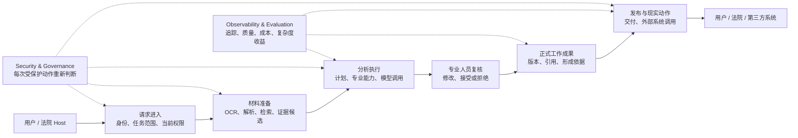

# Zuno 目标架构：一项法律任务如何从材料变成可交付结果

Zuno 是一个面向法律工作的智能 Agent 平台。项目需要承担的业务约束在 [`docs/project/README.md`](../project/README.md) 中展开：材料范围可能不完整，RAG 会发生漏检和来源错配，模型可能生成不可靠结论，专业人员需要承担最终判断，任务可能长期运行，外部系统交互又会把一次网络异常转化为现实世界的不确定性。

Architecture 负责回答下一步：**为什么这些领域问题不能仅靠更大的 Prompt、固定 Workflow 或一个统一 `status` 解决，系统又应怎样划分责任，才能在材料、权限、模型和现实状态持续变化时保持可解释、可恢复和可审计。**

下面描述的是 Zuno 当前接受的 **Target Architecture**。它解释系统应该怎样分工，不代表这些能力已经全部在 Current 代码或真实法院环境中验证。Current 做到哪里，只看 [`docs/evidence/`](../evidence/README.md) 中的代码、数据库迁移、测试、运行追踪和评测证据。法律 AI / RAG 的外部领域问题证据整理在 [`docs/research/legal-ai-domain-problem-evidence.md`](../research/legal-ai-domain-problem-evidence.md)，研究资产与最新 Agent 技术的产品化推导见 [`docs/research/legal-agent-value-strategy-2026-09.md`](../research/legal-agent-value-strategy-2026-09.md)。

<!--
status: normative-target
architecture_state: ACCEPTED_TARGET
overall_architecture_state: ROUND_02_FROZEN
target_logical_module_count: 9
final_module_count: 9
module_decomposition_gate: OPEN
module_design_baseline: AVAILABLE_V1
module_deep_design: AVAILABLE_V2
module_deep_design_coverage: 9/9
cross_module_consistency: AVAILABLE_V1
module_detail_freeze: NOT_YET
implementation_authorization: NO
owner: Cross-cutting Architecture Owner
canonical_question: Zuno 作为一个长期法律智能工作系统，应该怎样划分事实权威、执行控制、知识能力、安全和现实副作用，使系统可以解释、恢复和演进？
project_source: docs/project/README.md
module_source: docs/modules/
decision_source: docs/decisions/
evidence_source: docs/evidence/
research_source: docs/research/
-->

## Part A — Human Narrative（人类技术叙事）

### 从业务约束推导架构责任

Zuno 的九个责任域不是为了得到一张完整的架构图而预先划分出来的。每一类责任都对应一种长期存在、且普通 request / response 系统无法稳定承担的专业事实或恢复要求。

| 业务约束 / 领域问题 | 最简单方案 | 简单方案的失效条件 | Zuno 的架构责任 |
| --- | --- | --- | --- |
| 材料很多、版本会变，检索还可能漏掉关键内容或选错来源 | 文件上传后直接做 RAG | 上传成功不代表关键材料已经可用；Top-K 命中也不能证明覆盖完整 | **Knowledge & Evidence** 保存材料版本、加工状态、任务级就绪、候选证据和稳定来源 |
| 模型和检索结果可能表达流畅但专业结论仍然错误 | 把模型最终文本直接保存 | hallucination、错误引用、部分证据被写成确定事实，且最终责任无法归属 | **Legal Domain & Work Product** 把机器候选和正式业务结果分开，并保存必要人审与历史版本 |
| 多步骤任务会等待，新证据会进入，旧结果会晚到 | 一条固定 Workflow + Checkpoint | Checkpoint 只知道流程走到哪里，不能判断旧结果是否仍然适用，也不能证明正式提交已经成功 | **Agent Runtime & Control** 管理 Plan、Replan、等待、取消和恢复，但不替代业务事实 |
| 研究模型、LLM 和 Provider 会替换、漂移或临时不可用 | 每个调用点直接绑定 model / Python class | 专业语义、fallback、质量与成本散落在 Workflow 中；替换实现会迫使上层一起变化 | **Capability & Skill** 固定专业能力承诺，**Model Gateway** 管理实际模型选择、调用和 Usage |
| 权限、用途和数据外发条件会在长任务期间变化 | 入口处鉴权一次 | 10:00 允许不代表 10:20 仍允许读取、外发或执行高风险动作 | **Security & Governance** 在新的受保护动作发生时消费当前安全条件 |
| 外部 POST timeout 后，系统无法确认现实世界是否已经被改变 | timeout 就标 Failed 并 Retry | 远端可能已经成功，盲目重试会制造第二次业务动作 | **Tool Runtime & Effects** 在发送前稳定动作身份，未知结果先 Reconcile，需要撤回时再执行新的补偿动作 |
| 不同环节各自存在“成功”，崩溃后容易被压成一个错误状态 | 一张全局状态表 | Runtime complete、Domain committed、Delivery success 和当前授权分别代表不同事实，恢复方向也不同 | 每类事实由明确 Owner 负责；跨边界通过版本、因果关联和完成证明收敛；**Application** 只把这些事实组合成产品状态 |
| GraphRAG、Memory、Reflection、Specialist 等复杂机制可能长期保留却没有稳定收益 | 默认开启更多能力 | 成本、时延和故障面增加，却不一定改善法律质量或人工效率 | **Observability & Evaluation** 通过可重复 Eval、消融和退出条件决定复杂度是否值得保留 |

这张表构成总体架构的设计驱动因素。后面的九个责任域只是这些约束长期存在以后形成的稳定分工；逻辑责任不等于九个微服务，也不意味着每个简单请求都必须经过全部模块。

一个同样重要的边界是：**通用 Agent Harness 本身不应成为 Zuno 的长期差异化来源。** 长会话、持久执行、沙箱、Subagent、MCP、Context Compression 和通用 Agent Eval 正在快速成为成熟平台能力。只要这些基础设施能够满足可靠性与数据安全要求，Zuno 应优先复用，并把长期自有责任集中在法律任务结构、Research Capability、Provider Qualification、材料与证据 Provenance、专业人员决定、正式 WorkProduct 和法律任务 Evaluation 上。通用 Harness 可以被替换，这些专业语义不能随框架一起漂移。

### 先看全貌：Zuno 在一项法律任务里做什么

假设用户要分析一宗合同争议。他上传合同、补充协议、聊天记录、扫描附件和后来补交的证据，希望系统整理付款义务、违约事实、证据引用和一份可供专业人员复核的分析结果。

这项任务从进入系统到真正交付，大致经过五步：先确认谁在做什么、能看哪些材料；再把原始材料处理成可检索的知识；然后组织模型和专业能力完成分析；需要长期保留的结论经过人工与业务规则确认后形成正式工作成果；最后再发布给用户或送往外部系统。任何一步出错，恢复时都要知道应该相信哪一类记录，而不是从头猜一遍。

这条主链背后由九个逻辑责任域协作。Application 负责入口和交付，Knowledge 负责材料与证据，Runtime 联合 Capability 和 Model Gateway 组织分析，Legal Domain 保存正式结果，Effects 处理真正改变外部世界的动作；Security 和 Evaluation 横跨整条链。九个责任域表示**谁长期负责什么**，不是九个微服务。

默认实现可以是一个模块化 Python 后端，加少量按照工作类型划分的 Worker；只有吞吐、安全隔离、网络出口、故障半径或发布节奏真的要求时，某些部分才值得拆成独立网络服务。

### 一个合同争议任务怎样跑完

请求先进入 Application。这里负责稳定用户看到的任务身份、查询入口和交付方式，但它不会自己决定“法律结论已经正式成立”或者“外部系统已经执行成功”。这些结论要由真正负责那类事实的部分证明。

Security 随后检查当前用户、Matter、材料范围和用途是否允许继续。这个检查不是只做一次。一个长任务可能在十分钟后重新读取材料、向模型外发内容、获取 Secret 或调用高风险工具；如果权限在等待期间发生变化，新的受保护动作必须重新按当前条件判断。

材料进入 Knowledge 后，系统完成 OCR、解析、切分、Embedding、图结构或其他索引工作。这里最容易出现一个误解：**文件上传成功不代表当前问题已经可以回答。** 查询“合同第 8 条写了什么”只需要对应合同可用；分析全案违约金额时，一份还没 OCR 的补充协议可能会改变结论。所以 Zuno 既要知道材料处理到了哪一步，也要判断“对这个具体任务来说，现在是否已经够用”。

如果只是一个短问题，流程可以到这里直接检索、调用模型并返回答案，不必启动复杂 Agent。真正需要等待、多步骤分析、人工介入或后续恢复的任务才交给 Runtime。Runtime 负责当前计划、步骤依赖、等待、取消和重规划，但它管理的是**执行过程**，不是正式法律事实。为了避免两套计划同时被激活，Target 让当前计划只有一个逻辑写者负责激活和 Replan，工程上称为 `Single Controller`；这个“单一”只限制控制事实，不限制 Worker、模型和专业分析并行。

Runtime 调用两类可替换能力。Capability 表示“事件抽取、冲突识别、类案检索”这类专业任务对上层承诺什么；具体实现可以是研究模型、规则、LLM 或外部服务。Model Gateway 则负责实际模型调用：在安全、质量、预算和可用性允许的范围里选择 Provider / Model，并记录真实调用和 Usage。这样更换模型或研究实现时，不需要让整个业务流程重新学习一遍专业语义。

机器完成分析以后，结果仍然只是候选。专业人员可能修改事实、接受一部分判断、拒绝另一部分。如果这些内容要成为长期保存、可以交付和以后追责的正式工作成果，它们会进入 Legal Domain & Work Product，由法律业务规则和必要人审决定哪些内容正式成立。工程上把“候选结果正式进入长期业务历史”的提交边界称为 `Formal Admission`。正式形成的 `WorkProduct` 会保留自己的版本、引用和形成依据，而不是只保存“最后一次模型输出”。

结果需要离开 Zuno 时，Application 负责“该向谁发布哪一版”，Tool Runtime & Effects 负责“现实世界到底发生了什么”。这里把可能改变外部世界的动作及其结果统称为 `Effect`。例如向外围法院系统提交一条记录，HTTP timeout 只能说明 Zuno 没拿到确定响应；远端可能没执行，也可能已经成功。系统必须先确认现实结果，再决定是否重试、结束或补偿，不能把网络错误直接变成第二次业务提交。

Observability & Evaluation 横跨整条链路。它记录 Trace、时延、成本和质量指标，也负责比较 GraphRAG、Reflection、Memory、Specialist 或更贵模型到底有没有稳定收益。但 Trace 只是解释执行发生过什么，不能替 Domain 宣布法律结果已经成立，也不能替 Effects 宣布外部动作已经发生。

### 为什么普通 RAG 和固定 Workflow 会在长任务里失效

如果材料固定、请求很短、没有正式业务提交，也不调用会改变外部世界的工具，受控 RAG 或固定 workflow 已经足够。Zuno 的复杂度来自这些简单假设开始失效。

第一种失效发生在**材料变化**。分析已经运行二十分钟，新证据突然进入；旧计划里的一个分支又在此时返回。这个结果可能计算得很好，却仍然基于旧材料。系统不能仅凭“模型成功”就继续采用，也不能因为“晚到了”就一律丢弃。它需要知道结果基于哪一版输入、当前计划是否已经改变，再决定继续使用、重新验收还是重做。

第二种失效发生在**正式业务提交和运行进度不同步**。专业人员已经确认结果，正式 WorkProduct 已经写入数据库，但 Runtime 还没来得及保存新的 Checkpoint 就崩溃。重启后如果只相信旧 Checkpoint，系统会再次提交同一份正式结果。正确恢复顺序是先问拥有业务事实的一方：“这次提交已经发生了吗？”已经发生就修 Runtime 的进度，没有发生才重新进入提交路径。

第三种失效发生在**外部副作用**。一个 POST 已经发出但响应丢失，本地看见 timeout。纯计算失败通常可以 Retry；现实动作已经可能发生时，第一步必须是 Reconcile——先查清过去发生了什么。只有确认远端没有执行，才有资格安全重试。

第四种失效发生在**时间变化的权限和有效性**。任务 10:00 启动时允许读取附件，10:15 权限被撤销，10:20 Worker 又准备向外部模型发送正文。入口处那次鉴权已经不能替 10:20 的新动作做决定。同样，昨天正式成立的结论今天可以因为新证据变成 stale；历史仍然存在，但当前不应继续使用。

这些故障解释了为什么 Zuno 不能只维护一个 `status = success`。计算完成、正式结果成立、外部动作完成、当前仍允许访问，是四件发生在不同时间、由不同事实证明的事情。

### 九个责任域从这条业务链里自然分出来

当这些问题同时出现以后，系统长期需要回答九类不同的问题。它们是责任边界，不是固定的部署边界。

| 责任域 | 在主链里的位置 | 对陌生读者最直接的理解 |
| --- | --- | --- |
| **01 Application & Integration** | 请求进入、查询、发布、交付 | 接收外部请求，把多个内部事实组合成用户能理解的产品状态 |
| **02 Legal Domain & Work Product** | 人审后的正式结果 | 保存正式法律业务事实、人工判断、WorkProduct 历史以及后续失效关系 |
| **03 Knowledge & Evidence** | 材料准备与证据 | 把材料加工成可检索知识，判断当前任务是否准备好，产生证据候选与引用来源 |
| **04 Agent Runtime & Control** | 长任务分析 | 管理计划、步骤、等待、取消、Replan 和恢复 |
| **05 Capability & Skill** | 长任务分析 | 定义专业能力的稳定语义，并管理不同实现当前是否有资格提供它 |
| **06 Tool Runtime & Effects** | 发布后的现实动作 | 管理可能改变现实世界的动作、尝试、结果未知和对账 |
| **07 Model Gateway** | 长任务分析 | 在允许的模型中做路由，记录真实 Provider / Model 调用、失败和 Usage |
| **08 Security & Governance** | 横跨整条主链 | 判断此刻能不能继续读取、外发、取 Secret、审批或执行受保护动作 |
| **09 Observability & Evaluation** | 横跨整条主链 | 记录执行时间线，评价质量、成本和复杂机制是否值得保留 |

Platform / Infrastructure 不作为第十个业务模块。PostgreSQL、Object Store、Queue、Checkpointer、Secret Manager、身份系统、OpenTelemetry 和模型 SDK 都是可复用的工程基础设施。它们提供事务、存储、队列、身份和观测能力，但不会替 Zuno 决定“哪份法律结论正式成立”或“一个外部动作究竟发生了没有”。

### 系统里保存的不是一种“状态”

Zuno 会同时保存几类恢复价值完全不同的数据。

最重要的是不能靠重算找回的业务历史：正式材料版本、人工判断、经过业务接纳的 Evidence / Finding（正式证据与事实判断）、WorkProduct，以及证明一次正式提交已经发生的记录。这些内容构成长期业务历史，服务重启、索引重建或模型升级都不能把它们覆盖掉。

第二类是可以从原始材料重新生成的知识派生，例如 OCR 结果、chunk、Embedding、graph 和索引。它们可以随着算法升级而重建，但新的知识代次（generation）没有完整验证以前，不能把当前可服务版本替换成半成品。

第三类是 Runtime 的控制状态：Plan、Step、等待、Checkpoint 等。它们让长任务可以恢复，但不是业务真相。如果 Runtime 的记录和更强的 Domain / Effect 事实冲突，恢复时先相信真正拥有事实的一方，再修 Runtime 投影。

第四类是外部 Effect 与安全治理记录。外部系统一旦可能已经被改变，本地数据库回滚也不会让现实世界倒流；Security 的当前授权可以重新计算，但已经发生的审批、审计或外部动作历史不能被普通日志覆盖。

Cache、UI projection 和大部分可重建观测数据放在更低层。它们可以加速查询和展示，却不能因为“缓存里还是旧状态”就要求业务世界退回旧版本。

### 一致性不靠一笔覆盖全世界的事务

一次法律任务可能同时接触 PostgreSQL、Object Store、索引、Queue、Checkpoint、模型 Provider 和外围法院系统。让这些参与者加入一笔全局事务既不现实，也会把系统可用性绑在最慢的外部依赖上。

Zuno 的做法是把强一致缩到真正拥有事实的局部边界。Domain 在自己的事务里保证一次正式提交完整成立；Knowledge 只有在一代索引完整验证后才切换 serving；Runtime 只串行化自己的控制事实；Effects 在发送现实动作前固定动作身份；Security 保存当前授权和审批事实。

跨这些边界以后，系统靠稳定身份、版本、因果关联（causation）和可查询的完成证明收敛。也就是说，一个结果要进入更强状态，必须拿出对应 Owner 能证明它成立的事实。没有证明，就停在候选、等待、未知或拒绝，而不是为了让流程继续而猜一个 `success`。

正式结果还有更严格的一层要求：它依赖的材料、知识、专业能力、人审和安全条件必须组成一个业务上仍然成立的因果链。每个引用单独存在，并不代表它们拼在一起就是一个合法结果。新材料、专业语义或安全条件真的改变了结论前提时，需要拒绝、复核、重新验收或 Replan，而不是把互相不兼容的版本硬拼成新的 WorkProduct。

### 有些事情发生以后，系统只能向前修正

在正式提交之前，很多计算都可以推倒重来。候选分析可以重新生成，失败的知识构建可以丢弃，旧计划可以被新 PlanVersion 取代。

一旦完成正式业务接纳（Formal Admission），情况就不同。WorkProduct 已经正式成立，后来的 Cancel 或 Replan 只能影响未来工作，不能把历史改成“这件事从未发生”。如果新证据改变结论，系统形成新版本、失效或 supersession 关系，同时保留旧版本当时为什么成立。

外部 Effect 更明显。一个动作一旦已经可能到达外围系统，后来的计划变化没有资格假装现实世界也一起回滚。结果未知时先 Reconcile；如果已经确认发生而业务又需要撤回，就发起一项新的受控动作或 Compensation。补偿本身也有新的授权、执行尝试和结果，它不是修改旧记录说“之前没发生”。

这也是 Zuno 区分**历史事实**和**当前资格**的原因。历史上发生过的提交、交付和外部动作通常只能继续追加新事实；“现在还能不能访问”“当前哪一版仍有效”“下一步是否允许执行”则可以随着新的证据或安全条件改变。

### 模型可以变化，审计仍然要成立

外部模型不是稳定的数学函数。同一个 model name 可能在 Provider 后台升级；即使模型完全不变，采样和服务端实现也可能让相同输入产生不同文本。因此 Zuno 不把“几年以后重新跑出同一段答案”当作法律工作可审计的前提。

真正需要保存的是当时的决策依据：用了哪些材料和版本、哪一代知识与哪个专业能力参与了分析、实际调用了哪个 Provider / Model、模型当时返回了什么、专业人员修改和接受了什么、接纳时哪些条件成立，以及最终哪一版结果被正式保存和交付。

如果某个 Provider 能提供不可变快照，并且执行足够确定，当然可以增加更强的 replay；没有这个条件时，后来的 rerun 只是新的计算，可用于回归评测或重新分析，不能覆盖历史上真实发生过的模型调用、人工判断和正式业务接纳。

### 默认部署先保持简单，再按真实瓶颈拆

九个责任域默认不对应九个服务。更合理的起点是**模块化 Python 后端 + 按工作类型划分的 Worker + 成熟基础设施**。

Application、Domain、Runtime 控制和相邻业务逻辑可以先共处同一个后端进程。OCR / ingestion、Knowledge rebuild、模型调用、外部 Tool、Eval 等工作在资源特征或故障隔离需要出现后，再拆成独立 Worker。只有独立扩缩容、安全隔离、网络出口、Secret isolation、故障半径、合规或发布生命周期带来明确收益时，某个逻辑模块才值得继续拆成独立网络服务。

扩容也按真正的瓶颈处理。OCR 堵塞就增加 ingestion Worker；索引重建吃满 CPU / GPU 就扩 Knowledge Worker；模型受 Provider quota 限制时，增加本地进程并不会增加远端配额，应该做 admission、quota、fallback 和预算控制；外围系统限流时，Effects 要限制并发并向上游传播 Backpressure，而不是让更多 Worker 一起重试。

简单问答同样不应该承担长任务的全部成本。只要材料范围清楚、没有正式提交、没有现实副作用，Generic Host + 受控 RAG + Legal Backend 就可以继续是最小形态。GraphRAG、Reflection、长期 Memory、Specialist 和更完整的 Native Runtime 只有在可重复 Eval 中证明稳定收益时才应该保留。

### 故障恢复时，先找真正发生过的事实

恢复顺序可以用三个场景记住。

如果 Domain 已经提交正式 WorkProduct，但 Runtime Checkpoint 还停在旧位置，先确认 Domain 的正式提交，再修 Runtime；不能因为 Checkpoint 旧就重复提交。

如果外部 POST 超时，先确认远端 Effect 是否已经发生；没有确认之前保持 Unknown，不盲重试。

如果新 Evidence 让旧 WorkProduct 失效，保留旧版本的历史，再形成新的 invalidation / review-required 事实，并让 Application 把当前有效版本传播给外部消费者。已经发生的历史交付不会因此从记录里消失。

同一原则也适用于更大的故障。数据库 failover、Queue 重投递、索引损坏或整站恢复时，优先保护无法重算的 Domain、Effect、Security / Audit 和稳定身份；Runtime 控制状态随后修复；Knowledge 派生和 Cache 在源材料仍然存在时可以重建。真实 RPO / RTO、HA / DR、takeover / fencing 和 backup restore 只有形成对应测试与演练证据以后，才有资格写成 Current 能力。

### Current / Target / Evidence / Unknown

**Target：** Zuno 当前接受的总体设计是九个逻辑责任域。它们围绕材料与知识、长任务控制、正式业务事实、模型与专业能力、安全治理、现实副作用和质量评测协作。默认部署保持模块化，复杂度只在长期状态、故障恢复、安全或现实副作用真的出现时增加。

**Current：** 代码库已经包含部分 Agent、Knowledge、Model Gateway、Tool、评测和基础设施实现，也存在真实 PostgreSQL 与 selected GitHub verification 证据。某一项 Target 是否已经实现，不能从这篇设计文档反推，只能回到 [`docs/evidence/`](../evidence/README.md)、代码、Migration 和测试判断。

**Evidence：** 历史工作可以证明部分 PostgreSQL 迁移、知识流水线、GraphRAG 实验、Context / Memory、Tool Calling、模型调用和 Eval 基础能力。它们证明局部工程事实，不证明九个 Target 责任域已经全部落地，也不证明 Production Ready。

**Unknown：** 正式 Domain Admission、跨 Owner 的完整 crash recovery、外部 Effect 最终对账、完整持续授权、真实容量、Backpressure / fairness、RPO / RTO、HA / DR 和法院侧完整生产结果仍需要对应 Evidence。

单个责任域的连续说明见 [`docs/modules/`](../modules/README.md)；需要精确查看 Authority、Contract、状态、完成证明和恢复规则时，再进入 [`reference.md`](reference.md)。长期设计理由在 [`docs/decisions/`](../decisions/README.md)，研究候选在 [`docs/research/`](../research/README.md)。